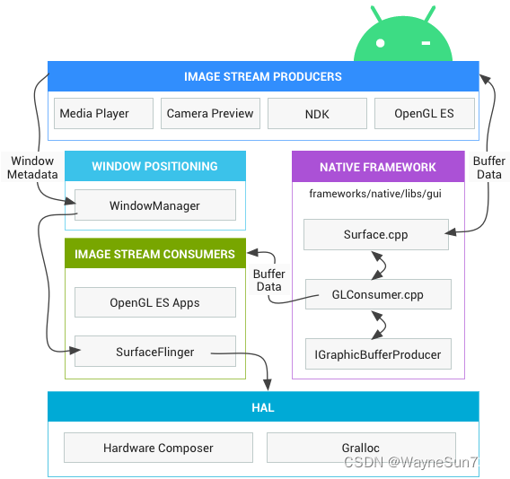
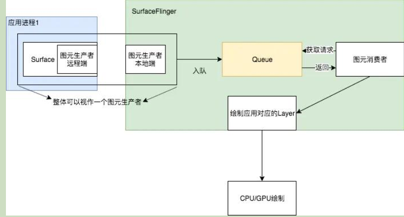
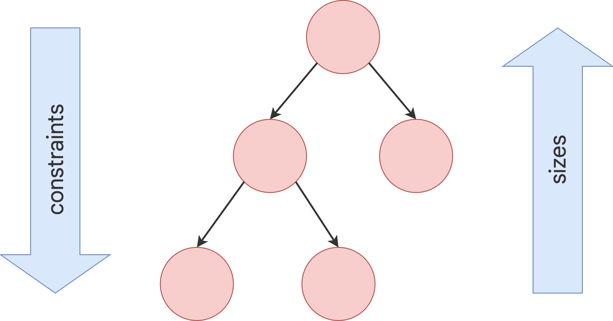

# 目录


# 图形


# 系统（脱离安卓来看）

## 图形系统0层


图片来源：

>      [深入理解Android图形系统](https://mp.weixin.qq.com/s/LVVR1IGrn_PopGUkefjKvA ),   [Linux阅码场](javascript:void(0);)


对于任何图形系统（~~抛开安卓不谈~~），**为什么需要这些？  不得不**：

>  **GUI需要**：
>
> 1、Render系统：
>
> ​                       作用： view界面数据 到Buffer上（~~实际上是绘制控件~~）： 即 <font color='red'>执行GUI的绘图指令集</font> 
>
> ​                        位置：Render线程
>
> 2、window系统 ： （1）窗口的管理器 ，对于安卓，位于WMS 中
>
> ​                                 （2）窗口的合成器 ---->  注：对于安卓是surfaceFlinger
>
> 3、DisPlay系统： 
>
> ​                       作用：把Buffer的位图显示出来
>
> ​                        位置：内核驱动

总之：

图形系统 = window系统 + Render系统 + DisPlay系统


## 图形系统1层

render系统:  1、是以 lib（.so）形式存在   2、运行时：在App GUI进程里


### **渲染系统**

目标：

> view数据转buffer数据


基于目标，渲染引擎有哪些？

> 2D引擎 Skia，3D引擎 OpenGL ES，RenderScript，OpenCV和Vulkan


### Window系统（图形视角）

目标：

> 区别各个窗口之间
>
> 协调各窗口之间的关系


### 显示系统

目标：

将buffer数据，最终到显示屏上


## 基于1层------窗口系统：

HWC：

> 每一层对应一个驱动  /dev/fbx
>
> ```cpp
>  # ls -la /dev/graphics
>  .
>  ..
>  fb0
>  fb1
>  fb2
> ```
>
> APP操作某层，直接写对应的FrameBuffer  
>
> 硬件直接自动合成他们


Display control：是个什么？？？TODO

> Exynos 4412 SCP_Users Manual_Ver.0.10.00_Preliminary0.pdf


# 显示驱动模型DRM架构介绍（一）

https://www.eet-china.com/mp/a178945.html          [**** Linux阅码场](https://www.eet-china.com/mp/u3946005)


# 好的图形文章

https://mp.weixin.qq.com/s?__biz=MzUyMjI5OTU1Ng==&mid=2247484433&idx=1&sn=57e262d2c555e579943e2d4504de2b2c&chksm=f9ccb5dacebb3cccc91fb3c0a785bc0b71ce8a16754de1745005e10a95e34bd1ad6d3e280d63&scene=178&cur_album_id=3231071844901011460#rd           系列文章

> 图形基础系列 Android Graphics 显示系统 - 开篇 Android Graphics 显示系统 - 基本组件（一）
>
> Android Graphics 显示系统 - 基本组件（二）
>
> Android Graphics 显示系统 - 基本组件（三）
>
> Android Graphics 显示系统 - Surface绘图示例（四）
>
> Android Graphics 显示系统 - Surface绘图示例（五）
>
> Android Graphics 显示系统 - 建立SurfaceFlinger通信的流程（六）
>
> Android Graphics 显示系统 - SurfaceFlinger的启动与初始化（七）
>
> Android Graphics 显示系统 - SurfaceFlinger MessageQueue机制（八）
>
> Android Graphics 显示系统 - 创建Surface流程（九）
>
> Android Graphics 显示系统 - 初识BufferQueue（十）
>
> Android Graphics 显示系统 - ANativeWindow/Surface/SurfaceControl（十一）
>
> Android Graphics 显示系统 - BufferQueue的工作流程（十二）
>
> Android Graphics 显示系统 - BufferQueue的工作流程（十三）
>
> Android Graphics 显示系统 - BufferQueue的工作流程（十四）
>
> Android Graphics 显示系统 - BufferQueue的工作流程（十五）
>
> Android Graphics 显示系统 - Surface补充知识（十六）
>
> Android Graphics 显示系统 - SurfaceView与BufferQueue关系（十七）
>
> Android Graphics 显示系统 - Gralloc架构及GraphicBuffer创建/传递/释放（十八）
>
> Android Graphics 显示系统 - 简述Allocator/Mapper服务的获取流程（十九）
>
> Android Graphics 显示系统 - GraphicBuffer同步机制-Fence（二十）
>
> Android Graphics 显示系统 - SurfaceFlinger的GPU合成（廿一）
>
> Android Graphics 显示系统 - 导出图层数据(dump graphic raw data)（廿二）
>
> Android Graphics 显示系统 - 基础知识之 BitTube（廿三）
>
> Android Graphics 显示系统 - SurfaceFlinger之VSync-1（廿四）
>
> Android Graphics 显示系统 - SurfaceFlinger之VSync-2（廿五）
>
> Android Graphics 显示系统 - SurfaceFlinger之VSync-3（廿六）
>
> Android Graphics 显示系统 - HWC HAL的初始化（廿七）
>
> Android Graphics 显示系统 - 聊聊屏幕刷新机制（廿八）
>
> Android Graphics 显示系统 - HWC 探秘 - 1（廿九）
>
> Android Graphics 显示系统 - HWC 探秘 - 2（三十）
>
> Android Graphics 显示系统 - HWC 探秘 - 3（三一）
>
> 原文链接：https://blog.csdn.net/u010542873/article/details/136080207

https://blog.csdn.net/jxt1234and2010/category_2826805.html         Android图形显示  系列文章

https://www.51cto.com/article/717713.html    深入理解Android图形系统   ---------->  图很好

总的结论：图形系统 与 输入系统，一上一下

TODO: opengl 与 skia之间到底什么关系？？？？？？？为什么3D要使用它？功能是啥

https://blog.csdn.net/tianzhaoai/article/details/128943124?spm=1001.2101.3001.6650.5&utm_medium=distribute.pc_relevant.none-task-blog-2~default~BlogCommendFromBaidu~Rate-5-128943124-blog-136080207.235^v43^pc_blog_bottom_relevance_base7&depth_1-utm_source=distribute.pc_relevant.none-task-blog-2~default~BlogCommendFromBaidu~Rate-5-128943124-blog-136080207.235^v43^pc_blog_bottom_relevance_base7&utm_relevant_index=10#:~:text=整体分为 App 进程和系统进程两个部分

-----------------> 化简图


# ===安卓源码分析=====


# View/ViewGroup

view

（G:\working_pan\doc_my\Draw\view_viewGroup.eddx）

其中，`Graphic与Input`是核心 ,  与用户交互的两个功能点：看和触摸

## 功能点0层

见li 11


## UI刷新 -invalidate

### 流程图：


`关键函数：vsync信号`

> 1、必然有请求：   ~~invalidate -----> scheduleTraversal~~： 请求vsync、设置同步屏障。
>
> 2、必然有执行:    ~~perform................~~           绘制、 取消同步屏障？


新增枝叶：
1、为了给 vsync信号 带来的 vsync msg  让道， 请求vsnc的同时（自然），插入同步屏障：

--------》见handler 同步屏障


必然：

1、所有 控件的 invalidate操作，最终都  转接到 ViewRootImpl的invalidate   (设计模式上，单一职责)

### 调用栈角度：

1、请求：


2、vsync信号来后，执行：

等到VSYNC到来后， 会移除同步栅栏 ----- 》  TODO: 具体哪里？


todo：很奇怪，这里为啥涉及到两次 消息？


### 关于首帧


#### 首次 View 的绘制流程是在什么时候触发的?----> 即首帧的触发

Activity  Resume时-> WindowManagerImpl.addView -> WindowManagerGlobal.addView-> ViewRootimpl.setView -> ViewRootimpl.requestLayout ->ViewRootImpl.scheduleTraversals 


####  onResume函数中度量的高有效?

 Activity第一次调用onResume的时候是无效的 

Activity第二次之后调用onResume是有效


因为首次request vysn是在addwindow过程中（viewrootimpl的setview）
下一帧，才真正绘制（包括测量、layout、draw）


## 性能方面的优化：

房间中椅子坏了，不会换整个房子
局部刷新：dirty脏区


## 面试题：

### 多次invalidate  会刷新几次？

代码上： 有标致


设计上：是不得不的。 因为vsync信号，从上到下隔离


```java
1.onResume函数中度量的高有效?


2.Activity, Window,View三者的联系和区别? 

3. 首次 View 的绘制流程是在什么时候触发的?

 
4.我们调用invalidate()之后会马上进行屏幕刷新吗?

5.我们说丢帧是因为主线程做了耗时操作,为什么主线程做了耗时操作就会引起丢帧?

问题1和问题3和问题4，是一个东西
因为首次request vysn是在addwindow过程中（viewrootimpl的setview）
下一帧，才真正绘制（包括测量、layout、draw）
```


### Activity, Window,View三者的联系和区别? 


### 关于首帧问题

见《关于首帧》


### 我们调用invalidate()之后会马上进行屏幕刷新吗?


### 我们说丢帧是因为主线程做了耗时操作,为什么主线程做了耗时操作就会引起丢帧?

### 都有消息屏障，为什么还会掉帧呢？

因为消息屏障之前的消息（具体指哪些？），还会执行的
主线程加的消息屏障


# Grapics


## 0层框架-----系统数据流向：



参考:  https://blog.csdn.net/qq_45254908/article/details/125449470


0层框架中的角色：

1、~~image stream produceers  图像流生产者（见图）~~ ， 即生成BufferData的：

> <font color='red'>OpenGL ES</font>、NDK(即<font color='red'>Skia)</font>、Canvas 2D 、 mediaserver等。
>
> 例：  draw方法把  绘制指令 通过canvas传递给framework层的RenderThread线程，`在buffer上绘制`

  两种生产方式：

（1）   NDK（Skia），OpenGL ES是通过自身的绘制能力生产的图像数据

（2）   MediaPlayer和Camera Preview是通过直接读取图像源来生成图像数据

2、 ~~image stream consumers 图像流消费者~~，消费 BufferData的：

> **SurfaceFlinger：** 消耗当前可见的Surface（对应的buffer数据）+  不同buffer数据  合成到屏幕 （**自然，是根据图中 WMS 提供的window信息**）
>
> OpenGL ES 应用也可以消费：例如相机应用会消耗相机预览图像流 ------>  TODO: 证明 并没有经过 SurfaceFlinger


显示子系统的硬件抽象实现，在HAL中：

> 负责协助消费者把图形数据展示到设备屏幕。


图形[内存分配](https://so.csdn.net/so/search?q=内存分配&spm=1001.2101.3001.7020)器 (Gralloc) ：

> 分配图像生产方请求的内存


缓冲区 Buffer Queue：

TODO: 这个到底是啥？  下面图到底是个啥？


可以大概看到BufferQueue的工作过程：  TODO

BufferQueue 类是 Android 中所有<font color='red'>图形处理操作的核心</font>。它的作用很简单：将生成图形数据缓冲区的一方（生产方）连接到接受数据以进行显示或进一步处理的一方（消耗方）。

即：Android中的图像生产者OpenGL，Skia，Vulkan将绘制的数据存放在图像缓冲区中，Android中的图像消费SurfaceFlinger从图像缓冲区将数据取出，进行加工及合成


https://www.androidperformance.com/2020/02/14/Android-Systrace-SurfaceFlinger/#/BufferQueue-%E9%83%A8%E5%88%86


注意：

1、 一个可见APP对应一个BufferQueue（有backBuffer和frontBuffer）

2、frontButter是要 经过 SurfaceFlinger合成  TODO: 证明


## 硬件框架


出自：《1-1_11_显示系统框架_framebuffer原理及改进.wmv》


TODO: 

> DisplayControl的作用：把FrameBuffer数据搬到LCD上 ----------> TODO: 待验证
>
>  操纵LCD去读取FrameBuffer？
>
> 显示驱动？到底指的是哪块功能？


只有一个FB的问题：FrameBuffer（FB）被应用写，同时被DisplayControl读取：

> 


屏幕大小 <------------>  内存的关系：

> 屏幕上一个像素16位 ，即 2字节   ----> 内存Buffer： 800\*600\* 2字节  


## 0层框架


1、贯穿0层框架的**主线buffer：**

buffer的获取，填充完的buffer流转过程


2、基于0层框架，自然：

（1）数量关系：

1个 window ： 1个surface：一个bufferQueue（三个buffer）：一个bufferQueueLayer

注意：给到surface的 是一个buffer

即surface是对buffer的封装 ，一个surface内部具有多个buffer


TODO: 上述的buffer与frameBuffer什么关系？frameBuffer应该是一个屏幕大小

frameBuffer有几个？


三缓冲，处于0层框架什么位置？

> <font color='red'>BufferQueue中</font>:  **SurfaceFling 消费 FrontBuffer，GPU 使用一个 BackBuffer，CPU使用一个 BackBuffer**  ----->  TODO: GPU在软件上是怎么调用的？CPU 怎么调用的？
>
> 硬件图：


出自： https://androidperformance.com/2019/12/15/Android-Systrace-Triple-Buffer/#/Android-%E7%89%88%E6%9C%AC-lt-Android-P


TODO:

0层架构图  与 硬件图中  CPU和GPU 什么关系？ 如何整合到一起表达？？？？？？？？？？】


## 0层纵向


自然：

1、Render线程--> SurfaceFlinge进程： 跨了进程

所以，不得不：BufferQueue中的<font color='red'> backBuffer </font> 通过Binder的形式提供给了<font color='red'>APP的Render</font>线程
（TODO，核心:Binder 如何流转给APP的？！！！！）

2、App 是**生产者**，负责填充显示缓冲区（Buffer）；SurfaceFlinger 是**消费者**，将各个进程的显示缓冲区做合成操作。

3、触发点：vsync信号过来，view.onDraw


## 1层框架


来自： https://www.jianshu.com/p/37370c1d17fc

## 三缓冲+vsync：从显示屏显示讲起，为什么要这么设计

### 背景：

**屏幕刷新率（即屏幕读取速率）：**

1、<font color='red'>固定</font>是16.67ms （永恒不变的）

2、<font color='red'>其 物理本质就是 逐行扫描 的时间</font>：显示器并不是一次性将<font color='red'>显存里的数据</font>显示到屏幕上，而是从左到右边，从上到下逐行扫描，顺序显示整屏的一个个像素点（硬件 晶体管），不过这一过程快到人眼无法察觉到变化。

沿着帧缓冲区  逐行扫描： 注意，这里的内存实际上是显存（GPU的）


vsync信号 ： 

> 1、<font color='red'>硬件天然存在</font>的（在硬件侧可能不叫vsync），与是否发给软件无关。注意区别 vsync信号 与vsync机制
>
> 2、<font color='red'>标致</font>着屏幕开始扫描


**系统帧速率FPS（即CPU+GPU 合成数据速率）：**  代表了<font color='red'>系统在一秒内合成的帧数</font>,    该值的大小由系统算法和硬件决定   (没有vsync时，其实不是固定的)


两者的关系造成的问题（没有vsync和双缓冲机制的话），**胖子吃面包模型**：

①屏幕刷新速率比系统帧速率快  

胖子吃的很快，面包不够  ------>   「造成一帧显示多次,也就是**卡顿。**」

②系统帧速率比屏幕刷新率快

胖子吃的慢，面包很多就吃了一半  ------>     「造成屏幕上显示多帧,也就是**屏幕撕裂**。」

③系统帧速率 快很多

胖子很多面包没吃就跳过了   ------>      **跳帧**

------------------》 **一句话总结vsync**：  卡顿、撕裂、跳帧  就是<font color='red'>Vsync设计的初衷</font>


为啥绘制阶段，也用到了GPU?  Todo


### 问题1：帧缓冲区同时读写，会造成画面的撕裂

问题1：并发问题（存在临界资源 竞争问题）


解决问题1，不得不：

>  双缓冲机制： fontBuffer、backBuffer   -------》 并发，性能高：<font color='red'>可以一个写一个读，之后，两个交换指针</font>
>
>  加锁： 太耗费性能，而且 不能同时 读和 写 ----》 不是并发

引入<font color='red'>双缓冲机制：</font>


双缓冲的位置（线程）： fontBuffer、backBuffer 在bufferQueue里面嘛？  与 屏幕进行交互的，我理解只有一个buffer(所有APP的)

所以，上面图有没有问题？？？？？？？？？？？？？？是不是少了合成这一步？？？


基于双缓冲区，<font color='red'>不得不的结论，铁律：</font>

即使没有vsync机制，<font color='red'>交换指针的时机，就是 vsync时机</font>（因为这个时候，前刚被用完，后填充完）：这个因为此时刚好扫描完，硬件决定的


（注：1、图中vsync只是固有的硬件信号，还没有vsync机制

​            2、图中`蓝、绿都是指backBuffer，时间先后`

​            3、后的1 在下个扫描时，交换给了Display

​            4、这里Display即屏幕，**即屏幕刷新速率** ， 自然

​            5、图中GPU+CPU 即  系统帧速率

​           6、注意：<font color='red'>图中的 0和1理解为 内容数据 ，而不是内存</font>，下同  内存是框起来的部分，两个

​           7、不得不，CPU+GPU准备好数据为一帧数据，显示display <font color='red'>必然在下一帧</font>显示  这个数据）


### 基于双缓冲机制，问题2：

存在的问题2：

>  卡顿：`因为vsync机制，CPU+GPU 绘制数据不是vsync触发，而是APP自己触发的`，很可能backBuffer没准备好（即上面  **屏幕刷新率快 问题**）  ----->  导致，Display用的上一帧数据,  屏幕平白无故地多显示了一次第1帧。
>
>  TODO: 这不是丢帧呀？？？？ https://blog.csdn.net/qq_45254908/article/details/125449470


假设图中是双缓冲的（1234明显不是）


解决问题2的方法，<font color='red'>引入vsync机制：</font>

把硬件信号，给到软件，**触发 软件绘制backBuffer(即CPU+GPU 填充backBuffer)**

-----》  结果：自然，如果性能ok，后必然在 16.67ms内准备ok。不存在问题


**一些不得不：**

1、vsync信号是CPU执行的起点，即view.draw  --------->  **软件设计保证的**

2、vsync信号 是 指针交换时刻   --------->  **硬件决定的，此时刚好 扫描完，必须交换**


### 基于双缓冲机制+Vsync机制，问题3：


双缓冲机制+Vsync机制   **其实已经非常好了，解决大部分情况**。

问题3：
双缓冲机制+Vsync机制 好的前提是  ，CPU + GPU 在16ms内完成了工作  

极端情况下，CPU + GPU 没能及时完成工作，导致下一帧显示数据没准备好：


解决办法，让CPU多多跑起来（三缓冲）：

红框处 GPU 占据着 BackBuffer，CPU没有填充的内存，所以单独给其一个BackBuffer

  -----》  注意<font color='red'>：三缓冲本质： 让CPU多多跑起来，所以只是一个优化，</font>不是一个大的机制变动


最左边，三块内存; A B C是 内容


#### Q&A环节：

 1、三缓冲 + Vsync机制： CPU开始用 新的C内存，生成C数据（注意：<font color='red'>C数据两帧之后才显示</font>），那么


​                                   

#### 补充： 三缓冲，可以关闭

所以，不是必须的

https://blog.csdn.net/wjky2014/article/details/117962861


## SurfaceFlinger  图形合成者

### 功能（what）

从进程角度：SF是整个Android系统渲染的核心<font color='red'>进程</font> ----->  TODO:  什么是渲染？渲染到底做了啥？I

从功能角度：将所有Surface到Framebuffer  ----->  todo： Surface的buffer与 Framebuffer  数据转换上什么关系？ 个数上是什么比例？


从信息流角度：信息的传递：

> 1、以Surface为图元数据
>
> 2、SurfaceFlinger： 所有 图层(Surface数据 )合成。
>
> 3、最终交给CPU和GPU 绘制-----> 绘制是什么概念？跟view的draw是什么区别？   绘制的结果又是啥？          




设计模式：生产者-消费者

Queue：BufferQueue


这里表达不清


TODO:  

surface对应buffer去画，跨进程到 surfaceflinger？

图元数据到底是进程级别？还是 surface？ 区别很大

surface属于应用进程，那么在 surfaceflinger端是什么数据结构？


硬件合成与软件合成，理解TODO：

> 软件合成：软件将多个surface合成一个屏幕图像，给到屏幕
>
> 硬件合成：


实操：

```java
adb  shell dump System surfaceFlinger
```


## 解决屏幕撕裂、卡顿、掉帧问题

三缓冲机制 + vsync

## 关于掉帧的实操


## 申请surface的流程(~~APP向surfaceFlinger~~)

**目的：**

> 解决在哪里绘制问题？


图出自：[Android画面显示流程分析(4)](https://www.jianshu.com/p/7a18666a43ce)


主要：WMS去申请的

触发时机：

> viewRootImpl.performTraversals时 ---->  relayoutWindow  TODO


三个进程，APP，system_server, surfaceflinger


### Q&A：

Q：为什么要经过wms?    APP直接 向 surfaceflinger 申请呢？

--------->A：  不行，wms要管理surface   TODO:  具体如何管理的？

Q: app侧的java  surface就是一个空壳子

​    WMS surfaceControl 是surface的包装类，无法直接控制surface


## 关于draw：

主线程与render线程之间数据同步：绘图指令集  （主产生，render利用canvas去 执行 指令集，结果：buffer上）


见 《0层纵向》

TODO:   卡顿、掉帧 -----》  这些概念对应的  物理解释！！！

## 面试问题：

问题
丢帧(掉帧) ，是说 这一帧延迟显示 还是丢弃不再显示 ？
答：延迟显示，因为缓存交换的时机只能等下一个VSync了。
布局层级较多/主线程耗时 是如何造成 丢帧的呢？
答：布局层级较多/主线程耗时 会影响CPU/GPU的执行时间，大于16.6ms时只能等下一个VSync了。
16.6ms刷新一次 是啥意思？是每16.6ms都走一次 measure/layout/draw ？
答：屏幕的固定刷新频率是60Hz，即16.6ms。不是每16.6ms都走一次 measure/layout/draw，而是有绘制任务才会走，并且绘制时间间隔是取决于布局复杂度及主线程耗时。
measure/layout/draw 走完，界面就立刻刷新了吗?
答：不是。measure/layout/draw 走完后 会在VSync到来时进行缓存交换和刷新。
如果界面没动静止了，还会刷新吗？
答：屏幕会固定每16.6ms刷新，但CPU/GPU没有绘制任务时就不走绘制流程。
VSYNC具体指啥？在屏幕刷新中如何工作的？
答：当扫描完一个屏幕后，设备需要重新回到第一行以进入下一次的循环，此时会发出一个vertical sync pulse（垂直同步脉冲）来保证双缓冲在最佳时间点才进行交换。并且Android4.1后 CPU/GPU的绘制是在VSYNC到来时开始。
屏幕刷新使用 双缓存、三缓存，这又是啥意思呢？
答：双缓存是Back buffer、Frame buffer，用于解决画面撕裂。三缓存增加一个Back buffer，用于减少Jank。
————————————————
版权声明：本文为CSDN博主「贺兰猪」的原创文章，遵循CC 4.0 BY-SA版权协议，转载请附上原文出处链接及本声明。
原文链接：https://blog.csdn.net/u013773608/article/details/125142405


什么是surfaceView'？TODO


## Grapics-----Flutter

### Flutter渲染pipeline


Flutter的渲染管道分为以下七个步骤：

1. 用户输入（User Input）： 响应用户通过鼠标、键盘、触摸屏等设备产生的手势行为。

2. 动画（Animation）： 基于定时器（Timer）更新当前帧的数据。

3. 构建（Build）： 三棵树的创建，更新和销毁阶段，StatelessWidget和State的build方法将在改阶段执行。

4. 布局（Layout）： Render Tree将在该阶段完成各个节点的大小和位置计算。

5. 绘制（Paint）： Render Tree遍历每个节点，生成Layer Tree、RenderObject的paint方法在该阶段执行，生成一系列绘制指令。

6. 合成（Composition）： 处理Layer Tree，生成一个Scene对象，作为栅格化的输入。----->  TODO: 这个地方与英文图有差异, 一个是

7. 栅格化（Rasterize）：将绘制指令处理成可供GPU上屏的原始数据（合成的视图数据其实还是一份矢量描述数据，光栅化帮助把这份数据真正地生成一个一个的像素填充数据，即 `矢量描述---> 像素填充`）

   

### Flutter数据模型---四棵树0层

https://docs.flutter.dev/resources/architectural-overview


TODO: 1、flutter一个widgets会对应非常多的element嘛？（Y是这样）上图没有体现出来   2、flutter的layerTree到底是啥？


#### layout过程：




布局约束

https://www.cnblogs.com/qianxiaox/p/14120511.html


盒子协议：


## 几个概念：

Paint画笔：颜色、画笔宽度、

canvas: 画家画圆、画三角形

bitmap: 位图－－>  存储像素的，初始的时候，是空的

surface (有多于一个的缓冲区（通常是两个）来做双缓冲渲染）：屏幕缓存/墙(比bitMap大很多）一》真正的画布

-------------------->   上述几个概念是类。存在于Skia 图像渲染库中


SurfaceFlinger: 按照它们的Z轴顺序将各个surface渲染出来

view: 是—个舞台，让其他演员演绎的舞台

https://www.cnblogs.com/CreateLight/archive/2012/07/04/2575401.html


好的比喻：

>   surface  ------------   画布
>
>   多个App ----------- 多个画家 同时画
>
>   <font color='red'>framebuffer（屏幕级、功能：承载合成的结果）</font>： <font color='red'>挂墙展示</font>
>
>   合成（~~安卓的sf承载、weston的compositor承载~~） -------- 即 把各个画布（画）挂 墙上
>
>    [参考：](https://blog.51cto.com/u_16099189/9844011#:~:text=%E4%B8%80%E4%B8%8B%E6%95%B4%E4%B8%AA%E6%B5%81%E7%A8%8B%E3%80%82-,%E9%A6%96%E5%85%88%E6%89%BE%E4%B8%80%E5%9D%97%E7%94%BB%E5%B8%83%EF%BC%8C%E6%89%A7%E7%AC%94%EF%BC%8C%E7%BB%98%E5%88%B6,-%EF%BC%8C%E5%AE%8C%E6%88%90%E5%90%8E%E6%89%BE%E4%B8%80%E9%9D%A2)
>

补充： canvas虽然英文名是画布，但是功能是画家

各图形库的比较：

|                          | 承载的能力                                                   | skia（安卓使用）                       | opengl ES（安卓、linux）               | QT QPainter                |
| ------------------------ | ------------------------------------------------------------ | -------------------------------------- | -------------------------------------- | -------------------------- |
|                          | 画家/作画<font color='red'>工具集</font>（画东西、执行画笔的） | canvas（或java的Canvas）               |                                        | QPainter                   |
|                          | 画笔（颜色、画笔宽度）                                       | Paint                                  |                                        |                            |
|                          | 画布(窗口的绘制承载)                                         | surface（c++） （持有两个mem的buffer） | surface（c++） （持有两个mem的buffer） | TODO：似乎被QPainter封装了 |
|                          | 画布2                                                        | 应用侧创建的bitmap（自定义缓冲区）     |                                        |                            |
|                          | FrameBuffer(屏幕级别)<font color='red'>墙</font>             | FrameBuffer                            | FrameBuffer                            | FrameBuffer                |
| 能力承载                 |                                                              | 主要软件绘制                           |                                        |                            |
| 也可以配置硬件加速opengl | 硬件                                                         | 软件绘制                               |                                        |                            |

补充： 如果画到画布2上，需要复制到画布1上？(不是直接给到surfaceFlinger？)

见： https://blog.51cto.com/u_16099189/9844011#:~:text=也可以先绘制在任何一块缓存上，然后将这块缓存中的内容复制到屏幕缓存中

注意： 内存缓冲区  与 framebuffer的区别

补充buffer：

https://www.jianshu.com/p/dd2837c43a7b#:~:text=多个surface最终经过SurfaceFlinger进入到硬件

skia  与 opengl：

> skia主要软件绘制（例外: 也可以配置硬件加速opengl）
>
> opengl 主要硬件GPU绘制

opengl是利用着色器shader（frag）去让GPU绘制的，单sf 应该不会这样使用opengl吧，那么如何使用的呢？？？？？？？


### 渲染------硬件加速（GPU） 与 ~~软件加速(CPU)~~

详细参考：[Android GPU硬件加速渲染流程（上）](https://zhuanlan.zhihu.com/p/464492155)  TODO：  好文


1、本身没有软件加速这一概念。

2、硬件加速是基于软件加速做的优化（<font color='red'>区分点</font>）：Buffer数据谁来绘制

​     


**代码中的分歧点：**

> ```java
> //ViewRootImpl.java
> performTraversals
>     relayoutWindow
>     performMeasure
>     performLayout
>     performDraw
>          ----> draw  //draw流程
> ```
>
> 
>
> 
>
> 
>
> 注意：这里是**NativeWindow, 当年Z 也是**。  但没见Z有软件绘制


其中，软件绘制流程：

> 
>
> 


#### 面试题：既然硬件加速很好，为啥还要有软件加速？


[深度好文：理解Android硬件加速原理](https://baijiahao.baidu.com/s?id=1709178794607037191&wfr=spider&for=pc)

[Android GPU硬件加速渲染流程（上）](https://zhuanlan.zhihu.com/p/464492155)

### 合成-------硬件合成(HWC)  与  软件合成


## 参考文章：

[ Android Systrace 基础知识 - Triple Buffer 解读](https://www.androidperformance.com/2019/12/15/Android-Systrace-Triple-Buffer )   ----->    好文

  https://blog.csdn.net/qq_45254908/article/details/125449470 

  [Systrace 之 三级缓存 Triple Buffer](https://blog.csdn.net/wjky2014/article/details/117962861 )

 [Android画面显示流程分析(1)~(5)](https://www.jianshu.com/p/df46e4b39428)

[**Android Graphic UI with GPU Hardware Acceleration**](https://community.nxp.com/t5/i-MX-Processors-Knowledge-Base/Android-Graphic-UI-with-GPU-Hardware-Acceleration/ta-p/1102023)

[深度好文：理解Android硬件加速原理](https://baijiahao.baidu.com/s?id=1709178794607037191&wfr=spider&for=pc)

[Android 图形系统（Graphics）](https://www.jianshu.com/p/6474297924b6)

[Android 14 HWUI 源码研究 View Canvas RenderThread ViewRootImpl skia](https://zhuanlan.zhihu.com/p/676082509)    ----------->  好文


# view-Graphic 纵向0层

即一帧的整体流程：  **纵轴为时间**


[图来源](  https://www.androidperformance.com/2021/04/24/android-systrace-smooth-in-action-1/#/%E4%BB%8E%E6%89%A7%E8%A1%8C%E9%A1%BA%E5%BA%8F%E7%9A%84%E8%A7%92%E5%BA%A6%E6%9D%A5%E7%9C%8B)


为什么选取一帧呢？  一帧即是  for循环中一个


TODO:  上图是一个好的纵向0层图，借鉴其画法：

1、`纵轴是时间、横轴为 空间`（进程、线程、类）  ------->   跟时序图很像

2、只列 最核心函数/功能  +  <font color='red'> 没有调用栈</font>         ------->   跟时序图差异


证据+细节：


# SurfaceFlinger


# 显示问题收集：

## 拖动的残影：

控件残影  -------> 窗口内级别：

> 窗口buffer部分刷新------------------->  必然是窗口的mask区域、dirty区域问题。。。。。


窗口残影 -------->  FrameBuffer级别问题：

> FrameBuffer部分刷新   --------->  为啥FrameBuffer部分刷新？前面流程是合成，必然是合成时，对buffer部分合成
>
> ​                                                                                                                                  -------------------> 即过滤了背景buffer

​                                                  


