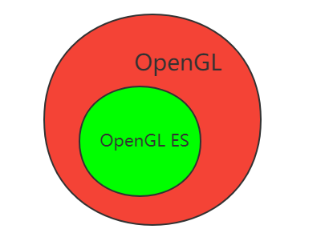
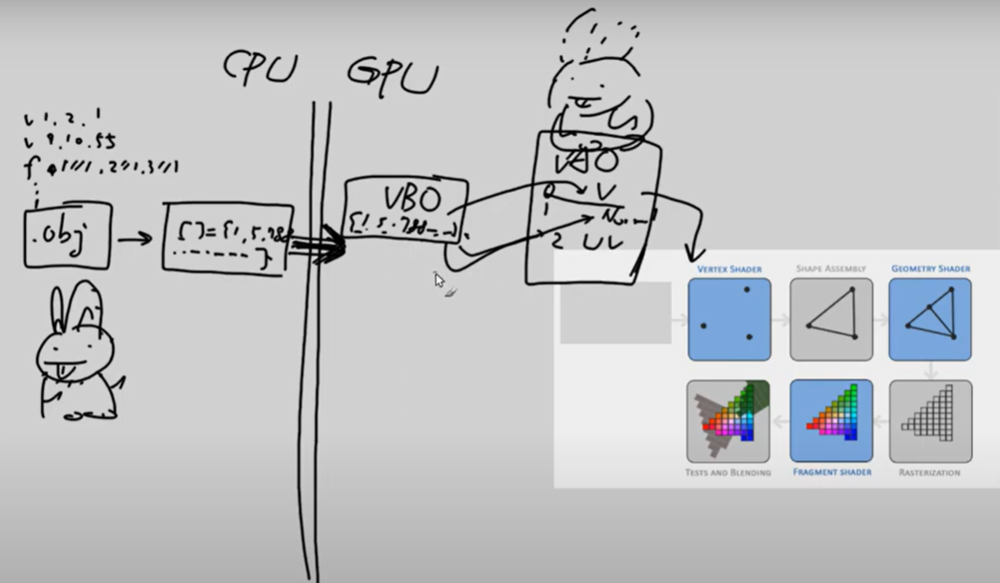
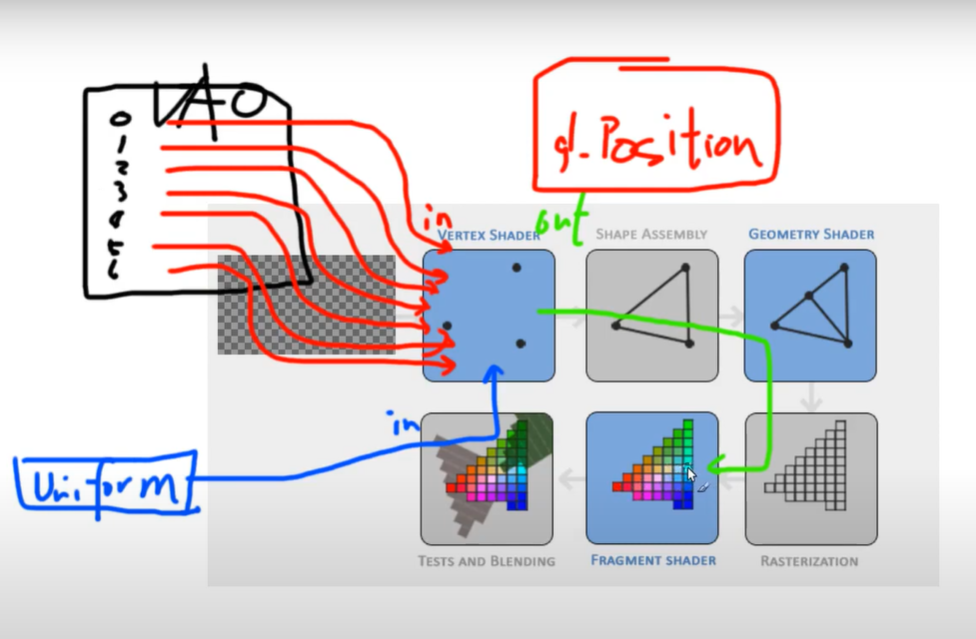
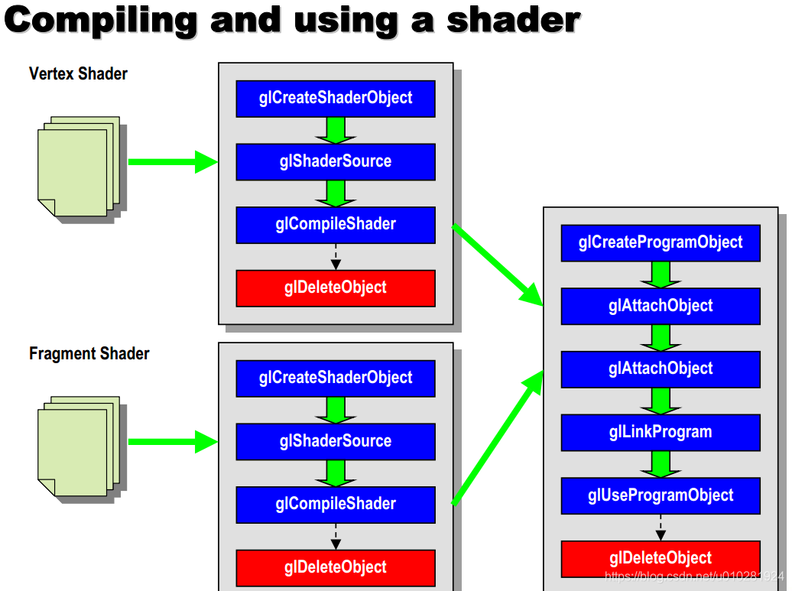
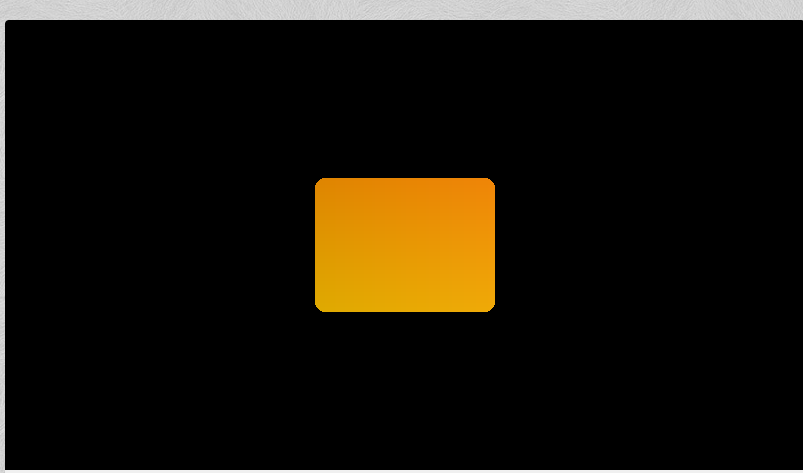
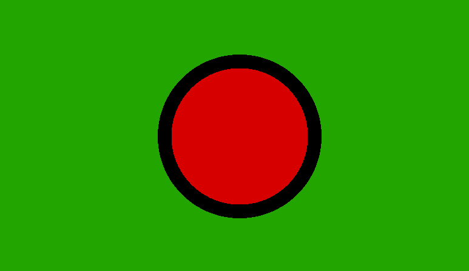

# 目录


# 环境搭建

## 运行opengl的环境

clion：    [【OpenGL】Clion配置](https://blog.csdn.net/weixin_62264287/article/details/134716198 )  -------->没试过

VsCode：    [VsCode下配置OpenGL开发环境](https://www.bilibili.com/video/BV1BX4y1g7R6/?spm_id_from=333.337.search-card.all.click&vd_source=3eebd10b94a8a76eaf4b78bee8f23884       )

AS： 直接使用AS，调用NDK接口


## 实时预览shader(GLSL)的环境

vscode安装插件：

> GLSL：用来编译
>
> glsl-canvas：用来显示


```
// test.frag
precision mediump float;

void main()
{
    vec3 color = vec3(1,0,0);
    gl_FragColor = vec4(color, 1);
}
```

------------>  运行： ctrl + shift + P ，搜索 show  glslcanvas

[参考](https://www.bilibili.com/video/BV1LV411b7uE?p=1&spm_id_from=pageDriver&vd_source=3eebd10b94a8a76eaf4b78bee8f23884)


## 机器环境确认

EGL有1.0、1.1、1.2、1.3、1.4这几个版本，Android中使用的是1.4，EGL提供了查询版本的API，以下为Android中例子：

[具体见](https://www.bilibili.com/video/BV1LV411b7uE?p=1&spm_id_from=pageDriver&vd_source=3eebd10b94a8a76eaf4b78bee8f23884)


# 基本概念

## OpenGL ES 与 OpenGL 关系



**子集关系：**

>   ~~OpenGL ES 是 OpenGL 的**子集**（删除了一些**低效能的操作方式**）~~

## 图形渲染管线（Graphics Pipeline）

一个输送<font color='red'>管道</font>: 图形数据 到 屏幕过程

作用：

> 1、平面化：将3D坐标 ------> 2D坐标
>
> 2、光栅化：2D坐标  ------>  像素(实际的有颜色的)

注意：坐标是精准表达

渲染管线流程：

> 
>
> ~~[图片来源](https://learnopengl-cn.github.io/01%20Getting%20started/04%20Hello%20Triangle/)~~

数据流：

>   
>

（1）建模型（比如兔子）： 顶点数据  +   面数据  ~~三角形面数据（面1基于点：点1 点3  点5）~~  

（2）序列化为数组[] int = {1,5，........}

   必然有：~~(3) 序列化的东西跨越到GPU~~

   （4）存到GPU的VBO（<font color='red'>一块buffer</font>）上

```
unsigned int VBO;
glGenBuffers(1, &VBO);
```

（5）VBO中的数据，反序列化为结构数据，VAO： 顶点数据  + 面数据 

  ----------------->  即兔子模型

（6）VAO中，顶点数据 -------------> 灌入，即vertext


# 一些接口/效果

## window

创建window（对于安卓，不需要）

[参考](https://www.youtube.com/watch?v=ZoXqI2gOugs&list=PL0luF_aDUOooIB56NOFVTS4ahMzBHS_6z&index=2)


## Triangle


## 安卓openGLE接口

[湖广午王OpenGLES系列](http://blog.csdn.net/junzia/article/category/6462864)

[一篇搞懂OpenGL中的着色器和如何使用](https://blog.csdn.net/CodeWorld1999/article/details/134863461)


# 着色器shader


## 输入



[图来源](https://youtu.be/AL3W2JfVVgw?list=PL0luF_aDUOooIB56NOFVTS4ahMzBHS_6z&t=441)


输入来源：

1、GPU可以从voa中挖数据（比如 从顶点数据中直接接收输入）

> layout (location = 0)  -------> 0顶点的位置
>
> layout (location = 0) in vec3 aPos;  ---->  赋值给aPos

2、从CPU获取（比如时间），uniform 通道：

> （1） uniform 全局唯一
>
> （2） 是更新一个uniform之前你必须先使用程序（调用glUseProgram)： glUseProgram(shaderProgram);

3、前面的shader的输出，可以作为后面shader的输入。比如：


## 输出：

片段着色器，必然有一个vec4颜色输出变量，作为最终颜色（RGBA）

推论：自然，这个颜色赋值，很可能计算于顶点着色器，最后传给片段着色器


[一篇搞懂OpenGL中的着色器和如何使用](https://blog.csdn.net/CodeWorld1999/article/details/134863461)




--------->  图来源：

>   [OpenGL ES 3. 着色器 shader的编译和使用](https://blog.csdn.net/u010281924/article/details/105309340)


## 片元着色器  输入输出图：


>   
>
>   [图来源](https://blog.csdn.net/wudexiaoade2008/article/details/105105364#:~:text=简要说明了-,片元着色器涉及的输入输出参数,-。)

输入: 片元坐标texCoord、纹理数据iChannel0

输出：gl_FragColor


## 补充 纹理

### cpp侧 构造纹理

加载纹理：

```
// 使用 stb_image.h
int width, height, nrChannels;
unsigned char *data = stbi_load("container.jpg", &width, &height, &nrChannels, 0);
```


创建纹理：

```java
unsigned int texture;
glGenTextures(1, &texture);
glBindTexture(GL_TEXTURE_2D, texture);

glTexImage2D(GL_TEXTURE_2D, 0, GL_RGB, width, height, 0, GL_RGB, GL_UNSIGNED_BYTE, data);
--------------> 当前绑定的纹理对象texture就会被附加上纹理图像data
```

应用纹理：

> 新增纹理坐标------即截取：
>
> ```java
> float vertices[] = {
> //     ---- 位置 ----       ---- 颜色 ----     - 纹理坐标 -
>      0.5f,  0.5f, 0.0f,   1.0f, 0.0f, 0.0f,   1.0f, 1.0f,   // 右上
>      0.5f, -0.5f, 0.0f,   0.0f, 1.0f, 0.0f,   1.0f, 0.0f,   // 右下
>     -0.5f, -0.5f, 0.0f,   0.0f, 0.0f, 1.0f,   0.0f, 0.0f,   // 左下
>     -0.5f,  0.5f, 0.0f,   1.0f, 1.0f, 0.0f,   0.0f, 1.0f    // 左上
> };
> ```
>
> 告诉OpenGL新的顶点格式（**顶点属性**）：
>
> ```java
> glVertexAttribPointer(2, 2, GL_FLOAT, GL_FALSE, 8 * sizeof(float), (void*)(6 * sizeof(float)));
> glEnableVertexAttribArray(2);
> ```
>
> 

### glsl侧 接收纹理

顶点着色器新增：

```java
#version 330 
....................
layout (location = 2) in vec2 aTexCoord;

out vec2 TexCoord;


void main()
{
   ....................
    TexCoord = aTexCoord;
}
```

把TexCoord输入给片段着色器：

```java
#version 330 core
............

................
in vec2 TexCoord;

uniform sampler2D ourTexture; // 【】cpp侧赋值 采样器

void main()
{
    FragColor = texture(ourTexture, TexCoord);
                        采样器         纹理坐标
}
```


【】cpp侧赋值 采样器ourTexture：-----> TODO

```java
glBindTexture(GL_TEXTURE_2D, texture);
glBindVertexArray(VAO);
glDrawElements(GL_TRIANGLES, 6, GL_UNSIGNED_INT, 0);
```


TODO：

[为什么`sampler2D`变量是个uniform，我们却不用glUniform给它赋值](https://learnopengl-cn.github.io/01%20Getting%20started/06%20Textures/#_8:~:text=%E4%B8%BA%E4%BB%80%E4%B9%88sampler2D%E5%8F%98%E9%87%8F%E6%98%AF%E4%B8%AAuniform%EF%BC%8C%E6%88%91%E4%BB%AC%E5%8D%B4%E4%B8%8D%E7%94%A8glUniform%E7%BB%99%E5%AE%83%E8%B5%8B%E5%80%BC)

### 混合色 TODO：


```java
纹理颜色*顶点颜色
```


# Opengl

## OpenGL课程

第9章

https://youtu.be/DVvDd_acJoQ?list=PL0luF_aDUOooIB56NOFVTS4ahMzBHS_6z&t=1158     图没看得懂

补充：uniform

换图：https://youtu.be/AxrrrI6hzKw?list=PL0luF_aDUOooIB56NOFVTS4ahMzBHS_6z&t=27

## 时间上变化

见 HOM

```java
 cpp内：
 int vertexColorLocation = glGetUniformLocation(g_programObject, "ourColor"); // 获取 glsl内 "ourColor"字段位置
 glUseProgram(g_programObject);
 glUniform4f(vertexColorLocation, 0.0f, greenValue, 0.0f, 1.0f); // cpp侧设置值
```

[andriod_cpp_openGL-Demo/app/src/main/cpp/RendererJNI.cpp at master · KentTJ/andriod_cpp_openGL-Demo (github.com)](https://github.com/KentTJ/andriod_cpp_openGL-Demo/blob/master/app/src/main/cpp/RendererJNI.cpp)

## 空间上变化

空间上，色彩默认是插值的（光栅化阶段）：

> 顶点颜色值不一样：渐变色插值
>
> 顶点颜色值一样：也是插值，插值结果都是一样颜色

- -------------------> TODO: 从这个角度来：

> 两个 glsl文件，只是提供了  顶点的location + 顶点的color？？？？？？？？？？？？？？？？并没有提供中间点？？？

vs.glsl：

```java
 #version 300 es

 layout(location = 0) in vec3 position;  // 挖值
 layout(location = 1) in vec3 acolor;  // 挖值
 
 out vec3 vertexcolor;

 void main()
 {
     gl_Position = vec4(position.x, position.y, position.z, 1.0);
     vertexcolor = acolor;
 }
```

fs.glsl：

```java
 #version 300 es

 precision mediump float;
 
 // add by cg
 in vec3 vertexcolor;
 
 out vec4 fragColor;
 

 void main()
 {
     // fragColor = vec4(1.0, 0.0, 0.0, 1.0);
     // add by cg
     fragColor = vec4(vertexcolor.x, vertexcolor.y, vertexcolor.z, 1.0);
 }
```

RendererJNI.cpp：

```java
 JNIEXPORT void JNICALL Java_opengl_panjq_com_opengl_1demo_RendererJNI_glesRender
   (JNIEnv *pEnv, jobject obj){
 //    GLfloat vVertices[] = {  0.0f,  0.5f, 0.0f,
 //                             -0.5f, -0.5f, 0.0f,
 //                             0.5f, -0.5f, 0.0f
 //    };
 
     // cg modify
     GLfloat vVertices[] = {
             // 位置                           // 颜色
             0.5f, -0.5f, 0.0f,  1.0f, 0.0f, 0.0f,   // 右下
             -0.5f, -0.5f, 0.0f,  0.0f, 1.0f, 0.0f,   // 左下
             0.0f,  0.5f, 0.0f,  0.0f, 0.0f, 1.0f    // 顶部
     };
 
     // Set the viewport
     glViewport ( 0, 0, g_width, g_height );
 
     // Clear the color buffer
     glClear ( GL_COLOR_BUFFER_BIT );
 
     // Use the program object
     glUseProgram ( g_programObject );
 
     // -------------------modify by cg------------------------------
     //  Load the vertex data ------> to glsl
     // location data------define location index = 0
     glVertexAttribPointer ( 0, 3, GL_FLOAT, GL_FALSE,  6 * sizeof(float),  vVertices);
          // ---------> para解释： index 是定义出来的协议，glsl中会用
          //                      size  是location数据的数据大小
          //                      type  .............
          //                      stride  步长：下一个location的跨度：6*float数据大小
          //                      pointer 偏移量：颜色属性是有偏移量的 6*float数据大小
     glEnableVertexAttribArray ( 0 );
 
     // color data------define index = 1
     float* pVertices = &vVertices[0]; // 获取数组的起始地址
     pVertices += 3; // 移动到第四个元素的位置
     glVertexAttribPointer ( 1, 3, GL_FLOAT, GL_FALSE,  6 * sizeof(float),    pVertices );
     glEnableVertexAttribArray ( 1 );
     / -------------------modify by cg------------------------------
 
     glDrawArrays ( GL_TRIANGLES, 0, 3 );
 }
```

效果：


## 纹理

## 加载png 或 jpg图片

> 目标： ---------->  一堆像素   --------> 一堆RGB，比如（0,122，144）
>
> ```java
>  int width, height, nrChannels;
>  unsigned char *data = stbi_load("container.jpg", &width, &height, &nrChannels, 0);
> ```
>
> 验证：
>
> > //打印前50个pixel for (size_t i = 0; i< 50; i++) {    cout << (int)data[i] << endl; }

RGB: 三个Channel

alpha：第四通道

Texture ------> 另一个翻译更贴切：贴图

> 把一个已有的图，贴到模型上

## 已有图片的截取-----纹理坐标

以左下角为（0,0）

**采样**，即截取出三角形贴图： ----------> [用纹理坐标截取](https://learnopengl-cn.github.io/01 Getting started/06 Textures/#_1:~:text=的插值。-,纹理坐标,-看起来就像这样)   

```java
 float texCoords[] = {
     0.0f, 0.0f, // 左下角
     1.0f, 0.0f, // 右下角
     0.5f, 1.0f // 上中
 };
```

-----------> 这里本质上截取了三个点，[内部插值](https://learnopengl-cn.github.io/01 Getting started/06 Textures/#_1:~:text=解释非常宽松，-,它可以采用几种不同的插值方式,-。所以我们需要)

## 已有图片过小，不足以覆盖模型

GL_REPEAT      重复贴图

GL_CLAMP_TO_EDGE   超出部分，拉伸

GL_CLAMP_TO_BORDER   超出的坐标为用户指定的边缘颜色。

## 纹理过滤------没懂

https://youtu.be/mZM15IKuNWY?list=PL0luF_aDUOooIB56NOFVTS4ahMzBHS_6z&t=1341


## 错误信息的获取

参考：[官方代码](https://learnopengl.com/code_viewer_gh.php?code=includes/learnopengl/shader_s.h#:~:text=errors)：  

 COMPILE错误 与 LINK 错误

```java
   // utility function for checking shader compilation/linking errors.
    // ------------------------------------------------------------------------
    void checkCompileErrors(unsigned int shader, std::string type)
    {
        int success;
        char infoLog[1024];
        if (type != "PROGRAM")
        {
            glGetShaderiv(shader, GL_COMPILE_STATUS, &success);
            if (!success)
            {
                glGetShaderInfoLog(shader, 1024, NULL, infoLog);
                std::cout << "ERROR::SHADER_COMPILATION_ERROR of type: " << type << "\n" << infoLog << "\n -- --------------------------------------------------- -- " << std::endl;
            }
        }
        else
        {
            glGetProgramiv(shader, GL_LINK_STATUS, &success);
            if (!success)
            {
                glGetProgramInfoLog(shader, 1024, NULL, infoLog);
                std::cout << "ERROR::PROGRAM_LINKING_ERROR of type: " << type << "\n" << infoLog << "\n -- --------------------------------------------------- -- " << std::endl;
            }
        }
    }
```


## printf' in GLSL

https://stackoverflow.com/questions/3420558/printf-in-glsl

[调试输出， OpenGL4.3版本](https://blog.csdn.net/zjz520yy/article/details/83047042  )

[官网---   调试输出](https://learnopengl-cn.github.io/06 In Practice/01 Debugging/#:~:text=有效的工具。-,调试输出,-虽然没有glGetError  )


## EGL操作

### OpenGL ES EGL eglMakeCurrent

[OpenGL ES EGL eglMakeCurrent-CSDN博客](https://blog.csdn.net/ZhaDeNianQu/article/details/127412561)             ------------------>  非常详细，系列文章

与线程绑定

TODO: 多个**`EGLContext`**

### **顶点的属性值**（位置、颜色、纹理坐标）传递 给 **顶点shader**：

>   EGL内指定:
>
>   ```java
>    // position: 顶点位置    指定了index = 0一组数据
>   glVertexAttribPointer(0, 2, GL_FLOAT, GL_FALSE, 4 * sizeof *v, &v[0]); // 在这里给定顶点数据！！！
>   // texcoord: 纹理坐标
>   glVertexAttribPointer(1, 2, GL_FLOAT, GL_FALSE, 4 * sizeof *v, &v[2]);
>   ```
>
>   与shader的对应：
>
>   >    EGL内再次指定 : **index = 0 与  shader里 "position"绑定**
>   >
>   >   ```java
>   >   glBindAttribLocation(shader->program, 0, "position");
>   >   glBindAttribLocation(shader->program, 1, "texcoord");
>   >   ```
>   >
>   >   或者
>   >
>   >   ```java
>   >   // 在shader内绑定 location = 0 与  position
>   >   layout(location = 0) in vec3 position;  // 挖值
>   >   layout(location = 1) in vec3 acolor;  // 挖值
>   >   ```
>
>   参考：[opengl学习glBindAttribLocation-CSDN博客](https://blog.csdn.net/hyl999/article/details/133639798)


## 内建变量

大全 ： [GLSL内置变量和内置函数](https://blog.csdn.net/danshiming/article/details/131511445)

[内建函数集合](https://blog.csdn.net/hgl868/article/details/7876257)

[内建函数的图像解释](https://blog.csdn.net/a_codecat/article/details/127469057)

### gl_FragCoord

参考：shader着色器变量gl_FragCoord 的含义

>   openGL默认以左下为原点!
>
>   原点并非(0, 0)而是(0.5, 0.5)  !!!      ----> 则： 若viewport范围 为(0, 0, 2560, 1440)时， x, y 的取值范围就为(0.5, 0.5, 2559.5, 1439.5)；

## ~~glsl内建函数~~  --------字典

大全 ： GLSL内置变量和内置函数

### 插值函数 mix

genType mix (genType x, genType y, float a)

----------> 返回线性混合的x和y，如：x⋅(1−a)+y⋅a。

### 台阶函数step(a, x)

0到1的台阶（如果 x<a，返回 0；否则，返回 1）

图：

### 距离函数distance

判断两个vec的距离 distance(color1.rgb, color2.rgb) < 0.05

### clamp

genType clamp (genType x, genType minVal, genType maxVal) genType clamp (genType x, float minVal, float maxVal)

clamp翻译为夹具，clamp实际上是获得三个参数中大小处在中间的那个值

###   abs

比如： vec2  abs(vec2 x)，即向量  向  第一象限


[图来源](https://blog.csdn.net/a_codecat/article/details/127469057#:~:text=abs(vec3 x)-,vec4 abs(vec4 x),-sign)

### 台阶step

y = step(0.5, x)


### smoothstep

y = smoothstep(0.0,1.0,x);

**作用：将step的突变，优化成渐变**  ------->  用于抗锯齿


### smoothstep 和自定义的 linearstep

参数意义相同，<font color='red'>完全可以等价替换</font>


## 补充： Texture ------> 另一个翻译更贴切：贴图

**纹理即贴图！！！！！！！！！！**

## 混合 & 透明

[混合 - LearnOpenGL CN (learnopengl-cn.github.io)](https://learnopengl-cn.github.io/04 Advanced OpenGL/03 Blending/)

[第十课：透明 (opengl-tutorial.org)](https://www.opengl-tutorial.org/cn/intermediate-tutorials/tutorial-10-transparency/)

## shader 变量类型

参考：[着色器详解](https://www.cnblogs.com/keguniang/p/9873052.html)

1、uniform  （自然，全局统一）： 数据流： cpp（CPU） < ------------> shader

>   [使用参考](https://www.cnblogs.com/keguniang/p/9873052.html#:~:text=vertexColorLocation%20%3D%20glGetUniformLocation)

2、attribute变量

3、varying ：  数据流： vertex  shader <----> fragment  shader

4、in/out


## 抗锯齿

### 锯齿产生的根源

TODO:

根源：

>   连续 ------> 离散造成的 (即： 光栅器将顶点数据转化为片段)

注意：不是屏幕分辨率造成的，**分辨率造成的锯齿很小！！！**

### 如何抗锯齿

参考：

>   Shadertoy 的坐标转换 - 知乎 ([zhihu.com](http://zhihu.com))
>
>   [A Simple Circle (shadertoy.com)](https://www.shadertoy.com/view/XsjGDt)
>
>   [抗锯齿实现](https://juejin.cn/post/7060050476238110750)   
>
>   [抗锯齿](https://learnopengl-cn.github.io/04 Advanced OpenGL/11 Anti Aliasing/)

抗锯齿的**思想：**

>   1、在边缘预留一段缓冲区间
>
>   2、在区间内**渐变**（颜色、透明度）

根据**渐变策略**的不同：

1、多重采样(MSAA)：一个像素，多点采样，求平均？   [缓冲区间内多重采样，计算缓冲区内颜色值](https://learnopengl-cn.github.io/04 Advanced OpenGL/11 Anti Aliasing/#:~:text=子做之后，-,颜色缓冲中所有的图元边缘将会,-产生一种更)


[图：](https://learnopengl-cn.github.io/04 Advanced OpenGL/11 Anti Aliasing/#:~:text=三角形填充颜色，-,就能得到以下的效果：,-对于每个)

具体代码：

```java
glfwWindowHint2
glEnable(GL_MULTISAMPLE);
```

2、............

3、自定义抗锯齿算法：smoothstep、自制smoothstep函数、自制linearstep函数

有锯齿的圆------**if else形式：**

```java

// 【】 if else  等价于  数学中的step函数
void mainImage( out vec4 fragColor, in vec2 fragCoord )
{
    vec2 uv = (2.0 * fragCoord.xy - iResolution.xy) / min(iResolution.y, iResolution.x);
    float r = 0.5;
    float len = length(uv) - r;  // length(uv)是距离原点的距离   // r是圆半径


    if (len <= 0.0) {
        fragColor = vec4(1.0, 0.0, 0.0, 1.0);
    } else {
        fragColor = vec4(0.0, 0.0, 0.0, 1.0);
    }
}
```


有锯齿的圆------**step形式：**

```java

```

-<font color='red'>参考</font>：[Unity Shader：优化GPU代码--用step()代替if else等条件语句](https://gwb.tencent.com/community/detail/128137)


没有锯齿的圆：

```java

// 抗锯齿：mix + linearstep
float linearstep(float edge0, float edge1, float x) {  // 极小缓冲区, 宽度 edge1 - edge0  ------> 经验值！！！
    float t = (x - edge0)/(edge1 - edge0);             //             中心（edge1 + edge0）/2 ------> 由边界决定！！！！！
    return clamp(t, 0.0, 1.0);                         // 输出 --> 换算到[0, 1]之间一个值
}

void mainImage( out vec4 fragColor, in vec2 fragCoord )
{
    vec2 uv = (2.0 * fragCoord.xy - iResolution.xy) / min(iResolution.y, iResolution.x);
    float r = 0.5;
    float len = length(uv) - r;

    float Edgewidth = 0.002;
    float linear = linearstep(r - Edgewidth, r + Edgewidth, len); // 获取线性系数
    fragColor = mix(vec4(1.0, 0.0, 0.0, 1.0),vec4(0.0, 0.0, 0.0, 1.0), linear); // 线性插值----【】关键一行
}
```

从数学角度，本质：

>   step函数 ---> LinearStep函数

### 其他

抗锯齿 圆角矩形

```java

float linearstep(float edge0, float edge1, float x) {  // 极小缓冲区, 宽度 edge1 - edge0  ------> 经验值！！！
    float t = (x - edge0)/(edge1 - edge0);             //             中心（edge1 + edge0）/2 ------> 由边界决定！！！！！
    return clamp(t, 0.0, 1.0);                         // 输出 --> 换算到[0, 1]之间一个值
}

float drawBox( in vec2 p, in vec2 b ){  // 矩形的距离函数
    vec2 d = abs(p)-b;
    return length(max(d,0.0)) + min(max(d.x,d.y),0.0);
}

float opRound( in vec2 p, in float r )  // r  圆角
{
  return drawBox(p, vec2(0.4-2.0*r,0.3-2.0*r)) - r;
}

void mainImage( out vec4 fragColor, in vec2 fragCoord )
{
  // Normalized pixel coordinates (from 0 to 1)
    vec2 uv = fragCoord/iResolution.xy;
    vec2 p = (2.0*fragCoord-iResolution.xy)/iResolution.y;
    // Time varying pixel color
    vec3 col = 0.5 + 0.5*cos(uv.xyx+vec3(0,2,4));

    float Edgewidth = 0.002;
    col = mix(col,vec3(0.0), linearstep(0.0 - Edgewidth, 0.0 + Edgewidth, opRound(p, 0.05)));
    // Output to screen
    fragColor = vec4(col,1.0);
}
```

## OpenGL坐标系统

[OpenGL之深入解析坐标系统_OpenGL ES-CSDN专栏](https://download.csdn.net/blog/column/10158151/107103061)

左下是原点？？？

### 画布坐标系（站在画布上看）

参考:    [Shadertoy的坐标转换](https://zhuanlan.zhihu.com/p/35973705)

结论：shader内变量 是基于画布坐标系的


原始画布坐标系：

> 原点：位于画布左下角
>
> 自然：
>
> > ~~方向： x正向向右，y正向向上~~       
> >
> > ~~坐标范围：[0, 0]  -----> iResolution.xy~~

画图：TODO

归一化后画布坐标系：

> 原点：位于画布中间
>
> 自然：
>
> > ~~方向： x正向向右，y正向向上~~       
> >
> > ~~坐标范围：[-1, -1]  -----> [1,  1]~~

画图：TODO


例子：

```java
float drawBox( in vec2 p, in vec2 b ){  // 矩形的距离函数
    vec2 d = abs(p)-b;
    return length(max(d,0.0)) + min(max(d.x,d.y), 0.0);
}

float opRound( in vec2 p, in float weight, in float height, in float r )  // r  圆角; weight，归一化的 
{
  return drawBox(p, vec2(weight-1.0*r, height-1.0*r)) - r;  // 1.0*r：内矩形  到 目标矩形的距离 = 圆角半径 
}                                                     // 0.4、0.3 矩形大小

void mainImage( out vec4 fragColor, in vec2 fragCoord )
{
    // 【1】归一化短边坐标为[-1, 1], 中央为原点（其中，iResolution.xy是画布大小）
    // 画布长边对应放缩，不是[-1, 1]
    vec2 uv = (2.0*fragCoord-iResolution.xy)/min(iResolution.y, iResolution.x); 
    
    
    // 待画矩形的尺寸
    float weight = 200.0/min(iResolution.y, iResolution.x);  // 200是真实尺寸,px
    float height = 200.0/min(iResolution.y, iResolution.x);
    
    // 待画矩形的中心(以画布左下角为原点)
    vec2 O1 = vec2(300.0, 300.0); // 真实
    O1 = (2.0*O1-iResolution.xy)/min(iResolution.y, iResolution.x);
    uv = uv - O1;
    //uv = uv - vec2(-1.0, -1.0); // 移动矩形位置（其中 -1.0，是向左移动一半的画布距离）

    vec3 col = vec3(0,2,4); 
    col = mix(col,vec3(0.0),step(0.0, opRound(uv, weight,height,0.05)));
    // Output to screen
    fragColor = vec4(col,1.0);
}
```

### 优化之限制局部区域绘制 glScissors

glScissors是OpenGL中的一个函数，用于定义一个矩形区域，只有在该区域内的像素才会被绘制。


[参考](https://cloud.tencent.com/developer/information/OpenGL%20glScissors%E5%9D%90%E6%A0%87%E7%B3%BB%E7%9A%84%E4%B8%AD%E5%BF%83-ask)


### 窗口坐标系（站在屏幕，看画布）

已经验证的结论：

> **Rect的计算**是屏幕坐标系：
>
> **即 以 左上角为原点**

### void glViewport(GLint x, GLint y, GLsizei width, GLsizei height);

参考：  [OpenGL 学了那么久了，glViewport 你真的会用吗？](https://cloud.tencent.com/developer/article/2323370)

站在屏幕角度（**左下为原点**）：划出一个矩形，作为 渲染区域  

结论：

1、可见，与窗口无关！！！！！！只与屏幕有关


TODO:

glViewport<font color='red'>本质是映射</font>！！！！！！

>   （1）将纹理的（0,0,2,2）   映射到    屏幕的 (GLint x, GLint y, GLsizei width, GLsizei height)区域
>
>   （2）注意：<font color='red'>纹理永恒不变</font>，<font color='red'>始终一张完整</font>的图

[见](https://cloud.tencent.com/developer/article/2323370#:~:text=%E7%B4%A0%E7%9A%84%E5%AE%BD%EF%BC%8C-,x%E6%96%B9%E5%90%91%E8%B6%85%E5%87%BA%E9%83%A8%E5%88%86%E5%B0%86%E4%B8%8D%E6%98%BE%E7%A4%BA%E3%80%82,-%E5%8F%AA%E6%94%B9%E5%8F%98%20y)


左下为原点：

> 自然，~~向右，x正向~~
>
> ​           ~~向上，y正向~~


拉伸weston桌面，可以改变 glViewport的宽高

但是移动，为啥x, y不变？？？


## OpenGL裁剪

glScissor(x, y, width, height)

## 技巧：

用屏幕所有

# 安卓GLSurfaceView源码分析

## 抛开安卓，使用 EGL 绘图的基本步骤：

EGL 作用：关联   OpenGL ES  与  本地窗口系统(native platform window system)

使用EGL的绘图的一般步骤：

>   ```java
>   获取 EGL Display 对象：eglGetDisplay()
>   初始化与 EGLDisplay 之间的连接：eglInitialize()
>   获取 EGLConfig 对象：eglChooseConfig()
>   创建 EGLContext 实例：eglCreateContext()
>   创建 EGLSurface 实例：eglCreateWindowSurface()
>   连接 EGLContext 和 EGLSurface：eglMakeCurrent()
>   使用 OpenGL ES API 绘制图形：gl_*()     // 【7展开】 都是gl接口 
>   切换 front buffer 和 back buffer 送显：eglSwapBuffer()
>   断开并释放与 EGLSurface 关联的 EGLContext 对象：eglRelease()
>   删除 EGLSurface 对象
>   删除 EGLContext 对象
>   终止与 EGLDisplay 之间的连接
>   ```

结论：

>   1、安卓GLSurfaceView框架：除了7，对EGL其他都做了封装
>
>   2、即使7，也做了生命周期约束，在on........接口里

详细说明：

>   EGLHelper做的事情：创建环境、创建surface、创建gl 开发者接入点： on........: 即 【7展开】 ：
>
>   0、 glViewport  限定显示的大小
>
>   1、 创建g_programObject（用来承载 两个shader）
>
>   自然，使用glUseProgram(g_programObject)
>
>   2、glVertexAttribPointer   传顶点  (glEnableVertexAttribArray，顶点的属性)
>
>   3、绘制 glDrawArrays ( GL_TRIANGLES, 0, 3 );  （之前先clear掉之前画的， glClear(GL_COLOR_BUFFER_BIT)）
>
>   **可选：**  动态变化（比如，使用uniform变量  时间上改变颜色）

### 补充：TODO, 如果有纹理的话:

```java

// gl_fbo_texture_init

GLuint shadow_fbo;
GLuint shadow_tex;


glGenTextures(1, &shadow_tex);
glBindTexture(GL_TEXTURE_2D, shadow_tex);
glTexImage2D(GL_TEXTURE_2D, 0, internal_format, width, height, 0,
         format, type, NULL);
...........
glBindTexture(GL_TEXTURE_2D, 0);

glGenFramebuffers(1, &shadow_fbo);
glBindFramebuffer(GL_FRAMEBUFFER, shadow_fbo);
glFramebufferTexture2D(GL_FRAMEBUFFER, GL_COLOR_ATTACHMENT0,  // 颜色、深度等信息通过纹理来存放，所以，有个绑定
               GL_TEXTURE_2D, shadow_tex, 0);

fb_status = glCheckFramebufferStatus(GL_FRAMEBUFFER);

glBindFramebuffer(GL_FRAMEBUFFER, 0);
```

https://blog.csdn.net/hankern/article/details/88770954


## 0层流程框架

由 《EGL的绘图的一般步骤》，<font color='red'>0层流程框架必然是：</font>

>   
>


[图来源](https://blog.csdn.net/xiaozhude/article/details/78752608#:~:text=%E4%B9%8B%E9%97%B4%E7%9A%84%E8%BF%9E%E6%8E%A5%E3%80%82-,GLSurfaceView%E7%9A%84%E7%BB%98%E5%88%B6%E6%B5%81%E7%A8%8B,-%E7%94%B1%E4%B8%8A%E5%9B%BE)：


## 0层

demo：[GLSurfaceView基本使用与源码解析](https://blog.csdn.net/lixiong0713/article/details/108200126)   ------------>  只看demo，不看这里源码分析

[OpenGL升级打怪之 GLSurfaceView源码分析](https://www.jianshu.com/p/45bac151346e)

-------------> 整个 核心：

```java
 // GLSurfaceView.java
 
 
 guardedRun() throws InterruptedException { // -----------> 一个循环 while
     if (mEglHelper.createSurface()) { // 【】创建EGLSurface，本质：把后面所有的gl操作，绑定到 context里（） 见
         ..........
     }
 
 
     // 【】Egl交互内存，opengl使用的双内存缓冲，一个进行显示，另一个则后台进行绘制，绘制OK后，交互内存进行显示
     int swapError = mEglHelper.swap();
 }
```

创建的内存，怎么给Opengl的？

```java
 总结GLSurfaceView使用EGL的流程如下：
 1.生成一个EGL实例
 mEgl = (EGL10) EGLContext.getEGL();
 2.获取一个EGL Display
 mEglDisplay = mEgl.eglGetDisplay(EGL10.EGL_DEFAULT_DISPLAY);
 3.初始化EGL并返回版本号
 if(!mEgl.eglInitialize(mEglDisplay, version)) {}
 4.选取一个配置
 mEglConfig = view.mEGLConfigChooser.chooseConfig(mEgl, mEglDisplay);
 5.创建一个EGLContext
 mEglContext = view.mEGLContextFactory.createContext(mEgl, mEglDisplay, mEglConfig);
 6.创建EGLSurface
 egl.eglCreateWindowSurface(display, config, nativeWindow, null);
 7.通过swap将渲染内容显示到屏幕
 mEgl.eglSwapBuffers(mEglDisplay, mEglSurface)
 
 ————————————————

 原文链接：<https://blog.csdn.net/TuGeLe/article/details/79199161>
```

## eglMakeCurrent 绑定、创造环境（为后续gl操作）

参考： [eglMakeCurrent()详解-CSDN博客](https://blog.csdn.net/happy19850920/article/details/50673005)     中  eglMakeCurrent

mEgl.eglMakeCurrent(mEglDisplay, mEglSurface, mEglSurface, mEglContext)

作用，简言之，就是 为opengl es的所有api创造环境：

> 绑定后面gl（无论开发者使用哪种）操作 与 context（当前线程、当前display、当前draw surface、当前read surface） 即：后面所有操作，不再指定目的地（display、surface），限制线程   ---------> 创造环境的目的：就是为所有API调用化简

结论：

> mEgl（EGL10）是没有用的，开发者不一定会用（只是用来初始化环境，相当于静态（在EGL14.java里，就是静态方法））

源码分析：

```java
  eglMakeCurrent
     makeCurrent
       ogles_context_t* current = (ogles_context_t*)getGlThreadSpecific(); // 取得当前GlThread的context信息，进行校验
```

例子:

> 例1：后续操作不需要显式指定opengl画的surface（buffer）：
>
> [KentTJ/andriod_cpp_openGL-Demo: openGL NDK Demo (github.com)](https://github.com/KentTJ/andriod_cpp_openGL-Demo)
>
> 例2：onDrawFrame回调接口里，可以用 框架侧给定的gl，也可以不用。最终都是指定到绑定的surface上
>
> ```java
>  public void onDrawFrame(GL10 gl) {
>       //清除屏幕缓存和深度缓存
>       gl.glClear(GL10.GL_COLOR_BUFFER_BIT | GL10.GL_DEPTH_BUFFER_BIT);
>       //启用顶点坐标数据
>       gl.glEnableClientState(GL10.GL_VERTE
>  }
>  
>  public void onDrawFrame(GL10 gl) {
>   GLES20.glDrawArrays(GLES20.GL_TRIANGLE_FAN,0,vSize);
>   GLES20.glDisableVertexAttribArray(mPositionHandle);
>  }
>  
>  public void onDrawFrame(GL10 gl) {
>   glesRender();
>  }
>  
> ```
>
> 例3:
>  当glclear被调用的时候，首先通过getGlThreadSpecific()获取到当前GlThread的context信息。而这个context就是在eglMakeCurrent的时候和GLThread绑定的context。

eglMakeCurrent 的反向操作：

> glFlush

TODO: 0层结构图

> 见 eglMakeCurrent()详解-CSDN博客

## eglSwapBuffers

[eglSwapBuffers详解-CSDN博客](https://blog.csdn.net/happy19850920/article/details/50773875?spm=1001.2014.3001.5502)

## 与Skia渲染比较

最后剩下的就是onDrawFrame(GL10 gl)的主体绘制的实现，这也是最重要的一个部分，因为涉及的内容较多，就不在这里陈述了。这里使用的就是opengl的绘制引擎进行渲染操作，跟之前View的渲染是使用的Skia渲染引擎。 https://blog.csdn.net/xiaozhude/article/details/78752608

Glsurfaceview的 onDrawFrame(GL10 gl)  ------> opengl引擎渲染 View的绘制onDraw(Canvas canvas)      ------>  Skia引擎渲染

## 双缓冲机制

glsurfaceview的双缓冲机制： TODO:两块surface的交换： 一块渲染mEglSurface，一块显示mEglDisplay ------------> mEgl.eglSwapBuffers

双缓冲，应该是buffer，不是两个surface！！！！

## 其他demo

https://blog.csdn.net/zhangpengzp/article/details/88714034   另一个安卓cpp opengl框架 --------> 没有swap https://blog.csdn.net/zhangpengzp/article/details/89519416   glsurfaceview在native创建EGL环境并渲染
 ----------------->
 （1）initEgl(holder.getSurface());// GLsurfaceView的surface给了 （2）将上下文，和 surface 和 display 关联!!!!!!!!! 并且在当前线程中启动当前的渲染环境 if(EGL_TRUE != eglMakeCurrent(display, surface, surface,context))// 2、3 2个surface 一个读 一个写，双缓冲
 原文链接：https://blog.csdn.net/zhangpengzp/article/details/89519416 (3) 绘制完毕后，调用eglSwapBuffers(display,surface); 来将opengl绘制的纹理渲染到窗口

## 疑问：

opengl没看到使用buffer glsurfaceview的surface 与 opengl的使用，是如何绑定的？

创建surface： // GLSurfaceView.java public EGLSurface createWindowSurface(EGL10 egl, EGLDisplay display, EGLConfig config, Object nativeWindow) {

5，创建mEglSurface，这个代表了将要被渲染的那段内存。请注意到createWindowSurface()的四个参数，尤其是最后一个参数view.getHolder()。

createSurface()上面有一句注解：Create an egl surface for the current SurfaceHolder surface.这个只能意会，很难言传。我理解是被渲染后的mEglSurface也是为了给mSurface来呈现的。总之mEglSurface和mSurface之间一定有着很重要的关系的，在一定程度上你也可以理解他们代表着同一块用来渲染的内存。

6，连接EGLContext和EGLSurface：eglMakeCurrent()。 ------------------>  https://blog.csdn.net/xiaozhude/article/details/78752608  系列文章

问题： 1，GLSurfaceView继承了SurfaceView，它自己的mEglSurface和从父类继承的mSurface之间的关系？https://blog.csdn.net/xiaozhude/article/details/78752608 2，onDrawFrame是60FPS触发GPU对UI进行渲染-------> 如何触发GPU的？ 3.gpu的buffer数据，最后怎么返还给CPU的？

## TODO:

[OpenGL系列文章](https://blog.csdn.net/xiaozhude/article/details/78752608  ) 

[Android GLSurfaceView详解-CSDN博客](https://blog.csdn.net/TuGeLe/article/details/79199161?ops_request_misc={"request_id"%3A"171144045516800188515202"%2C"scm"%3A"20140713.130102334.."}&request_id=171144045516800188515202&biz_id=0&utm_medium=distribute.pc_search_result.none-task-blog-2~blog~sobaiduend~default-2-79199161-null-null.nonecase&utm_term=GLSurfaceView绘制详解&spm=1018.2226.3001.4450)

[GLSurfaceView渲染过程详解_壁纸服务如何绘制glsurfaceview-CSDN博客](https://blog.csdn.net/xiaozhude/article/details/78752608)     

mainActivity的surface 与 GLSurfaceView 的surface 如何做混合，显示底下的surface内容？------------即透明背景

> https://juejin.cn/s/opengl设置背景透明  opengl设置背景透明

## 参考

## 背后的设计

安卓的设计，很多思想都是：

> 框架侧多做一些，让开发者少做（这里，框架侧封装了opengl创建surface、初始化环境部分）

--------------> 实现的策略：

开发者的开发的部分，强制放到回调里，比如onDraw（同理，Activity的设计，onCreate等）


# shader编程实战

## <font color='red'>本质理解</font>

shader
也就是说我们只采样所有像素的中心点，

本质上：

>   <font color='red'>shader是不连续的产物</font>（采样）--------因为屏幕本质就是不连续的点
>
>   而**painter从用户侧，是连续的**（比如画线）


从数学角度，<font color='red'>离散与连续的处理不同</font>----><font color='red'>最本质</font>

>   ​          离散-----------遍历方法  
>
>   ​          连续函数-------------函数


从软件硬件角度，硬件（离散） 软件（连续）的差异

从软件角度:opengl（shader）就是硬件处理，而painter就是软件处理


## 在线网站 （教程 & 运行）

https://www.shadertoy.com/      

## 距离函数

https://zhuanlan.zhihu.com/p/365440831      Shader中使用距离函数（Distance Function）绘制二维图形

**距离函数-------------空间中任何一个点到物体表面的最短距离**


## 基本素材---距离函数(圆、矩形、三角形........)


### 2d距离函数

大全：

>   [二维图形的距离函数](https://iquilezles.org/articles/distfunctions2d/ )
>
>   https://www.shadertoy.com/playlist/MXdSRf&from=0&num=12


-<font color='red'>推论，通用公式：</font>

>   2d 圆角............. : 圆角 = 内图形 + 圆角半径
>
>   **2d环状**............：<font color='red'>TODO</font>


### 自然，~~推论:2d圆角(矩形、三角形.............)~~

**圆角通用公式：**

>   <font color='red'>圆角矩形 = 内矩形（长-圆角半径，宽-圆角半径）  + 圆角（圆角半径）：</font>

```java
float drawBox( in vec2 p, in vec2 b ){  // 矩形的距离函数
    vec2 d = abs(p)-b;
    return length(max(d,0.0)) + min(max(d.x,d.y),0.0);
}

float opRound( in vec2 p, in float r )  // r  圆角
{
  return drawBox(p, vec2(0.4-1.0*r,0.3-1.0*r)) - r;
}

void mainImage( out vec4 fragColor, in vec2 fragCoord )
{
  // Normalized pixel coordinates (from 0 to 1)
    vec2 uv = fragCoord/iResolution.xy;
    vec2 p = (2.0*fragCoord-iResolution.xy)/iResolution.y;
    // Time varying pixel color
    vec3 col = vec3(0,2,4);
    col = mix(col,vec3(0.0),step(0.0, opRound(p, 0.05)));
    // Output to screen
    fragColor = vec4(col,1.0);
}
```

效果：

>   


其他例子：

>   
>
>   [见](https://iquilezles.org/articles/distfunctions2d/#:~:text=rounded%20box%20and%20a%20rounded%20pentagon)

### 自然，~~推论：环----同心圆、同心圆角矩形~~

**环通用公式：** TODO:

同心圆-------**三段 if else 方式:**

>   ```java
>   // 【】 if else  等价于  数学中的step函数
>   void mainImage( out vec4 fragColor, in vec2 fragCoord )
>   {
>      vec2 uv = (2.0 * fragCoord.xy - iResolution.xy) / min(iResolution.y, iResolution.x);
>      float r = 0.5;
>      float len = length(uv);  // length(uv)是距离原点的距离   // r是圆半径
>   
>   
>      if (len <= r) {
>          fragColor = vec4(1.0, 0.0, 0.0, 1.0);
>      } else if(len > r && len < 0.6){
>          fragColor = vec4(0.0, 0.0, 0.0, 1.0);
>      } else {
>          fragColor = vec4(0.0, 1.0, 0.0, 1.0);
>      }
>   }
>   ```
>
>   


其他例子：

>   
>
>   [见](https://iquilezles.org/articles/distfunctions2d/#:~:text=These%20are%20a%20few%20examples%3A%20annular%20rounded%20line%2C%20an%20annular%20triangle%2C%20an%20annular%20box%20and%20a%20annular%20pentagon%3A)


### 3d距离函数

大全：

>   https://iquilezles.org/articles/distfunctions/
>
>   https://www.shadertoy.com/playlist/43cXRl
>
>   https://www.shadertoy.com/view/Xds3zN

~~球：~~

>   ```java
>   float sdSphere( vec3 p, float s )
>   {
>     return length(p)-s;
>   }
>   ```
>
>   

~~柱体：~~

>   

-<font color='red'>推论：</font>

>   3d 圆角............. : 圆角 = 3d内图形 + 圆角半径
>
>   **3d环状**............：<font color='red'>TODO</font>

### 自然：推论：


## 酷炫的shader

[大海](https://www.shadertoy.com/view/Ms2SD1)

平滑圆  [A Simple Circle (shadertoy.com)](https://www.shadertoy.com/view/XsjGDt)

```java
/**
 * @author jonobr1 / <http://jonobr1.com/3>
 */

/**
 * Convert r, g, b to normalized vec3
 */
vec3 rgb(float r, float g, float b) {
    return vec3(r / 255.0, g / 255.0, b / 255.0);
}

/**
 * Draw a circle at vec2 `pos` with radius `rad` and
 * color `color`.
 */
vec4 circle(vec2 uv, vec2 pos, float rad, vec3 color) {
    float d = length(pos - uv) - rad;
    float t = clamp(d, 0.0, 1.0);
    return vec4(color, 1.0 - t);
}
void mainImage( out vec4 fragColor, in vec2 fragCoord ) {
    vec2 uv = fragCoord.xy;25
    vec2 center = iResolution.xy * 0.5; // TODO: 中心，为啥是这个值？
    float radius = 0.25 * iResolution.y;
    // Background layer
    vec4 layer1 = vec4(rgb(210.0, 222.0, 228.0), 1.0);
    // Circle
    vec3 red = rgb(225.0, 95.0, 60.0);
    vec4 layer2 = circle(uv, center, radius, red);
    // Blend the two
    fragColor = mix(layer1, layer2, layer2.a);
}
```


## shade调试技巧

1、shader中数值判断：

```java
if ( 待判断数值 >  250.0) {
	// 改变颜色
	 color = ................
}
```

逼出来待判断数值：  ~~调整 250.0这个数值~~

2、用固定值 替代 非固定值：

对比两者

```java
//vec2 iResolution = vec2(1024.0, 600.0);                        
vec2 iResolution = univiewPortSize;                                   
```

3、多个窗口，选择一个观看即可


解构的万能方法：

> 多个变量中，取一个为固定值


# 网站

正规的学习网站

> https://learnopengl.com/         学习网站
>
> https://learnopengl-cn.github.io/  对应的中文翻译网站


https://www.youtube.com/watch?v=1TVFHIQKCR0&list=PL0luF_aDUOooIB56NOFVTS4ahMzBHS_6z    视频教程

https://www.youtube.com/watch?v=W3gAzLwfIP0&list=PLlrATfBNZ98foTJPJ_Ev03o2oq3-GGOS2    英文视频教程

 API网站：

> https://docs.gl/             API网站  es2  es3 gl2 gl3 gl4
>
> https://blog.csdn.net/linjf520/article/details/106434989   中文


[湖广午王  OpenGLES系列文章（21篇）](https://blog.csdn.net/junzia/category_6462864.html)     

[OpenGL  基础](https://blog.csdn.net/u010281924/category_7841161.html   )

 [我的openGL demo](https://blog.csdn.net/a360940265a/article/details/88600962)

 [Android C++ OpenGL视频课程](https://edu.csdn.net/course/detail/19367?spm=1001.2101.3001.6650.14&utm_medium=distribute.pc_relevant.none-task-course-2%7Edefault%7EBlogCommendFromBaidu%7ERate-14-19367-blog-88880831.235%5Ev43%5Econtrol&depth_1-utm_source=distribute.pc_relevant.none-task-course-2%7Edefault%7EBlogCommendFromBaidu%7ERate-14-19367-blog-88880831.235%5Ev43%5Econtrol&utm_relevant_index=21   )      

[Android OpenGL ES教学视频](https://www.bilibili.com/video/BV1yx41187GN/?spm_id_from=333.337.search-card.all.click&vd_source=3eebd10b94a8a76eaf4b78bee8f23884  )------------->  TODO: 这里有教蒙板

[OpenGL.Shader：1-重新认识Android上OpenGL（纯Cpp）](https://blog.csdn.net/a360940265a/article/details/88600962)  


[中文视频教程，shader的画法](https://www.bilibili.com/video/BV1LV411b7uE?p=1&spm_id_from=pageDriver&vd_source=3eebd10b94a8a76eaf4b78bee8f23884   )

 [西川善司的3D图形技术概念和渲染管线的处理](https://blog.csdn.net/qq_43331089/article/details/124200849   )


# TODO：

opengl 与surface的关系，尤其是opengl  与 **GLSurfaceView** 的关系


# 书籍

 [OPENGL ES 3.0编程指南.pdf](opengl.assets\OPENGL ES 3.0编程指南.pdf) 


# opengl 与skia的联系与区别（个人理解）

 1、联系：

>   skia 底层是   cpu绘制（硬件加速时，底层OpenGL ,GPU绘制）

 2、区别：

|      | skia                                                         | OpenGL                                                       |
| ---- | ------------------------------------------------------------ | ------------------------------------------------------------ |
| 优点 | -<font color='red'> skia标准化做的很好</font>(画圆，画点  画线接口很好用) | <font color='red'>能力非常强，3d酷炫能力</font>              |
| 缺点 |                                                              | EGL接口很难用  & 画圆画线没有现成的接口                      |
|      | ~~自然，所以client 用skia 画标准控件~~                       | 自然，(1) <font color='red'>主要用来合成，</font>用到了贴图Texture<br />           (2) client渲染酷炫的东西（标准化skia没法完成的，比如3d） |

​       

 ~~详见[Skia引擎API整理介绍](https://www.cnblogs.com/ququer/archive/2012/05/03/2480345.html))：~~

[使用参考]: 

