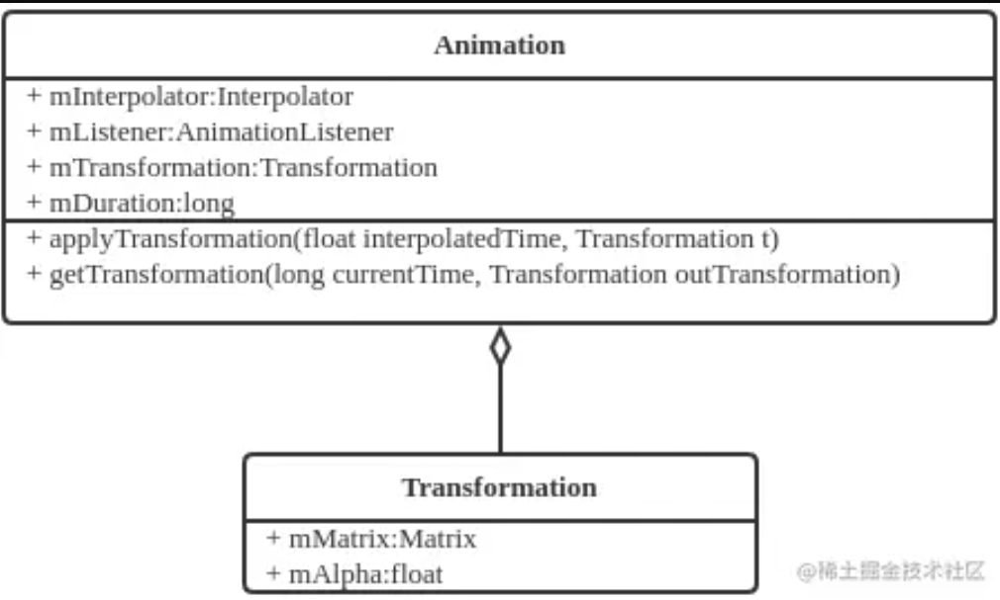
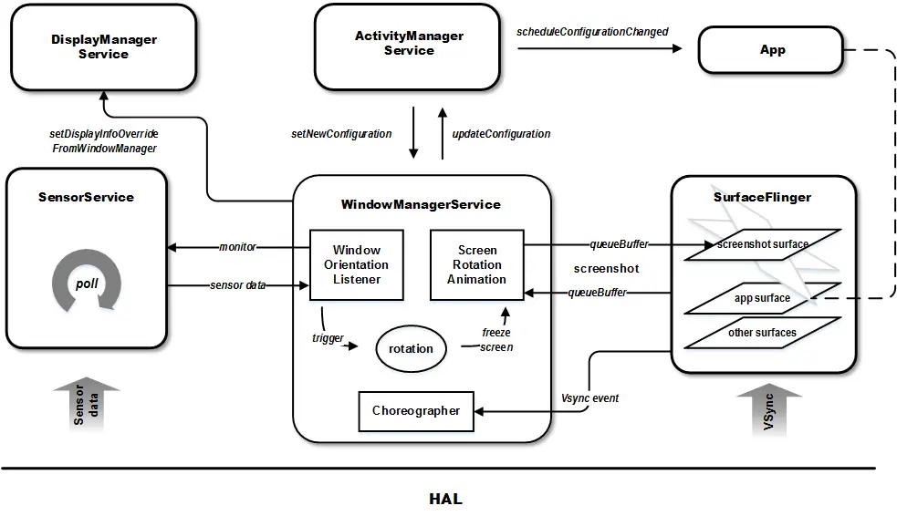
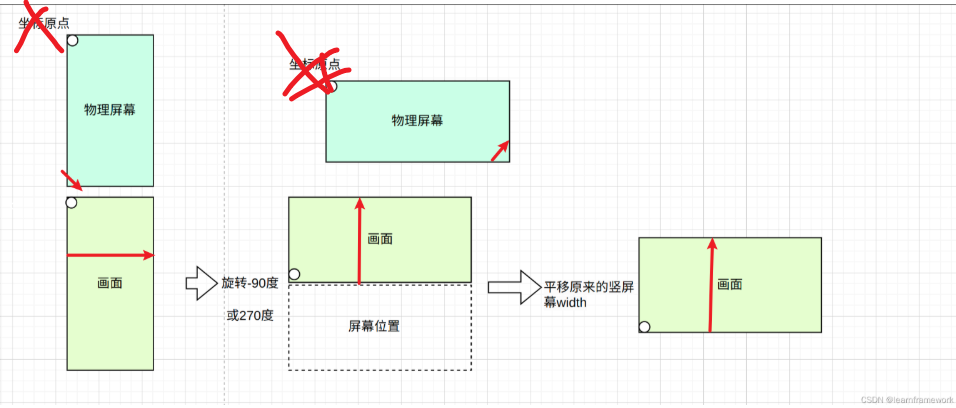

# 目录

# 从功能角度看Animation

**本质就是一个插件：**        **衔接 两个静态的窗口画面** 

TODO:  什么是系统级 animation，什么是应用级 animation？

# 动画的种类

WMS的动画系统

https://juejin.cn/post/7021082548985921567

```
 动画
       Drawable ------帧动画（Frame 动画、Drawable 动画）
       view：view动画------原理view的变动
             属性动画------<https://github.com/OCNYang/Android-Animation-Set/tree/master/property-animation>
       窗口类：窗口动画 -------原理surface  Toast的弹出动画

       整个屏幕：原理截图
```

对于View动画，动画的目标就是View，而对于窗口来说，动画的目标其实都是Surface，对**不同层级的SurfaceControl**进行操纵，会产生不同的动画效果。

| 目标WindowContainer | 名称     | 举例                                                         |
| ------------------- | -------- | ------------------------------------------------------------ |
| WindowState         | 窗口动画 | Toast的弹出动画、PopupWindow的弹出动画   ------------>  要做 |
| AppWindowToken      | 过渡动画 | App从桌面启动的动画    ------------>  要做                   |
| Task                | Task动画 | Recents的动画，PIP动画                                       |
| DisplayContent      | 全屏动画 | 转屏动画  ------------>  要做                                |

参考： https://juejin.cn/post/7021082548985921567


# Android 动画原理

Android中动画的工作过程：
在某一个时间点，调用getTransformation()，根据mStartTime和mDuration，**计算出当前的进度，**在根据mInterpolator计算出转换的进度，然后计算出属性的当前值，保存在matrix中。 再调用Matrix.getValues将属性值取出，运用在动画目标上。

## 一对组合---------Animation 和 Transform



Animation ：--------->  本质：时间

>  ~~给定了初始状态、结束状态、启动时间与持续时间  ------>  **用于计算 Transformation**~~
>

Transformation：--------> 本质：空间

> ~~Transformation 描述了一个变换，即：透明度和一个二维变换矩阵~~


补充Animation 子类：

> 子类：TranslateAnimation，ScaleAnimation，RotateAnimation，AlphaAnimation

## Choreographer

VSync信号驱动动画


## Animation

从数学角度，看Animation种类：

> 1、变化的量：
>
> 位置（TranslateAnimation）、大小（ScaleAnimation）、角度（RotateAnimation）、透明度（AlphaAnimation，淡入淡出，改变透明度）
>
> ------------> 很自然，前三者可以用一个matrix来表示
>
> 2、如何变？--------插值器Interpolator

Translate动画属性：

> android:fromXDelta：X轴的起始坐标android:toXDelta：X轴的结束坐标.....................android:duration：动画时长
>
> 参考： https://blog.csdn.net/weixin_34124577/article/details/90689619       Android过场动画基础教程

Scale动画的属性:

> .........................
>
> 参考： https://blog.csdn.net/weixin_34124577/article/details/90689619       Android过场动画基础教程

Alpha动画的属性:

> .........................
>
> 参考： https://blog.csdn.net/weixin_34124577/article/details/90689619       Android过场动画基础教程

插值器Interpolator：

```
1
在API21(5.0)中提供了三种基本的曲线运动插值器：2
fast_out_linear_in | 快速加速并持续加速到结束3
fast_out_slow_in | 快速加速但缓慢减速到结束4
linear_out_slow_in | 甩向前缓慢到达最终值5
6
7
在API11中提供的16种插值器：8
accelerate_cubic | 加速度_立方体9
accelerate_decelerate | 加速度_减速10
accelerate_quad | 加速度_二次11
accelerate_quint | 加速度_五重峰12
anticipate | 开始向后,然后向前13
anticipate_overshoot | 开始向后，然后向前并超过目标值，最后返回最终值14
bounce | 到达目标值时有回弹效果并逐渐减小回弹力15
cycle | 重复动画一个周期16
decelerate_cubic | 减速度_立方17
decelerate_quad | 减速度_二次18
decelerate_quint | 减速度_五重峰19
linear | 速度恒定20
overshoot | 向前并超过目标值，最后返回最终值
```

- -------------------> TODO: 插值器的计算周期是多久？每一帧都会计算？没必要吧

代码角度：

> 自然，各种Animation的样式 由各个 Animation承载
>
> Animation必然持有插值器
>
> - ------------------> 类图： TODO

结构：

> TODO:  谁来设置的Animation？哪个进程？Animation信息流

TODO:   应用内部的动画是什么？由vsync信号控制的！！！！

动画的触发源：

> Vsync 信号 -------->  WMS ------->   窗口级别的 Animation（应用启动的）
>
> -------->  APP  ------->  窗口内的 Animation，比如view的、drawable的

c/s结构，C端永远是配置set，S才是生效端（无论view的显示、canvas的绘制（其实就是配置，这一堆配置挪动到合成器，就是统一渲染）、window大小类型的设置、Animation的设置！！！！）

https://blog.csdn.net/catzifeng/article/details/104179061   Android动画全篇系列（零）——动画总览

## Animation的管理者 Animator

Animation实际上是定义了样式（**静态的样式**）-------------->  Animator才是真实的执行者，管理者


# 窗口动画

https://blog.csdn.net/luoshengyang/article/details/8596449      Android窗口管理服务WindowManagerService切换Activity窗口（App Transition）的过程分析         


# 转场动画（过渡动画）

```
https://www.51cto.com/article/685363.html    Android转场动画深度解析

https://www.51cto.com/article/685363.html#:~:text=%E4%B8%A4%E4%B8%AAactivity%E5%88%87%E6%8D%A2%E6%97%B6%E7%9A%84%EF%BC%8C%E6%9C%89%E4%B8%A4%E4%B8%AA%E5%8A%A8%E7%94%BB%EF%BC%8C%E4%BB%8Eactivity%20A%20%E5%88%87%E6%8D%A2%E5%88%B0activity%20B%E6%97%B6%EF%BC%8C%E4%BC%9A%E6%9C%89A%E7%9A%84%E9%80%80%E5%87%BA%E5%8A%A8%E7%94%BB%E5%92%8CB%E7%9A%84%E8%BF%9B%E5%85%A5%E5%8A%A8%E7%94%BB%3B
```


--------->  TODO 英文


# 屏幕旋转动画

参考：https://juejin.cn/post/7026611124482670600

触发点（自然时机）： 

​       屏幕旋转<font color='red'>之后</font>   注意：此时动画还没开启

代码触发点：

> TODO: 具体哪个模块？
>
> OrientationListener#onProposedRotationChanged
>
> ​         -------> WMS#updateRotation


## 0层框架



图片来源： https://www.jianshu.com/p/217d0239ca19

[Android中的转屏流程_user_rotation_free-CSDN博客](https://jinzhuojun.blog.csdn.net/article/details/50085491?spm=1001.2014.3001.5502)


TODO:

> 基于功能的模型设计思想：


## 旋转动画

https://www.jianshu.com/p/217d0239ca19   Android 转屏机制

```java
try {
       String filename = Environment.getExternalStorageDirectory().toString();
 
       File f = new File(filename ,"myImage.png");
       f.createNewFile();
       System.out.println("file created " + f.toString());
       FileOutputStream out = new FileOutputStream(f);
       Bitmap bitmap = showImage(urlStr);
       bitmap.compress(Bitmap.CompressFormat.PNG, 90, out);
   } catch (Exception e) {
       e.printStackTrace();
   }
  }
```

如何识别核心？

```java
 Trace.traceBegin(TRACE_TAG_WINDOW_MANAGER, "updateRotation: display");
 final boolean rotationChanged = displayContent.updateRotationUnchecked();
 Trace.traceEnd(TRACE_TAG_WINDOW_MANAGER);
```

https://juejin.cn/post/7026611124482670600     WindowManagerService#startFreezingDisplay   冻屏旋转

https://www.cnblogs.com/dyufei/p/8081936.html

https://www.cnblogs.com/dyufei/p/8075187.html   Android 7.1  屏幕旋转流程分析

https://blog.csdn.net/qq_24604069/article/details/109694113    文字注释版

https://blog.csdn.net/u013087553/article/details/95999272   Android学习之Matrix


0层：

```java
 彩色，重点：
     /*
     *test
     */
 
 wms.updateRotation 名誉
     ├─updateRotationUnchecked
     ├─循环：DisplayContent.updateRotationUnchecked()  循环各个display。透传。有trace
               └─各自的DisplayRotation.updateRotationUnchecked   （注：DisplayRotation删除）
                     └─prepareNormalRotationAnimation()  名誉， 冻屏旋转
                     |    WMS.startFreezingDisplay  冻屏（冻结input，不再分发）
                     |         mInputManagerCallback.freezeInputDispatchingLw(); //【】
                     |                sra = new ScreenRotationAnimation //【】新建Screen旋转动画，整个屏幕截图
                     |                setRotation(t, realOriginalRotation) 截图设置到最初的位置（实际上就是与屏幕重合，见链接）
                     |         displayContent.setRotationAnimation(sra)
                     └─ mDisplayContent.setLayoutNeeded();

         ATMS.notifyOnActivityRotation(displayId)  最终干啥去了？
         WindowSurfacePlacer.performSurfacePlacement //【】


```

```java
 TODO，角度：
 基于功能模块，过滤并记录各个关键trace点
 
 
 

     mDisplayContent.getPendingTransaction(),

     ANIMATION_TYPE_SCREEN_ROTATION

         anim.start();
 
         anim.doAnimationFrame(mChoreographer.getFrameTime());

         anim.doAnimationFrame(mChoreographer.getFrameTime()); -----> 这个time

         mChoreographer.postFrameCallback(this::startAnimations); ------>  每一帧都会调用？？？
         循环之。。。。。。。。
 
 
 
 apply:89, WindowAnimationSpec (com.android.server.wm)
 applyTransformation:242, SurfaceAnimationRunner (com.android.server.wm)
 startAnimation:146, SurfaceAnimationRunner (com.android.server.wm)
 startAnimation:56, LocalAnimationAdapter (com.android.server.wm)
 startAnimation:188, SurfaceAnimator (com.android.server.wm)
 startAnimation:2607, WindowContainer (com.android.server.wm)
 startAnimation:2614, WindowContainer (com.android.server.wm)
 startAnimation:2620, WindowContainer (com.android.server.wm)
 startAnimation:5631, WindowState (com.android.server.wm)
 startAnimation:5607, WindowState (com.android.server.wm)
 applyAnimationLocked:752, WindowStateAnimator (com.android.server.wm)
 hide:3532, WindowState (com.android.server.wm)
 hidePermanentlyLw:3665, WindowState (com.android.server.wm)
 handleMessage:5562, WindowManagerService$H (com.android.server.wm)
 dispatchMessage:106, Handler (android.os)
 loopOnce:214, Looper (android.os)
 loop:304, Looper (android.os)
 run:67, HandlerThread (android.os)
 run:44, ServiceThread (com.android.server)
 run:45, DisplayThread (com.android.server)
 
 
 
 t.setMatrix(leash, tmp.transformation.getMatrix(), tmp.floats);
 t.setAlpha(leash, tmp.transformation.getAlpha());
 
 
 
 TODO:之间的关系？
 WMS持有SurfaceAnimationRunner、WindowAnimator
 ScreenRotationAnimation 引用 wms
 
 wms是整个动画的主，其他都是辅助类
 DisplayRotation.OrientationListener
     ----> wms.updateRotation(
        -----> displayContent.updateRotationUnchecked
                   DisplayRotation.updateRotationUnchecked
                              mService.mWindowsFreezingScreen = WINDOWS_FREEZING_SCREENS_ACTIVE;
                              mService.mH.sendNewMessageDelayed(WindowManagerService.H.WINDOW_FREEZE_TIMEOUT,
 
 解除冻屏时，也会截图，启动动画：
 wms.stopFreezingDisplayLocked
     screenRotationAnimation.dismiss
          startAnimation
             startScreenRotationAnimation
                startColorAnimation  StartLuma光圈变化？
                startScreenshotRotationAnimation
                   SurfaceAnimator.startAnimation

                   WSA.applyAnimationLocked
 
 
 
 
 Log.d(TAG, "setBuffer: in, sc:" + sc + ", buffer:" + buffer
     + ",getWidth: " + buffer.getWidth()
     + ",getHeight: " + buffer.getHeight()
     + ",getUsage: " + buffer.getUsage());
 Log.i(TAG,  Log.getStackTraceString(new Throwable()));
 
 
 
     public void apply(Transaction t, SurfaceControl leash, long currentPlayTime) {
         Log.d("WindowAnimationSpec", "apply: in, t:" + t + ", leash:" + leash
                 + ",currentPlayTime: " + currentPlayTime);
         final TmpValues tmp = mThreadLocalTmps.get();
         tmp.transformation.clear();
         mAnimation.getTransformation(currentPlayTime, tmp.transformation);
         tmp.transformation.getMatrix().postTranslate(mPosition.x, mPosition.y);
         Log.d("WindowAnimationSpec", "t.setMatrix: t:" + tmp.transformation.getMatrix().toString()
                 + ",tmp.floats: " + tmp.floats);
```


结束动画: screenRotaionAnimation

mFinishAnimReady = trues


## 0层纵向

基于0层框架，不得不：

1、**屏幕旋转的核心 -----> 必然是wms**：承载了window的新建，以及动画

2、when： 旋转的信号是谁通知的wms？传感器 ----> SensorService   ----> WMS

3、what：做了啥事？


## 动画素材来源----截图

动画启动的最基本元素

来源， 截图：

```java
// ScreenRotationAnimation

final SurfaceControl.Transaction t = mService.mTransactionFactory.get();
SurfaceControl.LayerCaptureArgs args =
    new SurfaceControl.LayerCaptureArgs.Builder(displayContent.getSurfaceControl())
    .setCaptureSecureLayers(true)
    .setAllowProtected(true)
    .setSourceCrop(new Rect(0, 0, mWidth, mHeight))
    .build();
SurfaceControl.ScreenshotHardwareBuffer screenshotBuffer =
    SurfaceControl.captureLayers(args);

// 这一大段就是抓取截图绑定到mScreenshotLayer
GraphicBuffer buffer = GraphicBuffer.createFromHardwareBuffer(
    screenshotBuffer.getHardwareBuffer());
t.setBuffer(mScreenshotLayer, buffer);
```


承载的surface：

```java
 // mScreenshotLayer是真正用于旋转动画的surface           
mScreenshotLayer = displayContent.makeOverlay()
```


setRotationTransform 中  mScreenshotLayer承载的数据，被旋转
        t.setPosition(mScreenshotLayer, x, y);
        t.setMatrix(mScreenshotLayer,
                mTmpFloats[Matrix.MSCALE_X], mTmpFloats[Matrix.MSKEW_Y],
                mTmpFloats[Matrix.MSKEW_X], mTmpFloats[Matrix.MSCALE_Y]);

```java
    t.setAlpha(mScreenshotLayer, (float) 1.0);
    t.show(mScreenshotLayer);
```


截图获取bitmap方法：

```java
final SurfaceControl.ScreenshotHardwareBuffer screenshotBuffer =
    SurfaceControl.captureDisplay(captureArgs);
screenshot = screenshotBuffer == null ? null : screenshotBuffer.asBitmap();
// 参考： https://blog.csdn.net/weixin_46297800/article/details/131939823


// 转成png
Bitmap bitmap = screenshotBuffer.asBitmap();
OutputStream os = new FileOutputStream("/sdcard/screen.png");
bitmap.compress(Bitmap.CompressFormat.PNG, 100, os);
os.flush();
os.close();
```


```
Bitmap bitmap = null;
Class<?> cls  = Class.forName("android.view.SurfaceControl");
Method method = cls.getMethod("screenshot", Rect.class, int.class, int.class, int.class);
Object obj = method.invoke(null, new Rect(0, 0, 500, 1000), 500, 1000, 0);
bitmap = (Bitmap) obj;
```


```java
String  name = "app2";
File cacheDir = context.getCacheDir();
Log.i("liuhongliang","cacheDir" + cacheDir.toString());
cachePath = "/sdcard/" + name + ".png";
String cmd = "screencap -p /sdcard/" + name + ".png";
// 权限设置
Process p = Runtime.getRuntime().exec("sh"); //Process process = rt.exec("su");
// 获取输出流
OutputStream outputStream = p.getOutputStream();
DataOutputStream dataOutputStream = new DataOutputStream(
    outputStream);
// 将命令写入
dataOutputStream.writeBytes(cmd);
// 提交命令
dataOutputStream.flush();
// 关闭流操作
dataOutputStream.close();
outputStream.close();

```

TODO:  

**冻屏动画**或者**无缝动画**


最开始截图，需要调整一下**初始位置**：



参考： https://blog.csdn.net/learnframework/article/details/129972954

TODO：补充画面重新加载，方向变化的图


几个结论：

1、物理屏幕的旋转，是<font color='red'>基于物理世界的</font>，（想象是<font color='red'>黑屏下</font>）没有旋转中心 或者  以任意旋转中心    ------> 所以，对代码没有任何影响

​     **物理屏幕没有 坐标原点的概念**

2、没有重新加载的画面的旋转：-----><font color='red'> 即是动画截屏的第一帧</font>

​    （1）图片相对于屏幕完全静止

​    （2）有坐标原点的概念：基于物理屏幕，坐标原点是物理屏幕的左上角   ----------->  给代码模型用的

​      

3、1和2本质上是一个操作，即物理屏幕旋转 + 画面相对于物理屏没动

4、基于3，截图开始动

5、新的画面重新加载，方向也变化了


```java
04-05 16:16:41.723   565   586 I WindowManager: createAnimationLeash type = screen_rotation
04-05 16:16:41.723   565   586 I WindowManager: java.lang.Exception
04-05 16:16:41.723   565   586 I WindowManager: 	at com.android.server.wm.SurfaceAnimator.createAnimationLeash(SurfaceAnimator.java:458)
04-05 16:16:41.723   565   586 I WindowManager: 	at com.android.server.wm.SurfaceAnimator.startAnimation(SurfaceAnimator.java:184)
04-05 16:16:41.723   565   586 I WindowManager: 	at com.android.server.wm.SurfaceAnimator.startAnimation(SurfaceAnimator.java:213)
04-05 16:16:41.723   565   586 I WindowManager: 	at com.android.server.wm.ScreenRotationAnimation$SurfaceRotationAnimationController.startAnimation(ScreenRotationAnimation.java:697)
04-05 16:16:41.723   565   586 I WindowManager: 	at com.android.server.wm.ScreenRotationAnimation$SurfaceRotationAnimationController.startDisplayRotation(ScreenRotationAnimation.java:580)
04-05 16:16:41.723   565   586 I WindowManager: 	at com.android.server.wm.ScreenRotationAnimation$SurfaceRotationAnimationController.startScreenRotationAnimation(ScreenRotationAnimation.java:563)
04-05 16:16:41.723   565   586 I WindowManager: 	at com.android.server.wm.ScreenRotationAnimation.startAnimation(ScreenRotationAnimation.java:422)
04-05 16:16:41.723   565   586 I WindowManager: 	at com.android.server.wm.ScreenRotationAnimation.dismiss(ScreenRotationAnimation.java:440)
04-05 16:16:41.723   565   586 I WindowManager: 	at com.android.server.wm.WindowManagerService.doStopFreezingDisplayLocked(WindowManagerService.java:6157)
04-05 16:16:41.723   565   586 I WindowManager: 	at com.android.server.wm.WindowManagerService.stopFreezingDisplayLocked(WindowManagerService.java:6116)
04-05 16:16:41.723   565   586 I WindowManager: 	at com.android.server.wm.RootWindowContainer.performSurfacePlacementNoTrace(RootWindowContainer.java:890)
04-05 16:16:41.723   565   586 I WindowManager: 	at com.android.server.wm.RootWindowContainer.performSurfacePlacement(RootWindowContainer.java:784)
04-05 16:16:41.723   565   586 I WindowManager: 	at com.android.server.wm.WindowSurfacePlacer.performSurfacePlacementLoop(WindowSurfacePlacer.java:177)
04-05 16:16:41.723   565   586 I WindowManager: 	at com.android.server.wm.WindowSurfacePlacer.performSurfacePlacement(WindowSurfacePlacer.java:126)
04-05 16:16:41.723   565   586 I WindowManager: 	at com.android.server.wm.WindowSurfacePlacer.performSurfacePlacement(WindowSurfacePlacer.java:115)
04-05 16:16:41.723   565   586 I WindowManager: 	at com.android.server.wm.WindowSurfacePlacer$Traverser.run(WindowSurfacePlacer.java:57)
04-05 16:16:41.723   565   586 I WindowManager: 	at android.os.Handler.handleCallback(Handler.java:942)
04-05 16:16:41.723   565   586 I WindowManager: 	at android.os.Handler.dispatchMessage(Handler.java:99)
04-05 16:16:41.723   565   586 I WindowManager: 	at android.os.Looper.loopOnce(Looper.java:201)
04-05 16:16:41.723   565   586 I WindowManager: 	at android.os.Looper.loop(Looper.java:288)
04-05 16:16:41.723   565   586 I WindowManager: 	at android.os.HandlerThread.run(HandlerThread.java:67)
04-05 16:16:41.723   565   586 I WindowManager: 	at com.android.server.ServiceThread.run(ServiceThread.java:44)

```


## 横竖屏切换动画时间优化方案

https://zhuanlan.zhihu.com/p/265291842


## 旋转屏幕的一些认知

1、<font color='red'>横向永远是x</font>（即旋转后，x值更大）

2、更新surface位置   <------------>  布局窗口relayoutWindow  何时？

**最终逃不过的点，不得不：** 

> SurfaceControl.setPosition

```java
setPosition:2756, SurfaceControl$Transaction (android.view)
lambda$new$1$WindowState:854, WindowState (com.android.server.wm)
accept:-1, WindowState$$ExternalSyntheticLambda3 (com.android.server.wm)
updateSurfacePosition:5547, WindowState (com.android.server.wm)
updateSurfacePositionNonOrganized:3042, WindowContainer (com.android.server.wm)
prepareSurfaces:5491, WindowState (com.android.server.wm)
prepareSurfaces:2445, WindowContainer (com.android.server.wm)
prepareSurfaces:2445, WindowContainer (com.android.server.wm)
prepareSurfaces:2445, WindowContainer (com.android.server.wm)
prepareSurfaces:644, DisplayArea$Dimmable (com.android.server.wm)
prepareSurfaces:4879, DisplayContent (com.android.server.wm)
applySurfaceChangesTransaction:4335, DisplayContent (com.android.server.wm)
applySurfaceChangesTransaction:1068, RootWindowContainer (com.android.server.wm)
performSurfacePlacementNoTrace:844, RootWindowContainer (com.android.server.wm)
performSurfacePlacement:797, RootWindowContainer (com.android.server.wm)
performSurfacePlacementLoop:177, WindowSurfacePlacer (com.android.server.wm)  ------>  这里，所有
performSurfacePlacement:126, WindowSurfacePlacer (com.android.server.wm)
relayoutWindow:2386, WindowManagerService (com.android.server.wm)
relayout:235, Session (com.android.server.wm)
onTransact:735, IWindowSession$Stub (android.view)
onTransact:169, Session (com.android.server.wm)
execTransactInternal:1184, Binder (android.os)
execTransact:1143, Binder (android.os)
```


#  View动画 

https://www.youtube.com/watch?v=S20kdGUOnAw


# 参考

首要参考： 

https://blog.csdn.net/SSSxCCC/article/details/119324066    转屏动画 - 安卓R

https://juejin.cn/post/6982153383880687624#heading-7     Android R WindowManagerService模块(7) 屏幕旋转流程(2)


https://www.cnblogs.com/dyufei/p/8081936.html    [Android 7.1 WindowManagerService 屏幕旋转流程分析 ](https://www.cnblogs.com/dyufei/p/8081936.html)


https://www.zhihu.com/question/334061990           Android 做到 iOS 如丝般柔滑的过渡动画真的很难吗？

https://juejin.cn/post/6844903465211133959        Android 动画总结——View 动画、属性动画、帧动画  --------->    好文：

https://juejin.cn/post/7023676770016559118          Android WMS动画系统初探(二)     ---------->   好文，系列文章！！！！！！

https://juejin.cn/post/7026611124482670600/       Android WMS动画系统初探(三)   屏幕旋转动画  ---------> 拿display去旋转的！！！！

https://www.cnblogs.com/Im-Victor/p/11445589.html    [Android 一共有多少种动画？准确告诉你！](https://www.cnblogs.com/Im-Victor/p/11445589.html)

```
 动画种类
 Android 动画可以归纳为以下几种：
 
 视图动画（View 动画）
 帧动画（Frame 动画、Drawable 动画）
 属性动画
 触摸反馈动画（Ripple Effect）
 揭露动画（Reveal Effect）
 转场动画 & 共享元素（Activity 切换动画）
 视图状态动画（Animate View State Changes）
 矢量图动画（Vector 动画）
 约束布局实现的关键帧动画（ConstraintSet 动画）
 
 
 补充：
 屏幕旋转动画 ------>  转场动画的一种？？？？
```

https://github.com/OCNYang/Android-Animation-Set?tab=readme-ov-file     《Android 动画详尽教程》系列   --------->    好文


# 抛开动画代码


# 动画背后的思想