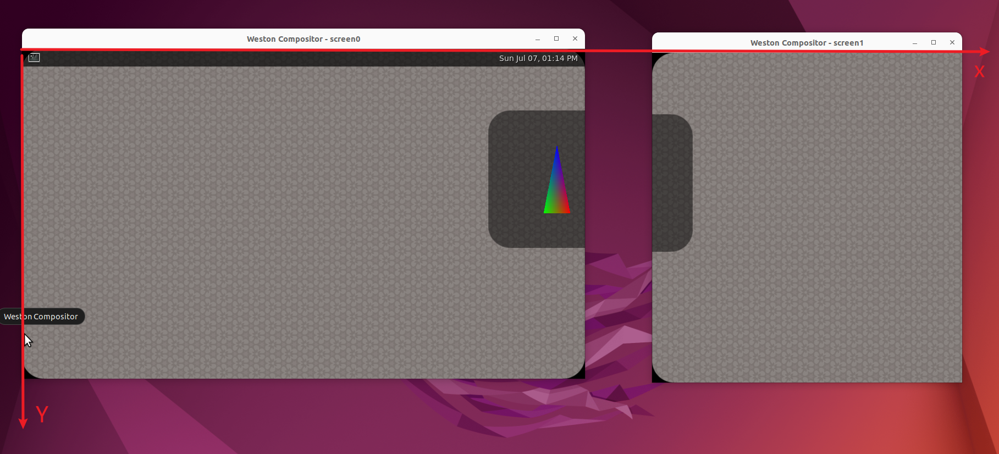
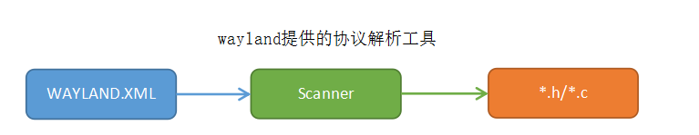
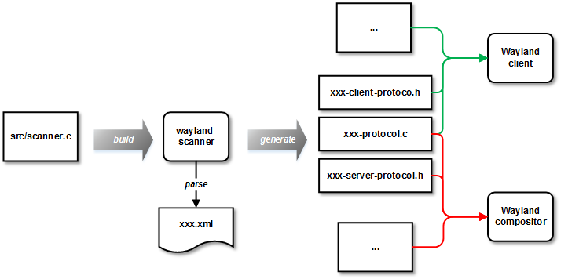
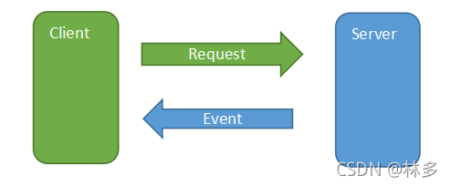
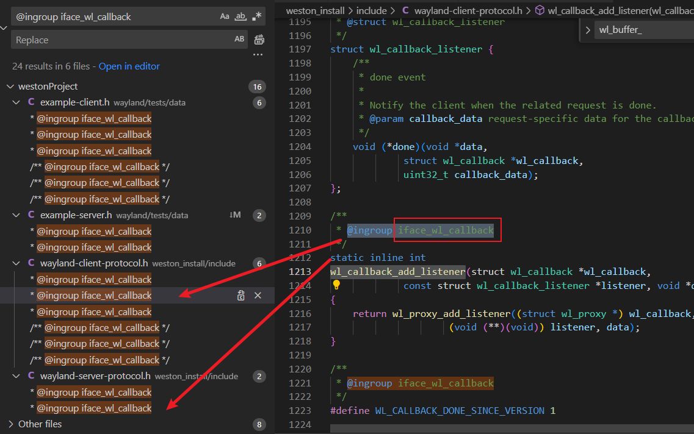
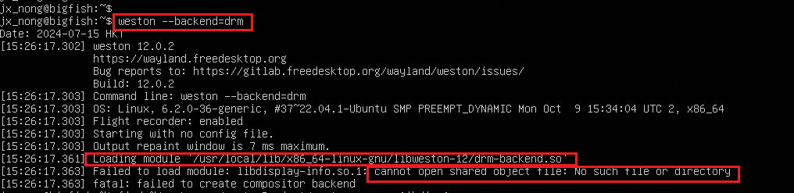

# 目录

# 窗口管理


## opaque region管理

https://blog.csdn.net/u012839187/article/details/120050552   display: weston: opaque region笔记


## 窗口的移动----------system move

图：	todo


system move功能实现逻辑的证明：

move 即 （每一帧的）事件event-重绘

system move要解决的问题是（功能）：

move的跟手性，即（2）保证 每一帧的 event-重绘  组合 -----> 必然：（1）在system侧 容易做到

由（1）必然要client给一个start  ----------- （1_1）

由（2），必然：之后client不管了  ----------- （1_2）

"（1_1）client给一个start" 流程：

```java
xdg_toplevel_move // client端
----------------wayland协议-------------------------
weston_desktop_xdg_toplevel_protocol_move
	weston_desktop_api_move
		desktop_surface_move (shell.c)
			surface_move (shell.c)
				shell_grab_start(move->base, &move_grab_interface, shsurf,  // 【】必然给了初始位置
				                 pointer, WESTON_DESKTOP_SHELL_CURSOR_MOVE) 
								 // 【】1_2之后不管，必然要：告诉compositor干什么(WESTON_DESKTOP_SHELL_CURSOR_MOVE)， 1_2_1
									                          告诉compositor怎么干(move_grab_interface)   1_2_2
```


1_2_2 compositor具体怎么干：

```java
// 必然定义在shell.c

static const struct weston_pointer_grab_interface move_grab_interface = { 
	noop_grab_focus,
	move_grab_motion, //【】
	move_grab_button,
	noop_grab_axis,
	noop_grab_axis_source,
	noop_grab_frame,
	move_grab_cancel,
};
```

其中 move_grab_motion， 必然出发compositor移动位置1_2_2_1，必然触发重绘1_2_2_2:

```java
weston_pointer_move_to (input.c)
	weston_pointer_move
		weston_view_set_position(shsurf->view, cx, cy)  // 【】1_2_2_1
			最终生效一行view->geometry.pos_offset && PAINT_NODE_VIEW_DIRTY
		weston_compositor_schedule_repaint(surface->compositor)； // 【】1_2_2_2
```


when，触发时机：必然是client端，收到down事件

```java
static const struct wl_touch_listener touch_listener = {
	touch_handle_down, //【】
	touch_handle_up,
	touch_handle_motion,
	touch_handle_frame,
	touch_handle_cancel,
};
```


TODO: 触发存在 点击和move的 冲突问题：
怎么解决？


## 窗口设置位置 & 层级   ----> TODO: 扩展协议里？？？？？


## 坐标系

结论：

>   1、两个屏幕，共用一个坐标系：
>
>   
>
>   2、一个屏幕 = 一个outPut


```java
// screen1:
[12:55:06.684] gl_renderer_repaint_output, output: 0x58f59137bf80, glViewport:(0, 0, 564, 600) //【】------>  相对于screen1（output1）坐标系！！！！！！
[12:55:06.684] gl_shader_config_init_for_paint_node. go->area:(0, 0, 564, 600)  
[12:55:06.684] gl_shader_config_init_for_paint_node. surface->width: 1024, surface->height: 600, 
[12:55:06.684] gl_shader_config_init_for_paint_node. pnode->view->geometry.pos_offset: (1024.000000, 0.000000) 
[12:55:06.684] gl_shader_config_init_for_paint_node. pnode->output: (1024, 0, 564, 600) 
[12:55:06.684] gl_shader_config_init_for_paint_node. go->area:(0, 0, 564, 600)  
[12:55:06.684] gl_shader_config_init_for_paint_node. surface->width: 250, surface->height: 250, 
[12:55:06.684] gl_shader_config_init_for_paint_node. pnode->view->geometry.pos_offset: (848.000000, 112.000000) //【】---> simple-egl的surface  相对于screen0 左上角（而不是screen1）
[12:55:06.684] gl_shader_config_init_for_paint_node. pnode->output: (1024, 0, 564, 600) 
[12:55:06.684] gl_shader_config_init_for_paint_node. go->area:(0, 0, 564, 600)  
[12:55:06.684] gl_shader_config_init_for_paint_node. surface->width: 32, surface->height: 32, 
[12:55:06.684] gl_shader_config_init_for_paint_node. pnode->view->geometry.pos_offset: (1015.000000, 508.000000) 
[12:55:06.684] gl_shader_config_init_for_paint_node. pnode->output: (1024, 0, 564, 600)                          //【】--> output1 相对于screen0！！！
----------------------------------------------------------------------------------------------------------------------------------------------------------------------------------------
// screen0:
[12:55:06.694] gl_renderer_repaint_output, output: 0x58f59134d460, glViewport:(0, 0, 1024, 600) 
[12:55:06.694] gl_shader_config_init_for_paint_node. go->area:(0, 0, 1024, 600)  
[12:55:06.694] gl_shader_config_init_for_paint_node. surface->width: 1024, surface->height: 600, 
[12:55:06.694] gl_shader_config_init_for_paint_node. pnode->view->geometry.pos_offset: (0.000000, 0.000000) 
[12:55:06.694] gl_shader_config_init_for_paint_node. pnode->output: (0, 0, 1024, 600) 
[12:55:06.694] gl_shader_config_init_for_paint_node. go->area:(0, 0, 1024, 600)  
[12:55:06.694] gl_shader_config_init_for_paint_node. surface->width: 250, surface->height: 250, 
[12:55:06.694] gl_shader_config_init_for_paint_node. pnode->view->geometry.pos_offset: (848.000000, 112.000000) 
[12:55:06.694] gl_shader_config_init_for_paint_node. pnode->output: (0, 0, 1024, 600) 
[12:55:06.695] surface_attach, buffer, (width:250, height:250), type:1 
```


# 输入管理


# wayland协议

## ~~Wayland核心协议，同安卓~~

参考：  ~~[【Wayland】Wayland协议说明](https://blog.csdn.net/zxc024000/article/details/121196682 )~~

位置： <font color='red'>系统中，自然，不在weston中（因为不是weston定义的！！！）</font>

> ​        ~~/usr/share/wayland/wayland.xml~~

在线：https://github.com/nobled/wayland/blob/master/protocol/wayland.xml

原理同 安卓AIDL：

> 
>
> [图来源](https://blog.csdn.net/zxc024000/article/details/121196682)
>
> 
>
> [图来源](https://cloud.tencent.com/developer/article/1445734#:~:text=%E7%94%9F%E6%88%90Weston%E4%B8%AD%E7%9A%84-,Wayland%E6%89%A9%E5%B1%95%E5%8D%8F%E8%AE%AE%E4%B8%AD%E8%B5%B7%E5%90%8C%E6%A0%B7%E4%BD%9C%E7%94%A8,-%E3%80%82)
>
> **关键：XXX**


具体例子： 以 <font color='red'>wl_</font>surface_commit 接口为例：

> ~~位置：/home/chen/kde/usr/share/wayland/~~
>
> ~~wayland.xml  ：~~ 
>
> ```java
> <request name="commit">
> <description summary="commit pending surface state">
> ```
>
> ----------> 生成：
>
> ```java
> // client
> wayland-client-protocol.h(应该是kde目录下的)
> 
> wayland-protocol.c  // 【】 核心通信层
> 
> // server
> wayland-server-protocol.h
> ```
>
> 


Linux编译，查找.h

```java
/usr/         存放系统头文件的位置, 供编译器在编译过程中使用。
/home/chen/kde/usr/
```


### wayland-protocol.c  核心通信层

位置： **不在weston项目里**


图：

> 
>
> [图来源](https://blog.csdn.net/zxc024000/article/details/121196682#:~:text=%E4%BA%86%E6%B6%88%E6%81%AF%E7%9A%84-,%E5%9B%BA%E5%AE%9A%E6%A0%BC%E5%BC%8F,-%E3%80%82%E8%AF%A6%E7%BB%86%E8%AF%B7%E5%8F%82%E8%80%83)


```java
// code\wayland\build\src\wayland-protocol.c
WL_EXPORT const struct wl_interface wl_surface_interface = {
	"wl_surface", 6,
	11, wl_surface_requests,  //
	4, wl_surface_events,  // 
};


static const struct wl_message wl_surface_requests[] = {  // 【requests】  ---> 
	{ "destroy", "", wayland_types + 0 },
	{ "attach", "?oii", wayland_types + 58 },
	{ "damage", "iiii", wayland_types + 0 },
	{ "frame", "n", wayland_types + 61 },
	{ "set_opaque_region", "?o", wayland_types + 62 },
	{ "set_input_region", "?o", wayland_types + 63 },
	{ "commit", "", wayland_types + 0 },     // 【】 对应 wl_surface_commit 
	{ "set_buffer_transform", "2i", wayland_types + 0 },
	{ "set_buffer_scale", "3i", wayland_types + 0 },
	{ "damage_buffer", "4iiii", wayland_types + 0 },
	{ "offset", "5ii", wayland_types + 0 },
};

同理，wl_shell_surface_requests[]  ----> move、resize、set_toplevel...........
    

static const struct wl_message wl_surface_events[] = {  // 【events】  <-----
	{ "enter", "o", wayland_types + 64 },
	{ "leave", "o", wayland_types + 65 },
	{ "preferred_buffer_scale", "6i", wayland_types + 0 },
	{ "preferred_buffer_transform", "6u", wayland_types + 0 },
};
```

 **【requests】的 具体实现**------------weston实现：

> // 代码搜索： surface_interface 
>
> ```java
> // compositor.c
> 
> static const struct wl_surface_interface surface_interface = {
> 	surface_destroy,
> 	surface_attach,
> 	surface_damage,
> 	surface_frame,
> 	surface_set_opaque_region,
> 	surface_set_input_region,
> 	surface_commit,  // 【】 最终走到这里
> 	surface_set_buffer_transform,
> 	surface_set_buffer_scale,
> 	surface_damage_buffer,
> 	surface_offset,
> };
> ```
>
> 


结论：

> client的  commit直接提交给compositor了！！！！！


TODO:

1、底层原理，基于socket？

底层原理：桥梁是如何搭建起来的？

2、如何处理并发？


## 扩展协议

位置：

> ~~自然，位于Weston工程中~~
>
> ~~westonProject/weston/protocol/~~
>
> ​                                                ~~weston-desktop-shell.xml~~

-<font color='red'>TODO: </font>

重要！！！！！，为啥要扩展协议？，即：

>   wayland协议包括哪些？（为什么只包括这些？）
>
>   还需要哪些？（为什么需要这些？）、如何扩展？


## kwayland协议

kwin扩展的


https://zhuanlan.zhihu.com/p/690561669#:~:text=%E5%90%8C%E6%97%B6wayland%2Dscanner%E4%B9%9F%E9%9C%80%E8%A6%81%E5%9C%A8%E7%94%9F%E6%88%90Weston%E4%B8%AD%E7%9A%84

对应用接口 ---->  kwayland client端接口 ---->  kwayland server端接口 ----> 系统侧server能力

代码层面看结构：

> 头文件名：kwyland-server- ...................h    -------------->   处于这个里面的是server侧的接口
>
> 需要找


## 协议之 代码跳转技巧

### 技巧一：搜索 @ingroup iface

原理：client的 侧.h 与 server侧.h   <font color='red'>相关接口 共  @ingroup iface</font>

例1：client 侧 wl_callback_add_listener，server侧是如何回调的呢？

>   
>
>   ```java
>   // wayland-client-protocol.h
>   /**
>    * @ingroup iface_wl_callback
>    * @struct wl_callback_listener
>    */
>   struct wl_callback_listener {
>   	void (*done)(void *data,
>   		     struct wl_callback *wl_callback,
>   		     uint32_t callback_data);
>   };
>   
>   /**
>    * @ingroup iface_wl_callback
>    */
>   static inline int
>   wl_callback_add_listener(struct wl_callback *wl_callback,
>   			 const struct wl_callback_listener *listener, void *data)
>   {
>   	return wl_proxy_add_listener((struct wl_proxy *) wl_callback,
>   				     (void (**)(void)) listener, data);
>   }
>   ```
>
>   
>
>   ```java
>   // wayland-server-protocol.h
>   
>   /**
>    * @ingroup iface_wl_callback
>    */
>   static inline void
>   wl_callback_send_done(struct wl_resource *resource_, uint32_t callback_data)
>   {
>   	wl_resource_post_event(resource_, WL_CALLBACK_DONE, callback_data);
>   }
>   ```
>
>   结论： client 侧 wl_callback_add_listener  导致
>
>   ​             server侧 可以 wl_callback_send_done


## 参考

TODO:    https://blog.csdn.net/jinzhuojun/article/details/40264449    Wayland中的跨进程过程调用浅析

https://wayland.arktoria.org/2-protocol-design/high-level.html        The Wayland Protocol 中文版

https://wayland.app/protocols/               A better way to read Wayland documentation

# 配置(~~weston.ini~~)


所有的配置可选项：

> [Ubuntu Manpage: weston.ini - configuration file for Weston - the reference Wayland compositor](https://manpages.ubuntu.com/manpages/xenial/en/man5/weston.ini.5.html#shell section)
>
> https://blog.guoxiaozhong.cn/archives/1705288043757    有多屏管理的   ！！！！！好文！！！


[weston.ini配置](https://www.cnblogs.com/arnoldlu/p/18091352#:~:text=3.2-,weston.ini%E9%85%8D%E7%BD%AE,-weston%E5%90%AF%E5%8A%A8%E5%88%9D%E5%A7%8B)

详细解释：https://www.mankier.com/5/weston.ini   


实战：

```java
weston_config_section_get_bool(s, "color-management",
                   &color_management, false);
//	//【】 add by cg
//weston_config_section_get_bool(s, "color-management",
                   //&color_management, true);
```


## 大的ini配置流程：

读取ini配置（~~weston_compositor_init_config流程~~），给到weston_output、weston_compositor

在创建output流程里：gl_renderer_output_create()流程中可以拿到上述对象。。。部分数据封装给 gl_output_state 

在render流程里（~~gl_renderer_repaint_output~~）：    draw_paint_node，拿到 gl_output_state里的配置


## 具体weston.ini

配置panel：

```java
[shell]
panel-color=0x90ff0000
panel-position=none          // -----> 没有panel
```


# panel(状态栏)

## panel的配置

详细流程：[ Weston中panel的设置过程](https://zhuanlan.zhihu.com/p/400013643) 

​					[Weston中panel的渲染过程](https://zhuanlan.zhihu.com/p/402217843)

配置panel：

```java
[shell]
panel-color=0x90ff0000
panel-position=none          // -----> 没有panel
// 或 panel-position=top 
```

没有panel在 软件层的标志：

> ```java
> static void
> parse_panel_position(struct desktop *desktop, struct weston_config_section *s)
> {
> char *position;
> 
> desktop->want_panel = 1;
> 
> weston_config_section_get_string(s, "panel-position", &position, "top");
> if (strcmp(position, "top") == 0) {
> desktop->panel_position = WESTON_DESKTOP_SHELL_PANEL_POSITION_TOP;
> } else if (strcmp(position, "bottom") == 0) {
> desktop->panel_position = WESTON_DESKTOP_SHELL_PANEL_POSITION_BOTTOM;
> } else if (strcmp(position, "left") == 0) {
> desktop->panel_position = WESTON_DESKTOP_SHELL_PANEL_POSITION_LEFT;
> } else if (strcmp(position, "right") == 0) {
> desktop->panel_position = WESTON_DESKTOP_SHELL_PANEL_POSITION_RIGHT;
> } else {
> /* 'none' is valid here */
> if (strcmp(position, "none") != 0)
> fprintf(stderr, "Wrong panel position: %s\n", position);
> desktop->want_panel = 0;  // 【】没有panel在 软件层的标志
> }
> free(position);
> }
> ```
>
> 特别注意：没有panel时，<font color='red'>desktop->panel_position 值没有赋值，为0</font>。 即  WESTON_DESKTOP_SHELL_PANEL_POSITION_TOP


注意： panel有功能：显示应用图标，点击可以拉起应用？


疑问，TODO：

> panel的结构是怎样的？
>
> 代码结构、进程结构、显示结构


## 结构：panel走的是GPU合成

支撑的功能是啥？


# 实操


结论：

> （1）显示在哪个环境下 = 哪个合成器合成 
>
> ​     决定于环境变量：
>
> ```java
> WAYLAND_DISPLAY="wayland-1"
> ```
>
> （2） **哪里启动进程  与  显示在哪个环境下**，完全没有关系！！！！！

-----------------> 技巧：

在 ubuntu的 gnome桌面环境下，启动  weston-simple-egl：

> 可以显示在gnome桌面里（gnome的合成）
>
> 也可以显示在 weston桌面里 （weston合成）


## ~~虚拟机ubuntu安装weston桌面（走drm后端）~~

-<font color='red'>不优：因为会改变/usr/local/</font>

1、备份ubuntu（因为会改变系统）

2、编译 & 安装：

```java
rm -rf build/ && meson build/  -Dimage-webp=false  -Dbackend-vnc=false &&  ninja -C build/ install
```

**不指定 安装目录**   --prefix=$HOME/weston_install  

默认安装到系统目录下（/usr/local/）

3、在Ubuntu 终端内验证 /usr/local/下weston是否OK

```java
$ which weston
$  weston
```

报错：

```java
$ weston
weston: error while loading shared libraries: libweston-12.so.0: cannot open shared object file: No such file or directory
```

解决：

```java
$ export LD_LIBRARY_PATH=/usr/local/lib/x86_64-linux-gnu
```

----------------> ok, 但是weston作为桌面启动，需要加到   ~/.bashrc文件中

4、log out，选择weston作为后端  -----> 大概率黑屏

-<font color='red'>解决黑屏：</font>

> （1）先切换到<font color='red'>虚拟终端Ctrl+Alt+F4 /F3</font>, 手动起weston，查看报错：
>
> ```java
> weston --backend=drm
> ```
>
> 
>
> 或者 jouranctl 查看报错
>
> （2）添加环境变量：
>
> ```java
> // ~/.bashrc
> export LD_LIBRARY_PATH=/usr/local/lib/x86_64-linux-gnu
> ```
>
> ------------------> 已经验证OK，在<font color='red'>虚拟终端内</font>可以启动weston桌面
>
> （3）验证OK后，<font color='red'>切换图形界面  Ctrl+Alt+F2</font>
>
> ​	  log out， 重新登录
>
> ----------------> 还是不行，可能跟vnc有关？？？？

## 强制走drm后端-----启动weston_install/bin/weston

必要性：

> **走drm，才与真机最接近**

结论： **对于Linux，<font color='red'>drm有独占性</font>  **

所以：

1、退出其他图形界面（其实不退也可以，似乎自动切换了）

2、在<font color='red'>虚拟终端Ctrl+Alt+F4 /F3</font>, 手动启动source env.sh  &&  /home/chen/weston_install/bin/weston

优点：

> 1、不会改变ubuntu系统，**<font color='red'>极优</font>**
>
> ​     不用修改~/.bashrc环境变量
>
> 2、与在x11桌面环境下，运行的脚本&命令完全一致！！！！


# 一些名词 TODO

ivi-shell 

```java
https://wiki.automotivelinux.org/_media/agl-distro/agl_amm_xdg_support_a04.pdf
ivi-shell类似移动操作系统环境，窗口的大小位置完全由系统来布局，ivi-shell可以自己配置窗口的层级，并且每个窗口都可以默认分配一个id号来管理，在窗口管理上更加友好一些，但是没办法支持xdg-shell的一些协议，比如窗口拖动，窗口resize，还有drag操作。
desktop-shell就是一个类似PC多窗口的环境，只有固定的层级，进行层级扩展比较麻烦，并且窗口没有id号，只能通过窗口的name来管理窗口，但是desktop-shell和xdg是完全兼容的，所以现在做法其实就是在desktop的基础上扩展一些窗口管理的功能，这样比较好的兼容QT和Web。 
    
不改变wayland对生态的兼容性，这个是我们现在最基础原则， 不然摊子就太大了。除非后面我们有了自己的应用框架，再考虑随意改造。   
```

