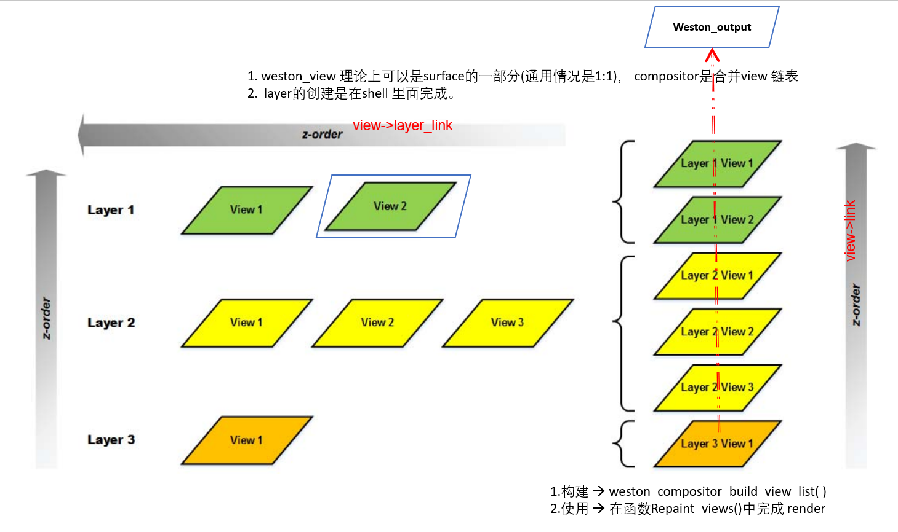
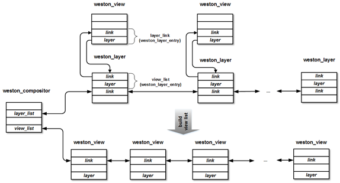
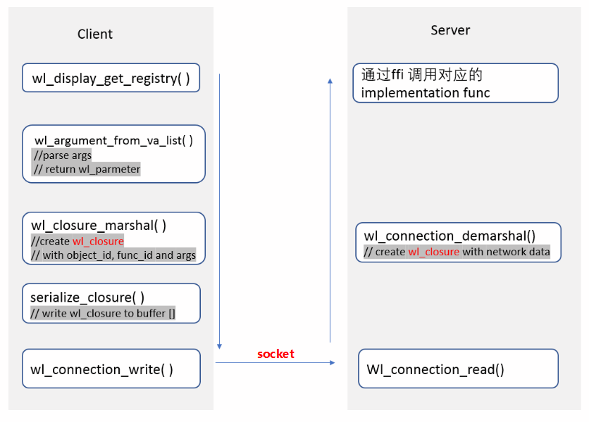
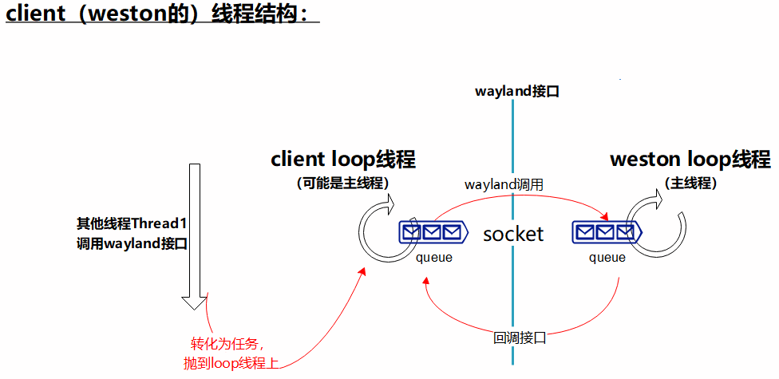
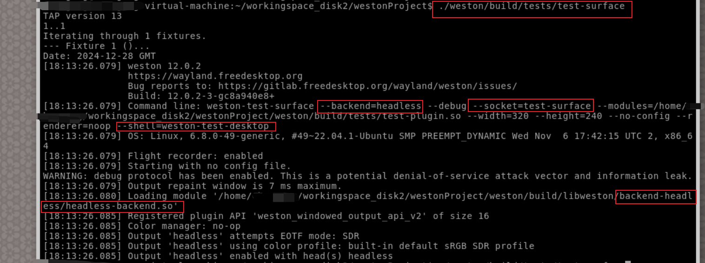
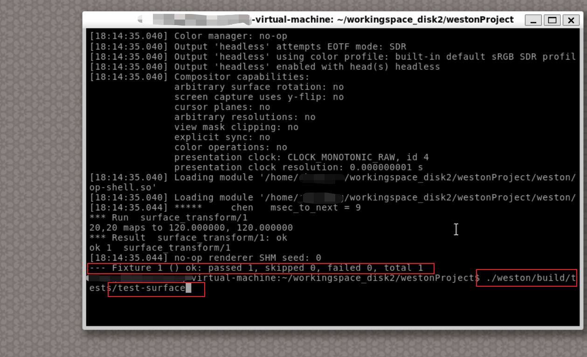

# 目录

# 窗口管理11


## opaque region管理

https://blog.csdn.net/u012839187/article/details/120050552   display: weston: opaque region笔记


## 窗口的移动----------system move

图：	todo


system move功能实现逻辑的证明：

move 即 （每一帧的）事件event-重绘

system move要解决的问题是（功能）：

move的跟手性，即（2）保证 每一帧的 event-重绘  组合 -----> 必然：（1）在system侧 容易做到

由（1）必然要client给一个start  ----------- （1_1）

由（2），必然：之后client不管了  ----------- （1_2）

"（1_1）client给一个start" 流程：

```java
xdg_toplevel_move // client端
----------------wayland协议-------------------------
weston_desktop_xdg_toplevel_protocol_move
	weston_desktop_api_move
		desktop_surface_move (shell.c)
			surface_move (shell.c)
				shell_grab_start(move->base, &move_grab_interface, shsurf,  // 【】必然给了初始位置
				                 pointer, WESTON_DESKTOP_SHELL_CURSOR_MOVE) 
								 // 【】1_2之后不管，必然要：告诉compositor干什么(WESTON_DESKTOP_SHELL_CURSOR_MOVE)， 1_2_1
									                          告诉compositor怎么干(move_grab_interface)   1_2_2
```


1_2_2 compositor具体怎么干：

```java
// 必然定义在shell.c

static const struct weston_pointer_grab_interface move_grab_interface = { 
	noop_grab_focus,
	move_grab_motion, //【】
	move_grab_button,
	noop_grab_axis,
	noop_grab_axis_source,
	noop_grab_frame,
	move_grab_cancel,
};
```

其中 move_grab_motion， 必然出发compositor移动位置1_2_2_1，必然触发重绘1_2_2_2:

```java
weston_pointer_move_to (input.c)
	weston_pointer_move
		weston_view_set_position(shsurf->view, cx, cy)  // 【】1_2_2_1
			最终生效一行view->geometry.pos_offset && PAINT_NODE_VIEW_DIRTY
		weston_compositor_schedule_repaint(surface->compositor)； // 【】1_2_2_2
```


when，触发时机：必然是client端，收到down事件

```java
static const struct wl_touch_listener touch_listener = {
	touch_handle_down, //【】
	touch_handle_up,
	touch_handle_motion,
	touch_handle_frame,
	touch_handle_cancel,
};
```


TODO: 触发存在 点击和move的 冲突问题：
怎么解决？


## 窗口设置位置 & 层级   ----> TODO: 扩展协议里？？？？？


## 窗口的Resize

### 目标：

从功能角度，必然：

最终目标：client重新创建buffer

```java
// 核心一行，重新创建buffer

(gdb) bt                                                       
#0  surface_create_surface (surface=0x5d8ea2727f40, flags=16)  
    at ../clients/window.c:1308                                
#1  0x00005d8ea258d0d2 in window_create_main_surface           
    (window=0x5d8ea2727d70) at ../clients/window.c:1332        
#2  0x00005d8ea258dc08 in widget_get_cairo_surface             
    (widget=0x5d8ea273df60) at ../clients/window.c:1644        
#3  0x00005d8ea2593b2f in surface_redraw                       
    (surface=0x5d8ea2727f40) at ../clients/window.c:4513       
#4  0x00005d8ea2593c31 in idle_redraw                          
     (task=0x5d8ea2727df0, events=0) at ../clients/window.c:455
3                                                              
#5  0x00005d8ea25989dc in display_run (display=0x5d8ea270fb10) 
    at ../clients/window.c:6888                                
#6  0x00005d8ea2588075 in main (argc=1, argv=0x7ffd9d89efa8)   
    at ../clients/terminal.c:3195   
```

之前其他线程的调用：

```java
gdb) bt                                                                    
#0  window_schedule_redraw_task (window=0x5d8ea2727d70)                     
    at ../clients/window.c:4584                                             
#1  0x00005d8ea2593dfc in window_schedule_redraw                            
    (window=0x5d8ea2727d70) at ../clients/window.c:4604                     
#2  0x00005d8ea259320b in window_schedule_resize                            
    (window=0x5d8ea2727d70, width=815, height=523)                          
    at ../clients/window.c:4218                                             
#3  0x00005d8ea2593574 in xdg_toplevel_handle_configure  -------->  // 【】来源weston调用                 
    (data=0x5d8ea2727d70, xdg_toplevel=0x5d8ea27280d0, width=751, height=459
, states=0x5d8ea2843800)                                                    
    at ../clients/window.c:4326                                             
#4  0x0000766f73f68e2e in  ()                                               
    at /lib/x86_64-linux-gnu/libffi.so.8                                    
#5  0x0000766f73f65493 in  ()                                               
    at /lib/x86_64-linux-gnu/libffi.so.8                                    
#6  0x0000766f744e9e81 in wl_closure_invoke                                 
    (closure=closure@entry=0x5d8ea2843730, flags=flags@entry=1, target=<opti
mized out>,                                                                 
    target@entry=0x5d8ea27280d0, opcode=opcode@entry=0, data=<optimized out>
) at ../src/connection.c:1025                                               
#7  0x0000766f744e609a in dispatch_event                                    
    (display=display@entry=0x5d8ea270fc60, queue=0x5d8ea270fd50, queue=<opti
mized out>) at ../src/wayland-client.c:1631                                 
#8  0x0000766f744e7a5c in dispatch_queue                                    
    (queue=0x5d8ea270fd50, display=0x5d8ea270fc60)                          
    at ../src/wayland-client.c:1777                                         
#9  wl_display_dispatch_queue_pending                                       
    (display=0x5d8ea270fc60, queue=0x5d8ea270fd50)                          
    at ../src/wayland-client.c:2019                                         
#10 0x00005d8ea2598000 in handle_display_data                               
     (task=0x5d8ea270fb78, events=1) at ../clients/window.c:6623            
#11 0x00005d8ea2598b38 in display_run (display=0x5d8ea270fb10)              
    at ../clients/window.c:6912    
```


### resize的消息来源：weston侧

weston通知client （weston_desktop_xdg_toplevel_send_configure ---> xdg_toplevel_handle_configure）

```java
weston_desktop_xdg_toplevel_set_resizing
Breakpoint 4, weston_desktop_xdg_toplevel_set_resizing (dsurface=0x64ee3d1f6ca0, user_data=0x6
ee3d2720f0, resizing=true) at ../libweston/desktop/xdg-shell.c:685                            
685             struct weston_desktop_xdg_toplevel *toplevel = user_data;                     
(gdb) bt                                                                                      
#0  weston_desktop_xdg_toplevel_set_resizing                                                  
    (dsurface=0x64ee3d1f6ca0, user_data=0x64ee3d2720f0, resizing=true)                        
    at ../libweston/desktop/xdg-shell.c:685                                                   
#1  0x00007a36db7d101b in weston_desktop_surface_set_resizing                                 
    (surface=0x64ee3d1f6ca0, resizing=true)                                                   
    at ../libweston/desktop/surface.c:499                                                     
#2  0x00007a36d0b1d505 in surface_resize                                                      
    (shsurf=0x64ee3d2c1ed0, pointer=0x64ee3d27b260, edges=8)                                  
    at ../desktop-shell/shell.c:1485                                                          
#3  0x00007a36d0b1fe16 in desktop_surface_resize                                              
    (desktop_surface=0x64ee3d1f6ca0, seat=0x64ee3d192490, serial=1178, edges=WESTON_DESKTOP_SU
FACE_EDGE_RIGHT, shell=0x64ee3d1c2f10)                                                        
    at ../desktop-shell/shell.c:2611                                                          
#4  0x00007a36db7ce752 in weston_desktop_api_resize                                           
    (desktop=0x64ee3d1d1050, surface=0x64ee3d1f6ca0, seat=0x64ee3d192490, serial=1178, edges=W
STON_DESKTOP_SURFACE_EDGE_RIGHT)                                                              
    at ../libweston/desktop/libweston-desktop.c:210                                           
#5  0x00007a36db7d31bc in weston_desktop_xdg_toplevel_protocol_resize ---------->                         
    (wl_client=0x64ee3d1c5f80, resource=0x64ee3d25ead0, seat_resource=0x64ee3c960f70, serial=1
78, edges=XDG_TOPLEVEL_RESIZE_EDGE_RIGHT)                                                     
    at ../libweston/desktop/xdg-shell.c:489                                                   
#6  0x00007a36db4e2e2e in  () at /lib/x86_64-linux-gnu/libffi.so.8                            
#7  0x00007a36db4df493 in  () at /lib/x86_64-linux-gnu/libffi.so.8                            
#8  0x00007a36dba432d1 in wl_closure_invoke                                                   
    (closure=closure@entry=0x64ee3d72e130, flags=flags@entry=2, target=<optimized out>,       
    target@entry=0x64ee3d25ead0, opcode=opcode@entry=6, data=<optimized out>, data@entry=0x64e
3d1c5f80) at ../src/connection.c:1025                                                         
#9  0x00007a36dba3e302 in wl_client_connection_data                                           
    (fd=<optimized out>, mask=<optimized out>, data=0x64ee3d1c5f80)                           
    at ../src/wayland-server.c:438                                                            
#10 0x00007a36dba4116a in wl_event_loop_dispatch                                              
    (loop=0x64ee3c885330, timeout=timeout@entry=-1)                                           
    at ../src/event-loop.c:1027                                                               
#11 0x00007a36dba3eb25 in wl_display_run (display=0x64ee3c885240)                             
    at ../src/wayland-server.c:1493                                                           
#12 0x00007a36dba894e8 in wet_main                                                            
    (argc=1, argv=0x7ffff8ae8af8, test_data=0x0)                                              
    at ../compositor/main.c:4207                                                              
#13 0x000064ee3c2ab172 in main (argc=3, argv=0x7ffff8ae8af8)                                  
    at ../compositor/executable.c:33   
```


### xdg_toplevel_handle_configure

```java
state里有各种操作：
static void
xdg_toplevel_handle_configure(void *data, struct xdg_toplevel *xdg_toplevel,
			      int32_t width, int32_t height,
			      struct wl_array *states)
{
	struct window *window = data;
	uint32_t *p;

	window->maximized = 0;
	window->fullscreen = 0;
	window->resizing = 0;
	window->focused = 0;

	wl_array_for_each(p, states) {
		uint32_t state = *p;
		switch (state) {
		case XDG_TOPLEVEL_STATE_MAXIMIZED:
			window->maximized = 1;
			break;
		case XDG_TOPLEVEL_STATE_FULLSCREEN:
			window->fullscreen = 1;
			break;
		case XDG_TOPLEVEL_STATE_RESIZING:
			window->resizing = 1;
			break;
		case XDG_TOPLEVEL_STATE_ACTIVATED:
			window->focused = 1;
			break;
		default:
			/* Unknown state */
			break;
		}
	}
```


### 最小化

TODO: 与hide什么关系？

```java
接口：xdg_toplevel_set_minimized
参考：terminal.c
```


## 坐标系

结论：

>   1、两个屏幕，共用一个坐标系：
>
>   
>
>   2、一个屏幕 = 一个outPut


```java
// screen1:
[12:55:06.684] gl_renderer_repaint_output, output: 0x58f59137bf80, glViewport:(0, 0, 564, 600) //【】------>  相对于screen1（output1）坐标系！！！！！！
[12:55:06.684] gl_shader_config_init_for_paint_node. go->area:(0, 0, 564, 600)  
[12:55:06.684] gl_shader_config_init_for_paint_node. surface->width: 1024, surface->height: 600, 
[12:55:06.684] gl_shader_config_init_for_paint_node. pnode->view->geometry.pos_offset: (1024.000000, 0.000000) 
[12:55:06.684] gl_shader_config_init_for_paint_node. pnode->output: (1024, 0, 564, 600) 
[12:55:06.684] gl_shader_config_init_for_paint_node. go->area:(0, 0, 564, 600)  
[12:55:06.684] gl_shader_config_init_for_paint_node. surface->width: 250, surface->height: 250, 
[12:55:06.684] gl_shader_config_init_for_paint_node. pnode->view->geometry.pos_offset: (848.000000, 112.000000) //【】---> simple-egl的surface  相对于screen0 左上角（而不是screen1）
[12:55:06.684] gl_shader_config_init_for_paint_node. pnode->output: (1024, 0, 564, 600) 
[12:55:06.684] gl_shader_config_init_for_paint_node. go->area:(0, 0, 564, 600)  
[12:55:06.684] gl_shader_config_init_for_paint_node. surface->width: 32, surface->height: 32, 
[12:55:06.684] gl_shader_config_init_for_paint_node. pnode->view->geometry.pos_offset: (1015.000000, 508.000000) 
[12:55:06.684] gl_shader_config_init_for_paint_node. pnode->output: (1024, 0, 564, 600)                          //【】--> output1 相对于screen0！！！
----------------------------------------------------------------------------------------------------------------------------------------------------------------------------------------
// screen0:
[12:55:06.694] gl_renderer_repaint_output, output: 0x58f59134d460, glViewport:(0, 0, 1024, 600) 
[12:55:06.694] gl_shader_config_init_for_paint_node. go->area:(0, 0, 1024, 600)  
[12:55:06.694] gl_shader_config_init_for_paint_node. surface->width: 1024, surface->height: 600, 
[12:55:06.694] gl_shader_config_init_for_paint_node. pnode->view->geometry.pos_offset: (0.000000, 0.000000) 
[12:55:06.694] gl_shader_config_init_for_paint_node. pnode->output: (0, 0, 1024, 600) 
[12:55:06.694] gl_shader_config_init_for_paint_node. go->area:(0, 0, 1024, 600)  
[12:55:06.694] gl_shader_config_init_for_paint_node. surface->width: 250, surface->height: 250, 
[12:55:06.694] gl_shader_config_init_for_paint_node. pnode->view->geometry.pos_offset: (848.000000, 112.000000) 
[12:55:06.694] gl_shader_config_init_for_paint_node. pnode->output: (0, 0, 1024, 600) 
[12:55:06.695] surface_attach, buffer, (width:250, height:250), type:1 
```


## 窗口管理的核心-------view_list



[图来源](https://zhpower.github.io/blog/graphic/2002-05-15-Wayland&Weston.html)




# XDG shell协议 xdg_

好文：

 https://zhuanlan.zhihu.com/p/671331282  XDG shell基础

https://blog.csdn.net/chaojiangluo/article/details/135038579  XDG shell 深入探讨


# 输入管理

## 屏幕touch采样率

屏幕touch采样率 -------------> 可以理解为上报事件的频率？

屏幕Touch采样率高达240Hz以上

>   vivo X100 Ultra屏幕触控采样率是多少
>   普通场景采样率是130HZ，部分游戏场景采样率是300Hz，部分游戏场景瞬时采样率是2000HZ

## 设备树下的input子系统


[图](https://zhuanlan.zhihu.com/p/265078853#:~:text=%E5%A6%82%E5%9B%BE%2058.1.1.1-,%E6%89%80%E7%A4%BA,-%EF%BC%9A)

参考：https://zhuanlan.zhihu.com/p/265078853

## 事件的热插拔

weston 代码入口：

```java
// libweston/libinput-seat.c
udev_input_process_event(struct libinput_event *event)
{
	struct libinput *libinput = libinput_event_get_context(event);
	struct libinput_device *libinput_device =
		libinput_event_get_device(event);
	struct udev_input *input = libinput_get_user_data(libinput);
	int ret = 0;

	switch (libinput_event_get_type(event)) {
	case LIBINPUT_EVENT_DEVICE_ADDED:
		ret = device_added(input, libinput_device);
		break;
	case LIBINPUT_EVENT_DEVICE_REMOVED:
		ret = device_removed(input, libinput_device);
		break;
	default:
		evdev_device_process_event(event);
		break;
	}

	return ret;
}
```


# 事件

## 功能----抛开代码，用户角度的事件

```java
/run/udev/tags/seat
```

down事件：

> 个数一定要准确：
>
> 
>
> 从用户功能角度看：<font color='red'>一个屏幕上只能同时操作一个窗口 </font>  **（即touch的焦点窗口**）--------> 这一个就是由第一个down事件决定的
>
> ​                                推论：（1）<font color='red'>第一个down事件决定了焦点窗口</font>
>
> ​                                           （2）自然，第二个down事件，一定不会被分发（~~weston中是input.c做的~~）
>
> ​                                          （3）自然，后续的motion、up事件都会传给焦点，<font color='red'>即使触摸位置不在焦点窗口上</font>
>
> 关于多指的down事件：手势识别，必然是在分发之前，做的手势识别：
>
> ​									 <font color='red'>如果识别为系统手势，便不在分发事件给窗口</font>
>
> 

~~up事件：~~

> 个数不需要准确：个数 > touch_down个数，就行(多的会被input.c过滤掉)


motion事件（同frame事件）：

> 需要在up之前（up之后事件，会被 拦截，不会给到应用）


结论：

> where------weston中：
>
> down 和 up事件之后一定要跟着frame事件，否则，不会生效

例子：

> up事件后，如果没有frame事件，显示一直按压


## weston事件 窗口分发逻辑

-<font color='red'>基本原则：</font>

> <font color='red'>事件分发层级</font> = 窗口管理层级（大调：weston layer层级，<font color='red'>小调：weston view_list</font>），即weston framework层的**软件层级**

**其实就是根据 weston view_lis 分发的事件！**（ layer层级最终也是转化为view_list）


技巧，可以判定   软件层级：

> 将两个窗口重叠，拖动  -----------> **拖动的窗口一定在上**（事件是从上往下分发的）
>
> 注：可能是两个layer，也可能是同一layer，不同view_list层级


-<font color='red'>显示层级 = </font>窗口管理层级 + 合成层级 + plane分配层级 + 硬件plane配置层级


代码：


##  0层大纲 (TODO)


# client - weston通信----IPC机制

where：这个IPC机制，实现于wayland协议，是wayland协议的一部分（以wl_开头）

## 原理

参考：[内部weston - client 通讯机制](https://zhpower.github.io/blog/jekyll/2002-06-11-Weston.html#:~:text=2.2-,%E5%86%85%E9%83%A8weston%20%2D%20client%20%E9%80%9A%E8%AE%AF%E6%9C%BA%E5%88%B6,-request%3A%20Client%20%E2%80%93%3E%20Server)



-<font color='red'>request方向</font>: Client –> Server

-<font color='red'>event方向 </font>: Server –> Client


-<font color='red'>任何IPC的模型本质都是：</font>

>   <font color='red'> 函数调用 转 数据流  再转 函数调用的过程：</font>
>
>   ~~client的函数 + 参数  ---------转化为----> <font color='red'>msg数据流</font>(函数名、参数序列化)  ------转化为-----> server的 函数 + 参数~~

通信方式无所谓（~~binder、socket、vsock 、pipe.................都可以~~）


## client链接失败常见原因

通信：socket

所以client链接失败的原因：

>   1、weston挂了  
>
>   2、环境变量问题


# wayland协议

## ~~Wayland核心协议，同安卓~~

参考：  ~~[【Wayland】Wayland协议说明](https://blog.csdn.net/zxc024000/article/details/121196682 )~~

位置： <font color='red'>系统中，自然，不在weston中（因为不是weston定义的！！！）</font>

> ​        ~~/usr/share/wayland/wayland.xml~~

在线：https://github.com/nobled/wayland/blob/master/protocol/wayland.xml

原理同 安卓AIDL：

> 
>
> [图来源](https://blog.csdn.net/zxc024000/article/details/121196682)
>
> 
>
> [图来源](https://cloud.tencent.com/developer/article/1445734#:~:text=%E7%94%9F%E6%88%90Weston%E4%B8%AD%E7%9A%84-,Wayland%E6%89%A9%E5%B1%95%E5%8D%8F%E8%AE%AE%E4%B8%AD%E8%B5%B7%E5%90%8C%E6%A0%B7%E4%BD%9C%E7%94%A8,-%E3%80%82)
>
> **关键：XXX**


具体例子： 以 <font color='red'>wl_</font>surface_commit 接口为例：

> ~~位置：/home/chen/kde/usr/share/wayland/~~
>
> ~~wayland.xml  ：~~ 
>
> ```java
> <request name="commit">
> <description summary="commit pending surface state">
> ```
>
> ----------> 生成：
>
> ```java
> // client
> wayland-client-protocol.h(应该是kde目录下的)
> 
> wayland-protocol.c  // 【】 核心通信层
> 
> // server
> wayland-server-protocol.h
> ```
>
> 


Linux编译，查找.h

```java
/usr/         存放系统头文件的位置, 供编译器在编译过程中使用。
/home/chen/kde/usr/
```


### wayland-protocol.c  核心通信层

位置： **不在weston项目里**


图：

> 
>
> [图来源](https://blog.csdn.net/zxc024000/article/details/121196682#:~:text=%E4%BA%86%E6%B6%88%E6%81%AF%E7%9A%84-,%E5%9B%BA%E5%AE%9A%E6%A0%BC%E5%BC%8F,-%E3%80%82%E8%AF%A6%E7%BB%86%E8%AF%B7%E5%8F%82%E8%80%83)


```java
// code\wayland\build\src\wayland-protocol.c
WL_EXPORT const struct wl_interface wl_surface_interface = {
	"wl_surface", 6,
	11, wl_surface_requests,  //
	4, wl_surface_events,  // 
};


static const struct wl_message wl_surface_requests[] = {  // 【requests】  ---> 
	{ "destroy", "", wayland_types + 0 },
	{ "attach", "?oii", wayland_types + 58 },
	{ "damage", "iiii", wayland_types + 0 },
	{ "frame", "n", wayland_types + 61 },
	{ "set_opaque_region", "?o", wayland_types + 62 },
	{ "set_input_region", "?o", wayland_types + 63 },
	{ "commit", "", wayland_types + 0 },     // 【】 对应 wl_surface_commit 
	{ "set_buffer_transform", "2i", wayland_types + 0 },
	{ "set_buffer_scale", "3i", wayland_types + 0 },
	{ "damage_buffer", "4iiii", wayland_types + 0 },
	{ "offset", "5ii", wayland_types + 0 },
};

同理，wl_shell_surface_requests[]  ----> move、resize、set_toplevel...........
    

static const struct wl_message wl_surface_events[] = {  // 【events】  <-----
	{ "enter", "o", wayland_types + 64 },
	{ "leave", "o", wayland_types + 65 },
	{ "preferred_buffer_scale", "6i", wayland_types + 0 },
	{ "preferred_buffer_transform", "6u", wayland_types + 0 },
};
```

 **【requests】的 具体实现**------------weston实现：

> // 代码搜索： surface_interface 
>
> ```java
> // compositor.c
> 
> static const struct wl_surface_interface surface_interface = {
> 	surface_destroy,
> 	surface_attach,
> 	surface_damage,
> 	surface_frame,
> 	surface_set_opaque_region,
> 	surface_set_input_region,
> 	surface_commit,  // 【】 最终走到这里
> 	surface_set_buffer_transform,
> 	surface_set_buffer_scale,
> 	surface_damage_buffer,
> 	surface_offset,
> };
> ```
>
> 


结论：

> client的  commit直接提交给compositor了！！！！！


TODO:

1、底层原理，基于socket？

底层原理：桥梁是如何搭建起来的？

2、如何处理并发？


## 扩展协议

位置：

> ~~自然，位于Weston工程中~~
>
> ~~westonProject/weston/protocol/~~
>
> ​                                                ~~weston-desktop-shell.xml~~

-<font color='red'>TODO: </font>

重要！！！！！，为啥要扩展协议？，即：

>   wayland协议包括哪些？（为什么只包括这些？）
>
>   还需要哪些？（为什么需要这些？）、如何扩展？


## kwayland协议

kwin扩展的


https://zhuanlan.zhihu.com/p/690561669#:~:text=%E5%90%8C%E6%97%B6wayland%2Dscanner%E4%B9%9F%E9%9C%80%E8%A6%81%E5%9C%A8%E7%94%9F%E6%88%90Weston%E4%B8%AD%E7%9A%84

对应用接口 ---->  kwayland client端接口 ---->  kwayland server端接口 ----> 系统侧server能力

代码层面看结构：

> 头文件名：kwyland-server- ...................h    -------------->   处于这个里面的是server侧的接口
>
> 需要找


## 协议之 代码跳转技巧

### 技巧一：搜索 @ingroup iface

原理：client的 侧.h 与 server侧.h   <font color='red'>相关接口 共  @ingroup iface</font>

例1：client 侧 wl_callback_add_listener，server侧是如何回调的呢？

>   
>
>   ```java
>   // wayland-client-protocol.h
>   /**
>    * @ingroup iface_wl_callback
>    * @struct wl_callback_listener
>    */
>   struct wl_callback_listener {
>   	void (*done)(void *data,
>   		     struct wl_callback *wl_callback,
>   		     uint32_t callback_data);
>   };
>   
>   /**
>    * @ingroup iface_wl_callback
>    */
>   static inline int
>   wl_callback_add_listener(struct wl_callback *wl_callback,
>   			 const struct wl_callback_listener *listener, void *data)
>   {
>   	return wl_proxy_add_listener((struct wl_proxy *) wl_callback,
>   				     (void (**)(void)) listener, data);
>   }
>   ```
>
>   
>
>   ```java
>   // wayland-server-protocol.h
>   
>   /**
>    * @ingroup iface_wl_callback
>    */
>   static inline void
>   wl_callback_send_done(struct wl_resource *resource_, uint32_t callback_data)
>   {
>   	wl_resource_post_event(resource_, WL_CALLBACK_DONE, callback_data);
>   }
>   ```
>
>   结论： client 侧 wl_callback_add_listener  导致
>
>   ​             server侧 可以 wl_callback_send_done


## 参考

TODO:    https://blog.csdn.net/jinzhuojun/article/details/40264449    Wayland中的跨进程过程调用浅析

https://wayland.arktoria.org/2-protocol-design/high-level.html        The Wayland Protocol 中文版

https://wayland.app/protocols/               A better way to read Wayland documentation


# client（weston 的）线程结构

## 结构




## loop线程（可以不是主线程）

执行：

```java
while (true) { // 主loop
	wl_display_dispatch_pending(m_display);
	// ...........

	wl_display_roundtrip(m_display);
}
```


结论：

> （1）client ---> weston 调用，<font color='red'>要在主loop  &  主loop线程里执行</font>
>
> ~~（2）weston ---> client, 同样~~
>
> （3）安卓or weston：主loop线程，一定不能做耗时操作（会阻塞所有事件）

## 线程切换

结论：

> dds/binder调用client，是一个随机线程。**要切换线程才能调用weston**

**切换线程例子：**

（1）安卓的handler（本质epoll）

（2）weston client：

```java
 while (true) {
    wl_display_dispatch_pending(m_display);


    std::function<void()> task;
    {
        std::unique_lock<std::mutex> lock(m_mutex);
        m_condition.wait(lock, [this] { return !m_tasks.empty() || m_stop; });
        if (m_stop && m_tasks.empty()) {
            break;
        }
        task = std::move(m_tasks.front());
        m_tasks.pop();
    }
    task(); // exec task


    wl_display_roundtrip(m_display);
}
```

原理：

> -> weston：任意一个线程，把调用转成task，**往loop线程的m_tasks队列抛**
>
> weston->：<font color='red'>往loop线程里拿到了weston给的结果</font>，   **会在loop线程直接执行**

补充：

> 线程切换，属于多对一模型，必然存在锁

# 配置(~~weston.ini~~)

## 参考+


所有的配置可选项：

> [Ubuntu Manpage: weston.ini - configuration file for Weston - the reference Wayland compositor](https://manpages.ubuntu.com/manpages/xenial/en/man5/weston.ini.5.html#shell section)
>
> https://blog.guoxiaozhong.cn/archives/1705288043757    有多屏管理的   ！！！！！好文！！！


[weston.ini配置](https://www.cnblogs.com/arnoldlu/p/18091352#:~:text=3.2-,weston.ini%E9%85%8D%E7%BD%AE,-weston%E5%90%AF%E5%8A%A8%E5%88%9D%E5%A7%8B)

详细解释：https://www.mankier.com/5/weston.ini   


实战：

```java
weston_config_section_get_bool(s, "color-management",
                   &color_management, false);
//	//【】 add by cg
//weston_config_section_get_bool(s, "color-management",
                   //&color_management, true);
```


## 配置入口

执行：

```java
--config=FILE     Config file to load, defaults to weston.

weston --config=weston.ini
```


ini的来源 & 参考：

```java
// build目录下：
/weston/build/compositor/weston.ini
/weston/build/ivi-shell/weston.ini
```


## 大的ini配置流程：

读取ini配置（~~weston_compositor_init_config流程~~），给到weston_output、weston_compositor

在创建output流程里：gl_renderer_output_create()流程中可以拿到上述对象。。。部分数据封装给 gl_output_state 

在render流程里（~~gl_renderer_repaint_output~~）：    draw_paint_node，拿到 gl_output_state里的配置


## 具体weston.ini

配置panel：

```java
[shell]
panel-color=0x90ff0000
panel-position=none          // -----> 没有panel
```


# shell

## 0层图


图来源：《weston.eddx》

1、从功能角度：

desktop-shell.c ---------<font color='red'>安卓的SystemUI：</font>

>   提供桌面环境的外观：桌面背景（Wallpaper）、面板（Panel）、TODO: 启动器（Launcher）、锁屏界面UI
>
>   行为:  TODO: 窗口的状态（最大化、最小化、全屏等）

shell.c----------即 <font color='red'>安卓的wms：</font>

>   ~~负责管理 Weston 的**窗口管理（xy布局、xy移动、xy的resize、z层级、焦点管理、事件分发目标窗口？？？）~~**
>
>   ​                                 ~~扩展功能：窗口动画、屏幕锁定~~
>
>   TODO: 负责启动 desktop-shell进程？

**与安卓不同的是：**

>   weston的wms有几套可供选择：shell.c(desk-top)、ivi-shell.c
>
>   ​              systemUI 也有几套可供选择

2、从编译产物角度

>   desktop-shell.c -----> desktop-shell 可执行文件
>
>   shell.c  ------> desktop-shell.so 被weston进程直接调用


## 次要：weston的 wms的选择 ：--shell=desktop

代码-----------------desktop-shell.so加载  ：

```java
// main.c
static int
wet_load_shell(struct weston_compositor *compositor,
	       const char *_name, int *argc, char *argv[])
{
	char *name;
	int (*shell_init)(struct weston_compositor *ec,
			  int *argc, char *argv[]);

	if (strstr(_name, "-shell.so"))
		name = strdup(_name);
	else
		str_printf(&name, "%s-shell.so", _name); // 加载对应的so
	assert(name);
    
    shell_init = weston_load_module(name, "wet_shell_init", MODULEDIR);
```

## 次要：client desktop-shell 进程的启动


## weston中shell.c 与 desktop-shell.c文件的差别，分别跑在哪个进程-----chatGpt回答

### **`shell.c`**

#### **作用**

-   `shell.c` 是 Weston 的核心 **外壳实现**，主要运行在 Weston 服务端（Compositor）进程中。
-   它负责管理 Weston 的基本 **窗口管理逻辑**，包括窗口的布局、焦点管理、交互逻辑（如手势支持）等。
-   它为不同的外壳模块（如 `desktop-shell`）提供通用的支持。

#### **特点**

-   **位于服务端**：运行在 Weston 的服务端（即 `weston` 进程）中。
-   提供通用的窗口管理接口和逻辑，比如：
    -   管理 `weston_surface` 和 `weston_view`。
    -   处理输入事件并将其分发给目标窗口。
    -   支持扩展功能，如屏幕锁定、窗口动画、任务栏管理等。

#### **核心逻辑**

-   负责初始化和管理 Weston 的核心外壳组件（如 `shell_surface` 和 `shell_client`）。
-   提供对外壳协议的实现（如 `weston_desktop_shell` 接口）。
-   加载外部外壳模块，如 `desktop-shell`。

------

### **`desktop-shell.c`**

#### **作用**

-   `desktop-shell.c` 是一个 Weston 的 **外壳客户端实现**，通常作为一个独立的进程运行，负责提供桌面环境的外观和行为。
-   它定义了桌面环境的具体行为和外观，例如：
    -   桌面背景（Wallpaper）。
    -   面板（Panel，例如任务栏）。
    -   启动器（Launcher）。
    -   锁屏界面。

#### **特点**

-   **位于客户端**：运行在独立的外壳客户端进程中（通常是 `desktop-shell`）。
-   与 Weston 服务端通过 Wayland 协议通信，告诉 Weston 如何布局和管理窗口。

#### **核心逻辑**

-   `desktop-shell` 是服务端 `shell` 的用户级实现，提供更高层的 UI 和交互功能。
-   通过与 Weston 的 shell.c通信，指定窗口的具体外观和行为，例如：
    -   哪些窗口是面板或背景。
    -   窗口的状态（最大化、最小化、全屏等）。
    -   响应输入事件并更新桌面外观。

------

### **两者的关系**

-   **`shell.c`** 是运行在服务端的 **外壳管理框架**，它通过 Wayland 协议与客户端通信，并加载具体的外壳实现（如 `desktop-shell`）。
-   **`desktop-shell.c`** 是运行在客户端的具体外壳实现，通过提供用户界面组件（如面板和背景）与 Weston 服务端协作。

#### **启动流程**

1.  Weston 服务端启动，加载 `shell.c` 模块。
2.  `shell.c` 监听外壳协议，并等待外壳客户端连接。
3.  `desktop-shell` 客户端启动（如 `/usr/libexec/weston-desktop-shell`），通过协议与服务端交互。
4.  服务端和客户端协同工作：
    -   服务端管理窗口的布局和交互逻辑。
    -   客户端绘制 UI（背景、面板等）并定义桌面行为。

------

### **运行进程对比**

| 文件                  | 所属进程   | 主要职责                                                     |
| --------------------- | ---------- | ------------------------------------------------------------ |
| **`shell.c`**         | 服务端进程 | 窗口管理逻辑：布局、焦点、输入事件处理，加载外壳协议。       |
| **`desktop-shell.c`** | 客户端进程 | 桌面外壳：提供背景、面板、启动器等桌面 UI 组件，定义具体的桌面交互逻辑和外观。 |

------

### **举例：窗口布局调整流程** -------> TODO:!!!!!!

假设用户拖动窗口改变布局，以下是 `shell.c` 和 `desktop-shell.c` 的协作：

1.  **服务端 `shell.c`：**

    -   接收到用户输入事件。
    -   根据输入事件找到目标窗口并更新窗口的几何属性（`weston_view`）。
    -   更新 `view_list` 确定窗口的叠放次序。

2.  **客户端 `desktop-shell.c`：**

    -   响应服务端的状态变化（如窗口属性或布局变化）。---------> **resize，是<font color='red'>客户端systemUI 被动响应  </font>窗口大小改变的事件！！**
    -   如果需要，重新绘制面板或启动器来反映新状态。

    

    

    ### 举例2：TODO: 点击底下窗口，下面窗口active

    

### **总结**

-   **`shell.c`**：服务端模块，负责 Weston 的窗口管理和外壳框架，运行在 Weston 进程中。
-   **`desktop-shell.c`**：客户端模块，负责桌面外观和用户界面，运行在独立的外壳客户端进程中。


# xdg协议 与 wayland协议

## chatGpt回答：xdg协议 与 wayland协议 之间，什么关系？区别与联系是什么

### ** 基本概念**

#### **Wayland 协议**

-   **核心定义**：
    Wayland 协议是一个轻量级的显示服务器协议，定义了客户端（应用程序）与服务端（合成器，如 Weston）之间的通信方式。

-   主要职责

    ：

    提供最基础的窗口系统功能，比如：

    -   绘图缓冲管理。
    -   输入事件（鼠标、键盘、触摸）传递。
    -   表面（surface）的创建和管理。

-   **核心组件**：包括 `wl_surface`、`wl_output`、`wl_keyboard`、`wl_pointer` 等。

#### **XDG 协议**

-   **核心定义**：
    XDG 协议是 Wayland 协议的扩展之一，专注于桌面环境中窗口管理的高级功能。它是 `xdg-shell` 的实现协议。

-   主要职责

    ：

    提供桌面环境中窗口管理的高级功能，比如：

    -   窗口生命周期管理。
    -   窗口状态（最大化、最小化、全屏等）。
    -   应用启动上下文（如桌面启动器）。

XDG 协议主要通过 `xdg_shell` 接口实现，进一步抽象出桌面特有的功能。

------

### **作用和目标对比**

| 特性         | **Wayland 协议**                                 | **XDG 协议**                                    |
| ------------ | ------------------------------------------------ | ----------------------------------------------- |
| **功能范围** | 定义客户端与服务端通信的基础协议，提供底层功能。 | 提供桌面环境的窗口管理功能扩展。                |
| **目标场景** | 所有基于 Wayland 的场景，包括嵌入式、桌面等。    | 专注于桌面环境中的高级窗口管理。                |
| **是否必须** | 是，Wayland 是基础协议。                         | 否，但在桌面系统中几乎必需。                    |
| **协议接口** | `wl_surface`、`wl_buffer`、`wl_pointer` 等。     | `xdg_surface`、`xdg_toplevel`、`xdg_popup` 等。 |
| **窗口管理** | 不关心窗口的状态或行为，只提供表面管理。         | 处理窗口状态，如最大化、最小化等。              |

------

### **联系**

-   **依赖关系**：
    -   XDG 协议是基于 Wayland 协议的扩展，XDG 协议的实现依赖于 Wayland 提供的基础功能。例如，`xdg_surface` 是 `wl_surface` 的扩展。
    -   在实现 XDG 协议时，必须先使用 Wayland 协议创建基础的表面（`wl_surface`），再通过 XDG 协议为该表面绑定窗口管理功能。
-   **协作方式**：
    Wayland 负责基础的表面绘制和输入分发，XDG 协议通过高层接口定义窗口的行为（如最大化、全屏等），并通知 Wayland 服务端如何调整表面的布局。

------

### ** 区别**

| **类别**       | **Wayland 协议**                        | **XDG 协议**                               |
| -------------- | --------------------------------------- | ------------------------------------------ |
| **定位**       | 基础协议，提供最基本的绘制和输入功能。  | 高级协议，管理桌面系统中的窗口行为。       |
| **实现模块**   | 服务端和客户端都必须实现。              | 通常由桌面外壳（如 Weston 的 shell）实现。 |
| **功能细节**   | 不关心窗口状态，只管理表面（surface）。 | 提供窗口的高级状态（如全屏、弹窗）。       |
| **适用场景**   | 通用图形系统（嵌入式、桌面）。          | 专注于桌面系统的需求。                     |
| **开发复杂度** | 相对简单。                              | 更加复杂，需要定义高级窗口行为。           |

------

### ** 示例：创建一个窗口的流程**

#### 使用 Wayland 协议（基础流程）

1.  客户端向服务端创建一个 `wl_surface` 表面。
2.  客户端绑定绘图缓冲区（`wl_buffer`）。
3.  服务端合成并显示表面。

```
cCopy codestruct wl_surface *surface = wl_compositor_create_surface(compositor);
wl_surface_attach(surface, buffer, 0, 0);
wl_surface_commit(surface);
```

#### 使用 XDG 协议（高级流程）

1.  客户端首先创建 `wl_surface` 表面（Wayland 提供）。
2.  将 `wl_surface` 绑定到 `xdg_surface` 接口。
3.  设置 `xdg_toplevel`（窗口类型，如普通窗口）。
4.  服务端根据窗口属性（如全屏）调整表面布局。

```
cCopy codestruct wl_surface *surface = wl_compositor_create_surface(compositor);
struct xdg_surface *xdg_surface = xdg_wm_base_get_xdg_surface(wm_base, surface);
struct xdg_toplevel *toplevel = xdg_surface_get_toplevel(xdg_surface);

xdg_toplevel_set_title(toplevel, "My Window");
xdg_surface_commit(xdg_surface);
```

------

### **总结**

#### **联系**

-   Wayland 协议是基础协议，XDG 协议是 Wayland 的扩展协议。
-   XDG 协议依赖 Wayland 协议来提供低层表面和输入管理功能。

#### **区别**

-   Wayland 协议仅提供最基础的通信和表面管理功能，与窗口行为无关。
-   XDG 协议则为桌面系统增加了高级窗口管理功能，如最大化、最小化和弹窗等。

Wayland 是整个协议栈的基础，而 XDG 协议让 Wayland 在桌面环境中更加实用。两者相辅相成，共同构建现代 Wayland 桌面生态系统。

# panel(状态栏)

## panel的配置

详细流程：[ Weston中panel的设置过程](https://zhuanlan.zhihu.com/p/400013643) 

​					[Weston中panel的渲染过程](https://zhuanlan.zhihu.com/p/402217843)

配置panel：

```java
[shell]
panel-color=0x90ff0000
panel-position=none          // -----> 没有panel
// 或 panel-position=top 
```

没有panel在 软件层的标志：

> ```java
> static void
> parse_panel_position(struct desktop *desktop, struct weston_config_section *s)
> {
> char *position;
> 
> desktop->want_panel = 1;
> 
> weston_config_section_get_string(s, "panel-position", &position, "top");
> if (strcmp(position, "top") == 0) {
> desktop->panel_position = WESTON_DESKTOP_SHELL_PANEL_POSITION_TOP;
> } else if (strcmp(position, "bottom") == 0) {
> desktop->panel_position = WESTON_DESKTOP_SHELL_PANEL_POSITION_BOTTOM;
> } else if (strcmp(position, "left") == 0) {
> desktop->panel_position = WESTON_DESKTOP_SHELL_PANEL_POSITION_LEFT;
> } else if (strcmp(position, "right") == 0) {
> desktop->panel_position = WESTON_DESKTOP_SHELL_PANEL_POSITION_RIGHT;
> } else {
> /* 'none' is valid here */
> if (strcmp(position, "none") != 0)
> fprintf(stderr, "Wrong panel position: %s\n", position);
> desktop->want_panel = 0;  // 【】没有panel在 软件层的标志
> }
> free(position);
> }
> ```
>
> 特别注意：没有panel时，<font color='red'>desktop->panel_position 值没有赋值，为0</font>。 即  WESTON_DESKTOP_SHELL_PANEL_POSITION_TOP


注意： panel有功能：显示应用图标，点击可以拉起应用？


疑问，TODO：

> panel的结构是怎样的？
>
> 代码结构、进程结构、显示结构


## 结构：panel走的是GPU合成

支撑的功能是啥？


# animation Todo

```java

推论：
1、有个 镜像view，用来做动画
   what：animation_view, 本质是weston_view
   when：desktop_surface_committed 时创建的，原因在于：能创建时创建
   how：镜像view，也指向同一个weston_surface(多个buffer)
        证明：
			desktop_surface_committed
				shsurf->wview_anim_fade = shell_fade_create_fade_out_view(shsurf, surface);
		证明二：scene-graph里可以看出来：

				View 0 (role xdg_toplevel, PID 0, surface ID 0, [no description available], 0x6396150a5e40):
						position: (871, 659) -> (1121, 909)
						[not opaque]
						alpha: 0.807048  // 【】 有alpha值
						outputs: 0 (Virtual-1) (primary)
						dmabuf buffer
								[1 references may use buffer content]
								format: 0x34325241 ARGB8888
								modifier: NONE_INVALID (0xffffffffffffff)
								width: 250, height: 250

		二级推论：关于buffer的释放：（1）正常情况下：没有增加buffer的引用，会被释放掉
		                            （2）退出情况下：不应该会释放的！TODO
2、desktop_surface_removed 时启动动画
     weston_fade_run


3、动画真正结束后（weston_view_animation_frame end），还commit了一帧：不含 镜像view
   代码证明：
           	if (weston_spring_done(&animation->spring)) {
				weston_log("weston_view_animation_frame end");
				weston_view_schedule_repaint(animation->view);
				weston_view_animation_destroy(animation);
				return;
			}


次要推论：
   gpu合成层，不止一块framebuffer，所以动画commit下去的buffer，不能少于framebuffer个数（否则一定会造成闪烁，透明和有图之间交替）

其他次要场景：
    1、kill 应用与 CTRL c 一样，都有动画 
```


#  TODO: 消息驱动模型？

epoll机制：

> 
>
> [图来源](https://cloud.tencent.com/developer/article/1445734#:~:text=%E6%80%A7%E8%83%BD%E4%B8%8B%E9%99%8D%E6%88%96-,%E5%93%8D%E5%BA%94%E4%B8%8D%E5%8F%8A%E6%97%B6%E3%80%82,-%E4%B8%BB%E5%BE%AA%E7%8E%AF%E4%B8%8A)

特点：**串行**

~~具体对比：~~

> |              |        binder        |       weston事件机制       |
> | :----------: | :------------------: | :------------------------: |
> |     原理     |                      |           epoll            |
> | 是否并行化？ | 基于线程的并行？？？ |            串行            |
> |     优点     |                      |      不会有同步的开销      |
> |     缺点     |       ~~自然~~       | 有一个事件耗时，会阻塞其他 |
>
> [参考：](https://cloud.tencent.com/developer/article/1445734#:~:text=%E6%96%87%E4%BB%B6fd%E4%B8%8A%E3%80%82-,%E8%BF%99%E7%A7%8D%E6%A8%A1%E5%9E%8B%E4%B8%8E%E5%9F%BA%E4%BA%8E%E7%BA%BF%E7%A8%8B%E7%9A%84binder%E4%B8%8D%E5%90%8C,-%EF%BC%8C%E6%98%AF%E4%B8%80%E7%A7%8D%E4%B8%B2)


-**跨进程调用的通用套路：**

>   消息，转化为 函数调用（<font color='red'>根本原因</font>：**消息可以 跨进程**）


## weston的消息循环驱动模型

参考：
		https://blog.csdn.net/qqzhaojianbiao/article/details/129796828   Wayland中跨进程调用过程  消息处理模型！！！！！！！
		https://blog.csdn.net/goodboychina/article/details/26145175 Wayland消息队列
		https://www.cnblogs.com/Arnold-Zhang/p/15915635.html  wl_dispaly_dispatch线程安全分析

**client接口：** wl_display_dispatch 

**作用：**读取消息Queue（结构：client侧，server侧放入）   TODO: Queue


代码大纲：

```java
【client接口】wl_display_dispatch 
		wl_display_dispatch_queue ------------------\code\wayland\src\wayland-client.c-------
			wl_display_dispatch_queue_pending(display, queue)
				dispatch_queue(display, queue)
					遍历queue，dispatch_event, 赋值给closure
						wl_closure_dispatch（即client设置的lisner）
							// 【listener 处理事件】 具体listener见下:
```

server往client的Queue写： TODO:


补充【listener 处理事件】：client侧

```java
wl_proxy listener
wl_pointer_add_listener() 鼠标消息处理
wl_keyboard_add_listener() 键盘消息处理
wl_callback_add_listener() wl_callback 由wl_surface_frame() 创建，每当服务器显示下一帧使会给wl_callback发送一条消息。
原文链接：https://blog.csdn.net/goodboychina/article/details/26145175
```


# 通信之信号（wl_signal_emit）

1、范围：<font color='red'>同线程内，不会切换线程</font>  ------> 已经验证

2、`wl_signal_emit` 是**同步的**：-------> 已经验证

>   当调用 `wl_signal_emit` 时，它会立即遍历 `wl_signal` 的监听器链表，并依次调用每个监听器的回调函数；
>
>   整个过程在调用者的上下文中完成，回调函数是顺序执行的，必须等所有监听器的回调函数执行完毕后，`wl_signal_emit` 才会返回。

## chatGPT：wl_signal_emit函数的作用以及使用方法

### `wl_signal_emit` 函数作用

在 Weston 和 Wayland 中，`wl_signal_emit` 是用于向已注册的监听器（listeners）广播一个事件的函数。它通过一个 `wl_signal` 对象将事件分发给所有订阅者（即监听器）。这种机制类似于观察者模式，允许不同模块之间解耦并实现事件驱动的通信。

------

### 函数签名

```
c


Copy code
void wl_signal_emit(struct wl_signal *signal, void *data);
```

#### 参数说明：

1.  **`signal`**：指向一个 `wl_signal` 对象，表示要广播的事件。
2.  **`data`**：传递给监听器回调函数的数据（通常是触发事件的对象）。

------

### `wl_signal` 及其结构

`wl_signal` 是 Wayland 提供的一个事件对象，定义如下：

```
cCopy codestruct wl_signal {
    struct wl_list listener_list; // 链接了所有监听该信号的回调
};
```

-   **`listener_list`** 是一个链表，存储所有注册到该信号的监听器，每个监听器是一个 `wl_listener` 结构体。

#### `wl_listener` 的定义：

```
cCopy codestruct wl_listener {
    struct wl_list link;       // 链接到 wl_signal 的链表
    wl_notify_func_t notify;   // 回调函数指针
};
```

-   `notify`

     是当信号触发时调用的回调函数，函数签名如下：

    ```
    c
    
    
    Copy code
    typedef void (*wl_notify_func_t)(struct wl_listener *listener, void *data);
    ```

------

### `wl_signal_emit` 的工作原理

1.  遍历 `wl_signal` 的 `listener_list` 链表。
2.  对每个 `wl_listener`，调用其 `notify` 回调函数。
3.  将 `data` 作为参数传递给每个 `notify`。

这种机制允许多个模块同时监听某个事件，并在事件发生时同步触发它们的回调。

------

### 使用方法

#### 1. 初始化信号

在需要广播事件的模块中，初始化一个 `wl_signal` 对象。例如：

```
cCopy codestruct wl_signal destroy_signal;
wl_signal_init(&destroy_signal);
```

-   ```
    wl_signal_init
    ```

     函数只是简单地初始化了 

    ```
    listener_list
    ```

    ：

    ```
    cCopy codevoid wl_signal_init(struct wl_signal *signal) {
        wl_list_init(&signal->listener_list);
    }
    ```

#### 2. 注册监听器

其他模块通过向 `wl_signal` 注册 `wl_listener` 来监听事件。例如：

```
cCopy codestruct wl_listener destroy_listener;

void destroy_handler(struct wl_listener *listener, void *data) {
    // 事件处理逻辑
    struct my_surface *surface = data;
    printf("Surface %p destroyed\n", surface);
}

// 注册监听器
destroy_listener.notify = destroy_handler;
wl_signal_add(&destroy_signal, &destroy_listener);
```

-   ```
    wl_signal_add
    ```

     函数将监听器添加到信号的 

    ```
    listener_list
    ```

     中：

    ```
    cCopy codevoid wl_signal_add(struct wl_signal *signal, struct wl_listener *listener) {
        wl_list_insert(signal->listener_list.prev, &listener->link);
    }
    ```

#### 3. 触发信号

当某个事件发生时，使用 `wl_signal_emit` 触发信号。例如：

```
cCopy codestruct my_surface *surface = ...; // 当前对象
wl_signal_emit(&destroy_signal, surface);
```

-   所有注册到 `destroy_signal` 的监听器的 `notify` 回调都会被依次调用，并将 `surface` 作为参数传入。

------

### 示例：Weston 中 `wl_signal_emit` 的实际应用

在 Weston 的 `shsurf` 结构中，信号 `destroy_signal` 用于通知感兴趣的模块，当 `shsurf` 销毁时需要进行一些清理操作。例如：

```
c


Copy code
wl_signal_emit(&shsurf->destroy_signal, shsurf);
```

#### 流程分析

1.  `destroy_signal` 是 `shsurf` 中定义的信号，表示该对象的销毁事件。
2.  当 `wl_signal_emit` 被调用时，所有注册到 `shsurf->destroy_signal` 的监听器都会被依次调用。
3.  每个监听器通过其 `notify` 回调函数接收 `shsurf` 指针，并执行特定的销毁逻辑。

#### 注册监听器的模块

比如，某个模块可能会注册一个监听器来监听 `shsurf->destroy_signal`，以便在 `shsurf` 销毁时释放相关资源。

```
cCopy codestatic void handle_shsurf_destroy(struct wl_listener *listener, void *data) {
    struct my_module *module = wl_container_of(listener, module, shsurf_destroy_listener);
    struct weston_surface *surface = data;

    // 执行清理操作
    cleanup_module_resources(module, surface);
}

// 注册监听器
my_module->shsurf_destroy_listener.notify = handle_shsurf_destroy;
wl_signal_add(&shsurf->destroy_signal, &my_module->shsurf_destroy_listener);
```

------

### 总结

-   **`wl_signal_emit` 的作用**： 广播事件，通知所有注册的监听器，同时传递事件相关的数据。
-   **使用步骤**：
    1.  初始化信号：`wl_signal_init()`
    2.  注册监听器：`wl_signal_add()`
    3.  触发信号：`wl_signal_emit()`
-   **典型应用场景**： Weston 和 Wayland 使用 `wl_signal_emit` 广播生命周期事件（如对象销毁、资源释放等），实现模块化、解耦的事件驱动机制。


## wl_signal_emit 原理 & 代码实现

本质 

>   就是<font color='red'>同进程 添加listener</font>

-<font color='red'>从结构角度，为啥能解耦两个模块呢？</font>

>   原因在于C语言的   任意数据结构可以转  void \*


# TODO: 绑定快捷键 & weston启动client

```java
绑定快捷键
wet_shell_init
	screenshooter_create
		screenshooter_binding
			screenshooter_exe = wet_get_bindir_path("weston-screenshooter");
				weston_client_start 启动client程序
						client = wl_client_create(compositor->wl_display, wayland_socket.fds[0]);
```


# 通信之 抛主线程 ----同安卓的handler


## 方式一：**timer**方式  wl_event_loop_add_timer


## 方式二：epoll fd   ---------------同安卓的handler

本质：

>   1、<font color='red'>大循环的epoll监听添加的fd</font>
>
>   ```java
>   rdp_event_loop_add_fd
>   ```
>
>    2、次线程，往fd写东西
>
>   ```java
>   rdp_dispatch_task_to_display_loop(ctx, clipboard_data_source_publish, &source->task_base);
>   	eventfd_write(peerCtx->loop_task_event_source_fd, 1);
>   ```
>
>   3、epoll唤醒主线程，去读fd内写的东西
>
>   ```java
>   rdp_dispatch_task
>   	eventfd_read(peerCtx->loop_task_event_source_fd, &dummy);
>   	task->func(false, task);
>   ```
>
>   


关于fd的来源：

>   方式一：pipe创建：
>
>   方式二：
>
>   ```java
>   eventfd(0, EFD_SEMAPHORE | EFD_CLOEXEC);
>   ```
>
>   


因为线程切换，自然：task的添加，需要线程锁（同安卓的handler）

```java
	pthread_mutex_lock();

	wl_list_insert(&peerCtx->loop_task_list, &task->link);
	
	pthread_mutex_unlock();
```


## 方式三： TODO: window_schedule_redraw_task的切换


# 输入法  Wayland Input Methods

weston输入法：https://archive.fosdem.org/2013/schedule/event/waylandinput/attachments/slides/252/export/events/attachments/waylandinput/slides/252/FOSDEM2013_wayland_input_methods.pdf

------------> TODO: download

# 实操


结论：

> （1）显示在哪个环境下 = 哪个合成器合成 
>
> ​     决定于环境变量：
>
> ```java
> WAYLAND_DISPLAY="wayland-1"
> ```
>
> （2） **哪里启动进程  与  显示在哪个环境下**，完全没有关系！！！！！

-----------------> 技巧：

在 ubuntu的 gnome桌面环境下，启动  weston-simple-egl：

> 可以显示在gnome桌面里（gnome的合成）
>
> 也可以显示在 weston桌面里 （weston合成）


## ~~虚拟机ubuntu安装weston桌面（走drm后端）~~

-<font color='red'>不优：因为会改变/usr/local/</font>

1、备份ubuntu（因为会改变系统）

2、编译 & 安装：

```java
rm -rf build/ && meson build/  -Dimage-webp=false  -Dbackend-vnc=false &&  ninja -C build/ install
```

**不指定 安装目录**   --prefix=$HOME/weston_install  

默认安装到系统目录下（/usr/local/）

3、在Ubuntu 终端内验证 /usr/local/下weston是否OK

```java
$ which weston
$  weston
```

报错：

```java
$ weston
weston: error while loading shared libraries: libweston-12.so.0: cannot open shared object file: No such file or directory
```

解决：

```java
$ export LD_LIBRARY_PATH=/usr/local/lib/x86_64-linux-gnu
```

----------------> ok, 但是weston作为桌面启动，需要加到   ~/.bashrc文件中

4、log out，选择weston作为后端  -----> 大概率黑屏

-<font color='red'>解决黑屏：</font>

> （1）先切换到<font color='red'>虚拟终端Ctrl+Alt+F4 /F3</font>, 手动起weston，查看报错：
>
> ```java
> weston --backend=drm
> ```
>
> 
>
> 或者 jouranctl 查看报错
>
> （2）添加环境变量：
>
> ```java
> // ~/.bashrc
> export LD_LIBRARY_PATH=/usr/local/lib/x86_64-linux-gnu
> ```
>
> ------------------> 已经验证OK，在<font color='red'>虚拟终端内</font>可以启动weston桌面
>
> （3）验证OK后，<font color='red'>切换图形界面  Ctrl+Alt+F2</font>
>
> ​	  log out， 重新登录
>
> ----------------> 还是不行，可能跟vnc有关？？？？

## 强制走drm后端-----启动weston_install/bin/weston

必要性：

> **走drm，才与真机最接近**

结论： **对于Linux，<font color='red'>drm有独占性</font>  **

所以：

1、退出其他图形界面（其实不退也可以，似乎自动切换了）

2、在<font color='red'>虚拟终端Ctrl+Alt+F4 /F3</font>, 手动启动source env.sh  &&  /home/chen/weston_install/bin/weston

优点：

> 1、不会改变ubuntu系统，**<font color='red'>极优</font>**
>
> ​     不用修改~/.bashrc环境变量
>
> 2、与在x11桌面环境下，运行的脚本&命令完全一致！！！！


# 维测

## 限定模块范围（SCOPE）的日志

--logger-scopes=SCOPE

### drm-backend日志

weston --logger-scopes=drm-backend

--------> ok


```java
Output 0 (Virtual-1):  // 【】 Output 0 信息
	position: (0, 0) -> (1920, 970)
	mode: 1920x970@60.000Hz
	scale: 1
	repaint status: repaint scheduled
	next repaint: 108788.723125666
	Head 0 (Virtual-1): connected

Layer 0 (pos 0xffffffff):
	View 0 (role (null), PID 0, surface ID 0, desktop shell fade surface for Virtual-1, 0x5a553ad5e1e0):
		position: (0, 0) -> (1920, 970)
		[not opaque]
		alpha: 0.039004
		outputs: 0 (Virtual-1) (primary)
		solid-colour buffer                 // 【】view对应的buffer
			[R 0.000000, G 0.000000, B 0.000000, A 1.000000]
			[2 references may use buffer content]
			format: 0x34325258 XRGB8888
			modifier: LINEAR (0x0)
			width: 1, height: 1
```


## 启动日志

```java
$ weston
Date: 2024-07-15 HKT
[14:46:44.556] weston 12.0.2
               https://wayland.freedesktop.org
               Bug reports to: https://gitlab.freedesktop.org/wayland/weston/issues/
               Build: 12.0.2
[14:46:44.556] Command line: weston
[14:46:44.556] OS: Linux, 6.2.0-36-generic, #37~22.04.1-Ubuntu SMP PREEMPT_DYNAMIC Mon Oct  9 15:34:04 UTC 2, x86_64
[14:46:44.556] Flight recorder: enabled
[14:46:44.556] Starting with no config file.
[14:46:44.556] Output repaint window is 7 ms maximum.
[14:46:44.556] Loading module '/home/cjk/weston_install/lib/x86_64-linux-gnu/libweston-12/x11-backend.so'  // 【】 这里说明了使用什么后端
[14:46:44.557] Loading module '/home/cjk/weston_install/lib/x86_64-linux-gnu/libweston-12/gl-renderer.so'

[14:46:48.343] Using rendering device: /dev/dri/renderD128
[14:46:48.343] EGL version: 1.4  
[14:46:48.343] EGL vendor: Mesa Project
[14:46:48.343] EGL client APIs: OpenGL OpenGL_ES 
[14:46:48.343] EGL features:
               EGL Wayland extension: yes
               context priority: no
               buffer age: yes
               partial update: no
               swap buffers with damage: yes
               configless context: yes
               surfaceless context: yes
               dmabuf support: modifiers
[14:46:48.345] GL version: OpenGL ES 3.0 Mesa 23.0.4-0ubuntu1~22.04.1
[14:46:48.345] GLSL version: OpenGL ES GLSL ES 3.00  // 【】说明 OpenGL ES的版本
[14:46:48.345] GL vendor: VMware, Inc.
[14:46:48.345] GL renderer: SVGA3D; build: RELEASE;  LLVM;
[14:46:48.349] GL ES 3.0 - renderer features:
               read-back format: ARGB8888 // 【】 TODO
               glReadPixels supports y-flip: yes
               wl_shm 10 bpc formats: yes
               wl_shm 16 bpc formats: no
               wl_shm half-float formats: no
               internal R and RG formats: yes
               OES_EGL_image_external: yes
[14:46:48.349] Using GL renderer
[14:46:48.352] Registered plugin API 'weston_windowed_output_api_v2' of size 16
[14:46:48.352] Color manager: no-op
[14:46:48.352] Output 'screen0' attempts EOTF mode: SDR
[14:46:48.352] Output 'screen0' using color profile: built-in default sRGB SDR profile
[14:46:48.352] Chosen EGL config details: id:   5 rgba: 8 8 8 0 buf: 24 dep:  0 stcl: 0 int: 0-1000 type: win|pix|pbf vis_id: 0x21
[14:46:48.352] x11 output 1024x600, window id 14680069  // 【】  output大小
[14:46:48.352] Output 'screen0' enabled with head(s) screen0
[14:46:48.352] Compositor capabilities:
               arbitrary surface rotation: yes
               screen capture uses y-flip: yes
               cursor planes: no
               arbitrary resolutions: no
               view mask clipping: yes
               explicit sync: yes
               color operations: no
               presentation clock: CLOCK_MONOTONIC_RAW, id 4
               presentation clock resolution: 0.000000001 s
[14:46:48.352] Loading module '/home/cjk/weston_install/lib/x86_64-linux-gnu/weston/desktop-shell.so'   // 【】这里说明使用了什么桌面
[14:46:48.352] launching '/home/cjk/weston_install/libexec/weston-keyboard'
[14:46:48.353] launching '/home/cjk/weston_install/libexec/weston-desktop-shell'

```


TODO: 角度之启动日志

​            初始化日志


## wayland日志  export WAYLAND_DEBUG=1 

交互日志 - --------<font color='red'>wayland标准协议打出来的</font>

应用场景：debug应用！！！！！（<font color='red'>看应用走到哪里了，看应用卡了没</font>）


### 环境变量的配置位置1------------systemd的.service文件

前提：自然systemd启动


### 环境变量的配置位置2 ----------  本程序的main入口处


```java
// keyboard.c
main(int argc, char *argv[])
{
// --------------【】控制开关！！！！！-----------------
	const char *env_path = "/tmp/weston/env_file"; 
	if (access(env_path, F_OK) == 0) {
		setenv("WAYLAND_DEBUG", "1", 1);
		fprintf(stderr,"chen WAYLAND_DEBUG=1 has been set due to %s existence\n", env_path);
		printf("chen WAYLAND_DEBUG=1 has been set due to %s existence\n", env_path);
	}
}
```


### 环境变量的配置位置3 ------- 父进程

父程序启动时，给子程序设置


## wayland、fprintf、printf日志重定向到文件

程序main入口，加入：

```java
	// --------------wayland、fprintf、printf日志重定向到文件-----------------
	freopen("/tmp/keyboard_stderr.log", "a", stderr); // 1、错误流stderr，从终端重定向到文件。（包括：wayland日志、fprintf(stderr）打印等）
	freopen("/tmp/keyboard_stderr.log", "a", stdout);
	// freopen("/tmp/keyboard_stdout.log", "a", stdout); // 2、标准输出流stdout，从终端重定向到文件。（包括：printf打印等）
	                                                  // 注意：stderr 与 stdout 是两个不同的流，可以分别重定向到不同的文件，也可以重定向到同一个文件
	setbuf(stderr, NULL); // 3、设置stderr为无缓冲，立即写
	setbuf(stdout, NULL);
```

-------------------->  优点：单个应用的日志。**干净**


wayland日志的本质： fprintf(stderr


## dump

dump  surfaceFlinger：

> ```java
> weston-debug scene-graph
> ```
>
> 注意：**只能在arm后端**的环境下使用
>
> 


## weston区域维测-----打印矩形


pixman_region32_t   的打印：

> ```java
> // 打印 pixman_box32_t
> static void print_box(pixman_box32_t* box) {
> 	if (box) {
> 		weston_log("Box: (%d, %d, %d, %d).\n",  box->x1, box->y1, box->x2, box->y2);
> 	}
> }
> 
> // 打印 pixman_region32_t
> static void print_region(char* tag, const pixman_region32_t* region) {
> 	if (region) {
> 	    int num_rects;
> 	    const pixman_box32_t* rects = pixman_region32_rectangles(region, &num_rects);
> 		weston_log("%s, Region has %d rectangles.\n", tag, num_rects);
> 	    for (int i = 0; i < num_rects; ++i) {
> 	        print_box(&rects[i]);
> 	    }
> 	}
> }
> ```

# weston.ini

## output-order

```java
[core]
output-order=dsi-1,dsi-2   // what：即把各个output放到 全局坐标哪个位置上
                                  // what1：可以设置client的位置  or  相对的，修改output的位置
```


# weston 原生自测试用例

how-----测试框架：

>   headless-backend --------> 不带任何 UI 界面，主要用于 weston 自测试

where-----测试用例代码路径：

```java
weston/tests
```


以 test-surface执行为例：

```java
weston/tests/subsurface-test.c
```








# weston快捷键


https://wiki.archlinuxcn.org/wiki/Weston#:~:text=Super,%E6%9F%A5%E7%9C%8B%20weston.ini


|                 组合键                  |             动作             |        |
| :-------------------------------------: | :--------------------------: | ------ |
|          `Ctrl+Alt+Backspace`           |      退出 Weston 合成器      |        |
| `Super+Scroll` (或 `PageUp`/`PageDown`) |        放大/缩小 窗口        |        |
|               `Super+Tab`               |           切换窗口           | 验证OK |
|               `Super+LMB`               |           启动窗口           |        |
|               `Super+MMB`               |           旋转窗口           |        |
|               `Super+RMB`               |         改变窗口大小         |        |
|           `Super+Alt+Scroll`            |        改变窗口透明度        | 验证OK |
|                `Super+k`                |     强制关闭当前活动窗口     | 验证OK |
|             `Super+Up/Down`             | 切换到 上一个/下一个 工作区  |        |
|          `Super+Shift+Up/Down`          | 移动当前活动窗口到其他工作区 |        |
|              `Super+F*n*`               |  切换到工作区*n* (例如：F2)  |        |
|                `Super+s`                |             截屏             | 验证OK |
|                `Super+r`                |           录制屏幕           | 验证OK |


# 抛开代码不谈------hide window的本质

探寻一个操作的本质，即一个操作对功能末端的影响（忽略中间的实现）

软件的本质 = 从用户角度出发

**例：**

> window的本质：承载 用户的视觉
>
> ​                          承载用户的触觉（touch）

------> 所以，

hide window  可以实现为：

> 方法一：
>
> > 不可见----> 设置透明
> >
> > 不可触摸----> touch 透明
>
> 方法二：hide window （在view list里去除-----------不会渲染、没有touch）
>
> 方法四：移除屏幕外：看不到、点不到
>
> 方法五：彻底干掉对象（destroy/close）
>
> **方法六：**放到层级最底层（不会遮挡input） & 合成时剔除掉（不显示）


# 一些名词 TODO

ivi-shell 

```java
https://wiki.automotivelinux.org/_media/agl-distro/agl_amm_xdg_support_a04.pdf
ivi-shell类似移动操作系统环境，窗口的大小位置完全由系统来布局，ivi-shell可以自己配置窗口的层级，并且每个窗口都可以默认分配一个id号来管理，在窗口管理上更加友好一些，但是没办法支持xdg-shell的一些协议，比如窗口拖动，窗口resize，还有drag操作。
desktop-shell就是一个类似PC多窗口的环境，只有固定的层级，进行层级扩展比较麻烦，并且窗口没有id号，只能通过窗口的name来管理窗口，但是desktop-shell和xdg是完全兼容的，所以现在做法其实就是在desktop的基础上扩展一些窗口管理的功能，这样比较好的兼容QT和Web。 
    
不改变wayland对生态的兼容性，这个是我们现在最基础原则， 不然摊子就太大了。除非后面我们有了自己的应用框架，再考虑随意改造。   
```


# weston素材


