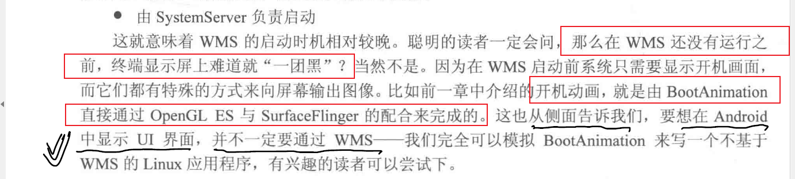

# 目录


# 功能0层------抛开WMS不谈

证明：

无论哪个系统，窗口管理 隶属于 图形系统 不得不包括：

> （1）窗口的层级管理
>
> （2）窗口的大小管理
>
> （3）窗口焦点管理
>
> （4）窗口增删（~~改~~）


# 窗口管理----~~WMS~~


## 功能（目的）0层：


参考： ~~《深入理解Andriiod内核设计思想》  WMS  P386~~


从I/O的角度来看，WMS系统的输入与输出：

(1)  功能1： 窗口管理 （**输出**）
WMS 是窗口的管理者，它负责窗口的启动、添加和删除。另外窗口的大小和层级也是由 WMS 进行管理的。

~~功能1_1 窗口动画~~   --->  add 和 remove的附属功能

> 窗口间进行切换时，使用动画可以显得更炫一些，窗口动画由 WMS 的动画子系统来负责，动画子系统的管理者为 WindowAnimator。

~~功能1_2：Surface 管理~~  （~~自然，包括申请~~）

> 窗口不具备绘制功能，因此每个窗口都需要有一块 Surface 来供自己绘制，为每个窗口分配 Surface 是由WMS 来完成的。


(2) 功能2：输入系统中转站 （**输入**）

> 通过对窗口的触摸从而产生触摸事件，InputManagerService(IMS) 会对触摸事件进行处理，它会寻找一个最合适的窗口来处理触摸反馈信息，WMS 是窗口的管理者，它作为输入系统的中转站再合适不过了。


------>  <font color='red'>记忆锚点</font>：WMS对window的：

1、widow的~~添加~~  即管理：增删改........  大小计算、层级计算

2、window的输入

3、window的输出


### 基于功能需要的对外接口（重要）

见 《超级0层图: AMS-APP-WMS》：


APP 与 WMS之间，自然：

> 1、先有APP-> WMS: IWindowManager
>
> 2、IWindowManager 创建  IwindowSession桥梁
>
> 3、IwindowSession桥梁 创建 IWindow桥梁


源码：

```java
interface IWindowManager
{
	IWindowSession openSession()  //创建session桥梁
}
```


关于session的认识，见下面：


## 结构0层图（基于功能0层的）

见AMS:  《超级0层: AMS-APP-WMS》   即：     **https://kenttj.github.io/-book/coding/0_Andriod/0_AMS.html#:~:text=2.-,%E8%B6%85%E7%BA%A70%E5%B1%82%E5%9B%BE%3A%20AMS%2DAPP%2DWMS,-https%3A//ericchows.github**

见： https://kenttj.github.io/-book/coding/0_Andriod/0_AMS.html#:~:text=https%3A//ericchows.github.io/Android%2DWindow%2DMechanism/


https://ericchows.github.io/Android-Window-Mechanism/

其中桥梁：
~~IWindowManager和IAcitivityManger 是一个自然的桥梁，~~客户端对wms和AMS的引用~~  ----》系统服务 开机初始化 注册的缘故

IwindowSession桥梁是 桥梁 IWindowManager创建的。为什么要这一条？

## 显示的生活化比喻


**整个显示的生活化比喻**，就像一出由N 个演员参与的话剧： **SurfaceFlinger 是摄像机， WMS 是导演， ViewRoot**
**则是演员个体。**

`摄像机`（ SurfaceFlinger）一一它负责客观地捕获当前的画面，然后真实地呈现给观众； 

`导演`（ WMS ） 则会考虑到话剧的舞台效果和视觉美感， 如他需要根据实际情况来安排各个演员的排序站位， 谁在前谁在后， 都会影响到演出的“ 画面效果”与“ 剧情编排”

`各个演员` ViewRoot  ，则更多地取决于他们自身的条件与努力（各种view组合）。

正是通过这三者的“各司其职”，才能最终为观众呈现出一场美妙绝伦的“视觉盛宴”


## 功能1的纵向：添加窗口(纵向主线) :  WMS侧----how


###  APP侧: 添加窗口WindowManagerImpl.addView(纵向主线) 流程: 

图：《超级0层图: AMS-APP-WMS》

-<font color='red'>始点：</font>------when

Activity的Create、Resume生命周期同步过来。~~见《startApp：APP 侧执行 生命周期同步transaction  的执行execute(关键数据结构)》~~

Resume可见，performResumeActivity 是真正始点。见： ~~见《startApp：APP 侧执行 生命周期同步transaction  的执行execute(关键数据结构)》~~

-<font color='red'>目标 ：</font>

> WMS.addWindow侧添加窗口

基于目标，和：

【1】自然，先要建立桥梁： ViewRootImpl到WMS的桥梁、WMS到 ViewRootImpl的。为啥这样设计？见  AMS

【2】自然通过桥梁Session，addWindow 。自然会携带数据：

~~window外数据：把window的参数（位置、大小）WindowManager.LayoutParams~~：app侧---》WMS侧

  ~~windown内数据：window的内容区域数据： mAttachInfo.mContentInsets~~：app侧---》WMS侧


基于目标【1】【2】，自然，<font color='red'>之前 先把自己APP侧搞好</font>：

【3】自然，~~要先把APP本地的Activity、window（WindowManagerImpl）、view树（DecorView）建好~~  ----> performLaunchActivity   流程。见《startApp》

【4】  自然，<font color='red'>因为Resume才是可见的，</font>所以， performResumeActivity    是  添加<font color='red'>窗口addView的  始点</font>   见《startApp》


基于目标【1】【2】，自然，APP侧弄好后，<font color='red'>建立一些交互性的管理类</font>，以及桥梁：
【5】 比如ViewRootImpl，必然在Reusme流程（<font color='red'>与Wms交互流程</font>）里新建的


基于目标【5】：

【6】自然，ViewRootImpl建立过程，会绑定DecorView，所以 Activity、window、viewTree三者绑定了


对应调用关系,，只看，不记忆：

handleLaunchActivity---> performLaunchActivity --->【1】<font color='red'>  创建Activity，并 attach() 创建window</font>-----> onCreate     ----->    【2】  setContentView

​                                                                                                                  Activity.attach（创建Window）                                            （创建DecorView，viewTree）                                           

handleResumeActivity   --->  performResumeActivity    -----> 


总结：
只有Resume流程  是与WMS交互的


后续见《添加窗口(纵向主线) :  WMS侧》


一些疑问，自然了：

> APP侧addView 变为 WMS.addWindow侧添加窗口  --->   所以，addView是添加窗口
>
> Activity.onStart  ---->   所以onStart  根本不可见，不可交互
>
> resume  ---->  可见可交互的


todo：

WindowManagerImpl 与 Global 是 一对多的关系。WindowManagerImpl 是Activity级别的？ 如何证明？

Global 负责交互了，必然是个进程单例，。自然

代码级证明：

```

```


### 目标功能1的补充：

#### 目标1：如何确定窗口的大小和位置呢？


计算模型：

APP侧初始值（输入）  ---->  给到wms侧（输出）：遍历所有窗口，然后计算出最终


其中：

> 初始值（客户端程序员设置的）  -------->    viewRootImpl.relayoutWindow    --------> wms计算


## 功能1_2的纵向：申请surface流程----how

见： 


《申请surface的流程(~~APP向surfaceFlinger~~)》


## 关于session桥梁???

基于什么目的？为甚要有？对总目的有什么用？


WMS实现侧：

```
//Session.java


//属性
mCanAddInternalSystemWindow -----> 是否能增加系统窗口

```


## 次要：功能1_1窗口的系统动画（基于窗口管理的辅助功能）

# ~~del:window体系-----APP侧~~

##  Window（次要）


一句话的大致理解：（1、很重要 2、自己的话 与 官方的话 相互结合）

> Window:  是一个碗，view才是碗里的东西，具体的视图实体  （官方：在Android视图体系中Window就是一个窗口 的概念。Android中所有的视图都是依赖于Window显示 的）
>
> WindowManager: ~~对Window的管理~~， 自然，~~add、 remove、更新等~~。     
>
> WMS: 窗口的最终管理者,  它负责窗口的启动、 添加和删除,  另外窗口的大小和层级也是由WMS 进行管理  ------》  见WMS具体章节


window什么情况下更新？
-------->  横竖屏切换，dialog的window的大小改变


## 常见window（次要）


### ~~window的分类：~~


Application Window:  Activity、Dialog就是一个典型的应用程序窗口。----->  <font color='red'> 从用户角度，想表达：常用的窗口</font>
Sub Window:  子窗口,  顾名思义,   它不能独立存在,需要附着在其他窗口才可以,  PopupWindow就属于子窗口。 ----->   从用户角度，想表达：<font color='red'>依附</font>
System Window: Toast、输入法窗口、系统音量条窗口、 系统错误窗口都属于系统窗口。 ----->   从用户角度，想表达：<font color='red'>在所有应用窗口之上</font>


自然，子窗口不能独立存在

注意：Dialog是应用程序窗口，可以独立存在的。比如：

​              

~~Application window 应用程序窗口~~:


数字1~99

Sub Window  :


### 窗口的次序

**1、窗口分组（按照类型）：**
~~APPlication window、sub window、System Window 顺序~~ ----》 非常自然


系统窗口、子窗口、应用窗口---------> 比如：

Activity（应用窗口）弹起popDialog（子窗口），popDialog内有个输入框，点击输入框 ，弹起输入法面板（系统窗口）


**2、同组之间，通过Type值来标志前后关系**

~~Type值越大，越在前~~  ----->  自然

注意：所以，并不是根据dialog弹出的先后顺序定的前后关系


TODO:  Type值是如何确定的呢？

自然，Dialog的 Type要比  Activity的大 -------->  同组


### 窗口的标志

// 当 Window 可见时允许锁屏 FLAG_ALLOW_LOCK_WHILE_SCREEN_ON

 // Window 不能获得输入焦点,即不接受任何按键或按钮事件,例如该 Window上有EditView,点击 EditView 是不会弹出软键 盘的 

// Window 范围外的事件依旧为原窗口处理; 例如点击该窗口外的view,依然会有响应。另外只要设置了此Flag,都将会启用 FLAG_NOT_TOUCH_MODAL FLAG_NOT_FOCUSABLE = 0x00000008; 

// 设置了该 Flag,将 Window 之外的按键事件发送给后面的 Window处理, 而自己只会处理 Window 区域内的触摸事件 

// Window 之外的view 也是可以响应 touch 事件。 FLAG_NOT_TOUCH_MODAL = 0x00000020; 

// 设置了该Flag,表示该 Window将不会接受任何 touch 事件,例如点击该 Window 不会有响应,只会传给下面有聚焦的窗口。 **FLAG_NOT_TOUCHABLE;** 
-------》 <font color='red'> 例子：ToastDialog</font>

 // 只要 Window 可见时屏幕就会一直亮着 FLAG_KEEP_SCREEN_ON 

// 允许 Window 超过屏幕之外 FLAG_LAYOUT_NO_LIMITS 

// 当用户的脸贴近屏幕时(比如打电话) 不会去响应此事件 FLAG_IGNORE CHEEK PRESSES; // 窗口可以在锁屏的 Window 之上显示,使用 Activity#setShowWhenLocked(boolean) 方法代替 FLAG_SHOW_WHEN_LOCKED = 0x00080000;


## WindowManger

窗口的操作类、实际上是接口类（addView、removeView、updateViewLayout），具体实现类是WindowMangerImpl

处于应用侧（进程）


《xiangxue》


为啥是桥接模式呢？
桥：Window-WindowManager


好处：上层抽象进行关联，下层实现可以独立发展（下层可以灵活变动）


###  接口ViewManager


addView、removeView、updateViewLayout
-------》自然，ViewGroup 需要这三个

为啥window需要呢？


#### 添加窗口addView 流程:  APP侧

见 wms中 添加窗口流程


#### 更新窗口 updateViewLayout

场景：
横竖屏切换


最终还是会走到，view刷新绘制流程---->  不得不


## ViewRootImpl


1、管理view树：
2、触发view的绘制流程（最终目标：绘制，具体铺垫：测量、布局和绘制）

触发点：自然，viewRootImpl的<font color='red'>performTraversales() 方法（最开始触发是  vsync信号, 这个方法是刷新、绘制的入口</font>）


---->  自然，窗口的更新updateViewLayout 也会走到 performTraversales()


3、与wms交互  ----》  记忆图：《超级0层图: AMS-APP-WMS》


## 对应关系 windowManagerGlobal、windowManagerImpl、viewRootImpl


windowManagerImpl ----------acitvity级别（管理window，自然）

windowManagerGlobal---------单例 （进程级别）

viewRootImpl-----------window级别

推论： 1、windowManagerImpl  与 viewRootImpl数量基本一样

​              2、 多转一，再转多：通过decorView 建立映射关系


 

## view Tree--------window的填充+显示

见


# window体系-----系统侧


WindowContainer


## <font color='red'>持有关系-----重要</font>


https://blog.csdn.net/q1165328963/article/details/127746382?spm=1001.2101.3001.6650.9&utm_medium=distribute.pc_relevant.none-task-blog-2%7Edefault%7ECTRLIST%7ERate-9-127746382-blog-130015066.235%5Ev38%5Epc_relevant_anti_t3&depth_1-utm_source=distribute.pc_relevant.none-task-blog-2%7Edefault%7ECTRLIST%7ERate-9-127746382-blog-130015066.235%5Ev38%5Epc_relevant_anti_t3&utm_relevant_index=10


参考：  https://blog.csdn.net/lizhenjun114/article/details/130015066?spm=1001.2101.3001.6650.7&utm_medium=distribute.pc_relevant.none-task-blog-2%7Edefault%7EBlogCommendFromBaidu%7ERate-7-130015066-blog-129101781.235%5Ev38%5Epc_relevant_anti_t3&depth_1-utm_source=distribute.pc_relevant.none-task-blog-2%7Edefault%7EBlogCommendFromBaidu%7ERate-7-130015066-blog-129101781.235%5Ev38%5Epc_relevant_anti_t3&utm_relevant_index=8

## 继承关系----类似view的继承关系


## 系统侧window体系 与 APP侧 view体系

系统侧window体系 与 APP侧 view体系  极其相似： 如何认识view体系，就如何认识window体系

1、都是<font color='red'>树结构：</font>  window树  、 view树

2、基于树结构： 有view的布局  relayout

​                            同样，window有布局： relayoutWindow

3、基于树结构：

​                      树的节点：  windowContainer(集合)、viewGroup(集合)

​                      树根：windowState、  view


对比下的认知：

view有测量measure，系统侧 window有测量嘛？


TODO：

系统侧window数据何时同步给 应用侧的？


-


## 参考：

https://blog.csdn.net/learnframework/article/details/129101781

https://blog.csdn.net/lizhenjun114/article/details/130015066?spm=1001.2101.3001.6650.7&utm_medium=distribute.pc_relevant.none-task-blog-2%7Edefault%7EBlogCommendFromBaidu%7ERate-7-130015066-blog-129101781.235%5Ev38%5Epc_relevant_anti_t3&depth_1-utm_source=distribute.pc_relevant.none-task-blog-2%7Edefault%7EBlogCommendFromBaidu%7ERate-7-130015066-blog-129101781.235%5Ev38%5Epc_relevant_anti_t3&utm_relevant_index=8    displayArea学习


# 框架的背后


# 自然法则


# 一些额外的理解

## wms对于显示不是必须的

从生活化比喻中看必然性（wms是导演、surfaceFlinger是摄像机、viewROOT是演员）： 

> ~~WMS不是必须的，窗口不是必须的，viewROOT也不是必须的~~
>
>  只有surfaceFlinger摄像机是必须的

例子：



参考： ~~《深入理解Andriiod内核设计思想》  WMS  P386~~


另一个例子，<font color='red'>结论</font>：

> 仪表域 不需要 交互，也需要窗口管理  ------------>  所以，<font color='red'>仪表域可以直接怼到drm（绕过窗口管理）</font>


# 面试题：

1、窗口的次序（见上）

2、子线程中 new 一个 Dialog，出现Token报错

Unable to add window token null is not valid is your activity running


https://blog.csdn.net/meixi_android/article/details/106380069?spm=1001.2101.3001.6650.12&utm_medium=distribute.pc_relevant.none-task-blog-2%7Edefault%7EBlogCommendFromBaidu%7ERate-12-106380069-blog-78530491.pc_relevant_recovery_v2&depth_1-utm_source=distribute.pc_relevant.none-task-blog-2%7Edefault%7EBlogCommendFromBaidu%7ERate-12-106380069-blog-78530491.pc_relevant_recovery_v2&utm_relevant_index=13


# 参考：


