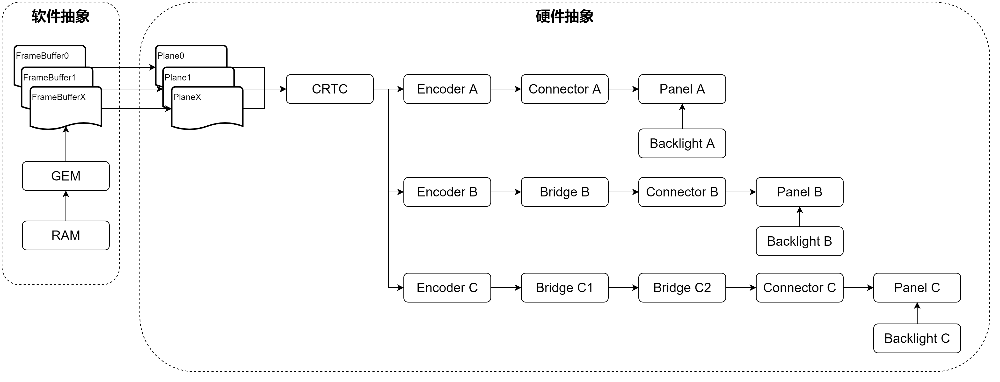
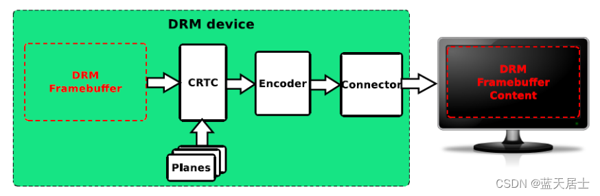
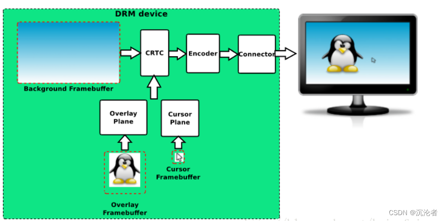
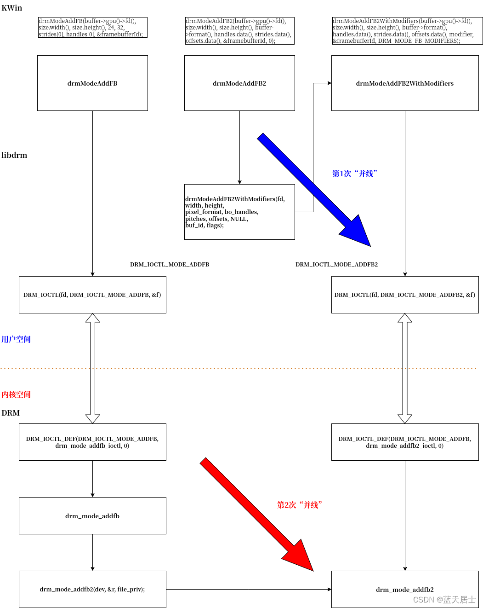
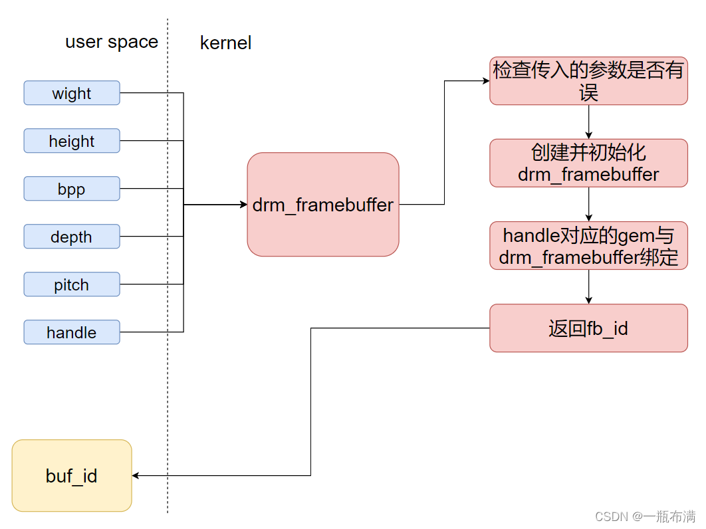
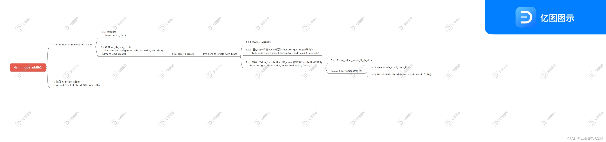
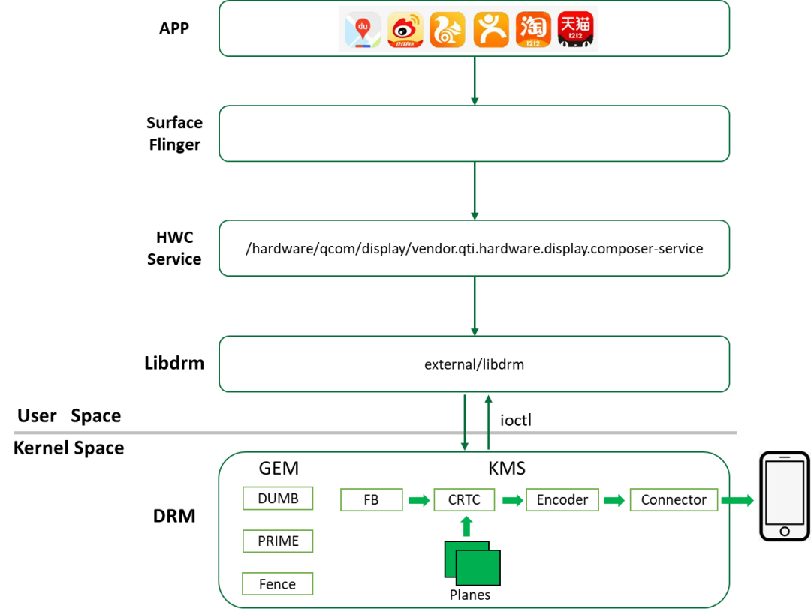
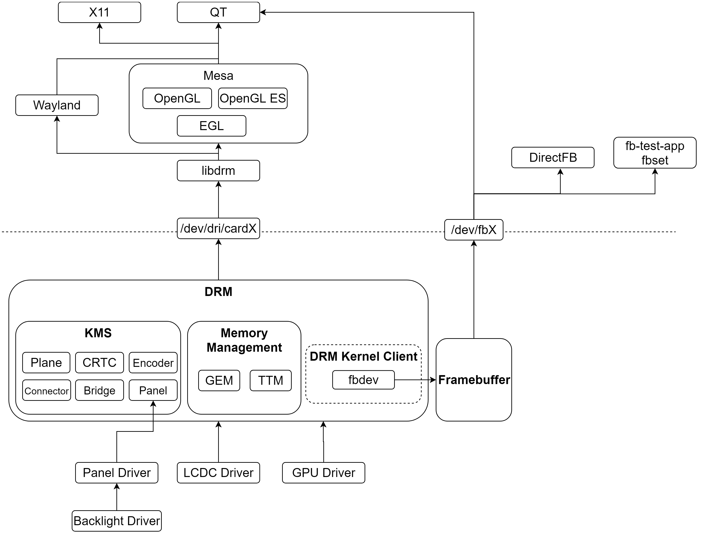
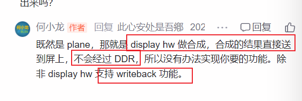
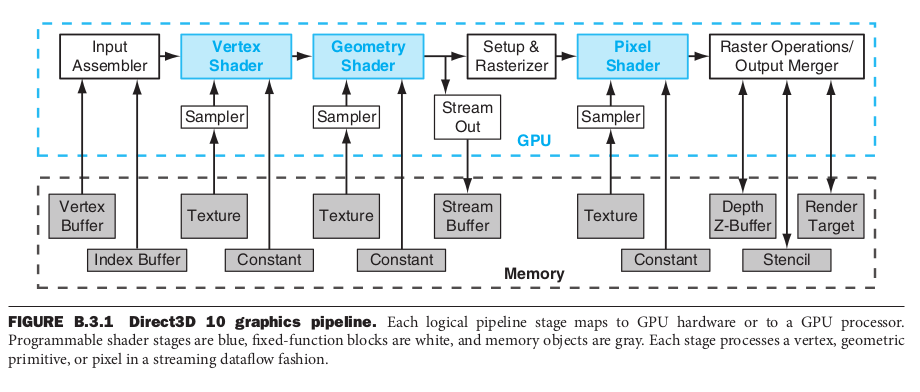

# 目录


# why-从功能0层角度，DRM的作用是啥？


# what--基于why的what


必然存在硬件图层（plane）：

>   DRM_PLANE_TYPE_PRIMARY：主要图层，通常用于仅支持RGB格式的简单图层
>   DRM_PLANE_TYPE_OVERLAY：叠加图层，视频图层（YUV格式的）-----------> 现在也支持RGB格式的了，与PRIMARY无异 -------->了！！<font color='red'>意味着 GPU实际上可以合成两个硬件层！！！！</font>
>
>   DRM_PLANE_TYPE_CURSOR：光标图层，用于显示鼠标


本质上说，plane是硬件抽象------------- <font color='red'>功能： 承载硬件显示能力</font>（**对软件侧呈现**）



[图](https://www.cnblogs.com/arnoldlu/p/17978715#:~:text=mode%2Dsetting%20pipeline%E5%A6%82%E4%B8%8B)


## 基本概念：

1、现代的一般 DRM_PLANE_TYPE_PRIMARY 和 DRM_PLANE_TYPE_OVERLAY，对于硬件来说，没有区别了（以前有区别）

如何证明：<font color='red'>modetest看能力是一样的: TODO</font>

```java
//
```


2、primary = GPU合成，<font color='red'>哪一层是GPU合成层，决定于 哪个硬件plane配置了primary</font>（虽然现代的plane，都一样）

**证据：modetest**

```
Planes:
id      crtc    fb      CRTC x,y        x,y     gamma size      possible crtcs
34      42      107     0,0             0,0     0               0x00000001
  formats: XR24 AR24 RG16 XR15
  props:
        8 type:
                flags: immutable enum
                enums: Overlay=0 Primary=1 Cursor=2
                value: 1
        30 IN_FORMATS:
                flags: immutable blob
                blobs:

                value:
                        01000000000000000400000018000000
                        01000000280000005852323441523234
                        52473136585231350f00000000000000
                        00000000000000000000000000000000
                in_formats blob decoded:
                         XR24:  LINEAR
                         AR24:  LINEAR
                         RG16:  LINEAR
                         XR15:  LINEAR
36      42      111     0,0             0,0     0               0x00000001
```


# drm ------ 待整理

### 一些图

0[层物理图](https://download.csdn.net/blog/column/11175480/133747645)




[图片来源](https://download.csdn.net/blog/column/11175480/133747645#:~:text=%E6%9C%80%E5%B7%A6%E4%BE%A7%E2%80%9D%E5%86%85%E5%AE%B9%EF%BC%8C-,%E5%A6%82%E4%B8%8B%E5%9B%BE%E6%89%80%E7%A4%BA,-%EF%BC%9A)



[图来源](https://blog.csdn.net/qq_33782617/article/details/126202800#:~:text=%E5%9D%97%E7%9A%84%E6%8A%BD%E8%B1%A1%E3%80%82-,%E5%A6%82%E5%9B%BE,-%EF%BC%9A)

TODO:   **FrameBuffer是 plane级别的？？？？？？？？？？** 


0[层调用图](https://blog.csdn.net/phmatthaus/article/details/133749323)







[图来源：](https://blog.csdn.net/yangguoyu8023/article/details/129249184?spm=1001.2101.3001.6650.2&utm_medium=distribute.pc_relevant.none-task-blog-2%7Edefault%7EBlogCommendFromBaidu%7ERate-2-129249184-blog-133749323.235%5Ev43%5Epc_blog_bottom_relevance_base5&depth_1-utm_source=distribute.pc_relevant.none-task-blog-2%7Edefault%7EBlogCommendFromBaidu%7ERate-2-129249184-blog-133749323.235%5Ev43%5Epc_blog_bottom_relevance_base5&utm_relevant_index=4#:~:text=%E5%B0%B1%E6%98%AFdrm_mode_addfb2%E6%8E%A5%E5%8F%A3%EF%BC%8C-,%E8%AF%A5%E6%8E%A5%E5%8F%A3%E5%AE%8C%E6%88%90%E4%BA%86%E4%B8%8B%E9%9D%A2%E7%9A%84%E5%8A%9F%E8%83%BD,-%E3%80%82)           图不好，上下关系不对


[drm框架分析---drm_mode_addfb2](https://blog.csdn.net/yangguoyu8023/article/details/129249184?spm=1001.2101.3001.6650.2&utm_medium=distribute.pc_relevant.none-task-blog-2%7Edefault%7EBlogCommendFromBaidu%7ERate-2-129249184-blog-133749323.235%5Ev43%5Epc_blog_bottom_relevance_base5&depth_1-utm_source=distribute.pc_relevant.none-task-blog-2%7Edefault%7EBlogCommendFromBaidu%7ERate-2-129249184-blog-133749323.235%5Ev43%5Epc_blog_bottom_relevance_base5&utm_relevant_index=4)


drm_mode_addfb2调用流程：



[图来源](https://blog.csdn.net/yangguoyu8023/article/details/129249184?spm=1001.2101.3001.6650.2&utm_medium=distribute.pc_relevant.none-task-blog-2%7Edefault%7EBlogCommendFromBaidu%7ERate-2-129249184-blog-133749323.235%5Ev43%5Epc_blog_bottom_relevance_base5&depth_1-utm_source=distribute.pc_relevant.none-task-blog-2%7Edefault%7EBlogCommendFromBaidu%7ERate-2-129249184-blog-133749323.235%5Ev43%5Epc_blog_bottom_relevance_base5&utm_relevant_index=4#:~:text=5.-,%E8%B0%83%E7%94%A8%E6%B5%81%E7%A8%8B%E5%9B%BE,-%E6%96%87%E7%AB%A0%E7%9F%A5%E8%AF%86%E7%82%B9)


### 参考：

https://download.csdn.net/blog/column/11175480/133747645       KWin、libdrm、DRM从上到下全过程 —— drmModeAddFBxxx（1）


 [LCD DRM驱动框架分析一](https://blog.csdn.net/qq_33782617/article/details/126202800#:~:text=%E5%9D%97%E7%9A%84%E6%8A%BD%E8%B1%A1%E3%80%82-,%E5%A6%82%E5%9B%BE,-%EF%BC%9A) 


# modetest里，怎么看两个硬件overlay的上下关系？

> 盖房子顺序（~~id小的在下面~~）


```java
struct drm_plane {
	struct weston_plane base;

	struct drm_device *device;

	enum wdrm_plane_type type;

	uint32_t possible_crtcs;
	uint32_t plane_id; // hard
	uint32_t plane_idx; // soft
```


# 好文


https://mp.weixin.qq.com/s?__biz=MzA5NDE4OTkwMA==&mid=2247530526&idx=3&sn=ee61e7d090f02249c20ec0437dac031b&chksm=9050583da727d12be8b47ea5caed8cb327f65eedbd595ec60fff9b4e2ab559eb27e9b8719d9d&scene=27         【科普】linux驱动系列学习之DRM

各种概念：

Framebuffer、CRTC，ENCODER，CONNECTOR，PLANE，VBLANK，property


Framebuffer： 一个图层，display级别

CRTC：


[DRM（一）：什么是DRM-CSDN博客](https://blog.csdn.net/weixin_45264425/article/details/128456651)    

## Drm 0层链路




好文：  [Linux显示（三）：DRM子系统(以及LCDC/Panel/Backlight驱动)](https://www.cnblogs.com/arnoldlu/p/17978715)             系列文章

https://download.csdn.net/blog/column/11305753/120255137   **图显系统DRM CRTC完全解析**


[图](https://www.cnblogs.com/arnoldlu/p/17978715#:~:text=mode%2Dsetting%20pipeline%E5%A6%82%E4%B8%8B)




[图](https://www.cnblogs.com/arnoldlu/p/17978715#:~:text=%E8%B0%83%E7%94%A8%E5%BA%95%E5%B1%82-,%E6%98%BE%E7%A4%BA%E6%8E%A7%E5%88%B6%E5%92%8CGPU%E5%8A%9F%E8%83%BD%E7%AD%89%E7%AD%89,-%E3%80%82)


https://blog.csdn.net/u012839187/article/details/106469038      display:weston渲染流程:commit 

很详细！！


非常好非常好的DRM系列文章：何小龙

>    [最简单的DRM应用程序 （page-flip）](https://blog.csdn.net/hexiaolong2009/article/details/84674127) 
>
>   [最简单的DRM应用程序 （plane-test）](https://blog.csdn.net/hexiaolong2009/article/details/84934294)
>
>   


结论：



https://blog.csdn.net/hexiaolong2009/article/details/84934294


# drm-kms调试手段---modetest

DRM 


参考：

https://blog.csdn.net/weixin_35723192/article/details/135088802   modetest

https://blog.csdn.net/gjioui123/article/details/129903320   modetest工具测试(linux-5.10)


# **KMS 的两套 api: legacy api (已过时) 和 atomic api：**

```java
作者：嵌入式开发小美
链接：https://www.zhihu.com/question/26116500/answer/2367137532
来源：知乎
著作权归作者所有。商业转载请联系作者获得授权，非商业转载请注明出处。

int main(int argc, char **argv)
{
 int fd;
 drmModeConnector *conn;
 drmModeRes *res;
 uint32_t conn_id;
 uint32_t crtc_id;

 /* open the drm device */
 fd = open("/dev/dri/card0");

 /* get crtc/encoder/connector id */
 res = drmModeGetResources(fd);
 crtc_id = res->crtcs[0];
 conn_id = res->connectors[0];

 /* get connector for display mode */
 conn = drmModeGetConnector(fd, conn_id);

 /* create a dumb-buffer */
 drmIoctl(DRM_IOCTL_MODE_CREATE_DUMB);

 /* bind the dumb-buffer to an FB object */
 fb_id = drmModeAddFB(...);     // 将创建好的buffer与 FB object绑定，返回 fb_id

 /* map the dumb buffer for userspace drawing */
 drmIoctl(DRM_IOCTL_MODE_MAP_DUMB);
 mmap(...);

 /* start display */
 drmModeSetCrtc(crtc_id, fb_id, connector_id, mode);
}
```

**大致的思路是：**

```java
通过 drmModeGetResources() 获取到 crtc、connector 等对象的 id，然后通过 id 获取到具体的 object;
通过 ioctl(DRM_IOCTL_MODE_CREATE_DUMB) 和 drmModeAddFB() 创建 DRM framebuffer object，并获得 fb id;
通过 ioctl(DRM_IOCTL_MODE_MAP_DUMB) 和 mmap() 将 framebuffer 映射到用户空间，应用将自己要显示的内容写到 framebuffer 中;
将 crtc、connector、fb 的id 通过 drmModeSetCrtc() 告诉 DRM driver，让内核帮我们配置好 display pipeline，从而将 framebuffer 里的内容显示出来;

链接：https://www.zhihu.com/question/26116500/answer/2367137532

```

atomic 的好处：

>  将各种设置都保存在一个个的 property 里，最后将所有 property 一次性提交给内核

# DRM系列文章

 [图显系统DRM CRTC完全解析-CSDN博客.html](DRM.assets\图显系统DRM CRTC完全解析-CSDN博客.html) 

 [DRM全解析 —— plane详解（1）_framebuffer与plane的区别-CSDN博客.html](DRM.assets\DRM全解析 —— plane详解（1）_framebuffer与plane的区别-CSDN博客.html) 

 [DRM全解析 —— CRTC详解（1）-CSDN博客.html](DRM.assets\DRM全解析 —— CRTC详解（1）-CSDN博客.html) 

 [图显系统DRMPLANE完全解析](DRM.assets\5bf3f60dda9383daf3df5cd09186158a.html)   ---> 好文！！！

# 显示服务器实现 ---!!!!!!!!!

https://zhuanlan.zhihu.com/p/268527301   显示服务器实现（一）

https://zhuanlan.zhihu.com/p/321297532   显示服务器实现（二）


##  **图形流水线(了解)**  -------GPU 与 MEM



[图来源](https://blog.csdn.net/sinat_16489689/article/details/127192214)


# 大致数据

us级别：上屏（~~硬件从buffer上读取数据 -----> 屏幕~~）

ms级别：一屏数据内存copy（~~10M数据的内存copy = 中控屏截图的内存copy~~）

----------------> 上屏快很多

# 疑问

为啥后面有硬件编解码？？？？？？？必要性在哪里？？？