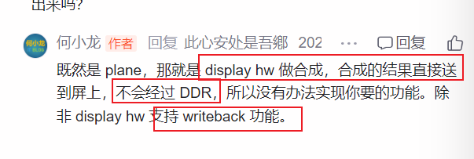

# 目录

# why-从功能0层角度，DRM的作用是啥？

# what--基于why的what

必然存在硬件图层（plane）：

>   DRM_PLANE_TYPE_PRIMARY：主要图层，通常用于仅支持RGB格式的简单图层
>   DRM_PLANE_TYPE_OVERLAY：叠加图层，视频图层（YUV格式的）-----------> 现在也支持RGB格式的了，与PRIMARY无异 -------->了！！意味着 GPU实际上可以合成两个硬件层！！！！
>
>   DRM_PLANE_TYPE_CURSOR：光标图层，用于显示鼠标

本质上说，plane是硬件抽象------------- 功能： 承载硬件显示能力（**对软件侧呈现**）

[图](https://www.cnblogs.com/arnoldlu/p/17978715#:~:text=mode%2Dsetting%20pipeline%E5%A6%82%E4%B8%8B)

# 好文

https://mp.weixin.qq.com/s?__biz=MzA5NDE4OTkwMA==&mid=2247530526&idx=3&sn=ee61e7d090f02249c20ec0437dac031b&chksm=9050583da727d12be8b47ea5caed8cb327f65eedbd595ec60fff9b4e2ab559eb27e9b8719d9d&scene=27         【科普】linux驱动系列学习之DRM

各种概念：

Framebuffer、CRTC，ENCODER，CONNECTOR，PLANE，VBLANK，property

Framebuffer： 一个图层，display级别

CRTC：

[DRM（一）：什么是DRM-CSDN博客](https://blog.csdn.net/weixin_45264425/article/details/128456651)    

## Drm 0层链路

好文：  [Linux显示（三）：DRM子系统(以及LCDC/Panel/Backlight驱动)](https://www.cnblogs.com/arnoldlu/p/17978715)             系列文章

https://download.csdn.net/blog/column/11305753/120255137   **图显系统DRM CRTC完全解析**

[图](https://www.cnblogs.com/arnoldlu/p/17978715#:~:text=mode%2Dsetting%20pipeline%E5%A6%82%E4%B8%8B)

[图](https://www.cnblogs.com/arnoldlu/p/17978715#:~:text=%E8%B0%83%E7%94%A8%E5%BA%95%E5%B1%82-,%E6%98%BE%E7%A4%BA%E6%8E%A7%E5%88%B6%E5%92%8CGPU%E5%8A%9F%E8%83%BD%E7%AD%89%E7%AD%89,-%E3%80%82)

https://blog.csdn.net/u012839187/article/details/106469038      display:weston渲染流程:commit 

很详细！！

非常好非常好的DRM系列文章：何小龙

>    [最简单的DRM应用程序 （page-flip）](https://blog.csdn.net/hexiaolong2009/article/details/84674127) 
>
>   [最简单的DRM应用程序 （plane-test）](https://blog.csdn.net/hexiaolong2009/article/details/84934294)
>
>   

结论：

https://blog.csdn.net/hexiaolong2009/article/details/84934294

