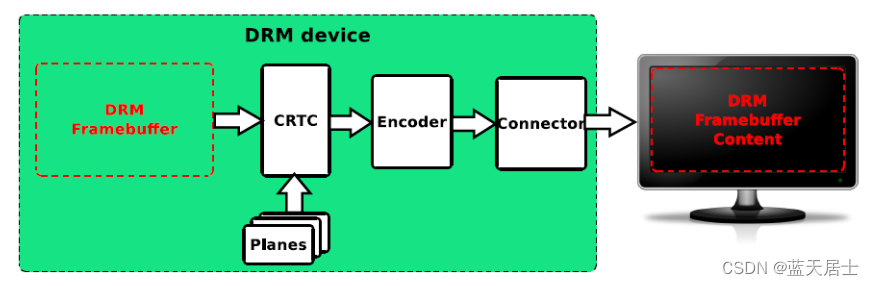
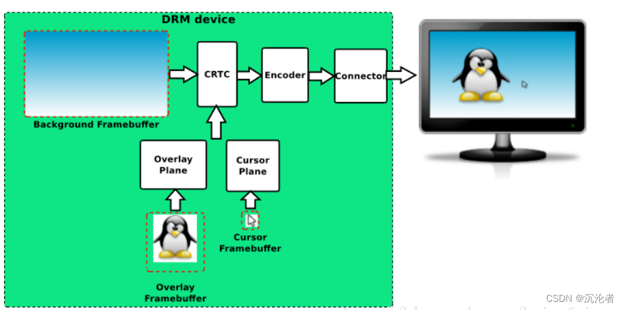
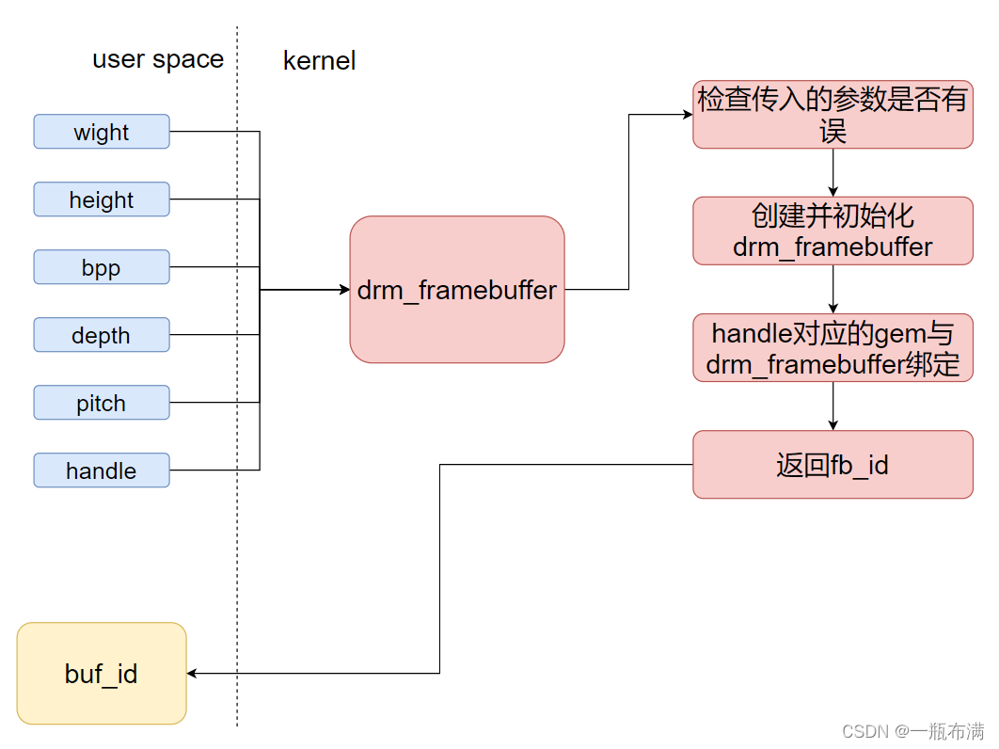
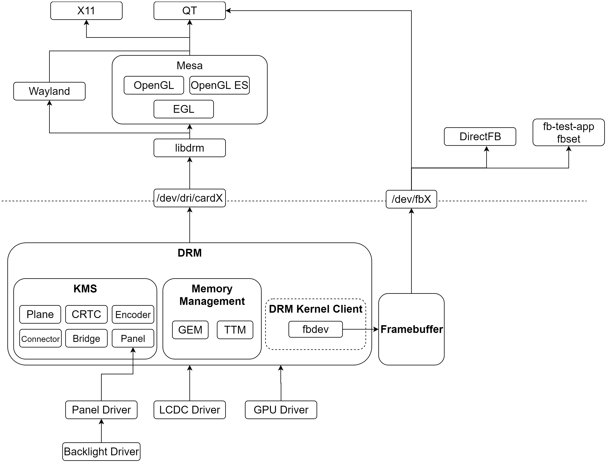

# 目录

# why-从功能0层角度，DRM的作用是啥？

# what--基于why的what

必然存在硬件图层（plane）：

>   DRM_PLANE_TYPE_PRIMARY：主要图层，通常用于仅支持RGB格式的简单图层
>   DRM_PLANE_TYPE_OVERLAY：叠加图层，视频图层（YUV格式的）-----------> 现在也支持RGB格式的了，与PRIMARY无异 -------->了！！意味着 GPU实际上可以合成两个硬件层！！！！
>
>   DRM_PLANE_TYPE_CURSOR：光标图层，用于显示鼠标

本质上说，plane是硬件抽象------------- 功能： 承载硬件显示能力（**对软件侧呈现**）

[图](https://www.cnblogs.com/arnoldlu/p/17978715#:~:text=mode%2Dsetting%20pipeline%E5%A6%82%E4%B8%8B)

# drm ------ 待整理

### 一些图

0[层物理图](https://download.csdn.net/blog/column/11175480/133747645)

[图片来源](https://download.csdn.net/blog/column/11175480/133747645#:~:text=%E6%9C%80%E5%B7%A6%E4%BE%A7%E2%80%9D%E5%86%85%E5%AE%B9%EF%BC%8C-,%E5%A6%82%E4%B8%8B%E5%9B%BE%E6%89%80%E7%A4%BA,-%EF%BC%9A)

[图来源](https://blog.csdn.net/qq_33782617/article/details/126202800#:~:text=%E5%9D%97%E7%9A%84%E6%8A%BD%E8%B1%A1%E3%80%82-,%E5%A6%82%E5%9B%BE,-%EF%BC%9A)

TODO:   **FrameBuffer是 plane级别的？？？？？？？？？？** 

0[层调用图](https://blog.csdn.net/phmatthaus/article/details/133749323)

[图来源：](https://blog.csdn.net/yangguoyu8023/article/details/129249184?spm=1001.2101.3001.6650.2&utm_medium=distribute.pc_relevant.none-task-blog-2%7Edefault%7EBlogCommendFromBaidu%7ERate-2-129249184-blog-133749323.235%5Ev43%5Epc_blog_bottom_relevance_base5&depth_1-utm_source=distribute.pc_relevant.none-task-blog-2%7Edefault%7EBlogCommendFromBaidu%7ERate-2-129249184-blog-133749323.235%5Ev43%5Epc_blog_bottom_relevance_base5&utm_relevant_index=4#:~:text=%E5%B0%B1%E6%98%AFdrm_mode_addfb2%E6%8E%A5%E5%8F%A3%EF%BC%8C-,%E8%AF%A5%E6%8E%A5%E5%8F%A3%E5%AE%8C%E6%88%90%E4%BA%86%E4%B8%8B%E9%9D%A2%E7%9A%84%E5%8A%9F%E8%83%BD,-%E3%80%82)           图不好，上下关系不对

[drm框架分析---drm_mode_addfb2](https://blog.csdn.net/yangguoyu8023/article/details/129249184?spm=1001.2101.3001.6650.2&utm_medium=distribute.pc_relevant.none-task-blog-2%7Edefault%7EBlogCommendFromBaidu%7ERate-2-129249184-blog-133749323.235%5Ev43%5Epc_blog_bottom_relevance_base5&depth_1-utm_source=distribute.pc_relevant.none-task-blog-2%7Edefault%7EBlogCommendFromBaidu%7ERate-2-129249184-blog-133749323.235%5Ev43%5Epc_blog_bottom_relevance_base5&utm_relevant_index=4)

drm_mode_addfb2调用流程：

[图来源](https://blog.csdn.net/yangguoyu8023/article/details/129249184?spm=1001.2101.3001.6650.2&utm_medium=distribute.pc_relevant.none-task-blog-2%7Edefault%7EBlogCommendFromBaidu%7ERate-2-129249184-blog-133749323.235%5Ev43%5Epc_blog_bottom_relevance_base5&depth_1-utm_source=distribute.pc_relevant.none-task-blog-2%7Edefault%7EBlogCommendFromBaidu%7ERate-2-129249184-blog-133749323.235%5Ev43%5Epc_blog_bottom_relevance_base5&utm_relevant_index=4#:~:text=5.-,%E8%B0%83%E7%94%A8%E6%B5%81%E7%A8%8B%E5%9B%BE,-%E6%96%87%E7%AB%A0%E7%9F%A5%E8%AF%86%E7%82%B9)

### 参考：

https://download.csdn.net/blog/column/11175480/133747645       KWin、libdrm、DRM从上到下全过程 —— drmModeAddFBxxx（1）

 [LCD DRM驱动框架分析一](https://blog.csdn.net/qq_33782617/article/details/126202800#:~:text=%E5%9D%97%E7%9A%84%E6%8A%BD%E8%B1%A1%E3%80%82-,%E5%A6%82%E5%9B%BE,-%EF%BC%9A) 

# 好文

https://mp.weixin.qq.com/s?__biz=MzA5NDE4OTkwMA==&mid=2247530526&idx=3&sn=ee61e7d090f02249c20ec0437dac031b&chksm=9050583da727d12be8b47ea5caed8cb327f65eedbd595ec60fff9b4e2ab559eb27e9b8719d9d&scene=27         【科普】linux驱动系列学习之DRM

各种概念：

Framebuffer、CRTC，ENCODER，CONNECTOR，PLANE，VBLANK，property

Framebuffer： 一个图层，display级别

CRTC：

[DRM（一）：什么是DRM-CSDN博客](https://blog.csdn.net/weixin_45264425/article/details/128456651)    

## Drm 0层链路

好文：  [Linux显示（三）：DRM子系统(以及LCDC/Panel/Backlight驱动)](https://www.cnblogs.com/arnoldlu/p/17978715)             系列文章

https://download.csdn.net/blog/column/11305753/120255137   **图显系统DRM CRTC完全解析**

[图](https://www.cnblogs.com/arnoldlu/p/17978715#:~:text=mode%2Dsetting%20pipeline%E5%A6%82%E4%B8%8B)

[图](https://www.cnblogs.com/arnoldlu/p/17978715#:~:text=%E8%B0%83%E7%94%A8%E5%BA%95%E5%B1%82-,%E6%98%BE%E7%A4%BA%E6%8E%A7%E5%88%B6%E5%92%8CGPU%E5%8A%9F%E8%83%BD%E7%AD%89%E7%AD%89,-%E3%80%82)

https://blog.csdn.net/u012839187/article/details/106469038      display:weston渲染流程:commit 

很详细！！

非常好非常好的DRM系列文章：何小龙

>    [最简单的DRM应用程序 （page-flip）](https://blog.csdn.net/hexiaolong2009/article/details/84674127) 
>
>   [最简单的DRM应用程序 （plane-test）](https://blog.csdn.net/hexiaolong2009/article/details/84934294)
>
>   

结论：

https://blog.csdn.net/hexiaolong2009/article/details/84934294

# 一些基本常识

us级别：上屏（~~硬件从buffer上读取数据 -----> 屏幕~~）

ms级别：一屏数据内存copy（~~10M数据的内存copy = 中控屏截图的内存copy~~）

----------------> 上屏快很多

