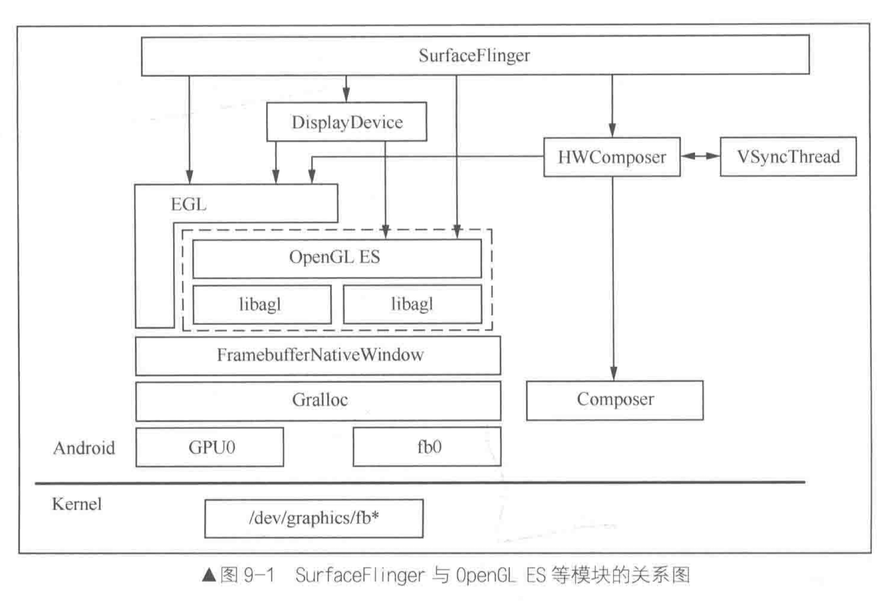

# Display

补充图：P314

两种 本地窗口（承载窗口的绘制功能）： 分别承载 APP侧的render，以及  sf的 合成结果

surface承载                          FramebufferNativeWindow

所以，从opengl角度来看：

> APP 与  sf 没有任何区别，都是opengl的使用者（都是应用）

https://blog.csdn.net/rendong_yang/article/details/38494675  好文

https://blog.csdn.net/xuesen_lin/article/details/8954508   GUI显示系统之SurfaceFlinger---章节目录          系列文章

