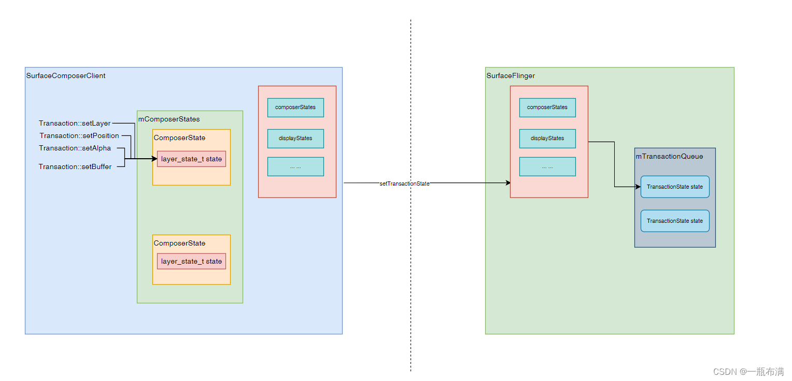
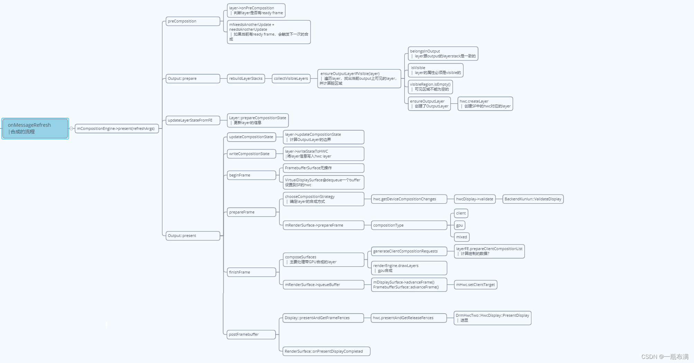
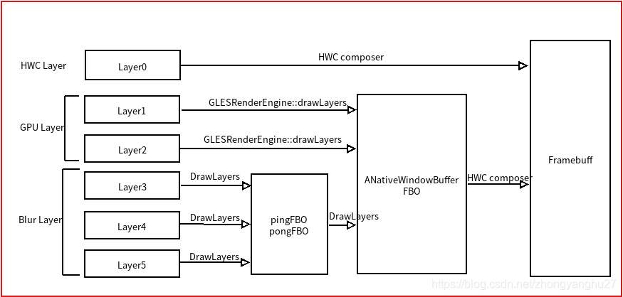

# 目录


# 窗口的阴影和圆角

阴影：

```java
 SurfaceControl.setGlobalShadowSettings(@Size(4) float[] ambientColor,
             @Size(4) float[] spotColor, float lightPosY, float lightPosZ, float lightRadius)
 
 // 信息流
 SurfaceControl.setShadowRadius --->nativeSetShadowRadius --->  SurfaceComposerClient::Transaction::setShadowRadius
      struct layer_state_t {shadowRadius, cornerRadius........}  //【】 目前还是应用进程
           -----> TODO: 最终生效给谁了？如何流向sf的？ <https://blog.csdn.net/learnframework/article/details/135076600>

```

安卓控件阴影：

>   Android开发中阴影效果的实现 - 掘金 ([juejin.cn](http://juejin.cn))         -------->  TODO: 画在哪个地方？

Android显示系统——Transaction基础功能：

>   TODO:  Transaction是应用系统框架层  与  SurfaceFlinger交流的方式之一
>
>   ​                [Android显示系统——Transaction基础功能](https://www.cnblogs.com/tsts/p/17537595.html)
>
>   TODO:  了解surfaceControl所有接口


SurfaceComposerClient_cpp:    sf 在用户侧的代理


SurfaceControl（client与sf的桥梁）接口：

```java
captureLayers  截图 

setCornerRadius 设置圆角 

setGlobalShadowSettings 设置阴影
```

其中，事务（元）Transaction： 

```java
（1）事务元，是原操作，setXXX操作
（2）多个原操作，之后，一笔commit才生效  t.apply()

setCornerRadius 
->nativeSetCornerRadius
  ->SurfaceComposerClient::Transaction 获取对应的 layer_state_t。设置属性
	-> s->cornerRadius = cornerRadius
```


生效在apply()后：

```java
t.apply()
 -> SurfaceComposerClient::Transaction::apply
	->ISurfaceComposer->setTransactionState
	   ------------跨进程-------------------
	   -> sf->setTransactionState  
	      queueTransaction(state); // sf 缓存事务
```


事务流转图：

>   
>
>   [图来源](https://blog.csdn.net/fengchaochao123/article/details/134252907#:~:text=%E4%B9%8B%E5%90%8E%E6%9D%A5%E5%8F%96%E3%80%82-,%E7%94%BB%E4%B8%AA%E5%9B%BE%E6%80%BB%E7%BB%93%E4%B8%80%E4%B8%8B%EF%BC%9A,-%E4%BB%8E%E4%BB%A3%E7%A0%81%E7%9C%8Bhttps://blog.csdn.net/fengchaochao123/article/details/134252907)


下一帧vsync后： SurfaceFlinger处理事务（onMessageInvalidate函数）： 

1、处理事务

 2、自然，~~刷新图像~~

处理事务流程图：

>   
>
>   [图来源](https://blog.csdn.net/fengchaochao123/article/details/135129439#:~:text=%E6%98%AF%E5%A4%84%E7%90%86%E4%BA%8B%E5%8A%A1%EF%BC%9A-,%E5%A4%A7%E8%87%B4%E6%B5%81%E7%A8%8B%E5%A6%82%E4%B8%8B%E5%9B%BE%EF%BC%9A,-flushTransactionQueues%E4%BC%9A%E5%B0%86)

图像合成并刷新图：

>   
>
>   [图](https://blog.csdn.net/fengchaochao123/article/details/135129439#:~:text=%E9%95%BF%EF%BC%8C%E8%B4%B4%E4%BB%A3%E7%A0%81-,%E6%9C%89%E7%82%B9%E5%A4%AA%E7%B9%81%E7%90%90%EF%BC%8C%E6%9D%A5%E5%BC%A0%E5%9B%BE,-%E4%B8%AA%E4%BA%BA%E8%BF%99%E9%87%8C%E6%9C%89)


总之， 

设置圆角：一行代码：

```java
 GLESRenderEngine::drawMesh

 fragmentShader里面根据圆角的半径计算将在圆角之外的部分的alpha设为0使之完全透明： 

位置：String8 ProgramCache::generateFragmentShader(const Key& needs) {

         gl_FragColor.a *= applyCornerRadius(outCropCoords); // 【】夹子函数，超过设置透明 

}
```


参考：[圆角绘制 - 安卓R](https://blog.csdn.net/SSSxCCC/article/details/119253569)


TODO:

[sf系列文章]( https://blog.csdn.net/fengchaochao123/category_12467586.html)

[显示驱动系列文章]( https://blog.csdn.net/fengchaochao123/category_11733379.html)

Bpxxx/Bnxxx：

```java
https://blog.csdn.net/fengchaochao123/article/details/134020217?spm=1001.2014.3001.5502#:~:text=%E6%A2%B3%E7%90%86%E4%BA%86%E4%B8%80%E4%B8%8B-,waitForService%E7%9A%84%E5%86%85%E9%83%A8%E6%9C%BA%E5%88%B6,-%EF%BC%8C%E5%92%8CBpxxx/Bnxxx
```


系列好文：

>    [安卓Framework](https://blog.csdn.net/sssxccc/category_11248337.html)
>
>   [ 录屏流程 - 安卓R](https://blog.csdn.net/SSSxCCC/article/details/119253947 )


[转屏动画 - 安卓R](https://blog.csdn.net/SSSxCCC/article/details/119324066 )

[过渡动画 - 安卓R](https://blog.csdn.net/SSSxCCC/article/details/119324081)

## 对应的shader

shader结构：

>   级别：surfaceFlinger级别的
>
>   （自然：生成时机：一次性生成）
>
>   使用时机： 有圆角 &  有变化 &  每一帧

shader具体内容详解：

### 方法一 安卓的shader：

1、VertexShader

```java
attribute lowp vec4 cropCoords;   // 入参： 裁剪坐标， TODO: 来源哪里？？？
varying lowp vec2 outCropCoords; // 出参： 将要传递给 Fragment的 裁剪坐标
attribute vec4 position;  // 【】入参：任意点坐标（自带）
uniform mat4 projection; // 入参： 顶点变化矩阵，来源cpp
uniform mat4 texture;
void main(void) {
    gl_Position = projection * position;
    outCropCoords = cropCoords.st;   // 【】 圆角相关的，即裁剪部分（st是水平和垂直坐标）
}
```

信息流：

>   cpp任意点坐标position                           -------->             变换后坐标 gl_Position
>
>   cpp 顶点变换矩阵                                                       传递给 Fragment的 裁剪坐标

2、FragmentShader

```java

precision mediump float;     // 浮点运算的精度为中等

uniform float cornerRadius;    // 入参：圆角半径，来源cpp
uniform vec2 cropCenter;       // 入参：裁剪中心，来源cpp
varying vec2 outCropCoords;    // 入参：裁剪坐标，来源 VertexShader
/**
 * This function takes the current crop coordinates and calculates an alpha value based
 * on the corner radius and distance from the crop center.
 */
float applyCornerRadius(vec2 cropCoords)
{
    vec2 position = cropCoords - cropCenter;  // 基于圆心的坐标
    // Scale down the dist vector here, as otherwise large corner
    // radii can cause floating point issues when computing the norm
    vec2 dist = (abs(position) - cropCenter + vec2(cornerRadius)) / 16.0;  // 【】 TODO:abs(position)是一个二维的，分量求绝对值
    // Once we've found the norm, then scale back up.
    float plane = length(max(dist, vec2(0.0))) * 16.0;
    return 1.0 - clamp(plane - cornerRadius, 0.0, 1.0);
}

uniform vec4 color;  // 入参： 主要设置color的a值。。。。。这里没看懂！！！
void main(void) {
  gl_FragColor.rgb = color.rgb;
  gl_FragColor.a = 1.0;
  gl_FragColor *= color.a;  // c乘以
  gl_FragColor *= vec4(applyCornerRadius(outCropCoords)); // 乘以 1 或 0 -----> 0即被裁剪！！！
}
```

[关于的使用：](https://www.cnblogs.com/keguniang/p/9873052.html#:~:text=glGetUniformLocation(shaderProgram%2C "ourColor")%3B)

[Shader中使用距离函数（Distance Function）绘制二维图形](https://note.nxcloud.club:12270/blog/post/agile/Shader%E4%B8%AD%E4%BD%BF%E7%94%A8%E8%B7%9D%E7%A6%BB%E5%87%BD%E6%95%B0%EF%BC%88Distance-Function%EF%BC%89%E7%BB%98%E5%88%B6%E4%BA%8C%E7%BB%B4%E5%9B%BE%E5%BD%A2)

### 主要流程：

参考：    [圆角绘制 - 安卓R](https://blog.csdn.net/SSSxCCC/article/details/119253569 )

```java

status_t GLESRenderEngine::drawLayers(const DisplaySettings& display,
                                      const std::vector<const LayerSettings*>& layers,
                                      ANativeWindowBuffer* const buffer,
                                      const bool useFramebufferCache, base::unique_fd&& bufferFence,
                                      base::unique_fd* drawFence) {
    ......
    for (auto const layer : layers) { // 遍历layers
        ......
        // We only want to do a special handling for rounded corners when having rounded corners
        // is the only reason it needs to turn on blending, otherwise, we handle it like the
        // usual way since it needs to turn on blending anyway.
        else if (layer->geometry.roundedCornersRadius > 0.0 && color.a >= 1.0f && isOpaque) {
            handleRoundedCorners(display, *layer, mesh);
        } else {
            drawMesh(mesh);
        }
        ......
    }
    ......
}
```

### 方法二：

### weston 的shader.h 非 shadow？

核心一行代码：

```java
gl_renderer_use_program
```


%accordion% vertex-shader.glsl %accordion%


```java
/*
 * Copyright 2012 Intel Corporation
 * Copyright 2015,2019 Collabora, Ltd.
 * Copyright 2016 NVIDIA Corporation
 *
 * Permission is hereby granted, free of charge, to any person obtaining
 * a copy of this software and associated documentation files (the
 * "Software"), to deal in the Software without restriction, including
 * without limitation the rights to use, copy, modify, merge, publish,
 * distribute, sublicense, and/or sell copies of the Software, and to
 * permit persons to whom the Software is furnished to do so, subject to
 * the following conditions:
 *
 * The above copyright notice and this permission notice (including the
 * next paragraph) shall be included in all copies or substantial
 * portions of the Software.
 *
 * THE SOFTWARE IS PROVIDED "AS IS", WITHOUT WARRANTY OF ANY KIND,
 * EXPRESS OR IMPLIED, INCLUDING BUT NOT LIMITED TO THE WARRANTIES OF
 * MERCHANTABILITY, FITNESS FOR A PARTICULAR PURPOSE AND
 * NONINFRINGEMENT.  IN NO EVENT SHALL THE AUTHORS OR COPYRIGHT HOLDERS
 * BE LIABLE FOR ANY CLAIM, DAMAGES OR OTHER LIABILITY, WHETHER IN AN
 * ACTION OF CONTRACT, TORT OR OTHERWISE, ARISING FROM, OUT OF OR IN
 * CONNECTION WITH THE SOFTWARE OR THE USE OR OTHER DEALINGS IN THE
 * SOFTWARE.
 */

/* enum gl_shader_texcoord_input */
#define SHADER_TEXCOORD_INPUT_ATTRIB  0
#define SHADER_TEXCOORD_INPUT_SURFACE 1

/* Always use high-precision for vertex calculations */
precision highp float;

#ifdef GL_FRAGMENT_PRECISION_HIGH
#define FRAG_PRECISION highp
#else
#define FRAG_PRECISION mediump
#endif

uniform mat4 proj;
uniform mat4 surface_to_buffer;

attribute vec2 position;
attribute vec2 texcoord;

/* Match the varying precision to the fragment shader */
varying FRAG_PRECISION vec2 v_texcoord;

void main()
{
    gl_Position = proj * vec4(position, 0.0, 1.0);

#if DEF_TEXCOORD_INPUT == SHADER_TEXCOORD_INPUT_ATTRIB
    v_texcoord = texcoord;
#elif DEF_TEXCOORD_INPUT == SHADER_TEXCOORD_INPUT_SURFACE
    v_texcoord = vec2(surface_to_buffer * vec4(position, 0.0, 1.0));
#endif
}
```


%/accordion%


%accordion% fragmentShader.glsl %accordion%

```java
/*
 * Copyright 2012 Intel Corporation
 * Copyright 2015,2019,2021 Collabora, Ltd.
 * Copyright 2016 NVIDIA Corporation // -------> NVIDIA！！！！！！！
 * Copyright 2021 Advanced Micro Devices, Inc.
 *
 * Permission is hereby granted, free of charge, to any person obtaining
 * a copy of this software and associated documentation files (the
 * "Software"), to deal in the Software without restriction, including
 * without limitation the rights to use, copy, modify, merge, publish,
 * distribute, sublicense, and/or sell copies of the Software, and to
 * permit persons to whom the Software is furnished to do so, subject to
 * the following conditions:
 *
 * The above copyright notice and this permission notice (including the
 * next paragraph) shall be included in all copies or substantial
 * portions of the Software.
 *
 * THE SOFTWARE IS PROVIDED "AS IS", WITHOUT WARRANTY OF ANY KIND,
 * EXPRESS OR IMPLIED, INCLUDING BUT NOT LIMITED TO THE WARRANTIES OF
 * MERCHANTABILITY, FITNESS FOR A PARTICULAR PURPOSE AND
 * NONINFRINGEMENT.  IN NO EVENT SHALL THE AUTHORS OR COPYRIGHT HOLDERS
 * BE LIABLE FOR ANY CLAIM, DAMAGES OR OTHER LIABILITY, WHETHER IN AN
 * ACTION OF CONTRACT, TORT OR OTHERWISE, ARISING FROM, OUT OF OR IN
 * CONNECTION WITH THE SOFTWARE OR THE USE OR OTHER DEALINGS IN THE
 * SOFTWARE.
 */

/* GLSL version 1.00 ES, defined in gl-shaders.c */

/* For annotating shader compile-time constant arguments */
#define compile_const const

/*
 * Enumeration of shader variants, must match enum gl_shader_texture_variant.
 */
#define SHADER_VARIANT_RGBX     1
#define SHADER_VARIANT_RGBA     2
#define SHADER_VARIANT_Y_U_V    3
#define SHADER_VARIANT_Y_UV     4
#define SHADER_VARIANT_Y_XUXV   5
#define SHADER_VARIANT_XYUV     6
#define SHADER_VARIANT_SOLID    7
#define SHADER_VARIANT_EXTERNAL 8

/* enum gl_shader_color_curve */
#define SHADER_COLOR_CURVE_IDENTITY 0
#define SHADER_COLOR_CURVE_LUT_3x1D 1
#define SHADER_COLOR_CURVE_LINPOW 2
#define SHADER_COLOR_CURVE_POWLIN 3

/* enum gl_shader_color_mapping */
#define SHADER_COLOR_MAPPING_IDENTITY 0
#define SHADER_COLOR_MAPPING_3DLUT 1
#define SHADER_COLOR_MAPPING_MATRIX 2

#if DEF_VARIANT == SHADER_VARIANT_EXTERNAL
#extension GL_OES_EGL_image_external : require
#endif

#if DEF_COLOR_MAPPING == SHADER_COLOR_MAPPING_3DLUT
#extension GL_OES_texture_3D : require
#endif


#ifdef GL_FRAGMENT_PRECISION_HIGH
#define HIGHPRECISION highp
#else
#define HIGHPRECISION mediump
#endif

precision HIGHPRECISION float;

/*
 * These undeclared identifiers will be #defined by a runtime generated code
 * snippet.
 */
compile_const int c_variant = DEF_VARIANT;
compile_const bool c_input_is_premult = DEF_INPUT_IS_PREMULT;
compile_const bool c_green_tint = DEF_GREEN_TINT;
compile_const int c_color_pre_curve = DEF_COLOR_PRE_CURVE;
compile_const int c_color_mapping = DEF_COLOR_MAPPING;
compile_const int c_color_post_curve = DEF_COLOR_POST_CURVE;

compile_const bool c_need_color_pipeline =
    c_color_pre_curve != SHADER_COLOR_CURVE_IDENTITY ||
    c_color_mapping != SHADER_COLOR_MAPPING_IDENTITY ||
    c_color_post_curve != SHADER_COLOR_CURVE_IDENTITY;

vec
yuva2rgba(vec4 yuva)
{
    vec4 color_out;
    float Y, su, sv;

    /* ITU-R BT.601 & BT.709 quantization (limited range) */

    /* Y = 255/219 * (x - 16/256) */
    Y = 1.16438356 * (yuva.x - 0.0625);

    /* Remove offset 128/256, but the 255/224 multiplier comes later */
    su = yuva.y - 0.5;
    sv = yuva.z - 0.5;

    /*
     * ITU-R BT.601 encoding coefficients (inverse), with the
     * 255/224 limited range multiplier already included in the
     * factors for su (Cb) and sv (Cr).
     */
    color_out.r = Y                   + 1.59602678 * sv;
    color_out.g = Y - 0.39176229 * su - 0.81296764 * sv;
    color_out.b = Y + 2.01723214 * su;

    color_out.a = yuva.w;

    return color_out;
}

#if DEF_VARIANT == SHADER_VARIANT_EXTERNAL
uniform samplerExternalOES tex;
#else
uniform sampler2D tex;
#endif

varying HIGHPRECISION vec2 v_texcoord;
uniform sampler2D tex1;
uniform sampler2D tex2;
uniform float view_alpha;
uniform vec4 unicolor;

#define MAX_CURVE_PARAMS 10
#define MAX_CURVESET_PARAMS (MAX_CURVE_PARAMS * 3)

uniform HIGHPRECISION sampler2D color_pre_curve_lut_2d;
uniform HIGHPRECISION vec2 color_pre_curve_lut_scale_offset;
uniform HIGHPRECISION float color_pre_curve_params[MAX_CURVESET_PARAMS];
uniform bool color_pre_curve_clamped_input;

uniform HIGHPRECISION sampler2D color_post_curve_lut_2d;
uniform HIGHPRECISION vec2 color_post_curve_lut_scale_offset;
uniform HIGHPRECISION float color_post_curve_params[MAX_CURVESET_PARAMS];
uniform bool color_post_curve_clamped_input;

#if DEF_COLOR_MAPPING == SHADER_COLOR_MAPPING_3DLUT
uniform HIGHPRECISION sampler3D color_mapping_lut_3d;
uniform HIGHPRECISION vec2 color_mapping_lut_scale_offset;
#endif
uniform HIGHPRECISION mat3 color_mapping_matrix;

vec4
sample_input_texture()
{
    vec4 yuva = vec4(0.0, 0.0, 0.0, 1.0);

    /* Producing RGBA directly */

    if (c_variant == SHADER_VARIANT_SOLID)
        return unicolor;

    if (c_variant == SHADER_VARIANT_RGBA ||
        c_variant == SHADER_VARIANT_EXTERNAL) {
        return texture2D(tex, v_texcoord);
    }

    if (c_variant == SHADER_VARIANT_RGBX)
        return vec4(texture2D(tex, v_texcoord).rgb, 1.0);

    /* Requires conversion to RGBA */

    if (c_variant == SHADER_VARIANT_Y_U_V) {
        yuva.x = texture2D(tex, v_texcoord).x;
        yuva.y = texture2D(tex1, v_texcoord).x;
        yuva.z = texture2D(tex2, v_texcoord).x;

    } else if (c_variant == SHADER_VARIANT_Y_UV) {
        yuva.x = texture2D(tex, v_texcoord).x;
        yuva.yz = texture2D(tex1, v_texcoord).rg;

    } else if (c_variant == SHADER_VARIANT_Y_XUXV) {
        yuva.x = texture2D(tex, v_texcoord).x;
        yuva.yz = texture2D(tex1, v_texcoord).ga;

    } else if (c_variant == SHADER_VARIANT_XYUV) {
        yuva.xyz = texture2D(tex, v_texcoord).bgr;

    } else {
        /* Never reached, bad variant value. */
        return vec4(1.0, 0.3, 1.0, 1.0);
    }

    return yuva2rgba(yuva);
}

/*
 * Sample a 1D LUT which is a single row of a 2D texture. The 2D texture has
 * four rows so that the centers of texels have precise y-coordinates.
 *
 * Texture coordinates go from 0.0 to 1.0 corresponding to texture edges.
 * When we do LUT look-ups with linear filtering, the correct range to sample
 * from is not from edge to edge, but center of first texel to center of last
 * texel. This follows because with LUTs, you have the exact end points given,
 * you never extrapolate but only interpolate.
 * The scale and offset are precomputed to achieve this mapping.
 */
float
sample_lut_1d(HIGHPRECISION sampler2D lut, vec2 scale_offset,
          float x, compile_const int row)
{
    float tx = x * scale_offset.s + scale_offset.t;
    float ty = (float(row) + 0.5) / 4.0;

    return texture2D(lut, vec2(tx, ty)).x;
}

vec3
sample_lut_3x1d(HIGHPRECISION sampler2D lut, vec2 scale_offset, vec3 color)
{
    return vec3(sample_lut_1d(lut, scale_offset, color.r, 0),
            sample_lut_1d(lut, scale_offset, color.g, 1),
            sample_lut_1d(lut, scale_offset, color.b, 2));
}

vec3
lut_texcoord(vec3 pos, vec2 scale_offset)
{
    return pos * scale_offset.s + scale_offset.t;
}

float
linpow(float x, float g, float a, float b, float c, float d)
{
    /* See WESTON_COLOR_CURVE_TYPE_LINPOW for details about LINPOW. */

    if (x >= d)
        return pow((a * x) + b, g);

    return c * x;
}

float
sample_linpow(float params[MAX_CURVESET_PARAMS], bool must_clamp,
          float x, compile_const int color_channel)
{
    float g, a, b, c, d;

    /*
     * For each color channel we have MAX_CURVE_PARAMS parameters.
     * The parameters for the three curves are stored in RGB order.
     */
    g = params[0 + color_channel * MAX_CURVE_PARAMS];
    a = params[1 + color_channel * MAX_CURVE_PARAMS];
    b = params[2 + color_channel * MAX_CURVE_PARAMS];
    c = params[3 + color_channel * MAX_CURVE_PARAMS];
    d = params[4 + color_channel * MAX_CURVE_PARAMS];

    if (must_clamp)
        x = clamp(x, 0.0, 1.0);

    /* We use mirroring for negative input values. */
    if (x < 0.0)
        return -linpow(-x, g, a, b, c, d);

    return linpow(x, g, a, b, c, d);
}

vec3
sample_linpow_vec3(float params[MAX_CURVESET_PARAMS], bool must_clamp,
           vec3 color)
{
    return vec3(sample_linpow(params, must_clamp, color.r, 0),
            sample_linpow(params, must_clamp, color.g, 1),
            sample_linpow(params, must_clamp, color.b, 2));
}

float
powlin(float x, float g, float a, float b, float c, float d)
{
    /* See WESTON_COLOR_CURVE_TYPE_POWLIN for details about POWLIN. */

    if (x >= d)
        return a * pow(x, g) + b;

    return c * x;
}

float
sample_powlin(float params[MAX_CURVESET_PARAMS], bool must_clamp,
          float x, compile_const int color_channel)
{
    float g, a, b, c, d;

    /*
     * For each color channel we have MAX_CURVE_PARAMS parameters.
     * The parameters for the three curves are stored in RGB order.
     */
    g = params[0 + color_channel * MAX_CURVE_PARAMS];
    a = params[1 + color_channel * MAX_CURVE_PARAMS];
    b = params[2 + color_channel * MAX_CURVE_PARAMS];
    c = params[3 + color_channel * MAX_CURVE_PARAMS];
    d = params[4 + color_channel * MAX_CURVE_PARAMS];

    if (must_clamp)
        x = clamp(x, 0.0, 1.0);

    /* We use mirroring for negative input values. */
    if (x < 0.0)
        return -powlin(-x, g, a, b, c, d);

    return powlin(x, g, a, b, c, d);
}

vec3
sample_powlin_vec3(float params[MAX_CURVESET_PARAMS], bool must_clamp,
           vec3 color)
{
    return vec3(sample_powlin(params, must_clamp, color.r, 0),
            sample_powlin(params, must_clamp, color.g, 1),
            sample_powlin(params, must_clamp, color.b, 2));
}

vec3
color_pre_curve(vec3 color)
{
    if (c_color_pre_curve == SHADER_COLOR_CURVE_IDENTITY) {
        return color;
    } else if (c_color_pre_curve == SHADER_COLOR_CURVE_LUT_3x1D) {
        return sample_lut_3x1d(color_pre_curve_lut_2d,
                       color_pre_curve_lut_scale_offset,
                       color);
    } else if (c_color_pre_curve == SHADER_COLOR_CURVE_LINPOW) {
        return sample_linpow_vec3(color_pre_curve_params,
                      color_pre_curve_clamped_input,
                      color);
    } else if (c_color_pre_curve == SHADER_COLOR_CURVE_POWLIN) {
        return sample_powlin_vec3(color_pre_curve_params,
                      color_pre_curve_clamped_input,
                      color);
    } else {
        /* Never reached, bad c_color_pre_curve. */
        return vec3(1.0, 0.3, 1.0);
    }
}

vec3
sample_color_mapping_lut_3d(vec3 color)
{
    vec3 pos, ret = vec3(0.0, 0.0, 0.0);
#if DEF_COLOR_MAPPING == SHADER_COLOR_MAPPING_3DLUT
    pos = lut_texcoord(color, color_mapping_lut_scale_offset);
    ret = texture3D(color_mapping_lut_3d, pos).rgb;
#endif
    return ret;
}

vec3
color_mapping(vec3 color)
{
    if (c_color_mapping == SHADER_COLOR_MAPPING_IDENTITY)
        return color;
    else if (c_color_mapping == SHADER_COLOR_MAPPING_3DLUT)
        return sample_color_mapping_lut_3d(color);
    else if (c_color_mapping == SHADER_COLOR_MAPPING_MATRIX)
        return color_mapping_matrix * color.rgb;
    else /* Never reached, bad c_color_mapping. */
        return vec3(1.0, 0.3, 1.0);
}

vec3
color_post_curve(vec3 color)
{
    if (c_color_post_curve == SHADER_COLOR_CURVE_IDENTITY) {
        return color;
    } else if (c_color_post_curve == SHADER_COLOR_CURVE_LUT_3x1D) {
        return sample_lut_3x1d(color_post_curve_lut_2d,
                       color_post_curve_lut_scale_offset,
                       color);
    } else if (c_color_post_curve == SHADER_COLOR_CURVE_LINPOW) {
        return sample_linpow_vec3(color_post_curve_params,
                      color_post_curve_clamped_input,
                      color);
    } else if (c_color_post_curve == SHADER_COLOR_CURVE_POWLIN) {
        return sample_powlin_vec3(color_post_curve_params,
                      color_post_curve_clamped_input,
                      color);
    } else {
        /* Never reached, bad c_color_post_curve. */
        return vec3(1.0, 0.3, 1.0);
    }
}

vec4
color_pipeline(vec4 color)
{
    /* Ensure straight alpha */
    if (c_input_is_premult) {
        if (color.a == 0.0)
            color.rgb = vec3(0, 0, 0);
        else
            color.rgb *= 1.0 / color.a;
    }

    color.rgb = color_pre_curve(color.rgb);
    color.rgb = color_mapping(color.rgb);
    color.rgb = color_post_curve(color.rgb);

    return color;
}
    

void
main()
{
    vec4 color;
    /* Electrical (non-linear) RGBA values, may be premult or not */
    color = sample_input_texture();
    if (c_need_color_pipeline)417
        color = color_pipeline(color); /* Produces straight alpha */
    /* Ensure pre-multiplied for blending */
    if (!c_input_is_premult || c_need_color_pipeline)
        color.rgb *= color.a;
    color *= view_alpha;

    if (c_green_tint)
        color = vec4(0.0, 0.3, 0.0, 0.2) + color * 0.8;
    gl_FragColor = color;
}
```


%/accordion%

### weston的shadow 与 from_blend_to_output关系

为啥要求 from_blend_to_output？--------> 通过获取 颜色转换：

```java

struct weston_color_transform {
    struct weston_color_manager *cm;
    int ref_count;
    uint32_t id; /* For debug */

    /* for renderer or backend to attach their own cached objects */
    struct wl_signal destroy_signal;

    /* Color transform is the series of steps: */

    /** Step 1: color model change */
    /* YCbCr→RGB conversion, but that is done elsewhere */

    /** Step 2: color curve before color mapping */
    struct weston_color_curve pre_curve;

    /** Step 3: color mapping */
    struct weston_color_mapping mapping;

    /** Step 4: color curve after color mapping */
    struct weston_color_curve post_curve;
};
```


## App client侧画圆角&阴影：

Google

```java
package com.google.android.material.shadow;

   public final class ShadowRenderer {

   public final void drawCornerShadow(Canvas canvas, Matrix matrix, RectF rectF, int i, float f, float f2) {
        boolean z;
        if (f2 < 0.0f) {
            z = true;
        } else {
            z = false;
        }
        Path path = this.scratch;
        int[] iArr = cornerColors;
        if (z) {
            iArr[0] = 0;
            iArr[1] = this.shadowEndColor;
            iArr[2] = this.shadowMiddleColor;
            iArr[3] = this.shadowStartColor;
        } else {
            path.rewind();
            path.moveTo(rectF.centerX(), rectF.centerY());
            path.arcTo(rectF, f, f2);
            path.close();
            float f3 = -i;
            rectF.inset(f3, f3);
            iArr[0] = 0;
            iArr[1] = this.shadowStartColor;
            iArr[2] = this.shadowMiddleColor;
            iArr[3] = this.shadowEndColor;
        }
        float width = rectF.width() / 2.0f;
        if (width <= 0.0f) {
            return;
        }
        float f4 = 1.0f - (i / width);
        float[] fArr = cornerPositions;
        fArr[1] = f4;
        fArr[2] = ((1.0f - f4) / 2.0f) + f4;
        RadialGradient radialGradient = new RadialGradient(rectF.centerX(), rectF.centerY(), width, iArr, fArr, Shader.TileMode.CLAMP);
        Paint paint = this.cornerShadowPaint;
        paint.setShader(radialGradient);
        canvas.save();
        canvas.concat(matrix);
        canvas.scale(1.0f, rectF.height() / rectF.width());
        if (!z) {
            canvas.clipPath(path, Region.Op.DIFFERENCE);
            canvas.drawPath(path, this.transparentPaint);
        }
        canvas.drawArc(rectF, f, f2, true, paint);
        canvas.restore();
    }

```


# 高斯模糊

高斯模糊的功能：

> 使某个窗口的**外部背景**  模糊  ------>  不是内部背景！自然，应用自己不能做
>
> 产品视角：<font color='red'>模糊非焦点区域，突出焦点</font>
>
> 物理角度： **保持自我，模糊他人**  -------> 类似于Dialog的Dim层（**实际上就是用了高斯模糊**）
>
> ​					自我：可以透明，也可以不透明


[aosp11/12/13 壁纸高斯模糊，毛玻璃SurfaceFlinger层面原理-第二节千里马framework实战_千里马aosp-CSDN博客](https://blog.csdn.net/learnframework/article/details/130778897)

具体流程，同圆角

```java
1
void GLESRenderEngine::drawLayersInternal(
        const std::shared_ptr<std::promise<RenderEngineResult>>&& resultPromise,
        const DisplaySettings& display, const std::vector<LayerSettings>& layers,
        const std::shared_ptr<ExternalTexture>& buffer, const bool useFramebufferCache,
        base::unique_fd&& bufferFence) {
    ATRACE_CALL();
    // ..................
    std::deque<const LayerSettings> blurLayers;
    if (CC_LIKELY(mBlurFilter != nullptr)) {
        for (const auto& layer : layers) {
            if (layer.backgroundBlurRadius > 0) { //遍历出这个backgroundBlurRadius的layer
                blurLayers.push_back(layer);
            }
        }
    }
    const auto blurLayersSize = blurLayers.size();
    // ..................

    for (const auto& layer : layers) { //遍历所有图层layer进行相关的渲染,注意这里是从底到顶的顺序
        if (blurLayers.size() > 0 && blurLayers.front() == layer) {//如果遍历到了设置了blurebehind的layer
            blurLayers.pop_front();

            auto status = mBlurFilter->prepare(); //准备相关的模糊参数

            if (blurLayers.size() == 0) {//假设已经没有了那么就开始设置好相关的buffer
                //【】这里很关键！！！！！会把已经绘制的FrameBuffer进行获取，后面把这个数据进行对应的blur
                // Done blurring, time to bind the native FBO and render our blur onto it.
                fbo = std::make_unique<BindNativeBufferAsFramebuffer>(*this,
                                                                      buffer.get()
                                                                              ->getBuffer()
                                                                              ->getNativeBuffer(),
                                                                      useFramebufferCache);
                status = fbo->getStatus();
                setViewportAndProjection(display.physicalDisplay, display.clip);
            } else {
              ............
            }
            // 进行真的模糊
            status = mBlurFilter->render(blurLayersSize > 1);
        }
                ............
        if (layer.source.buffer.buffer != nullptr) {//这里正常的layer渲染44
          ............
        }
  ............
    return;
}
```


## 待整理：高斯模糊


参考：

>  [Android R 原生模糊效果原理](https://blog.csdn.net/zhongyanghu27/article/details/116002774)
>
>  [SurfaceFlinger层原理-aosp11/12/13 壁纸高斯模糊毛玻璃-千里马framework实战](https://zhuanlan.zhihu.com/p/630891349)


高斯模糊代码大纲：

依附于合成流程：


## 应用层接口

```java
Transaction setBackgroundBlurRadius(SurfaceControl sc, int radius)
```

全局开关（Android S ）：

```java
// 需要打开ro.surface_flinger.supports_background_blur 才能使用模糊效果，默认是关闭的

property_get("ro.surface_flinger.supports_background_blur", value, "0");
bool supportsBlurs = atoi(value);
mSupportsBlur = supportsBlurs;
```


安卓的 模糊特性: 

>   1、是窗口级的。跟着窗口走的
>
>   2、模糊的是背后，而不是自己的窗口

[应用角度](https://blog.csdn.net/qq_31138209/article/details/140096936?spm=1001.2101.3001.6650.3&utm_medium=distribute.pc_relevant.none-task-blog-2%7Edefault%7EYuanLiJiHua%7EPosition-3-140096936-blog-116002774.235%5Ev43%5Epc_blog_bottom_relevance_base5&depth_1-utm_source=distribute.pc_relevant.none-task-blog-2%7Edefault%7EYuanLiJiHua%7EPosition-3-140096936-blog-116002774.235%5Ev43%5Epc_blog_bottom_relevance_base5&utm_relevant_index=4)


使用例子：~~Launcher3 的模糊效果~~

>   


## EGL环境：


## shader


```java
mMixProgram.compile(getVertexShader(), getMixFragShader());

mBlurProgram.compile(getVertexShader(), getFragmentShader());
```


1、VertexShader

```java
#version 300 es
precision mediump float;

in vec2 aPosition;
in highp vec2 aUV;
out highp vec2 vUV;

void main() {
    vUV = aUV;
    gl_Position = vec4(aPosition, 0.0, 1.0);
}
```


2、FragmentShader:

```java
#version 300 es
precision mediump float;

uniform sampler2D uTexture;
uniform vec2 uOffset;

in highp vec2 vUV;
out vec4 fragColor;

void main() {
	fragColor  = texture(uTexture, vUV, 0.0);
	fragColor += texture(uTexture, vUV + vec2( uOffset.x,  uOffset.y), 0.0);
	fragColor += texture(uTexture, vUV + vec2( uOffset.x, -uOffset.y), 0.0);
	fragColor += texture(uTexture, vUV + vec2(-uOffset.x,  uOffset.y), 0.0);
	fragColor += texture(uTexture, vUV + vec2(-uOffset.x, -uOffset.y), 0.0);

	fragColor = vec4(fragColor.rgb * 0.2, 1.0);
}
```


3、MixFragShader：

```java
#version 300 es
precision mediump float;

in highp vec2 vUV;
out vec4 fragColor;

uniform sampler2D uCompositionTexture;
uniform sampler2D uTexture;
uniform float uMix;

void main() {
    vec4 blurred = texture(uTexture, vUV);
    vec4 composition = texture(uCompositionTexture, vUV);
    fragColor = mix(composition, blurred, uMix);
}
```

## 高斯模糊的数学原理

数学角度：

>  [Android R 原生模糊效果原理](https://blog.csdn.net/zhongyanghu27/article/details/116002774)


Android R模糊效果使用效率更高的 Kawase blur.[具体见](https://blog.csdn.net/zhongyanghu27/article/details/116002774#:~:text=Kawase%20Blur%E4%BA%8EMasaki%20Kawase)


## TODO:  how---------合成的承载（buffer）





[图片来源](https://blog.csdn.net/zhongyanghu27/article/details/116002774#:~:text=sharder%20%E8%BF%9B%E8%A1%8C%E6%B8%B2%E6%9F%93-,%E6%80%BB%E7%BB%93,-Vampaire27)

疑问：

> Blur的绘制目标，为啥要加一层？
>
> Blur不是Gpu合成？


# todo:安卓截屏

TODO:截屏接口也是等待返回

截屏 SurfaceControl.ScreenshotHardwareBuffer

要点：

```java
 截屏工具类ScreenCapture
     captureDisplay  display维度  （captureLayers   layer维度）
         nativeCaptureDisplay
             ComposerService::getComposerService()->captureDisplay   // 【】 ComposerService（ISurfaceComposer）是sf的client端
 
 
 IServiceManager
```

ComposerService ---> sf  框架的搭建：

[截屏流程 - 安卓R](https://blog.csdn.net/SSSxCCC/article/details/119253965 )

[录屏流程 - 安卓R](https://blog.csdn.net/SSSxCCC/article/details/119253947)


# TODO:逆向

关心大的结构：

1、进程树

2、文件系统

3、大的生命周期

4、窗口dump

# TODO: 动画与sf

TODO :

skia的画圆画线的指令集  ------> 如何给到GPU

与 opengl有啥关系？用到了shader嘛？

Animation的本质：

>   视觉上的过渡（让人忽略突变）

----------> 所以，Animation要做的事情，渐变（即频率同人）