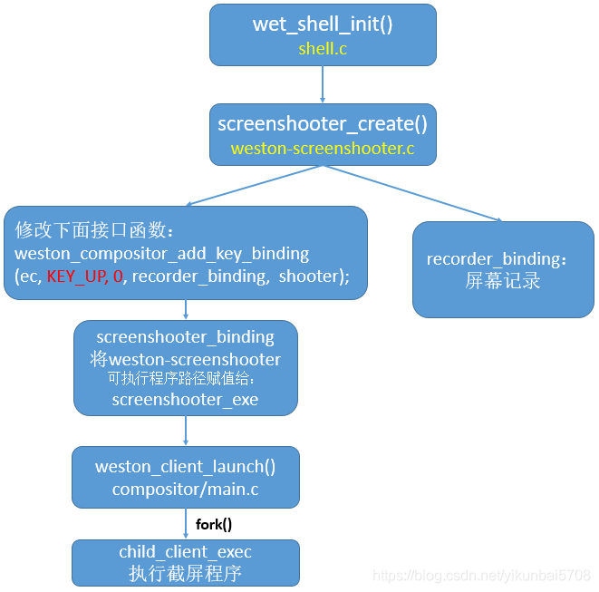
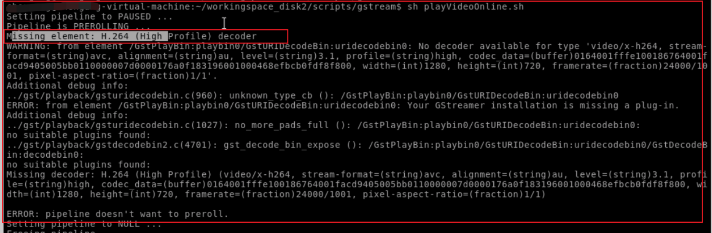
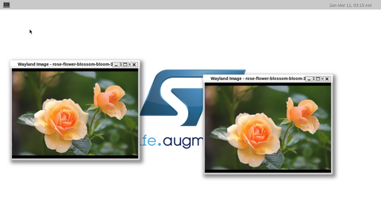
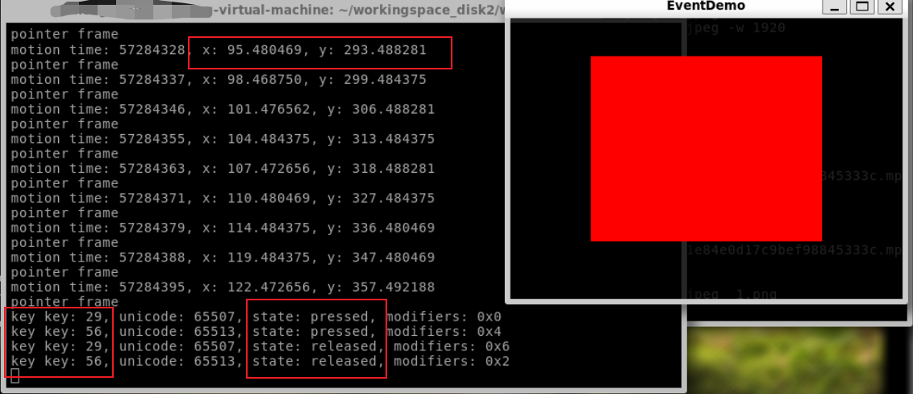
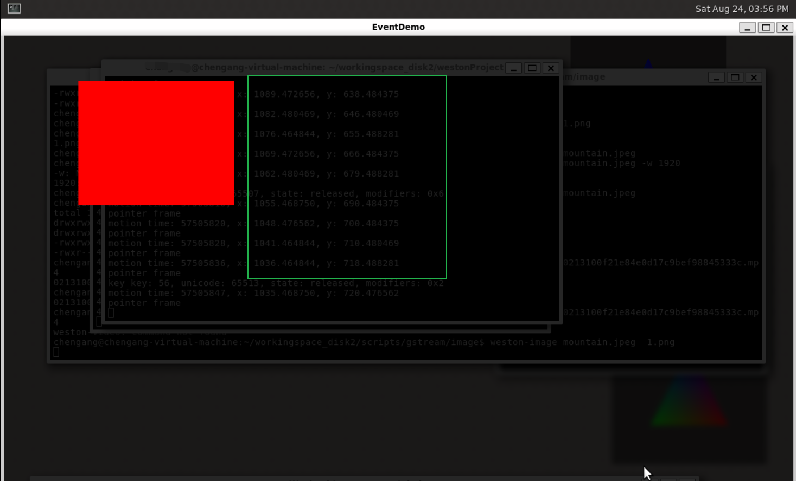
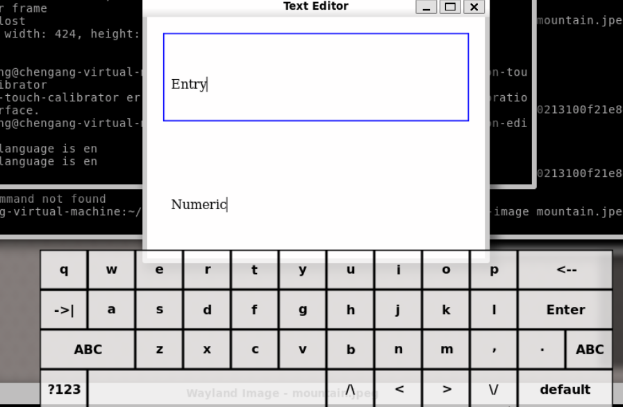
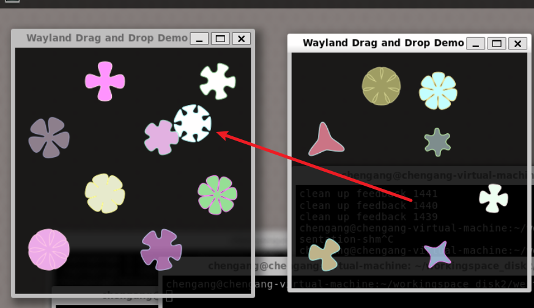
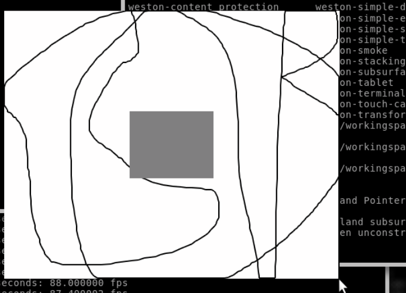

>   
>

# Weston / wayland ----与A 无异

## 功能架构----0层

Weston从内部体系结构------------~~窗口管理（shell） ：     WindowManagerService~~

​                                                    ~~合成器（compositor）：   SurfaceFlinger~~

​                                                    输入管理 input Manager ：    InputManagerService

 总之：

> **weston = wms + IMS + SF**
>
> ​                 ~~systemServer进程 + SF进程~~

从功能角度看：

> （1）任意一个系统功能是唯一确定的
>
> （2）自然，**唯一的不同就是  功能的组合方式不同，即结构上有差异**

图：

> 
>
> 
>
> [图来源](https://cloud.tencent.com/developer/article/1445734#:~:text=%E6%9C%80%E5%90%8E%E8%BE%93%E5%87%BA(%E6%AF%94%E5%A6%82%E5%88%B0framebuffer)
>
> TODO:   修改图，改变上下关系
>
> TODO:  server侧的shell具体是什么？？？？

理解：

（1）自然：~~wayland-server ---- wayland client 就是协议~~


## when---生命周期图 0层


大的生命周期：上图1和2

**目前不合理的地方**：统一repaint & <font color='red'>统一提交commit</font>


```java

├─ wet_main
├─ wl_display_run
└─ wl_event_loop_dispatch // 大的消息模型驱动
    ├─ on_drm_input  // 【发车】TODO: 真正drm来的PageFlip消息 -----------上图1-----------------
    │   └─ drmHandleEvent
    │       └─ atomic_flip_handler
    │           └─ drm_output_update_complete
    │               └─ weston_output_finish_frame // 为 output_repaint_timer_handler 计算time
    └─ wl_timer_heap_dispatch // timer 超时消息 -----------上图2-----------------
        └─ output_repaint_timer_handler  // 【交货】timer启动
            ├─ drm_repaint_begin  // 打印scene_graph日志
            ├─ 遍历output，weston_output_maybe_repaint
            └─ drm_repaint_flush // 【车子回程】 提交
```


%accordion%hideContent%accordion%

```java
wet_main
wl_display_run
wl_event_loop_dispatch // 大的消息模型驱动
	on_drm_input  // 【发车】TODO: 真正drm来的PageFlip消息 -----------上图1-----------------
		drmHandleEvent
			atomic_flip_handler
				drm_output_update_complete
					weston_output_finish_frame // 为 output_repaint_timer_handler 计算time
	wl_timer_heap_dispatch // timer 超时消息 -----------上图2-----------------
		output_repaint_timer_handler  // 【交货】timer启动
			drm_repaint_begin  // 打印scene_graph日志
    		遍历output，weston_output_maybe_repaint
			drm_repaint_flush // 【车子回程】 提交
```


%/accordion%


TODO: 真正drm来的PageFlip消息 ：

​                 到底是drm怎么发的消息？？？？？？


## 1层横向大图

字典 图：


[图来源](https://blog.csdn.net/zzjzmdx/article/details/135067743?ops_request_misc=%257B%2522request%255Fid%2522%253A%2522171749225516800180621626%2522%252C%2522scm%2522%253A%252220140713.130102334.pc%255Fblog.%2522%257D&request_id=171749225516800180621626&biz_id=0&utm_medium=distribute.pc_search_result.none-task-blog-2~blog~first_rank_ecpm_v1~rank_v31_ecpm-1-135067743-null-null.nonecase&utm_term=weston&spm=1018.2226.3001.4450#:~:text=%EF%BC%88-,%E5%9B%BE%E7%9A%84%E6%BA%90%E6%96%87%E4%BB%B6%E5%8F%AF%E8%87%AA%E8%A1%8C%E4%B8%8B%E8%BD%BD,-gitee%20%E5%9C%B0%E5%9D%80%C2%A0zwzfj2)


## 1层纵向大图

### 发车**atomic_flip_handler**   代码大纲  TODO: 

atomic_flip_handler ----- 发车


### 次要----output_repaint大纲字典

【repaint流程】承载：将client的damage区域提交给compositor，compositor进行合成

-<font color='red'>repaint的唯一目的：</font>就是拿到合成后大图（承载于drm_fb）与 简单图

```java
├─ 生命周期图 0层
├─ weston_output_maybe_repaint(compositor.c)
└─ weston_output_repaint(compositor.c)
    ├─ ------------------为views分配planes--------------------------
    ├─ drm_assign_planes // 【】具体见下
    ├─ ------------------【计算damage】---------------------------------
    └─ drm_output_repaint
        └─ drm_output_render-----------------只做了一件事情，拿到fd（内核的buffer）----------------------
            ├─ if (scanout_state->fb) return // 【】霸屏模式scanout -----> 利用client的fd
            ├─ if：drm_fb_ref  硬件合成  自然，条件：damage为空(也是gl被拦截的地方)？？？？？
            ├─ eif:drm_output_render_pixman  软件合成
            ├─ el：drm_output_render_gl //【】GPU合成    或 x11_output_repaint_gl  backend-x11/x11.c--->  weston合成器的output是X11
            │   ├─ gl_renderer_repaint_output ----> 必然，在这里设置视口viewPort，视口是output级别的
            │   │   ├─ get_surface_state(weston_surface)
            │   │   │   └─ gl_renderer_create_surface
            │   │   │       ├─ ------------------------attach？？？-----------------------------------
            │   │   │       └─ gl_renderer_attach(weston_surface, weston_buffer) // 【】核心
            │   │   ├─ repaint_views  // 【】这里遍历node，必然 从下往上叠图（合成的必然！！！）
            │   │   │   ├─ ------------------【3】OpenGL合成, 前提：分配了primary plane--------------------------
            │   │   │   └─ draw_paint_node  // 【】有些node会走gl，有些走pixman？ node级别的还是合成器级别的 ？ 必然：这里初始化shader的config
            │   │   │       ├─ gl_shader_config_init_for_paint_node // 必然：where---draw_paint_node之子，repaint_region之前
            │   │   │       ├─ repaint_region  //【】
            │   │   │       └─ triangle_fan_debug 测试用的？？？
            │   │   ├─ blit_shadow_to_output // 阴影。开关："color-management"改为true
            │   │   └─ 【eglSwapBuffers】 // 关键一行，weston 与 drm侧交换buffer！！！！（不是与client侧！！！！！！！！）
            │   ├─ bo = gbm_surface_lock_front_buffer  // 拿到gbm buffer---> 承载合成结果
            │   ├─ drm_fb_get_from_bo(bo, BUFFER_GBM_SURFACE)
            │   │   └─ drm_fb_addfb(~bo)
            │   │       └─ drmModeAddFB2WithModifiers/drmModeAddFB2   //libdrm 【】通过gbm buffer创建帧缓冲区（FrameBuffer）
            │   │           └─ 实际上，已经将数据写给drm设备了。图：https://download.csdn.net/blog/column/11175480/133747645
            │   └─ return drm_fb（指向DRM的FrameBuffer），并记录
            ├─ scanout_state->fb = fb  // 合成大图，由 drm_plane_state->drm_fb 承载
            └─ drmModeCreatePropertyBlob // 【2】libdrm接口，创建属性（后续用来设置CRTC（Crtc）、连接器（Connector）、平面（Plane））
```

​             


%accordion%原大纲%accordion%

```java
生命周期图 0层
weston_output_maybe_repaint(compositor.c)
weston_output_repaint(compositor.c) // output级
	------------------为views分配planes--------------------------
	drm_assign_planes // 【】具体见下
	------------------计算damage---------------------------------
	drm_output_repaint
		drm_output_render-----------------只做了一件事情，拿到fd（内核的buffer）----------------------
			if (scanout_state->fb) return // 【】霸屏模式scanout -----> 利用client的fd
			if：drm_fb_ref  硬件合成  自然，条件：damage为空(也是gl被拦截的地方)？？？？？
			eif:drm_output_render_pixman  软件合成
			el：drm_output_render_gl //【】GPU合成	 或 x11_output_repaint_gl  backend-x11/x11.c--->  weston合成器的output是X11
				gl_renderer_repaint_output ----> 必然，在这里设置视口viewPort，视口是output级别的
					use_output(output) // 自然，开始时，初始化EGL的环境，比如 eglMakeCurrent
						eglMakeCurrent
					get_surface_state(weston_surface)
						gl_renderer_create_surface
							------------------------attach？？？-----------------------------------
							gl_renderer_attach(weston_surface, weston_buffer) // 【】核心
					repaint_views  // 【】这里遍历node，必然
						------------------【3】OpenGL合成, 前提：分配了primary plane--------------------------
						【draw_paint_node】展开见下。 有些node会走gl，有些走pixman？ node级别的还是合成器级别的 ？ 必然：这里初始化shader的config
							gl_shader_config_init_for_paint_node // 必然：where---draw_paint_node之子，repaint_region之前
							repaint_region  //【】
							triangle_fan_debug 测试用的？？？
					blit_shadow_to_output // 阴影。开关："color-management"改为true
					【eglSwapBuffers】 // 关键一行，weston 与 drm侧交换buffer！！！！（不是与client侧！！！！！！！！）
				bo = gbm_surface_lock_front_buffer  // 拿到gbm buffer---> 承载合成结果
				drm_fb_get_from_bo(bo, BUFFER_GBM_SURFACE)
					drm_fb_addfb(~bo)
						drmModeAddFB2WithModifiers/drmModeAddFB2   //libdrm 【】通过gbm buffer创建帧缓冲区（FrameBuffer）
																			 实际上，已经将数据写给drm设备了。图：https://download.csdn.net/blog/column/11175480/133747645
				return drm_fb（指向DRM的FrameBuffer），并记录
			scanout_state->fb = fb  // 合成大图，由 drm_plane_state->drm_fb 承载
			drmModeCreatePropertyBlob // 【2】libdrm接口，创建属性（后续用来设置CRTC（Crtc）、连接器（Connector）、平面（Plane））
```

%/accordion%


【eglSwapBuffers】

> ```
> eglSwapBuffers(gr->egl_display, go->egl_surface)
> ```
>
> 1、是个output级别的函数。weston 与 drm侧交换buffer！！！！（<font color='red'>不是与client侧！！！！！！！</font>）
>
> 2、client 也有 eglSwapBuffers 函数
>
> 3、<font color='red'>weston的 耗时很久，大概 1~3ms</font>       -------->  TODO: 不是交换地址吗？


**=================大纲的证明==================**

drm_output_render<font color='red'>唯一目的</font>就是拿到合成后buffer对应的fd

>   （1）自然，OpenGL合成后，拿到fd
>
>   （2） 一个client霸屏了，自然直接用client的fd 。具体见《霸屏scanout》章节

为啥要拿到fd？ 因为这是commit的前提！！！！！


【2】 GPU（CPU）合成结果的承载者-------drm_fb


**其他小点：**

1、直接overlay送的图的流程：

（1）在 gl重绘窗口repaint_views时，过滤掉了

------------> 即啥也没做！！！！

（2）scanout霸屏时，也是gl流程，直接return出去了


-<font color='red'>【flush流程】目的：commit  大图与简单图  给DRM</font>

```java
生命周期图 0层
    └─ drm_repaint_flush(drm.c)
        └─ drm_pending_state_apply(kms.c)
            └─ drm_pending_state_apply_atomic(kms.c)  // 遍历 pending_state->output_list
                ├─ drm_output_apply_state_atomic(drm_output_state, drmModeAtomicReq)  // 【2】必然：自然以plane_list维度，去commit
                │   └─ 遍历 drm_plane_state（repaint后的大图存储的地方）
                │       └─ plane_add_prop(req,plane_state->fb->fb_id); // 【】关键一行，关键出参：req 修改对应的配置参数
                └─ drmModeAtomicCommit(req)  // 【】关键一行：参数统一commit给drm（libdrm接口）
```

%accordion%hideContent%accordion%

```java
output_repaint_timer_handler(compositor.c) // repaint的timer里
	drm_repaint_flush(drm.c)
		drm_pending_state_apply(kms.c)
			drm_pending_state_apply_atomic(kms.c)  // 遍历 pending_state->output_list
				drm_output_apply_state_atomic(drm_output_state, drmModeAtomicReq)  // 【2】必然：自然以plane_list维度，去commit
					遍历 drm_plane_state（repaint后的大图存储的地方）
						plane_add_prop(req,plane_state->fb->fb_id); // 【】关键一行，关键出参：req 修改对应的配置参数
				drmModeAtomicCommit(req)  // 【】关键一行：参数统一commit给drm（libdrm接口）
```

%/accordion%

详解【1】：commit 与 repaint流程，一定不在一个loop触发里：

-<font color='red'>生活化模型：</font>

>   overlay ----------- 年轻人
>
>   GPU ------------- 有能力的老人
>
>    DPU 叠图 ----------考试结束，画挂墙（挂墙展示评分）
>
>   （1）<font color='red'>事件驱动（client的dirty） 触发重绘：</font> ~~多个画家画画，画完送给  张贴人 （合成器），合成器触发重绘~~
>
>   （2）有些画 可能需要相框（圆角特效等），需要**有能力**的老人（GPU）来完成。**有能力，但是干活慢**。
>
>   ​		  老人装完相框，把多个画，贴到一张大纸上**形成大图**，最后交给年轻挂画的人。年轻人（DPU）最后把画挂到墙上
>
>   （3）  有些画，很简单，不需要额外的操作，直接交给年轻小白（DPU）直接挂墙。 无能力（只会粘贴），但是干活快
>
>   （4）<font color='red'>when：</font><font color='red'>大图与简单画</font>（**plane_list**），何时 给到 年轻小白去挂墙？
>
>   ​                       **自然是**本轮考试结束的时候，timeOut的时候   ---------> <font color='red'>即commit是计时器触发</font>

TODO: 一场考试需要多久？


详解【2】：

必然以<font color='red'>plane_list维度去commit</font>：

>   （1）GPU合成的结果，以primary_plane 去提交，提交给DPU
>
>   （2） overlay对应的view，没有合成 ------> 直接以overlay_plane，送给DPU
>
>      (3)  cursor_plane ，也被提交给DPU


------------------------> 注意： 遍历 的plane_list，不代表硬件层级！！


#### draw_paint_node 画一个节点  大纲

使用gl 接口，调用GPU画：

​	 -<font color='red'>本质：就是GPU贴图</font>

```java
└─ draw_paint_node
    ├─ pixman_region32_intersect(&repaint, damage); // 次要：用damage更新 repaint区域
    ├─ gl_shader_config_init_for_paint_node // 【】目的：需要参数封装到conf结构体里（用作shader）
    │   ├─ gl_shader_config_set_input_textures  // 【】关键：把client的texture封装到conf里
    │   │   └─ for: sconf->input_tex[i] = gb->textures[i] // 一个node，可能有多个Texture
    │   └─ gl_shader_config_set_color_transform 颜色变换？
    ├─ pixman_region32_subtract(&surface_blend, &surface_blend, &pnode->surface->opaque); // 扣除 完全不透明区域？
    └─ repaint_region(gr, pnode, &repaint, &surface_blend, &sconf); // 【】
        ├─ 【texture_region(pnode, region, surf_region)】 矩形窗口可能被其他窗口遮挡，会被分割成多个小矩形进行绘制
        ├─ /* position: */
        ├─ glVertexAttribPointer(0, 2, GL_FLOAT, GL_FALSE, 4 * sizeof *v, &v[0]);
        ├─ /* texcoord: */
        ├─ glVertexAttribPointer(1, 2, GL_FLOAT, GL_FALSE, 4 * sizeof *v, &v[2]);
        ├─ gl_renderer_use_program(gr, sconf) // 【】
        │   ├─ gl_renderer_get_program(gr, &sconf->req) // 获取glProgram
        │   │   ├─ 做了缓存，不用每次都编译gl_shader_requirements_cmp(&reqs, &shader->key)
        │   │   └─ gl_shader_create(gr, &reqs) // 没有的话，创建
        │   │       ├─ sources[2] = fragment_shader; 具体的fragment.glsl
        │   │       └─ glGetProgramiv(shader->program); //gl接口生成glProgram
        │   │           ├─ shader->proj_uniform = glGetUniformLocation(shader->program, "proj");
        │   │           ├─ shader->tex_uniforms[0] = glGetUniformLocation(shader->program, "tex"); // 【】 拿到.glsl中全局变量的索引，后面CPU给GPU赋值
        │   │           └─ shader->tex_uniforms[1] = glGetUniformLocation(shader->program, "tex1");
        │   ├─ glUseProgram(shader->program); // 激活glProgram（激活一个着色器程序，所有后续的绘制调用将使用这个程序中定义的顶点着色器和片段着色器）
        │   └─ gl_shader_load_config(shader, sconf) //
        │       ├─ glUniform1f(shader->view_alpha_uniform, sconf->view_alpha); // 【】CPU真正给GPU赋值的地方
        │       └─ for遍历，绑定纹理： // 贴图：一个client surface，只有一个（已经确认）
        │           ├─ glActiveTexture(GL_TEXTURE0 + i)  激活当前的纹理单元，使得后续的纹理操作会在这个纹理上进行
        │           └─ glBindTexture(GL_TEXTURE_2D, sconf->input_tex[i])  //相当create 2d texture_obj对象，并设置了sconf->input_tex[i];
        └─ 遍历所有矩形nfans， glDrawArrays(GL_TRIANGLE_FAN, first, vtxcnt[i]); //【】真正绘制

```


%accordion%hideContent%accordion%

```java
draw_paint_node
	pixman_region32_intersect(&repaint, damage); // 次要：用damage更新 repaint区域
	gl_shader_config_init_for_paint_node // 【】目的：需要参数封装到conf结构体里（用作shader）
		gl_shader_config_set_input_textures  // 【】关键：把client的texture封装到conf里
			for: sconf->input_tex[i] = gb->textures[i] // 一个node，可能有多个Texture
		gl_shader_config_set_color_transform 颜色变换？
	pixman_region32_subtract(&surface_blend, &surface_blend, &pnode->surface->opaque); // 扣除 完全不透明区域？
	repaint_region(gr, pnode, &repaint, &surface_blend, &sconf); // 【】
		【texture_region(pnode, region, surf_region)】 矩形窗口可能被其他窗口遮挡，会被分割成多个小矩形进行绘制
		/* position: */
		glVertexAttribPointer(0, 2, GL_FLOAT, GL_FALSE, 4 * sizeof *v, &v[0]);
		/* texcoord: */
		glVertexAttribPointer(1, 2, GL_FLOAT, GL_FALSE, 4 * sizeof *v, &v[2]);
		gl_renderer_use_program(gr, sconf) // 【】
			gl_renderer_get_program(gr, &sconf->req) // 获取glProgram
				做了缓存，不用每次都编译gl_shader_requirements_cmp(&reqs, &shader->key)
				gl_shader_create(gr, &reqs) // 没有的话，创建
					sources[2] = fragment_shader; 具体的fragment.glsl
					glGetProgramiv(shader->program); //gl接口生成glProgram
						shader->proj_uniform = glGetUniformLocation(shader->program, "proj"); 
						shader->tex_uniforms[0] = glGetUniformLocation(shader->program, "tex"); // 【】 拿到.glsl中全局变量的索引，后面CPU给GPU赋值
						shader->tex_uniforms[1] = glGetUniformLocation(shader->program, "tex1");
			glUseProgram(shader->program); // 激活glProgram（激活一个着色器程序，所有后续的绘制调用将使用这个程序中定义的顶点着色器和片段着色器）
			gl_shader_load_config(shader, sconf) // 
				glUniform1f(shader->view_alpha_uniform, sconf->view_alpha); // 【】CPU真正给GPU赋值的地方
				for遍历，绑定纹理： // 贴图：一个client surface，只有一个（已经确认）
					glActiveTexture(GL_TEXTURE0 + i)  激活当前的纹理单元，使得后续的纹理操作会在这个纹理上进行
					glBindTexture(GL_TEXTURE_2D, sconf->input_tex[i])  //相当create 2d texture_obj对象，并设置了sconf->input_tex[i];
		遍历所有矩形nfans， glDrawArrays(GL_TRIANGLE_FAN, first, vtxcnt[i]); //【】真正绘制
```

%/accordion%


关于weston 如何使用OpenGL<font color='red'>贴图，很好的参考：</font>

>   weston现有的  shadow的画法  
>
>   高斯模糊的做法


### 次要---给view分配plane（drm_assign_planes）大纲

```java
repaint大纲字典
└─ drm_assign_planes ----------output级
    ├─ try: mode = DRM_OUTPUT_PROPOSE_STATE_PLANES_ONLY  //1、尝试只用 overlay
    ├─ try: mode = DRM_OUTPUT_PROPOSE_STATE_MIXED;        // 2、只用overlay不成功，尝试 overlay + GPU
    ├─ try: mode = DRM_OUTPUT_PROPOSE_STATE_RENDERER_ONLY;  // 上面两点都不成功, 自然，只用GPU
    └─ drm_output_propose_state(mode)-------output级--------------
        └─ wl_list_for_each(pnode)------遍历pnode节点-----view级----------
            ├─ ①忽略不合成的view(continue)：
            │   ├─ 1、不属于此output的  if (!(ev->output_mask & (1u << output->base.id)))
            │   ├─ 2、必须需要颜色变换 TODO:没懂  if (!pnode->surf_xform_valid)
            │   ├─ 3、完全被遮挡的 if (totally_occluded)
            │   └─ 4、
            ├─ ②强制走GPU render的(force_renderer = true)：
            │   ├─ 1、view存在于多个output上，if (ev->output_mask != (1u << output->base.id))
            │   ├─ 2、view 对应的GBM not available（drm侧）， if (!b->gbm)
            │   ├─ 3、view没有有效的buffer，if (!weston_view_has_valid_buffer(ev))
            │   ├─ 4、view对应buffer类型是 WESTON_BUFFER_SOLID
            │   ├─ 5、需要做color变换的，(requires color transform)
            │   ├─ 6、view被GPU render view遮挡的， if (pixman_region32_not_empty(&surface_overlap))  ----> TODO:本质原因是啥！！！！！！
            │   │   └─ 换言之，gpu view 以下（遮挡），必须是GPU！
            │   └─ 7、view在保护content-protection的强制mode下
            └─ ③--------对于非强制GPU的尝试分配plane：drm_output_find_plane_for_view -----------
                ├─ 1、检查buffer是否有效。无效则 FAILURE_REASONS_FB_FORMAT_INCOMPATIBLE
                ├─ 2、buffer类型是WESTON_BUFFER_SOLID ，分配plane失败， FAILURE_REASONS_FB_FORMAT_INCOMPATIBLE
                ├─ 3、buffer类型是WESTON_BUFFER_SHM，只允许是cursor_plane：
                │   ├─ pixel_format格式是DRM_FORMAT_ARGB8888，失败，FAILURE_REASONS_FB_FORMAT_INCOMPATIBLE
                │   ├─ buffer的尺寸大于鼠标，失败
                │   └─ 赋值：possible_plane_mask = (1 << output->cursor_plane->plane_idx);
                ├─ 4、自然，尝试的mode = DRM_OUTPUT_PROPOSE_STATE_RENDERER_ONLY，失败
                ├─ 5、wl_list_for_each(plane, &device->plane_list)遍历 硬件所有plane
                │   └─ 跳过CURSOR类型的plane
                │       └─ 赋值：possible_plane_mask |= 1 << plane->plane_idx;
                ├─ 6、没有对应的drm_fb（Framebuffer），失败
                ├─ 7、有对应的drm_fb，赋值：possible_plane_mask &= fb->plane_mask
                ├─ ③_1--------真正的分配（对于③中可能分配的possible_plane）-----------------------
                └─ wl_list_for_each(plane, &device->plane_list)遍历plane_list：
                    ├─ plane可得性检查：【drm_plane_is_available】
                    │   ├─ output如果是virtual的，不能分配plane！！
                    │   ├─ The plane still 存在 a request
                    │   ├─ The plane is still active on another output
                    │   └─ 检查 plane can be used with this CRTC // 【】屏幕和plane的绑定关系！！！！
                    ├─ 检查 view对应的buffer有效性：assert(fb)
                    ├─ alpha已经安排过view，跳过： drm_output_check_plane_has_view_assigned()
                    ├─ alpha 检查：如果view有alpha值，但是该plane不支持alpha，跳过
                    └─ 最终绑定plane与view：drm_output_prepare_cursor_paint_node/drm_output_try_paint_node_on_plane
                        └─ plane_state->ev = view  // TODO: 最终应该是，plane分配给view
```

-<font color='red'>结论的物理级证明：</font>

1、<font color='red'>物理上，必然：连续性结论</font>：~~**GPU合成的views必须连续**~~（~~因为只有一个GPU~~）

推论：所以，~~**代码策略：某view是GPU合成，以下（需要被遮挡）都必须是force-render**~~

2、TODO：  上面所有策略的物理级的证明


%accordion%hideContent%accordion%

```java
drm_assign_planes ----------output级
	try: mode = DRM_OUTPUT_PROPOSE_STATE_PLANES_ONLY  //1、尝试只用 overlay
	try: mode = DRM_OUTPUT_PROPOSE_STATE_MIXED;	  // 2、只用overlay不成功，尝试 overlay + GPU
	try: mode = DRM_OUTPUT_PROPOSE_STATE_RENDERER_ONLY;  // 上面两点都不成功, 自然，只用GPU
	drm_output_propose_state(mode)-------output级--------------
		wl_list_for_each(pnode)------遍历pnode节点-----view级----------
			①忽略不合成的view(continue)：
				1、不属于此output的  if (!(ev->output_mask & (1u << output->base.id))) 
				2、必须需要颜色变换 TODO:没懂  if (!pnode->surf_xform_valid)
				3、完全被遮挡的 if (totally_occluded)
				4、
			②强制走GPU render的(force_renderer = true)：
				1、view存在于多个output上，if (ev->output_mask != (1u << output->base.id))
				2、view 对应的GBM not available（drm侧）， if (!b->gbm)
				3、view没有有效的buffer，if (!weston_view_has_valid_buffer(ev))
				4、view对应buffer类型是 WESTON_BUFFER_SOLID
				5、需要做color变换的，(requires color transform)
				6、view被GPU render view遮挡的， if (pixman_region32_not_empty(&surface_overlap))  ----> TODO:本质原因是啥！！！！！！
					换言之，gpu view 以下（遮挡），必须是GPU！
				7、view在保护content-protection的强制mode下
			③--------对于非强制GPU的尝试分配plane：drm_output_find_plane_for_view -----------
				1、检查buffer是否有效。无效则 FAILURE_REASONS_FB_FORMAT_INCOMPATIBLE
				2、buffer类型是WESTON_BUFFER_SOLID ，分配plane失败， FAILURE_REASONS_FB_FORMAT_INCOMPATIBLE
				3、buffer类型是WESTON_BUFFER_SHM，只允许是cursor_plane：
					pixel_format格式是DRM_FORMAT_ARGB8888，失败，FAILURE_REASONS_FB_FORMAT_INCOMPATIBLE
					buffer的尺寸大于鼠标，失败
					赋值：possible_plane_mask = (1 << output->cursor_plane->plane_idx);
				4、自然，尝试的mode = DRM_OUTPUT_PROPOSE_STATE_RENDERER_ONLY，失败
				5、wl_list_for_each(plane, &device->plane_list)遍历 硬件所有plane
						跳过CURSOR类型的plane
						赋值：possible_plane_mask |= 1 << plane->plane_idx;
				6、没有对应的drm_fb（Framebuffer），失败
				7、有对应的drm_fb，赋值：possible_plane_mask &= fb->plane_mask
				③_1--------真正的分配（对于③中可能分配的possible_plane）-----------------------
				wl_list_for_each(plane, &device->plane_list)遍历plane_list：
					plane可得性检查：drm_plane_is_available：
						output如果是virtual的，不能分配plane！！
						The plane still 存在 a request
						The plane is still active on another output
						检查 plane can be used with this CRTC
					检查 view对应的buffer有效性：assert(fb)
					alpha已经安排过view，跳过： drm_output_check_plane_has_view_assigned()
					alpha 检查：如果view有alpha值，但是该plane不支持alpha，跳过
					最终绑定plane与view：drm_output_prepare_cursor_paint_node/drm_output_try_paint_node_on_plane
						plane_state->ev = view  // TODO: 最终应该是，plane分配给view

```

%/accordion%


最终一行： 承载在哪个变量里？？？？

```java
view->plane = primary_plane; //  把plane分配给view

weston_compositor里的primary_plane;  // 【】指明了GPU的plane
```


维测：


#### 如何避免将屏幕1的plane分配给屏幕2的view呢？plane-output 绑定关系维护在哪里？

必然是在驱动！！！因为plane的数据送给哪个屏幕，是drm决定的

-<font color='red'>weston侧只是获取 绑定关系。</font>具体代码：

```java
drm_plane_is_available(plane, output)
{
	.................
      if (plane->state_cur->output && plane->state_cur->output != output) // 第二次、第三次分配：维持第一次  plane与outPut的绑定关系
		return false;
    
	/* Check whether the plane can be used with this CRTC; possible_crtcs
	 * is a bitmask of CRTC indices (pipe), rather than CRTC object ID. */
	return !!(plane->possible_crtcs & (1 << output->crtc->pipe));  // 第一次分配
}
```

结论：

>   1、outPut与crtc 一 一对应。。。。TODO: 验证
>
>   2、**plane->possible_crtcs，即对应的plane-crtc绑定关系**。。TODO: outPut 与 crtc绑定关系在哪里？？？？
>
>   TODO:  难道一个plane，可以绑定多个关系？


plane->possible_crtcs来源：

```java
weston_backend_init
	drm_backend_create
		open_additional_devices
			drm_device_create
				create_sprites
					drm_plane_create //【】 通过drmModePlane，拿到plane对应的 possible_crtcs、plane->plane_id
```


#### ~~次要 ------ compositor从drm获取plane信息~~

硬件：

plane的来源：

> 不是跟着屏幕走的。而是硬件资源的限制（具体：CRTC、encode？？？？？？）


图来源


代码大纲：

```java
weston_backend_init(drm.c)
	drm_backend_create(drm.c)
		drm_device_create(drm.c)
			create_sprites(drm.c) sprites即overlay planes
```


关键一行： 

```java
kplane_res = drmModeGetPlaneResources(device->drm.fd); // 得到plane资源集
for (i = 0; i < kplane_res->count_planes; i++) {
    kplane = drmModeGetPlane(device->drm.fd, kplane_res->planes[i]); //  根据Plane ID得到Plane
```


在weston侧，**最终维护在plane_list中**


TODO: 物理级的理解：

> plane个数的限制，最终是来源哪里？硬件？具体哪个硬件
>
> ​							  最终配置在哪里？


日志：

```java
[17:26:13.604] drm_plane_create: plane->plane_id: 49  // 从drm获取的id  【1】乱七八糟？？ 【2】这个值，重启后变化
[17:26:13.605] drm_plane_create: plane->plane_id: 70 
[17:26:13.605] drm_plane_create: plane->plane_id: 74 
[17:26:13.606] drm_plane_create: plane->plane_id: 110 
[17:26:13.606] drm_plane_create: plane->plane_id: 114 
[17:26:13.606] drm_plane_create: plane->plane_id: 126 
[17:26:13.607] drm_plane_create: plane->plane_id: 132 
[17:26:13.607] drm_plane_create: plane->plane_id: 138 
[17:26:13.608] drm_plane_create: plane->plane_id: 144 
[17:26:13.609] drm_plane_create: plane->plane_id: 150 
[17:26:13.609] create_sprites: drm_plane->plane_idx: 0   // weston，重新赋予的id值
[17:26:13.609] create_sprites: drm_plane->plane_idx: 1 
[17:26:13.609] create_sprites: drm_plane->plane_idx: 2 
[17:26:13.609] create_sprites: drm_plane->plane_idx: 3 
[17:26:13.609] create_sprites: drm_plane->plane_idx: 4 
[17:26:13.609] create_sprites: drm_plane->plane_idx: 5 
[17:26:13.609] create_sprites: drm_plane->plane_idx: 6 
[17:26:13.609] create_sprites: drm_plane->plane_idx: 7 
[17:26:13.609] create_sprites: drm_plane->plane_idx: 8 
[17:26:13.609] create_sprites: drm_plane->plane_idx: 9 
```


### 主要----plane分配原则总结（物理级别）

默认的view都是分给primary  ------>  啥是默认的view？？？

video 占据sprite plane


大致：

> 1、overlay条件非常苛刻
>
> 2、GPU是用来兜底的。万能的
>
>   primary 层，物理上一定在下面


#### 总结所有走GPU的（剩下走overlay）

从GPU角度：

> <font color='red'>GPU是DRM的兜底者</font>（~~比如，DRM不认识SHM~~）


代码中：

> ②强制走gpu的
>
> ③尝试分配plane失败的

物理角度，只能GPU：

> WESTON_BUFFER_SHM  --------->  <font color='red'>cpu分配的内存，drm不认识</font>。只能走GPU兜底转一道（~~cursor可以plane~~）
>
> WESTON_BUFFER_SOLID  


#### WESTON_BUFFER_SHM  强制GPU

代码证明：

```java
 else if (buffer->type == WESTON_BUFFER_SHM) {
		if (!output->cursor_plane || device->cursors_are_broken) {
			pnode->try_view_on_plane_failure_reasons |=
				FAILURE_REASONS_FB_FORMAT_INCOMPATIBLE;

			// add by kent start
			drm_debug(b, "\t\t\t\t ==kent==, drm_output_find_plane_for_view weston_view %p buffer->type == WESTON_BUFFER_SHM \n", ev);
			return NULL;
		}
```


例外：允许cursor的SHM 直接送drm

```java
drm_debug(b, "\t\t\t\t[view] not placing view %p on "
		             "plane; SHM buffers must be ARGB8888 for "
			     "cursor view\n", ev);   
```


#### 从日志看assign_plane


output 0尝试混合模式：

```java
	[repaint] could not build planes-only state, trying mixed
		[state] using renderer FB ID 164 for mixed mode for output DSI-1 (0)
		[state] scanout will use for zpos 0
			[view] evaluating view 0x55a6da1d40 for output DSI-1 (0)
			[plane] started with zpos 18446744073709551615
				[view] view 0x55a6da1d40 will be placed on the renderer
			[view] evaluating view 0x55a6d9d1f0 for output DSI-1 (0)
				[view] not assigning view 0x55a6d9d1f0 to plane (occluded by renderer views)
				[view] view 0x55a6d9d1f0 will be placed on the renderer
			[view] evaluating view 0x55a6da2210 for output DSI-1 (0)
				[view] ignoring view 0x55a6da2210 (occluded on our output)
			[view] evaluating view 0x55a6d8e060 for output DSI-1 (0)
				[view] ignoring view 0x55a6d8e060 (occluded on our output)
			[view] evaluating view 0x55a6d8eaf0 for output DSI-1 (0)
				[view] ignoring view 0x55a6d8eaf0 (occluded on our output)
			[view] evaluating view 0x55a6d8ccd0 for output DSI-1 (0)
				[view] ignoring view 0x55a6d8ccd0 (occluded on our output)
			[view] evaluating view 0x55a6d8efc0 for output DSI-1 (0)
				[view] ignoring view 0x55a6d8efc0 (occluded on our output)
			[view] evaluating view 0x55a6d72740 for output DSI-1 (0)
				[view] ignoring view 0x55a6d72740 (occluded on our output)
			[view] evaluating view 0x55a6e73a60 for output DSI-1 (0)
				[view] not assigning view 0x55a6e73a60 to plane (occluded by renderer views)
				[view] not assigning view 0x55a6e73a60 to plane (layer is or under BOS_SURFACE_LAYER_POSITION_BELOW)
				[view] view 0x55a6e73a60 will be placed on the renderer
			[view] evaluating view 0x55a6da0370 for output DSI-1 (0)
				[view] not assigning view 0x55a6da0370 to plane (occluded by renderer views)
				[view] view 0x55a6da0370 will be placed on the renderer
			[view] evaluating view 0x55a6d9f750 for output DSI-1 (0)
				[view] ignoring view 0x55a6d9f750 (not on our output)
			[view] evaluating view 0x55a6d9eb30 for output DSI-1 (0)
				[view] ignoring view 0x55a6d9eb30 (not on our output)
			[view] evaluating view 0x55a6d9df10 for output DSI-1 (0)
				[view] ignoring view 0x55a6d9df10 (not on our output)
```

测试output 0状态：

```java
		[atomic] testing output 0 (DSI-1) state
			[CRTC:78] 23 (MODE_ID) -> 163 (0xa3)
			[CRTC:78] 22 (ACTIVE) -> 1 (0x1)
			[CRTC:78] 24 (VRR_ENABLED) -> 0 (0x0)
			[CONN:34] 20 (CRTC_ID) -> 78 (0x4e)
			[PLANE:49] 17 (FB_ID) -> 164 (0xa4)
			[PLANE:49] 20 (CRTC_ID) -> 78 (0x4e)
			[PLANE:49] 9 (SRC_X) -> 0 (0x0)
			[PLANE:49] 10 (SRC_Y) -> 0 (0x0)
			[PLANE:49] 11 (SRC_W) -> 113246208 (0x6c00000)
			[PLANE:49] 12 (SRC_H) -> 123731968 (0x7600000)
			[PLANE:49] 13 (CRTC_X) -> 0 (0x0)
			[PLANE:49] 14 (CRTC_Y) -> 0 (0x0)
			[PLANE:49] 15 (CRTC_W) -> 1728 (0x6c0)
			[PLANE:49] 16 (CRTC_H) -> 1888 (0x760)
			[PLANE:49] FORMAT: XRGB8888
			[PLANE:49] 51 (alpha) -> 65535 (0xffff)
```

最终提交：------> **所有outPut**

```java
[atomic] drmModeAtomicCommit
	[repaint] Using mixed state composition          ------> // TODO: 哪一个plane？？
	[repaint] view 0x55a6da1d40 using renderer composition
	[repaint] view 0x55a6d9d1f0 using renderer composition
	[repaint] view 0x55a6da2210 using renderer composition
	[repaint] view 0x55a6d8e060 using renderer composition
	[repaint] view 0x55a6d8eaf0 using renderer composition
	[repaint] view 0x55a6d8ccd0 using renderer composition
	[repaint] view 0x55a6d8efc0 using renderer composition
	[repaint] view 0x55a6d72740 using renderer composition
	[repaint] view 0x55a6e73a60 using renderer composition
	[repaint] view 0x55a6da0370 using renderer composition
		[atomic] applying output 0 (DSI-1) state  // 【】 ----> 真正提交
			[CRTC:78] 23 (MODE_ID) -> 163 (0xa3)
			[CRTC:78] 22 (ACTIVE) -> 1 (0x1)
			[CRTC:78] 24 (VRR_ENABLED) -> 0 (0x0)
			[CONN:34] 20 (CRTC_ID) -> 78 (0x4e)
			[PLANE:49] 17 (FB_ID) -> 38 (0x26)
			[PLANE:49] 20 (CRTC_ID) -> 78 (0x4e)
			[PLANE:49] 9 (SRC_X) -> 0 (0x0)
			[PLANE:49] 10 (SRC_Y) -> 0 (0x0)
			[PLANE:49] 11 (SRC_W) -> 113246208 (0x6c00000)
			[PLANE:49] 12 (SRC_H) -> 123731968 (0x7600000)
			[PLANE:49] 13 (CRTC_X) -> 0 (0x0)
			[PLANE:49] 14 (CRTC_Y) -> 0 (0x0)
			[PLANE:49] 15 (CRTC_W) -> 1728 (0x6c0)
			[PLANE:49] 16 (CRTC_H) -> 1888 (0x760)
			[PLANE:49] FORMAT: XRGB8888
			[PLANE:49] 51 (alpha) -> 65535 (0xffff)
[atomic] drmModeAtomicCommit
	[CRTC:78] setting pending flip
[repaint] flushed pending_state 0x55a6e45060
[atomic][CRTC:78] flip processing started
[atomic][CRTC:78] flip processing completed
```


### 从物理\硬件角度看Plane

0、对于最终的显示（应用角度） ，<font color='red'>显示Zorder</font> = 窗口管理的Zorder =  <font color='red'>软件配置 + 硬件调整 </font>

1、 GPU能叠一些奇怪的图（（1）、大于屏幕的图、（2）圆角 （3）subsurface）（~~这些overlay做不到~~）

2、对于软件：**上面的view优先尝试分配overlay的**

​      目的： 减少GPU的负载

推论：

>   2_1、：抛开项目， **weston原生逻辑，primary一定要在overlay之下的**（**上面的view先分配的overlay**，如果overlay在下面，那么上面的view显示到primary下面了---------->上面的view被遮挡）
>
>   2_2 、必然：某一层用了GPU，以下都必须是GPU（TODO: <font color='red'>必然性在哪里？</font>因为background一定走GPU，所有GPU最终只能合成一层？？？？？）


一些结论：

**自然情况下，设计理念：**

> 先管重要的（上面的最重要）-------------------------**遍历views选择从上往下遍历**
>
> **年轻人在前，老人兜底** -------------------------为充分利用效率，自然先尽量分配给overlay
>
> ​            老人兜底 --------- primary在下

**B的方式，不自然、反常**：

> 不自然的点： primary弄上面了（因为A的割裂导致weston上面与下面的plane永久隔离）
>
> -------------> 后果，下面的overlay只能用作被遮挡场景
>
> ​                              老人放前面--------------1、效率变低
>
> ​							                                     2、（大致）意味着下面的overlay 无用了（这也是强制某个应用走的原因）


### 补充特例--------霸屏scanout

效果：

>   
>
>   [图来源](https://blog.csdn.net/u012839187/article/details/112415876#:~:text=an%20appropriate%20buffer)


结论：

>   1、霸屏和GPU合成一样，**都是用的那块 primary plane**    
>
>   -----------> 自然的，  （1）<font color='red'>目的一样：GPU合成目的也是拿到FullScreen的df </font>  （2）因为primary是每个屏必须的
>
>   代码实现角度：
>
>   >   ~~scanout_plane一定是 primary—plane  类型~~  自然
>   >
>   >   scanout_state-><font color='red'>fb 的指向不同</font>：霸屏下，是指向Client的fd；GPU合成是指向frameBuffer 
>
>   2、霸屏的判断：自然是FullScreen
>
>   4、<font color='red'>霸屏的唯一目</font>的就是 阻止 合成。[见](https://blog.csdn.net/u012839187/article/details/112415876#:~:text=%22Disables%22%20composition%20for%20fullscreen%20clients)
>
>   5、优点：一个client霸屏了，**自然直接用client的fd**
>
>   6、TODO:  霸屏 与 走overlay的 图，有本质区别嘛？
>
>   7、~~composition只会在primary  plane上发生~~。自然
>
>   8、物理角度决定了  full-screen  和 overlay，没有GPU的合成


### 信息角度之    像素之旅

参考：[像素之旅](https://blog.csdn.net/u012839187/article/details/112415876#:~:text=%E5%8D%A0%E6%8D%AEsprite%20plane%EF%BC%9B-,%E5%83%8F%E7%B4%A0%E4%B9%8B%E6%97%85,-%E4%BD%9C%E4%B8%BA%E8%AF%B4%E6%98%8E%EF%BC%8C%E8%AF%B7)


整个图形，就是像素的生命周期：

>   client像素:  产生--->流转给合成器 --->流转plane --->crtc ---->encoder ---->connector ----> 屏幕
>

像素的承载：buffer

>   1、GPU buffer -----> client  OpenGL画的 & GPU 合成时： 这个时候是共享buffer？[共享纹理](https://blog.csdn.net/u012839187/article/details/112415876#:~:text=%E7%9A%84%E5%85%B6%E4%BB%96%E6%96%B9%E6%B3%95%EF%BC%89-,%E5%9C%A8%E5%AE%A2%E6%88%B7%E7%AB%AF%E5%92%8C%E5%90%88%E6%88%90%E5%99%A8%E4%B9%8B%E9%97%B4%E5%85%B1%E4%BA%AB%E7%BA%B9%E7%90%86,-%E3%80%82%E5%9C%A8%E6%9C%AC%E4%BE%8B)？
>
>   2、CPU buffer -----> CPU绘制 & CPU合成
>
>   3、交叉---GPU buffer & CPU buffer：存在内存Copy: GPU buffer copy给CPU buffer ！！！！！！！
>
>   ​			例子：client  OpenGL画的， 软件合成器
>   ​			TODO: 待验证


[来源](https://kenttj.github.io/markdownbook/0_%E5%9B%BE%E5%BD%A2%E7%B3%BB%E7%BB%9F/3_Display%E7%B3%BB%E7%BB%9F/als2015_wayland_weston_v2.pdf)


结论：

-<font color='red'>从本质上讲：</font>

>    1、<font color='red'>Full-screen 与  overlay，没有任何区别</font> ------------->  自然，处理流程没有区别
>
>   ​      唯一区别：df 是不是全屏的？
>
>   2、<font color='red'>Full-screen 与  primary plane  没有任何区别</font> 
>
>   ​        唯一区别：后者有个 合成过程，**见上图的 4和5**

TODO:  上图中的GBM是啥？


## lib依赖结构(功能导致的)


[图来源](https://cloud.tencent.com/developer/article/1445734#:~:text=Wayland/Weston-,%E8%BF%90%E8%A1%8C%E6%97%B6%E4%BE%9D%E8%B5%96,-%E7%9A%84%E5%BA%93%E4%B8%BB%E8%A6%81)


```java
└─ weston
    ├─ libexec_weston.so.0
    │   ├─ libweston-11.so.0
    │   │   ├─ libwayland-server.so.0
    │   │   │   └─ libffi.so.8--用于在运行时根据调用接口描述生成函数跳板并调用。
    │   │   ├─ libpixman-1.so.0--//【】 用于像素操作的库，包括region, box等计算。用了许多平台相关的优化。
    │   │   │   └─ librga.so.2
    │   │   ├─ libdrm.so.2--DRM compositor backend相关库文件。
    │   │   ├─ libxkbcommon.so.0--主要用于键盘处理。
    │   │   ├─ libmali_hook.so.1--GPU相关库文件。
    │   │   │   ├─ libmali.so.1
    │   │   │   │   ├─ libdl.so.2
    │   │   │   │   ├─ libpthread.so.0
    │   │   │   │   ├─ libdrm.so.2
    │   │   │   │   ├─ libwayland-client.so.0
    │   │   │   │   │   └─ libffi.so.8
    │   │   │   │   ├─ libwayland-server.so.0
    │   │   │   │   ├─ libstdc++.so.6
    │   │   │   │   └─ libgcc_s.so.1
    │   │   │   └─ libdrm.so.2
    │   │   └─ libmali.so.1
    │   ├─ libwayland-client.so.0
    │   ├─ libwayland-server.so.0
    │   ├─ libinput.so.10--InputManager相关，负责各种Input事件处理。输入处理，依赖于mtdev, libudev, libevdev等库。
    │   │   ├─ libmtdev.so.1
    │   │   ├─ libudev.so.1
    │   │   └─ libevdev.so.2
    │   ├─ libevdev.so.2
    │   └─ ld-linux-aarch64.so.1
    └─ libc.so.6
```

------------> [来源](https://www.cnblogs.com/arnoldlu/p/18091352#:~:text=%E5%A6%82%E4%B8%8B%E5%BA%93%E6%96%87%E4%BB%B6%EF%BC%9A-,weston%E4%BE%9D%E8%B5%96%E7%9A%84%E5%BA%93%E6%96%87%E4%BB%B6%E6%9C%89%EF%BC%9A,-weston%0A%E3%80%80%E3%80%80libexec_weston.so)


%accordion%hideContent%accordion%


```java
weston
　　libexec_weston.so.0
        libweston-11.so.0
            libwayland-server.so.0
                libffi.so.8--用于在运行时根据调用接口描述生成函数跳板并调用。
            libpixman-1.so.0--//【】 用于像素操作的库，包括region, box等计算。用了许多平台相关的优化。
                librga.so.2
            libdrm.so.2--DRM compositor backend相关库文件。
            libxkbcommon.so.0--主要用于键盘处理。
            libmali_hook.so.1--GPU相关库文件。
                libmali.so.1
                    libdl.so.2
                    libpthread.so.0
                    libdrm.so.2
                    libwayland-client.so.0
                        libffi.so.8
                    libwayland-server.so.0
                    libstdc++.so.6
                    libgcc_s.so.1
                libdrm.so.2
            libmali.so.1
        libwayland-client.so.0
        libwayland-server.so.0
        libinput.so.10--InputManager相关，负责各种Input事件处理。输入处理，依赖于mtdev, libudev, libevdev等库。
            libmtdev.so.1
            libudev.so.1
            libevdev.so.2
        libevdev.so.2
        ld-linux-aarch64.so.1
　　libc.so.6
```


%/accordion%


TODO: 

> 如何用工具分析依赖关系？  ------->  反推架构
>
> 画的专业工具是？


## ============1层=============

## 渲染流水线


[图来源](https://cloud.tencent.com/developer/article/1445734#:~:text=%E5%86%85%E5%AE%B9%E8%BF%9B%E8%A1%8C%E5%90%88%E6%88%90%E3%80%82-,%E4%B8%8B%E9%9D%A2%E6%98%AF%E6%8A%BD%E8%B1%A1%E7%9A%84%E6%B5%81%E7%A8%8B%E5%9B%BE,-%E3%80%82)

EGL用于将本地窗口系统与OpenGL关联起来 ------> TODO: 如何理解？


[来源](https://blog.csdn.net/u012839187/article/details/100580627#:~:text=%E4%BD%BF%E7%94%A8drm%2Dbackend%EF%BC%8C-,client%E7%BB%98%E7%94%BB%E5%A6%82%E6%9E%9C,-%E7%94%A8opengl%2Bopengles)

[真正来源](https://events.static.linuxfound.org/sites/events/files/slides/als2015_wayland_weston_v2.pdf)  ---->  [als2015_wayland_weston_v2.pdf](als2015_wayland_weston_v2.pdf) 


### TODO:Commit相关流程

https://blog.csdn.net/eydwyz/article/details/105799813   Wayland源码分析-Commit相关流程


## 合成结果的处理 compositor backend

图：


[图来源](https://cloud.tencent.com/developer/article/1445734#:~:text=%E5%AE%83%E4%BB%AC%E5%88%86%E5%88%AB%E7%94%A8%E4%BA%8E%E7%AA%97%E5%8F%A3%E7%AE%A1%E7%90%86%EF%BC%8C%E5%90%88%E6%88%90%E6%B8%B2%E6%9F%93%E5%92%8C%E5%90%88%E6%88%90%E5%86%85%E5%AE%B9%E8%BE%93%E5%87%BA)

compositor backend主要决定了compositor合成完后的结果怎么处置


荣： compositor backend  相当于 HWC？？？？？


## 多屏渲染流水线------important


《weston.eddx》

<font color='cornflowerblue'>核心点：</font>

>   1、每个屏幕固定周期发车
>
>   2、<font color='red'>每个屏幕发车时间，没有任何关系！！！</font>


**生活化模型，站在drm角度看图形流程：**

>   -<font color='red'>why----最终目的：</font>
>
>   >   <font color='red'>1、drm发车，拉回client提供的货物      </font>                           
>   >
>   >   2、希望screen1的车子拿到 货物后 <font color='red'>能准时返回</font>（~~其他屏幕同理~~）
>
>   who：
>
>   >   1、DRM---------货车总站
>   >
>   >   2、货物------像素数据
>   >
>   >   3、screen ---- 发车员
>   >
>   >   4、weston ------ 货物交易中心（client送货、货车取货的地方）
>   >
>   >   5、min_timer ------------- <font color='red'>交易员（只有一个）</font>
>   >
>   >   6、client  ----------- 提供货物的人
>
>   when重要节点：
>
>   >   output_repaint --------------  真正进行交易，client的东西 交给 货车的过程
>   >
>   >   output_repaint_timer_handler  ----- 发车排班的班长
>   >
>   >   page_flip ------ 发车时刻 + 硬件周期，强约束 （自然：~~如果之前车子没回来commit，可能这次没有发车，**但是周期性，是强制的！！**！~~）
>   >
>   >   ​						在代码里，发了新车 page_flip ，也意味着 上一帧weston_output_finish_frame的结束
>   >
>   >   ​				 		自然，会在这里计算本次车辆返回的时刻
>
>   基本规则：
>
>   ```
>   	1、硬件周期（发车时间）是一个强约束，|------1h-------|------1h-------|------1h-------|------1h-------|
>   			车回程时刻不是！！！！
>   	2、只有一辆车（一个屏幕）：需要等车子回来（commit，并且硬件处理完成后），才能发下一班车。
>   			期望：车子的来回限制在一个小时里
>   	3、硬件周期，  对于weston是PageFlip（硬件周期约束）
>   				 对于安卓是vsync（不同点：安卓vsync信号给了应用）
>   ```
>
>   <font color='red'>weston的多屏策略</font>： 希望<font color='red'>多个车子可以同时回程</font>（多个屏幕统一提交）
>
>   优点：
>
>   >   1、出现一个窗口跨屏时，可以完整显示（其实也不一定，另一个屏幕可能还没发车）
>
>   <font color='red'>缺点：</font>
>
>   >   <font color='red'>任务过于集中</font>，交易员在16ms内，未必做的完
>
>   


特殊的点：

>   这里的Timer，按道理是并行的  -----> **weston的做法是 求了min_Timer**，最后所有outPut统一绘制

物理级的原因：

>   weston的软件屏（一个） 是 所有硬键屏的总和（解决的问题场景：一个窗口，占两个屏时，不会不同步）
>
>   weston的一帧画面，是所有output绘制了一帧

结论：

>   weston的一帧，是所有屏的一帧


### 从trace看多屏渲染流水线


### 优化之 任务过于集中  ----->   模型之任务队列


模型之任务队列 

>   --------->  解决的问题：把集中的任务，平均化
>                                          即把CPU的使用，高峰，平均化 ------> 即 削峰
>
>   最坏情况，直接for循环调用
>
>   最好情况：刚刚满负荷，即一个任务完全执行完，另一个任务才加入队列


应用：

>   例子1：可以应用于weston，把 多屏串行，改成任务队列，提交到一个render线程上运行


TODO:

>   比较好的做法是，屏幕是线程级别的： 各个屏幕之间完全无关 ------------->  一个屏幕，一个线程（但是需要切换EGLcontext，耗时）
>
>   更优化的做法：屏幕是进程级别的：


# 能量----从驱动力来看图形

## **client** 与 server 之间的pingpong

### C-S 之间 buffer的传递

#### 待整理

https://blog.csdn.net/qqzhaojianbiao/article/details/129796828          Wayland中跨进程调用过程

以Weston自带的例程simple-shm为例：

> 共享内存，图：
>
> https://blog.csdn.net/qqzhaojianbiao/article/details/129796828#:~:text=wl_proxy%E7%9A%84event%E3%80%82-,%E8%BF%99%E4%B8%AA%E6%98%A0%E5%B0%84%E8%BF%87%E7%A8%8B%E5%A6%82%E4%B8%8B%E5%9B%BE%E6%89%80,-%E7%A4%BA(%E4%BB%A5wl_registry

TODO:  安卓的buffer是共享内存嘛？

### C的 wl_surface_commit 与  S的 wl_callback

时机：

> wl_surface_commit  时机：必然是client侧  redraw的结束
>
> wl_callback时机：必然是 compositor 侧  repaint_out 的结束

simple-shm：

```java
server侧过来wl_callback消息 --> redraw --> wl_surface_commit
```


simple-egl:

```java
egl流程：也走了 wl_callback
client -> server: 
    EGL的eglSwapBuffers:包括  交换buffer + commit surface（所以client端，没有看到调用wl_surface_commit！）

server -> client：
	【compositor】weston_output_repaint
	                 wl_callback_send_done
					     -------【simple-egl】EGL 封装了callback的listener-------------------
						【simple-egl】wl_display_dispatch 循环读取消息，处理
							处理完所有事件，就redraw一帧
```


总结：

> egl 与 weston交互**没有特别之处**（与shm一样）
>
> ~~唯一区别：~~
>
> > ​    client侧看不到显式的 提交wl_surface_commit和接受wl_callback （**都被EGL封装了！！！！！！**！）


### c侧的帧率统计（驱动力的帧率）

自然是， 统计redraw的 次数/时间

redraw的本质，就是 合成器给的wl_callback 触发


## weston与drm之间的pingpong

pingpong：

> weston  ------> drm:  drmModeAtomicCommit
>
> drm  ------> weston:  atomic_flip_handler


drm  ------> weston: 定时触发 compositor：


TODO:  

发车（图形整体的pingpong）： 是由drm决定的


# 物质---从buffer看图形  TODO:

## 待整理

```java
surface_attach  // 应用侧调用
【weston_buffer_from_resource】  // 往 weston_buffer填充真正的buffer内容（从wl_resource中获取）
	if ((shm = wl_shm_buffer_get(buffer->resource)) // 判断是不是shm
	ef：dmabuf = linux_dmabuf_buffer_get(buffer->resource) // dma 判断
        格式：WL_SHM_FORMAT_ARGB8888（即DRM_FORMAT_ARGB8888）、WL_SHM_FORMAT_XRGB8888（即DRM_FORMAT_XRGB8888）、WL_SHM_FORMAT_C8 = 0x20203843
	ef：solid = single_pixel_buffer_get(buffer->resource)  // 纯色判断
        格式：DRM_FORMAT_XRGB8888、DRM_FORMAT_ARGB8888
	else: ec->renderer->fill_buffer_info(ec, buffer) // EGL类型的buffer
			buffer->legacy_buffer = (struct wl_buffer *)buffer->resource //【】 直接把wl_resource赋值给了buffer！！！！！
			向EGL查询 legacy_buffer 宽高和格式（很多：DRM_FORMAT_XRGB8888、DRM_FORMAT_ARGB8888、DRM_FORMAT_YUYV、DRM_FORMAT_NV12、DRM_FORMAT_YUV420）
			gb->images[i] = gr->create_image(gr->egl_display, EGL_WAYLAND_BUFFER_WL, buffer->legacy_buffer); // 【】 buffer转化为opengl的Image
			weston_buffer->renderer_private = gl_buffer_state //【】封装了 EGLImageKHR、textures
			 

【weston_buffer_from_resource】
1、是一个频繁调用函数！！！！！（第一次会填充buffer，后面都是直接返回）
2、TODO: 虚拟机上simple-egl这里送过来的buffer是dmabuf。所以，可能是虚拟机的EGL做的！！！！！为了兼容 

        

gl_renderer_attach // 【】 可见，GL啥buffer都能画！！！！！！
    gl_renderer_attach_shm
    gl_renderer_attach_dmabuf
    gl_renderer_attach_egl
        glBindTexture(target, gb->textures[i]);
        gr->image_target_texture_2d(target, gb->images[i]); // 【】texture 与 image的绑定！！！！！！！！
    gl_renderer_attach_solid
```

TODO: 格式与buffer是两回事


【重要节点：client的gb->textures来源】

```java
gl_renderer_attach
	gl_renderer_attach_shm  // shm格式,似乎是做了转化？
		ensure_textures 
			for glGenTextures(1, &gb->textures[i]); // 【从buffer生成纹理】
	gl_renderer_attach_egl  //
		gl_buffer_state *gb = buffer->renderer_private
		glBindTexture(target, gb->textures[i]); // TODO: 直接从weston_buffer里拿到纹理-----> 【共享纹理】
```

展开：

[【从buffer生成纹理】](https://blog.csdn.net/u012839187/article/details/100580627#:~:text=compositor%E5%B0%86%E8%AF%A5buffer%E8%BD%AC%E4%B8%BA%E7%BA%B9%E7%90%86)

 [【共享纹理】](https://blog.csdn.net/u012839187/article/details/112415876#:~:text=%E7%9A%84%E5%85%B6%E4%BB%96%E6%96%B9%E6%B3%95%EF%BC%89-,%E5%9C%A8%E5%AE%A2%E6%88%B7%E7%AB%AF%E5%92%8C%E5%90%88%E6%88%90%E5%99%A8%E4%B9%8B%E9%97%B4%E5%85%B1%E4%BA%AB%E7%BA%B9%E7%90%86,-%E3%80%82%E5%9C%A8%E6%9C%AC%E4%BE%8B)


## 图形数据的承载者-----buffer：

client   surface_commit给 weston的图形数据

--------------->  TODO: 修改标题，目的是什么，为什么，功能是什么


因为不同的buffer类型，处理的方式不同。

自然，区分：

> ```java
> struct weston_buffer {
>    enum {
>         WESTON_BUFFER_SHM,
>         WESTON_BUFFER_DMABUF,
>         WESTON_BUFFER_RENDERER_OPAQUE,  
>         WESTON_BUFFER_SOLID,
>     } type;
> 
>     union {
> 		struct wl_shm_buffer *shm_buffer;  // 【】终极承载者
> 		void *dmabuf; // 【】
> 		void *legacy_buffer; // 【】 egl数据!!!!!!!
> 		struct weston_solid_buffer_values solid;  // 【】
> 	};
> }
> ```

处理方式差异：

> ```java
> gl_renderer_attach_shm  //
> gl_renderer_attach_egl  //创建对应surface buffer的egl_image，激活绑定纹理。
> gl_renderer_attach_dmabuf  //使用dmabuf时的函数
> ```

为什么处理方式会不一样？

**最最最本质的原因是什么？**  **图形加速硬件**要求：

>   **1、物理连续**且   
>
>   **2、符合对齐要求**的内存

**如果是普通共享内存，一般是物理不连续的----------->多数情况用软件渲染。**

------------->[参考](https://blog.csdn.net/u012839187/article/details/100580627#:~:text=%E5%A6%82%E6%9E%9C%E6%98%AF%E6%99%AE%E9%80%9A%E5%85%B1%E4%BA%AB%E5%86%85%E5%AD%98%EF%BC%8C%E4%B8%80%E8%88%AC%E6%98%AF%E7%89%A9%E7%90%86%E4%B8%8D%E8%BF%9E%E7%BB%AD%E7%9A%84%EF%BC%8C%E5%A4%9A%E6%95%B0%E6%83%85%E5%86%B5%E7%94%A8%E8%BD%AF%E4%BB%B6%E6%B8%B2%E6%9F%93) 


gpt给出的对比：

| 缓冲区类型                    | 描述                                                         | 机制                          | 物理层特性                                        | 用途                                 |
| ----------------------------- | ------------------------------------------------------------ | ----------------------------- | ------------------------------------------------- | ------------------------------------ |
| WESTON_BUFFER_SHM             | 共享内存缓冲区：使用共享内存机制进行数据存储和访问。         | POSIX 或 System V 共享内存    | 通过标准操作系统机制共享内存                      | 客户端和服务器之间的一般图像数据共享 |
| WESTON_BUFFER_DMABUF          | DMA 缓冲区：使用 DMA-BUF 机制，在设备之间高效共享缓冲区数据。 | DMA-BUF（直接内存访问缓冲区） | 通过 DMA 共享内存，允许设备直接访问数据而无需复制 | GPU 和显示设备之间的高性能数据共享   |
| WESTON_BUFFER_RENDERER_OPAQUE | 渲染器不透明缓冲区：由 OpenGL 等外部渲染器管理；数据对 Weston 不透明。 | OpenGL 或类似图形渲染器       | 由外部渲染系统管理，数据不可直接访问              | 由外部系统管理的渲染任务             |
| WESTON_BUFFER_SOLID           | 纯色缓冲区：存储单一颜色值，用于简单背景或覆盖。             | 颜色值存储                    | 不存储实际图像数据，仅存储颜色值                  | 简单的颜色填充                       |

这些缓冲区类型在物理层面的本质区别主要在于它们的数据存储和访问机制，以及它们在不同使用场景中的性能和效率。

——来自AI问答宝 https://ai.wendabao.net


## 从buffer角度来看渲染流水线：

### 物理

物理基础：

> 移动平台上，没有专门的显存   --------》  所以，GPU在移动平台上，使用的物理内存是CPU内存。[来自](https://blog.csdn.net/qqzhaojianbiao/article/details/129789575#:~:text=%E5%8E%BB%E5%88%9B%E5%BB%BAbuffer%E3%80%82-,%E5%9C%A8%E5%A4%A7%E5%A4%9A%E6%95%B0%E7%A7%BB%E5%8A%A8%E5%B9%B3%E5%8F%B0%E4%B8%8A%EF%BC%8C%E6%B2%A1%E6%9C%89%E4%B8%93%E9%97%A8%E7%9A%84%E6%98%BE%E5%AD%98,-%EF%BC%8C%E5%9B%A0%E6%AD%A4%E5%AE%83%E4%BB%AC%E6%9C%80%E7%BB%88)
>
> 

SHM（ 普通共享内存）

> 分配者： CPU malloc分配  ------->  自然，CPU认  ------> 自然，CPU软件渲染
>
> ​				**例外：GPU也可以用，但是要做一次copy，转化为连续的？？？？**  TODO
>
> 物理特性：   **物理不连续的**（<font color='red'>CPU软件渲染的根本原因</font>）
>
> 图像格式：RGBA ----CPU认识的格式
>
> <font color='red'>例外情况--------SHM的合成</font>：因为DRM不认识（~~不是DRM分配的~~），只能GPU兜底。但是GPU又不能使用不连续内存，所以，有一次copy
>
> 总结，<font color='red'>SHM的缺点：</font>
>
> > （1）**DRM不认识**（~~导致不能绑plane，必须GPU合成转一道~~）
> >
> > （2）**GPU半认识**（~~需要重新copy成连续内存~~）

DMA:

> <font color='red'>DMA传fd，0 copy，全程GPU用（从client到drm），CPU没有用</font>； 
>
> SHM GPU用不了，所以有copy

GEM:

> 分配者：   **DRM驱动 分配的buffer** ------>  自然，drm认识  ------> 自然，**可以绑定plane（直接送drm）**


补充：SHM，有许多格式：

> ```java
> enum wl_shm_format {
> 	WL_SHM_FORMAT_ARGB8888 = 0,
> 	WL_SHM_FORMAT_XRGB8888 = 1,
> WL_SHM_FORMAT_YVYU
> WL_SHM_FORMAT_UYVY
> ....................
> }
> ```
>
> TODO: 物理级 区别是啥？  影响是啥？
>
> 


### C-S

Client buffer：
类型 wl_buffer 
向weston侧申请
具体物理：GPU?????

FrameBuffer:
类型 gbm_surface
向GBM侧申请
		output->gbm_surface = gbm_surface_create(gbm,
							 mode->width, mode->height,
							 output->format->format,
							 output->gbm_bo_flags);
		【4】从gbm 创建gbm_surface（封装了最终的FrameBuffer）


### gbm_surface  buffer

问题：怎么给weston侧的OpenGL使用的？？？？

drm_output_init_egl中，创建
	指定了 (EGLNativeWindowType) output->gbm_surface;
所以，没有glBindFramebuffer之前，都是在gbm提供的缓冲区里操作的


切换缓冲区：
glBindFramebuffer(GL_FRAMEBUFFER, fbo); // 使用新帧缓冲 【glBindFramebuffer(fbo)】 用作离屏渲染，TODO: 补充weston中例子。
glBindFramebuffer(GL_FRAMEBUFFER, 0); // 切换回默认帧缓冲 （不进行bind，走的就是默认！）
参考： https://blog.csdn.net/a277539277/article/details/129360001


【glBindFramebuffer(fbo)】 
1、用作离屏渲染，TODO: 补充weston中例子。
2、自然，离屏渲染之后，还要切回默认，继续渲染屏幕内容


commit与swap什么关系？

https://www.jb51.net/article/264157.htm


### wl_buffer  

TODO: 

这块buffer是 client向weston申请的。。。。weston做了什么事情？最终应该是GPU的！！！TODO

结论：

> swap 是 client 告诉OpenGL（<font color='red'>swap的对象是buffer，surface没变</font>）
>
> commit是  client告诉 weston（<font color='red'>commit的对象是 surface，buffer不用管</font>）

补充：

> surface是对外呈现，buffer是被封装的。。。不会出现在weston接口里！！！！

证明：


### eglSwapBuffers接口实现说明

https://blog.csdn.net/qiuyun0214/article/details/54614892

双缓冲，是封装在内部，我们不用关心 buffer

但是需要知道swap时机------------------------即redraw完


图来源：https://blog.csdn.net/kongbaidepao/article/details/109904963


### dma-buf 文章

好文：

https://blog.csdn.net/hexiaolong2009/article/details/102596744    dma-buf  系列文章

https://blog.csdn.net/hexiaolong2009/category_10838100.html    dma-buf  专题


## 待整理2

从客户端发送过来的 wl_buffer，如何转化成 pixels数据呢


###### ChatGPT said:

ChatGPT

在 Wayland 环境中，`wl_buffer` 代表客户端发送到显示服务器（compositor）的图像数据。为了将 `wl_buffer` 转换为像素数据，需要根据它的类型获取其内存地址，并解析出颜色和透明度等像素信息。通常，`wl_buffer` 可以来自共享内存 (`wl_shm_buffer`) 或图形驱动层（如 `EGL` 和 `GBM`）。以下介绍如何从 `wl_buffer` 获取像素数据，具体取决于 `wl_buffer` 的来源。

### 1. **从 `wl_shm_buffer` 转换为像素数据**

如果客户端通过 `wl_shm` 发送 `wl_buffer`，该缓冲区存储在共享内存中，通常以 `WL_SHM_FORMAT_ARGB8888` 或类似格式提供。可以通过 `wl_shm_buffer_get()` 获取共享内存缓冲区，并从中提取像素数据。

#### 步骤：

1.  **检查 `wl_buffer` 是否是 `wl_shm_buffer`** 使用 `wl_shm_buffer_get()` 来确定 `wl_buffer` 是否是通过共享内存传递的缓冲区。

    ```
    cCopy codestruct wl_shm_buffer *shm_buffer = wl_shm_buffer_get(buffer->resource);
    if (!shm_buffer) {
        // buffer 不是 wl_shm_buffer，处理其他类型的 buffer（例如 GBM/EGL buffer）
        return;
    }
    ```

2.  **获取缓冲区格式、宽度、高度和步幅** 获取缓冲区的格式、宽度、高度以及每行的字节数（步幅）。

    ```
    cCopy codeenum wl_shm_format format = wl_shm_buffer_get_format(shm_buffer);
    int width = wl_shm_buffer_get_width(shm_buffer);
    int height = wl_shm_buffer_get_height(shm_buffer);
    int stride = wl_shm_buffer_get_stride(shm_buffer);
    ```

3.  **锁定缓冲区并读取像素数据** 调用 `wl_shm_buffer_begin_access()` 来锁定共享内存缓冲区，然后通过 `wl_shm_buffer_get_data()` 获取原始像素数据指针。

    ```
    cCopy codewl_shm_buffer_begin_access(shm_buffer);  // 锁定缓冲区
    void *data = wl_shm_buffer_get_data(shm_buffer);
    ```

4.  **解析像素值** 根据缓冲区的格式解析每个像素的值。对于常见的 `WL_SHM_FORMAT_ARGB8888` 格式，32位的每个像素可以分解为 `Alpha`、`Red`、`Green` 和 `Blue` 通道。

    ```
    cCopy codeif (format == WL_SHM_FORMAT_ARGB8888) {
        uint32_t *pixels = (uint32_t *)data;
        for (int y = 0; y < height; y++) {
            for (int x = 0; x < width; x++) {
                uint32_t pixel = pixels[y * stride / 4 + x];  // 读取每个像素 (4 字节)
                uint8_t alpha = (pixel >> 24) & 0xFF;
                uint8_t red   = (pixel >> 16) & 0xFF;
                uint8_t green = (pixel >> 8)  & 0xFF;
                uint8_t blue  = pixel & 0xFF;
                // 处理 alpha, red, green, blue 数据
            }
        }
    }
    ```

5.  **解锁缓冲区** 在解析完数据后，解锁缓冲区。

    ```
    c
    
    
    Copy code
    wl_shm_buffer_end_access(shm_buffer);  // 解锁缓冲区
    ```

### 2. **从 `GBM/EGL buffer` 转换为像素数据**

如果 `wl_buffer` 是通过 `EGL` 或 `GBM` 传递的，那么这种缓冲区通常是由 GPU 管理的，不像 `wl_shm` 那样简单获取共享内存中的数据。要获取像素数据，需要使用与 `GBM` 相关的接口来处理这些缓冲区。

#### 步骤：

1.  **使用 `gbm_bo_import` 导入 `wl_buffer`** 通过 `gbm_bo_import` 函数，将 `wl_buffer` 转换为 `GBM` 缓冲区对象。

    ```
    cCopy codestruct gbm_bo *bo = gbm_bo_import(gbm_device, GBM_BO_IMPORT_WL_BUFFER, buffer->resource, GBM_BO_USE_SCANOUT);
    if (!bo) {
        fprintf(stderr, "Failed to import wl_buffer to gbm_bo\n");
        return;
    }
    ```

2.  **获取 `gbm_bo` 的信息** 获取导入的 `gbm_bo` 的宽度、高度和格式。

    ```
    cCopy codeint width = gbm_bo_get_width(bo);
    int height = gbm_bo_get_height(bo);
    int stride = gbm_bo_get_stride(bo);
    uint32_t format = gbm_bo_get_format(bo);
    ```

3.  **映射 `gbm_bo` 缓冲区到CPU可访问的内存** 使用 `gbm_bo_map()` 将 GPU 缓冲区映射到可访问的内存中，以便读取像素数据。

    ```
    cCopy codevoid *data = gbm_bo_map(bo, 0, 0, width, height, GBM_BO_TRANSFER_READ, &stride, &map_data);
    if (!data) {
        fprintf(stderr, "Failed to map gbm_bo to CPU accessible memory\n");
        gbm_bo_destroy(bo);
        return;
    }
    ```

4.  **读取像素数据** 解析映射后的数据，类似于 `wl_shm_buffer`。

    ```
    cCopy codefor (int y = 0; y < height; y++) {
        for (int x = 0; x < width; x++) {
            uint32_t *pixels = (uint32_t *)((char *)data + y * stride);
            uint32_t pixel = pixels[x];
            uint8_t red   = (pixel >> 16) & 0xFF;
            uint8_t green = (pixel >> 8) & 0xFF;
            uint8_t blue  = pixel & 0xFF;
            // 处理颜色数据
        }
    }
    ```

5.  **解除映射并释放 `gbm_bo`** 完成数据处理后，解除映射并释放 `gbm_bo`。

    ```
    cCopy codegbm_bo_unmap(bo, map_data);
    gbm_bo_destroy(bo);
    ```

### 3. **其他方式：通过 `EGL` 或 `OpenGL` 读取像素**

对于通过 `EGL` 发送的 `wl_buffer`，如果你已经设置了 `EGLContext`，你可以使用 `glReadPixels()` 函数从 `EGL` 表面读取像素数据。

```

Copy code
glReadPixels(0, 0, width, height, GL_RGBA, GL_UNSIGNED_BYTE, pixel_data);
```

### 总结

-   **`wl_shm_buffer`**：通过共享内存发送的缓冲区，可以直接访问内存中的像素数据。
-   **`GBM/EGL buffer`**：需要通过 `gbm_bo_import` 导入 `wl_buffer`，然后通过 `gbm_bo_map` 映射到 CPU 可访问的内存，才能读取像素数据。
-   **`EGL/OpenGL` buffer**：可以通过 OpenGL 的 `glReadPixels` 获取渲染后的像素数据。

根据 `wl_buffer` 的来源和格式，选择合适的处理方式。


# 霸屏模式

## 必要条件（物理层面）

1、全屏  & 不透明(opaque)

2、自然，~~层级要顶层，要遮住其他所有view~~

3、<font color='red'>关键物理因素：</font>drm要能识别对应buffer的fd（自然，weston能够拿到 client的buffer的fd）

```java
drm_fb_get_from_paint_node    drm_fb_get_from_view
```


补充：

> 满足1和2，但是不满足3，显示上似乎是霸屏模式，但是实际还是GPU合成了！！！！！


## 必要条件的代码大纲

1、opaque：`需要client告诉合成器：`

```java
// 配置端----client： simple-egl.c
if (window->opaque || window->fullscreen) {
    region = wl_compositor_create_region(window->display->compositor);
    wl_region_add(region, 0, 0, INT32_MAX, INT32_MAX);
    wl_surface_set_opaque_region(window->surface, region); // 关键一行
    wl_region_destroy(region);
    
    
// 生效端------compos, 绑定plane时
		totally_occluded = !pixman_region32_not_empty(&surface_overlap);
		if (totally_occluded) { // 【】 关键一行：totally_occluded的view，会自动被忽略掉
			drm_debug(b, "\t\t\t\t[view] ignoring view %p "
			             "(occluded on our output)\n", ev); // 【】 关键日志
			pixman_region32_fini(&surface_overlap);
			pixman_region32_fini(&clipped_view);
			continue;      
		}
```

-<font color='red'>总之，结论：</font>

全屏opaque client，会霸屏，即：

> 1、被遮挡view----------合成器自动忽略
>
> 2、霸屏view，如果能被drm识别，会直接送给drm


##  **关键性日志：**

```java
Layer 3 (pos 0xb0000000):
	View 0 (role xdg_toplevel, PID 4239, surface ID 20, top-level window 'simple-egl' of org.freedesktop.weston.simple-egl, 0x55723634e0):
		position: (0, 0) -> (1080, 1920)
		[fully opaque]  // 【】完全opaque
		outputs: 0 (DSI-1) (primary)
		dmabuf buffer
			[2 references may use buffer content]
			format: 0x34324241 ABGR8888
			modifier: LINEAR (0x0)
			width: 1080, height: 1920
	View 1 (role (null), PID 0, surface ID 0, black background surface for top-level window 'simple-egl' of org.freedesktop.weston.simple-egl, 0x557239b8e0):
		position: (0, 0) -> (1080, 1920)
		[fully opaque]
		outputs: 0 (DSI-1) (primary)
		solid-colour buffer
			[R 0.000000, G 0.000000, B 0.000000, A 1.000000]
			[2 references may use buffer content]
			format: 0x34325258 XRGB8888
			modifier: LINEAR (0x0)
			width: 1, height: 1
			
[repaint] trying planes-only build state   ---------> // 【】 尝试plane-only一定要成功
//[repaint] could not build planes-only state, trying mixed // 没有mixed一行！！！！！！！！
```


## TODO: weston 10上不生效

原因，不详 


# 显示性能优化

## 优化之  只重绘damage区域

### 标记 damage区域----大纲之【计算damage】：

1、client设置 surface_damage

2、合成侧标记：

```java
weston_view_damage_below
```

3、移动窗口


-<font color='red'>view->plane->damage   自然，我们的终极目的是plane的damage</font>！！！！（view的damage，更新到plane的damage上！！！）


### 如何做到只重绘damage呢（how）

```java
// 遍历node：
draw_paint_node  
	pixman_region32_intersect(&repaint,
				  &pnode->view->transform.boundingbox, damage); // repaint 区域是  damage与 view的交集
	pixman_region32_subtract(&repaint, &repaint, &pnode->view->clip);  // 去掉clip区域  【】
```

----------->  

**结论：** **静止的窗口，repaint区域为空**（~~每个view都会遍历到~~）


TODO:  pnode->view->transform.boundingbox  与   weston_surface的宽高区别

​              pnode->view-> transform.position				以及 weston_view的位置，之间的区别						


【】 clip区域是啥？ 

TODO： 似乎是不需要重绘的


#  TODO: 消息驱动模型？

epoll机制：

> 
>
> [图来源](https://cloud.tencent.com/developer/article/1445734#:~:text=%E6%80%A7%E8%83%BD%E4%B8%8B%E9%99%8D%E6%88%96-,%E5%93%8D%E5%BA%94%E4%B8%8D%E5%8F%8A%E6%97%B6%E3%80%82,-%E4%B8%BB%E5%BE%AA%E7%8E%AF%E4%B8%8A)

特点：**串行**

~~具体对比：~~

> |              |        binder        |       weston事件机制       |
> | :----------: | :------------------: | :------------------------: |
> |     原理     |                      |           epoll            |
> | 是否并行化？ | 基于线程的并行？？？ |            串行            |
> |     优点     |                      |      不会有同步的开销      |
> |     缺点     |       ~~自然~~       | 有一个事件耗时，会阻塞其他 |
>
> [参考：](https://cloud.tencent.com/developer/article/1445734#:~:text=%E6%96%87%E4%BB%B6fd%E4%B8%8A%E3%80%82-,%E8%BF%99%E7%A7%8D%E6%A8%A1%E5%9E%8B%E4%B8%8E%E5%9F%BA%E4%BA%8E%E7%BA%BF%E7%A8%8B%E7%9A%84binder%E4%B8%8D%E5%90%8C,-%EF%BC%8C%E6%98%AF%E4%B8%80%E7%A7%8D%E4%B8%B2)


## weston的消息循环驱动模型

参考：
		https://blog.csdn.net/qqzhaojianbiao/article/details/129796828   Wayland中跨进程调用过程  消息处理模型！！！！！！！
		https://blog.csdn.net/goodboychina/article/details/26145175 Wayland消息队列
		https://www.cnblogs.com/Arnold-Zhang/p/15915635.html  wl_dispaly_dispatch线程安全分析

**client接口：** wl_display_dispatch 

**作用：**读取消息Queue（结构：client侧，server侧放入）   TODO: Queue


代码大纲：

```java
【client接口】wl_display_dispatch 
		wl_display_dispatch_queue ------------------\code\wayland\src\wayland-client.c-------
			wl_display_dispatch_queue_pending(display, queue)
				dispatch_queue(display, queue)
					遍历queue，dispatch_event, 赋值给closure
						wl_closure_dispatch（即client设置的lisner）
							// 【listener 处理事件】 具体listener见下:
```

server往client的Queue写： TODO:


补充【listener 处理事件】：client侧

```java
wl_proxy listener
wl_pointer_add_listener() 鼠标消息处理
wl_keyboard_add_listener() 键盘消息处理
wl_callback_add_listener() wl_callback 由wl_surface_frame() 创建，每当服务器显示下一帧使会给wl_callback发送一条消息。
原文链接：https://blog.csdn.net/goodboychina/article/details/26145175
```


# weston事件分发逻辑

-<font color='red'>基本原则：</font>

> <font color='red'>事件分发层级</font> = 窗口管理层级（大调：weston layer层级，小调：weston view_list），即weston framework层的**软件层级**


技巧，可以判定   软件层级：

> 将两个窗口重叠，拖动  -----------> **拖动的窗口一定在上**（事件是从上往下分发的）
>
> 注：可能是两个layer，也可能是同一layer，不同view_list层级


-<font color='red'>显示层级 = </font>窗口管理层级 + 合成层级 + plane分配层级 + 硬件plane配置层级


# weston启动

参考： 

>   https://linduo.blog.csdn.net/article/details/122790158   【Wayland】Weston启动流程分析


系统启动流程：

> 
>
> [图来源](https://linduo.blog.csdn.net/article/details/122790158#:~:text=%E5%90%AF%E5%8A%A8%E6%B5%81%E7%A8%8B%E5%88%86%E6%9E%90-,%E6%B5%81%E7%A8%8B%E5%9B%BE,-%EF%BC%9A)


## 启动代码大纲


```java
compositor/executable.c/main()-->
	compositor/main.c-->wet_main()
		-->verify_xdg_runtime_dir()//XDG_RUNTIME_DIR环境变量检查
		-->wl_display_create//创建wayland显示对象
		-->wl_display_get_event_loop
		-->wl_event_loop_add_signal
		-->load_configuration	//加载weston.ini
		-->weston_config_get_section \ weston_config_section_get_bool\ weston_config_section_get_string
		-->weston_choose_default_backend  //x11-backend.so
		-->weston_compositor_create    //创建 compositor 实例
                      -->weston_plane_init // 【】读取drm 的plane信息
                      -->wl_data_device_manager_init
                      -->wl_display_init_shm
                      -->weston_layer_init(&ec->fade_layer, ec);
                      -->weston_layer_init(&ec->cursor_layer, ec);
		-->wl_display_add_protocol_logger
		-->weston_compositor_init_config
		-->load_backend	//根据启动参数-b，显式加载后端显示接口
			-->load_x11_backend	//use-pixman? cpu:gpu
				-->weston_compositor_load_backend
					-->weston_load_module	//x11-backend.so
						-->weston_backend_init
							-->x11_backend_create	//use pixman?pixman_renderer_init:init_gl_renderer
								-->init_gl_renderer	//weston_load_module(gl-renderer.so)
            //或：
            -->load_drm_backend
                -->weston_compositor_load_backend(c, WESTON_BACKEND_DRM,&config.base);
                    -->weston_load_module(backend_map[backend], "weston_backend_init");
		-->weston_compositor_log_capabilities
		-->wl_client_create
		-->weston_compositor_wake
		-->execute_autolaunch
		-->wl_display_run
```

参考：   [03-weston启动过程](https://blog.csdn.net/yangchao315/article/details/123455439)


```java
// output 对应的 possible_crtcs
时机：
drm_output_create
	drm_output_enable(struct weston_output *base) // 屏幕级别
		drm_output_attach_crtc(output) //【】output 与 crtc的 绑定
			possible_crtcs &= drm_connector_get_possible_crtcs_mask(&head->connector); // 拿到屏幕对应的connector
				遍历drmModeConnector获取encoder = drmModeGetEncoder
					从 possible_crtcs |= encoder->possible_crtcs encoder中获取possible_crtcs //【】关键一行，拿到屏幕对应的
		drm_output_init_planes(output)
			drm_output->scanout_plane = drm_output_find_special_plane 寻找的primary作为
			
		drm_output_pageflip_timer_create(output)
		drm_output_init_egl(output, b)
		挂output的各种钩子：
			output->base.start_repaint_loop = drm_output_start_repaint_loop
			output->base.repaint = drm_output_repaint
			output->base.assign_planes = drm_assign_planes
```


weston进程拉起 **shell 进程**的细化：

> 

weston:  安卓systemServer + SF

weston-desktop-shell :  安卓SystemUI + launcher    

​                                       即，系统全局的界面，~~比如panel, background, cursor, app launcher, lock screen等~~

weston-keyboard（软键盘面板）：安卓 输入法

weston-screenshooter： 安卓截屏

weston-screensaver：安卓屏保


一些思考：

> （1）从功能角度，为什么要剥离SystemUI逻辑呢？（从系统服务里）：
>
> 方便定制化修改这部分逻辑。系统服务逻辑，是稳定的   ----->  设计思路：**稳定的逻辑放一起，不稳定的放一起**
>
> 


## 代码目录结构


[图来源](https://cloud.tencent.com/developer/article/1445734#:~:text=%E5%92%8Ccompositor%20backend%E3%80%82-,%E5%AE%83%E4%BB%AC%E5%88%86%E5%88%AB%E7%94%A8%E4%BA%8E%E7%AA%97%E5%8F%A3%E7%AE%A1%E7%90%86,-%EF%BC%8C%E5%90%88%E6%88%90%E6%B8%B2%E6%9F%93%E5%92%8C)


其中:


```java
├── clients--包含weston-desktop-shell、weston-keyboard、weston-screenshooter，以及一些client示例。
├── compositor--输出weston主程序，以及libexec_weston.so.0.0.0、screen-share.so等库文件。
├── data
├── desktop-shell--desktop-shell.so
├── doc
├── fullscreen-shell--fullscreen-shell.so
├── include
├── ivi-shell--ivi-shell.so
├── kiosk-shell--kiosk-shell.so
├── libweston--输出libweston-11.so.0.0.0库文件，以及一系列compositor backend：drm-backend.so；render backend：gl-renderer.so。
├── pam
├── pipewire
├── protocol--Wayland协议xml文件。
├── README.md
├── releasing.md
├── remoting
├── shared
├── shell-utils
├── tests--测试程序。
└── xwayland--使用X11作为compositor backend的XWayland。
```


## TODO: 如何在启动时 观察到 各种plane的上下级关系？

drm驱动给到weston的plane日志，<font color='red'>但是似乎不是硬件的上下关系！！！！！！！！</font>

> ```java
> [drm-backend] zpos property not found. Using invented immutable zpos values:
> 	[plane] primary plane 49, zpos_min 0, zpos_max 0
> 	[plane] overlay plane 70, zpos_min 7, zpos_max 7
> 	[plane] overlay plane 74, zpos_min 7, zpos_max 7
> 	[plane] primary plane 110, zpos_min 0, zpos_max 0
> 	[plane] overlay plane 114, zpos_min 7, zpos_max 7
> 	[plane] primary plane 126, zpos_min 0, zpos_max 0
> 	[plane] primary plane 132, zpos_min 0, zpos_max 0
> 	[plane] primary plane 138, zpos_min 0, zpos_max 0
> 	[plane] primary plane 144, zpos_min 0, zpos_max 0
> 	[plane] primary plane 150, zpos_min 0, zpos_max 0
> ```
>
> 注： （1）正常屏幕，上面的窗口，优先分配overlay ----------> 所以overlay在上
>
> ​          （2）**驱动给的plane顺序 必须 等于物理层级顺序**  （驱动寄存器配置错误时，就会颠倒）

所有display信息：

> ```java
> [17:28:41.052] get screen_map info success, name = DSI-1, width = 1728, height = 1888, x = 0, y = 0, refresh = 59468
> [17:28:41.052] get screen_map info success, name = eDP-1, width = 3840, height = 720, x = 1728, y = 0, refresh = 60000
> [17:28:41.052] get screen_map info success, name = DP-1, width = 3840, height = 720, x = 5568, y = 0, refresh = 60000
> [17:28:41.052] get screen_map info success, name = DP-2, width = 1920, height = 1080, x = 9408, y = 0, refresh = 60000
> [17:28:41.052] get screen_map info success, name = DSI-2, width = 1920, height = 384, x = 11328, y = 0, refresh = 59999
> [17:28:41.052] get screen_map info success, name = DSI-3, width = 1728, height = 1888, x = 13248, y = 0, refresh = 60032
> ```
>
> 


# weston之多屏

1、发车pageFlip不是统一

repaint和提交给drm，是统一的

见《when---生命周期图 0层》图

2、outPut-> viewlist            这个viewlist是系统级别的！！！！！不是屏幕级别的！！！！！


# 休眠与唤醒

## weston12原生

使用keyboard唤醒的：

```java
session_notify
	---------------------wake--------------------------
	weston_compositor_wake  
	weston_compositor_damage_all  // 【】 所有output都damage
	---------------------wake--------------------------
	weston_compositor_offscreen;
	for遍历：output->repaint_needed = false; // 关闭所有的
```


# 其他 次要功能


## weston 截屏  & 录屏

### ~~操作~~

截屏：

> 命令方式（需要debug模式运行）：
>
> ```java
> weston --debug  //  【】     
> 
> weston-screenshooter
> ```
>
> 
>
> 快捷键：
>
> Win+s      -----------> 验证OK

------------------>  待完善功能，按照窗口截屏


录屏：

> 命令方式：  TODO:
>
> ```java
> 
> ```
>
> 
>
> 快捷键：
>
> Win+r 开始/停止屏幕录制     -----------> 验证OK
>
> ```java
> 生成.wcap 格式的文件，这是一种低损耗的 weston 专有格式，可 以通过 wcap 工具进行解码:
> 
> wcap-decode --yuv4mpeg2 capture.wcap > capture.y4m
> y4m 是一种原始格式，可以使用 vlc 打开，也可以使用 ffmpeg 进行编码:
> 
> ffmpeg -y -i capture.y4m -c:v libx264 -pix_fmt yuv420p capture.mp4
> ```
>
> 


### 原理：


参考：   

 [按键screenshot](https://blog.csdn.net/yikunbai5708/article/details/103845086)   ------> 原理

  [ Weston 桌面使用简介](https://reimei.nxez.com/post/introduction-to-using-the-weston-desktop/)

[weston桌面weston-screenshooter截图方法](https://blog.csdn.net/qq_40177571/article/details/124989542)




[图来源](https://blog.csdn.net/yikunbai5708/article/details/103845086#:~:text=%E7%9A%84%E5%8F%AF%E4%BB%A5%E9%80%9A%E8%BF%87-,%E4%B8%8B%E5%9B%BE%E8%BF%9B%E8%A1%8C%E8%A1%A8%E8%BF%B0,-UNI%2D%E5%B0%91%E6%9E%97%E5%AF%BA%E6%AD%A6%E5%8A%9F)


### 待整理

```java
必然，初始化时机：
weston_screenshooter_shoot
	绑定frame_signal信号 和 screenshooter_frame_notify


触发信号
weston_capture_source_v1_capture(wl_resource *buffer_resource) // client来的buffer
	weston_capture_task_create // weston侧创建 截屏任务
	weston_output_schedule_repaint // 强迫去绘制一帧


信号执行：
gl_renderer_repaint_output // 或者gl_pixmal 一样
	----------------------绘制的动作--------------
	gl_renderer_do_capture_tasks
		gl_renderer_do_capture(buffer) // 任务list里拿到空容器buffer
			assert(into->type == WESTON_BUFFER_SHM); // screenShoter给的buffer，一定要是shm类型的！！！
			glReadPixels(read_target) // 【】关键一行，从GPU里拿
	wl_signal_emit(&output->frame_signal, output_damage);
		frame_signal信号通知 screenshooter_frame_notify
			l->buffer->shm_buffer  // 【】各种PIXMAN_格式数据，都被copy到shm_buffer（pixels）


malloc 图像的buffer：
	stride = l->buffer->width * (PIXMAN_FORMAT_BPP(pixman_format) / 8);
	pixels = malloc(stride * l->buffer->height);


 weston_buffer *buffer = gs->buffer_ref.buffer //


------------------------------信号机制------------------

绑定处理：


触发信号：
wl_signal_emit(&output->frame_signal, output_damage);
```


## 一些量的级别

weston_output /drm_output(自然scanout屏幕级别)   ------------- 屏幕级

​					drm_output--->drm_device  屏幕

plane_list ----  系统级   （所有屏幕的） ---> <font color='red'>分配时，考虑了plane-output绑定关系</font>（weston有拿到drm配置的  plane与crtc（output）绑定关系


drm_assign_planes(weston_output)  --------------屏幕级别

output----->paint_node_z_order_list   ------->  **outPut级别**

drm_device ------> 即屏幕的软件抽象


```java
struct drm_output {
	struct weston_output base;
	struct drm_backend *backend;
	struct drm_device *device;  // 屏幕
	struct drm_crtc *crtc;  ----> // 【】硬件crtc，屏幕级！！！！
```


## weston日志 关键标识


output对应的屏幕  ---------->      output->base.name


# 次要---GStreamer——gst-launch-1.0


参考：[GStreamer——gst-launch-1.0](https://blog.csdn.net/FREEDOM_X/article/details/140150939?utm_medium=distribute.pc_relevant.none-task-blog-2~default~baidujs_baidulandingword~default-0-140150939-blog-118488296.235^v43^pc_blog_bottom_relevance_base5&spm=1001.2101.3001.4242.1&utm_relevant_index=1)

作用：  调试工具

## 在Linux上播放视频

例1：

> ```java
> gst-launch-1.0 videotestsrc   !   autovideosink
>         管道起始点    连接   管道的终点
> 
> gst-launch-1.0 videotestsrc   !   autovideosink  ! waylandsink sync=false render-rectangle="<5568,0,-1,-1>"
> ```
>
> [效果](https://blog.csdn.net/FREEDOM_X/article/details/140150939?utm_medium=distribute.pc_relevant.none-task-blog-2~default~baidujs_baidulandingword~default-0-140150939-blog-118488296.235^v43^pc_blog_bottom_relevance_base5&spm=1001.2101.3001.4242.1&utm_relevant_index=1#:~:text=%E5%9C%A8%E5%B1%8F%E5%B9%95%E4%B8%8A%E3%80%82-,%E8%BF%90%E8%A1%8C%E6%95%88%E6%9E%9C%EF%BC%9A,-%E7%AE%A1%E9%81%93%E6%8F%8F%E8%BF%B0%E4%B8%B2):
>
> 
>
> [图来源](https://blog.csdn.net/FREEDOM_X/article/details/140150939?utm_medium=distribute.pc_relevant.none-task-blog-2~default~baidujs_baidulandingword~default-0-140150939-blog-118488296.235^v43^pc_blog_bottom_relevance_base5&spm=1001.2101.3001.4242.1&utm_relevant_index=1#:~:text=%E5%9C%A8%E5%B1%8F%E5%B9%95%E4%B8%8A%E3%80%82-,%E8%BF%90%E8%A1%8C%E6%95%88%E6%9E%9C,-%EF%BC%9A)

例2：播放网络视频：

```java
gst-launch-1.0 playbin uri=https://www.freedesktop.org/software/gstreamer-sdk/data/media/sintel_trailer-480p.webm
```


[图片来源](https://blog.csdn.net/FREEDOM_X/article/details/140150939?utm_medium=distribute.pc_relevant.none-task-blog-2~default~baidujs_baidulandingword~default-0-140150939-blog-118488296.235^v43^pc_blog_bottom_relevance_base5&spm=1001.2101.3001.4242.1&utm_relevant_index=1#:~:text=%E6%89%A7%E8%A1%8C%E8%BF%87%E7%A8%8B%EF%BC%9A-,%E6%98%BE%E7%A4%BA%E6%95%88%E6%9E%9C%EF%BC%9A,-%E7%94%A8%E4%BA%8E%E5%8F%91%E9%80%81%E5%92%8C)


---------> TODO:   <font color='red'> 基于此，可以看weston上视频是如何合成的！</font>


例3：指定分辨率

```java
gst-launch-1.0 videotestsrc ! video/x-raw, width=1920, height=1080 ! autovideosink
```


功能、结构、配置，永恒的主题

> 都要（5w2h）


例4：播放本地视频

>   ```java
>   gst-launch-1.0 playbin uri=file:///home/kent/workingspace_disk2/scripts/gstream/image/Raindrops_Videvo.mp4
>   ```
>
>   报错： missing element H.264
>
>   
>
>   安装：
>
>   ```java
>   sudo apt-get install gstreamer1.0-plugins-ugly gstreamer1.0-libav
>   ```


## 播放图片

法一：

>   ```java
>   gst-launch-1.0 playbin uri=file:///home/workingspace_disk2/scripts/gstream/image/mountain.jpeg  video-sink="imagefreeze ! videoconvert ! autovideosink" & sleep 10000 ; kill $!其中 
>   #其中 10000是时间
>   ```
>
>   ----------------> weston上可以用

法二：

>    weston-image


# weston的client------能力展示&功能入口

参考：

https://wiki.st.com/stm32mpu/wiki/Wayland_Weston_overview

[Wayland开发入门系列1： 运行测试程序](https://blog.csdn.net/qq_26056015/article/details/122216771)


## 图片查看 weston-image：

```java
 weston-image rose-flower-blossom-bloom-39517.jpeg rose-flower-blossom-bloom-39517.jpeg
```



优点：可以 **放大 & 移动 image**

## weston-eventdemo 事件实时显示

**展示了 touch事件 和 key事件**




技巧：

>   把client全屏，就可以像安卓一样，<font color='red'>实时显示touch位置</font>了
>
>   

## editor-----展示输入法框架能力

TODO: 居然有控件？？？？？




## dnd ------ 窗口之间传递

Drag and drop



## constraint

限制鼠标出边界

展示了画连续线的能力：



## transformed


## scaler


## 其他：

```java
“weston-terminal”是一个简单的终端模拟器，不是很兼容但工作得足够好的bash
“weston-flower”在屏幕上画了一朵花，测试框架协议
“weston-gears” wayland的glxgears
“weston-smoke”测试SHM缓冲区共享
“weston-image”加载在命令行上传递的图像文件并显示它们
“weston-view”对pdf文件也有同样的作用
“weston-resizor”显示窗口大小（使用上下键）
“weston-eventdemo”报告libtoytoolkit的事件到控制台（参见weston-eventdemo --help）
————————————————

版权声明：本文为博主原创文章，遵循 CC 4.0 BY-SA 版权协议，转载请附上原文出处链接和本声明。
       
原文链接：https://blog.csdn.net/qq_26056015/article/details/122216771
```


# 维测

## 限定模块范围（SCOPE）的日志

--logger-scopes=SCOPE

### drm-backend日志

weston --logger-scopes=drm-backend

--------> ok


```java
Output 0 (Virtual-1):  // 【】 Output 0 信息
	position: (0, 0) -> (1920, 970)
	mode: 1920x970@60.000Hz
	scale: 1
	repaint status: repaint scheduled
	next repaint: 108788.723125666
	Head 0 (Virtual-1): connected

Layer 0 (pos 0xffffffff):
	View 0 (role (null), PID 0, surface ID 0, desktop shell fade surface for Virtual-1, 0x5a553ad5e1e0):
		position: (0, 0) -> (1920, 970)
		[not opaque]
		alpha: 0.039004
		outputs: 0 (Virtual-1) (primary)
		solid-colour buffer                 // 【】view对应的buffer
			[R 0.000000, G 0.000000, B 0.000000, A 1.000000]
			[2 references may use buffer content]
			format: 0x34325258 XRGB8888
			modifier: LINEAR (0x0)
			width: 1, height: 1
```


## 启动日志

```java
$ weston
Date: 2024-07-15 HKT
[14:46:44.556] weston 12.0.2
               https://wayland.freedesktop.org
               Bug reports to: https://gitlab.freedesktop.org/wayland/weston/issues/
               Build: 12.0.2
[14:46:44.556] Command line: weston
[14:46:44.556] OS: Linux, 6.2.0-36-generic, #37~22.04.1-Ubuntu SMP PREEMPT_DYNAMIC Mon Oct  9 15:34:04 UTC 2, x86_64
[14:46:44.556] Flight recorder: enabled
[14:46:44.556] Starting with no config file.
[14:46:44.556] Output repaint window is 7 ms maximum.
[14:46:44.556] Loading module '/home/cjk/weston_install/lib/x86_64-linux-gnu/libweston-12/x11-backend.so'  // 【】 这里说明了使用什么后端
[14:46:44.557] Loading module '/home/cjk/weston_install/lib/x86_64-linux-gnu/libweston-12/gl-renderer.so'

[14:46:48.343] Using rendering device: /dev/dri/renderD128
[14:46:48.343] EGL version: 1.4  
[14:46:48.343] EGL vendor: Mesa Project
[14:46:48.343] EGL client APIs: OpenGL OpenGL_ES 
[14:46:48.343] EGL features:
               EGL Wayland extension: yes
               context priority: no
               buffer age: yes
               partial update: no
               swap buffers with damage: yes
               configless context: yes
               surfaceless context: yes
               dmabuf support: modifiers
[14:46:48.345] GL version: OpenGL ES 3.0 Mesa 23.0.4-0ubuntu1~22.04.1
[14:46:48.345] GLSL version: OpenGL ES GLSL ES 3.00  // 【】说明 OpenGL ES的版本
[14:46:48.345] GL vendor: VMware, Inc.
[14:46:48.345] GL renderer: SVGA3D; build: RELEASE;  LLVM;
[14:46:48.349] GL ES 3.0 - renderer features:
               read-back format: ARGB8888 // 【】 TODO
               glReadPixels supports y-flip: yes
               wl_shm 10 bpc formats: yes
               wl_shm 16 bpc formats: no
               wl_shm half-float formats: no
               internal R and RG formats: yes
               OES_EGL_image_external: yes
[14:46:48.349] Using GL renderer
[14:46:48.352] Registered plugin API 'weston_windowed_output_api_v2' of size 16
[14:46:48.352] Color manager: no-op
[14:46:48.352] Output 'screen0' attempts EOTF mode: SDR
[14:46:48.352] Output 'screen0' using color profile: built-in default sRGB SDR profile
[14:46:48.352] Chosen EGL config details: id:   5 rgba: 8 8 8 0 buf: 24 dep:  0 stcl: 0 int: 0-1000 type: win|pix|pbf vis_id: 0x21
[14:46:48.352] x11 output 1024x600, window id 14680069  // 【】  output大小
[14:46:48.352] Output 'screen0' enabled with head(s) screen0
[14:46:48.352] Compositor capabilities:
               arbitrary surface rotation: yes
               screen capture uses y-flip: yes
               cursor planes: no
               arbitrary resolutions: no
               view mask clipping: yes
               explicit sync: yes
               color operations: no
               presentation clock: CLOCK_MONOTONIC_RAW, id 4
               presentation clock resolution: 0.000000001 s
[14:46:48.352] Loading module '/home/cjk/weston_install/lib/x86_64-linux-gnu/weston/desktop-shell.so'   // 【】这里说明使用了什么桌面
[14:46:48.352] launching '/home/cjk/weston_install/libexec/weston-keyboard'
[14:46:48.353] launching '/home/cjk/weston_install/libexec/weston-desktop-shell'

```


TODO: 角度之启动日志

​            初始化日志


## export WAYLAND_DEBUG=1 


## dump

dump  surfaceFlinger：

> ```java
> weston-debug scene-graph
> ```
>
> 注意：**只能在arm后端**的环境下使用
>
> 


## weston区域维测-----打印矩形


pixman_region32_t   的打印：

> ```java
> // 打印 pixman_box32_t
> static void print_box(pixman_box32_t* box) {
> 	if (box) {
> 		weston_log("Box: (%d, %d, %d, %d).\n",  box->x1, box->y1, box->x2, box->y2);
> 	}
> }
> 
> // 打印 pixman_region32_t
> static void print_region(char* tag, const pixman_region32_t* region) {
> 	if (region) {
> 	    int num_rects;
> 	    const pixman_box32_t* rects = pixman_region32_rectangles(region, &num_rects);
> 		weston_log("%s, Region has %d rectangles.\n", tag, num_rects);
> 	    for (int i = 0; i < num_rects; ++i) {
> 	        print_box(&rects[i]);
> 	    }
> 	}
> }
> ```


# TODO:  问题定位

见微知著  之  突变点

有成功的，必然你能成功

有正常的，必然都能正常


大略能力，

见微知著能力


# 资料

https://wayland.pages.freedesktop.org/weston/    weston官网

https://wayland.freedesktop.org/        wayland官网

https://gitlab.freedesktop.org/wayland     代码托管

https://cloud.tencent.com/developer/article/1445734       Wayland与Weston简介

https://wayland.arktoria.org/1-introduction/high-level-design.html     The Wayland Protocol 中文版

 Wayland-book的中文翻译  https://mazelinux.github.io/ 
 Wayland-book原文链接:https://wayland-book.com/

https://blog.csdn.net/u012839187/article/details/116054755    agl-compositor


[display:weston:weston-simple-egl: server端-CSDN博客 ](https://blog.csdn.net/u012839187/article/details/113104654)      

[display:weston渲染流程:buffer+attach+damage+frame_wayland渲染函数-CSDN博客](https://blog.csdn.net/u012839187/article/details/100580627)       buffer+attach+damage+frame

[display:weston渲染流程:commit_weston display-CSDN博客](https://blog.csdn.net/u012839187/article/details/106469038)    commit

[Wayland源码分析-Commit相关流程_wayland源码剖析-CSDN博客](https://blog.csdn.net/sinat_32596537/article/details/81625649?spm=1001.2101.3001.6650.3&utm_medium=distribute.pc_relevant.none-task-blog-2~default~CTRLIST~Rate-3-81625649-blog-122790158.235^v43^pc_blog_bottom_relevance_base7&depth_1-utm_source=distribute.pc_relevant.none-task-blog-2~default~CTRLIST~Rate-3-81625649-blog-122790158.235^v43^pc_blog_bottom_relevance_base7&utm_relevant_index=6)   commit


[Weston中shm window渲染_weston gbm-CSDN博客](https://blog.csdn.net/qqzhaojianbiao/article/details/129789575)   ------>  整个渲染流程：从应用到**repaint_output**


[Wayland源码分析-repaint相关流程 (happyseeker.github.io)](https://happyseeker.github.io/graphic/2016/11/11/wayland-repaint-relative-flow.html)    ------>   repaint相关流程


[OpenHarmony 图形子系统（二）weston compositor分析-鸿蒙开发者社区-51CTO.COM](https://ost.51cto.com/posts/9993)        weston compositor分析


[Weston中shm window渲染显示过程分析](https://zhuanlan.zhihu.com/p/419740978)   


https://fossies.org/dox/weston-13.0.3/structivi__shell.html     struct的类图


# 其他 待整理


### cursor_view的判断

​	if (output->cursor_view) {


### 硬件图层plane

本质：<font color='red'>硬件</font>图层的层级  

​          最终来源： My chips have four independent H/W overlays.


硬件图层分类：

- **Primary Plane**：主平面，负责显示桌面或主画面。每个 CRTC（显示控制器）至少有**一个 Primary Plane**。
- **Overlay Plane**：覆盖平面，负责显示叠加在主画面上的图像，比如视频播放窗口、硬件加速的图形层等。一个显示控制器可以有**多个 Overlay Plane**。
- **Cursor Plane**：光标平面，专门用于显示鼠标指针。


软件的标识：

```java
enum wdrm_plane_type {
	WDRM_PLANE_TYPE_PRIMARY = 0,  // 用于GPU的plane
	WDRM_PLANE_TYPE_CURSOR,
	WDRM_PLANE_TYPE_OVERLAY,  // 用于叠加的plane
	WDRM_PLANE_TYPE__COUNT   
};
```


注意： **Overlay** 是一种特殊的 plane，用于叠加显示额外的图像内容。


#### Plane 的使用

在实际使用中，开发者可以通过 DRM 的 API 来配置和操作 plane。以下是一个基本的步骤概述：

1. **获取 Plane 信息**：
    - 使用 `drmModeGetPlaneResources` 获取所有可用的 plane 资源。
    - 使用 `drmModeGetPlane` 获取具体的 plane 信息。
2. **设置 Plane**：
    - 使用 `drmModeSetPlane` 将图像数据设置到指定的 plane 上，并定义其在屏幕上的位置和大小。


### kanzi

[Kanzi Engine C++ API: kanzi::wayland::XDGToplevel Class Reference](https://docs.kanzi.com/3.9.8/en/reference/kanzi-runtime-api/a01341.html)


### Weston中HDMI热拔插检测原理

https://zhuanlan.zhihu.com/p/434869796

### drm_output_find_special_plane 遍历查找 特定的plane

