# 目录


# Weston / wayland ----与A 无异

## 功能架构----0层

Weston从内部体系结构------------~~窗口管理（shell） ：     WindowManagerService~~

​                                                    ~~合成器（compositor）：   SurfaceFlinger~~

​                                                    输入管理 input Manager ：    InputManagerService

 总之：

> **weston = wms + IMS + SF**
>
> ​                 ~~systemServer进程 + SF进程~~

从功能角度看：

> （1）任意一个系统功能是唯一确定的
>
> （2）自然，**唯一的不同就是  功能的组合方式不同，即结构上有差异**

图：

> 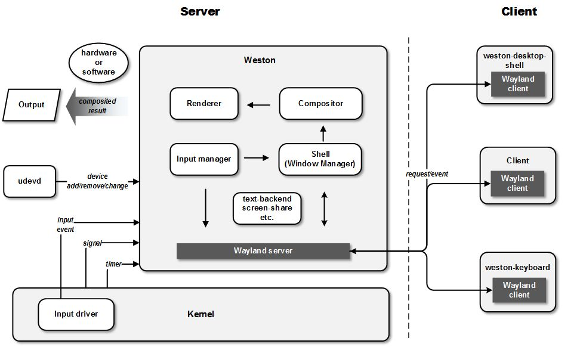
>
> 
>
> [图来源](https://cloud.tencent.com/developer/article/1445734#:~:text=%E6%9C%80%E5%90%8E%E8%BE%93%E5%87%BA(%E6%AF%94%E5%A6%82%E5%88%B0framebuffer)
>
> TODO:   修改图，改变上下关系
>
> TODO:  server侧的shell具体是什么？？？？

理解：

（1）自然：~~wayland-server ---- wayland client 就是协议~~


## 信息流架构---0层

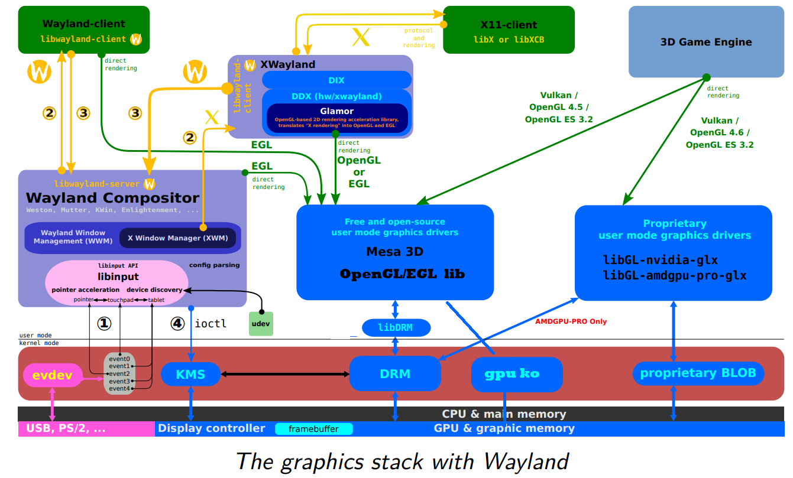

[图来源](https://zhpower.github.io/blog/jekyll/2000-04-27-linux_grpahic_architecture.html)

## when---生命周期图 0层

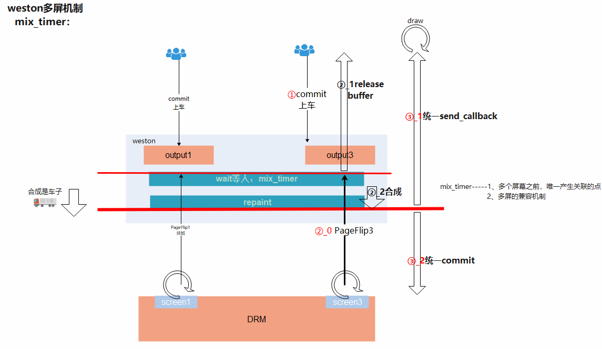

大的生命周期：上图1和2

**目前不合理的地方**：统一repaint & <font color='red'>统一提交commit</font>


```java
├─ wet_main
├─ wl_display_run
└─ wl_event_loop_dispatch // 【大的event_loop模型驱动】
    ├─ on_drm_input(/kms.c)  // 【发车】TODO: 真正drm来的PageFlip消息 -----------上图1-----------------
    │   └─ drmHandleEvent
    │       └─ atomic_flip_handler(/kms.c)
    │           └─ drm_output_update_complete(/drm.c)
    │               └─ weston_output_finish_frame(/compositor.c) // 为 output_repaint_timer_handler 计算time
    └─ wl_timer_heap_dispatch // timer 【即小的repaint_timer循环】-------上图2-----------------
        └─ output_repaint_timer_handler(/compositor.c)  // 【交货】repaint_timer的处理
            ├─ drm_repaint_begin(/drm.c)  // 打印scene_graph日志
            ├─ 遍历output，weston_output_maybe_repaint
            │   └─ output->repainted = true;
            ├─ drm_repaint_flush(/drm.c) // 【车子回程】 提交
            ├─ .
            ├─ output->repainted = false;
            └─ output_repaint_timer_arm(/compositor.c); // 【下一次repaint，构成循环--->output_repaint_timer_handler】
                └─ wl_event_source_timer_update(compositor->repaint_timer, msec_to_next); // 【关键一行】


```


%accordion%hideContent%accordion%

```java
wet_main
wl_display_run
wl_event_loop_dispatch // 【大的event_loop模型驱动】
	on_drm_input(/kms.c)  // 【发车】TODO: 真正drm来的PageFlip消息 -----------上图1-----------------
		drmHandleEvent
			atomic_flip_handler(/kms.c)
				drm_output_update_complete(/drm.c)
					weston_output_finish_frame(/compositor.c) // 为 output_repaint_timer_handler 计算time
	wl_timer_heap_dispatch // timer 【即小的repaint_timer循环】-------上图2-----------------
		output_repaint_timer_handler(/compositor.c)  // 【交货】repaint_timer的处理
			drm_repaint_begin(/drm.c)  // 打印scene_graph日志
			遍历output，weston_output_maybe_repaint
				output->repainted = true;
			drm_repaint_flush(/drm.c) // 【车子回程】 提交
			.
			output->repainted = false;
			output_repaint_timer_arm(/compositor.c); // 【下一次repaint，构成循环--->output_repaint_timer_handler】
				wl_event_source_timer_update(compositor->repaint_timer, msec_to_next); // 【关键一行】
```


%/accordion%

-<font color='red'>注意两个循环：</font>

>   1、大的event_loop
>
>   2、小的repaint_timer循环
>
>   3、**2 依赖于1，是1的一个特例**


TODO: 真正drm来的PageFlip消息 ：

​                 到底是drm怎么发的消息？？？？？？


## 1层横向大图

字典 图：

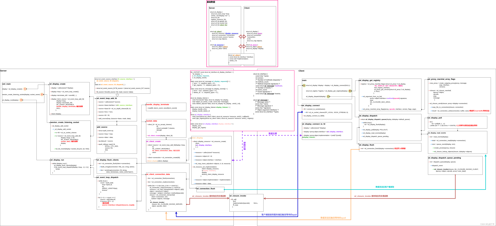

[图来源](https://blog.csdn.net/zzjzmdx/article/details/135067743?ops_request_misc=%257B%2522request%255Fid%2522%253A%2522171749225516800180621626%2522%252C%2522scm%2522%253A%252220140713.130102334.pc%255Fblog.%2522%257D&request_id=171749225516800180621626&biz_id=0&utm_medium=distribute.pc_search_result.none-task-blog-2~blog~first_rank_ecpm_v1~rank_v31_ecpm-1-135067743-null-null.nonecase&utm_term=weston&spm=1018.2226.3001.4450#:~:text=%EF%BC%88-,%E5%9B%BE%E7%9A%84%E6%BA%90%E6%96%87%E4%BB%B6%E5%8F%AF%E8%87%AA%E8%A1%8C%E4%B8%8B%E8%BD%BD,-gitee%20%E5%9C%B0%E5%9D%80%C2%A0zwzfj2)


## 1层纵向大图

### 发车**atomic_flip_handler**   代码大纲  TODO: 

atomic_flip_handler ----- 发车

-<font color='red'>这里释放，走overlay的 buffer</font>，见《buffer流转模型---0层》

### 次要----output_repaint大纲字典

【repaint流程】承载：将client的damage区域提交给compositor，compositor进行合成

-<font color='red'>repaint的唯一目的：</font>就是拿到合成后大图（承载于drm_fb）与 简单图

```java
├─ 生命周期图 0层
├─ weston_output_maybe_repaint(compositor.c)
└─ weston_output_repaint(compositor.c)
    ├─ ------------------为views分配planes--------------------------
    ├─ drm_assign_planes // 【】具体见下
    ├─ ------------------【计算damage】---------------------------------
    └─ drm_output_repaint
        └─ drm_output_render-----------------只做了一件事情，拿到fd（内核的buffer）----------------------
            ├─ if (scanout_state->fb) return // 【】霸屏模式scanout -----> 利用client的fd
            ├─ if：drm_fb_ref  硬件合成  自然，条件：damage为空(也是gl被拦截的地方)？？？？？
            ├─ eif:drm_output_render_pixman  软件合成
            ├─ el：drm_output_render_gl //【】GPU合成    或 x11_output_repaint_gl  backend-x11/x11.c--->  weston合成器的output是X11
            │   ├─ gl_renderer_repaint_output ----> 必然，在这里设置视口viewPort，视口是output级别的
            │   │   ├─ get_surface_state(weston_surface)
            │   │   │   └─ gl_renderer_create_surface
            │   │   │       ├─ ------------------------attach？？？-----------------------------------
            │   │   │       └─ gl_renderer_attach(weston_surface, weston_buffer) // 【】核心
            │   │   ├─ repaint_views  // 【】这里遍历node，必然 从下往上叠图（合成的必然！！！）
            │   │   │   ├─ ------------------【3】OpenGL合成, 前提：分配了primary plane--------------------------
            │   │   │   └─ draw_paint_node  // 【】有些node会走gl，有些走pixman？ node级别的还是合成器级别的 ？ 必然：这里初始化shader的config
            │   │   │       ├─ gl_shader_config_init_for_paint_node // 必然：where---draw_paint_node之子，repaint_region之前
            │   │   │       ├─ repaint_region  //【】
            │   │   │       └─ triangle_fan_debug 测试用的？？？
            │   │   ├─ blit_shadow_to_output // 阴影。开关："color-management"改为true
            │   │   └─ 【eglSwapBuffers】 // 关键一行，weston 与 drm侧交换buffer！！！！（不是与client侧！！！！！！！！）
            │   ├─ bo = gbm_surface_lock_front_buffer  // 拿到gbm buffer---> 承载合成结果
            │   ├─ drm_fb_get_from_bo(bo, BUFFER_GBM_SURFACE)
            │   │   └─ drm_fb_addfb(~bo)
            │   │       └─ drmModeAddFB2WithModifiers/drmModeAddFB2   //libdrm 【】通过gbm buffer创建帧缓冲区（FrameBuffer）
            │   │           └─ 实际上，已经将数据写给drm设备了。图：https://download.csdn.net/blog/column/11175480/133747645
            │   └─ return drm_fb（指向DRM的FrameBuffer），并记录
            ├─ scanout_state->fb = fb  // 合成大图，由 drm_plane_state->drm_fb 承载
            └─ drmModeCreatePropertyBlob // 【2】libdrm接口，创建属性（后续用来设置CRTC（Crtc）、连接器（Connector）、平面（Plane））
```

​             


%accordion%原大纲%accordion%

```java
生命周期图 0层
weston_output_maybe_repaint(compositor.c)
weston_output_repaint(compositor.c) // output级
	------------------为views分配planes--------------------------
	drm_assign_planes // 【】具体见下
	------------------计算damage---------------------------------
	drm_output_repaint
		drm_output_render-----------1、只做了一件事情，拿到fd（内核的buffer）2、涉及render，非硬件合成-------
			if (scanout_state->fb) return // 【】霸屏模式scanout -----> 利用client的fd
			if：drm_fb_ref  硬件合成  自然，条件：damage为空(也是gl被拦截的地方)？？？？？
			eif:drm_output_render_pixman  软件合成
			el：drm_output_render_gl //【】GPU合成	 或 x11_output_repaint_gl  backend-x11/x11.c--->  weston合成器的output是X11
				gl_renderer_repaint_output ----> 必然，在这里设置视口viewPort，视口是output级别的
					use_output(output) // 自然，开始时，初始化EGL的环境，比如 eglMakeCurrent
						eglMakeCurrent
					get_surface_state(weston_surface)
						gl_renderer_create_surface
							------------------------attach？？？-----------------------------------
							gl_renderer_attach(weston_surface, weston_buffer) // 【】核心
					repaint_views  // 【】这里遍历node，必然
						------------------【3】OpenGL合成, 前提：分配了primary plane--------------------------
						【draw_paint_node】展开见下。 有些node会走gl，有些走pixman？ node级别的还是合成器级别的 ？ 必然：这里初始化shader的config
							gl_shader_config_init_for_paint_node // 必然：where---draw_paint_node之子，repaint_region之前
							repaint_region  //【】
							triangle_fan_debug 测试用的？？？
					blit_shadow_to_output // 阴影。开关："color-management"改为true
					【eglSwapBuffers】 // 关键一行，weston 与 drm侧交换buffer！！！！（不是与client侧！！！！！！！！）
				bo = gbm_surface_lock_front_buffer  // 拿到gbm buffer---> 承载合成结果
				drm_fb_get_from_bo(bo, BUFFER_GBM_SURFACE)
					drm_fb_addfb(~bo)
						drmModeAddFB2WithModifiers/drmModeAddFB2   //libdrm 【】通过gbm buffer创建帧缓冲区（FrameBuffer）
																			 实际上，已经将数据写给drm设备了。图：https://download.csdn.net/blog/column/11175480/133747645
				return drm_fb（指向DRM的FrameBuffer），并记录
			scanout_state->fb = fb  // 合成大图，由 drm_plane_state->drm_fb 承载
			drmModeCreatePropertyBlob // 【2】libdrm接口，创建属性（后续用来设置CRTC（Crtc）、连接器（Connector）、平面（Plane））
```

%/accordion%


【eglSwapBuffers】

> ```
> eglSwapBuffers(gr->egl_display, go->egl_surface)
> ```
>
> 1、是个output级别的函数。weston 与 drm侧交换buffer！！！！（<font color='red'>不是与client侧！！！！！！！</font>）
>
> 2、client 也有 eglSwapBuffers 函数
>
> 3、<font color='red'>weston的 耗时很久，大概 1~3ms</font>       -------->  TODO: 不是交换地址吗？


**=================大纲的证明==================**

drm_output_render<font color='red'>唯一目的</font>就是拿到合成后buffer对应的fd

>   （1）自然，OpenGL合成后，拿到fd
>
>   （2） 一个client霸屏了，自然直接用client的fd 。具体见《霸屏scanout》章节

为啥要拿到fd？ 因为这是commit的前提！！！！！


【2】 GPU（CPU）合成结果的承载者-------drm_fb


**其他小点：**

1、直接overlay送的图的流程：

（1）在 gl重绘窗口repaint_views时，过滤掉了

------------> 即啥也没做！！！！

（2）scanout霸屏时，也是gl流程，直接return出去了


-<font color='red'>【flush流程】目的：commit  大图与简单图  给DRM</font>

```java
生命周期图 0层
    └─ drm_repaint_flush(drm.c)
        └─ drm_pending_state_apply(kms.c)
            └─ drm_pending_state_apply_atomic(kms.c)  // 遍历 pending_state->output_list
                ├─ drm_output_apply_state_atomic(drm_output_state, drmModeAtomicReq)  // 【2】必然：自然以plane_list维度，去commit
                │   └─ 遍历 drm_plane_state（repaint后的大图存储的地方）
                │       └─ plane_add_prop(req,plane_state->fb->fb_id); // 【】关键一行，关键出参：req 修改对应的配置参数
                └─ drmModeAtomicCommit(req)  // 【】关键一行：参数统一commit给drm（libdrm接口）
```

%accordion%hideContent%accordion%

```java
output_repaint_timer_handler(compositor.c) // repaint的timer里
	drm_repaint_flush(drm.c)
		drm_pending_state_apply(kms.c)
			drm_pending_state_apply_atomic(kms.c)  // 遍历 pending_state->output_list
				drm_output_apply_state_atomic(drm_output_state, drmModeAtomicReq)  // 【2】必然：自然以plane_list维度，去commit
					遍历 drm_plane_state（repaint后的大图存储的地方）
						plane_add_prop(req,plane_state->fb->fb_id); // 【】关键一行，关键出参：req 修改对应的配置参数
				drmModeAtomicCommit(req)  // 【】关键一行：参数统一commit给drm（libdrm接口）
```

%/accordion%

详解【1】：commit 与 repaint流程，一定不在一个loop触发里：

-<font color='red'>生活化模型：</font>

>   overlay ----------- 年轻人
>
>   GPU ------------- 有能力的老人
>
>   DPU 叠图 ----------考试结束，画挂墙（挂墙展示评分）
>
>   （1）<font color='red'>事件驱动（client的dirty） 触发重绘：</font> ~~多个画家画画，画完送给  张贴人 （合成器），合成器触发重绘~~
>
>   （2）有些画 可能需要相框（圆角特效等），需要**有能力**的老人（GPU）来完成。**有能力，但是干活慢**。
>
>   ​		  老人装完相框，把多个画，贴到一张大纸上**形成大图**，最后交给年轻挂画的人。年轻人（DPU）最后把画挂到墙上
>
>   （3）  有些画，很简单，不需要额外的操作，直接交给年轻小白（DPU）直接挂墙。 无能力（只会粘贴），但是干活快
>
>   （4）<font color='red'>when：</font><font color='red'>大图与简单画</font>（**plane_list**），何时 给到 年轻小白去挂墙？
>
>   ​                       **自然是**本轮考试结束的时候，timeOut的时候   ---------> <font color='red'>即commit是计时器触发</font>

TODO: 一场考试需要多久？


详解【2】：

必然以<font color='red'>plane_list维度去commit</font>：

>   （1）GPU合成的结果，以primary_plane 去提交，提交给DPU
>
>   （2） overlay对应的view，没有合成 ------> 直接以overlay_plane，送给DPU
>
>     (3)  cursor_plane ，也被提交给DPU


------------------------> 注意： 遍历 的plane_list，不代表硬件层级！！


### draw_paint_node   render一个节点  大纲

where:

>   ```java
>   ├─ 生命周期图 0层
>   .....................
>   └─ weston_output_repaint(compositor.c)
>       ├─ ------------------为views分配planes--------------------------
>       ├─ drm_assign_planes // 【】具体见下
>       ├─ ------------------【计算damage】---------------------------------
>       └─ drm_output_repaint
>           └─ drm_output_render
>   			................
>               ├─ eif:drm_output_render_pixman  软件合成
>               ├─ el：drm_output_render_gl
>               │   ├─ gl_renderer_repaint_output
>               │   │   ├─ repaint_views
>               │   │   │   └─ draw_paint_node  // 【】
>   ```

how：

>   使用gl 接口，调用GPU画：
>
>   ​	 -<font color='red'>本质：就是GPU贴图</font>
>
>   ```java
>   └─ draw_paint_node
>       ├─ pixman_region32_intersect(&repaint, damage); // 次要：用damage更新 repaint区域
>       ├─ gl_shader_config_init_for_paint_node // 【】目的：需要参数封装到conf结构体里（用作shader）
>       │   ├─ gl_shader_config_set_input_textures  // 【】关键：把client的texture封装到conf里
>       │   │   └─ for: sconf->input_tex[i] = gb->textures[i] // 一个node，可能有多个Texture
>       │   └─ gl_shader_config_set_color_transform 颜色变换？
>       ├─ pixman_region32_subtract(&surface_blend, &surface_blend, &pnode->surface->opaque); // 扣除 完全不透明区域？
>       └─ repaint_region(gr, pnode, &repaint, &surface_blend, &sconf); // 【】
>           ├─ 【texture_region(pnode, region, surf_region)】 矩形窗口可能被其他窗口遮挡，会被分割成多个小矩形进行绘制
>           ├─ /* position: */
>           ├─ glVertexAttribPointer(0, 2, GL_FLOAT, GL_FALSE, 4 * sizeof *v, &v[0]);
>           ├─ /* texcoord: */
>           ├─ glVertexAttribPointer(1, 2, GL_FLOAT, GL_FALSE, 4 * sizeof *v, &v[2]);
>           ├─ gl_renderer_use_program(gr, sconf) // 【】
>           │   ├─ gl_renderer_get_program(gr, &sconf->req) // 获取glProgram
>           │   │   ├─ 做了缓存，不用每次都编译gl_shader_requirements_cmp(&reqs, &shader->key)
>           │   │   └─ gl_shader_create(gr, &reqs) // 没有的话，创建
>           │   │       ├─ sources[2] = fragment_shader; 具体的fragment.glsl
>           │   │       └─ glGetProgramiv(shader->program); //gl接口生成glProgram
>           │   │           ├─ shader->proj_uniform = glGetUniformLocation(shader->program, "proj");
>           │   │           ├─ shader->tex_uniforms[0] = glGetUniformLocation(shader->program, "tex"); // 【】 拿到.glsl中全局变量的索引，后面CPU给GPU赋值
>           │   │           └─ shader->tex_uniforms[1] = glGetUniformLocation(shader->program, "tex1");
>           │   ├─ glUseProgram(shader->program); // 激活glProgram（激活一个着色器程序，所有后续的绘制调用将使用这个程序中定义的顶点着色器和片段着色器）
>           │   └─ gl_shader_load_config(shader, sconf) //
>           │       ├─ glUniform1f(shader->view_alpha_uniform, sconf->view_alpha); // 【】CPU真正给GPU赋值的地方
>           │       └─ for遍历，绑定纹理： // 贴图：一个client surface，只有一个（已经确认）
>           │           ├─ glActiveTexture(GL_TEXTURE0 + i)  激活当前的纹理单元，使得后续的纹理操作会在这个纹理上进行
>           │           └─ glBindTexture(GL_TEXTURE_2D, sconf->input_tex[i])  //相当create 2d texture_obj对象，并设置了sconf->input_tex[i];
>           └─ 遍历所有矩形nfans， glDrawArrays(GL_TRIANGLE_FAN, first, vtxcnt[i]); //【】真正绘制
>   
>   ```
>


%accordion%hideContent%accordion%

```java
draw_paint_node
	pixman_region32_intersect(&repaint, damage); // 次要：用damage更新 repaint区域
	gl_shader_config_init_for_paint_node // 【】目的：需要参数封装到conf结构体里（用作shader）
		gl_shader_config_set_input_textures  // 【】关键：把client的texture封装到conf里
			for: sconf->input_tex[i] = gb->textures[i] // 一个node，可能有多个Texture
		gl_shader_config_set_color_transform 颜色变换？
	pixman_region32_subtract(&surface_blend, &surface_blend, &pnode->surface->opaque); // 扣除 完全不透明区域？
	repaint_region(gr, pnode, &repaint, &surface_blend, &sconf); // 【】
		【texture_region(pnode, region, surf_region)】 矩形窗口可能被其他窗口遮挡，会被分割成多个小矩形进行绘制
		/* position: */
		glVertexAttribPointer(0, 2, GL_FLOAT, GL_FALSE, 4 * sizeof *v, &v[0]);
		/* texcoord: */
		glVertexAttribPointer(1, 2, GL_FLOAT, GL_FALSE, 4 * sizeof *v, &v[2]);
		gl_renderer_use_program(gr, sconf) // 【】
			gl_renderer_get_program(gr, &sconf->req) // 获取glProgram
				做了缓存，不用每次都编译gl_shader_requirements_cmp(&reqs, &shader->key)
				gl_shader_create(gr, &reqs) // 没有的话，创建
					sources[2] = fragment_shader; 具体的fragment.glsl
					glGetProgramiv(shader->program); //gl接口生成glProgram
						shader->proj_uniform = glGetUniformLocation(shader->program, "proj"); 
						shader->tex_uniforms[0] = glGetUniformLocation(shader->program, "tex"); // 【】 拿到.glsl中全局变量的索引，后面CPU给GPU赋值
						shader->tex_uniforms[1] = glGetUniformLocation(shader->program, "tex1");
			glUseProgram(shader->program); // 激活glProgram（激活一个着色器程序，所有后续的绘制调用将使用这个程序中定义的顶点着色器和片段着色器）
			gl_shader_load_config(shader, sconf) // 
				glUniform1f(shader->view_alpha_uniform, sconf->view_alpha); // 【】CPU真正给GPU赋值的地方
				for遍历，绑定纹理： // 贴图：一个client surface，只有一个（已经确认）
					glActiveTexture(GL_TEXTURE0 + i)  激活当前的纹理单元，使得后续的纹理操作会在这个纹理上进行
					glBindTexture(GL_TEXTURE_2D, sconf->input_tex[i])  //相当create 2d texture_obj对象，并设置了sconf->input_tex[i];
		遍历所有矩形nfans， glDrawArrays(GL_TRIANGLE_FAN, first, vtxcnt[i]); //【】真正绘制
```

%/accordion%


关于weston 如何使用OpenGL<font color='red'>贴图，很好的参考：</font>

>   weston现有的  shadow的画法  
>
>   高斯模糊的做法


### render 的贴图变换-------即矩阵变换


#### 变换公式

参考：vertex.glsl

```java
gl_Position = proj * vec4(position, 0.0, 1.0);
最终变换结果gl_Position = 变换矩阵proj * 位置坐标postion
```

结论：

> ------------> 所以，<font color='red'>变换 可以承载于变换矩阵里</font>，参考：simple-egl.c
>
> 							<font color='red'>也可以承载于 位置坐标position</font>，参考view的变换


TODO:

```java
矩阵各个参数的含义：
view->transform.position.matrix.type = WESTON_MATRIX_TRANSFORM_TRANSLATE;
平移：
view->transform.position.matrix.d[12] = view->geometry.pos_offset.x;
view->transform.position.matrix.d[13] = view->geometry.pos_offset.y;
旋转：
rotation.d[0] =   cos(angle);
rotation.d[2] =   sin(angle);
rotation.d[8] =  -sin(angle);
rotation.d[10] =  cos(angle);
```


#### view变换，比如放缩--------顶点矩阵position：

**参考：animation.c的放缩**

```java
weston_matrix_init(&animation->transform.matrix);
wl_list_insert(&view->geometry.transformation_list,
		   &animation->transform.link);
```


view层面承载的量：

```java
view->geometry.transformation_list
```


更新，计算总的 变换：

```java
// compositor.c
weston_view_update_transform()
weston_view_update_transform_enable()
    struct weston_matrix *matrix = &view->transform.matrix; //【】------->  最终承载，会被覆盖掉！！！！！！重新生成
    weston_matrix_init(matrix);
    wl_list_for_each(tform, &view->geometry.transformation_list, link)
        weston_matrix_multiply(matrix, &tform->matrix);
```


&view->transform.matrix;最终生效的地方：

> <font color='red'>glsl 中的 position，而不是 变换矩阵proj！！</font>
>
> gl_Position = proj * vec4(position, 0.0, 1.0);

代码大纲：

```java
repaint_region
	texture_region
		GLfloat *v, = wl_array_add(&gr->vertices, nrects * nsurf * 8 * 4 * sizeof *v); // 【】 变换矩阵承载于 gl_renderer->vertices; 顶点矩阵！！！！！！！！
		calculate_edges(ev, rect, surf_rect, e);
			for遍历surface
			surf.pos[i] = weston_coord_surface_to_global(ev, tmp[i]).c; // 【】 承载于surf.pos[i]
				weston_matrix_transform_coord(&view->transform.matrix, // 利用到了view的矩阵，这里加的变换！
	/* position: */
	glVertexAttribPointer(0, 2, GL_FLOAT, GL_FALSE, 4 * sizeof *v, &v[0]); // 【】 顶点矩阵，最终赋值glVertexAttribPointer ----> glsl中的：attribute vec2 position; 不是变换矩阵proj！！！！！！
```


#### 贴图变换 之 2d变3D立体的实现-------变换矩阵projection：

**参考simple-egl**

```java
cpu的承载量-----变换矩阵rotation：
		struct weston_matrix rotation;
		weston_matrix_scale(&rotation, -1, 1, 1);
		glUniformMatrix4fv(window->gl.rotation_uniform, 1, GL_FALSE,
		   (GLfloat *) rotation.d);
GPU承载量：最终结果gl_position  = rotation * pos       // 【】 rotation即 变换矩阵projection
						          变换矩阵  * 顶点坐标
```


```java
// gl-shaders.c 中变换矩阵 projection
glUniformMatrix4fv(shader->proj_uniform,
		   1, GL_FALSE, sconf->projection.d);
```


### 次要---给view分配plane（drm_assign_planes）大纲


where：

>   ```java
>   ├─ 生命周期图 0层
>   ├─ weston_output_maybe_repaint(compositor.c)
>   └─ weston_output_repaint(compositor.c)
>       ├─ ------------------为views分配planes--------------------------
>       ├─ drm_assign_planes // 【】具体见下
>       ├─ ------------------【计算damage】---------------------------------
>       └─ drm_output_repaint
>   ```


how:

>   ```java
>   repaint大纲字典
>   └─ drm_assign_planes ----------output级
>       ├─ try: mode = DRM_OUTPUT_PROPOSE_STATE_PLANES_ONLY  //1、尝试只用 overlay
>       ├─ try: mode = DRM_OUTPUT_PROPOSE_STATE_MIXED;        // 2、只用overlay不成功，尝试 overlay + GPU
>       ├─ try: mode = DRM_OUTPUT_PROPOSE_STATE_RENDERER_ONLY;  // 上面两点都不成功, 自然，只用GPU
>       └─ drm_output_propose_state(mode)-------output级--------------
>           └─ wl_list_for_each(pnode)------遍历pnode节点-----view级----------
>               ├─ ①忽略不合成的view(continue)：
>               │   ├─ 1、不属于此output的  if (!(ev->output_mask & (1u << output->base.id)))
>               │   ├─ 2、必须需要颜色变换 TODO:没懂  if (!pnode->surf_xform_valid)
>               │   ├─ 3、完全被遮挡的 if (totally_occluded)
>               │   └─ 4、
>               ├─ ②强制走GPU render的(force_renderer = true)：
>               │   ├─ 1、view存在于多个output上，if (ev->output_mask != (1u << output->base.id))
>               │   ├─ 2、view 对应的GBM not available（drm侧）， if (!b->gbm)
>               │   ├─ 3、view没有有效的buffer，if (!weston_view_has_valid_buffer(ev))
>               │   ├─ 4、view对应buffer类型是 WESTON_BUFFER_SOLID
>               │   ├─ 5、需要做color变换的，(requires color transform)
>               │   ├─ 6、view被GPU render view遮挡的， if (pixman_region32_not_empty(&surface_overlap))  ----> TODO:本质原因是啥！！！！！！
>               │   │   └─ 换言之，gpu view 以下（遮挡），必须是GPU！
>               │   └─ 7、view在保护content-protection的强制mode下
>               └─ ③--------对于非强制GPU的尝试分配plane：drm_output_find_plane_for_view -----------
>                   ├─ 1、检查buffer是否有效。无效则 FAILURE_REASONS_FB_FORMAT_INCOMPATIBLE
>                   ├─ 2、buffer类型是WESTON_BUFFER_SOLID ，分配plane失败， FAILURE_REASONS_FB_FORMAT_INCOMPATIBLE
>                   ├─ 3、buffer类型是WESTON_BUFFER_SHM，只允许是cursor_plane：
>                   │   ├─ pixel_format格式是DRM_FORMAT_ARGB8888，失败，FAILURE_REASONS_FB_FORMAT_INCOMPATIBLE
>                   │   ├─ buffer的尺寸大于鼠标，失败
>                   │   └─ 赋值：possible_plane_mask = (1 << output->cursor_plane->plane_idx);
>                   ├─ 4、自然，尝试的mode = DRM_OUTPUT_PROPOSE_STATE_RENDERER_ONLY，失败
>                   ├─ 5、wl_list_for_each(plane, &device->plane_list)遍历 硬件所有plane
>                   │   └─ 跳过CURSOR类型的plane
>                   │       └─ 赋值：possible_plane_mask |= 1 << plane->plane_idx;
>                   ├─ 6、没有对应的drm_fb（Framebuffer），失败
>                   ├─ 7、有对应的drm_fb，赋值：possible_plane_mask &= fb->plane_mask
>                   ├─ ③_1--------真正的分配（对于③中可能分配的possible_plane）-----------------------
>                   └─ wl_list_for_each(plane, &device->plane_list)遍历plane_list：
>                       ├─ plane可得性检查：【drm_plane_is_available】
>                       │   ├─ output如果是virtual的，不能分配plane！！
>                       │   ├─ The plane still 存在 a request
>                       │   ├─ The plane is still active on another output
>                       │   └─ 检查 plane can be used with this CRTC // 【】屏幕和plane的绑定关系！！！！
>                       ├─ 检查 view对应的buffer有效性：assert(fb)
>                       ├─ alpha已经安排过view，跳过： drm_output_check_plane_has_view_assigned()
>                       ├─ alpha 检查：如果view有alpha值，但是该plane不支持alpha，跳过
>                       └─ 最终绑定plane与view：drm_output_prepare_cursor_paint_node/drm_output_try_paint_node_on_plane
>                           └─ plane_state->ev = view  // TODO: 最终应该是，plane分配给view
>   ```
>


-<font color='red'>结论的物理级证明：</font>

1、<font color='red'>物理上，必然：连续性结论</font>：~~**GPU合成的views必须连续**~~（~~因为只有一个GPU~~）

推论：所以，~~**代码策略：某view是GPU合成，以下（需要被遮挡）都必须是force-render**~~

2、TODO：  上面所有策略的物理级的证明


%accordion%hideContent%accordion%

```java
drm_assign_planes ----------output级
	try: mode = DRM_OUTPUT_PROPOSE_STATE_PLANES_ONLY  //1、尝试只用 overlay
	try: mode = DRM_OUTPUT_PROPOSE_STATE_MIXED;	  // 2、只用overlay不成功，尝试 overlay + GPU
	try: mode = DRM_OUTPUT_PROPOSE_STATE_RENDERER_ONLY;  // 上面两点都不成功, 自然，只用GPU
	drm_output_propose_state(mode)-------output级--------------
		wl_list_for_each(pnode)------遍历pnode节点-----view级----------
			①忽略不合成的view(continue)：
				1、不属于此output的  if (!(ev->output_mask & (1u << output->base.id))) 
				2、必须需要颜色变换 TODO:没懂  if (!pnode->surf_xform_valid)
				3、完全被遮挡的 if (totally_occluded)
				4、
			②强制走GPU render的(force_renderer = true)：
				1、view存在于多个output上，if (ev->output_mask != (1u << output->base.id))
				2、view 对应的GBM not available（drm侧）， if (!b->gbm)
				3、view没有有效的buffer，if (!weston_view_has_valid_buffer(ev))
				4、view对应buffer类型是 WESTON_BUFFER_SOLID
				5、需要做color变换的，(requires color transform)
				6、view被GPU render view遮挡的， if (pixman_region32_not_empty(&surface_overlap))  ----> TODO:本质原因是啥！！！！！！
					换言之，gpu view 以下（遮挡），必须是GPU！
				7、view在保护content-protection的强制mode下
			③--------对于非强制GPU的尝试分配plane：drm_output_find_plane_for_view -----------
				1、检查buffer是否有效。无效则 FAILURE_REASONS_FB_FORMAT_INCOMPATIBLE
				2、buffer类型是WESTON_BUFFER_SOLID ，分配plane失败， FAILURE_REASONS_FB_FORMAT_INCOMPATIBLE
				3、buffer类型是WESTON_BUFFER_SHM，只允许是cursor_plane：
					pixel_format格式是DRM_FORMAT_ARGB8888，失败，FAILURE_REASONS_FB_FORMAT_INCOMPATIBLE
					buffer的尺寸大于鼠标，失败
					赋值：possible_plane_mask = (1 << output->cursor_plane->plane_idx);
				4、自然，尝试的mode = DRM_OUTPUT_PROPOSE_STATE_RENDERER_ONLY，失败
				5、wl_list_for_each(plane, &device->plane_list)遍历 硬件所有plane
						跳过CURSOR类型的plane
						赋值：possible_plane_mask |= 1 << plane->plane_idx;
				6、没有对应的drm_fb（Framebuffer），失败
				7、有对应的drm_fb，赋值：possible_plane_mask &= fb->plane_mask
				③_1--------真正的分配（对于③中可能分配的possible_plane）-----------------------
				wl_list_for_each(plane, &device->plane_list)遍历plane_list：
					plane可得性检查：drm_plane_is_available：
						output如果是virtual的，不能分配plane！！
						The plane still 存在 a request
						The plane is still active on another output
						检查 plane can be used with this CRTC
					检查 view对应的buffer有效性：assert(fb)
					alpha已经安排过view，跳过： drm_output_check_plane_has_view_assigned()
					alpha 检查：如果view有alpha值，但是该plane不支持alpha，跳过
					最终绑定plane与view：drm_output_prepare_cursor_paint_node/drm_output_try_paint_node_on_plane
						plane_state->ev = view  // TODO: 最终应该是，plane分配给view

```

%/accordion%


最终一行： 承载在哪个变量里？？？？

```java
view->plane = primary_plane; //  把plane分配给view

weston_compositor里的primary_plane;  // 【】指明了GPU的plane
```


维测：


#### ~~如何避免将屏幕1的plane分配给屏幕2的view呢？~~

plane-output 绑定关系配置在哪里？

>   必然是在驱动！！！因为plane的数据送给哪个屏幕，是drm决定的
>

-<font color='red'>weston侧只是获取 绑定关系。</font>具体代码：

```java
drm_plane_is_available(plane, output)
{
	.................
      if (plane->state_cur->output && plane->state_cur->output != output) // 第二次、第三次分配：维持第一次  plane与outPut的绑定关系
		return false;
    
	/* Check whether the plane can be used with this CRTC; possible_crtcs
	 * is a bitmask of CRTC indices (pipe), rather than CRTC object ID. */
	return !!(plane->possible_crtcs & (1 << output->crtc->pipe));  // 第一次分配
}
```

结论：

>   1、outPut与crtc 一 一对应。。。。TODO: 验证
>
>   2、**plane->possible_crtcs，即对应的plane-crtc绑定关系**。。TODO: outPut 与 crtc绑定关系在哪里？？？？
>
>   TODO:  难道一个plane，可以绑定多个关系？


plane->possible_crtcs来源：

```java
weston_backend_init
	drm_backend_create
		open_additional_devices
			drm_device_create
				create_sprites
					drm_plane_create //【】 通过drmModePlane，拿到plane对应的 possible_crtcs、plane->plane_id
```


#### ~~次要 ------ compositor从drm获取plane信息~~

硬件：

plane的来源：

> 不是跟着屏幕走的。而是硬件资源的限制（具体：CRTC、encode？？？？？？）


图来源


代码大纲：

```java
weston_backend_init(drm.c)
	drm_backend_create(drm.c)
		drm_device_create(drm.c)
			create_sprites(drm.c) sprites即overlay planes
```


关键一行： 

```java
kplane_res = drmModeGetPlaneResources(device->drm.fd); // 得到plane资源集
for (i = 0; i < kplane_res->count_planes; i++) {
    kplane = drmModeGetPlane(device->drm.fd, kplane_res->planes[i]); //  根据Plane ID得到Plane
```


在weston侧，**最终维护在plane_list中**


TODO: 物理级的理解：

> plane个数的限制，最终是来源哪里？硬件？具体哪个硬件
>
> ​							  最终配置在哪里？


日志：

```java
[17:26:13.604] drm_plane_create: plane->plane_id: 49  // 从drm获取的id  【1】乱七八糟？？ 【2】这个值，重启后变化
[17:26:13.605] drm_plane_create: plane->plane_id: 70 
[17:26:13.605] drm_plane_create: plane->plane_id: 74 
[17:26:13.606] drm_plane_create: plane->plane_id: 110 
[17:26:13.606] drm_plane_create: plane->plane_id: 114 
[17:26:13.606] drm_plane_create: plane->plane_id: 126 
[17:26:13.607] drm_plane_create: plane->plane_id: 132 
[17:26:13.607] drm_plane_create: plane->plane_id: 138 
[17:26:13.608] drm_plane_create: plane->plane_id: 144 
[17:26:13.609] drm_plane_create: plane->plane_id: 150 
[17:26:13.609] create_sprites: drm_plane->plane_idx: 0   // weston，重新赋予的id值
[17:26:13.609] create_sprites: drm_plane->plane_idx: 1 
[17:26:13.609] create_sprites: drm_plane->plane_idx: 2 
[17:26:13.609] create_sprites: drm_plane->plane_idx: 3 
[17:26:13.609] create_sprites: drm_plane->plane_idx: 4 
[17:26:13.609] create_sprites: drm_plane->plane_idx: 5 
[17:26:13.609] create_sprites: drm_plane->plane_idx: 6 
[17:26:13.609] create_sprites: drm_plane->plane_idx: 7 
[17:26:13.609] create_sprites: drm_plane->plane_idx: 8 
[17:26:13.609] create_sprites: drm_plane->plane_idx: 9 
```


### 主要----plane分配原则总结（物理级别）

默认的view都是分给primary  ------>  啥是默认的view？？？

video 占据sprite plane


大致：

> 1、overlay条件非常苛刻
>
> 2、GPU是用来兜底的。万能的
>
> primary 层，物理上一定在下面


#### 总结所有走GPU的（剩下走overlay）

从GPU角度：

> <font color='red'>GPU是DRM的兜底者</font>（~~比如，DRM不认识SHM~~）


代码中：

> ②强制走gpu的
>
> ③尝试分配plane失败的

物理角度，只能GPU：

> WESTON_BUFFER_SHM  --------->  <font color='red'>cpu分配的内存，drm不认识</font>。只能走GPU兜底转一道（~~cursor可以plane~~）
>
> WESTON_BUFFER_SOLID  


#### WESTON_BUFFER_SHM  强制GPU

代码证明：

```java
 else if (buffer->type == WESTON_BUFFER_SHM) {
		if (!output->cursor_plane || device->cursors_are_broken) {
			pnode->try_view_on_plane_failure_reasons |=
				FAILURE_REASONS_FB_FORMAT_INCOMPATIBLE;

			// add by kent start
			drm_debug(b, "\t\t\t\t ==kent==, drm_output_find_plane_for_view weston_view %p buffer->type == WESTON_BUFFER_SHM \n", ev);
			return NULL;
		}
```


例外：允许cursor的SHM 直接送drm

```java
drm_debug(b, "\t\t\t\t[view] not placing view %p on "
		             "plane; SHM buffers must be ARGB8888 for "
			     "cursor view\n", ev);   
```


#### 从日志看assign_plane


output 0尝试混合模式：

```java
	[repaint] could not build planes-only state, trying mixed
		[state] using renderer FB ID 164 for mixed mode for output DSI-1 (0)
		[state] scanout will use for zpos 0
			[view] evaluating view 0x55a6da1d40 for output DSI-1 (0)
			[plane] started with zpos 18446744073709551615
				[view] view 0x55a6da1d40 will be placed on the renderer
			[view] evaluating view 0x55a6d9d1f0 for output DSI-1 (0)
				[view] not assigning view 0x55a6d9d1f0 to plane (occluded by renderer views)
				[view] view 0x55a6d9d1f0 will be placed on the renderer
			[view] evaluating view 0x55a6da2210 for output DSI-1 (0)
				[view] ignoring view 0x55a6da2210 (occluded on our output)
			[view] evaluating view 0x55a6d8e060 for output DSI-1 (0)
				[view] ignoring view 0x55a6d8e060 (occluded on our output)
			[view] evaluating view 0x55a6d8eaf0 for output DSI-1 (0)
				[view] ignoring view 0x55a6d8eaf0 (occluded on our output)
			[view] evaluating view 0x55a6d8ccd0 for output DSI-1 (0)
				[view] ignoring view 0x55a6d8ccd0 (occluded on our output)
			[view] evaluating view 0x55a6d8efc0 for output DSI-1 (0)
				[view] ignoring view 0x55a6d8efc0 (occluded on our output)
			[view] evaluating view 0x55a6d72740 for output DSI-1 (0)
				[view] ignoring view 0x55a6d72740 (occluded on our output)
			[view] evaluating view 0x55a6e73a60 for output DSI-1 (0)
				[view] not assigning view 0x55a6e73a60 to plane (occluded by renderer views)
				[view] not assigning view 0x55a6e73a60 to plane (layer is or under BOS_SURFACE_LAYER_POSITION_BELOW)
				[view] view 0x55a6e73a60 will be placed on the renderer
			[view] evaluating view 0x55a6da0370 for output DSI-1 (0)
				[view] not assigning view 0x55a6da0370 to plane (occluded by renderer views)
				[view] view 0x55a6da0370 will be placed on the renderer
			[view] evaluating view 0x55a6d9f750 for output DSI-1 (0)
				[view] ignoring view 0x55a6d9f750 (not on our output)
			[view] evaluating view 0x55a6d9eb30 for output DSI-1 (0)
				[view] ignoring view 0x55a6d9eb30 (not on our output)
			[view] evaluating view 0x55a6d9df10 for output DSI-1 (0)
				[view] ignoring view 0x55a6d9df10 (not on our output)
```

测试output 0状态：

```java
		[atomic] testing output 0 (DSI-1) state
			[CRTC:78] 23 (MODE_ID) -> 163 (0xa3)
			[CRTC:78] 22 (ACTIVE) -> 1 (0x1)
			[CRTC:78] 24 (VRR_ENABLED) -> 0 (0x0)
			[CONN:34] 20 (CRTC_ID) -> 78 (0x4e)
			[PLANE:49] 17 (FB_ID) -> 164 (0xa4)
			[PLANE:49] 20 (CRTC_ID) -> 78 (0x4e)
			[PLANE:49] 9 (SRC_X) -> 0 (0x0)
			[PLANE:49] 10 (SRC_Y) -> 0 (0x0)
			[PLANE:49] 11 (SRC_W) -> 113246208 (0x6c00000)
			[PLANE:49] 12 (SRC_H) -> 123731968 (0x7600000)
			[PLANE:49] 13 (CRTC_X) -> 0 (0x0)
			[PLANE:49] 14 (CRTC_Y) -> 0 (0x0)
			[PLANE:49] 15 (CRTC_W) -> 1728 (0x6c0)
			[PLANE:49] 16 (CRTC_H) -> 1888 (0x760)
			[PLANE:49] FORMAT: XRGB8888
			[PLANE:49] 51 (alpha) -> 65535 (0xffff)
```

最终提交：------> **所有outPut**

```java
[atomic] drmModeAtomicCommit
	[repaint] Using mixed state composition          ------> // TODO: 哪一个plane？？
	[repaint] view 0x55a6da1d40 using renderer composition
	[repaint] view 0x55a6d9d1f0 using renderer composition
	[repaint] view 0x55a6da2210 using renderer composition
	[repaint] view 0x55a6d8e060 using renderer composition
	[repaint] view 0x55a6d8eaf0 using renderer composition
	[repaint] view 0x55a6d8ccd0 using renderer composition
	[repaint] view 0x55a6d8efc0 using renderer composition
	[repaint] view 0x55a6d72740 using renderer composition
	[repaint] view 0x55a6e73a60 using renderer composition
	[repaint] view 0x55a6da0370 using renderer composition
		[atomic] applying output 0 (DSI-1) state  // 【】 ----> 真正提交
			[CRTC:78] 23 (MODE_ID) -> 163 (0xa3)
			[CRTC:78] 22 (ACTIVE) -> 1 (0x1)
			[CRTC:78] 24 (VRR_ENABLED) -> 0 (0x0)
			[CONN:34] 20 (CRTC_ID) -> 78 (0x4e)
			[PLANE:49] 17 (FB_ID) -> 38 (0x26)
			[PLANE:49] 20 (CRTC_ID) -> 78 (0x4e)
			[PLANE:49] 9 (SRC_X) -> 0 (0x0)
			[PLANE:49] 10 (SRC_Y) -> 0 (0x0)
			[PLANE:49] 11 (SRC_W) -> 113246208 (0x6c00000)
			[PLANE:49] 12 (SRC_H) -> 123731968 (0x7600000)
			[PLANE:49] 13 (CRTC_X) -> 0 (0x0)
			[PLANE:49] 14 (CRTC_Y) -> 0 (0x0)
			[PLANE:49] 15 (CRTC_W) -> 1728 (0x6c0)
			[PLANE:49] 16 (CRTC_H) -> 1888 (0x760)
			[PLANE:49] FORMAT: XRGB8888
			[PLANE:49] 51 (alpha) -> 65535 (0xffff)
[atomic] drmModeAtomicCommit
	[CRTC:78] setting pending flip
[repaint] flushed pending_state 0x55a6e45060
[atomic][CRTC:78] flip processing started
[atomic][CRTC:78] flip processing completed
```


### 从物理\硬件角度看Plane

0、对于最终的显示（应用角度） ，<font color='red'>显示Zorder</font> = 窗口管理的Zorder =  <font color='red'>软件配置 + 硬件调整 </font>

1、 GPU能叠一些奇怪的图（（1）、大于屏幕的图、（2）圆角 （3）subsurface）（~~这些overlay做不到~~）

2、对于软件：**上面的view优先尝试分配overlay的**

​      目的： 减少GPU的负载

推论：

>   2_1、：抛开项目， **weston原生逻辑，primary一定要在overlay之下的**（**上面的view先分配的overlay**，如果overlay在下面，那么上面的view显示到primary下面了---------->上面的view被遮挡）
>
>   2_2 、必然：某一层用了GPU，以下都必须是GPU（TODO: <font color='red'>必然性在哪里？</font>因为background一定走GPU，所有GPU最终只能合成一层？？？？？）


一些结论：

**自然情况下，设计理念：**

> 先管重要的（上面的最重要）-------------------------**遍历views选择从上往下遍历**
>
> **年轻人在前，老人兜底** -------------------------为充分利用效率，自然先尽量分配给overlay
>
> ​            老人兜底 --------- primary在下

**B的方式，不自然、反常**：

> 不自然的点： primary弄上面了（因为A的割裂导致weston上面与下面的plane永久隔离）
>
> -------------> 后果，下面的overlay只能用作被遮挡场景
>
> ​                              老人放前面--------------1、效率变低
>
> ​							                                     2、（大致）意味着下面的overlay 无用了（这也是强制某个应用走的原因）


### 补充特例--------霸屏scanout

效果：

>   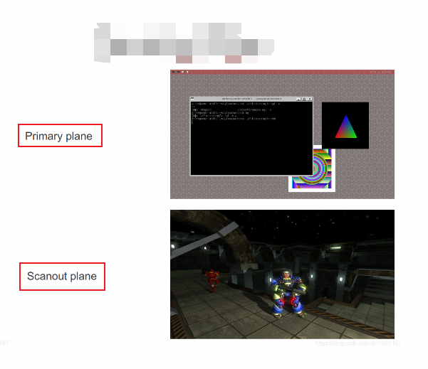
>
>   [图来源](https://blog.csdn.net/u012839187/article/details/112415876#:~:text=an%20appropriate%20buffer)


结论：

>   1、霸屏和GPU合成一样，**都是用的那块 primary plane**    
>
>   -----------> 自然的，  （1）<font color='red'>目的一样：GPU合成目的也是拿到FullScreen的df </font>  （2）因为primary是每个屏必须的
>
>   代码实现角度：
>
>   >   ~~scanout_plane一定是 primary—plane  类型~~  自然
>   >
>   >   scanout_state-><font color='red'>fb 的指向不同</font>：霸屏下，是指向Client的fd；GPU合成是指向frameBuffer 
>
>   2、霸屏的判断：自然是FullScreen
>
>   4、<font color='red'>霸屏的唯一目</font>的就是 阻止 合成。[见](https://blog.csdn.net/u012839187/article/details/112415876#:~:text=%22Disables%22%20composition%20for%20fullscreen%20clients)
>
>   5、优点：一个client霸屏了，**自然直接用client的fd**
>
>   6、TODO:  霸屏 与 走overlay的 图，有本质区别嘛？
>
>   7、~~composition只会在primary  plane上发生~~。自然
>
>   8、物理角度决定了  full-screen  和 overlay，没有GPU的合成


### 信息角度之    像素之旅

参考：[像素之旅](https://blog.csdn.net/u012839187/article/details/112415876#:~:text=%E5%8D%A0%E6%8D%AEsprite%20plane%EF%BC%9B-,%E5%83%8F%E7%B4%A0%E4%B9%8B%E6%97%85,-%E4%BD%9C%E4%B8%BA%E8%AF%B4%E6%98%8E%EF%BC%8C%E8%AF%B7)


整个图形，就是像素的生命周期：

>   client像素:  产生--->流转给合成器 --->流转plane --->crtc ---->encoder ---->connector ----> 屏幕

像素的承载：buffer

>   1、GPU buffer -----> client  OpenGL画的 & GPU 合成时： 这个时候是共享buffer？[共享纹理](https://blog.csdn.net/u012839187/article/details/112415876#:~:text=%E7%9A%84%E5%85%B6%E4%BB%96%E6%96%B9%E6%B3%95%EF%BC%89-,%E5%9C%A8%E5%AE%A2%E6%88%B7%E7%AB%AF%E5%92%8C%E5%90%88%E6%88%90%E5%99%A8%E4%B9%8B%E9%97%B4%E5%85%B1%E4%BA%AB%E7%BA%B9%E7%90%86,-%E3%80%82%E5%9C%A8%E6%9C%AC%E4%BE%8B)？
>
>   2、CPU buffer -----> CPU绘制 & CPU合成
>
>   3、交叉---GPU buffer & CPU buffer：存在内存Copy: GPU buffer copy给CPU buffer ！！！！！！！
>
>   ​			例子：client  OpenGL画的， 软件合成器
>   ​			TODO: 待验证

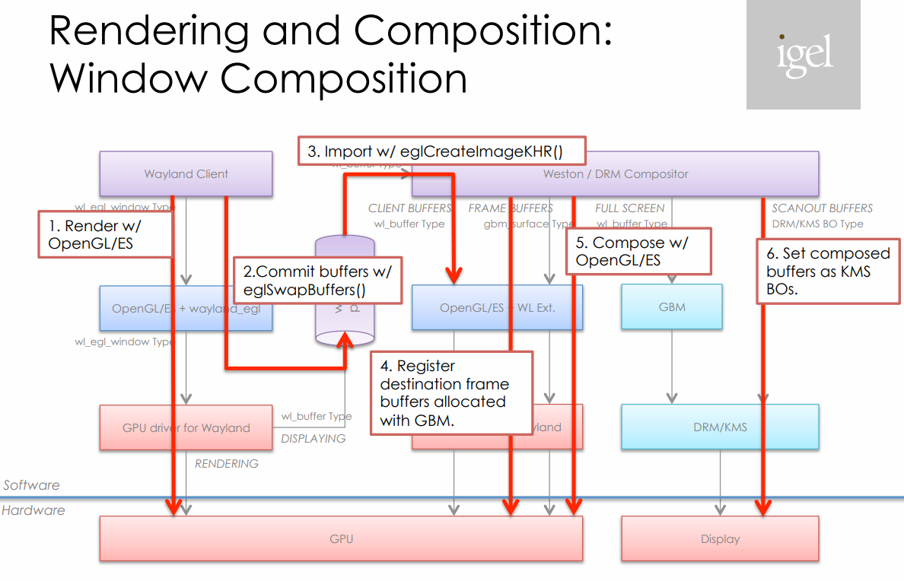

[来源](https://kenttj.github.io/markdownbook/0_%E5%9B%BE%E5%BD%A2%E7%B3%BB%E7%BB%9F/3_Display%E7%B3%BB%E7%BB%9F/als2015_wayland_weston_v2.pdf)

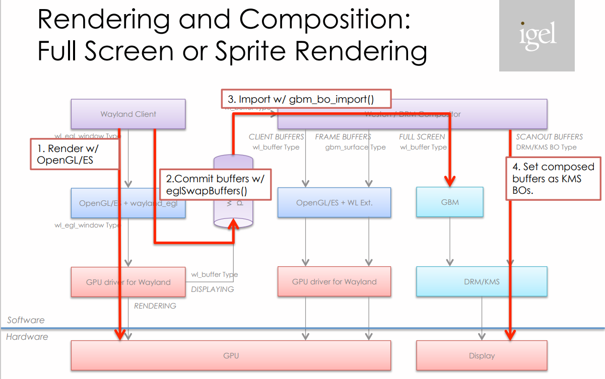

结论：

-<font color='red'>从本质上讲：</font>

>    1、<font color='red'>Full-screen 与  overlay，没有任何区别</font> ------------->  自然，处理流程没有区别
>
>    ​      唯一区别：df 是不是全屏的？
>
>    2、<font color='red'>Full-screen 与  primary plane  没有任何区别</font> 
>
>    ​        唯一区别：后者有个 合成过程，**见上图的 4和5**

TODO:  上图中的GBM是啥？


## lib依赖结构(功能导致的)

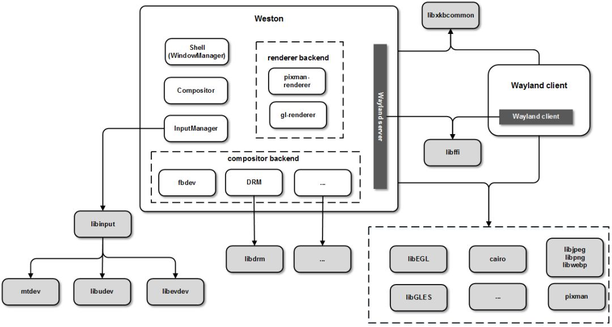

[图来源](https://cloud.tencent.com/developer/article/1445734#:~:text=Wayland/Weston-,%E8%BF%90%E8%A1%8C%E6%97%B6%E4%BE%9D%E8%B5%96,-%E7%9A%84%E5%BA%93%E4%B8%BB%E8%A6%81)


```java
└─ weston
    ├─ libexec_weston.so.0
    │   ├─ libweston-11.so.0
    │   │   ├─ libwayland-server.so.0
    │   │   │   └─ libffi.so.8--用于在运行时根据调用接口描述生成函数跳板并调用。
    │   │   ├─ libpixman-1.so.0--//【】 用于像素操作的库，包括region, box等计算。用了许多平台相关的优化。
    │   │   │   └─ librga.so.2
    │   │   ├─ libdrm.so.2--DRM compositor backend相关库文件。
    │   │   ├─ libxkbcommon.so.0--主要用于键盘处理。
    │   │   ├─ libmali_hook.so.1--GPU相关库文件。
    │   │   │   ├─ libmali.so.1
    │   │   │   │   ├─ libdl.so.2
    │   │   │   │   ├─ libpthread.so.0
    │   │   │   │   ├─ libdrm.so.2
    │   │   │   │   ├─ libwayland-client.so.0
    │   │   │   │   │   └─ libffi.so.8
    │   │   │   │   ├─ libwayland-server.so.0
    │   │   │   │   ├─ libstdc++.so.6
    │   │   │   │   └─ libgcc_s.so.1
    │   │   │   └─ libdrm.so.2
    │   │   └─ libmali.so.1
    │   ├─ libwayland-client.so.0
    │   ├─ libwayland-server.so.0
    │   ├─ libinput.so.10--InputManager相关，负责各种Input事件处理。输入处理，依赖于mtdev, libudev, libevdev等库。
    │   │   ├─ libmtdev.so.1
    │   │   ├─ libudev.so.1
    │   │   └─ libevdev.so.2
    │   ├─ libevdev.so.2
    │   └─ ld-linux-aarch64.so.1
    └─ libc.so.6
```

------------> [来源](https://www.cnblogs.com/arnoldlu/p/18091352#:~:text=%E5%A6%82%E4%B8%8B%E5%BA%93%E6%96%87%E4%BB%B6%EF%BC%9A-,weston%E4%BE%9D%E8%B5%96%E7%9A%84%E5%BA%93%E6%96%87%E4%BB%B6%E6%9C%89%EF%BC%9A,-weston%0A%E3%80%80%E3%80%80libexec_weston.so)


%accordion%hideContent%accordion%


```java
weston
　　libexec_weston.so.0
        libweston-11.so.0
            libwayland-server.so.0
                libffi.so.8--用于在运行时根据调用接口描述生成函数跳板并调用。
            libpixman-1.so.0--//【】 用于像素操作的库，包括region, box等计算。用了许多平台相关的优化。
                librga.so.2
            libdrm.so.2--DRM compositor backend相关库文件。
            libxkbcommon.so.0--主要用于键盘处理。
            libmali_hook.so.1--GPU相关库文件。
                libmali.so.1
                    libdl.so.2
                    libpthread.so.0
                    libdrm.so.2
                    libwayland-client.so.0
                        libffi.so.8
                    libwayland-server.so.0
                    libstdc++.so.6
                    libgcc_s.so.1
                libdrm.so.2
            libmali.so.1
        libwayland-client.so.0
        libwayland-server.so.0
        libinput.so.10--InputManager相关，负责各种Input事件处理。输入处理，依赖于mtdev, libudev, libevdev等库。
            libmtdev.so.1
            libudev.so.1
            libevdev.so.2
        libevdev.so.2
        ld-linux-aarch64.so.1
　　libc.so.6
```


%/accordion%


TODO: 

> 如何用工具分析依赖关系？  ------->  反推架构
>
> 画的专业工具是？


## ============1层=============

## 渲染流水线

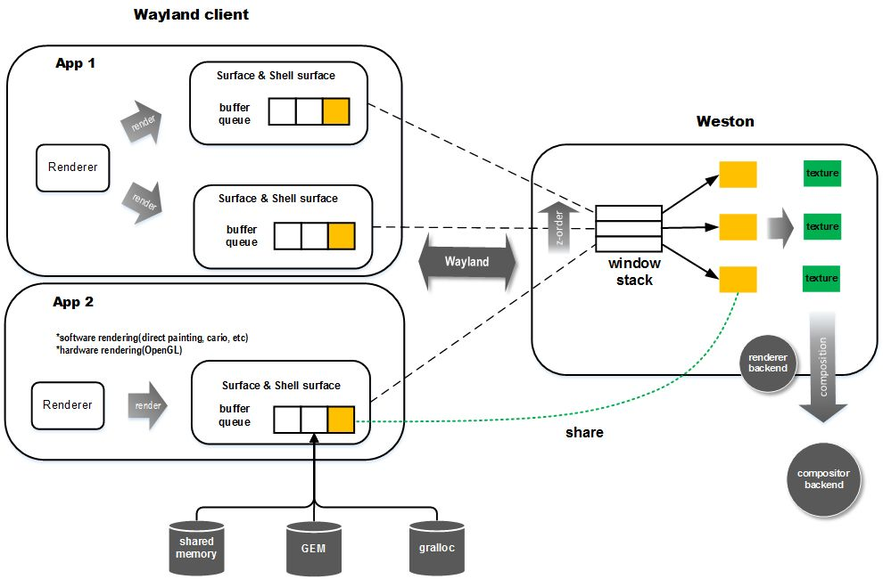

[图来源](https://cloud.tencent.com/developer/article/1445734#:~:text=%E5%86%85%E5%AE%B9%E8%BF%9B%E8%A1%8C%E5%90%88%E6%88%90%E3%80%82-,%E4%B8%8B%E9%9D%A2%E6%98%AF%E6%8A%BD%E8%B1%A1%E7%9A%84%E6%B5%81%E7%A8%8B%E5%9B%BE,-%E3%80%82)

EGL用于将本地窗口系统与OpenGL关联起来 ------> TODO: 如何理解？


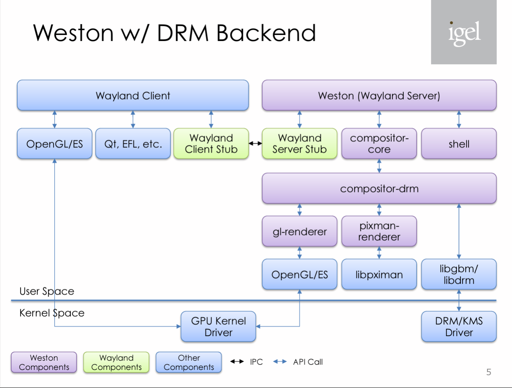

[来源](https://blog.csdn.net/u012839187/article/details/100580627#:~:text=%E4%BD%BF%E7%94%A8drm%2Dbackend%EF%BC%8C-,client%E7%BB%98%E7%94%BB%E5%A6%82%E6%9E%9C,-%E7%94%A8opengl%2Bopengles)

[真正来源](https://events.static.linuxfound.org/sites/events/files/slides/als2015_wayland_weston_v2.pdf)  ---->  [als2015_wayland_weston_v2.pdf](als2015_wayland_weston_v2.pdf) 


### TODO:Commit相关流程

https://blog.csdn.net/eydwyz/article/details/105799813   Wayland源码分析-Commit相关流程


## 合成结果的处理 compositor backend

图：

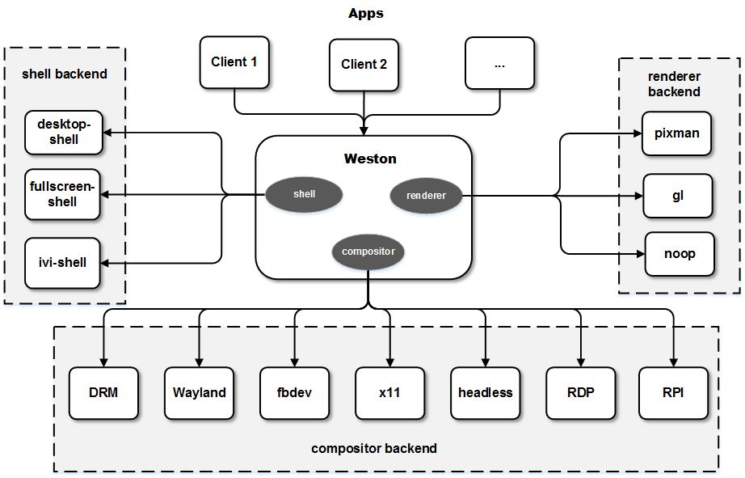

[图来源](https://cloud.tencent.com/developer/article/1445734#:~:text=%E5%AE%83%E4%BB%AC%E5%88%86%E5%88%AB%E7%94%A8%E4%BA%8E%E7%AA%97%E5%8F%A3%E7%AE%A1%E7%90%86%EF%BC%8C%E5%90%88%E6%88%90%E6%B8%B2%E6%9F%93%E5%92%8C%E5%90%88%E6%88%90%E5%86%85%E5%AE%B9%E8%BE%93%E5%87%BA)

compositor backend主要决定了compositor合成完后的结果怎么处置


荣： compositor backend  相当于 HWC？？？？？


>   

# 临时，pending_state 概念：

```java
0、作用：给drm用的 -----> 自然，系统级别：
				自然，持有output_list;
pending_state 功能链接：https://gitlab.freedesktop.org/wayland/weston/-/commit/eedf84c68f57c5d9d171520d8984e5ef293035f7

1、创建时机：0层大纲里的 repaint_begin
	每一次repaint都要分配一个新的drm_pending_state给drm使用
	
具体代码：
drm_repaint_begin(drm.c)
	device->repaint_data = drm_pending_state_alloc(device) // 【初始化drm_pending_state】


2、使用时机：
	drm_repaint_flush 应用pending state

具体代码：
drm_repaint_flush(/drm.c)
	drm_pending_state_apply(pending_state)
		遍历pending_state->output_list
			drm_output_apply_state_legacy(struct drm_output_state *state)
				drmModeSetCrtc
				drm_output_assign_state(state, DRM_STATE_APPLY_ASYNC);
	device->repaint_data = NULL; // 呼应

其他类似：
drm_pending_state_apply_atomic
drm_pending_state_apply_sync

3、其他非核心：
drm_repaint_cancel
	drm_pending_state_free(pending_state); 【释放】
	device->repaint_data = NULL;
```


# 能量----从驱动力来看图形

## **client** 与 server 之间的pingpong

### C-S 之间 buffer的传递

#### 待整理

https://blog.csdn.net/qqzhaojianbiao/article/details/129796828          Wayland中跨进程调用过程

以Weston自带的例程simple-shm为例：

> 共享内存，图：
>
> https://blog.csdn.net/qqzhaojianbiao/article/details/129796828#:~:text=wl_proxy%E7%9A%84event%E3%80%82-,%E8%BF%99%E4%B8%AA%E6%98%A0%E5%B0%84%E8%BF%87%E7%A8%8B%E5%A6%82%E4%B8%8B%E5%9B%BE%E6%89%80,-%E7%A4%BA(%E4%BB%A5wl_registry

TODO:  安卓的buffer是共享内存嘛？

### C的 wl_surface_commit 与  S的 wl_callback协议

TODO:  模型图

simple-egl                  ------------- EGL的swapbuffer ------wl_surface_commit----------------->      weston

​	              循环读取    <----------- EGL的callback的listener ---(wl_callback_send_done)   --------  


时机：

> wl_surface_commit  时机：必然是client侧  redraw的结束
>
> wl_callback时机：必然是 compositor 侧  repaint_out 的结束

simple-shm：

```java
server侧过来wl_callback消息 --> redraw --> wl_surface_commit
```


simple-egl:

```java
egl流程：也走了 wl_callback
client -> server: 
    EGL的eglSwapBuffers:包括  交换buffer + commit surface（所以client端，没有看到调用wl_surface_commit！）

server -> client：
	【compositor】weston_output_repaint
	                 wl_callback_send_done
					     -------【simple-egl】EGL 封装了callback的listener-------------------
						【simple-egl】wl_display_dispatch 循环读取消息，处理
							处理完所有事件，就redraw一帧
```


mesa注解： wl_callback_add_listener(dri2_surf->throttle_callback）

```java
sync callback so that we always give a chance for the compositor to
handle the commit and send a release event before checking for a free
buffer 
```


总结：

> <font color='red'>egl 与 weston交互**没有特别之处**（与shm一样）</font>
>
> ~~唯一区别：~~
>
> > ​    client侧看不到显式的 提交wl_surface_commit和接受wl_callback （**都被EGL封装了！！！！！！**！）


一个极其重要的结论：

>   >   <font color='red'>从wayland协议角度（即接口调用角度），openGL就是 shm</font>
>
>   推论：
>
>   >   技巧：如何阅读openGL，从shm例子理解
>   >
>   >   自然，~~wayland协议，opengl也逃脱不了~~


wl_callback_listener 协议：

>   <font color='red'>表征server合成完一帧</font>，通知client redraw：client  <--------------    server.wl_callback_send_done
>
>   代码：
>
>   ```java
>   // 1、结构：(1)listener 的 在server侧的维护, 自然是list（frame_callback_list）
>   //         (2)client侧wl_callback 是 server侧frame_callback 的代理！！！ !!!
>   
>   // 2、结构增：
>   client侧：
>   	wl_callback callback = wl_surface_frame(window->surface); // 触发server侧创建frame_callback（client侧wl_callback）
>   	wl_callback_add_listener(wl_callback)
>   
>   server侧： 
>       surface_frame
>   		cb = wl_resource_create(client, &wl_callback_interface, 1, callback); // 创建并添加
>   		wl_list_insert(surface->pending.frame_callback_list.prev,wl_resource_get_link(cb));
>   // 3、结构减
>   
>   ```
>
>   
>
>   [参考 Wayland中的跨进程过程调用浅析](https://blog.csdn.net/jinzhuojun/article/details/40264449#:~:text=wl_callback_add_listener)
>
>   wl_callback_listener 回调时机：
>
>   ```java
>   【compositor】weston_output_repaint
>   	       wl_callback_send_done
>   ```
>
>   

### TODO: wl_buffer_listener  协议 与谁 pingpong？:       

>   <font color='red'>表征 server侧对buffer 使用权的释放</font>，通知client可以 重新获取使用权（使用或者销毁）：
>
>    回调时机： 
>
>   ```java
>   weston_buffer_reference(
>   	wl_buffer_send_release(struct wl_resource *resource_) // server侧维护的old_ref.buffer->busy_count == 0
>       
>   
>   // 调用点很多：
>   ```
>   
>

 wl_surface_commit 大纲：

```java
├─ wl_surface_commit -----client侧
└─ surface_commit
    └─ weston_surface_commit
        └─ weston_surface_commit_state
            └─ weston_surface_attach
                ├─ gl_renderer_attach // 1、surface绑定新的buffer 2、可见，任意buffer类型，都可以用GPU
                │   ├─ gl_renderer_attach_shm  // shm格式,似乎是做了转化？
                │   │   ├─ ARRAY_COPY(gb->gl_format, gl_format); // 即 memcpy 【shm存在内存copy！！！！！做转化！！TODO】
                │   │   └─ ensure_textures
                │   │       └─ for glGenTextures(1, &gb->textures[i]); // 【从buffer生成纹理】【重要节点：textures来源!!!!】
                │   ├─ gl_renderer_attach_dmabuf
                │   │   └─ for glBindTexture(target, gb->textures[i]); // 【从buffer生成纹理】
                │   ├─ gl_renderer_attach_egl  //
                │   │   ├─ gl_buffer_state *gb = buffer->renderer_private
                │   │   ├─ glBindTexture(target, gb->textures[i]); // TODO: 直接从weston_buffer里拿到纹理-----> 【共享纹理】
                │   │   └─ gr->image_target_texture_2d(target, gb->images[i]); // 【】texture 与 image的绑定
                │   ├─ gl_renderer_attach_solid
                │   ├─ .// 【以上获取texture。获取完，以下自然释放buffer？】
                │   ├─ weston_buffer_reference // 占有新buffer的使用权
                │   │   └─ wl_buffer_send_release(old_ref.buffer->resource) // release老的buffer，让渡给client
                │   │       └─ ----------------client侧 buffer_release
                │   ├─ weston_buffer_release_reference
                │   │   └─ weston_buffer_release_destroy
                │   │       └─ zwp_linux_buffer_release_v1_send_fenced_release // 【利用fence机制释放buffer】TODO: fence来源；与上面区别
                │   │           └─ -------------client侧
                │   └─ .
                └─ or：软件pixman_renderer_attach

```

%accordion%hideContent%accordion%

```java
wl_surface_commit -----client侧
surface_commit
	weston_surface_commit
		weston_surface_commit_state
			weston_surface_attach
				gl_renderer_attach // 1、surface绑定新的buffer 2、
					gl_renderer_attach_shm  // shm格式,似乎是做了转化？
						ARRAY_COPY(gb->gl_format, gl_format); // 即 memcpy 【shm存在内存copy！！！！！做转化！！TODO】
						ensure_textures 
							for glGenTextures(1, &gb->textures[i]); // 【从buffer生成纹理】【重要节点：textures来源!!!!】
					gl_renderer_attach_dmabuf
							for glBindTexture(target, gb->textures[i]); // 【从buffer生成纹理】
					gl_renderer_attach_egl  //
						gl_buffer_state *gb = buffer->renderer_private
						glBindTexture(target, gb->textures[i]); // TODO: 直接从weston_buffer里拿到纹理-----> 【共享纹理】
						gr->image_target_texture_2d(target, gb->images[i]); // 【】texture 与 image的绑定
					gl_renderer_attach_solid
					.// 【以上获取texture。获取完，以下自然释放buffer？】
					weston_buffer_reference // 占有新buffer的使用权
						wl_buffer_send_release(old_ref.buffer->resource) // release老的buffer，让渡给client
							----------------client侧 buffer_release
					weston_buffer_release_reference
						weston_buffer_release_destroy
							zwp_linux_buffer_release_v1_send_fenced_release // 【利用fence机制释放buffer】TODO: fence来源；与上面区别
								-------------client侧
					.
				or：软件pixman_renderer_attach
```

%/accordion%


总之，client侧的commit，server侧做的事情: 

>   1、得到纹理数据
>
>   2、释放前一块buffer？

TODO : fence


TODO:

>   与surface_attach 什么关系？

### 两个协议之间，啥关系？ 关联是啥？差异又是啥？为啥要有两个？


### wl_surface.commit 与 zwp_linux_buffer_release_v1_listener --fence机制

-<font color='red'>1、同wl_buffer_listener  ， ~~也是表征 server侧对buffer 使用权的释放~~</font>，

2、不同点：**通过fence机制（仅限于dma_buf）**

```java
struct zwp_linux_buffer_release_v1_listener {
	void (*fenced_release)(void *data,          // release buffer with fence
			       struct zwp_linux_buffer_release_v1 *zwp_linux_buffer_release_v1,
			       int32_t fence);

	void (*immediate_release)(void *data,
				  struct zwp_linux_buffer_release_v1 *zwp_linux_buffer_release_v1);
};
```


### c侧的帧率统计（驱动力的帧率）

自然是， 统计redraw的 次数/时间

redraw的本质，就是 合成器给的wl_callback 触发


## weston与drm之间的pingpong

pingpong：

> weston  ------> drm:  drmModeAtomicCommit
>
> drm  ------> weston:  atomic_flip_handler


drm  ------> weston: 定时触发 compositor：


TODO:  

发车（图形整体的pingpong）： 是由drm决定的


# 物质---从buffer看图形  TODO:

## buffer流转模型---0层

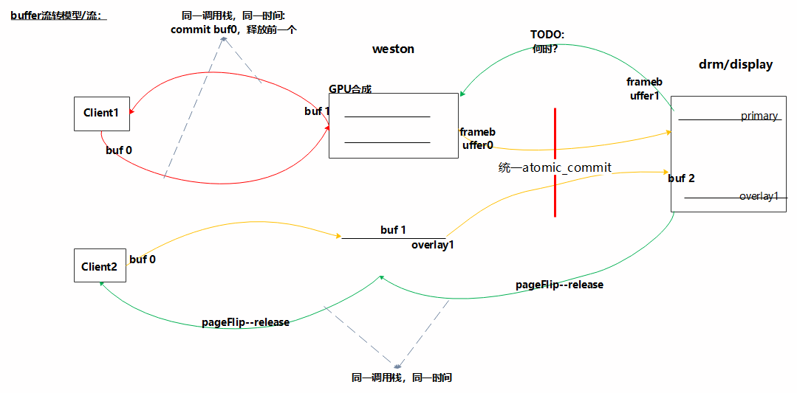


TODO:

>   如何跟踪commit的buffer，与 release的buffer？
>
>   ```java
>   weston_buffer_reference()
>   
>   struct drm_plane_state {
>   	struct {
>   		struct weston_buffer_reference buffer;
>   		struct weston_buffer_release_reference release;
>   	} fb_ref;
>   ```

TODO:

>   为啥GPU合成，release buffer的时刻是commit的时候？

TODO

>   Trace图加以验证，不要猜!!!!!!!!!


## 帧率FPS、buffer的TimeLine、占buffer数量 之间关系

1、帧率（fps）：<font color='red'>本质是buffer的轮转速度</font>   （**与buffer占用、buffer的个数、buffer的timeLine没有任何关系！！！！**）

2、2_0  一个buffer的多个时刻：即一个Buffer的TimeLine：

>   可以很长，比如：安卓App(16ms)  ----> SF(16ms) ----> Y的服务(2ms) -----> weston(16ms) -----> display (16ms)

2_1:一个时刻的多个buffer（占用）：

-<font color='red'>即2_0（一个Buffer的TimeLine）的倒数：</font>一个时刻，有4个buffer被占用 ----------------> <font color='red'>所以 bufferQueue，至少配置4个</font>


 推论：

1、所需buffer个数（**从0层模型图**，可以看出）：

>   （1）GPU合成，至少两个buffer（同一时刻，App占一个、weston占一个）
>
>   ​          硬件合成，至少三个buffer（App占一个、weston占一个、display占一个）


## weston_buffer的引用计数（server侧）

### 【对象的引用计数的<font color='red'>必要性</font>】

**why：**

一般情况下：

> 生命周期明确且简单的对象（比如栈分配的对象）  -------->  不需要
>
> 单个所有者对象   ----------> 不需要

引用计数使用情况：

> 主要用于管理那些<font color='red'>可能被多个部分引用</font>的对象！！！！！！！！
>
> 引用计数可以<font color='red'>自动管理内存</font>（不需要显式地管理释放逻辑、计数为0自动释放）


### weston_buffer的引用计数 ------- weston_buffer_reference的实现

weston_buffer_reference的实现：

```java
weston_buffer_reference(weston_buffer_reference *ref，weston_buffer *buffer, BUFFER_MAY_BE_ACCESSED);
	0、weston_buffer_reference old_ref = ref 创建副本
	1、ref->buffer = buffer----> 将 新的buffer 被ref引用
		buffer->busy_count++;
		ref->type = type;
	2、-------副本old_ref，type是旧的，buffer也是旧的！---------------
	ref之前是BUFFER_MAY_BE_ACCESSED： 之前 ref的buffer，引用减1  ----->//  【】减到0，自然通知clientserver释放了： wl_buffer_send_release ！！！！！！！！
        
        
weston_buffer_reference(weston_buffer_reference *ref，weston_buffer *NULL, BUFFER_WILL_NOT_BE_ACCESSED);  // 传参NULL
	新buffer是NULL
    旧buffer 减计数 busy_count--
```


### weston_buffer的引用计数 & buffer释放时机

结论：

走primary的buffer：

> ```java
> surface_commit ---> gl_renderer_attach时，surface模块所做：
>      自然的，surface与新的weston_buffer结合，新buffer  busy_count++
>      自然的，............................... 旧buffer  busy_count-- -----> 0 这里释放旧buffer
> ```


走overlay的buffer：

> ```java
> 	（1）surface_commit ---> gl_renderer_attach 时，同primary: 新buffer加计数
> 													旧buffer减计数，但是没到0！！！！！！原因：上一帧的 drm_output_try_paint_node_on_plane 有多余引用！？？？？TODO:
> 
> 	（2）向drm提交前（drm_output_try_paint_node_on_plane），plane_state模块所做：
> 		新buffer加计数
> 		旧buffer减计数：？？？？？？？
> 			weston_buffer_reference(&state->fb_ref.buffer, surface->buffer_ref.buffer, BUFFER_MAY_BE_ACCESSED);
> 
> 	（3）走overlay时候，pageFlip时（drm_plane_state_free）,state模块：  weston_buffer_reference(&state->fb_ref.buffer, NULL, BUFFER_WILL_NOT_BE_ACCESSED);
> 		新buffer是NULL
> 		旧buffer 减计数 busy_count-- -----> 0 这里释放旧buffer
> ```


总结：

```java
primary是在 surface_commit ---> gl_renderer_attach 通知client释放了前一帧 buffer （client commit之前的一帧）
    	

overlay 是在 pageFlip ----> drm_plane_state_free .................前一帧buffer    （drm commit之前的一帧）
```

**一句话总结：**

> primary与overlay的  释放buffer时机<font color='red'>有差异，来源于  drm_output_try_paint_node_on_plane</font>(只有overlay走)


### weston_buffe 销毁的引用计数 -------- weston_buffer_release_reference()

目的：


与 weston_buffer_reference 比较：

```java
weston_buffer_reference： ----> weston侧向client释放buffer， 引用计数 
weston_buffer_release_reference  ----> 用于weston_buffer本身 销毁的计数
自然，1、大部分情况下，传递计数 与 销毁计数，代码都是在一起的
	  2、何时，不在一起？自然subsurface时候，有传递计数，没有 销毁计数  见 weston_subsurface_commit_from_cache
```


### TODO:weston_surface的引用计数

【weston_surface的引用计数】

> weston_surface_ref 与  weston_surface_unref


## 待整理

TODO: 焦点：simple-egl 如何申请buffer？

```java
surface_attach  // 应用侧调用
【weston_buffer_from_resource】  // 往 weston_buffer填充真正的buffer内容（从wl_resource中获取）
	if ((shm = wl_shm_buffer_get(buffer->resource)) // 判断是不是shm
	ef：dmabuf = linux_dmabuf_buffer_get(buffer->resource) // dma 判断
        格式：WL_SHM_FORMAT_ARGB8888（即DRM_FORMAT_ARGB8888）、_XRGB8888（即DRM_FORMAT_XRGB8888）、WL_SHM_FORMAT_C8 = 0x20203843
	ef：solid = single_pixel_buffer_get(buffer->resource)  // 纯色判断
        格式：DRM_FORMAT_XRGB8888、DRM_FORMAT_ARGB8888
	else: ec->renderer->fill_buffer_info(ec, buffer) // EGL类型的buffer
			buffer->legacy_buffer = (struct wl_buffer *)buffer->resource //【】 直接把wl_resource赋值给了buffer！！！！！
			向EGL查询 legacy_buffer 宽高和格式（很多：DRM_FORMAT_XRGB8888、DRM_FORMAT_ARGB8888、DRM_FORMAT_YUYV、DRM_FORMAT_NV12、DRM_FORMAT_YUV420）
			gb->images[i] = gr->create_image(gr->egl_display, EGL_WAYLAND_BUFFER_WL, buffer->legacy_buffer); // 【】 buffer转化为opengl的Image
			weston_buffer->renderer_private = gl_buffer_state //【】封装了 EGLImageKHR、textures
			 

【weston_buffer_from_resource】
1、是一个频繁调用函数！！！！！（第一次会填充buffer，后面都是直接返回）
2、TODO: 虚拟机上simple-egl这里送过来的buffer是dmabuf。所以，可能是虚拟机的EGL做的！！！！！为了兼容 
```

TODO: 格式与buffer是两回事


## 图形数据的承载者-----buffer：

client   surface_commit给 weston的图形数据

--------------->  TODO: 修改标题，目的是什么，为什么，功能是什么


因为不同的buffer类型，处理的方式不同。

自然，区分：

> ```java
> struct weston_buffer {
> enum {
>      WESTON_BUFFER_SHM,
>      WESTON_BUFFER_DMABUF,
>      WESTON_BUFFER_RENDERER_OPAQUE,  
>      WESTON_BUFFER_SOLID,
>  } type;
> 
>  union {
> 		struct wl_shm_buffer *shm_buffer;  // 【】终极承载者
> 		void *dmabuf; // 【】
> 		void *legacy_buffer; // 【】 egl数据!!!!!!!
> 		struct weston_solid_buffer_values solid;  // 【】
> 	};
> }
> ```

处理方式差异：

> ```java
> gl_renderer_attach_shm  //
> gl_renderer_attach_egl  //创建对应surface buffer的egl_image，激活绑定纹理。
> gl_renderer_attach_dmabuf  //使用dmabuf时的函数
> ```

为什么处理方式会不一样？

**最最最本质的原因是什么？**  **图形加速硬件**要求：

>   **1、物理连续**且   
>
>   **2、符合对齐要求**的内存

**如果是普通共享内存，一般是物理不连续的----------->多数情况用软件渲染。**

------------->[参考](https://blog.csdn.net/u012839187/article/details/100580627#:~:text=%E5%A6%82%E6%9E%9C%E6%98%AF%E6%99%AE%E9%80%9A%E5%85%B1%E4%BA%AB%E5%86%85%E5%AD%98%EF%BC%8C%E4%B8%80%E8%88%AC%E6%98%AF%E7%89%A9%E7%90%86%E4%B8%8D%E8%BF%9E%E7%BB%AD%E7%9A%84%EF%BC%8C%E5%A4%9A%E6%95%B0%E6%83%85%E5%86%B5%E7%94%A8%E8%BD%AF%E4%BB%B6%E6%B8%B2%E6%9F%93) 


gpt给出的对比：

| 缓冲区类型                    | 描述                                                         | 机制                          | 物理层特性                                        | 用途                                 |
| ----------------------------- | ------------------------------------------------------------ | ----------------------------- | ------------------------------------------------- | ------------------------------------ |
| WESTON_BUFFER_SHM             | 共享内存缓冲区：使用共享内存机制进行数据存储和访问。         | POSIX 或 System V 共享内存    | 通过标准操作系统机制共享内存                      | 客户端和服务器之间的一般图像数据共享 |
| WESTON_BUFFER_DMABUF          | DMA 缓冲区：使用 DMA-BUF 机制，在设备之间高效共享缓冲区数据。 | DMA-BUF（直接内存访问缓冲区） | 通过 DMA 共享内存，允许设备直接访问数据而无需复制 | GPU 和显示设备之间的高性能数据共享   |
| WESTON_BUFFER_RENDERER_OPAQUE | 渲染器不透明缓冲区：由 OpenGL 等外部渲染器管理；数据对 Weston 不透明。 | OpenGL 或类似图形渲染器       | 由外部渲染系统管理，数据不可直接访问              | 由外部系统管理的渲染任务             |
| WESTON_BUFFER_SOLID           | 纯色缓冲区：存储单一颜色值，用于简单背景或覆盖。             | 颜色值存储                    | 不存储实际图像数据，仅存储颜色值                  | 简单的颜色填充                       |

这些缓冲区类型在物理层面的本质区别主要在于它们的数据存储和访问机制，以及它们在不同使用场景中的性能和效率。

——来自AI问答宝 https://ai.wendabao.net


## 从buffer角度来看渲染流水线：

### 物理

物理基础：

> 移动平台上，没有专门的显存   -------->  所以，GPU在移动平台上，使用的物理内存是CPU内存。[来自](https://blog.csdn.net/qqzhaojianbiao/article/details/129789575#:~:text=%E5%8E%BB%E5%88%9B%E5%BB%BAbuffer%E3%80%82-,%E5%9C%A8%E5%A4%A7%E5%A4%9A%E6%95%B0%E7%A7%BB%E5%8A%A8%E5%B9%B3%E5%8F%B0%E4%B8%8A%EF%BC%8C%E6%B2%A1%E6%9C%89%E4%B8%93%E9%97%A8%E7%9A%84%E6%98%BE%E5%AD%98,-%EF%BC%8C%E5%9B%A0%E6%AD%A4%E5%AE%83%E4%BB%AC%E6%9C%80%E7%BB%88)
>
> 

SHM（ 普通共享内存）-----------例子simple-shm

> 分配者： CPU malloc分配  ------->  自然，CPU认  ------> 自然，CPU软件渲染
>
> ​				**例外：GPU也可以用，但是要做一次copy，转化为连续的？？？？**  TODO
>
> 物理特性：   **物理不连续的**（<font color='red'>CPU软件渲染的根本原因</font>）
>
> 图像格式：RGBA ----CPU认识的格式
>
> <font color='red'>例外情况--------SHM的合成</font>：因为DRM不认识（~~不是DRM分配的~~），只能GPU兜底。但是GPU又不能使用不连续内存，所以，有一次copy
>
> 总结，<font color='red'>SHM的缺点：</font>
>
> > （1）**DRM不认识**（~~导致不能绑plane，必须GPU合成转一道~~）
> >
> > （2）**GPU半认识**（~~需要重新copy成连续内存~~）

DMA-----------例子

> <font color='red'>DMA传fd，0 copy，全程GPU用（从client到drm），CPU没有用</font>； 
>
> SHM GPU用不了，所以有copy

GEM:

> 分配者：   **DRM驱动 分配的buffer** ------>  自然，drm认识  ------> 自然，**可以绑定plane（直接送drm）**


补充：SHM，有许多格式：

> ```java
> enum wl_shm_format {
> 	WL_SHM_FORMAT_ARGB8888 = 0,
> 	WL_SHM_FORMAT_XRGB8888 = 1,
> WL_SHM_FORMAT_YVYU
> WL_SHM_FORMAT_UYVY
> ....................
> }
> ```
>
> TODO: 物理级 区别是啥？  影响是啥？
>
> 


### wl_buffer的分配 & 管理

几大原则：

buffer的分配者（when）：**分配者-------决定数量和分配时间**

>   <font color='red'>weston：从client端分配的</font>（~~自然，client自行设计buffer的管理原则~~），见【例1---shm】
>
>     
>
>   Android：server端（SF）分配（~~自然，server管理~~）
>
>   **通用原则：<font color='red'>谁分配，谁管理(维护生命周期)</font>**  ，见【例1---shm】     [参考](https://topic.alibabacloud.com/tc/a/brief-introduction-of-wayland-and-weston_8_8_31415280.html)


buffer的管理（how）-------buffer Queue：

>   极限情况：一个buffer就可以了（~~client绘制的时候，其他都等着~~），性能很差
>
>   bufferQueue，对于wayland，是client来实现的
>
>   
>
>   server侧对 buffer的释放：协议-----wl_buffer_listener
>
>   ​                         when：


#### shmbuffer  例---simple-shm:

 1、第一帧之前，client分配buffer。 代码：

```java
// simple-shm.c

server--->
xdg_surface_listener协议--------
	redraw
		window_next_buffer
			for (i = 0; i < 2; i++)  // shm分配了两个buffer！！！！！
				struct buffer *buffer = calloc(1, sizeof(*buffer)); // 【不是真实wl_buffer，是结构体】
				wl_list_insert(&window->buffer_list); // 【即所谓的buffer Queue】
			create_shm_buffer(window, buffer, WL_SHM_FORMAT_XRGB8888);
				fd = memfd_create("weston-shared"); 【创建fd】
				data = mmap(size, PROT_READ | PROT_WRITE, MAP_SHARED, fd);【fd映射到一段client的内存空间！！！返回内存地址】
				
				wl_shm_pool pool= wl_shm_create_pool(fd)--------【协议，传fd给server】 TODO:server侧到底做了什么
				wl_buffer *buffer = wl_shm_pool_create_buffer(wl_shm_pool, width, height，stride, format) ----【协议，让server侧创建wl_buffer】 TODO:server侧到底做了什么
				
				wl_buffer_add_listener(buffer->buffer, &buffer_listener, buffer); // server 与 client 关于buffer使用权的协议

				wl_shm_pool_destroy(pool); // 【过河拆桥：pool和fd是工具，当wl_buffer创建完毕后，就没有存在的必要了！！！TODO】
				close(fd);
```

一些基本结论：

>   ​    （1）shm    **client分配了两个buffer**，维护在 buffer_list里

-<font color='red'>所谓的共享本质：</font>

>   1、server能看到&操作 client的内存！！！！！！
>
>   2、<font color='red'>wl_buffer的shm实现，理解</font>，TODO：
>
>   （1）where---在client的内存里：<font color='red'>fd mmap的内存是client的</font>   [参考](https://blog.csdn.net/jinzhuojun/article/details/40264449#:~:text=%E5%B0%86%E8%AF%A5%E6%96%87%E4%BB%B6%E5%85%88%E6%98%A0%E5%B0%84%E5%88%B0Client%E7%AB%AF%E7%9A%84%E5%86%85%E5%AD%98%E7%A9%BA%E9%97%B4)
>
>   （2）when--client触发：wl_shm_pool_create_buffer
>
>   （3）who---server去分配create的：wl_shm_pool_create_buffer，server拿到fd，能看到client的内存
>
>   ​		Q: 如何保证server的create buffer大小，和 映射的 内存大小一致？
>
>   ​		A：mmap的size = create_buffer的   height\*stride\*format
>
>   ​		
>
>   ​		Q:为啥一定要server端去创建 wl_buffer？
>
>   ​		A: TODO
>
>   （4）what---<font color='red'> wl_buffer 是协议、是抽象</font>，两边都能使用的协议
>
>   ​			-<font color='red'>具体实现可以是 共享内存、dma_buffer</font>
>
>   （5）how---wl_buffer协议的实现shm_buffer，根本机制：
>
>   >   本质通过mmap和fd
>
>    		how2---wl_buffer使用权的协议：wl_buffer_listener


2、第一帧之后，**client管理buffer Queue**： buffer_list + 标记buffer是否被server释放。 代码：

```java
// simple-shm.c

// 标记buffer是否被server释放:
server ---->
	wl_buffer_listener协议-----  
		client.buffer_release
			buffer.busy = 0
```


#### dma_buffer 例------simple-egl

实验的结论：

>   虚拟机上simple-egl这里送过来的buffer是dmabuf
>
>   真实板子上 simple-egl 送过来的buffer也是 dmabuf ！！！！TODO: 

TODO:  为啥不是 WESTON_BUFFER_RENDERER_OPAQUE ???  ------>  <font color='red'>跟EGL的实现有关，申请的DMA</font>


buffer的传递：

>   自然，传fd（~~不会进行数据的copy~~）
>
>   方式：binder, domain socket和pipe等
>
>   ​           对于wayland，底层用的是domain socket
>
>   

关于协议wl_callback_listener （驱动力），见《能量》


#### dma_buffer 例------simple-dmabuf-egl

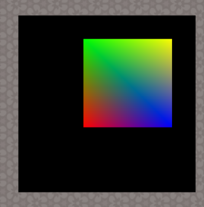

该例子教会我们：

1、**client申请了四个dmabuffer**


```java
// simple-dmabuf-egl.c
create_window
    for (i = 0; i < 4; ++i) { // 4个
        buffer->bo = gbm_bo_create_with_modifiers2(display->gbm.device)
```

2、opengl如何使用四个buffer轮转：

​      fence机制  TODO:  wait_for_buffer_release_fence


### 待整理

Client buffer：

```java
类型 wl_buffer 
向weston侧申请
具体物理：GPU?????
```


FrameBuffer:

类型 gbm_surface

```java
向GBM侧申请
		output->gbm_surface = gbm_surface_create(gbm,
							 mode->width, mode->height,
							 output->format->format,
							 output->gbm_bo_flags);
		【4】从gbm 创建gbm_surface（封装了最终的FrameBuffer）
```


create_gbm_surface


### gbm_surface  buffer

问题：怎么给weston侧的OpenGL使用的？？？？

drm_output_init_egl中，创建
	指定了 (EGLNativeWindowType) output->gbm_surface;
所以，没有glBindFramebuffer之前，都是在gbm提供的缓冲区里操作的


切换缓冲区：
glBindFramebuffer(GL_FRAMEBUFFER, fbo); // 使用新帧缓冲 【glBindFramebuffer(fbo)】 用作离屏渲染，TODO: 补充weston中例子。
glBindFramebuffer(GL_FRAMEBUFFER, 0); // 切换回默认帧缓冲 （不进行bind，走的就是默认！）
参考： https://blog.csdn.net/a277539277/article/details/129360001


【glBindFramebuffer(fbo)】 
1、用作离屏渲染，TODO: 补充weston中例子。
2、自然，离屏渲染之后，还要切回默认，继续渲染屏幕内容


commit与swap什么关系？

https://www.jb51.net/article/264157.htm


### wl_buffer  

TODO: 

这块buffer是 client向weston申请的。。。。weston做了什么事情？最终应该是GPU的！！！TODO

结论：

> swap 是 client 告诉OpenGL（<font color='red'>swap的对象是buffer，surface没变</font>）
>
> commit是  client告诉 weston（<font color='red'>commit的对象是 surface，buffer不用管</font>）

补充：

> surface是对外呈现，buffer是被封装的。。。不会出现在weston接口里！！！！

证明：


### eglSwapBuffers接口实现说明

https://blog.csdn.net/qiuyun0214/article/details/54614892

双缓冲，是封装在内部，我们不用关心 buffer

但是需要知道swap时机------------------------即redraw完


图来源：https://blog.csdn.net/kongbaidepao/article/details/109904963


### dma-buf 文章

好文：

https://blog.csdn.net/hexiaolong2009/article/details/102596744    dma-buf  系列文章

https://blog.csdn.net/hexiaolong2009/category_10838100.html    dma-buf  专题


### 扩展

同步：可能是线程之间同步、进程之间同步、设备之间同步、两个操作系统的同步

 “两个&独立”  ------> 自然需要同步

### 参考： 

https://www.51cto.com/article/717713.html   深入理解Android图形系统

[深入理解 Linux  OS](https://zhuanlan.zhihu.com/p/543222402#:~:text=%E8%B7%A8%E8%AE%BE%E5%A4%87%E6%8C%87%E7%9A%84%E6%98%AF%E4%B8%A4%E4%B8%AA%E8%AE%BE%E5%A4%87%E7%9A%84%E9%A9%B1%E5%8A%A8%E4%B9%8B%E9%97%B4%E6%88%96%E8%80%85%E9%A9%B1%E5%8A%A8%E4%B8%8E%E8%BF%9B%E7%A8%8B)

## gpu与display之间

**从display的角度来看：**  无论是overlay、还是primary，<font color='red'>图像数据</font>都是**从gpu直接过来的数据**

> 1、 app使用GPU -------> display
>
> 2、weston使用GPU  ---------> display


所以，从硬件角度：图形数据，只是在几个硬件之间传递


## 待整理2

从客户端发送过来的 wl_buffer，如何转化成 pixels数据呢


###### ChatGPT said:

ChatGPT

在 Wayland 环境中，`wl_buffer` 代表客户端发送到显示服务器（compositor）的图像数据。为了将 `wl_buffer` 转换为像素数据，需要根据它的类型获取其内存地址，并解析出颜色和透明度等像素信息。通常，`wl_buffer` 可以来自共享内存 (`wl_shm_buffer`) 或图形驱动层（如 `EGL` 和 `GBM`）。以下介绍如何从 `wl_buffer` 获取像素数据，具体取决于 `wl_buffer` 的来源。

### 1. **从 `wl_shm_buffer` 转换为像素数据**

如果客户端通过 `wl_shm` 发送 `wl_buffer`，该缓冲区存储在共享内存中，通常以 `WL_SHM_FORMAT_ARGB8888` 或类似格式提供。可以通过 `wl_shm_buffer_get()` 获取共享内存缓冲区，并从中提取像素数据。

#### 步骤：

1.  **检查 `wl_buffer` 是否是 `wl_shm_buffer`** 使用 `wl_shm_buffer_get()` 来确定 `wl_buffer` 是否是通过共享内存传递的缓冲区。

    ```
    cCopy codestruct wl_shm_buffer *shm_buffer = wl_shm_buffer_get(buffer->resource);
    if (!shm_buffer) {
        // buffer 不是 wl_shm_buffer，处理其他类型的 buffer（例如 GBM/EGL buffer）
        return;
    }
    ```

2.  **获取缓冲区格式、宽度、高度和步幅** 获取缓冲区的格式、宽度、高度以及每行的字节数（步幅）。

    ```
    cCopy codeenum wl_shm_format format = wl_shm_buffer_get_format(shm_buffer);
    int width = wl_shm_buffer_get_width(shm_buffer);
    int height = wl_shm_buffer_get_height(shm_buffer);
    int stride = wl_shm_buffer_get_stride(shm_buffer);
    ```

3.  **锁定缓冲区并读取像素数据** 调用 `wl_shm_buffer_begin_access()` 来锁定共享内存缓冲区，然后通过 `wl_shm_buffer_get_data()` 获取原始像素数据指针。

    ```
    cCopy codewl_shm_buffer_begin_access(shm_buffer);  // 锁定缓冲区
    void *data = wl_shm_buffer_get_data(shm_buffer);
    ```

4.  **解析像素值** 根据缓冲区的格式解析每个像素的值。对于常见的 `WL_SHM_FORMAT_ARGB8888` 格式，32位的每个像素可以分解为 `Alpha`、`Red`、`Green` 和 `Blue` 通道。

    ```
    cCopy codeif (format == WL_SHM_FORMAT_ARGB8888) {
        uint32_t *pixels = (uint32_t *)data;
        for (int y = 0; y < height; y++) {
            for (int x = 0; x < width; x++) {
                uint32_t pixel = pixels[y * stride / 4 + x];  // 读取每个像素 (4 字节)
                uint8_t alpha = (pixel >> 24) & 0xFF;
                uint8_t red   = (pixel >> 16) & 0xFF;
                uint8_t green = (pixel >> 8)  & 0xFF;
                uint8_t blue  = pixel & 0xFF;
                // 处理 alpha, red, green, blue 数据
            }
        }
    }
    ```

5.  **解锁缓冲区** 在解析完数据后，解锁缓冲区。

    ```
    c
    
    
    Copy code
    wl_shm_buffer_end_access(shm_buffer);  // 解锁缓冲区
    ```

### 2. **从 `GBM/EGL buffer` 转换为像素数据**

如果 `wl_buffer` 是通过 `EGL` 或 `GBM` 传递的，那么这种缓冲区通常是由 GPU 管理的，不像 `wl_shm` 那样简单获取共享内存中的数据。要获取像素数据，需要使用与 `GBM` 相关的接口来处理这些缓冲区。

#### 步骤：

1.  **使用 `gbm_bo_import` 导入 `wl_buffer`** 通过 `gbm_bo_import` 函数，将 `wl_buffer` 转换为 `GBM` 缓冲区对象。

    ```
    cCopy codestruct gbm_bo *bo = gbm_bo_import(gbm_device, GBM_BO_IMPORT_WL_BUFFER, buffer->resource, GBM_BO_USE_SCANOUT);
    if (!bo) {
        fprintf(stderr, "Failed to import wl_buffer to gbm_bo\n");
        return;
    }
    ```

2.  **获取 `gbm_bo` 的信息** 获取导入的 `gbm_bo` 的宽度、高度和格式。

    ```
    cCopy codeint width = gbm_bo_get_width(bo);
    int height = gbm_bo_get_height(bo);
    int stride = gbm_bo_get_stride(bo);
    uint32_t format = gbm_bo_get_format(bo);
    ```

3.  **映射 `gbm_bo` 缓冲区到CPU可访问的内存** 使用 `gbm_bo_map()` 将 GPU 缓冲区映射到可访问的内存中，以便读取像素数据。

    ```
    cCopy codevoid *data = gbm_bo_map(bo, 0, 0, width, height, GBM_BO_TRANSFER_READ, &stride, &map_data);
    if (!data) {
        fprintf(stderr, "Failed to map gbm_bo to CPU accessible memory\n");
        gbm_bo_destroy(bo);
        return;
    }
    ```

4.  **读取像素数据** 解析映射后的数据，类似于 `wl_shm_buffer`。

    ```
    cCopy codefor (int y = 0; y < height; y++) {
        for (int x = 0; x < width; x++) {
            uint32_t *pixels = (uint32_t *)((char *)data + y * stride);
            uint32_t pixel = pixels[x];
            uint8_t red   = (pixel >> 16) & 0xFF;
            uint8_t green = (pixel >> 8) & 0xFF;
            uint8_t blue  = pixel & 0xFF;
            // 处理颜色数据
        }
    }
    ```

5.  **解除映射并释放 `gbm_bo`** 完成数据处理后，解除映射并释放 `gbm_bo`。

    ```
    cCopy codegbm_bo_unmap(bo, map_data);
    gbm_bo_destroy(bo);
    ```

### 3. **其他方式：通过 `EGL` 或 `OpenGL` 读取像素**

对于通过 `EGL` 发送的 `wl_buffer`，如果你已经设置了 `EGLContext`，你可以使用 `glReadPixels()` 函数从 `EGL` 表面读取像素数据。

```
Copy code
glReadPixels(0, 0, width, height, GL_RGBA, GL_UNSIGNED_BYTE, pixel_data);
```

### 总结

-   **`wl_shm_buffer`**：通过共享内存发送的缓冲区，可以直接访问内存中的像素数据。
-   **`GBM/EGL buffer`**：需要通过 `gbm_bo_import` 导入 `wl_buffer`，然后通过 `gbm_bo_map` 映射到 CPU 可访问的内存，才能读取像素数据。
-   **`EGL/OpenGL` buffer**：可以通过 OpenGL 的 `glReadPixels` 获取渲染后的像素数据。

根据 `wl_buffer` 的来源和格式，选择合适的处理方式。


# dma 

## why----为什么要有dma

（1）buffer是图像数据的承载，所以，<font color='red'>一定是为了跨了进程（传递数据）</font>

补充：同进程内，直接申请texture & fbo

（2）相比于shm，dma是<font color='red'>覆盖式 </font>图像数据（两帧之间没有关系的！！！）


## 创建dma

### GBM方式：

通过GBM创建gbm_<font color='red'>bo</font>（buffer object）：-----------参考：dmabuf-egl.c

> ```java
> gbm_bo_create
> 变体：gbm_bo_create_with_modifiers2
> ```


~~gbm_bo，自然持有dma buffer:~~

> ```java
> buf->dmabuf_fds[i] = gbm_bo_get_fd(buf->bo, i); // 类似接口 gbm_bo_get_fd_for_plane
> 
> //次要，获取strides
> buf->strides[i] = gbm_bo_get_stride_for_plane(buf->bo, i);
> ```

注意： <font color='red'>（这里的fd用完需要释放）</font>


拉直：

> gbm_device 创建 gbm_bo(持有dma)


###  EGL方式：TODO:


### dma 与渲染节点的关系、client无法直接创建dma

参考：dma-egl.c


## 空dma的填充 TODO

手动方式：

>   参考：dma-egl.c


EGL方式：

>   参考 simple-egl.c


## 传递dma

### 跨进程传int fd的耗时 -------TODO

跨进程传输fd时：

>   1、两边的int  fd不一样，存在内存copy：产生新的内核的int fd，内核做了copy
>
>   2、<font color='red'>每次传输都不一样?</font>   TODO:

根因：

>   dma 实际上是GPU地址   -----------> fd1 （CPU1 地址）
>
>   ​                                           -----------> fd2 （CPU2 地址）
>
>   todo：
>
>   >   [IOMMU 扫盲](https://blog.csdn.net/liyucheng987/article/details/109303949)

解决办法：

>   只传递框架层的int  bufferId，避免传int fd，造成内核做内存copy（<font color='red'>当然第一次传fd，无法避免</font>）
>
>   具体代码：TODO


### 安卓跨域传dma的fd ：

自然，传递过来的是fd（不需要这边释放）

```java
// 跨域传dma  TODO: 跨域传递其他？？？？？？

VHOST_DMABUF_IOCTL_CMD_EXPORT 方式----过hyper

exporterFd = open(kDmabufExporterPath, O_RDONLY);    
ret = ioctl(exporterFd, VHOST_DMABUF_IOCTL_CMD_EXPORT, dmaBufInfo);
```


## 跨进程/系统拿到传递的dma后（含图形数据）---->使用

### 拿到的是dma的fd: GPU获取 Dmabuffer  fd------> Texture 不需要copy

EGL扩展的接口：

>   ```java
>   EXT_image_dma_buf_import
>   ```
>
>   https://registry.khronos.org/EGL/extensions/EXT/EGL_EXT_image_dma_buf_import.txt  


使用参考：simple-dmabuf-egl.c

>   https://gitlab.freedesktop.org/wayland/weston/-/blob/main/clients/simple-dmabuf-egl.c?ref_type=heads


-<font color='red'>接口：</font>

> eglCreateImageKHR   -------->  支持不同的图像源和图像格式: 

dma做的扩展（参数扩展）：

> EGL_EXT_image_dma_buf_import     ---------> <font color='red'>内存映射 0 copy</font>
>
> ```java
> #ifndef EGL_EXT_image_dma_buf_import
> #define EGL_EXT_image_dma_buf_import 1
> #define EGL_LINUX_DMA_BUF_EXT             0x3270
> #define EGL_LINUX_DRM_FOURCC_EXT          0x3271
> #define EGL_DMA_BUF_PLANE0_FD_EXT         0x3272
> #define EGL_DMA_BUF_PLANE0_OFFSET_EXT     0x3273
> #define EGL_DMA_BUF_PLANE0_PITCH_EXT      0x3274
> #define EGL_DMA_BUF_PLANE1_FD_EXT         0x3275
> #define EGL_DMA_BUF_PLANE1_OFFSET_EXT     0x3276
> #define EGL_DMA_BUF_PLANE1_PITCH_EXT      0x3277
> #define EGL_DMA_BUF_PLANE2_FD_EXT         0x3278
> #define EGL_DMA_BUF_PLANE2_OFFSET_EXT     0x3279
> #define EGL_DMA_BUF_PLANE2_PITCH_EXT      0x327A
> #define EGL_YUV_COLOR_SPACE_HINT_EXT      0x327B
> #define EGL_SAMPLE_RANGE_HINT_EXT         0x327C
> #define EGL_YUV_CHROMA_HORIZONTAL_SITING_HINT_EXT 0x327D
> #define EGL_YUV_CHROMA_VERTICAL_SITING_HINT_EXT 0x327E
> #define EGL_ITU_REC601_EXT                0x327F
> #define EGL_ITU_REC709_EXT                0x3280
> #define EGL_ITU_REC2020_EXT               0x3281
> #define EGL_YUV_FULL_RANGE_EXT            0x3282
> #define EGL_YUV_NARROW_RANGE_EXT          0x3283
> #define EGL_YUV_CHROMA_SITING_0_EXT       0x3284
> #define EGL_YUV_CHROMA_SITING_0_5_EXT     0x3285
> #endif /* EGL_EXT_image_dma_buf_import */
> ```
>
> 使用：
>
> ```java
> eglCreateImageKHR(display->egl.display,
>                        EGL_NO_CONTEXT,
>                        EGL_LINUX_DMA_BUF_EXT, // 【】
>                        NULL, attribs);
> ```
>
> 


其他参数扩展：

> EGL_Android_image_native_buffer  -----> android扩展：ANativeWindowBuffer可以被创建为EGL Image


### 拿到的是dma的fd: cpu获取数据-----内存映射

必然的？？？


~~代码：~~

```java
va = mmap(NULL, strides[0], PROT_READ | PROT_WRITE, MAP_SHARED, fd, 0);
if (va == MAP_FAILED) {
	weston_log("failed, error=%d,%s\n", errno, strerror(errno));
	close(fd);
	return;
}
```


### 拿到的是dma的 GEM handles -----> DMA-BUF的fd

通过handle转

```java
void *va = NULL;
int fd, rr;

// GEM handles -----> DMA-BUF的fd
rr = drmPrimeHandleToFD(device->drm.fd, plane_state->fb->handles[0], DRM_CLOEXEC | DRM_RDWR, &fd);

// 拿到fd，可以做内存映射，映射到用户空间
va = mmap(NULL, plane_state->fb->height*plane_state->fb->strides[0], PROT_READ | PROT_WRITE, MAP_SHARED, fd, 0);


rr = fwrite(va, 1, target_height*plane_state->fb->strides[0], fp);

// 收尾
munmap(va, plane_state->fb->height*plane_state->fb->strides[0]);
```

补充： GEM handles 与 DMA-BUF的fd 可以互转


注意: 这种获取的fd，使用完毕， <font color='red'>需要close 释放</font>


drmPrimeHandleToFD  导出dmafd

https://blog.csdn.net/weixin_41176628/article/details/114312054


### dma 的fd 封装为 wl_buffer作为client -------wayland协议能力

why：-------- weston与client之间，只识别wl_对象

-<font color='red'>应用场景 & 问题：</font>   **安卓的dma，如何给到linux-weston？**

dma传输的形式： 安卓dma  ---- > 跨域传输给linux client（fd） ----> 封装为 wl_buffer


#### ~~dma fd 如何封装为wl_buffer?~~  可以

参考：simple-dmabuf-egl.c


~~关键一行：~~

> 创建dma的paras： zwp_linux_<font color='red'>dmabuf_v1_create_params</font>
>
> ```java
> struct zwp_linux_buffer_params_v1 *params = zwp_linux_dmabuf_v1_create_params(display->dmabuf);  // zwp_linux_dmabuf
> ```
>
> ~~正式创建wl_buffer，并返回结果~~：
>
> ```java
> zwp_linux_buffer_params_v1_add(params, dmabuf_fd, i, offset, stride, high_32bit, low_32bit); // 【】dmabuf_fd添加到 params
> zwp_linux_buffer_params_v1_add_listener(params, &params_listener, &data); // 
> zwp_linux_buffer_params_v1_create(params, width, height, format, flags); // 【】创建wl_buffer ------> 结果给到params_listener
> ```


-<font color='red'>拉直封装过程：</font>

```java
dmabuf_fd  -----> dma_params -----> create后，回调拿到wl_buffer
```


## buffer的流转（fd？？？？）

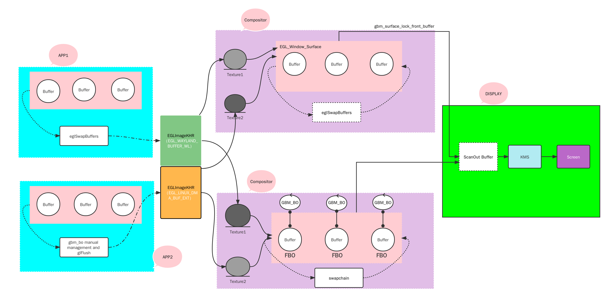

[图片来源](https://kenttj.github.io/markdownbook/0_%E5%9B%BE%E5%BD%A2%E7%B3%BB%E7%BB%9F/3_Display%E7%B3%BB%E7%BB%9F/%E5%90%88%E6%88%90%E4%B9%8Bweston.assets/wayland%E6%B5%85%E6%9E%90%E4%B9%8BEGL%E3%80%81Opengles%E3%80%81GBM_linux_%E7%A7%8D%E7%93%9C%E5%A4%A7%E7%88%B7-%E5%BC%80%E6%94%BE%E5%8E%9F%E5%AD%90%E5%BC%80%E5%8F%91%E8%80%85%E5%B7%A5%E4%BD%9C%E5%9D%8A.html)：

TODO: 不耗时吗？

## 实操---- dma_buffer 查看命令

```java
cat /sys/kernel/debug/dma_buf/bufinfo

Dma-buf Objects:
size            flags           mode            count           exp_name        ino             name
00004096        00000002        00080007        00000003        system  00000706        system
        Attached Devices:
Total 0 devices attached

00008192        00000002        00080007        00000004        virtio_gpu      00000705        <none>
        write fence:virtio_gpu controlq seq 10149 signalled
        Attached Devices:
Total 0 devices attached

00004096        00000002        00080007        00000003        system  00000702        system
        Attached Devices:
Total 0 devices attached

00008192        00000002        00080007        00000004        virtio_gpu      00000701        <none>    请解释各个字段的含义
```


## dma的原理---------怎么样实现共享buffer？

https://blog.csdn.net/weixin_42136255/article/details/129722675#:~:text=%E4%BC%9A%E5%A4%A7%E5%A4%A7%E9%99%8D%E4%BD%8E%E3%80%82-,DMA%E6%98%AF%E6%80%8E%E4%B9%88%E6%A0%B7%E5%AE%9E%E7%8E%B0%E5%85%B1%E4%BA%ABbuffer%EF%BC%9F,-1.%E4%B8%BA%E4%BA%86%E8%A7%A3%E5%86%B3

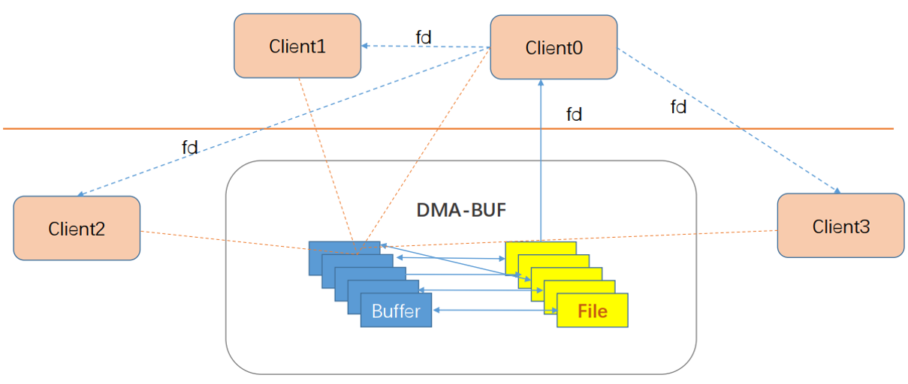


## dma buffer可以使用cpu画图吗 ----> 可以。。。ChatGPT回答

总结：

从cpu角度：

>   可以直接改写shm内存
>
>   <font color='red'>也可以直接改写dma内存</font>（映射到CPU地址空间）

从内存角度：

>   shm，只能cpu写，效率低下 --------> 使用场景：
>
>   >   （1）测试demo
>   >
>   >   （2）<font color='red'>连续画图</font>（两帧之间，不会清buffer），例子simple-touch
>
>   dma，<font color='red'>精髓在于GPU快速贴图</font>------------------> 使用场景：
>
>   >   整个buffer重写场景（两帧之间，清buffer），例子：simple-egl，以及大部分场景


**DMA (Direct Memory Access) Buffer** 本质上是用来在内存和外设之间高效地传输数据的，通常用于减少 CPU 的参与和提高数据传输速度。因此，DMA 本身的目的是使硬件能够直接访问内存，而不需要 CPU 的干预。然而，**CPU 可以使用 DMA Buffer 绘制图形**，但这通常需要一些额外的步骤和注意事项。

### **CPU 使用 DMA Buffer 绘图的场景**

如果你希望 CPU 直接操作 DMA Buffer 中的数据来绘图，通常的步骤如下：

1.  **DMA Buffer 分配**
    -   你首先需要分配一个 DMA Buffer，这通常是通过与 GPU 或其他硬件设备交互来完成的，具体取决于使用的图形硬件或框架。例如，在 Linux 系统中，可以通过 `dma-buf` 等机制来分配和共享 DMA Buffer。
2.  **映射 DMA Buffer 到 CPU 地址空间**
    -   DMA Buffer 在物理内存中分配，并且通常不能直接由 CPU 访问（因为它被设计用于外设或 GPU）。要让 CPU 访问 DMA Buffer，通常需要使用映射操作（例如通过 `mmap` 或其他特定的 API）将 DMA Buffer 映射到 CPU 的虚拟地址空间，这样 CPU 就可以直接读取和修改内存中的数据。
3.  **CPU 操作 DMA Buffer**
    -   一旦 DMA Buffer 映射到 CPU 的地址空间，CPU 可以像访问普通内存一样对其进行操作。你可以在 DMA Buffer 中存储图形数据、像素信息或任何其他需要绘制的数据。
    -   例如，如果你使用的是帧缓冲，DMA Buffer 中可以包含一个二维像素数组，CPU 可以操作这些像素并渲染图像。
4.  **更新图形数据**
    -   CPU 通过操作 DMA Buffer 内的数据来改变图形内容。绘图过程可以包括修改像素值、设置颜色、绘制线条、文本等。对于较为复杂的绘制操作，GPU 或硬件加速可能是更好的选择，但 CPU 在简单场景下完全可以操作 DMA Buffer。
5.  **同步和刷新**
    -   修改完 DMA Buffer 后，通常还需要通知相关硬件（如显示控制器）来刷新屏幕或将图形数据显示出来。通常这个过程通过某种同步机制实现，如通过标志、事件或通过与图形硬件的接口进行交互。

### **DMA Buffer 与 GPU 之间的关系**

虽然 CPU 可以直接操作 DMA Buffer，但是如果你的目标是高效地绘制图形，通常 GPU 会被用来加速图形渲染。现代图形 API（如 Vulkan、OpenGL）通常使用 DMA Buffer 与 GPU 进行高效的内存共享和渲染。此时，CPU 和 GPU 可能会共享 DMA Buffer，GPU 用于渲染，CPU 用于其他操作。

-   **如果只使用 CPU 画图**，可以直接修改 DMA Buffer 中的数据，特别是在没有使用 GPU 加速的情况下。
-   **如果使用 GPU 加速**，CPU 通常用 DMA Buffer 与 GPU 共享数据，而 GPU 会负责图形的实际渲染，CPU 则负责准备数据。

### **CPU 如何绘图**

如果只是简单的使用 CPU 在 DMA Buffer 上绘制图形，你可以通过以下方式：

1.  **帧缓冲**：DMA Buffer 中可以存储帧缓冲数据，CPU 修改这些数据来绘制像素或图形。
2.  **简单绘制**：你可以自己实现简单的绘制函数，例如在 DMA Buffer 中设置像素值，进行线条绘制等操作。
3.  **绘制 API**：在 Linux 系统中，你可以使用 `DirectFB`、`fbdev` 或 `DRM` 等接口来操作 DMA Buffer。比如使用 `mmap` 映射 DMA Buffer 后，你可以直接写入像素数据来实现绘制。

### **示例：CPU 绘制到 DMA Buffer**

假设你使用 `mmap` 映射 DMA Buffer，并通过 CPU 来绘制简单图形，代码示例如下：

```
cCopy code#include <stdio.h>
#include <stdlib.h>
#include <sys/mman.h>
#include <fcntl.h>
#include <unistd.h>
#include <stdint.h>

#define WIDTH 800
#define HEIGHT 600

// 假设DMA缓冲区文件路径为"/dev/dma_buf"
#define DMA_BUF_PATH "/dev/dma_buf"

int main() {
    int fd = open(DMA_BUF_PATH, O_RDWR);
    if (fd == -1) {
        perror("Unable to open DMA buffer");
        return -1;
    }

    // 映射 DMA Buffer 到 CPU 的地址空间
    uint32_t *dma_buffer = mmap(NULL, WIDTH * HEIGHT * sizeof(uint32_t), PROT_READ | PROT_WRITE,
                                 MAP_SHARED, fd, 0);
    if (dma_buffer == MAP_FAILED) {
        perror("Unable to mmap DMA buffer");
        close(fd);
        return -1;
    }

    // 清空 DMA Buffer (设置为黑色)
    for (int i = 0; i < WIDTH * HEIGHT; i++) {
        dma_buffer[i] = 0x000000; // 黑色
    }

    // 绘制一个简单的红色矩形
    int x_start = 100, y_start = 100, x_end = 300, y_end = 300;
    for (int y = y_start; y < y_end; y++) {
        for (int x = x_start; x < x_end; x++) {
            dma_buffer[y * WIDTH + x] = 0xFF0000; // 红色
        }
    }

    // 刷新显示（通常需要硬件刷新机制）

    // 清理资源
    munmap(dma_buffer, WIDTH * HEIGHT * sizeof(uint32_t));
    close(fd);

    return 0;
}
```

在上面的示例中，CPU 直接操作 DMA Buffer，修改其中的像素值来绘制一个红色矩形。

### **总结**

-   **是的**，CPU 可以使用 DMA Buffer 进行绘图，但这种方式一般用于简单的图形绘制。
-   如果希望高效地绘制图形，尤其是复杂的 2D/3D 图形，通常还是依赖于 GPU 来加速渲染，DMA Buffer 在这种情况下通常用来作为 CPU 和 GPU 共享内存的桥梁。


4o

##### You said:

DMA缓冲区文件路径"/dev/dma_buf"，可以自己创建嘛


###### ChatGPT said:

ChatGPT

在 Linux 系统中，`/dev/dma_buf` 并不是一个标准的设备文件路径，实际上，DMA 缓冲区通常由特定的内核子系统或驱动程序管理和分配，例如 **DRM (Direct Rendering Manager)**、**DMA-BUF (DMA Buffer Sharing)** 等框架。这些缓冲区文件通常是由系统动态创建的，而不是手动创建的。

如果你想要模拟或使用 DMA 缓冲区进行实验，以下是一些实现方式和注意事项：

------

### **1. 自己手动创建 `/dev/dma_buf`**

直接用 `mknod` 创建一个设备文件是可能的，但这只是创建了一个空的文件接口，系统并不会将其与实际的 DMA 缓冲区管理机制关联。

#### 示例：

```
bashCopy codesudo mknod /dev/dma_buf c <major> <minor>
sudo chmod 666 /dev/dma_buf
```

-   `<major>` 和 `<minor>` 是设备号，必须匹配实际的内核模块实现。
-   如果没有对应的驱动程序，这个设备文件是没有作用的。

**注意**：手动创建 `/dev/dma_buf` 一般没有意义，除非你已经有一个定制的内核模块来管理它。

------

### **2. 使用 DMA-BUF 子系统**

Linux 中的 DMA-BUF 是一个标准框架，用于在不同驱动之间共享 DMA 缓冲区。通过 DMA-BUF，你可以动态创建和共享 DMA 缓冲区，而不需要手动创建设备文件。

#### **DMA-BUF 的工作流程**

1.  由一个驱动分配 DMA 缓冲区，例如通过 `drm_mode_create_dumb()` 接口。
2.  将缓冲区导出为一个文件描述符 (File Descriptor, FD)，用户空间可以通过该 FD 访问 DMA 缓冲区。
3.  其他驱动或用户空间程序通过 FD 引入和操作缓冲区。

------

### **3. 使用 DRM Dumb Buffers**

DRM 子系统支持创建简单的 "dumb buffer"，用于在用户空间访问显存或共享缓冲区。可以通过以下步骤实现。

#### 示例代码：

使用 `libdrm` 库来创建缓冲区并映射到用户空间：

```
cCopy code#include <fcntl.h>
#include <xf86drm.h>
#include <xf86drmMode.h>
#include <sys/mman.h>
#include <stdio.h>
#include <stdlib.h>

int main() {
    int drm_fd = open("/dev/dri/card0", O_RDWR | O_CLOEXEC);
    if (drm_fd < 0) {
        perror("Failed to open /dev/dri/card0");
        return -1;
    }

    struct drm_mode_create_dumb create_req = {0};
    create_req.width = 800;   // 宽度
    create_req.height = 600;  // 高度
    create_req.bpp = 32;      // 每像素位数
    if (drmIoctl(drm_fd, DRM_IOCTL_MODE_CREATE_DUMB, &create_req) < 0) {
        perror("Failed to create dumb buffer");
        close(drm_fd);
        return -1;
    }

    struct drm_mode_map_dumb map_req = {0};
    map_req.handle = create_req.handle;
    if (drmIoctl(drm_fd, DRM_IOCTL_MODE_MAP_DUMB, &map_req) < 0) {
        perror("Failed to map dumb buffer");
        close(drm_fd);
        return -1;
    }

    void *buffer = mmap(0, create_req.size, PROT_READ | PROT_WRITE, MAP_SHARED, drm_fd, map_req.offset);
    if (buffer == MAP_FAILED) {
        perror("Failed to mmap buffer");
        close(drm_fd);
        return -1;
    }

    // 填充缓冲区 (设置为蓝色)
    memset(buffer, 0xFF, create_req.size);

    printf("Buffer mapped and modified successfully\n");

    // 释放资源
    munmap(buffer, create_req.size);
    close(drm_fd);
    return 0;
}
```

------

### **4. 定制内核模块**

如果你想创建 `/dev/dma_buf` 并实现它的功能，需要编写一个定制的内核模块。这通常包括以下步骤：

1.  分配 DMA 缓冲区（通过内核 API `dma_alloc_coherent()` 或其他方法）。
2.  实现 `open`、`mmap` 等操作，使用户空间能够访问缓冲区。
3.  在 `/dev` 下创建设备文件并关联你的驱动。

#### 示例：创建一个简单的 DMA 缓冲区驱动

这是一个基本的 Linux 驱动程序示例，可以分配 DMA 缓冲区并导出到用户空间：

```
cCopy code#include <linux/module.h>
#include <linux/fs.h>
#include <linux/mm.h>
#include <linux/dma-mapping.h>

#define DEVICE_NAME "dma_buf_example"

static void *dma_buffer;
static dma_addr_t dma_handle;
static size_t buffer_size = 4096;

static int dma_buf_open(struct inode *inode, struct file *file) {
    return 0;
}

static int dma_buf_mmap(struct file *file, struct vm_area_struct *vma) {
    return dma_mmap_coherent(NULL, vma, dma_buffer, dma_handle, buffer_size);
}

static struct file_operations fops = {
    .owner = THIS_MODULE,
    .open = dma_buf_open,
    .mmap = dma_buf_mmap,
};

static int __init dma_buf_init(void) {
    int ret;

    ret = register_chrdev(0, DEVICE_NAME, &fops);
    if (ret < 0) {
        pr_err("Failed to register character device\n");
        return ret;
    }

    dma_buffer = dma_alloc_coherent(NULL, buffer_size, &dma_handle, GFP_KERNEL);
    if (!dma_buffer) {
        unregister_chrdev(ret, DEVICE_NAME);
        pr_err("Failed to allocate DMA buffer\n");
        return -ENOMEM;
    }

    pr_info("DMA buffer allocated at physical address: %pad\n", &dma_handle);
    return 0;
}

static void __exit dma_buf_exit(void) {
    dma_free_coherent(NULL, buffer_size, dma_buffer, dma_handle);
    unregister_chrdev(0, DEVICE_NAME);
}

module_init(dma_buf_init);
module_exit(dma_buf_exit);

MODULE_LICENSE("GPL");
```

编译和加载后，会在 `/dev` 下创建设备文件（例如 `/dev/dma_buf_example`），并可以通过 `mmap` 从用户空间访问分配的 DMA 缓冲区。

------

### **总结**

1.  **无法直接创建 `/dev/dma_buf`**，除非你有一个内核驱动程序来管理它。
2.  推荐使用 **DRM 子系统** 或 **DMA-BUF 框架** 来分配和管理 DMA 缓冲区。
3.  如果需要完整控制，可以实现一个自定义内核模块来创建和管理 DMA 缓冲区。


4o

##### You said:

 mmap可以将dma映射到CPU 地址空间，CPU可以进行操作。如果有Afbc，会影响吗


###### ChatGPT said:

ChatGPT

是的，**如果启用了 AFBC (Arm Frame Buffer Compression)**，会影响 CPU 操作 DMA 缓冲区的数据。AFBC 是一种专门针对 GPU 加速场景的帧缓冲压缩技术，用于减少带宽消耗和功耗，且主要服务于图形硬件操作。如果在使用 AFBC 的情况下让 CPU 直接操作 DMA 缓冲区，你需要注意以下几个问题：

------

### **1. 什么是 AFBC？**

AFBC 是 Arm Mali GPU 和显示处理器 (DPU) 中广泛使用的一种压缩技术：

-   它将帧缓冲的数据以一种块状压缩格式存储，每个块可以单独解压缩。
-   AFBC 通常在硬件渲染和显示链路中使用，CPU 并不直接理解这种压缩格式。

------

### **2. AFBC 对 CPU 操作 DMA 缓冲区的影响**

#### **a. 数据的压缩格式**

AFBC 使用压缩存储数据，因此当 DMA 缓冲区启用了 AFBC 时，CPU 无法直接以常规的方式（例如像访问普通像素数据那样）操作它。压缩的格式需要通过硬件或专门的解码器来解码。

-   如果 CPU 操作启用了 AFBC 的 DMA 缓冲区内容，很可能导致数据损坏或产生无法预期的结果。
-   CPU 对 AFBC 数据的操作通常需要进行解码和重新编码（解压后修改，再压缩存储），这会引入额外的开销。

#### **b. 数据对齐和块布局**

AFBC 的数据是按块对齐存储的，每个块都有特定的元数据（Meta Data），描述了该块的像素数据压缩情况。因此，即使 CPU 能访问到内存区域，也需要解码元数据和块数据的结构才能正确理解和修改内容。

------

### **3. 如何处理 AFBC DMA 缓冲区？**

如果你的系统启用了 AFBC，并且你希望通过 CPU 操作 DMA 缓冲区，有以下几种方法：

#### **a. 禁用 AFBC**

如果你需要 CPU 直接操作 DMA 缓冲区，可以禁用 AFBC，这样帧缓冲就会以未压缩的格式存储。通常可以通过以下方式禁用：

-   在分配帧缓冲时，明确指定不启用 AFBC。例如，使用 DRM Dumb Buffers 通常默认不会启用 AFBC。
-   修改相关驱动程序的设置，要求帧缓冲输出为未压缩格式。

#### **b. 使用 GPU 或硬件进行操作**

如果 AFBC 必须启用，建议使用 GPU 或其他硬件来完成需要的绘图或数据修改操作，因为它们能够直接理解和操作 AFBC 格式的数据，而不会产生数据错误。

#### **c. 解压缩后操作**

在某些场景下，你可以将 AFBC 格式的帧缓冲解压缩到 CPU 可操作的平面（Plane）格式，完成修改后再重新压缩为 AFBC 格式。这通常需要 GPU 或其他硬件支持。例如：

-   使用特定的 API（例如 OpenGL 或 Vulkan）将 AFBC 数据解码到标准的 RGBA 格式供 CPU 操作。
-   完成操作后，再通过 API 将数据重新压缩为 AFBC。

#### **d. 使用映射工具或驱动支持**

某些平台或驱动可能提供工具或库，用于直接访问和操作 AFBC 数据。检查你的硬件和驱动支持是否有这样的功能。

------

### **4. 使用 AFBC 数据的注意事项**

-   **性能问题**：如果你频繁在 CPU 和 AFBC 压缩之间进行解码和重新编码操作，会显著增加处理时间和资源消耗。
-   **硬件限制**：并非所有硬件都支持解压 AFBC 数据，因此你可能需要特定的 GPU 或显示处理器。
-   **数据损坏风险**：直接修改 AFBC 缓冲区内容而未正确解压和处理，可能会导致显示异常或程序崩溃。

------

### **5. 示例：禁用 AFBC 的 DMA Buffer 映射**

假设你使用 DRM Dumb Buffers，并希望分配一个未压缩的缓冲区以供 CPU 操作：

```
cCopy code#include <fcntl.h>
#include <xf86drm.h>
#include <xf86drmMode.h>
#include <sys/mman.h>
#include <stdio.h>
#include <stdlib.h>

int main() {
    int drm_fd = open("/dev/dri/card0", O_RDWR | O_CLOEXEC);
    if (drm_fd < 0) {
        perror("Failed to open /dev/dri/card0");
        return -1;
    }

    struct drm_mode_create_dumb create_req = {0};
    create_req.width = 800;   // 宽度
    create_req.height = 600;  // 高度
    create_req.bpp = 32;      // 每像素位数
    if (drmIoctl(drm_fd, DRM_IOCTL_MODE_CREATE_DUMB, &create_req) < 0) {
        perror("Failed to create dumb buffer");
        close(drm_fd);
        return -1;
    }

    struct drm_mode_map_dumb map_req = {0};
    map_req.handle = create_req.handle;
    if (drmIoctl(drm_fd, DRM_IOCTL_MODE_MAP_DUMB, &map_req) < 0) {
        perror("Failed to map dumb buffer");
        close(drm_fd);
        return -1;
    }

    void *buffer = mmap(0, create_req.size, PROT_READ | PROT_WRITE, MAP_SHARED, drm_fd, map_req.offset);
    if (buffer == MAP_FAILED) {
        perror("Failed to mmap buffer");
        close(drm_fd);
        return -1;
    }

    // 填充缓冲区 (设置为蓝色)
    memset(buffer, 0xFF, create_req.size);

    printf("Buffer mapped and modified successfully\n");

    // 释放资源
    munmap(buffer, create_req.size);
    close(drm_fd);
    return 0;
}
```

------

### **总结**

1.  **AFBC 会影响 CPU 操作 DMA 缓冲区**，因为数据存储是压缩的，CPU 无法直接操作。
2.  如果需要 CPU 操作：
    -   禁用 AFBC，使用未压缩的帧缓冲。
    -   使用硬件加速完成绘图操作。
    -   解压缩数据后在 CPU 上操作，然后重新压缩。
3.  如果 AFBC 必须启用，推荐尽量使用 GPU 或其他硬件完成操作，避免复杂的解码和重新编码步骤。


## 参考


https://blog.csdn.net/weixin_42136255/article/details/129722675           DMABuffer剖析


## TODO:从weston角度，正常情况下  wl_buffer 来源：

> 1、shm， client创建？
>
> 2、dma的fd，转化


## dma buf内存对齐


 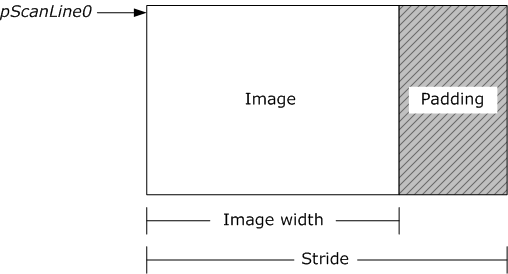

[图来源见](https://blog.csdn.net/lkjxcj3096/article/details/103744376#:~:text=3.gbm-,%E4%B8%AD%E7%9A%84%E4%B8%80%E4%BA%9B%E6%A6%82%E5%BF%B5,-%E8%B7%A8%E8%B7%9D%2Dstride)

注意：高度方向，也有内存对齐


Q:simple-egl宽度是250，但是在viewer上查看，只有选择256，才显示正确。 这是因为内存对齐？

A: Gpu 对dma buf 有对齐要求，好像是32


结论：在读写buffer时，**buffer的宽不能用width，而是stride**！！！！！！！！


# 不重要----栅栏(Fence) , GPU与CPU同步的一种方式

-<font color='red'>fence不重要：</font>

>   1、因为只是同步的一种方式 
>
>   2、所有的同步都不会有实质的影响
>
>   3、**<font color='red'>所有的同步，可以用delay替代（fence亦如此）</font>**------------------fence可以舍弃掉

**技巧：**

>   开发时，应该先用delay方式，**验证没有问题了 ---------> 才改为fence**
>
>   因为 delay是CPU的方式，fence机制太复杂

## 0层图

从两个函数说起：

>   glFlush() ： 强制将**当前context中的所有命令**送入GPU执行   +   不会等待，立即返回，CPU继续执行
>
>   glFinish()： 。。。。。。。。。。。。。。。。。。。。 +  等待GPU执行完所有命令，才会返回（CPU阻塞）

-------------> <font color='red'>glFinish()弊端很大，CPU与GPU之间完全同步</font>。

​					<font color='red'>而 glFlush()，CPU与GPU完全异步</font>    ----------> 不安全，<font color='red'>fence机制 ，就是对glFlush()的补救</font>


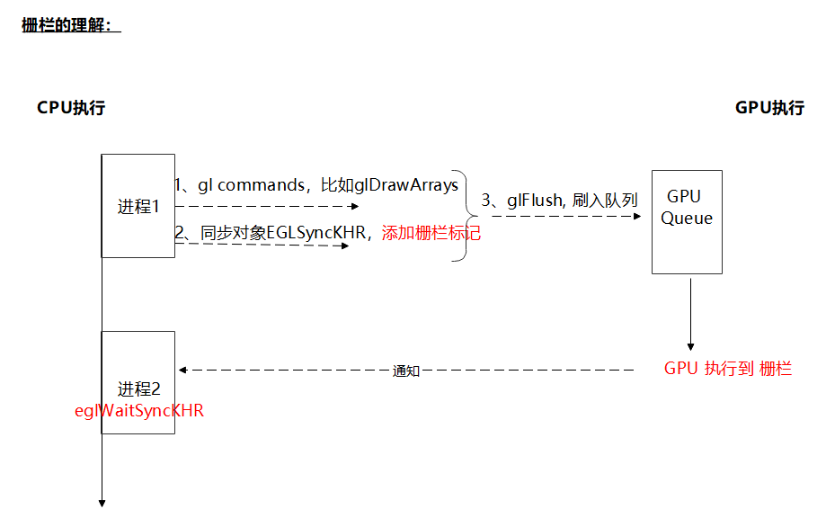

《weston.eddx》

结论：

>   1、<font color='red'>栅栏fence的本质：</font>
>
>   向cmd队列添加一个栅栏，<font color='red'>与buffer没有任何关系！！！！！</font>
>
>   2、产生<font color='red'>时间关系</font>的点在于：<font color='red'>栅栏执行完 = cmd执行完 = gpu真正绘制完 = buffer使用完</font>
>
>   3、<font color='red'>空间上没有任何关系</font>：一个fence点，可以对应一批buffer。比如weston侧合成，插入fence，一个fence，对应多个buffer！！！！（实际上，weston合成也是产生了多个fence！！！！，是一对一的！！！）
>
>   4、空间上的关系，产生于  client 与 server之间 调用时机
>
>   疑问，TODO: gpu执行cmd，是并行，为啥有cmd Queue？
>
>   5、本质上，没有acquirefence与 releaseFence
>
>   ​    只有插入fence 与等待fence


Fence字面意思：

> fence ----- 栅栏。。。  ---------> **<font color='red'>是GPU的command line 屏障</font>**！！！！！！
>
>   （扩展：handler里也有msg的屏障）


问题来源：

why-------CPU与 GPU的异步造成的：

> 1、从代码调用角度-----------opengl接口调用：cpu 没有等GPU 执行完，就继续执行了
>
> > 仅仅是把GL command命令放在本地的command buffer里
>
> 所以，<font color='red'>CPU 从client传递fd给 weston，这块buffer内容是未知的（可能GPU已经画完，也可能GPU还在画，也有可能GPU还没开始画？）</font>
>
> 
>
> 2、从关系角度:fence是buffer的使用权（约等于buffer_release）。。所以：
>
> （1）与buffer高度重合
>
> （2）如果只有CPU画图，那么就不需要fence ---------- buffer_release 解决了CPU对 buffer的使用冲突
>
> （3）fence的使用同 buffer：
>
> > ​         传递buffer的时候，传递fence
> >
> > ​         画buffer的时候，等fence
> >
> > 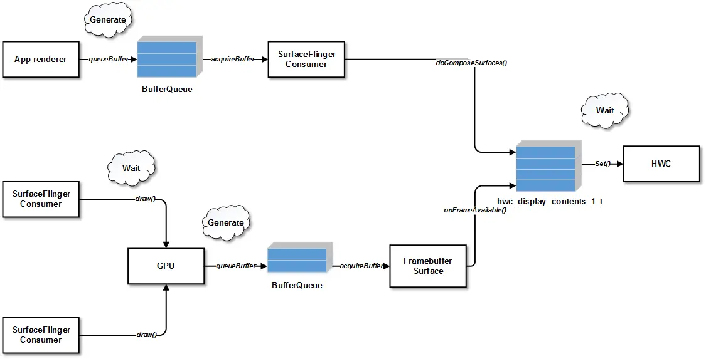
> >
> >  [图](https://www.jianshu.com/p/a7261bc82bca#:~:text=%E7%9A%84%E4%BD%BF%E7%94%A8%E6%B5%81%E7%A8%8B%EF%BC%9A-,acquireFence%E7%9A%84%E4%BD%BF%E7%94%A8%E6%B5%81%E7%A8%8B,-%E5%BD%93App%E7%AB%AF)
>
> 3、从**CPU阻塞**角度：**fence是一种CPU延迟的阻塞的方法**
>
> ​      《见how》
>
> 4、从  硬件buffer 的冲突 角度上：
>
> ​     <font color='red'>CPU使用buffer的冲突（ = 进程与进程之间同步）</font> ：~~通过进程之间同步 buffer_release  解决~~
>
> ​     <font color='red'>  CPU1与GPU之间，抢占 硬件buffer：</font> fence机制
>
> 5、从级别来看：
>
> > fence跟着buffer走，但是可见范围是整个系统 & 各个进程
> >
> > 但是代码角度：产生 fence，释放fence，都是CPU的代码？  TODO:  
>
> 6、从异步/同步角度：fence是CPU与GPU的一种同步方案（类似于锁、callback）
>
> 

进一步抽象：**所有同步/异步问题的根源在于**  “两个”对<font color='red'>硬件资源</font>的抢占造成的

> CPU1与CPU2之间，抢占 硬件buffer
>
> CPU1与GPU之间，抢占 硬件buffer
>
> 其他：
>
> > 两个进程，抢占  硬件CPU资源


how-----<font color='red'>解决方法：</font>

> 方法一：CPU等待这些命令运行完-------即CPU侧glFinish()   TODO: simple-egl里没有调用，为啥？
>
> ​              <font color='red'> 阻塞在当前frame1 使用  GPU画 buffer1  这个时间点！！！！</font>
>
> 方法二：Fence机制。
>
> ​           <font color='red'>    在绘制frame2的图时，才阻塞，等待buffer1  的fence  ！！！！</font>     -------->  TODO: buffer 1 还是 buffer2？


fence，在各个系统中的应用：

> 1、Android系统中：App中的renderer   与  SurfaceFlinger。 TODO: [图](https://blog.csdn.net/wjky2014/article/details/141907903#:~:text=%E6%8B%A5%E6%9C%89%E4%BD%BF%E7%94%A8%E6%9D%83%E3%80%82-,%E4%B8%80%E4%B8%AA%E7%AE%80%E5%8C%96%E7%9A%84%E6%A8%A1%E5%9E%8B%E4%BE%8B%E5%A6%82%E4%BB%A5%E4%B8%8B%EF%BC%9A,-Fence%E7%9A%84%E7%AE%80%E5%8C%96)
>
> TODO: Android的hwc 与 drm呢
>
> ​     https://blog.csdn.net/bruce_zhang123/article/details/124848001  Android SurfaceFlinger中Fence机制--个人理解整理
>
> 2、drm中：drm之dma-fence       https://blog.csdn.net/zhexingsunba/article/details/128510885   drm之dma-fence介绍     
>
> ​                              TODO: [图](https://blog.csdn.net/zhexingsunba/article/details/128510885#:~:text=%E6%8A%8Abuffer%E7%9A%84%E6%8E%A7%E5%88%B6%E6%9D%83%E6%B5%81%E8%BD%AC%E7%94%BB%E7%9A%84%E7%89%B9%E5%88%AB%E5%A5%BD%EF%BC%8C%E7%9B%B4%E6%8E%A5%E5%BC%95%E7%94%A8)
>
> 3、weston中：
>
> 结论：[参考 Fence实现的层级关系](https://blog.csdn.net/bruce_zhang123/article/details/124848001#:~:text=driver%20%E5%B1%82%EF%BC%9A-,fence%E5%85%B6%E5%AE%9E%E6%98%AF%E7%A1%AC%E4%BB%B6%E7%9A%84%E4%BF%9D%E6%8A%A4%E6%9C%BA%E5%88%B6,-%EF%BC%8C%E6%89%80%E6%9C%89%E7%9C%9F%E6%AD%A3%E7%9A%84)
>
> > （1）fence最终的实现就是drm 驱动的实现（或者硬件实现）
> >
> > （2）上层，都是封装的接口
> >
> > （3）扩展： EGL的扩展----------------同步对象的扩展KHR_fence_sync，**自然是用于EGL的command**
> >
> > （4）扩展：Android的扩展------------ANDROID_native_fence_sync
> >
> > ​                                   Android还进一步丰富了Fence的software stack：~~C++ Fence类位于/frameworks/native/libs/ui/Fence.cpp~~
> >
> > ​                                                                                                                 ~~C的libsync库位于/system/core/libsync/sync.c~~
> >
> > ​                                                                                                                  ~~Kernel driver部分位于/drivers/base/sync.c~~
> >
> > [参考 Android 图形显示系统（十三）Fence同步机制](https://www.jianshu.com/p/a7261bc82bca)


[从buffer角度，看Android的整个显示流程](https://blog.csdn.net/wjky2014/article/details/141907903#:~:text=%E6%98%AF%E6%B6%88%E8%B4%B9%E8%80%85%E3%80%82-,%E6%95%B4%E4%B8%AA%E5%A4%A7%E8%87%B4%E6%B5%81%E7%A8%8B%E5%A6%82%E5%9B%BE,-%EF%BC%9A)

> 非Overlay的层 --------  两个生产消费者模型，结构一模一样。[图](https://blog.csdn.net/wjky2014/article/details/141907903#:~:text=%E4%BD%9C%E4%B8%BA%E5%85%B1%E4%BA%AB%E5%86%85%E5%AD%98%E3%80%82-,GraphicBuffer%E6%A8%A1%E5%9E%8B,-%E5%9B%A0%E4%B8%BA%E6%9C%8D%E5%8A%A1%E5%92%8C)
>
> > ​                                  acquireFence的使用流程，[图](https://blog.csdn.net/wjky2014/article/details/141907903#:~:text=%E7%9A%84%E4%BD%BF%E7%94%A8%E6%B5%81%E7%A8%8B%EF%BC%9A-,acquireFence%E7%9A%84%E4%BD%BF%E7%94%A8%E6%B5%81%E7%A8%8B,-%E5%BD%93App%E7%AB%AF)
> >
> > ​								  releaseFence的使用流程，[图](https://blog.csdn.net/wjky2014/article/details/141907903#:~:text=%E7%9A%84%E4%BD%BF%E7%94%A8%E6%B5%81%E7%A8%8B%EF%BC%9A-,releaseFence%E7%9A%84%E4%BD%BF%E7%94%A8%E6%B5%81%E7%A8%8B,-%E5%89%8D%E9%9D%A2%E6%8F%90%E5%88%B0%E5%90%88%E6%88%90)
>
> Overlay的层 -----------  一个生产者消费者模型，APP ---> HWC([SF把这些层相应的acquireFence传到HWC中](https://www.jianshu.com/p/a7261bc82bca#:~:text=%E4%B8%8D%E9%A1%BB%E8%A6%81%E7%BB%8F%E8%BF%87GPU%EF%BC%8C%E9%82%A3%E5%B0%B1%E9%A1%BB%E8%A6%81%E6%8A%8A%E8%BF%99%E4%BA%9B%E5%B1%82%E7%9B%B8%E5%BA%94%E7%9A%84acquireFence%E4%BC%A0%E5%88%B0HWC%E4%B8%AD))

 

## weston中 上层的fence

### 0层图------fence的pingpong

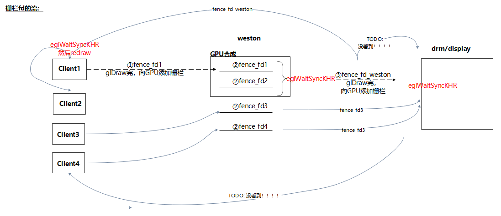

TODO: acquire buffer流程    &  release buffer流程！！！！！！

​			acquire_fence                      fenced_release

​			start draw（waitFence）<------   after glDraw 插入fence

结论：

>   1、由图可见，<font color='red'>栅栏在各个进程之间，也一定是pingpong的</font>！！！！！！！！
>
>   2、栅栏是GPU的概念，只有插入与释放。 
>
>   -<font color='red'> acquire_fence与 fenced_release，是业务层的概念</font>   ，是wayland协议的概念：weston获取 client的栅栏，weston侧释放


与安卓无异：

>   [Android 12(S) 图像显示系统 - GraphicBuffer同步机制 - Fence](https://juejin.cn/post/7099751832381030436)
>
>   比如1： 当GPU完成合成时就意味着这些图层的缓存数据就不再被使用了，因此client target acquire fence作为release fence来同步这些图形缓存的释放；client target acquire fence即表示GPU合成完了，（1）HWC可以消费了，（2）也意味着相关Layer的图像缓存可以释放了。
>
>   比如2：
>
>   [合成阶段等待acquireFence 触发后再去处理数据](https://juejin.cn/post/7099751832381030436)
>
>   比如3：
>
>   [综上，HWC进行最后合成处理的前提是CLIENT图层层的acquireFence及FramebufferTarget的acquireFence都被触发](https://juejin.cn/post/7099751832381030436)
>
>   

### client 1绘制完，插入栅栏fd1，并 给到weston：

```java
// simple-dmabuf-egl.c
└─ redraw------client
    ├─ buffer = window_next_buffer(window); // 【获取client认为空闲的buffer】：使用fence，非真正空闲
    ├─ // 绘制之前 等GPU release_fence
    ├─ wait_for_buffer_release_fence(buffer);
    │   └─ d->egl.wait_sync(d->egl.display, sync, 0);  // 【唯一目的：通过server给client的 release_fence_fd，等GPU释放fence】【release_fence_fd】
    ├─ .
    ├─ render(window, buffer); // 绘制
    ├─ .
    ├─ // 绘制之后 法一： 【fence延迟阻塞方法：要求GPU acquire_fence】
    ├─ EGLSyncKHR sync = d->egl.create_sync
    ├─ glFlush() // 必要的，确保所有 OpenGL 操作都已提交到 GPU
    ├─ fd = d->egl.dup_native_fence_fd(d->egl.display, sync);  // 【client从openGL拿到fd】 TODO:为啥不是buffer级别的？
    ├─ zwp_linux_surface_synchronization_v1_set_acquire_fence(fence_fd);
    │   └─ linux_surface_synchronization_set_acquire_fence -------------server侧
    │       └─ fd_update(&surface->pending.acquire_fence_fd, fd); // 【client获取的fd赋值给server侧的pending，等待client的wl_surface_commit】----->TODO: 干啥了？
    ├─ // 添加buffer_release_listener?
    ├─ zwp_linux_surface_synchronization_v1_get_release
    ├─ zwp_linux_buffer_release_v1_add_listener(buffer->buffer_release, &buffer_release_listener, buffer);
    ├─
    ├─ // 绘制之后 法二：【client阻塞做法 ------> 不需要fence！！！！！】
    ├─ glFinish() 【client的CPU一直阻塞在这里,，不进行下面的wl_surface_attach、wl_surface_commit】
    ├─ .
    ├─ .
    ├─ -------------------------------------------------------------------------------------------------
    ├─ wl_surface_attach
    ├─ wl_surface_damage
    ├─ wl_callback_add_listener(frame_callback)
    └─ wl_surface_commit
        └─ weston_surface_commit-------------server侧
            └─ weston_surface_commit_state
                └─ /* zwp_surface_synchronization_v1.set_acquire_fence */ ---> acquire_fence
                    ├─ fd_move(&surface->acquire_fence_fd,  // 【唯一目的！！！：最终 acquire_fence_fd 给了server侧的surface】
                    │   └─ &state->acquire_fence_fd);
                    ├─ /* zwp_surface_synchronization_v1.get_release */       ---> release_fence
                    ├─ weston_buffer_release_move(&surface->buffer_release_ref,
                    │   └─ &state->buffer_release_ref);
                    └─ weston_surface_attach(surface, state->buffer);

```

总结：

【acquire_fence_fd】 流程：

>   client侧：插入栅栏，并拿到fd
>
>   client侧：wl_surface_commit，传递fence_fd给server
>
>   server侧：paint时，然后等待GPU释放fence

%accordion%hideContent%accordion%


```java
fence_fd来源：

redraw------client
	buffer = window_next_buffer(window); // 【获取client认为空闲的buffer】：使用fence，非真正空闲
	// 绘制之前 等GPU release_fence
	wait_for_buffer_release_fence(buffer);
		d->egl.wait_sync(d->egl.display, sync, 0);  // 【唯一目的：通过server给client的 release_fence_fd，等GPU释放fence】【release_fence_fd】
	
	render(window, buffer); // 绘制
	
	// 绘制之后 法一： 【fence延迟阻塞方法：要求GPU acquire_fence】
	EGLSyncKHR sync = d->egl.create_sync
	glFlush() // 必要的，确保所有 OpenGL 操作都已提交到 GPU
	fd = d->egl.dup_native_fence_fd(d->egl.display, sync);  // 【client从openGL拿到fd】 TODO:为啥不是buffer级别的？
	zwp_linux_surface_synchronization_v1_set_acquire_fence(fence_fd);
		linux_surface_synchronization_set_acquire_fence -------------server侧
			fd_update(&surface->pending.acquire_fence_fd, fd); // 【client获取的fd赋值给server侧的pending，等待client的wl_surface_commit】----->TODO: 干啥了？
	// 添加buffer_release_listener?
	zwp_linux_surface_synchronization_v1_get_release
	zwp_linux_buffer_release_v1_add_listener(buffer->buffer_release, &buffer_release_listener, buffer);
	
	// 绘制之后 法二：【client阻塞做法 ------> 不需要fence！！！！！】
	glFinish() 【client的CPU一直阻塞在这里,，不进行下面的wl_surface_attach、wl_surface_commit】
	.
	.
	-------------------------------------------------------------------------------------------------
	wl_surface_attach
	wl_surface_damage
	wl_callback_add_listener(frame_callback)
	wl_surface_commit
		weston_surface_commit-------------server侧
			weston_surface_commit_state
					/* zwp_surface_synchronization_v1.set_acquire_fence */ ---> acquire_fence 
					fd_move(&surface->acquire_fence_fd,  // 【唯一目的！！！：最终 acquire_fence_fd 给了server侧的surface】
						&state->acquire_fence_fd);
					/* zwp_surface_synchronization_v1.get_release */       ---> release_fence
					weston_buffer_release_move(&surface->buffer_release_ref,
								   &state->buffer_release_ref);
					weston_surface_attach(surface, state->buffer);
```


%/accordion%

### 若GPU合成，weston等待 传过来的栅栏fd1触发


```java
├─ // weston侧：合成时
├─ gl_renderer_repaint_output
└─ repaint_views
    ├─ draw_paint_node
    │   ├─ ensure_surface_buffer_is_ready---------------确认view对应的buffer状态----------
    │   │   ├─ 1、if (surface->acquire_fence_fd < 0) return 0 // 如果没有要求fence，直接返回。。。何时要求的？client侧？？？？标记buffer
    │   │   └─ 2、 attribs[1] = dup(surface->acquire_fence_fd);
    │   │       ├─ sync = gr->create_sync(gr->egl_display, EGL_SYNC_NATIVE_FENCE_ANDROID, attribs); // 创建等待fence的EGL对象
    │   │       └─ wait_ret = gr->wait_sync(gr->egl_display, sync, 0);                             // 【唯一目的完成2：eglWaitSyncKHR：等待fence，CPU阻塞点！！！！】
    │   └─ repaint_region // 绘制
    ├─ go->render_sync = create_render_sync(gr); // 【eglCreateSyncKHR weston添加栅栏fence_fd_weston】
    ├─ eglSwapBuffers（包含了）
    └─ update_buffer_release_fences
        ├─ if (view->plane != &compositor->primary_plane) continue; // TODO: 自然，走overlay的，不给fd_weston
        └─ for 循环 weston_view
            └─ fence_fd = gl_renderer_create_fence_fd(output); // 这里从之前的栅栏对象EGLSyncKHR 【产生不同的fence_fd -----> 给各个client】

```


%accordion%hideContent%accordion%


```java
// weston侧：合成时
gl_renderer_repaint_output 
repaint_views
	draw_paint_node
		ensure_surface_buffer_is_ready---------------确认view对应的buffer状态----------
			1、if (surface->acquire_fence_fd < 0) return 0 // 如果没有要求fence，直接返回。。。何时要求的？client侧？？？？标记buffer
			2、 attribs[1] = dup(surface->acquire_fence_fd);
				sync = gr->create_sync(gr->egl_display, EGL_SYNC_NATIVE_FENCE_ANDROID, attribs); // 创建等待fence的EGL对象
				wait_ret = gr->wait_sync(gr->egl_display, sync, 0);                             // 【唯一目的完成2：eglWaitSyncKHR：等待fence，CPU阻塞点！！！！】
		repaint_region // 绘制
	go->render_sync = create_render_sync(gr); // 【eglCreateSyncKHR weston添加栅栏fence_fd_weston】
	eglSwapBuffers（包含了）
	update_buffer_release_fences
        if (view->plane != &compositor->primary_plane) continue; // TODO: 自然，走overlay的，不给fd_weston
		for 循环 weston_view
			fence_fd = gl_renderer_create_fence_fd(output); // 这里从之前的栅栏对象EGLSyncKHR 【产生不同的fence_fd -----> 给各个client】
```


%/accordion%


 

### weston合成后插入自己的fence_weston, 并给到client

合成后插入自己的fence_weston：见上

 TODO:  fence_fd_weston，何时给到client？？？

```java
触发时机很多，TODO:找最常见的！！！！！
①drm_output_try_paint_node_on_plane  -----> 走overlay的，下一帧立即释放
①weston_surface_commit_state
weston_buffer_release_destroy
	zwp_linux_buffer_release_v1_send_fenced_release
		--------------client进程----------------------
		zwp_linux_buffer_release_v1_listener
			buffer_fenced_release
				buffer->release_fence_fd = fence;  // 【完美的循环：拿到weston的栅栏！！！，后面client的redraw，需要等这个栅栏触发！！！】
```

client端也要等 fence触发，weston_fence


### weston提交给drm的fence  ----TODO

1、承载在 plane里：apply_

2、plane的fence来源：（本质都是来源buffer）

 （1）走overlay，自然是view的buffer

```java
drm_output_try_paint_node_on_plane
    state->in_fence_fd = ev->surface->acquire_fence_fd;
      <------来源：见上，client传过来的
          
最终给到drm
//kms.c
drm_output_apply_state_atomic
     plane_add_prop(WDRM_PLANE_IN_FENCE_FD, plane_state->in_fence_fd);

```

 （2）	TODO:  验证！！！！走primary的，自然是gbm_surface对应buffer的？？？？？
        fence_fd:-1


### EGL扩展----eglDupNativeFenceFDANDROID 与 eglCreateSyncKHR、eglClientWaitSyncKHR

生成一个同步对象：eglCreateSyncKHR()

>   为了跨进程传递，同步对象转化为一个fd：~~eglDupNativeFenceFDANDROID（Android进行的扩展~~）
>
>   >   [**这个扩展相当于让CPU中有了GPU中同步对象的句柄**](https://juejin.cn/post/7099751832381030436#:~:text=%E8%BF%99%E4%B8%AA%E6%89%A9%E5%B1%95%E7%9B%B8%E5%BD%93%E4%BA%8E%E8%AE%A9CPU%E4%B8%AD%E6%9C%89%E4%BA%86GPU%E4%B8%AD%E5%90%8C%E6%AD%A5%E5%AF%B9%E8%B1%A1)
>   >
>   >   转fd的原因：~~可以binder跨进程传递~~！

等待（另一个进程cpu）：eglClientWaitSyncKHR


同步对象的作用：

>   [这个同步对象是往GL command队列中插入的一个特殊操作，当执行到它时，会发出信号指示队列前面的命令已全部执行完毕](https://juejin.cn/post/7099751832381030436)

参考：[Android 12(S) 图像显示系统 - GraphicBuffer同步机制 - Fence](https://juejin.cn/post/7099751832381030436)


### 相关问题

drm如果没有等overlay上 view的 栅栏，会造成<font color='red'>偶现退帧现象</font>。

>   分析：client没画完，就被display拿来上屏了

 


### 次要关键词搜索：

>   FENCE_
>
>   WDRM_PLANE_IN_FENCE_FD  
>
>   state->in_fence_fd = ev->surface->acquire_fence_fd;  


## why---存在的必要性

同步机制：

>   vsync------跨空间（进程与进程之间、内核与用户空间之间）
>
>   fence------跨空间 + 跨设备（两个设备的驱动之间、驱动与进程之间）
>
>   参考：[深入理解Android图形系统](https://cloud.tencent.com/developer/article/2127018#:~:text=ION%E5%88%86%E9%85%8D%E5%86%85%E5%AD%98%E3%80%82-,ION%E6%98%AF%E5%BB%BA%E7%AB%8B%E5%9C%A8,-DMA%2DBUF%E7%9A%84)

可见：<font color='red'>DMA-BUF 与 Fence机制关系密切！！！都是跨设备</font>

位置：

>   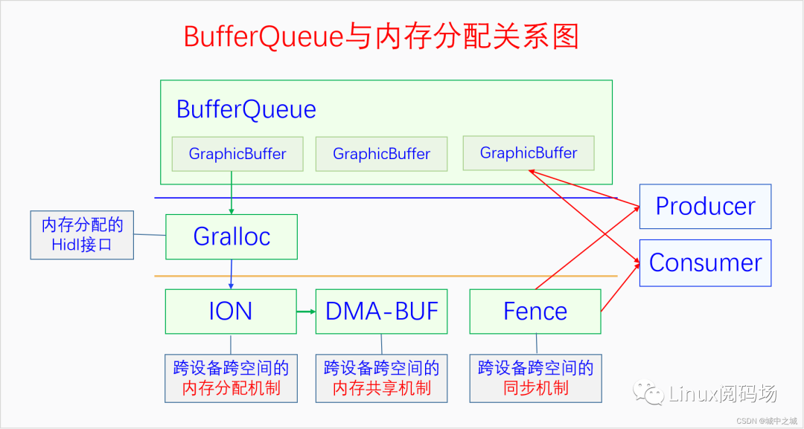


## 参考：

> ~~https://blog.csdn.net/wjky2014/article/details/141907903  Android 显示 Fence 机制  ---> 好文~~
>
> https://www.jianshu.com/p/a7261bc82bca     Android 图形显示系统（十三）Fence同步机制    ---> 好文
>
> http://tangzm.com/blog/?p=167     Android中的EGL扩展


## buffer之fence

### 初步认识fence：

>   1、从<font color='red'>同步模型</font>的角度：解决异步的方式（与java的wait/notify、C++中条件变量的wait/signal的语义是一样的）
>
>   ​                                        **不同的是**：
>
>   >   ​														fence跨空间（指进程与进程之间、内核与用户空间之间）跨设备（两个设备的驱动之间或者驱动与进程之间，实际上就是指<font color='red'>CPU与GPU之间</font>）
>   >
>   >   ​                                                         java的wait/notify  只是跨线程
>
>   ​                                       
>
>   2、从buffer的角度：<font color='red'>表征dma_buffer的使用</font>权
>
>   3、从实现角度：**就是信号量**


-who---------<font color='red'>fence 主要用于dma_buffer</font>（shm主要是buffer_release来释放）-----------> [参考](https://www.51cto.com/article/717713.html#:~:text=%E5%AE%9E%E7%8E%B0%E4%BA%86Fence%EF%BC%8C-,%E5%AE%83%E4%B8%BB%E8%A6%81%E6%98%AF%E7%BB%99DMA%2DBUF%E7%94%A8%E7%9A%84,-%EF%BC%8C%E6%89%80%E4%BB%A5%E5%AE%83%E4%B9%9F%E6%98%AF)     这也是fence跨空间跨设备的根源（因**为dma_buffer是跨空间跨设备的**）

>   shm的使用：    client ---(shm)--->weston ------(dma_buffer,primary)-----> display
>
>   dma的使用：  client ---(dma1)--->weston ------(dma1)-----> display
>
>   

where1 ----------fence实现在内核中 TODO 

where2  -----------应用

>   
>
>   
>
>   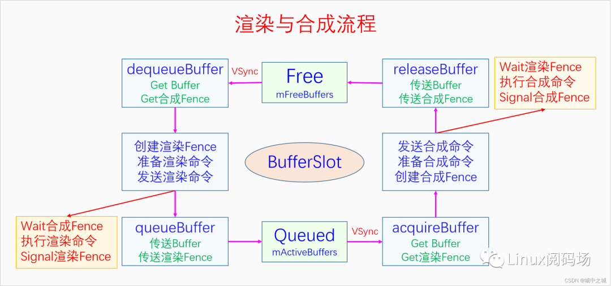

how -------------fence的实现：

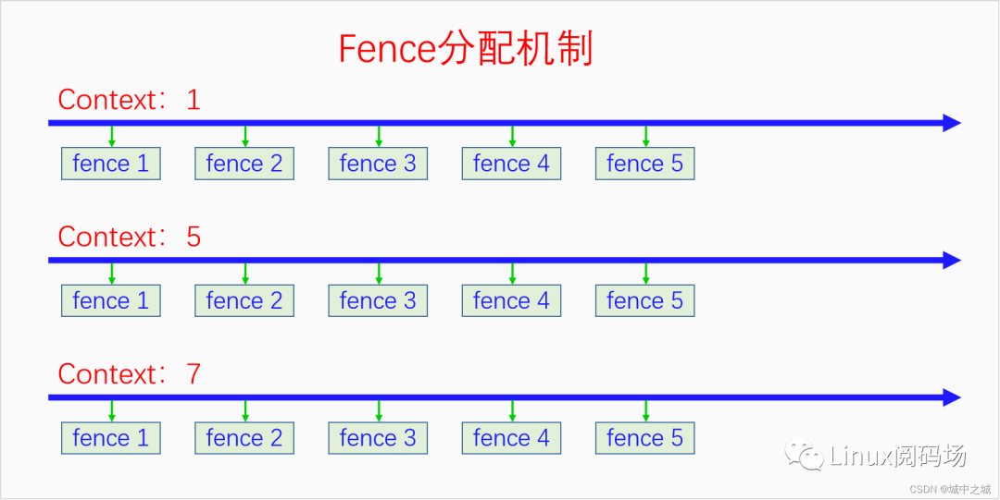


### fence的 创建------以simple-dmabuf-egl为例

fence的 fd的创建：

```java
gl_renderer_create_fence_fd
	fd = gr->dup_native_fence_fd(gr->egl_display, go->render_sync); 
	// EGL的PFNEGLDUPNATIVEFENCEFDANDROIDPROC
```


## display的fence


```java
// kms.c
drm_output_apply_state_atomic() {
    if (plane_state->in_fence_fd >= 0) {
        ret |= plane_add_prop(req, plane,
                      WDRM_PLANE_IN_FENCE_FD,
                      plane_state->in_fence_fd);
    }    
}
```


### 补充初步认识fence：

从退帧问题来看，完全可以不要fence：

CPU是大调，fence是微调！！！！！(cpu的commit、callback是必要的)

> ​                    fence是极限情况下的微调!!!!!!!!! 不要照样跑
>
> ​					buffer release：CPU画的情况下是bufferRelease；GPU画的情况下，是fence


## TODO: Linux dma-fence demo--从内核看fence

https://www.cnblogs.com/yaongtime/p/14594567.html    

```java
完整代码：https://gitee.com/yaongtime/dma-fence-demo.git
 
参考：https://www.kernel.org/doc/html/latest/driver-api/dma-buf.html#dma-fences
```


# 时间 -----从timeLine角度看图形

## 单个屏幕 timeLine

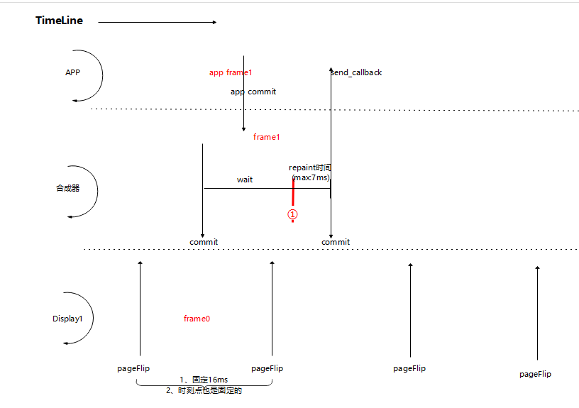

下次repaint时刻①的计算公式：

```java
【pageFlip --> weston_output_finish_frame】
一帧结束，自然计划发下一班车：-----------TODO:需要物理级的证明！！！！！
 
下一班车计划发车时间	 =	 当前车子回来的时间	  +	  16ms发车周期			   -	 预计的行车时间7ms（估算值）
output->next_repaint	output->frame_time   output->current_mode->refresh	   compositor->repaint_msec
							stamp				 （屏幕级）
 时刻①             =     当前时刻        + （16ms                    -       预计的repaint_time(源代码中7ms)）
```


```java
原则：希望wait时间越长越好（这样，上车的人就越多）

1、
    
2、对于不需要合成repaint的情况，自然，wait的时间越久越好：16ms
3、mix_timer的计算

预计的repaint时间 compositor->repaint_msec是系统级别的：
对于多屏，自然是多个output的时间之和（7ms以内）


多屏之  PageFlip没有对齐：问题？？？？
从frame角度来看：frame1、frame2、frame3
```


多屏下repaint_time时刻的计算：

>   min（各个屏幕的repaint时刻①）

----------> TODO: 没太懂，第一个回来的屏，必然min？？？？？？？


## 多屏渲染流水线------important

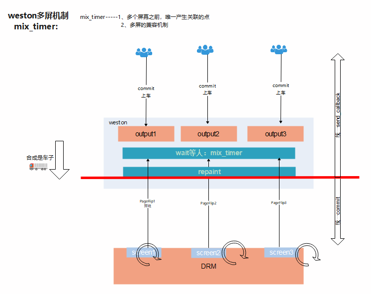

《weston.eddx》

<font color='cornflowerblue'>核心点：</font>

>   1、每个屏幕固定周期发车
>
>   2、<font color='red'>每个屏幕发车时间，没有任何关系！！！</font>


**生活化模型，站在drm角度看图形流程：**

>   -<font color='red'>why----最终目的：</font>
>
>   >   <font color='red'>1、drm发车，拉回client提供的货物      </font>                           
>   >
>   >   2、希望screen1的车子拿到 货物后 <font color='red'>能准时返回</font>（~~其他屏幕同理~~）
>
>   who：
>
>   >   1、DRM---------货车总站
>   >
>   >   2、货物------像素数据
>   >
>   >   3、screen ---- 发车员
>   >
>   >   4、weston ------ 货物交易中心（client送货、货车取货的地方）
>   >
>   >   5、min_timer ------------- <font color='red'>交易员（只有一个）</font>
>   >
>   >   6、client  ----------- 提供货物的人
>
>   when重要节点：
>
>   >   output_repaint --------------  真正进行交易，client的东西 交给 货车的过程
>   >
>   >   output_repaint_timer_handler  ----- 发车排班的班长
>   >
>   >   page_flip ------ 发车时刻 + 硬件周期，强约束 （自然：~~如果之前车子没回来commit，可能这次没有发车，**但是周期性，是强制的！！**！~~）
>   >
>   >   ​						在代码里，发了新车 page_flip ，也意味着 上一帧weston_output_finish_frame的结束
>   >
>   >   ​				 		自然，会在这里计算本次车辆返回的时刻
>
>   基本规则：
>
>   ```
>   	1、硬件周期（发车时间）是一个强约束，|------1h-------|------1h-------|------1h-------|------1h-------|
>   			车回程时刻不是！！！！
>   	2、只有一辆车（一个屏幕）：需要等车子回来（commit，并且硬件处理完成后），才能发下一班车。
>   			期望：车子的来回限制在一个小时里
>   	3、硬件周期，  对于weston是PageFlip（硬件周期约束）
>   				 对于安卓是vsync（不同点：安卓vsync信号给了应用）
>   ```
>
>   <font color='red'>weston的多屏策略</font>： 希望<font color='red'>多个车子可以同时回程</font>（多个屏幕统一提交）
>
>   优点：
>
>   >   1、出现一个窗口跨屏时，可以完整显示（其实也不一定，另一个屏幕可能还没发车）
>
>   <font color='red'>缺点：</font>
>
>   >   <font color='red'>任务过于集中</font>，交易员在16ms内，未必做的完
>
>   


特殊的点：

>   这里的Timer，按道理是并行的  -----> **weston的做法是 求了min_Timer**，最后所有outPut统一绘制

物理级的原因：

>   weston的软件屏（一个） 是 所有硬键屏的总和（解决的问题场景：一个窗口，占两个屏时，不会不同步）
>
>   weston的一帧画面，是所有output绘制了一帧

结论：

>   weston的一帧，是所有屏的一帧


### 从trace看多屏渲染流水线


### 优化之 任务过于集中  ----->   模型之任务队列


模型之任务队列 

>   --------->  解决的问题：把集中的任务，平均化
>                                        即把CPU的使用，高峰，平均化 ------> 即 削峰
>
>   最坏情况，直接for循环调用
>
>   最好情况：刚刚满负荷，即一个任务完全执行完，另一个任务才加入队列


应用：

>   例子1：可以应用于weston，把 多屏串行，改成任务队列，提交到一个render线程上运行


TODO:

>   比较好的做法是，屏幕是线程级别的： 各个屏幕之间完全无关 ------------->  一个屏幕，一个线程（但是需要切换EGLcontext，耗时）
>
>   更优化的做法：屏幕是进程级别的：

## weston之多屏

1、发车pageFlip不是统一

repaint和提交给drm，是统一的

见《when---生命周期图 0层》图

2、outPut-> viewlist            这个viewlist是系统级别的！！！！！不是屏幕级别的！！！！！


# TODO: opengl角度： APP做了哪些，EGL做了哪些

为什么EGL只能做一部分？如何证明只能做到目前的架构

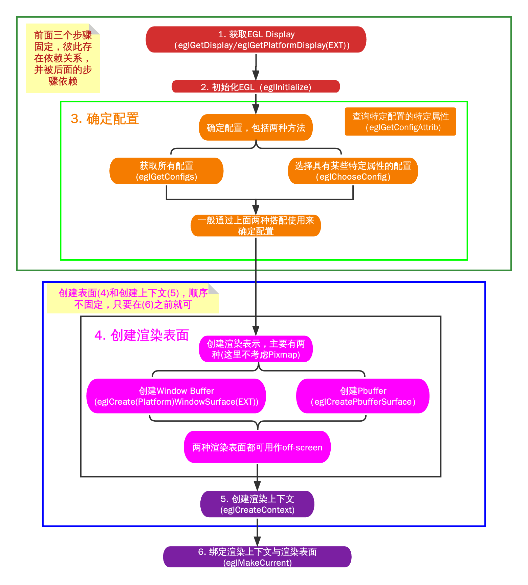

[图片来源](https://kenttj.github.io/markdownbook/0_%E5%9B%BE%E5%BD%A2%E7%B3%BB%E7%BB%9F/3_Display%E7%B3%BB%E7%BB%9F/%E5%90%88%E6%88%90%E4%B9%8Bweston.assets/wayland%E6%B5%85%E6%9E%90%E4%B9%8BEGL%E3%80%81Opengles%E3%80%81GBM_linux_%E7%A7%8D%E7%93%9C%E5%A4%A7%E7%88%B7-%E5%BC%80%E6%94%BE%E5%8E%9F%E5%AD%90%E5%BC%80%E5%8F%91%E8%80%85%E5%B7%A5%E4%BD%9C%E5%9D%8A.html)：


[图片来源](https://kenttj.github.io/markdownbook/0_%E5%9B%BE%E5%BD%A2%E7%B3%BB%E7%BB%9F/3_Display%E7%B3%BB%E7%BB%9F/%E5%90%88%E6%88%90%E4%B9%8Bweston.assets/wayland%E6%B5%85%E6%9E%90%E4%B9%8BEGL%E3%80%81Opengles%E3%80%81GBM_linux_%E7%A7%8D%E7%93%9C%E5%A4%A7%E7%88%B7-%E5%BC%80%E6%94%BE%E5%8E%9F%E5%AD%90%E5%BC%80%E5%8F%91%E8%80%85%E5%B7%A5%E4%BD%9C%E5%9D%8A.html)：

参考：

>   [**wayland浅析之EGL、Opengles、GBM**](https://kenttj.github.io/markdownbook/0_%E5%9B%BE%E5%BD%A2%E7%B3%BB%E7%BB%9F/3_Display%E7%B3%BB%E7%BB%9F/%E5%90%88%E6%88%90%E4%B9%8Bweston.assets/wayland%E6%B5%85%E6%9E%90%E4%B9%8BEGL%E3%80%81Opengles%E3%80%81GBM_linux_%E7%A7%8D%E7%93%9C%E5%A4%A7%E7%88%B7-%E5%BC%80%E6%94%BE%E5%8E%9F%E5%AD%90%E5%BC%80%E5%8F%91%E8%80%85%E5%B7%A5%E4%BD%9C%E5%9D%8A.html)            ---------->  超级好文！！！！


## Weston中dmabuf client使用分析 ------TODO

https://zhuanlan.zhihu.com/p/425098578

gbm设备


# 显示性能优化----次要

## 优化之  只重绘damage区域

damage：**各个层级的都有：**

> weston_compositor_damage_all  ---------------------系统级
>
> weston_output_damage(output)  ---------------------output级
>
> ---------------------plane级（primary plane有的，是view窗口级别合并而来）
>
> weston_surface_damage   ---------------------view窗口级别  (client给server的！！！！)
>
> ----------------------控件级


### 标记 damage区域----大纲之【计算damage】：

1、client设置 surface_damage

2、合成侧标记：

```java
weston_view_damage_below
```

3、移动窗口


-<font color='red'>view->plane->damage   自然，我们的终极目的是plane的damage</font>！！！！（view的damage，更新到plane的damage上！！！）


### 如何做到只重绘damage呢（how）

```java
// 遍历node：
draw_paint_node  
	pixman_region32_intersect(&repaint,
				  &pnode->view->transform.boundingbox, damage); // repaint 区域是  damage与 view的交集
	pixman_region32_subtract(&repaint, &repaint, &pnode->view->clip);  // 去掉clip区域  【】
```

----------->  

**结论：** **静止的窗口，repaint区域为空**（~~每个view都会遍历到~~）


TODO:  pnode->view->transform.boundingbox  与   weston_surface的宽高区别

​              pnode->view-> transform.position				以及 weston_view的位置，之间的区别						


【】 clip区域是啥？ 

TODO： 似乎是不需要重绘的

## 霸屏模式

## TODO:本质

本质：

>   直接将dma漏给了display，没有经过合成！


### 必要条件（物理层面）

1、全屏  & 不透明(opaque)

2、自然，~~层级要顶层，要遮住其他所有view~~

3、<font color='red'>关键物理因素：</font>drm要能识别对应buffer的fd（自然，weston能够拿到 client的buffer的fd）

```java
drm_fb_get_from_paint_node    drm_fb_get_from_view
```


补充：

> 满足1和2，但是不满足3，显示上似乎是霸屏模式，但是实际还是GPU合成了！！！！！


### 必要条件的代码大纲

1、opaque：`需要client告诉合成器：`

```java
// 配置端----client： simple-egl.c
if (window->opaque || window->fullscreen) {
    region = wl_compositor_create_region(window->display->compositor);
    wl_region_add(region, 0, 0, INT32_MAX, INT32_MAX);
    wl_surface_set_opaque_region(window->surface, region); // 关键一行
    wl_region_destroy(region);
    
    
// 生效端------compos, 绑定plane时
		totally_occluded = !pixman_region32_not_empty(&surface_overlap);
		if (totally_occluded) { // 【】 关键一行：totally_occluded的view，会自动被忽略掉
			drm_debug(b, "\t\t\t\t[view] ignoring view %p "
			             "(occluded on our output)\n", ev); // 【】 关键日志
			pixman_region32_fini(&surface_overlap);
			pixman_region32_fini(&clipped_view);
			continue;      
		}
```

-<font color='red'>总之，结论：</font>

全屏opaque client，会霸屏，即：

> 1、被遮挡view----------合成器自动忽略
>
> 2、霸屏view，如果能被drm识别，会直接送给drm


###  **关键性日志：**

```java
Layer 3 (pos 0xb0000000):
	View 0 (role xdg_toplevel, PID 4239, surface ID 20, top-level window 'simple-egl' of org.freedesktop.weston.simple-egl, 0x55723634e0):
		position: (0, 0) -> (1080, 1920)
		[fully opaque]  // 【】完全opaque
		outputs: 0 (DSI-1) (primary)
		dmabuf buffer
			[2 references may use buffer content]
			format: 0x34324241 ABGR8888
			modifier: LINEAR (0x0)
			width: 1080, height: 1920
	View 1 (role (null), PID 0, surface ID 0, black background surface for top-level window 'simple-egl' of org.freedesktop.weston.simple-egl, 0x557239b8e0):
		position: (0, 0) -> (1080, 1920)
		[fully opaque]
		outputs: 0 (DSI-1) (primary)
		solid-colour buffer
			[R 0.000000, G 0.000000, B 0.000000, A 1.000000]
			[2 references may use buffer content]
			format: 0x34325258 XRGB8888
			modifier: LINEAR (0x0)
			width: 1, height: 1
			
[repaint] trying planes-only build state   ---------> // 【】 尝试plane-only一定要成功
//[repaint] could not build planes-only state, trying mixed // 没有mixed一行！！！！！！！！
```


### TODO: weston 10上不生效

原因，不详 


# weston启动

参考： 

>   https://linduo.blog.csdn.net/article/details/122790158   【Wayland】Weston启动流程分析


系统启动流程：

> 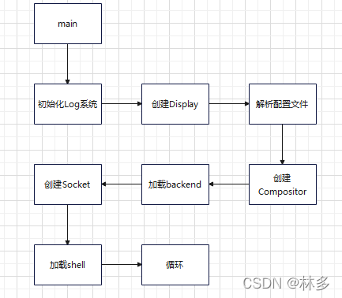
>
> [图来源](https://linduo.blog.csdn.net/article/details/122790158#:~:text=%E5%90%AF%E5%8A%A8%E6%B5%81%E7%A8%8B%E5%88%86%E6%9E%90-,%E6%B5%81%E7%A8%8B%E5%9B%BE,-%EF%BC%9A)


## 启动代码大纲


```java
compositor/executable.c/main()-->
	compositor/main.c-->wet_main()
		-->verify_xdg_runtime_dir()//XDG_RUNTIME_DIR环境变量检查
		-->wl_display_create//创建wayland显示对象
		-->wl_display_get_event_loop
		-->wl_event_loop_add_signal
		-->load_configuration	//加载weston.ini
		-->weston_config_get_section \ weston_config_section_get_bool\ weston_config_section_get_string
		-->weston_choose_default_backend  //x11-backend.so
		-->weston_compositor_create    //创建 compositor 实例
                      -->weston_plane_init // 【】读取drm 的plane信息
                      -->wl_data_device_manager_init
                      -->wl_display_init_shm
                      -->weston_layer_init(&ec->fade_layer, ec);
                      -->weston_layer_init(&ec->cursor_layer, ec);
		-->wl_display_add_protocol_logger
		-->weston_compositor_init_config
		-->load_backend	//根据启动参数-b，显式加载后端显示接口
			-->load_x11_backend	//use-pixman? cpu:gpu
				-->weston_compositor_load_backend
					-->weston_load_module	//x11-backend.so
						-->weston_backend_init
							-->x11_backend_create	//use pixman?pixman_renderer_init:init_gl_renderer
								-->init_gl_renderer	//weston_load_module(gl-renderer.so)
            //或：
            -->load_drm_backend
                -->weston_compositor_load_backend(c, WESTON_BACKEND_DRM,&config.base);
                    -->weston_load_module(backend_map[backend], "weston_backend_init");
		-->weston_compositor_log_capabilities
		-->wl_client_create
		-->weston_compositor_wake
		-->execute_autolaunch
		-->wl_display_run
```

参考：   [03-weston启动过程](https://blog.csdn.net/yangchao315/article/details/123455439)


weston进程拉起 **shell 进程**的细化：

> 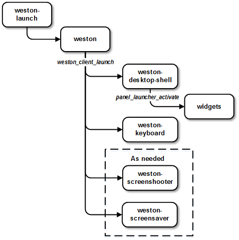

weston:  安卓systemServer + SF

weston-desktop-shell :  安卓SystemUI + launcher    

​                                       即，系统全局的界面，~~比如panel, background, cursor, app launcher, lock screen等~~

weston-keyboard（软键盘面板）：安卓 输入法

weston-screenshooter： 安卓截屏

weston-screensaver：安卓屏保


一些思考：

> （1）从功能角度，为什么要剥离SystemUI逻辑呢？（从系统服务里）：
>
> 方便定制化修改这部分逻辑。系统服务逻辑，是稳定的   ----->  设计思路：**稳定的逻辑放一起，不稳定的放一起**
>
> 


## 初始化时，挂的各种钩子：

### drm_backend 初始化 钩子----weston_backend级别？

以及output 对应的 possible_crtcs：

```java

├─ // output 对应的 possible_crtcs
├─ 时机：
├─ weston_load_module(/compositor.c)
└─ weston_backend_init(/drm.c)
    ├─ drm_backend_create(/drm.c)
    │   ├─ // 挂weston_backend的create_output钩子
    │   ├─ b->base.create_output = drm_output_create;
    │   │   ├─ // 挂weston_output.enable钩子，调用时机：
    │   │   ├─ output->base.enable = drm_output_enable(struct weston_output *base) // 屏幕级别
    │   │   │   ├─ drm_output_attach_crtc(output) //【】output 与 crtc的 绑定
    │   │   │   │   └─ possible_crtcs &= drm_connector_get_possible_crtcs_mask(&head->connector); // 拿到屏幕对应的connector
    │   │   │   │       └─ 遍历drmModeConnector获取encoder = drmModeGetEncoder
    │   │   │   │           └─ 从 possible_crtcs |= encoder->possible_crtcs encoder中获取possible_crtcs //【】关键一行，拿到屏幕对应的
    │   │   │   ├─ drm_output_init_planes(output)
    │   │   │   │   ├─ drm_output->scanout_plane = drm_output_find_special_plane 寻找的primary作为
    │   │   │   │   └─ .
    │   │   │   ├─ drm_output_pageflip_timer_create(output)
    │   │   │   └─ drm_output_init_egl(output, b)
    │   │   │       ├─ //挂weston_output的各种钩子：
    │   │   │       ├─ output->base.start_repaint_loop = drm_output_start_repaint_loop
    │   │   │       ├─ output->base.repaint = drm_output_repaint // 【绘制的钩子】
    │   │   │       └─ output->base.assign_planes = drm_assign_planes
    │   │   ├─ // 挂其他钩子
    │   │   ├─ output->base.destroy = drm_output_destroy;
    │   │   ├─ output->base.disable = drm_output_disable;
    │   │   ├─ output->base.attach_head = drm_output_attach_head;
    │   │   └─ output->base.detach_head = drm_output_detach_head;
    │   ├─ .
    │   ├─ b->base.destroy = drm_destroy;
    │   ├─ b->base.repaint_begin = drm_repaint_begin;
    │   ├─ b->base.repaint_flush = drm_repaint_flush;
    │   ├─ b->base.repaint_cancel = drm_repaint_cancel;
    │   ├─ b->base.device_changed = drm_device_changed;
    │   └─ b->base.can_scanout_dmabuf = drm_can_scanout_dmabuf;
    └─ 或者其他 wayland_backend_create

```


%accordion%hideContent%accordion%

```java
// output 对应的 possible_crtcs
时机：
weston_load_module(/compositor.c)
weston_backend_init(/drm.c)
	drm_backend_create(/drm.c)
		// 挂weston_backend的create_output钩子 
		b->base.create_output = drm_output_create;
			// 挂weston_output.enable钩子，调用时机：
			output->base.enable = drm_output_enable(struct weston_output *base) // 屏幕级别
				drm_output_attach_crtc(output) //【】output 与 crtc的 绑定
					possible_crtcs &= drm_connector_get_possible_crtcs_mask(&head->connector); // 拿到屏幕对应的connector
						遍历drmModeConnector获取encoder = drmModeGetEncoder
							从 possible_crtcs |= encoder->possible_crtcs encoder中获取possible_crtcs //【】关键一行，拿到屏幕对应的
				drm_output_init_planes(output)
					drm_output->scanout_plane = drm_output_find_special_plane 寻找的primary作为
					.
				drm_output_pageflip_timer_create(output)
				drm_output_init_egl(output, b)
					//挂weston_output的各种钩子：
					output->base.start_repaint_loop = drm_output_start_repaint_loop
					output->base.repaint = drm_output_repaint // 【绘制的钩子】
					output->base.assign_planes = drm_assign_planes
			// 挂其他钩子
			output->base.destroy = drm_output_destroy;
			output->base.disable = drm_output_disable;
			output->base.attach_head = drm_output_attach_head;
			output->base.detach_head = drm_output_detach_head;
		.
		b->base.destroy = drm_destroy;
		b->base.repaint_begin = drm_repaint_begin;
		b->base.repaint_flush = drm_repaint_flush;
		b->base.repaint_cancel = drm_repaint_cancel;
		b->base.device_changed = drm_device_changed;
		b->base.can_scanout_dmabuf = drm_can_scanout_dmabuf;
	或者其他 wayland_backend_create
```

%/accordion%


### drm_virtual_output 初始化 钩子 -------output级别


```java
├─ 极其类似：
└─ weston_plugin_api_register(virt_api)---drm-virtual.c // drm_virtual被注册为插件，最后被远程桌面应用
    ├─ drm_virtual_output_create,
    │   ├─ // 挂 weston_output的一些钩子
    │   ├─ output->base.enable = drm_virtual_output_enable;
    │   │   ├─ //挂weston_output的各种钩子：
    │   │   ├─ output->base.start_repaint_loop = drm_virtual_output_start_repaint_loop;
    │   │   ├─ output->base.repaint = drm_virtual_output_repaint;
    │   │   ├─ output->base.assign_planes = drm_assign_planes;
    │   │   ├─ output->base.set_dpms = NULL;
    │   │   ├─ output->base.switch_mode = NULL;
    │   │   ├─ output->base.gamma_size = 0;
    │   │   └─ output->base.set_gamma = NULL;
    │   ├─ output->base.destroy = drm_virtual_output_destroy;
    │   ├─ output->base.disable = drm_virtual_output_disable;
    │   └─ output->base.attach_head = NULL;
    ├─ drm_virtual_output_set_gbm_format,
    ├─ drm_virtual_output_set_submit_frame_cb,
    ├─ drm_virtual_output_get_fence_fd,
    ├─ drm_virtual_output_buffer_released,
    └─ drm_virtual_output_finish_frame

```


%accordion%hideContent%accordion%

```java
极其类似：
weston_plugin_api_register(virt_api)---drm-virtual.c // drm_virtual被注册为插件，最后被远程桌面应用
	drm_virtual_output_create,
		// 挂 weston_output的一些钩子
		output->base.enable = drm_virtual_output_enable;
			//挂weston_output的各种钩子：
			output->base.start_repaint_loop = drm_virtual_output_start_repaint_loop;
			output->base.repaint = drm_virtual_output_repaint;
			output->base.assign_planes = drm_assign_planes;
			output->base.set_dpms = NULL;
			output->base.switch_mode = NULL;
			output->base.gamma_size = 0;
			output->base.set_gamma = NULL;
		output->base.destroy = drm_virtual_output_destroy;
		output->base.disable = drm_virtual_output_disable;
		output->base.attach_head = NULL;
	drm_virtual_output_set_gbm_format,
	drm_virtual_output_set_submit_frame_cb,
	drm_virtual_output_get_fence_fd,
	drm_virtual_output_buffer_released,
	drm_virtual_output_finish_frame
```

%/accordion%

## 代码目录结构


[图来源](https://cloud.tencent.com/developer/article/1445734#:~:text=%E5%92%8Ccompositor%20backend%E3%80%82-,%E5%AE%83%E4%BB%AC%E5%88%86%E5%88%AB%E7%94%A8%E4%BA%8E%E7%AA%97%E5%8F%A3%E7%AE%A1%E7%90%86,-%EF%BC%8C%E5%90%88%E6%88%90%E6%B8%B2%E6%9F%93%E5%92%8C)


其中:


```java
├── clients--包含weston-desktop-shell、weston-keyboard、weston-screenshooter，以及一些client示例。
├── compositor--输出weston主程序，以及libexec_weston.so.0.0.0、screen-share.so等库文件。
├── data
├── desktop-shell--desktop-shell.so
├── doc
├── fullscreen-shell--fullscreen-shell.so
├── include
├── ivi-shell--ivi-shell.so
├── kiosk-shell--kiosk-shell.so
├── libweston--输出libweston-11.so.0.0.0库文件，以及一系列compositor backend：drm-backend.so；render backend：gl-renderer.so。
├── pam
├── pipewire
├── protocol--Wayland协议xml文件。
├── README.md
├── releasing.md
├── remoting
├── shared
├── shell-utils
├── tests--测试程序。
└── xwayland--使用X11作为compositor backend的XWayland。
```


## TODO: 如何在启动时 观察到 各种plane的上下级关系？

drm驱动给到weston的plane日志，<font color='red'>但是似乎不是硬件的上下关系！！！！！！！！</font>

> ```java
> [drm-backend] zpos property not found. Using invented immutable zpos values:
> 	[plane] primary plane 49, zpos_min 0, zpos_max 0
> 	[plane] overlay plane 70, zpos_min 7, zpos_max 7
> 	[plane] overlay plane 74, zpos_min 7, zpos_max 7
> 	[plane] primary plane 110, zpos_min 0, zpos_max 0
> 	[plane] overlay plane 114, zpos_min 7, zpos_max 7
> 	[plane] primary plane 126, zpos_min 0, zpos_max 0
> 	[plane] primary plane 132, zpos_min 0, zpos_max 0
> 	[plane] primary plane 138, zpos_min 0, zpos_max 0
> 	[plane] primary plane 144, zpos_min 0, zpos_max 0
> 	[plane] primary plane 150, zpos_min 0, zpos_max 0
> ```
>
> 注： （1）正常屏幕，上面的窗口，优先分配overlay ----------> 所以overlay在上
>
> ​          （2）**驱动给的plane顺序 必须 等于物理层级顺序**  （驱动寄存器配置错误时，就会颠倒）


# 休眠与唤醒

## weston12原生

使用keyboard唤醒的：

```java
session_notify
	---------------------wake--------------------------
	weston_compositor_wake  
	weston_compositor_damage_all  // 【】 所有output都damage
	---------------------wake--------------------------
	weston_compositor_offscreen;
	for遍历：output->repaint_needed = false; // 关闭所有的
```


# 其他 次要功能


## weston 截屏  & 录屏

### ~~操作~~

截屏：

> 命令方式（需要debug模式运行）：
>
> ```java
> weston --debug  //  【】     
> 
> weston-screenshooter
> ```
>
> 
>
> 快捷键：
>
> Win+s      -----------> 验证OK

------------------>  待完善功能，按照窗口截屏


录屏：

> 命令方式：  TODO:
>
> ```java
> 
> ```
>
> 
>
> 快捷键：
>
> Win+r 开始/停止屏幕录制     -----------> 验证OK
>
> ```java
> 生成.wcap 格式的文件，这是一种低损耗的 weston 专有格式，可 以通过 wcap 工具进行解码:
> 
> wcap-decode --yuv4mpeg2 capture.wcap > capture.y4m
> y4m 是一种原始格式，可以使用 vlc 打开，也可以使用 ffmpeg 进行编码:
> 
> ffmpeg -y -i capture.y4m -c:v libx264 -pix_fmt yuv420p capture.mp4
> ```
>
> 


### 原理：


参考：   

 [按键screenshot](https://blog.csdn.net/yikunbai5708/article/details/103845086)   ------> 原理

  [ Weston 桌面使用简介](https://reimei.nxez.com/post/introduction-to-using-the-weston-desktop/)

[weston桌面weston-screenshooter截图方法](https://blog.csdn.net/qq_40177571/article/details/124989542)


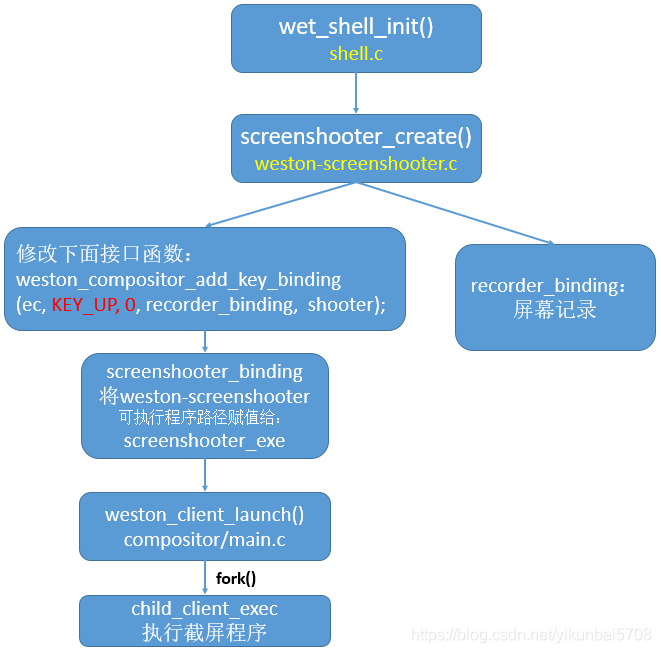

[图来源](https://blog.csdn.net/yikunbai5708/article/details/103845086#:~:text=%E7%9A%84%E5%8F%AF%E4%BB%A5%E9%80%9A%E8%BF%87-,%E4%B8%8B%E5%9B%BE%E8%BF%9B%E8%A1%8C%E8%A1%A8%E8%BF%B0,-UNI%2D%E5%B0%91%E6%9E%97%E5%AF%BA%E6%AD%A6%E5%8A%9F)


### 待整理

```java
必然，初始化时机：
weston_screenshooter_shoot
	绑定frame_signal信号 和 screenshooter_frame_notify


触发信号
weston_capture_source_v1_capture(wl_resource *buffer_resource) // client来的buffer
	weston_capture_task_create // weston侧创建 截屏任务
	weston_output_schedule_repaint // 强迫去绘制一帧


信号执行：
gl_renderer_repaint_output // 或者gl_pixmal 一样
	----------------------绘制的动作--------------
	gl_renderer_do_capture_tasks
		gl_renderer_do_capture(buffer) // 任务list里拿到空容器buffer
			assert(into->type == WESTON_BUFFER_SHM); // screenShoter给的buffer，一定要是shm类型的！！！
			glReadPixels(read_target) // 【】关键一行，从GPU里拿
	wl_signal_emit(&output->frame_signal, output_damage);
		frame_signal信号通知 screenshooter_frame_notify
			l->buffer->shm_buffer  // 【】各种PIXMAN_格式数据，都被copy到shm_buffer（pixels）


malloc 图像的buffer：
	stride = l->buffer->width * (PIXMAN_FORMAT_BPP(pixman_format) / 8);
	pixels = malloc(stride * l->buffer->height);


 weston_buffer *buffer = gs->buffer_ref.buffer //


------------------------------信号机制------------------

绑定处理：


触发信号：
wl_signal_emit(&output->frame_signal, output_damage);
```


## 一些量的级别

weston_output /drm_output(自然scanout屏幕级别)   ------------- 屏幕级

​					drm_output--->drm_device  屏幕

plane_list ----  系统级   （所有屏幕的） ---> <font color='red'>分配时，考虑了plane-output绑定关系</font>（weston有拿到drm配置的  plane与crtc（output）绑定关系


drm_assign_planes(weston_output)  --------------屏幕级别

output->paint_node_z_order_list  -------><font color='red'> 这个是系统级别，使用时，要过滤！！！！</font>

```
wl_list_for_each(pnode, &output->paint_node_z_order_list, // from top to bottom
             z_order_link) {

    /* If this view doesn't in our output at all, there's no
     * reason to do anything with it. */
    if (!(pnode->view->output_mask & (1u << output->id))) {
        continue;
}
```


drm_device ------> 即屏幕的软件抽象


```java
struct drm_output {
	struct weston_output base;
	struct drm_backend *backend;
	struct drm_device *device;  // 屏幕
	struct drm_crtc *crtc;  ----> // 【】硬件crtc，屏幕级！！！！
```


## weston日志 关键标识


output对应的屏幕  ---------->      output->base.name


# 次要---GStreamer——gst-launch-1.0


参考：[GStreamer——gst-launch-1.0](https://blog.csdn.net/FREEDOM_X/article/details/140150939?utm_medium=distribute.pc_relevant.none-task-blog-2~default~baidujs_baidulandingword~default-0-140150939-blog-118488296.235^v43^pc_blog_bottom_relevance_base5&spm=1001.2101.3001.4242.1&utm_relevant_index=1)

作用：  调试工具

## 在Linux上播放视频

例1：

> ```java
> gst-launch-1.0 videotestsrc   !   autovideosink
>      管道起始点    连接   管道的终点
> 
> gst-launch-1.0 videotestsrc   !   autovideosink  ! waylandsink sync=false render-rectangle="<5568,0,-1,-1>"
> ```
>
> [效果](https://blog.csdn.net/FREEDOM_X/article/details/140150939?utm_medium=distribute.pc_relevant.none-task-blog-2~default~baidujs_baidulandingword~default-0-140150939-blog-118488296.235^v43^pc_blog_bottom_relevance_base5&spm=1001.2101.3001.4242.1&utm_relevant_index=1#:~:text=%E5%9C%A8%E5%B1%8F%E5%B9%95%E4%B8%8A%E3%80%82-,%E8%BF%90%E8%A1%8C%E6%95%88%E6%9E%9C%EF%BC%9A,-%E7%AE%A1%E9%81%93%E6%8F%8F%E8%BF%B0%E4%B8%B2):
>
> 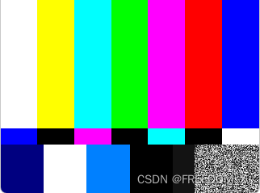
>
> [图来源](https://blog.csdn.net/FREEDOM_X/article/details/140150939?utm_medium=distribute.pc_relevant.none-task-blog-2~default~baidujs_baidulandingword~default-0-140150939-blog-118488296.235^v43^pc_blog_bottom_relevance_base5&spm=1001.2101.3001.4242.1&utm_relevant_index=1#:~:text=%E5%9C%A8%E5%B1%8F%E5%B9%95%E4%B8%8A%E3%80%82-,%E8%BF%90%E8%A1%8C%E6%95%88%E6%9E%9C,-%EF%BC%9A)

例2：播放网络视频：

```java
gst-launch-1.0 playbin uri=https://www.freedesktop.org/software/gstreamer-sdk/data/media/sintel_trailer-480p.webm
```

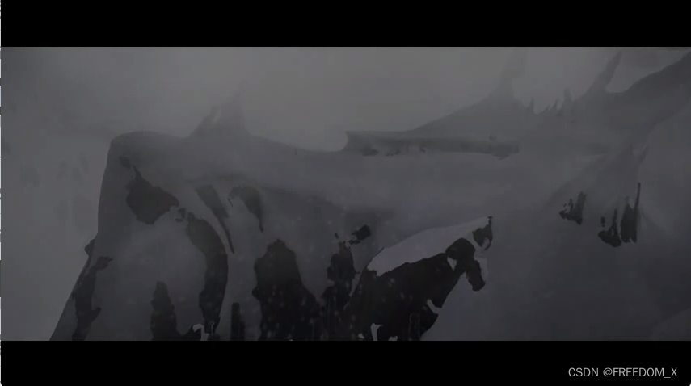

[图片来源](https://blog.csdn.net/FREEDOM_X/article/details/140150939?utm_medium=distribute.pc_relevant.none-task-blog-2~default~baidujs_baidulandingword~default-0-140150939-blog-118488296.235^v43^pc_blog_bottom_relevance_base5&spm=1001.2101.3001.4242.1&utm_relevant_index=1#:~:text=%E6%89%A7%E8%A1%8C%E8%BF%87%E7%A8%8B%EF%BC%9A-,%E6%98%BE%E7%A4%BA%E6%95%88%E6%9E%9C%EF%BC%9A,-%E7%94%A8%E4%BA%8E%E5%8F%91%E9%80%81%E5%92%8C)


---------> TODO:   <font color='red'> 基于此，可以看weston上视频是如何合成的！</font>


例3：指定分辨率

```java
gst-launch-1.0 videotestsrc ! video/x-raw, width=1920, height=1080 ! autovideosink
```


功能、结构、配置，永恒的主题

> 都要（5w2h）


例4：播放本地视频

>   ```java
>   gst-launch-1.0 playbin uri=file:///home/kent/workingspace_disk2/scripts/gstream/image/Raindrops_Videvo.mp4
>   ```
>
>   报错： missing element H.264
>
>   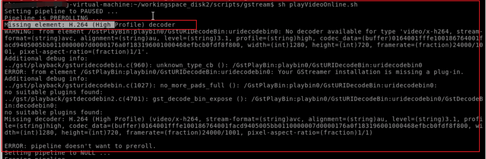
>
>   安装：
>
>   ```java
>   sudo apt-get install gstreamer1.0-plugins-ugly gstreamer1.0-libav
>   ```


## 播放图片

法一：

>   ```java
>   gst-launch-1.0 playbin uri=file:///home/workingspace_disk2/scripts/gstream/image/mountain.jpeg  video-sink="imagefreeze ! videoconvert ! autovideosink" & sleep 10000 ; kill $!其中 
>   #其中 10000是时间
>   ```
>
>   ----------------> weston上可以用

法二：

>    weston-image


# weston的client------能力展示&功能入口

参考：

https://wiki.st.com/stm32mpu/wiki/Wayland_Weston_overview

[Wayland开发入门系列1： 运行测试程序](https://blog.csdn.net/qq_26056015/article/details/122216771)


## dmabuf-egl


### 如何运行：

在virtualBox内，报错：

```
MESA-LOADER: failed to open zink:/home/chenjinke/weston_install/li
/x86 64-linux-gnu/dri/zink_dri.so:cannot open shared object file: No such file
or directory(search paths /home/chenjinke/weston install/lib/x86 64-linux-gr
I/dri, suffix dri)
Warning:zwp linux explicit synchronization vl not supported,
will not use explicit synchronization
KMS:DRM IOCTL MODE CREATE DUMB failed:Permission denied
create bo failed
```

----------------->  没有找到zink_dri.so

根本原因：

> mesa应该编译出zink_dri.so, 却没有

**解决办法1：**

> 发现VMware内是OK，底层跟踪代码，走了vmsvga
>
> ----------->  **设置virtualBox的显卡控制器为  vmsvga：（1）显示---屏幕----显卡控制器：vmsvga + 启动3D加速**


其他：

> virtualBox一定要开启硬件加速，否则很慢


方法二：

**运行时，指定drm驱动路径 ：**

```java
weston-dmabuf-egl -d /dev/dri/card0
或者
weston-dmabuf-egl -d /dev/dri/RenderD128
```


## 图片查看 weston-image：

```java
 weston-image rose-flower-blossom-bloom-39517.jpeg rose-flower-blossom-bloom-39517.jpeg
```

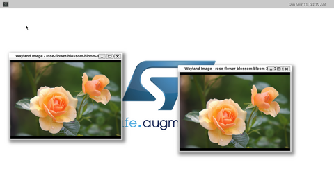

优点：可以 **放大 & 移动 image**


## event测试-------weston-eventdemo 事件实时显示

**展示了 touch事件 和 key事件**

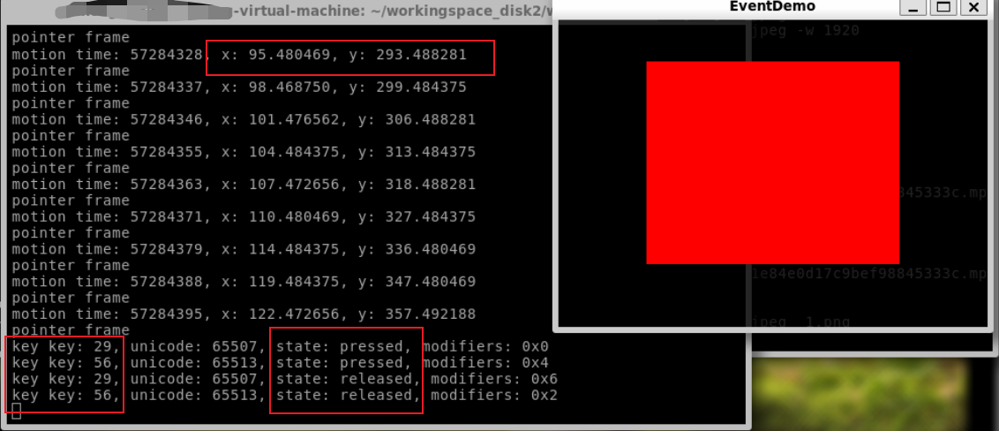


技巧：

>   把client全屏，就可以像安卓一样，<font color='red'>实时显示touch位置</font>了
>
>   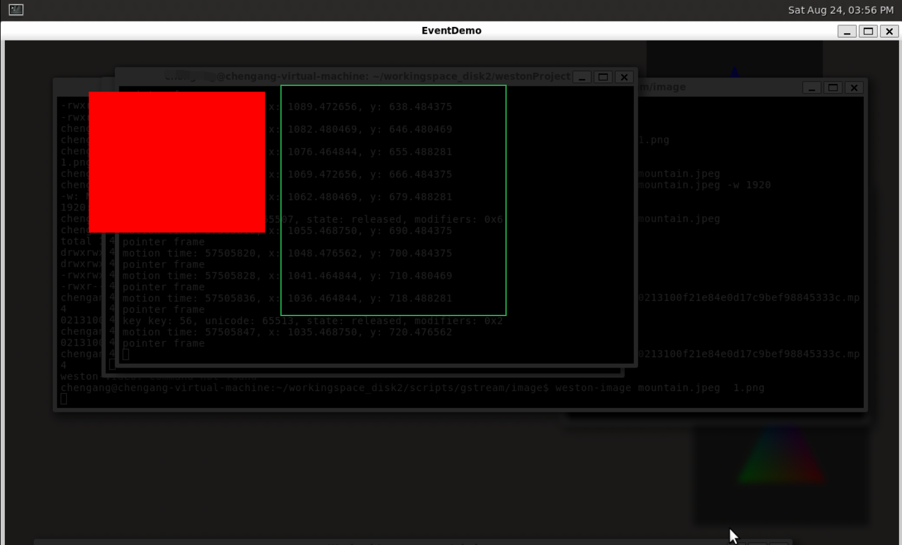


## event测试-------simple-touch

1、类似于安卓的touch画图

2、<font color='red'>测试多指</font>


touch有用，也可以适配鼠标point


## event测试-------getevent


## editor-----展示输入法框架能力

TODO: 居然有控件？？？？？

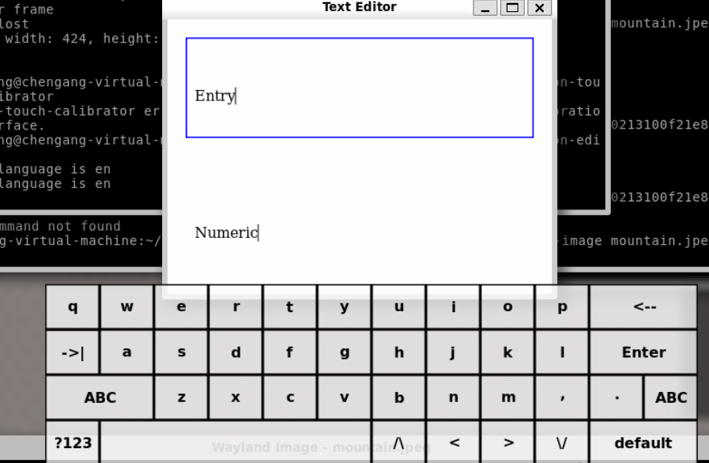


## dnd ------ 窗口之间传递

Drag and drop

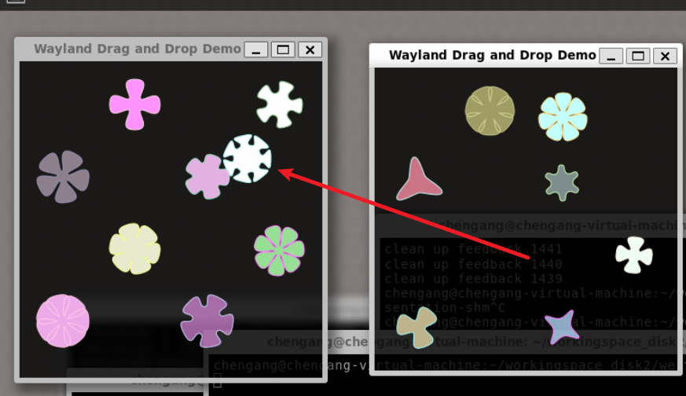

## constraint

限制鼠标出边界

展示了画连续线的能力：

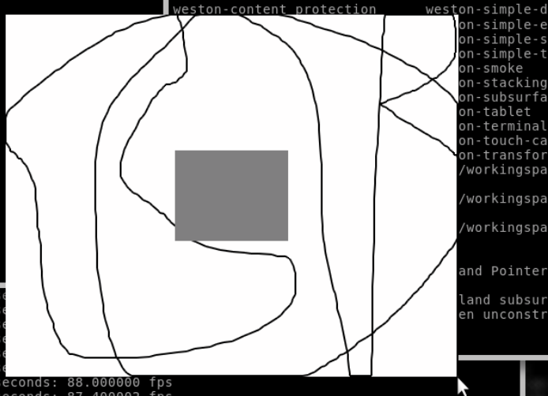


## transformed


## scaler


## 其他：

```java
“weston-terminal”是一个简单的终端模拟器，不是很兼容但工作得足够好的bash
“weston-flower”在屏幕上画了一朵花，测试框架协议
“weston-gears” wayland的glxgears
“weston-smoke”测试SHM缓冲区共享
“weston-image”加载在命令行上传递的图像文件并显示它们
“weston-view”对pdf文件也有同样的作用
“weston-resizor”显示窗口大小（使用上下键）
“weston-eventdemo”报告libtoytoolkit的事件到控制台（参见weston-eventdemo --help）
————————————————

版权声明：本文为博主原创文章，遵循 CC 4.0 BY-SA 版权协议，转载请附上原文出处链接和本声明。
       
原文链接：https://blog.csdn.net/qq_26056015/article/details/122216771
```


# 几种后端

## wayland后端

weston1 架在 wayland(另一个weston2)之上：

1、上面weston，内部先通过GPU进行合成-------> 合成一张图给到wayland

wayland协议是  client 与  weston之间

 -<font color='red'>weston1  与  weston2之间具体走的什么协议？------------- wayland协议</font>  

-<font color='red'>此时weston1就是一个client，与simple-shm无异：</font>

> 1、~~与weston2之间走wayland协议~~
>
> 2、其 拿到frame方式、获取release_buffer、call_back、提交........ <font color='red'>都和simple-egl 一样</font>
>
> 具体代码：
>
> ```java
> // wayland.c
> frame_done
> 
> 
> 提交仍然是合成后的glswapbuffer
> ```
>
> 


## RDP backend

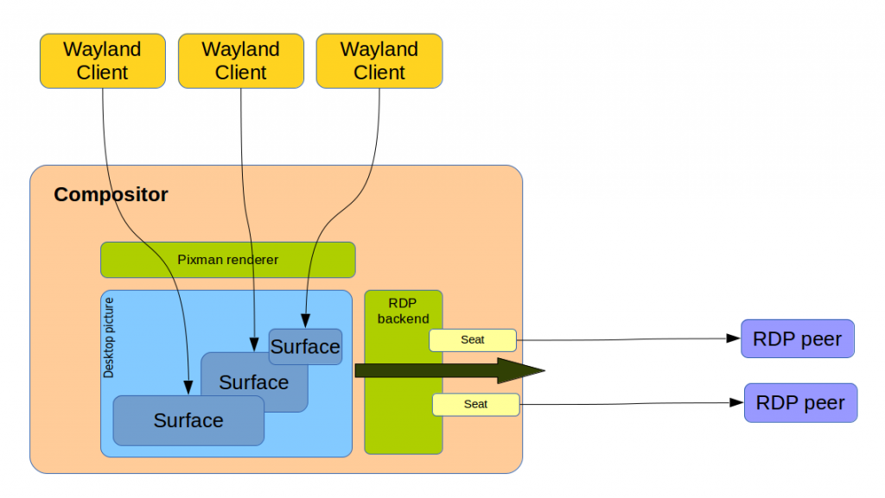

图片来源： https://www.hardening-consulting.com/en/posts/20131006an-overview-of-the-rdp-backend-in-weston.html


## 参考：

 [ Wayland/Weston 启动方式简介](https://blog.csdn.net/hexiaolong2009/article/details/104852721)


# TODO:  问题定位

见微知著  之  突变点

有成功的，必然你能成功

有正常的，必然都能正常


大略能力，

见微知著能力


# 资料

https://wayland.pages.freedesktop.org/weston/    weston官网

https://wayland.freedesktop.org/        wayland官网

https://gitlab.freedesktop.org/wayland     代码托管

https://cloud.tencent.com/developer/article/1445734       Wayland与Weston简介

https://wayland.arktoria.org/1-introduction/high-level-design.html     The Wayland Protocol 中文版

 Wayland-book的中文翻译  https://mazelinux.github.io/ 
 Wayland-book原文链接:https://wayland-book.com/

https://blog.csdn.net/u012839187/article/details/116054755    agl-compositor


[display:weston:weston-simple-egl: server端-CSDN博客 ](https://blog.csdn.net/u012839187/article/details/113104654)      

[display:weston渲染流程:buffer+attach+damage+frame_wayland渲染函数-CSDN博客](https://blog.csdn.net/u012839187/article/details/100580627)       buffer+attach+damage+frame

[display:weston渲染流程:commit_weston display-CSDN博客](https://blog.csdn.net/u012839187/article/details/106469038)    commit

[Wayland源码分析-Commit相关流程_wayland源码剖析-CSDN博客](https://blog.csdn.net/sinat_32596537/article/details/81625649?spm=1001.2101.3001.6650.3&utm_medium=distribute.pc_relevant.none-task-blog-2~default~CTRLIST~Rate-3-81625649-blog-122790158.235^v43^pc_blog_bottom_relevance_base7&depth_1-utm_source=distribute.pc_relevant.none-task-blog-2~default~CTRLIST~Rate-3-81625649-blog-122790158.235^v43^pc_blog_bottom_relevance_base7&utm_relevant_index=6)   commit


[Weston中shm window渲染_weston gbm-CSDN博客](https://blog.csdn.net/qqzhaojianbiao/article/details/129789575)   ------>  整个渲染流程：从应用到**repaint_output**


[Wayland源码分析-repaint相关流程 (happyseeker.github.io)](https://happyseeker.github.io/graphic/2016/11/11/wayland-repaint-relative-flow.html)    ------>   repaint相关流程


[OpenHarmony 图形子系统（二）weston compositor分析-鸿蒙开发者社区-51CTO.COM](https://ost.51cto.com/posts/9993)        weston compositor分析


[Weston中shm window渲染显示过程分析](https://zhuanlan.zhihu.com/p/419740978)   


[Wayland中的跨进程过程调用浅析](https://blog.csdn.net/jinzhuojun/article/details/40264449 )    -----> 好文

https://fossies.org/dox/weston-13.0.3/structivi__shell.html     struct的类图

https://zhpower.github.io/blog/graphic/2002-05-15-Wayland&Weston.html           系列文章！！！！------>好文！！！！<font color='red'>好图</font>！！！！

​                  


# 其他 待整理


### cursor_view的判断

​	if (output->cursor_view) {


### 硬件图层plane

本质：<font color='red'>硬件</font>图层的层级  

​          最终来源： My chips have four independent H/W overlays.


硬件图层分类：

- **Primary Plane**：主平面，负责显示桌面或主画面。每个 CRTC（显示控制器）至少有**一个 Primary Plane**。
- **Overlay Plane**：覆盖平面，负责显示叠加在主画面上的图像，比如视频播放窗口、硬件加速的图形层等。一个显示控制器可以有**多个 Overlay Plane**。
- **Cursor Plane**：光标平面，专门用于显示鼠标指针。


软件的标识：

```java
enum wdrm_plane_type {
	WDRM_PLANE_TYPE_PRIMARY = 0,  // 用于GPU的plane
	WDRM_PLANE_TYPE_CURSOR,
	WDRM_PLANE_TYPE_OVERLAY,  // 用于叠加的plane
	WDRM_PLANE_TYPE__COUNT   
};
```


注意： **Overlay** 是一种特殊的 plane，用于叠加显示额外的图像内容。


#### Plane 的使用

在实际使用中，开发者可以通过 DRM 的 API 来配置和操作 plane。以下是一个基本的步骤概述：

1. **获取 Plane 信息**：
    - 使用 `drmModeGetPlaneResources` 获取所有可用的 plane 资源。
    - 使用 `drmModeGetPlane` 获取具体的 plane 信息。
2. **设置 Plane**：
    - 使用 `drmModeSetPlane` 将图像数据设置到指定的 plane 上，并定义其在屏幕上的位置和大小。


### kanzi

[Kanzi Engine C++ API: kanzi::wayland::XDGToplevel Class Reference](https://docs.kanzi.com/3.9.8/en/reference/kanzi-runtime-api/a01341.html)


### Weston中HDMI热拔插检测原理

https://zhuanlan.zhihu.com/p/434869796

### drm_output_find_special_plane 遍历查找 特定的plane


