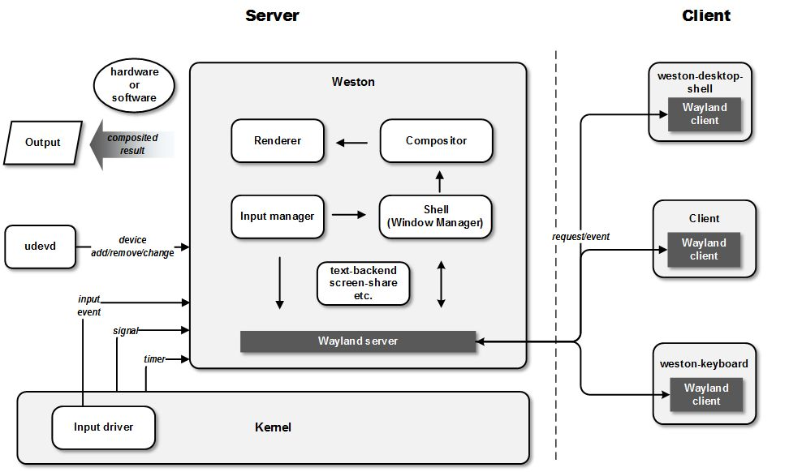

# Weston / wayland ----与A 无异

## 功能架构----0层

Weston从内部体系结构------------~~窗口管理（shell） ：     WindowManagerService~~

​                                                    ~~合成器（compositor）：   SurfaceFlinger~~

​                                                    输入管理 input Manager ：    InputManagerService

 总之：

> **weston = wms + IMS + SF**
>
> ​                 ~~systemServer进程 + SF进程~~

从功能角度看：

> （1）任意一个系统功能是唯一确定的
>
> （2）自然，**唯一的不同就是  功能的组合方式不同，即结构上有差异**

图：

> 
>
> 
>
> [图来源](https://cloud.tencent.com/developer/article/1445734#:~:text=%E6%9C%80%E5%90%8E%E8%BE%93%E5%87%BA(%E6%AF%94%E5%A6%82%E5%88%B0framebuffer)
>
> TODO:   修改图，改变上下关系
>
> TODO:  server侧的shell具体是什么？？？？

理解：

（1）自然：~~wayland-server ---- wayland client 就是协议~~


## when---生命周期图 0层


大的生命周期：上图1和2

```java
wet_main
wl_display_run
wl_event_loop_dispatch // 大的消息模型驱动
	on_drm_input  // 【发车】TODO: 真正drm来的PageFlip消息 -----------上图1-----------------
		drmHandleEvent
			atomic_flip_handler
				drm_output_update_complete
					weston_output_finish_frame // 为 output_repaint_timer_handler 计算time
	wl_timer_heap_dispatch // timer 超时消息 -----------上图2-----------------
		output_repaint_timer_handler  // 【交货】timer启动
			drm_repaint_begin  // 打印scene_graph日志
    		遍历output，weston_output_maybe_repaint
			drm_repaint_flush // 【车子回程】 提交
```


TODO: 真正drm来的PageFlip消息 ：

​                 到底是drm怎么发的消息？？？？？？


## 1层横向大图

字典 图：


[图来源](https://blog.csdn.net/zzjzmdx/article/details/135067743?ops_request_misc=%257B%2522request%255Fid%2522%253A%2522171749225516800180621626%2522%252C%2522scm%2522%253A%252220140713.130102334.pc%255Fblog.%2522%257D&request_id=171749225516800180621626&biz_id=0&utm_medium=distribute.pc_search_result.none-task-blog-2~blog~first_rank_ecpm_v1~rank_v31_ecpm-1-135067743-null-null.nonecase&utm_term=weston&spm=1018.2226.3001.4450#:~:text=%EF%BC%88-,%E5%9B%BE%E7%9A%84%E6%BA%90%E6%96%87%E4%BB%B6%E5%8F%AF%E8%87%AA%E8%A1%8C%E4%B8%8B%E8%BD%BD,-gitee%20%E5%9C%B0%E5%9D%80%C2%A0zwzfj2)


## 1层纵向大图

### 发车   代码大纲  TODO: 


### 次要----repaint大纲字典

【repaint流程】承载：将client的damage区域提交给compositor，compositor进行合成

-<font color='red'>repaint的唯一目的：</font>就是拿到合成后大图（承载于drm_fb）与 简单图

```java
├─ wl_event_loop_dispatch // 【】 when：重绘必然是event触发（client告知、compositor请求等）
├─ output_repaint_timer_handler(compositor.c)
├─ weston_output_maybe_repaint(compositor.c)
└─ weston_output_repaint(compositor.c)
    ├─ ------------------为views分配planes--------------------------
    ├─ drm_assign_planes // 【】具体见下
    ├─ ------------------计算damage---------------------------------
    └─ drm_output_repaint
        └─ drm_output_render-----------------只做了一件事情，拿到fd（内核的buffer）----------------------
            ├─ if (scanout_state->fb) return // 【】霸屏模式scanout -----> 利用client的fd
            ├─ if：drm_fb_ref  硬件合成  自然，条件：damage为空(也是gl被拦截的地方)？？？？？
            ├─ eif:drm_output_render_pixman  软件合成
            ├─ el：drm_output_render_gl //【】GPU合成	 或 x11_output_repaint_gl  backend-x11/x11.c--->  weston合成器的output是X11
            │   ├─ gl_renderer_repaint_output ----> 必然，在这里设置视口viewPort，视口是output级别的
            │   │   ├─ get_surface_state(weston_surface)
            │   │   │   └─ gl_renderer_create_surface
            │   │   │       ├─ ------------------------attach？？？-----------------------------------
            │   │   │       └─ gl_renderer_attach(weston_surface, weston_buffer) // 【】核心
            │   │   ├─ repaint_views  // 【】这里遍历node，必然
            │   │   │   ├─ ------------------【3】OpenGL合成, 前提：分配了primary plane--------------------------
            │   │   │   └─ draw_paint_node  // 【】有些node会走gl，有些走pixman？ node级别的还是合成器级别的 ？ 必然：这里初始化shader的config
            │   │   │       ├─ gl_shader_config_init_for_paint_node // 必然：where---draw_paint_node之子，repaint_region之前
            │   │   │       ├─ repaint_region  //【】
            │   │   │       └─ triangle_fan_debug 测试用的？？？
            │   │   └─ blit_shadow_to_output // 【】阴影。开关："color-management"改为true
            │   ├─ bo = gbm_surface_lock_front_buffer  // 拿到gbm buffer---> 承载合成结果
            │   ├─ drm_fb_get_from_bo(bo, BUFFER_GBM_SURFACE)
            │   │   └─ drm_fb_addfb(~bo)
            │   │       └─ drmModeAddFB2WithModifiers/drmModeAddFB2   //libdrm 【】通过gbm buffer创建帧缓冲区（FrameBuffer）
            │   │           └─ 实际上，已经将数据写给drm设备了。图：https://download.csdn.net/blog/column/11175480/133747645
            │   └─ return drm_fb（指向DRM的FrameBuffer），并记录
            ├─ scanout_state->fb = fb  // 合成大图，由 drm_plane_state->drm_fb 承载
            └─ drmModeCreatePropertyBlob // 【2】libdrm接口，创建属性（后续用来设置CRTC（Crtc）、连接器（Connector）、平面（Plane））
```

​             


%accordion%原大纲%accordion%

```java
生命周期图 0层
weston_output_maybe_repaint(compositor.c)
weston_output_repaint(compositor.c)
	------------------为views分配planes--------------------------
	drm_assign_planes // 【】具体见下
	------------------计算damage---------------------------------
	drm_output_repaint
		drm_output_render-----------------只做了一件事情，拿到fd（内核的buffer）----------------------
			if (scanout_state->fb) return // 【】霸屏模式scanout -----> 利用client的fd
			if：drm_fb_ref  硬件合成  自然，条件：damage为空(也是gl被拦截的地方)？？？？？
			eif:drm_output_render_pixman  软件合成
			el：drm_output_render_gl //【】GPU合成	 或 x11_output_repaint_gl  backend-x11/x11.c--->  weston合成器的output是X11
				gl_renderer_repaint_output ----> 必然，在这里设置视口viewPort，视口是output级别的
					get_surface_state(weston_surface)
						gl_renderer_create_surface
							------------------------attach？？？-----------------------------------
							gl_renderer_attach(weston_surface, weston_buffer) // 【】核心
					repaint_views  // 【】这里遍历node，必然
						------------------【3】OpenGL合成, 前提：分配了primary plane--------------------------
						draw_paint_node  // 【】有些node会走gl，有些走pixman？ node级别的还是合成器级别的 ？ 必然：这里初始化shader的config
							gl_shader_config_init_for_paint_node // 必然：where---draw_paint_node之子，repaint_region之前
							repaint_region  //【】
							triangle_fan_debug 测试用的？？？
					blit_shadow_to_output // 【】阴影。开关："color-management"改为true
				bo = gbm_surface_lock_front_buffer  // 拿到gbm buffer---> 承载合成结果
				drm_fb_get_from_bo(bo, BUFFER_GBM_SURFACE)
					drm_fb_addfb(~bo)
						drmModeAddFB2WithModifiers/drmModeAddFB2   //libdrm 【】通过gbm buffer创建帧缓冲区（FrameBuffer）
																			 实际上，已经将数据写给drm设备了。图：https://download.csdn.net/blog/column/11175480/133747645
				return drm_fb（指向DRM的FrameBuffer），并记录
			scanout_state->fb = fb  // 合成大图，由 drm_plane_state->drm_fb 承载
			drmModeCreatePropertyBlob // 【2】libdrm接口，创建属性（后续用来设置CRTC（Crtc）、连接器（Connector）、平面（Plane））
```

%/accordion%

**=================大纲的证明==================**

drm_output_render<font color='red'>唯一目的</font>就是拿到合成后buffer对应的fd

>   （1）自然，OpenGL合成后，拿到fd
>
>   （2） 一个client霸屏了，自然直接用client的fd 。具体见《霸屏scanout》章节

为啥要拿到fd？ 因为这是commit的前提！！！！！


【2】 GPU（CPU）合成结果的承载者-------drm_fb


**其他小点：**

1、直接overlay送的图的流程：

（1）在 gl重绘窗口repaint_views时，过滤掉了

------------> 即啥也没做！！！！

（2）scanout霸屏时，也是gl流程，直接return出去了


-<font color='red'>【flush流程】目的：commit  大图与简单图  给DRM</font>

```java
生命周期图 0层
    └─ drm_repaint_flush(drm.c)
        └─ drm_pending_state_apply(kms.c)
            └─ drm_pending_state_apply_atomic(kms.c)  // 遍历 pending_state->output_list
                ├─ drm_output_apply_state_atomic(drm_output_state, drmModeAtomicReq)  // 【2】必然：自然以plane_list维度，去commit
                │   └─ 遍历 drm_plane_state（repaint后的大图存储的地方）
                │       └─ plane_add_prop(req,plane_state->fb->fb_id); // 【】关键一行，关键出参：req 修改对应的配置参数
                └─ drmModeAtomicCommit(req)  // 【】关键一行：参数统一commit给drm（libdrm接口）
```

%accordion%hideContent%accordion%

```java
output_repaint_timer_handler(compositor.c) // repaint的timer里
	drm_repaint_flush(drm.c)
		drm_pending_state_apply(kms.c)
			drm_pending_state_apply_atomic(kms.c)  // 遍历 pending_state->output_list
				drm_output_apply_state_atomic(drm_output_state, drmModeAtomicReq)  // 【2】必然：自然以plane_list维度，去commit
					遍历 drm_plane_state（repaint后的大图存储的地方）
						plane_add_prop(req,plane_state->fb->fb_id); // 【】关键一行，关键出参：req 修改对应的配置参数
				drmModeAtomicCommit(req)  // 【】关键一行：参数统一commit给drm（libdrm接口）
```

%/accordion%

详解【1】：commit 与 repaint流程，一定不在一个loop触发里：

-<font color='red'>生活化模型：</font>

>   overlay ----------- 年轻人
>
>   GPU ------------- 有能力的老人
>
>    DPU 叠图 ----------考试结束，画挂墙（挂墙展示评分）
>
>   （1）<font color='red'>事件驱动（client的dirty） 触发重绘：</font> ~~多个画家画画，画完送给  张贴人 （合成器），合成器触发重绘~~
>
>   （2）有些画 可能需要相框（圆角特效等），需要**有能力**的老人（GPU）来完成。**有能力，但是干活慢**。
>
>   ​		  老人装完相框，把多个画，贴到一张大纸上**形成大图**，最后交给年轻挂画的人。年轻人（DPU）最后把画挂到墙上
>
>   （3）  有些画，很简单，不需要额外的操作，直接交给年轻小白（DPU）直接挂墙。 无能力（只会粘贴），但是干活快
>
>   （4）<font color='red'>when：</font><font color='red'>大图与简单画</font>（**plane_list**），何时 给到 年轻小白去挂墙？
>
>   ​                       **自然是**本轮考试结束的时候，timeOut的时候   ---------> <font color='red'>即commit是计时器触发</font>

TODO: 一场考试需要多久？


详解【2】：

必然以<font color='red'>plane_list维度去commit</font>：

>   （1）GPU合成的结果，以primary_plane 去提交，提交给DPU
>
>   （2） overlay对应的view，没有合成 ------> 直接以overlay_plane，送给DPU
>
>      (3)  cursor_plane ，也被提交给DPU


------------------------> 注意： 遍历 的plane_list，不代表硬件层级！！

### 次要---drm_assign_planes大纲

```java
repaint大纲字典
└─ drm_assign_planes ----------output级
    ├─ try: mode = DRM_OUTPUT_PROPOSE_STATE_PLANES_ONLY  //1、尝试只用 overlay
    ├─ try: mode = DRM_OUTPUT_PROPOSE_STATE_MIXED;        // 2、只用overlay不成功，尝试 overlay + GPU
    ├─ try: mode = DRM_OUTPUT_PROPOSE_STATE_RENDERER_ONLY;  // 上面两点都不成功, 自然，只用GPU
    └─ drm_output_propose_state(mode)-------output级--------------
        └─ wl_list_for_each(pnode)------遍历pnode节点-----view级----------
            ├─ ①忽略不合成的view(continue)：
            │   ├─ 1、不属于此output的  if (!(ev->output_mask & (1u << output->base.id)))
            │   ├─ 2、必须需要颜色变换 TODO:没懂  if (!pnode->surf_xform_valid)
            │   ├─ 3、完全被遮挡的 if (totally_occluded)
            │   └─ 4、
            ├─ ②强制走GPU render的(force_renderer = true)：
            │   ├─ 1、view存在于多个output上，if (ev->output_mask != (1u << output->base.id))
            │   ├─ 2、view 对应的GBM not available（drm侧）， if (!b->gbm)
            │   ├─ 3、view没有有效的buffer，if (!weston_view_has_valid_buffer(ev))
            │   ├─ 4、view对应buffer类型是 WESTON_BUFFER_SOLID
            │   ├─ 5、需要做color变换的，(requires color transform)
            │   ├─ 6、view被GPU render view遮挡的， if (pixman_region32_not_empty(&surface_overlap))  ----> TODO:本质原因是啥！！！！！！
            │   │   └─ 换言之，gpu view 以下（遮挡），必须是GPU！
            │   └─ 7、view在保护content-protection的强制mode下
            └─ ③--------对于非强制GPU的尝试分配plane：drm_output_find_plane_for_view -----------
                ├─ 1、检查buffer是否有效。无效则 FAILURE_REASONS_FB_FORMAT_INCOMPATIBLE
                ├─ 2、buffer类型是WESTON_BUFFER_SOLID ，分配plane失败， FAILURE_REASONS_FB_FORMAT_INCOMPATIBLE
                ├─ 3、buffer类型是WESTON_BUFFER_SHM，只允许是cursor_plane：
                │   ├─ pixel_format格式是DRM_FORMAT_ARGB8888，失败，FAILURE_REASONS_FB_FORMAT_INCOMPATIBLE
                │   ├─ buffer的尺寸大于鼠标，失败
                │   └─ 赋值：possible_plane_mask = (1 << output->cursor_plane->plane_idx);
                ├─ 4、自然，尝试的mode = DRM_OUTPUT_PROPOSE_STATE_RENDERER_ONLY，失败
                ├─ 5、wl_list_for_each(plane, &device->plane_list)遍历 硬件所有plane
                │   └─ 跳过CURSOR类型的plane
                │       └─ 赋值：possible_plane_mask |= 1 << plane->plane_idx;
                ├─ 6、没有对应的drm_fb（Framebuffer），失败
                ├─ 7、有对应的drm_fb，赋值：possible_plane_mask &= fb->plane_mask
                ├─ ③_1--------真正的分配（对于③中可能分配的possible_plane）-----------------------
                └─ wl_list_for_each(plane, &device->plane_list)遍历plane_list：
                    ├─ plane可得性检查：drm_plane_is_available：
                    │   ├─ output如果是virtual的，不能分配plane！！
                    │   ├─ The plane still 存在 a request
                    │   ├─ The plane is still active on another output
                    │   └─ 检查 plane can be used with this CRTC
                    ├─ 检查 view对应的buffer有效性：assert(fb)
                    ├─ alpha已经安排过view，跳过： drm_output_check_plane_has_view_assigned()
                    ├─ alpha 检查：如果view有alpha值，但是该plane不支持alpha，跳过
                    └─ 最终绑定plane与view：drm_output_prepare_cursor_paint_node/drm_output_try_paint_node_on_plane
                        └─ plane_state->ev = view  // TODO: 最终应该是，plane分配给view
```

-<font color='red'>结论的物理级证明：</font>

1、<font color='red'>物理上，必然：连续性结论</font>：~~**GPU合成的views必须连续**~~（~~因为只有一个GPU~~）

推论：所以，~~**代码策略：某view是GPU合成，以下（需要被遮挡）都必须是force-render**~~

2、TODO：  上面所有策略的物理级的证明


%accordion%hideContent%accordion%

```java
drm_assign_planes ----------output级
	try: mode = DRM_OUTPUT_PROPOSE_STATE_PLANES_ONLY  //1、尝试只用 overlay
	try: mode = DRM_OUTPUT_PROPOSE_STATE_MIXED;	  // 2、只用overlay不成功，尝试 overlay + GPU
	try: mode = DRM_OUTPUT_PROPOSE_STATE_RENDERER_ONLY;  // 上面两点都不成功, 自然，只用GPU
	drm_output_propose_state(mode)-------output级--------------
		wl_list_for_each(pnode)------遍历pnode节点-----view级----------
			①忽略不合成的view(continue)：
				1、不属于此output的  if (!(ev->output_mask & (1u << output->base.id))) 
				2、必须需要颜色变换 TODO:没懂  if (!pnode->surf_xform_valid)
				3、完全被遮挡的 if (totally_occluded)
				4、
			②强制走GPU render的(force_renderer = true)：
				1、view存在于多个output上，if (ev->output_mask != (1u << output->base.id))
				2、view 对应的GBM not available（drm侧）， if (!b->gbm)
				3、view没有有效的buffer，if (!weston_view_has_valid_buffer(ev))
				4、view对应buffer类型是 WESTON_BUFFER_SOLID
				5、需要做color变换的，(requires color transform)
				6、view被GPU render view遮挡的， if (pixman_region32_not_empty(&surface_overlap))  ----> TODO:本质原因是啥！！！！！！
					换言之，gpu view 以下（遮挡），必须是GPU！
				7、view在保护content-protection的强制mode下
			③--------对于非强制GPU的尝试分配plane：drm_output_find_plane_for_view -----------
				1、检查buffer是否有效。无效则 FAILURE_REASONS_FB_FORMAT_INCOMPATIBLE
				2、buffer类型是WESTON_BUFFER_SOLID ，分配plane失败， FAILURE_REASONS_FB_FORMAT_INCOMPATIBLE
				3、buffer类型是WESTON_BUFFER_SHM，只允许是cursor_plane：
					pixel_format格式是DRM_FORMAT_ARGB8888，失败，FAILURE_REASONS_FB_FORMAT_INCOMPATIBLE
					buffer的尺寸大于鼠标，失败
					赋值：possible_plane_mask = (1 << output->cursor_plane->plane_idx);
				4、自然，尝试的mode = DRM_OUTPUT_PROPOSE_STATE_RENDERER_ONLY，失败
				5、wl_list_for_each(plane, &device->plane_list)遍历 硬件所有plane
						跳过CURSOR类型的plane
						赋值：possible_plane_mask |= 1 << plane->plane_idx;
				6、没有对应的drm_fb（Framebuffer），失败
				7、有对应的drm_fb，赋值：possible_plane_mask &= fb->plane_mask
				③_1--------真正的分配（对于③中可能分配的possible_plane）-----------------------
				wl_list_for_each(plane, &device->plane_list)遍历plane_list：
					plane可得性检查：drm_plane_is_available：
						output如果是virtual的，不能分配plane！！
						The plane still 存在 a request
						The plane is still active on another output
						检查 plane can be used with this CRTC
					检查 view对应的buffer有效性：assert(fb)
					alpha已经安排过view，跳过： drm_output_check_plane_has_view_assigned()
					alpha 检查：如果view有alpha值，但是该plane不支持alpha，跳过
					最终绑定plane与view：drm_output_prepare_cursor_paint_node/drm_output_try_paint_node_on_plane
						plane_state->ev = view  // TODO: 最终应该是，plane分配给view

```

%/accordion%


最终一行： 承载在哪个变量里？？？？

```java
view->plane = primary_plane; //  把plane分配给view

weston_compositor里的primary_plane;  // 【】指明了GPU的plane
```


维测：


### 补充特例--------霸屏scanout

效果：

>   
>
>   [图来源](https://blog.csdn.net/u012839187/article/details/112415876#:~:text=an%20appropriate%20buffer)


结论：

>   1、霸屏和GPU合成一样，**都是用的那块 primary plane**    
>
>   -----------> 自然的，  （1）<font color='red'>目的一样：GPU合成目的也是拿到FullScreen的df </font>  （2）因为primary是每个屏必须的
>
>   代码实现角度：
>
>   >   ~~scanout_plane一定是 primary—plane  类型~~  自然
>   >
>   >   scanout_state-><font color='red'>fb 的指向不同</font>：霸屏下，是指向Client的fd；GPU合成是指向frameBuffer 
>
>   2、霸屏的判断：自然是FullScreen
>
>   4、<font color='red'>霸屏的唯一目</font>的就是 阻止 合成。[见](https://blog.csdn.net/u012839187/article/details/112415876#:~:text=%22Disables%22%20composition%20for%20fullscreen%20clients)
>
>   5、优点：一个client霸屏了，**自然直接用client的fd**
>
>   6、TODO:  霸屏 与 走overlay的 图，有本质区别嘛？
>
>   7、~~composition只会在primary  plane上发生~~。自然
>
>   8、物理角度决定了  full-screen  和 overlay，没有GPU的合成


### 信息角度之    像素之旅

参考：[像素之旅](https://blog.csdn.net/u012839187/article/details/112415876#:~:text=%E5%8D%A0%E6%8D%AEsprite%20plane%EF%BC%9B-,%E5%83%8F%E7%B4%A0%E4%B9%8B%E6%97%85,-%E4%BD%9C%E4%B8%BA%E8%AF%B4%E6%98%8E%EF%BC%8C%E8%AF%B7)


整个图形，就是像素的生命周期：

>   client像素:  产生--->流转给合成器 --->流转plane --->crtc ---->encoder ---->connector ----> 屏幕
>

像素的承载：buffer

>   1、GPU buffer -----> client  OpenGL画的 & GPU 合成时： 这个时候是共享buffer？[共享纹理](https://blog.csdn.net/u012839187/article/details/112415876#:~:text=%E7%9A%84%E5%85%B6%E4%BB%96%E6%96%B9%E6%B3%95%EF%BC%89-,%E5%9C%A8%E5%AE%A2%E6%88%B7%E7%AB%AF%E5%92%8C%E5%90%88%E6%88%90%E5%99%A8%E4%B9%8B%E9%97%B4%E5%85%B1%E4%BA%AB%E7%BA%B9%E7%90%86,-%E3%80%82%E5%9C%A8%E6%9C%AC%E4%BE%8B)？
>
>   2、CPU buffer -----> CPU绘制 & CPU合成
>
>   3、交叉---GPU buffer & CPU buffer：存在内存Copy: GPU buffer copy给CPU buffer ！！！！！！！
>
>   ​			例子：client  OpenGL画的， 软件合成器
>   ​			TODO: 待验证


[来源](https://kenttj.github.io/markdownbook/0_%E5%9B%BE%E5%BD%A2%E7%B3%BB%E7%BB%9F/3_Display%E7%B3%BB%E7%BB%9F/als2015_wayland_weston_v2.pdf)


结论：

-<font color='red'>从本质上讲：</font>

>    1、<font color='red'>Full-screen 与  overlay，没有任何区别</font> ------------->  自然，处理流程没有区别
>
>   ​      唯一区别：df 是不是全屏的？
>
>   2、<font color='red'>Full-screen 与  primary plane  没有任何区别</font> 
>
>   ​        唯一区别：后者有个 合成过程，**见上图的 4和5**

TODO:  上图中的GBM是啥？


## weston侧的事件机制

epoll机制：

> 
>
> [图来源](https://cloud.tencent.com/developer/article/1445734#:~:text=%E6%80%A7%E8%83%BD%E4%B8%8B%E9%99%8D%E6%88%96-,%E5%93%8D%E5%BA%94%E4%B8%8D%E5%8F%8A%E6%97%B6%E3%80%82,-%E4%B8%BB%E5%BE%AA%E7%8E%AF%E4%B8%8A)

特点：**串行**

~~具体对比：~~

> |              |        binder        |       weston事件机制       |
> | :----------: | :------------------: | :------------------------: |
> |     原理     |                      |           epoll            |
> | 是否并行化？ | 基于线程的并行？？？ |            串行            |
> |     优点     |                      |      不会有同步的开销      |
> |     缺点     |       ~~自然~~       | 有一个事件耗时，会阻塞其他 |
>
> [参考：](https://cloud.tencent.com/developer/article/1445734#:~:text=%E6%96%87%E4%BB%B6fd%E4%B8%8A%E3%80%82-,%E8%BF%99%E7%A7%8D%E6%A8%A1%E5%9E%8B%E4%B8%8E%E5%9F%BA%E4%BA%8E%E7%BA%BF%E7%A8%8B%E7%9A%84binder%E4%B8%8D%E5%90%8C,-%EF%BC%8C%E6%98%AF%E4%B8%80%E7%A7%8D%E4%B8%B2)


## Weston启动流程

参考： https://linduo.blog.csdn.net/article/details/122790158   【Wayland】Weston启动流程分析


系统启动流程：

> 
>
> [图来源](https://linduo.blog.csdn.net/article/details/122790158#:~:text=%E5%90%AF%E5%8A%A8%E6%B5%81%E7%A8%8B%E5%88%86%E6%9E%90-,%E6%B5%81%E7%A8%8B%E5%9B%BE,-%EF%BC%9A)


weston进程拉起 **shell 进程**的细化：

> 

weston:  安卓systemServer + SF

weston-desktop-shell :  安卓SystemUI + launcher    

​                                       即，系统全局的界面，~~比如panel, background, cursor, app launcher, lock screen等~~

weston-keyboard（软键盘面板）：安卓 输入法

weston-screenshooter： 安卓截屏

weston-screensaver：安卓屏保


一些思考：

> （1）从功能角度，为什么要剥离SystemUI逻辑呢？（从系统服务里）：
>
> 方便定制化修改这部分逻辑。系统服务逻辑，是稳定的   ----->  设计思路：**稳定的逻辑放一起，不稳定的放一起**
>
> 


## 代码目录结构


[图来源](https://cloud.tencent.com/developer/article/1445734#:~:text=%E5%92%8Ccompositor%20backend%E3%80%82-,%E5%AE%83%E4%BB%AC%E5%88%86%E5%88%AB%E7%94%A8%E4%BA%8E%E7%AA%97%E5%8F%A3%E7%AE%A1%E7%90%86,-%EF%BC%8C%E5%90%88%E6%88%90%E6%B8%B2%E6%9F%93%E5%92%8C)


其中:


```java
├── clients--包含weston-desktop-shell、weston-keyboard、weston-screenshooter，以及一些client示例。
├── compositor--输出weston主程序，以及libexec_weston.so.0.0.0、screen-share.so等库文件。
├── data
├── desktop-shell--desktop-shell.so
├── doc
├── fullscreen-shell--fullscreen-shell.so
├── include
├── ivi-shell--ivi-shell.so
├── kiosk-shell--kiosk-shell.so
├── libweston--输出libweston-11.so.0.0.0库文件，以及一系列compositor backend：drm-backend.so；render backend：gl-renderer.so。
├── pam
├── pipewire
├── protocol--Wayland协议xml文件。
├── README.md
├── releasing.md
├── remoting
├── shared
├── shell-utils
├── tests--测试程序。
└── xwayland--使用X11作为compositor backend的XWayland。
```


## lib依赖结构(功能导致的)


[图来源](https://cloud.tencent.com/developer/article/1445734#:~:text=Wayland/Weston-,%E8%BF%90%E8%A1%8C%E6%97%B6%E4%BE%9D%E8%B5%96,-%E7%9A%84%E5%BA%93%E4%B8%BB%E8%A6%81)


```java
└─ weston
    ├─ libexec_weston.so.0
    │   ├─ libweston-11.so.0
    │   │   ├─ libwayland-server.so.0
    │   │   │   └─ libffi.so.8--用于在运行时根据调用接口描述生成函数跳板并调用。
    │   │   ├─ libpixman-1.so.0--//【】 用于像素操作的库，包括region, box等计算。用了许多平台相关的优化。
    │   │   │   └─ librga.so.2
    │   │   ├─ libdrm.so.2--DRM compositor backend相关库文件。
    │   │   ├─ libxkbcommon.so.0--主要用于键盘处理。
    │   │   ├─ libmali_hook.so.1--GPU相关库文件。
    │   │   │   ├─ libmali.so.1
    │   │   │   │   ├─ libdl.so.2
    │   │   │   │   ├─ libpthread.so.0
    │   │   │   │   ├─ libdrm.so.2
    │   │   │   │   ├─ libwayland-client.so.0
    │   │   │   │   │   └─ libffi.so.8
    │   │   │   │   ├─ libwayland-server.so.0
    │   │   │   │   ├─ libstdc++.so.6
    │   │   │   │   └─ libgcc_s.so.1
    │   │   │   └─ libdrm.so.2
    │   │   └─ libmali.so.1
    │   ├─ libwayland-client.so.0
    │   ├─ libwayland-server.so.0
    │   ├─ libinput.so.10--InputManager相关，负责各种Input事件处理。输入处理，依赖于mtdev, libudev, libevdev等库。
    │   │   ├─ libmtdev.so.1
    │   │   ├─ libudev.so.1
    │   │   └─ libevdev.so.2
    │   ├─ libevdev.so.2
    │   └─ ld-linux-aarch64.so.1
    └─ libc.so.6
```

------------> [来源](https://www.cnblogs.com/arnoldlu/p/18091352#:~:text=%E5%A6%82%E4%B8%8B%E5%BA%93%E6%96%87%E4%BB%B6%EF%BC%9A-,weston%E4%BE%9D%E8%B5%96%E7%9A%84%E5%BA%93%E6%96%87%E4%BB%B6%E6%9C%89%EF%BC%9A,-weston%0A%E3%80%80%E3%80%80libexec_weston.so)


%accordion%hideContent%accordion%


```java
weston
　　libexec_weston.so.0
        libweston-11.so.0
            libwayland-server.so.0
                libffi.so.8--用于在运行时根据调用接口描述生成函数跳板并调用。
            libpixman-1.so.0--//【】 用于像素操作的库，包括region, box等计算。用了许多平台相关的优化。
                librga.so.2
            libdrm.so.2--DRM compositor backend相关库文件。
            libxkbcommon.so.0--主要用于键盘处理。
            libmali_hook.so.1--GPU相关库文件。
                libmali.so.1
                    libdl.so.2
                    libpthread.so.0
                    libdrm.so.2
                    libwayland-client.so.0
                        libffi.so.8
                    libwayland-server.so.0
                    libstdc++.so.6
                    libgcc_s.so.1
                libdrm.so.2
            libmali.so.1
        libwayland-client.so.0
        libwayland-server.so.0
        libinput.so.10--InputManager相关，负责各种Input事件处理。输入处理，依赖于mtdev, libudev, libevdev等库。
            libmtdev.so.1
            libudev.so.1
            libevdev.so.2
        libevdev.so.2
        ld-linux-aarch64.so.1
　　libc.so.6
```


%/accordion%


TODO: 

> 如何用工具分析依赖关系？  ------->  反推架构
>
> 画的专业工具是？


## ============1层=============

## 渲染流水线


[图来源](https://cloud.tencent.com/developer/article/1445734#:~:text=%E5%86%85%E5%AE%B9%E8%BF%9B%E8%A1%8C%E5%90%88%E6%88%90%E3%80%82-,%E4%B8%8B%E9%9D%A2%E6%98%AF%E6%8A%BD%E8%B1%A1%E7%9A%84%E6%B5%81%E7%A8%8B%E5%9B%BE,-%E3%80%82)

EGL用于将本地窗口系统与OpenGL关联起来 ------> TODO: 如何理解？


[来源](https://blog.csdn.net/u012839187/article/details/100580627#:~:text=%E4%BD%BF%E7%94%A8drm%2Dbackend%EF%BC%8C-,client%E7%BB%98%E7%94%BB%E5%A6%82%E6%9E%9C,-%E7%94%A8opengl%2Bopengles)

[真正来源](https://events.static.linuxfound.org/sites/events/files/slides/als2015_wayland_weston_v2.pdf)  ---->  [als2015_wayland_weston_v2.pdf](als2015_wayland_weston_v2.pdf) 


### TODO:Commit相关流程

https://blog.csdn.net/eydwyz/article/details/105799813   Wayland源码分析-Commit相关流程


## 合成结果的处理 compositor backend

图：


[图来源](https://cloud.tencent.com/developer/article/1445734#:~:text=%E5%AE%83%E4%BB%AC%E5%88%86%E5%88%AB%E7%94%A8%E4%BA%8E%E7%AA%97%E5%8F%A3%E7%AE%A1%E7%90%86%EF%BC%8C%E5%90%88%E6%88%90%E6%B8%B2%E6%9F%93%E5%92%8C%E5%90%88%E6%88%90%E5%86%85%E5%AE%B9%E8%BE%93%E5%87%BA)

compositor backend主要决定了compositor合成完后的结果怎么处置


荣： compositor backend  相当于 HWC？？？？？


## atomic_flip_handler ----- 发车


## 多屏渲染流水线------important


《weston.eddx》

<font color='cornflowerblue'>核心点：</font>

>   1、每个屏幕固定周期发车
>
>   2、<font color='red'>每个屏幕发车时间，没有任何关系！！！</font>


**生活化模型，站在drm角度看图形流程：**

>   -<font color='red'>why----最终目的：</font>
>
>   >   <font color='red'>1、drm发车，拉回client提供的货物      </font>                           
>   >
>   >   2、希望screen1的车子拿到 货物后 <font color='red'>能准时返回</font>（~~其他屏幕同理~~）
>
>   who：
>
>   >   1、DRM---------货车总站
>   >
>   >   2、货物------像素数据
>   >
>   >   3、screen ---- 发车员
>   >
>   >   4、weston ------ 货物交易中心（client送货、货车取货的地方）
>   >
>   >   5、min_timer ------------- <font color='red'>交易员（只有一个）</font>
>   >
>   >   6、client  ----------- 提供货物的人
>
>   when重要节点：
>
>   >   output_repaint --------------  真正进行交易，client的东西 交给 货车的过程
>   >
>   >   output_repaint_timer_handler  ----- 发车排班的班长
>   >
>   >   page_flip ------ 发车时刻 + 硬件周期，强约束 （自然：~~如果之前车子没回来commit，可能这次没有发车，**但是周期性，是强制的！！**！~~）
>   >
>   >   ​						在代码里，发了新车 page_flip ，也意味着 上一帧weston_output_finish_frame的结束
>   >
>   >   ​				 		自然，会在这里计算本次车辆返回的时刻
>
>   基本规则：
>
>   ```
>   	1、硬件周期（发车时间）是一个强约束，|------1h-------|------1h-------|------1h-------|------1h-------|
>   			车回程时刻不是！！！！
>   	2、只有一辆车（一个屏幕）：需要等车子回来（commit，并且硬件处理完成后），才能发下一班车。
>   			期望：车子的来回限制在一个小时里
>   	3、硬件周期，  对于weston是PageFlip（硬件周期约束）
>   				 对于安卓是vsync（不同点：安卓vsync信号给了应用）
>   ```
>
>   <font color='red'>weston的多屏策略</font>： 希望<font color='red'>多个车子可以同时回程</font>（多个屏幕统一提交）
>
>   优点：
>
>   >   1、出现一个窗口跨屏时，可以完整显示（其实也不一定，另一个屏幕可能还没发车）
>
>   <font color='red'>缺点：</font>
>
>   >   <font color='red'>任务过于集中</font>，交易员在16ms内，未必做的完
>
>   


特殊的点：

>   这里的Timer，按道理是并行的  -----> **weston的做法是 求了min_Timer**，最后所有outPut统一绘制

物理级的原因：

>   weston的软件屏（一个） 是 所有硬键屏的总和（解决的问题场景：一个窗口，占两个屏时，不会不同步）
>
>   weston的一帧画面，是所有output绘制了一帧

结论：

>   weston的一帧，是所有屏的一帧


### 从trace看多屏渲染流水线


### 优化之 任务过于集中  ----->   模型之任务队列


模型之任务队列 

>   --------->  解决的问题：把集中的任务，平均化
>                                          即把CPU的使用，高峰，平均化 ------> 即 削峰
>
>   最坏情况，直接for循环调用
>
>   最好情况：刚刚满负荷，即一个任务完全执行完，另一个任务才加入队列


应用：

>   例子1：可以应用于weston，把 多屏串行，改成任务队列，提交到一个render线程上运行


TODO:

>   比较好的做法是，屏幕是线程级别的： 各个屏幕之间完全无关 ------------->  一个屏幕，一个线程（但是需要切换EGLcontext，耗时）
>
>   更优化的做法：屏幕是进程级别的：


## 窗口管理


### opaque region管理

https://blog.csdn.net/u012839187/article/details/120050552   display: weston: opaque region笔记


### 窗口的移动----------system move

图：	todo


system move功能实现逻辑的证明：

move 即 （每一帧的）事件event-重绘

system move要解决的问题是（功能）：

move的跟手性，即（2）保证 每一帧的 event-重绘  组合 -----> 必然：（1）在system侧 容易做到

由（1）必然要client给一个start  ----------- （1_1）

由（2），必然：之后client不管了  ----------- （1_2）

"（1_1）client给一个start" 流程：

```java
xdg_toplevel_move // client端
----------------wayland协议-------------------------
weston_desktop_xdg_toplevel_protocol_move
	weston_desktop_api_move
		desktop_surface_move (shell.c)
			surface_move (shell.c)
				shell_grab_start(move->base, &move_grab_interface, shsurf,  // 【】必然给了初始位置
				                 pointer, WESTON_DESKTOP_SHELL_CURSOR_MOVE) 
								 // 【】1_2之后不管，必然要：告诉compositor干什么(WESTON_DESKTOP_SHELL_CURSOR_MOVE)， 1_2_1
									                          告诉compositor怎么干(move_grab_interface)   1_2_2
```


1_2_2 compositor具体怎么干：

```java
// 必然定义在shell.c

static const struct weston_pointer_grab_interface move_grab_interface = { 
	noop_grab_focus,
	move_grab_motion, //【】
	move_grab_button,
	noop_grab_axis,
	noop_grab_axis_source,
	noop_grab_frame,
	move_grab_cancel,
};
```

其中 move_grab_motion， 必然出发compositor移动位置1_2_2_1，必然触发重绘1_2_2_2:

```java
weston_pointer_move_to (input.c)
	weston_pointer_move
		weston_view_set_position(shsurf->view, cx, cy)  // 【】1_2_2_1
			最终生效一行view->geometry.pos_offset && PAINT_NODE_VIEW_DIRTY
		weston_compositor_schedule_repaint(surface->compositor)； // 【】1_2_2_2
```


when，触发时机：必然是client端，收到down事件

```java
static const struct wl_touch_listener touch_listener = {
	touch_handle_down, //【】
	touch_handle_up,
	touch_handle_motion,
	touch_handle_frame,
	touch_handle_cancel,
};
```


TODO: 触发存在 点击和move的 冲突问题：
怎么解决？


## 输入管理


## wayland协议

### ~~Wayland核心协议，同安卓~~

参考：  ~~[【Wayland】Wayland协议说明](https://blog.csdn.net/zxc024000/article/details/121196682 )~~

位置： <font color='red'>系统中，不在weston中</font>

> ​        ~~/usr/share/wayland/wayland.xml~~


原理同 安卓AIDL：

> 
>
> [图来源](https://blog.csdn.net/zxc024000/article/details/121196682)
>
> 
>
> [图来源](https://cloud.tencent.com/developer/article/1445734#:~:text=%E7%94%9F%E6%88%90Weston%E4%B8%AD%E7%9A%84-,Wayland%E6%89%A9%E5%B1%95%E5%8D%8F%E8%AE%AE%E4%B8%AD%E8%B5%B7%E5%90%8C%E6%A0%B7%E4%BD%9C%E7%94%A8,-%E3%80%82)
>
> **关键：XXX**


具体例子： 以 <font color='red'>wl_</font>surface_commit 接口为例：

> ~~位置：/home/chen/kde/usr/share/wayland/~~
>
> ~~wayland.xml  ：~~ 
>
> ```java
> <request name="commit">
> <description summary="commit pending surface state">
> ```
>
> ----------> 生成：
>
> ```java
> // client
> wayland-client-protocol.h(应该是kde目录下的)
> 
> wayland-protocol.c  // 【】 核心通信层
> 
> // server
> wayland-server-protocol.h
> ```
>
> 


Linux编译，查找.h

```java
/usr/         存放系统头文件的位置, 供编译器在编译过程中使用。
/home/chen/kde/usr/
```


#### wayland-protocol.c  核心通信层

位置： **不在weston项目里**


图：

> 
>
> [图来源](https://blog.csdn.net/zxc024000/article/details/121196682#:~:text=%E4%BA%86%E6%B6%88%E6%81%AF%E7%9A%84-,%E5%9B%BA%E5%AE%9A%E6%A0%BC%E5%BC%8F,-%E3%80%82%E8%AF%A6%E7%BB%86%E8%AF%B7%E5%8F%82%E8%80%83)


```java
// code\wayland\build\src\wayland-protocol.c
WL_EXPORT const struct wl_interface wl_surface_interface = {
	"wl_surface", 6,
	11, wl_surface_requests,  //
	4, wl_surface_events,  // 
};


static const struct wl_message wl_surface_requests[] = {  // 【requests】  ---> 
	{ "destroy", "", wayland_types + 0 },
	{ "attach", "?oii", wayland_types + 58 },
	{ "damage", "iiii", wayland_types + 0 },
	{ "frame", "n", wayland_types + 61 },
	{ "set_opaque_region", "?o", wayland_types + 62 },
	{ "set_input_region", "?o", wayland_types + 63 },
	{ "commit", "", wayland_types + 0 },     // 【】 对应 wl_surface_commit 
	{ "set_buffer_transform", "2i", wayland_types + 0 },
	{ "set_buffer_scale", "3i", wayland_types + 0 },
	{ "damage_buffer", "4iiii", wayland_types + 0 },
	{ "offset", "5ii", wayland_types + 0 },
};

同理，wl_shell_surface_requests[]  ----> move、resize、set_toplevel...........
    

static const struct wl_message wl_surface_events[] = {  // 【events】  <-----
	{ "enter", "o", wayland_types + 64 },
	{ "leave", "o", wayland_types + 65 },
	{ "preferred_buffer_scale", "6i", wayland_types + 0 },
	{ "preferred_buffer_transform", "6u", wayland_types + 0 },
};
```

 **【requests】的 具体实现**------------weston实现：

> // 代码搜索： surface_interface 
>
> ```java
> // compositor.c
> 
> static const struct wl_surface_interface surface_interface = {
> 	surface_destroy,
> 	surface_attach,
> 	surface_damage,
> 	surface_frame,
> 	surface_set_opaque_region,
> 	surface_set_input_region,
> 	surface_commit,  // 【】 最终走到这里
> 	surface_set_buffer_transform,
> 	surface_set_buffer_scale,
> 	surface_damage_buffer,
> 	surface_offset,
> };
> ```
>
> 


结论：

> client的  commit直接提交给compositor了！！！！！


TODO:

1、底层原理，基于socket？

底层原理：桥梁是如何搭建起来的？

2、如何处理并发？


### 扩展协议

位置：

> ~~自然，位于Weston工程中~~
>
> ~~westonProject/weston/protocol/~~
>
> ​                                                ~~weston-desktop-shell.xml~~


### kwayland协议

kwin扩展的


https://zhuanlan.zhihu.com/p/690561669#:~:text=%E5%90%8C%E6%97%B6wayland%2Dscanner%E4%B9%9F%E9%9C%80%E8%A6%81%E5%9C%A8%E7%94%9F%E6%88%90Weston%E4%B8%AD%E7%9A%84

对应用接口 ---->  kwayland client端接口 ---->  kwayland server端接口 ----> 系统侧server能力

代码层面看结构：

> 头文件名：kwyland-server- ...................h    -------------->   处于这个里面的是server侧的接口
>
> 需要找


### 参考

TODO:    https://blog.csdn.net/jinzhuojun/article/details/40264449    Wayland中的跨进程过程调用浅析


## 配置(~~weston.ini~~)


所有的配置可选项：

> [Ubuntu Manpage: weston.ini - configuration file for Weston - the reference Wayland compositor](https://manpages.ubuntu.com/manpages/xenial/en/man5/weston.ini.5.html#shell section)


[weston.ini配置](https://www.cnblogs.com/arnoldlu/p/18091352#:~:text=3.2-,weston.ini%E9%85%8D%E7%BD%AE,-weston%E5%90%AF%E5%8A%A8%E5%88%9D%E5%A7%8B)

详细解释：https://www.mankier.com/5/weston.ini   


实战：

```java
weston_config_section_get_bool(s, "color-management",
                   &color_management, false);
//	//【】 add by cg
//weston_config_section_get_bool(s, "color-management",
                   //&color_management, true);
```


## 一些名词 TODO

ivi-shell 

```java
https://wiki.automotivelinux.org/_media/agl-distro/agl_amm_xdg_support_a04.pdf
ivi-shell类似移动操作系统环境，窗口的大小位置完全由系统来布局，ivi-shell可以自己配置窗口的层级，并且每个窗口都可以默认分配一个id号来管理，在窗口管理上更加友好一些，但是没办法支持xdg-shell的一些协议，比如窗口拖动，窗口resize，还有drag操作。
desktop-shell就是一个类似PC多窗口的环境，只有固定的层级，进行层级扩展比较麻烦，并且窗口没有id号，只能通过窗口的name来管理窗口，但是desktop-shell和xdg是完全兼容的，所以现在做法其实就是在desktop的基础上扩展一些窗口管理的功能，这样比较好的兼容QT和Web。 
    
不改变wayland对生态的兼容性，这个是我们现在最基础原则， 不然摊子就太大了。除非后面我们有了自己的应用框架，再考虑随意改造。   
```


## 实操


结论：

> （1）显示在哪个环境下 = 哪个合成器合成 
>
> ​     决定于环境变量：
>
> ```java
> WAYLAND_DISPLAY="wayland-1"
> ```
>
> （2） **哪里启动进程  与  显示在哪个环境下**，完全没有关系！！！！！

-----------------> 技巧：

在 ubuntu的 gnome桌面环境下，启动  weston-simple-egl：

> 可以显示在gnome桌面里（gnome的合成）
>
> 也可以显示在 weston桌面里 （weston合成）


### ~~虚拟机ubuntu安装weston桌面（走drm后端）~~

-<font color='red'>不优：因为会改变/usr/local/</font>

1、备份ubuntu（因为会改变系统）

2、编译 & 安装：

```java
rm -rf build/ && meson build/  -Dimage-webp=false  -Dbackend-vnc=false &&  ninja -C build/ install
```

**不指定 安装目录**   --prefix=$HOME/weston_install  

默认安装到系统目录下（/usr/local/）

3、在Ubuntu 终端内验证 /usr/local/下weston是否OK

```java
$ which weston
$  weston
```

报错：

```java
$ weston
weston: error while loading shared libraries: libweston-12.so.0: cannot open shared object file: No such file or directory
```

解决：

```java
$ export LD_LIBRARY_PATH=/usr/local/lib/x86_64-linux-gnu
```

----------------> ok, 但是weston作为桌面启动，需要加到   ~/.bashrc文件中

4、log out，选择weston作为后端  -----> 大概率黑屏

-<font color='red'>解决黑屏：</font>

> （1）先切换到<font color='red'>虚拟终端Ctrl+Alt+F4 /F3</font>, 手动起weston，查看报错：
>
> ```java
> weston --backend=drm
> ```
>
> 
>
> 或者 jouranctl 查看报错
>
> （2）添加环境变量：
>
> ```java
> // ~/.bashrc
> export LD_LIBRARY_PATH=/usr/local/lib/x86_64-linux-gnu
> ```
>
> ------------------> 已经验证OK，在<font color='red'>虚拟终端内</font>可以启动weston桌面
>
> （3）验证OK后，<font color='red'>切换图形界面  Ctrl+Alt+F2</font>
>
> ​	  log out， 重新登录
>
> ----------------> 还是不行，可能跟vnc有关？？？？

### 强制走drm后端--------启动/home/chen/weston_install/bin/weston

必要性：

> **走drm，才与真机最接近**

结论： **对于Linux，<font color='red'>drm有独占性</font>  **

所以：

1、退出其他图形界面（其实不退也可以，似乎自动切换了）

2、在<font color='red'>虚拟终端Ctrl+Alt+F4 /F3</font>, 手动启动source env.sh  &&  /home/chen/weston_install/bin/weston

优点：

> 1、不会改变ubuntu系统，**<font color='red'>极优</font>**
>
> ​     不用修改~/.bashrc环境变量
>
> 2、与在x11桌面环境下，运行的脚本&命令完全一致！！！！


## 其他

### 图形数据的承载者-----buffer：

client   surface_commit给 weston的图形数据

--------------->  TODO: 修改标题，目的是什么，为什么，功能是什么


因为不同的buffer类型，处理的方式不同。

自然，区分：

> ```java
> struct weston_buffer {
> enum {
> WESTON_BUFFER_SHM, // 【】 share mem 
> WESTON_BUFFER_DMABUF,
> WESTON_BUFFER_RENDERER_OPAQUE,  // 【】 egl数据
> WESTON_BUFFER_SOLID,
> } type;
> ```

处理方式差异：

> ```java
> gl_renderer_attach_shm  //
> gl_renderer_attach_egl  //创建对应surface buffer的egl_image，激活绑定纹理。
> gl_renderer_attach_dmabuf  //使用dmabuf时的函数
> ```

为什么处理方式会不一样？

**最最最本质的原因是什么？**  **图形加速硬件**要求：

>   **1、物理连续**且   
>
>    **2、符合对齐要求**的内存

**如果是普通共享内存，一般是物理不连续的----------->多数情况用软件渲染。**

------------->[参考](https://blog.csdn.net/u012839187/article/details/100580627#:~:text=%E5%A6%82%E6%9E%9C%E6%98%AF%E6%99%AE%E9%80%9A%E5%85%B1%E4%BA%AB%E5%86%85%E5%AD%98%EF%BC%8C%E4%B8%80%E8%88%AC%E6%98%AF%E7%89%A9%E7%90%86%E4%B8%8D%E8%BF%9E%E7%BB%AD%E7%9A%84%EF%BC%8C%E5%A4%9A%E6%95%B0%E6%83%85%E5%86%B5%E7%94%A8%E8%BD%AF%E4%BB%B6%E6%B8%B2%E6%9F%93) 


gpt给出的对比：

| 缓冲区类型                    | 描述                                                         | 机制                          | 物理层特性                                        | 用途                                 |
| ----------------------------- | ------------------------------------------------------------ | ----------------------------- | ------------------------------------------------- | ------------------------------------ |
| WESTON_BUFFER_SHM             | 共享内存缓冲区：使用共享内存机制进行数据存储和访问。         | POSIX 或 System V 共享内存    | 通过标准操作系统机制共享内存                      | 客户端和服务器之间的一般图像数据共享 |
| WESTON_BUFFER_DMABUF          | DMA 缓冲区：使用 DMA-BUF 机制，在设备之间高效共享缓冲区数据。 | DMA-BUF（直接内存访问缓冲区） | 通过 DMA 共享内存，允许设备直接访问数据而无需复制 | GPU 和显示设备之间的高性能数据共享   |
| WESTON_BUFFER_RENDERER_OPAQUE | 渲染器不透明缓冲区：由 OpenGL 等外部渲染器管理；数据对 Weston 不透明。 | OpenGL 或类似图形渲染器       | 由外部渲染系统管理，数据不可直接访问              | 由外部系统管理的渲染任务             |
| WESTON_BUFFER_SOLID           | 纯色缓冲区：存储单一颜色值，用于简单背景或覆盖。             | 颜色值存储                    | 不存储实际图像数据，仅存储颜色值                  | 简单的颜色填充                       |

这些缓冲区类型在物理层面的本质区别主要在于它们的数据存储和访问机制，以及它们在不同使用场景中的性能和效率。

——来自AI问答宝 https://ai.wendabao.net


### cursor_view的判断

​	if (output->cursor_view) {


### 硬件图层plane

本质：<font color='red'>硬件</font>图层的层级  

​          最终来源： My chips have four independent H/W overlays.


硬件图层分类：

- **Primary Plane**：主平面，负责显示桌面或主画面。每个 CRTC（显示控制器）至少有**一个 Primary Plane**。
- **Overlay Plane**：覆盖平面，负责显示叠加在主画面上的图像，比如视频播放窗口、硬件加速的图形层等。一个显示控制器可以有**多个 Overlay Plane**。
- **Cursor Plane**：光标平面，专门用于显示鼠标指针。


软件的标识：

```java
enum wdrm_plane_type {
	WDRM_PLANE_TYPE_PRIMARY = 0,  // 用于GPU的plane
	WDRM_PLANE_TYPE_CURSOR,
	WDRM_PLANE_TYPE_OVERLAY,  // 用于叠加的plane
	WDRM_PLANE_TYPE__COUNT   
};
```


注意： **Overlay** 是一种特殊的 plane，用于叠加显示额外的图像内容。


#### Plane 的使用

在实际使用中，开发者可以通过 DRM 的 API 来配置和操作 plane。以下是一个基本的步骤概述：

1. **获取 Plane 信息**：
    - 使用 `drmModeGetPlaneResources` 获取所有可用的 plane 资源。
    - 使用 `drmModeGetPlane` 获取具体的 plane 信息。
2. **设置 Plane**：
    - 使用 `drmModeSetPlane` 将图像数据设置到指定的 plane 上，并定义其在屏幕上的位置和大小。


### kanzi

[Kanzi Engine C++ API: kanzi::wayland::XDGToplevel Class Reference](https://docs.kanzi.com/3.9.8/en/reference/kanzi-runtime-api/a01341.html)


### Weston中HDMI热拔插检测原理

https://zhuanlan.zhihu.com/p/434869796

### drm_output_find_special_plane 只是遍历查找 特定的plane

## panel(状态栏)

### panel的配置

详细流程：[ Weston中panel的设置过程](https://zhuanlan.zhihu.com/p/400013643) 

​					[Weston中panel的渲染过程](https://zhuanlan.zhihu.com/p/402217843)

配置panel：

```java
[shell]
panel-color=0x90ff0000
panel-position=none          // -----> 没有panel
// 或 panel-position=top 
```

没有panel在 软件层的标志：

> ```java
> static void
> parse_panel_position(struct desktop *desktop, struct weston_config_section *s)
> {
> char *position;
> 
> desktop->want_panel = 1;
> 
> weston_config_section_get_string(s, "panel-position", &position, "top");
> if (strcmp(position, "top") == 0) {
> desktop->panel_position = WESTON_DESKTOP_SHELL_PANEL_POSITION_TOP;
> } else if (strcmp(position, "bottom") == 0) {
> desktop->panel_position = WESTON_DESKTOP_SHELL_PANEL_POSITION_BOTTOM;
> } else if (strcmp(position, "left") == 0) {
> desktop->panel_position = WESTON_DESKTOP_SHELL_PANEL_POSITION_LEFT;
> } else if (strcmp(position, "right") == 0) {
> desktop->panel_position = WESTON_DESKTOP_SHELL_PANEL_POSITION_RIGHT;
> } else {
> /* 'none' is valid here */
> if (strcmp(position, "none") != 0)
>    fprintf(stderr, "Wrong panel position: %s\n", position);
> desktop->want_panel = 0;  // 【】没有panel在 软件层的标志
> }
> free(position);
> }
> ```
>
> 特别注意：没有panel时，<font color='red'>desktop->panel_position 值没有赋值，为0</font>。 即  WESTON_DESKTOP_SHELL_PANEL_POSITION_TOP


注意： panel有功能：显示应用图标，点击可以拉起应用？


疑问，TODO：

> panel的结构是怎样的？
>
> 代码结构、进程结构、显示结构


### 结构：panel走的是GPU合成

支撑的功能是啥？


## drm

### 一些图

0[层物理图](https://download.csdn.net/blog/column/11175480/133747645)


[图片来源](https://download.csdn.net/blog/column/11175480/133747645#:~:text=%E6%9C%80%E5%B7%A6%E4%BE%A7%E2%80%9D%E5%86%85%E5%AE%B9%EF%BC%8C-,%E5%A6%82%E4%B8%8B%E5%9B%BE%E6%89%80%E7%A4%BA,-%EF%BC%9A)


[图来源](https://blog.csdn.net/qq_33782617/article/details/126202800#:~:text=%E5%9D%97%E7%9A%84%E6%8A%BD%E8%B1%A1%E3%80%82-,%E5%A6%82%E5%9B%BE,-%EF%BC%9A)

TODO:   **FrameBuffer是 plane级别的？？？？？？？？？？** 


0[层调用图](https://blog.csdn.net/phmatthaus/article/details/133749323)


[图来源：](https://blog.csdn.net/yangguoyu8023/article/details/129249184?spm=1001.2101.3001.6650.2&utm_medium=distribute.pc_relevant.none-task-blog-2%7Edefault%7EBlogCommendFromBaidu%7ERate-2-129249184-blog-133749323.235%5Ev43%5Epc_blog_bottom_relevance_base5&depth_1-utm_source=distribute.pc_relevant.none-task-blog-2%7Edefault%7EBlogCommendFromBaidu%7ERate-2-129249184-blog-133749323.235%5Ev43%5Epc_blog_bottom_relevance_base5&utm_relevant_index=4#:~:text=%E5%B0%B1%E6%98%AFdrm_mode_addfb2%E6%8E%A5%E5%8F%A3%EF%BC%8C-,%E8%AF%A5%E6%8E%A5%E5%8F%A3%E5%AE%8C%E6%88%90%E4%BA%86%E4%B8%8B%E9%9D%A2%E7%9A%84%E5%8A%9F%E8%83%BD,-%E3%80%82)           图不好，上下关系不对


[drm框架分析---drm_mode_addfb2](https://blog.csdn.net/yangguoyu8023/article/details/129249184?spm=1001.2101.3001.6650.2&utm_medium=distribute.pc_relevant.none-task-blog-2%7Edefault%7EBlogCommendFromBaidu%7ERate-2-129249184-blog-133749323.235%5Ev43%5Epc_blog_bottom_relevance_base5&depth_1-utm_source=distribute.pc_relevant.none-task-blog-2%7Edefault%7EBlogCommendFromBaidu%7ERate-2-129249184-blog-133749323.235%5Ev43%5Epc_blog_bottom_relevance_base5&utm_relevant_index=4)


drm_mode_addfb2调用流程：


[图来源](https://blog.csdn.net/yangguoyu8023/article/details/129249184?spm=1001.2101.3001.6650.2&utm_medium=distribute.pc_relevant.none-task-blog-2%7Edefault%7EBlogCommendFromBaidu%7ERate-2-129249184-blog-133749323.235%5Ev43%5Epc_blog_bottom_relevance_base5&depth_1-utm_source=distribute.pc_relevant.none-task-blog-2%7Edefault%7EBlogCommendFromBaidu%7ERate-2-129249184-blog-133749323.235%5Ev43%5Epc_blog_bottom_relevance_base5&utm_relevant_index=4#:~:text=5.-,%E8%B0%83%E7%94%A8%E6%B5%81%E7%A8%8B%E5%9B%BE,-%E6%96%87%E7%AB%A0%E7%9F%A5%E8%AF%86%E7%82%B9)


### 参考：

https://download.csdn.net/blog/column/11175480/133747645       KWin、libdrm、DRM从上到下全过程 —— drmModeAddFBxxx（1）


 [LCD DRM驱动框架分析一](https://blog.csdn.net/qq_33782617/article/details/126202800#:~:text=%E5%9D%97%E7%9A%84%E6%8A%BD%E8%B1%A1%E3%80%82-,%E5%A6%82%E5%9B%BE,-%EF%BC%9A) 


## 大的ini配置流程：

读取ini配置（~~weston_compositor_init_config流程~~），给到weston_output、weston_compositor

在创建output流程里：gl_renderer_output_create()流程中可以拿到上述对象。。。部分数据封装给 gl_output_state 

在render流程里（~~gl_renderer_repaint_output~~）：    draw_paint_node，拿到 gl_output_state里的配置


### 具体weston.ini

配置panel：

```java
[shell]
panel-color=0x90ff0000
panel-position=none          // -----> 没有panel
```


## update_opacity


## 维测

### 限定模块范围（SCOPE）的日志

--logger-scopes=SCOPE

#### drm-backend日志

weston --logger-scopes=drm-backend

--------> ok


```java
Output 0 (Virtual-1):  // 【】 Output 0 信息
	position: (0, 0) -> (1920, 970)
	mode: 1920x970@60.000Hz
	scale: 1
	repaint status: repaint scheduled
	next repaint: 108788.723125666
	Head 0 (Virtual-1): connected

Layer 0 (pos 0xffffffff):
	View 0 (role (null), PID 0, surface ID 0, desktop shell fade surface for Virtual-1, 0x5a553ad5e1e0):
		position: (0, 0) -> (1920, 970)
		[not opaque]
		alpha: 0.039004
		outputs: 0 (Virtual-1) (primary)
		solid-colour buffer                 // 【】view对应的buffer
			[R 0.000000, G 0.000000, B 0.000000, A 1.000000]
			[2 references may use buffer content]
			format: 0x34325258 XRGB8888
			modifier: LINEAR (0x0)
			width: 1, height: 1
```


### 启动日志

```java
$ weston
Date: 2024-07-15 HKT
[14:46:44.556] weston 12.0.2
               https://wayland.freedesktop.org
               Bug reports to: https://gitlab.freedesktop.org/wayland/weston/issues/
               Build: 12.0.2
[14:46:44.556] Command line: weston
[14:46:44.556] OS: Linux, 6.2.0-36-generic, #37~22.04.1-Ubuntu SMP PREEMPT_DYNAMIC Mon Oct  9 15:34:04 UTC 2, x86_64
[14:46:44.556] Flight recorder: enabled
[14:46:44.556] Starting with no config file.
[14:46:44.556] Output repaint window is 7 ms maximum.
[14:46:44.556] Loading module '/home/cjk/weston_install/lib/x86_64-linux-gnu/libweston-12/x11-backend.so'  // 【】 这里说明了使用什么后端
[14:46:44.557] Loading module '/home/cjk/weston_install/lib/x86_64-linux-gnu/libweston-12/gl-renderer.so'

[14:46:48.343] Using rendering device: /dev/dri/renderD128
[14:46:48.343] EGL version: 1.4  
[14:46:48.343] EGL vendor: Mesa Project
[14:46:48.343] EGL client APIs: OpenGL OpenGL_ES 
[14:46:48.343] EGL features:
               EGL Wayland extension: yes
               context priority: no
               buffer age: yes
               partial update: no
               swap buffers with damage: yes
               configless context: yes
               surfaceless context: yes
               dmabuf support: modifiers
[14:46:48.345] GL version: OpenGL ES 3.0 Mesa 23.0.4-0ubuntu1~22.04.1
[14:46:48.345] GLSL version: OpenGL ES GLSL ES 3.00  // 【】说明 OpenGL ES的版本
[14:46:48.345] GL vendor: VMware, Inc.
[14:46:48.345] GL renderer: SVGA3D; build: RELEASE;  LLVM;
[14:46:48.349] GL ES 3.0 - renderer features:
               read-back format: ARGB8888 // 【】 TODO
               glReadPixels supports y-flip: yes
               wl_shm 10 bpc formats: yes
               wl_shm 16 bpc formats: no
               wl_shm half-float formats: no
               internal R and RG formats: yes
               OES_EGL_image_external: yes
[14:46:48.349] Using GL renderer
[14:46:48.352] Registered plugin API 'weston_windowed_output_api_v2' of size 16
[14:46:48.352] Color manager: no-op
[14:46:48.352] Output 'screen0' attempts EOTF mode: SDR
[14:46:48.352] Output 'screen0' using color profile: built-in default sRGB SDR profile
[14:46:48.352] Chosen EGL config details: id:   5 rgba: 8 8 8 0 buf: 24 dep:  0 stcl: 0 int: 0-1000 type: win|pix|pbf vis_id: 0x21
[14:46:48.352] x11 output 1024x600, window id 14680069  // 【】  output大小
[14:46:48.352] Output 'screen0' enabled with head(s) screen0
[14:46:48.352] Compositor capabilities:
               arbitrary surface rotation: yes
               screen capture uses y-flip: yes
               cursor planes: no
               arbitrary resolutions: no
               view mask clipping: yes
               explicit sync: yes
               color operations: no
               presentation clock: CLOCK_MONOTONIC_RAW, id 4
               presentation clock resolution: 0.000000001 s
[14:46:48.352] Loading module '/home/cjk/weston_install/lib/x86_64-linux-gnu/weston/desktop-shell.so'   // 【】这里说明使用了什么桌面
[14:46:48.352] launching '/home/cjk/weston_install/libexec/weston-keyboard'
[14:46:48.353] launching '/home/cjk/weston_install/libexec/weston-desktop-shell'

```


TODO: 角度之启动日志

​            初始化日志


### export WAYLAND_DEBUG=1 


### dump

dump  surfaceFlinger：

> ```java
> weston-debug scene-graph
> ```
>
> 注意：**只能在arm后端**的环境下使用
>
> 


### weston区域维测-----打印矩形


pixman_region32_t   的打印：

> ```java
> // 打印 pixman_box32_t
> static void print_box(pixman_box32_t* box) {
> 	if (box) {
> 		weston_log("Box: (%d, %d, %d, %d).\n",  box->x1, box->y1, box->x2, box->y2);
> 	}
> }
> 
> // 打印 pixman_region32_t
> static void print_region(char* tag, const pixman_region32_t* region) {
> 	if (region) {
> 	    int num_rects;
> 	    const pixman_box32_t* rects = pixman_region32_rectangles(region, &num_rects);
> 		weston_log("%s, Region has %d rectangles.\n", tag, num_rects);
> 	    for (int i = 0; i < num_rects; ++i) {
> 	        print_box(&rects[i]);
> 	    }
> 	}
> }
> ```


## 资料

https://wayland.pages.freedesktop.org/weston/    weston官网

https://wayland.freedesktop.org/        wayland官网

https://gitlab.freedesktop.org/wayland     代码托管

https://cloud.tencent.com/developer/article/1445734       Wayland与Weston简介

https://wayland.arktoria.org/1-introduction/high-level-design.html     The Wayland Protocol 中文版

 Wayland-book的中文翻译  https://mazelinux.github.io/ 
 Wayland-book原文链接:https://wayland-book.com/

https://blog.csdn.net/u012839187/article/details/116054755    agl-compositor


[display:weston:weston-simple-egl: server端-CSDN博客 ](https://blog.csdn.net/u012839187/article/details/113104654)      

[display:weston渲染流程:buffer+attach+damage+frame_wayland渲染函数-CSDN博客](https://blog.csdn.net/u012839187/article/details/100580627)       buffer+attach+damage+frame

[display:weston渲染流程:commit_weston display-CSDN博客](https://blog.csdn.net/u012839187/article/details/106469038)    commit

[Wayland源码分析-Commit相关流程_wayland源码剖析-CSDN博客](https://blog.csdn.net/sinat_32596537/article/details/81625649?spm=1001.2101.3001.6650.3&utm_medium=distribute.pc_relevant.none-task-blog-2~default~CTRLIST~Rate-3-81625649-blog-122790158.235^v43^pc_blog_bottom_relevance_base7&depth_1-utm_source=distribute.pc_relevant.none-task-blog-2~default~CTRLIST~Rate-3-81625649-blog-122790158.235^v43^pc_blog_bottom_relevance_base7&utm_relevant_index=6)   commit


[Weston中shm window渲染_weston gbm-CSDN博客](https://blog.csdn.net/qqzhaojianbiao/article/details/129789575)   ------>  整个渲染流程：从应用到**repaint_output**


[Wayland源码分析-repaint相关流程 (happyseeker.github.io)](https://happyseeker.github.io/graphic/2016/11/11/wayland-repaint-relative-flow.html)    ------>   repaint相关流程


[OpenHarmony 图形子系统（二）weston compositor分析-鸿蒙开发者社区-51CTO.COM](https://ost.51cto.com/posts/9993)        weston compositor分析


[Weston中shm window渲染显示过程分析](https://zhuanlan.zhihu.com/p/419740978)   


https://fossies.org/dox/weston-13.0.3/structivi__shell.html     struct的类图


# 显示性能优化

## 优化之  只重绘damage区域

### 标记 damage区域：

1、client设置 surface_damage

2、合成侧标记：

```java
weston_view_damage_below
```

3、移动窗口


### 如何做到只重绘damage呢（how）

```java
// 遍历node：
draw_paint_node  
	pixman_region32_intersect(&repaint,
				  &pnode->view->transform.boundingbox, damage); // repaint 区域是  damage与 view的交集
	pixman_region32_subtract(&repaint, &repaint, &pnode->view->clip);  // 去掉clip区域  【】
```

----------->  

**结论：** **静止的窗口，repaint区域为空**（~~每个view都会遍历到~~）


TODO:  pnode->view->transform.boundingbox  与   weston_surface的宽高区别

​              pnode->view-> transform.position				以及 weston_view的位置，之间的区别						


【】 clip区域是啥？ 

TODO： 似乎是不需要重绘的


# 其他 次要功能


## weston 截屏  & 录屏

### ~~操作~~

截屏：

> 命令方式（需要debug模式运行）：
>
> ```java
> weston --debug  //  【】     
> 
> weston-screenshooter
> ```
>
> 
>
> 快捷键：
>
> Win+s      -----------> 验证OK

------------------>  待完善功能，按照窗口截屏


录屏：

> 命令方式：  TODO:
>
> ```java
> 
> ```
>
> 
>
> 快捷键：
>
> Win+r 开始/停止屏幕录制     -----------> 验证OK
>
> ```java
> 生成.wcap 格式的文件，这是一种低损耗的 weston 专有格式，可 以通过 wcap 工具进行解码:
> 
> wcap-decode --yuv4mpeg2 capture.wcap > capture.y4m
> y4m 是一种原始格式，可以使用 vlc 打开，也可以使用 ffmpeg 进行编码:
> 
> ffmpeg -y -i capture.y4m -c:v libx264 -pix_fmt yuv420p capture.mp4
> ```
>
> 


### 原理：


参考：     [ Weston 桌面使用简介](https://reimei.nxez.com/post/introduction-to-using-the-weston-desktop/)


# GStreamer——gst-launch-1.0

参考：[GStreamer——gst-launch-1.0](https://blog.csdn.net/FREEDOM_X/article/details/140150939?utm_medium=distribute.pc_relevant.none-task-blog-2~default~baidujs_baidulandingword~default-0-140150939-blog-118488296.235^v43^pc_blog_bottom_relevance_base5&spm=1001.2101.3001.4242.1&utm_relevant_index=1)

作用：  调试工具

​			**在Linux上播放视频**

例1：

> ```java
> gst-launch-1.0 videotestsrc   !   autovideosink
>         管道起始点    连接   管道的终点
> 
> gst-launch-1.0 videotestsrc   !   autovideosink  ! waylandsink sync=false render-rectangle="<5568,0,-1,-1>"
> ```
>
> [效果](https://blog.csdn.net/FREEDOM_X/article/details/140150939?utm_medium=distribute.pc_relevant.none-task-blog-2~default~baidujs_baidulandingword~default-0-140150939-blog-118488296.235^v43^pc_blog_bottom_relevance_base5&spm=1001.2101.3001.4242.1&utm_relevant_index=1#:~:text=%E5%9C%A8%E5%B1%8F%E5%B9%95%E4%B8%8A%E3%80%82-,%E8%BF%90%E8%A1%8C%E6%95%88%E6%9E%9C%EF%BC%9A,-%E7%AE%A1%E9%81%93%E6%8F%8F%E8%BF%B0%E4%B8%B2):
>
> 
>
> [图来源](https://blog.csdn.net/FREEDOM_X/article/details/140150939?utm_medium=distribute.pc_relevant.none-task-blog-2~default~baidujs_baidulandingword~default-0-140150939-blog-118488296.235^v43^pc_blog_bottom_relevance_base5&spm=1001.2101.3001.4242.1&utm_relevant_index=1#:~:text=%E5%9C%A8%E5%B1%8F%E5%B9%95%E4%B8%8A%E3%80%82-,%E8%BF%90%E8%A1%8C%E6%95%88%E6%9E%9C,-%EF%BC%9A)

例2：

播放网络视频：

```java
gst-launch-1.0 playbin uri=https://www.freedesktop.org/software/gstreamer-sdk/data/media/sintel_trailer-480p.webm
```


[图片来源](https://blog.csdn.net/FREEDOM_X/article/details/140150939?utm_medium=distribute.pc_relevant.none-task-blog-2~default~baidujs_baidulandingword~default-0-140150939-blog-118488296.235^v43^pc_blog_bottom_relevance_base5&spm=1001.2101.3001.4242.1&utm_relevant_index=1#:~:text=%E6%89%A7%E8%A1%8C%E8%BF%87%E7%A8%8B%EF%BC%9A-,%E6%98%BE%E7%A4%BA%E6%95%88%E6%9E%9C%EF%BC%9A,-%E7%94%A8%E4%BA%8E%E5%8F%91%E9%80%81%E5%92%8C)


---------> TODO:   <font color='red'> 基于此，可以看weston上视频是如何合成的！</font>


例3：指定分辨率

```java
gst-launch-1.0 videotestsrc ! video/x-raw, width=1920, height=1080 ! autovideosink
```


功能、结构、配置，永恒的主题

> 都要（5w2h）


# TODO:  问题定位

见微知著  之  突变点

有成功的，必然你能成功

有正常的，必然都能正常


大略能力，

见微知著能力