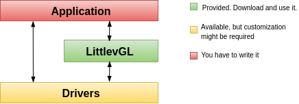
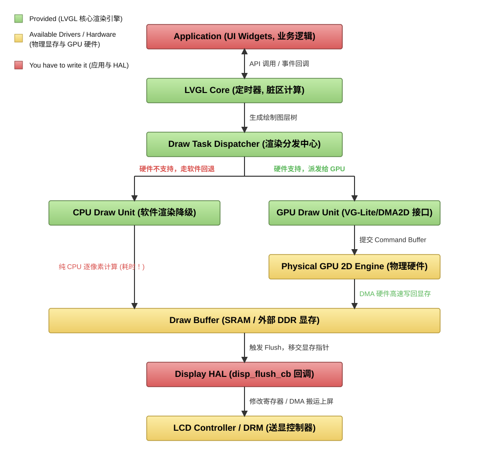
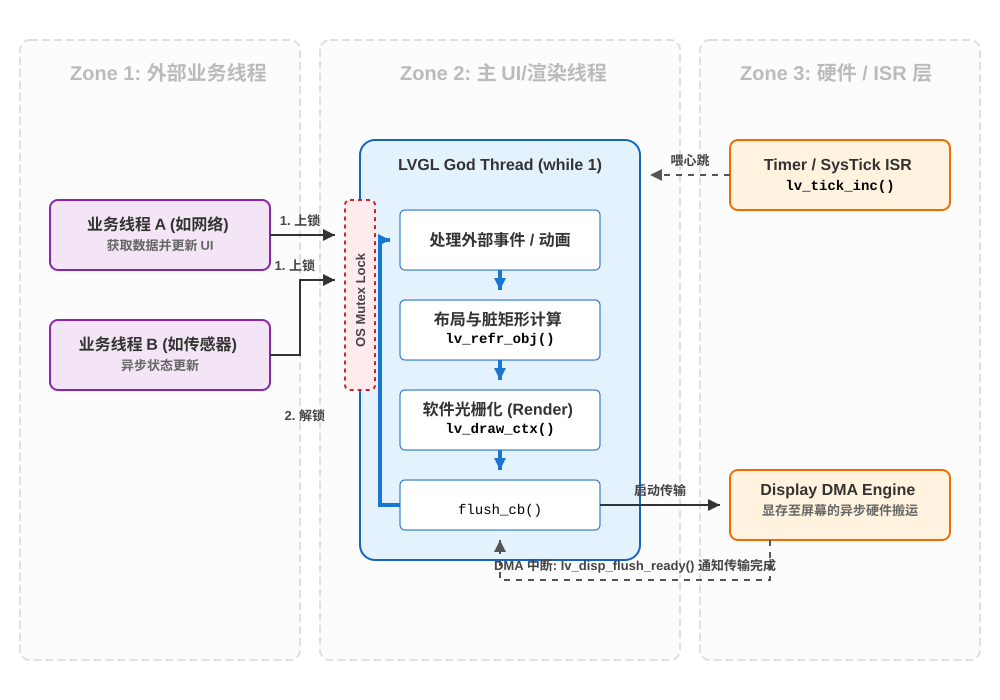

# 目录

# 参考

https://lvgl.100ask.net/7.11/documentation/02_porting/02_project.html    百问王LVGL中文教程手册文档


# 与安卓/weston对比理解



## **模块架构**



```
src/draw/sw/lv_draw_sw.c
	evaluate 调度机制：evaluate 竞标 --------> 混合渲染："竞标"其实就是能走加速器(VG-Lite)的尽量走，走不了的 CPU 兜底

DMA2D（VG-Lite） 能做什么？
	矩形填充  ✓
	图片搬运  ✓
	像素混合  ✓
	文字排版  ✗  没有 CPU 根本排不出来
	复杂路径  ✗  贝塞尔曲线怎么裁？不会
	向量图形  ✗  DMA2D 不认 SVG	
	
为啥安卓的应用框架不需要混合渲染呢？可以默认走hwui？
	A: GPU shader 是图灵完备的，任何像素计算它都能做

安卓实际上也有混合渲染（隐藏在Skia内部）：
	安卓渲染栈：
		App 层:    View.draw(Canvas)     ← "全走 GPU" 的错觉
				  ─────────────────────
		Skia 层:   文字? → CPU: FreeType 光栅化 → 纹理上传 → GPU 合成
				   SVG?  → CPU: 路径剖分为三角形 → 顶点上传 → GPU 渲染
				   Bitmap? → CPU: 解码 JPEG/PNG → 纹理上传 → GPU 贴图
				  ─────────────────────
		GPU 层:    最终像素着色（shader 执行）
	文字、路径剖分、图片解码全在 CPU 上做，只是 Skia 把这层藏起来了。框架层看到 "走 GPU"，但其实 CPU 干了大量脏活。

本质原因	GPU 是指令可编的	VG-Lite 是功能固化的

硬件            IP 来源           集成于           能力范围
───────────────────────────────────────────────────────────
DMA2D           ST 自研           STM32F4/F7/     填充 + 搬运 + 混合
(Chrom-ART)                      H7/U5/L4        (4 种固定操作)

VG-Lite         VeriSilicon       NXP i.MX RT     路径/渐变/描边/变换
(gc355/gc555)   (授权 IP)         1050/1060/1170   (~20 种固定操作)

OpenGL ES       ARM/Imagination   带 GPU 的 MPU    全部可编程 shader
(Mali/Adreno)   /Qualcomm         (如树莓派等)     (图灵完备)


混合渲染，并行的前提：CPU 和 GPU任务区域不重叠


原生code默认CPU绘制
打开GPU绘制（软件模拟的）：
	（1）修改 lv_conf.h
	// 第 318 行：从 0 改为 1
	#define LV_USE_DRAW_VG_LITE 1
	// 第 372 行：从 0 改为 1（在 #if LV_USE_DRAW_VG_LITE 块内）
	#define LV_USE_VG_LITE_THORVG   1
	2. CMake 路径修复
	env_support/cmake/main.cmake 第 73 行已从 src/others/vg_lite_tvg 修正为 src/debugging/vg_lite_tvg

软绘src/draw/sw/lv_draw_sw.c
	case LV_DRAW_TASK_TYPE_IMAGE:
    LV_LOG_ERROR("lv_draw_sw_image called");  // 加这行
    lv_draw_sw_image(t, t->draw_dsc, &t->area);
    break;
硬绘：lv_draw_vg_lite_img.c:48  加入LV_LOG_ERROR("chen lv_draw_vg_lite_img");


VG-Lite 绘制后端：
	文件	                 功能
	lv_draw_vg_lite.c	VG-Lite 后端入口，初始化/调度
	lv_draw_vg_lite_arc.c	圆弧绘制
	lv_draw_vg_lite_rect.c / _fill.c / _border.c	矩形填充/边框
	lv_draw_vg_lite_label.c	文字绘制
	lv_draw_vg_lite_img.c	图片渲染
	lv_draw_vg_lite_line.c	线段绘制
	lv_draw_vg_lite_triangle.c	三角形
	lv_draw_vg_lite_vector.c	矢量图形
	lv_draw_vg_lite_layer.c	图层混合
	lv_draw_vg_lite_box_shadow.c	阴影
	lv_vg_lite_path.c / _grad.c / _stroke.c / _utils.c	底层路径/渐变/描边/工具
	lv_vg_lite_decoder.c	VG-Lite 图片解码器


demo入口：
	/lv_port_pc_vscode/src/main.c
		lv_demo_widgets();函数 -------> (1)替换为 lv_demo_music() ........
									    (2)替换为 lv_example_button_1 ........
```


## **线程结构** ------ 驱动力



结论：

>   1、只有一个UI线程（也是渲染线程）
>
>   2、接受硬件中断！

## 美好之冲突解决（硬件中断与软件冲突）

**冲突：**

```java
我很难理解这个硬件中断，即使他快如闪电，但是对于UI线程来说，也是致命的，比如UI线程正在读一个变量，中断立刻改变了它。那么对于UI线程来说，这个变量就是不可预测的，不稳定的
果没有额外的保护机制，硬件中断对于正在读取同一块内存的 UI 线程来说就是毁灭性的。
```

-<font color='red'>软 + 软的冲突：用mutex锁</font>

硬件（Tick ISR） vs 软件（LVGL 主 UI 线程）-----调度者不同：

>   -   **LVGL 主 UI 线程（Thread）：** 它运行在**线程上下文（Thread Context）**。它的生杀大权掌握在操作系统的软件调度器（Scheduler）手里。OS 可以让它挂起（Suspend）、睡眠（Sleep）、或者时间片用完后把它切走。
>   -   **Tick ISR（Interrupt）：** 它运行在**中断上下文（Interrupt Context）**。它的生杀大权掌握在 CPU 内部的硬件中断控制器（如 ARM 的 NVIC）手里。只要硬件定时器的时间一到，电平一翻转，**无论主 UI 线程正在执行多么关键的代码，都会被瞬间强制打断（抢占）**，CPU 会立刻跳去执行 ISR 的代码。

### 方法一：关中断（<font color='red'>UI线程主控</font>）

当 UI 线程需要读取或修改这种“会被中断修改的共享变量”时，它会进入一个叫做临界区（Critical Section）的绝对安全领域。

```java
uint32_t lv_tick_get(void)
{
    uint32_t result;

    /* 1. 物理屏蔽全局中断（降下绝对防御护盾）*/
    __disable_irq(); 

    /* ---------------- 临界区开始 ---------------- */
    /* 此时任何硬件定时器哪怕到了时间，CPU 也绝对不理它，只能在门外憋着（挂起/Pending） */
    
    result = sys_tick; /* 2. 绝对安全地读取，哪怕它是 64 位的，也不会被撕裂 */
    
    /* ---------------- 临界区结束 ---------------- */

    /* 3. 恢复全局中断（撤销护盾） */
    /* 刚才在门外憋着的中断，会在这条指令执行后的一瞬间，立刻劈进来执行 */
    __enable_irq();  

    return result;
}
```

-------------------------->**缺点**：__disable_irq()与平台相关 （文件里硬编码了某一种硬件的关中断指令，它就丧失了通用性）


### 方法二：乐观并发控制（无锁解决冲突）

LVGL 原生代码中，并没有使用“拔掉物理中断插头（硬件临界区）”这种方法。

**平台无关性：**

```java
LVGL 的最高设计哲学是绝对的平台无关性（Platform Agnostic）。
它根本不知道自己是运行在 ARM Cortex-M（用 __disable_irq()）、还是 ESP32（用 portENTER_CRITICAL()）、亦或是 Linux 用户态。
```


```java
/* 定义两个全局易失性变量 */
volatile uint32_t sys_time = 0;     // 存储系统时间的变量
volatile uint8_t  tick_irq_flag;    // 哨兵旗帜

/* =========================================
 * 运行在中断 (ISR) 中的代码：负责写
 * ========================================= */
void lv_tick_inc(uint32_t tick_period) 
{
    tick_irq_flag = 0;        /* 核心动作：只要中断触发，立刻把旗子“拔掉”！ */
    sys_time += tick_period;  /* 更新时间 */
}

/* =========================================
 * 运行在主 UI 线程中的代码：负责读
 * ========================================= */
uint32_t lv_tick_get(void) 
{
    uint32_t result;
    
    /* 经典的多线程乐观读取循环 */
    do {
        tick_irq_flag = 1;    /* 1. UI 线程先插上一面“旗子” */
        
        result = sys_time;    /* 2. 尝试读取系统时间（这一步可能发生数据撕裂） */
        
    /* 3. 检查旗子还在不在？
       如果旗子变成 0 了，说明在执行第 2 步的时候，中断像闪电一样劈进来了。
       既然被打断了，刚才读出来的 result 肯定是错乱的，那我就废弃掉，再循环读一次！
       如果旗子还是 1，说明刚才没被中断，数据是完美的，退出循环。 */
    } while(!tick_irq_flag);  

    return result;
}
```

-<font color='red'>绝妙之处：</font>

>   -<font color='red'>1、没有任何锁！！！！</font>
>
>   2、**零硬件依赖**：全靠 C 语言的 `while` 循环和基础变量控制，可以在任何一块几毛钱的单片机上完美编译运行。
>
>   3、**永远不阻塞中断**：ISR（中断服务函数）永远处于最高优先级，它想写就写，不需要等待谁释放锁，保证了极高的实时响应。
>
>   4、**极低的性能开销**：在 99.99% 的情况下，UI 线程读取 `sys_time` 的那一瞬间是不会恰好撞上中断的，所以 `while` 循环只会执行一次，几乎零损耗。<font color='red'>只有在那极小概率撞车的情况下，它才会重新读一次。</font>

**生活化同构 --------- 一写多读（1读）：**

>   <font color='red'>多个人抄写</font>高铁站的“滚动时刻表”（最完美的对应）
>   想象你正在高铁站候车，抬头看着那个巨大的滚动航班/列车信息大屏。
>
>   大屏的后台刷新系统 = 硬件中断 (ISR)： 它极其霸道，时间一到，“唰”地一下就会刷新屏幕上的车次信息。它绝对不可能因为有个旅客正在抄信息，就停下来等。
>
>   你 = UI 线程 (Reader)： 你的动作比较慢，你需要低头把“车次、站台号、发车时间”写到你的小本子上。
>
>   致命危机 (数据撕裂)： 假设大屏上显示“G123，站台5”。你刚在纸上写下“G123”，此时大屏“唰”地刷新了，变成了下一趟车“G456，站台8”。你低着头没发现，接着写了“站台8”。结果你的本子上记成了“G123，站台8”——这是一个完全错误、拼凑出来的假数据。跑去 8 站台你绝对会错过你的车。
>
>   互斥锁（加锁）的荒谬性：
>   如果你用“互斥锁”的思维，这就相当于你拿个大喇叭在候车大厅喊：“控制室注意！我正在抄信息，大屏立刻停止刷新！等我这 5 秒钟抄完了你再动！”
>   这显然是不可能的，会扰乱整个高铁站的运行。
>
>   LVGL 乐观锁（标志位重试）的日常做法：
>   事实上，作为一个有经验的旅客，你是这么做的：
>
>   设下标记 (Flag = 1)： 抄写前，你先看一眼屏幕右下角的一个 “正在显示第 1 页” 的小红点。
>
>   低头干活 (Read)： 你飞速地低头抄写。
>
>   抬头验货 (Check Flag)： 抄完后，你立刻抬头再看一眼右下角。
>
>   情况 A： 如果还是“第 1 页”，说明你低头的时候大屏没动。你抄的数据是 100% 完美 的，放心走人。
>
>   情况 B (重试)： 如果右下角变成了“第 2 页” (Flag 被后台系统改成了 0)，你立刻意识到：“糟了，我刚才抄的时候屏幕翻篇了！” 你叹了口气，把纸上的字划掉，等屏幕转回来，重新抄一遍。
>
>   这就是 LVGL do...while(!flag) 的<font color='red'>本质：不锁屏幕，事后验证，如果变化，推倒重来。</font>

**本质特征**：

>   <font color='red'>写的刚性</font>！！！！

**最完美的归宿（使用条件）**是：

>   1.  **<font color='red'>一写多读 </font>**
>
>       (1) 不是必要条件  （2）可以最大发挥价值（写的地方没有加锁，对其他读没有影响!!!）
>
>   2.  **<font color='red'>写操作频率非常低</font>**（极难发生碰撞）
>
>   3.  **读操作毫无副作用**
>
>   4.  **运行在单核且无复杂缓存机制的系统中**


## 代码路径结构

```
lvgl_workspace/
├── ⚙️ 1. 工程构建与环境配置 (Build & Environment) - [外层支撑]
│   ├── CMakeLists.txt         ▶ [构建骨架] 定义编译目标和宏。决定了库是如何跨平台编译并链接到宿主系统（如 Linux/RTOS）的。
│   ├── library.properties     ▶ [包管理] Arduino 等特定平台的依赖与版本识别文件。
│   ├── pack_code.py           ▶ [自定义工具] 你上传的 Python 打包脚本，用于代码的提取和过滤。
│   ├── README.md              ▶ [项目门面] 快速启动说明。
│   └── LICENCE.txt            ▶ [合规声明] MIT 开源协议。
│
├── 🧠 2. 顶层 API 与静态契约 (API & Contracts) - [系统边界]
│   ├── lvgl.h                 ▶ [外观模式 API] 唯一对外的 C 头文件，向应用层屏蔽了 src/ 下所有的复杂内部实现。
│   ├── lv_version.h           ▶ [版本控制] 编译期的版本宏定义，用于业务层做特性兼容。
│   └── lv_conf_template.h     ▶ [静态裁剪总闸] 极其重要的配置文件模板！通过宏定义控制 `src/` 中各个组件的开关、显存分配和色深，实现极致的内存控制。
│
├── 🫀 3. 核心源码层 (src/ Engine) - [系统内核 - 重点展开]
│	├── core/                ▶ [框架基石：DOM与事件流] 系统的“大脑”
│	│   ├── lv_obj.c/h       -> 【核心对象模型】一切 UI 组件的基类。通过 C 语言结构体嵌套实现“继承”。管理父子层级关系、坐标域和状态。
│	│   ├── lv_refr.c/h      -> 【渲染总管/脏矩形引擎】核心中的核心！负责收集失效区域（Invalidated Areas），计算脏矩形交集，并触发真正的渲染管线。类似于 SurfaceFlinger 的 Damage Region 管理。
│	│   ├── lv_disp.c/h      -> 【显示管理器】管理多个物理屏幕的逻辑映射，维护各自的渲染缓冲区（Draw Buffer）。
│	│   ├── lv_event.c/h     -> 【事件总线】基于观察者模式，处理事件的冒泡与捕获。
│	│   └── lv_group.c/h     -> 【焦点管理器】专为非触摸外设（如编码器、键盘）设计的逻辑焦点轮转系统。
│	│
│	├── draw/                ▶ [图形渲染管线：光栅化与 GPU 接口] 系统的“画笔”
│	│   ├── lv_draw.c        -> 【渲染入口】接收脏矩形，分发具体的绘制任务（画背景、画边框、画阴影、画文字）。
│	│   ├── sw/              -> 【软件渲染器 (Software Renderer)】CPU 回退方案。包含高度优化的纯 C 语言画线、混合（Blend）、抗锯齿（AA）算法。
│	│   └── [gpu_hooks]/     -> 【硬件加速层】(如 nxp_pxp, stm32_dma2d, sdl)。这里定义了 Draw Context 抽象，允许将特定的图元绘制任务卸载（Offload）给 2D 图形加速器或 GPU。
│	│
│	├── widgets/             ▶ [标准组件库：UI 具象化] 系统的“血肉”
│	│   ├── lv_btn.c         -> 【按钮】继承自 lv_obj，极简实现。
│	│   ├── lv_label.c       -> 【文本标签】处理复杂的长文本换行、滚动动画（Marquee）。
│	│   ├── lv_chart.c       -> 【图表】复杂组件代表，涉及内部数据流和定制化绘制规则。
│	│   └── ... (几十种标准组件)
│	│
│	├── font/                ▶ [排版与字库引擎] 
│	│   ├── lv_font.c        -> 【字体接口】统一的字距（Kerning）、基线匹配和点阵获取接口。
│	│   └── lv_font_fmt_txt.c-> 【原生格式解析】解析 LVGL 自定义的、高度压缩的矢量/点阵混合字体格式。
│	│
│	├── layout/              ▶ [动态盒模型引擎] 
│	│   ├── flex/            -> 【弹性布局】实现类似 CSS 的 Flexbox 算法。
│	│   └── grid/            -> 【网格布局】实现二维的 Grid 布局逻辑。
│	│
│	├── hal/                 ▶ [硬件抽象层] (在较新版本中逐渐与 core 融合或重构)
│	│   ├── lv_hal_disp.c    -> 【显示驱动契约】对接底层 Framebuffer 刷屏函数 (flush_cb)。
│	│   ├── lv_hal_indev.c   -> 【输入驱动契约】对接触摸屏、鼠标、按键的读取回调 (read_cb)。
│	│   └── lv_hal_tick.c    -> 【系统心跳】提供系统时钟基准。
│	│
│	└── misc/                ▶ [基础工具链] 
│		├── lv_anim.c        -> 【插值动画引擎】基于时间轴的回调式动画管理器。
│		├── lv_tlsf.c        -> 【内存分配器】为无 OS 环境自带的实时内存池算法，对抗内存碎片。
│		├── lv_math.c        -> 【定点数数学库】查表法实现的快速三角函数、平方根，避免浮点运算。
│		└── lv_timer.c       -> 【定时器与异步任务】系统的任务调度器，驱动整个 LVGL 的主循环（`lv_timer_handler`）。
│
├── 🎨 4. 业务验证与演示层 (demos/) - [应用切片]
│   ├── lv_demos.h/c           ▶ 统一的 Demo 路由管理器。
│   ├── benchmark/             ▶ [渲染压测] 极限测试帧率 (FPS) 和 CPU 负载。
│   ├── music/                 ▶ [综合业务] 包含 MVC 雏形的复杂高保真 UI 示例。
│   ├── flex/                  ▶ [布局验证] 弹性盒模型的直观展示。
│   └── keypad_encoder/        ▶ [焦点验证] 无触摸屏环境下的按键/编码器焦点流转演示。
│
└── 📚 5. 辅助支撑与外围扩展 (边缘路径 - 折叠)
    ├── examples/              ▶ [未展开] 各个独立 Widget 的极简 API 调用代码片段（比 demos 更底层）。
    ├── env_support/           ▶ [未展开] 针对 Zephyr, RT-Thread, CMake 等环境的适配模板代码。
    ├── scripts/               ▶ [未展开] 官方用于自动化生成文档、字库转换的辅助脚本。
    ├── tests/                 ▶ [未展开] 针对各个模块的 CI 单元测试用例。
    └── docs/                  ▶ [未展开] 官方使用文档的 Markdown 源文件。
```


# code

~~拉取纯FreeRTOS-Kernel内核仓库：~~

```java
git clone --branch V10.5.1 --depth=1 https://github.com/FreeRTOS/FreeRTOS-Kernel.git
```

~~拉取 LVGL:~~

```java
git clone --branch v9.2.2 --depth=1 https://github.com/lvgl/lvgl.git
```

官方的Linux模拟器环境：

```
0.把 LVGL 的核心库（作为子模块）一并下载下来。
git clone --recursive https://github.com/lvgl/lv_port_pc_vscode.git

#编译：
cd lv_port_pc_vscode
2. 创建一个独立的编译目录（保持源码干净）并进入
mkdir build && cd build
3. 让 CMake 生成 Makefile 构建脚本（.. 代表上一级目录）
cmake ..
4. 开启多线程满血编译（你的 CPU 有几个核就火力全开）
make -j$(nproc)
```


# 环境构建

FreeRTOS V10.5.1   LVGL 版本：9.2.2

