# View/ViewGroup

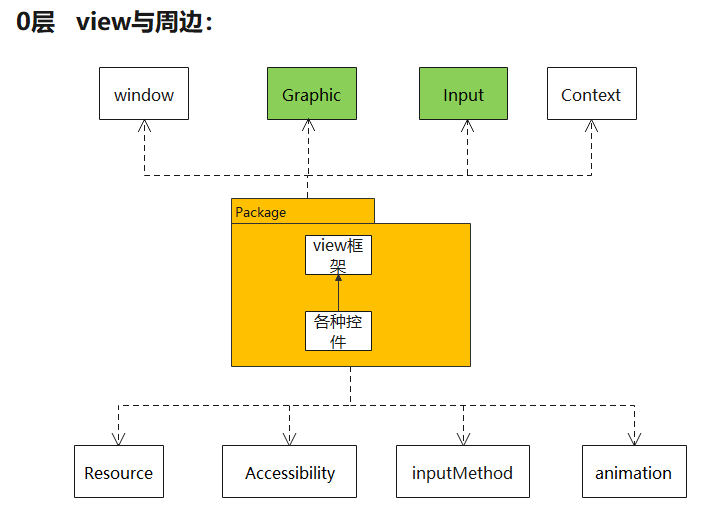

（G:\working_pan\doc_my\Draw\view_viewGroup.eddx）

其中，`Graphic与Input`是核心 ,  与用户交互的两个功能点：看和触摸

## 功能点0层

见li 11

## UI刷新 -invalidate

### 流程图：

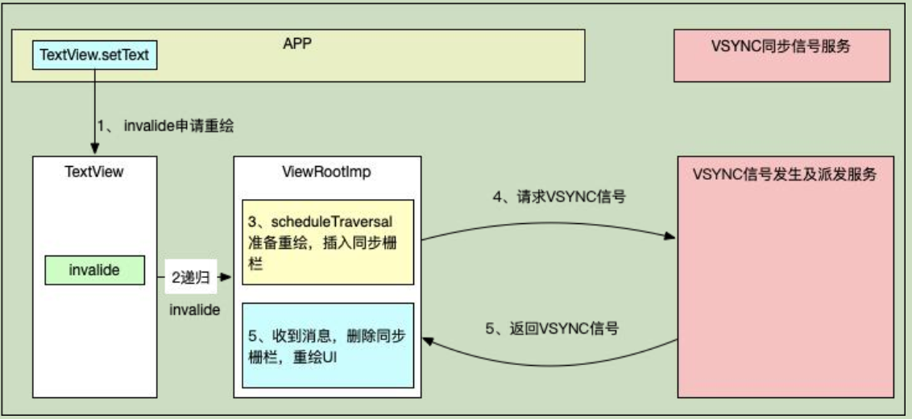

`关键函数：vsync信号`

> 1、必然有请求：   ~~invalidate -----> scheduleTraversal~~： 请求vsync、设置同步屏障。
>
> 2、必然有执行:    ~~perform................~~           绘制、 取消同步屏障？


新增枝叶：
1、为了给 vsync信号 带来的 vsync msg  让道， 请求vsnc的同时（自然），插入同步屏障：

--------> 见handler 同步屏障


必然：

1、所有 控件的 invalidate操作，最终都  转接到 ViewRootImpl的invalidate   (设计模式上，单一职责)

### 调用栈角度：

1、请求：

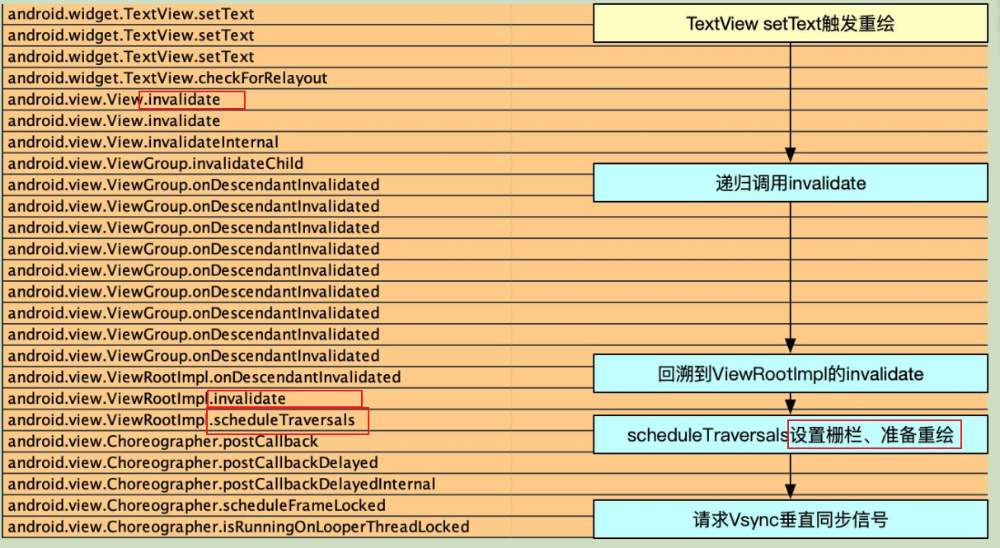


2、vsync信号来后，执行：

等到VSYNC到来后， 会移除同步栅栏 ----- 》  TODO: 具体哪里？

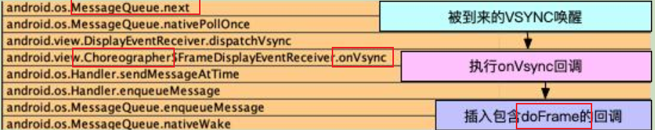

todo：很奇怪，这里为啥涉及到两次 消息？


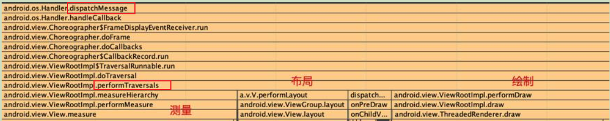


### 关于首帧


#### 首次 View 的绘制流程是在什么时候触发的?----> 即首帧的触发

Activity  Resume时-> WindowManagerImpl.addView -> WindowManagerGlobal.addView-> ViewRootimpl.setView -> ViewRootimpl.requestLayout ->ViewRootImpl.scheduleTraversals 


####  onResume函数中度量的高有效?

 Activity第一次调用onResume的时候是无效的 

Activity第二次之后调用onResume是有效


因为首次request vysn是在addwindow过程中（viewrootimpl的setview）
下一帧，才真正绘制（包括测量、layout、draw）


## 性能方面的优化：

房间中椅子坏了，不会换整个房子
局部刷新：dirty脏区


## 面试题：

### 多次invalidate  会刷新几次？

代码上： 有标致

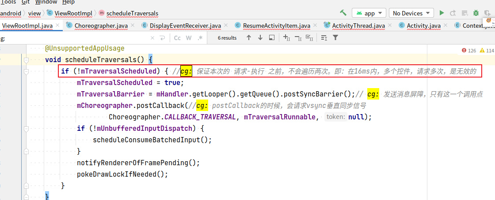

设计上：是不得不的。 因为vsync信号，从上到下隔离


```java
1.onResume函数中度量的高有效?


2.Activity, Window,View三者的联系和区别? 

3. 首次 View 的绘制流程是在什么时候触发的?

 
4.我们调用invalidate()之后会马上进行屏幕刷新吗?

5.我们说丢帧是因为主线程做了耗时操作,为什么主线程做了耗时操作就会引起丢帧?

问题1和问题3和问题4，是一个东西
因为首次request vysn是在addwindow过程中（viewrootimpl的setview）
下一帧，才真正绘制（包括测量、layout、draw）
```


### Activity, Window,View三者的联系和区别? 


### 关于首帧问题

见《关于首帧》


### 我们调用invalidate()之后会马上进行屏幕刷新吗?


### 我们说丢帧是因为主线程做了耗时操作,为什么主线程做了耗时操作就会引起丢帧?

### 都有消息屏障，为什么还会掉帧呢？

因为消息屏障之前的消息（具体指哪些？），还会执行的
主线程加的消息屏障


# view-Graphic(HWUI) 纵向0层

即一帧的整体流程：  **纵轴为时间**

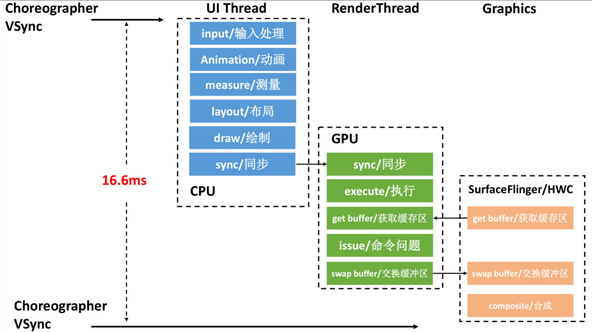


[图来源](  https://www.androidperformance.com/2021/04/24/android-systrace-smooth-in-action-1/#/%E4%BB%8E%E6%89%A7%E8%A1%8C%E9%A1%BA%E5%BA%8F%E7%9A%84%E8%A7%92%E5%BA%A6%E6%9D%A5%E7%9C%8B)


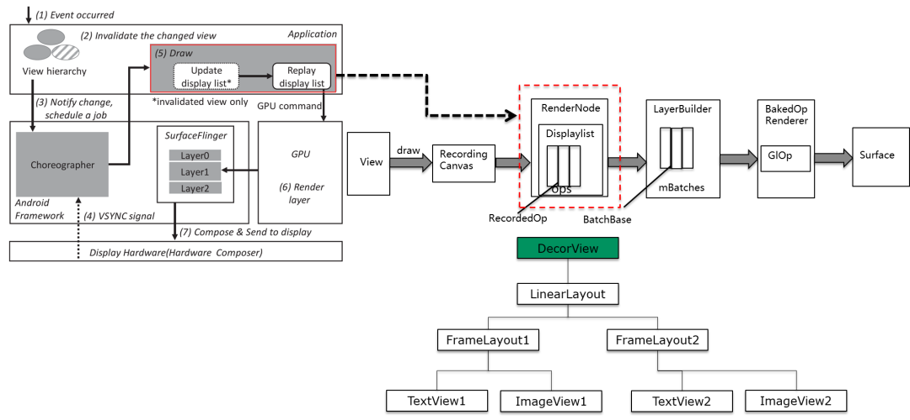

[图来源](https://blog.csdn.net/feelabclihu/article/details/134657876#:~:text=%E5%9B%BE%E4%B8%80-,%E5%9B%BE%E4%BA%8C,-1.HWUI%20Skia)

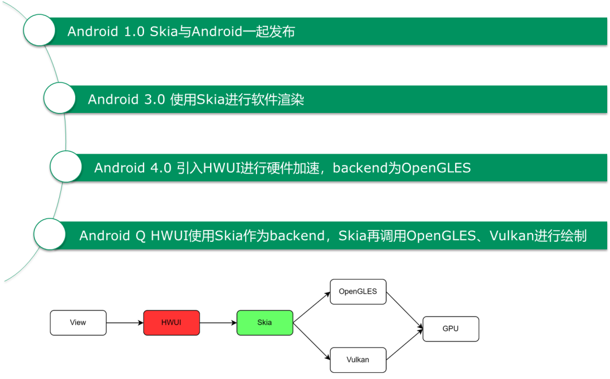

好文： https://blog.csdn.net/feelabclihu/article/details/134657876  多图文教你看懂单个图层的绘制流程


为什么选取一帧呢？  一帧即是  for循环中一个


TODO:  上图是一个好的纵向0层图，借鉴其画法：

1、`纵轴是时间、横轴为 空间`（进程、线程、类）  ------->   跟时序图很像

2、只列 最核心函数/功能  +  <font color='red'> 没有调用栈</font>         ------->   跟时序图差异


证据+细节：

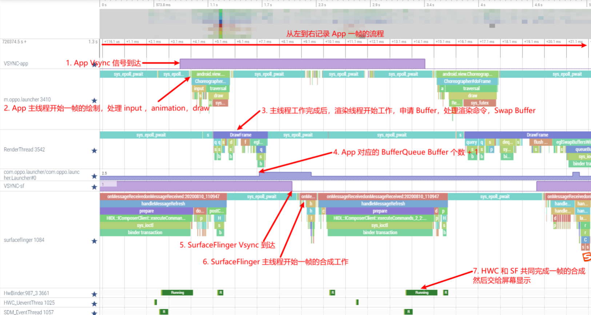


## [Skia深入分析](https://blog.csdn.net/zhuhongshu/article/details/71435140)

参考：https://huanle19891345.github.io/en/android/system/%E7%B3%BB%E7%BB%9F%E7%BB%98%E5%88%B6/%E8%BD%AF%E4%BB%B6%E7%BB%98%E5%88%B6/      


==SkCanvas是按照SkBitmap的方法去关联GraphicBuffer==

一、渲染层级 从渲染流程上分，Skia可分为如下三个层级：

1.指令层：SkPicture、SkDeferredCanvas->SkCanvas

这一层决定需要执行哪些绘图操作，绘图操作的预变换矩阵，当前裁剪区域，绘图操作产生在哪些layer上，Layer的生成与合并。

2.解析层：SkBitmapDevice->SkDraw->SkScan、SkDraw1Glyph::Proc

这一层决定绘制方式，完成坐标变换，解析出需要绘制的形体（点/线/规整矩形）并做好抗锯齿处理，进行相关资源解析并设置好Shader。

3.渲染层：SkBlitter->SkBlitRow::Proc、SkShader::shadeSpan等

这一层进行采样（如果需要），产生实际的绘制效果，完成颜色格式适配，进行透明度混合和抖动处理（如果需要）。


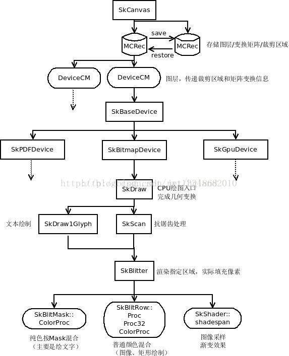


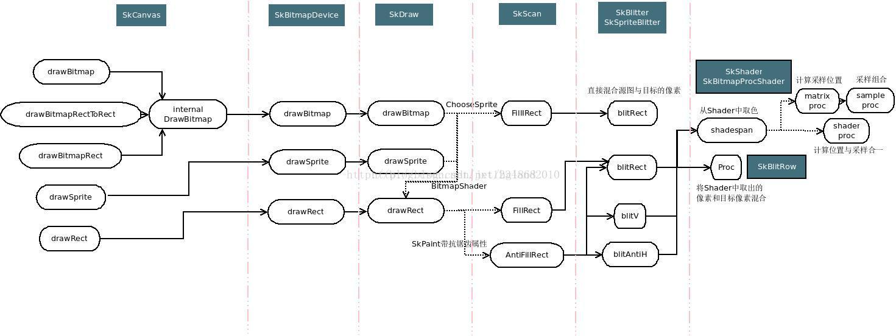

