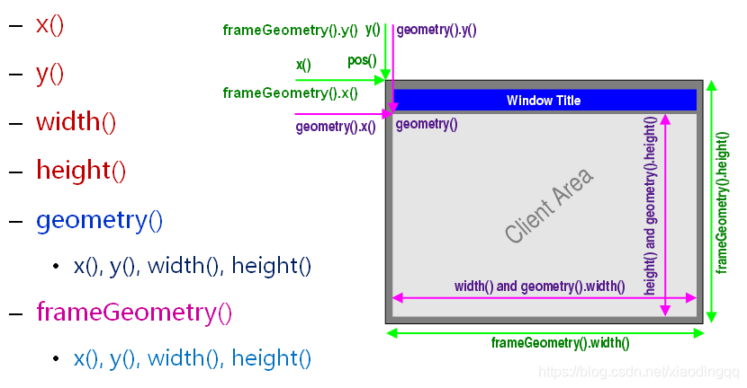

# QT能力

## 窗口几何坐标系统及几何布局




 [图来源](https://blog.csdn.net/qq_24127015/article/details/95115966)


其他参考：

>   [Qt 窗口几何坐标系统（示例程序）: geometry，frameGeometry](https://blog.csdn.net/ken2232/article/details/129474065?spm=1001.2101.3001.6650.2&utm_medium=distribute.pc_relevant.none-task-blog-2~default~CTRLIST~Rate-2-129474065-blog-95115966.235^v43^pc_blog_bottom_relevance_base7&depth_1-utm_source=distribute.pc_relevant.none-task-blog-2~default~CTRLIST~Rate-2-129474065-blog-95115966.235^v43^pc_blog_bottom_relevance_base7&utm_relevant_index=5 )

## window

窗口部分区域：  显示透明化 & 事件透明化  & 不规则窗体的实现

> [setMask接口-官网](https://doc.qt.io/qt-6/qwindow.html#setMask )
>
> [Qt之遮罩—实现不规则窗体](https://blog.csdn.net/Jacksqh/article/details/132584102 )

## widget

 [setStyleSheet用法](https://blog.csdn.net/boyemachao/article/details/91794698)

背景色设置：

```java
 //background:red
```

背景图片设置：

```java
 rootWidget->setStyleSheet("QWidget { background-image: url(/home/chen/workingSpace/QT/DEMO/png/gassi.png); }");
 
 // background-image:
 //border-radius  设定圆角的按钮
```