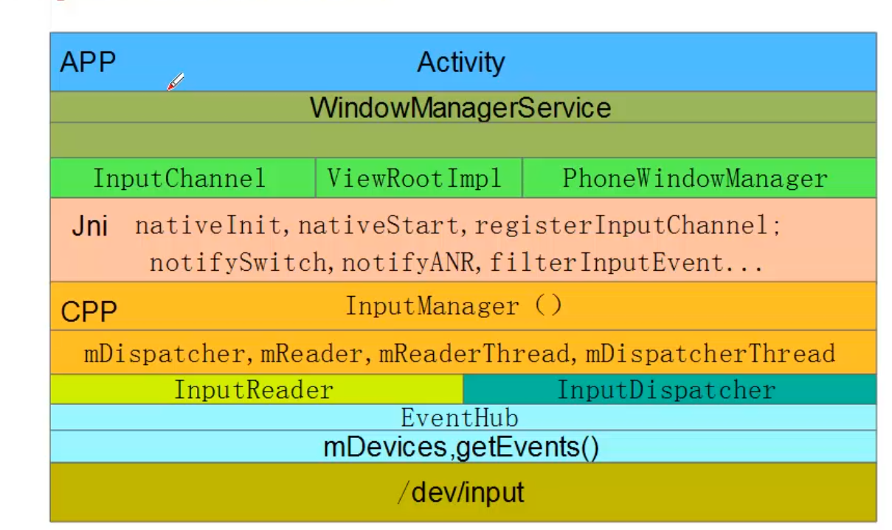
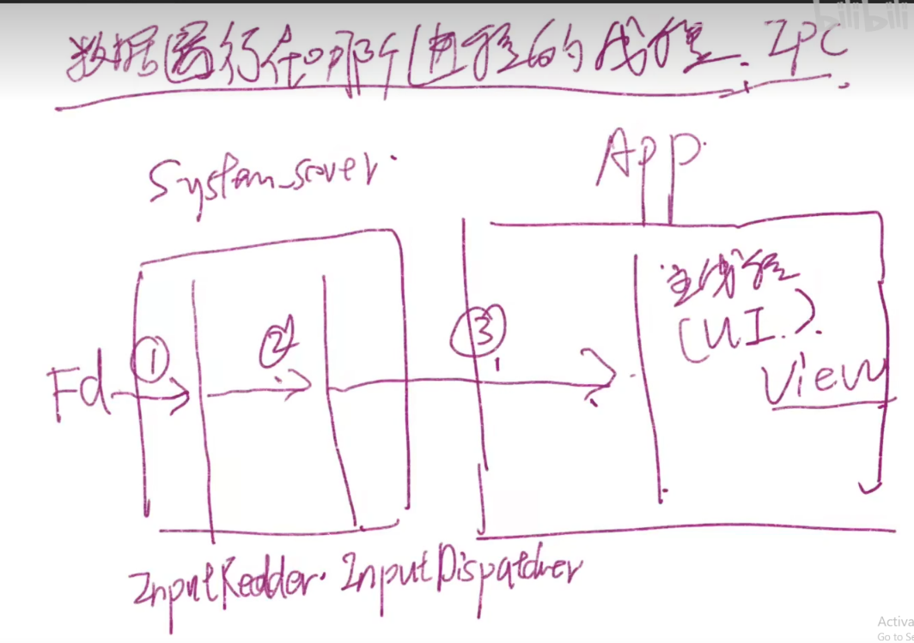
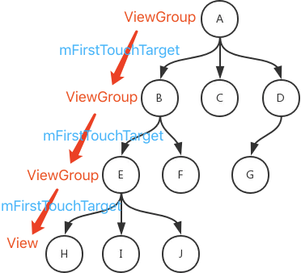
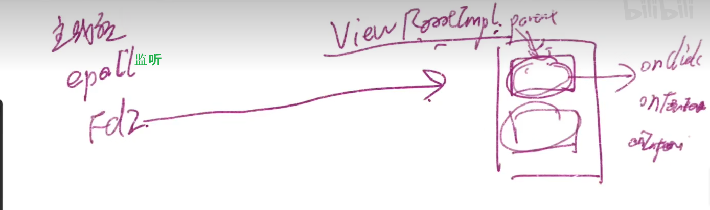
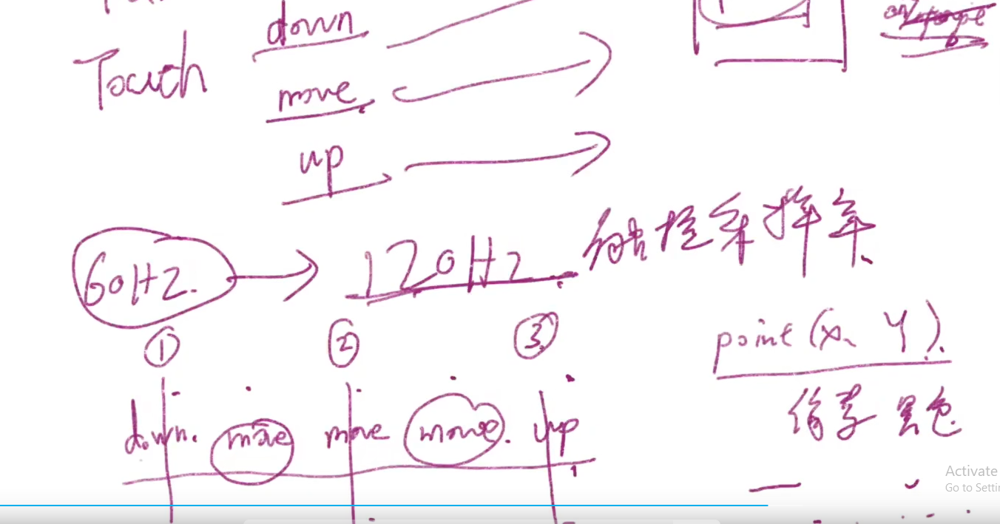
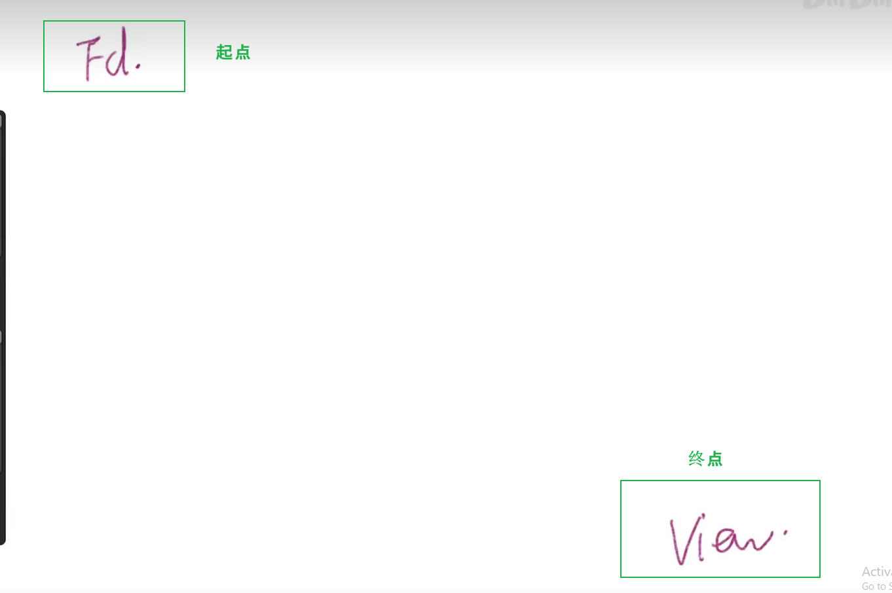
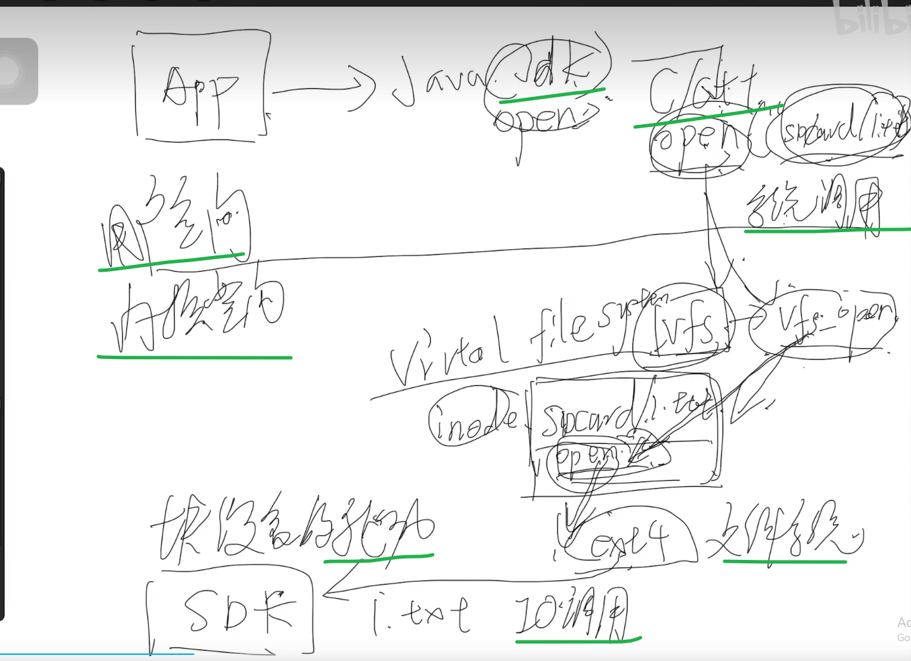

# 目录


# input系统

## 0层结构


%accordion%参考的0层图%accordion%

> 
>
> --------------------->  方向比较好，上下方向；但是没有关系连线！
>
> %/accordion%




### 结构之线程角度

IMS线程结构：

```
 IMS.start(启动)
     nativeStart
         InputManager.start
             InputReaderThread->run
             InputDispatcherThread->run
```

- ------------->结论： IMS下是两个线程：读取和分发

启动的类顺序：

```
 InputManagerService(初始化)
     nativeInit
         NativeInputManager
             EventHub
             InputManager
                 InputDispatcher
                     Looper
                 InputReader
                     QueuedInputListener
                 InputReaderThread
                 InputDispatcherThread
```

InputDispatch线程结构：

补充，参考：

> Input系统—事件处理全过程 - Gityuan博客 | 袁辉辉的技术博客
>
> 交互过程图---socket

[android input 点击 android input系统*mob6454cc7966b9的技术博客*51CTO博客](https://blog.51cto.com/u_16099334/6439040)

--------> 0层结构、1层结构用这里的！！！！


## 1层流程


%accordion%参考的gityuan的input分发流程图：%accordion%

> 
>
> ~~图见： http://gityuan.com/2016/12/31/input-ipc/~~
>
> -----------------> TODO: 流程图画的不好: 
>
>  (1) 没有基于结构图！！！！ (2) 方向不是事件的上下方向
>
> %/accordion%


## TouchEvent事件分发的点

inputDispatcher 分发到哪个窗口：

代码：sp<WindowInfoHandle> InputDispatcher::findTouchedWindowAtLocked

日志：

```java
 ALOGD("debug_magic_input pos:[%d,%d], deviceId:%d, displayId:%d, pid:%d, %s",
     x, y, touchState ? touchState->deviceId : -1, displayId,
 windowInfo->ownerPid, windowInfo->name.c_str());
```

inputDispatcher 怎么知道窗口信息的？

## KeyEvent事件

### APP侧分发：

InputDispatcher::dispatchKeyLocked    -------> 找具体的进程

对于输入法，back键 KeyEvent走：

### 疑问：

TODO:

真正的分发点在哪里？上图，已经进入进程了

是否消费，即 event.dispatch 返回给了谁？

与硬件键盘事件，是一个

IMS为啥要有两个线程？一个·线程从模型结构上看，有啥缺陷嘛？

### 处理

KeyEvent.java:

```java
     public final boolean dispatch(Callback receiver, DispatcherState state,
             Object target) {
         switch (mAction) {
             case ACTION_DOWN: {
                 mFlags &= ~FLAG_START_TRACKING;
                 if (DEBUG) Log.v(TAG, "Key down to " + target + " in " + state
                         + ": " + this); //关键日志
```

关键日志：

对于输入法，处理：

```java
 public boolean onKeyDown(int keyCode, KeyEvent event) {
     if (event.getKeyCode() == KeyEvent.KEYCODE_BACK) {
         final ExtractEditText eet = getExtractEditTextIfVisible();
         if (eet != null && eet.handleBackInTextActionModeIfNeeded(event)) {
             return true;
         }
         if (handleBack(false)) {  // 这里去doHideWindow()了
             event.startTracking();
             return true;
         }
         return false;
     }
     return doMovementKey(keyCode, event, MOVEMENT_DOWN);
 }
```

## **Touch目标窗口的确定：**

--------------------------> **简言之，**目标窗口的确定：

> 可以根据触摸事件的位置   +   窗口的属性

> Touch事件，不是对焦点窗口分发的！！！！！！！！！！！！而是根据位置区分！！！！！----------------> 自然
>
> ------------> 因为Touch不需要焦点，他知道对哪个窗口分发
>
> key事件，自然是对焦点窗口

根据位置区分的证明：

```java
 sp<WindowInfoHandle> InputDispatcher::findTouchedWindowAtLocked(int32_t displayId, int32_t x,
                                                                 int32_t y, TouchState* touchState,
                                                                 bool addOutsideTargets,
                                                                 bool addPortalWindows,
                                                                 bool ignoreDragWindow) {
     if ((addPortalWindows || addOutsideTargets) && touchState == nullptr) {
         LOG_ALWAYS_FATAL(
                 "Must provide a valid touch state if adding portal windows or outside targets");
     }
     // Traverse windows from front to back to find touched window.
     const std::vector<sp<WindowInfoHandle>>& windowHandles = getWindowHandlesLocked(displayId);
     for (const sp<WindowInfoHandle>& windowHandle : windowHandles) {
         if (ignoreDragWindow && haveSameToken(windowHandle, mDragState->dragWindow)) {
             continue;
         }
         const WindowInfo* windowInfo = windowHandle->getInfo();
         if (windowInfo->displayId == displayId) {
             auto flags = windowInfo->flags;
 
             if (windowInfo->visible) { // 【】 窗口的属性1 visible
                 if (!flags.test(WindowInfo::Flag::NOT_TOUCHABLE)) {  // 【】 窗口的属性2 TOUCHABLE
                     bool isTouchModal = !flags.test(WindowInfo::Flag::NOT_FOCUSABLE) &&
                             !flags.test(WindowInfo::Flag::NOT_TOUCH_MODAL);
                     if (isTouchModal || windowInfo->touchableRegionContainsPoint(x, y)) { // 【】 触摸事件的位置
                         int32_t portalToDisplayId = windowInfo->portalToDisplayId;
                         if (portalToDisplayId != ADISPLAY_ID_NONE &&
                             portalToDisplayId != displayId) {
                             if (addPortalWindows) {
                                 // For the monitoring channels of the display.
                                 touchState->addPortalWindow(windowHandle);
                             }
                             return findTouchedWindowAtLocked(portalToDisplayId, x, y, touchState,
                                                              addOutsideTargets, addPortalWindows);
                         }
 
                         //add dual windows
                         ALOGD("debug_input pos:[%d,%d], deviceId:%d, displayId:%d, pid:%d, %s",
                                 x, y, touchState ? touchState->deviceId : -1, displayId,
                                 windowInfo->ownerPid, windowInfo->name.c_str());
 
                         // Found window.
                         return windowHandle;
                     }
                 }
 
                 if (addOutsideTargets && flags.test(WindowInfo::Flag::WATCH_OUTSIDE_TOUCH)) {
                     touchState->addOrUpdateWindow(windowHandle,
                                                   InputTarget::FLAG_DISPATCH_AS_OUTSIDE,
                                                   BitSet32(0));
                 }
             }
         }
     }
     return nullptr;
 }
 
```

窗口信息的获取：

> 一句话，简言之:
>
> > wms注册给IMS的：windowHandles
>
> 具体：
>
> > wms.addWindow  ----> InputMonitor ---> IMS.updateInputWindowsLw ---> native ---> InputManager.setInputWindows ----> InputDispatcher..setInputWindows -----> 更新windowHandles
>
> 参考：[android input 点击 android input系统*mob6454cc7966b9的技术博客*51CTO博客](https://blog.51cto.com/u_16099334/6439040)


## （次要）例外之HOME事件的拦截

自然，HOME事件不能让它到应用层，所以会被提前拦截：


# 参考

gityuan系列文章：

> [Input系统—启动篇](https://gityuan.com/2016/12/10/input-manager/   )
>
> [Input系统—事件处理全过程](https://gityuan.com/2016/12/31/input-ipc/ )


# Android事件的分发------从viewRootImpl到Activity


总结为，先有一个环


# Android事件的分发------从Activity开始

## 简介


<font color='red'>注意点</font>：
Q: 分发事件的对象是MotionEvent，没有touchevent与click事件？

A:  没有Touch事件（TouchEvent）， 没有click事件（ClickEvent）。原因： motion用的很恰当。手指触摸，必然是一段时间，一段距离 ------->  即 motion移动

click表示一瞬，其实是没有的

------->  虽然有时候表达成 touch事件、click事件


## 模型

参考，好文： [Android面试题（27）-android的事件分发机制](https://blog.csdn.net/pgg_cold/article/details/79472193?utm_medium=distribute.pc_relevant.none-task-blog-2~default~baidujs_baidulandingword~default-0-79472193-blog-125568753.pc_relevant_multi_platform_whitelistv3&spm=1001.2101.3001.4242.1&utm_relevant_index=3)

**生活化模型：** 项目经理分发任务模型：

>   项目经理（Activity）
>   任务（事件）
>   主管(viewGroup)
>   员工（view）
>   友商安排进来的员工（Listener监听者）


<font color='red'>继承表达的含义： 继承从功能的角度来看，表达  功能更多、更强  的意思</font>
自然：~~主管继承员工（viewGroup继承view）~~  
           ~~主管管理员工~~  ---》继承多出的功能，自然


基于模型自然有：
1、自然，~~每个角色都有两种能力：向下分发的任务的能力（dispatchTouchEvent）、处理事件的能力onTouchEvent~~

2、特例：~~拦截任务向下传递的能力onInterceptTouchEvent，只属于主管viewGroup~~。这是自然的，~~因为 项目经理要是拦截，项目不要干了。普通员工没有拦截必要，在最底层~~。


现在你所在的公司中有一项任务被派发下来了，项目经理把项目交给你的老大，你的老大老大手下有很多人，看了看觉得你做很合适，把这个任务交给你了；`如果友商安排了间谍，那自然先被间谍抢去了（即view对外分发）`。如果没有间谍，你一看觉得还行，你就接下来了；


## 基于模型，viewGroup的分发 详解

参考：

>   [从责任链模式看Android事件分发](https://mp.weixin.qq.com/s/sSPFz3E5gncYiMMFtF_xlg)      ------>     <font color='red'>好文</font> 
>   [ViewGroup事件分发机制详解](https://blog.csdn.net/tony499074462/article/details/102499302)
>   [Android View 事件分发机制源码详解(ViewGroup篇)](https://blog.csdn.net/a553181867/article/details/51287844)

一句话总结：

> 安卓事件分发机制： 是双责任链（~~树责任链 + 链表责任链~~） ，见图
>
> 
>
> 具体讨论见  设计模式----责任链模式
>
> 


<font color='red'>viewGroup分发核心问题</font>： ViewGroup那么多view，dispatch如何找到对应消费的view？

A：dispatch流程里，对 根据 view可见的Z向位置，对各个子view进行排序： 

```java
// ViewGroup.java
buildTouchDispatchChildList() {
    final float currentZ = nextChild.getZ();

    // insert ahead of any Views with greater Z
    int insertIndex = i;
    while (insertIndex > 0 && mPreSortedChildren.get(insertIndex - 1).getZ() > currentZ) { //找到对应的Z位置
        insertIndex--;
    }
    mPreSortedChildren.add(insertIndex, nextChild);  // 排序
}

public boolean dispatchTouchEvent(MotionEvent ev) {
	final ArrayList<View> preorderedList = buildTouchDispatchChildList(); // 排序
    for (int i = childrenCount - 1; i >= 0; i--) { // 【1】倒着来遍历，自然
        
    }
}

```

 【1】倒着来遍历，自然： 希望最上 层的View来响应的,而不是被覆盖这的底层的View来响应


ViewGroup的子元素成功处理事件的时候，mFirstTouchTarget会指向子元素，这里要留意一下


viewGroup中找view，结论：
<font color='red'>如果down事件由某一个 view消耗了，同一个事件序列的其他所有事件也由其处理-</font>--》很自然，事件流是对一个控件的操作，不可能多个。证明:


## 基于模型，view的分发 详解

参考： [View的事件分发机制](https://blog.csdn.net/qq_56785698/article/details/123159190)

**问题：**按道理说，叶子节点的view没有子view，那么为啥还存在分发dispatchTouchEvent呢？
A：因为要先向注册的Listener 先分发（<font color='red'>即view对外分发</font>），最后才是自己处理

```java
// view.java
public boolean dispatchTouchEvent(MotionEvent event) {
		.............
        if (onFilterTouchEventForSecurity(event)) {
            if ((mViewFlags & ENABLED_MASK) == ENABLED && handleScrollBarDragging(event)) {
                result = true;
            }
            //noinspection SimplifiableIfStatement
            ListenerInfo li = mListenerInfo;
            if (li != null && li.mOnTouchListener != null
                    && (mViewFlags & ENABLED_MASK) == ENABLED
                    && li.mOnTouchListener.onTouch(this, event)) {// 【1】先给了监听器
                result = true;
            }

            if (!result && onTouchEvent(event)) { // 【2】后自己处理
                result = true;
            }
        }


        return result;
    }
```


## 基于模型，view的处理onTouchEvent 详解

问题：onTouchEvent 分别处理了DOWN、MOVE、UP事件，如何处理的?

View.onTouchEvent()其实处理了三种情况


处理长按事件: checkForLongClick，检测长按的机制:起了一个线程，长按的计时器postDelayed，到时间发现还没有UP事件，就为长按


```
case MotionEvent.ACTION_DOWN:
if (isInScrolling Container) {

} else {

// 设置DOWN状态标志
setPressed(true, x, y);
break;

```


处理点击事件:click

处理tap事件: 

## 从事件流的角度

参考： [View的事件分发机制](https://blog.csdn.net/qq_56785698/article/details/123159190)


事件传递的疑问:
1、事件指的是什么？实际上是事件流，不是单一事件。。。自然 
2、为了解决多指触控的问题,TODO: 引入Pointer概念 


### 面试题

# Android事件的处理

参考：   [Android事件分发机制](https://blog.csdn.net/a553181867/article/details/51287844)





问题：事件是120HZ采样，绘制只有60HZ -----> 会产生问题：有两个move没有被 绘制采样 ----》  所谓的 界面不跟手





安卓处理（滑动跟手性）方法：


整体流程：


# 其他细节

## android 触摸(Touch)事件、点击(Click)事件的区别

参考：

>   [android 触摸(Touch)事件、点击(Click)事件的区别(详细解析)](https://blog.csdn.net/LR6666/article/details/52119167)
>
>   [完全理解android事件分发机制](https://blog.csdn.net/Double2hao/article/details/54374861)

简易理解：

1、onTouchEvent中3个事件就是：MotionEvent.ACTION_DOWN、ACTION_MOVE、ACTION_UP  ----->  自然，**因为手机速度必然慢，所以手指的touch过程必然是一个时间段，比如，手指滑动scroview**

2、click来源：
一波touchEvent下发ACTION_DOWN
第二波touchEvent下发ACTION_MOVE
...............
第N波touchEvent下发ACTION_UP 
-> onClick的

上述过程非常自然：~~touch结束，必然有onClick~~？ 其实没有Touch，也没有click


## 从设计模式角度理解：

 事件分发，是责任链模式的应用

见 《DesignPattern》


# 补充   中断


# 滑动冲突问题

TODO ------->办法:事件拦截机制


# 疑问

如果view重叠，如何找到对应的view？


# 方法


不讲代码，只讲逻辑
只画图
讲课视频，是按照 思维方式（1、目标-起点   2、遇到的问题）来讲的，而不是

技术文章的平铺直叙  ------>   <font color='red'>会很深刻，从0创造知识的思维</font>
--------->  TODO: 能否这样写技术文章呢？如果不能，能有借鉴意义嘛


数据在哪个进程的哪个线程

分析方法：1、目标-起点   2、目标到起点遇到的问题，解决问题的方法，便是核心思想-----》 实际上就是(方法、结构、流程)合理性的证明

--------->  所以，理解的深刻与否，在于 ： （1）<font color='red'>系统演进的历史</font> ，遇到了什么问题，导致这样演进的？  ---->  搜索，这一点很难知道

​                                                                         （2）退而求其次。多问合理性的问题，为什么要这样设计？



代码最最烂最烂的东西：没有重点、量太大、细节太多 ------> 只能作为字典


# 一切皆文件：

参考：[视频---------王小二图解Android【005】一切皆文件](https://www.bilibili.com/video/BV117411H732/?spm_id_from=333.999.0.0&vd_source=3eebd10b94a8a76eaf4b78bee8f23884)


