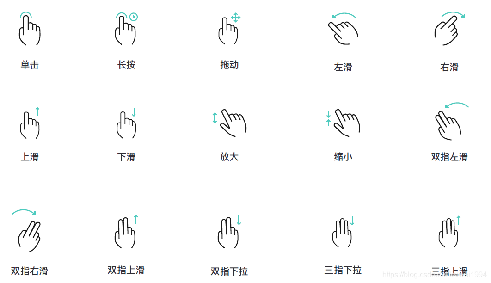
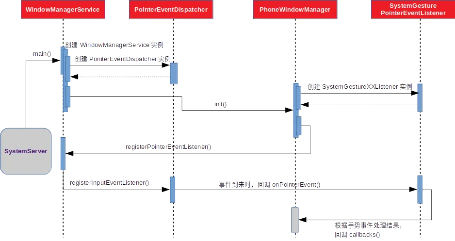
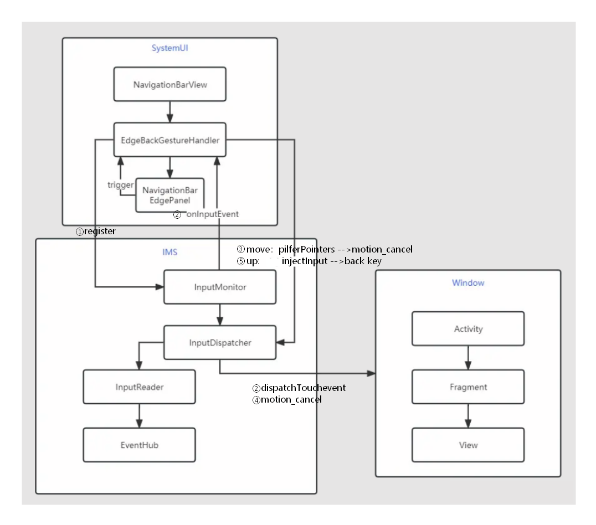
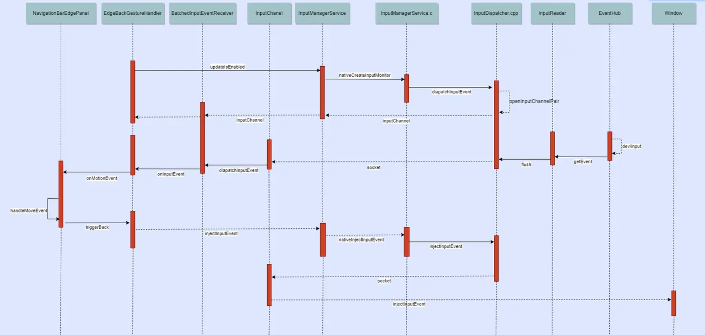
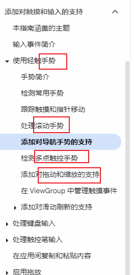

# 产品功能

[android 手势识别 （缩放 单指滑动 多指滑动）](https://blog.csdn.net/lisiwei1994/article/details/109384709)

>   


# Motionevent事件处理的优先级

先级是：

>   OnTouchListener > onTouchEvent > OnLongClickListener > OnClickListener

how----流程：

>   App需要在OnTouchListener 节点，将 Motionevent 转给 GestureDetector去识别（识别完，给回调结果）

 what------GestureDetector识别的**两种类型：**

>   1、左右滑back键（TODO?）、滑动Scroll、单击/双击、双指、三指、缩放手势
>
>   (应用：Scroll手势在浏览器中个滚屏，Fling在浏览器中的换页等)
>
>   2、画特定形状

OnGestureListener 接口中的方法：

```
按下（onDown）： 刚刚手指接触到触摸屏的那一刹那，就是触的那一下。
抛掷（onFling）： 手指在触摸屏上迅速移动，并松开的动作。
长按（onLongPress）： 手指按在持续一段时间，并且没有松开。
滚动（onScroll）： 手指在触摸屏上滑动。
按住（onShowPress）： 手指按在触摸屏上，它的时间范围在按下起效，在长按之前。
抬起（onSingleTapUp）：手指离开触摸屏的那一刹那。


class MyGestureListener : GestureDetector.OnGestureListener {

    /**
     * 每按一下屏幕立即触发，如果要响应操作需要返回 true
     */
    override fun onDown(e: MotionEvent): Boolean {
        return true
    }

    /**
     * 用户按下屏幕后未松手前长按触发
     */
    override fun onShowPress(e: MotionEvent) {

    }

    /**
     * 单击抬起时触发，返回值表示事件是否被处理
     */
    override fun onSingleTapUp(e: MotionEvent): Boolean {
        return false
    }

    /**
     * 用户按下后在屏幕上滑动时触发，返回值表示事件是否被处理
     * @param e1:开始滑动第一次按下操作，也就是 ACTION_DOWN
     * @param e2:触发当前 onScroll 方法的 ACTION_MOVE
     * @param distanceX：自上次调用 onScroll 以来沿 X 轴滚动的距离
     * @param distanceY：自上次调用 onScroll 以来沿 Y 轴滚动的距离
     */
    override fun onScroll(
        e1: MotionEvent, e2: MotionEvent, distanceX: Float, distanceY: Float
    ): Boolean {
        return false
    }

    /**
     * 长按事件触发
     */
    override fun onLongPress(e: MotionEvent) {

    }

    /**
     * 用户快速滑动屏幕时触发，返回值表示事件是否被处理
     * @param e1:开始快速滑动第一次按下操作，也就是 ACTION_DOWN
     * @param e2:触发当前 onFling 方法的 ACTION_MOVE
     * @param velocityX:X 轴上的移动速度，像素/秒
     * @param velocityY:Y 轴上的移动速度，像素/秒
     */
    override fun onFling(
        e1: MotionEvent, e2: MotionEvent, velocityX: Float, velocityY: Float
    ): Boolean {
        return false
    }

}

作者：阿健君
链接：https://juejin.cn/post/7229587772217049143
来源：稀土掘金
著作权归作者所有。商业转载请联系作者获得授权，非商业转载请注明出处。
```

开发中我们都会使用 SimpleOnGestureListener：

```java
class MyGestureListener : GestureDetector.SimpleOnGestureListener() {

    /**
     * 单击事件，如果只点击一次，系统等待一段时间后没有收到第二次点击则判断为单击
     * 与 onSingleTapUp 的区别在于：
     * onSingleTapUp 只要手抬起就会执行，如果是双击的话，onSingleTapConfirmed 不会执行。
     */
    override fun onSingleTapConfirmed(e: MotionEvent): Boolean {
        return super.onSingleTapConfirmed(e)
    }

    /**
     * 双击事件
     */
    override fun onDoubleTap(e: MotionEvent): Boolean {
        return super.onDoubleTap(e)
    }

    /**
     * 双击之间发生的其他动作
     */
    override fun onDoubleTapEvent(e: MotionEvent): Boolean {
        return super.onDoubleTapEvent(e)
    }

    override fun onSingleTapUp(e: MotionEvent): Boolean {
        return super.onSingleTapUp(e)
    }

    override fun onLongPress(e: MotionEvent) {
        super.onLongPress(e)
    }

}

作者：阿健君
链接：https://juejin.cn/post/7229587772217049143
来源：稀土掘金
著作权归作者所有。商业转载请联系作者获得授权，非商业转载请注明出处。
```


# 全局手势（系统级）

what---------------全局手势呢？简单来说就是在<font color='red'>任何界面都需要识别的手势</font>，比如：在任何界面从手机屏幕左侧滑动，当前的界面会退出(类似back键)；

## 疑问

全局手势：不care 焦点

现状：事件分发，根据焦点  分发给安卓


关键问题：

>   1、如何区分 全局手势，与正常事件？  ----------> 从屏幕边缘起
>
>   TODO: 代码证明
>
>   2、全局手势，最终是生成一个keyEvent，比如：从屏幕边缘右滑


疑问： 为啥是systemUI判断的？如果是，那么cpp侧的第一个down是给了谁？

**是不是注册了gestture，就会有等待？** --------------> TODO：验证

“**systemUI会让所有应用都等待吗？---------------比如华为的双关节敲击”**

## 0层结构图


结论：

[在dispatchEventLocked()内部会遍历inputTargets进行发送，也就是说，当我们在触摸屏幕后事件在派发时，不仅会派发到当前focus窗口，也会发送到全局手势监听者](https://www.jianshu.com/p/8ee27034e039#:~:text=%E5%9C%A8dispatchEventLocked)

>   例子：屏幕左侧滑动退出应用，如果以模拟发送back键来实现时，在退出应用前，会看到应用内部也会响应左滑事件


## 0层纵向流



[图来源](https://www.jianshu.com/p/8ee27034e039#:~:text=%E5%9B%9B.%E6%80%BB%E7%BB%93-,%E5%85%A8%E5%B1%80%E6%89%8B%E5%8A%BF,-%E5%A4%84%E7%90%86%E8%B7%9F%E6%99%AE%E9%80%9A)


## 系统级别的输入手势监听者 SystemGesturesPointerEventListener


```
 // monitor for system gestures 监听系统级别的输入手势
    mSystemGestures = new SystemGesturesPointerEventListener
```


参考： [Android Framework系统手势和状态栏](https://cloud.tencent.com/developer/article/1341513)

## 例1-----左右滑返回

 [深入分析 Android系统返回手势的实现原理](https://blog.csdn.net/allisonchen/article/details/124226944)   ----> 好文

[图：架构图一](https://juejin.cn/post/7209964630160834615#:~:text=%E7%A0%81%E4%B8%80%E6%AD%A5%E6%AD%A5%E5%88%86%E6%9E%90%E3%80%82-,%E6%9E%B6%E6%9E%84%E5%9B%BE%E5%A6%82%E4%B8%8B,-%EF%BC%9A)




[图来源](https://juejin.cn/post/7209964630160834615)  & AndroidGesture.eddx


### 纵向流程------注册监听

核心：

```java
//systemui/EdgeBackGestureHandler.java 

// 监听手势排除区域

        try {

            mWindowManagerService.registerSystemGestureExclusionListener(
                    mGestureExclusionListener, mDisplayId);
        }

        //注册输入事件监听  ------> 拿到系统事件
        mInputMonitor = InputManager.getInstance().monitorGestureInput(
                "edge-swipe", mDisplayId);
        mInputEventReceiver = new InputChannelCompat.InputEventReceiver(
                mInputMonitor.getInputChannel(), Looper.getMainLooper(),
                Choreographer.getInstance(), this::onInputEvent);
    }
```

### 监听拿到事件--->手势判断

onInputEvent() 作为 SystemUI 监视到系统 Input 事件回调的入口，将进行整个返回手势的判断、视图处理！！！！

```java
// systemui/EdgeBackGestureHandler.java
private void onMotionEvent(MotionEvent ev) {
    if (action == MotionEvent.ACTION_DOWN) {
        mInputEventReceiver.setBatchingEnabled(false);
        mIsOnLeftEdge = ev.getX() <= mEdgeWidthLeft + mLeftInset;
        mMLResults = 0;
        mLogGesture = false;
        mInRejectedExclusion = false;
        boolean isWithinInsets = isWithinInsets((int) ev.getX(), (int) ev.getY());
        // 根据返回手势是否有效、
        // 点击区域是否是停用区域等条件
        // 得到当前是否允许视图处理该手势
        mAllowGesture = !mDisabledForQuickstep && mIsBackGestureAllowed && isWithinInsets
                && !mGestureBlockingActivityRunning
                && !QuickStepContract.isBackGestureDisabled(mSysUiFlags)
                && isWithinTouchRegion((int) ev.getX(), (int) ev.getY());
        if (mAllowGesture) {
            // 更新当前是屏幕左侧还是右侧
            mEdgeBackPlugin.setIsLeftPanel(mIsOnLeftEdge);
            // 发射事件给视图
            mEdgeBackPlugin.onMotionEvent(ev);
        }
    } else if (mAllowGesture || mLogGesture) {
        if (!mThresholdCrossed) {
            // 多个手指按下的话取消事件处理
            if (action == MotionEvent.ACTION_POINTER_DOWN) {
                if (mAllowGesture) {
                    logGesture(SysUiStatsLog.BACK_GESTURE__TYPE__INCOMPLETE_MULTI_TOUCH);
                    cancelGesture(ev);
                }
                ........................
                return;
            } else if (action == MotionEvent.ACTION_MOVE) { // 在move时，判定手势操作
                if ((ev.getEventTime() - ev.getDownTime()) > mLongPressTimeout) {// 手指移动超过长按阈值的话， 也要取消事件处理
                    if (mAllowGesture) {
                        logGesture(SysUiStatsLog.BACK_GESTURE__TYPE__INCOMPLETE_LONG_PRESS);
                        cancelGesture(ev);
                    }
                    return;
                }
                
                if (dy > dx && dy > mTouchSlop) {
                    // 取消手势
                } else if (dx > dy && dx > mTouchSlop) {

                    mThresholdCrossed = true;
                    // Capture inputs
                    mInputMonitor.pilferPointers(); // 【】判定为手势了，InputMonitor通知InputDispatcher，把其他monitor和window的事件取消，即发送cancel
                    if (mBackAnimation != null) {
                        //【】 Notify FalsingManager that an intentional gesture has occurred.
                        mFalsingManager.isFalseTouch(BACK_GESTURE);
                    }
                }
                .......................
            }

        }

 

        // 通过上述检查的话
        // 将 MOVE、UP 交给视图
        if (mAllowGesture) {
            mEdgeBackPlugin.onMotionEvent(ev); // 【】这里处理UP，触发 triggerBack()注入事件
        }
    }
    mProtoTracer.scheduleFrameUpdate();
}

链接：https://juejin.cn/post/7209964630160834615
```

DOWN 的时候先让视图变为可见 VISIBLE

UP --------->  触发返回动作即 triggerBack()


### 给IMS和launcher注入back事件消息

```java
// systemui/EdgeBackGestureHandler.java
public void triggerBack() {
    //给系统发送back键事件
    boolean sendDown = sendEvent(KeyEvent.ACTION_DOWN, KeyEvent.KEYCODE_BACK);
    boolean sendUp = sendEvent(KeyEvent.ACTION_UP, KeyEvent.KEYCODE_BACK);

    //通知Launcher
    mOverviewProxyService.notifyBackAction(true, (int) mDownPoint.x,
                                           (int) mDownPoint.y, false /* isButton */, !mIsOnLeftEdge);
    ...
};
```


### 判定为手势了，mInputMonitor.pilferPointers通知其他monitors和window的事件取消

即发送cancel 事件

```java
// 调用栈：
(lldb) bt
* thread #195, name = 'binder:2731_17', stop reason = step over
  * frame #0: 0x00007d1e73935fe7 libinputflinger.so`android::inputdispatcher::InputDispatcher::synthesizeCancelationEventsForConnectionLocked(this=0x00007d2057bf7490, connection=std::__1::shared_ptr<android::inputdispatcher::Connection>::element_type @ 0x00007d20c7bd81a8, options=0x00007d1e602fcde0) at InputDispatcher.cpp:3926:17
    frame #1: 0x00007d1e7393de65 libinputflinger.so`android::inputdispatcher::InputDispatcher::synthesizeCancelationEventsForInputChannelLocked(this=0x00007d2057bf7490, channel=ptr = 0x7d1f57c55a90, options=0x00007d1e602fcde0) at InputDispatcher.cpp:3902:5
    frame #2: 0x00007d1e739323dc libinputflinger.so`android::inputdispatcher::InputDispatcher::pilferPointersLocked(this=0x00007d2057bf7490, token=0x00007d1e602fce80) at InputDispatcher.cpp:5978:13
    frame #3: 0x00007d1e7394b522 libinputflinger.so`android::inputdispatcher::InputDispatcher::pilferPointers(this=0x00007d2057bf7490, token=0x00007d1e602fce80) at InputDispatcher.cpp:5948:12
    frame #4: 0x00007d1e70301608 libandroid_servers.so`android::nativePilferPointers(_JNIEnv*, _jobject*, _jobject*) [inlined] android::NativeInputManager::pilferPointers(this=0x00007d2007c40570, token=0x00007d1e602fce80) at com_android_server_input_InputManagerService.cpp:554:43
    frame #5: 0x00007d1e703015e6 libandroid_servers.so`android::nativePilferPointers(env=0x00007d2007c51370, nativeImplObj=<unavailable>, tokenObj=0x00007d1e602fcf1c) at com_android_server_input_InputManagerService.cpp:1843:9
------------------java ---> cpp -------------------------------------------------
    pilferPointers:59, InputMonitor (android.view)
```


核心代码：

```java
//inputflinger/InputDispatcher.cpp
status_t InputDispatcher::pilferPointersLocked(const sp<IBinder>& token) {
    ..............
    for (const TouchedWindow& w : state.windows) {
        const std::shared_ptr<InputChannel> channel =
                getInputChannelLocked(w.windowHandle->getToken());
        if (channel != nullptr && channel->getConnectionToken() != token) {
		     //【】 对其他的Monitor & TouchedWindow 发送Cancel事件
            synthesizeCancelationEventsForInputChannelLocked(channel, options);
            canceledWindows += canceledWindows.empty() ? "[" : ", ";
            canceledWindows += channel->getName();
        }
    }
    ..............
}
```


### ~~时序字典：~~[来源](https://juejin.cn/post/7209964630160834615#:~:text=%E9%98%85%E8%AF%BB%E6%BA%90%E7%A0%81%E3%80%82-,%E6%89%8B%E5%8A%BF%E7%9A%84%E6%97%B6%E5%BA%8F%E5%9B%BE,-%EF%BC%9A)




```java
private void sendEvent(int action, int code) {
    long when = SystemClock.uptimeMillis();
    final KeyEvent ev = new KeyEvent(when, when, action, code, 0 /* repeat /,
            0 / metaState /, KeyCharacterMap.VIRTUAL_KEYBOARD, 0 / scancode */,
            KeyEvent.FLAG_FROM_SYSTEM | KeyEvent.FLAG_VIRTUAL_HARD_KEY,
            InputDevice.SOURCE_KEYBOARD);
    ... ...
    // 用 InputManager 注入返回事件
    InputManager.getInstance().injectInputEvent(ev, InputManager.INJECT_INPUT_EVENT_MODE_ASYNC);

————————————————
原文链接：https://blog.csdn.net/allen_xu_2012_new/article/details/130678786
```


## 三指下滑截图：

参考：

>   [如何在Android 12 aosp系统源码中添加三指下滑截图功能](https://blog.csdn.net/mhhyoucom/article/details/142086925?utm_medium=distribute.wap_relevant.none-task-blog-2~default~baidujs_baidulandingword~default-5-142086925-blog-126490618.237%5Ev3%5Ewap_relevant_t0_download&spm=1001.2101.3001.4242.4)   ------> 主要参考！！！！
>
>   [AndroidR 自主研究出来的三手指下滑截屏功能](https://blog.csdn.net/qq_37858386/article/details/126490618?spm=1001.2101.3001.6650.5&utm_medium=distribute.wap_relevant.none-task-blog-2%7Edefault%7EBlogCommendFromBaidu%7ERate-5-126490618-blog-129688597.237%5Ev3%5Ewap_relevant_t0_download&depth_1-utm_source=distribute.wap_relevant.none-task-blog-2%7Edefault%7EBlogCommendFromBaidu%7ERate-5-126490618-blog-129688597.237%5Ev3%5Ewap_relevant_t0_download)
>
>    [多点触控 与三指截屏](https://juejin.cn/post/6844904154792460302)

APP侧 [实现三个手指截屏（附带源码）](https://blog.csdn.net/m0_61840987/article/details/147292417)


代码实现：

```java
// 文件：
frameworks/base/services/core/java/com/android/server/wm/SystemGesturesPointerEventListener.java
// 承载的分支：
threeflingers_swipe_screenshot
```


## 例2----手指关节手势的原理

https://blog.csdn.net/weixin_45977690/article/details/139594449  华为支持手指关节手势的原理


# 应用内手势(应用级)


## 原理

[InputDispatcher.cpp 通过 Socket 向 App 进程和 SystemUI 进程发送事件](https://blog.csdn.net/c10WTiybQ1Ye3/article/details/125341902#:~:text=%E9%80%9A%E8%BF%87%20Socket%20%E5%90%91%20App%20%E8%BF%9B%E7%A8%8B%E5%92%8C%20SystemUI%20%E8%BF%9B%E7%A8%8B%E5%8F%91%E9%80%81%E4%BA%8B%E4%BB%B6%E3%80%82)  ------> <font color='red'>TODO:同时吗？发给应用了，后期如何拦截下来？？？？？</font>

  


## 文章：


# 冲突：

-<font color='red'>0层逻辑-------两件相关事情执行模型：</font>

>   法一：串行执行  
>
>   法二：并行执行，先执行完的通知另一个

## 官网：与返回手势冲突（全局手势 与  应用的touch）

[新的返回系统手势是从屏幕左侧或右侧边缘向内滑动。这可能会干扰这些区域中的应用导航元素。如需保持位于屏幕左侧和右侧边缘的元素的功能，请告知系统哪些区域需要接收轻触输入，从而选择性地停用返回手势](https://developer.android.com/develop/ui/views/touch-and-input/gestures/gesturenav?hl=zh-cn#java:~:text=%E6%96%B0%E7%9A%84%E8%BF%94%E5%9B%9E%E7%B3%BB%E7%BB%9F%E6%89%8B%E5%8A%BF%E6%98%AF%E4%BB%8E%E5%B1%8F%E5%B9%95%E5%B7%A6%E4%BE%A7%E6%88%96%E5%8F%B3%E4%BE%A7%E8%BE%B9%E7%BC%98%E5%90%91%E5%86%85%E6%BB%91%E5%8A%A8%E3%80%82%E8%BF%99%E5%8F%AF%E8%83%BD%E4%BC%9A%E5%B9%B2%E6%89%B0%E8%BF%99%E4%BA%9B%E5%8C%BA%E5%9F%9F%E4%B8%AD%E7%9A%84%E5%BA%94%E7%94%A8%E5%AF%BC%E8%88%AA%E5%85%83%E7%B4%A0%E3%80%82%E5%A6%82%E9%9C%80%E4%BF%9D%E6%8C%81%E4%BD%8D%E4%BA%8E%E5%B1%8F%E5%B9%95%E5%B7%A6%E4%BE%A7%E5%92%8C%E5%8F%B3%E4%BE%A7%E8%BE%B9%E7%BC%98%E7%9A%84%E5%85%83%E7%B4%A0%E7%9A%84%E5%8A%9F%E8%83%BD%EF%BC%8C%E8%AF%B7%E5%91%8A%E7%9F%A5%E7%B3%BB%E7%BB%9F%E5%93%AA%E4%BA%9B%E5%8C%BA%E5%9F%9F%E9%9C%80%E8%A6%81%E6%8E%A5%E6%94%B6%E8%BD%BB%E8%A7%A6%E8%BE%93%E5%85%A5%EF%BC%8C%E4%BB%8E%E8%80%8C%E9%80%89%E6%8B%A9%E6%80%A7%E5%9C%B0%E5%81%9C%E7%94%A8%E8%BF%94%E5%9B%9E%E6%89%8B%E5%8A%BF%E3%80%82)

TODO: 默认是给了SystemUI？

例外，开的口子：

>   ```java
>   应用侧setSystemGestureExclusionRects(exclusionRects);
>   ```


## 冲突二：全局手势 与 应用 手势的冲突


# 参考文章：

 [Android 全局手势识别原理分析](https://www.jianshu.com/p/8ee27034e039)  ----> 好文!!!!!!


[android手势分析（应用界面左往右边滑动退出应用）](https://blog.csdn.net/allen_xu_2012_new/article/details/130678786)

https://www.kancloud.cn/digest/songshi-android/136507  Android手势识别之GestureDetector 

https://www.runoob.com/w3cnote/android-tutorial-gestures.html           Gestures(手势)  画形状

 [Android 手势识别类 ( 二 ) GestureDetector 源码浅析](https://www.cnblogs.com/ldq2016/p/5290933.html) [官网](https://developer.android.com/develop/ui/views/touch-and-input/gestures/ )


https://developer.android.com/develop/ui/views/touch-and-input/gestures/multi?hl=zh-cn  官网：

>   

全局手势放大：https://www.zhihu.com/column/p/31195334

基础-------多点触控： http://www.gcssloop.com/customview/multi-touch.html


[Android 11.0 实现侧滑返回效果](https://blog.51cto.com/u_15073486/5375118)       --------> 也是 SystemGesturesPointerEventListener监听的！！！！

