# 目录


# 超级0层图: AMS-APP-WMS


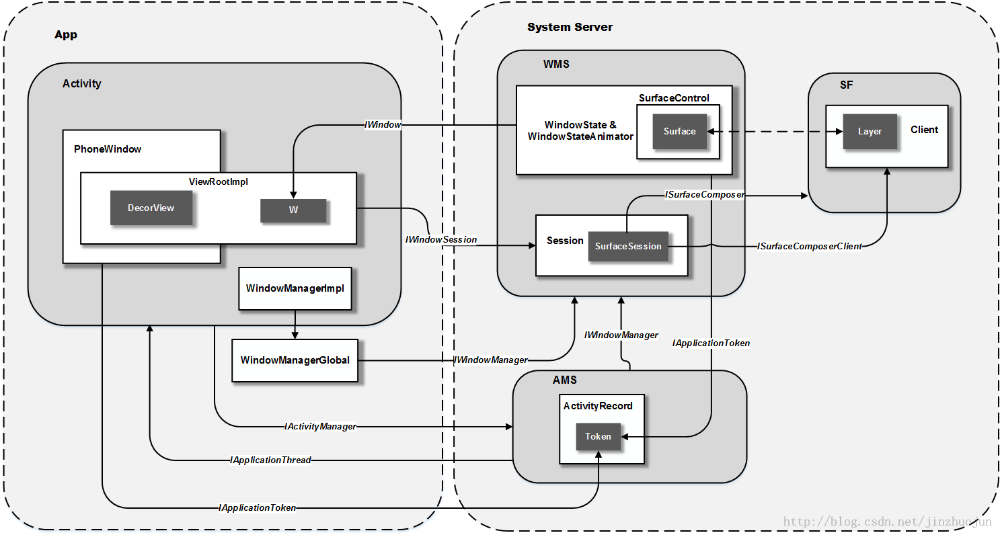

https://ericchows.github.io/Android-Window-Mechanism/

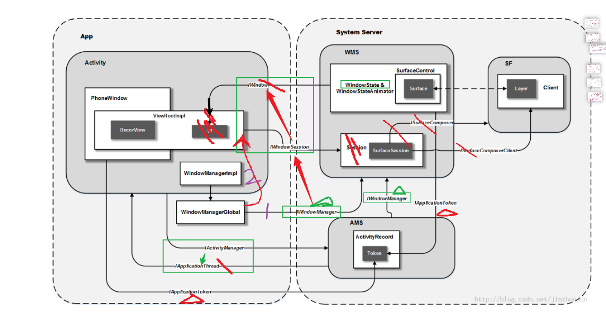


## 桥梁 合理性证明

### AMS与APP

其中桥梁：
~~IWindowManager和IAcitivityManger 是一个自然的桥梁，~~客户端对wms和AMS的引用~~  ---->系统服务 开机初始化 注册的缘故

###  WMS与APP

APP-> WMS两个桥梁：

【1】IWindowManager，进程级：System private interface to the window manager. 进程级的。窗口级不从这里过

【2】IWindowSession，进程级，但被参数限制了成了窗口级：System private per-application interface to the window manager.  

```
证明：
```

```java
mWindowSession = WindowManagerGlobal.getWindowSession(); //cg: Single Instance in procsse  是单例，进程级
int addToDisplay(IWindow window,........) // IWindow解决了 mWindowSession  是一对多问题
void remove(IWindow window);
```

WMS->APP 桥梁：

【3】IWindow   是窗口级

1、为什么要有两个APP-> AMS？

一个级别，做一个级别的事情

2、为什么IWindowSession不能弄成像IWindow   真正是窗口级的？

一个IWindowSession对应一个线程，多个就会有很多线程了 -----> 浪费资源

TODO: <font color='red'>从设计角度：</font> 一个低级别的类（资源）一般来说会有多份，如果这个类是一个比较消耗资源的（内存、线程资源）。
                                 设计思路：变成一个单例，**以参数区分**不同低级别 

3、自然：【1】搭建【2】，【2】搭建【3】


TODO:  mWindowSession所有方法的第一个参数，是IWindow 。 这样就？？？？？

桥梁Iwindow1:  <--------------------------------------

桥梁Iwindow2:  <----------------------------------------

桥梁-----------------Iwindow2----------->


windowManagerIml----> WMS 有两条路：

1、路1：转到ViewRootIml ，走 IWindowSession

2、路2：直接走Iwindow


## 基于架构的结论：

1、从系统角度来看，是看不到view的---------view体系只是window的一部分，<font color='red'>是window的显示</font>


TODO:

通过生活化模型，记忆流程性 图（动图）。。。。。那么如何记忆类图（静图）呢？


# 基于0层架构图

所处的位置：SystemServer进程，AMS运行在一个Binder线程里

---->  TODO: 这个Binder线程什么时候创建的？ Binder线程池？

疑问：如果每个服务有一个Binder线程，那么线程肯定不够，90个服务
TODO: 个人理解：应该是  Binder线程池，谁要用谁用

```java
// system_server的所有线程：

uThreads: 122 total,   0 running, 122 sleeping,   0 stopped,   0 zombie
  Mem:      3.6G total,      3.0G used,      672M free,       25M buffers
 Swap:      512M total,         0 used,      512M free,      1.4G cached
400%cpu  11%user   0%nice  37%sys 351%idle   0%iow   0%irq   0%sirq   0%host
  TID USER         PR  NI VIRT  RES  SHR S[%CPU] %MEM     TIME+ THREAD          
 1441 system       RT  -8 7.5G 258M 186M S  2.8   6.8   0:02.35 SensorService  
 6791 system       20   0 7.5G 258M 186M S  0.0   6.8   0:00.15 Binder:1270_11 
 6103 system       20   0 7.5G 258M 186M S  0.0   6.8   0:00.15 Binder:1270_10 
 3865 system       20   0 7.5G 258M 186M S  0.0   6.8   1:11.68 Binder:1270_F  
 3716 system       20   0 7.5G 258M 186M S  0.0   6.8   0:03.74 Binder:1270_E  
 3519 system       20   0 7.5G 258M 186M S  0.0   6.8   0:00.00 AsyncQueryWorke
 3149 system       20   0 7.5G 258M 186M S  0.0   6.8   1:35.48 Binder:1270_D  
 3127 system       16  -4 7.5G 258M 186M S  0.0   6.8   0:00.09 RenderThread   
 2641 system       30  10 7.5G 258M 186M S  0.0   6.8   0:00.24 backup-0       
 2636 system       20   0 7.5G 258M 186M S  0.0   6.8   0:00.31 Binder:1270_C  
 2635 system       20   0 7.5G 258M 186M S  0.0   6.8   0:18.02 Binder:1270_B  
 2606 system       20   0 7.5G 258M 186M S  0.0   6.8   0:00.00 pool-2-thread-1
 2600 system       30  10 7.5G 258M 186M S  0.0   6.8   0:00.02 LazyTaskWriterT
 2213 system       20   0 7.5G 258M 186M S  0.0   6.8   0:00.00 AdbDebuggingMan
 2015 system       18  -2 7.5G 258M 186M S  0.0   6.8   0:00.00 queued-work-loo
 1926 system       20   0 7.5G 258M 186M S  0.0   6.8   0:00.00 HwBinder:1270_5
 1923 system       20   0 7.5G 258M 186M S  0.0   6.8   0:00.00 ConnectionSvrFo
 1922 system       20   0 7.5G 258M 186M S  0.0   6.8   0:00.00 CallAudioModeSt
 1920 system       20   0 7.5G 258M 186M S  0.0   6.8   0:00.00 uteStateMachine
 1914 system       20   0 7.5G 258M 186M S  0.0   6.8   0:00.21 HwBinder:1270_4
```


AMS:

组件管理(虽然叫AMS) :  Activity    service   provider     broadcast

android10增加了 : ATMS(ActivityTaskManagerService)，~~目的AMS管理太多了，把Activity 的管理抽出来给ATMS~~。自然


ActvityManagerServcie的重要功能:
start() 函数知道: 1)启动 CPU 监控线程;   2) 注册电池状态和权限管理服务
startObservingNativeCrashes（） 函数知道： 监听所有的crash事件
setSystemProcess()函数知道： 添加各种管理app状态信息的服务还有进程等等信息  


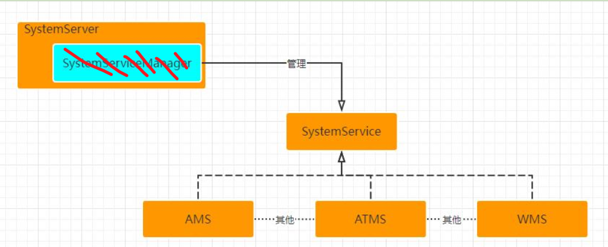

SystemServiceManager忽略掉，~~只是SystemServer  startService功能的抽取~~，自然


# 启动流程---AMS

## 概述

AMS startService之前： 

> 都是在SystemServer中，通过SytemServiceManager启动的   -----> 见系统启动流程

AMS startService之后：见下

## AMS startService之后

参考：

> 具体函数级别分析，见： https://gityuan.com/2016/02/21/activity-manager-service/   -------> TODO：暂时允许，各种函数分析，来自链接？


### AMS 让  zygote 创建 launcher进程      

# AMS 启动APP startActivity

见，应用启动流程

# AMS<font color='red'>模块</font>做了哪些事情

基于 超级0层图: AMS-APP-WMS


1、IActivityManager接口：  引用 AMS的Binder

```java
具体做了：比如：
attachApplication  //塞App的binder给AMS    
startActivity   // 启动一个Actvity      finishActivity
startService    //                     stopService\ bindService
```


2、socket


# AMS类做了哪些事情 ---从属性角度

TODO:  从属性总结，可以得到精华

参考：**《AMS预习资料.pdf》  ----> 非常好的资料

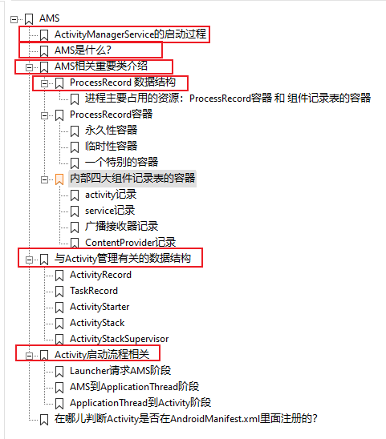


TODO: 如何认识一个模块？-----角度：

1、从哪里来： 

2、是什么？

3、模块内核心类

4、重要的纵向流程


## 相关重要类

### ProcessRecord 数据结构

`一句话功能`： ~~主要是在 AMS侧记录 进程相关信息~~ ，自然，很直白，ProcessRecord
                        ~~站在AMS角度来看，Record Process 的目的，就是管理APP~~ ，自然
                        ProcessRecord （AMS） =  APP进程

`绑定关系`：    
AMS: 一个进程列表ProcessList（系统级）:   多个 ProcessRecord（应用级）:   一个applicationThread（AMS侧）------最初由APP侧流转到AMS侧


```java
//  ProcessList.java

/**
  * List of running applications, sorted by recent usage.
  * The first entry in the list is the least recently used.
  */
final ArrayList<ProcessRecord> mLruProcesses = new ArrayList<ProcessRecord>();  // List of running, 自然，不得不这样

/**
 * The currently running isolated processes.
 */
final SparseArray<ProcessRecord> mIsolatedProcesses = new SparseArray<>(); // TODO: isolated processes是啥？？？

/**
 * Processes that are being forcibly torn down.
 */
final ArrayList<ProcessRecord> mRemovedProcesses = new ArrayList<ProcessRecord>(); // 

```

  ----->  结论：ProcessRecord，从数据结构角度：是多个ArrayList。


`具体记录的信息有`：

第一类数据：描述身份的数据

> 1.ApplicationInfo info：AndroidManifest.xml中定义的Application信息
> 2.boolean isolated：是不是isolated进程
> 3.int uid：进程uid
> 4.int userId：这个是android做的多用户系统id，就像windows可以登录很多用户一样，android
> 也希望可以实现类似的多用户
> 5.String processName：进程名字，默认情况下是包名
> 6.UidRecord uidRecord：记录已经使用的uid
> 7.IApplicationThread thread：这个很重要，它是ApplicationThread的客户端，AMS就是通过这
> 个对象给apk进程发送异步消息的（管理四大组件的消息），所以只有这个对象不为空的情况下，
> 才代表apk进程可是使用了
> 8.int pid：进程的pid
> 9.String procStatFile：proc目录下每一个进程都有一个以pid命名的目录文件，这个目录下记载着
> 进程的详细信息，这个目录及目录下的文件是内核创建的， proc是内核文件系统，proc就是
> process的缩写，涉及的目的就是导出进程内核信息
> 10.int[] gids：gid组
> 11.CompatibilityInfo compat : 兼容性信息
> 12.String requiredAbi : abi信息
> 13.String instructionSet : 指令集信息


第二类数据：描述进程中组件的数据

第三类数据：描述进程状态的数据

第四类数据：和pss相关的数据

第五类数据：和时间相关的数据

第六类数据：crash和anr相关的数据

第八类数据：电源信息和调试信息

.............见： AMS 预习资料.pdf


### ProcessRecord容器  

永久性容器  

临时性容器  

一个特别的容器  

### 内部四大组件记录表的容器  


# AMS如何管理进程的   TODO


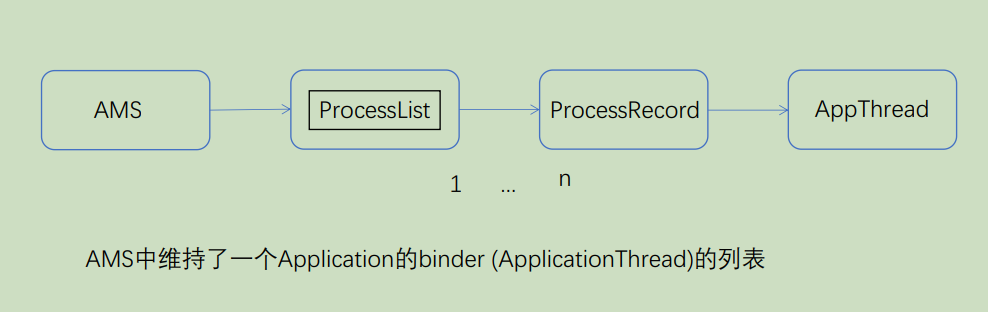

图： AMS管理和启动Application流程.pdf


AMS如何管理进程的  -------->   见  《进程管理.md》


# Activity 四种启动模式


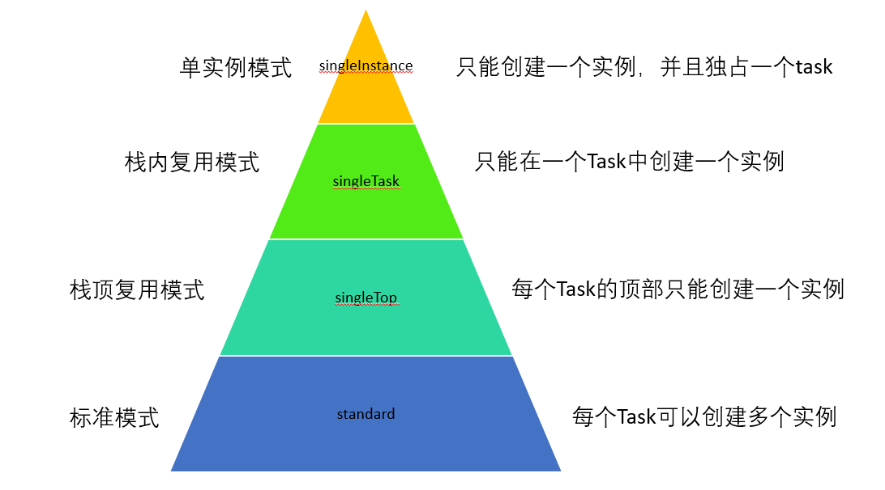


说明：

1、自下而上越来越严格

2、栈顶复用模式singleTop：即该Activity处于任务栈栈顶，即下图：

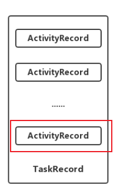

3、singleInstance单实例：<font color='red'>所有栈只有一个实例</font>  ----> 自然，次再使用的时候，直接使用这个栈。比如打电话应用就是一个singleStance模式启动的activity


各种模式的应用场景：


具体 TODO


# Task概念 ，即TaskRecord

参考：  https://blog.csdn.net/Smile_729day/article/details/122241576

```
      https://blog.csdn.net/Jason_Lee155/article/details/116571487   ActivityRecord、TaskRecord、ActivityStack相互关系以及Activity启动模式

      https://www.jianshu.com/p/eb2ff0bc64a0     AMS重要的数据结构解析（三）：ActivityStack
```

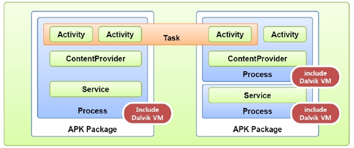

图：


Activity代码属于Application，但是Task属于Android操作系统，跨越了不同的process

Task概念: 

> 从用户角度来看，<font color='red'>Task 应该就是跳跳跳  (任务级,可能多个APP进程) </font>
>
>                ~~正式表述：用户在执行某项工作时与之互动的一系列 Activity 的集合~~
>
> 从用户角度来看， **即是一个Task对应一个TaskRecord**   ----> 所以，<font color='red'>程序员应该从TaskRecord角度理解各种 场景</font>


查看task的命令：

```
adb shell dumpsys activity activities

adb shell dumpsys activity activities | sed -En -e '/Stack #/p' -e '/Running activities/,/Run #0/p'
```


%accordion%dump出的一个stack进行分析:%accordion%

```java
Display #0 (activities from top to bottom):  // Display #0 代表第一个屏幕。安卓可能存在多个屏幕，投屏
  Stack #4: type=standard mode=fullscreen     //Stack信息
   isSleeping=false
   mBounds=Rect(0, 0 - 0, 0)
   Task id #51              //Task信息
   mBounds=Rect(0, 0 - 0, 0)
   mMinWidth=-1
   mMinHeight=-1
   mLastNonFullscreenBounds=null
   * TaskRecord{e0bdfdf #51 A=android.tplink.sjj.teststack U=0 StackId=4 sz=2}
     userId=0 effectiveUid=u0a128 mCallingUid=u0a28 mUserSetupComplete=true mCallingPackage=com.cyanogenmod.trebuchet
     affinity=android.tplink.sjj.teststack
     intent={act=android.intent.action.MAIN cat=[android.intent.category.LAUNCHER] flg=0x10200000 cmp=android.tplink.sjj.teststack/.MainActivity}   //启动信息，包括启动源和被启动app的MainActivity
     realActivity=android.tplink.sjj.teststack/.MainActivity
     autoRemoveRecents=false isPersistable=true numFullscreen=2 activityType=1
     rootWasReset=true mNeverRelinquishIdentity=true mReuseTask=false mLockTaskAuth=LOCK_TASK_AUTH_PINNABLE
     **Activities=[ActivityRecord{4542de6 u0 android.tplink.sjj.teststack/.MainActivity t51}, ActivityRecord{898d92a u0 android.tplink.sjj.teststack/.FirstActivity t51}]**   //当前栈中Activity记录
     askedCompatMode=false inRecents=true isAvailable=true
     mRootProcess=ProcessRecord{ebe742c 31812:android.tplink.sjj.teststack/u0a128}
     stackId=4
     hasBeenVisible=true mResizeMode=RESIZE_MODE_RESIZEABLE_VIA_SDK_VERSION mSupportsPictureInPicture=false isResizeable=true lastActiveTime=256734507 (inactive for 30s)
     * Hist #1: ActivityRecord{898d92a u0 android.tplink.sjj.teststack/.FirstActivity t51}   //栈中Activity调用历史（最近的）
         packageName=android.tplink.sjj.teststack processName=android.tplink.sjj.teststack
         launchedFromUid=10128 launchedFromPackage=android.tplink.sjj.teststack userId=0
         app=ProcessRecord{ebe742c 31812:android.tplink.sjj.teststack/u0a128}
         Intent { flg=0x10000000 cmp=android.tplink.sjj.teststack/.FirstActivity }
         frontOfTask=false task=TaskRecord{e0bdfdf #51 A=android.tplink.sjj.teststack U=0 StackId=4 sz=2}
         taskAffinity=android.tplink.sjj.teststack
         realActivity=android.tplink.sjj.teststack/.FirstActivity
         baseDir=/data/app/android.tplink.sjj.teststack-Cu_ETALVG7u-Plh9vUC5Ug==/base.apk
         dataDir=/data/user/0/android.tplink.sjj.teststack
         splitDir=[/data/app/android.tplink.sjj.teststack-Cu_ETALVG7u-Plh9vUC5Ug==/split_lib_dependencies_apk.apk, 
         .........................................
         fullscreen=true noDisplay=false immersive=false launchMode=2
         frozenBeforeDestroy=false forceNewConfig=false
         mActivityType=standard
         waitingVisible=false nowVisible=true lastVisibleTime=-33s65ms
         resizeMode=RESIZE_MODE_RESIZEABLE_VIA_SDK_VERSION
         mLastReportedMultiWindowMode=false mLastReportedPictureInPictureMode=false
     * Hist #0: ActivityRecord{4542de6 u0 android.tplink.sjj.teststack/.MainActivity t51}   //同上，这是在上个历史之前的
         packageName=android.tplink.sjj.teststack processName=android.tplink.sjj.teststack
         launchedFromUid=10028 launchedFromPackage=com.cyanogenmod.trebuchet userId=0
         app=ProcessRecord{ebe742c 31812:android.tplink.sjj.teststack/u0a128}
         Intent { act=android.intent.action.MAIN cat=[android.intent.category.LAUNCHER] flg=0x10200000 cmp=android.tplink.sjj.teststack/.MainActivity bnds=[24,204][192,398] }
         frontOfTask=true task=TaskRecord{e0bdfdf #51 A=android.tplink.sjj.teststack U=0 StackId=4 sz=2}
         taskAffinity=android.tplink.sjj.teststack
         realActivity=android.tplink.sjj.teststack/.MainActivity
         baseDir=/data/app/android.tplink.sjj.teststack-Cu_ETALVG7u-Plh9vUC5Ug==/base.apk
         dataDir=/data/user/0/android.tplink.sjj.teststack
         splitDir=[/data/app/android.tplink.sjj.teststack-Cu_ETALVG7u-Plh9vUC5Ug==/split_lib_dependencies_apk.apk, 
         fullscreen=true noDisplay=false immersive=false launchMode=0
         frozenBeforeDestroy=false forceNewConfig=false
         mActivityType=standard
         waitingVisible=false nowVisible=false lastVisibleTime=-36s658ms
         resizeMode=RESIZE_MODE_RESIZEABLE_VIA_SDK_VERSION
         mLastReportedMultiWindowMode=false mLastReportedPictureInPictureMode=false
         .......................................
         
   Running activities (most recent first):  //最近该任务栈中活动了的Activity，按最近时间排列
     TaskRecord{e0bdfdf #51 A=android.tplink.sjj.teststack U=0 StackId=4 sz=2}
       Run #1: ActivityRecord{898d92a u0 android.tplink.sjj.teststack/.FirstActivity t51}
       Run #0: ActivityRecord{4542de6 u0 android.tplink.sjj.teststack/.MainActivity t51}
   
   mResumedActivity: ActivityRecord{898d92a u0 android.tplink.sjj.teststack/.FirstActivity t51}   //当前页面Activity
   mLastPausedActivity: ActivityRecord{4542de6 u0 android.tplink.sjj.teststack/.MainActivity t51}  //最后一个退出前台的Activity
   ..........................
```


%/accordion%


task启动方式: 

> launcher(第三方应用跳转不会)、通知


task恢复的方式: 

>  Recents与back button


## 1层结构

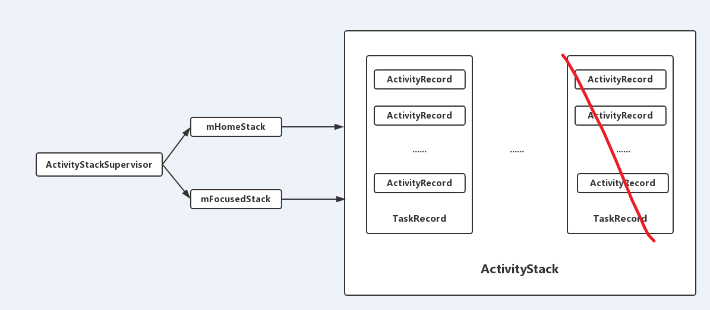

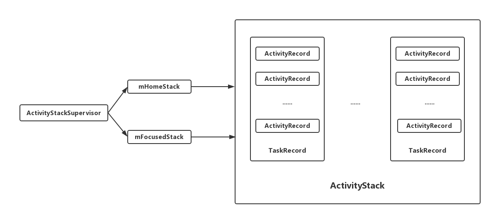

参见：https://blog.csdn.net/Jason_Lee155/article/details/116571487   好文


通常情况下：  <font color='red'>一个APP---->最多一个ActivityStack（可能其他APP启动的，则没有自己的ActivityStack）--------对应一个 TaskRecord（例外：存在多个）</font>

一个 ActivityStack 对应多个 TaskRecord的情况：

见： https://www.jianshu.com/p/eb2ff0bc64a0    AMS重要的数据结构解析（三）：ActivityStack


## Task前后台概念:

如果这时候用户按下Home键,则这个Task 会从前台切换到后台

--->即1层结构中  HomeStack与FocusedStack交 换?   


## 不同场景，任务栈的变化

### 总之：

1、Launcher与普通的startActivity差异在于: 是否会创建任务栈? -------> 只有这样才自然,  想表达的点:  **任务是从laucher点击开
始的** 跳跳跳

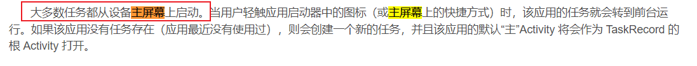

TODO:  如何证明？


2、结论：（1）**不论是否同进程，****同一个任务栈**变化基本上都是：


 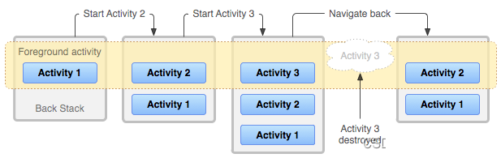

（3）注意back时，栈顶的 activty会destroyed


3、生命周期：

1、Task新建:  launcher启动 

launcher启动 打开另外一个新的应用,   默认情况下,这个新的<font color='red'>应用期望加</font>入到 Task name为自己包名的Task 中, （自然）
~~如果该Task 不存在,则创建一个新的Task,并且该Task 的默认 name 和该应用的包名相同,~~   --> 自然，推论
~~如果期望的 Task 存在,则直接复用原有的 Task,  如果该 Task 处于后台,  则需要把整个Task 转移到前台~~    --> 自然，推论

2、 Task的切换 ：

即

3、 Activity的切换 ：

 Activity向前跳转：

> 在当前 Activity 启动另一个Activity时,  新的Activity 将被推送到 TaskRecord 顶部并获得焦点（TODO: 焦点具体什么概念呢）。上一个 Activity 仍保留在堆栈中, 但会停止（TODO: pause还是stop？）。~~当 Activity 停止时,  系统会保留其界面的当前状态。~~自然

当用户按 Back：

> 当前 Activity 会从 TaskRecord 顶部退出(<font color='red'>该 Activity 销毁 destroyed，自然)</font>， 上一个Activity 会恢复(界面会恢复到上一个状态)。TaskRecord 中的 Activity 永远不会重新排列, **只会被送入和退出(自然,这是栈结构,只能如此),** 


4、销毁

移除 TaskRecord 中的<font color='red'>所有Activity后</font>,该 Task 将不复存在。<font color='red'>自然</font>


### APP1 的Activity1 启动  APP2 的Activity2

结论：
**任务栈还是APP1的，**自然


证明：

```java
Display #0 (activities from top to bottom):
  Stack #16: type=standard mode=fullscreen
  isSleeping=false
  mBounds=Rect(0, 0 - 0, 0)
    Task id #25
    mBounds=Rect(0, 0 - 0, 0)
    mMinWidth=-1
    mMinHeight=-1
    mLastNonFullscreenBounds=null
    * TaskRecord{d75f457 #25 A=com.example.myhandlerdemo U=0 StackId=16 sz=2} // 第一个应用的 任务栈TaskRecord
      userId=0 effectiveUid=u0a128 mCallingUid=u0a80 mUserSetupComplete=true mCallingPackage=com.android.launcher3
      affinity=com.example.myhandlerdemo
      intent={act=android.intent.action.MAIN cat=[android.intent.category.LAUNCHER] flg=0x10200000 cmp=com.example.myhandlerdemo/.MainActivity}
      mActivityComponent=com.example.myhandlerdemo/.MainActivity
      autoRemoveRecents=false isPersistable=true numFullscreen=2 activityType=1
      rootWasReset=true mNeverRelinquishIdentity=true mReuseTask=false mLockTaskAuth=LOCK_TASK_AUTH_PINNABLE
      Activities=[ActivityRecord{5105c0f u0 com.example.myhandlerdemo/.MainActivity t25}, ActivityRecord{b2a437e u0 com.example.sourceCode/.MainActivity t25}]
     

    Running activities (most recent first):
      TaskRecord{d75f457 #25 A=com.example.myhandlerdemo U=0 StackId=16 sz=2}  // 第一个应用的 任务栈TaskRecord
        Run #1: ActivityRecord{b2a437e u0 com.example.sourceCode/.MainActivity t25}  // 第二个应用的 处于栈顶
        Run #0: ActivityRecord{5105c0f u0 com.example.myhandlerdemo/.MainActivity t25} 
```

### launcher（APP1）启动  APP2 的Activity2

则会启动  新的任务栈。自然，launcher是任务栈的起点


从任务栈角度来看：基于1层结构图

新增了一个任务栈，即  ActivityStackSupervisor中的 mFocusedStack

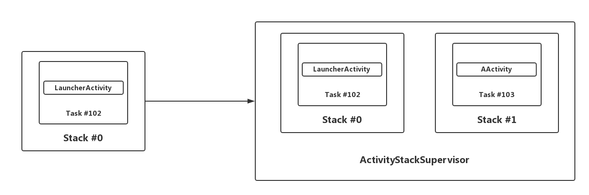


# Activity的七大生命周期

## 一个Activity的生命周期

实际上，永远不存在一个孤立的activty的

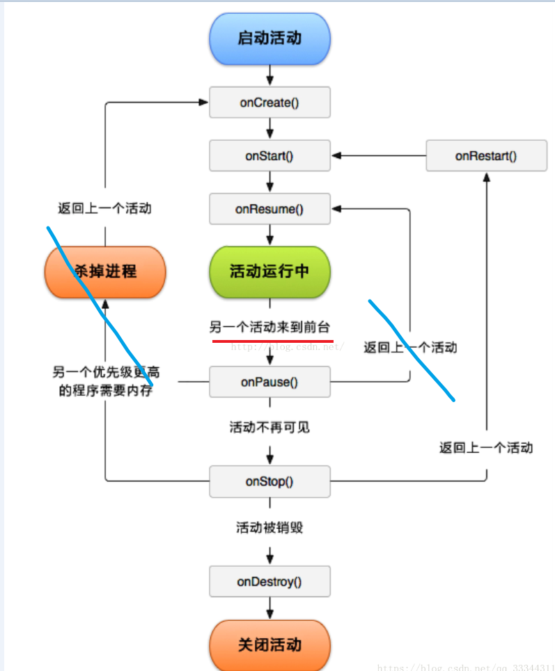


化简：

> 杀掉进程场景，见下
>
> onPause 阶段返回，极端场景 ----->因为onPause 下台，是个暂时态，很短时间


可见，只考虑一个activity，其状态是很简单的：就两条路


**按组记忆：**

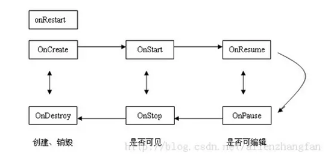

~~图：从4个视角理解安卓activity的启动模式pptx~~

### 相邻状态之间的区别

1.onCreate和onStart之间有什么区别？
（1）~~可见与不可见的区别。前者不可见，后者可见。~~    自然，可见性
（2）~~执行次数的区别，~~  自然。onCreate方法只在Activity创建时执行一次，而onStart方法在Activity的切换以及按Home键返回桌面再切回应用的过程中被多次调用。因此Bundle数据的恢复在onStart中进行比onCreate中执行更合适。  
（3）onCreate能做的事onStart其实都能做，但是onstart能做的事onCreate却未必适合做。如前文所说的，setContentView和资源初始化在两者都能做，然而想动画的初始化在onStart中做比较好。

2.onStart方法和onResume方法有什么区别？
（1）<font color='red'>是否在前台</font>。onStart方法中Activity可见但不在前台，不可交互，而在onResume中在前台
（2）职责不同，onStart方法中主要还是进行初始化工作，而onResume方法，根据官方的建议，可以做开启动画和独占设备的操作。

3.onPause方法和onStop方法有什么区别？
（1）是否可见。onPause时Activity可见，onStop时Activity不可见，但Activity对象还在内存中。
（2）在系统内存不足的时候可能不会执行onStop方法，因此程序状态的保存、独占设备和动画的关闭、以及一些数据的保存最好在onPause中进行，<font color='red'>但要注意不能太耗时</font>     --->  <font color='red'>自然，瞬态</font>

4.onStop方法和onDestroy方法有什么区别？
onStop阶段Activity还没有被销毁，对象还在内存中，此时可以通过切换Activity再次回到该Activity，而onDestroy阶段Acivity被销毁


### 场景：

#### 锁屏

从onPause---------> onStop

## 两个的组合

Todo：场景有哪些

1、组合对一个的影响
2、组合对两个的影响


生活类比：

> 舞台演员演出模型：
>
> onCreate  舞台后刚招来一个人，作为演员
>
> onStart  开始化妆，但是还没有到前台
> onResume 这个人到前台表演
> 运行runing
> onPause  导演说要换人，演员退到后台
> onstop   不演了，卸妆
>
> onDestroy  杀人，撵人滚蛋（Activity即将被销毁）
>
> 
>
> onRestart
> 很自然，让stop重新回到start：即卸完妆又化妆 
>
> 
>
> 规则一： 所有演员下到后台，有一个stack。因为结束后，要按照上场相反顺序，重新亮相   ----> 模拟back键


> 导演：  所有Activity生命周期 幕后的操作者Ams：
>
> --->生命周期的方法都由其触发调用（通过Binder）
> Activity的状态在AMS侧是ActivitySatck维护的 ----->同步到 APP，即生命周期函数


 由模型，一些<font color='red'>不得不</font>的东西：

1、~~onCreate   招人  与 onDestroy 撵人滚蛋 是一组~~

```
创建过程，比如整个view树，绑定  --->自然
```

2、~~onStart  开始化妆  与  onStop 卸妆 ，是一组~~

```
 这两组标志着是否 <font color='red'>TODO:  已经渲染好了？？？</font>，只是没有到前台  
```

3、~~onResume 到前台 与 onPause 到后台，是一组~~

```
  这两组标志着是否到<font color='red'>前台</font>   --->自然
  这两组是一个暂时态，一般时间很短   --->自然
```


### 场景（基于模型给出解释）

#### 前进：同进程 ActivityA 调用 ActivityB

基于模型，自然·：

> A先下台onPause（A后面的事情先不管）
>
> B招进来onCreate，化妆 onStart，到舞台表演onResume
>
> A 卸妆onStop


A下台之后，为啥不安排A 卸妆onStop呢？ 
这是自然的，因为是串行，优先让B 上台表演（观众是上帝），最后执行A的 卸妆


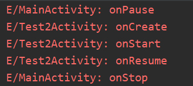


注：~~如果ActivityB之前已经启动(已经在栈里了)：  **ActivityB走onRestart，其他不变**~~ --->自然

#### 后退：同进程 back键 ，ActivityB返回ActivityA

基于模型，自然·：

~~B下台 （B后面的事情先不管）
A 重新化妆onRestart，化妆 onStart , 上台onResume~~
~~B 实际上没有用了，走完最后生命周期：卸妆onStop，走人onDestroy~~


**后退比前进多了一个onDestroy，原因在于**：
因为栈的原因，
后退的时候，当前页面没有用了，销毁掉
前进的时候，当前页面要保存在栈里


#### 两个进程：ActivityA （比如launcher）调用 ActivityB

由APP启动流程知道： 
ActivityA 先onPause，之后ActivityB走......
----->**结论： 与同进程的生命周期一样**


注：~~如果ActivityB之前已经启动(已经在栈里了)：  **ActivityB走onRestart，其他不变**~~ --->**结论： 与同进程的生命周期一样**

#### 点击Home键

退出舞台，演员卸妆

即 Activity将会处于不可见的状态，当前Activity会执行生命周期onStop

   


#### 旋转屏幕 

参考：  https://www.jianshu.com/p/eff8496dbf0e

旋转屏幕 ，即 一个演员先下台，走人后，明天再上台


> ~~onPause() -> onStop() -> onDestroy()~~
> ~~onCreate() -> onStart() -> onResume()~~

------>结论： 自然，相当于先关闭再重启


#### 弹窗


弹出 Dialog 对生命周期有什么影响
1、我们知道，生命周期回调都是 AMS 通过 Binder 通知应用进程调用的；而弹出 Dialog、Toast、PopupWindow 本质上都直接是通过 WindowManager.addView() 显示的（没有经过 AMS），所以<font color='red'>不会对生命周期有任何影响。</font>

如果是启动一个 Theme 为 Dialog 的 Activity , 则生命周期为： A.onPause -> B.onCrete -> B.onStart -> B.onResume 注意这边没有前一个 Activity 不会回调 onStop，因为只有在 Activity 切到后台不可见才会回调 onStop；而弹出 Dialog 主题的 Activity 时前一个页面还是可见的，只是失去了焦点而已所以仅有 onPause 回调。


### 其他一些疑问

https://zhuanlan.zhihu.com/p/190151810
给 `onPause` 一个精准的描述的话，应该是 **非前台，不可交互，但不一定不可见** 。  ---> 符合模型


## 代码（与模型的对比）


# Activity的启动模式

四种启动模式：


# 其他次要


《[状态保存分析，待合并](https://kenttj.github.io/-book/coding/0_Andriod/0_AndriodSystem.html#状态保存分析，待合并)》

**根本目的：**

> 用户体验一致性

**场景：**

> 1、低内存场景:----------- 真
>
> ```java
>  可以想象的一个场景是：用户正在编辑一段日记的时候，来了一个电话，当通话结束之后（假设此刻处于后台的编辑日记的Activity由于内存不足被销毁了），那么返回到App的时候，用户会发现花了很多时间编辑的日记已经全部丢失，这样的App逻辑是无法接受的。    ------------------->  场景！！！！！！！！
> ```
>
> https://zhuanlan.zhihu.com/p/666144089    安卓现代化开发系列——从状态保存到SavedState
>
> 到底是回收activity还是整个进程？
>
> 模拟不保留activities（模拟内存不足时的系统行为）：https://www.jianshu.com/p/90cf59f22f40
>
> 2、横竖屏切换（进程没有销毁场景）--------假
>
> 这个时候，实际上，进程没有销毁（**必然：**既然进程没有销毁场景，则数据不会给到AMS）
>
> 3、应用升级更新后------- 真

安卓的保存，是在界面的切换时机

特别注意：

> 应用异常杀死、ANR  ---->  这种场景似乎不合适，因为应用已经卡死：没法执行保存流程
>
> --------> 所以，必然：**状态保存的时机是，AMS主动杀的时候**

参考：

> https://zhuanlan.zhihu.com/p/666144089    安卓现代化开发系列——从状态保存到SavedState


# TODO:

## appToken

what，作用：

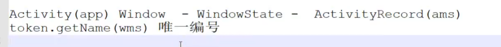

token--------本质：activity包名？

作用： TODO:

> 表征哪个activity：在APP、AMS、WMS 三个线程中，表征当前的window是哪个activity的？


when，生于：

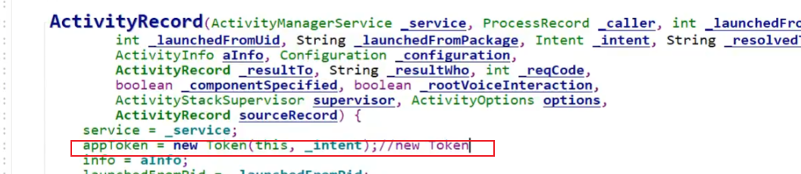

参考： https://www.bilibili.com/video/BV1pb4y1B7TW/?spm_id_from=333.337.search-card.all.click&vd_source=3eebd10b94a8a76eaf4b78bee8f23884

 


# 参考：

 https://www.jianshu.com/p/eb2ff0bc64a0    AMS重要的数据结构解析（三）：ActivityStack


# AMS相关的面试题目：

1. 请描述 Android 中的 Activity 生命周期。

   见上

2. 解释一下 Android 中的任务（Task）和返回栈（Back Stack） 

   

3. 请描述如何使用 Android AMS 启动新活动。

4. 请描述 Android AMS 如何管理应用程序的内存。

5. 解释一下 Android AMS 如何处理多窗口（Multi-Window）支持。

6. 请详细说明 Android AMS 的工作原理。

7. 解释一下 Android AMS 如何创建新活动实例。

8. 请描述 Android AMS 如何管理活动的状态。

9. 请描述如何使用 Android AMS 关闭不再使用的活动。

10. 解释一下 Android AMS 如何处理应用程序间的消息传递。

11. 请描述如何在 Android 中使用 AMS 管理多个进程。

12. 请说明 Android AMS 如何处理应用程序的安装和卸载。

13. 请描述如何使用 Android AMS 管理应用程序的权限。

