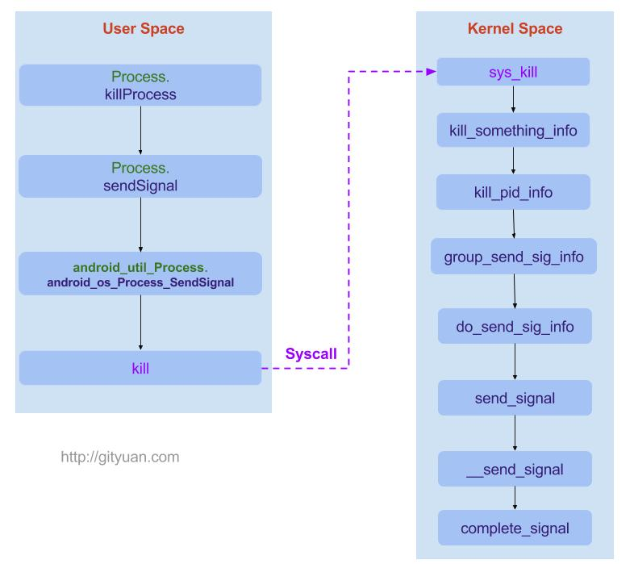
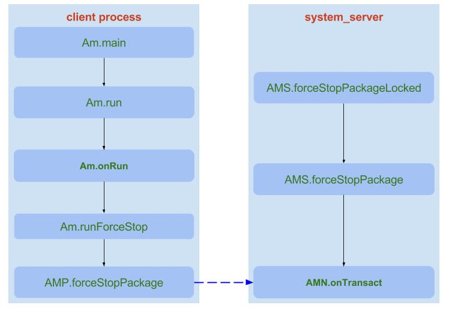
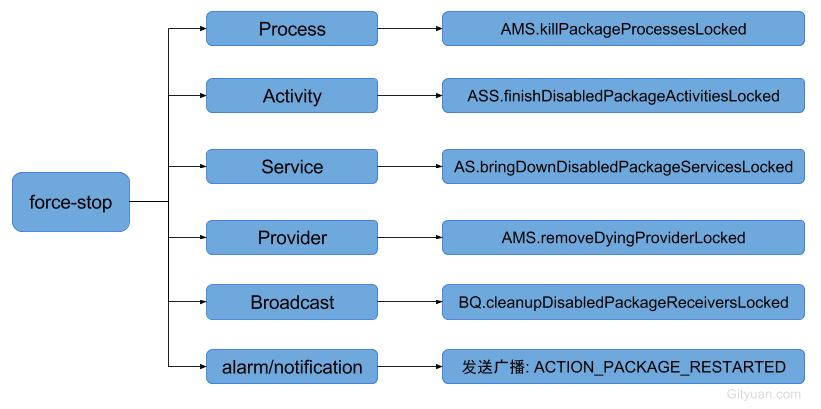

# 目录

# 杀进程原理----Process.killProcess(int pid)

0层：

> 
>
> <font color='red'>前提：</font>kill -9

完全参考：

> https://gityuan.com/2016/04/16/kill-signal/

几个方法区别：

> Process.killProcess(int pid): 杀pid进程 
>
> Process.killProcessQuiet(int pid)：杀pid进程，且不输出log信息
>
>  Process.killProcessGroup(int uid, int pid)：杀同一个uid下同一进程组下的所有进程

相同点： 都是kill  -9

调用栈：     ------->  最终 kill(pid, sig); （用户空间的Native层）

# 从调用号来看 TODO：

```java
 //Process.java
 public static final int SIGNAL_QUIT = 3;  //用于输出线程trace
 public static final int SIGNAL_KILL = 9;  //用于杀进程/线程
 public static final int SIGNAL_USR1 = 10; //用于强制执行GC
```

kill -9    则由内核直接处理：见上

kill -3 和 kill -10   由Art虚拟机处理：

> 调用栈：
>
> 实例分析：

# am force-stop pkgName

完全参考：

> https://gityuan.com/2016/10/22/force-stop/

纵向：

> 
>
> 图见：https://gityuan.com/2016/10/22/force-stop/




TODO：总结具体做的事情，见  https://gityuan.com/2016/10/22/force-stop/


