# 目录


# linux进程优先级---cpu

## 0层(linux进程管理)

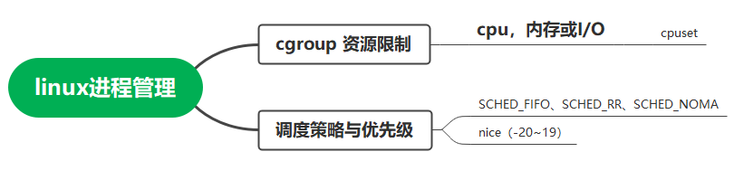

《linux进程管理.emmx》

## cpu调度----调度策略SCHED_FIFO

概念:

> cpu调度---------即 线程调度

参考：

> https://www.jianshu.com/p/1d2f6a5bbe76   Android 进程管理篇（五）-调度策略与优先级
>
> https://blog.csdn.net/aqrsxiao/article/details/84070223         linux进程调度策略

linux调度策略（部分依赖于优先级），即：

> <---------   SCHED_FIFO、SCHED_RR、SCHED_NOMAL（SCHED_OTHER）
>
> 详细：
>
> **实时调度：**针对0-99的RT(实时)进程
>
> > SCHED FIFO:    1、高优先级的终止低优先级的cpu（自然）    2、相同优先级， <font color='red'>先到先服务</font>（Fisrt in First Out，自然）  3、相同优先级下，一旦占据CPU就要到跑完为止（自然，不是轮转）
> >
> > SCHED RR:   1、高优先级的会终止低优先级的cpu（**自然**）     2、  相同优先级，<font color='red'>时间片轮询</font>（）
>
> ​      --------------> 总之，FIFO和RR 根据相同优先级下，起的名字
>
> **分时调度:** 针对100-139的普通进程，他们按nice值 -20 - 19来算优先级，越nice优先级越低
>
> > SCHED_NOMAL(SCHED OTHER) : 时间片轮询，优先级越高抢占能力越强，越容易获得更多时间片   ----> 感觉更合理，所以NOMAL
> >
> > ```java
> > SCHED BATCH 批处理进程，唤醒不频繁的使用SCHED BATCH，频繁的适合
> > ```

实时与分时的区别：

> 分时：雨露均沾。任意进程都有机会获得cpu？

优先级：承载的量：TODO: 优先级号？？？？？还是nice值？？？？？？

TODO:   具体实现 或者 实现原理

**设置链路**：

> **调度策略设置,  链路:** int sched_setscheduler(pid_t pid, int policy,conststruct sched_param *param);
>
> ​                                   ------------>
>
> **优先级设置，链路**：
>
> ​                             int setpriority(int which, int who, int prio); -------> nice值的设置
>
> 参考：https://www.kancloud.cn/alex_wsc/android-deep2/413496


应用例子：TODO：https://blog.csdn.net/aqrsxiao/article/details/84070223    

## cgroup限制 cpu 内存 I/O（目标cpuset）

主要参考： https://blog.csdn.net/shift_wwx/article/details/131854291    Android 中 cgroup抽象层详解

cgroups (全称：***control groups***)

位置：

> Linux 内核

作用：

> 限制单个进程或者多个进程所使用资源（CPU、memory）的机制。


### Q & A：既然有了调度策略+ 优先级，为什么还要有cgroup？

https://www.codenong.com/cs106895580/   为什么要有cgroup

-<font color='red'>防止 “聚沙成塔”：</font>

```java
只有nice值实际上并不能满足所有场景，比如某个应用有一个前台的UI线程，同时它还有10个后台线程，虽然后台线程的优先级比较低，但是数量较多，合起来这些后台线程对CPU的消耗也会影响到前台线程的性能。
```

----------->  所以对于Android来说又引入了另外一套机制来处理这种特殊的情况——cgroup


**背后的背后：与内存限制一个思路，即：**

> <font color='red'>单个限制 + 总的限制</font>


## 维测-----调度策略(目标nice值 )

--**<font color='red'>nice值的本质</font>：** 

> 硬件角度：即  nice值 代表的是 cpu 时间片的比例


方法一：

```cpp
 ps -p < PID > -o nice
```

方法二：top命令

> priority + nice：
>
> 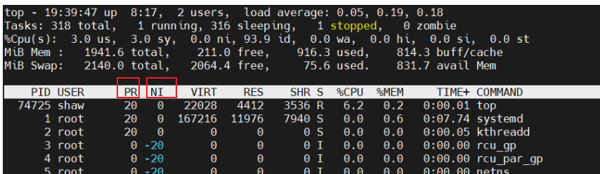

方法三：chrt 方式

SurfaceFlinge线程---> FIFO, 优先级1

> 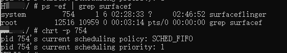


https://blog.csdn.net/renjianhhong/article/details/129196400    Linux优先级、调度策略（查看与设置大全）

https://www.cnblogs.com/Chary/p/16394567.html    [Top命令详解](https://www.cnblogs.com/Chary/p/16394567.html)


## TODO 合并：

cpu调度---------即 线程调度：

> 因为：任一时刻，只有一个线程占用CPU，处于运行状态

多线程并发：

> 轮流获取CPU使用权

线程调度模型：

> 1、分时调度模型：轮流获取、均分CPU时间
>
> 2、抢占式调度模型：优先级好的获取，JVM采用这种方式。 **nice值、cgroup**
>
> --------->TODO: 谁管理的？最终生效在哪里？
>
> ```
> nice值：
> 1）Process中定义
> 2）值越小，优先级越高
> 3）默认是THREAD_PRIORITY_DEFAULT,0
> 
> cgroup：
> 1) 更严格的群组调度策略。
> 2) 保证前台线程可以获取到更多的CPU
> 注意点：
> 线程过多会导致CPU频繁切换，降低线程运行效率
> 正确认识任务重要性决定哪种优先级。 （工作量越大优先级越低）
> 优先级具有继承性
> ```
>
> 参考： https://blog.51cto.com/u_16213654/7243574
>
> -------->TODO: 线程池


# Android 进程优先级----cpu

## 0层--(Android 进程管理)

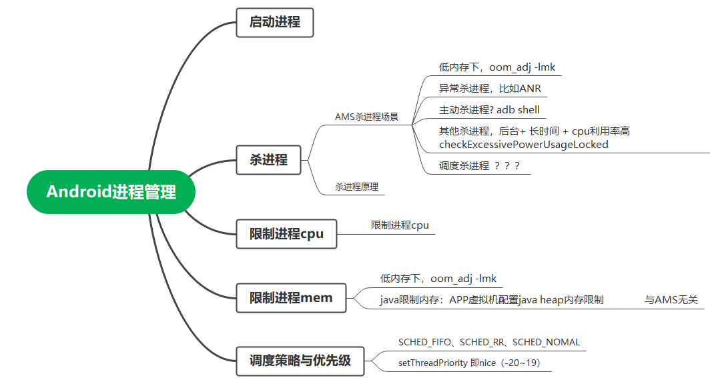

《Android进程管理 .emmx》


AMS： 负责Android四大组建的启动和管理，进程的创建和调度。

(任意一个系统) 进程管理,  角度:

> 调度策略、优先级以及 可调度CPU范围

进程管理：

> 1、CPU调度： cpu调度策略-----------进程调度优先级nice值（linux量）：决定CPU资源调度的优先级
>
> 2、内存管理： 进程存活策略---------- 杀死应用，即**内存**释放优先级ADJ（安卓量）：系统根据一定策略先杀优先级最低的进程
>
> 当内存小于X时，结束“oom_adj”大于Y的进程  -----> 如何确定X与Y？ 如何确定oom_adj值？


## cpu调度----策略+优先级

linux侧： 见上

安卓侧调用栈：（基于linux）     

> ​                AMS + PMS ----->  Process  ---- >
>
> 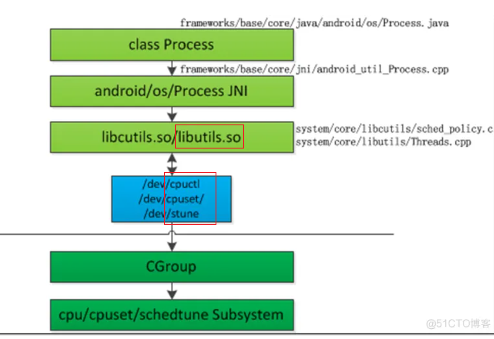
>
> ~~来源： https://blog.51cto.com/u_12218/7412595~~


## 补充：安卓Process.setThreadPriority(int tid, int priority)详解

使用点：

> 在AMS进程中使用，设置APP某些线程的优先级

调用：

> Process.setThreadPriority(int tid, int priority)
>
> ------->  androidSetThreadPriority(pid_t tid, int pri)        Threads.cpp
>
> setpriority(PRIO_PROCESS, tid, pri)           # include <sys/resource.h>        实现setpriority.c
>
> syscall(SYS_setpriority, which, who, prio)
>
> SYSCALL_DEFINE2(setpriority, int, which, int, who)        /kernel/sys.c
>
> set_one_prio(p, niceval, error);

https://zhuanlan.zhihu.com/p/491874949?utm_id=0       如何正确的理解和获取Linux中进程/线程的PID/TID

https://blog.csdn.net/zhwenx3/article/details/86662733    Linux环境下进程pid、线程tid和线程pid

> pthread_self  与 getpid

TODO:

> .h的理解：协议。。。。使用者和定义者之间的协议（自然，使用者和定义者都要 # include <sys/resource.h> ）


## 进程移除：

### 疑问：

参考： https://juejin.cn/post/7220775341605568570#heading-16     AMS的内存管理ADJ算法（Android12）

疑问：

> adj值 与 进程优先级SYSTEM_ADJ之间是什么关系？
>
> adj值 与 进程组  之间是什么关系？

**Android 中，对一个进程   是否会被杀   有三个定义：**

> 进程优先级（越小越重要，越大越容易被杀）CPU调度组  SCHED_GROUP_BACKGROUND （越大越重要，adj 算法只会杀 SCHED_GROUP_BACKGROUND 进程组的进程）进程状态（表示当前进程的运行状态）

答：

1、进程优先级---------adj值  即 优先级的承载

adj值的更新时机：四大组件状态改变时，updateOomAdjLocked。比如：TODO:

2、进程状态 ---------- BACKUP_APP_ADJ  = 300 是 adj值 的一个大致的取值。待细化，比如 adj值 = 301    -------> 理解有问题

3、**CPU调度组**   ------- SCHED_GROUP_BACKGROUND   、 SCHED_GROUP_RESTRICTED、

​           ---------------> 这个影响进程 影响进程的CPU资源调度?????

疑问：   具体如何融合这三个？

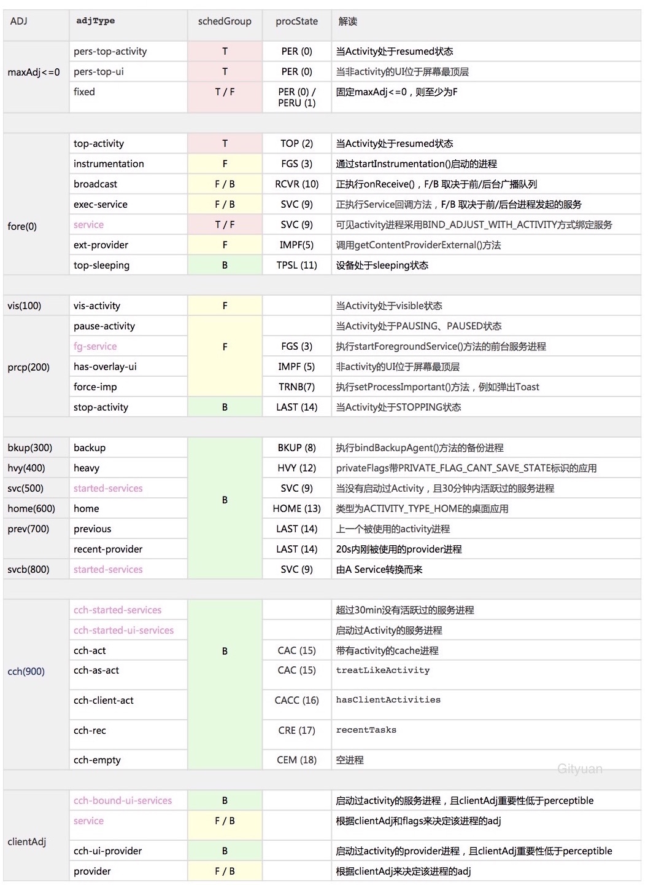

来源：https://gityuan.com/2018/05/19/android-process-adj/

LMK侧：

（1） LMK侧拿到AMS给的  一堆adj值的集合

-<font color='red'>进程移除的阈值</font>：~~根据ADJ--剩余Memory（内存阈值）表，如果此时系统内存（比如147MB）小于 221MB，则 900~906 范围都是可杀的  --------> 自然先从adj最大的进程开始，看杀了是否够~~


> 自然，剩余内存非常非常小的时候，才杀ADJ = 0
>
> 来源：https://gityuan.com/2018/05/19/android-process-adj/

其中，进程移除的阈值表

> dumpsys activity o
>
> 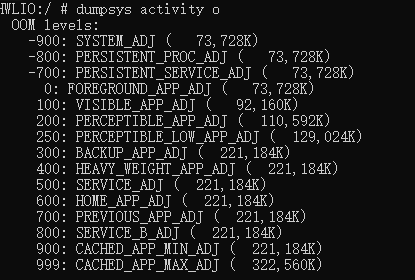
>
> 


### 0层

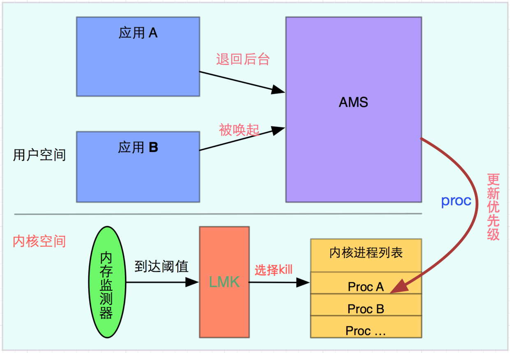

https://sq.sf.163.com/blog/article/193132570932527104

疑问：

> 更新优先级，到底指的更新的是啥？

### 关注ADJ<0的进程

- NATIVE_ADJ(-1000)：是由init进程fork出来的Native进程，并不受system管控； --------> 牛

- SYSTEM_ADJ(-900)：是指system_server进程；

  

### LRU列表

LRU列表结构：


### updateLruProcessLocked

​         ------------> 作用是啥

### adj

### 展开updateOomAdjLocked

### 杀应用

### 维测-----进程ADJ值查看

查看一个进程的adj 值：

> cat proc/[pid]/oom_score_adj -------> TODO: 为啥会写进文件里？不应该是实时的嘛？这里是整数，比如-900
>
> 例1：surfaceFlinger进程（ ps -ef | grep  surface）
>
> 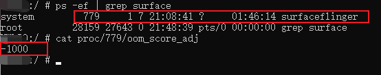
>
> 例2：抖音分别在前台和后台时ADJ值(变动值):
>
> > 前台：0
> >
> > 后台：700
> >
> > 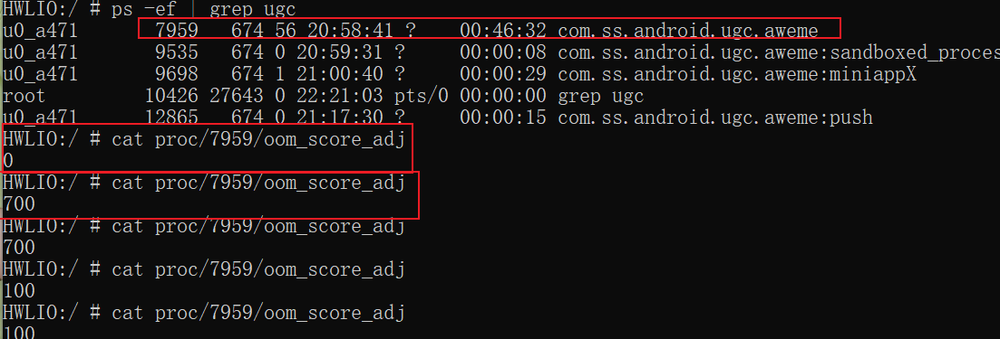
>
> 

查看阈值：

> dumpsys activity o：要杀的进程级别 <-------- 剩余的内存
>
> ```java
> OOM levels:
> -900: SYSTEM_ADJ (   73,728K)
> -800: PERSISTENT_PROC_ADJ (   73,728K)
> -700: PERSISTENT_SERVICE_ADJ (   73,728K)
>  0: FOREGROUND_APP_ADJ (   73,728K)
> 100: VISIBLE_APP_ADJ (   92,160K)
> 200: PERCEPTIBLE_APP_ADJ (  110,592K)
> 250: PERCEPTIBLE_LOW_APP_ADJ (  129,024K)
> 300: BACKUP_APP_ADJ (  221,184K)
> 400: HEAVY_WEIGHT_APP_ADJ (  221,184K)
> 500: SERVICE_ADJ (  221,184K)
> 600: HOME_APP_ADJ (  221,184K)
> 700: PREVIOUS_APP_ADJ (  221,184K)
> 800: SERVICE_B_ADJ (  221,184K)
> 900: CACHED_APP_MIN_ADJ (  221,184K)
> 999: CACHED_APP_MAX_ADJ (  322,560K)
> ```
>
> 

其他维测：

> dumpsys meminfo
>
> dumpsys activity p


## cpu调度----可调度范围cpuset

### 背景：

完全参考：

> https://www.jianshu.com/p/0532e4239703      cpuset负载均衡在AMS中是如何应用的

背景：

> TODO:这里因此逻辑不懂？

### cpuset设置

cpuset设置-------AMS阶段：

> 计算curSchedGroup ：
>
> 设置curSchedGroup ：

cpuset设置-------最终生效：

> 根据不同的cgroup写cpuset对应节点：
>
> 最终生效节点：
>
> 比如：MTK6875，总共7个核心:
>
> > top app 满核随便跑
> >
> > background只能跑在小核上

**总之：**

> （1）AMS计算cgroup
>
> （2）根据不同的cgroup写cpuset对应节点：

其他：

> cpuset开关

TODO：

> 举例子，其如何应用，以及 实际解决的问题

### 维测

top-app组 ： 限定哪些核心使用：

```
 adb shell cat /dev/CPUset/top-app/CPUs
 0-7
 -------> 0-7都可以被top-app使用
```

top-app组  ：有哪些进程和线程是跑在这个组里面：

```
 adb shell cat /dev/CPUset/top-app/tasks
```

cpu:  cat  /proc/cpuinfo     CPU的架构、cpu的名称、核心数

其他方式，限定任务跑在哪个核心上：参考：https://www.cnblogs.com/mikaelzero/p/16916730.html

> taskset -pc 3  pid    表示将进程pid绑定到第3个核上

## 参考：

https://juejin.cn/post/7174713775944138809    AMS是如何动态管理进程的？

https://www.cnblogs.com/andy-songwei/p/9845771.html   [【朝花夕拾】Android性能篇之（六）Android进程管理机制](https://www.cnblogs.com/andy-songwei/p/9845771.html)   ----> 优秀文章

https://gityuan.com/2018/05/19/android-process-adj/      解读Android进程优先级ADJ算法

https://blog.51cto.com/u_16213654/7243574   android cpu调度策略 修改 安卓cpu调度模式

https://blog.51cto.com/u_12218/7412595    android 调试看实时cpu android cpu调度

> https://sq.sf.163.com/blog/article/187631163406041088   利用cgroup来限制进程的资源使用量
>
> 防止出现资源泄漏影响其他应用

https://xiaozhuanlan.com/topic/4135276908

https://sq.sf.163.com/blog/article/193127728117825536   Android后台杀死系列之一：FragmentActivity及PhoneWindow后台杀死处理机制（上篇）

https://sq.sf.163.com/blog/article/193127674185461760   Android后台杀死系列之一：FragmentActivity及PhoneWindow后台杀死处理机制（下篇）

https://sq.sf.163.com/blog/article/193130044973854720   Android后台杀死系列之二：ActivityManagerService与App现场恢复机制（上篇）

https://sq.sf.163.com/blog/article/193129960244719616   Android后台杀死系列之二：ActivityManagerService与App现场恢复机制（下篇）

https://sq.sf.163.com/blog/article/193132570932527104   Android后台杀死系列之三：LowMemoryKiller原理（4.3-6.0）上篇

-------->  注意图

https://sq.sf.163.com/blog/article/193132514978508800   Android后台杀死系列之三：LowMemoryKiller原理（4.3-6.0）下篇

https://www.jianshu.com/p/221f4a246b45?utm_campaign=maleskine&utm_content=note&utm_medium=seo_notes&utm_source=recommendation   Android进程系列第六篇---LowmemoryKiller机制分析(上)


## TODO:

向linux侧oom_adj的设置（类似API）：(**注意：oom_adj是安卓魔改的linux才有**)

> 向   /proc/进程id/oom_adj文件中写入对应的oom_adj值
>
> **本质： 进程id ------oom_adj 的映射**


# AMS杀进程场景

## 后台cpu/电量使用checkExcessivePowerUsageLocked

### 规则：

完全参考： https://www.jianshu.com/p/ee027ed53724

AMS 每 5分钟 检查一下异常耗电情况：

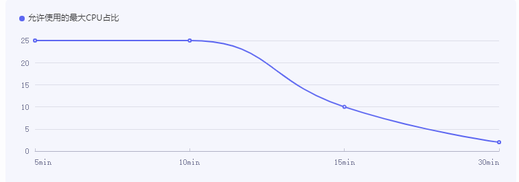

简言之：

> 1、随着时间延长，后台应用，占用CPU必须越来越少(30min之后，占用不能超2%)
>
> 2、检测频率：5min
>
> ---------------> <font color='red'>在曲线以上，会触发杀进程</font>

计算方式：

```
 rate = cputimeUsed*100/uptimeSince 一个检查周期内CPU的使用时长 / 检查周期时长
```

### 具体细节&证明：

检测频率：5min，~~即checkExcessivePowerUsageLocked调用频率：~~   TODO:

### 一些结论：

checkExcessivePowerUsageLocked ----> 与 mLruProcesses 关系不大

## adb shell am force-stop


# 目标---nice值设置

## java代码setThreadPriority----setThreadScheduler

参数：

```java
Process.setThreadPriority(int tid, int priority)
 
   -------->  tid  线程id
 
              priority： -20 ~ 19
```

-<font color='red'>setThreadPriority调用点：</font>

> **AMS.setRenderThread** ----------> 自然(要提高render线程的优先级)     **时机：**HardwareRenderer初始化时   详解：见下
>
> ​                                setThreadPriority(proc.getRenderThreadTid(), THREAD_PRIORITY_TOP_APP_BOOST);
>
> 
>
> **AMS侧OomAdjuster.**applyOomAdjLSP    ----------->  **<font color='red'>主要调用点</font>** ： 各种情况调用
>
> ​                            //  ~~setThreadPriority(app.getPid(), THREAD_PRIORITY_TOP_APP_BOOST);~~    **提高UI线程优先级**
>
> ​                           //  ~~setThreadPriority(renderThreadTid, THREAD_PRIORITY_TOP_APP_BOOST);~~   提高**renderThread**优先级
>
> 

-<font color='red'>setThreadScheduler调用点：</font>

​        **AMS侧OomAdjuster.**applyOomAdjLSP  ------>   scheduleAsFifoPriority(renderThreadTid, true)    ------->  FIFO级别


调用流程：

```cpp
Process.setThreadPriority(int tid, int priority)
    android_os_Process_setThreadPriority   -----------jni--------------
        Threads::androidSetThreadPriority(pid, pri)
             SetTaskProfiles(tid, {"SCHED_SP_SYSTEM"}, true)  //processgroup.cpp TODO:  设置了profiles
                  TaskProfiles::SetTaskProfiles(int tid, const std::vector<std::string>& profiles, bool use_fd_cache)
             setpriority(PRIO_PROCESS, tid, pri)     // 即设置nice值
```


问题：

> 既然是设置给线程的，那么不同进程之间怎么调度？
>
> 调度是以线程，还是按照进程维度去分配资源的？


## 经典调用路径-------前后台切换

前台myappliaction  退到 后台 （自然，launcher进入前台）

###  **<font color='red'>目标：</font>myappliaction 线程优先级降低、launcher的提高**

时机： TODO：

> 
>
> ```java
> applyOomAdjLocked:1817, OomAdjuster (com.android.server.am)
> updateOomAdjLocked:447, OomAdjuster (com.android.server.am)
> updateOomAdjLocked:16947, ActivityManagerService (com.android.server.am)
> updateProcessInfo:1304, ProcessRecord (com.android.server.am)
> accept:-1, -$$Lambda$BEx3OWenCvYAaV5h_J2ZkZXhEcY (com.android.server.wm)
> doInvoke:300, PooledLambdaImpl (com.android.internal.util.function.pooled)
> invoke:195, PooledLambdaImpl (com.android.internal.util.function.pooled)
> run:86, OmniFunction (com.android.internal.util.function.pooled)
> handleCallback:883, Handler (android.os)
> dispatchMessage:100, Handler (android.os)
> loop:214, Looper (android.os)
> run:67, HandlerThread (android.os)
> run:44, ServiceThread (com.android.server)
> ```


```java
//OomAdjuster
applyOomAdjLocked 方法：

//1、提高launcher的
// Boost priority for top app UI and render threads
setThreadPriority(app.pid, TOP_APP_PRIORITY_BOOST);
setThreadPriority(app.renderThreadTid,  TOP_APP_PRIORITY_BOOST);
    
//2、降低myappliaction 的
setThreadPriority(app.pid, 0);
setThreadPriority(app.renderThreadTid, 0);
```

------------> TODO: 

> 了解app.renderThreadTid != 0 系统侧如何判断 APP有没有render线程的！！！！！！


## ~~del:inux 接口  setpriority~~

```cpp
#include <sys/time.h>
#include <sys/resource.h>

int setpriority(int which, id_t who, int value);

```

## ~~del:命令设置nice值~~

```java
nice -n <nice_value> <command>
```

TODO： 实战验证

## nice值维测

见linux章节


## 例子---安卓修改nice值的线程：

### RenderThread线程

详解setRenderThread ：

> -1、<font color='red'>默认情况下</font>
>
> > 每个进程的绘画线程RenderThread的调度策略是SCHED_OTHER, 并且优先级为-10.
>
> 2、mUseFifoUiScheduling = true下: （即设置系统属性sys.use_fifo_ui为1（TODO: 手机和车机，暂时没看到这样做））
>
> > 每个进程的绘画线程RenderThread的调度策略变更为SCHED_FIFO,并且实时优先级为1.(其实，只是在硬件加速时，会设置setRenderThread 。但是默认硬件加速)
>
> --------------> 无论哪种，RenderThread都提高了优先级

https://blog.csdn.net/hdxx2022/article/details/127630906    关于Android进程调度浅谈 (Android系统在以下几个地方设置了SCHED_FIFO调度策略)

setThreadScheduler  ------>  调度策略 + 优先级

### 应用主线程

TODO: 哪里设置的？

### SurfaceFlinger线程

SurfaceFlinger设置为FIFO

> 

linux +<font color='red'> KDE桌面环境</font>：

> kwin_x11   ------->  是KDE的图形合成器
>
> renderThread  ------->  KDE  也有


# 一些结论：

## Linux上，各线程nice值大多一样

linux ：

> 应用火狐浏览器：
>
> ```
> PID USER      PR  NI    VIRT    RES    SHR S %CPU %MEM     TIME+ COMMAND
> [m17632 chen  20   0 2550392 176168 100700 S  6.7  2.9 633:26.35 Xorg
> [m17633 chen  20   0 2550392 176168 100700 S  0.0  2.9   0:00.00 llvmpipe-0
> [m17634 chen  20   0 2550392 176168 100700 S  0.0  2.9   0:00.00 llvmpipe-1
> [m17635 chen  20   0 2550392 176168 100700 S  0.0  2.9   0:00.00 llvmpipe-2
> [m17636 chen  20   0 2550392 176168 100700 S  0.0  2.9   0:00.00 llvmpipe-3
> [m17637 chen  20   0 2550392 176168 100700 S  0.0  2.9   0:00.00 llvmpipe-4
> [m17638 chen  20   0 2550392 176168 100700 S  0.0  2.9   0:00.00 llvmpipe-5
> [m17639 chen  20   0 2550392 176168 100700 S  0.0  2.9   0:00.00 llvmpipe-6
> [m17640 chen  20   0 2550392 176168 100700 S  0.0  2.9   0:00.00 llvmpipe-7
> [m17641 chen  20   0 2550392 176168 100700 S  0.0  2.9   0:00.00 llvmpipe-8
> [m17642 chen  20   0 2550392 176168 100700 S  0.0  2.9   0:00.00 llvmpipe-9
> [m17643 chen  20   0 2550392 176168 100700 S  0.0  2.9   0:00.00 llvmpipe-10
> [m17644 chen  20   0 2550392 176168 100700 S  0.0  2.9   0:00.00 llvmpipe-11
> [m17645 chen  20   0 2550392 176168 100700 S  0.0  2.9   0:00.00 llvmpipe-12
> [m17646 chen  20   0 2550392 176168 100700 S  0.0  2.9   0:00.00 llvmpipe-13
> [m17647 chen  20   0 2550392 176168 100700 S  0.0  2.9   0:00.00 Xorg
> [m17648 chen  20   0 2550392 176168 100700 S  0.0  2.9   0:00.01 Xorg
> [m17649 chen  20   0 2550392 176168 100700 S  0.0  2.9   0:00.00 Xorg
> [m17650 chen  20   0 2550392 176168 100700 S  0.0  2.9   0:00.00 Xorg
> [m17651 chen  20   0 2550392 176168 100700 S  0.0  2.9   0:00.00 Xorg
> [m17652 chen  20   0 2550392 176168 100700 S  0.0  2.9   0:00.00 Xorg
> [m17653 chen  20   0 2550392 176168 100700 S  0.0  2.9   0:00.00 Xorg
> [m17654 chen  20   0 2550392 176168 100700 S  0.0  2.9   0:00.00 Xorg
> [m17655 chen  20   0 2550392 176168 100700 S  0.0  2.9   0:00.00 Xorg
> [m17656 chen  20   0 2550392 176168 100700 S  0.0  2.9   0:00.00 Xorg
> [m17657 chen  20   0 2550392 176168 100700 S  0.0  2.9   0:00.00 Xorg
> [m17658 chen  20   0 2550392 176168 100700 S  0.0  2.9   0:00.00 Xorg
> [m17659 chen  20   0 2550392 176168 100700 S  0.0  2.9   0:00.00 Xorg
> [m17660 chen  20   0 2550392 176168 100700 S  0.0  2.9   0:00.00 Xorg
> [m17663 chen  20   0 2550392 176168 100700 S  0.0  2.9   0:17.93 InputThread
> ```

linux ：整个系统：

> 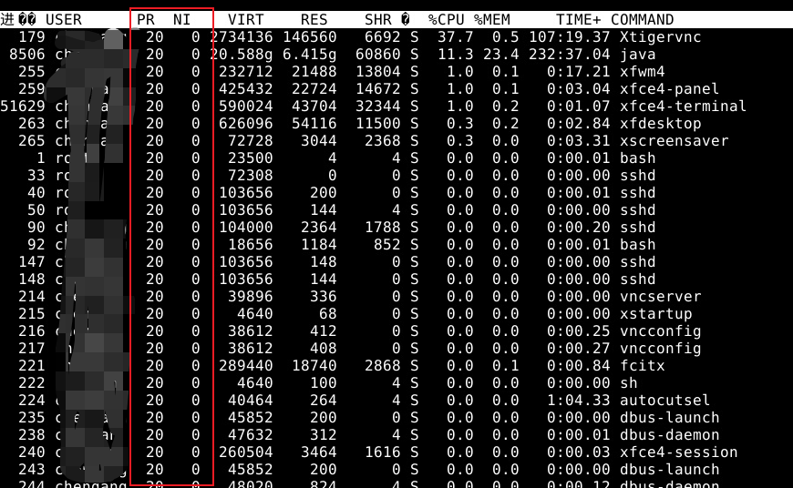

安卓：应用进程com.huawei.notepad

> render线程和主线程，比较优先级高
>
> 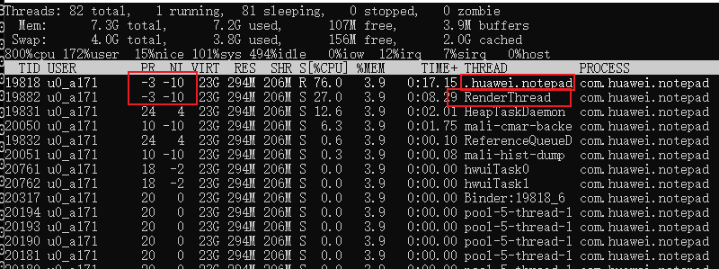

安卓整个系统：

> 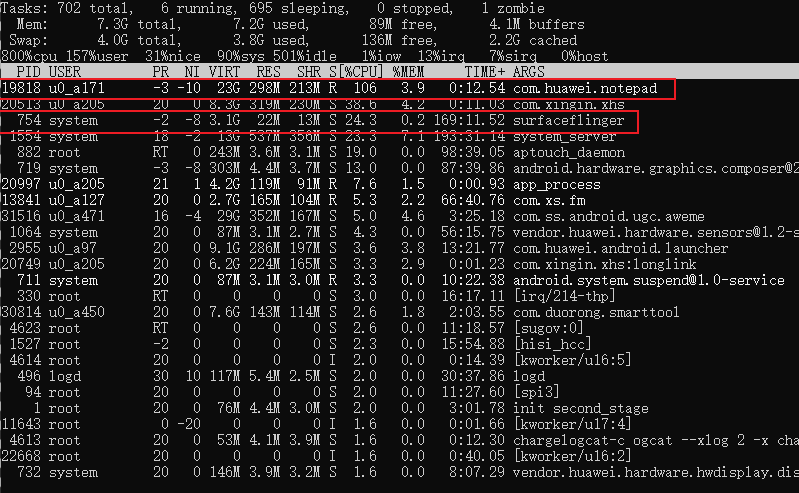
>
> 

**初步结论：**

> 安卓上：com.huawei.notepad应用的各个线程的**nice值不一样**
>
> ​                比如 RenderThread---------->  **设置点：**AMS.setRenderThread，
>
> Linux上，各线程明显一样


# TODO： 整理

 进程管理系列3进程的优先级: https://paul.pub/android-process-priority/