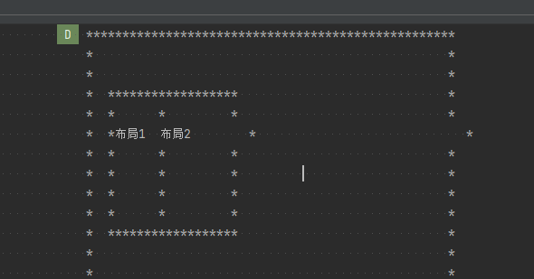

# log框架 与 丢log处理

cmd：

> https://blog.csdn.net/Tecinno4/article/details/108471795    Android logcat log丢失
>
> https://blog.csdn.net/kc58236582/article/details/51506896    android log丢失（一）使用logd丢失log原理

-**<font color='red'>是否有丢log判断：</font>**

> log中有   chatty  关键词

Android studio logcat log丢失：

> https://www.jianshu.com/p/ce2b246cfec4   Android studio logcat log丢失不全问题解决


TODO： 


# LOG 实践

## system log

作用：
记录手机android上层app以及framework相关活动的log，比如你写的app打印的log，就在这里面


```
adb shell logcat -v
```


### ProtoLog动态log

Android ProtoLog动态开启相关wm logging源码分析补充

https://blog.csdn.net/liaosongmao1/article/details/130597983?utm_medium=distribute.pc_relevant.none-task-blog-2~default~baidujs_baidulandingword~default-0-130597983-blog-110820407.235^v38^pc_relevant_default_base3&spm=1001.2101.3001.4242.1&utm_relevant_index=3   


## EventLog

作用：

> 非常简洁明了地展现当前<font color='red'>Activity各种状态</font>  -----》 状态性日志，而不是流程性
>
> ~~ActivityManager、powerManager等相关的log~~


```java
  adb shell logcat -b events 
  adb shell logcat -b events | findstr "am_ wm_"  // 同时过滤AMS与Wms
```

--------->    注意：~~普通的[adb](https://so.csdn.net/so/search?q=adb&spm=1001.2101.3001.7020) shell logcat 日志里没有 event log~~


涉及的源码类：

> EventLog.java, EventLogTags.java


### 参考

http://gityuan.com/2016/05/15/event-log/  Android EventLog含义  ----> 详细

https://blog.csdn.net/junjle/article/details/87184120?utm_medium=distribute.pc_relevant.none-task-blog-2~default~baidujs_baidulandingword~default-1-87184120-blog-117734286.235^v38^pc_relevant_default_base3&spm=1001.2101.3001.4242.2&utm_relevant_index=4   


## kernel Log  驱动相关的log


ctrl+alt+shift+i


## log环境规定

规定：

1、<font color='red'>永远不允许用AS抓log</font>   （日志过多，AS端日志会冲掉）


用  adb logcat -c   &&  adb logcat  -v time  > logcat.txt

2、log buffer选择最大 -----> 否则，有可能丢日志


## 加log技巧

1、log也要**注意判断null，**否则直接crash，浪费编译时间

​       加log，可能导致attach system_process挂了

​        ------>   **规定**：

> ​      （1）每次加完，验证一下  
>
> ​      （2）**加log要谨慎，判空要做好**

2、log和调用栈一起使用


3、**避免一行超长，notePad看不方便：**

```java
// 换行
Log.d(TAG, "child.mAttachInfo.mTmpInvalRect "  + child.mAttachInfo.mTmpInvalRect + "\\n" +
        "child.getId(): "+ child.getId() + "\\n" +
        "child.getAccessibilityViewId(): "+ child.getAccessibilityViewId() + "\\n" +
        "child.getWindowId(): "+ child.getWindowId());

```


4、技巧之： **针对（关键指标，要非常显眼）、差异化**对待：

（1）比如关注某个接口的时间差 ----------> 如果打印频繁，不好一直做差

​                                                            即用Error 打印出来**差值**（**<font color='red'>Error自带红色</font>**）

（2）**我们只对时间差高的关心**，~~更进一步 差异化~~：

```java
 if （差值 > 70ms ）{
    log.e()
} else {
	log.d()
}
```


## view log维测技巧：

TODO：

特点：多而杂乱


方法一：**<font color='red'>以偏概全</font>** ---------------打印含有文字的控件，然后基本知道所有控件的布局（对应关系）

​                             ------------->  **抓住一点，不及其余**                           


方法二：

> **直观画图**：-----> 也是有文字的才画
>
> 

%accordion%直观画图%accordion%


```java
        // 将矩形的数组合并到大数组中
        private char[][]  mergeArrays(char[][] screen, char[][] rectangle) {
            int row =  rectangle.length;
            int col = rectangle[0].length;
            for (int i = 0; i < row; i++) {
                for (int j = 0; j < col; j++) {
                        if (rectangle[i][j] != ' ') {
                            screen[i][j] = rectangle[i][j];
                        }
                }
            }
            return screen;
        }

        // 打印屏幕数组
        private String  printScreen(char[][] screen) {
            StringBuilder sb = new StringBuilder();

            for (int i = 0; i < screen.length; i++) {
                for (int j = 0; j < screen[0].length; j++) {
//                    System.out.print(screen[i][j]);
                    sb.append(screen[i][j]);
                }
//                System.out.println();
                sb.append("\n");
            }
            Log.d(TAG, sb.toString());
            return sb.toString();
        }

        // 生成一个矩形数组
        public char[][] generateRectangle(int x1, int y1, int x2, int y2, String  text) {
            // 计算矩形的宽度和高度
            int width = x2 + 1;  // 宽度为 x2
            int height = y2 + 1;  // 高度为 y2

            // 创建二维数组表示矩形，初始为全空格
            char[][] rectangle = new char[height][width];

            // 初始化数组
            for (int i = 0; i < height; i++) {
                for (int j = 0; j < width; j++) {
                    rectangle[i][j] = ' ';
                }
            }

            // 用*表示矩形的边界
            for (int i = y1; i < height; i++) {
                for (int j = x1; j < width; j++) {
                    if (i == y1 || i == height - 1 || j == x1 || j == width - 1) {
                        rectangle[i][j] = '*';  // 边界
                    } else {
                        rectangle[i][j] = ' ';  // 内部空格
                    }
                }
            }

            // 在矩形中央显示文本，如果文本长度超过矩形宽度，只显示前几个字符
            int textStart = Math.max(0, (width - text.length()) / 2);
            int textEnd = Math.min(width, textStart + text.length());
            for (int j = textStart; j < textEnd; j++) {
                rectangle[height / 2][j] = text.charAt(j - textStart);
            }

            // 返回生成的矩形数组
            return rectangle;
        }

    public void test3() {
        // 合并矩形的数组并返回
        char[][] screen = generateRectangle(0,0,50,80, "");

        // 给定矩形的左上角和右下角坐标
        char[][] rectangle = generateRectangle(3,3, 10, 10, "布局1");
        // 合并矩形的数组到大数组
        mergeArrays(screen, rectangle);

        // 给定矩形的左上角和右下角坐标
        char[][] rectangle2 = generateRectangle(3,3, 20, 10, "布局2");
        // 合并矩形的数组到大数组
        mergeArrays(screen, rectangle2);

        // 打印大数组
        printScreen(screen);
    }
```

%/accordion%


## AS 日志 过滤

https://blog.csdn.net/qq_38909786/article/details/134416770  日志 过滤

过滤包名加两个字段 package:org.sipdroid.sipua message:=alarm message:600


## 日志问题之   丢日志

AS 或者 logcat发现有丢日志，**根因：** 

> 日志缓冲区过小

方法一：

> 缓冲区，直接在配置中，改大：------------------>  防止日志丢失
>
> P13_5G:/system # cat build.prop  | grep logd persist.logd.size=8M
>
> adb pull /system/build.prop  ---> 修改

**特别注意**： 不能修改 build.prop  的权限（方法：pull & push，不要直接vi修改）

方法二： 参考： https://blog.csdn.net/zhangxu1024/article/details/121374807       

> 报错：
>
> ```java
> logcat: Unexpected EOF!
> 
> This means that either the device shut down, logd crashed, or this instance of logcat was unable to read log
> messages as quickly as they were being produced.
> 
> If you have enabled significant logging, look into using the -G option to increase log buffer sizes.
> ```
>
> 最终生效：
>
> ```java
> D:\\\\work\\\\test\\\\log>adb shell logcat -g
> main: ring buffer is 256 KiB (3 MiB consumed), max entry is 5120 B, max payload is 4068 B
> system: ring buffer is 256 KiB (251 KiB consumed), max entry is 5120 B, max payload is 4068 B
> crash: ring buffer is 256 KiB (15 KiB consumed), max entry is 5120 B, max payload is 4068 B
> kernel: ring buffer is 256 KiB (245 KiB consumed), max entry is 5120 B, max payload is 4068 B
> ```
>
> 修改：
>
> ```
> adb shell logcat -G 5M
> ```


--------------------> **很多时候，方法一不生效！！！！！！！！！！！！**


--------------------->  TODO: 找到持久化的文件，写成脚本。每次导入jar时执行


方法三：**万能方法**（**验证ok**）：

> 在**logd处**限制  -----------> 只允许打印E 及以上的日志（**其他日志不打印，自然不会过频**）
>
> ```
> setprop persist.log.tag E
> ```

参考：

> [Android logcat log输出控制_persist.log.tag-CSDN博客](https://blog.csdn.net/Tecinno4/article/details/107955881)


TODO： log框架：

> APP  通过UDP---------> logd服务  通过TCP-----------> logcat终端
>
> 打印，指的是logd打印；logcat只是取日志


## 日志问题之 单条日志截断

方法一：

https://blog.csdn.net/realDonaldTrump/article/details/128468204   Android单条日志太长导致被截断的问题分析和解决

方法二：多次输出

https://blog.csdn.net/chuyouyinghe/article/details/81699307

```
1
// Function to print equal segments of a string2
void printEqualSegments(const char* str, int length) {3
    const int segmentLength = length / 2;4
    char firstSegment[segmentLength + 1]; // +1 for null terminator5
    char secondSegment[segmentLength + 1]; // +1 for null terminator6
7
    // Copy first segment8
    strncpy(firstSegment, str, segmentLength);9
    firstSegment[segmentLength] = '\\0'; // Null terminate10
11
    // Copy second segment12
    strncpy(secondSegment, str + segmentLength, segmentLength);13
    secondSegment[segmentLength] = '\\0'; // Null terminate14
15
    // Print segments16
//    printf("First Segment: %s\\n", firstSegment);17
//    printf("Second Segment: %s\\n", secondSegment);18
    ALOGI("ProgramCache::generateProgram: fs1:%s end", firstSegment);19
    ALOGI("ProgramCache::generateProgram: fs2:%s end", secondSegment);20
}
```

日志跟很多相关：

>   系统侧打印(系统侧的配置能力)
>
>   日志服务
>
>   终端的接收能力（cmd、AS、cmd输出到文件）
>
>   >   好的方式：输出文件，相对靠谱
>   >
>   >   ```java
>   >   1
>   >   adb logcat -v time > 111.txt  // cmd输出到文件
>   >   ```