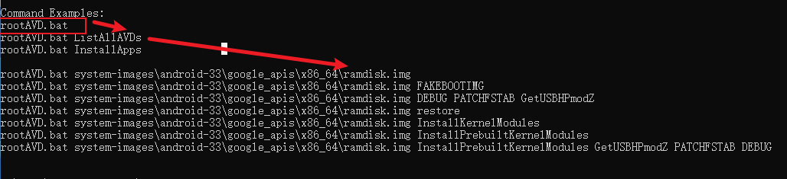

# 目录


# 问在前面（目的论）

权限： 

其实，权限状态是必然的。比如，做饭这件事情，

1、你要有出门的权限（疫情就不行），去买菜

2、房间要满足厨房的通风要求

3、生火的权限

.....................


权限的功能是啥？

----》1、如何理解应用权限 与 INTERNAL_SYSTEM_WINDOW 啥关系？ 

2、权限的本质是什么？ A申明了权限，B使用权限？

​     权限有哪些状态？（xml中申明？xml请求？用户同意？自定义？运行时？） ----->   软件必须弄懂状态


从信息角度：

> 限制来源于谁？限制于谁？


# 安卓权限概念

参考:

https://blog.csdn.net/sinat_20059415/article/details/80370223


见下  TODO


# 哪些app属于system app？

https://blog.csdn.net/Liu1314you/article/details/77368585

大体认识：

privileged app（特权app） >  System app >  

状态判定标准：

​          ApplicationInfo.FLAG_SYSTEM`

​           ApplicationInfo.PRIVATE_FLAG_PRIVILEGED


# 权限的声明&使用&获取

**声明权限**是指在AndroidManifest.xml中使用了`<permission>`， -----》 TODO: 不懂

**使用权限**是指在AndroidManifest.xml中使用了`<uses-permission>`

**获得权限（或赋予权限）**是指真正的可以<font color='red'>通过</font>系统的权限检查，调用到权限保护的方法


App A中声明了权限PermissionA，App B中使用了权限PermissionA--------> B可以调用A？


# 环境中查看状态权限

注意，

1、其实，**与运行时无关**，因为PMS这些权限的状态，与运行时无关  ---->  安装包决定的

2、与应用是否打开也无关

## 以package 为base，查看一个包涉及的权限

```java
adb shell dumpsys package <包名>
```

以com.tencent.mm为例： adb shell dumpsys package com.tencent.mm

**文件结构如下：**

1、给出自定义的Permission

推论：与 declared permissions中的权限 应该一样  TODO

%accordion%点击展示%accordion%

```java
Permissions:
  Permission [com.tencent.mm.WAID_PROVIDER_WRITE] (7bc450):
    sourcePackage=com.tencent.mm // sourcePackage是权限声明的地方
    uid=10108 gids=null type=0 prot=signature
    perm=Permission{632649 com.tencent.mm.WAID_PROVIDER_WRITE}
    packageSetting=PackageSetting{557bb4e com.tencent.mm/10108}

Permissions:
  Permission [com.tencent.mm.permission.EXT_OPEN_APPBRAND_LAUNCHER_UI] (dc0b46f):
    sourcePackage=com.tencent.mm
    uid=10108 gids=null type=0 prot=signature
    perm=Permission{ee0d57c com.tencent.mm.permission.EXT_OPEN_APPBRAND_LAUNCHER_UI}
    packageSetting=PackageSetting{557bb4e com.tencent.mm/10108}

Permissions:
  Permission [com.tencent.mm.matrix.strategynotify] (aede05):
    sourcePackage=com.tencent.mm
    uid=10108 gids=null type=0 prot=signature
    perm=Permission{ef83e5a com.tencent.mm.matrix.strategynotify}
    packageSetting=PackageSetting{557bb4e com.tencent.mm/10108}

Permissions:
  Permission [com.tencent.mm.permission.MM_MESSAGE] (64e288b):
    sourcePackage=com.tencent.mm
    uid=10108 gids=null type=0 prot=signature
    perm=Permission{623cd68 com.tencent.mm.permission.MM_MESSAGE}
    packageSetting=PackageSetting{557bb4e com.tencent.mm/10108}

Permissions:
  Permission [com.tencent.mm.plugin.permission.READ] (c445581):
    sourcePackage=com.tencent.mm
    uid=10108 gids=null type=0 prot=signature
    perm=Permission{debe626 com.tencent.mm.plugin.permission.READ}
    packageSetting=PackageSetting{557bb4e com.tencent.mm/10108}

Permissions:
  Permission [com.tencent.mm.wear.message] (4f4c267):
    sourcePackage=com.tencent.mm
    uid=10108 gids=null type=0 prot=signature
    perm=Permission{21c5814 com.tencent.mm.wear.message}
    packageSetting=PackageSetting{557bb4e com.tencent.mm/10108}

Permissions:
  Permission [com.tencent.mm.ext.permission.SPORT] (c5fc8bd):
    sourcePackage=com.tencent.mm
    uid=10108 gids=null type=0 prot=normal
    perm=Permission{3203eb2 com.tencent.mm.ext.permission.SPORT}
    packageSetting=PackageSetting{557bb4e com.tencent.mm/10108}

Permissions:
  Permission [com.tencent.mm.ext.permission.WRITE] (7811e03):
    sourcePackage=com.tencent.mm
    uid=10108 gids=null type=0 prot=signature|privileged
    perm=Permission{270e180 com.tencent.mm.ext.permission.WRITE}
    packageSetting=PackageSetting{557bb4e com.tencent.mm/10108}

Permissions:
  Permission [com.tencent.mm.backtrace.warmed_up] (7c533b9):
    sourcePackage=com.tencent.mm
    uid=10108 gids=null type=0 prot=signature
    perm=Permission{ecf93fe com.tencent.mm.backtrace.warmed_up}
    packageSetting=PackageSetting{557bb4e com.tencent.mm/10108}

Permissions:
  Permission [com.tencent.mm.permission.C2D_MESSAGE] (1ed975f):
    sourcePackage=com.tencent.mm
    uid=10108 gids=null type=0 prot=signature
    perm=Permission{8c295ac com.tencent.mm.permission.C2D_MESSAGE}
    packageSetting=PackageSetting{557bb4e com.tencent.mm/10108}

Permissions:
  Permission [com.tencent.mm.matrix.permission.PROCESS_SUPERVISOR] (37c5275):
    sourcePackage=com.tencent.mm
    uid=10108 gids=null type=0 prot=signature
    perm=Permission{88cf20a com.tencent.mm.matrix.permission.PROCESS_SUPERVISOR}
    packageSetting=PackageSetting{557bb4e com.tencent.mm/10108}

Permissions:
  Permission [com.tencent.mm.permission.EXT_OPEN_APPBRAND_MY_COLLECTIONS] (37e4a7b):
    sourcePackage=com.tencent.mm
    uid=10108 gids=null type=0 prot=signature
    perm=Permission{d996098 com.tencent.mm.permission.EXT_OPEN_APPBRAND_MY_COLLECTIONS}
    packageSetting=PackageSetting{557bb4e com.tencent.mm/10108}

Permissions:
  Permission [com.tencent.mm.manual.dump] (34ca0f1):
    sourcePackage=com.tencent.mm
    uid=10108 gids=null type=0 prot=signature
    perm=Permission{c1024d6 com.tencent.mm.manual.dump}
    packageSetting=PackageSetting{557bb4e com.tencent.mm/10108}

Permissions:
  Permission [com.tencent.mm.vfs.broadcast] (19d1357):
    sourcePackage=com.tencent.mm
    uid=10108 gids=null type=0 prot=signature
    perm=Permission{80fee44 com.tencent.mm.vfs.broadcast}
    packageSetting=PackageSetting{557bb4e com.tencent.mm/10108}

Permissions:
  Permission [com.tencent.mm.plugin.permission.WRITE] (5f95b2d):
    sourcePackage=com.tencent.mm
    uid=10108 gids=null type=0 prot=signature
    perm=Permission{6c1b862 com.tencent.mm.plugin.permission.WRITE}
    packageSetting=PackageSetting{557bb4e com.tencent.mm/10108}
  Permission [com.tencent.mm.permission.MOVE_XLOG] (4758df3):
    sourcePackage=com.tencent.mm
    uid=10108 gids=null type=0 prot=signature|privileged
    perm=Permission{43faab0 com.tencent.mm.permission.MOVE_XLOG}
    packageSetting=PackageSetting{557bb4e com.tencent.mm/10108}

Permissions:
  Permission [com.tencent.mm.ext.permission.READ] (93d7d29):
    sourcePackage=com.tencent.mm
    uid=10108 gids=null type=0 prot=signature|privileged
    perm=Permission{206f8ae com.tencent.mm.ext.permission.READ}
    packageSetting=PackageSetting{557bb4e com.tencent.mm/10108}

```


%/accordion%


2、给出涉及的Permission

%accordion%点击展示%accordion%

```java
Packages:
  Package [com.tencent.mm] (557bb4e): //下面针对于 com.tencent.mm
    userId=10108  // userId到底是啥？
    pkg=Package{e030746 com.tencent.mm}
    codePath=/data/app/com.tencent.mm-FtxVmfhJnuP-P7oGWPgRrw==
    resourcePath=/data/app/com.tencent.mm-FtxVmfhJnuP-P7oGWPgRrw==
    legacyNativeLibraryDir=/data/app/com.tencent.mm-FtxVmfhJnuP-P7oGWPgRrw==/lib
    primaryCpuAbi=arm64-v8a   // 包路径、资源路径、lib路径
    secondaryCpuAbi=null
    versionCode=2400 minSdk=23 targetSdk=29 //需要的安卓sdk版本
    versionName=8.0.38
    splits=[base]
    apkSigningVersion=1
    applicationInfo=ApplicationInfo{f07dea4 com.tencent.mm}
    flags=[ HAS_CODE ALLOW_CLEAR_USER_DATA LARGE_HEAP ] // TODO: flags是啥
    privateFlags=[ PRIVATE_FLAG_ACTIVITIES_RESIZE_MODE_RESIZEABLE_VIA_SDK_VERSION ALLOW_AUDIO_PLAYBACK_CAPTURE PRIVATE_FLAG_REQUEST_LEGACY_EXTERNAL_STORAGE HAS_DOMAIN_URLS PARTIALLY_DIRECT_BOOT_AWARE ]
    dataDir=/data/user/0/com.tencent.mm
    supportsScreens=[small, medium, large, xlarge, resizeable, anyDensity]
    usesOptionalLibraries: 
      org.apache.http.legacy
      com.google.android.maps
      com.sec.android.app.multiwindow
      com.miui.easygo
      com.hihonor.easygo
      com.here.android
      androidx.window.extensions
      androidx.window.sidecar
      androidx.camera.extensions.impl
      com.huawei.easygo
      soterkeystore
    usesLibraryFiles:
      /system/framework/org.apache.http.legacy.jar
    timeStamp=2023-06-28 21:50:04
    firstInstallTime=2023-06-28 21:50:28
    lastUpdateTime=2023-06-28 21:50:28
    installerPackageName=com.android.packageinstaller
    signatures=PackageSignatures{a4cc409 version:1, signatures:[962f5b7], past signatures:[]} //签名
    installPermissionsFixed=true // 安装权限 -----> 如果装上了，一定为true？
    pkgFlags=[ HAS_CODE ALLOW_CLEAR_USER_DATA LARGE_HEAP ]
    declared permissions:  // 【1】微信自定义的权限
      com.tencent.mm.plugin.permission.WRITE: prot=signature, INSTALLED
      com.tencent.mm.plugin.permission.READ: prot=signature, INSTALLED
      com.tencent.mm.permission.MM_MESSAGE: prot=signature, INSTALLED
      com.tencent.mm.permission.MOVE_XLOG: prot=signature|privileged, INSTALLED
      com.tencent.mm.ext.permission.READ: prot=signature|privileged, INSTALLED
      com.tencent.mm.ext.permission.WRITE: prot=signature|privileged, INSTALLED
      com.tencent.mm.ext.permission.SPORT: prot=normal, INSTALLED
      com.tencent.mm.wear.message: prot=signature, INSTALLED
      com.tencent.mm.WAID_PROVIDER_WRITE: prot=signature, INSTALLED
      com.tencent.mm.permission.EXT_OPEN_APPBRAND_LAUNCHER_UI: prot=signature, INSTALLED
      com.tencent.mm.permission.EXT_OPEN_APPBRAND_MY_COLLECTIONS: prot=signature, INSTALLED
      com.tencent.mm.matrix.strategynotify: prot=signature, INSTALLED
      com.tencent.mm.vfs.broadcast: prot=signature, INSTALLED
      com.tencent.mm.manual.dump: prot=signature, INSTALLED
      com.tencent.mm.backtrace.warmed_up: prot=signature, INSTALLED
      com.tencent.mm.matrix.permission.PROCESS_SUPERVISOR: prot=signature, INSTALLED
      com.tencent.mm.permission.C2D_MESSAGE: prot=signature, INSTALLED
    requested permissions: // 【2】已经请求的权限。。。1、一定包含install permissions (对于已经安装了的pkg)  2、Todo: 一定都是用户授权了吗？
      android.bluetooth.permissions.SHORTCUT_ACTION
      android.permission.CHANGE_WIFI_MULTICAST_STATE
      com.tencent.mm.plugin.permission.READ
      com.tencent.mm.plugin.permission.WRITE
      com.tencent.mm.permission.MM_MESSAGE
      com.huawei.authentication.HW_ACCESS_AUTH_SERVICE
      com.google.android.providers.gsf.permission.READ_GSERVICES
      android.permission.CHANGE_NETWORK_STATE
      android.permission.ACCESS_NETWORK_STATE
      android.permission.ACCESS_COARSE_LOCATION
      android.permission.ACCESS_FINE_LOCATION
      android.permission.CAMERA// 微信自然需要CAMERA权限
      android.permission.GET_TASKS
      android.permission.INTERNET
      android.permission.MODIFY_AUDIO_SETTINGS
      android.permission.RECEIVE_BOOT_COMPLETED
      android.permission.RECORD_AUDIO
      android.permission.READ_CONTACTS
      android.permission.VIBRATE
      android.permission.WAKE_LOCK
      android.permission.WRITE_EXTERNAL_STORAGE: restricted=true
      com.android.launcher.permission.INSTALL_SHORTCUT
      com.android.launcher.permission.UNINSTALL_SHORTCUT
      com.android.launcher.permission.READ_SETTINGS
      com.tencent.mm.location.permission.SEND_VIEW
      android.permission.BLUETOOTH
      android.permission.BLUETOOTH_ADMIN
      android.permission.BROADCAST_STICKY
      android.permission.SYSTEM_ALERT_WINDOW
      android.permission.CHANGE_WIFI_STATE
      android.permission.GET_PACKAGE_SIZE
      android.permission.DOWNLOAD_WITHOUT_NOTIFICATION
      android.permission.NFC
      com.miui.easygo.permission.READ_PERMISSION
      com.huawei.android.launcher.permission.CHANGE_BADGE
      android.permission.WRITE_APP_BADGE
      cn.cyberidentity.certification.AUTH
      com.tencent.mm.ext.permission.READ
      com.tencent.mm.ext.permission.WRITE
      android.permission.ACTIVITY_RECOGNITION
      com.tencent.mm.wear.message
      android.permission.REQUEST_IGNORE_BATTERY_OPTIMIZATIONS
      miui.permission.READ_STEPS
      android.permission.FOREGROUND_SERVICE
      android.permission.READ_EXTERNAL_STORAGE: restricted=true
      android.permission.ACCESS_WIFI_STATE
      com.open.gallery.smart.Read
      com.open.gallery.smart.Write
      com.open.gallery.smart.Provider
      android.permission.REQUEST_INSTALL_PACKAGES
      android.permission.USE_FULL_SCREEN_INTENT
      android.permission.USE_FINGERPRINT
      android.permission.USE_BIOMETRIC
      com.tencent.mm.WAID_PROVIDER_WRITE
      com.bbk.launcher2.permission.READ_SETTINGS
      com.android.vending.BILLING
      com.android.vending.CHECK_LICENSE
      com.tencent.mm.matrix.strategynotify
      android.permission.ACCESS_NOTIFICATION_POLICY
      com.tencent.mm.vfs.broadcast
      com.tencent.mm.manual.dump
      com.tencent.mm.backtrace.warmed_up
      com.tencent.mm.matrix.permission.PROCESS_SUPERVISOR
      com.huawei.easygo.permission.READ_PERMISSION
      com.oplus.permission.safe.FANTASYWINDOW
      com.google.android.finsky.permission.BIND_GET_INSTALL_REFERRER_SERVICE
      com.google.android.c2dm.permission.RECEIVE
      com.tencent.mm.permission.C2D_MESSAGE
      com.soter.permission.ACCESS_SOTER_KEYSTORE
      android.permission.USE_FACERECOGNITION
    install permissions: // 【3】安卓时，所必要的权限，安装上，必然用户授权 ranted=true
      android.permission.DOWNLOAD_WITHOUT_NOTIFICATION: granted=true
      android.permission.MODIFY_AUDIO_SETTINGS: granted=true
      android.permission.ACCESS_NOTIFICATION_POLICY: granted=true
      com.tencent.mm.WAID_PROVIDER_WRITE: granted=true
      com.tencent.mm.matrix.strategynotify: granted=true
      android.permission.NFC: granted=true
      android.permission.CHANGE_NETWORK_STATE: granted=true
      android.permission.FOREGROUND_SERVICE: granted=true
      android.permission.RECEIVE_BOOT_COMPLETED: granted=true
      com.tencent.mm.permission.MM_MESSAGE: granted=true
      com.android.launcher.permission.UNINSTALL_SHORTCUT: granted=true
      android.permission.REQUEST_IGNORE_BATTERY_OPTIMIZATIONS: granted=true
      android.permission.BLUETOOTH: granted=true
      android.permission.CHANGE_WIFI_MULTICAST_STATE: granted=true
      android.permission.GET_TASKS: granted=true
      android.permission.INTERNET: granted=true
      android.permission.BLUETOOTH_ADMIN: granted=true
      android.permission.GET_PACKAGE_SIZE: granted=true
      com.tencent.mm.plugin.permission.READ: granted=true
      com.tencent.mm.wear.message: granted=true
      com.tencent.mm.ext.permission.WRITE: granted=true
      android.permission.USE_FULL_SCREEN_INTENT: granted=true
      android.permission.BROADCAST_STICKY: granted=true
      android.permission.CHANGE_WIFI_STATE: granted=true
      com.tencent.mm.backtrace.warmed_up: granted=true
      android.permission.ACCESS_NETWORK_STATE: granted=true
      com.tencent.mm.permission.C2D_MESSAGE: granted=true
      android.permission.USE_FINGERPRINT: granted=true
      com.tencent.mm.matrix.permission.PROCESS_SUPERVISOR: granted=true
      com.tencent.mm.manual.dump: granted=true
      com.tencent.mm.vfs.broadcast: granted=true
      com.tencent.mm.plugin.permission.WRITE: granted=true
      android.permission.VIBRATE: granted=true
      android.permission.ACCESS_WIFI_STATE: granted=true
      android.permission.USE_BIOMETRIC: granted=true
      com.android.launcher.permission.INSTALL_SHORTCUT: granted=true
      android.permission.WAKE_LOCK: granted=true
      com.tencent.mm.ext.permission.READ: granted=true
    User 0: ceDataInode=1106633 installed=true hidden=false suspended=false stopped=false notLaunched=false enabled=0 instant=false virtual=false
      gids=[3002, 3003, 3001]
      runtime permissions: // 【4】运行时的权限：运行时，才申请？？？？所以很多用户还没有授权granted=false
        android.permission.ACCESS_FINE_LOCATION: granted=false, flags=[ USER_SENSITIVE_WHEN_GRANTED|USER_SENSITIVE_WHEN_DENIED]
        android.permission.READ_EXTERNAL_STORAGE: granted=false, flags=[ USER_SENSITIVE_WHEN_GRANTED|USER_SENSITIVE_WHEN_DENIED|RESTRICTION_INSTALLER_EXEMPT]
        android.permission.ACCESS_COARSE_LOCATION: granted=false, flags=[ USER_SENSITIVE_WHEN_GRANTED|USER_SENSITIVE_WHEN_DENIED]
        android.permission.CAMERA: granted=false, flags=[ USER_SENSITIVE_WHEN_GRANTED|USER_SENSITIVE_WHEN_DENIED]
        android.permission.WRITE_EXTERNAL_STORAGE: granted=false, flags=[ USER_SENSITIVE_WHEN_GRANTED|USER_SENSITIVE_WHEN_DENIED|RESTRICTION_INSTALLER_EXEMPT]
        android.permission.ACTIVITY_RECOGNITION: granted=false, flags=[ USER_SENSITIVE_WHEN_GRANTED|USER_SENSITIVE_WHEN_DENIED]
        android.permission.RECORD_AUDIO: granted=false, flags=[ USER_SENSITIVE_WHEN_GRANTED|USER_SENSITIVE_WHEN_DENIED]
        android.permission.READ_CONTACTS: granted=false, flags=[ USER_SENSITIVE_WHEN_GRANTED|USER_SENSITIVE_WHEN_DENIED]
      disabledComponents:
        com.tencent.mm.plugin.nfc_open.ui.NfcWebViewUI
      enabledComponents:
        androidx.work.impl.background.systemjob.SystemJobService

```


%/accordion%

结论:  

> 见上


### declared permissions ：自定义权限

作用：

> 与其他应用分享自己的资源和功能

比如：启动 myapp 的activity  ----> 功能分享出去

代码：

> 1、分享侧自定义DEADLY_ACTIVITY权限：<permission>
>
> ```java
> //AndroidManifest.xml
> <manifest
>   xmlns:android="http://schemas.android.com/apk/res/android"
>   package="com.example.myapp" >
>     
>     <permission            android:name="com.example.myapp.permission.DEADLY_ACTIVITY"
>       android:label="@string/permlab_deadlyActivity"
>       android:description="@string/permdesc_deadlyActivity"
>       android:permissionGroup="android.permission-group.COST_MONEY"
>       android:protectionLevel="dangerous" />
>     ...
> </manifest>
> ```
>
> 2、调用侧 TODO
>
> 在AndroidManifest.xml中使用了`<uses-permission>`  ？？？


TODO:   <permission>  和  `<uses-permission>`  在dump中怎么体现的？


TODO: protectionLevel、permissionGroup

https://blog.csdn.net/hanhan1016/article/details/105864367


### requested permissions ：请求权限

### install permissions ：安装权限

### runtime permissions ： 运行时权限


## 以权限为base，查哪些声明了，哪些使用了

```java
adb shell dumpsys package permission <权限名>
```


%accordion%结果：%accordion%


```java
Permissions:
  Permission [android.permission.CALL_PHONE] (cb5d7a9):
    sourcePackage=android  // 权限的申明者？？？？
    uid=1000 gids=null type=0 prot=dangerous //保护级别
    perm=Permission{6d8812e android.permission.CALL_PHONE}
    packageSetting=PackageSetting{bb25476 android/1000}

Packages:  //下面是涉及到这个权限的所有pkg
  Package [com.android.providers.telephony] (788ac20): // 权限的使用者
    userId=1001
    sharedUser=SharedUserSetting{91f34cf android.uid.phone/1001}
    pkg=Package{b7abe5c com.android.providers.telephony}
    codePath=/system/priv-app/TelephonyProvider
    versionCode=29 minSdk=29 targetSdk=29
    versionName=10
    splits=[base]
    apkSigningVersion=3
    applicationInfo=ApplicationInfo{6b4565 com.android.providers.telephony}
    flags=[ SYSTEM HAS_CODE ALLOW_BACKUP KILL_AFTER_RESTORE RESTORE_ANY_VERSION ]
    privateFlags=[ PRIVATE_FLAG_ACTIVITIES_RESIZE_MODE_RESIZEABLE_VIA_SDK_VERSION ALLOW_AUDIO_PLAYBACK_CAPTURE BACKUP_IN_FOREGROUND DEFAULT_TO_DEVICE_PROTECTED_STORAGE DIRECT_BOOT_AWARE PRIVILEGED ]
    dataDir=/data/user_de/0/com.android.providers.telephony
    supportsScreens=[small, medium, large, xlarge, resizeable, anyDensity]
    timeStamp=2020-11-13 02:05:45
    firstInstallTime=2020-11-13 02:05:45
    lastUpdateTime=2020-11-13 02:05:45
    signatures=PackageSignatures{def823a version:3, signatures:[b4addb29], past signatures:[]}
    installPermissionsFixed=true
    pkgFlags=[ SYSTEM HAS_CODE ALLOW_BACKUP KILL_AFTER_RESTORE RESTORE_ANY_VERSION ]
    requested permissions:
    install permissions:
    User 0: ceDataInode=950283 installed=true hidden=false suspended=false stopped=false notLaunched=false enabled=0 instant=false virtual=false
  Package [com.android.dynsystem] (a6339d9):
    userId=1000
    sharedUser=SharedUserSetting{b844eeb android.uid.system/1000}
    pkg=Package{c236448 com.android.dynsystem}
    codePath=/system/priv-app/DynamicSystemInstallationService
    versionCode=29 minSdk=29 targetSdk=29
    versionName=10
    splits=[base]
    apkSigningVersion=3
    applicationInfo=ApplicationInfo{b4fd2e1 com.android.dynsystem}
    flags=[ SYSTEM HAS_CODE ALLOW_CLEAR_USER_DATA ]
    privateFlags=[ PRIVATE_FLAG_ACTIVITIES_RESIZE_MODE_RESIZEABLE_VIA_SDK_VERSION ALLOW_AUDIO_PLAYBACK_CAPTURE PRIVILEGED ]
    dataDir=/data/user/0/com.android.dynsystem
    supportsScreens=[small, medium, large, xlarge, resizeable, anyDensity]
    timeStamp=2020-11-13 02:14:46
    firstInstallTime=2020-11-13 02:14:46
    lastUpdateTime=2020-11-13 02:14:46
    signatures=PackageSignatures{e438806 version:3, signatures:[b4addb29], past signatures:[]}
    installPermissionsFixed=true
    pkgFlags=[ SYSTEM HAS_CODE ALLOW_CLEAR_USER_DATA ]
    requested permissions:
    install permissions:
    User 0: ceDataInode=950286 installed=true hidden=false suspended=false stopped=false notLaunched=false enabled=0 instant=false virtual=false

    Package [com.android.messaging] (656fd19):
    userId=10065
    pkg=Package{e7d91de com.android.messaging}
    codePath=/system/app/messaging
    versionCode=10001040 minSdk=29 targetSdk=28
    versionName=1.0.001
    splits=[base]
    apkSigningVersion=3
    applicationInfo=ApplicationInfo{d9cefbf com.android.messaging}
    flags=[ SYSTEM HAS_CODE ALLOW_CLEAR_USER_DATA ]
    privateFlags=[ PRIVATE_FLAG_ACTIVITIES_RESIZE_MODE_RESIZEABLE_VIA_SDK_VERSION PRIVATE_FLAG_REQUEST_LEGACY_EXTERNAL_STORAGE ]
    dataDir=/data/user/0/com.android.messaging
    supportsScreens=[small, medium, large, xlarge, resizeable, anyDensity]
    usesLibraries:
      android.hidl.manager-V1.0-java
      android.hidl.base-V1.0-java
    usesLibraryFiles:
      /system/framework/android.hidl.manager-V1.0-java.jar
      /system/framework/android.hidl.base-V1.0-java.jar
    timeStamp=2020-11-13 02:14:42
    firstInstallTime=2020-11-13 02:14:42
    lastUpdateTime=2020-11-13 02:14:42
    signatures=PackageSignatures{998768c version:3, signatures:[b4addb29], past signatures:[]}
    installPermissionsFixed=true
    pkgFlags=[ SYSTEM HAS_CODE ALLOW_CLEAR_USER_DATA ]
    requested permissions:
      android.permission.CALL_PHONE
    install permissions:
    User 0: ceDataInode=950337 installed=true hidden=false suspended=false stopped=false notLaunched=false enabled=0 instant=false virtual=false
      gids=[3003]
      runtime permissions:
        android.permission.CALL_PHONE: granted=true, flags=[ 
            // granted=true 证明该pkg已经获得了权限
 GRANTED_BY_DEFAULT|USER_SENSITIVE_WHEN_GRANTED|USER_SENSITIVE_WHEN_DENIED]
            
    Package [com.android.dialer] (15fd569):
    userId=10085
    pkg=Package{10a0bee com.android.dialer}
    codePath=/system/product/priv-app/Dialer
    versionCode=2900000 minSdk=29 targetSdk=28
    versionName=23.0
    splits=[base]
    apkSigningVersion=3
    applicationInfo=ApplicationInfo{8fdc88f com.android.dialer}
    flags=[ SYSTEM HAS_CODE ALLOW_CLEAR_USER_DATA ALLOW_BACKUP ]
    privateFlags=[ PRIVATE_FLAG_ACTIVITIES_RESIZE_MODE_RESIZEABLE_VIA_SDK_VERSION PRIVATE_FLAG_REQUEST_LEGACY_EXTERNAL_STORAGE PARTIALLY_DIRECT_BOOT_AWARE PRIVILEGED PRODUCT ]
    dataDir=/data/user/0/com.android.dialer
    supportsScreens=[small, medium, large, xlarge, resizeable, anyDensity]
    usesLibraries:
      android.hidl.manager-V1.0-java
      android.hidl.base-V1.0-java
      org.apache.http.legacy
    usesLibraryFiles:
      /system/framework/android.hidl.manager-V1.0-java.jar
      /system/framework/android.hidl.base-V1.0-java.jar
      /system/framework/org.apache.http.legacy.jar
    timeStamp=2020-11-13 02:16:32
    firstInstallTime=2020-11-13 02:16:32
    lastUpdateTime=2020-11-13 02:16:32
    signatures=PackageSignatures{4c4271c version:3, signatures:[9542d9b9], past signatures:[]}
    installPermissionsFixed=true
    pkgFlags=[ SYSTEM HAS_CODE ALLOW_CLEAR_USER_DATA ALLOW_BACKUP ]
    requested permissions:
      android.permission.CALL_PHONE
    install permissions:
    User 0: ceDataInode=950512 installed=true hidden=false suspended=false stopped=false notLaunched=false enabled=0 instant=false virtual=false
      gids=[3002, 3003, 3001]
      runtime permissions:
        android.permission.CALL_PHONE: granted=true, flags=[ GRANTED_BY_DEFAULT|USER_SENSITIVE_WHEN_GRANTED|USER_SENSITIVE_WHEN_DENIED]
```


%/accordion%


dialer！！！


比如：android.permission.CALL_PHONE 权限，有了这个权限，可以调用打电话的APP(自然，它声明了)


TODO:

这个查看结果，使用户设置之后的嘛？


# 参考：

https://blog.csdn.net/Liu1314you/article/details/77368585  Android 权限的一些细节

https://developer.android.com/reference/android/Manifest.permission.html   ------>完整版的权限表

https://www.jianshu.com/p/6c755ca6a3a3  

https://blog.csdn.net/hanhan1016/article/details/105864367  Android权限 - 查看应用权限信息

https://www.cnblogs.com/andy-songwei/p/10638446.html    [Android安全之（一）权限篇](https://www.cnblogs.com/andy-songwei/p/10638446.html)

https://blog.csdn.net/li6151770/article/details/52782141   Android调用打电话(Call Phone)


# Selinux权限


# 应用获取su权限

## 方法一：修改代码

验证ok的平台： 

> RK3588s+Andriod11
>
> MT8675+Andriod12

### 编译userdebug版本

TODO：难道user版本不行？

### su命令[源码](https://so.csdn.net/so/search?q=源码&spm=1001.2101.3001.7020)中添加了uid检验，只允许shell/root用户进行调用　

注释掉uid校验：


### 修改su文件读写权限


### Zygote.DropCapabilitiesBoundingSet

作用：限制了 APP  setuid功能

注释掉`frameworks/base/core/jni/com_android_internal_os_Zygote.cpp`


### 修改内核代码

`/security/commoncap.c`

注释掉`cap_prctl_drop`函数中的代码，以防止它检查adbd进程是否有CAP_SETPCAP能力，以及是否传递了一个有效的能力参数。


### SELinux安全模块  ----->  这里似乎不是必须的

1,2条都满足情况下也会被中断su 

临时：adb shell setenforce 0

永久： 


### packages/modules/adb/Android.bp  andriod12及以后

​       这个文件定义了adbd模块的编译选项和依赖项。需要添加-DALLOW_ADBD_ROOT=1到cflags中，以启用adbd进程的root模式，并添加remount到required中，以允许adbd进程重新挂载系统分区。这个文件好像是Android12以上出来的, adb换到这个目录了

原文链接：https://blog.csdn.net/SHH_1064994894/article/details/131966009

```java
@@ -50,6 +50,7 @@ cc_defaults {
         "-Wvla",
         "-DADB_HOST=1",         // overridden by adbd_defaults
         "-DANDROID_BASE_UNIQUE_FD_DISABLE_IMPLICIT_CONVERSION=1",
+	"-DALLOW_ADBD_ROOT=1",
     ],
     cpp_std: "experimental",
 
@@ -111,8 +112,15 @@ cc_defaults {
 cc_defaults {
     name: "adbd_defaults",
     defaults: ["adb_defaults"],
+    cflags: [
+    "-UADB_HOST",
+    "-DADB_HOST=0",
+    "-UALLOW_ADBD_ROOT",
+    "-DALLOW_ADBD_ROOT=1",
+    "-DALLOW_ADBD_DISABLE_VERITY",
+    "-DALLOW_ADBD_NO_AUTH",
+],
 
-    cflags: ["-UADB_HOST", "-DADB_HOST=0"],
 }
 
 cc_defaults {
@@ -605,7 +613,7 @@ cc_library {
         "libcrypto",
         "liblog",
     ],
-
+    required: [ "remount",],
     target: {
         android: {
             srcs: [

```


### 参考：

https://zhuanlan.zhihu.com/p/612380272        RK3588s Android 12 Framework修改记录（三）开放ROOT权限给上层应用 执行su命令

-------------------->   <font color='red'>完全ok，特别注意commoncap.c需要修改</font>

https://blog.csdn.net/chlbd/article/details/107065810?spm=1001.2101.3001.6650.7&utm_medium=distribute.pc_relevant.none-task-blog-2%7Edefault%7ECTRLIST%7ERate-7-107065810-blog-122415926.235%5Ev38%5Epc_relevant_sort_base1&depth_1-utm_source=distribute.pc_relevant.none-task-blog-2%7Edefault%7ECTRLIST%7ERate-7-107065810-blog-122415926.235%5Ev38%5Epc_relevant_sort_base1&utm_relevant_index=6    将Android10编译成真正的具有root权限的系统


https://blog.csdn.net/SHH_1064994894/article/details/131966009   Android13 Root实现和原理分析


## 方法二：有源码----刷入Magisk获取root权限

https://zhuanlan.zhihu.com/p/651446082    aosp-刷入Magisk面具获取root权限   **注：例子是安卓10**

> ------------->  **已经验证ok**

**偶现**：

>  刷了Magisk，<font color='red'>无法remount系统分区</font>，remount失败


关键步骤：

> 1、刷入面具制作的boot imgage
>
> ```java
> adb reboot bootloader
> fastboot flash magisk_patched-27000_p2DRn.img
> ```
>
> 
>
> 2、重启后，查看 Magisk本身是否有su权限
>
> 3、安装 busybox和 linuxdeploy。用  Magisk给两者赋予 su权限
>
> 4、inux Deploy安装debian
>
> 参考：
>
> > （1） https://blog.csdn.net/qq_28817367/article/details/130394040     安卓安装Linux Deploy 基础安装&&自定义安装
> >
> > （2）TODO： com


**全部恢复，取消su权限：**

```java
//还原boot：
fastboot flash boot boot.img
```


**总之，所有文件打包：**

```java
E:\softWare\softWare\Linux_ON_Andriod\
```


### deploy linux 磁盘扩容

https://blog.csdn.net/weixin_73464466/article/details/126654730        linux deploy安装kali和磁盘扩容

-------------> 验证OK


```
dd if=/dev/zero bs=1048576 count=1000 >> //storage/emulated/0/kali.img 

e2fsck -f /storage/emulated/0/kali.img

resize2fs /storage/emulated/0/kali.img


----------------->  新增 1000M
上面的代码每输入一次磁盘空间就会增加1000M
```


### 其他网站：

> https://magiskcn.com/       magisk中文网

## 没有源码---刷入Magisk获取root权限


https://zhuanlan.zhihu.com/p/90965580    如何用magisk root 跑着android 13的pixel

https://juejin.cn/post/7074400963750002718    Android 刷机与ROOT流程整理

https://magiskcn.com/     小米手机安装面具教程（Xiaomi手机获取root权限）


## AS 模拟器的su权限

模拟器不存在boot.img，也不存在fastboot模式

----------- > 所以，比较特殊


核心：

> 
>
> > 

## 方法三：借用能力---借有root权限进程的能力

适用场景：

> 应用自己写的，有源码

应用把要做的事情，socket给到


参考：

>  https://blog.csdn.net/hunter___/article/details/103867021
>
> https://www.jianshu.com/p/dce099c7cf92    使用socket赋予app root权限

## 方法三：回避su权限

适用场景：

> 某些情况，代码执行不是必须的（**不需要实时性的**）
>
> ------->  以手动进入sh   替代  代码执行

例子：

> deploy.apk   -------->  手动执行 linuxdeploy 的shell 命令


## su权限的验证


```java
  private void myTEST() {
        ProcessBuilder pb=new ProcessBuilder("/system/bin/sh");
        //java.lang.ProcessBuilder:Createsoperatingsystemprocesses.
        pb.directory(new java.io.File("/"));//设置shell的当前目录。
        try{
            Process proc = Runtime.getRuntime().exec("su");
            //Process proc= pb.start();
            //获取输入流，可以通过它获取SHELL的输出。
            java.io.BufferedReader in=new java.io.BufferedReader(new java.io.InputStreamReader(proc.getInputStream()));
            // 返回error信息
            java.io.BufferedReader err=new java.io.BufferedReader(new java.io.InputStreamReader(proc.getErrorStream()));
            //获取输出流，可以通过它向SHELL发送命令。
            java.io.PrintWriter out=new java.io.PrintWriter(new java.io.BufferedWriter(new java.io.OutputStreamWriter(proc
                    .getOutputStream())),true);
            out.println("pwd");
//            out.println("ls -la");

            out.println("su root");//执行这一句时会弹出对话框（以下程序要求授予最高权限...），要求用户确认。切换root用户
            out.println("cd /data/data");//这个目录在系统中要求有root权限才可以访问的。
            out.println("ls -la");//这个命令如果能列出当前安装的APK的数据文件存放目录，就说明我们有了ROOT权限。
            out.println("exit");
            //proc.waitFor();
            String line;
            while((line=in.readLine())!=null){

                System.out.println(line);//打印输出结果
                Log.d(TAG, "cg, out: " + line);
            }
            while((line=err.readLine())!=null){

                System.out.println(line);//打印错误输出结果
                Log.d(TAG, "cg, error: " + line);
            }
            in.close();
            out.close();
            proc.destroy();
        }catch(Exception e){
            System.out.println("exception:"+e);
            Log.d(TAG, "cg, error: " + e);
        }
    }
```


### 参考

https://blog.csdn.net/m0_38036918/article/details/130346508   如何给Android Studio模拟器安装Magisk

https://github.com/newbit1/rootAVD


# linux文件权限以及  chmod

严重参考：

> <font color='red'>非常好的文章</font>：~~https://blog.csdn.net/enderman19980125/article/details/110439456       Linux 的文件权限和 chmod 命令详解~~


# 格式

%accordion%点击展示%accordion%

隐藏

/

%/accordion%

