# 目录

# 系统启动流程（纵向主线）

主线：开机 ---->  桌面（launcher + systemUI）

## 0层图

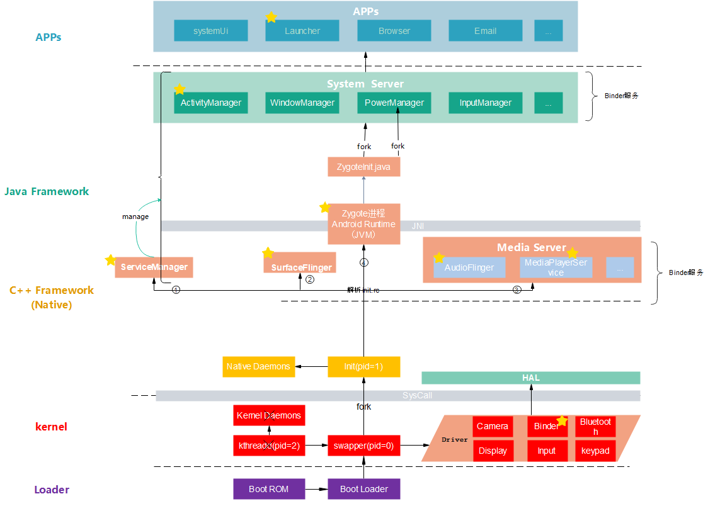

图：startApp.eddx


**总结：**

1. 化简：**init进程与zygote是一样的**，~~一个拉起cpp的服务进程，一个孵化Java的进程~~  --->  ~~zygote可删~~

2. 化简之合理性：整张图，目标就是启动native和java的服务

   ​                         自然：~~先启动native服务，之后java~~

   ​                         自然： ~~启动native众多服务之前，自然要先启动serverManager来管理  --->  ~~serverManager可删~~

   ​		                  自然：~~启动java 服务之前，java-native的自然有语言墙、搭建好梯子jni ---->  ~~Runtime 自然，可删~~         

​                                 自然：~~zygote存在合理性：只是为了 fork  java服务进程而存在的 ---> ~~zygote可以删掉~~

**总之：**

1、启动自下而上；调用，自上而下（~~最终内核驱动~~，自然）

2**、只需要记：整张图，目标就是启动native和java的服务**。**其他的都可以删了**（是合理性下的必然）。


 **盘古开天辟地、女娲造人、女人生孩子模型：**

**人（类图），事（流程图）：**

 盘古，pid=0 内核进程：

> 自然的：  ~~天地未开，宇宙混沌如鸡蛋（**即kernel**）一片~~----》 即当时只有kernel，自然
>
> <font color='red'>目标：开天辟地</font>
>
> 流程：
>
> ​                 （0）触发点：TODO
> ​                （1）  ~~盘古 处于混沌中，即 pid=0 内核进程在内核中，~~自然 
> ​                （2）  盘古开天辟地：   辟地-------- ~~pid=0 内核进程， 加载驱动，这是设备运行的基础（**即地**），~~自然
>
> ​												          开天-------~~pid=0 内核进程，孵化了第一个 用户空间 进程init(pid=1) 女娲~~ ，自然

宇宙混沌：kernel       

> 自然，~~里面有盘古~~
>
> 

天与地之间，人间：用户空间


造人的 女娲： 

> 自然：init进程 pid=1。。。。。。~~为啥叫init进程？ 第一个来到天地间的，来  创造人的（init的）~~，自然
>
> <font color='red'>目标：造人</font>
>
> 流程：
>
> ​					（0）触发点：~~女娲是被盘古叫来 创世的~~，自然。 女娲呆在 院子里（native）  创造人
>
> ​					（1）根据天书，<font color='red'>因为女娲目标是造人，那么先有管理者</font>。首先 创建了一个管理天地的 玉皇大帝： init进程 解析 init.rc，首先创建了1  ServiceManager
>
> ​					（2）根据天书，<font color='red'>因为目标是造人，</font>所以先创建了人的眼睛（显示服务进程surfaceFlinger）、创建人的耳朵（Media Server）
>
> ​                    （3）根据天书，<font color='red'>因为目标是造人</font>，最后在院子里（native）捏了一个 女人（zygote native进程）

init.rc:  天书：如何创世的天书

玉皇大帝： ServiceManager，

> 自然的： ~~管理天地一切(<font color='red'>java和native两个世界</font>的所有服务)，比如2  世间一切视觉的显示（显示服务进程），比如3 一切声音（媒体服务进程），眼（显示）、耳（声音）、~~鼻~~、~~舌~~、身（触觉：inputManagerService）、~~意~~；~~    自然


女人：zygote native进程

>  天然的： 女人，天生就是 生孩子的（孵化java进程的），自然
>
> <font color='red'>目标：</font>  生一个完整的家庭
>
> 流程：
>
> ​              （1） 触发点：女娲在院子里造出了女人
>
> ​               （2）女人想要从院内跑到院外，自然： 院内的女人 要搬梯子 ：~~zygote native进程   安卓的Runtime（包括jvm、注册jni）~~
>
> ​               （3）女人通过梯子  翻墙。自然：zygote native进程 通过 反射 调用了 zygoteInit.java的main函数
>
> ​               （4）翻墙到了院外，便是院外的女人： zygote运行在java环境中了
>
> ​                （5）院外有大量的自然资源，自然。女人<font color='red'> 先弄了一些  花草树叶 给自己穿衣</font>：加载类、加载资源color、库so到jvm
>
> ​                （6）弄好了自己，拿出来自己一个肋骨，变成了自己的丈夫：  SystemSever。。。**注意：只有生 丈夫，是女人自己主动触发的；而其他孩子，都是别人让的**
>
> ​                 （7）有了丈夫，怎么与丈夫之间联系呢？ 女人买了个 对讲机 ：起了一个socket 服务，一直循环，等待丈夫的消息
> ​                    注意：不得不：女人只听丈夫的，自然： 女人只通过socket与丈夫交流
> ​                                 自然： 只有丈夫能让女人生孩子。~~孩子则不能直接让，需要告诉父亲，让妈妈生个弟弟，父亲再让女人生。~~
>
> ​                

丈夫： SystemSever

> ​              自然，他的作用是，给儿子们(APP)，提供服务： SystemSever给APP 提供核心服务    
>
> 目标：丈夫有了，可是还没有孩子，<font color='red'>生一个家庭对外的 接口人</font>
>
> 流程：
>
> （1）触发点：女人 “生”了丈夫
>
> （2）丈夫告诉女人，要生一个 家庭对外的 接口人，看客户有啥需求： 即AMS 让  zygote 创建 launcher进程      


家庭对外的 接口人  ：launcher进程

​             根据 客户需要什么样的孩子，就让女人去生


院子里：native

院子外：java

墙：cpp与java的语言隔离

墙上的梯子： 安卓的Runtime、jni、jvm


一句话总结， 盘古开天辟地、女娲造人、女人生孩子模型：

> <font color='red'>记忆三个目标，忘记其他所有。</font>


补充：

> 2、3、4，为啥是这个顺序？：自然女娲先 捏眼耳鼻舌身意，最后才捏了一个完整的人（此时Zygote就是可以调用surfaceFlinger等的）


TODO:  上面模型的 文字描述，也是写文章的思路（<font color='red'>即文字版的 类图和时序图</font>）。待详细完善


TODO:
上面是通过联想模型记忆，如果  通过 不得不 来记忆呢？


## 各个层的简介

### Loader层：

- Boot ROM:  当手机处于关机状态时，长按Power键开机，引导芯片开始从固化在`ROM`里的预设代码开始执行，然后加载引导程序到`RAM`；
- Boot Loader：这是启动Android系统之前的引导程序，主要是检查RAM，初始化硬件参数等功能。


### Linux内核层

Android平台的基础是Linux内核，比如ART虚拟机最终调用底层Linux内核来执行功能，**自然**

- 启动Kernel的swapper进程(pid=0)：该进程又称为idle进程, 系统初始化过程Kernel由无到有开创的第一个进程, 用于初始化进程管理、内存管理，~~**加载 驱动**（Display、Camera、Binder）等相关工作~~，**自然**；
- 启动kthreadd进程（pid=2）：是Linux系统的内核进程，会创建内核工作线程kworkder，软中断线程ksoftirqd，thermal等内核守护进程。`kthreadd进程是所有内核进程的鼻祖`。----》<font color='red'>TODO:  不懂</font>


### 硬件抽象层 (HAL)

硬件抽象层 (HAL) <font color='red'>提供标准接口</font>，HAL包含多个库模块，其中每个模块都为特定类型的硬件组件实现一组接口，比如WIFI/蓝牙模块，当框架API请求访问设备硬件时，Android系统将为该硬件加载相应的库模块。


### Android Runtime & 系统库

每个应用都在其自己的进程中运行，都有自己的虚拟机实例。ART通过执行DEX文件可在设备运行多个虚拟机，DEX文件是一种专为Android设计的字节码格式文件，经过优化，使用内存很少。ART主要功能包括：预先(AOT)和即时(JIT)编译，优化的垃圾回收(GC)，以及调试相关的支持。

这里的Native系统库主要包括init孵化来的用户空间的守护进程、HAL层以及开机动画等。启动init进程(pid=1),是Linux系统的用户进程，<font color='green'>**记忆：**</font>`init进程是所有用户进程的鼻祖`。

- init进程会孵化出ueventd、logd、healthd、installd、adbd、lmkd等用户守护进程；
- init进程还启动`servicemanager`(binder服务管家)、`bootanim`(开机动画)等重要服务
- init进程孵化出Zygote进程，Zygote进程是Android系统的第一个Java进程(即虚拟机进程)，`Zygote是所有Java进程的父进程`，Zygote进程本身是由init进程孵化而来的。


###  Framework层

- Zygote进程，是由init进程通过解析init.rc文件后fork生成的，Zygote进程主要包含：
  - 加载ZygoteInit类，注册Zygote Socket服务端套接字
  - 加载虚拟机
  - 提前加载类preloadClasses
  - 提前加载资源preloadResouces
- System Server进程，是由Zygote进程fork而来，`System Server是Zygote孵化的第一个进程`，System Server负责启动和管理整个Java framework，包含ActivityManager，WindowManager，PackageManager，PowerManager等服务。
- Media Server进程，是由init进程fork而来，负责启动和管理整个C++ framework，包含AudioFlinger，Camera Service等服务。


### App层

- Zygote进程孵化出的第一个App进程是Launcher，这是用户看到的桌面App；
- Zygote进程还会创建Browser，Phone，Email等App进程，每个App至少运行在一个进程上。
- 所有的App进程都是由Zygote进程fork生成的。


### 墙 Syscall 

- Native与Kernel之间有一层系统调用(SysCall)层，见[Linux系统调用(Syscall)原理](http://gityuan.com/2016/05/21/syscall/);


​	Q：**为什么要有Syscall墙？**（等价问题：为什么要有内核空间和用户空间？）

​    A：<font color='red'>它确实就是一道墙</font>，目的也是墙的作用：

​              -<font color='red'>保护硬件资源</font>不会被随便访问，从而保证内核稳定性 （等价的表述：~~让用户态程序能**受限**访问硬件设备，比如申请系统资源，操作设备读写，创建新进程等。用户空间发生请求，内核空间负责执行，这些接口便是用户空间和内核空间共同识别的桥梁，这里提到两个字“受限”，是由于为了保证内核稳定性，而不能让用户空间程序随意更改系统，必须是内核对外开放的且满足权限的程序才能调用相应接口-----http://gityuan.com/2016/05/21/syscall/~~）


一些认知：

> 1、native代码也是用户态
>
> 2、APP、系统服务都是用户态
>
> 3、APP 打开文件 ----> JVM ----> native ---> Syscall  ---> 内核 ---> 驱动
>
> ​    **以上流程，不涉及系统服务**


关于线程：

> -<font color='red'>Syscall墙 隔离的是代码，不是线程。是同一个线程</font>。（即：~~线程的用户态和内核态指的是同一个线程上下文中不同的代码执行。用户态是应用程序的代码，而内核态是内核代码、设备驱动代码等运行在线程的上下文中。例如，中断和系统调用会将执行权交给内核态代码。~~ ）


具体的 Syscall 的实现，见《linux》


###  墙JNI

Java层与Native(C/C++)层之间的纽带JNI，见[Android JNI原理分析](http://gityuan.com/2016/05/28/android-jni/)。


### 进程关系

```cpp
// ps -ef 显示用户空间进程
UID            PID  PPID C STIME TTY          TIME CMD
root             1     0 0 13:30:36 ?     00:00:02 init // 一号进程，父进程PPID 0号
...............
root            16     2 0 13:30:36 ?     00:00:04 [rcuc/1]
...............  
root           623     1 0 13:30:39 ?     00:00:09 zygote64  //Zygote 进程
root           624     1 0 13:30:39 ?     00:00:07 zygote
...............
system        8951   623 0 14:10:30 ?     00:00:00 com.android.settings // 应用进程在 Zygote 进程 之后
u0_a81        9022   623 0 14:10:31 ?     00:00:00 com.android.dialer
u0_a37       12510   623 0 13:41:05 ?     00:00:01 android.process.acore
```

ps 显示进程号: 

1. init是1号进程（自然，~~其父进程PPID = 0号进程~~）
2. 自然，~~0号进程属于 内核态，所以ps没有显示~~
3. Linux整个进程树形成：TODO
4. Zygote 进程:   ~~所有java进程(系统+APP都)  孵化机~~。自然，皇妃


Init 的可执行文件: x 可执行 ---》 对于cpp/java编译出来的，且可执行------>  自然，一定含main函数


## 各个进程简介

## -------流程start，基于0层-------


## 内核加载

linux内核启动（再具体：），包括驱动加载，例如Binder驱动


## 0号进程fork出init进程

开天辟地，第一个进程   0号进程（swapper），内核进程

驱动加载的流程


孵化出init进程  ----》~~<font color='red'>用户空间的始祖进程</font>~~（非内核进程，自然）


## 安卓init进程 所做三件事

**init 进程启动，主要做了以下三件事：**

> 1’、目录相关:  创建（mkdir）和挂载（mount）启动所需的文件目录；
>
> 2、服务属性？？？？：初始化和启动属性服务（property service）
>
> 3、解析.rc文件，**并按条件启动**： 解析 init.rc 配置文件并启动 Zygote 进程
>
> 参考： https://blog.csdn.net/xingyu19911016/article/details/127451545

##  init进程之 ------解析init.rc文件

### init进程解析init.rc文件，拉起各种进程

三角度：

1、从进程角度：基于0层图，~~init进程由0号进程孵化而来~~ 自然

2、~~从文件角度：根目录下init文件执行~~

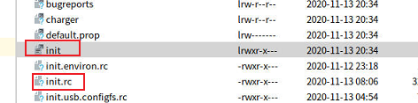


3、从源码角度：

```cpp
//system/core/init/init.cpp
static void LoadBootScripts() {
	..........
    if (bootscript.empty()) {
        parser.ParseConfig("/init.rc"); // 解析init.rc
        if (!parser.ParseConfig("/system/etc/init")) {
            late_import_paths.emplace_back("/system/etc/init");
        }
        if (!parser.ParseConfig("/product/etc/init")) {
            late_import_paths.emplace_back("/product/etc/init");
        }
        if (!parser.ParseConfig("/product_services/etc/init")) {
            late_import_paths.emplace_back("/product_services/etc/init");
        }
        if (!parser.ParseConfig("/odm/etc/init")) {
            late_import_paths.emplace_back("/odm/etc/init");
        }
        if (!parser.ParseConfig("/vendor/etc/init")) {
            late_import_paths.emplace_back("/vendor/etc/init");
        }
```

init.rc 命令文件 :

```cpp
import /init.environ.rc  // 给linux系统，设置了各种环境变量
import /init.usb.rc
import /init.${ro.hardware}.rc
import /vendor/etc/init/hw/init.${ro.hardware}.rc
import /init.usb.configfs.rc
import /init.${ro.zygote}.rc  //import
    
start zygote  //【】启动zygote进程
start servicemanager  //【】启动servicemanager

```


```cpp
// init.zygote64_32.rc

// 【】定义了服务:zygote
service zygote /system/bin/app_process64 -Xzygote /system/bin --zygote --start-system-server --socket-name=zygote   
    //【1】 /system/bin/app_process64
    // 【2】 --zygote  
    // 【3】 --start-system-server  启动 SystemServer
                                
    class main
    priority -20
    user root  // /说明以用户root身份运行，自然
    group root readproc reserved_disk
    socket zygote stream 660 root system  //【】 //socket关键字表示这个zygote进程需要一个名称为"zygote"的socket资源，这样，系统启动后，我们就可以在/dev/socket目录下看到有一个名为zygote的文件。这里定义的socket的类型为unix domain socket，它是用来作本地进程间通信用的
    socket usap_pool_primary stream 660 root system
    onrestart write /sys/android_power/request_state wake
    onrestart write /sys/power/state on
    onrestart restart audioserver
    onrestart restart cameraserver
    onrestart restart media  // 当zygote重启时,则会重启media ---> 背后的机制是啥，如何保证的？
    onrestart restart netd
    onrestart restart wificond
    writepid /dev/cpuset/foreground/tasks

// 同理 servicemanager
// frameworks/native/cmds/servicemanager/servicemanager.rc
service servicemanager /system/bin/servicemanager
```

具体如何启动？ TODO:  即 命令如何执行，如何生成新进程？

由【1】可见，zygote进程 运行的可执行文件是  app_process64（**原来名字就叫 app process 见 attach**)）


【2】 对应代码：

```cpp
    if (zygote) {
        runtime.start("com.android.internal.os.ZygoteInit", args, zygote);
```


补充rc文件知识：TODO
  https://wenku.baidu.com/view/2955b4df740bf78a6529647d27284b73f24236c7.html?_wkts_=1670062987073&bdQuery=%E5%AE%89%E5%8D%93rc%E6%96%87%E4%BB%B6+%E6%A0%BC%E5%BC%8F     android代码.rc**文件结构解析**
https://www.jb51.net/article/208558.htm    Android ServiceManager的启动和工作原理


### 各个进程被拉起的时序

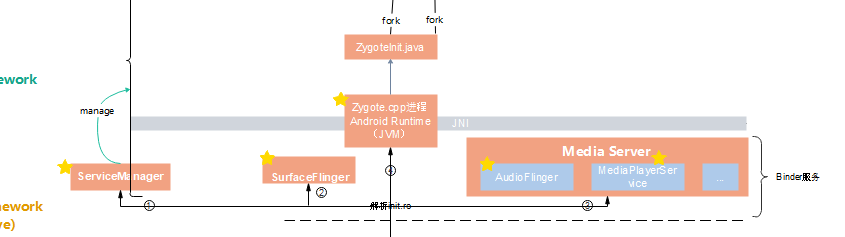


**记忆，**大致顺序如下：

- ServiceManager是在各种Binder服务之前起来。自然，非常合理，因为要管理
- Zygote是非常靠后的，自然，因为先native，最后进入java世界


验证：
可以通过进程pid得到验证

代码层面的验证：https://blog.csdn.net/u013463707/article/details/100926522?spm=1001.2101.3001.6650.1&utm_medium=distribute.pc_relevant.none-task-blog-2%7Edefault%7ECTRLIST%7ERate-1-100926522-blog-116968113.pc_relevant_3mothn_strategy_and_data_recovery&depth_1-utm_source=distribute.pc_relevant.none-task-blog-2%7Edefault%7ECTRLIST%7ERate-1-100926522-blog-116968113.pc_relevant_3mothn_strategy_and_data_recovery&utm_relevant_index=1

```cpp
1) early-init
 
    a) wait_for_coldboot_done
    b) property_init
    c) keychord_int
    d) console_init
    e) set_init_properties
2) init
3) late-init
4) early-fs
 
5) fs
 
6) post-fs
 
    f) property_service_init
    g) signal_init
    h) check_startup
7) early-boot
 
8) boot
 
9) service
```


TODO:
serviceManager启动流程、surfaceFling流程


## serviceManager启动流程


## zygote进程启动native main


三角度：

> 进程角度：zygote进程 ：~~<font color='red'>java进程的始祖进程</font>~~，自然
>
> 可执行文件角度：   /system/bin/app_process64 ，自然，因为又叫
>
> 所以，源码角度：frameworks/base/cmds/**app_process**/app_main.cpp


> 三w：
> when：
>
> what：
>
> how：


```cpp
//frameworks/base/cmds/app_process/app_main.cpp

//zygote进程入口
int main(int argc, char* const argv[]){
    //zygote 是由init进程fork而来，init.rc文件中为zygote进程设置的启动参数如下
    //argc = 4
    //argv = [-Xzygote, /system/bin, --zygote, --start-system-server]

	AppRuntime runtime(argv[0]); //【1】 创建AndroidRuntime对象，没有启动
    
    if (zygote) {
        runtime.start("com.android.internal.os.ZygoteInit", args, zygote);//【2】runtime启动 
    } else if (className) {
        runtime.start("com.android.internal.os.RuntimeInit", args, zygote);
    } else {
        fprintf(stderr, "Error: no class name or --zygote supplied.\n");
        app_usage();
        LOG_ALWAYS_FATAL("app_process: no class name or --zygote supplied.");
    }
}
```


【1】 创建AndroidRuntime对象，无他

【2】runtime启动，runtime包括哪些东西呢，见下 : 

（1）Dalvik虚拟机启动

（2）利用虚拟器，启动java的ZygoteInit 和 RuntimeInit


功能视角：TODO
Zygote进程包含两个主要模块：

    1. Socket服务端，该Socket服务端用于接收启动新的Dalvik进程命令。
    
    2. Framework共享类及共享资源，当Zygote进程启动后，会装载一些共享类和资源，共享类是在preload-classes文件中定义的，共享资源是在preload-resources文件中定义。因为其他Dalvik进程是由Zygote进程孵化出来的，因此只要Zygote装载好了这些类和资源后，新的Dalvik进程就不需要在装载这些类和资源了，它们共享Zygote进程的资源和类。

原文链接：https://blog.csdn.net/yangwen123/article/details/17258023


### runtime的启动runtime.start

三角度： 

> 进程角度：~~zygote native进程中~~。不得不的，因为都是为java程序做准备工作的
>
> 可执行文件角度：   /system/lib64/libandroid_runtime.so
>
> 所以，源码角度：frameworks/base/core/jni/AndroidRuntime.cpp

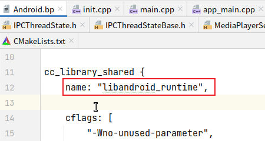

```cpp
//frameworks/base/core/jni/AndroidRuntime.cpp

void AndroidRuntime::start(const char* className, const Vector<String8>& options, bool zygote)
{
    JNIEnv* env;
    if (startVm(&mJavaVM, &env, zygote) != 0) {  //【1】启动Dalvik Virtual Machine，拿到返回值mJavaVM和env
        return;
    }

    if (startReg(env) < 0) { // 【2】Register jni functions.
		return;
    }


    stringClass = env->FindClass("java/lang/String");
    assert(stringClass != NULL);
    strArray = env->NewObjectArray(options.size() + 1, stringClass, NULL);
    assert(strArray != NULL);
    //创建字符串classNameStr
	//对于zygote进程：  classNameStr = new String("com.android.internal.os.ZygoteInit")
	//对于启动应用进程：classNameStr = new String("com.android.internal.os.RuntimeInit")
    classNameStr = env->NewStringUTF(className);
    env->SetObjectArrayElement(strArray, 0, classNameStr);

	............
    char* slashClassName = toSlashClassName(className != NULL ? className : "");
    jclass startClass = env->FindClass(slashClassName);
    if (startClass == NULL) {
		............
    } else {
		//找到ZygoteInit类的静态main方法的jMethodID
        jmethodID startMeth = env->GetStaticMethodID(startClass, "main",
            "([Ljava/lang/String;)V");
        } else {
            env->CallStaticVoidMethod(startClass, startMeth, strArray);//【3】通过虚拟机调用java的 ZygoteInit的main方法，zygote进程就进入了java世界
        }
    }
	//.......【4】........
}
```

【2】非常自然，只有在虚拟机启动完后，才能注册jni函数（native函数）

注意：【3】zygote主线程，贯通native与java世界。自然，在java侧没有结束（正常情况下，不会结束），不会走【4】


-**<font color='red'>记忆</font>：**AndroidRuntime::start()中完成：即**RunTime做了啥？**<a id='sirenwu'>四个任务</a>
①　~~startVm(&mJavaVM, &env) 启动虚拟机~~ 。自然，必须第一个，<font color='red'>java-native之间的墙</font>
②　onVmCreated(env)        虚拟机启动后的初始化
③　~~startReg(env)           注册JNI函数~~。 自然，<font color='red'>基于墙，架起梯子</font>
④　~~env->CallStaticVoidMethod(startClass, startMeth, strArray) 调用ZygoteInit类的main函数开创java世界~~。自然，<font color='red'>架起梯子，翻过native，进入java世界大门</font>


TODO： 

> 所以RunTime就是指的虚拟机这些嘛？


### 虚拟机的启动startVm(&mJavaVM, &env) 

[见四任务](#sirenwu)  ，第一个任务

```cpp
int AndroidRuntime::startVm(JavaVM** pJavaVM, JNIEnv** pEnv, bool zygote)
{
    JavaVMInitArgs initArgs;
	............各种参数的解析与初始化................

    /*
     * Initialize the VM.
     *
     * The JavaVM* is essentially per-process, and the JNIEnv* is per-thread.
     * If this call succeeds, the VM is ready, and we can start issuing
     * JNI calls.
     */
    if (JNI_CreateJavaVM(pJavaVM, pEnv, &initArgs) < 0) { //【1】 真正创建启动javaVM的地方
        ALOGE("JNI_CreateJavaVM failed\n");
        return -1;
    }

    return 0;
}

```

【1】拿到env后（自然，~~native可以反射调用java方法~~），标志着javaVM已经初始化完毕了

JNI_CreateJavaVM  是c的函数，具体做了啥？ TODO

### startReg(env) 注册JNI函数

[见四任务](#sirenwu)  ，第三个任务


向虚拟机注册 jni函数(后面让java侧调用)


三角度：

> 进程角度：~~zygote native进程~~ 。自然，因为要搭建 墙上的梯子
>
> 可执行文件角度：   /system/lib64/libandroid_runtime.so
>
> 所以，源码角度：frameworks/base/core/jni/AndroidRuntime.cpp


> 三w：
> when：在虚拟机起来之后。自然，墙都没有，怎么搭建墙上的梯子？
>
> what：
>
> how：不知道底层机制

```cpp
int AndroidRuntime::startReg(JNIEnv* env)
{
    /*
     * This hook causes all future threads created in this process to be
     * attached to the JavaVM.  (This needs to go away in favor of JNI
     * Attach calls.)
     */
    androidSetCreateThreadFunc((android_create_thread_fn) javaCreateThreadEtc);

    if (register_jni_procs(gRegJNI, NELEM(gRegJNI), env) < 0) {
        env->PopLocalFrame(NULL);
        return -1;
    }
    env->PopLocalFrame(NULL);
    return 0;
}

// gRegJNI封装了各种注册函数,近两百个成员函数
static const RegJNIRec gRegJNI[] = {
    REG_JNI(register_com_android_internal_os_RuntimeInit), // 展开见下
    REG_JNI(register_com_android_internal_os_ZygoteInit_nativeZygoteInit),
    REG_JNI(register_android_os_SystemClock),
    REG_JNI(register_android_util_EventLog),
    REG_JNI(register_android_util_Log),
    REG_JNI(register_android_util_MemoryIntArray),
    REG_JNI(register_android_util_PathParser),
    REG_JNI(register_android_util_StatsLog),
    REG_JNI(register_android_util_StatsLogInternal),
    REG_JNI(register_android_app_admin_SecurityLog),
    REG_JNI(register_android_content_AssetManager),
    REG_JNI(register_android_content_StringBlock),
    REG_JNI(register_android_content_XmlBlock),
    REG_JNI(register_android_content_res_ApkAssets),
    REG_JNI(register_android_text_AndroidCharacter),
    REG_JNI(register_android_text_Hyphenator),
    REG_JNI(register_android_view_InputDevice),
    REG_JNI(register_android_os_Binder), // 
    REG_JNI(register_android_os_Parcel), //
    .................

```


**本质上，Oracle提供的注册API是**：<font color='red'>记忆</font>： jniRegisterNativeMethods(env,  java的**类名**，**映射关系** 数组)

```cpp
int register_com_android_internal_os_RuntimeInit(JNIEnv* env)
{
    const JNINativeMethod methods[] = { //【1】 自然，映射关系为：java函数名string + java函数参数签名 ------》  native函数名
        { "nativeFinishInit", "()V",
            (void*) com_android_internal_os_RuntimeInit_nativeFinishInit },
        { "nativeSetExitWithoutCleanup", "(Z)V",
            (void*) com_android_internal_os_RuntimeInit_nativeSetExitWithoutCleanup },
    };
    return jniRegisterNativeMethods(env, "com/android/internal/os/RuntimeInit",
        methods, NELEM(methods));
}
```

那么，jniRegisterNativeMethods 机制原理是什么呢？TODO: 


## ZygoteInit.java  main 世界

[见四任务](#sirenwu)  ，第四个任务

三角度：

> 进程角度：~~zygote main进程~~ 。自然，已经翻过墙，进入java世界
>
> 可执行文件角度：   framework.jar(见/frameworks/base/Android.bp )
>
> 所以，源码角度：/frameworks/base/core/java/com/android/internal/os/ZygoteInit.java


> 三w：
> when：在虚拟机起来之后。自然，墙都没有，怎么搭建墙上的梯子？
>
> what：
>
> how：jni调的


```cpp
    public static void main(String argv[]) { // 【】参数argv，从信息流角度: rc文件里的参数 ，传给 native（TODO:native用来标志启动java zygote,d），之后native又传给java侧（用来标志启动system-server）

        try {
            boolean startSystemServer = false;
            String zygoteSocketName = "zygote";
            String abiList = null;
            boolean enableLazyPreload = false;
            for (int i = 1; i < argv.length; i++) {
                if ("start-system-server".equals(argv[i])) {
                    startSystemServer = true;//标志后面启动system-server
                } else if ("--enable-lazy-preload".equals(argv[i])) {
                    enableLazyPreload = true;
                } else if (argv[i].startsWith(ABI_LIST_ARG)) {
                    abiList = argv[i].substring(ABI_LIST_ARG.length());
                } else if (argv[i].startsWith(SOCKET_NAME_ARG)) {
                    zygoteSocketName = argv[i].substring(SOCKET_NAME_ARG.length());
                } else {
                    ..........
                }
            }

            final boolean isPrimaryZygote = zygoteSocketName.equals(Zygote.PRIMARY_SOCKET_NAME);

            if (!enableLazyPreload) {
                preload(bootTimingsTraceLog);//【1】 加载各种资源
            } else {
                Zygote.resetNicePriority();
            }

            // Do an initial gc to clean up after startup
            gcAndFinalize();

            Zygote.initNativeState(isPrimaryZygote);

            zygoteServer = new ZygoteServer(isPrimaryZygote);

            if (startSystemServer) {
                Runnable r = forkSystemServer(abiList, zygoteSocketName, zygoteServer);// 【2】fork SystemServer进程，见《forkSystemServer》
                if (r != null) {
                    r.run();
                    return;
                }
            }

            // The select loop returns early in the child process after a fork and
            // loops forever in the zygote.
            caller = zygoteServer.runSelectLoop(abiList);
        } catch (Throwable ex) {
            ............
        } 

        // We're in the child process and have exited the select loop. Proceed to execute the
        // command.
        if (caller != null) {
            caller.run();
        }
    }
```


### 加载资源preload()

```cpp
static void preload(TimingsTraceLog bootTimingsTraceLog) {
        preloadClasses(); //【1】预加载类资源到jvm里，比如：view、actvity、Service等7600个类  存于文件"/system/etc/preloaded-classes"
        preloadResources();  //【2】预加载资源，包含drawable和color资源
        nativePreloadAppProcessHALs();
        maybePreloadGraphicsDriver();

        //【3】预加载"android","compiler_rt","jnigraphics"这3个共享库（通过System.loadLibrary()方法）
        preloadSharedLibraries();
        preloadTextResources();
        WebViewFactory.prepareWebViewInZygote();
    }
```

【1】 类加载，最终采用反射机制 java的Class.forName()方法来加载。自然，必然是反射，因为给定的是字符串

类预加载的原因：所有APP进程共用一份**类资源**（**注意，不是对象，还没实例化！**）

**<font color='red'>理解，本质</font>：**类、普通的图片jpg资源、xml 本质并无差别**  --->  都是没有实例化的资源

**去重思想**: 提取重复的。放到 Zygote 进程里 ------》 注意：此时的jvm属于 Zygote进程，所以资源也在 Zygote进程。


zygote进程内加载了preload()方法中的所有资源，当需要fork新进程时，采用copy on write技术，如下：

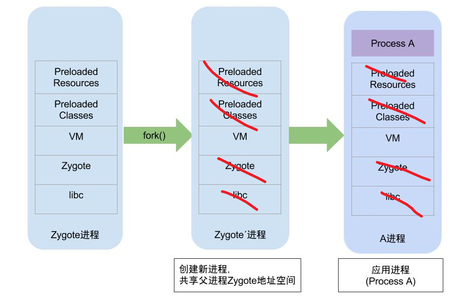

参考： https://github.com/huanzhiyazi/articles/issues/25

​            https://blog.51cto.com/u_15375308/5216330    深入理解 Android 内核设计思想（二）内存管理

`copy on write` 原则：所有的子进程与父进程默认都共享所有资源，父进程 fork 一个子进程之后，子进程<font color='red'>只需要</font>生成共享资源的<font color='red'>引用</font>即可。只有当子进程需要对某个资源进行**写入时**，**才需要拷贝一份原资源**，从而保证资源的独立性。

---->  `自然，好处是`：
安全性上：保证共享资源的访问安全（每个java进程都加载资源也可以实现）
1、时间上：只有一个进程加载资源（无需每个java进程都去加载系统资源，加载流程很消耗时间）
2、空间上：只有一个进程内存持有资源。


推论：TODO: 验证

1、VM实例每个进程参数不一样，所以涉及修改，会copy一个VM实例

2、其他资源，尤其类资源，很可能就一份。


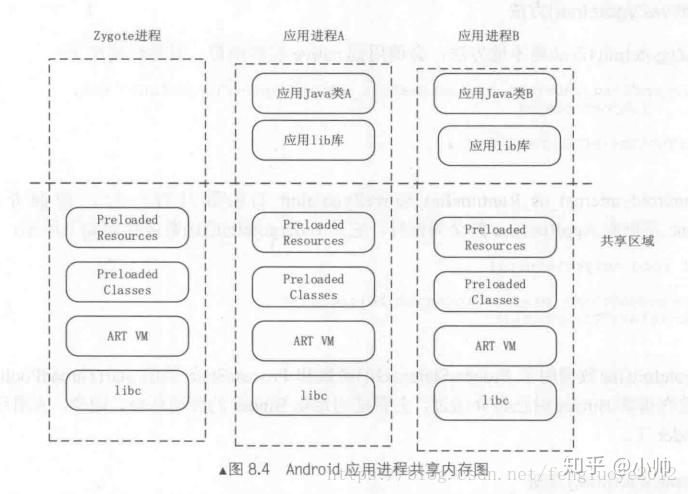

来自：https://blog.csdn.net/m0_37999066/article/details/127271879


TODO:  Class.forName() 加载类资源到jvm 原理


从资源加载的角度，`理解设计zygote的必要性(合理性)`：主要需要一个<font color='red'>共享资源的祖先</font>  （去重思想的推论，时间上去重、空间上去重）


### forkSystemServer

非常自然，加载完共用资源，然后启动 java进程。


```java
// ZygoteInit.java
private static boolean startSystemServer(String abiList, String socketName)
    {
    ...
    pid = Zygote.forkSystemServer(     //【1】 透传
            parsedArgs.uid, parsedArgs.gid,
            parsedArgs.gids,
            parsedArgs.debugFlags,
            null,
            parsedArgs.permittedCapabilities,
            parsedArgs.effectiveCapabilities);
    ...
    if (pid == 0) {
        if (hasSecondZygote(abiList)) {
            waitForSecondaryZygote(socketName);
        }

        handleSystemServerProcess(parsedArgs); //进入system_server进程
    }
    return true;
}
```


【1】 处，

```java
//Zygote.java
int pid = nativeForkSystemServer(  // 走native
    uid, gid, gids, runtimeFlags, rlimits,
    permittedCapabilities, effectiveCapabilities);
```

所以，更本质的，还是native去fork的

TODO:  


native侧：

```cpp
pid = fork()  //最终系统调用
```


### ZygoteInit.runSelectLoop

自然，创建完systemServer之后，Zygote线程进入Looper。随时待命，当接收到请求创建新进程请求时**立即唤醒**并执行相应工作。

TODO:  Zygote采用高效的I/O多路复用机制，保证在没有客户端连接请求或数据处理时休眠，否则响应客户端的请求。

```java
private static void runSelectLoop(String abiList) throws MethodAndArgsCaller {
    ArrayList<FileDescriptor> fds = new ArrayList<FileDescriptor>();
    ArrayList<ZygoteConnection> peers = new ArrayList<ZygoteConnection>();

    //sServerSocket是socket通信中的服务端，即zygote进程
    fds.add(sServerSocket.getFileDescriptor());
    peers.add(null);

    while (true) {
        StructPollfd[] pollFds = new StructPollfd[fds.size()];
        for (int i = 0; i < pollFds.length; ++i) {
            pollFds[i] = new StructPollfd();
            pollFds[i].fd = fds.get(i);
            pollFds[i].events = (short) POLLIN;
        }
        ...
        Os.poll(pollFds, -1); // 【1】这个机制类似于 Looper.loop()中的epoll

        for (int i = pollFds.length - 1; i >= 0; --i) {
            //采用I/O多路复用机制，当客户端发出 连接请求或者数据处理请求时，则执行continue
            if ((pollFds[i].revents & POLLIN) == 0) {
                continue;
            }
            if (i == 0) {
                //创建客户端连接
                ZygoteConnection newPeer = acceptCommandPeer(abiList);
                peers.add(newPeer);
                fds.add(newPeer.getFileDesciptor());
            } else {
                //处理客户端数据事务
                boolean done = peers.get(i).runOnce();
                if (done) {
                    peers.remove(i);
                    fds.remove(i);
                }
            }
        }
    }
}

参考:http://gityuan.com/2016/02/01/android-booting/
```

【1】 TODO:   https://www.cnblogs.com/laosiji888/articles/5524067.html

http://gityuan.com/2019/01/06/linux-epoll/   源码解读epoll内核机制

http://gityuan.com/2019/01/05/linux-poll-select/  源码解读poll/select内核机制


本质：socket服务端。  TODO: 总结安卓通信socket


## SystemServer进程启动


参考： http://gityuan.com/2016/02/14/android-system-server/
            https://www.jianshu.com/p/9912a556734f     Android开机流程启动的系统服务以及功能介绍列表

问题：SystemServer如何被创建，如何执行的main？主要做了啥？


main流程，总共启动90多个系统服务：自然，太多了，需要一个管理类mSystemServiceManager

```java
SystemServer.java 房间中

// Start services.
    try {
        //cg: https://www.jianshu.com/p/9912a556734f
        startBootstrapServices();  // cg: Bootstrap 启动引导服务: AMS, PMS, powerMS, Lights,
        startCoreServices();       // cg: CoreService: BatteryService, webview
        startOtherServices();      // cg: Other: InputMS, CameraService,

```


```java
// 具体启动核心代码
        ActivityTaskManagerService atm = mSystemServiceManager.startService( // cg: ATMS
                ActivityTaskManagerService.Lifecycle.class).getService();
        mActivityManagerService = ActivityManagerService.Lifecycle.startService( // cg: AMS（注意AMS这里没有注册，在setSystemProcess中注册的）
                mSystemServiceManager, atm);

    mPowerManagerService = mSystemServiceManager.startService(PowerManagerService.class); // cg：PowerManagerService


    mSystemServiceManager.startService("com.google.android.clockwork.sidekick.SidekickService"); //cg：直接通过 类名 反射
```


AMS和ATMS通过内部类 Lifecycle（SystemService） 传参给 SystemServiceManager

PMS 传的是本身 PowerManagerService（SystemService）

---->  本质上，
1、两者是一样的，<font color='red'>因为 Lifecycle是内部类，即等同于外部类。</font>
        Lifecycle抽出了 生命周期相关的方法（onStart），感觉更集中

2、既然一样，为啥要有不同写法？
 -<font color='red'>不得不：</font>  AMS 涉及到 与APP通信，所以要继承 stub。也要继承 SystemService 。 
---->     涉及到多继承，所以，只能取一个。
EX1：AMS  extends stub， 内部类Lifecycle extends SystemService, 
EX2，也可以反过来：PowerManagerService extends SystemService，其内部类继承 stub


Q:  设计上为什么要有SystemService？  

A:  目的：让所有被管理者继承，传给manager，统一管理
  --------》 或者说：SystemService 是被管理接口 ，是所有被管理者 被管理部分的抽象


### 向下分析核心代码mSystemServiceManager.startService

核心代码：

```java
// SystemServiceManager.java

  Constructor<T> constructor = serviceClass.getConstructor(Context.class);   //cg: reflect, serviceClass 用反射来统一new  AMS、PMS等
                service = constructor.newInstance(mContext);

// Register it. ---->自然，管理，自然要向SystemServiceManager注册，java侧？？？？
mServices.add(service);
```


为啥一定要用反射呢？   TODO

可能原因：

> 1、有90个服务，依赖太多，<font color='red'>规避依赖那么多服务类，所以统一用反射</font>？
>
> 2、<font color='red'>代码结构上更简洁 </font>  --------------   统一，类似于各种控件的反射创建：  否则得各种new A1()； new A2()


疑问：

> AMS、ATMS启动了，但是启动线程是在哪里可以看出来的？-----------> 见《binder线程池》


### publishBinderService 向Native注册Ibinder（<font color='red'>核心</font>）

注册：

```java
// ActivityTaskManagerService.java
publishBinderService(Context.ACTIVITY_TASK_SERVICE, mService); //cg: used by APP process,saved to serviceManger
LocalServices.addService(ActivityTaskManagerInternal.class, mInternal);//cg: used by systemServer
```


-<font color='red'>ATMS 向native注册, 即是向 APP 公布出去publishBinderService</font>


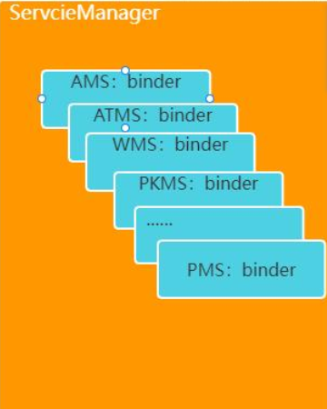

ServiceManager的本质：
维护了一个列表，存储  “服务名”  与  binder驱动


疑问：
非Binder形式的service不用注册了？


疑问：
与       registerService(Context.ACTIVITY_TASK_SERVICE, ActivityTaskManager.class,  差别？
---->   后者是应用侧的，前者系统侧


### AMS new后，由AMS注册一堆进程相关服务

```java
// SystemServer.java
mActivityManagerService.setSystemProcess(); //cg: register service
```


AMS<font color='red'>管理各个应用</font>进程，所以由其注册的相关服务有(<font color='red'>自然，与进程相关的服务</font>)：

```java
    public void setSystemProcess() {
        try {
            ServiceManager.addService(Context.ACTIVITY_SERVICE, this, /* allowIsolated= */ true,
                    DUMP_FLAG_PRIORITY_CRITICAL | DUMP_FLAG_PRIORITY_NORMAL | DUMP_FLAG_PROTO);// cg: register AMS(this)， AMS 本身
            ServiceManager.addService(ProcessStats.SERVICE_NAME, mProcessStats); // cg: ProcessStats of APP, APP进程信息
            ServiceManager.addService("meminfo", new MemBinder(this), /* allowIsolated= */ false,
                    DUMP_FLAG_PRIORITY_HIGH);  // cg: register meminfo(of App) service
            ServiceManager.addService("gfxinfo", new GraphicsBinder(this));
            ServiceManager.addService("dbinfo", new DbBinder(this));
            if (MONITOR_CPU_USAGE) {
                ServiceManager.addService("cpuinfo", new CpuBinder(this),
                        /* allowIsolated= */ false, DUMP_FLAG_PRIORITY_CRITICAL);
            }
            ServiceManager.addService("permission", new PermissionController(this)); // cg: register permission权限
            ServiceManager.addService("processinfo", new ProcessInfoService(this)); // cg: register ProcessInfo(of APP) service
			........

            synchronized (this) {
                ProcessRecord app = mProcessList.newProcessRecordLocked(info, info.processName,
                        false,
                        0,
                        new HostingRecord("system"));
				........
                mProcessList.updateLruProcessLocked(app, false, null);  // cg:  add ProcessRecord
                updateOomAdjLocked(OomAdjuster.OOM_ADJ_REASON_NONE);
            }
```


## -------流程end，基于0层------


## 基于0层，补充次要linux进程：

参考：https://blog.csdn.net/yjzl1911/article/details/5613569


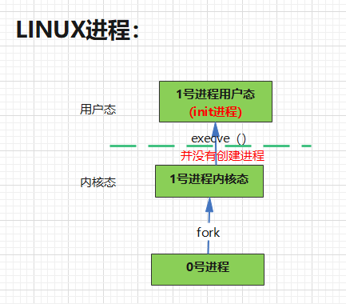


## 几大重要进程之间的通信


------->  Todo：重新画

servicemanager 管理Binder的


## 参考链接：  

http://gityuan.com/android/        

https://blog.csdn.net/yangwen123/article/details/17258023  Zygote进程启动过程源代码分析

http://gityuan.com/2016/02/13/android-zygote/


## 疑问

https://blog.csdn.net/yangwen123/article/details/17258023

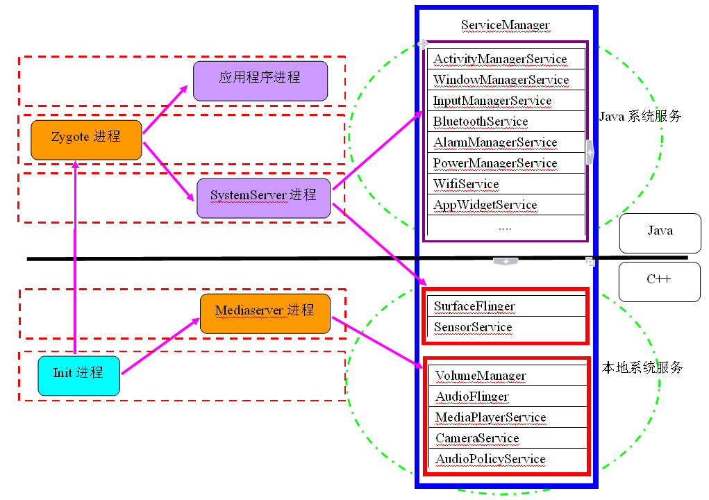

上面serviceManager画法是对的。管理java和native ----> 本质都是native做的


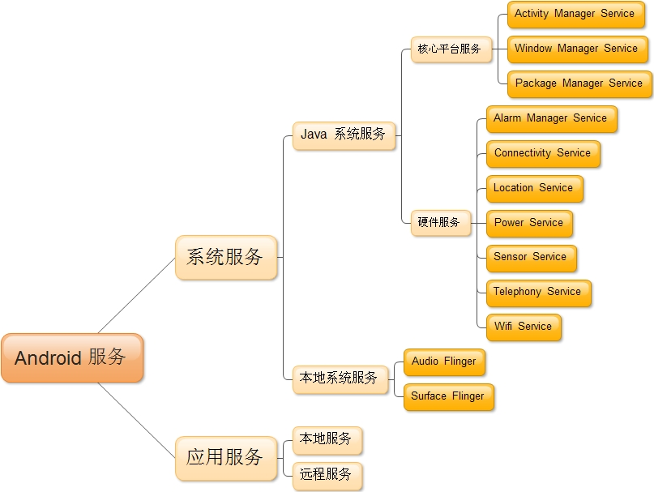


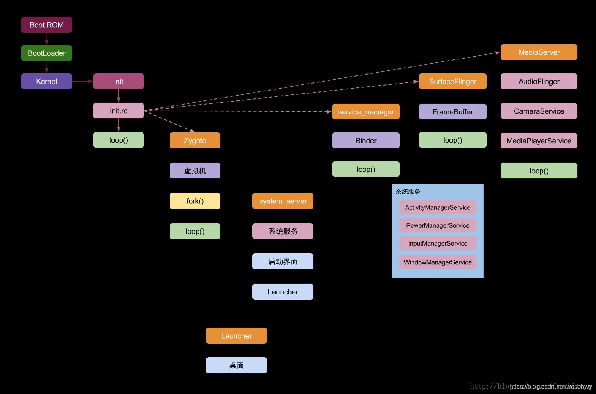

这个图画得挺好，为什么？  https://blog.csdn.net/wcsbhwy/article/details/105965932   Zygote如何fork一个进程


疑问：所有独立进程，都是靠 死循环loop() + epoll唤醒而存活。见上面图

-<font color='red'>            那么线程呢？比如WMS与AMS？</font>


## 面试题:

### 孵化应用进程这种事为什么不交给SystemServer来做，而专门设计一个Zygote？

等价问题：

> **zygote设计的必要性**在哪里？ 


------>   问题的本质：Zygote的存在合理性(0层图需要考虑的)

效率角度：
应用在启动的时候需要做很多准备工作，**包括启动虚拟机，加载各类系统资源**等等，这些都是非常耗时的，如果能在zygote里就给这些必要的初始化工作做好，子进程在fork的时候就能**直接共享**，那么这样的话效率就会非常高。这个就是zygote存在的价值，这一点呢SystemServer是替代不了的，主要是因为SystemServer里跑了**一堆系统服务，这些是不能继承到应用进程的**。

内存角度：
-<font color='red'>应用进程在启动的时候，内存空间除了必要的资源外，最好是干干净净的</font>，不要继承一堆乱七八糟的东西。所以呢，不如给SystemServer和应用进程里都要用到的资源抽出来单独放在一个进程里，也就是这的zygote进程，然后zygote进程再分别孵化出SystemServer进程和应用进程。孵化出来之后，SystemServer进程和应用进程就可以各干各的事了。
原文链接：https://blog.csdn.net/m0_37999066/article/details/127271879

设计模式角度：

> 抽象类：zygote作为应用进程的<font color='red'>抽象祖先</font>（共享很多共同资源，不用重新加载比如类）


TODO：

能不能先起几个空进程？

---------------> 性能优化，真的就这么做了

### 既然Zygote必要，linux系统为啥就没有 Zygote？

**Zygote的本质功能就是linux的fork**

linux系统为啥就没有 Zygote？------------->  因为linux，**不需要  启动虚拟机，加载各类系统资源**


### Zygote的IPC通信机制为什么不采用binder？如果采用binder的话会有什么问题么？

原文链接：https://blog.csdn.net/m0_37999066/article/details/127271879

高频考点


## 参考

https://blog.csdn.net/hzwailll/article/details/85339714      ActivityThread的理解和APP的启动过程


# linux启动过程-----详解

参考： https://blog.csdn.net/weixin_43976122/article/details/128961694


 

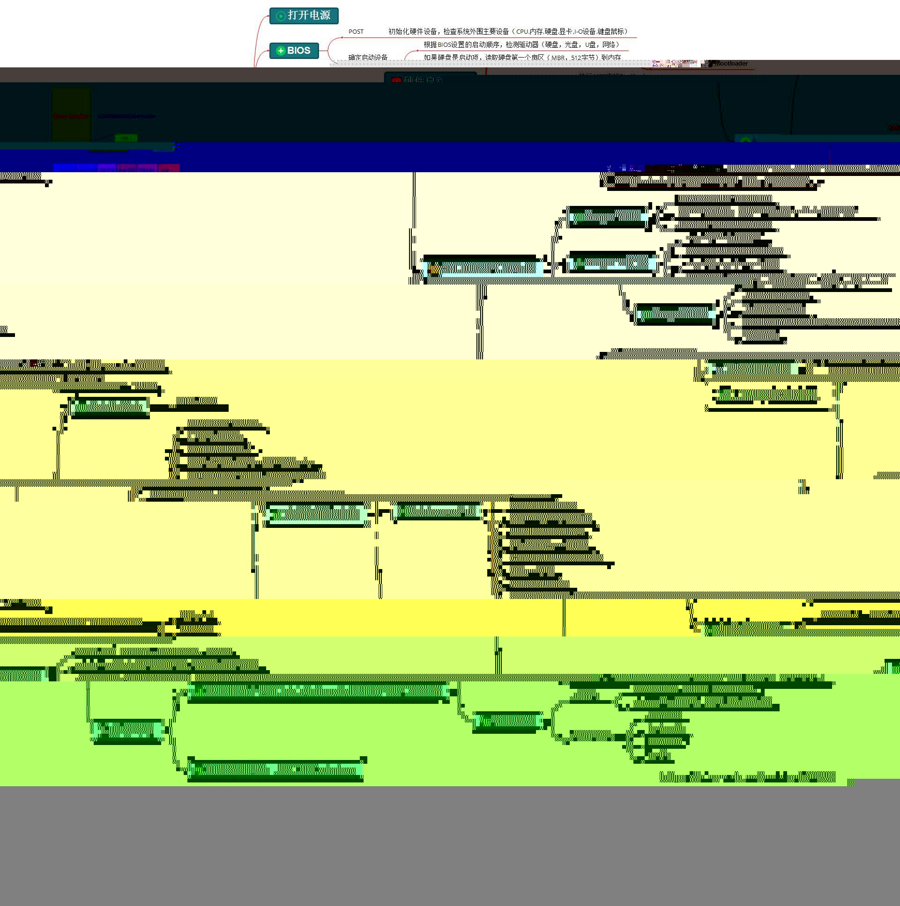

参考：

https://blog.csdn.net/whatday/article/details/100759678


## TODO：如何手动把init进程拉起来？（源码角度、系统运行时文件角度）

> --------->  1、研究deploy  2、问张、jueyu
>
> https://serverfault.com/questions/462821/how-do-i-run-a-debian-init-d-script-manually-not-at-boot       [How do I run a Debian init.d script manually, not at boot?](https://serverfault.com/questions/462821/how-do-i-run-a-debian-init-d-script-manually-not-at-boot)


https://blog.csdn.net/mostone/article/details/99659822

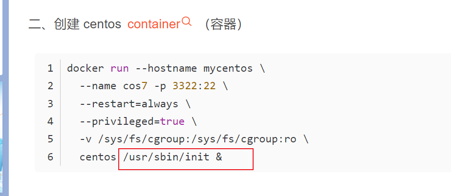


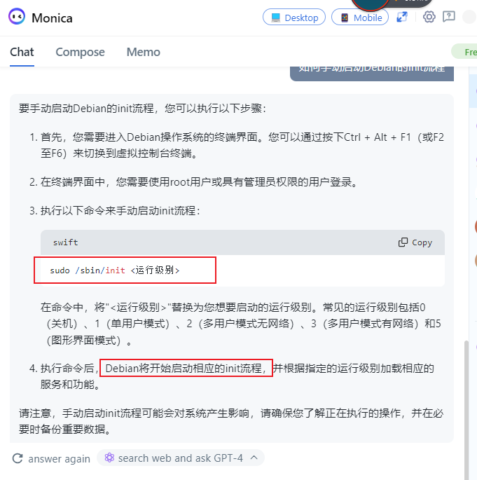

