# 目录


# APP启动流程（纵向主线）

桌面 --->  APP

## 0层模型

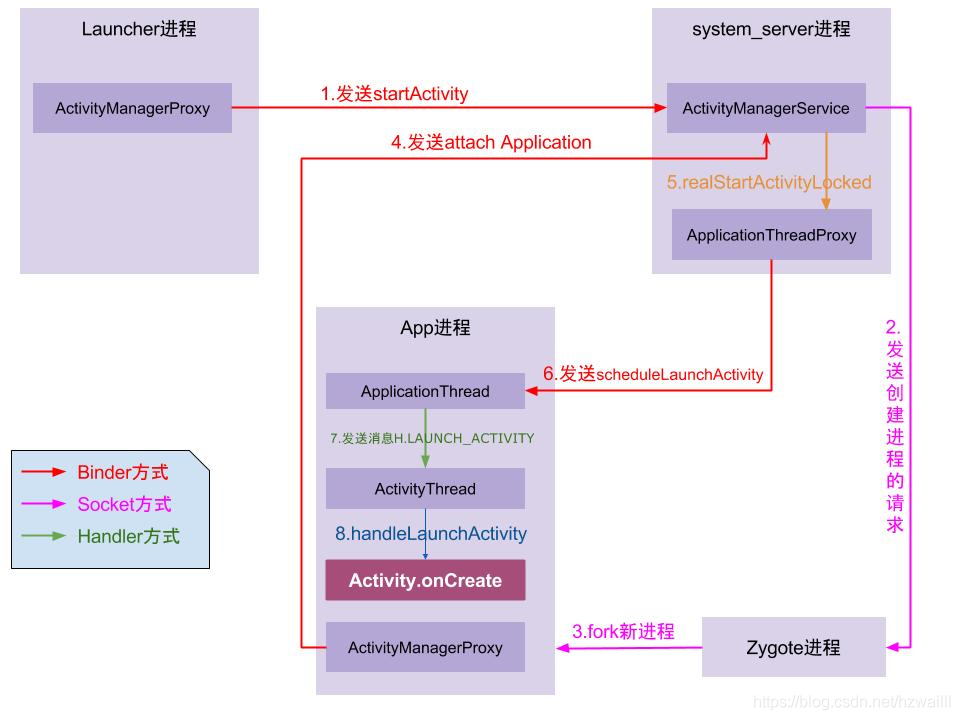

（图： https://blog.csdn.net/hzwailll/article/details/85339714）


图：startApp.eddx


APP启动流程，总之：
1、皇子继位模型
2、整个模型的目的：fork 新进程。搭建两条桥梁（6和8）


-<font color='red'>**生活化模型：皇子继位模型**</font>  记忆：

皇帝想要皇子继承皇位   ----->  通知太监总管   ----->  让皇妃  ---->  生皇子


人物：

> 皇帝，控制生死：Launcher进程，其他APP进程的生死  **控制者**
> 太监总管，**传递**皇帝旨意、**管理**宫里所有人:  
> 皇妃，**生子**:  fork出新的app进程
> 皇子，成长成为一个人:  APP创建页面等等
> 龙袍：activity
> 继位：龙袍处于民众面前（activity前台位置）
>
> 民众：手机使用者
>
> 联系方式ApplicationThreadProxy，本质是Binder


**显然，基于生活模型，不得不的一些东西:**

~~1、皇帝、总管、皇妃在建国时(**系统启动时**) 才有的~~  ----->  自然

~~2、皇帝和皇子都可以传唤 太监总管:   所以都持有 总管的引用 ActivityManagerProxy~~  ----->  自然

​     ~~反过来，总管也能联系 皇帝 和皇子：通过 联系方式Binder~~    ----->  自然

~~3、皇子生下来之后，继承皇位事宜：启动自己的驴拉磨Looper、长了自己的脸Acitivity~~   ----->  自然

4、~~总管  管理所有皇家联系方式Binder，从而总管 可以找到 任何皇室成员~~   ----->  自然

5、皇帝和皇子，本质是一个东西：APP进程。所以，和AMS 的两条桥梁是一样的  --->  自然

6、为啥皇妃与外界的联系都是socket？

7、化简桥梁1和2：自然，~~皇帝和皇子，与AMS联系是一样的：1与6无差异，2与8无差异~~


**整个流程：**

皇帝 想要  皇子APP1继承皇位，

1. ~~皇帝通知 太监总管来安排（AMS）~~。自然，~~startActivity~~
2. ~~太监总管通知老皇帝准备退位（launcher的黄袍Acitivity到paused状态）~~  ----->   自然 
   （2） ~~太监总管 找对应的皇子 ，如果找到，自然是新皇子继承皇位（皇子activity到前台），直接scheduleLaunchActivity，没有socket和fork。<font color='red'>所有流程结束</font>~~ ----->  自然

​                                                      ~~如果没找到，太监总管安排皇妃Zygote来生皇子~~     ----->  自然

（3）皇妃生皇子，皇子诞生（Zygote  fork出新进程APP1进程）

（4）皇子生下来后，第一件事情是：开始生长：生长了自己的骨架(驴拉磨Looper)，**但是此时龙袍肯定还没做，**  没那么着急

（5）皇子生下来后，第二件事情是：向总管注册联系方式ApplicationThread，从而总管可以联系他

（6）总管知道皇子已经诞生。所以，总管通过 联系方式Binder 通知皇子   计划安排（ shedule）新皇子继位 shedulelaunchActivity

（7）对于皇子这边，就处理继承皇位的一些事宜handleLaunchActivity：制作自己的龙袍Acitivity.onCreate(在这个流程里，可以自定义各种各样龙袍，豪装还是简装都可以)  

（8）龙袍Acitivity，到了前台，被民众看见，就继承皇位完毕。整个流程结束    ----->  自然  

（9）新皇帝完成了登基的所有事情，就通知总管，让老皇帝不要再哔哔了Stop    ----->  自然  


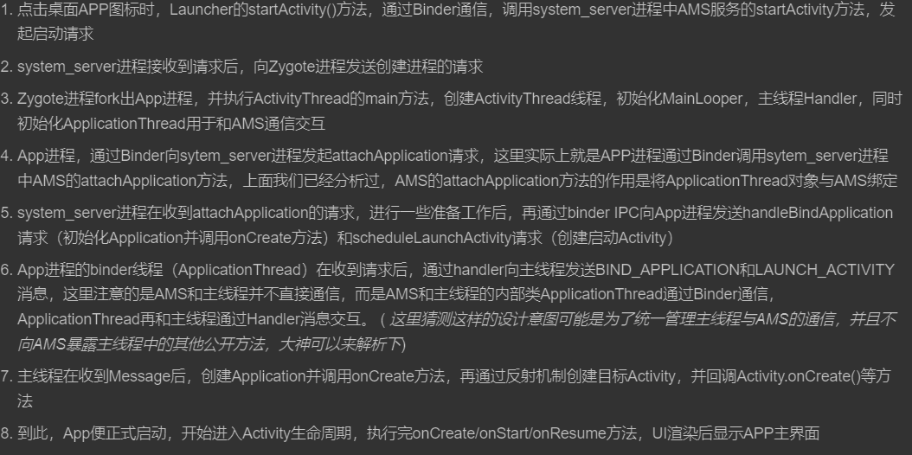


**疑问点：**

为啥 总管 通知皇妃  通过socket ？？？？产子也是


Activity启动：
同进程启动(ActivityA 启动 ActivityB)
进程间启动(launcher启动 ActivityB)：涉及到新进程的启动fork


## ----具体代码流程分析，所有围绕最终目标叙述-----

-<font color='red'>最终目标是 锚，挂满了所有逻辑</font>


最终目标：真正的启动ActivityB


## ~~创建ActivityRecord/解析启动参数阶段~~

**围绕最终目标(真正的启动ActivityB),** 
所以为其创建 目标 ActivityRecord，并找到对应的 ActivityStack（<font color='cornflowerblue'>自然，交给其去处理</font>）


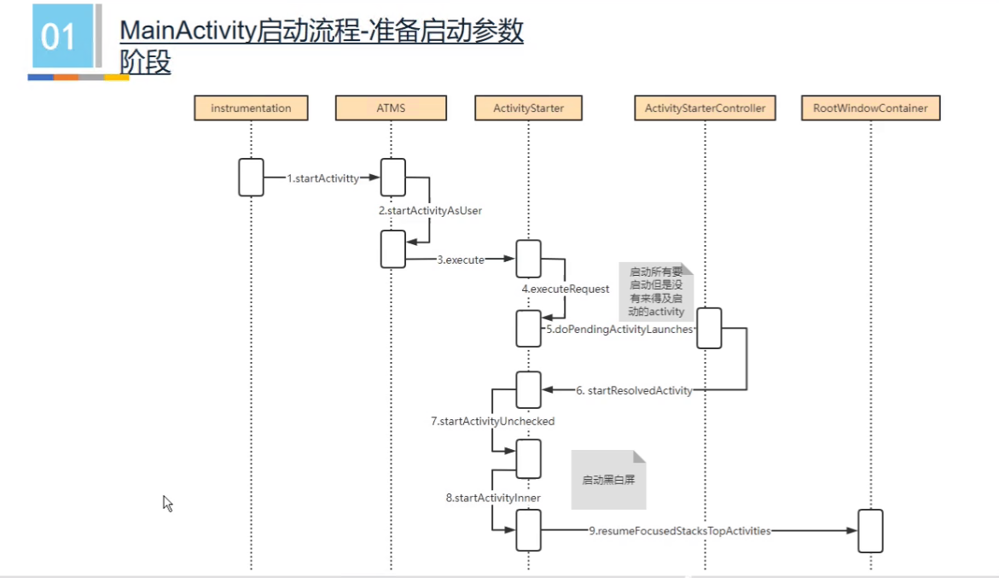

注：Mainactivty.startActivity(Intent) 是APP使用的入口（熟悉的入口）

~~原来ATMS就是AMS一部分, 在意识里不要分开~~（不要区分两者，ATMS管理Activity，这里自然是ATMS）

ATMS是管理Activity的，其中 ActivityStartController 管理启动功能start（而且是很多Activity的）   ---》 自然


对应关系：

> ATMS:管理 所有Activity的所有功能  --->  ActivityStartController 管理所有Activity启动功能start  --->     ActivityStarter对应一个Activity的start


**该阶段核心类：**
ActivityStarter   --->  自然，因为其负责启动流程

**关键函数：**

目标 ActivityRecord创建：   ActivityStarter.startActivity()  为待启动的Activity创建  ActivityRecord()

源 ActivityRecord的寻找：sourceRecord = mRootActivityContainer.isInAnyStack(IBinder token);  通过token找到


TODO:  目标 ActivityRecord 对应的 ActivityStack ，即targetStack？？？？


TODO:  按道理此时会有很多 栈管理。比如resumeFocusedStacksTopActivities过程。代码级分析 栈管理


TODO:  图中，启动黑白屏流程
----》  APP启动流程优化课程


TODO:
mIntent的流转流程


## 处理ActivityStack 阶段  -------总脉络

**围绕最终目标(真正的启动ActivityB),** 
所以为其创建 目标 ActivityRecord，----》 自然交给 AMS 著名的栈管理

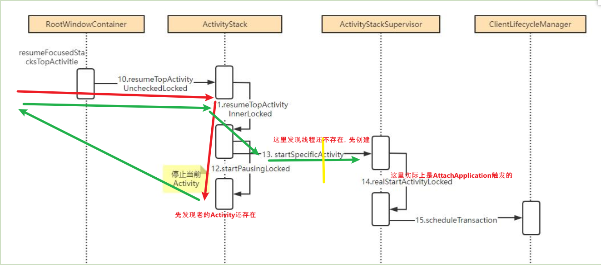


由ActivityStack  管理和启动 ActivityB

**该阶段核心类：**
ActivityStack  ---》 管理 activity栈的

**关键函数：**


记忆，总之：<font color='red'>两个问题</font>

1、实际上 resume函数进来两次，为啥呢？
因为第一次进来，发现问题 【1】： 老的Activity还在可交互，先pause一把

第二次进来，其实也发现问题 【2】：新的process还不存在


但第三次的时候，并没有从resume进，而是直接到了 14 realStartartActivity

2、上述图画的不是调用关系，只是时间上的

3、实际上涉及到很多线程（图中只体现了一个）


证明：

```java
目标：真正的启动ActivityB

//第一次resume：  关注触发点 和 终止点
Breakpoint reached
	at com.android.server.wm.ActivityStack.resumeTopActivityInnerLocked(ActivityStack.java:2625)  // 终止点: 启动新的过程中，发现问题 【1】：发现旧的还在，旧的先要pause呀 ---》 所以，跑去pause
	at com.android.server.wm.ActivityStack.resumeTopActivityUncheckedLocked(ActivityStack.java:2575)
	at com.android.server.wm.RootActivityContainer.resumeFocusedStacksTopActivities(RootActivityContainer.java:1158)
	at com.android.server.wm.ActivityStarter.startActivityUnchecked(ActivityStarter.java:1728)
	at com.android.server.wm.ActivityStarter.startActivity(ActivityStarter.java:1394)
	at com.android.server.wm.ActivityStarter.startActivity(ActivityStarter.java:933)
	at com.android.server.wm.ActivityStarter.startActivity(ActivityStarter.java:583)
	at com.android.server.wm.ActivityStarter.startActivityMayWait(ActivityStarter.java:1288)
	at com.android.server.wm.ActivityStarter.execute(ActivityStarter.java:514)
	at com.android.server.wm.ActivityTaskManagerService.startActivityAsUser(ActivityTaskManagerService.java:1058)
	at com.android.server.wm.ActivityTaskManagerService.startActivityAsUser(ActivityTaskManagerService.java:1032)
	at com.android.server.wm.ActivityTaskManagerService.startActivity(ActivityTaskManagerService.java:1009)  //  触发点： laucher或其他应用StartActvity
	at android.app.IActivityTaskManager$Stub.onTransact(IActivityTaskManager.java:1486)
	at android.os.Binder.execTransactInternal(Binder.java:1021)
	at android.os.Binder.execTransact(Binder.java:994)
sub Thread  name is Binder:8184_2, 17, 2021-10-09 13:27:27:016
    
//第二次 resume：
Breakpoint reached
	at com.android.server.wm.ActivityStack.resumeTopActivityInnerLocked(ActivityStack.java:2625)
	at com.android.server.wm.ActivityStack.resumeTopActivityUncheckedLocked(ActivityStack.java:2575)// 【2】终止点: 又发现问题了，新的进程都没有呢----》跑去创建process
	at com.android.server.wm.RootActivityContainer.resumeFocusedStacksTopActivities(RootActivityContainer.java:1158)
	at com.android.server.wm.ActivityStack.completePauseLocked(ActivityStack.java:1839)
	at com.android.server.wm.ActivityStack.activityPausedLocked(ActivityStack.java:1766)   // 触发点： 前一个activityPaused
	at com.android.server.wm.ActivityStack$ActivityStackHandler.handleMessage(ActivityStack.java:451)
	at android.os.Handler.dispatchMessage(Handler.java:107)
	at android.os.Looper.loop(Looper.java:214)
	at android.os.HandlerThread.run(HandlerThread.java:67)
	at com.android.server.ServiceThread.run(ServiceThread.java:44)
sub Thread  name is android.display, 22, 2021-10-09 13:27:29:041  // display线程
    
//新的process创建后，attachApplication
Breakpoint reached
	at com.android.server.wm.ActivityStackSupervisor.realStartActivityLocked(ActivityStackSupervisor.java:708)// 【3】最终真正StartActivity的地方！！！！！！！！
	at com.android.server.wm.RootActivityContainer.attachApplication(RootActivityContainer.java:783)
	at com.android.server.wm.ActivityTaskManagerService$LocalService.attachApplication(ActivityTaskManagerService.java:6869)
	at com.android.server.am.ActivityManagerService.attachApplicationLocked(ActivityManagerService.java:5103)
	at com.android.server.am.ActivityManagerService.attachApplication(ActivityManagerService.java:5180)// 触发点：新的process创建后，attachApplication
	at android.app.IActivityManager$Stub.onTransact(IActivityManager.java:2003)
	at com.android.server.am.ActivityManagerService.onTransact(ActivityManagerService.java:2741)
	at android.os.Binder.execTransactInternal(Binder.java:1021)
	at android.os.Binder.execTransact(Binder.java:994)
sub Thread  name is Binder:8184_13, 228, 2021-10-09 13:27:36:361

```


## 补充问题【1】：旧的Activity先要pause

TODO  简略


触发点：startActivty之前，先pause老的

结果：puased之后，再继续走resume新的


## 补充问题【2】：~~AMS 判断 所要启动的Activity对应的进程 是否存在~~

自然：启动ActivityB，发现的问题


逻辑：

> 如果存在，直接启动。即0层架构图中的  7和8
>
> 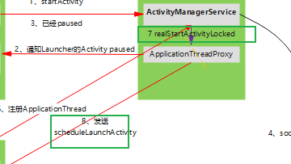
>
> 如果不存在，则 通知 zygote进程去fork一个新的APP进程


调用栈：

> 
>
> ```java
> Binder线程：
> startSpecificActivityLocked:961, ActivityStackSupervisor (com.android.server.wm) // 栈管理判断
> resumeTopActivityInnerLocked:3037, ActivityStack (com.android.server.wm)
> resumeTopActivityUncheckedLocked:2575, ActivityStack (com.android.server.wm)
> resumeFocusedStacksTopActivities:1158, RootActivityContainer (com.android.server.wm)  // 核心？？？
> completePauseLocked:1839, ActivityStack (com.android.server.wm)
> activityPausedLocked:1766, ActivityStack (com.android.server.wm)
> activityPaused:1699, ActivityTaskManagerService (com.android.server.wm)  //【1】
> onTransact:1981, IActivityTaskManager$Stub (android.app)
> execTransactInternal:1021, Binder (android.os)
> execTransact:994, Binder (android.os)
> ```
>
> 可以看出：  
> 1、必须要等老皇帝paused，才会  resumeTopActivity  ，自然
> 2、 ~~resumeTopActivity发现没有，才fork新进程的~~，自然


对应代码：

```java
    void startSpecificActivityLocked(ActivityRecord r, boolean andResume, boolean checkConfig) {
        // Is this activity's application already running?
		..........
        if (wpc != null && wpc.hasThread()) { // cg: if APP process is created, start APP Activity directly
            try {
                realStartActivityLocked(r, wpc, andResume, checkConfig);
                return;
            } 
			..........
        }

        try {
			..........
            // Post message to start process to avoid possible deadlock of calling into AMS with the
            // ATMS lock held.
            final Message msg = PooledLambda.obtainMessage( // cg: if APP process is not created,create it.
                    ActivityManagerInternal::startProcess, mService.mAmInternal, r.processName,
                    r.info.applicationInfo, knownToBeDead, "activity", r.intent.getComponent());
            mService.mH.sendMessage(msg);
	       ..........
    }
```


注意：
AMS侧：
功能划分： 

> 1、ATMS拿到paused消息，通知 栈管理ActivityStackSupervisor判断 有没进程：相当于ATMS---->  ActivityStackSupervisor
>
> 2、栈管理把 判断结果，返回给ATMS和 AMS，AMS让 ProcessList去处理 :   ActivityStackSupervisor ---->   ATMS ----> AMS ----> ProcessList

TODO:
从数据结构/代码架构角度，如何保证 功能上，AMS统领全局？？？？？？？？？

   

### AMS 通知 Zygote进程  

触发点： 已经判断没有进程

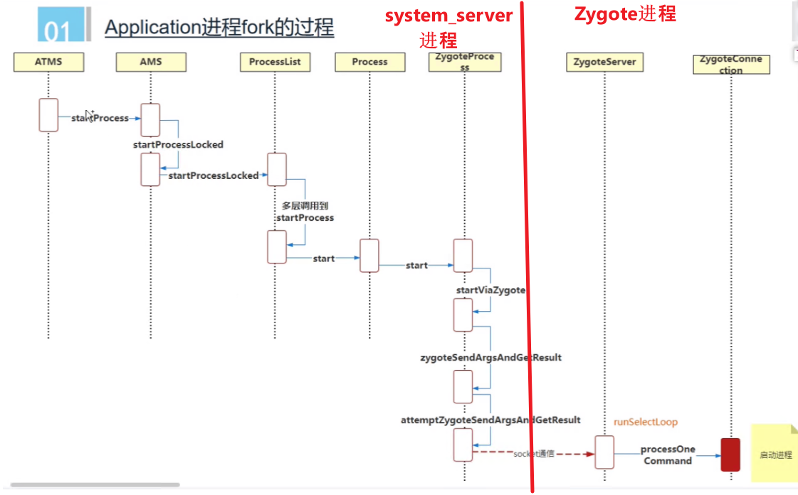


记忆：

> 基于0层框架 ，~~~AMS ----> zygote进程阶段~~
> 目的：~~通知zygote fork一个App进程，~~即startProcess，自然
> 途径：通过socket 通信（流）


自然:
之前会  封装一系列参数 以构建socket消息，  startViaZygote 
为什么ATMS,最终要调用要回到ams,  最终要处理，但atms没有processList


## ZygoteServer 接受消息后，fork流程（关键流程1）

### 总之：

ZygoteServer是一个socket服务器，~~在runSelectLoop轮询消息(死循环)~~，**自然是必然的**  （TODO:  轮询的epoll机制）

1、轮询到消息后，fork出 APP process  (自然，fork需要参数，这个参数来自于socket的对端，解析出来的)

2、在 APP process中，先关闭Server Socket， 自然，因为用不到

​          初始化  RuntimeInit

​          启动binder驱动（利用AndroidRuntime）？ 启动线程池

​	       反射调用ActivityThread的 main函数，从而主线程起来

```java
RuntimeInit.commonInit(); //cg: init Runtime. Two APPs have different runtime.
ZygoteInit.nativeZygoteInit(); // cg: init Binder/Binder ThreadPool
return RuntimeInit.applicationInit(targetSdkVersion, argv, classLoader);  // cg: invotes ActivtyThread's main method by reflecting  
```

 


代码：

```java
//ZygoteConnection.java
       //cg: nativeForkAndSpecialize a process for APP. Return 0 and 1
        pid = Zygote.forkAndSpecialize(......);

        try {
            if (pid == 0) { // cg: in child process. APP process
                // in child
                
                zygoteServer.closeServerSocket(); // cg: Only zygote process needs socket server
                ......
                return handleChildProc(parsedArgs, descriptors, childPipeFd, //cg: 反射获取
                        parsedArgs.mStartChildZygote);
            } else {    // cg: zygote process
                // In the parent. A pid < 0 indicates a failure and will be handled in
                // handleParentProc.
				......
                return null;
            }
```


启动binder驱动、 启动线程池： TODO

```cpp
 // ProcessState.cpp
mDriverFD(open_driver(driver));

// app_main.cpp
proc->startThreadPool();
```


对于fork出来的APP进程：


### 次要补充：linux fork() 函数

nativeForkAndSpecialize具体如何fork的
-----》zygote视频

**结论**：
1、返回次数：一般说法为：fork函数 一定会返回两次。
但其实就是一次，~~子进程的返回，返回在子进程；父进程的返回，返回在父进程~~，<font color='red'>自然</font>

原因：在调用fork的时候，完全复制出另一个process（包括其属性都一样）
           **自然，**原来进程 和 fork出的进程，都走在执行fork函数，所以会有两处返回点

-----》 TODO:  深入理解linux fork过程

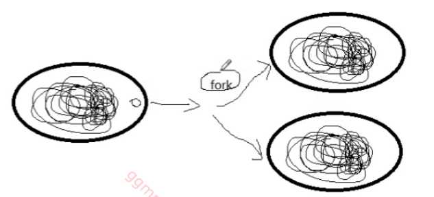


----》TODO:  返回pid=0子进程。那么,何时pid变的不为0?

2、关于返回值：fork返回值0，返回的是孩子进程  ；返回值 > 0, 说明是Zygote进程返回；返回值-1，fork失败

3、，在fork节点前的变量，在fork之后，被copy到两个进程里，独立运行，互不影响。

https://blog.csdn.net/m0_51242270/article/details/128086849?spm=1001.2101.3001.6650.3&utm_medium=distribute.pc_relevant.none-task-blog-2%7Edefault%7EYuanLiJiHua%7EPosition-3-128086849-blog-126355841.pc_relevant_3mothn_strategy_and_data_recovery&depth_1-utm_source=distribute.pc_relevant.none-task-blog-2%7Edefault%7EYuanLiJiHua%7EPosition-3-128086849-blog-126355841.pc_relevant_3mothn_strategy_and_data_recovery&utm_relevant_index=6

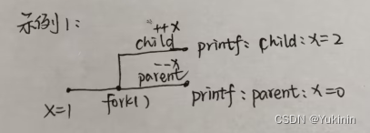


```
int main() {
    std::cout << "main: " <<   "getpid: " << getpid() << ", thread_ID: " << std::this_thread::get_id() << std::endl;

	pid_t pid;
	int x=1;
	pid=fork();
	if(pid==0){  //child process
		std::cout << "child, "  << "getpid: " << getpid() << ", thread_ID: " << std::this_thread::get_id() << " ++x: " << ++x << std::endl;
		return 0;
	}
	//parent process
	std::cout << "parent, "  << "getpid: " << getpid() << ", thread_ID: " << std::this_thread::get_id() << " --x: " << --x << std::endl;

    return 0;
}


main: getpid: 788, thread_ID: 139836642585600
parent, getpid: 788, thread_ID: 139836642585600 --x: 0
child, getpid: 789, thread_ID: 139836642585600 ++x: 2
```

pid为进程号


注意：新fork出的进程，与zygote进程完全一样（除了一些）


### ActivityThread的 main函数起来

（锚点）基于0层模型，主要做的事情：
1、~~创建了主线程的 驴拉磨Looper，并让死循环跑起来~~

2、~~向AMS 注册 ActivityThread的Binder 即IApplicationThread:  attachApplication~~


##   APP进程起来后，attach过程（关键流程2）

一句话：

> 从APP角度,   APP向AMS <font color='red'>attach</font> ActivityThread的Binder 即IApplicationThread
>
> 从AMS角度,  AMS侧 bind Application


AMS.attachApplicationLocked()  具体做了哪些事情呢？
基于逻辑，推断：
1、AMS将新生儿的姓名、appInfo等同步给APP（此时新生儿白纸一张，和zygote一样）调用了APP.bindApplication ：

AMS侧：thread.bindApplication(processName, appInfo, providers.........)   ---->  基于刚搭建的桥梁AMS-->APP
APP侧： 见   补充APP侧handleBindApplication章节
2、必然~~注册ApplicationThread给了AMS，存储在AMS的PorcessRecord，最终存在mLruProcesses 中~~----》自然，桥梁ApplicationThread的流转过程
3、~~必然执行Activity启动流程，~~  见下realStart ----》自然，最终目的


```java
// AMS.Java
    private final boolean attachApplicationLocked(IApplicationThread thread,
            int pid, int callingUid, long startSeq) {

        // Find the application record that is being attached...  either via
        // the pid if we are running in multiple processes, or just pull the
        // next app record if we are emulating process with anonymous threads.
        ProcessRecord app;
        long startTime = SystemClock.uptimeMillis();
        long bindApplicationTimeMillis;
        if (pid != MY_PID && pid >= 0) {
            synchronized (mPidsSelfLocked) {
                app = mPidsSelfLocked.get(pid); // cg: inited in handleProcessStartedLocked method.
            }
           	。。。。。。。
            }
        } 
        ............
        try {
            AppDeathRecipient adr = new AppDeathRecipient(
                    app, pid, thread);
            thread.asBinder().linkToDeath(adr, 0);
            app.deathRecipient = adr; // cg: App Death Listner 死亡监听.  http://t.zoukankan.com/xiayexingkong-p-6762569.html
        } 
        app.curAdj = app.setAdj = app.verifiedAdj = ProcessList.INVALID_ADJ;
        app.setCurrentSchedulingGroup(app.setSchedGroup = ProcessList.SCHED_GROUP_DEFAULT);
        app.forcingToImportant = null;
        updateProcessForegroundLocked(app, false, 0, false);
        app.hasShownUi = false;
        app.setDebugging(false);
        app.cached = false;
        app.killedByAm = false;
        app.killed = false;
	
		thread.bindApplication(processName, appInfo, providers.........) // cg: 关键流程！！！！将大量APP信息 同步给APP（此时APP还和zygote进程一模一样呢，），比如进程名，appInfo

        try {
            ........
            app.makeActive(thread, mProcessStats); // cg: IApplicationThread of APP is bound to ProcessRecord. 这也就是后面AMS能调用 APP进程的原因
            mProcessList.updateLruProcessLocked(app, false, null); //cg: Finally processRecord is added to mLruProcesses 最终存在mLruProcesses里
            ........
        } 
		........
    }
```


### 补充：APP侧 handleBindApplication


参考：https://blog.csdn.net/chupu2979/article/details/100616862
         https://blog.csdn.net/innost/article/details/47254381

一句话总结handleBindApplication：

handleBindApplication主要工作是初始化APP（APP由zygote进程fork而来，在hanldeBindApplication之前，这个APP进程和zygote没什么区别。只有调用完handleBindApplication之后，这个APP进程才是APP,  比如该进程有了对应的名字，Aplication对象被创建等）。


%accordion%具体：%accordion%

```java
private void handleBindApplication(AppBindDatadata) {

   mBoundApplication = data;

   mConfiguration = new Configuration(data.config);

   mCompatConfiguration = new Configuration(data.config);

    //初始化性能统计对象

   mProfiler = new Profiler();

   mProfiler.profileFile = data.initProfileFile;

   mProfiler.profileFd = data.initProfileFd;

   mProfiler.autoStopProfiler = data.initAutoStopProfiler;

 

    //设置进程名。从此，之前那个默默无名的进程终于有了自己的名字

   Process.setArgV0(data.processName);

   android.ddm.DdmHandleAppName.setAppName(data.processName);

 

    if(data.persistent) {

       //对于persistent的进程，在低内存设备上，不允许其使用硬件加速显示

       Display display =

                 WindowManagerImpl.getDefault().getDefaultDisplay();

       //当内存大于512MB，或者屏幕尺寸大于1024*600，可以使用硬件加速

       if(!ActivityManager.isHighEndGfx(display))

           HardwareRenderer.disable(false);

     }

    //启动性能统计

     if(mProfiler.profileFd != null)   mProfiler.startProfiling();

   //如果目标SDK版本小于12，则设置AsyncTask使用pool executor，否则使用

   //serializedexecutor。这些executor涉及Java Concurrent类，对此不熟悉的读者

   //请自行学习和研究。

   if(data.appInfo.targetSdkVersion <= 12)

           AsyncTask.setDefaultExecutor(AsyncTask.THREAD_POOL_EXECUTOR);

 

    //设置timezone

   TimeZone.setDefault(null);

    //设置语言

    Locale.setDefault(data.config.locale);

     //设置资源及兼容模式

    applyConfigurationToResourcesLocked(data.config, data.compatInfo);

    applyCompatConfiguration();

 

      //根据传递过来的ApplicationInfo创建一个对应的LoadApk对象

     data.info = getPackageInfoNoCheck(data.appInfo, data.compatInfo);

     //对于系统APK，如果当前系统为userdebug/eng版，则需要记录log信息到dropbox的日志记录

     if((data.appInfo.flags &

            (ApplicationInfo.FLAG_SYSTEM |

             ApplicationInfo.FLAG_UPDATED_SYSTEM_APP)) != 0) {

           StrictMode.conditionallyEnableDebugLogging();

    }

    /*

    如目标SDK版本大于9，则不允许在主线程使用网络操作（如Socketconnect等），否则抛出

    NetworkOnMainThreadException，这么做的目的是防止应用程序在主线程中因网络操作执行

    时间过长而造成用户体验下降。说实话，没有必要进行这种限制，在主线程中是否网络操作

    是应用的事情。再说，Socket也可作为进程间通信的手段，在这种情况下，网络操作耗时很短。

    作为系统，不应该设置这种限制。另外，Goolge可以提供一些开发指南或规范来指导开发者，

    而不应如此蛮横地强加限制。

    */

    if (data.appInfo.targetSdkVersion> 9)

        StrictMode.enableDeathOnNetwork();

 

    //如果没有设置屏幕密度，则为Bitmap设置默认的屏幕密度

   if((data.appInfo.flags

               &ApplicationInfo.FLAG_SUPPORTS_SCREEN_DENSITIES) == 0)

    Bitmap.setDefaultDensity(DisplayMetrics.DENSITY_DEFAULT);

   if(data.debugMode != IApplicationThread.DEBUG_OFF){

    ......//调试模式相关处理

   }

   IBinder b= ServiceManager.getService(Context.CONNECTIVITY_SERVICE);

  IConnectivityManager service =

                        IConnectivityManager.Stub.asInterface(b);

  try {

       //设置Http代理信息

       ProxyPropertiesproxyProperties = service.getProxy();

      Proxy.setHttpProxySystemProperty(proxyProperties);

   } catch(RemoteException e) {}

 

   if(data.instrumentationName != null){

        //在正常情况下，此条件不满足

   } else {

      //创建Instrumentation对象，在正常情况都再这个条件下执行

     mInstrumentation = new Instrumentation();

   }

   //如果Package中声明了FLAG_LARGE_HEAP，则可跳过虚拟机的内存限制，放心使用内存

   if((data.appInfo.flags&ApplicationInfo.FLAG_LARGE_HEAP) != 0)

        dalvik.system.VMRuntime.getRuntime().clearGrowthLimit();

 

   //创建一个Application，data.info为LoadedApk类型，在其内部会通过Java反射机制

   //创建一个在该APK AndroidManifest.xml中声明的Application对象

   Applicationapp = data.info.makeApplication(

                                     data.restrictedBackupMode, null);

 //mInitialApplication保存该进程中第一个创建的Application

  mInitialApplication = app;

 

   //安装本Package中携带的ContentProvider

   if(!data.restrictedBackupMode){

      List<ProviderInfo> providers = data.providers;

        if(providers != null) {

               //installContentProviders我们已经分析过了

               installContentProviders(app, providers);

               mH.sendEmptyMessageDelayed(H.ENABLE_JIT, 10*1000);

           }

  }

   //调用Application的onCreate函数，做一些初始工作

  mInstrumentation.callApplicationOnCreate(app);

}
```


%/accordion%


其中最重要的有：

· <font color='red'>创建一个Application对象</font>，该对象是本进程中运行的第一个Application。

· 如果该Application有ContentProvider，则应安装它们。


## ~~ActivityB  真正启动流程  realStart~~

途径：基于刚搭建的桥梁AMS-->APP


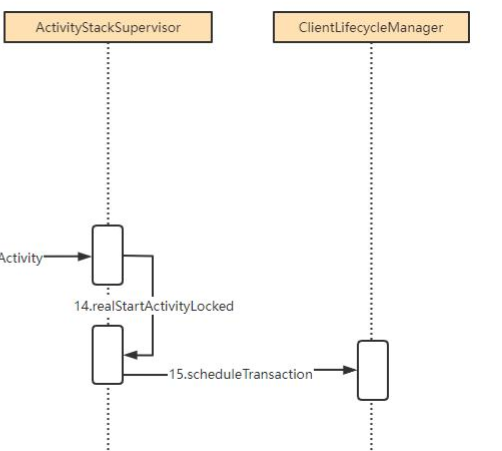

触发点（我来自哪里）：

> 见总脉络： ActivityManagerService.attachApplication

核心类（我是谁）：

> 栈管理 是 控制着启动，自然是 ActivityStackSupervisor

具体（做什么）

> ActivityStackSupervisor 创建生命周期封装类Transaction，交给 生命周期管理类，去同步给APP


### 补充：生命周期同步到APP侧

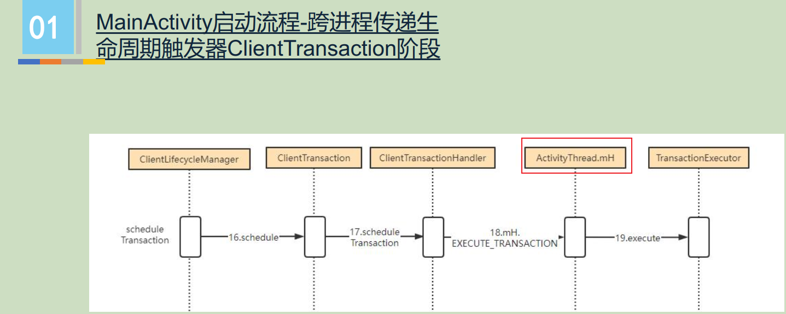

不得不：
1、生命周期由AMS控制，通过事件ClientTranction 同步到APP

2、自然通过ActivityTread 跨进程 同步

3、~~**binder线程过来**，所以，会存在handler 转到主线程执行~~   -----》 自然，图中 Handler 舍弃


自然：

1、第一次，自然直接同步了resume过来。（自然APP端，先要create、start）  见： 

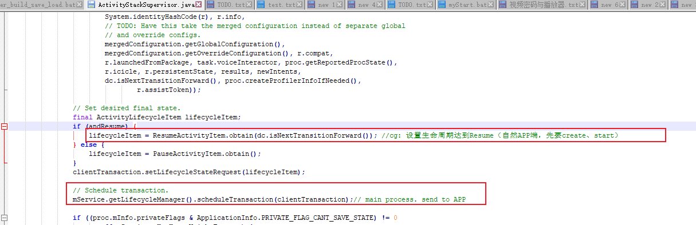


### 补充：APP 侧执行 生命周期同步transaction  的执行execute(关键数据结构)

核心函数： 

> TransactionExecutor.execute(transaction);    <font color='red'>TransactionExecutor 执行器</font>


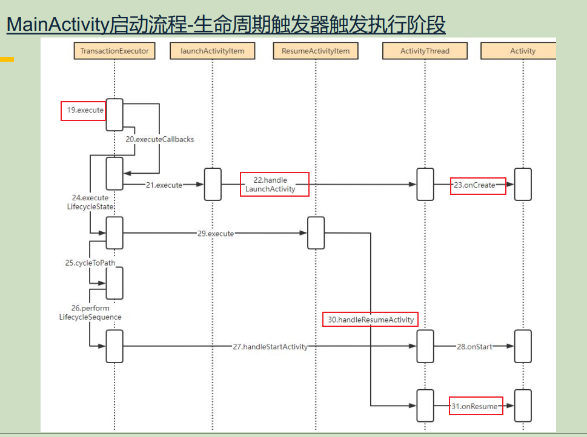

触发流程：
自然是，realStart流程 触发了 ams的生命周期同步

ActivityThread 相关函数： 

> handleLaunchActivity   --->  performLaunchActivity   ---> 【1】<font color='red'>  创建Activity，并 attach() 创建window</font>-----> onCreate （`这里填充具体view`） 【2】
>
> handleStartActivity   --->  performStartActivity    ----->  onStart
>
> handleResumeActivity   --->  performResumeActivity    ----->  onResume

不得不：

1、【1】 ActivityThread.performLaunchActivity 目标是 创建activity、window、view树  ---->  自然，【1】不得不

2、在 Activity.attach() 中新建window（自然，并绑定windowManagerImpl）

3、onCreate中，APP开发者setContentView() 过程：为  开发者view 添加 最顶级view------DecorView，真正的viewTree


TODO:  加强模型：  


小的知识点：

> onCreate和onResume是AMS 同步来的
>
> onStart是 APP侧执行器 自己算的（中间的生命周期状态都要执行cylceToPath）


TODO:

    final void attach(Context context, ActivityThread aThread,
            Instrumentation instr, IBinder token, int ident,
            Application application, Intent intent, ActivityInfo info,
            CharSequence title, Activity parent, String id,
            NonConfigurationInstances lastNonConfigurationInstances,
            Configuration config, String referrer, IVoiceInteractor voiceInteractor,
            Window window, ActivityConfigCallback activityConfigCallback, IBinder assistToken) {
        attachBaseContext(context);
    
        mFragments.attachHost(null /*parent*/);
    
        mWindow = new PhoneWindow(this, window, activityConfigCallback);//cg: new window
        mWindow.setWindowControllerCallback(this);
        mWindow.setCallback(this);//cg: Activity之所以可以得到事件等消息的来源：Callback: dispatchKeyEvent、onWindowFocusChanged、onWindowAttributesChanged


关于handleResumeActivity流程----》 TODO: 新起章节

```java
//ActivityThread.java
public void handleResumeActivity(){
	final ActivityClientRecord r = performResumeActivity(token, finalStateRequest, reason);//cg: onResume
    wm.addView(decor, l);  //cg: keyProcess.显示： 调用 WindowManagerImpl 将decorview 添加到window系统中
    Looper.myQueue().addIdleHandler(new Idler());  //cg: key process. Idler事件，关闭ActivityA 【Idler事件】
}
```

所以，先调用的 onResume之后，再显示的

-------》  但对于开发者，这两个先后顺序不重要，因为：<font color='red'>都是在一个消息处理流程里，中间不可能断，都会一起执行完</font>


## 启动ActivityA的Activity stop阶段  

最后一步，老皇帝行将就木stop

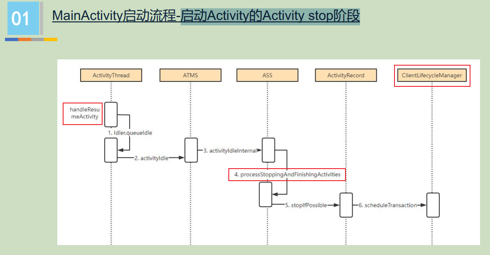


触发点：新皇帝完成了登基的所有事情，就通知总管，让老皇帝不要再哔哔了Stop：

> ActivityB 完成了所有生命周期的 同步（onCreate、onStart、onResume）。
>
> 在handleResumeActivity 最后一刻，通知ATMS，关闭ActivityA （~~生命周期的同步~~~）。见【Idler事件】
>
> 


TODO:

Idler事件 什么时候执行呢？当 Looper里没有可执行的消息了 ------》  这就解释了，停止ActivityA 是有空闲时，才做的


## 补充：render线程的创建

时机：handleLaunchActivity

```java
 
 // ActivityThread.java
 public Activity handleLaunchActivity(ActivityClientRecord r,
		.............

        if (!ThreadedRenderer.sRendererDisabled
                && (r.activityInfo.flags & ActivityInfo.FLAG_HARDWARE_ACCELERATED) != 0) { // 硬件加速
            HardwareRenderer.preload();  // 【1】启动render线程  Start render thread and initialize EGL or Vulkan.
        }
        WindowManagerGlobal.initialize();
       .............
}

```


## TODO:

ApplicationThread是binder线程池一个线程

AMS也是嘛？


## 面试问题：


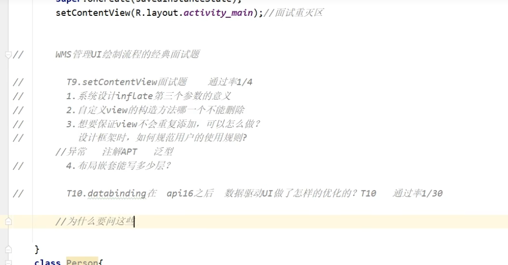


1、setContentView


### 为什么APP不能直接启动进程？


1、**安全性角度**：~~如果那样就见鬼了，APP自己是应用进程，开辟进程是非常危险的操作，必须由专人做专门的事。~~

2、**性能角度（时间上、空间上）**：都由Zygote进fork，可以 共享（write时复制），比APP自己加载资源，要快的多、内存开销小（如果是共享，基本上没开销）

### 为什么使用socket而不使用binder？（网易二面）

android中AMS通知Zygote去fork进程流程，为什么使用socket而不使用binder？


参考：

https://blog.csdn.net/cpcpcp123/article/details/127990882    

https://blog.csdn.net/rzleilei/article/details/125770598


原因一：

**1. 先后时序问题：**

基于 启动系统的0层图， 如果用Zygote进程使用binder被通信

------>  自然，在 Zygote进程 在加载过程中，需要注册服务给ServiceManager（但此时有可能ServiceManager没有初始化好）

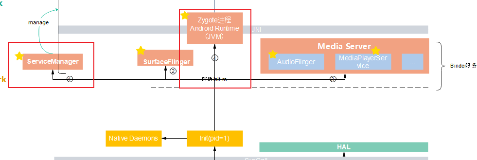

**简言之**：

问题在于 **不能**保证ServiceManger先初始化好（因为两个进程是并行的）


补充：

> 图中1、2、3、4只是开始创建的时序。不是创建好的时序！！！！


~~拓展问题：~~

> 等ServiceManager完全初始化好再去注册不就好了吗？ ----》  这个等，两种处理：
>
> （1）、完全初始化好，通知 -----> 这个通知也垮了进程，设计冗余
>
> （2）、延时10ms ----> 垃圾做法


**2、Linux多线程的fork存在问题**

背景：

>  Linux中，fork进程其实并不是完美的fork，linux设计之初只考虑到了主线程的fork，也就是说如果主进程中存在子线程，那么fork进程中，其子线程的锁状态，挂起状态等等都是不可恢复的，<font color='red'>只有主进程的才可以恢复。</font>
>
> TODO:  所以Zygote进程，只有主线程？？？？


**binder线程状态** 在fork过程中**存在问题：**

> binder作为典型的CS模式，其在**Server是通过线程**来实现的，Server等待请求状态时，必然是处于一种挂起的状态。所以如果使用[binder机制](https://so.csdn.net/so/search?q=binder机制&spm=1001.2101.3001.7020)，zygote进程fork子进程后，**子进程的binder的Server永远处于一种挂起不可恢复的状态**，这样的设计无疑是非常差的。


**3、内存问题：**

进程的fork，各种内存对象自然也会被拷贝（~~是拷贝一个和原进程一摸一样的进程~~）。

-------->  如果用socket，占内存，-------> 所以 关闭socket（~~fork两次返回时，判断是子线程时~~）

-------->  如果用binder，占内存  ------->  无法释放，binder成对存在？成对释放？所以需要释放AMS端的client binder

```cpp
Binder的特殊性在于其是成对存在的，其分为Client端对象和Server端对象。假设我们使用binder，那么因为APP端的binder是拷贝自Zygote进程的，所以如果要释放掉APP的Server端binder引用对象，就必须释放掉AMS中的Client端binder对象，那这样就会导致AMS失去binder从而无法正常向Zygote发送消息。
```


**总之：**

> 以上问题都是不致命的，所以，可以强行用binder


# 从trace角度----应用冷启动

1、