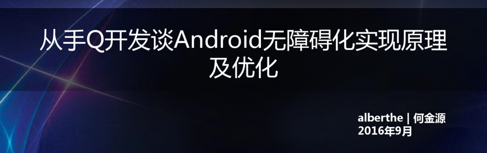

# 无障碍流程

## 总体静态框架


类图：


无障碍相关的类：


A侧左滑流程

<div width="10000%" style="overflow-x: auto;">  
  <?xml version="1.0" encoding="UTF-8" standalone="no"?><svg xmlns="http://www.w3.org/2000/svg" xmlns:xlink="http://www.w3.org/1999/xlink" contentScriptType="application/ecmascript" contentStyleType="text/css" height="1864px" preserveAspectRatio="none" style="width:4811px;height:1864px;" version="1.1" viewBox="0 0 4811 1864" width="4811px" zoomAndPan="magnify"><defs><filter height="300%" id="f1jhhfjkrzxnii" width="300%" x="-1" y="-1"><feGaussianBlur result="blurOut" stdDeviation="2.0"/><feColorMatrix in="blurOut" result="blurOut2" type="matrix" values="0 0 0 0 0 0 0 0 0 0 0 0 0 0 0 0 0 0 .4 0"/><feOffset dx="4.0" dy="4.0" in="blurOut2" result="blurOut3"/><feBlend in="SourceGraphic" in2="blurOut3" mode="normal"/></filter></defs><g><text fill="#000000" font-family="sans-serif" font-size="18" lengthAdjust="spacingAndGlyphs" textLength="162" x="2327" y="28.708">下滑操作无障碍流程</text><rect fill="#FFFFFF" filter="url(#f1jhhfjkrzxnii)" height="309.0625" style="stroke: #A80036; stroke-width: 1.0;" width="10" x="2852" y="1487.4922"/><line style="stroke: #A80036; stroke-width: 1.0;" x1="251" x2="251" y1="75.25" y2="1206.2969"/><line style="stroke: #A80036; stroke-width: 1.0; stroke-dasharray: 1.0,4.0;" x1="251" x2="251" y1="1206.2969" y2="1234.2969"/><line style="stroke: #A80036; stroke-width: 1.0;" x1="251" x2="251" y1="1234.2969" y2="1821.5547"/><line style="stroke: #A80036; stroke-width: 1.0;" x1="518.5" x2="518.5" y1="75.25" y2="1206.2969"/><line style="stroke: #A80036; stroke-width: 1.0; stroke-dasharray: 1.0,4.0;" x1="518.5" x2="518.5" y1="1206.2969" y2="1234.2969"/><line style="stroke: #A80036; stroke-width: 1.0;" x1="518.5" x2="518.5" y1="1234.2969" y2="1821.5547"/><line style="stroke: #A80036; stroke-width: 1.0;" x1="881" x2="881" y1="75.25" y2="1206.2969"/><line style="stroke: #A80036; stroke-width: 1.0; stroke-dasharray: 1.0,4.0;" x1="881" x2="881" y1="1206.2969" y2="1234.2969"/><line style="stroke: #A80036; stroke-width: 1.0;" x1="881" x2="881" y1="1234.2969" y2="1821.5547"/><line style="stroke: #A80036; stroke-width: 1.0;" x1="1504" x2="1504" y1="75.25" y2="1206.2969"/><line style="stroke: #A80036; stroke-width: 1.0; stroke-dasharray: 1.0,4.0;" x1="1504" x2="1504" y1="1206.2969" y2="1234.2969"/><line style="stroke: #A80036; stroke-width: 1.0;" x1="1504" x2="1504" y1="1234.2969" y2="1821.5547"/><line style="stroke: #A80036; stroke-width: 1.0;" x1="1718" x2="1718" y1="75.25" y2="1206.2969"/><line style="stroke: #A80036; stroke-width: 1.0; stroke-dasharray: 1.0,4.0;" x1="1718" x2="1718" y1="1206.2969" y2="1234.2969"/><line style="stroke: #A80036; stroke-width: 1.0;" x1="1718" x2="1718" y1="1234.2969" y2="1821.5547"/><line style="stroke: #A80036; stroke-width: 1.0;" x1="1993" x2="1993" y1="75.25" y2="1206.2969"/><line style="stroke: #A80036; stroke-width: 1.0; stroke-dasharray: 1.0,4.0;" x1="1993" x2="1993" y1="1206.2969" y2="1234.2969"/><line style="stroke: #A80036; stroke-width: 1.0;" x1="1993" x2="1993" y1="1234.2969" y2="1821.5547"/><line style="stroke: #A80036; stroke-width: 1.0;" x1="2327.5" x2="2327.5" y1="75.25" y2="1206.2969"/><line style="stroke: #A80036; stroke-width: 1.0; stroke-dasharray: 1.0,4.0;" x1="2327.5" x2="2327.5" y1="1206.2969" y2="1234.2969"/><line style="stroke: #A80036; stroke-width: 1.0;" x1="2327.5" x2="2327.5" y1="1234.2969" y2="1821.5547"/><line style="stroke: #A80036; stroke-width: 1.0;" x1="2648.5" x2="2648.5" y1="75.25" y2="1206.2969"/><line style="stroke: #A80036; stroke-width: 1.0; stroke-dasharray: 1.0,4.0;" x1="2648.5" x2="2648.5" y1="1206.2969" y2="1234.2969"/><line style="stroke: #A80036; stroke-width: 1.0;" x1="2648.5" x2="2648.5" y1="1234.2969" y2="1821.5547"/><line style="stroke: #A80036; stroke-width: 1.0;" x1="2856.5" x2="2856.5" y1="75.25" y2="1206.2969"/><line style="stroke: #A80036; stroke-width: 1.0; stroke-dasharray: 1.0,4.0;" x1="2856.5" x2="2856.5" y1="1206.2969" y2="1234.2969"/><line style="stroke: #A80036; stroke-width: 1.0;" x1="2856.5" x2="2856.5" y1="1234.2969" y2="1821.5547"/><line style="stroke: #A80036; stroke-width: 1.0;" x1="3261.5" x2="3261.5" y1="75.25" y2="1206.2969"/><line style="stroke: #A80036; stroke-width: 1.0; stroke-dasharray: 1.0,4.0;" x1="3261.5" x2="3261.5" y1="1206.2969" y2="1234.2969"/><line style="stroke: #A80036; stroke-width: 1.0;" x1="3261.5" x2="3261.5" y1="1234.2969" y2="1821.5547"/><line style="stroke: #A80036; stroke-width: 1.0;" x1="3480.5" x2="3480.5" y1="75.25" y2="1206.2969"/><line style="stroke: #A80036; stroke-width: 1.0; stroke-dasharray: 1.0,4.0;" x1="3480.5" x2="3480.5" y1="1206.2969" y2="1234.2969"/><line style="stroke: #A80036; stroke-width: 1.0;" x1="3480.5" x2="3480.5" y1="1234.2969" y2="1821.5547"/><line style="stroke: #A80036; stroke-width: 1.0;" x1="3884" x2="3884" y1="75.25" y2="1206.2969"/><line style="stroke: #A80036; stroke-width: 1.0; stroke-dasharray: 1.0,4.0;" x1="3884" x2="3884" y1="1206.2969" y2="1234.2969"/><line style="stroke: #A80036; stroke-width: 1.0;" x1="3884" x2="3884" y1="1234.2969" y2="1821.5547"/><rect fill="#00FF00" filter="url(#f1jhhfjkrzxnii)" height="30.2969" style="stroke: #A80036; stroke-width: 1.5;" width="118" x="190" y="39.9531"/><text fill="#000000" font-family="sans-serif" font-size="14" lengthAdjust="spacingAndGlyphs" textLength="104" x="197" y="59.9482">TouchExplorer</text><rect fill="#00FF00" filter="url(#f1jhhfjkrzxnii)" height="30.2969" style="stroke: #A80036; stroke-width: 1.5;" width="118" x="190" y="1820.5547"/><text fill="#000000" font-family="sans-serif" font-size="14" lengthAdjust="spacingAndGlyphs" textLength="104" x="197" y="1840.5498">TouchExplorer</text><rect fill="#00FF00" filter="url(#f1jhhfjkrzxnii)" height="30.2969" style="stroke: #A80036; stroke-width: 1.5;" width="165" x="434.5" y="39.9531"/><text fill="#000000" font-family="sans-serif" font-size="14" lengthAdjust="spacingAndGlyphs" textLength="151" x="441.5" y="59.9482">AccessibilityManager</text><rect fill="#00FF00" filter="url(#f1jhhfjkrzxnii)" height="30.2969" style="stroke: #A80036; stroke-width: 1.5;" width="165" x="434.5" y="1820.5547"/><text fill="#000000" font-family="sans-serif" font-size="14" lengthAdjust="spacingAndGlyphs" textLength="151" x="441.5" y="1840.5498">AccessibilityManager</text><rect fill="#00FF00" filter="url(#f1jhhfjkrzxnii)" height="30.2969" style="stroke: #A80036; stroke-width: 1.5;" width="218" x="770" y="39.9531"/><text fill="#000000" font-family="sans-serif" font-size="14" lengthAdjust="spacingAndGlyphs" textLength="204" x="777" y="59.9482">AccessibilityManagerService</text><rect fill="#00FF00" filter="url(#f1jhhfjkrzxnii)" height="30.2969" style="stroke: #A80036; stroke-width: 1.5;" width="218" x="770" y="1820.5547"/><text fill="#000000" font-family="sans-serif" font-size="14" lengthAdjust="spacingAndGlyphs" textLength="204" x="777" y="1840.5498">AccessibilityManagerService</text><rect fill="#00FF00" filter="url(#f1jhhfjkrzxnii)" height="30.2969" style="stroke: #A80036; stroke-width: 1.5;" width="180" x="1412" y="39.9531"/><text fill="#000000" font-family="sans-serif" font-size="14" lengthAdjust="spacingAndGlyphs" textLength="166" x="1419" y="59.9482">AccessibilityInputFilter</text><rect fill="#00FF00" filter="url(#f1jhhfjkrzxnii)" height="30.2969" style="stroke: #A80036; stroke-width: 1.5;" width="180" x="1412" y="1820.5547"/><text fill="#000000" font-family="sans-serif" font-size="14" lengthAdjust="spacingAndGlyphs" textLength="166" x="1419" y="1840.5498">AccessibilityInputFilter</text><rect fill="#00FF00" filter="url(#f1jhhfjkrzxnii)" height="30.2969" style="stroke: #A80036; stroke-width: 1.5;" width="220" x="1606" y="39.9531"/><text fill="#000000" font-family="sans-serif" font-size="14" lengthAdjust="spacingAndGlyphs" textLength="206" x="1613" y="59.9482">EventStreamTransformation</text><rect fill="#00FF00" filter="url(#f1jhhfjkrzxnii)" height="30.2969" style="stroke: #A80036; stroke-width: 1.5;" width="220" x="1606" y="1820.5547"/><text fill="#000000" font-family="sans-serif" font-size="14" lengthAdjust="spacingAndGlyphs" textLength="206" x="1613" y="1840.5498">EventStreamTransformation</text><rect fill="#00FF00" filter="url(#f1jhhfjkrzxnii)" height="30.2969" style="stroke: #A80036; stroke-width: 1.5;" width="303" x="1840" y="39.9531"/><text fill="#000000" font-family="sans-serif" font-size="14" lengthAdjust="spacingAndGlyphs" textLength="289" x="1847" y="59.9482">AbstractAccessibilityServiceConnection</text><rect fill="#00FF00" filter="url(#f1jhhfjkrzxnii)" height="30.2969" style="stroke: #A80036; stroke-width: 1.5;" width="303" x="1840" y="1820.5547"/><text fill="#000000" font-family="sans-serif" font-size="14" lengthAdjust="spacingAndGlyphs" textLength="289" x="1847" y="1840.5498">AbstractAccessibilityServiceConnection</text><rect fill="#FFFFFF" filter="url(#f1jhhfjkrzxnii)" height="30.2969" style="stroke: #A80036; stroke-width: 1.5;" width="232" x="2209.5" y="39.9531"/><text fill="#000000" font-family="sans-serif" font-size="14" lengthAdjust="spacingAndGlyphs" textLength="218" x="2216.5" y="59.9482">IAccessibilityServiceClient接口</text><rect fill="#FFFFFF" filter="url(#f1jhhfjkrzxnii)" height="30.2969" style="stroke: #A80036; stroke-width: 1.5;" width="232" x="2209.5" y="1820.5547"/><text fill="#000000" font-family="sans-serif" font-size="14" lengthAdjust="spacingAndGlyphs" textLength="218" x="2216.5" y="1840.5498">IAccessibilityServiceClient接口</text><rect fill="#FFC0CB" filter="url(#f1jhhfjkrzxnii)" height="30.2969" style="stroke: #A80036; stroke-width: 1.5;" width="132" x="2580.5" y="39.9531"/><text fill="#000000" font-family="sans-serif" font-size="14" lengthAdjust="spacingAndGlyphs" textLength="118" x="2587.5" y="59.9482">TalkBackService</text><rect fill="#FFC0CB" filter="url(#f1jhhfjkrzxnii)" height="30.2969" style="stroke: #A80036; stroke-width: 1.5;" width="132" x="2580.5" y="1820.5547"/><text fill="#000000" font-family="sans-serif" font-size="14" lengthAdjust="spacingAndGlyphs" textLength="118" x="2587.5" y="1840.5498">TalkBackService</text><rect fill="#FEFECE" filter="url(#f1jhhfjkrzxnii)" height="30.2969" style="stroke: #A80036; stroke-width: 1.5;" width="257" x="2726.5" y="39.9531"/><text fill="#000000" font-family="sans-serif" font-size="14" lengthAdjust="spacingAndGlyphs" textLength="243" x="2733.5" y="59.9482">AccessibilityInteractionController</text><rect fill="#FEFECE" filter="url(#f1jhhfjkrzxnii)" height="30.2969" style="stroke: #A80036; stroke-width: 1.5;" width="257" x="2726.5" y="1820.5547"/><text fill="#000000" font-family="sans-serif" font-size="14" lengthAdjust="spacingAndGlyphs" textLength="243" x="2733.5" y="1840.5498">AccessibilityInteractionController</text><rect fill="#FFFFFF" filter="url(#f1jhhfjkrzxnii)" height="30.2969" style="stroke: #A80036; stroke-width: 1.5;" width="295" x="3112.5" y="39.9531"/><text fill="#000000" font-family="sans-serif" font-size="14" lengthAdjust="spacingAndGlyphs" textLength="281" x="3119.5" y="59.9482">AccessibilityInteractionConnection接口</text><rect fill="#FFFFFF" filter="url(#f1jhhfjkrzxnii)" height="30.2969" style="stroke: #A80036; stroke-width: 1.5;" width="295" x="3112.5" y="1820.5547"/><text fill="#000000" font-family="sans-serif" font-size="14" lengthAdjust="spacingAndGlyphs" textLength="281" x="3119.5" y="1840.5498">AccessibilityInteractionConnection接口</text><rect fill="#FEFECE" filter="url(#f1jhhfjkrzxnii)" height="30.2969" style="stroke: #A80036; stroke-width: 1.5;" width="115" x="3421.5" y="39.9531"/><text fill="#000000" font-family="sans-serif" font-size="14" lengthAdjust="spacingAndGlyphs" textLength="101" x="3428.5" y="59.9482">ViewRootImpl</text><rect fill="#FEFECE" filter="url(#f1jhhfjkrzxnii)" height="30.2969" style="stroke: #A80036; stroke-width: 1.5;" width="115" x="3421.5" y="1820.5547"/><text fill="#000000" font-family="sans-serif" font-size="14" lengthAdjust="spacingAndGlyphs" textLength="101" x="3428.5" y="1840.5498">ViewRootImpl</text><rect fill="#FEFECE" filter="url(#f1jhhfjkrzxnii)" height="30.2969" style="stroke: #A80036; stroke-width: 1.5;" width="48" x="3858" y="39.9531"/><text fill="#000000" font-family="sans-serif" font-size="14" lengthAdjust="spacingAndGlyphs" textLength="34" x="3865" y="59.9482">View</text><rect fill="#FEFECE" filter="url(#f1jhhfjkrzxnii)" height="30.2969" style="stroke: #A80036; stroke-width: 1.5;" width="48" x="3858" y="1820.5547"/><text fill="#000000" font-family="sans-serif" font-size="14" lengthAdjust="spacingAndGlyphs" textLength="34" x="3865" y="1840.5498">View</text><rect fill="#FFFFFF" filter="url(#f1jhhfjkrzxnii)" height="309.0625" style="stroke: #A80036; stroke-width: 1.0;" width="10" x="2852" y="1487.4922"/><path d="M256,90.25 L256,115.25 L408,115.25 L408,100.25 L398,90.25 L256,90.25 " fill="#FBFB77" filter="url(#f1jhhfjkrzxnii)" style="stroke: #A80036; stroke-width: 1.0;"/><path d="M398,90.25 L398,100.25 L408,100.25 L398,90.25 " fill="#FBFB77" style="stroke: #A80036; stroke-width: 1.0;"/><text fill="#000000" font-family="sans-serif" font-size="13" lengthAdjust="spacingAndGlyphs" textLength="131" x="262" y="107.3169">system_process进程</text><path d="M524,129.3828 L524,154.3828 L676,154.3828 L676,139.3828 L666,129.3828 L524,129.3828 " fill="#FBFB77" filter="url(#f1jhhfjkrzxnii)" style="stroke: #A80036; stroke-width: 1.0;"/><path d="M666,129.3828 L666,139.3828 L676,139.3828 L666,129.3828 " fill="#FBFB77" style="stroke: #A80036; stroke-width: 1.0;"/><text fill="#000000" font-family="sans-serif" font-size="13" lengthAdjust="spacingAndGlyphs" textLength="131" x="530" y="146.4497">system_process进程</text><path d="M886,168.5156 L886,193.5156 L1038,193.5156 L1038,178.5156 L1028,168.5156 L886,168.5156 " fill="#FBFB77" filter="url(#f1jhhfjkrzxnii)" style="stroke: #A80036; stroke-width: 1.0;"/><path d="M1028,168.5156 L1028,178.5156 L1038,178.5156 L1028,168.5156 " fill="#FBFB77" style="stroke: #A80036; stroke-width: 1.0;"/><text fill="#000000" font-family="sans-serif" font-size="13" lengthAdjust="spacingAndGlyphs" textLength="131" x="892" y="185.5825">system_process进程</text><path d="M2332,207.6484 L2332,232.6484 L2505,232.6484 L2505,217.6484 L2495,207.6484 L2332,207.6484 " fill="#FBFB77" filter="url(#f1jhhfjkrzxnii)" style="stroke: #A80036; stroke-width: 1.0;"/><path d="M2495,207.6484 L2495,217.6484 L2505,217.6484 L2495,207.6484 " fill="#FBFB77" style="stroke: #A80036; stroke-width: 1.0;"/><text fill="#000000" font-family="sans-serif" font-size="13" lengthAdjust="spacingAndGlyphs" textLength="152" x="2338" y="224.7153">AMS侧===》AS侧的接口</text><path d="M2653,246.7813 L2653,271.7813 L2715,271.7813 L2715,256.7813 L2705,246.7813 L2653,246.7813 " fill="#FBFB77" filter="url(#f1jhhfjkrzxnii)" style="stroke: #A80036; stroke-width: 1.0;"/><path d="M2705,246.7813 L2705,256.7813 L2715,256.7813 L2705,246.7813 " fill="#FBFB77" style="stroke: #A80036; stroke-width: 1.0;"/><text fill="#000000" font-family="sans-serif" font-size="13" lengthAdjust="spacingAndGlyphs" textLength="41" x="2659" y="263.8481">as进程</text><path d="M2862,285.9141 L2862,310.9141 L2933,310.9141 L2933,295.9141 L2923,285.9141 L2862,285.9141 " fill="#FBFB77" filter="url(#f1jhhfjkrzxnii)" style="stroke: #A80036; stroke-width: 1.0;"/><path d="M2923,285.9141 L2923,295.9141 L2933,295.9141 L2923,285.9141 " fill="#FBFB77" style="stroke: #A80036; stroke-width: 1.0;"/><text fill="#000000" font-family="sans-serif" font-size="13" lengthAdjust="spacingAndGlyphs" textLength="50" x="2868" y="302.981">app进程</text><polygon fill="#A80036" points="239,364.8789,249,368.8789,239,372.8789,243,368.8789" style="stroke: #A80036; stroke-width: 1.0;"/><line style="stroke: #A80036; stroke-width: 1.0;" x1="0" x2="245" y1="368.8789" y2="368.8789"/><text fill="#000000" font-family="sans-serif" font-size="13" lengthAdjust="spacingAndGlyphs" textLength="95" x="7" y="363.813">onMotionEvent</text><path d="M256,325.0469 L256,395.0469 L643,395.0469 L643,335.0469 L633,325.0469 L256,325.0469 " fill="#FF0000" filter="url(#f1jhhfjkrzxnii)" style="stroke: #A80036; stroke-width: 1.0;"/><path d="M633,325.0469 L633,335.0469 L643,335.0469 L633,325.0469 " fill="#FF0000" style="stroke: #A80036; stroke-width: 1.0;"/><text fill="#000000" font-family="sans-serif" font-size="13" lengthAdjust="spacingAndGlyphs" textLength="65" x="262" y="342.1138">左滑过程：</text><text fill="#000000" font-family="sans-serif" font-size="13" lengthAdjust="spacingAndGlyphs" textLength="149" x="262" y="357.2466">第一轮，ACTION_DOWN</text><text fill="#000000" font-family="sans-serif" font-size="13" lengthAdjust="spacingAndGlyphs" textLength="366" x="262" y="372.3794">第二轮，ACTION_MOVE；第三轮，ACTION_MOVE。。。。。</text><text fill="#000000" font-family="sans-serif" font-size="13" lengthAdjust="spacingAndGlyphs" textLength="137" x="262" y="387.5122">最后一轮，ACTION_UP</text><line style="stroke: #A80036; stroke-width: 1.0;" x1="251" x2="293" y1="425.7109" y2="425.7109"/><line style="stroke: #A80036; stroke-width: 1.0;" x1="293" x2="293" y1="425.7109" y2="438.7109"/><line style="stroke: #A80036; stroke-width: 1.0;" x1="252" x2="293" y1="438.7109" y2="438.7109"/><polygon fill="#A80036" points="262,434.7109,252,438.7109,262,442.7109,258,438.7109" style="stroke: #A80036; stroke-width: 1.0;"/><text fill="#000000" font-family="sans-serif" font-size="13" lengthAdjust="spacingAndGlyphs" textLength="254" x="258" y="420.645">handleMotionEventStateTouchExploring</text><line style="stroke: #A80036; stroke-width: 1.0;" x1="251" x2="293" y1="467.8438" y2="467.8438"/><line style="stroke: #A80036; stroke-width: 1.0;" x1="293" x2="293" y1="467.8438" y2="480.8438"/><line style="stroke: #A80036; stroke-width: 1.0;" x1="252" x2="293" y1="480.8438" y2="480.8438"/><polygon fill="#A80036" points="262,476.8438,252,480.8438,262,484.8438,258,480.8438" style="stroke: #A80036; stroke-width: 1.0;"/><text fill="#000000" font-family="sans-serif" font-size="13" lengthAdjust="spacingAndGlyphs" textLength="146" x="258" y="462.7778">sendAccessibilityEvent</text><polygon fill="#A80036" points="507,533.6758,517,537.6758,507,541.6758,511,537.6758" style="stroke: #A80036; stroke-width: 1.0;"/><line style="stroke: #A80036; stroke-width: 1.0;" x1="251" x2="513" y1="537.6758" y2="537.6758"/><text fill="#000000" font-family="sans-serif" font-size="13" lengthAdjust="spacingAndGlyphs" textLength="146" x="258" y="532.6099">sendAccessibilityEvent</text><path d="M524,493.8438 L524,563.8438 L1097,563.8438 L1097,503.8438 L1087,493.8438 L524,493.8438 " fill="#FBFB77" filter="url(#f1jhhfjkrzxnii)" style="stroke: #A80036; stroke-width: 1.0;"/><path d="M1087,493.8438 L1087,503.8438 L1097,503.8438 L1087,493.8438 " fill="#FBFB77" style="stroke: #A80036; stroke-width: 1.0;"/><text fill="#000000" font-family="sans-serif" font-size="13" lengthAdjust="spacingAndGlyphs" textLength="552" x="530" y="510.9106">第一轮，TYPE_TOUCH_INTERACTION_START，后面全是该事件====》最终talkBack拿到了</text><text fill="#000000" font-family="sans-serif" font-size="13" lengthAdjust="spacingAndGlyphs" textLength="542" x="530" y="526.0435">第二轮，TYPE_GESTURE_DETECTION_START，手势检测开始====》最终talkBack拿到了</text><text fill="#000000" font-family="sans-serif" font-size="13" lengthAdjust="spacingAndGlyphs" textLength="540" x="530" y="541.1763">最后一轮，TYPE_GESTURE_DETECTION_END，手势检测结束====》最终talkBack拿到了</text><text fill="#000000" font-family="sans-serif" font-size="13" lengthAdjust="spacingAndGlyphs" textLength="381" x="570" y="556.3091">TYPE_TOUCH_INTERACTION_END====》最终talkBack拿到了</text><polygon fill="#A80036" points="869,590.5078,879,594.5078,869,598.5078,873,594.5078" style="stroke: #A80036; stroke-width: 1.0;"/><line style="stroke: #A80036; stroke-width: 1.0;" x1="519" x2="875" y1="594.5078" y2="594.5078"/><text fill="#000000" font-family="sans-serif" font-size="13" lengthAdjust="spacingAndGlyphs" textLength="338" x="526" y="589.4419">sendAccessibilityEvent(AccessibilityEvent, int userId)</text><line style="stroke: #A80036; stroke-width: 1.0;" x1="881" x2="923" y1="644.8398" y2="644.8398"/><line style="stroke: #A80036; stroke-width: 1.0;" x1="923" x2="923" y1="644.8398" y2="657.8398"/><line style="stroke: #A80036; stroke-width: 1.0;" x1="882" x2="923" y1="657.8398" y2="657.8398"/><polygon fill="#A80036" points="892,653.8398,882,657.8398,892,661.8398,888,657.8398" style="stroke: #A80036; stroke-width: 1.0;"/><text fill="#000000" font-family="sans-serif" font-size="13" lengthAdjust="spacingAndGlyphs" textLength="601" x="888" y="624.6411">mainHandler.sendMessage(AccessibilityManagerService::sendAccessibilityEventToInputFilter,)</text><text fill="#000000" font-family="sans-serif" font-size="13" lengthAdjust="spacingAndGlyphs" textLength="225" x="892" y="639.7739">TYPE_TOUCH_INTERACTION_START</text><path d="M600,607.5078 L600,662.5078 L872,662.5078 L872,617.5078 L862,607.5078 L600,607.5078 " fill="#FBFB77" filter="url(#f1jhhfjkrzxnii)" style="stroke: #A80036; stroke-width: 1.0;"/><path d="M862,607.5078 L862,617.5078 L872,617.5078 L862,607.5078 " fill="#FBFB77" style="stroke: #A80036; stroke-width: 1.0;"/><text fill="#000000" font-family="sans-serif" font-size="13" lengthAdjust="spacingAndGlyphs" textLength="200" x="606" y="624.5747">mainHandler在AMS中new出来，</text><text fill="#000000" font-family="sans-serif" font-size="13" lengthAdjust="spacingAndGlyphs" textLength="249" x="606" y="639.7075">流转到AccessibilityServiceConnection和</text><text fill="#000000" font-family="sans-serif" font-size="13" lengthAdjust="spacingAndGlyphs" textLength="251" x="606" y="654.8403">AbstractAccessibilityServiceConnection</text><line style="stroke: #A80036; stroke-width: 1.0;" x1="881" x2="923" y1="693.0391" y2="693.0391"/><line style="stroke: #A80036; stroke-width: 1.0;" x1="923" x2="923" y1="693.0391" y2="706.0391"/><line style="stroke: #A80036; stroke-width: 1.0;" x1="882" x2="923" y1="706.0391" y2="706.0391"/><polygon fill="#A80036" points="892,702.0391,882,706.0391,892,710.0391,888,706.0391" style="stroke: #A80036; stroke-width: 1.0;"/><text fill="#000000" font-family="sans-serif" font-size="13" lengthAdjust="spacingAndGlyphs" textLength="429" x="888" y="687.9731">mMainHandler.handleMessage(TYPE_TOUCH_INTERACTION_START)</text><line style="stroke: #A80036; stroke-width: 1.0;" x1="881" x2="923" y1="735.1719" y2="735.1719"/><line style="stroke: #A80036; stroke-width: 1.0;" x1="923" x2="923" y1="735.1719" y2="748.1719"/><line style="stroke: #A80036; stroke-width: 1.0;" x1="882" x2="923" y1="748.1719" y2="748.1719"/><polygon fill="#A80036" points="892,744.1719,882,748.1719,892,752.1719,888,748.1719" style="stroke: #A80036; stroke-width: 1.0;"/><text fill="#000000" font-family="sans-serif" font-size="13" lengthAdjust="spacingAndGlyphs" textLength="350" x="888" y="730.106">sendAccessibilityEventToInputFilter(AccessibilityEvent)</text><polygon fill="#A80036" points="1492,773.3047,1502,777.3047,1492,781.3047,1496,777.3047" style="stroke: #A80036; stroke-width: 1.0;"/><line style="stroke: #A80036; stroke-width: 1.0;" x1="881" x2="1498" y1="777.3047" y2="777.3047"/><text fill="#000000" font-family="sans-serif" font-size="13" lengthAdjust="spacingAndGlyphs" textLength="277" x="888" y="772.2388">notifyAccessibilityEvent(AccessibilityEvent)</text><polygon fill="#A80036" points="262,802.4375,252,806.4375,262,810.4375,258,806.4375" style="stroke: #A80036; stroke-width: 1.0;"/><line style="stroke: #A80036; stroke-width: 1.0;" x1="256" x2="1503" y1="806.4375" y2="806.4375"/><text fill="#000000" font-family="sans-serif" font-size="13" lengthAdjust="spacingAndGlyphs" textLength="256" x="268" y="801.3716">onAccessibilityEvent(AccessibilityEvent)</text><polygon fill="#A80036" points="1706,831.5703,1716,835.5703,1706,839.5703,1710,835.5703" style="stroke: #A80036; stroke-width: 1.0;"/><line style="stroke: #A80036; stroke-width: 1.0;" x1="251" x2="1712" y1="835.5703" y2="835.5703"/><text fill="#000000" font-family="sans-serif" font-size="13" lengthAdjust="spacingAndGlyphs" textLength="218" x="258" y="830.5044">super.onAccessibilityEvent(event)</text><polygon fill="#A80036" points="1515,865.7031,1505,869.7031,1515,873.7031,1511,869.7031" style="stroke: #A80036; stroke-width: 1.0;"/><line style="stroke: #A80036; stroke-width: 1.0;" x1="1509" x2="1717" y1="869.7031" y2="869.7031"/><text fill="#000000" font-family="sans-serif" font-size="13" lengthAdjust="spacingAndGlyphs" textLength="178" x="1521" y="864.6372">onAccessibilityEvent(event)</text><path d="M1344,848.5703 L1344,873.5703 L1495,873.5703 L1495,858.5703 L1485,848.5703 L1344,848.5703 " fill="#FBFB77" filter="url(#f1jhhfjkrzxnii)" style="stroke: #A80036; stroke-width: 1.0;"/><path d="M1485,848.5703 L1485,858.5703 L1495,858.5703 L1485,848.5703 " fill="#FBFB77" style="stroke: #A80036; stroke-width: 1.0;"/><text fill="#000000" font-family="sans-serif" font-size="13" lengthAdjust="spacingAndGlyphs" textLength="130" x="1350" y="865.6372">这里是空的，啥也没做</text><polygon fill="#A80036" points="1981.5,899.8359,1991.5,903.8359,1981.5,907.8359,1985.5,903.8359" style="stroke: #A80036; stroke-width: 1.0;"/><line style="stroke: #A80036; stroke-width: 1.0;" x1="881" x2="1987.5" y1="903.8359" y2="903.8359"/><text fill="#000000" font-family="sans-serif" font-size="13" lengthAdjust="spacingAndGlyphs" textLength="458" x="888" y="898.77">mainHandler通知执行notifyAccessibilityEventInternal(AccessibilityEvent)</text><polygon fill="#A80036" points="2315.5,928.9688,2325.5,932.9688,2315.5,936.9688,2319.5,932.9688" style="stroke: #A80036; stroke-width: 1.0;"/><line style="stroke: #A80036; stroke-width: 1.0;" x1="1993.5" x2="2321.5" y1="932.9688" y2="932.9688"/><text fill="#000000" font-family="sans-serif" font-size="13" lengthAdjust="spacingAndGlyphs" textLength="310" x="2000.5" y="927.9028">onAccessibilityEvent(event, serviceWantsEvent)</text><polygon fill="#A80036" points="2636.5,985.8008,2646.5,989.8008,2636.5,993.8008,2640.5,989.8008" style="stroke: #A80036; stroke-width: 1.0;"/><line style="stroke: #A80036; stroke-width: 1.0;" x1="2327.5" x2="2642.5" y1="989.8008" y2="989.8008"/><text fill="#000000" font-family="sans-serif" font-size="13" lengthAdjust="spacingAndGlyphs" textLength="297" x="2334.5" y="984.7349">onAccessibilityEvent(AccessibilityEvent event)</text><path d="M2653,945.9688 L2653,1015.9688 L3176,1015.9688 L3176,955.9688 L3166,945.9688 L2653,945.9688 " fill="#FBFB77" filter="url(#f1jhhfjkrzxnii)" style="stroke: #A80036; stroke-width: 1.0;"/><path d="M3166,945.9688 L3166,955.9688 L3176,955.9688 L3166,945.9688 " fill="#FBFB77" style="stroke: #A80036; stroke-width: 1.0;"/><text fill="#000000" font-family="sans-serif" font-size="13" lengthAdjust="spacingAndGlyphs" textLength="408" x="2659" y="963.0356">第一轮，TYPE_TOUCH_INTERACTION_START，最终talkBack拿到了</text><text fill="#000000" font-family="sans-serif" font-size="13" lengthAdjust="spacingAndGlyphs" textLength="502" x="2659" y="978.1685">第二轮，TYPE_GESTURE_DETECTION_START，最终talkBack拿到了，第三轮。。。</text><text fill="#000000" font-family="sans-serif" font-size="13" lengthAdjust="spacingAndGlyphs" textLength="409" x="2659" y="993.3013">最后一轮，TYPE_GESTURE_DETECTION_END，最终talkBack拿到了</text><text fill="#000000" font-family="sans-serif" font-size="13" lengthAdjust="spacingAndGlyphs" textLength="332" x="2699" y="1008.4341">TYPE_TOUCH_INTERACTION_END 最终talkBack拿到了</text><path d="M3267,1030.5 L3267,1070.5 L3474,1070.5 L3474,1040.5 L3464,1030.5 L3267,1030.5 " fill="#FBFB77" filter="url(#f1jhhfjkrzxnii)" style="stroke: #A80036; stroke-width: 1.0;"/><path d="M3464,1030.5 L3464,1040.5 L3474,1040.5 L3464,1030.5 " fill="#FBFB77" style="stroke: #A80036; stroke-width: 1.0;"/><text fill="#000000" font-family="sans-serif" font-size="13" lengthAdjust="spacingAndGlyphs" textLength="182" x="3273" y="1047.5669">app进程;ViewRootImpl内部类</text><text fill="#000000" font-family="sans-serif" font-size="13" lengthAdjust="spacingAndGlyphs" textLength="144" x="3277" y="1062.6997">AMS===&gt;APP侧的接口</text><polygon fill="#A80036" points="239,1101.8984,249,1105.8984,239,1109.8984,243,1105.8984" style="stroke: #A80036; stroke-width: 1.0;"/><line style="stroke: #A80036; stroke-width: 1.0;" x1="0" x2="245" y1="1105.8984" y2="1105.8984"/><text fill="#000000" font-family="sans-serif" font-size="13" lengthAdjust="spacingAndGlyphs" textLength="227" x="7" y="1100.8325">onGestureCompleted(int gestureId)</text><path d="M256,1084.7656 L256,1109.7656 L783,1109.7656 L783,1094.7656 L773,1084.7656 L256,1084.7656 " fill="#FF0000" filter="url(#f1jhhfjkrzxnii)" style="stroke: #A80036; stroke-width: 1.0;"/><path d="M773,1084.7656 L773,1094.7656 L783,1094.7656 L773,1084.7656 " fill="#FF0000" style="stroke: #A80036; stroke-width: 1.0;"/><text fill="#000000" font-family="sans-serif" font-size="13" lengthAdjust="spacingAndGlyphs" textLength="506" x="262" y="1101.8325">TYPE_TOUCH_INTERACTION_END时候，收到手势动作GESTURE_SWIPE_RIGHT右滑</text><polygon fill="#A80036" points="869,1136.0313,879,1140.0313,869,1144.0313,873,1140.0313" style="stroke: #A80036; stroke-width: 1.0;"/><line style="stroke: #A80036; stroke-width: 1.0;" x1="251" x2="875" y1="1140.0313" y2="1140.0313"/><text fill="#000000" font-family="sans-serif" font-size="13" lengthAdjust="spacingAndGlyphs" textLength="157" x="258" y="1134.9653">onGesture(int gestureId)</text><polygon fill="#A80036" points="2315.5,1165.1641,2325.5,1169.1641,2315.5,1173.1641,2319.5,1169.1641" style="stroke: #A80036; stroke-width: 1.0;"/><line style="stroke: #A80036; stroke-width: 1.0;" x1="881" x2="2321.5" y1="1169.1641" y2="1169.1641"/><text fill="#000000" font-family="sans-serif" font-size="13" lengthAdjust="spacingAndGlyphs" textLength="137" x="888" y="1164.0981">onGesture(gestureId)</text><polygon fill="#A80036" points="2636.5,1194.2969,2646.5,1198.2969,2636.5,1202.2969,2640.5,1198.2969" style="stroke: #A80036; stroke-width: 1.0;"/><line style="stroke: #A80036; stroke-width: 1.0;" x1="2327.5" x2="2642.5" y1="1198.2969" y2="1198.2969"/><text fill="#000000" font-family="sans-serif" font-size="13" lengthAdjust="spacingAndGlyphs" textLength="137" x="2334.5" y="1193.231">onGesture(gestureId)</text><polygon fill="#A80036" points="892,1271.5625,882,1275.5625,892,1279.5625,888,1275.5625" style="stroke: #A80036; stroke-width: 1.0;"/><line style="stroke: #A80036; stroke-width: 1.0;" x1="886" x2="2647.5" y1="1275.5625" y2="1275.5625"/><text fill="#000000" font-family="sans-serif" font-size="13" lengthAdjust="spacingAndGlyphs" textLength="451" x="898" y="1270.4966">performAction(AccessibilityNodeInfoCompat node, int action,,EventId )</text><path d="M2653,1239.2969 L2653,1294.2969 L3029,1294.2969 L3029,1249.2969 L3019,1239.2969 L2653,1239.2969 " fill="#FF0000" filter="url(#f1jhhfjkrzxnii)" style="stroke: #A80036; stroke-width: 1.0;"/><path d="M3019,1239.2969 L3019,1249.2969 L3029,1249.2969 L3019,1239.2969 " fill="#FF0000" style="stroke: #A80036; stroke-width: 1.0;"/><text fill="#000000" font-family="sans-serif" font-size="13" lengthAdjust="spacingAndGlyphs" textLength="189" x="2659" y="1256.3638">哪个node，是有talkback决定的</text><text fill="#000000" font-family="sans-serif" font-size="13" lengthAdjust="spacingAndGlyphs" textLength="355" x="2659" y="1271.4966">action为64，即ACTION_ACCESSIBILITY_FOCUS获焦！！！</text><text fill="#000000" font-family="sans-serif" font-size="13" lengthAdjust="spacingAndGlyphs" textLength="253" x="2659" y="1286.6294">EventId：GESTURE_SWIPE_RIGHT，右滑</text><polygon fill="#A80036" points="3250,1320.8281,3260,1324.8281,3250,1328.8281,3254,1324.8281" style="stroke: #A80036; stroke-width: 1.0;"/><line style="stroke: #A80036; stroke-width: 1.0;" x1="881" x2="3256" y1="1324.8281" y2="1324.8281"/><text fill="#000000" font-family="sans-serif" font-size="13" lengthAdjust="spacingAndGlyphs" textLength="170" x="888" y="1319.7622">performAccessibilityAction</text><polygon fill="#A80036" points="3469,1349.9609,3479,1353.9609,3469,1357.9609,3473,1353.9609" style="stroke: #A80036; stroke-width: 1.0;"/><line style="stroke: #A80036; stroke-width: 1.0;" x1="3262" x2="3475" y1="1353.9609" y2="1353.9609"/><text fill="#000000" font-family="sans-serif" font-size="13" lengthAdjust="spacingAndGlyphs" textLength="170" x="3269" y="1348.895">performAccessibilityAction</text><polygon fill="#A80036" points="2868,1391.6602,2858,1395.6602,2868,1399.6602,2864,1395.6602" style="stroke: #A80036; stroke-width: 1.0;"/><line style="stroke: #A80036; stroke-width: 1.0;" x1="2862" x2="3480" y1="1395.6602" y2="1395.6602"/><text fill="#000000" font-family="sans-serif" font-size="13" lengthAdjust="spacingAndGlyphs" textLength="479" x="2874" y="1390.5942">performAccessibilityActionClientThread(long accessibilityNodeId, int action,</text><path d="M3486,1366.9609 L3486,1406.9609 L3913,1406.9609 L3913,1376.9609 L3903,1366.9609 L3486,1366.9609 " fill="#FF0000" filter="url(#f1jhhfjkrzxnii)" style="stroke: #A80036; stroke-width: 1.0;"/><path d="M3903,1366.9609 L3903,1376.9609 L3913,1376.9609 L3903,1366.9609 " fill="#FF0000" style="stroke: #A80036; stroke-width: 1.0;"/><text fill="#000000" font-family="sans-serif" font-size="13" lengthAdjust="spacingAndGlyphs" textLength="406" x="3492" y="1384.0278">整个performAction是从AMS侧调过来的！！！！AMS如何决定的？？</text><text fill="#000000" font-family="sans-serif" font-size="13" lengthAdjust="spacingAndGlyphs" textLength="131" x="3492" y="1399.1606">Action具体是什么？？</text><line style="stroke: #A80036; stroke-width: 1.0;" x1="2857" x2="2899" y1="1437.3594" y2="1437.3594"/><line style="stroke: #A80036; stroke-width: 1.0;" x1="2899" x2="2899" y1="1437.3594" y2="1450.3594"/><line style="stroke: #A80036; stroke-width: 1.0;" x1="2858" x2="2899" y1="1450.3594" y2="1450.3594"/><polygon fill="#A80036" points="2868,1446.3594,2858,1450.3594,2868,1454.3594,2864,1450.3594" style="stroke: #A80036; stroke-width: 1.0;"/><text fill="#000000" font-family="sans-serif" font-size="13" lengthAdjust="spacingAndGlyphs" textLength="353" x="2864" y="1432.2935">handleMessage(MSG_PERFORM_ACCESSIBILITY_ACTION</text><line style="stroke: #A80036; stroke-width: 1.0;" x1="2857" x2="2904" y1="1474.4922" y2="1474.4922"/><line style="stroke: #A80036; stroke-width: 1.0;" x1="2904" x2="2904" y1="1474.4922" y2="1487.4922"/><line style="stroke: #A80036; stroke-width: 1.0;" x1="2863" x2="2904" y1="1487.4922" y2="1487.4922"/><polygon fill="#A80036" points="2873,1483.4922,2863,1487.4922,2873,1491.4922,2869,1487.4922" style="stroke: #A80036; stroke-width: 1.0;"/><text fill="#000000" font-family="sans-serif" font-size="13" lengthAdjust="spacingAndGlyphs" textLength="296" x="2869" y="1469.4263">performAccessibilityActionUiThread(message)</text><line style="stroke: #A80036; stroke-width: 1.0;" x1="2862" x2="2904" y1="1521.625" y2="1521.625"/><line style="stroke: #A80036; stroke-width: 1.0;" x1="2904" x2="2904" y1="1521.625" y2="1534.625"/><line style="stroke: #A80036; stroke-width: 1.0;" x1="2863" x2="2904" y1="1534.625" y2="1534.625"/><polygon fill="#A80036" points="2873,1530.625,2863,1534.625,2873,1538.625,2869,1534.625" style="stroke: #A80036; stroke-width: 1.0;"/><text fill="#000000" font-family="sans-serif" font-size="13" lengthAdjust="spacingAndGlyphs" textLength="381" x="2869" y="1516.5591">View target = findViewByAccessibilityId(accessibilityViewId)</text><polygon fill="#A80036" points="3872,1559.7578,3882,1563.7578,3872,1567.7578,3876,1563.7578" style="stroke: #A80036; stroke-width: 1.0;"/><line style="stroke: #A80036; stroke-width: 1.0;" x1="2862" x2="3878" y1="1563.7578" y2="1563.7578"/><text fill="#000000" font-family="sans-serif" font-size="13" lengthAdjust="spacingAndGlyphs" textLength="301" x="2869" y="1558.6919">.performAccessibilityAction(action, arguments)</text><line style="stroke: #A80036; stroke-width: 1.0;" x1="3884" x2="3926" y1="1592.8906" y2="1592.8906"/><line style="stroke: #A80036; stroke-width: 1.0;" x1="3926" x2="3926" y1="1592.8906" y2="1605.8906"/><line style="stroke: #A80036; stroke-width: 1.0;" x1="3885" x2="3926" y1="1605.8906" y2="1605.8906"/><polygon fill="#A80036" points="3895,1601.8906,3885,1605.8906,3895,1609.8906,3891,1605.8906" style="stroke: #A80036; stroke-width: 1.0;"/><text fill="#000000" font-family="sans-serif" font-size="13" lengthAdjust="spacingAndGlyphs" textLength="762" x="3891" y="1587.8247">View.performAccessibilityActionInternal(action, arguments)  case AccessibilityNodeInfo.ACTION_ACCESSIBILITY_FOCUS:</text><line style="stroke: #A80036; stroke-width: 1.0;" x1="3884" x2="3926" y1="1635.0234" y2="1635.0234"/><line style="stroke: #A80036; stroke-width: 1.0;" x1="3926" x2="3926" y1="1635.0234" y2="1648.0234"/><line style="stroke: #A80036; stroke-width: 1.0;" x1="3885" x2="3926" y1="1648.0234" y2="1648.0234"/><polygon fill="#A80036" points="3895,1644.0234,3885,1648.0234,3895,1652.0234,3891,1648.0234" style="stroke: #A80036; stroke-width: 1.0;"/><text fill="#000000" font-family="sans-serif" font-size="13" lengthAdjust="spacingAndGlyphs" textLength="418" x="3891" y="1629.9575">View：case AccessibilityNodeInfo.ACTION_ACCESSIBILITY_FOCUS:</text><line style="stroke: #A80036; stroke-width: 1.0;" x1="3884" x2="3926" y1="1677.1563" y2="1677.1563"/><line style="stroke: #A80036; stroke-width: 1.0;" x1="3926" x2="3926" y1="1677.1563" y2="1690.1563"/><line style="stroke: #A80036; stroke-width: 1.0;" x1="3885" x2="3926" y1="1690.1563" y2="1690.1563"/><polygon fill="#A80036" points="3895,1686.1563,3885,1690.1563,3895,1694.1563,3891,1690.1563" style="stroke: #A80036; stroke-width: 1.0;"/><text fill="#000000" font-family="sans-serif" font-size="13" lengthAdjust="spacingAndGlyphs" textLength="734" x="3891" y="1672.0903">View：requestAccessibilityFocus  sendAccessibilityEvent(AccessibilityEvent.TYPE_VIEW_ACCESSIBILITY_FOCUSED);</text><line style="stroke: #A80036; stroke-width: 1.0;" x1="3884" x2="3926" y1="1719.2891" y2="1719.2891"/><line style="stroke: #A80036; stroke-width: 1.0;" x1="3926" x2="3926" y1="1719.2891" y2="1732.2891"/><line style="stroke: #A80036; stroke-width: 1.0;" x1="3885" x2="3926" y1="1732.2891" y2="1732.2891"/><polygon fill="#A80036" points="3895,1728.2891,3885,1732.2891,3895,1736.2891,3891,1732.2891" style="stroke: #A80036; stroke-width: 1.0;"/><text fill="#000000" font-family="sans-serif" font-size="13" lengthAdjust="spacingAndGlyphs" textLength="562" x="3891" y="1714.2231">View：sendAccessibilityEvent(AccessibilityEvent.TYPE_VIEW_ACCESSIBILITY_FOCUSED);</text><path d="M4465,1704.6563 L4465,1729.6563 L4802,1729.6563 L4802,1714.6563 L4792,1704.6563 L4465,1704.6563 " fill="#FF0000" filter="url(#f1jhhfjkrzxnii)" style="stroke: #A80036; stroke-width: 1.0;"/><path d="M4792,1704.6563 L4792,1714.6563 L4802,1714.6563 L4792,1704.6563 " fill="#FF0000" style="stroke: #A80036; stroke-width: 1.0;"/><text fill="#000000" font-family="sans-serif" font-size="13" lengthAdjust="spacingAndGlyphs" textLength="316" x="4471" y="1721.7231">发送无障碍事件？？？？？发送到哪里了？？？AS侧？</text><polygon fill="#A80036" points="3492,1757.4219,3482,1761.4219,3492,1765.4219,3488,1761.4219" style="stroke: #A80036; stroke-width: 1.0;"/><line style="stroke: #A80036; stroke-width: 1.0;" x1="3486" x2="3883" y1="1761.4219" y2="1761.4219"/><text fill="#000000" font-family="sans-serif" font-size="13" lengthAdjust="spacingAndGlyphs" textLength="198" x="3498" y="1756.356">setAccessibilityFocus(this, null)</text><line style="stroke: #A80036; stroke-width: 1.0;" x1="3481" x2="3523" y1="1795.5547" y2="1795.5547"/><line style="stroke: #A80036; stroke-width: 1.0;" x1="3523" x2="3523" y1="1795.5547" y2="1808.5547"/><line style="stroke: #A80036; stroke-width: 1.0;" x1="3476" x2="3523" y1="1808.5547" y2="1808.5547"/><polygon fill="#A80036" points="3486,1804.5547,3476,1808.5547,3486,1812.5547,3482,1808.5547" style="stroke: #A80036; stroke-width: 1.0;"/><text fill="#000000" font-family="sans-serif" font-size="13" lengthAdjust="spacingAndGlyphs" textLength="389" x="3488" y="1790.4888">drawAccessibilityFocusedDrawableIfNeeded(Canvas canvas)</text><path d="M3889,1775.9219 L3889,1800.9219 L3949,1800.9219 L3949,1785.9219 L3939,1775.9219 L3889,1775.9219 " fill="#FF0000" filter="url(#f1jhhfjkrzxnii)" style="stroke: #A80036; stroke-width: 1.0;"/><path d="M3939,1775.9219 L3939,1785.9219 L3949,1785.9219 L3939,1775.9219 " fill="#FF0000" style="stroke: #A80036; stroke-width: 1.0;"/><text fill="#000000" font-family="sans-serif" font-size="13" lengthAdjust="spacingAndGlyphs" textLength="39" x="3895" y="1792.9888">画绿框</text><!--MD5=[4b4df8e6d3da1a79e3d13bb815e936e0]


## 流程：



### 无障碍相关流程和原理

https://myslide.cn/slides/2795#


#### 发出AccessibilityEvent


##### 总问题：

1、sendEvent的始点是view  ！！！》哪个view发的？？？

AccessibilityEvent包含哪些信息？？

Hover事件的分发流程？？？？


 发出AccessibilityEvent 用户点击 是否无障碍 模式？ 分发Hover事件给 View 构造 AccessibilityEvent 把NodeInfo对应的id 放到无障碍事件里 请求ViewRootImpl发 出无障碍事件 AccessibilityManager 将无障碍事件传送给 TalkBack


#####  创建AccessibilityNodeInfo 


 TalkBack收到无障碍 事件 取出事件中的id 根据id到 ViewRootImpl中找对 应的view View调用创建 NodeInfo的方法 是否自定义 AccessibilityNo deProvider 否是 根据View初始化 NodeInfo 自定义NodeInfo的创 建及初始化 把NodeInfo返回 Talkback

###  高级-----自定义view的无障碍

当一个自定义View中包含多种UI元素时，无障碍模式下并不能区分包含的多种UI元素，而只为自定义View添加一个大无障碍焦点。如图：

https://www.sohu.com/a/109190540_468731

#### Y侧所做的

就是利用上述的两个delegate，塞给A的view，相当于自定义虚拟view！！！


### 无障碍优化CheckList


[1.](https://myslide.cn/slides/2795#page_top) 从手Q开发谈Android无障碍化实现原理 及优化 alberthe 何金源 2016年9月

[2.](https://myslide.cn/slides/2795#page_top) ABOUT ME 何金源 毕业于华南理工大学 手机QQ 基础Android开发组 目前负责 Android手Q无障碍化 多人聊天 基础资料卡

[3.](https://myslide.cn/slides/2795#page_top) 目录 无障碍相关流程和原理 自定义View无障碍化 无障碍优化CheckList

[4.](https://myslide.cn/slides/2795#page_top) 无障碍化（Accessibility） • 无障碍化，是指针对听障、视障、肢障的用户所增加辅劣 项目，可以方便社会上此类有需要的人士有机会成功使用 我们的应用。 • 操作方式： 选择（Hover）：单击 开启（Click）：双击 滚劢：双指往上、下、左、右 选择上戒下一个项目：单指往上、下、左、右 快速回到主画面：单指上滑+左滑 返回键：单指下滑+左滑 最近画面键：单指左滑+上滑 通知栏：单指右滑+下滑

[5.](https://myslide.cn/slides/2795#page_top) 无障碍焦点 • 可覆盖在任意View上 • 在屏幕上用绿色方框标明 • TalkBack根据用户交互来分配 • 表示当前活跃的元素

[6.](https://myslide.cn/slides/2795#page_top) 目录 无障碍相关流程和原理 自定义View无障碍化 无障碍优化CheckList

[7.](https://myslide.cn/slides/2795#page_top) Android系统的无障碍 QQ System TalkBack Google 讯飞 用户

[8.](https://myslide.cn/slides/2795#page_top) 无障碍相关类 QQ System TalkBack AccessibilityManager View AccessibilityService AccessibilityDelegate AccessibilityNodeInfo AccessibilityNodeProvider

[9.](https://myslide.cn/slides/2795#page_top) 发出AccessibilityEvent 用户点击 是否无障碍 模式？ 分发Hover事件给 View 构造 AccessibilityEvent 把NodeInfo对应的id 放到无障碍事件里 请求ViewRootImpl发 出无障碍事件 AccessibilityManager 将无障碍事件传送给 TalkBack

[10.](https://myslide.cn/slides/2795#page_top) 创建AccessibilityNodeInfo TalkBack收到无障碍 事件 取出事件中的id 根据id到 ViewRootImpl中找对 应的view View调用创建 NodeInfo的方法 是否自定义 AccessibilityNo deProvider 否是 根据View初始化 NodeInfo 自定义NodeInfo的创 建及初始化 把NodeInfo返回 Talkback

[11.](https://myslide.cn/slides/2795#page_top) View获取Focus TalkBack拿到 NodeInfo 根据无障碍事件中的 type来处理 执行NodeInfo中的 performAction方法 找到ViewRootImpl执 行Action 找到下一个需要获取 无障碍焦点的ViewB ViewB请求获取无障 碍焦点 找到上一个拥有无障 碍焦点的ViewA 释放ViewA的无障碍 焦点 结束

[12.](https://myslide.cn/slides/2795#page_top) 绘制无障碍焦点 ViewRootImpl调用 draw方法绘制 是否无障碍 模式？ 是 找到当前focused的 View 算出View在屏幕的大 小 绘制无障碍焦点

[13.](https://myslide.cn/slides/2795#page_top) 无障碍系统原理总结 • UI界面元素发生变化时（比如View被点击，View的焦点切换等）， 发出AccessibilityEvent • AccessibilityService接收这些AccessibilityEvent后，根据 AccessibiltyEvent里的accessibilityId来获取AccessibilityNodeInfo • AccessibilityNodeInfo由View来创建，戒者由 AccessibilityNodeProvider来创建 • AccessibilityService根据AccessibilityNodeInfo的信息提供无障碍 服务 • AccessibilityService通过AccessibilityNodeInfo来告知UI元素作出 处理

[14.](https://myslide.cn/slides/2795#page_top) 目录 无障碍相关流程和原理 自定义View无障碍化 无障碍优化CheckList

[15.](https://myslide.cn/slides/2795#page_top) 一般情况下的无障碍化 按钮添加 contentdescription ListView的Item 会变化的元素

[16.](https://myslide.cn/slides/2795#page_top) 困难场景

[17.](https://myslide.cn/slides/2795#page_top) 解决方案思考 自定义NodeInfo? TalkBack收到无障碍 事件 取出事件中的id 根据id到 ViewRootImpl中找对 应的view View调用创建 NodeInfo的方法 是否自定义 AccessibilityNo deProvider 否是 根据View初始化 NodeInfo 自定义NodeInfo的创 建及初始化 把NodeInfo返回 Talkback

[18.](https://myslide.cn/slides/2795#page_top) 自定义虚拟节点 • 自定义AccessibilityNodeProvider

[19.](https://myslide.cn/slides/2795#page_top) 自定义虚拟节点 • 创建根AccessibilityNodeInfo

[20.](https://myslide.cn/slides/2795#page_top) 自定义虚拟节点 • 创建子AccessibilityNodeInfo 添加Action 设置子节点的边框 设置状态等

[21.](https://myslide.cn/slides/2795#page_top) 自定义虚拟节点 • 实现performAction方法 创建好根节点和子节点后，AccessibilityNodeProvider会被系统调 用performAction，来执行指定的无障碍操作（Action），根据 virtualViewId判断由根节点还是子节点来执行。

[22.](https://myslide.cn/slides/2795#page_top) 自定义虚拟节点 • 分发HoverEvent到子节点，发出Hover无障碍事件

[23.](https://myslide.cn/slides/2795#page_top) 更好的办法？ AccessibilityNodeProvider

[24.](https://myslide.cn/slides/2795#page_top) 认识ExploreByTouchHelper • 简化虚拟节点层次结构的实现 只要实现五个抽象方法 • 隐藏AccessibilityNodeProvider的实现 • 完善控制Hover事件、无障碍事件 • 兼容性好

[25.](https://myslide.cn/slides/2795#page_top) 实现ExploreByTouchHelper • 委托处理无障碍 • 标记虚拟节点ID • 丰富无障碍信息 • 提供用户交互支持

[26.](https://myslide.cn/slides/2795#page_top) 委托ExploreByTouchHelper

[27.](https://myslide.cn/slides/2795#page_top) 实现ExploreByTouchHelper • 委托处理无障碍 • 标记虚拟节点ID • 丰富无障碍信息 • 提供用户交互支持

[28.](https://myslide.cn/slides/2795#page_top) 无障碍节点id • 界面上的元素使用无障碍节点id标记 • 无障碍节点id需要满足： - id是一个接一个的 - id是稳定的 - id非负整数

[29.](https://myslide.cn/slides/2795#page_top) 标记界面元素的无障碍节点id

[30.](https://myslide.cn/slides/2795#page_top) 实现ExploreByTouchHelper • 委托处理无障碍 • 标记虚拟节点ID • 丰富无障碍信息 • 提供用户交互支持

[31.](https://myslide.cn/slides/2795#page_top) 填充无障碍节点的属性

[32.](https://myslide.cn/slides/2795#page_top) 实现ExploreByTouchHelper • 委托处理无障碍 • 标记虚拟节点ID • 丰富无障碍信息 • 提供用户交互支持

[33.](https://myslide.cn/slides/2795#page_top) 提供用户交互支持

[34.](https://myslide.cn/slides/2795#page_top) 实现ExploreByTouchHelper • 委托处理无障碍 • 标记虚拟节点ID • 丰富无障碍信息 • 提供用户交互支持

[35.](https://myslide.cn/slides/2795#page_top) 目录 无障碍相关流程和原理 自定义View无障碍化 无障碍优化CheckList

[36.](https://myslide.cn/slides/2795#page_top) 无障碍优化CheckList • setContentDescription • Focusable • Custom View • 可变元素

[37.](https://myslide.cn/slides/2795#page_top) 无障碍化需持之以恒 1. 细节决定成败 感悟 2. 无障碍要迭代 《Android无障碍宝典》 http://geek.csdn.net/news/detail/93269

[38.](https://myslide.cn/slides/2795#page_top) 谢谢


# 从信息流看无障碍--------AccessibilityNodeInfo

AccessibilityNodeInfo包含的主要信息： 

> windowId  --------------  无障碍windowId
>
> mSourceNodeId ------------AccessibilityNodeInfo的Id，等价于界面上一个元素
>
> 


   view的属性mAccessibilityViewId 标志着 view的id：

```java
// view.java
mAccessibilityViewId = sNextAccessibilityViewId++;
```


​      

创建位置：在APP进程（自然）


# 其他理解

AccessibilityService运行在后台,并且能够收到由系统发出的一些事件(AccessibilityEvent,这些事件表示用户界面一系列的状态变化),比如焦点改变,输入内容变化,按钮被点击了等等,该种服务能够请求获取当前活动窗口并查找其中的内容.换言之,界面中产生的任何变化都会产生一个时间,并由系统通知给AccessibilityService.这就像监视器监视着界面的一举一动,一旦界面发生变化,立刻发出警报.

参考：

> android 无障碍多点点击 无障碍模拟点击
> https://blog.51cto.com/u_12897/7388266


## 只接收的事件类型eventTypes

**方法一：属性配置**

>  android:accessibilityEventTypes：**这个属性设置服务只接收的事件类型**    ---------> 优化
>
>  android:accessibilityFeedbackType：服务支持的反馈类型，FEEDBACK_AUDIBLE（可听），FEEDBACK_BRAILLE（盲文），FEEDBACK_GENERIC（普通），FEEDBACK_HAPTIC（触觉），FEEDBACK_SPOKEN（口语），FEEDBACK_VISUAL（可视），FEEDBACK_ALL_MASK（全部）

参考：

> android 无障碍多点点击 无障碍模拟点击
> https://blog.51cto.com/u_12897/7388266


**方法二：通过setServiceInfo**

> `setServiceInfo(AccessibilityServiceInfo info)` 是 Android 中 `AccessibilityService` 类的一个方法，它用于设置服务的信息，其中参数 `info` 是一个 `AccessibilityServiceInfo` 对象，包含了有关 `AccessibilityService` 的各种配置和属性。
>
> 以下是这个方法的作用和一些常见的配置项：
>
> 1. **设置服务的基本信息：** `AccessibilityServiceInfo` 对象包含了一些基本的信息，如服务的名称、描述等。通过这个方法，你可以为你的无障碍服务设置这些基本信息。
>
> 2. **配置支持的事件类型：** `AccessibilityServiceInfo` 中有一个 `eventTypes` 属性，表示服务感兴趣的事件类型。通过设置 `AccessibilityServiceInfo` 的 `eventTypes`，你可以确定服务会在哪些事件发生时被激活。
>
> 3. **配置支持的包名：** `packageNames` 属性用于指定服务要支持的应用包名。通过设置 `AccessibilityServiceInfo` 中的 `packageNames`，你可以限制服务在哪些应用中激活。
>
> 4. **配置反馈类型：**  `feedbackType` 属性表示服务提供的反馈类型，如语音、振动等。通过设置 `AccessibilityServiceInfo` 中的 `feedbackType`，你可以确定服务提供的反馈类型。
>
> 5. **配置能否接收通知事件：**  `notificationTimeout` 属性表示服务接收通知事件的超时时间。通过设置 `AccessibilityServiceInfo` 中的 `notificationTimeout`，你可以配置服务是否能够接收通知事件。
>
> 这个方法的调用通常在你的 `AccessibilityService` 的 `onServiceConnected()` 方法中进行，当服务被绑定时调用。例如：
>
> ```java
> @Override
> protected void onServiceConnected() {
>     super.onServiceConnected();
> 
>     AccessibilityServiceInfo info = new AccessibilityServiceInfo();
>     // 配置 AccessibilityServiceInfo 对象
> 
>     setServiceInfo(info);
> }
> ```
>
> 通过调用 `setServiceInfo` 方法，你可以为你的无障碍服务提供相关的配置信息，以便系统能够正确地使用和管理你的服务。


# H5的无障碍适配

https://blog.csdn.net/LuckyWinty/article/details/132309940


TODO:

> 按道理：H5的无障碍适配  与 webview没有什么区别


# TODO:

无障碍mWindowId哪里来？
createAccessibilityNodeInfoInternal 做了两件事情：
 1、AccessibilityNodeInfo.obtain(this) 为view绑定 NodeInfo
 2、onInitializeAccessibilityNodeInfoInternal  

```java
    //（1）给NodeInfo填充具体的view信息
   info.setImportantForAccessibility(isImportantForAccessibility());
    info.setPackageName(mContext.getPackageName());
    info.setClassName(getAccessibilityClassName());
    info.setContentDescription(getContentDescription());

    info.setEnabled(isEnabled());
    info.setClickable(isClickable());
    info.setFocusable(isFocusable());
    info.setScreenReaderFocusable(isScreenReaderFocusable()); 
    info.setFocused(isFocused());
    info.setAccessibilityFocused(isAccessibilityFocused());
    info.setSelected(isSelected());
    info.setLongClickable(isLongClickable());
    info.setContextClickable(isContextClickable());
    info.setLiveRegion(getAccessibilityLiveRegion());
	
	//（2）填充NodeInfo中mParentNodeId
```


​		

AccessibilityNodeInfo.obtain(view);------> 为view创建AccessibilityNodeInfo
    accessibilityNodeInfo.setSource(view); // 绑定 新生成的 nodeInfo 以及 对应的view
	-----> 如何绑定？
	       （1）把view的 无障碍mWindowId给了 nodeInfo
		   （2）该view作为该AccessibilityNodeInfo的root（虽然该view不是view树的root）
		   （3）mAccessibilityViewId + 根ROOT ------>  作为NodeInfo唯一标识mSourceNodeId
		       
		   