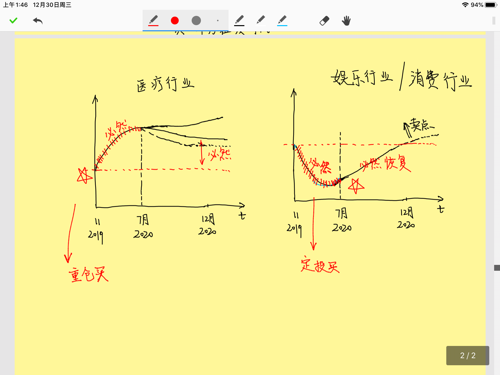
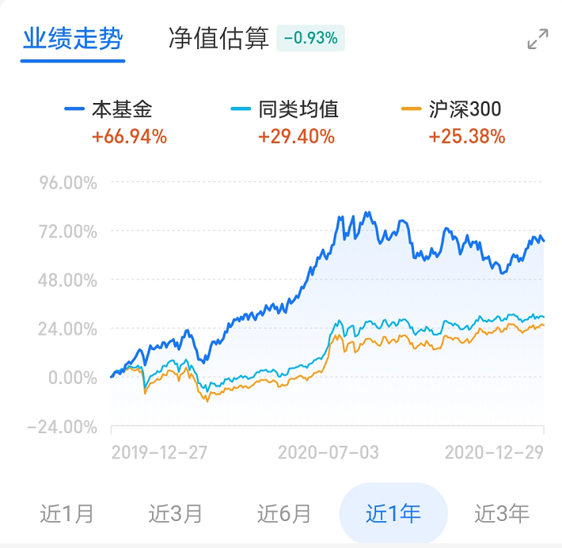
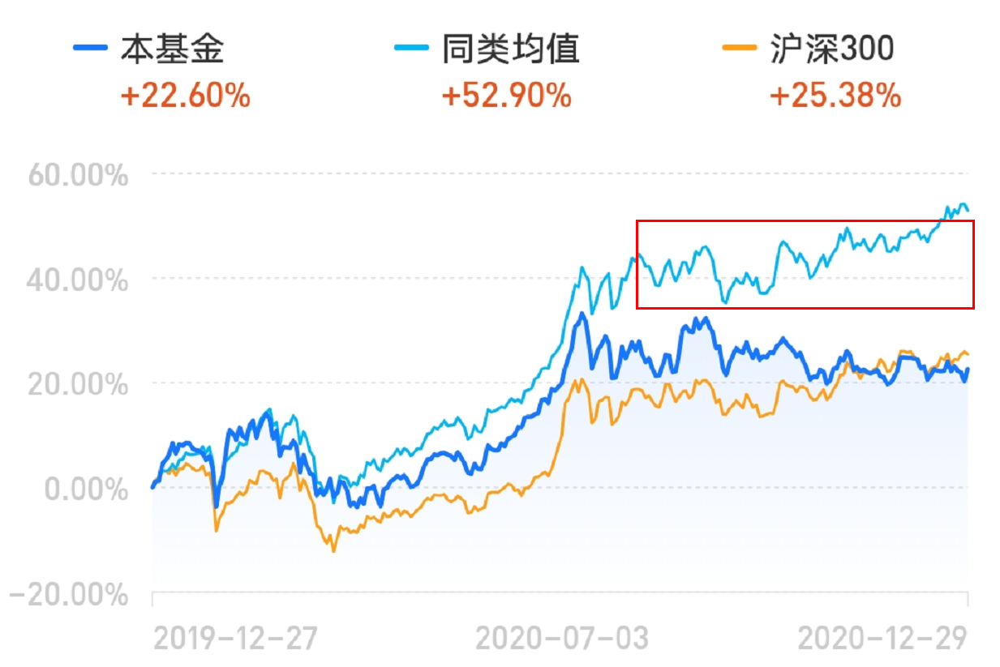
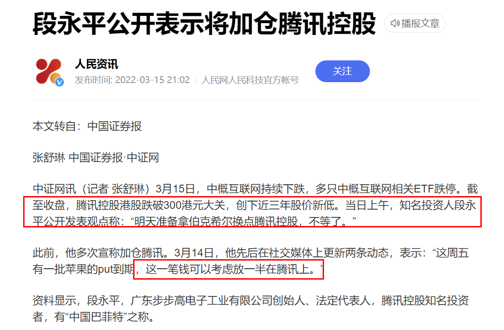
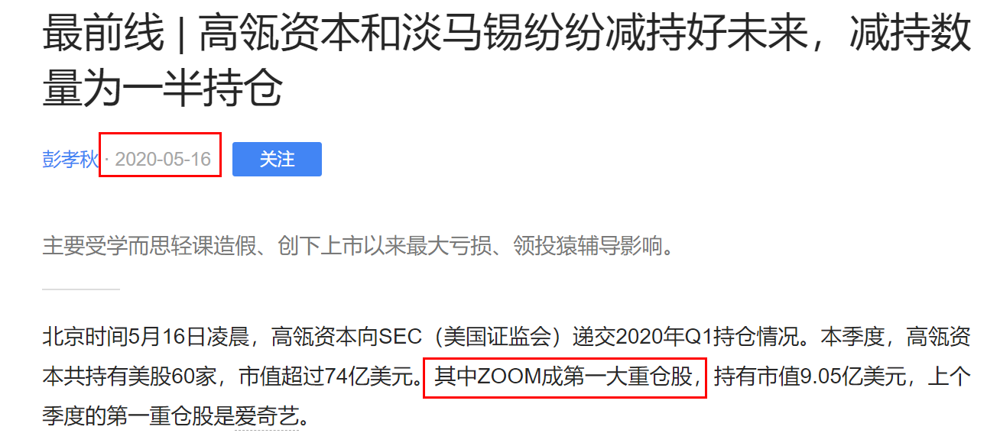
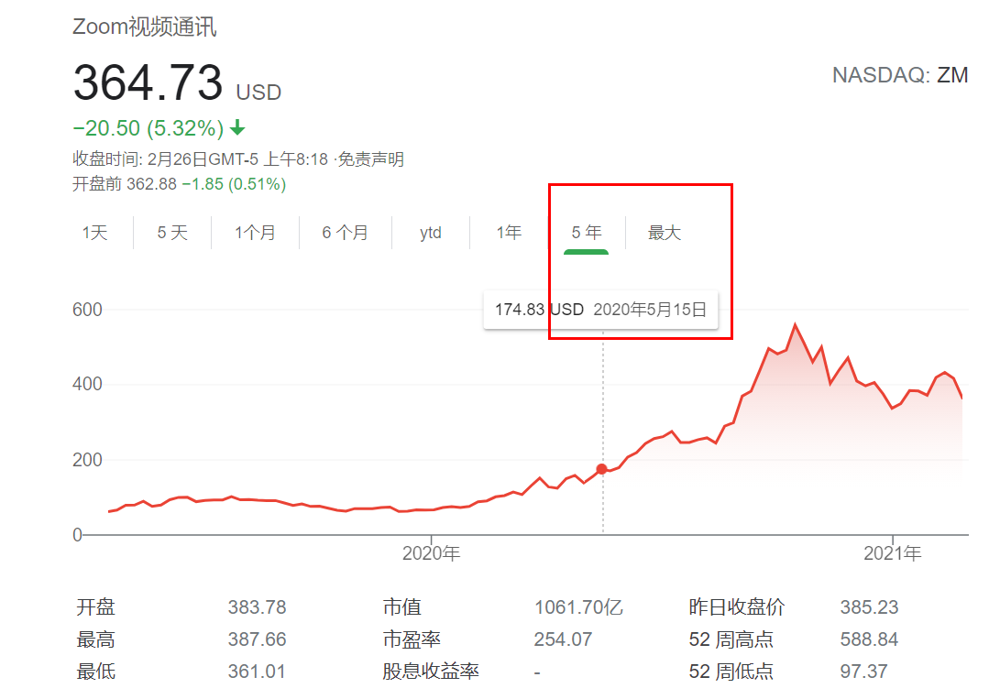
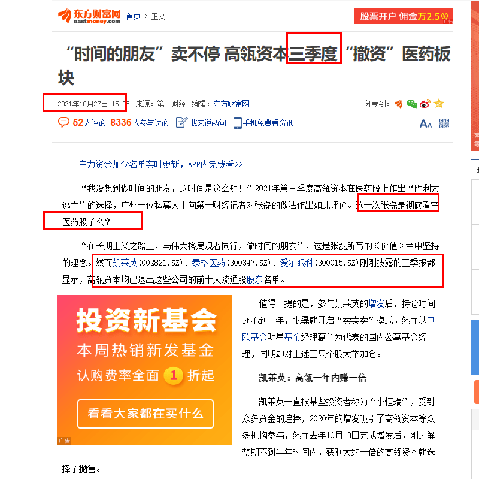

# 投资

## 投资原则：

-1、只相信数学：

用数学投资，把你所有的认知、操作 基于数学

2、找现在不合理，而未来又是必然的

3、有规律，就一定能挣钱：

（1）大A规律：~~大背景是一个长期横盘震荡的市场~~

​                     横盘震荡策略：（1）必须宽指基金（沪深300） ———->  **背后代表着国家意志 + 国家实力**

​                                               注意：一定不能是个股，横盘震荡大背景下，个股受其他因素影响很大（政策影响、疫情影响、公司本身影响）

​                                             （2）低点买入：20%                                      

​                      --------------->  已经验证

（2）美股规律：长期向上

​                        策略：长期持有

​                        最好也是宽指（纳斯达克指数）；个股：特别好的公司，                 

​                      --------------->  已经验证

4、上学和上班是一条狗链子，拴住人的一生，不得动弹，不得自由，不得富贵，不得清闲。      

----------------> **我这一生，最重要的事情:** 破了这条链子

## 常识：

常识：

1、一年挣得钱 = 一年的利润率 * 一年内换手率

所以，短期内的利润率高不可怕，立即还上就行 ——->   **一年的平均利润率很低**

## 网格交易

数学方法 ------> 数学的保证

-前提：

> 一直波动 + 不增长的股市   ------->  A股特别适合
>
> 或者
>
> 单边增长的股市  ------->  美股

实战：

## 任何一件大事情，背后都会有经济活动

------>！！！！（思考自己可以做的事情，大局观，不要隐隐狗狗！！！）

对于大的行业而言--> 看行业线，行业能把握
瘟疫引起的:
增长是好事，萧条更是好事儿
回去画图，推理

小的东西看不到，但是大的东西是必然的，可预测的，所以，一定对大的东西不要麻木

比如，美国大选宣布总统，诺安八个点，这个我遇见了。。。但是没能及时卖掉

认知认知认知

站在2019年11月份，根据瘟疫可以预测：假设疫情时间一年（医疗、娱乐、互联网）

真实的：

娱乐行业：

有几个必然：

1、大的事件必然会引起波动：积极影响的行业、消极影响的行业---> 遇到社会性的大事，一定要与全行业联想

2、对积极影响的行业能赚钱：前期重仓买入 《---- 因为增长是必然的

3、对消极影响的行业，更容易挣钱，更保险 ----> 前期的下降必然的，后期因素消除更是必然，只是时间线有些长！！！！   ，所以长期定投这些行业

后期恢复更是必然！！！！

4、疫情，同样也可以用于买房

## 面向对象的思想：

------>要把所有发生的事情（对象）、与自己（对象）链接！！！！！！

## 区分突发性影响和永久性影响

对于突发性的大事件，如果长期一定会恢复-----> 这种稳赚不赔

永久性影响，比如公司业务逻辑变了-------> 永远不要碰！！！

## 段永平

抄段永平的作业！！！！

----> 3月16号，腾讯股价增长22%

## 倾城

一直预测2022年上半年一直下跌，准确预测到真正的底部，而不是阶段的底部！！！！！！！

2022/5/2: 

赛道股：白酒、医药、权重蓝筹，先涨，后面补跌

区别对待美股与中股1！！！！！

中股票，**所有消息，只是为了解释而找来的消息**！！！！**！涨跌与经济无关！！！！只与资金有关！！（国家放水、主力资金）**

## 林园：

（1）未来30年医疗是主线！！！未来三年（21-24），医疗至少翻一番

（2）买垄断性公司！！！

## 买基金原则，朱少醒：

1、主要看好长期（3-5年以上）历史业绩都不错的基金经理：富国朱少醒、易方达张坤、交银三剑客
2、不要买太多基金：4-10个分散行业
3、长期持有, 三年以上维度！！！！！！！！！！！！！！！！！不适合短线！！！！朱少醒：我们不能买股票，如果你放在三年以上的时间维度，都应该投权益资产，三年以下就比较难说了。(放到10年以上)毫无疑问是权益资产，可以更集中到那种更长期优质的资产，你觉得置信度最好的公司，跟着公司一起慢慢变富。

4、一定要克制人的天性：追涨 + 杀跌！！！！杀跌是大忌!!!!!!!
5、

6，**聪明投资者：你这12年来最赚钱的股票是什么？
　　朱少醒：我平时不怎么看那个东西。**
　　不知道你有没有看过一书上的说法，小孩画画通常有两种完全不同的状态：有的小孩边画边撕，画完就撕；还有的小孩画好了，稍好一些好的保存在那边。可能到最后，所有的画里，画的更好的是前者。投资和这个有点类似。我可能对过去的“亮点”不是特别在意，更多是看过程和未来，我享受过程，在这个过程中，反而有些教训，我会记得更清楚
**从逻辑上看，最赚钱的应该是拿得最久的股票**

12，聪明投资者：你一般会招什么样的人？
　　朱少醒：研究员首先是品性要求，**好的研究员还要独立思考，有开放的心态、很强的好奇心，做事有很强的韧性。智商在这个行业内从来不是瓶颈，做事情的坚韧度和毅力很重要**

**关于卖点：不可控的错误和可控的错误**
　　15，聪明投资者：你怎么判断卖点？
　　朱少醒：成长类投资的卖点，其实是带有艺术成分的，比较难量化、难有明确规则。
　　第一，不断去review原来的投资框架，买入之后，逻辑有没有发生变化。
　　然后，估值有没有达到你的判断，对于成长公司来讲，这方面的权重要稍微低一些，因为犯错概率也挺高的

喜欢纯粹专注把事情做到极致的人
　　29，聪明投资者：海内外，你最欣赏的投资人是谁？
　　朱少醒：对我影响比较深的，是巴菲特和彼得林奇，可能我翻彼得林奇的书比巴菲特多一点，因为他跟我公募的行业属性有关

32，聪明投资者：你的价值观是什么？
　　朱少醒：我没归纳过。我觉得，做投资可能跟做人方式有关，无论是我们公司的Business、还是投资，我都希望看得长远。第二，我比较喜欢能够非常纯粹专注把事情做到极致

35，聪明投资者：有时候热爱它，是因为成功给了你正反馈，会不会也是一种求证陷阱，制约了你尝试新的可能？
　　朱少醒：只是享受成功带来的荣耀，跟热爱不一样。热爱就是你甚至没有看到曙光，老是碰壁，各种怀疑的时候，你觉得我就是喜欢，还能坚持，这才算。

## 巴菲特：

（1）赌指数基金就是赌国运
（2）只有傻子和偏执狂 才去预测市场的顶部和底部（即：方向大致正确！！！！！）不要看一时的涨与跌

价值投资《-------> 找市场中的便宜货（便宜指的是，**价格/真实价值** 低！！！！，不是价格低！！！）

如何找便宜货？

（1）**所有人**都恐慌的时候  ----> 绝大部分声音

## 高瓴

----> 逻辑：为什么要抄高瓴？？？因为高瓴价值投资！！！持有几年，所以季度报告延迟不影响！！！！（所以，林园不适合抄作业！！！）

关注：1、最大重仓股   2、大量新增最大重仓股！！！！3、大量减持
**抓住主次**----> **大量**！！！！！

**减持**的案例：

三季度，即在9月前卖掉的，10月底的新闻

----> 最终可以看出，在9月10月走掉是很好的！！！

为什么要抄袭？？？？因为我们与大机构信息不对称！！！！！！！

## 战争

乌克兰战争，会导致总体下降！！！
-----> 但是，黄金，原油会大涨（**不是石油！！！**）

2022年2月24日15时，据法新社消息，俄罗斯地面部队进入乌克兰。