# 目录

# 开篇宗义

写文字是为了修剪脑袋（释放脑袋）， 同时也是为了修剪笔记本身（提取主次）

------->  所以，最终都是为了遗忘。。。。为了本质与真


希望，你的笔记越记越少


你的**关注点**决定你达到什么样的高度、成为什么样的人（**化简后的点**）


这个世界，存在着太多的噪音（别人的噪音，你自己内心的噪音），阻碍了本质的认识

-------------------->  这也是，非常努力的情况下，没有结果的原因


**规定：**

笔记里任何一句话，不超过十五个字 (多余的以括号形式补充)

------> 以突出核心，增强阅读性


-<font color='red'>生活，是理解抽象的  唯一手段</font>   代码亦如是


人因梦想而伟大，因筑梦而踏实------------->  用热爱，链接索引生活的一切


TODO： 重构你所有的认知，见闻。思想。


我的学习，有两次大的提升。

> 第一次是：总结技巧
>
> 第二次是：总结结构，化简
>


长长的坡，毕生追求：

> 努力活到110岁  
>
> 努力掌握很多智慧的模型    
>
> 努力找一个长的赛道


用结构去化简一切！！！！！！！！！！！！！！！！！！！（眼耳鼻舌身意）

用模型去获得智慧！！！！！！！！！！！！！！！！！！！！！！！！！！！！！！！！！！！！！


如果化简后，只留一个关键词，那便是： 

> <font color='red'> 目标（功能）+ 目标实现的证明（~~即拆解~~）</font>

--------->   本质上，同金字塔原理


# 待整理

```java
技术文章写法（思考方法），向下拆解功能需求（自然）：
1、功能0层（目标） ----> 基于功能0层的功能1层  -----> 结构1层    ---> 基于结构1层的 核心流程 ----> 核心流程中的关键一行代码
          ----> 基于功能0层的结构0层  -----> 结构1层  
		                         ----->  基于结构0层的 核心流程0层
写技术文章或者思考：不是做解答题（代码具体怎么写的），不是手抄作业（记录代码流程、调用栈流程）
              而是证明题（+填空题）：已知功能目标 ---->  证明需要什么结构承载  
本质一点： 基于功能角度，能证明（拆解）出这样的结构吗？（结构为什么是这样？）
                 基于这样的结构，能证明出代码是这样的嘛？

图：
功能0层图、功能1层图
结构0层图、
核心流程0层（主要体现信息流） + 关键一行代码（调用栈），见xuji

关于链接，即向下拆解：
要体现  合理性、自然、不得不、必然性

达到理解力的极限 手段便是证明（道法自然）
例子：基于功能0层 证明 功能1层
    基于功能1层，证明结构1层
	..............
	证明代码的写法


核心路径，一定要成为高频路径

如果只留一个关键词，那便是：  功能（目标）


拆解 = 展开 = 化简

模型是更本质的、更泛化的结构（例子，抛开输入法不谈，一对多问题的解决方案）

<-------化简方向--------
一切的化简，都是基于目的的化简
例子：化简之........


记忆结构是非常愚蠢的（虽然比记忆流程好很多） -----> 仍然是机械记忆！！！！！
只有基于功能，看结构，才有意义

结构是功能的承载。如果不想着功能（目的），结构是没有意义的（没有意义，自然记不住，不深刻）
----------> 检验理解了的标准： 结构是怎样的？
                         基于功能角度，能拆解出这样的结构吗？（结构为什么是这样？）


2、结构-1层（功能-1层图）:
从结构-1层了解：wms这个人为什么会出生？ 为什么需要被出生？ ----> 即功能本身的来源的必然性
即：从-1层来证明 0层功能是必须的，不得不的


同金字塔原理模型的泛化关键：

（1）如何确定谁作为root？ 结论？    功能？？

（2）向下的链接是什么？支持的论据（观点？）    证明不得不？

------------------->  TODO：是不是所有的树形，都能用金字塔原理？？？？？？？？


理解力来源：观察 + 悟


```

## 补充 待整理

对于**小模块（代码阅读层面）**（比如图形的Compositor、WorkspaceScene、EffectsHandlerImpl）：

也要做证明：

> -1层功能  拆解的0层功能  由哪个类/模块（结构）来 承载
>
> 规定：1层结构图，**要标注核心类，承载了哪些功能**

- --------> 自上而下

注意用语：

> EffectsHandlerImp            --------->  修改为     EffectsHandlerImp
>
> （绘制effects）                                                   （承载effects的绘制）

只有自上而下，才有合理性（才自然协调）！！！

自下而上（实际代码阅读）：

代码层面阅读：

> 1、触发流，依赖真实环境的调用栈（一杆到底）
>
> 2、信息流，不一定依赖调用栈（依赖于代码信息传递）
>
> 3、实事流：
>
> ```
> void EffectsHandlerImpl::paintWindow(EffectWindow *w, int mask, const QRegion &region, WindowPaintData &data)
> {
>  if (m_currentPaintWindowIterator != m_activeEffects.constEnd()) {
>      (*m_currentPaintWindowIterator++)->paintWindow(w, mask, region, data); // 实事流
>      --m_currentPaintWindowIterator;
>  } else {
>      m_scene->finalPaintWindow(static_cast<EffectWindowImpl *>(w), mask, region, data); // 触发流
>  }
> }
> ```
>
> 触发流最好用onCreate接口，以区别 实事流

规定：信息流，要基于结构画（触发流，不重要）

学习别人的表达-------思考表达背后的思考逻辑

观察力的手段-----------------差异性：和我的差异在哪里？为什么有这个差异？差异的部分，哪个更合理？？？


## 如何写技术文章

**按功能，**来拆解出几篇文章（文章主体功能）、拆解出文章标题

>   一句话：功能、模块思想
>
>   原则：
>
>   >   1、小功能--小文章 ----小分支（链接到大分支上）
>   >
>   >   ​           简言之，文章之间是，<font color='red'>按照功能拼积木</font>。不是写在一篇文章中的流水线
>   >
>   >   2、不能将 大功能 拼接在 小功能上 ，即<font color='red'> 大功能 不能写在小文章里！</font>
>   >
>   >   3、**千万避免写流水线文章（纵向流程）**， 而是要 <font color='red'>按照模块 功能写文章</font>
>
>   圆角为例子：不能是 流水线。。。以小例子，把整个功能拆散了，尤其是事务的机制
>
>   ​                     也不能把圆角放到《自由窗口》章节去写，应该属于SF特效的章节 ----------> 各司其职，谁是主要承载者，谁来写（其他文章引用）
>
>   按照功能拆： 事务机制（大功能，大文章）---sf执行事务（大功能，大文章）---具体圆角（具体小功能）一行生效代码
>
>   


规定1：

任何一张图：

方向一定要正确（上下左右），**<font color='red'>方向大于天</font>**------------->  不正确的，不看

元素，最好不超过超过5个  ------------>  **超过十个的，只能作为字典(删除、隐藏)**，不能作为记忆

一切为了体现结构：上下左右、主要类（忽略次要类）

-------->  检验标准：用一句话能把结构讲清楚

-------------------> 不利于记忆

规定重中之重：

> 善护念： 要经常保护主要结构(关键流程)   不要被次要的 结构打乱了     -------->  写文章，或者思考时
>
> 具体手段：（1）文章：主要结构  + 其他章节（把所有零散的，放到一起）：
>
> （2）隐藏所有字典
>
> (3)   主次要章节，在标题就做**重要性区分**

规定重中之重plus：

> 化简是人生永恒的主题，也是无时无刻的主题： （就像性能优化之于系统）
>
> 具体手段：
>
> > 删减重复、相似归一、本质模型、一句话总结、自然
> >
> > 观察牛人的文章写法、说话逻辑、如何组织结构的
> >
> > 第一性原理，自己创造出 所有的知识点（知识像呼吸空气一样，不知不觉）

规定2：

> 源码分析的唯一目的：突出主干，突出结构，做好最大化简化（尽可能删除不重要代码）
>
> > 例子：
> >
> > https://blog.csdn.net/tianzhaoai/article/details/128943124?spm=1001.2101.3001.6650.5&utm_medium=distribute.pc_relevant.none-task-blog-2~default~BlogCommendFromBaidu~Rate-5-128943124-blog-136080207.235^v43^pc_blog_bottom_relevance_base7&depth_1-utm_source=distribute.pc_relevant.none-task-blog-2~default~BlogCommendFromBaidu~Rate-5-128943124-blog-136080207.235^v43^pc_blog_bottom_relevance_base7&utm_relevant_index=10#:~:text=流程分析-,源码分析,-ActivityThread.java

规定3：

> 只做证明（即只从上向下，即创造事务）（不是理解事务，不是理解具体，不是从下往上）
>
> 规定3.1：只能用 “承载了....功能”，而不是 “干了什么”             viewRootImpl  承载了哪些功能（承载是静态的）

规定4：

> 给出 //【】关键一行。。。。。。实质做事情的一行代码

规定6:

> 补充  Q & a 章节

TODO：

1、SurfaceFlinger 启动 时，为什么会初始化egl相关的

```java
 // 初始化OpenGL 图形库相关配置
        mEGLDisplay = eglGetDisplay(EGL_DEFAULT_DISPLAY);
```

2、 native window api connect(struct ANativewindow* window）

> https://mp.weixin.qq.com/s?__biz=MzUyMjI5OTU1Ng==&mid=2247484433&idx=1&sn=57e262d2c555e579943e2d4504de2b2c&chksm=f9ccb5dacebb3cccc91fb3c0a785bc0b71ce8a16754de1745005e10a95e34bd1ad6d3e280d63&scene=178&cur_album_id=3231071844901011460#rd


## 杂项

TODO: 

关于高频(非关键)、针对性/关键性 的思考：

比如：

> adb shell dumpsys SurfaceFlinger | grep -A 30 "HWC layers"             A----after


角度之   1层生命周期图


角度之 5w2h（针对于每一个功能点）


角度之 how（谁来承载）

角度之 cpu、gpu层面


damage是窗口级别 client给server。系统级别有吗？


# 思考


## 结构


### 功能与结构

功能是确定的、唯一的、显而易见的

结构是有差异的

结构是功能的承载；功能是结构的目的


-<font color='red'>所以，结构是被证明出来的</font>

### 结构是更本质的东西

任何事物（无论抽象、具象），最重要的是结构。 ~~土木结构，软件结构，人脑结构，思维结构，社会结构，收入结构~~

`1、结构决定功能`

有了结构，功能是自然的事情。（比如，`代码所有类都new出来了，之间的相互功能，以及时序都是自然的`。。。。再比如，排兵布阵好了，怎么工作也是自然的。。。再比如，车能跑，因为圆形轮子结构）物体如此，`代码如此`，社会组织更是如此。

`2、结构决定行为`

A是B的妈妈（家庭结构），所以A抚养B。李yang是杨qichao圈子人，所以，一直重用他。Window 在结构上包含了view体系，所以event最先是流过window，然后到rootView的
再例，屁股（结构）决定脑袋（行为想法）

`3、认知与结构`。认知，主要是认知结构！！！！！每一次对结构的严重冲击是好事。比如盲人摸象

`代码结构`，与代码流程，代码结构是更本质的东西

-------> 推论：1、基于结构，去做一切事情（去理解、去记忆、去认识、去画图、去推导、去设计、去分析原因）

​                             从结构上看问题，从结构上认识问题，从结构上想问题，万物皆结构！！

​                       2、如果出错，一定是结构认识不清

​                       3、时刻提醒自己，从功能、行为去反推 结构，比如：（虽然最初难以，认出结构）

```cpp
行为：一个女人在给一个孩子喂奶  ------>  反推结构： 女人是孩子的母亲
```

--------->  在生活中，人一定是主动反推了结构的。否则：

​        无法理解后面女人给孩子换尿布的行为；

​       无法理解后面女人抱着小孩子逗他玩的行为。


**4、为什么要结构？**看清----记住 -----删减

没有结构，你**不可能看清事务**，尤其是代码（乱糟糟的）

没有结构，你**无法把握关键点**

没有结构，你**无法删减事务**（-------->  从而无法记忆）


> 思考：脑子里，不应该有文字


简之:  

把握<font color='red'>关键</font>行为（喂奶） ---->  反推 结构 （母子关系） ---->  通过结构，去理解/推断其他行为（换尿不湿）

所以，理解代码也是如此： 关键行为---->  反推结构


`4、其次重要的是，重要结构的创建过程`

所有事物都是主干与次要部分。1、2、3不是好的组织方式。包括上面

软件结构要类比具体事物结构，尤其是树。

自然理解一件事情，要忘记一件事情。比如，计算机中如何组织大量数据？树怎么生长和组织了这么多叶子？

理解.....的本质在于理解结构！！！！！（比如代码结构比功能，比时序更本质;  如何有个好绩效？？？？-----> `占据领导心中核心排名`）

如果你下次不理解一些东西，问一问自己，它的结构是什么，你搞清楚了嘛？

记忆更本质的东西

通过琐碎的问题，来看到整个结构。。。。。一定要有很多问题

如果无法组织成体系（内化为一句话），就无法真正驾驭、成为能力
一盘散沙的知识，越多越是祸害。背后的原因就是知识结构（柳冠中说过同样的话：知识是包袱。https://www.bilibili.com/video/BV1Sg411U73L/?spm_id_from=333.337.search-card.all.click  柳冠中《美的竞争力----->  0:49:00位置  TODO: 总结他的方法。记性不好，但是能整合知识。但是能看到本质。）

结构是记忆与理解的锚点！我们记不住行为，从结构的角度记忆行为很好。。。。结构是静态的-----> 更容易记忆

关于**记忆锚点的选择**：记忆锚点尽量选择主结构，原因在于：可以从主结构推导次结构，反之则不行

做加法的同时，为什么要做减法？？？？----> 原因：化简出主干（记忆点）
                                                                          ------> 应用：做笔记，先写，~~再删~~


数学的结构和红楼梦的结构很像------丘成桐

鸡兔同笼问题，数学结构很美妙 -------- 杨振宁

> 前天刷短视频， **一位清华学子问杨振宁：怎么在20——30岁之间尽快找到自己的职业方向？** 杨振宁就举例了一个自己的小故事：小时候，父亲教他「鸡兔同笼」的数学题目，他学得很快；等到他做父亲的时候，他也教他的孩子「 鸡兔同笼」，孩子学得也很快。但唯一不同的就是：一年后，他的孩子已经完全不记得这些东西了，就好像从没学过一样，而他一直还记得。
>
> **杨振宁总结到：这不是训练出来的，就是自己天生对于数学结构的喜欢。一个人如果能够很早知道他对哪个方向是特别接近，这就有很大的好处， **或许就是未来值得去发展的方向。   你有天生的对于某些东西的「偏爱」，且对于「偏爱」能够加以训练和培养，就是人生重要的事业线。


### 结构之-------主次

主次是贯穿于任何事情的！！！！！（要有这个意识） **抓住了主次，人生便有了锚**
主要问题、主要矛盾、主要作业、主要流程

-**<font color='red'>任何事情，任何事物</font>**，都要问一句，1、结构是怎样的？？问一句，2、主次是怎样的？？？ <font color='red'>尤其是抽象的事情</font> -----> 比如，代码最主干的逻辑，买房子最主要的几个目的

**执行**：当分清了事物的主次，<font color='red'>选两个以内（很多情况下，只能保证一个！！！！！！）</font>的主次，保证这两个主要的事情达到目标即可，不管其他细节，最好不完美（这样证明两个主要的目标保证了）

例子1：买房的主次是什么？---> 增值+学区是首要的！！！！！

​           买合肥房子最大的失误是什么？**省政府南迁**，比地铁是主

​          上海房子没有学区，原因：那段时间学区房大降，学区政策还没定下来

例子2：每天干的事情的主次是啥？**完成某一部分代码**  不能因为修补房子，干了一天，恋于修正房子

例子3：简单粗暴往往很有效，比细致分析  ------> 抓住主
例子4：代数中，很多个参数，可以组成一个特征量？

例子5：对于软件，软件架构+关键流程是主、骨架  ，代码是次、肉。
               此外，软件的主和次是依附的关系，所以，软件应该很容易


**思想：**人对万事万物都要讲究主次（否则我们没法认识事物的），上帝也一样（泰勒展开）

**抓不住主次的后果：**

做事，越做越错。比如买房

学习，越学越糊涂。比如看代码，陷入细节，不能自拔


主次应用：

> 1、断舍离
>
> 2、舍次要：把生活中的繁杂外包出去（保姆、洗衣服用洗衣机、吃饭外卖）
>
> 
>
> 
>
> **抖音 参哥，创业相关：**
>
> 1、不要被 **有价值的** 垃圾束缚住 --------->  次要东西要舍弃
>
> 2、在一个屎一样的赛道竞争（仅限于创业？），只能获得一坨屎   ---------->   因为主是塞到
>
> 3、越聪明的人越简单（即：考虑的越复杂，这个人越蠢）  ------->   创业如此、生活如此、学习也如此
>
> 4、确认一个项目是不是好的项目：只要看这个领域是否有人赚钱了
>
> ​      ---------->  不要去分析，因为客观因素太多了，无穷无尽
>
> 5、如何成功？-------->  抄。简简单单，且容易成功
>
> ​     ---------->  这个就是模板的作用  +  复制思想
>
> 6、君子不利于危墙之下
>
> 7、一个人最大的难点在于，知道自己的边界在哪里？？？


### 结构之-------锚

很多时候，主次可以提现锚


### 认识结构的工具

如何认识结构？如何区别结构的主次？如何避免分析过程中的遗忘甚至颠倒主次？

思维导图

### 结构之-------化简

人不可能理解、记忆复杂的东西：
唯有  折叠/化简  展开（链接）

一个普通结构，人

-<a id='chouxiang'><font color='red'>**只有具体才能理解，只有抽象才能记忆**</font></a>
-<font color='red'>规定</font>：任何抽象（抽象结论），下面要有例子；  任何一个典型例子，要总结其抽象  ---> 使用于理解、记忆、记笔记


太阳底下无新鲜事情------->  所以，发明是抽象在具体中迁移

​                                               比喻也是


化简的极致/抽象的极致，应该是忘记
过河弃伐


<font color='red'>最彻底的化简，是证明</font>  （无需任何记忆了）


### 结构之 -------------标签（**化简的利器**）

-<font color='red'>在结构上标签化   是一种非常符合人脑的化简，自然的化简方法</font>

**TODO: 可能是唯一认识事物的方法**

例1：

> 这个人很美、很勤快、很有天赋、很努力、很man。。。。。。

例2：标签化整个显示过程：

> ```java
> 显示----测量
>           布局
>           layout
>           draw ---- render
>                      送显
>         
> ```
>
> 
>
> ------------>  (1) 结构上的：显示是整体；测量、布局是view层次的；render & 送显  是buffer层次的 
>
> ​                  (2) 标签化：流程用词汇替代

例3：

> **<font color='red'>写文章也要标签化</font>** -------->  人是无法记忆与理解长篇大论的
>
> 比如：例1、例2、例3


关于标签的写法：

> <font color='red'>目标/功能 --------标签名</font>，例如：
>
> 获取真实尺寸----------测量
>
> 


## 结构应用----之思想结构

应用层思想：技巧集（说话技巧），方法集、工具集、思想工具集（比如比喻、先假设）

中层思想：本质、思想集（解耦思想、正反馈机制思想）

底层思想：自然法则集、必然性


上下关系（`如类继承一样`）：
      1、越是底层： 通用性越好，越抽象（越能涵盖更多）、个数越少

​        越是顶层：通用性差，针对性好

​     2、下是上的支撑逻辑（抽象），上是下的具体（应用）

​    3、形成过程：上层抽象形成下层，下层指导上层具体实践


比如：


`能让你眼前一亮，或者是好用的工具/方法，背后一定存在着好的抽象、好的自然法则` ----> 注意总结


## 抽象与具体

### 抽象是个骗子

**1、要十分警惕抽象，因为抽象是极具欺骗性的。**   

--->   比如，安卓调的。`让我们以为自己懂了，骗了自己`：安卓的什么调的？时机是什么？为什么会调？从整个流程来看，调用的不得不在哪里？


所以，一定要 防止被骗

**2、抽象具有模糊性。**

 比如：**兴趣**是最好的老师，每个人都知道，但是99%的人仍然学不好。---------->  问题出在哪里？   兴趣如何理解？具体包括？获取兴趣的具体步骤是啥？ **一个“兴趣”词语，毁掉一个智慧真理，障碍了人心**

比如：文字本身就是抽象，就非常具有模糊性。。。。一个人可以洋洋洒洒说一万字，可是空无一物

比如：大家都一直说，看问题要抓本质。但是很多时候，`仅仅停留在本质这个词上，不得进一步`


正因为 抽象具有模糊性，所以，不同人对抽象的不同理解与实践，早就了不同的认知水平、人生：

比如：

​        科学家眼里的 “为人民服务” ------->  具体理解：一生奉献在事业上，死在事业上的勇气

​            正课眼里的“ .....................”    ------->  具体理解：口号，话术

​        普通人，，，，，，


推论：

> 想打马虎眼，可以说一些抽象、大的话


###  抽象 是圭臬，是化简的有利工具

**3、要奉 抽象 为圭臬，因为 抽象才能升华、才能无招胜有招（举一反十）、才能举重若轻、才能轻松。** TODO: 例子：

才能化简


-<font color='red'>你的抽象能力（化简能力），决定你能cover多少事情（知识、能力）！！！！！</font>

------------->   学过之后，达到自然状态，然后忘记


### 抽象与具体，两条腿走路才能走远

 **只有具体才能理解，只有抽象才能记忆** [ 见下](#chouxiang)         


**<font color='red'>只有抽象才能演绎（指导）， 只有具体才能执行</font>： **
比如知道  兴趣是最好的老师，都说烂了。但问题在于，如何找到`具体路径`让学生感兴趣、甚至沉迷呢？`而不仅仅是念叨要 有兴趣、要专注..........`
--->  具体：正反馈，及时反馈。 
--->  再具体：[见下](#jishifan)


-<font color='red'>如何让好的抽象发挥作用呢？</font>TODO
`规定：`

（1）所有的知识、结论、尤其真知灼见、至理名言，必须  <font color='red'>抽象-具体的步骤（具象）</font>  两方面来看

（2）抽象 -----具体 之间，给出走向具体的角度-------工具：5w2h分析工具

（3）很多时候，问题出在：意识中，以为是具体，实际上是抽象

​           ---------->   办法： 任何时候，用5w2h去检验？

​     


比如： 
结论之后（抽象），必举例子（具体）
李氏替换原则（抽象），设计模式（具体）
设计模式（抽象），具体安卓代码应用（具体）
兴趣是最好的老师（抽象），兴趣点是啥？培养步骤是啥？执行步骤是啥？（具体）
上山是抽象，`选哪一条路、骑车上  是具体 （5why2How）`

与别人沟通时，说了一个概念（抽象），具体这个概念的具体事情（具体）：只有说到具体，别人才能理解

与自己沟通时，比如要提高 沟通能力（抽象）: 从哪些方面？框架有哪些？有哪些技巧？什么时候说什么话？ （具体）

写技术文章时，自己经常性的提示词  “本质”，但是你写出来的东西，真的就能体现本质嘛？

> 5w2h：
>
> what：本质从整体上<font color='red'>规定事物的性质</font>及其基本发展方向，本质由事物[内部矛盾](https://baike.baidu.com/item/内部矛盾/3431186?fromModule=lemma_inlink)构成，是比较单一、<font color='red'>稳定不变</font>、深刻的东西，靠思维才能把握
>
> how:     如何找到那么几十万行代码的本质？  
>
> ​              **规定了事物的性质**  的角度： 一行关键代码 通知bindService以及拿到 对方Binder ，可以利用service了  ----------> 关键函数就一行
>
> ​              **稳定不变**的角度：要利用别人的服务， `任何语言，任何代码，任何系统，甚至是生活`（拿到别人号码），都必然如此
>
> ​              深刻：体现了模型。拿到你的东西，才能利用你
>
> where：Binder处于哪个线程？（一次binder，切换了很多线程，还有内核）
>
> ​              Binder 在安卓系统整体框架的位置（java-native-内核都有）
>
> ​              Binder在...................................地位
>
> why： 不得不的： 各种通信方式，只有binder安全，又效率高
>
> how:   Binder 的机制


### 应用：学习之抽象 与 具象

TODO: 总结


### 工具：拆解抽象-----具体到数字

为了避免抽象欺骗我们（被自己骗）、必须学会拆解抽象，做一个高能量的人：

1、拆解高能量：

（1）睡眠上 ：多少小时、什么时间睡  （2）身体锻炼上：多久跑一次步   （3）说话语气上：要有激情----五米以外要能听见  （4）心态上：挑战高难度任务

2、拿纸，记录上面每一条 ----->  每天看，并执行

### 悟--------在抽象与具象 之间，不断循环，反复横跳

比如：    学习方法论的   [《简--繁 的无限循环》 ](https://kenttj.github.io/markdownbook/Naturalaw/ReadingAndThinking.html#%E7%AE%80--%E7%B9%81-%E7%9A%84%E6%97%A0%E9%99%90%E5%BE%AA%E7%8E%AF%EF%BC%9A:~:text=6.1.1.-,%E7%AE%80%2D%2D%E7%B9%81%20%E7%9A%84%E6%97%A0%E9%99%90%E5%BE%AA%E7%8E%AF,-%EF%BC%9A)
比如：  泛化、延拓


在抽象与具象 之间，不断循环，反复横跳 -----------> 应用于任何思想、脑力的东西！！！！

>   人如导管，不留一物
>
>   代码如导管，不留一行
>
>   知识如导管，不留一物
>
>   贪嗔痴，不留一物


## 时间性/周期性

忽略了时间性/周期性。。。。很重要：

1、万物都存在时间性  

2、此时良药，他时砒霜 

3、个人是依附于大周期而生存。大于大周期，于个人而言，无意义


李嘉诚：只有盈利的生意，没有永远的生意  ---------------> 所以，要比别人知道下一个获利的生意是啥？


## 思考模式、驱动模式

对于重要的事情，持续问问题 ------->作为课题
然后`写出答案`（只有纸面上，才能在脑中成体系，才能清晰）


## 思想工具：

checkList：为什么难的事情，坚持不了，简单的事情，也坚持不下来？
---->  1、大量简单的事情，如同满地珠子，总有很多会被遗忘 。**利器：简短的checkList，周期性看**    **checkList是一根线，看似没价值，但是保证所有珠子都在思想的线上**


### 如何深刻？

深刻是抽象的东西

规定：对重要的东西
1、了解怎么用
2、了解背后的东西（背后的原理）
3、理解背后的**自然法则**…（出去自然，别无他物）：为什么记不住？ 因为你感悟的深度不够，以至于理解上不自然—————-----> 适用于一切

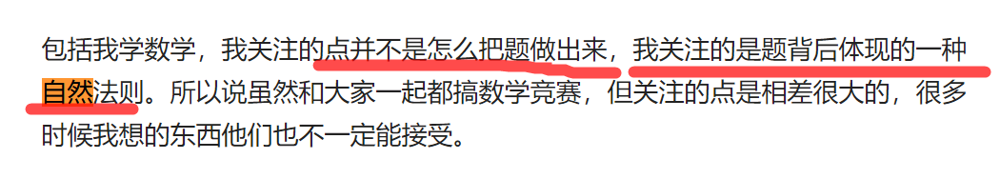

https://baijiahao.baidu.com/s?id=1743010636038377873&wfr=spider&for=pc


规定：对重要的东西，必须给出背后的`自然法则`，并写出来


### 第一性原理


### 背后的背后、原理的原理

#### 应用一：成瘾机制分析

比如： 这么多年，

|                                      |                           成瘾的点                           |      |
| :----------------------------------- | :----------------------------------------------------------: | ---- |
| 喜欢养鸟、造鸟笼                     | 幻想：幻想人鸟和谐、给鸟一个可爱的家，幻想以后老鸟可以下蛋、养小鸟  <br /> 视觉激励：看到鸟很开心<br />听觉激励：鸟的叫声很悦耳 |      |
| 迷恋于刷墙、迷恋于修家里的坏了的东西 | 幻想： 家，更趋于完美 ；妻子看了很高兴。      <br />视觉激励：把破损的墙刷白，修复，看上去很有成就感 |      |
| 痴迷于刷抖音，可以连续刷一天         |              视觉激励：美女<br />无穷性：新鲜感              |      |
| 可以吃东西，吃到发胀还想吃           |                  味觉激励<br />触发了动物性                  |      |
| 痴迷于黄色网站                       | 幻想：<br />视觉激励：美女<br />无穷性：新鲜感<br />触发了动物性 |      |
|                                      |                                                              |      |


-------->  共同点：  
不难：难会产生痛苦、会有意志力消耗
完成前的幻想
完成后的奖励
`无穷性：给予无穷的新鲜感`。<font color='red'>这是 永动 的动力</font>
              很显然：养鸟做不到、刷墙做不到 ---->  一定会造成后期的厌倦
触发的越底层，越自然，越容易成瘾：动物性（生理性）----->  人性 ----->  社会性      


### 思想之  证明

-<font color='red'>证明是彻底的理解</font> 

>   1、因为无需掺杂任何记忆------------**记忆是不可靠、不可信、不自然的**
>
>   2、<font color='red'>证明是彻底的自然、彻底的本原</font>
>
>   3、**证明是彻底的化简**。。。对于代码来说，已经证明一定是这样，就不需要记忆代码了

规定：

>   余生只做 证明

**证明 = 不得不**

例子：

>   解答的数学思路，做到不得不是这样的，就到家了   ---------> 柳智宇
>
>   代码架构，不得不是这样的
>
>   代码的每一个行，每一个函数功能，不得不是这样的


#tags


为什么绝大部分人能忍受干苦力活、在烈日下暴晒，却忍受不了学习的苦呢？
---------->  这其实是很自然的：
原因：
（1）干苦力：有及时激励（每天的工钱、又有新的墙被刷完，可见性）--->  不会枯燥
（2）学习知识，没有及时的奖励  ------->   这就极度极度的枯燥，像是在沙漠里行走，满眼枯燥
                            难的东西，一直不理解  -------->  痛苦


角度：
背后---------使用（更好的）
背后的背后—-------使用（这种才是可迁移的、跨项目的，甚至跨语言的使用）

因为：背后的背后，一定是底层的、通用的思想和架构，比如，消息屏障是背后。背后的背后，就是消息屏障原理的设计初衷、设计思想，即消息屏障背后的模型，以及。这种就可以移到 新的项目上（新项目肯定是没有handler了的）
背后的背后，相关问题：
原理为什么要这样设计？有没有不得不
你能想出其他设计嘛？你怎么样才能想出其他原理？可不可以那样设计？
哪一种设计是最好的？


了解了背后（原理），可以更好使用工具；了解了背后的背后（原理为什么是这样设计的出来的），可以更好的创造工具
如一级指针可以改变 值
二级指针可以改变一级指针的值一样

TODO：
你问得问题和思想，都是有层次的


#### <a id='chengyin'>学习知识 如何成瘾？</a>


可迁移的机制： ---->  多研究

> 嗑瓜子理论（https://wiki.mbalib.com/wiki/%E7%93%9C%E5%AD%90%E7%90%86%E8%AE%BA）
> 游戏理论 


成瘾的**根本原因**是：有一套反馈机制在里面 ------> 正反馈机制、及时反馈 

​                                    反馈机制做了哪些事情：1、修正  2、奖励

-<font color='red'>及时的奖励机制</font>


学习很难像游戏一样搭建奖励机制的原因在于：
1、学习带来的反馈是延时的，`很难及时`，比如背诵一个单词，猴年马月才能用上，才能体现在分数或生活中

2、学习带来的奖励也`很难量化`    ---->    比如背诵一个单词，只是`结果上`多背了一个单词。`在激励上，多了多少？对英语提升影响多大？？`

3、游戏的`激励更为直观`：成功闯关，此成就只有20%的玩家获得。鲜花、排行榜、音效


  <a id='jishifan'>TODO:我搭建的及时激励有:</a>

> 1、数“技巧”个数（越多，我越离厉害更进一步 ）
>
> 2、0层图的个数，简洁程度
>
> 3、不得不的 “锚点”个数
>
> 4、方法集元素个数
>
> 5、本质的个数
>
> 6、美感、**譬喻、比喻**个数
>
> 7、<font color='red'>兴奋点、关注点：</font>得到了新的思想工具，思想世界又丰富了  ---->   思想世界  与 物质世界：**获得思想世界新的东西，让我亢奋，比物质世界里买新东西还亢奋**
>
> 刷抖音，让我痛苦，我搜集不到好的 思想、思想工具。反而让 思想世界凌乱
>
> 8、有多少个  “无招胜有招”  ----->  决定你的lever
>
> 9、有多少个  “不得不”
>
> 10、多少个自然
>
> 成为熟悉安卓架构的少有的前百分之20%


幻想： 成为专家之后，年薪百万，然后住豪宅，给家里人都买保险。后半生便无忧了
           幻想自己成为专家后的自信。理解深刻后的喜悦


注意：
1、及时激励应该是知识本身，或者知识相关。`不应该是：  激励是一个礼物、一块糖`

2、专注（过于抽象）只是奖励的副产品


弄懂复杂的物理知识，就像生理上的射精------蔡志忠

----------->   


#### 成瘾机制的消除

你喜欢刷墙，有很强烈的意愿去 看到墙刷完后的效果


### 描述事物的工具--------SCQA模型

```
S（Situation）情景

——由大家都熟悉的情景、事实引入。

C（Complication）冲突

——实际情况往往和我们的要求有冲突。

Q（Question）疑问

——怎么办？

A（Answer）回答
```

SCQA模型是一个“结构化表达”工具。`所以，写技术文档，也可以从这些角度进行阐述`


### 描述事物的工具--------5W2H

5W2H是描述事情的全面性，时间、地点、人物、原因、过程、结果。

```java
案例2：设计一款app的调查问卷，你会如何设计调查问卷上的问题？

what(做什么)：你用这款app做什么事情？

when（何时）：你通常在什么时间使用这款app？

where（何地）：你会在什么场景使用它？

why（为什么）：你为什么选择这款app？

who（是谁）：如果你觉得你喜欢这个产品，你会推荐给谁？

how （怎么做）：你觉得我们需要什么功能才是比较新颖的？

how much（多少钱）：如果你认为这是个对你有帮助的APP，你会花什么价格去购买app里的服务？
```


### 追问问题的根本原因------5Why


### 思想工具之 复利/复制/继承性

快速复制是一个极大的利器（不需要完全从0到1，再困难的来一遍）


例子：

1、人类与动物最大的区别不是  发明和使用工具，而是语言。--------------《时间简史-----> 

原因在于：

> 语言，让知识和经验，可以在 人与人、人与人类幼崽之间快速 复制、继承    ------>  人类升级可以利用软件升级
>
> 动物的升级只能靠既然选择，然后刻在基因里 ------>  动物的升级是硬件升级，周期千万年

2、站在巨人肩膀上 ----- 牛顿


IT为啥可以垄断，形成巨大财富？

原因：

快速的复制性，一份代码，可以马上在几亿台设备运行 -----> 突破了时间、地点、材料的限制


抖音上主播卖货：

1、原来面向一个客户，复制成面向亿万客户

2、如何写文案？别人十万点赞的文案，拿过来，改一改，便轻轻松松1万  ---->  复制的威力(抄)

​      看到谁就抄谁！！

3、 抖音参哥： 

​       做生意，千万不要做一个匠人（深耕一个领域）！！反匠人精神！！---------->  90%的生意都有周期性，比如钢材生意，就几年

​      而是要利用复制的威力！！！！

举例子：

> 觉得工厂比较有技术、自己做的二十年产品有价值
>
> -----------> 实际上这些都是脏活、累活、不出成绩的活。。。关键每有垄断性，可以找到任意的工厂买
>
> ​           有这个精力，可以多开几家淘宝店


复制要做到：

> 1、低成本
>
> 2、快速


规定：

> 重要的事情，难的事情，一定要做到可复制/可继承
>
> list：  docker环境、aosp代码注释


### 思想之化简


#### 为什么要化简

人不可能理解复杂东西

人不可能记忆复杂东西

人不可能执行复杂的东西（多次）：

> 多次执行一个复杂东西，耗时耗力--------->  人的意志力多宝贵

人不可能关注复杂的东西：

>  重要的事情只有一个，所以不可能分心


------------>**化简是我们终生的课题，甚至是时刻的课题**

从目的论的角度： 化简，让目的更加清晰


#### 如何化简？

化简的具体目标是什么？化简的具体工具是什么？


化简具体工具：

1、提取重复

> 比如重构函数，提取重复；
>
> 比如 把常见的要做的脚本(电脑启动时，启动多个软件)，多个封装到一个脚本中  my_start
>
> 比如：把一个成功的商业模式疯狂复制

2、上面的复制思想

> 比如：你会了一件事情之后，就可以不做了。教会别人，让别人做

3、 代码化简-----见how......  ----------->  是不是可以应用到生活？


#### 一些好的化简的例子

例子1： 代码化简-----见how......

例子2：**软件结构、行文结构，如下**

key1 ------->  key2 ------->  key3 ------->  key4.........

  |
  |

具体。。


关注点在key上。。。。。。然后对每个key展开

key常常是目的


#### 生活、记忆化简之  合并同类项

比如：
记忆adb命令：  刚开始记忆很多很多adb命令  ----> 记忆有哪些key(录屏、滑动)  ----->  类似的操作放一起后，只需要记忆 屏幕相关、手势相关、app相关（<font color='red'>最终只需要记忆三个名词</font>）


### 化简推论：重要的只有一个

重要的事情只有一件、重要的代码只有一行、重要的笔记只有有一句话

----->  理解程度的衡量标准


### 这世间最不可靠的就是意志力

比如：励志、发誓、承诺、高三打鸡血熬夜学习、纵欲、身处

为什么？因为都基于意志力，人的意志力是非常稀缺的，一消耗就没了


所以：

> **1、一切靠意志力的东西，都是非常不可靠的：绝不相信**


相对可靠的有：

> 固定的流程、规章制度、法律------------->  好的约束
>
> 好的周围环境
>
> 自身：提高精神力（身体、脑力）


### 分析人的三模型

信息模型、认知模型、执行模型

（输入）  （function） （输出）


任何一个复杂系统也这样分析


TODO: 

人生模型之 执行模型   -----> 一定要 目标感很强 。<font color='red'>技巧：</font>

> ​	TODOList：
>
> 月度-周-日


#### 执行模型

关于动力、关于阻力


## 技巧

取其神，忘其形   ------->   真传一句话，假传万卷书

如何识别形，又如何提取神？


技巧，比热情重要，热情会消散。而技巧不会


## 生活化模型----理解、记忆的利器

生活化模型的<font color='red'>本质</font>：将新知识类比桥接到旧的已经获得的知识体系上。。。以已知链接未知。。。。

生活化模型，是学习新知识、记忆新知识点<font color='red'>极大的利器</font>
任何一个知识点（尤其代码调用流程），给出生活中的类比、或者形象化
比如：费曼的恐龙多高多大，三层楼高但是头进不来 不用担心
比如 ：输入法imm、imms、ims 媒婆相亲
比如：looper线程，驴拉磨
比如：APP启动，皇子继承皇位模型


为什么能这样做？
太阳底下没有新鲜事

为什么要这样做？
1、得到不得不，得到自然  
2、也是<font color='red'>可复制思想</font>的要求。讲旧知识复制到新知识上，这样减少消耗
3、也是<font color='red'>合理性思想</font>的要求。**如果找不到生活化模型，必然不合理**

记忆，在于形象化、生活化、具体化

尤其代码调用流程，其实是模块调用流程更合适，（我记不住步数太多的流程。。。子系统内部不适用？），流程生活化，极大提高记忆力
大的流程，编生活模型故事，理解本质。。。。。。之后小流程、内部流程、细节由  大的流程  <font color='red'>撑起来</font> （不得不）


注意：

-<font color='red'>基于模型，去记忆代码。</font>   而不是根据代码记模型

·

## 结构类比之  人就是计算机

把人 类比于计算机 --------->  **计算机的问题，用人的方法解决；人的问题，用计算机方式来解决**

1、<font color='red'>人 和计算机一样</font>，都是  事件驱动：

> 安卓主线程有个handler（queue列表）处理事件；分重要性：消息屏障机制
>
> 人要有：时光序、桌面日历； 分重要性：重要不紧急

2、`人 和计算机一样`，都需要监控进程（杀毒软件、监控计算机运行状态），

> 计算机：360、鲁大师；安卓：**防止自启动软件**
>
> 人： 人也要<font color='red'>有一套觉悟进程，独立于人，观察人的思想、行为</font>： 比如，淫欲心起、食欲心起，一念起，即可察觉，然后熄灭
>
> ​        <font color='red'> 觉察、觉察、觉察!!!</font>

3、`人 和计算机一样`，需要稳定性：

计算机：程序，尤其操作系统，需要稳定，长期而不出错  ------>  方法：找出稳定性报错，逐渐修改逐渐完善

人：情绪要稳定  ------>  方法：找出情绪不稳定性，逐渐修改逐渐完善

4、`人 和计算机一样`，需要好的CPU：


5、`人 和计算机一样`，需要大的内存：

方法：脑袋内存不够------> <font color='red'>人借用笔记，作为脑子的内存（</font>要点：笔记要非常快能所引到）


6、`人 和计算机一样`，快速搜索用map：

人脑:   (1)快速搜索，用的是关键词

​          (2)喜欢贴标签（本质就是关键词）：好的、坏的、有能力的

7、`人 和计算机一样`，大量搜索、记忆用树结构：


8、用计算机，重构人整个系统

比如： 认知系统、运算系统、察觉系统、执行系统


## 人生架构

身体 > 脑子 >

关系：身体会影响脑子

坐久了，会影响思维
思考久了，容易睡不着 ----> 利用身体运动反作用


## 分析、理解、记忆的工具----目的论

<font color='red'>**目的论：目标---出发----不得不：**</font>

> 锚：出发点（触发点）------------目标
>
> 由此<font color='red'> 过程就是不得不的了</font>：~~~因为目标是，所以，第一步；因为目标是，所以，第二步~~


**基于锚，我们体会到了 每一步的 不得不，对事物的理解就到家了**，
自然， <font color='red'>分析</font>比较透彻了（因为证明了不得不）
         理解的深刻了
         过程不得不，只需记忆锚就好（自然是记忆的好工具）

推论：

> 1、合理性分析：也是这个方法的应用，即  针对于目标，该步骤的合理性在哪里？
>
> 2、生活也要如此，当我们处在 漫长的过程中，一定想一想，当下的操作，对于出发点  和  目标是必要的嘛？？ ------>  我们经常会忘记目标，而且目标不停摆动
>
> 3、不得不 与 费曼技巧（创造知识）说的是一个东西。
>     <font color='red'> 区别在于</font>：    不得不  似乎对已有的事物没有完全瓦解，只是对已有事物证明其合理性------------>   应用在对已有知识 不太熟悉的情况下？
>
> ​                            创造知识   要求完全瓦解                                                                                -------------->  对熟知的事物，从0开始，似乎更彻底


从更高层次上看， <font color='red'> 证明 不得不</font>      是化简的极大利器，是理解的极大利器，更是记忆的极大利器 

​                               目的论分析  是  合理性(自然)   的有利工具（有了自然，就不需要记忆了）


TODO: 
从不得不角度，
代码 跟数学好像---------- 把一道题（不一定是证明题）的解答<font color='red'>步骤</font>，做到不得不，就完全理解了
生活也是如此------------炒菜有很多步骤，但最合理的只有一个（比如，买菜的时机是你想出去溜达的时候，吵豇豆前要先煮一下才软，<font color='red'>这些都是合理性上的不得不</font>），把步骤想到不得不的时候，你就完全理解炒菜了，也不需要记忆了

所以，不得不   是  理解 <font color='red'> 多个步骤、流程性  </font>东西的 利器？？？？？？

​    


TODO:
背后的背后：
-<font color='red'>思考角度|关注的点，如此的重要</font>
  ----------->    可以将三件完全不相关的领域   一剑串起（某一角度）

  ----------->     **一个角度，决定着 某一领域的 修为**。。。。这也是真传一句话的原因


TODO:

把  不得不  用在 任何事、任何时  上？？？？？？似乎只能是流程性的


### 写技术文章（流程性）的结构一

也按照上述思路


规定： 行文格式

大的锚（目标-------触发点）
        阶段性1的锚（目标1------触发点1）

​	                  非常小的目的-----小的触发点-----小的不得不

​		阶段性2的锚（目标2-------触发点2）  

例子：比如目的是打开SSH开关  ---------> **这是你的关注点，也是写文章的锚点**
            具体怎么打开，不要关心


规定：  <font color='red'>在过程中，</font>一直问自己：   目标是啥？  （触发点是啥？）

## 写技术文章的结构二

1. 1. 0层，必须有锚点
   2. 其他目录是流程目录：大目录之间是流程，小目录间也是
      -----> <font color='red'> 目录相当于函数调用（关键的）</font>
2. 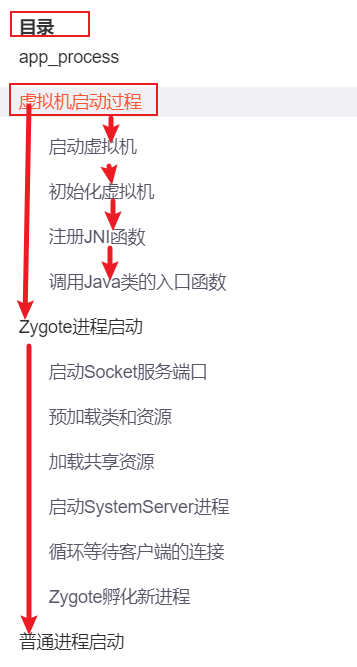
3. 必须有总结
4. 引用只能引用总结
5. 0层图有0层图大总结
6. 各个小流程里，有小节的总结

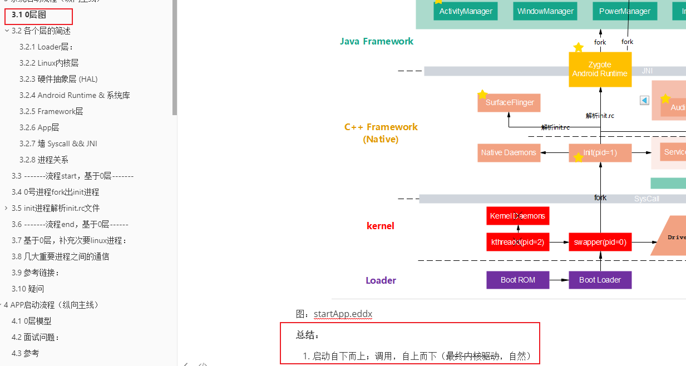


## 结构的收集

结构的收集：

> 水平时间线（鱼骨线，主题-------主题------主题）-----------------核心是一条线
>
> 树------------------核心是树根
>
> 链表------------------核心是头节点（一法通万法的根本就在这里，一法为根）
>
> 多线程的结构---------------排队

最强的创新永远是结构上的创新。。。最强的性能优化，永远是结构上的优化

大破大立


## 结构之  “一”

> 重要的只有一个。
>
> 人的关注点永远也只有一个
>
> ----------->  集中一段长时间只学习一样东西，才能学好


-<font color='red'>"一" 是结构中的结构</font>： 一生二二生三三生万物 道法自然 


如何识别一呢？从结构上看

> 是树的根
>
> 是链表的第一个节点
>
> 是鱼骨图的鱼骨

什么人做什么事情----------资源的合理配置

（也是结构）


## 如何在一个领域做到顶尖？

梦想

成魔成疯


## 有人说了假话

为什么越拼命，活的越累？

--------->  有人说了假话，甚至大部分人。甚至整个教育体制

教育的目的就是 奴役

优秀，只是更好吃的羊

## 心理


任何行为都是心理、激素作用？？

每天暗示自己：（1）你是个天才  （2）这个原理让我高潮  （3）人际关系的拿捏、权利让我高潮


### 立志

此生，为道而生，为自然法则而生  

我要用 道 来驾驭万物！


智慧、思维于我是一种天赐的礼物


### 心流

你如何在修理电器、养花种草上获得心流，你便可以培养同样的心流在其他事情上

### 空杯心态

### 焦虑

zhangyitang

### 假装

你想成为什么样的人，**先从假装开始（先从暗示开始）**


### 比较

从根本上来看，人是不可能与他人比较的
------->  原因在于：与他人的比较都是`浅层次的比较`：年薪、职级、成绩、房子、、、、、、

------->  `浅层次的比较`  危害极大，1、让人只盯着表象，于发展无意义  2、让人陷入焦虑


`只有与自己比较，才能触及根本`。从而，才能进步。与自己比较的内容：自己的内核有没有提升


### 表达是门技术 ---> 需要去研究


### 关于选择

**规定：**任何大的选择，基于未来3~5年去做。 站在未来看现在，才能做好选择。

-<font color='red'>技巧：</font>
当前犹豫的事情，时间尺度拉到未来十年，就好选择了

EX :  转岗去做通信的东西，就是一个彻底傻逼的行为，原因：违背了历史进程，违背了行业发展


## 其他小点

如何鉴定一个view是特定某个？1、在断点调试中，会标明子类名 2、log中大小 3、眼睛观察时，可以改变大小（最好颜色）
-------->  区别化


面向对象，什么时候new，比什么时候调用方法要重要！！！前者是基础

充分涌流，英文对编程很重要，可以在网上链接全世界的开发者和网站！！！！！


好的断点调试环境下，可以调试z侧的Zeus


我是个笨人。。。笨人理解事物的方式就是，
1、慢化:  不停地细化、分解问题，然后一条条回答，确定 
一定要梳理，q&a，否则跟没做过一样，比如输入法
画完图没有用，太泛
2、记录，与回顾
3，任何事情都要有   更抽象。。。。。这才是你的。你忘不掉的

任何时候，非主线程需要标识！！！！！

按照功能去分层，分类！分代码


如何界定真懂和假懂

做项目工程或者阅读代码时，一定要有文档输出。1，理思路 2 记忆 3 回顾


我跟周围领域边界是什么。。。。跟周边啥关系

绑定，addwin，bind

记忆之锚


万物皆对象与关系（对象的高级就是架构）

测试用例方法:一步一步走。。。。不要跳跃！！！
刷完版本，点hipay
更新代码，导入so，点hipay


不要走捷径，走捷径会让你死的很惨

测试用例不过，
1，绑定关系原则:测试套里其他的过没过？
2，相互影响关系原则:为了排除测试用例之间的影响，


不要被自己骗了。。。。问一句，不这么样，又会怎样？如果没有，你会怎么做？

理清，透彻！！！！如何达到呢？
如何不囿于代码？？


贫穷不是因为懒惰‘

农民工：勤劳、能吃苦、善良


### 每前进一步，把之前所有方法再轮一遍

------->方法便成指数级增长

例子：

1、进步:云帆引入方法，可以将其他盘代码引入As工程源码作为source
基于进步的拓展:那么可以做的事情就非常多了，比如将Z侧代码引入source断点调试，依赖源码

再拓展: 打通ndk调试（A侧和Z侧），以同样方法引入cpp

再再拓展:

2、云构建ok了，其实可以做很多事情。。。。
比如，串所有代码？
再比如，


### 每天给你自己暗示，

你是计算机天才，高手


### 永远不要用毅力、努力，

------>因为它有对应的副作用同样强！！！！

太用力跑不远！！！！
股市上也是，太要快，反而跌的惨

### 对比，一定要强烈、一定要客观

例子：
1、如果练好说话：把自己说的话录音（客观）下来，与别人同样的话录音下来，同时放映对比（强烈）
2、看自己胖不胖：用手机后置摄像头（客观）拍照片，对比以前照片


再例子：看书，划重点，用颜色笔划重点


### 坚持输出，以输出倒逼理解！

--->(关键是，倒逼思考)

任何学习都是如此
读书也是如此:  输入（看书）+头脑内整合（思考）——>输出（写作）=收获
理解事物也是如此


### 跟对人、读好的书、好的csdn

----> 学会挑选，避免糟粕！！

如何挑选？看评价，长期的！

大量的信息涌进来，鱼龙混杂----> 大部分观点是错的！！
----------------> 所以，要跟对人！！！！跟对时间上检验过的人！！！
----------------> 即使你自己没有独立思考能力，跟对了人，也就。。。

### 如何深刻？学习、知识、理解

1、要反向才能深刻----> 时刻提问题，时刻怀疑！！！！！！

所以，我们可以推导出任意事物的学习方法：
任何学习一定是伴着很多问题的：1、自己给自己提问题   2、网上搜面试问题（别人给你提的问题）

2、`实践` + `实践后的总结` 才能深刻

要学一个东西，`一定要尽量实践`，比如做题、比如动手实验、比如动手写代码、写项目 
--------->纸上得来终觉浅（听人说也是如此）


3、<font color='red'>抛开不谈技巧</font>：

做.........时，抛开.........不谈，必然要解决的问题是？

```cpp
做安卓显示时，抛开安卓不谈，显示这一功能必须要解决的问题是啥？
1、不能让开发者自己一笔笔画吧，自然是 有一个基础元素的概念，让开发者自己去组装  -----> 即控件概念
2、必然有人把 基础元素的数据  转化成  显示数据   ------>即render系统（这里可以看出，渲染是必然的，但是不一定要并发）
3、如果有多个窗口呢，怎么办？  ----->  wms
```


总之，如何深刻？规定：

1、抛开不谈

2、不允许用 wms、window manager sevice 来作为标题  -----> 用功能文字 作为标题（并证明不得不）

   而应该是显示系统、如何转换数据？ 如何协调各个窗口之间？

见 Graphic.md


### 积木思想：

积木思想（先拆再串），<font color='red'>应对繁多</font>的方法：
拆成独立的木块（这个种类不多）。弄透了独立木块（工具），然后再整合（串）


学习也是，要用积木思想，先拆再整合


### 问题

问题是技术存在的唯一理由
一个人有多牛在于他能解多难的问题
问题是检验技术的唯一标准
只有好的问题才能让人深刻！！！！


### 执行力

对于有拖延症和慢性格的你来说，执行要比理解全，要重要。。。大于一切！！！！！

### 绩效问题：

绩效b，你的问题在于不会展示自我！！！不够自信！！！主管不相信你
https://zhuanlan.zhihu.com/p/30489002?utm_source=wechat_session&utm_medium=social&utm_oi=903075405244817408&utm_campaign=shareopn


云帆: 当时给浩哥留下了好印象（弄好了编译，让代码跑起来）-----> 后面好活都让他做了！！！！为什么我没有做到？？我当时只想着查接口资料。。。我似乎也不知道系统代码可以替换的！！！！！！
冬郎: 会**表现**，尤其领导面前-------->知识管理！！！！而我认为这些没有用！！！！
朱明亮：你能够独当一面嘛？？？技术上呢嘛，气势上呢嘛？
海涛：如何绩效好？两种：1、你在**重要的角色**上，这个项目没了你，其他人很难完成这个角色（至少做起来比较困难）  2、**简单的事情上，做出亮点**。做的漂亮。


**你的绩效总是垫底，不感到委屈吗？**

年中绩效评价时，其中一个团队成员问我，为什么自己的工作量并不比别人差，但是绩效排名却不理想。

好吧，这个问题对于很多管理者来说着实是一件头疼的事情。但作为团队leader，总有一天要面对这类问题。我也只能根据我的理解去给他一些建议：

为什么一起入职的小伙伴，短短的一段时间后就在绩效考核上拉开了差距呢？

我们建立一个较为理想的模型：我们将团队的工作任务看作一块三明治，分为困难、普通以及简单任务，在对团队成员并不存在主观偏见的情况下，leader会倾向于按照**“平均”**的原则去分配工作。


一般情况下，所得到的最终结果会是：有人完成的很理想，有些人完成的很差。但是，从团队绩效的整体完成情况来看，并不理想。

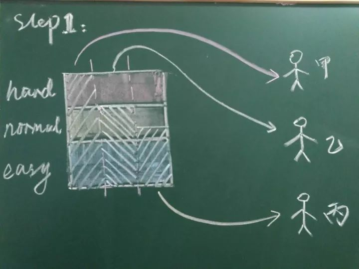


可以预见的是，如果继续按照上述方式分配工作，团队绩效依然无法有较大的改观，此时，作为leader不得不作出一些调整——**按照能力去匹配工作**。


带来的效果一般也是显而易见的，团队整体的绩效得到了保证。


现在回到最初的问题，我们心里是否有答案了呢：

丙的工作量并不比其它人少，为什么绩效排名靠后？

我想答案可以简单概括为，**丙的可替代性较高**。

进一步去思考，可以将以上过程称为**绩效阶层分化**。通俗的说，我们以往的工作效果导致了我们被划分为了甲类、乙类以及丙类员工（为了便于理解，暂且这样称呼）中的一种，而leader出于对团队绩效负责的原则，采取了最低风险的工作分配方式，更加剧了**绩效阶层的固化。**

丙类员工的悲哀在于，他就像站在拥挤的地铁车厢门口的人，稍不注意便会被挤下车。然而，我们被划分至丙类员工并不是最糟糕的事情，最糟糕的是**我们从未去思考自己是如何一步步走向丙类的。**

经了过对绩效阶层分化的理解，看上去作为丙类员工的我们似乎已经无路可走了。事实真的是这样吗？回顾上面的思考过程，我们会发现导致我们一步步走向丙类的直接原因，便是对于复杂、重要工作任务完成的效果差。而根本原因，在于能力缺失，或态度消极。在职场上的一条永远成立的定律：**先有做事情的能力，才会有做事情的机会。**

因此，扭转局面的唯一机会便是：**踏踏实实地提升自身的能力，去主动承担并且完成复杂、重要的工作。**绩效与薪资挂钩往往使大家捡了芝麻丢了西瓜，仅仅纠结于眼前的利益，而忘记了改进自身能力去追求自身更高价值的机会。不善于反思自己，将绩效评价结果简单地归结于偏见，甚至更加消极怠工，是对自身最大的不负责。

最后，我所理解的绩效考核的最终目的是帮助员工去发现、理解及改进自身问题，因此完整的绩效评价应该包括结果评价、绩效面谈辅导两个主要部分。也就是说，这是一个工作效果集中复盘，帮助团队成员发现成长机会，并且与他一起制定提升措施的过程，按PDCA模式去挖掘自身潜力。

许多管理者甚至将绩效考核权利当成自己树立威信的杀手锏，如果你偏要拿出一副“老子说谁行谁就行”的嘴脸，那我也只能祝你以及你的团队好运了。。。。。


### TODO：

了解impl与接口关系，为什么要这样设计


泡脚

静态方法如果修改一个量，基本上都要加锁
----> 因为不同线程会同时修改这个值

你在华为，做的最大的错事就是，你太怂了！！！！！！导致了后面一系列问题，绩效，分的蛋糕

任何一个新名词，任何一个新逻辑，任何一件事情，都问一句:本质是啥（what)？最底层逻辑是啥（how)？（害怕被名词欺骗，害怕被自己骗）
不停地what，when，how，why -----> 不停进行交替，这样你可以追到本质
比如，序列化，本质是啥

工作逻辑
原理逻辑

做的笔记，必须是自己的深刻理解（1，自己的  2，深刻浓缩）

一个模块的开发，一定由上至下来设计接口。由上至下来写接口。。。。。为什么是这样的？因为一个接口的功能是由它的调用者决定的！！！使用者

父类调想要调到子类方法:
可以直接在子类里增加，instance判断
2 父类增加这个方法，子类复写（不用父类里用instanceof 判断）
只是子类的方法，不要在父类里
------> 各有什么优劣？
第二种更好，原因在于:第一种在父类里了解了当前类是子类，即父类了解了子类逻辑，并调用子类逻辑。。。。----------> 子类逻辑下沉到父类里了。。。这不好，产生了耦合，以后。。。。。这样做，父类里会有大量instanceof
尤其是父类里面引用了子类 ------> 这本身就是耦合，本身引用方向就很不对！！！
原则，父类不需要对子类是哪一种进行感知。。。做自己的逻辑，这样不会耦合？
即使只有一个子类去override，还是第二种好
例子:

如何hook安卓流程
1，实现安卓所要的接口抽象，塞给安卓。。安卓回调时，回调到z
比如，无障碍流程
2，继承安卓的类，恶意复写
比如元能力恶意复写activity的内容


静态如何调用非静态？
静态不能在方法中调用，但是，可以把非静态变量赋值给静态变量
而且方法可以当做callback（变量)，所以，非静态可以转化静态
-----> 例如安卓Toast,  Notication

其实有些架构是必然的，比如，通知，要考虑不同应用，则必然manager在另一个进程里

为什么？为什么？为什么？

回调，回调到子类还是父类？（其实都是一个实例，层次不一样）其实都可以，哪种更合理？


读书最重要的是读目录，尤其是技术书！！！！比如安卓艺术探索艺术

断点调试适合向下

每天要有计划。。。规定，所有的计划要细化。。。。所有的学习或新东西，要输出东西
集中精力

一定要学会化简！！！！！比如，看代码要学会化简。。。把握住核心的几行代码。然后去理解与记忆。。。其他代码能删则删。。。这想要那也想要，最后一定是不深刻！！！！！！

你是一只狼


大计划，接下来追求:
1，每天锻炼身体 ----> 细化
2，锻炼脑袋  ----> 对知识和金钱保持
强烈欲望！！！好奇好奇，可以走得更远
3，审视每个想法。念起即断
4，反思。复盘一切
5，每天身体和思想都清零，


以输出倒逼理解。。。又一例子，做笔记，做的笔记是你的理解。而不是你抄黑板
又一例子，写toast代码给开发者，先设计好开发者怎么用，以此输出为出发点

对外接口是一个类（模块)存在的意义以及其本质！！！！！！！
要想把握一个模块，一定牢牢把握其对外接口。比如，了解一个接口怎么使用，入口在demo里。再比如，了解一个类是干啥的，看其有哪些对外接口。。。


如何让她意识到自己的错误。走她的路，让她明白。。。生日时，她没给祝福，生气。没给礼物时，生气！


如何克服焦虑和拖延: 努力干砸每一件事情！干就完了！

从本质上讲，调用函数就是信息传递！！！就是蝌蚪，电流
----------> 传递了两个信息: 1 、某个事 2、干这个事的一些东西   
-----> 其中1，可以转化为2


### 英语是个好东西

原因在于：

1、是你成为迈进高阶大门的 钥匙

2、**将大部分人拦在门外**


### to整理


  人世间有太多的羁绊，阻碍你的前进：性欲、面子、强迫症、手机、感情、亲情、执念、

要思考怎么进步，这才是根本


万物皆是对象

既然是对象，必然有层！！！！

-----> 所有事情，分层！！！！0层设计！！！


问题集:

问题比对的东西重要！！！！

问题《-----> 根因


熬夜➕久坐，伤神

熬夜会变笨

餐巾纸

放慢大招：  luyin、log

-----> 录音别人的问题，问题是理解本质的神器

可叠加式进步

朝闻道夕死可矣

遇到难的问题，一时解决不了，不要强攻。。。。隔一段时间再解决（第一，不耗精力，第二，换脑子）

用输出检验输入，检验理解

注意每天给自己清零

机器要一直跑，人要常休息、常思考。

沉下去

要活的有智慧

长度

书籍:稀缺，穷爸爸富爸爸

抓crash log是虚拟机在死亡之前发出来的。所以跟安卓或者z没有关系。

方向性问题，一定不要听你同级别同年龄的人，的话，（比如yangyunfan说andriod比算法有前途）

近期emui会有需求。

如何理解，分析，思考，解决问题，问题拆解，原子性

Android studio 6.3.2，比如EA保存高质量图片

对比网上很难搜到的东西一定要有记录，比如docker的安装。studio的配置！！！

-2深度参与了嘛

-1 提高自己的沟通能力！！！！

0，每日问一下，你的技术达到最好了嘛？今天是否追到根？能力提升了嘛？

----------> 你总结了很多，入脑内化了嘛？

每天看一遍

图的话，闭眼想关键点

时间，力量

所有的复杂配置要记录关键流程，以免后续返工时，又浪费时间

给一个不得不的理由

1、技术思维，向上下扎到根，向上捅破天，，，

竞品思维

产业思维：安卓如何做的，苹果如何做的，你可以怎么做

和一个有心机的人竞争，两种方式，可以赢他，一种是比他更有心机，这种能赢，但只是险胜。第二种是更纯粹，但在思维，思想上，高纬度碾压

陈浩，怎么样才能挣到他一样的年薪？找那个段位的人聊天。。。。他说的是对自己人生知识智慧的提炼(不会出现在书本，不会出现在互联网上)

看虎嗅，看36氪

越底层越重要，身体，家人，赚钱能力

不能短视！！！！

多找跃华聊天，他就是你的陈浩！！！

每件事情都是有一定意义的，要识别其意义，并总结下来

理解一样东西，不快，但是弄懂了就彻底懂了

方案，一遍不懂就十遍，任何难的东西，解决方法----------> 每天看一遍

厉害的人，是其抽象能力厉害！！！手机跟无线射频没什么两样，就是多了个显示屏

可以无时无刻把玩业务，这样你的时间就多了。比如，做输入法，在自己的手机里很多安装输入法，有空时对比把玩

比起商用完善的项目，github上的demo更有价值 ------------> 原因在于：1、GitHub给了源码 2、初期代码都是核心代码

开源项目代码中Java太多，如何看呢？跑起来，通过log找主类？和流水线

串线、串流程、走读代码最好的方法是，打调用栈---------> 非常快，且准确！！！

难点在于跑起来，

哪些串线：流程串线以及关键量的流转串线

代码走读就是串线，包括Z，包括任何代码！！无论是应用代码，框架代码，A代码还是z代码！！！！关键在于如何跑起来？

如何跑起来：1，代码要能编译----------> 开源软件apk；框架代码匹配手机   

 2 构造触发点：流程向上游找触发点！！！！（1）点击apk触发，以用户角度触发  

（2）主动去调。。。上游的任意一个函数----------> 这里的可操作性非常大！！！！！！上游函数很多，有些易调到，比如Imm可以直接被apk获得，从而可以调control框架代码里的接口！！！！！----------> 实现了button调用框架代码！！！！

规定，跳转画完的流程图，之后也一定加调用栈验证一下，很快！

规定，画完图，用一两句总结一下，这个图的流程，创建了谁，又怎么流转的

一个量的流转图，要回答从哪里来，怎么流转的，最终去了哪里，做了什么

时序图，中重要的量，也要回答上述问题

一个方法，尤其重要的方法，你必须回答，是不是触发点，这个方法做了什么（很可能是做了一些事情，作为另一个流程的触发点）

那到底他是做了他这一级的事情，还是向下递归的事都是他做的呢

一个方法做了什么，还是一个类做了什么！！！！！！

三方应用app出问题-----> 先看我们测试demo有没有覆盖这个场景

-------------> 这也是demo APP存在的意义！！！！！

看代码，要回答：从哪里来？属于哪个进程？？？（即属于哪一侧？）

-----> 总之一句话，一定要有好的问题？？？？----------> 好的问题哪里来

你总结了很多方法，有没有在任何一件事情上，考虑能否应用？将方法应用范围延拓！！！

无论是知识，还是专利创新，一定要吸收别人的！

杨云帆有个习惯，走在路上，游泳的时候在想事情。很有效果，换脑子，换心情

输入法架构的必要性在哪里:

时序图体现了具体怎么做，但是不能回答为什么这样做

从类图里可以回答为什么这样做

从组建图里可以更可以回答为什么这么做，这么做的必要性！！！！

有迹可循的创新:  迁移与联想能力

任何细节的补充只能依附于主干，加强主干，不能扰乱主干。。。记忆，知识点，都要联系主干

不断加强主干！！！！附属的自然强

一级一级地抽象出主干！！！！！

主干与分支关系：站在主干理解分支，站在主干记忆分支 ----------> 具体应用：

理解时序图，要站在类图上（高维度）

理解时序图，要站在组件图上

理解动态，一定要站在静态的基础上

理解与记忆，一定是主干与分支，抽象与具体，相结合的产物

把琐碎、细节挂到主干，核心上

-----> 推论：画图也是如此，不要一张图画很多东西。一张时序图，画一个东西，然后挂载到主干图

高手在于，拆分、链接、主干ji

-----> 站在全貌上看，做局部

----------> 对于Z，安卓永远是主干！！！！

1.学着用肉体操纵精神：

----------> 治愈拖延，自律就很容易

我们无法自律、无法坚持的本质原因：消耗意志力资源，但其极其有限。用精神控制肉体，终究会失败的。

例子，如何坚持读书？不要管你想不想读，先把书拿出来，看一会儿，逐渐会发现你看进去了


你把你的身体,放到一个场景中,你的精神怎么办呢?嘿嘿,它会自然而然地接受这个场景,并且顺势地"继续下去",甚至还会将做这件事的“痛苦"化为“快乐”。

所以啊,为什么要学会"用肉体控制推动精神",而不是相反?还因为你的精神会在你还没行动前,就给你设置了一大堆障碍、想象出一百万种失败场景把你吓尿。


2训练感官的能力;

3.让自己突然变开心的能力;

这三种能力同时满足:很重要,但是大e

没有的要求,并且还是很多听起来不错的"能

力",比如自律、抗拖延、调节情绪..

力的基础。借个时髦的词儿,叫"元能力"比。

每天百分之十五的时间学习总结

每天百分之十五的时间思考提升的方法，建立长久

很多事情，如何从长的尺度去看？？？？？

有些人不哄女生，而是和女生讲道理

原因在于，考虑长期的相处方式，而不是像渣男一样，一时的哄骗

太用力的人跑不远。

努力不应该是某种需要被时常觉知的东西,意

志力是短期内会用完的精神能量。

真正坚持到最后的人靠的不是激情,而是恰到

好处的喜欢和投入。

当坚持不再成为需要被言说的事实或是需要被

排练的步骤时,它就成为了我生活的一部

分,而不是什么挂在生活之上的负担。

最长久的陪伴不费心力。如果你真的喜欢

人,真的想在他身边一辈子,就不会说有多么

爱他,而是觉得"每天能和他在一起,就很

好。

太用力的爱不仅让自己累,也让身边的人累。

https://www.zhihu.com/question/304174916/answer/825079036

**把所有问题都放在纸上思考**

**系统性、流程化**

**人和动物的差别在于工具**

**人与人的差别也在于工具-----> 要善于用工具、善于用人！！！！**

**绝不看抖音与朋友圈**

每天留半个小时抄写经书。半个小时深度思考

高手是深度思考的高手；是自我管理的高手

思考本质的东西

每天早起

每天喝温水

每天晚上列计划，第二天执行


总论：任何事物总是守衡，均衡的。你要想达到一定目标，就要主动构建差异化

例子1: 睡眠只是其中之一

例子2: 绝大部份时间，要时刻利用大脑深度思考一些东西；也要学会利用十分钟，让大脑完全放空

例子3、坐大部分时间，也要学会站

例子4、大部分时间睁眼看东西，有时候闭上眼睛，看的更清楚

例子5、

做一个极简主义者、本质主义者！！！！！！！！！！！！

把精力放在本质上

我一直强调主干（本质），却没能做到！！！！！！！！！

比如工作中，只做主干的核心活，放弃噪音

比如，问题没能一眼看穿本质

如何剔除噪音、寻找主干？？？

1、识别入口和出口（即起与终）

2、

你把你的身体,放到一个场景中,你的精神怎

么办呢?嘿嘿,它会自然而然地接受这个场

景,并且顺势地"继续下去",甚至还会将做这

件事的“痛苦"化为“快乐”。

所以啊,为什么要学会"用肉体控制推动精

神",而不是相反?还因为你的精神会在你还没

行动前,就给你设置了一大堆障碍、想象出一

百万种失败场景把你吓尿。

元能力二:训练感官的能力

问你几奇fti题。

你有没有刻意训练过自己耳朵,让它能ぜ


ashi:

adibility级

组件级

dialog 里view不属于 contentView的体系。。。delegate是塞给了contentview极其子类

----------> 所以他说，目前无障碍功能是contentview粒度的，contentView级别的

contentview粒度----------> 是其对无障碍边界的高度概括。。。而我为什么不能？

点灰的地方，dialog里的安卓view会收到响应，这是AgpwIndow做的。----------> 具体代码？

gongashi从架构上推导出，能不能做，有必然性。。。。

不要先用代码去验证，先从架构，有哪些类，从而推导能做哪些事情。。。

哪些类，支撑流程到哪一步

了因:

思考那些不得不的东西，市场，代码，fupiao，题目解法

log不稳定，怎么办

----------> log要稳定，要有层次，要干净

log能解决一切，包括类在哪里创建。。。项目中，有没有一个类，以及其子类！！！！！！

viewtree与client关系

clinet单例，新Windows，清掉之前的

-----> 所以，单例也是可以的

只给出解决方法，而不给出缘由，这不是解答！

了因:

可叠加式进步

可叠加式，如Git，如备份，如docker的commit。毁坏了，瞬间恢复。。。叠加式在于，之前所做，没有浪费，为后期垫脚！！！！！！

进步

了因:

管理，也讲究减法

学习毕晟，流程化，把账号给别人

利用加分警告早点填表

马占福把计划交给必胜执行，自己早早下班

催人，一定要针对一个人，打击一个人。邮件或群里批评最差的

催人，催主管，让主管施压

任何事情，只和pm对接！！！！！

有很多问题时，只要针对最多的那个子系统打，不要铺开 

如何逼人做事，每半个小时反馈一下

学习知识，更要学习别人的智慧，管理，集合其他人的优点

如何催一群人？一个个打电话，效率低，，，，把所有人拉到一个群里，完成的退群

了因:

理解一定要基于例子，但是也一定要抽象、提炼、甚至升华，，，，看透本质的能力，，，，反思能力，，，轻装上阵，，，，精力，，心流，，，，时间的任何利用，，，你必须非常非常努力，同时着眼于当下，，为什么如是因，如是因！不要管结果。。。。。兴趣也不是最好的老师，而是兴趣导致的坚持。任何事情都怕坚持！！！。。。遇到问题，一定冷静再冷静。。。。。利用一切零碎时间思考，优于集中时间。。。。任何事情，一定要找到深层次的原因，深层次，这样才。。你要成为领导者，不要畏畏缩缩！！。。。人与人之间的差距在于工具，实体工具，思想工具。。。。。。。不着于象。。。。。重心永远在工作上，永远！！！。。。。。。对面若有人，那么你一定比他强，你是能啃硬骨头的人。。。。思路哪里来，参考（参考别人，z参考A)。。。。。刻骨，让公司离开你难受。。。。。做任何事情都要分清主次，尤其是做决定的拼命去学。。。时候。。。。我要成为领导者。。。。思考。。。拉筋，，，聚焦，，，，google ！！！ 27了，真可怕。。。。如何客观评价自己？。。。。对于理解，文字（包括代码是非常操蛋的东西。理解时，脑子想着的东西越具象越好。。。数据永远不会骗人，眼睛会。。（瘦与胖，通过手机视频。。。。。。聚焦事业！！！！。。。。。这短短的一生，我们都将失去，播放大胆一些，勇敢一些，爱一个人，追一个梦，爬一座山。。。。。主动当责。。。。。不可替换。。。。。身体和事业，其他都是副产品。。。。自信！！！！自信。。。。。沉下去。只争朝夕！身体！！！！梳头！！！！格局!!!!!!!!!自我管理与他人管理（必须安排计划表），，，刑法：晚上床上不准手机！！！白天不准床  。。。。？男生说话，不要说带情绪的话，尤其负面情绪的。。。放下。。。军人好睡，犯人好睡（无3c电子产品，千万不要手机）。。无韭菜、洋葱、豆腐、青椒。。。。助眠：牛奶。。。。看书，尤其纸质。。。暗的环境。。。脸皮要厚！。。。声音大！。。。。不要急，慢慢来。。。。。人生就是问题组成的。。。。太有意思了。。。。人脉资源！！！。。。多建立忘年交！。。。。让你的领导毫无顾忌的骂你。。。。能发动各种资源，超过个体价值。。。静能生智（带降噪耳机，闭目）。。。。太有意思了！！！。。。

人生在于做减法，因为做减法留下的东西是本质，而且能留在脑子里；任何问题都记着做减法（人生方向，题目解法，阅读代码，代码架构，做笔记，）。。。。代码运行就是水流，分叉聚合。。。代码如何做减法：分主次—————主，代码流水始终出不来的类为主类，用一次的便是次要的（砍掉）。。。。极致的努力与爱。。

找老婆如找工作，多试。。。。。人活着就是为了解决问题而活，钱名是副产品。。。。情商高，会夸人，苏神，锦科。。。。任何事情都有其底层逻辑。。。。。难问题的解决方法------每天看一下。。。。学会拒绝。。。。念头纷飞，最好的方法是替代，读书。。。学很难很难问题的方法，每天看一遍，尤其睡前。。。。看人与看事一样，先看了轮廓，轮廓最重要。。。。。。。。。单线程去做某些事情，做到专注。。。。。最好的状态是自然。。。任何事情都不要做足，帮人，吃饭，性。。。。缺憾才是恰到好处。。。。学一样东西，先要忘了它（它去理解其存在设计的必要性），学会了更要忘记（学会抽象出其精髓）。。。。。。。。方向大致正确，绝不能很正确。。。。。。多看高手思考的文章与话（一句话胜过十年书，十年磨难你才能总结出的:方向大致正确）。。。。难的问题，深的问题，每天看一遍

。。。。。对人，也要抓住干。。。。。方向大致正确 组织充满活力。。。。极度努力，你可以踢掉公司，而非。。。。。。。30岁了，要学会*聚焦。。。。。行痴。。。。。。任何事物的发展都要由具象到抽象，不断抽象的过程(数学的发展、人的真知、学习，题目---------方法的总结、工作：具体代码，文档设计，领导项目，领导公司，愿景)。。。理解问题一定要具体（结合具体例子），理解后一定要抽象(抽象总结)。。。。性格！！！！！！！！！！！！终其因，是你的性格导致你在组内无法出头。。。。。。关于坚持

、自律、克制欲望终极目标------------------美学

。。。。。。大胆一些。。。。。疯狂去学。。。。抓主干，对技术、着迷，其他永远是顺带的能力。。。。。声音大，气势上压倒别人。。。。记忆与理解，必须依赖具体例子、场景，同时必须总结抽象化。。。。。成为时间的朋友，做一个长跑着。。。。。你必须快速升职加薪，你没钱花了。。。。。学习一定要使用倒逼方法，题目倒逼，代码倒逼（现对名词，知识体系框架名词大概了解一下即可）。。。。充分利用反馈机制。。。。知识，最后一定要有框架，目录！。。。。说话，老余，声音稳定，有底气。。。。。分析思路要清晰。。。。任何事情，强行都不好（感情，学习，记忆，理解，交际），要自然。。。。深刻，向下。。。。。爱。。。屎尿渠，，，，，，被需要的时候才是有价值的，，，，

升级，年薪百万。，，，，一日即一世，，，，，囫囵吐枣，，，抓住主干，熟悉主干后，完善细节，，，，，，，，，，，，如果你的工作招聘一个高中生通过一至三个月就能上手那么你的价值在哪里？，，，，没有年薪百万，没有高职级我会死掉，，，，求求你，让我再多看一道题，多学一个知识点，，，，，，，，，认真，空间，是你的就是你的，，，，，，本质，基础：事物一定要触及本质(不耗时)..打好基础，好时，，，，，

自然是本质本质是自然，，，，，，，，，，加完班的无聊感导致，，一天就是一生，一次就是一生，，，，，求求你，让我再学一会儿，再进步一次，，，求求你，让我追下去，再追下去，，，如魔如疯，，，，一定要识别什么是好的，是深刻的！！学会主动找好的，深刻的，，，，，充分利用切换，加班不可怕，，，

注重效率，即领悟本质的时间！！


噪音信息太多，害处非常大，----------> 挑选被别人检验过的，尤其评价好的！！！

纸上记录：

疑问回答 模式推进问题

计划完成

声音记录：

录音！！！！！

锚⚓️

记忆之锚

逻辑之锚

源码，逻辑之锚


很多事情，如何从长的尺度去看？？？？？

有些人不哄女生，而是和女生讲道理

原因在于，考虑长期的相处方式，而不是像渣男一样，一时的哄骗

太用力的人跑不远。

努力不应该是某种需要被时常觉知的东西,意

志力是短期内会用完的精神能量。

真正坚持到最后的人靠的不是激情,而是恰到

好处的喜欢和投入。

当坚持不再成为需要被言说的事实或是需要被

排练的步骤时,它就成为了我生活的一部

分,而不是什么挂在生活之上的负担。

最长久的陪伴不费心力。如果你真的喜又区

人,真的想在他身边一辈子,就不会说有多么

爱他,而是觉得"每天能和他在一起,就很

好。

太用力的爱不仅让自己累,也让身边的人累。

https://www.zhihu.com/question/304174916/answer/825079036

**把所有问题都放在纸上思考**

**系统性、流程化**

**人和动物的差别在于工具**

**人与人的差别也在于工具-----> 要善于用工具、善于用人！！！！**

**绝不看抖音与朋友圈**

每天留半个小时抄写经书。半个小时深度思考

高手是深度思考的高手；是自我管理的高手

思考本质的东西

每天早起

每天喝温水

每天晚上列计划，第二天执行

关于睡眠：

裸睡，低温

随时带着腿黑

十二点必须关灯关手机

准点睡，最重要的是准点起，7点半

白天多晒太阳，抑制褪黑素。回家就关灯，留小灯。

休息不一定要睡觉，而在于放空大脑

总论：任何事物总是守衡，均衡的。你要想达到一定目标，就要主动构建差异化

例子1: 睡眠只是其中之一

例子2: 绝大部份时间，要时刻利用大脑深度思考一些东西；也要学会利用十分钟，让大脑完全放空

例子3、坐大部分时间，也要学会站

例子4、大部分时间睁眼看东西，有时候闭上眼睛，看的更清楚

例子5、

做一个极简主义者、本质主义者！！！！！！！！！！！！

把精力放在本质上

word适合展示具体细节东西。但是很缺乏结构性、框架性东西。如刘刚所说，很散


程序员不是写代码的，代码只是表象

要像SE一样，不写代码，但其实代码都是他写的。

1、把已经写好的代码，转化成对象，事物之间的架构、逻辑。

2、要解决的问题，从对象的架构和逻辑上分析可行性解决方案。。。。-----> 这本质上与代码无关了！

好的程序猿，一定心中没有代码！！！！！！

gongashi他告诉我，1、不要关注于代码，要有对象提炼。 2、弄懂z之前，一定把安卓的流程弄的非常熟练

调用栈不知道底，如何知道底，

网上搜

找地图

# 学习如何学习

## 总论---学习方法论


### 简--繁 的无限循环：

>   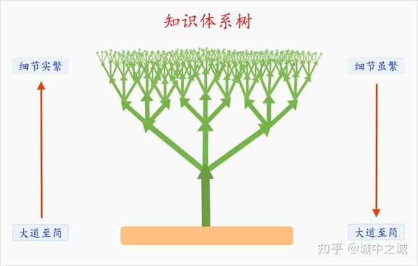

[图](https://www.zhihu.com/people/chengintocheng#:~:text=%E5%AD%A6%E4%B9%A0%E7%9A%84%E6%97%B6%E5%80%99-,%E4%BC%9A%E9%9D%A2%E4%B8%B4%E4%B8%A4%E4%B8%AA%E8%BF%87%E7%A8%8B%EF%BC%8C%E9%A6%96%E5%85%88%E7%AC%AC%E4%B8%80%E4%B8%AA,-%E8%BF%87%E7%A8%8B%E5%B0%B1%E6%98%AF%20%E7%BB%86%E8%8A%82)

上    <--------->  下，   是证明！！！！！！

下到上的证明（<font color='red'>只能证明，不能记忆</font>）：

>   先从最基本的概念出发，从最简单的问题出发，通过逻辑推理一步一步推演出整个系统

上到下的归纳，<font color='red'>归一：</font>

>   **细节虽繁** **-> 大道至简**，我们就要去帮助大家再把刚才所讲的所有知识梳理一下，整理归纳一下，重新回到大道至简的状态


**站在任意的一个点上，一定要做两件事情：**

>   向上：更具象：   5w2h
>
>   向下：更抽象：通用迁移、万能


### 功能  <--------->  结构的 无限循环

TODO: 图

功能  <--------->  结构 ， 功能与结构之间是支撑关系，也是证明关系

-<font color='red'>功能是根本（是标题、是思考关注的点、“为什么”的原因、是目的、是目标.................）</font>


功能是上面 “简--繁 ” 的 “简” -------------归一

>   （所以，**功能是简单的，其实现的结构是复杂的**）


例子：IDE 代码跳转，有时候就找不到

所以，要分析跳转结构。总结跳转有哪些结构？查找有哪些结构？


https://www.campzhe.com/archives/1372

### 闭眼

闭眼！！！！！！！！！

1、<font color='red'>沟通神识的方法</font>

>   例子：看别人软件架构图 ，一定不是你 神识中的图（因为方向、重点都不一样）。<font color='red'>别人的图 一定都是垃圾，因为一定会与神识中的图 冲突，造成紊乱。</font>   而 <font color='red'>神识中的图，才是你的唯一</font>
>
>   方法：闭上眼睛，构建自己的图 

-<font color='red'>化简的最终目的，就是一，一就是神识</font>


所见都是垃圾，尤其是别人的

2、闭眼：才能看得更清楚、屏蔽细节。

-<font color='red'>从物理层、更本质的证明（理解）</font>

### 追求一

极度化简

极度忽略细节

极度追求本质（物理层面）

所见都是垃圾，唯有神识是一


## 结构之 知识框架

看视频，是搭建知识框架的非常好方式：

> 1、有个模糊的概念就行，后面自己填充
>
> 2、自己看书/看博客，不适合用于搭建框架 ------------>  因为静态的东西，不会告诉你重点是啥？没有重点，你会累死，而且容易遗忘
>
> 3、自己看代码总结，比2还要傻


## 学习动力与阻力

好奇心是根本动力 ----> 多问。培养好奇心

做学问：好奇心重要，品味也很重要


动力的好坏： 美感 > 好奇心 > 兴奋点    >  竞争、攀比


激发了我探索这个世界的兴趣 --->  来理解大自然的工作机理
激发了我探索系统的兴趣 --->  来理解系统的工作机理
------> 为机理而活


我对科学有兴趣只是因为我想了解这个世界， 我发现越多， 探索世界这件事情就越美妙


我迷恋于  应用的级别，为啥呢？我觉得会使用某一项技术后，会方便很多 ----> 便利很多，超越很多人
-------->  我关注的点（兴奋的点）的层级， 决定我的层次
-------->  如何改变兴奋点呢？

兴奋点：
在主要任务、主要分支做出主要贡献
不急、不重要、不是必须+费时间，就靠后

##  <a id='chengyin'>动力：  成瘾-----奖励机制</a>

[见上： 学习知识 如何成瘾？](#chengyin)


## 阻力：缓解痛苦

难题、知识过于复杂、游戏闯不过去、环境搭建总是失败、苦思冥想 ，都是佛家 `求不得的痛苦`

------>  这些必然会产生痛苦，可是我们又没办法规避，必须做出来。

那么，`如何缓解这种痛苦呢？`方法：

1、想办法，降低问题的难度 --- >  做一个低难度的、阶段性问题，适应了再逐渐升高难度：

-<font color='red'>比如：学习安卓的显示系统</font>，自己看代码难度为90，看技术文章为60，挺别人讲视频20

​            正确做法： 先看视频------> 视频了解后，看技术文章加深------> 最后跟着代码走一遍

2、梳头

3、对于非常困难的，`需要常年累月的问题，`可以做一些，不通的话，`先休息几天，再尝试`
比如`之前搭建Docker搭建代理环境，我前前后后，弄了一年多`，终于弄好。还有linux可视化界面

4、多看看大家的视频，尤其张益唐的淡泊


## 学习之无招胜有招

真正意义上的复杂系统，`必须来自于简单的规则`，以及在时间这个变量的参与下，<font color='red'>衍生出的无穷可能性</font>。 --------->  风清扬给令狐冲 


风清扬对令狐冲的武功教诲和[岳不群](https://baike.baidu.com/item/岳不群?fromModule=lemma_inlink)对令狐冲的武功教诲是截然不同的，风清扬对令狐冲人生的教诲更为精妙，更合令狐冲的脾气。这一回的传剑是实实在在，<font color='red'>风清扬的一剑中竟有三百六十种变化</font>，这种武功是不是真是至高无上的呢？但风清扬传剑术与[令狐冲](https://baike.baidu.com/item/令狐冲?fromModule=lemma_inlink)，虽说是剑术却有另一种高人境界，放飞自我，做学问方法。“**剑术之道，讲究如行云流水，任意所至**”，<font color='red'>学问之道，生活之理，其实亦是如此</font>


无招胜有招，说的并不是没有任何招式，白纸一张。而是：
1、掌握<font color='red'>最核心的精髓（极度简化</font>，近似无招）
2、基于精髓，**任意演变 （行云流水，任意所至），从而可以忽略演变，无需记忆：**
       -<font color='red'>通过链接一切，做到极致化简</font>。例子：三百六十种变化，风清扬知道如何由 三百六十种变化  **链接到**   一剑 ，所以`在风的眼里，只有一剑，忘却了三百六十种变化`


**无招胜有招，说的就是极致化简（超级减法）**


具体如何化简，见《化简-----> 


**<font color='red'>检验是否学会的标准（也是学习的方法）：</font>**

  [见下](#xuehuibiaozhun)


当你觉得一个东西复杂的时候，一定是    1、你理解没深刻  2、你看问题的角度有问题

复杂的东西，其内核一定是简单的、明了的

复杂的东西，不仅内核简单明了，本身也一定是简单、明了的（这世上不可能存在复杂的东西）

人是不可能，理解与记忆复杂的东西。


真传一句话。  这也是 <font color='red'>检验自己是否  真得</font>的标准。


柯浩然-------------------一法通，万法通


## 无招胜有招之目的论

目的论就会让我们忘记，不需要记忆


有了目的，就不会无聊。听课也会有主动性，看书看代码也是


关于目标：

不应该是1个小时内，进度多少  ----------->   而是，一个小时内，获得多少智慧？见过路途中多少风景？


## `无招胜有招`之链接实操

### 理想的学习知识路径：

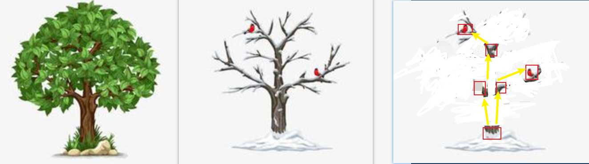

1、左图：我们不可能认识一棵树:  ~~`一棵树有太多的细节（叶子）`，仅仅外表都让我们眩晕（还有叶子光合、树枝养分吸收等等）：比如 安卓的操作系统，各种操作、各种功能~~

2、中图：将  一棵树 的主干、主要枝丫、果实 提取出来，忽略细节 （`抓住主干`的能力）：~~比如 : 安卓系统，显示与触摸就是两个大的主干~~

3、右图：对主干、主要枝丫 留一两个关键点（**极度化简的能力：不得不的点、唯一决定的点**）。比如：安卓系统的显示的根本是surface上的数据

4、`基于右图链接`： 树根------树节点1----树节点2----果实      `一定要形成关键节点的强链接`

5、如何认识系统？<font color='red'>基于最简的关键节点 </font>（右图），反推 左图  ：  如果不基于右图，我们永远无法理解左图，反而越理解越糊涂！

6、一定牢牢地把握树根，把整个世界链进去！

---------------->  知识的应用便是从  树根  链到  节点1，节点1链到节点2，最后链到果实的  过程


常见的一些例子：

- 写文章也应该如此--------文章目录就是  关键节点----key


- 看文章也是如此--------只需要看目录结构就行


- 规定：看文章时，必须旁边有目录章节，随时看所处的位置：

> 

- 定位bug，也应该如此---------看关键status

- **我们记不住这个世界，只能记住这个世界的所有key，链接所有key**

- 打开最外层的.md, 则可以链接其他所有的.md文件：


### 从记忆中搜索的路径：


(字典 《----------------------------------------------------------------------------树 《----------------------------------------------------------------------------以锚点为基)

-<font color='red'>要求：</font>

> 锚点必须熟练记忆
>
> 树的路径尽量熟悉
>
> 字典无需记忆，只需要知道怎么查： 锚点 ---> 树 ---> 字典


由此推导出一个行文要求：

> 0层架构必须熟悉、1层尽量熟悉、3层是字典了，<font color='red'>必须删除</font>（知道如何查）
>
> TODO：
>
> 写文章存在的一个问题，如何让1、2、3层的论述 完美隔离（但又能联系的很好），**因为2中有3，会让视觉与记忆陷入混乱**
>
> 写任何文章，记忆，理解 ----->  最关键的是<font color='red'>关键词</font>（锚点）


例子：

> 人为什么喜欢给别人贴标签呢？
>
> > 比如：
> >
> > 老板认为这个员工是个懒惰的员工  ------------>   标签： 懒惰
> >
> > 那个员工是个很有创新性的员工  ------------>   标签： 创新性

--------->  结论：因为<font color='red'>人的认知、记忆、推理的模式</font>就是： <font color='red'>从锚点出发，向前链接...</font>........

​           “标签”就是人认知的锚点


---------->  推论：

  学习方法：  （1）**疯狂给自己的知识贴"标签锚"  + 链接**

> 比如： 
>
> ~~cpp性能高  、java跨平台性好、c 硬件性语言~~
>
> ~~比如flut ： UI框架 + 渲染引擎~~

​                       （2）“标签锚” 是极大化简工具。少量标签精确记忆，其他依附记忆 


## 如何化简？

原则：【1】 核心尽量是绝对的锚、<font color='red'>【2】 逻辑链彻底的短</font>、【3】 逻辑链要强固

关键在于【2】，因为人不可能记忆长的东西


应用一：代码的化简

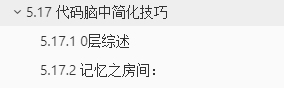

比如：   起点----目标反推法 见

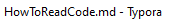


TODO: 延拓应用领域

​     写文章

​     思考代码

## 学习之底层逻辑


## 学习之 以问题、面试问题驱动

目的论


## 学习知识之各个维度------拆解|切割

学生时期课堂里，老师讲课的方式是从下往上，一步一步搭建完整个楼（知识）给你看

--------------> 社会上的海量知识，差异： 

1、海量知识，难以一步一步；  ------------>   对应方法：拆解、看大的纵向

2、由于知识是已经完成的事物。自己去看，必然是 从上往下；我们很难理解（甚至看不到）从下往上（房子最开始有没有搭地基、房子内部结构是怎么设计的）   ------------->    如何更好地逆向？如何从上到下的角度更好地理解？

​                                                           对应方法：目的论（基于目的，一步步论述 每一个“下”的合理性）


  


目的----出发点  

寻找问题------回答问题  （这其实也是目的论）

字面上--------结构上----------本质上

纵向（大的）-------横向

如何深刻？ ：上面的技巧，无论如何，没法做到深刻。。。。。要深刻，必须有深刻的问题嘛？


## 学习效果拆解 &checkList

参考： https://www.zhihu.com/question/324702775/answer/1007956506?utm_campaign=shareopn&utm_medium=social&utm_oi=903075405244817408&utm_psn=1586476031338307584&utm_source=wechat_session

学习效果=有效学习时间\*学习状态\*学习方法

------->  逐渐从这三方面拆解

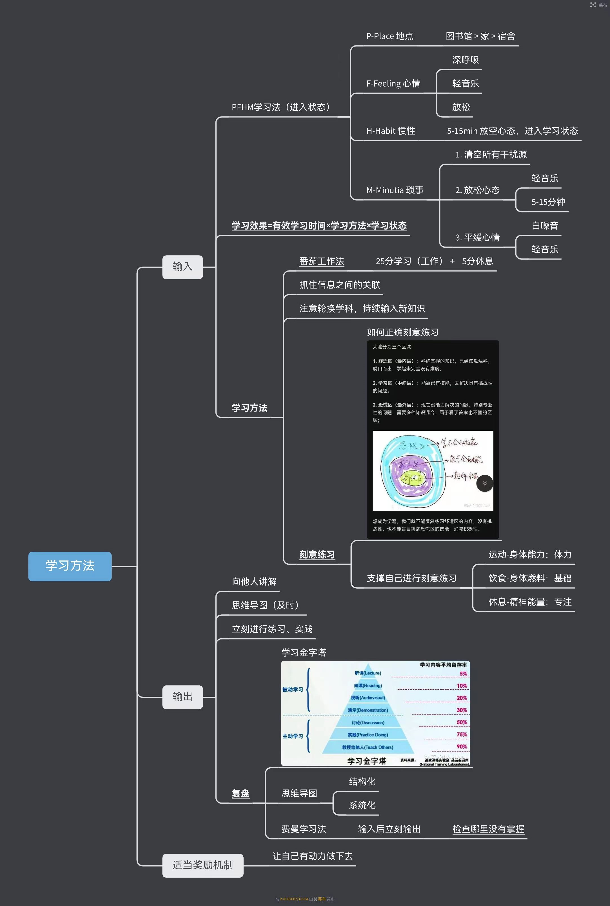

手机远离5m以上

方法： **A4纸检查法**


## 学习材料

有言者：

 *   老师（学校老师、年长者、培训视频）
 *   书本（技术博客、互联网）

<font color='red'>无言者：</font>

- <font color='red'>学习一切差异化的思想</font> ：

  （1）别人与你不一样的地方  （2）识别好的  ---->  (3)拿过来学习  ----->  （4）拓展应用

  比如：aosp编译前，source envoromrnt.sh ------>  就是一个很好的思想（把root下所有环境都初始化好，比如make 在任意目录下执行都一样！）

  TODO:应用


## 如何超快速学习新事物？

1、吸收先进的理念（想法、技术）  ----->  **结构上**的吸收

2、嫁接到已有，删减  -----> **结构上**的删减


# checklist

## 思想模型

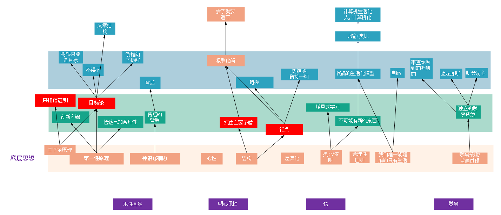


证明！！！！！！！！！

闭眼！！！！！！！！！

分析之5W2H

分析之  物质、能量、信息

根因，一定要找到**物理级别的!!!!!**

避免模糊！

解耦思想： （调试linux，把安卓干掉！！！！机器卡，把CPU占比高的干掉！！！依赖，干掉）

​                   两个纠缠，干掉一个。。。。精髓在哪？神在哪儿？


《思想模型》


在各种领域里用上述思想工具：

生活、工作、知识点............


行为主线：

计算机、理财、数学


我这一生，被心态毁了

> 向后看，蔑视过去的创伤
>
> 向前看：TODO


法则：

1、 六根是驱动、大脑是cpu、灵魂是.......

2、<font color='red'>符合专注模型（不相容）：  </font>

如果 专注于 自己的六根，那么大脑和灵魂都会被压制  -------->  比如，享受美食时，大脑没有了，灵魂也没了

如果专注于大脑...............................................................--------->  比如，钻研于困难问题，茶不思（六根）

如果关闭六根、关闭大脑                                               ----------->  便开悟状态

3、所以，如何戒除色欲(大脑) ?

专注于物质（比如暴走、比如美食） 或者  进入  开悟状态


对立与统一，checklist： 经常变换角度、先切开再切换：

> 抽象与具象（金字塔模型）
>
> 理论与实践（学习与工作）
>
> 模型与应用
>
> 长期目标与短期目标
>
> 恩与威
>
> 学与思：学而不思则罔，思而不学则殆
>
> 终日而思，不如须臾之所学也

## 精力模型

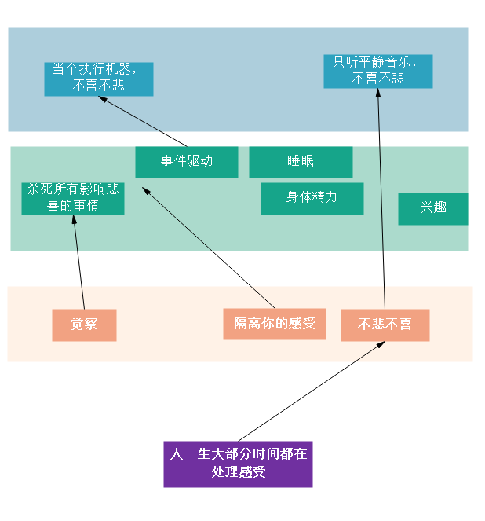

​    《精力模型 .eddx》


# 道，天道

道是最大的结构，是一切规则的合集，是自然和社会规律

得道得一切

<font color='red'>美好的东西，本身就值钱</font>  ---------->  所以要记录


# 精力管理

最优：

> 投资：金钱的最优
>
> 注意力的最优
>
> 精力的最优


**管理精力，而不是管理时间！！！！！！！！！！！！！！！！**


不悲不喜，永恒大喜悦；隔离你的感受


职业生涯，往往精力确定最后跑的多远


意志力是最不可靠的、最不可持续的东西


从底层思想上看，精力管理的精髓在于  抓大放小：
把精力放在大上


## 降低消耗


### 他耗：

他人即地狱

具体技巧：对于level比较低、能力弱的人，不要争辩 -----> 只能徒消耗自己


### 内耗

具体技巧：

管我屁事


### 抓大放小

比如：

clion过一段时间，激活码就失效，还得再去找------>  淘宝上6个月激活码才4块。十年也才80

​                                                                                       ------->  从经济上，完全是小，不值得投入精力去找免费的

再比如：

docker的各种问题，因为docker可以通过jar，每次commit  ------>  可以复用，一次解决，终生解决

​                                                                                                     ------>  可复用的东西，是值得投入精力的


大与小的checkList：

|      |  大  |  小  |
| ---- | :--: | :--: |
|      |      |      |
|      |      |      |
|      |      |      |


## 睡眠


关于睡眠：

裸睡，低温

随时带着腿黑

十一点必须关灯关手机

十二点睡

准点睡，最重要的是准点起，7点半

白天多晒太阳，抑制褪黑素。回家就关灯，留小灯。

休息不一定要睡觉，而在于放空大脑

下午以及晚上，一定不要喝茶、奶茶、咖啡

如果晚上实在睡不着，就起来吃饱-----> 吃饱的情况下，容易睡着


放松大脑的<font color='red'>利器</font>：

> 1、看视频
>
> 2、看已经<font color='red'>非常熟悉</font>的视频（不新鲜的）


激活大脑的：

> 1、听小说


脑力劳动者有几大问题：

> 1、**身体没有充分的疲劳**导致睡眠往往更差,要么睡不着,要么睡着以后半睡半醒。  -------->   要有足够的身体疲劳 
>
> 2、大量使用**脑力**后,一样会产生**严重的饥饿感**,吃下很多食物和糖分,但是又无法消耗。这就导 致了。脑力劳动者在不配合体力劳动或者严格的自我节制的情况下,会得不到良好的休息, 身体状 态很容易肥胖化和营养过剩。   ------->   如何减少饥饿感？
>
> 3、脑力劳动的疲惫感非常之不明显,一般人疲惫的节奏,和身体天然形成的节奏差别巨大,很难保 持在24小时左右这个周期里,  这就导致了很多人会间歇性的熬夜或者失眠。  
>
> 4、脑力的消耗会导致人的自控力下降,在需要关灯睡眠的时候,却克制不住自己玩手机,由于光线 的刺激,越来越兴奋。 ------->  自控力下降
>
> 5、大脑的疲劳会让人非常不愿意运动,同时自控力下降会使人无法主动运动,缺乏运动。加重失眠 和热量过剩。 这样,就会形成恶性循环,脑力耗尽不能做体力活动。缺乏体力活动,导致难以入睡。睡眠不足, 导致脑力下降。螺旋下滑,而这个循环是非常容易进入,且难以打破的,需要很大的毅力打破 他,但是一两次的放纵或者紧急任务就会把人重新拉入这个循环。


**解决方法：**

1、尽可能早起,早上醒来马上起床,不要赖床,快速的进入到明亮的环境中去。如果工作生活允 许,可以保持一到两周的强制早起 (6-7点之间)来恢复节律;

 2、早上起来<font color='red'>进食大量的蛋白质</font>来减少全天的饥饿感。避免因为蛋白质缺乏,而无法自控进食大量 零食导致的营养缺乏型热量过剩所带来的肥胖和精力上限降低的问题; 

3、保持饮食的时间,摸索自己的承受度, 把晚饭放在一个睡前不太撑也不太饿的时间点进行;

 4、尽可能多**晒太阳或者在明亮的光线下(室外)活动一两个小时**; 

5、摸索自己的睡眠节奏,在睡前的一个合适的时间运动半小时左右。运动后会有一个兴奋期反而睡 不着,但是每个人的兴奋期不一样,所以要自己摸索自己的周期; 

6、尽可能安抚自己的情绪,说服自己不为生活中的小事烦心,避免情绪的干扰,消耗仅有的自控力 Q,打乱正常的节奏。


### checkList


## 内与外 的关系

干活，应该是事件驱动-------->  因为内心是极度不稳定的东西


事情驱动，太痛苦

内心驱动，会很容易放纵。内心的不稳定造成的（对于天才，反而是）


内心的纠结，会导致一个人唯唯诺诺  ------->  内心的外化  是导致人被看不起的**根本原因**

所以，将外的纠结、物质的贫困  与   心里的平静、富足  分隔开。。。。比如：

佩雷尔曼家徒四壁，内心却异常富足，给人的感觉也是


## 极简主义 与 扣

我们的终极目标：**内心世界的极简**

----------->  衍生的表象：

1、对物质的极简。虽然都是物质简单，与扣是完全两种相反的东西：

极简主义：由内向外，内心追求极简，导致外物极简  ----------->  保护了内心与精力

扣： 由外而内，外物的纠结，导致内心的紊乱    ----------->  内耗严重


## 到底要不要 一个光鲜的外壳？

外壳：

> 一个邋遢的外表，让人第一印象很差、让人看不起。。。。。。。
>
> 一个好的车谈生意能让老板看得起
>
> 吹自己的经验、能力，吹高有利于获取更多的资源


同时，如果你对上面的东西，很反感。。。。。那么外势必引起内心的紊乱、内耗


差的外壳

> 你在公司经常说你是土木毕业的，这样就会让同事觉得你不专业

满心欢喜

-----------> 如何智慧地解决这一问题呢？


## 关于心态、心境--------动力问题

进一寸有一寸的欢喜

希望成为查理芒格这种有智慧的人  ----->  如何倒推？


方法：

> 1、每次低沉的时候，看一看张益唐的采访视频
>
> 

## 得到课程

https://www.youtube.com/watch?v=Dot4oW61Q0w&list=PLF9eBHC33xs9jlPDEvj81v5BM3RgSw_Uu&index=2&pp=iAQB


# 时间管理

这时间最贵的就是时间   -------->   每天问一下自己，今天的收获是啥？值得嘛？


## checkList

1. 戒除手机：尽量用电脑。
2. 电脑工作背景音乐：~~让人停止思考的钢琴音乐。https://www.youtube.com/watch?v=PtqevDJz7W8~~


# 善护念

1、尽可能不与别人争辩：不与傻瓜论短长

2、<font color='red'>不要让其他人对向你的脑子里灌输  垃圾</font>： 不看抖音、小红书等

3、觉察：

> <font color='red'>生活中看到的大部分都是垃圾</font>
>
> <font color='red'>生活中听到的绝大部分都是垃圾</font>

**判断是否值得看、值得听、值得想的唯一标准：**是否是智慧、技巧


# 觉察系统

TODO：如何建立？


# 阅读

## 为什么要读书？读完书就忘

读完书就应该忘

读书的目的在于：

> 1、得其神（书中的思想、人格、<font color='red'>模型</font>、方法论），忘其形（事情、时间、地点、人物）
>
> ------------>  反馈：用 书中模型，应用于生活
>
> 2、截取书中的树结构中重要的点   ----->  <font color='red'>链接到你的树结构中</font>。同时要做好化简。<font color='red'>用结构链接一切你要的知识点</font>
>
> ​     注意：如果保持 原书的结构，永远都不是你的


例子：


----------->  链接到你的结构中:   (1) 学习的方法树中   或（2） checklist中


## 书单

柳冠中推荐的书籍：

> 伟大的探索者     ----> 人生的信仰问题
> 一般系统论：脱离知识结构的元素，是毫无意义的
> 关于人为事物的科学
> 自然资本论


## 如何训练思维的深度？

------> 5why法（向前追因） 和 5so法（向后追果）

https://www.zhihu.com/question/19553569/answer/208715100?utm_source=wechat_session&utm_medium=social&utm_oi=903075405244817408&utm_content=group1_Answer&utm_campaign=shareopn

思维的深度，可以说就是逻辑链条的长度。

5why法，简单来说就是**连续追问为什么，寻找问题的根因**。

**一个合理的层次是：追问到问题变得没有意义为止**。


为什么东边的墙上有很多鸟粪？

调查发现，原来是因为墙上有很多蜘蛛，而这些鸟以蜘蛛为食，所以经常在墙附近活动。

为什么墙上有很多蜘蛛？

因为墙上有很多小虫子，而蜘蛛以这些小虫子为食。

为什么墙上有很多小虫子？

因为东面墙上有几扇窗子，半晚时候博物馆里的光会从这里透出去，而这些趋光性很强的虫子就被光吸引过来了。


所以，正确的解决问题方法应该是，在窗户那里安装遮光性很强的厚窗帘，这样就能彻底解决问题了。


**5 so法**

比如金融投资。比如几年前国家发布多个政策，多个场合明确表示要进行产业转型。

So？

新能源汽车是产业转型的重要方向之一。

So？

新能源汽车将会迎来很高的产量爆发（新能源汽车股票值得投资）。

So？

锂电池作为新能源汽车核心部件，其需求量会暴增（锂电池股票值得投资）

So？

锂矿作为锂电池原料，起需求量会暴增（锂矿股票值得投资）


## 思考快与慢：


## 穷查理宝典


## 如何成为技术领域的高手？

1、学会拆解

2、对拆解后的专项做强加联系！


## 大家&大书

目的：研究大家的思想。哪怕吃透一个，也足以让你拉开同龄人一个身位。


求真书院的院训是“寻天人乐处，拓万古心胸”


君子生非异也，善假于物也 -----> 劝学
------> 根本, 洞察力


https://blog.sciencenet.cn/blog-3377-1269721.html   杨振宁和爱因斯坦不断提到的宗教体验是什么? 


## 不要骗自己-------费曼方法

“最小作用量”这个话题巴德只与费曼讨论过一次，却深深地印在了费曼的脑海中。[[2\]](https://zh.wikipedia.org/wiki/理查德·費曼#cite_note-Gribbin_p15-17-2)费曼说：“他只是解说，他并没有证明任何东西。没有任何复杂的事情，他只是说明有这样一个原理存在。我随即`为之倾倒，能以这样不寻常的方式来表达一个法则，简直是个不可思议的奇迹`。”


**1、衡量自己有没有理解知识的标准：**（绝大多数时候，我们会被自己所骗，以为自己理解）

技巧：

 What I cannot create, I do not understand
(只要是)我不能创造的, 我就(还)没有理解。------->  即：**检验自己有没有理解的方法：从0开始，把它创造出来。<font color='red'>绝好的方法</font>  ** 


- **2、Know how to solve every problem that has been solved**

  （需要知道“每一个”已被解决问题的解决方法）

  


## 费曼学习法更一般的理论

参考：https://www.campzhe.com/archives/1280  ---->  好文

布卢姆分类法把学习分为6个层次：

- 记忆（Remember）
- 理解（Understand）
- 应用（Apply）
- 分析（Analyze）
- 评价（Evaluate）
- 创造（Create）

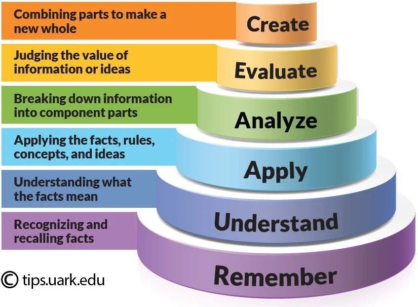


注意：创造，不是一下子创造所有细节
而是：先创造出骨架，再在骨架上填充上血和肉


------------> 所以，创造 和 化简 似乎说的是一件事情


 <a id='xuehuibiaozhun'>**<font color='red'>检验是否学会的标准（也是学习的方法）：</font>**  </a>

> 如果你没有极度化简，你就没有真正掌握
> 如果你没有创造出来，你就没有真正掌握


## 教育

https://www.campzhe.com/archives/1428   你们的孩子，并不是你们的孩子


## 性

萨古鲁：https://kknews.cc/news/5jxyxrk.html

​               https://www.bilibili.com/read/cv4760798


# 管理

管理也是技术，


## 管理他人

管理；
    1、管理的表格
    2、进度表格：（1）进度有时间  （2）进度有计划、有责任人、有  smart原则
    3、每天过进展，每天注上时间，保留历史记录

捅人：
高风险、请审视
针对进度表里的责任人，找到具体的责任人，再具体对进展

提问题：
    1、serdes是最复杂的接口—————-----> 所以，提问，关注了这一点
    2、必须提问，以怀疑的眼光进行对抗。。。。对抗才能有好的效果。。。不要一团和气


## 自我管理

### 每周checklist

跑步  ------>   为了头脑清晰，为了大脑快乐
冥想 
思考
阅读


时刻保持好心情，是一切做事的前提


看孩子视频
想象是你的亲人

金刚经

跨过门，十个俯卧撑


乐观

乐趣  ------>  为了大脑快乐

对一切新事物感兴趣（新事物必然战胜旧事物）

永远永远要有热情，不要做一个老人


记忆，与理解，图像+链接：
1、不要浮于文字----<font color='red'>看到文字，闭上眼，想象图像</font>

2、建立好   文字----图像的链接： 比如 迪米特法则，从文字很难知道是什么，但： 迪米特吃汉堡包


每天给自己洗脑：

我一定会成为顶尖的人才。一定会在技术上到达顶尖专家的水平。一定会成为管理水平高超之人

我厌恶性、食物、抖音这些低级欲望

我爱道，以及道后面的道。。。模型，模型

我珍惜一切时间

大我：我要推动整个行业的发展，我要成为时代的弄潮儿

我已经30岁了，没有多少时日了，我这辈子一定要为自己的人生做一件大事。

我要把生命献给我的事业。

你若真的喜欢编程，是拦不住的


### 时间管理

马斯克：  不按照 时间线 去 列计划     ------>  会造成一件事情，完成不了，其他事情都完成不了
               而是给每个任务安排 `时间限`  ，即：每一件事情最小的时间  ---->   Deadline是第一生產力


# 文章&演讲  list

## 丘成桐

http://wen.org.cn/modules/article/view.article.php/3956   丘成桐：数学与生活

虽然我得到政府奖学金的资助，我在闲暇时还须靠辅导学童挣钱。生活虽然很艰难，但我却学会`如何去应付这些困境，并从中取乐`。

`困难的环境可以令人变得更加成熟`。但是反过来说，`长久的`为生计奔波，对学者的成功却可能是有害的。毕竟，学者需要在一个稳定的环境下成长和发展，才能完成有深度的成果。我观察到历史上的伟大数学家之中，顶多百分之五的人在其整个职业生涯中都身处穷困。在历史上，我们看到一个社会，一个国家，在百战之余，都需要休养生息，才能成长。


## 陆奇 

《新范式 新时代 新机会----->  ---------- 陆奇 

https://www.youtube.com/watch?v=-LECKZqygzk

ppt： https://drive.google.com/file/d/1GVwHZAgUYMkjJ-kEGRAc1P_GPGbTAQ2j/view


本质是讲任何复杂体系，包括一个人、一家公司、一个社会，甚至数字化本身的数字化体系，都是复杂体系。“三位一体”包括：

1. “信息”系统（subsystem of information），从环境当中获得信息；
2. “模型”系统（subsystem of model），对信息做一种表达，进行推理和规划；
3. “行动”系统（subsystem of action），我们最终和环境做交互，达到人类想达到的目的。

----------------->  用三位一体来分析任何一个复杂系统


人是模型的组合，人有三种模型：

1. 认知模型，我们能看、能听、能思考、能规划；
2. 任务模型，我们能爬楼梯、搬椅子剥鸡蛋；
3. 领域模型，我们有些人是医生，有些人是律师，有些人是码农。


拐点：模型的成本从边际走向固定


## 普通聊天如何缓解尴尬？

------------`话题`来源：


# 关于辩论

## 辩论的前提

大多时候，我们为了驳倒对方，为了驳倒而驳倒

辩论的结果没有带来任何的利益与价值


# 翟东升2021年预测

1、中美关系局部回暖，但科技封锁会继续----> 中国
2、中欧双边协定会有反复
3、中国在解决卡脖子技术方法：基础软件、工业软件、芯片、光刻机有好消息传来！！！！
4、新冠疫苗成本竞争
5、人民币对美元将会继续保持一定的强势。


# 随时记录美好

-<font color='red'>美好的东西，本身就值钱</font>


1、比如联播：本质：联系

多屏幕联动

能拉起别人

----------->  

本质：联动，帮别人-------交互方式

扩展： 多屏输入法

2、美好： 本质：联系

perfetto 把图形trace 和 log结合到一起了，结合点时间

3、对于割裂的东西 尝试去联系；对于 联系的东西  尝试去 割裂：-------->  <font color='red'>思想</font>

----------> 例子： 多屏开机动画联动

4、荣耀任意门： -------->  背后思想：（1）、**减少路径**（复制、下载的） （2）、打破App之间的壁垒

技术：先识别内容，猜测可能使用APP，不同APP

疑问：需要应用侧去适配嘛？

5、 跟踪眼球  -------->  发微信，自动打开微信

6、全局收藏（三指） ----->  收藏网页/摘录视频至笔记

7、信任环-----------多设备协同

日程：

> 收集各个APP里面，关于时间日程方面的信息
>
> 语音创建日程----自然

搜图：

> 用AI大模型来搜索，包括视频


记录美好：

第一点苹果键盘同一个按键两个符号下拉是一个点击，是另一个号

> 基本思想是复用思想，复用位置，根据其他来区别—— ——目的：节省屏幕空间
>
> **同样的设计有**：button的长按与短按、图片的长按与 长按 + 移动

第2点：秒控键盘的手势是放在触摸键盘上—— ——目的：删除鼠标

第3点 ： 右上角的控制中心是一个统一的入口(仅限于几个App

第4点： Siri也是一个入口，但Siri本身有两种进入方式，一种是语音第二种是连续三次案件( 不需要语音对话


快捷键组合：

> ~~锁屏:  cmd + L~~
>
> --------------------> 与苹果输入法的（button： touch + 下拉） 一样


快速匹配、模糊匹配：

>   Tab按鍵、Ctrl + R （查找）、鼠标  ----->  TODO: 提炼本质


## 专利查询网站

https://patents.google.com/?q=(高斯模糊)&oq=高斯模糊