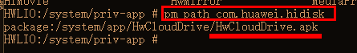
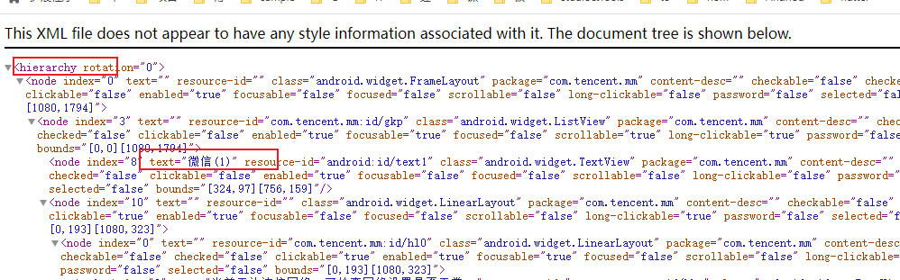
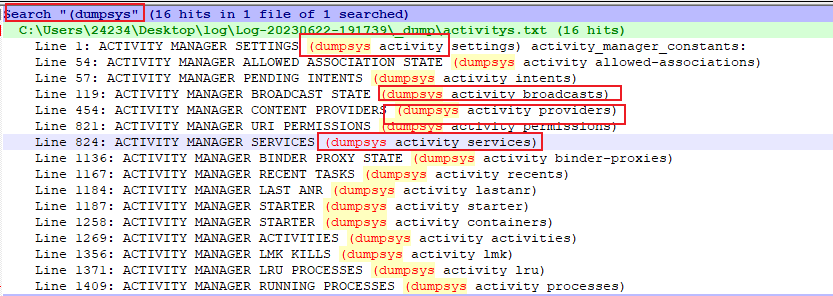

# 目标


# 手机命令


## 参考：

 https://droid10.com/Android/Android%E5%9F%BA%E7%A1%80%E6%93%8D%E4%BD%9C/


## 编译替换

```
adb root 
adb remount

adb shell rm -rf /system/framework/arm
adb shell rm -rf /system/framework/arm64
adb shell rm -rf /system/framework/oat/

adb push framework.jar   /system/framework
adb push services.jar   /system/framework

adb push libbinder.so  /system/lib

pause

adb reboot
```

-<font color='red'>注意：</font> **删除**这个目录下面的`oat`，`arm`，`arm64`三个目录(不删除会一直卡在开机动画)


## 手机恢复系统 

```c
adb shell rm -rf cache/overlay          手机恢复系统 》piexl不起作用
----》HW手机有作用！！！！！！包括system下的，以及预支apk
```

## 删除开机向导：

EMUI：

```
adb shell settings put secure hw_suw_frp_state 0
adb shell pm disable com.huawei.hwstartupguide
```


海外版本：（安卓原生）


删除云空间：(为什么要删除它呢？因为dump出来，激活界面是它的！！！！！！)

```
adb shell rm -rf /system/app/HwCloudDrive/HwCloudDrive.apk
```


## 页面 --> 包名 -> apk之间的关系

当前页面，如何找到当前页面的包名?  :adb shell dumpsys window w | findstr 

```
查看处于当前栈顶的Window和Activity
adb shell dumpsys window windows | findstr -E 'mCurrentFocus'
adb shell dumpsys activity | grep mFocusedActivity
```

由包名-----》apk路径：

HWLIO:/system/priv-app #   pm path com.huawei.hidisk
package:/system/app/HwCloudDrive/HwCloudDrive.apk



## 环境中 查看系统版本：

1、手机上直接查看：


2、命令：


## 安卓log的添加：

```
import android.util.Log;
Log.i(TAG, "chen, loadKeyboard start");
Log.i(TAG, "chen, loadKeyboard" + System.identityHashCode(Object));
Log.i(TAG, "chen, loadKeyboard" + Log.getStackTraceString(new Throwable())); // 调用栈


System.out.println(System.identityHashCode(Object))

adb shell dumpsys window
```

```cpp
//native

// 引入log头文件
#include  <android/log.h>
// log标签
#define  TAG    "chen1_native"
// 定义info信息
#define LOGI(...) __android_log_print(ANDROID_LOG_INFO,TAG,__VA_ARGS__)
// 定义debug信息
#define LOGD(...) __android_log_print(ANDROID_LOG_DEBUG, TAG, __VA_ARGS__)
// 定义error信息
#define LOGE(...) __android_log_print(ANDROID_LOG_ERROR,TAG,__VA_ARGS__)


LOGI("chen, array.length:%d", len);
android::CallStack cs("***********Parcel::initState(), chen***********")
```


native调用栈
https://blog.csdn.net/u013120422/article/details/108485664


```cpp
#include "utils/CallStack.h"

android::CallStack cs("***********Parcel::initState(), chen***********")
LOGI("array.length:%d", len);


shared_libs: [
        "libbase",
        "liblog", 
        "libcutils",
        "libutils",
        "libbinderthreadstate",
        "libutilscallstack", //引用动态库
    ],
```

```java
1.2、引用动态库
Andorid O以上
Android.mk: LOCAL_SHARED_LIBRARIES里包含libutilscallstack
Android.bp: shared_libs里包含libutilscallstack  //--->这里

Android O
Android.mk: LOCAL_SHARED_LIBRARIES里包含libutils
Android.bp: shared_libs里包含libutils

Android N 以前版本
Android.mk: LOCAL_SHARED_LIBRARIES里包含libutils

原文链接：https://blog.csdn.net/u013120422/article/details/108485664
```


## 抓log

### 实时log


```java
adb shell logcat -c  //清理
adb shell  logcat -v time > C:\Users\Administrator\Desktop\logcat.txt
```


### log脚本

```shell
adb remount
adb root
adb devices -l
if "%l"""(
    for /f "skip=1 tokens=1" %%i in ('adb devices-l') do (
        move %%i "%%i"bk
            adb -s %%i shell setprop persist.sys.hilog.debug.on true
            adb -s %%i shell setprop debug.ld.all dlerror,dlopen
            adb-s %%i pull datalog %%i
            adb-s %%i pull datatombstones %%i
            adb-s %%i logcat > %%i.txt
            )
)
pause
```

抓crash脚本：

 todo


全集脚本，getLogs.bat：  参考： https://droid10.com/Android/Android%E5%9F%BA%E7%A1%80%E6%93%8D%E4%BD%9C/  

```java
adb root

set d=%date:~0,4%%date:~5,2%%date:~8,2%
if %time:~0,2% LEQ 9 (set t=0%time:~1,1%%time:~3,2%%time:~6,2%) else (set t=%time:~0,2%%time:~3,2%%time:~6,2%) 
echo %d%-%t%
mkdir Log-%d%-%t%
cd Log-%d%-%t%

adb shell ps -A > ps.txt
::
::adb shell am dumpheap 1051 /data/local/tmp/system-server.hprof
:: 安装GitBash, 并将C:\Program Files\Git\usr\bin 加到环境变量 
:: grep system_server ps.txt | awk "{print $2}" | xargs -I {} echo adb shell am dumpheap {} /data/local/tmp/system-server.hprof > tmp.bat
::echo adb pull /data/local/tmp/system-server.hprof >> tmp.bat
::echo adb shell rm /data/local/tmp/system-server.hprof >> tmp.bat

::grep mediaserver ps.txt | awk "{print $2}" |xargs -I {} echo adb shell debuggerd -b {} "> mediaserver.txt"  >> tmp.bat

::echo exit >> tmp.bat
::start tmp.bat 
::cat tmp.bat

adb pull /data/logs
adb pull /data/anr
adb pull /data/tombstones
adb pull /data/system/dropbox
adb pull /sys/kernel/debug/binder

md _dump
cd _dump

::adb shell uiautomator dump /data/local/tmp/app.uix 
::adb pull /data/local/tmp/app.uix
::dump view的层级
adb shell uiautomator dump --compressed /data/local/tmp/uidump.xml && adb pull /data/local/tmp/uidump.xml


adb shell screencap -p /sdcard/app.png
adb pull /sdcard/app.png

::dump view的层级
adb shell top -n 1 > top.txt
adb shell free -m > free.txt
adb shell procrank > procrank.txt

adb shell dumpsys > dumpsys.txt
::dumpsys.txt包括了所有的服务
:: 重点的两个服务，AMS 和WMS
adb shell dumpsys activity > AMS_dump.txt
adb shell dumpsys window > WMS_dump.txt

adb shell dumpsys car_service  > dumpsys_car_service.txt
adb shell dumpsys meminfo system_server > system_server_mem.txt
adb shell dumpsys meminfo mediaserver > mediaserver_mem.txt
adb shell dmesg > dmsg.txt
cd ..

adb shell perfetto -o /data/misc/perfetto-traces/trace_file.perfetto-trace -t 30s sched freq idle am wm gfx view binder_driver hal dalvik camera input res memory
adb pull /data/misc/perfetto-traces/trace_file.perfetto-trace

del tmp.bat
cd ..

pause
```


## 软件唯一，核心法则--------结构：

事物本身的结构 --------------------> 对应的代码结构  
                    需要的描述量
事物本身的结构 的变化--------------------> 对应代码结构 描述量的变化

观察点：

> 事物本身 -----> 最好是肉眼可见的图形化的。。比如view本身、比如google做的view显示工具。截图
> dump出代码结构的状态。。比如xml


------> TODO:  从设计的角度理解google的做法，工具、dump、代码结构

中间化的工具，xml变成图形界面，可以点击
------->  即使利用工具，也要向图形化靠（人对图形理解力 与 文字理解力，不在一个数量级上）


理解事物、理解业务、理解代码、添加维测，最深刻的就是理解结构
------>  所以，dump出结构是非常重要的。尤其是图形化的结构


（软件唯一，核心法则--------结构）  ----> 这也是dump工具背后的思想


所以，整个软件的理解就是： 

> 结构 + 结构的演变（即算法）

再具体一点：

> Frame1 (结构)--------> Frame2(结构)    + 两帧之间变化的算法

再再具体一点：

> 0  ----> 初始化ok状态，
>
> 初始化OK状态----->  下一阶段状态


所以，我们**首要 理解是 结构**，其次是**基于结构**  的演化


举例子1:

如何理解activity1启动activity2的流程？

我们关注点应该是  调用栈嘛： 流程1-----》流程2----》流程3----》流程4 ？？？<font color='red'>  错误！！！</font>

-<font color='red'>  基于结构的认识论：！！</font>

> Frame1下（物理界面状态、AMS侧stack状态、task状态，wms侧window的结构的状态）
>
> Frame2下（物理界面状态、AMS侧stack状态、task状态，wms侧window的结构的状态）
>
> Frame1下状态，到Frame2，是如何变化的？


## 关于整个屏幕<font color='red'>结构</font>的dump、观察

TODO：https://zhuanlan.zhihu.com/p/589688318    透视Android WindowManagerService

### Activity的结构

视图结构，见viewTree的结构观察

activity所在位置结构：有哪些维度？

（1）在哪个进程？

（2）在哪个task里，task结构怎么样？

（3）在哪个stack里，stack结构怎么样？

（4）对应的Intent是啥，被谁唤起来的？

（5）尺寸

。。。。。。。。


见《AMS的dump》

### window的结构


### viewTree的结构观察：

方法一：dump出具体的数字

```java
adb shell uiautomator dump --compressed /data/local/tmp/uidump.xml && adb pull /data/local/tmp/uidump.xml
```



方法二：

截图，使用dpx测量工具

方法三<font color='red'>（极优</font>）：

> AS工具：Tools  ---->  Layout Inspector
>
> 具体见《systrace.md》


## 安卓的dump工具详解

dumpsys ----总命令：

```java
adb shell dumpsys > dumpsys.txt
```

1、dump出 <font color='red'>系统</font>当前的所有正在运行的服务的信息，~~总共多达67000行~~（总共170个服务）

-----------> （1） dump出来的是 <font color='red'>整个系统</font>  ------->十分自然，了解一个系统，就要了解整个系统的frame结构

​                 （2） **dump的是服务侧，不是APP侧的数据**：

​                         服务侧是所有数据的**汇聚处**，好一次性dump

​                        服务侧也是**各种数据的决定者**，最后才同步给APP


```cpp
// dumpsys.txt
// 主要的几个：
Currently running services:
  SurfaceFlinger  
  accessibility  //----> accessibilityMS
  activity     //----> AMS
  ..............
  cpuinfo
  display
  dropbox
  hardware
  input        //----> IMS
  input_method //----> IMMS
  ..............
  window        //----> WMS
————————————————

```

注意：那么多服务之间，很容易出问题！！！这里也是保证不出问题的关键，保证每一帧dump都OK


~~每个服务信息之间使用横线间隔~~

### AMS的dump

```java
adb shell dumpsys activity > AMS_dump.txt
```

~~或从  dumpsys.txt中找：~~

```
-------------------------------------------------------------------------------
DUMP OF SERVICE activity:
```


-<font color='red'>文件分析：</font>

1、**文件结构：**

搜索 dumpsys，可见是四大组件的管理者：activity、service、broadcast、provider

 注：括号里是命令




2、ACTIVITY MANAGER SETTINGS (dumpsys activity settings)     ------> 做啥的？TODO

3、ACTIVITY MANAGER PENDING INTENTS (dumpsys activity intents)

​    记录当前**待处理的Intent**（AMS运行中，有些Intent还没处理完）  场景：TODO

​	参考： https://blog.csdn.net/zhangjg_blog/article/details/39852309

   

```java
ACTIVITY MANAGER PENDING INTENTS (dumpsys activity intents)
  * com.android.providers.calendar: 1 items
    #0: PendingIntentRecord{b70c970 com.android.providers.calendar broadcastIntent}
  * com.sohu.inputmethod.sogou: 2 items
    #0: PendingIntentRecord{72c156e com.sohu.inputmethod.sogou broadcastIntent}
    #1: PendingIntentRecord{d60d40f com.sohu.inputmethod.sogou broadcastIntent}
  * com.android.quicksearchbox: 1 items
    #0: PendingIntentRecord{5710c9c com.android.quicksearchbox startActivity}
  * com.tencent.mm: 13 items  //【】微信发出了13个Intent，AMS还没处理(包括 发送广播的、启动服务的)
    #0: PendingIntentRecord{b3e1ef4 com.tencent.mm broadcastIntent}
    #1: PendingIntentRecord{3881a7a com.tencent.mm broadcastIntent}
    #2: PendingIntentRecord{d60a22b com.tencent.mm startService}
    #3: PendingIntentRecord{bd05688 com.tencent.mm startService}
```


4、activity相关的：(dumpsys activity **activities)**    

Frame1：在微信主页面


%accordion%展开%accordion%

```java
ACTIVITY MANAGER ACTIVITIES (dumpsys activity activities) // 表明是activities
Display #0 (activities from top to bottom):  //Display 0 因为一个屏幕

  Stack #2: type=standard mode=fullscreen     // Stack 结构：  类型？全屏模式？
  isSleeping=false                           // 是否在后台？
  mBounds=Rect(0, 0 - 0, 0)                  // 大小
    Task id #49
    mBounds=Rect(0, 0 - 0, 0)
    mMinWidth=-1
    mMinHeight=-1
    mLastNonFullscreenBounds=null
    * TaskRecord{c30999d #49 A=com.tencent.mm U=0 StackId=2 sz=1}  //【】所处的task？？
      userId=0 effectiveUid=u0a133 mCallingUid=u0a80 mUserSetupComplete=true mCallingPackage=com.android.launcher3
      affinity=com.tencent.mm   // userId 
      intent={act=android.intent.action.MAIN cat=[android.intent.category.LAUNCHER] flg=0x10200000 cmp=com.tencent.mm/.ui.LauncherUI}  //【】 启动信息:  该actvity被 LAUNCHER 拉起来的
      mActivityComponent=com.tencent.mm/.ui.LauncherUI  //【】这个actvity实例是 LauncherUI类的实例，是 com.tencent.mm 应用的
      autoRemoveRecents=false isPersistable=true numFullscreen=1 activityType=1  // activityType? TODO
      rootWasReset=true mNeverRelinquishIdentity=true mReuseTask=false mLockTaskAuth=LOCK_TASK_AUTH_PINNABLE
      Activities=[ActivityRecord{3c203df u0 com.tencent.mm/.ui.LauncherUI t49}] //【】这个actvity实例是 LauncherUI类的实例
      askedCompatMode=false inRecents=true isAvailable=true
      mRootProcess=ProcessRecord{b902b90 8627:com.tencent.mm/u0a133}
      stackId=2
      hasBeenVisible=true mResizeMode=RESIZE_MODE_RESIZEABLE_VIA_SDK_VERSION mSupportsPictureInPicture=false isResizeable=true lastActiveTime=728733 (inactive for 71s) // 【】此时应该可见了
        Hist #0: ActivityRecord{3c203df u0 com.tencent.mm/.ui.LauncherUI t49}
          Intent { act=android.intent.action.MAIN cat=[android.intent.category.LAUNCHER] flg=0x10200000 cmp=com.tencent.mm/.ui.LauncherUI bnds=[237,84][439,361] }  // TODO: 这里和上面什么区别？
          ProcessRecord{b902b90 8627:com.tencent.mm/u0a133}  

    Running activities (most recent first): //TODO:什么叫正在运行的？
      TaskRecord{c30999d #49 A=com.tencent.mm U=0 StackId=2 sz=1}
        Run #0: ActivityRecord{3c203df u0 com.tencent.mm/.ui.LauncherUI t49}

    mResumedActivity: ActivityRecord{3c203df u0 com.tencent.mm/.ui.LauncherUI t49} // 【】mResumedActivity，非常重要的标志，标志activity已经真正可见！！！！！！！！

  Stack #0: type=home mode=fullscreen   // Stack #0  TODO:没有Stack #1？？？
  isSleeping=false
  mBounds=Rect(0, 0 - 0, 0)

    Task id #47
    mBounds=Rect(0, 0 - 0, 0)
    mMinWidth=-1
    mMinHeight=-1
    mLastNonFullscreenBounds=null
    * TaskRecord{1c2adb3 #47 I=com.android.launcher3/.Launcher U=0 StackId=0 sz=1} // 【】launcher的task？？？？
      userId=0 effectiveUid=u0a80 mCallingUid=u0a80 mUserSetupComplete=true mCallingPackage=com.android.launcher3
      intent={act=android.intent.action.MAIN cat=[android.intent.category.HOME] flg=0x10000100 cmp=com.android.launcher3/.Launcher} // launcher的页面是被HOME调起来的，实际上是系统ready
      mActivityComponent=com.android.launcher3/.Launcher
      autoRemoveRecents=false isPersistable=true numFullscreen=1 activityType=2
      rootWasReset=false mNeverRelinquishIdentity=true mReuseTask=false mLockTaskAuth=LOCK_TASK_AUTH_PINNABLE
      Activities=[ActivityRecord{a4790b1 u0 com.android.launcher3/.Launcher t47}]
      askedCompatMode=false inRecents=true isAvailable=true
      mRootProcess=ProcessRecord{5f0411c 1996:com.android.launcher3/u0a80}
      stackId=0
      hasBeenVisible=true mResizeMode=RESIZE_MODE_RESIZEABLE mSupportsPictureInPicture=false isResizeable=true lastActiveTime=719656 (inactive for 80s)
        Hist #0: ActivityRecord{a4790b1 u0 com.android.launcher3/.Launcher t47}//【】栈中Activity调用历史
          Intent { act=android.intent.action.MAIN cat=[android.intent.category.HOME] flg=0x10000100 cmp=com.android.launcher3/.Launcher }
          ProcessRecord{5f0411c 1996:com.android.launcher3/u0a80}

    Running activities (most recent first):
      TaskRecord{1c2adb3 #47 I=com.android.launcher3/.Launcher U=0 StackId=0 sz=1}
        Run #0: ActivityRecord{a4790b1 u0 com.android.launcher3/.Launcher t47}

 ResumedActivity:ActivityRecord{3c203df u0 com.tencent.mm/.ui.LauncherUI t49}

  ResumedActivity: ActivityRecord{3c203df u0 com.tencent.mm/.ui.LauncherUI t49}

ActivityStackSupervisor state:
  topDisplayFocusedStack=ActivityStack{bed6e12 stackId=2 type=standard mode=fullscreen visible=true translucent=false, 1 tasks}
  displayId=0 stacks=2
   mHomeStack=ActivityStack{4b0720f stackId=0 type=home mode=fullscreen visible=false translucent=true, 1 tasks}
   mPreferredTopFocusableStack=ActivityStack{bed6e12 stackId=2 type=standard mode=fullscreen visible=true translucent=false, 1 tasks}
   mLastFocusedStack=ActivityStack{bed6e12 stackId=2 type=standard mode=fullscreen visible=true translucent=false, 1 tasks}
  mCurTaskIdForUser={0=49}
  mUserStackInFront={}
  isHomeRecentsComponent=true  KeyguardController:
    mKeyguardShowing=false
    mAodShowing=false
    mKeyguardGoingAway=false
    Occluded=false DismissingKeyguardActivity=null at display=0
    mDismissalRequested=false
    mVisibilityTransactionDepth=0
  LockTaskController
    mLockTaskModeState=NONE
    mLockTaskModeTasks=
    mLockTaskPackages (userId:packages)=
      u0:[]
```


launcher 把 tencent 拉起来，却不在一个stack里，好像也不在一个task里？？

%/accordion%


Frame2：基于Frame1点击搜索 后的页面


%accordion%展开%accordion%

```java
ACTIVITY MANAGER ACTIVITIES (dumpsys activity activities)
Display #0 (activities from top to bottom):

  Stack #2: type=standard mode=fullscreen
  isSleeping=false
  mBounds=Rect(0, 0 - 0, 0)
    Task id #49
    mBounds=Rect(0, 0 - 0, 0)
    mMinWidth=-1
    mMinHeight=-1
    mLastNonFullscreenBounds=null
    * TaskRecord{c30999d #49 A=com.tencent.mm U=0 StackId=2 sz=2} //【】task没有变（都是微信创建的task），因为跳跳跳没有断
      userId=0 effectiveUid=u0a133 mCallingUid=u0a80 mUserSetupComplete=true mCallingPackage=com.android.launcher3
      affinity=com.tencent.mm
      intent={act=android.intent.action.MAIN cat=[android.intent.category.LAUNCHER] flg=0x10200000 cmp=com.tencent.mm/.ui.LauncherUI}
      mActivityComponent=com.tencent.mm/.ui.LauncherUI
      autoRemoveRecents=false isPersistable=true numFullscreen=1 activityType=1
      rootWasReset=true mNeverRelinquishIdentity=true mReuseTask=false mLockTaskAuth=LOCK_TASK_AUTH_PINNABLE
      Activities=[ActivityRecord{3c203df u0 com.tencent.mm/.ui.LauncherUI t49}, ActivityRecord{223ab1e u0 com.tencent.mm/.plugin.fts.ui.FTSMainUI t49}]
      askedCompatMode=false inRecents=true isAvailable=true
      mRootProcess=ProcessRecord{b902b90 8627:com.tencent.mm/u0a133}
      stackId=2
      hasBeenVisible=true mResizeMode=RESIZE_MODE_RESIZEABLE_VIA_SDK_VERSION mSupportsPictureInPicture=false isResizeable=true lastActiveTime=856993 (inactive for 57s)
        Hist #1: ActivityRecord{223ab1e u0 com.tencent.mm/.plugin.fts.ui.FTSMainUI t49}
          Intent { cmp=com.tencent.mm/.plugin.fts.ui.FTSMainUI (has extras) }
          ProcessRecord{b902b90 8627:com.tencent.mm/u0a133}
        Hist #0: ActivityRecord{3c203df u0 com.tencent.mm/.ui.LauncherUI t49}
          Intent { act=android.intent.action.MAIN cat=[android.intent.category.LAUNCHER] flg=0x10200000 cmp=com.tencent.mm/.ui.LauncherUI bnds=[237,84][439,361] }
          ProcessRecord{b902b90 8627:com.tencent.mm/u0a133}

    Running activities (most recent first):
      TaskRecord{c30999d #49 A=com.tencent.mm U=0 StackId=2 sz=2}  //【】该task（跳跳跳） 有两个界面： LauncherUI -> FTSMainUI 
        Run #1: ActivityRecord{223ab1e u0 com.tencent.mm/.plugin.fts.ui.FTSMainUI t49}
        Run #0: ActivityRecord{3c203df u0 com.tencent.mm/.ui.LauncherUI t49}

    mResumedActivity: ActivityRecord{223ab1e u0 com.tencent.mm/.plugin.fts.ui.FTSMainUI t49} //【】当前界面是 FTSMainUI

  Stack #0: type=home mode=fullscreen  //【】 Stack 0 是launcher，不变
  isSleeping=false
  mBounds=Rect(0, 0 - 0, 0)

    Task id #47
    mBounds=Rect(0, 0 - 0, 0)
    mMinWidth=-1
    mMinHeight=-1
    mLastNonFullscreenBounds=null
    * TaskRecord{1c2adb3 #47 I=com.android.launcher3/.Launcher U=0 StackId=0 sz=1}
      userId=0 effectiveUid=u0a80 mCallingUid=u0a80 mUserSetupComplete=true mCallingPackage=com.android.launcher3
      intent={act=android.intent.action.MAIN cat=[android.intent.category.HOME] flg=0x10000100 cmp=com.android.launcher3/.Launcher}
      mActivityComponent=com.android.launcher3/.Launcher
      autoRemoveRecents=false isPersistable=true numFullscreen=1 activityType=2
      rootWasReset=false mNeverRelinquishIdentity=true mReuseTask=false mLockTaskAuth=LOCK_TASK_AUTH_PINNABLE
      Activities=[ActivityRecord{a4790b1 u0 com.android.launcher3/.Launcher t47}]
      askedCompatMode=false inRecents=true isAvailable=true
      mRootProcess=ProcessRecord{5f0411c 1996:com.android.launcher3/u0a80}
      stackId=0
      hasBeenVisible=true mResizeMode=RESIZE_MODE_RESIZEABLE mSupportsPictureInPicture=false isResizeable=true lastActiveTime=719656 (inactive for 195s)
        Hist #0: ActivityRecord{a4790b1 u0 com.android.launcher3/.Launcher t47}
          Intent { act=android.intent.action.MAIN cat=[android.intent.category.HOME] flg=0x10000100 cmp=com.android.launcher3/.Launcher }
          ProcessRecord{5f0411c 1996:com.android.launcher3/u0a80}

    Running activities (most recent first):
      TaskRecord{1c2adb3 #47 I=com.android.launcher3/.Launcher U=0 StackId=0 sz=1}
        Run #0: ActivityRecord{a4790b1 u0 com.android.launcher3/.Launcher t47}

 ResumedActivity:ActivityRecord{223ab1e u0 com.tencent.mm/.plugin.fts.ui.FTSMainUI t49}

  ResumedActivity: ActivityRecord{223ab1e u0 com.tencent.mm/.plugin.fts.ui.FTSMainUI t49}

ActivityStackSupervisor state:
  topDisplayFocusedStack=ActivityStack{bed6e12 stackId=2 type=standard mode=fullscreen visible=true translucent=false, 1 tasks}
  displayId=0 stacks=2
   mHomeStack=ActivityStack{4b0720f stackId=0 type=home mode=fullscreen visible=false translucent=true, 1 tasks}
   mPreferredTopFocusableStack=ActivityStack{bed6e12 stackId=2 type=standard mode=fullscreen visible=true translucent=false, 1 tasks}   //【】mHomeStack 用作桌面的
   mLastFocusedStack=ActivityStack{bed6e12 stackId=2 type=standard mode=fullscreen visible=true translucent=false, 1 tasks}
  mCurTaskIdForUser={0=49}  //【】最后获焦的stack，即微信产生的那个
  mUserStackInFront={}
  isHomeRecentsComponent=true  KeyguardController:
    mKeyguardShowing=false
    mAodShowing=false
    mKeyguardGoingAway=false
    Occluded=false DismissingKeyguardActivity=null at display=0
    mDismissalRequested=false
    mVisibilityTransactionDepth=0
  LockTaskController
    mLockTaskModeState=NONE
    mLockTaskModeTasks=
    mLockTaskPackages (userId:packages)=
      u0:[]

```


%/accordion%

### WMS的dump

```
adb shell dumpsys window > WMS_dump.txt
```


#### 文件结构


为什么有两个display，不一样？

#### dumpsys window lastanr

#### dumpsys window displays


%accordion%展开%accordion%

```java
WINDOW MANAGER DISPLAY CONTENTS (dumpsys window displays)
  Display: mDisplayId=0  // 一般只有一个
    init=1080x1920 420dpi cur=1080x1920 app=1080x1794 rng=1080x1017-1794x1731
    deferred=false mLayoutNeeded=false mTouchExcludeRegion=SkRegion((0,0,1080,1920))

  mLayoutSeq=825  // ?
  mDeferredRotationPauseCount=0
  mCurrentFocus=Window{267a445 u0 com.tencent.mm/com.tencent.mm.plugin.fts.ui.FTSMainUI}  // 当前是tencent的搜索界面
  mFocusedApp=AppWindowToken{afbe8c7 token=Token{a582a06 ActivityRecord{229bce1 u0 com.tencent.mm/.plugin.fts.ui.FTSMainUI t90}}}
  mLastStatusBarVisibility=0x8008

  displayId=0
  mWallpaperTarget=null
  mLastWallpaperX=0.33333334 mLastWallpaperY=0.5

mSystemGestureExclusion=<no lstnrs>

  Application tokens in top down Z order: // Z order 顺序
    mStackId=19
    mDeferRemoval=false
    mBounds=[0,0][1080,1920]  //
      taskId=90
        mBounds=[0,0][1080,1920]
        mdr=false
        appTokens=[AppWindowToken{5320efa token=Token{ba10d25 ActivityRecord{fcfcd1c u0 com.tencent.mm/.ui.LauncherUI t90}}}, AppWindowToken{afbe8c7 token=Token{a582a06 ActivityRecord{229bce1 u0 com.tencent.mm/.plugin.fts.ui.FTSMainUI t90}}}]
        mDisplayedBounds=[0,0][0,0]
          Activity #1 AppWindowToken{afbe8c7 token=Token{a582a06 ActivityRecord{229bce1 u0 com.tencent.mm/.plugin.fts.ui.FTSMainUI t90}}}
            windows=[Window{267a445 u0 com.tencent.mm/com.tencent.mm.plugin.fts.ui.FTSMainUI}] //  FTSMainUI的窗口
            windowType=2 hidden=false hasVisible=true // 窗口可见性
            app=true mVoiceInteraction=false
            component=com.tencent.mm/.plugin.fts.ui.FTSMainUI
            task={taskId=90 appTokens=[AppWindowToken{5320efa token=Token{ba10d25 ActivityRecord{fcfcd1c u0 com.tencent.mm/.ui.LauncherUI t90}}}, AppWindowToken{afbe8c7 token=Token{a582a06 ActivityRecord{229bce1 u0 com.tencent.mm/.plugin.fts.ui.FTSMainUI t90}}}] mdr=false}
             mFillsParent=false mOrientation=1
            hiddenRequested=false mClientHidden=false reportedDrawn=true reportedVisible=true
            mNumInterestingWindows=2 mNumDrawnWindows=2 inPendingTransaction=false allDrawn=true lastAllDrawn=true)
            startingData=null removed=false firstWindowDrawn=true mIsExiting=false
          Activity #0 AppWindowToken{5320efa token=Token{ba10d25 ActivityRecord{fcfcd1c u0 com.tencent.mm/.ui.LauncherUI t90}}} // tencent最初的activity
            windows=[Window{866c225 u0 com.tencent.mm/com.tencent.mm.ui.LauncherUI}]
            windowType=2 hidden=false hasVisible=true
            app=true mVoiceInteraction=false
            component=com.tencent.mm/.ui.LauncherUI
            task={taskId=90 appTokens=[AppWindowToken{5320efa token=Token{ba10d25 ActivityRecord{fcfcd1c u0 com.tencent.mm/.ui.LauncherUI t90}}}, AppWindowToken{afbe8c7 token=Token{a582a06 ActivityRecord{229bce1 u0 com.tencent.mm/.plugin.fts.ui.FTSMainUI t90}}}] mdr=false}
             mFillsParent=true mOrientation=1
            hiddenRequested=false mClientHidden=false reportedDrawn=true reportedVisible=true
            mNumInterestingWindows=1 mNumDrawnWindows=1 inPendingTransaction=false allDrawn=true lastAllDrawn=true)
            startingData=null removed=false firstWindowDrawn=true mIsExiting=false
    mStackId=0  // 对应launcher
    mDeferRemoval=false
    mBounds=[0,0][1080,1920]
      taskId=71
        mBounds=[0,0][1080,1920]
        mdr=false
        appTokens=[AppWindowToken{b3377dc token=Token{cc8e44f ActivityRecord{653eae u0 com.android.launcher3/.Launcher t71}}}]
        mDisplayedBounds=[0,0][0,0]
          Activity #0 AppWindowToken{b3377dc token=Token{cc8e44f ActivityRecord{653eae u0 com.android.launcher3/.Launcher t71}}}
            windows=[Window{7e835a0 u0 com.android.launcher3/com.android.launcher3.Launcher}]
            windowType=2 hidden=true hasVisible=true
            app=true mVoiceInteraction=false
            component=com.android.launcher3/.Launcher
            task={taskId=71 appTokens=[AppWindowToken{b3377dc token=Token{cc8e44f ActivityRecord{653eae u0 com.android.launcher3/.Launcher t71}}}] mdr=false}
             mFillsParent=true mOrientation=5
            hiddenRequested=true mClientHidden=true reportedDrawn=false reportedVisible=false
            mAppStopped=true
            mNumInterestingWindows=1 mNumDrawnWindows=1 inPendingTransaction=false allDrawn=true lastAllDrawn=true)
            startingData=null removed=false firstWindowDrawn=true mIsExiting=false
    mStackId=15   // 对应settings（在此之后，又退回launcher）
    mDeferRemoval=false
    mBounds=[0,0][1080,1920]
      taskId=86
        mBounds=[0,0][1080,1920]
        mdr=false
        appTokens=[AppWindowToken{9b2d0f3 token=Token{f6e2762 ActivityRecord{2e6262d u0 com.android.settings/.Settings t86}}}, AppWindowToken{bf1ee3a token=Token{c83e165 ActivityRecord{4644a5c u0 com.android.settings/.SubSettings t86}}}, AppWindowToken{c1d119a token=Token{761f645 ActivityRecord{10c26bc u0 com.android.settings/.SubSettings t86}}}]
        mDisplayedBounds=[0,0][0,0]
          Activity #2 AppWindowToken{c1d119a token=Token{761f645 ActivityRecord{10c26bc u0 com.android.settings/.SubSettings t86}}}
            windows=[Window{6c14d20 u0 com.android.settings/com.android.settings.SubSettings}] // 在Settings里，我跳转了三次，有三个activity
            windowType=2 hidden=true hasVisible=true
            app=true mVoiceInteraction=false
            component=com.android.settings/.SubSettings
            task={taskId=86 appTokens=[AppWindowToken{9b2d0f3 token=Token{f6e2762 ActivityRecord{2e6262d u0 com.android.settings/.Settings t86}}}, AppWindowToken{bf1ee3a token=Token{c83e165 ActivityRecord{4644a5c u0 com.android.settings/.SubSettings t86}}}, AppWindowToken{c1d119a token=Token{761f645 ActivityRecord{10c26bc u0 com.android.settings/.SubSettings t86}}}] mdr=false}
             mFillsParent=true mOrientation=-1
            hiddenRequested=true mClientHidden=true reportedDrawn=false reportedVisible=false
            mAppStopped=true
            mNumInterestingWindows=1 mNumDrawnWindows=1 inPendingTransaction=false allDrawn=true lastAllDrawn=true)
            startingData=null removed=false firstWindowDrawn=true mIsExiting=false
          Activity #1 AppWindowToken{bf1ee3a token=Token{c83e165 ActivityRecord{4644a5c u0 com.android.settings/.SubSettings t86}}}
            windows=[Window{5343dde u0 com.android.settings/com.android.settings.SubSettings}]
            windowType=2 hidden=true hasVisible=true
            app=true mVoiceInteraction=false
            component=com.android.settings/.SubSettings
            task={taskId=86 appTokens=[AppWindowToken{9b2d0f3 token=Token{f6e2762 ActivityRecord{2e6262d u0 com.android.settings/.Settings t86}}}, AppWindowToken{bf1ee3a token=Token{c83e165 ActivityRecord{4644a5c u0 com.android.settings/.SubSettings t86}}}, AppWindowToken{c1d119a token=Token{761f645 ActivityRecord{10c26bc u0 com.android.settings/.SubSettings t86}}}] mdr=false}
             mFillsParent=true mOrientation=-1
            hiddenRequested=true mClientHidden=true reportedDrawn=false reportedVisible=false
            mAppStopped=true
            mNumInterestingWindows=1 mNumDrawnWindows=1 inPendingTransaction=false allDrawn=true lastAllDrawn=true)
            startingData=null removed=false firstWindowDrawn=true mIsExiting=false
          Activity #0 AppWindowToken{9b2d0f3 token=Token{f6e2762 ActivityRecord{2e6262d u0 com.android.settings/.Settings t86}}}
            windows=[Window{9103d82 u0 com.android.settings/com.android.settings.Settings}]
            windowType=2 hidden=true hasVisible=true
            app=true mVoiceInteraction=false
            component=com.android.settings/.homepage.SettingsHomepageActivity
            task={taskId=86 appTokens=[AppWindowToken{9b2d0f3 token=Token{f6e2762 ActivityRecord{2e6262d u0 com.android.settings/.Settings t86}}}, AppWindowToken{bf1ee3a token=Token{c83e165 ActivityRecord{4644a5c u0 com.android.settings/.SubSettings t86}}}, AppWindowToken{c1d119a token=Token{761f645 ActivityRecord{10c26bc u0 com.android.settings/.SubSettings t86}}}] mdr=false}
             mFillsParent=true mOrientation=-1
            hiddenRequested=true mClientHidden=true reportedDrawn=false reportedVisible=false
            mAppStopped=true
            mNumInterestingWindows=1 mNumDrawnWindows=1 inPendingTransaction=false allDrawn=true lastAllDrawn=true)
            startingData=null removed=false firstWindowDrawn=true mIsExiting=false


  homeStack=Stack=0

  DockedStackDividerController
    mLastVisibility=false
    mMinimizedDock=false
    mAdjustedForIme=false  // 没有adjust，因为底下窗口1080,1920还是全屏 ------> 奇怪的是，没有输入法的？
    mAdjustedForDivider=false

  PinnedStackController
    defaultBounds=[533,622][1038,906]
    mDefaultMinSize=284
    mDefaultStackGravity=85
    mDefaultAspectRatio=1.777778
    movementBounds=[42,105][1038,906]
    mIsImeShowing=true
    mImeHeight=846
    mIsShelfShowing=false
    mShelfHeight=262
    mReentrySnapFraction=-1.0
    mIsMinimized=false
    mAspectRatio=1.777778
    mMinAspectRatio=0.41841003
    mMaxAspectRatio=2.39
    mActions=[]
    mDisplayInfo=DisplayInfo{"内置屏幕, displayId 0", uniqueId "local:0", app 1080 x 1794, real 1080 x 1920, largest app 1794 x 1731, smallest app 1080 x 1017, mode 1, defaultMode 1, modes [{id=1, width=1080, height=1920, fps=60.000004}], colorMode 0, supportedColorModes [0, 7], hdrCapabilities android.view.Display$HdrCapabilities@40f16308, rotation 0, density 420 (442.451 x 443.345) dpi, layerStack 0, appVsyncOff 2000000, presDeadline 11666666, type BUILT_IN, address {port=0}, state ON, FLAG_SECURE, FLAG_SUPPORTS_PROTECTED_BUFFERS, removeMode 0}

  DisplayFrames w=1080 h=1920 r=0
    mStable=[0,63][1080,1794]
    mStableFullscreen=[0,0][1080,1794]
    mDock=[0,63][1080,1794]
    mCurrent=[0,63][1080,948]
    mSystem=[0,0][1080,1920]
    mContent=[0,63][1080,948]
    mVoiceContent=[0,63][1080,948]
    mOverscan=[0,0][1080,1920]
    mRestrictedOverscan=[0,0][1080,1794]
    mRestricted=[0,0][1080,1794]
    mUnrestricted=[0,0][1080,1920]
    mDisplayInfoOverscan=[0,0][0,0]
    mRotatedDisplayInfoOverscan=[0,0][0,0]
    mDisplayCutout=WmDisplayCutout{DisplayCutout{insets=Rect(0, 0 - 0, 0) boundingRect={Bounds=[Rect(0, 0 - 0, 0), Rect(0, 0 - 0, 0), Rect(0, 0 - 0, 0), Rect(0, 0 - 0, 0)]}}, mFrameSize=null}

  DisplayPolicy    mCarDockEnablesAccelerometer=true mDeskDockEnablesAccelerometer=true
    mDockMode=EXTRA_DOCK_STATE_UNDOCKED mLidState=LID_OPEN
    mAwake=true mScreenOnEarly=true mScreenOnFully=true
    mKeyguardDrawComplete=true mWindowManagerDrawComplete=true
    mHdmiPlugged=false
    mLastSystemUiFlags=0x8008 mResettingSystemUiFlags=0x0 mForceClearedSystemUiFlags=0x0
    mShowingDream=false mDreamingLockscreen=false mDreamingSleepToken=null
    mStatusBar=Window{f83a40d u0 StatusBar} isStatusBarKeyguard=false
    mNavigationBar=Window{14de074 u0 NavigationBar0}
    mNavBarOpacityMode=0
    mNavigationBarCanMove=true
    mNavigationBarPosition=4
    mFocusedWindow=Window{267a445 u0 com.tencent.mm/com.tencent.mm.plugin.fts.ui.FTSMainUI}
    mFocusedApp=Token{a582a06 ActivityRecord{229bce1 u0 com.tencent.mm/.plugin.fts.ui.FTSMainUI t90}}
    mTopFullscreenOpaqueWindowState=Window{267a445 u0 com.tencent.mm/com.tencent.mm.plugin.fts.ui.FTSMainUI}
    mTopFullscreenOpaqueOrDimmingWindowState=Window{267a445 u0 com.tencent.mm/com.tencent.mm.plugin.fts.ui.FTSMainUI}
    mForcingShowNavBar=true
    mForcingShowNavBarLayer=0
    mTopIsFullscreen=false    mForceStatusBar=false mForceStatusBarFromKeyguard=false
 mForceShowSystemBarsFromExternal=false
    mAllowLockscreenWhenOn=false
    BarController.StatusBar
      mState=WINDOW_STATE_SHOWING
      mTransientBar=TRANSIENT_BAR_NONE
      mContentFrame=Rect(0, 0 - 1080, 63)
    BarController.NavigationBar
      mState=WINDOW_STATE_SHOWING
      mTransientBar=TRANSIENT_BAR_NONE
      mContentFrame=Rect(0, 1794 - 1080, 1920)
    Looper state:
      Looper (android.ui, tid 20) {ec23c4e}
        (Total messages: 0, polling=true, quitting=false)

  DisplayRotation
    mCurrentAppOrientation=SCREEN_ORIENTATION_PORTRAIT
    mLandscapeRotation=ROTATION_90 mSeascapeRotation=ROTATION_270
    mPortraitRotation=ROTATION_0 mUpsideDownRotation=ROTATION_180
    mSupportAutoRotation=true
    WindowOrientationListener
      mEnabled=true
      mCurrentRotation=ROTATION_0
      mSensorType=null
      mSensor={Sensor name="Device Orientation", vendor="Google", version=1, type=27, maxRange=3.0, resolution=1.0, power=0.1, minDelay=0}
      mRate=2
      OrientationSensorJudge
        mDesiredRotation=-1
        mProposedRotation=-1
        mTouching=false
        mTouchEndedTimestampNanos=25447710901675

    mCarDockRotation=-1 mDeskDockRotation=-1
    mUserRotationMode=USER_ROTATION_LOCKED mUserRotation=ROTATION_0 mAllowAllRotations=unknown
    mDemoHdmiRotation=ROTATION_90 mDemoHdmiRotationLock=false mUndockedHdmiRotation=-1
    mLidOpenRotation=-1
    mFixedToUserRotation=false

  InputConsumers:
    name=recents_animation_input_consumer pid=2114 user=UserHandle{0}
    name=pip_input_consumer pid=1749 user=UserHandle{0}

  WindowInsetsStateController
    InsetsState
      InsetsSource type=TYPE_UNKNOWN_10 frame=[0,948][1080,1920] visible=false
      InsetsSource type=TYPE_BOTTOM_TAPPABLE_ELEMENT frame=[0,1794][1080,1920] visible=true
      InsetsSource type=TYPE_TOP_TAPPABLE_ELEMENT frame=[0,0][1080,63] visible=true
      InsetsSource type=TYPE_RIGHT_GESTURES frame=[1080,0][1080,1920] visible=true
      InsetsSource type=TYPE_LEFT_GESTURES frame=[0,0][0,1920] visible=true
      InsetsSource type=TYPE_BOTTOM_GESTURES frame=[0,1794][1080,1920] visible=true
      InsetsSource type=TYPE_TOP_GESTURES frame=[0,0][1080,63] visible=true
      InsetsSource type=TYPE_SIDE_BAR_1 frame=[0,1794][1080,1920] visible=true
      InsetsSource type=TYPE_TOP_BAR frame=[0,0][1080,63] visible=true
    Control map:
```


%/accordion%


TODO:  ------> 奇怪的是，没有输入法的？

#### dumpsys window windows

返回当前所有窗口的信息：

> - 所有窗口的名称和类型。
> - 当前前台应用程序的窗口。
> - 当前屏幕上的所有窗口的坐标、大小和可见性等信息。
> - 各个窗口的层级关系和焦点状态等。


%accordion%展开%accordion%

```java
WINDOW MANAGER WINDOWS (dumpsys window windows)
  Window #0 Window{4bf30ad u0 PointerLocation - display 0}:
    mDisplayId=0 stackId=0 mSession=Session{e09d58 1285:1000} mClient=android.view.ViewRootImpl$W@e928cd7
    mOwnerUid=1000 mShowToOwnerOnly=true package=android appop=NONE
    mAttrs={(0,0)(fillxfill) sim={adjust=pan} layoutInDisplayCutoutMode=always ty=SECURE_SYSTEM_OVERLAY fmt=TRANSLUCENT if=NO_INPUT_CHANNEL
      fl=NOT_FOCUSABLE NOT_TOUCHABLE LAYOUT_IN_SCREEN FULLSCREEN HARDWARE_ACCELERATED
      pfl=FORCE_HARDWARE_ACCELERATED}
    Requested w=1080 h=1920 mLayoutSeq=733
    mHasSurface=true isReadyForDisplay()=true mWindowRemovalAllowed=false
    WindowStateAnimator{32e2a56 PointerLocation - display 0}:
      Surface: shown=true layer=0 alpha=1.0 rect=(0.0,0.0) 1080 x 1920 transform=(1.0, 0.0, 1.0, 0.0)
    mForceSeamlesslyRotate=false seamlesslyRotate: pending=null finishedFrameNumber=0
    isOnScreen=true
    isVisible=true
  Window #1 Window{14de074 u0 NavigationBar0}:
    mDisplayId=0 stackId=0 mSession=Session{46a0dca 1749:u0a10088} mClient=android.os.BinderProxy@bc85f86
    mOwnerUid=10088 mShowToOwnerOnly=false package=com.android.systemui appop=NONE
    mAttrs={(0,0)(fillxfill) sim={adjust=pan} ty=NAVIGATION_BAR fmt=TRANSLUCENT
      fl=NOT_FOCUSABLE NOT_TOUCH_MODAL TOUCHABLE_WHEN_WAKING WATCH_OUTSIDE_TOUCH SPLIT_TOUCH HARDWARE_ACCELERATED FLAG_SLIPPERY
      pfl=COLOR_SPACE_AGNOSTIC}
    Requested w=1080 h=126 mLayoutSeq=733
    mHasSurface=true isReadyForDisplay()=true mWindowRemovalAllowed=false
    WindowStateAnimator{c8a5a95 NavigationBar0}:
       mAnimationIsEntrance=true      Surface: shown=true layer=0 alpha=1.0 rect=(0.0,0.0) 1080 x 126 transform=(1.0, 0.0, 1.0, 0.0)
    mLastFreezeDuration=+27s737ms
    mForceSeamlesslyRotate=false seamlesslyRotate: pending=null finishedFrameNumber=0
    isOnScreen=true
    isVisible=true
  Window #2 Window{f83a40d u0 StatusBar}:
    mDisplayId=0 stackId=0 mSession=Session{46a0dca 1749:u0a10088} mClient=android.os.BinderProxy@2bf3937
    mOwnerUid=10088 mShowToOwnerOnly=false package=com.android.systemui appop=NONE
    mAttrs={(0,0)(fillx63) gr=TOP CENTER_VERTICAL sim={adjust=resize} layoutInDisplayCutoutMode=always ty=STATUS_BAR fmt=TRANSLUCENT
      fl=NOT_FOCUSABLE TOUCHABLE_WHEN_WAKING WATCH_OUTSIDE_TOUCH SPLIT_TOUCH HARDWARE_ACCELERATED DRAWS_SYSTEM_BAR_BACKGROUNDS
      pfl=COLOR_SPACE_AGNOSTIC}
    Requested w=1080 h=63 mLayoutSeq=733
    mHasSurface=true isReadyForDisplay()=true mWindowRemovalAllowed=false
    WindowStateAnimator{f62df9b StatusBar}:
      Surface: shown=true layer=0 alpha=1.0 rect=(0.0,0.0) 1080 x 63 transform=(1.0, 0.0, 1.0, 0.0)
    mLastFreezeDuration=+1h27m17s927ms
    mForceSeamlesslyRotate=false seamlesslyRotate: pending=null finishedFrameNumber=0
    isOnScreen=true
    isVisible=true
  Window #3 Window{65dd8dd u0 Application Not Responding: com.tencent.mm}:
    mDisplayId=0 stackId=0 mSession=Session{e09d58 1285:1000} mClient=android.view.ViewRootImpl$W@a330d87
    mOwnerUid=1000 mShowToOwnerOnly=false package=android appop=SYSTEM_ALERT_WINDOW
    mAttrs={(0,0)(wrapxwrap) gr=CENTER sim={adjust=pan forwardNavigation} ty=SYSTEM_ALERT fmt=TRANSLUCENT wanim=0x10302ff surfaceInsets=Rect(84, 84 - 84, 84)
      fl=DIM_BEHIND ALT_FOCUSABLE_IM SPLIT_TOUCH HARDWARE_ACCELERATED
      pfl=SHOW_FOR_ALL_USERS SYSTEM_ERROR}
    Requested w=1024 h=514 mLayoutSeq=733
    mHasSurface=true isReadyForDisplay()=true mWindowRemovalAllowed=false
    WindowStateAnimator{b78eb5b Application Not Responding: com.tencent.mm}:
       mAnimationIsEntrance=true      Surface: shown=true layer=0 alpha=1.0 rect=(0.0,0.0) 1192 x 682 transform=(1.0, 0.0, 1.0, 0.0)
    mForceSeamlesslyRotate=false seamlesslyRotate: pending=null finishedFrameNumber=0
    isOnScreen=true
    isVisible=true
  Window #4 Window{3fe946b u0 Application Not Responding: com.tencent.mm}:
    mDisplayId=0 stackId=0 mSession=Session{e09d58 1285:1000} mClient=android.view.ViewRootImpl$W@c83aee5
    mOwnerUid=1000 mShowToOwnerOnly=false package=android appop=SYSTEM_ALERT_WINDOW
    mAttrs={(0,0)(wrapxwrap) gr=CENTER sim={adjust=pan forwardNavigation} ty=SYSTEM_ALERT fmt=TRANSLUCENT wanim=0x10302ff surfaceInsets=Rect(84, 84 - 84, 84)
      fl=DIM_BEHIND ALT_FOCUSABLE_IM SPLIT_TOUCH HARDWARE_ACCELERATED
      pfl=SHOW_FOR_ALL_USERS SYSTEM_ERROR}
    Requested w=1024 h=514 mLayoutSeq=733
    mHasSurface=true isReadyForDisplay()=true mWindowRemovalAllowed=false
    WindowStateAnimator{1fc0a6a Application Not Responding: com.tencent.mm}:
       mAnimationIsEntrance=true      Surface: shown=true layer=0 alpha=1.0 rect=(0.0,0.0) 1192 x 682 transform=(1.0, 0.0, 1.0, 0.0)
    mForceSeamlesslyRotate=false seamlesslyRotate: pending=null finishedFrameNumber=0
    isOnScreen=true
    isVisible=true
  Window #5 Window{6d82633 u0 AssistPreviewPanel}:
    mDisplayId=0 stackId=0 mSession=Session{46a0dca 1749:u0a10088} mClient=android.os.BinderProxy@929a96d
    mOwnerUid=10088 mShowToOwnerOnly=true package=com.android.systemui appop=NONE
    mAttrs={(0,0)(fillx656) gr=BOTTOM START CENTER sim={state=unchanged adjust=nothing} ty=VOICE_INTERACTION_STARTING fmt=TRANSLUCENT
      fl=NOT_FOCUSABLE NOT_TOUCHABLE LAYOUT_IN_SCREEN HARDWARE_ACCELERATED
      vsysui=LAYOUT_STABLE LAYOUT_HIDE_NAVIGATION LAYOUT_FULLSCREEN}
    Requested w=0 h=0 mLayoutSeq=14
    mHasSurface=false isReadyForDisplay()=false mWindowRemovalAllowed=false
    WindowStateAnimator{a1c9f38 AssistPreviewPanel}:
      mShownAlpha=0.0 mAlpha=1.0 mLastAlpha=0.0
    mForceSeamlesslyRotate=false seamlesslyRotate: pending=null finishedFrameNumber=0
    isOnScreen=false
    isVisible=false
  Window #6 Window{f821bb6 u0 DockedStackDivider}:
    mDisplayId=0 stackId=0 mSession=Session{46a0dca 1749:u0a10088} mClient=android.os.BinderProxy@4640478
    mOwnerUid=10088 mShowToOwnerOnly=false package=com.android.systemui appop=NONE
    mAttrs={(0,0)(fillx126) sim={adjust=pan} layoutInDisplayCutoutMode=always ty=DOCK_DIVIDER fmt=TRANSLUCENT
      fl=NOT_FOCUSABLE NOT_TOUCH_MODAL WATCH_OUTSIDE_TOUCH SPLIT_TOUCH HARDWARE_ACCELERATED FLAG_SLIPPERY
      pfl=NO_MOVE_ANIMATION
      vsysui=LAYOUT_STABLE LAYOUT_HIDE_NAVIGATION LAYOUT_FULLSCREEN}
    Requested w=1080 h=126 mLayoutSeq=733
    mPolicyVisibility=false mLegacyPolicyVisibilityAfterAnim=false mAppOpVisibility=true parentHidden=false mPermanentlyHidden=false mHiddenWhileSuspended=false mForceHideNonSystemOverlayWindow=false
    mHasSurface=false isReadyForDisplay()=false mWindowRemovalAllowed=false
    WindowStateAnimator{4030b11 DockedStackDivider}:
      mShownAlpha=0.0 mAlpha=1.0 mLastAlpha=0.0
    mForceSeamlesslyRotate=false seamlesslyRotate: pending=null finishedFrameNumber=0
    isOnScreen=false
    isVisible=false
  Window #7 Window{582c745 u0 com.tencent.mm/com.tencent.mm.plugin.appbrand.ui.AppBrandUI}:
    mDisplayId=0 stackId=17 mSession=Session{b9b078e 19282:u0a10133} mClient=android.os.BinderProxy@cd99bbc
    mOwnerUid=10133 mShowToOwnerOnly=true package=com.tencent.mm appop=NONE
    mAttrs={(0,0)(fillxfill) sim={adjust=resize forwardNavigation} layoutInDisplayCutoutMode=always ty=BASE_APPLICATION fmt=TRANSLUCENT wanim=0x7f12001c sysuil=true
      fl=LAYOUT_IN_SCREEN LAYOUT_INSET_DECOR SPLIT_TOUCH HARDWARE_ACCELERATED DRAWS_SYSTEM_BAR_BACKGROUNDS
      pfl=FORCE_DRAW_STATUS_BAR_BACKGROUND
      vsysui=LIGHT_STATUS_BAR}
    Requested w=1080 h=1920 mLayoutSeq=733
    mHasSurface=true isReadyForDisplay()=true mWindowRemovalAllowed=false
    WindowStateAnimator{5111055 com.tencent.mm/com.tencent.mm.plugin.appbrand.ui.AppBrandUI}:
      Surface: shown=true layer=0 alpha=1.0 rect=(0.0,0.0) 1080 x 1920 transform=(1.0, 0.0, 1.0, 0.0)
    mForceSeamlesslyRotate=false seamlesslyRotate: pending=null finishedFrameNumber=0
    isOnScreen=true
    isVisible=true
  Window #8 Window{7e835a0 u0 com.android.launcher3/com.android.launcher3.Launcher}:
    mDisplayId=0 stackId=0 mSession=Session{6ec805d 2114:u0a10080} mClient=android.os.BinderProxy@4eeaea3
    mOwnerUid=10080 mShowToOwnerOnly=true package=com.android.launcher3 appop=NONE
    mAttrs={(0,0)(fillxfill) sim={adjust=pan forwardNavigation} layoutInDisplayCutoutMode=always ty=BASE_APPLICATION fmt=TRANSPARENT wanim=0x10302f1
      fl=LAYOUT_IN_SCREEN LAYOUT_INSET_DECOR SHOW_WALLPAPER SPLIT_TOUCH HARDWARE_ACCELERATED DRAWS_SYSTEM_BAR_BACKGROUNDS
      pfl=FORCE_DRAW_STATUS_BAR_BACKGROUND
      vsysui=LAYOUT_STABLE LAYOUT_HIDE_NAVIGATION LAYOUT_FULLSCREEN}
    Requested w=1080 h=1920 mLayoutSeq=716
    mHasSurface=false isReadyForDisplay()=false mWindowRemovalAllowed=false
    WindowStateAnimator{85da77 com.android.launcher3/com.android.launcher3.Launcher}:
    mForceSeamlesslyRotate=false seamlesslyRotate: pending=null finishedFrameNumber=0
    mWallpaperX=0.33333334 mWallpaperY=0.5
    mWallpaperXStep=0.33333334 mWallpaperYStep=1.0
    isOnScreen=false
    isVisible=false
  Window #9 Window{36924d u0 com.tencent.mm/com.tencent.mm.ui.LauncherUI}:
    mDisplayId=0 stackId=16 mSession=Session{fc9edf0 19057:u0a10133} mClient=android.os.BinderProxy@9f10de4
    mOwnerUid=10133 mShowToOwnerOnly=true package=com.tencent.mm appop=NONE
    mAttrs={(0,0)(fillxfill) sim={adjust=nothing} layoutInDisplayCutoutMode=always ty=BASE_APPLICATION fmt=TRANSLUCENT wanim=0x7f1201e3
      fl=LAYOUT_IN_SCREEN LAYOUT_INSET_DECOR SPLIT_TOUCH HARDWARE_ACCELERATED DRAWS_SYSTEM_BAR_BACKGROUNDS
      pfl=FORCE_DRAW_STATUS_BAR_BACKGROUND
      vsysui=LAYOUT_STABLE LAYOUT_FULLSCREEN}
    Requested w=1080 h=1920 mLayoutSeq=691
    mHasSurface=false isReadyForDisplay()=false mWindowRemovalAllowed=false
    WindowStateAnimator{daf2fc4 com.tencent.mm/com.tencent.mm.ui.LauncherUI}:
    mForceSeamlesslyRotate=false seamlesslyRotate: pending=null finishedFrameNumber=0
    isOnScreen=false
    isVisible=false
  Window #10 Window{6c14d20 u0 com.android.settings/com.android.settings.SubSettings}:
    mDisplayId=0 stackId=15 mSession=Session{8a3d7f7 17988:1000} mClient=android.os.BinderProxy@4a77423
    mOwnerUid=1000 mShowToOwnerOnly=true package=com.android.settings appop=NONE
    mAttrs={(0,0)(fillxfill) sim={adjust=pan} ty=BASE_APPLICATION wanim=0x10302f1
      fl=LAYOUT_IN_SCREEN LAYOUT_INSET_DECOR SPLIT_TOUCH HARDWARE_ACCELERATED DRAWS_SYSTEM_BAR_BACKGROUNDS
      pfl=FORCE_DRAW_STATUS_BAR_BACKGROUND}
    Requested w=1080 h=1920 mLayoutSeq=647
    mHasSurface=false isReadyForDisplay()=false mWindowRemovalAllowed=false
    WindowStateAnimator{57a95e2 com.android.settings/com.android.settings.SubSettings}:
    mForceSeamlesslyRotate=false seamlesslyRotate: pending=null finishedFrameNumber=0
    isOnScreen=false
    isVisible=false
  Window #11 Window{5343dde u0 com.android.settings/com.android.settings.SubSettings}:
    mDisplayId=0 stackId=15 mSession=Session{8a3d7f7 17988:1000} mClient=android.os.BinderProxy@84cd919
    mOwnerUid=1000 mShowToOwnerOnly=true package=com.android.settings appop=NONE
    mAttrs={(0,0)(fillxfill) sim={adjust=pan} ty=BASE_APPLICATION wanim=0x10302f1
      fl=LAYOUT_IN_SCREEN LAYOUT_INSET_DECOR SPLIT_TOUCH HARDWARE_ACCELERATED DRAWS_SYSTEM_BAR_BACKGROUNDS
      pfl=FORCE_DRAW_STATUS_BAR_BACKGROUND}
    Requested w=1080 h=1920 mLayoutSeq=603
    mHasSurface=false isReadyForDisplay()=false mWindowRemovalAllowed=false
    WindowStateAnimator{da8dd73 com.android.settings/com.android.settings.SubSettings}:
    mForceSeamlesslyRotate=false seamlesslyRotate: pending=null finishedFrameNumber=0
    isOnScreen=false
    isVisible=false
  Window #12 Window{9103d82 u0 com.android.settings/com.android.settings.Settings}:
    mDisplayId=0 stackId=15 mSession=Session{8a3d7f7 17988:1000} mClient=android.os.BinderProxy@74840cd
    mOwnerUid=1000 mShowToOwnerOnly=true package=com.android.settings appop=NONE
    mAttrs={(0,0)(fillxfill) sim={adjust=pan} ty=BASE_APPLICATION wanim=0x10302f1
      fl=LAYOUT_IN_SCREEN LAYOUT_INSET_DECOR SPLIT_TOUCH HARDWARE_ACCELERATED DRAWS_SYSTEM_BAR_BACKGROUNDS
      pfl=FORCE_DRAW_STATUS_BAR_BACKGROUND
      vsysui=LAYOUT_STABLE LAYOUT_HIDE_NAVIGATION}
    Requested w=1080 h=1920 mLayoutSeq=596
    mHasSurface=false isReadyForDisplay()=false mWindowRemovalAllowed=false
    WindowStateAnimator{e518430 com.android.settings/com.android.settings.Settings}:
    mForceSeamlesslyRotate=false seamlesslyRotate: pending=null finishedFrameNumber=0
    isOnScreen=false
    isVisible=false
  Window #13 Window{924eb8e u0 com.android.systemui.ImageWallpaper}:
    mDisplayId=0 stackId=0 mSession=Session{46a0dca 1749:u0a10088} mClient=android.os.BinderProxy@9e1ef89
    mOwnerUid=10088 mShowToOwnerOnly=true package=com.android.systemui appop=NONE
    mAttrs={(0,0)(2160x1920) gr=TOP START CENTER layoutInDisplayCutoutMode=always ty=WALLPAPER fmt=RGBX_8888 wanim=0x103030e
      fl=NOT_FOCUSABLE NOT_TOUCHABLE LAYOUT_IN_SCREEN LAYOUT_NO_LIMITS SCALED LAYOUT_INSET_DECOR
      pfl=WANTS_OFFSET_NOTIFICATIONS}
    Requested w=2880 h=2560 mLayoutSeq=721
    mIsImWindow=false mIsWallpaper=true mIsFloatingLayer=true mWallpaperVisible=false
    mHasSurface=true isReadyForDisplay()=false mWindowRemovalAllowed=false
    WindowStateAnimator{e320202 com.android.systemui.ImageWallpaper}:
      Surface: shown=false layer=0 alpha=1.0 rect=(-360.0,0.0) 2880 x 2560 transform=(0.75, 0.0, 0.75, 0.0)
    mLastFreezeDuration=+29s218ms
    mForceSeamlesslyRotate=false seamlesslyRotate: pending=null finishedFrameNumber=0
    mHScale=0.75 mVScale=0.75
    mWallpaperX=0.33333334 mWallpaperY=0.5
    mWallpaperXStep=0.33333334 mWallpaperYStep=1.0
    isOnScreen=true
    isVisible=false

  mGlobalConfiguration={1.0 ?mcc?mnc [zh_CN_#Hans,en_US] ldltr sw411dp w411dp h659dp 420dpi nrml port night finger -keyb/v/h -nav/h winConfig={ mBounds=Rect(0, 0 - 1080, 1920) mAppBounds=Rect(0, 0 - 1080, 1794) mWindowingMode=fullscreen mDisplayWindowingMode=fullscreen mActivityType=undefined mAlwaysOnTop=undefined mRotation=ROTATION_0} s.8}
  mHasPermanentDpad=false
  mTopFocusedDisplayId=0
  mInTouchMode=true
  mLastDisplayFreezeDuration=0 due to Window{f83a40d u0 StatusBar}
  mLastWakeLockHoldingWindow=null mLastWakeLockObscuringWindow=Window{6682f7b u0 com.tencent.mm/com.tencent.mm.ui.LauncherUI}
  mFullSnapshotScale=1.0
  SnapshotCache
    Entry taskId=88
      topApp=AppWindowToken{da37ed5 token=Token{153378c ActivityRecord{27614bf u0 com.tencent.mm/.plugin.appbrand.ui.AppBrandUI t88}}}
      snapshot=TaskSnapshot{ mTopActivityComponent=com.tencent.mm/.plugin.appbrand.ui.AppBrandUI mSnapshot=android.graphics.GraphicBuffer@f2f7cc2 (1080x1920) mColorSpace=sRGB IEC61966-2.1 (id=0, model=RGB) mOrientation=1 mContentInsets=[0,63][0,126] mReducedResolution=false mScale=1.0 mIsRealSnapshot=true mWindowingMode=1 mSystemUiVisibility=8192 mIsTranslucent=true
    Entry taskId=86
      topApp=AppWindowToken{c1d119a token=Token{761f645 ActivityRecord{10c26bc u0 com.android.settings/.SubSettings t86}}}
      snapshot=TaskSnapshot{ mTopActivityComponent=com.android.settings/.SubSettings mSnapshot=android.graphics.GraphicBuffer@c1c18a9 (1080x1920) mColorSpace=sRGB IEC61966-2.1 (id=0, model=RGB) mOrientation=1 mContentInsets=[0,63][0,126] mReducedResolution=false mScale=1.0 mIsRealSnapshot=true mWindowingMode=1 mSystemUiVisibility=0 mIsTranslucent=false
WINDOW MANAGER TRACE (dumpsys window trace)
Status: Disabled
Log level: 1
Buffer size: 2097152 bytes
Buffer usage: 0 bytes
Elements in the buffer: 0
```


%/accordion%


推论：

> - dumpsys window | grep windows 
>
> 这其实是输出：从上到下沿Z轴的应用token

### 技巧之 循环dump

**针对于对一段流程**，不停做切片   ---->  <font color='red'>status思想、帧动画思想</font>   TODO: 扩展

```java
::getLayersFrames.bat
    
set Folder="DumpInfo_log"
set n=20
mkdir %Folder%
::for /L %% Variable in (Start#,Step#,End#) do Command
for /L %%i in (1,1,%n%) do (
     adb shell dumpsys SurfaceFlinger > %Folder%/layers%%i%.txt
)

echo log抓取完成
timeout  /t  50
exit

```


```java
::getWindowFrames.bat
set Folder="DumpInfo_log"
set n=20
mkdir %Folder%
::for /L %% Variable in (Start#,Step#,End#) do Command
for /L %%i in (1,1,%n%) do (
     adb shell dumpsys window  > %Folder%/window%%i%.txt
)

echo log抓取完成
timeout  /t  50
exit
```

TODO: 基于这种思想，可以扩展至任意status  的dump中


### 推论：获取当前 最前面activty的脚本：

```java
adb shell dumpsys activity activities|findstr ResumedActivit
```

---------->  有针对性

```java
D:\laji>adb shell dumpsys activity activities|findstr ResumedActivit
    mResumedActivity: ActivityRecord{915ceaa u0 com.example.sourceCode/.MainActivity t51}
```

同时可以知道具体的子类名


### 原理


## adb查看手机是32位还是64位

>adb shell getprop  ro.product.cpu.abi
>arm64-v8a

## ADB网络wifi调试和常见命令

https://www.jianshu.com/p/2d256f338634

使用网络首先得在Android设备设置网络adb监听的端口，再通过adb连接到设备进行控制；

设置网络adb监听的端口

### 最简单的方法

先是使用usb线连接电脑跟安卓设备，执行adb命令，该条命令是设置网络adb监听的端口，5555是默认，也可以设置其他的，在安卓设备重启后会失效，不需要root权限


```java
adb tcpip 3333
```

### 重启后依然有效方法

在root权限下执行

```java
adb rootadb shell setprop service.adb.tcp.port 3333
```

输入命令连接到设备


```java
adb connect 192.168.31.166:3333
```


## DropBox

https://blog.csdn.net/rzleilei/article/details/128328967

作用：

> dropbox是安卓系统中用来记录一些异常信息的模块，比如某个应用[crash](https://so.csdn.net/so/search?q=crash&spm=1001.2101.3001.7020)了或者anr了，系统最终都会把记录的异常信息记录到dropbox中

位置：

> data/system/dropbox

文件类型：

> CRASH，[ANR](https://so.csdn.net/so/search?q=ANR&spm=1001.2101.3001.7020)，墓碑日志，native崩溃

~~获取脚本：~~

```java
adb devices
adb root
adb pull  /data/system/dropbox/ 
pause
```

~~清理：~~

```java
adb root
adb remount
adb shell  rm -rf /data/system/dropbox/*
pause
```


原理：

> https://blog.csdn.net/rzleilei/article/details/128328967

具体场景举例子：

> TODO


## adb命令行：

https://blog.csdn.net/chen801090/article/details/103962118  --->  很全

屏幕相关：

> 锁屏、唤醒屏幕:  WAKE
>
> ​                        或    adb shell input keyevent KEYCODE_POWER  ----> 锁屏与唤醒自动切换
>
> 滑动屏幕  ~~adb shell input swipe x_start y_start x_end y_end~~
>
> 截屏：~~adb shell /system/bin/screencap -p /sdcard/screenshot.png~~
>
> 录屏：~~adb shell screenrecord --time-limit 10 /sdcard/demo.mp4~~
>
> 禁用自动旋转: ~~adb shell content insert --uri content://settings/system --bind name:s:accelerometer_rotation --bind value:i:0~~   
>
> 旋转屏幕 :  ~~adb shell content insert --uri content://settings/system --bind name:s:user_rotation --bind value:i:1~~
>                 ~~后面跟的不同的值代表旋转为不同的方向，取值范围为0，1，2，3~~
>
> 安卓开机禁止锁屏:  ~~adb shell settings put system def_lockscreen_disabled true~~
>
> 禁止屏幕休眠: 
>
> >  adb shell settings put system screen_off_timeout 3600000  //一个小时        
> >
> >  adb shell settings put system screen_off_timeout 2147483647  // 永不休眠


手势操作：

> 向下滑：adb shell input touchscreen swipe 930 380 930 880
>
> 向右滑：adb shell input touchscreen swipe 330 880 930 880
>
> 向左滑：adb shell input touchscreen swipe 930 880 330 880
>
> 模拟鼠标点击操作：adb shell input mouse tap 100 500
>
> 长按：adb shell input swipe startX startY startX startY 500
>
> 滑动解锁：adb shell input swipe 300 1000 300 500


app相关：

> adb卸载系统应用+安装为系统应用， 见 《 AndriodSystem_Others》
>
> 冷启动app：adb shell am start -W -n package/activity
>
> 热启动：①停止app： adb shell input keyevent 3 ②adb shell am start -W -n package/activity
>
> 关闭app：  法一： 查进程: adb shell "ps | grep tencent"
>
> ​                                  杀进程 adb shell " kill -9 <进程号> "
>
> ​                    法二： 用包名：  adb shell  am force-stop com.tencent.com
>
> ​                    法三：用利用断点调试杀进程，见断点调试


获取系统状态（AMS、WMS）信息：

> 当前页面： adb shell dumpsys activity activities|findstr ResumedActivit
>
> 屏幕刷新率


获取环境信息：

> 屏幕分辨率、手机型号、版本号、
>
> 查询手机上是userdebug或user版本：  adb shell getprop ro.build.type  
>
> 使用adb 查看Android版本号 和 SDK版本号
>
> ```java
> adb shell getprop ro.build.version.release
> adb shell getprop ro.build.version.sdk
> ```
>
> 


bat脚本相关：

> reboot之后，等待手机启动：  adb wait-for-device


安卓多屏：

> 虚拟屏VirtualDisplay相关操作：https://blog.csdn.net/vviccc/article/details/119785457
>
> 1、创建
>
> ```java
> #创建一块辅助屏显示器，如下所示：
> $settings put global overlay_display_devices "1920x1080/320,secure"
> #创建两块辅助屏显示器，如下所示：
> $settings put global overlay_display_devices "1920x1080/320,secure;1920x1080/320,secure"
> #创建三块辅助屏显示器也是类似，以此类推，如下所示：
> $settings put global overlay_display_devices "1920x1080/320,secure;1920x1080/320,secure;1920x1080/320,secure"
> #关闭辅助屏显示器 如下所示：
> $settings put global overlay_display_devices “null”
> ```
>
> 2、虚拟屏，不能点击，只能命令，自然：
>
> ```java
> #启动activity在虚拟屏上
> adb shell am start --display 2 包名/activity名
> 
> #触摸
> adb shell input -d 2 tap 500 600
> ```
>
> https://blog.csdn.net/weixin_44008788/article/details/118029592        Android系统adb模拟按键操作方法


TODO:

adb shell logcat -S


## UIAutomator2自动化（操作手机）

https://blog.csdn.net/d1240673769/article/details/113809889?utm_medium=distribute.pc_relevant_t0.none-task-blog-2%7Edefault%7ECTRLIST%7Edefault-1.no_search_link&depth_1-utm_source=distribute.pc_relevant_t0.none-task-blog-2%7Edefault%7ECTRLIST%7Edefault-1.no_search_link
---->  全量

### 环境配置

1、安装uiautomator2

```shell
pip install --pre uiautomator2 
pip install pillow （如果需要截图，可安装这个库）
12
```

2、设备安装atx-agent  ---》手机上

>   首先设备连接到PC，并能够adb devices发现该设备。
>   执行下面的命令会自动安装本库所需要的设备端程序：uiautomator-server，atx-agent，openstf / minicap，openstf / minitouch

```powershell
# init就是所有USB连接电脑的手机上都安装uiautomator2
python -m uiautomator2 init
 
# 指定手机安装uiautomator2， 用 --mirror
python -m uiautomator2 init --mirror --serial $SERIAL

# 嫌弃慢的话，可以用国内的镜像
python -m uiautomator2 init --mirror
12345678
```

最后提示success，代表atx-agent初始化成功。

3、安装weditor
有了这个，方便我们快速的识别手机上的元素，方便写代码

```shell
pip install -U weditor
```

安装好之后，就可以在命令行运行 **weditor --help** 确认是否安装成功了。

Windows系统可以使用命令在桌面创建一个快捷方式:

```shell
weditor --shortcut
```


### 操作命令：

1、连接：

```powershell
import uiautomator2 as u2
d = u2.connect()
```

2、查看当前UI界面的结构 -----》包括任意一个元素，非常有用！！！！！！（很多时候，我们不清楚一个UI某个控件具体的类！！！！！）
d.dump_hierarchy()


%accordion%例子%accordion%


```python
def execuiautomator2Command():
    print("execuiautomator2Command=")
    d = u2.connect()

    val = 1
    while val:
        val +=1
        print(val)

        clickButton = '立即购买'
        if isTimeOK(d, clickButton):
            doClick(d, clickButton)
        else:
            #d.drag(400, 400, 300, 900, 0.04)  # 0.01s
            #time.sleep(0.3) #等待web加载时间
            # continue
            print(val)

        clickButton = "确定"
        if isTimeOK(d, clickButton):
            doClick(d, clickButton)
        else:
            print(val)
        # d.drag(400, 400, 300, 900, 0.04)  # 0.01s
        # time.sleep(0.3) #等待web加载时间
        # continue

        clickButton = "提交订单"

        if isTimeOK(d, clickButton):
            doClick(d, clickButton)
        else:
            print(val)
        # d.drag(400, 400, 300, 900, 0.04)  # 0.01s
        # time.sleep(0.3) #等待web加载时间
        # continue

def doClick(d, ans):
    print("doMaiPiao=")

    # x, y = d(text="K305").center()

    try:
        x, y = d(text=ans).center()
        d.click(x, y)
    except:
        print("except")

    # time.sleep(0.8)  # 等待web加载时间
    # selectPeople(d, "确定")
    # time.sleep(0.8) #等待web加载时间
    # selectPeople(d, "提交订单")


def isTimeOK(d, buttonName):
    mash = "马上抢"
    # if d.xpath("//android.widget.TextView[@text='立即购买']").exists:
    print("//android.widget.TextView[@text='%s']" % (buttonName))
    result = False
    if d.xpath( "//android.widget.TextView[@text='%s']" %(buttonName) ).exists:
        result  = True
    elif d.xpath( "//android.widget.Button[@text='%s']" %(buttonName) ).exists:
        result  = True
    elif d.xpath("//android.view.View[@text='%s']" % (buttonName)).exists:
        result = True
    else:
        result = False
    return result


def selectPeople(d, name):
    print(name)
    x2, y2 = d(text=name).center()
    d.click(x2, y2)
    print(name + "end")


def main():
    #参数：
    # checi = "K1041"  ---》！！！
    # time = '12点30分起售' ----》！！！
    #二等、硬卧
    #乘车人
    # 是否提交订单  ----》！！！！！
    execuiautomator2Command()

if __name__  "__main__":
    main()
```


%/accordion%


。。。。其他命令


## 云端linux 连adb 手机

方式一：

主机：

```java
C:\Windows\system32>adb kill-server
C:\Windows\system32>adb -a -P 9999 nodaemon server
```

计算云：ip是主机的

```java
adb connect 192.168.31.200:9999  
adb -H 192.168.31.200 -P 9999 devices
```

注意：adb版本统一用39的！！！！

​          所有adb命令，变成  adb -H 192.168.31.200 -P 9999


方式二：见《docker连 主机pc连的安卓设备》


方式二：win转

```java
1、win与linux的adb版本号要完全一致
2、  adb kill-server && adb -a -P 5039 nodaemon server
3、  adb -H 10.82.254.157 -P 5039 devices     // 10.82.254.157是win ip
```

> 参考： https://cloud.tencent.com/developer/article/1864005

- ----------------> 优：只要win与linux在同一局域网即可

优化： 输入ip太麻烦  &  linux as 不能用

> // 临时alias adb='adb -H 10.82.254.157 -P 5039'  // alias局部替换 adb devices// 持久化echo "alias adb='adb -H 10.82.254.157 -P 5039'" >> ~/.bashrcsource ~/.bashrc

- --------------------------------------------> 方式二缺点： linux内AS 无法连手机

方式三：通过wifi直连

1、连同一局域网

> 方法一：连同一wifi
>
> 方法二： ubuntu分享热点

2、adb连接：

[Android Studio 使用WIFI连接手机进行无线调试_android studio wifi-CSDN博客](https://blog.csdn.net/haomigzi/article/details/130852320)     ------------>  验证ok

```java
// 手机侧： C:\\Users\\my>adb tcpip 5555

// linux侧:
alias adb='adb'
adb connect 192.168.10.163:5555
```

- --------------------------------------------> 方式三优点：adb connect后， linux内AS 可以连手机

# 手机环境问题

## adb 授权

Android设备adb授权的原理【转】：

https://blog.51cto.com/u_8475449/5606594


在新电脑上/重装系统后恢复 adb 授权

https://zhuanlan.zhihu.com/p/559998688?utm_id=0


# 格式

%accordion%~~忽略：~~%accordion%

隐藏


%/accordion%

