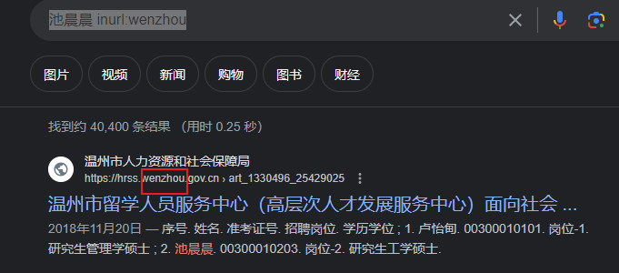

# 目录


# 一些好的技术文章公众号

博客很多情况下，挑选：点赞数、评论数、码年龄大的

失落的夏天：https://blog.csdn.net/rzleilei/category_6506586.html

gityuan

努比亚团队

罗升阳  ------------>  **规定：** 安卓的任何帖子，都必须先参考他的     

> ​      https://www.kancloud.cn/alex_wsc/androids/473785     ---------->  目录结构很好
>
> ​    https://blog.csdn.net/luoshengyang/article/details/8498908        ------>  原博客

​      

[
ariesjzj](https://jinzhuojun.blog.csdn.net/)     -----> 码龄18


# 搜索途径：

google > 微信搜一搜 > 公众号 >  细分论坛或APP  >  百度等


# 搜索的目的

> know sth
>
> learn sth   -----> 要专业性
>
> create sth 


# Google网站的搜索

参考：https://blog.csdn.net/u013527834/article/details/134094782  【资源信息获取方法】

默认搜索 = 标题匹配 或 正文匹配

匹配：

> title匹配：
>
> > ~~intitle:iPhone15摄像头进灰~~
> > ----------> ~~相当于在标题中匹配： iPhone15   摄像头   进灰 三个词，不论顺序~~
>
> text匹配：
>
> ```java
> intext:池晨晨浙江大学
> ```
>
> 
>
> 非精准匹配：
>
> > 池晨晨浙江大学 -------> 搜出来有可能是： 池晨晨  浙江工业  大学
>
> 精准匹配：
>
> > "池晨晨"   "浙江大学"
>
> 匹配含空格的：
>
> > "hello kitty"  ------>  自然

限定网站来源：

> 池晨晨 inurl:wenzhou     -----------> 限定温州相关的网站
>
> 

限定文件类型：

> 找pdf：（**大多pdf专业文档**）
>
> > 大模型 filetype: pdf
> >
> > 
>
> ~~找png：-~~-----> 同理
>
> ~~龙舟 filetype: png~~

组合：

> ~~以上可以组合~~  -----> 自然


# 电子书网站

https://z-lib.io/s

https://www.jiumodiary.com/   中文


# 在线工具

canva.com;在线设计海报、ppt\视频
remove.bg：在线抠图
miro/canva；脑图
腾讯智影/Azure/网易见闻: 文字转语音
https://thispersondoesnotexist.com:生成AI合成头像
Clipchamp/FlexClip:视频剪辑  --------> !!!!
deepl:
grammarly:
chatgpt:让它回答问题并且生成文档画作等。

```java
https://github.com/LiLittleCat/awesome-free-chatgpt?tab=readme-ov-file     // 国内镜像大汇总
```


https://savetube.app/en2  ---------->  download youtube videos


# 技巧

## 复制网站链接，如何将浏览位置也复制记录下来

选中，右键   复制指向突出.........