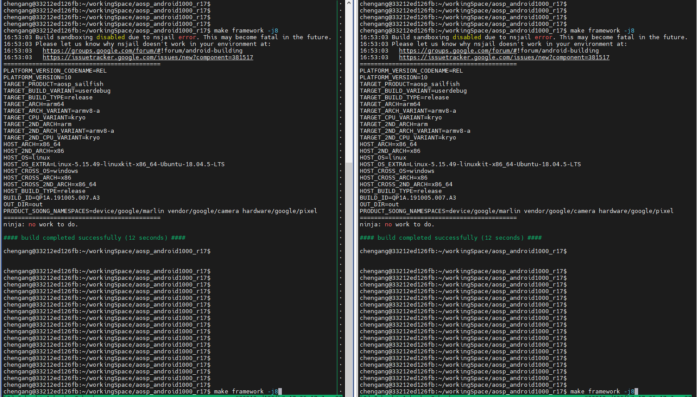
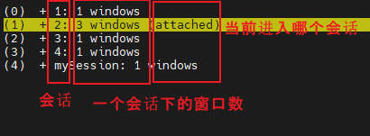
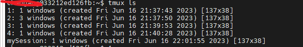
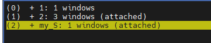
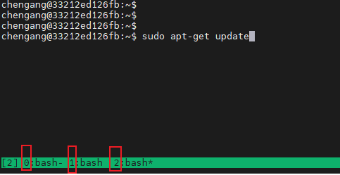

[TOC]


# 为什么要用tmux？

应用场景：

> 通过本地终端 ---->对  远端服务器做耗时操作时（长时间编译、长时间下载）

tmux作用：

> 1、本地的休眠、**本地终端的关闭**、网络的中断， <font color='red'>不会影响到远端</font>
>
> 注：通过本地终端让远端执行命令:  **本地终端的关闭，会终止远端的Task进程**
>
> ​                                                          即，本地终端 与 远端task 绑定了
>
> 2、窗口共享给其他人，可以同时看到运行的情况，比如：
>
> 
>
> 

tmux原理：

> 1、远端**永久运行**（不存在绑定关系） 并保存 命令执行结果    
>
> 2、本地端只是显示远端运行 结果  +   通过会话 发送命令


规定：

> 以后必须用tmux，不允许直接使用


# ~~安装~~

```java
sudo apt-get install tmux
```


# 使用


## <font color='red'>会话的结构：</font>



可见，

1、有五个会话： 1、2、3、4、mySession

2、会话2下有 3个窗口

3、当前本地终端attched是会话2（注意：本地终端有两个，可以attached两个）


那么，会话和窗口，分别是什么应用场景？？？

一个会话下，有多个窗口 ------>  有什么好处？  弊端：要不停切换窗口，不能一直显示


## 第一次新建会话：

```java
tmux new -s my_S
```

~~彻底销毁会话：~~   

```java
//法一：
tmux kill-session -t [会话名]  
```

// //法二：会话中， ctrl+d   d------delete


新建窗口：

```java
ctrl+b  c
```


## 终端下，进入之前的会话

1、**在终端环境中，**查看有哪些会话：

```java
tmux ls
```




2、进入：

```
tmux  a -t  [会话名]

// 
tmux  a -t mySession
```


退出：


## 在会话环境下，切换

规律：

> 在会话环境下，执行任何命令，都是以  ctrl+b  为开头


切换会话：

```java
ctrl+b  s
```



切换窗口：星号是当前

```
ctrl+b  1
```




# 优的环境：


两个本地终端  + attached 两个会话


# 最优的环境

由于tmux，不容易看到过程日志

----->  最优的环境，就是不用tmux

------>  方法： 直接让**本地pc永远不休眠**（适合公司电脑）