# 独立是我一生所求

上学和上班是一条狗链子（拴住人的一生，不得动弹，不得自由，不得富贵，不得清闲）      

----------------> **<font color='red'>我这一生，最重要的事情: 破了这条链子！！！</font>** 

-<font color='red'>打工仔，永无出路！！！！</font>

# 找静态结构、静态分析

如果找不到静态结构，你就还没迈入门槛


# 投资

## 什么重要


|         |                                                              |
| ------- | ------------------------------------------------------------ |
| ~~4层~~ | 今天的涨/跌                                                  |
| 3层     | 支撑点（跌到缩量极致）                                       |
| 2层     | 指数的基本面/行业基本面、短期政策、行业选择、降息/加息       |
| 1层     | 美股/A股（赚波动钱）、波动市/熊市/牛市、<font color='red'>是否便宜</font>(两年后)、主要投资指数 |
| 0层     | 市场是无法预测的（不预测涨跌，只跟随）、人性 -------- 追着恐慌而去！！！！ |
| -1层    | 国运                                                         |


-<font color='red'>不能因为考虑N层，而影响了0层和1层！！！！！！！！！！！舍本逐末！！！！！！！！</font>


语言会挟持思想：

>   不准用  “炒股”、“抄底”这些词汇！！！！


TODO:   如何穿越牛熊 ？？？？

**耐心（三年）----------  底部低吸**


本自具足、本自富足 -----------> 

>   陷入稀缺性思维------ 即怕踏空：
>
>   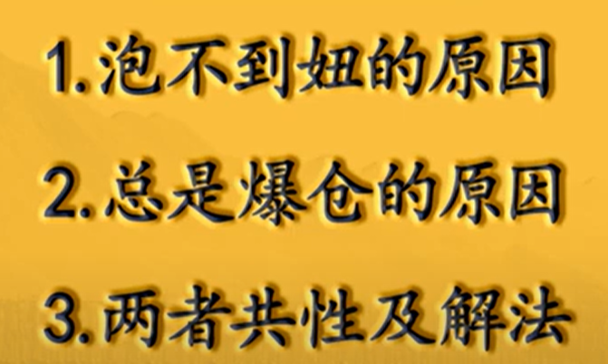
>
>   https://www.youtube.com/watch?app=desktop&v=QiU6UGdifk4


-<font color='red'>买入的checklist：TODO</font>

## ~~del_0层大纲~~

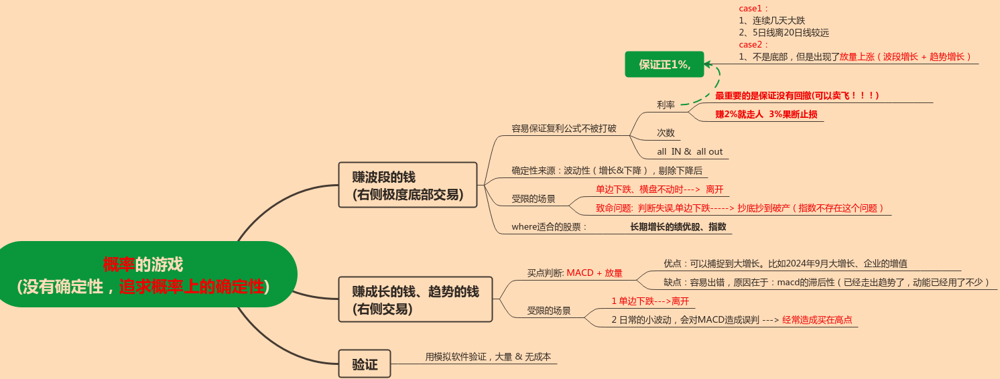


赚波段的钱：

>   https://www.zhihu.com/question/641320022/answer/43617341878?utm_campaign=shareopn&utm_medium=social&utm_psn=1879345098350904164&utm_source=wechat_session
>
>   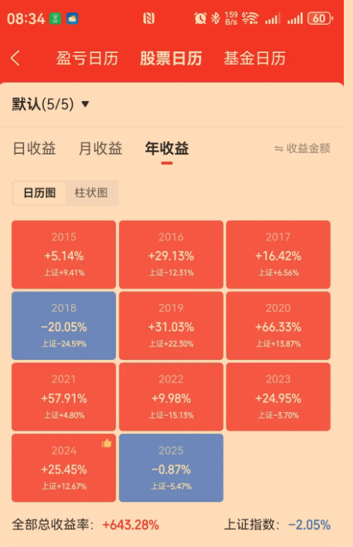
>
>   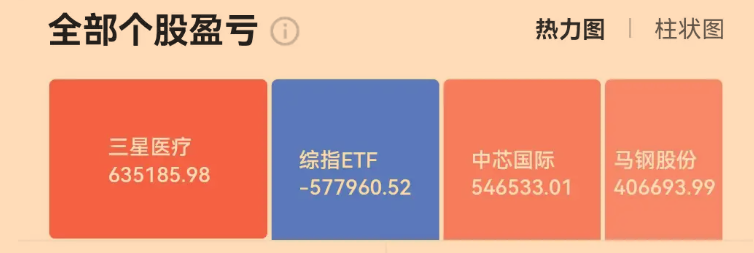
>
>   就两个秘诀：
>
>   1、<font color='red'>选股选[绩优股](https://zhida.zhihu.com/search?content_id=701838149&content_type=Answer&match_order=1&q=绩优股&zhida_source=entity)，逢低吸入。</font>       --------------> 避免单边下跌
>
>   2、[高抛低补](https://zhida.zhihu.com/search?content_id=701838149&content_type=Answer&match_order=1&q=高抛低补&zhida_source=entity)，耐心持有。     -------------->   保证复利的次数n


## 投资原则：

-<font color='red'>1、只相信数学：</font>

>   用数学投资，把你所有的认知、操作 基于数学
>


2、找现在不合理，而未来又是必然的


3、有规律，就一定能挣钱：

（1）大A规律：~~大背景是一个长期横盘震荡的市场~~

>   ​                     横盘震荡策略：（1）必须宽指基金（沪深300） ———->  **背后代表着国家意志 + 国家实力**
>
>   ​                                               注意：一定不能是个股，横盘震荡大背景下，个股受其他因素影响很大（政策影响、疫情影响、公司本身影响）
>
>   ​                                             （2）低点买入：20%                                      

 --------------->  已经验证

（2）美股规律：长期向上

>   ​                        策略：长期持有
>
>   ​                        最好也是宽指（纳斯达克指数）；个股：特别好的公司，                 
>

​                      --------------->  已经验证


## 买点心理学:

买点的唯一判断：

>   1、一年后是否便宜(
>
>   >   ​          （1）买指数----------PE低
>   >
>   >   ​           （2）大盘回撤下 && 优质公司
>
>   2、买点与当天的涨跌无关。而与一年后的涨跌有关


规定: 

>   TODO: 当天买什么，一定是前一天决定好了的！！！！


## 定投 与 平均价值法

https://www.youtube.com/watch?v=fqU66KfO48U   TODO: 总结

where：

>   -<font color='red'>定投适合 波动市 （比如大A）</font>
>
>   **一次性All in（越早越好），适合长期上涨**的股市 （美股）


## 牛市/熊市

1、要区分牛市与熊市，思维差距巨大：牛市思维，熊市思维

牛市： 大跌大加（前期），涨时，定投

牛市： 

>   where------------科技（半导体、人工智能）
>
>   ​                          去弱留强、**强者恒强！！！！**  <font color='red'>牛市不做波段，不做波段，不做波段！！！！</font>
>
>   how ------------ <font color='red'>最好的战法是： 王八战法</font>


### 牛市的判定----------分析框架

https://mp.weixin.qq.com/s/bNEDw-zCyLk3PLJuySB-Ow    【深度】股市涨跌分析框架系统讲解（2025年会是大牛市么？）


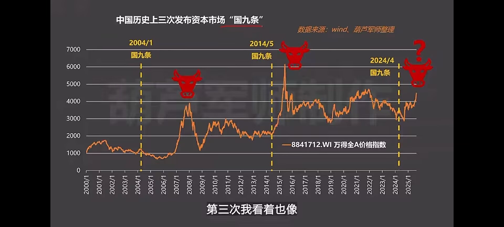


### 牛市见顶信号

1、开户数见顶信号 --------- <font color='red'>**优：早于 股市见顶**</font>

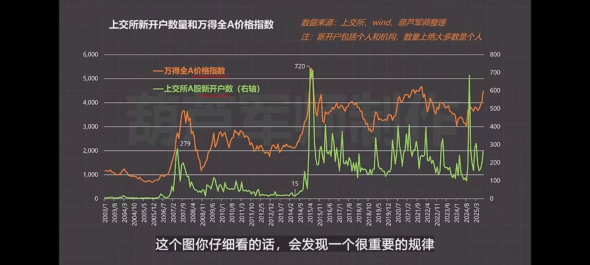

数据来源： https://www.sse.com.cn/aboutus/publication/monthly/investor/   上海证券交易所

2、百度指数（微信指数）---------股市


2015年中国股市牛市的顶点是[上海证券交易所综合股价指数（上证综指）](https://www.google.com/search?newwindow=1&cs=1&sca_esv=43c4ab87ea7f1f9b&sxsrf=AE3TifPekcA6Ez5i2jCf_6rq_4-LF4wUWQ%3A1758996609421&q=上海证券交易所综合股价指数（上证综指）&sa=X&ved=2ahUKEwjtxrSAxfmPAxXdKVkFHcVGA7QQxccNegQIAhAB&mstk=AUtExfBGHyoTU-TRbtKV7HrDSx9521iAw5ezBnqvACY6z7AHZPyFOUbu1c3hGNi1Jzu_WKTE-hIzjNa4jyrN-OANioI0an8UPUTXJ0ONZo6NTHw7o_pGeVQ06tbzubZRf0uqFGUZ5ZbpnjGJDQEzuQCOKxqageUmfqeFGandwiHyko1Wpb5kHWPMwTQzJG1Rm3TZSaNNpylb-L7CUh9xx3-lUJKwnrWFNd6F1tSyDOVFPWwzd_y4Ptubx34hxyAeBUl5itSfKJ6LN5mLMEUbOP3MD7j6&csui=3)在2015年6月12日创下的5178.19点。

>   对应的搜索热度：
>
>   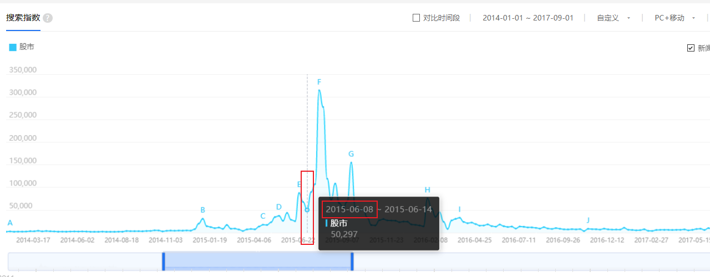

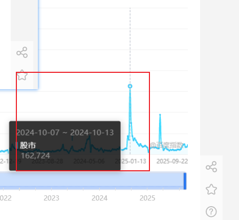

2024年10月1号也是最高点


## 回调波段的卖点

极差的例子：

>   大盘回调了三四天，**看到3个点的涨幅，卖了重仓的半导体：**
>
>   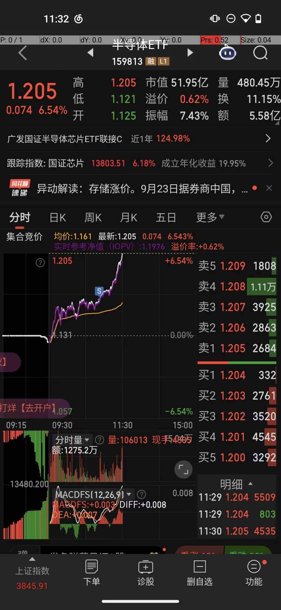

问题在于：

问题1：盯盘了  

问题2：第一天开始反弹

问题3：半导体是主线，<font color='red'>**卖点没有与大盘形成共振**</font>（大盘才0.24！！！！！！）

>   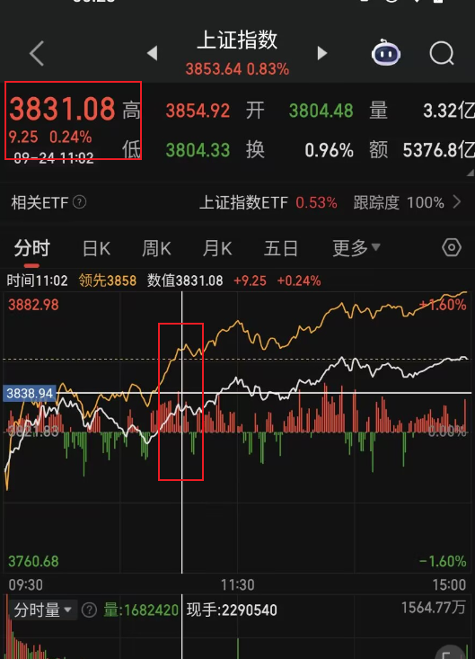
>
>   **大盘回调多日，且买的主线。。。。一定要等大盘增长0.5%以上，形成共振，才卖**

回调多日，你怕啥呢？


**最好的卖点：**

>   <font color='red'>大盘大阳线 & 且放量</font>    -------------> 形成了一致性预期了！！！！！

## 便宜/贵

重仓，才能大幅盈利


**1、最大的误区：**<font color='red'>抄底！！！！！</font>   抄底是最愚蠢的思维！！！<font color='red'>，因为抄底一定不是重仓，盈利很少！！！</font>

​     非常非常重要：永远不要用抄底这个词汇，也不要想着抄底。。。。因为抄底，一定意味着你加仓的少

2、误区2： <font color='red'>等跌一跌再买</font> ------------->   往往就不会再买了。。。遗忘或者恐惧

## 模型之  指数+便宜+杠杆 

-<font color='red'>本质：根据pe的波动性挣钱</font>

这个模型的实操的盈利的<font color='red'>**精髓在哪里？敢重仓！！！！**</font>。。<font color='red'>。**以前加仓， 都是一两万加仓，即使是好机会不敢加**</font>！！！！**虽然收益率高，但是盈利很少**

TODO: 那么纳斯达克呢？？？？永远不卖？？？

### 0层逻辑

基本理念：

>   价值投资，即<font color='red'> 沪深300 这家公司</font>，在价值极其低估的时候，大量买入  ----------> <font color='red'>买的便宜！！！</font>

0层：

>   **参与一流企业 & 经济的成长！！！！**

确定性来源：

>   弹球（玻璃球）理论
>
>   指数是弹球，永远会弹起！！

指数+便宜  ------------> 确定性很强的时候，加杠杆！！！！

>   1、<font color='red'>盈利大的最关键因素——————重仓！！！！</font>
>
>   2、但<font color='red'>重仓的前提——————确定性。。。。而大盘是最大的确定性!!!!</font>

便宜：

>   pe（回本年限）在20%分位

### 0层主要 ------ 沪深300买点

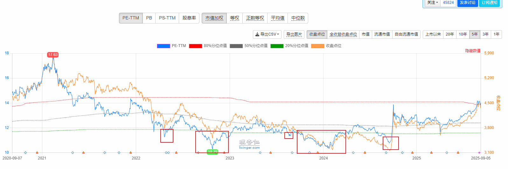

买点 ----------近5年，20%分位以下：

>   1、20%以下，<font color='red'>重仓买入</font> 。<font color='red'>**不管后续涨跌！！！！！！！！！不预测！！！！**</font>
>
>   2、10%以下，<font color='red'>加杠杆</font>
>
>   3、**不符合条件，不允许买入**  ---------> <font color='red'>多余的钱，买纳斯达克/ 债券（保证基本的收益即可）</font>
>
>   TODO: 不符合条件的，为什么不定投呢？？？？？定投多少呢？？
>
>   4、<font color='red'>**封仓 ----做好被套牢2年的准备**</font> 
>
>   >   一般来说，20%一下，半年就会过去（历史上最长是1.5年）


### 1层次要----- 沪深300卖点

卖点1 ----------近5年，80%分位：

卖点2 --------- <font color='red'>在50%分位以前，强制卖掉加的杠杆</font>

卖点3 ---------- 中间存在跌的情况了，一把止盈---------》 TODO: 移动止盈法？？？？


### TODO: 0层主要 ----回测

抓取数据，做回测


### 实操  --------


## 钟摆备忘录

```java
投资困难之处，恰如他简单之处，本质上投资只是选择题，而选择题大家在读书时都经历过，运气好时，其实也能蒙对。寒武纪和中芯国际，本质上也是选择题，在宏大叙事下，民族复兴，卡脖子关键环节，在叠加牛市预期，如果让我选，我也会选半导体，接着对标英伟达和台积电，那答案也不言而喻。但看似很有逻辑的选择，并且现在已经有很好的投资收益，它的内核经得起推敲吗?如果是一道解答题，不是选择题，会是满分还是零分?
```


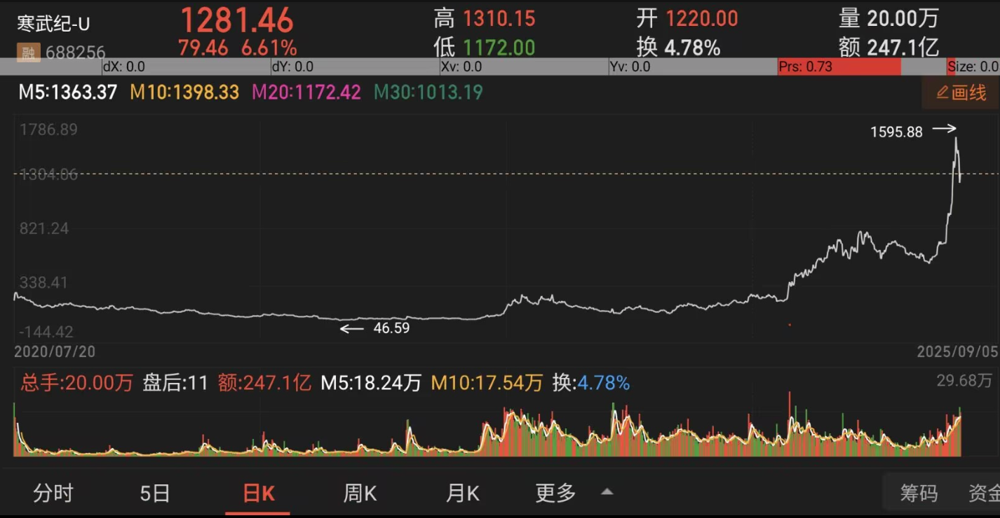


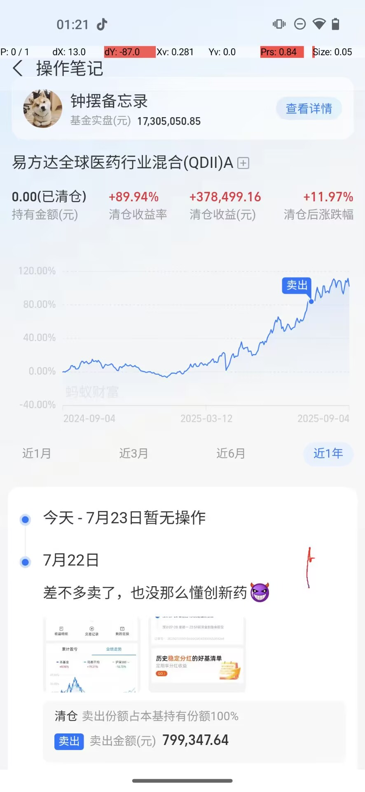

https://www.dtcqm.com/s/rJVTjdX51Os 或复制此消息打开支付宝，理财内容  A:/s CZ6816 2020/04/28

## 军规之不做预测

任何情况下不做预测！！！！！

预测到大跌也不跑！！！！

## 常见错误: 倒三角加仓。。。。。加仓要乘早


## 极致减少 操作次数

做一个狙击手


执行层面: 

>   <font color='red'>一周看一次股票。</font>。。。。看大事件消息


## 寻着恐惧而去

寻着恐惧而去。。。。。恐惧的指标。。。你的对手盘是羊。。。。如何避免恐惧？1、

## 投资原则之基金

1、where-------买基金，看过去5,3,2,1年的收益

2、指数比较稳

3、when--------买在相对低位（<font color='red'>过去1年，过去3年，过去5年</font>），比如上证的 2800，闭眼买入：

 过去一年 & 过去3年 & 过去5年最低点，all in ！！！！！！！

>   
>
>   上证50：
>
>   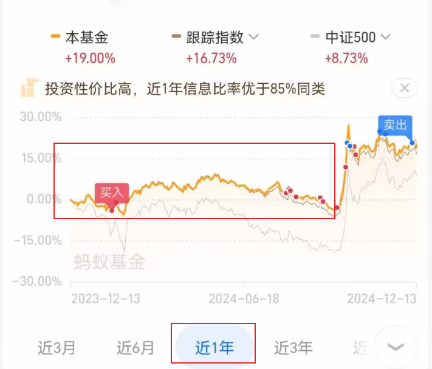
>
>   
>
>   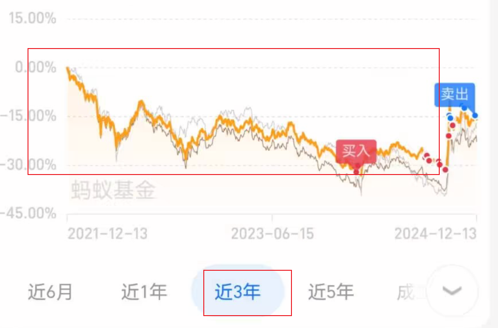
>
>   
>
>   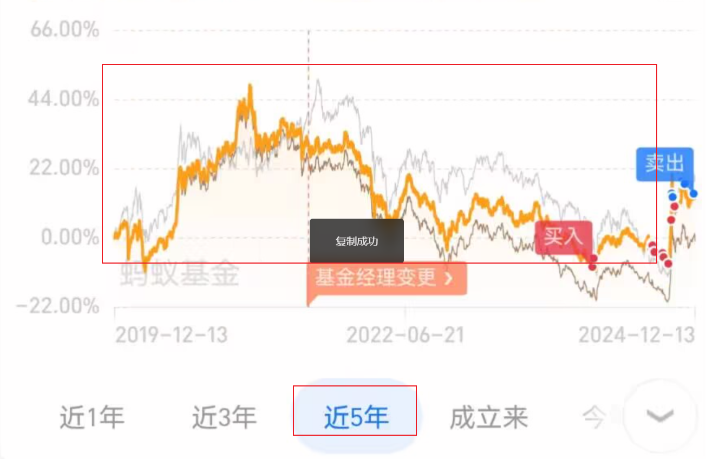


4、when --------- 好的买入是 成功卖出的一半

when -------------  <font color='red'>吃鱼只吃中段</font>（<font color='red'>如何识别中段？</font>）

>   TODO:  将曲线图与吃鱼的中段，画出来

​     等价的表达：

>   不赚最后一个铜板（李嘉诚）
>
>   要模糊的正确，而不要精确的错误

4、大的when -------------  把握<font color='red'>时代的节奏</font>。。。。吃时代节奏鱼的中段

5、消息类：不影响基本面的

6、how -------总原则：（1）依赖于策略，而不是预测

​						                 （2）久赌必赢。。。基于概率

7、策略一 ------------- 买指数，一定要抄底！！！！


8、禁止个股抄底！！！！

-<font color='red'>必然的：买个股，不能抄底，老手死于抄底</font>

>   必然性在于:  能不能抄底 决定于 会不会反弹。。**指数一定会反弹。。。个股:决定于基本面有没有变**

**个股策略1：**右侧交易，跟随趋势！

个股策略2，次要：个股尽量不抄底，如果抄底要保证   <font color='red'>该公司基本面没有变 &  大盘基本面没变</font>

9、<font color='red'>反馈之</font>    干净，利落，没有多余的动作

这是**检验标准**！！！！（也是代码好坏的标准、思路好坏的标准、文章好坏的标准）

10、<font color='red'>**概率的游戏:**</font>

>   善战者无赫赫之功
>
>   <font color='red'>久赌必赢</font>
>
>   股市是一场概率的游戏

11、when---------等

12、大热的时候，往上游走

13、小利全让，大利不让！！！！！

14、大势。。。。。<font color='red'>势！！势！！势！！</font>

15、<font color='red'>不要和资产谈恋爱！！</font>！--------离场、卖了、分手，，，要果断，绝不拖泥带水！！！！！！！！！

>   例子：李嘉诚塑胶大王，直接卖了塑胶厂 丝毫不犹豫！！！

16、寻找<font color='red'>差异</font>，有差异，就有机会！！

比如   2000年，国外网上购物，马云看到了，创办阿里

17、指数 -----> 适合左侧交易（因为一定会反弹）

​       个股/行业  ----> 适合右侧交易（避免无底洞）

18、老是突破不上去的话，久盘必跌：

纳斯达克，几个月的震荡：

>   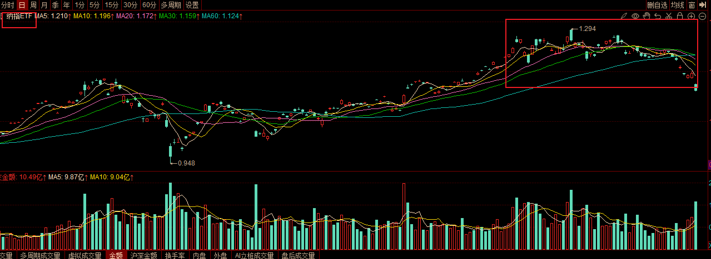

规定：

>   1、横盘时，一定离开；突破前高，确立趋势后，再买回
>
>   2、<font color='red'>完全可以卖飞！！！！关键控制回撤！！！</font>

###  避免风险：

>   不买排名前几的基金 --------> 一定是激进的！！！！！而且知道的人多了，一定会降低收益率

## 投资原则之 债券基金

1、降息周期买、低利率时，买入

>   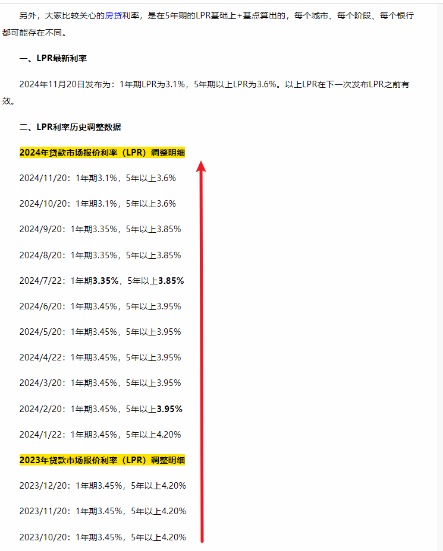

2、债券与股票是  跷跷板关系  ----------> 所以，两头吃

（存在极端情况，股债双杀）

3、债券基金


## 消息影响

### 影响之  空间（where）

(5w2h)

**行业级消息** -----------比如Deekseek

>   when: 消息时间：
>
>   what: [“天神之眼”来了!*比亚迪*开启“全民*智驾*时代”?](http://www.baidu.com/link?url=ma7B_gtjfc4y66Jd8MOZVwfYCdLkhdz6XV5Ifhtn5kS49qh-FbvDTA1V4IIdm25Kpw7A-1Z3SuFw3rPE0iEBda)
>
>   真实when： 2月10日晚, 比亚迪智能化战略*发布会*在深圳举行
>
>   


**公司级消息**---------比如 比亚迪智驾驶比亚迪智能化战略发布会

>   when: 消息时间：
>
>   what: [“天神之眼”来了!*比亚迪*开启“全民*智驾*时代”?](http://www.baidu.com/link?url=ma7B_gtjfc4y66Jd8MOZVwfYCdLkhdz6XV5Ifhtn5kS49qh-FbvDTA1V4IIdm25Kpw7A-1Z3SuFw3rPE0iEBda)
>
>   真实when： 2月10日晚, 比亚迪智能化战略*发布会*在深圳举行
>
>   

### 影响之时间

(5w2h)

影响的时间范围是？？？？？隔几天？？？


### 规定

留意消息 -----------> <font color='red'>要有意识：消息与我</font>

1、平时多留意消息 -------> 做对股市影响的判断！！！！！


## 仓位控制


## 如何战胜情绪？

-<font color='red'>心态第一，技术第二</font>

踏空感：**可以卖飞，保住本金是第一重要的事情**！！！！！！！！！！


## MACD ----> 预测，观察趋势（基于概率的）

适用范围（where）：

>   感觉指数、行业更适合
>
>   个股呢

理论基础（why）：数学上证明：https://www.zhihu.com/question/451249179/answer/1972679851?utm_psn=1874616543813431297            

when：有一定滞后性

-<font color='red'>时间尺度（how much）：日k，两三个月的尺度 </font>


## 待思考 & 总结


股市:  投机市（震荡市，情绪市）

指数型: 高低     行业型:判断基本面，消息

目前阶段: 重视逻辑，感受人性，。。。。这个时候利润倒是其次的

股市里不应该有目标，目标产生执念。执念会让你追求最大利润‘

**股市里唯一的目标是，追求确定性**

滚雪球----复利

带宽-----时间


TODO: **仓位管理**:  所以真正好的交易者，仓位管理以及进攻和回撤的协调是做到非常厉害的


轻松干

 

## 只做跟随 （不做预判，更加不听别人的预判）


## 常识：

常识：

1、一年挣得钱 = 一年的利润率 * 一年内换手率

所以，短期内的利润率高不可怕，立即还上就行 ——->   **一年的平均利润率很低**


## 网格交易

数学方法 ------> 数学的保证

-<font color='red'>前提：</font>

> 一直波动 + 不增长的股市   ------->  A股特别适合
>
> 或者
>
> 单边增长的股市  ------->  美股

实战：


## 任何一件大事情，背后都会有经济活动

------>！！！！（思考自己可以做的事情，大局观，不要隐隐狗狗！！！）

对于大的行业而言--> 看行业线，行业能把握

瘟疫引起的:

增长是好事，萧条更是好事儿

回去画图，推理


小的东西看不到，但是大的东西是必然的，可预测的，所以，一定对大的东西不要麻木


比如，美国大选宣布总统，诺安八个点，这个我遇见了。。。但是没能及时卖掉


认知认知认知


站在2019年11月份，根据瘟疫可以预测：假设疫情时间一年（医疗、娱乐、互联网）

>   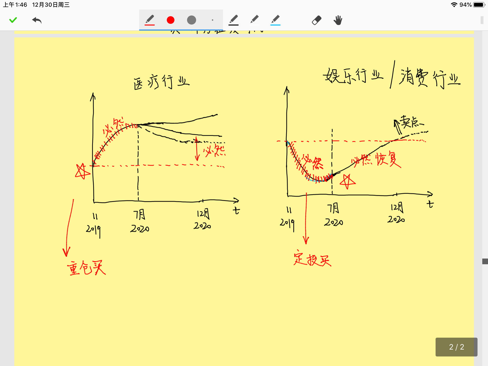

真实的医疗行业：

>   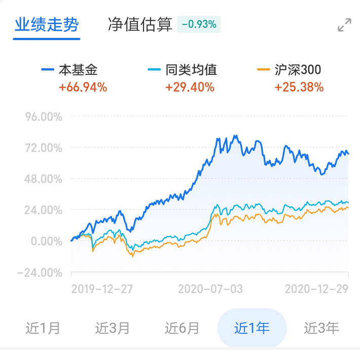

娱乐行业：

>   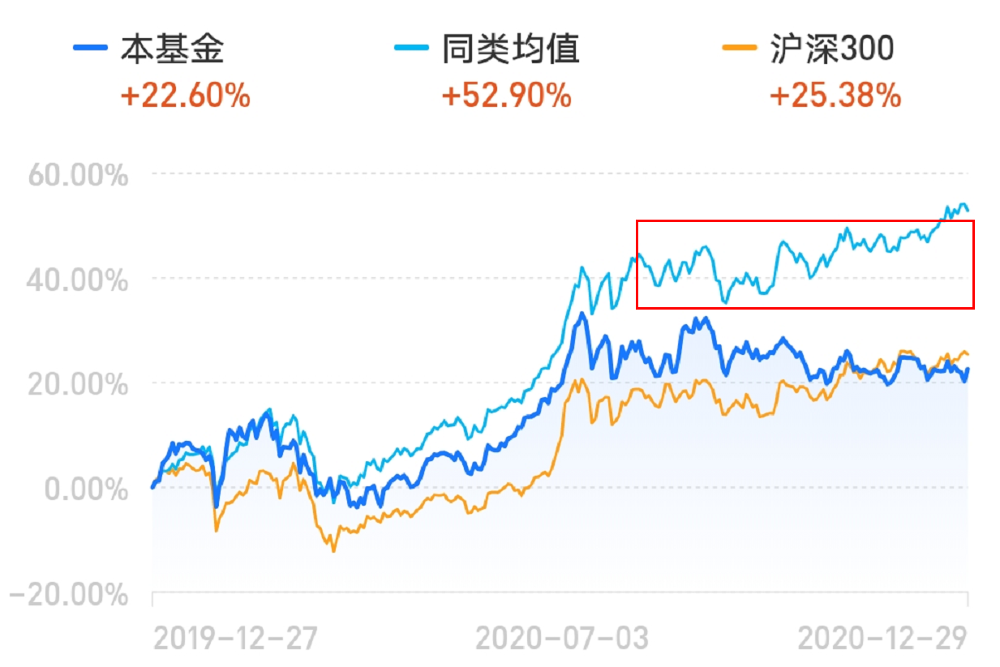


有几个必然：

>   1、大的事件必然会引起波动：积极影响的行业、消极影响的行业---> 遇到社会性的大事，一定要与全行业联想
>
>   2、对积极影响的行业能赚钱：前期重仓买入 《---- 因为增长是必然的
>
>   3、对消极影响的行业，更容易挣钱，更保险 ----> 前期的下降必然的，后期因素消除更是必然，只是时间线有些长！！！！   ，所以长期定投这些行业
>
>   后期恢复更是必然！！！！
>
>   4、疫情，同样也可以用于买房


## 面向对象的思想：

------>要把所有发生的事情（对象）、与自己（对象）链接！！！！！！


## 区分突发性影响和永久性影响

对于突发性的大事件，如果长期一定会恢复-----> 这种稳赚不赔

永久性影响，比如公司业务逻辑变了-------> 永远不要碰！！！


## 段永平

抄段永平的作业！！！！

>   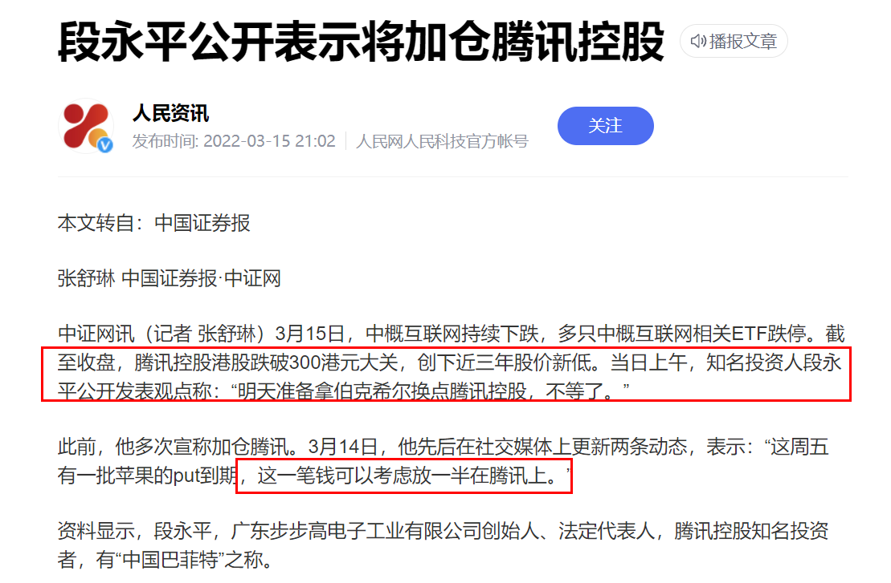

----> 3月16号，腾讯股价增长22%


## 倾城

一直预测2022年上半年一直下跌，准确预测到真正的底部，而不是阶段的底部！！！！！！！


2022/5/2: 

赛道股：白酒、医药、权重蓝筹，先涨，后面补跌


区别对待美股与中股1！！！！！

中股票，**所有消息，只是为了解释而找来的消息**！！！！**！涨跌与经济无关！！！！只与资金有关！！（国家放水、主力资金）**


## 林园：

（1）未来30年医疗是主线！！！未来三年（21-24），医疗至少翻一番

（2）买垄断性公司！！！


## 买基金原则，朱少醒：

1、主要看好长期（3-5年以上）历史业绩都不错的基金经理：富国朱少醒、易方达张坤、交银三剑客
2、不要买太多基金：4-10个分散行业
3、长期持有, 三年以上维度！！！！！！！！！！！！！！！！！不适合短线！！！！朱少醒：我们不能买股票，如果你放在三年以上的时间维度，都应该投权益资产，三年以下就比较难说了。(放到10年以上)毫无疑问是权益资产，可以更集中到那种更长期优质的资产，你觉得置信度最好的公司，跟着公司一起慢慢变富。

4、一定要克制人的天性：追涨 + 杀跌！！！！杀跌是大忌!!!!!!!
5、

6，**聪明投资者：你这12年来最赚钱的股票是什么？
　　朱少醒：我平时不怎么看那个东西。**
　　不知道你有没有看过一书上的说法，小孩画画通常有两种完全不同的状态：有的小孩边画边撕，画完就撕；还有的小孩画好了，稍好一些好的保存在那边。可能到最后，所有的画里，画的更好的是前者。投资和这个有点类似。我可能对过去的“亮点”不是特别在意，更多是看过程和未来，我享受过程，在这个过程中，反而有些教训，我会记得更清楚
**从逻辑上看，最赚钱的应该是拿得最久的股票**

12，聪明投资者：你一般会招什么样的人？
　　朱少醒：研究员首先是品性要求，**好的研究员还要独立思考，有开放的心态、很强的好奇心，做事有很强的韧性。智商在这个行业内从来不是瓶颈，做事情的坚韧度和毅力很重要**

**关于卖点：不可控的错误和可控的错误**
　　15，聪明投资者：你怎么判断卖点？
　　朱少醒：成长类投资的卖点，其实是带有艺术成分的，比较难量化、难有明确规则。
　　第一，不断去review原来的投资框架，买入之后，逻辑有没有发生变化。
　　然后，估值有没有达到你的判断，对于成长公司来讲，这方面的权重要稍微低一些，因为犯错概率也挺高的

喜欢纯粹专注把事情做到极致的人
　　29，聪明投资者：海内外，你最欣赏的投资人是谁？
　　朱少醒：对我影响比较深的，是巴菲特和彼得林奇，可能我翻彼得林奇的书比巴菲特多一点，因为他跟我公募的行业属性有关

32，聪明投资者：你的价值观是什么？
　　朱少醒：我没归纳过。我觉得，做投资可能跟做人方式有关，无论是我们公司的Business、还是投资，我都希望看得长远。第二，我比较喜欢能够非常纯粹专注把事情做到极致

35，聪明投资者：有时候热爱它，是因为成功给了你正反馈，会不会也是一种求证陷阱，制约了你尝试新的可能？
　　朱少醒：只是享受成功带来的荣耀，跟热爱不一样。热爱就是你甚至没有看到曙光，老是碰壁，各种怀疑的时候，你觉得我就是喜欢，还能坚持，这才算。


## 巴菲特：

（1）赌指数基金就是赌国运
（2）只有傻子和偏执狂 才去预测市场的顶部和底部（即：方向大致正确！！！！！）不要看一时的涨与跌

价值投资《-------> 找市场中的便宜货（便宜指的是，**价格/真实价值** 低！！！！，不是价格低！！！）

如何找便宜货？

（1）**所有人**都恐慌的时候  ----> 绝大部分声音


## 高瓴

----> 逻辑：为什么要抄高瓴？？？因为高瓴价值投资！！！持有几年，所以季度报告延迟不影响！！！！（所以，林园不适合抄作业！！！）

关注：1、最大重仓股   2、<font color='red'>大量新增</font>最大重仓股！！！！3、<font color='red'>大量减持</font>
**抓住主次**----> <font color='red'>**大量**</font>！！！！！

>   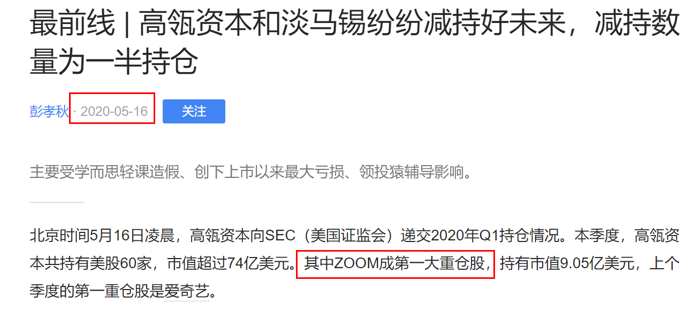
>

>   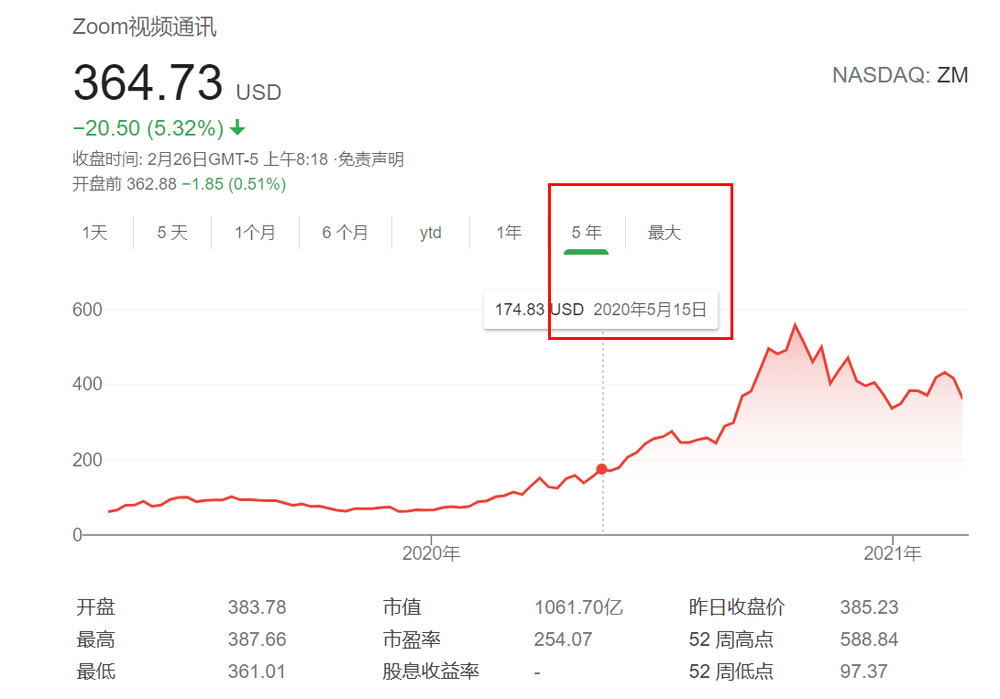


**减持**的案例：

>   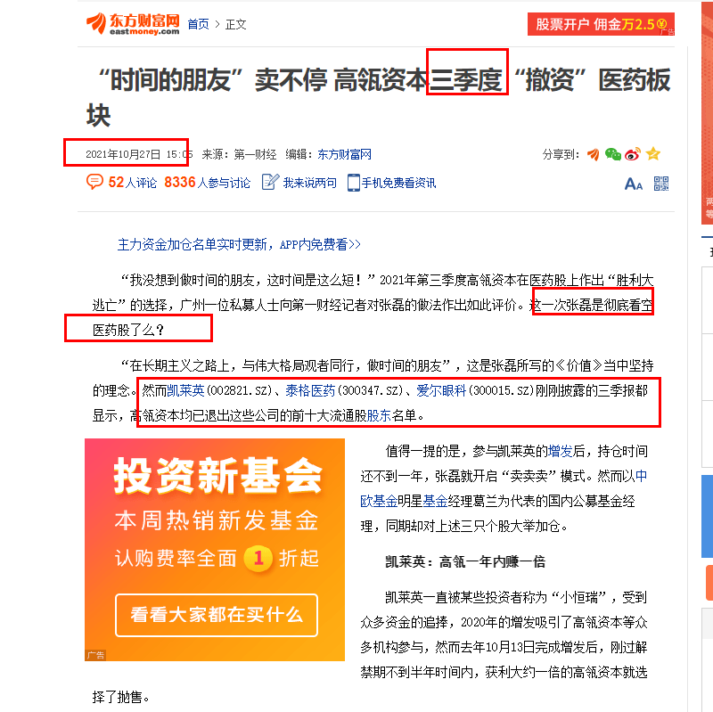

三季度，即在9月前卖掉的，10月底的新闻

----> 最终可以看出，在9月10月走掉是很好的！！！

>   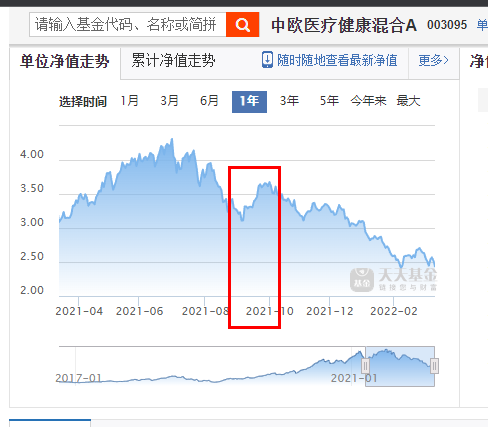


为什么要抄袭？？？？因为我们与大机构信息不对称！！！！！！！


## 战争

乌克兰战争，会导致总体下降！！！
-----> 但是，黄金，原油会大涨（**不是石油！！！**）

2022年2月24日15时，据法新社消息，俄罗斯地面部队进入乌克兰。


# 交易案例

## 好的交易----------2024年10月13日

类型：**A股指数**，收益16%

定位：**投机市** 

**买入点：**

>   **非常好-------近三年最低**
>
>   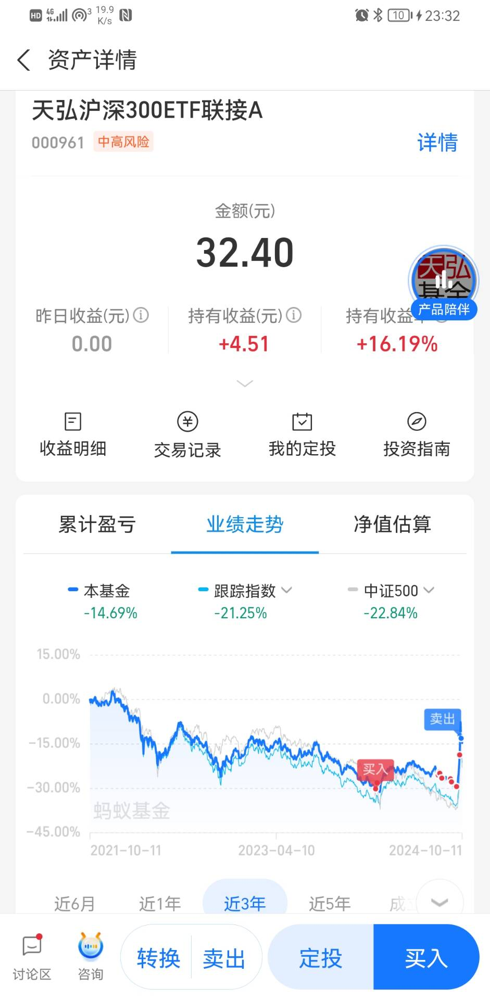

卖出点：

>   卖出也OK-----------**止跌不止赢**，（自然会错过最高点）
>
>   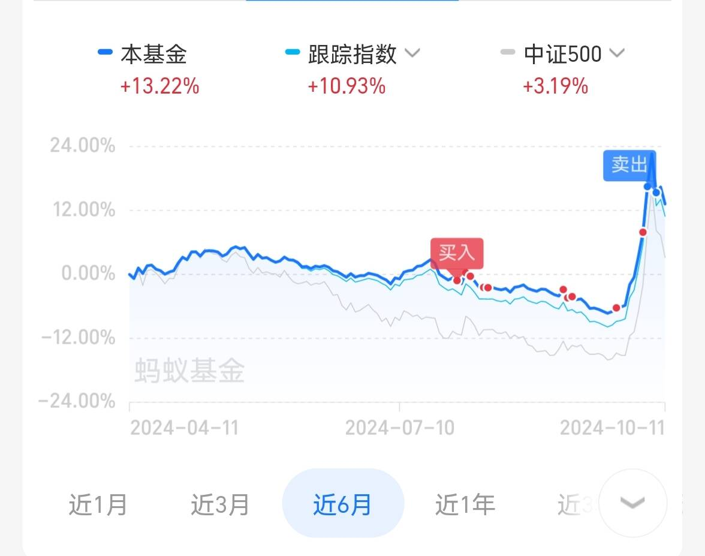

待改进：

>   **基于止跌不止赢原则，** <font color='red'>上涨时期，应该定投！！！！！</font>
>
>   TODO: 定投，用多少仓位定投？


## 不好交易 ---- 精华

### 中欧医疗健康混合A(2021)

基金：**行业属性强** （中欧医疗健康混合A）

亏损：

>   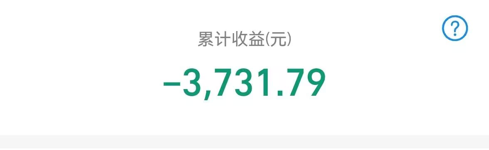


>   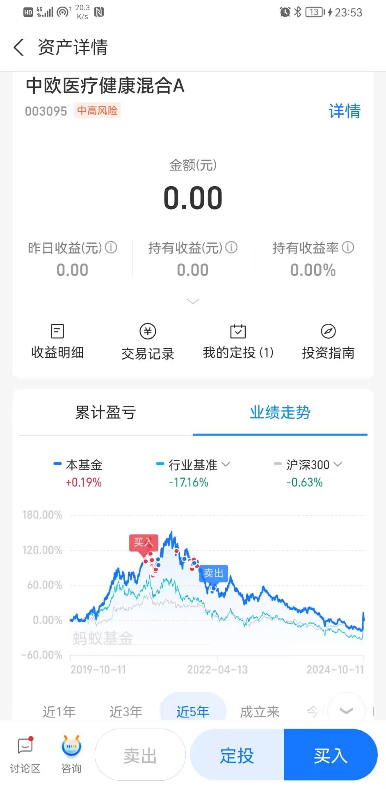

>   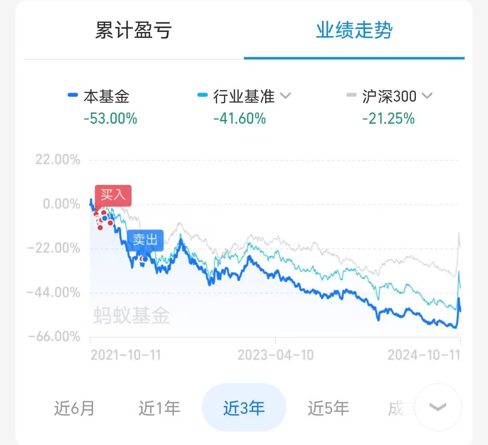

问题在于：**2021-11和12月大量买入**

-----------> <font color='red'>买入时间有大问题！！：</font>

1、行业性的股票，必须看行业形势

2、<font color='red'>股票看的是预期：</font>  **疫情没有继续恶化的趋势，就不应该买！！！！**


### 短线操作------- 浪潮信息

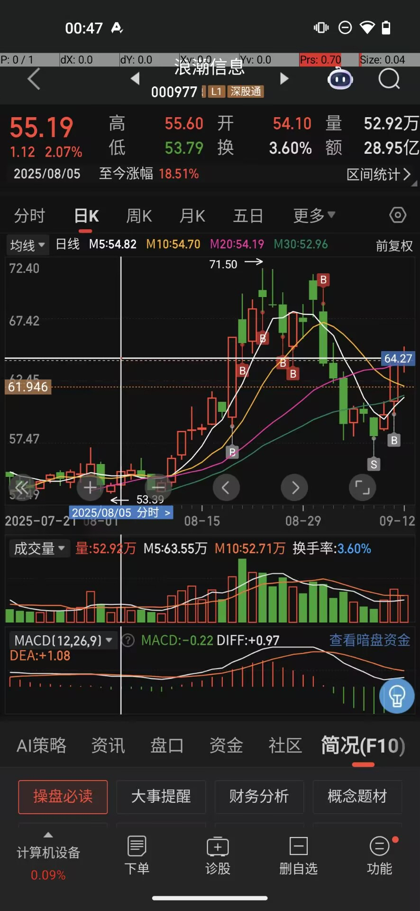

问题1：追高买入

问题2：在缩量下跌的时候，全部卖出了！！！！！！！


# 交易记录


# 书籍

《战胜华尔街》---------彼得林奇

