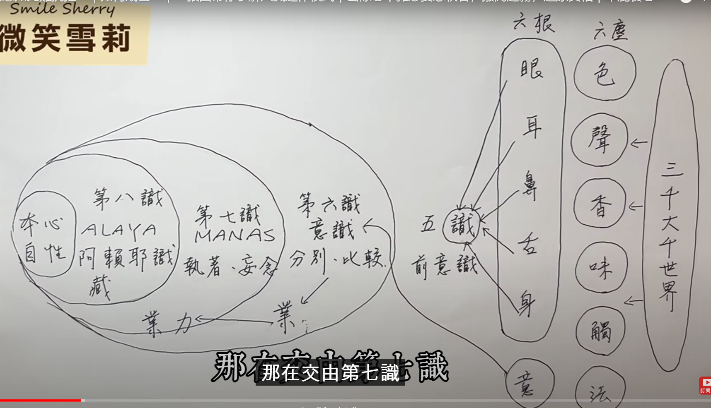

# 金刚经

## 正文 & 解释

### 第一品   法会因由分

如是我闻。一时佛在舍卫国祇树给孤独园。与大比丘众千二百五十人俱。尔时世尊食时。着衣持钵。入舍

卫大城乞食。于其城中次第乞已。还至本处。饭食讫。收衣钵。洗足已。敷座而坐。

注释：

## 参考

https://www.youtube.com/@supu929  金刚经

## 一些感悟

知识： 重视智慧，而不是识

经文：重义，而不是文字本身，不是形式本身

修持的根本：善护念（无论佛、道）

渡河之后，弃筏（学佛如此，学习知识也是如此）

# 《古道清凉》

https://www.bilibili.com/video/BV1m3411C7j5/?p=2&spm_id_from=pageDriver&vd_source=3eebd10b94a8a76eaf4b78bee8f23884

体悟：

> 乞食时，也**要威仪**  
>
> 给食或是拒绝，是一样的

吃饭： 

> 饭和菜是一样的，不能区别对待   -------->  没有分别心
>
> 吃饭时，只能看着饭，而且是只能看着要吃的那一块饭-------->  没有分别心
>
> 日中一时

# 杂七杂八

意识的结构：

> 

https://www.youtube.com/watch?v=BXveOIR944A

笔是真实的，是因为强烈的意识的分别 <-------------- 眼耳鼻舌身意

