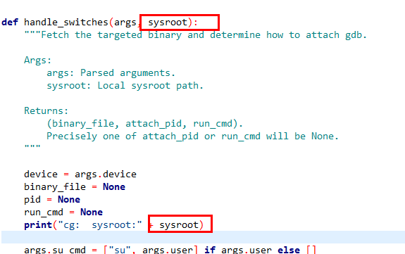
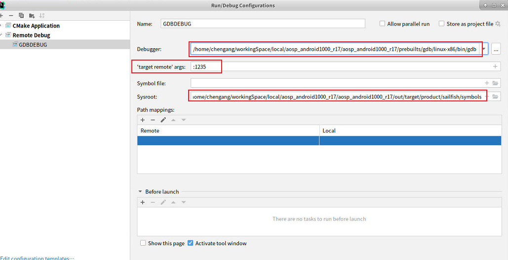
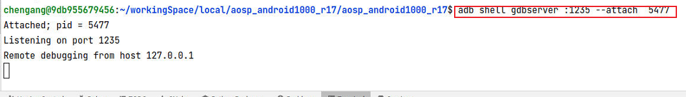
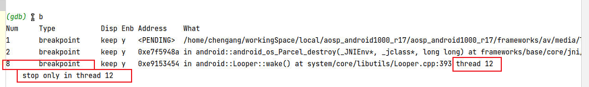
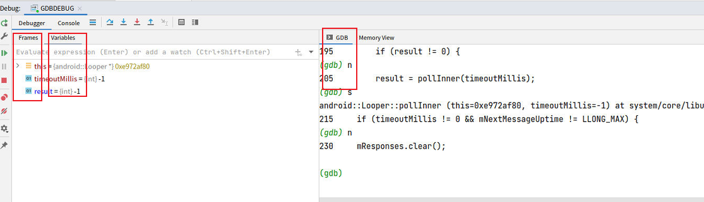
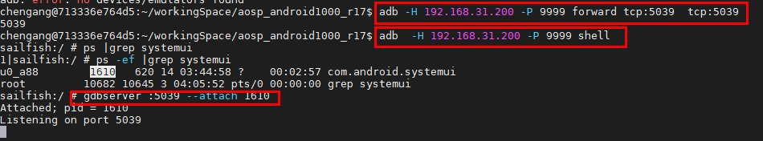
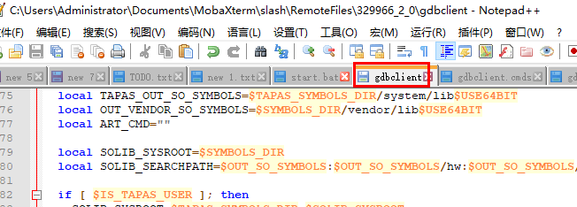
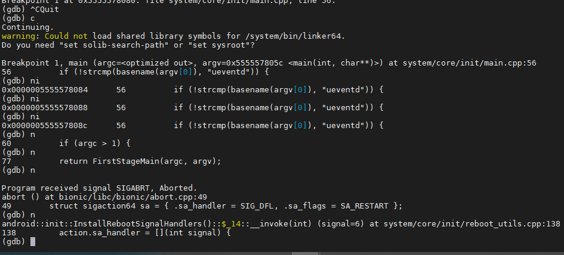

# 目录


# 本地GDB调试-------linux

## 本地GDB调试结构


~~图：https://zhuanlan.zhihu.com/p/336922639~~


## 步骤：

```
  symbol-file  /usr/lib64/libkwin.so.5
```

技巧之，利用gdb查找调用栈 -------->  环境里看调用

添加符号：

```java
 symbol-file  /usr/lib64/libkwin.so.5
 add-symbol-file   /usr/lib64/plugins/kwin/effects/plugins/kwin4_effect_shapecorners.so
 add-symbol-file  /usr/lib64/plugins/kwin/effects/configs/kwin_shapecorners_config.so
 
 
 
 
 
 add-symbol-file /usr/lib64/libwayland-server.so.0
 
 add-symbol-file   /usr/lib64/libkwin.so.5
  ----------------------->  后面需要用add-symbol-file
  
  
 // 查看结果
(gdb) info sharedlibrary   
```

------------------> TODO:

添加断点：

```java
  b Shadow::init
  b  ShapeCornersShader::Bind
```

attach进程：

```java
  ps -ef | grep wayland
  635 kde          20   0 898M 104M  77M S  9.0   4.1   0:28.27 kwin_wayland --wayland-fd 8 --socket wayland-0
 
 (gdb) attach  635
```

方式一：

so里已经有行号信息了。这时候需要指定源码：

运行中指定源码路径：

```
 (gdb) dir ./temp
 Thread 1 "kwin_wayland" hit Breakpoint 3, ShapeCornersShader::Bind (this=0x556df6e2a8, w=0x556de3cf90, scale=1, isTiled=72) at /usr/src/debug/KDE-Rounded-Corners/1.0-r0/git/src/ShapeCornersShader.cpp:54
 54      /usr/src/debug/KDE-Rounded-Corners/1.0-r0/git/src/ShapeCornersShader.cpp: No such file or directory.
```

参考： [GDB学习笔记_gdb 指定源码路径-CSDN博客](https://blog.csdn.net/m0_47492055/article/details/128772410)


## 补充 控制

继续执行到下一个断点-continue

```
 (gdb)c
 (gdb)c 3 #跳过三次断点
```

继续运行到指定位置-until

```
 (gdb)u 29 #运行到29行停住，利用的是临时断点
```


## 编译带调试信息的程序 或 so

在编译程序时，需要使用`-g`选项来添加调试信息。

### gcc直接编译

```java
gcc -g main.c xxx
```

### cmake

cmake编译时，添加参数

```java
set(CMAKE_CXX_FLAGS "${CMAKE_CXX_FLAGS} -g -O0")
set(CMAKE_C_FLAGS "${CMAKE_C_FLAGS} -g -O0")
    
// -g 选项告诉编译器生成调试信息
// -O0 选项告诉编译器禁用所有优化
```


### meson.build  编译

```java
W:\workingspace\frameworks\window\windowmanager\weston\meson.build


add_project_arguments(global_args, language: 'c')
#add by cg
add_global_arguments('-O0', language: 'c')
add_global_arguments('-g', language: 'c')
```


## 源码环境中如何找符号表？

万能的暴力方法：

> 在根目录下，暴力find_ ----------->  最大的so，就是符号表！！！！
>
> ```
>  find_ ./ libwayland-server.so.0.21.0
> ```
>
> 注意：我们**很难确定  目标so  是不是某个模块编译出来的**：
>
> > 即使 bitebake kwin后，发现kwin下有 -------->  实际上是因为kwin依赖，编译时copy过来的

最后验证：

```
 $ file ./1.21.0-r0/image/usr/lib64/libwayland-server.so.0.21.0
 ./1.21.0-r0/image/usr/lib64/libwayland-server.so.0.21.0: ELF 64-bit LSB shared object, ARM aarch64, version 1 (SYSV), dynamically linked, with debug_info, not stripped ---> 没有strip
```

一般情况下：

> 工程里，一定会有  中间产物  符号表

### 符号表的可替换性

```
 #6  0x0000007f97e8c6a8 in ?? () from /usr/lib64/libwayland-server.so.0
 #7  0x0000007f97e8743c in ?? () from /usr/lib64/libwayland-server.so.0  // ?? 代表不含符号表！！！！！！
```

用一个含符号表的 libwayland-server.so.0文件，可以直接替换  上述系统文件

-------------------->

> 1、系统可以正常运行！！！！
>
> 2、利于GDB 的debug


## 引入符号表 TODO

 symbol-file  /usr/lib64/libkwin.so.5
 add-symbol-file   /usr/lib64/plugins/kwin/effects/plugins/kwin4_effect_shapecorners.so
 add-symbol-file  /usr/lib64/plugins/kwin/effects/configs/kwin_shapecorners_config.so


sysroot 
GDB中set sysroot作用是什么
(gdb) show sysroot
--------->   https://chat.openai.com/c/dae87696-c095-44b3-85cd-8b7fbfb93357


## 引入文件

gdb报错：

```java
KWin::Window::updateShadow (this=this@entry=0x55958cb570) at /usr/src/debug/kwin/5.27.4-r0/kwin-5.27.4/src/window.cpp:439
439     /usr/src/debug/kwin/5.27.4-r0/kwin-5.27.4/src/window.cpp: No such file or directory.  // 【】提示需要新增源文件
(gdb) l
```

方法：

> ```java
> adb push   \kwin\\5.27.4-r0\\kwin-5.27.4\\src   /usr/src/debug/kwin/5.27.4-r0/kwin-5.27.4/
> adb push  \KDE-Rounded-Corners\\1.0-r0\\git\\src  /usr/src/debug/KDE-Rounded-Corners/1.0-r0/git/
> ```


**新增源文件的好处：**

```java
b KWin::WorkspaceSceneOpenGL::createShadow 即使无法找到符号表，也可以在.cpp中断点
```


# 远程GDB调试-----安卓

TODO：安卓为啥不能本地调试？必须 server + gdb

## 远程GDB的<font color='red'>结构</font>


**GDB与GdbServer之间联系：**

> 通过网络或者串口进行通讯   --------->  TODO：所以，不需要adb？？？？


参考：https://zhuanlan.zhihu.com/p/336922639    原来gdb的底层调试原理这么简单

TODO：

> GDB如何调试已经执行的服务进程？   https://zhuanlan.zhihu.com/p/336922639
>
> 偷窥GDB如何实现断点指令？    https://zhuanlan.zhihu.com/p/336922639
>
> 偷窥GDB如何实现单步指令next？ https://zhuanlan.zhihu.com/p/336922639
>
> 

## framework Native 断点调试 环境（GDB）

參考:

>  https://blog.csdn.net/weixin_34419326/article/details/90306477        GDB在线调试Android Framework Native C/C++代码     ------------->  好文
>
> [使用调试程序  | Android 开源项目  | Android Open Source Project (google.cn)](https://source.android.google.cn/docs/core/tests/debug/gdb?hl=zh-cn)    
>
> [gdb+gdbserver远程调试-CSDN博客](https://blog.csdn.net/turing__66/article/details/131703847)  


见下面  法一、法二、法三

## 法一：gdbclient.py方法步骤（优秀）

linux下   gdbclient.py  ---> GOOGLE封装好的断点脚本

（~~GOOGLE放弃了 gdbclient，主要使用gdbclient.py~~）

```java
/home/cg/workingSpace/aosp_android1000_r17/development/scripts/gdbclient.py  
                                                              /gdbclient
```


### docker容器（linux）与手机adb 连接 

~~见《docker连 主机pc连的安卓设备》~~
即： 

```shell
宿主windows侧：
adbkit usb-device-to-tcp -p 7788 FA6930305260

docker容器一侧
adb connect host.docker.internal:7788 
```

 TODO：<font color='red'>这一步是必要的 ：</font>GDB与GdbServer之间是网络连接，但是脚本里有用到adb


### ~~linux初始化 gdbclient.py 环境~~

```shell
# 运行shell脚本，配置环境
$ source build/envsetup.sh 
# 然后选择自己要调试的编译版本
$ lunch  aosp_sailfish-userdebug
```

~~--->作用： gdbclient.py 在根目录下，可以索引到所有变量，比如gdb、gdbclient等~~


### gdbserver/gdbserver64提供服务

gdbserver（和gdbserver64）环境的准备：   是push进手机里的

> ~~自然，windows侧：~~
>
> ```shell
> adb  push  G:\dockerSharedFiles\aosp_android1000_r17\aosp_android1000_r17\prebuilts\misc\gdbserver\android-arm64\gdbserver64  /system/bin/
> adb  push  G:\dockerSharedFiles\aosp_android1000_r17\aosp_android1000_r17\prebuilts\misc\gdbserver\android-arm64\gdbserver  /system/bin/    // ----------> 似乎主要是gdbserver？gdbclient     在linux里，google封装的gdbclient.py 
> ```


这里采用网络来搭建linux与手机之间的桥梁，所以用ip：（而不是，端口转发adb forward）

```
adb root
adb remount  // ----------> 注意：需要这个！！！【】 后续GDB会copy东西给GDBserver
adb shell ps -ef | grep mediaserver


adb shell gdbserver :12345 --attach pid  或 gdbserver64    // 待调试的pid           
```

-<font color='red'>要点：</font>

> **手机内部使用 gdbserver， 用gdbserver64导入符号表不生效**。而使用 gdbserver64， linux侧显示找不到符号表
> 自然，我们set solib-search-path /home/chen/workingSpace/aosp_android1000_r17/out/target/product/sailfish/symbols/system/lib/ ------> 用的lib
> TODO：怎么确定手机里到底用的是lib还是lib64？  gdbserver64+ lib64组合会怎么样？

补充：

> ~~gdbserver :12345 --attach pid~~
>
>  ~~gdbserver 192.168.1.0:12345 --attach pid      // ip是server的ip。不是必须项~~


~~程序未启动时：~~

> ~~gdbserver [设备ip]:[端口] [需要运行的程序]~~
>
> $ ~~gdbserver 192.168.1.0:8000 test~~


### gdbserver 与 gdbclient 网络链接---端口转发方式（优）

手机侧：

```java
adb forward tcp:1235 tcp:1235  && adb shell gdbserver :1235 --attach pid
```

------------------------>  <font color='red'>技巧：</font>

虽然命令是执行的手机侧命令，**也可以直接在linux侧执行**（因为docker容器（linux）已经与手机adb 连接 ）


linux侧：  gdbclient.py默认不指定ip：

> ~~gdb.execute("target extended-remote " + target)~~
>
>  gdbclient.py --port   1235  -p 864


**优：**

> 1、不需要两个设备连同一局域网
>
> 2、**不需要修改  修改gdbclient.py** （指定手机ip）


### gdbserver 与 gdbclient 网络链接---局域网指定ip方法（次要）

网络环境准备：

> 1、手机、linux连同一局域网
>
> 2、linux可以ping手机ip


-<font color='red'>修改gdbclient.py 中连接remote方式，指定手机ip：</font>

> ```shell
> #gdb.execute("target extended-remote " + target)
> ------> 修改为：gdb.execute("target remote 192.168.1.6" + target)
> ```


 启动gdbclient.py （封装了先启动gdbserver，后gdbclient），命令：

```shell
gdbclient.py --port 12345 -p PID  
```


~~其中，进程PID获取~~：

> adb shell ps -ef | grep mediaserver
>
> 
>


### GDB操作

 1、设置断点：

```java

(gdb) b android::MediaPlayerService::Client::start
(gdb) b  frameworks/av/media/libmediaplayerservice/MediaPlayerService.cpp:1072
 
```

2、设置continue：(gdb) c      ------------>  **必须设置，不然进程会卡主** 

3、操作手机：

> android::MediaPlayerService::Client::start **触发点**：设置 ------- 声音 --------  媒体音量

 然后就断点住了

### 判断是否环境OK

```
 (gdb) info shared
```

**标准: 显示共享库 -----------> 看是否有结果**


#### lib

%accordion%hideContent%accordion%


```java
(gdb) info shared
From        To          Syms Read   Shared Object Library
0xef8bb000  0xef951a50  Yes (*)     /home/chen/workingSpace/aosp_android1000_r17/out/target/product/sailfish/symbols/system/bin/linker
0xef03a000  0xef06262c  Yes         /home/chen/workingSpace/aosp_android1000_r17/out/target/product/sailfish/symbols/system/lib/libbinder.so
0xeea59000  0xeea62e28  Yes         /home/chen/workingSpace/aosp_android1000_r17/out/target/product/sailfish/symbols/system/lib/liblog.so
0xef09c000  0xef0abb70  Yes         /home/chen/workingSpace/aosp_android1000_r17/out/target/product/sailfish/symbols/system/lib/libmediadrm.so
0xee95a000  0xee962288  Yes         /home/chen/workingSpace/aosp_android1000_r17/out/target/product/sailfish/symbols/system/lib/libutils.so
0xeee02000  0xeee4a984  Yes         /home/chen/workingSpace/aosp_android1000_r17/out/target/product/sailfish/symbols/system/lib/libhidlbase.so
0xeeae8000  0xeeae8b78  Yes         /home/chen/workingSpace/aosp_android1000_r17/out/target/product/sailfish/symbols/system/lib/libhidlmemory.so
0xeea29000  0xeea290bc  Yes         /home/chen/workingSpace/aosp_android1000_r17/out/target/product/sailfish/symbols/system/lib/libhidltransport.so
0xef340000  0xef36ea70  Yes         /home/chen/workingSpace/aosp_android1000_r17/out/target/product/sailfish/symbols/system/lib/android.hardware.drm@1.0.so
0xef1de000  0xef1f87e8  Yes         /home/chen/workingSpace/aosp_android1000_r17/out/target/product/sailfish/symbols/system/lib/android.hardware.drm@1.1.so
0xeef38000  0xeef5ffb0  Yes         /home/chen/workingSpace/aosp_android1000_r17/out/target/product/sailfish/symbols/system/lib/android.hardware.drm@1.2.so
0xef0fd000  0xef1494a4  Yes         /home/chen/workingSpace/aosp_android1000_r17/out/target/product/sailfish/symbols/system/lib/libc++.so
0xeebd5000  0xeec59094  Yes         /home/chen/workingSpace/aosp_android1000_r17/out/target/product/sailfish/symbols/apex/com.android.runtime/lib/bionic/libc.so
0xef198000  0xef1ad484  Yes         /home/chen/workingSpace/aosp_android1000_r17/out/target/product/sailfish/symbols/apex/com.android.runtime/lib/bionic/libm.so
0xef24e000  0xef24e138  Yes         /home/chen/workingSpace/aosp_android1000_r17/out/target/product/sailfish/symbols/apex/com.android.runtime/lib/bionic/libdl.so
0xeed86000  0xeed8c5c0  Yes         /home/chen/workingSpace/aosp_android1000_r17/out/target/product/sailfish/symbols/system/lib/libbase.so
0xee9dd000  0xee9e2128  Yes         /home/chen/workingSpace/aosp_android1000_r17/out/target/product/sailfish/symbols/system/lib/libcutils.so
0xeeb1c000  0xeeb1cc58  Yes         /home/chen/workingSpace/aosp_android1000_r17/out/target/product/sailfish/symbols/system/lib/libbinderthreadstate.so
0xef2ee000  0xef2f9544  Yes         /home/chen/workingSpace/aosp_android1000_r17/out/target/product/sailfish/symbols/system/lib/libmediadrmmetrics_lite.so
0xee8d4000  0xee8d6c34  Yes         /home/chen/workingSpace/aosp_android1000_r17/out/target/product/sailfish/symbols/system/lib/libmediametrics.so
0xeefe4000  0xeefe8a6c  Yes         /home/chen/workingSpace/aosp_android1000_r17/out/target/product/sailfish/symbols/system/lib/libmediautils.so
0xeefa2000  0xeefaef74  Yes         /home/chen/workingSpace/aosp_android1000_r17/out/target/product/sailfish/symbols/system/lib/libstagefright_foundation.so
0xef426000  0xef426160  Yes         /home/chen/workingSpace/aosp_android1000_r17/out/target/product/sailfish/symbols/system/lib/libhidlallocatorutils.so
0xef3dd000  0xef3f5760  Yes         /home/chen/workingSpace/aosp_android1000_r17/out/target/product/sailfish/symbols/system/lib/libprocessgroup.so
0xef388000  0xef388218  Yes         /home/chen/workingSpace/aosp_android1000_r17/out/target/product/sailfish/symbols/system/lib/libvndksupport.so
0xeed3a000  0xeed3a0bc  Yes         /home/chen/workingSpace/aosp_android1000_r17/out/target/product/sailfish/symbols/system/lib/libhwbinder.so
0xeeb4f000  0xeeb5b22c  Yes         /home/chen/workingSpace/aosp_android1000_r17/out/target/product/sailfish/symbols/system/lib/android.hidl.memory@1.0.so
0xee98f000  0xee994524  Yes         /home/chen/workingSpace/aosp_android1000_r17/out/target/product/sailfish/symbols/system/lib/android.hidl.memory.token@1.0.so
0xef299000  0xef2afaf0  Yes         /home/chen/workingSpace/aosp_android1000_r17/out/target/product/sailfish/symbols/system/lib/libprotobuf-cpp-lite.so
0xeeee2000  0xeeef22e8  Yes         /home/chen/workingSpace/aosp_android1000_r17/out/target/product/sailfish/symbols/system/lib/libmemunreachable.so
0xeee97000  0xeeeaf408  Yes         /home/chen/workingSpace/aosp_android1000_r17/out/target/product/sailfish/symbols/system/lib/android.hardware.graphics.bufferqueue@1.0.so
0xef219000  0xef2198e8  Yes         /home/chen/workingSpace/aosp_android1000_r17/out/target/product/sailfish/symbols/system/lib/android.hidl.token@1.0-utils.so
0xeecc9000  0xeecc9874  Yes         /home/chen/workingSpace/aosp_android1000_r17/out/target/product/sailfish/symbols/system/lib/libcgrouprc.so
0xeec93000  0xeec9305a  Yes         /home/chen/workingSpace/aosp_android1000_r17/out/target/product/sailfish/symbols/system/lib/libdl_android.so
0xeeaba000  0xeeaba0bc  Yes         /home/chen/workingSpace/aosp_android1000_r17/out/target/product/sailfis---Type <return> to continue, or q <return> to quit---
h/symbols/system/lib/android.hardware.graphics.common@1.0.so
0xeed4f000  0xeed4f0dc  Yes         /home/chen/workingSpace/aosp_android1000_r17/out/target/product/sailfish/symbols/system/lib/android.hardware.media@1.0.so
0xee935000  0xee93bdc4  Yes         /home/chen/workingSpace/aosp_android1000_r17/out/target/product/sailfish/symbols/system/lib/android.hidl.token@1.0.so
0xee8a2000  0xee8a3410  Yes         /home/chen/workingSpace/aosp_android1000_r17/out/target/product/sailfish/symbols/system/lib/libnetd_client.so

```


%/accordion%


#### lib64


%accordion%hideContent%accordion%


```
(gdb) info share
From                To                  Syms Read   Shared Object Library
0x00000079db618000  0x00000079db6e9528  Yes (*)     /home/chen/workingSpace/aosp_android1000_r17/out/target/product/sailfish/symbols/system/bin/linker64
0x00000079d93c8000  0x00000079d94cfdac  Yes         /home/chen/workingSpace/aosp_android1000_r17/out/target/product/sailfish/symbols/system/lib64/libandroid_runtime.so
0x00000079d686c000  0x00000079d68a903c  Yes         /home/chen/workingSpace/aosp_android1000_r17/out/target/product/sailfish/symbols/system/lib64/libbinder.so
0x00000079d6633000  0x00000079d663a7a4  Yes         /home/chen/workingSpace/aosp_android1000_r17/out/target/product/sailfish/symbols/system/lib64/libcutils.so
0x00000079d8e45000  0x00000079d8eaa4e4  Yes         /home/chen/workingSpace/aosp_android1000_r17/out/target/product/sailfish/symbols/system/lib64/libhidlbase.so
0x00000079d6daa000  0x00000079d6db7510  Yes         /home/chen/workingSpace/aosp_android1000_r17/out/target/product/sailfish/symbols/system/lib64/liblog.so
0x00000079d609a000  0x00000079d60a5944  Yes         /home/chen/workingSpace/aosp_android1000_r17/out/target/product/sailfish/symbols/system/lib64/libutils.so
0x00000079d6717000  0x00000079d67365c4  Yes         /home/chen/workingSpace/aosp_android1000_r17/out/target/product/sailfish/symbols/system/lib64/libwilhelm.so
0x00000079d5f97000  0x00000079d60078b0  Yes         /home/chen/workingSpace/aosp_android1000_r17/out/target/product/sailfish/symbols/system/lib64/libc++.so
0x00000079d83cb000  0x00000079d847205c  Yes         /home/chen/workingSpace/aosp_android1000_r17/out/target/product/sailfish/symbols/apex/com.android.runtime/lib64/bionic/libc.so
0x00000079d7d19000  0x00000079d7d3c470  Yes         /home/chen/workingSpace/aosp_android1000_r17/out/target/product/sailfish/symbols/apex/com.android.runtime/lib64/bionic/libm.so
0x00000079d8a53000  0x00000079d8a531cc  Yes         /home/chen/workingSpace/aosp_android1000_r17/out/target/product/sailfish/symbols/apex/com.android.runtime/lib64/bionic/libdl.so
0x00000079d8ee2000  0x00000079d8ee90b4  Yes         /home/chen/workingSpace/aosp_android1000_r17/out/target/product/sailfish/symbols/system/lib64/libbpf_android.so
0x00000079d5c62000  0x00000079d5c66fe8  Yes         /home/chen/workingSpace/aosp_android1000_r17/out/target/product/sailfish/symbols/system/lib64/libnetdbpf.so
0x00000079d92a9000  0x00000079d92b1bbc  Yes         /home/chen/workingSpace/aosp_android1000_r17/out/target/product/sailfish/symbols/system/lib64/libnetdutils.so
0x00000079d8cb4000  0x00000079d8cb4e00  Yes         /home/chen/workingSpace/aosp_android1000_r17/out/target/product/sailfish/symbols/system/lib64/libmemtrack.so
0x00000079d89be000  0x00000079d89f1e98  Yes         /home/chen/workingSpace/aosp_android1000_r17/out/target/product/sailfish/symbols/system/lib64/libandroidfw.so
0x00000079d71d8000  0x00000079d71ddafc  Yes         /home/chen/workingSpace/aosp_android1000_r17/out/target/product/sailfish/symbols/system/lib64/libappfuse.so
0x00000079d7fee000  0x00000079d7ff5ef8  Yes         /home/chen/workingSpace/aosp_android1000_r17/out/target/product/sailfish/symbols/system/lib64/libbase.so
0x00000079d6a76000  0x00000079d6b205c4  Yes         /home/chen/workingSpace/aosp_android1000_r17/out/target/product/sailfish/symbols/system/lib64/libcrypto.so
0x00000079d6968000  0x00000079d6969a60  Yes         /home/chen/workingSpace/aosp_android1000_r17/out/target/product/sailfish/symbols/system/lib64/libdebuggerd_client.so
0x00000079d6fdd000  0x00000079d6ff1150  Yes         /home/chen/workingSpace/aosp_android1000_r17/out/target/product/sailfish/symbols/system/lib64/libui.so
0x00000079d5c26000  0x00000079d5c2a030  Yes         /home/chen/workingSpace/aosp_android1000_r17/out/target/product/sailfish/symbols/system/lib64/libgraphicsenv.so
0x00000079d5cf8000  0x00000079d5d5b144  Yes         /home/chen/workingSpace/aosp_android1000_r17/out/target/product/sailfish/symbols/system/lib64/libgui.so
0x00000079d8356000  0x00000079d835c50c  Yes         /home/chen/workingSpace/aosp_android1000_r17/out/target/product/sailfish/symbols/system/lib64/libsensor.so
0x00000079d6163000  0x00000079d6177fb8  Yes         /home/chen/workingSpace/aosp_android1000_r17/out/target/product/sailfish/symbols/system/lib64/libinput.so
0x00000079d61b0000  0x00000079d61e9994  Yes         /home/chen/workingSpace/aosp_android1000_r17/out/target/product/sailfish/symbols/system/lib64/libcamera_client.so
0x00000079d90ef000  0x00000079d90f1f6c  Yes         /home/chen/workingSpace/aosp_android1000_r17/out/target/product/sailfish/symbols/system/lib64/libcamera_metadata.so
0x00000079d5aed000  0x00000079d5be4d9c  Yes         /home/chen/workingSpace/aosp_android1000_r17/out/target/product/sailfish/symbols/system/lib64/libsqlite.so
0x00000079d7194000  0x00000079d71aae50  Yes         /home/chen/workingSpace/aosp_android1000_r17/out/target/product/sailfish/symbols/system/lib64/libEGL.so
0x00000079d8b64000  0x00000079d8b659f8  Yes         /home/chen/workingSpace/aosp_android1000_r17/out/target/product/sailfish/symbols/system/lib64/libGLESv1_CM.so
0x00000079d68f4000  0x00000079d68f910c  Yes         /home/chen/workingSpace/aosp_android1000_r17/out/target/product/sailfish/symbols/system/lib64/libGLESv2.so
0x00000079d5a6f000  0x00000079d5a7410c  Yes         /home/chen/workingSpace/aosp_android1000_r17/out/target/product/sailfish/symbols/system/lib64/libGLESv3.so
0x00000079d69d2000  0x00000079d69e5f3c  Yes         /home/chen/workingSpace/aosp_android1000_r17/out/target/product/sailfish/symbols/system/lib64/libvulkan.so
0x00000079d65af000  0x00000079d65b63ec  Yes         /home/chen/workingSpace/aosp_android1000_r17/out/target/product/sailfish/symbols/system/lib64/libziparchive.so
0x00000079d8f9c000  0x00000079d8f9d6e4  Yes         /home/chen/workingSpace/aosp_android1000_r17/out/target/product/sailfish/symbols/system/lib64/libETC1.so
0x00000079d890b000  0x00000079d890b610  Yes         /home/chen/workingSpace/aosp_android1000_r17/out/target/product/sailfish/symbols/system/lib64/libhardware.so
0x00000079d7261000  0x00000079d7262874  Yes         /home/chen/workingSpace/aosp_android1000_r17/out/target/product/sailfish/symbols/system/lib64/libhardware_legacy.so
0x00000079d8122000  0x00000079d8131030  Yes         /home/chen/workingSpace/aosp_android1000_r17/out/target/product/sailfish/symbols/system/lib64/libselinux.so
0x00000079d804f000  0x00000079d80a208c  Yes         /home/chen/workingSpace/aosp_android1000_r17/out/target/product/sailfish/symbols/system/lib64/libmedia.so
0x00000079d8b2e000  0x00000079d8b37d68  Yes         /home/chen/workingSpace/aosp_android1000_r17/out/target/product/sailfish/symbols/system/lib64/libmedia_helper.so
0x00000079d65ed000  0x00000079d65f2f48  Yes         /home/chen/workingSpace/aosp_android1000_r17/out/target/product/sailfish/symbols/system/lib64/libmediametrics.so
0x00000079d6515000  0x00000079d651a844  Yes         /home/chen/workingSpace/aosp_android1000_r17/out/target/product/sailfish/symbols/system/lib64/libmeminfo.so
0x00000079d7e3b000  0x00000079d7e9cdc0  Yes         /home/chen/workingSpace/aosp_android1000_r17/out/target/product/sailfish/symbols/system/lib64/libaudioclient.so
0x00000079d6ee7000  0x00000079d6ee966c  Yes         /home/chen/workingSpace/aosp_android1000_r17/out/target/product/sailfish/symbols/system/lib64/libaudiopolicy.so
0x00000079d91da000  0x00000079d922086c  Yes         /home/chen/workingSpace/aosp_android1000_r17/out/target/product/sailfish/symbols/system/lib64/libjpeg.so
0x00000079d6ebb000  0x00000079d6ebcae0  Yes         /home/chen/workingSpace/aosp_android1000_r17/out/target/product/sailfish/symbols/system/lib64/libusbhost.so
0x00000079d8d70000  0x00000079d8deca20  Yes         /home/chen/workingSpace/aosp_android1000_r17/out/target/product/sailfish/symbols/system/lib64/libharfbuzz_ng.so
0x00000079d5ed1000  0x00000079d5ee04f4  Yes         /home/chen/workingSpace/aosp_android1000_r17/out/target/product/sailfish/symbols/system/lib64/libz.so
0x00000079d9a2d000  0x00000079d9c4bc78  Yes         /home/chen/workingSpace/aosp_android1000_r17/out/target/product/sailfish/symbols/system/lib64/libpdfium.so
0x00000079d7d59000  0x00000079d7d69484  Yes         /home/chen/workingSpace/aosp_android1000_r17/out/target/product/sailfish/symbols/system/lib64/libimg_utils.so
0x00000079d92c3000  0x00000079d92c4b3c  Yes         /home/chen/workingSpace/aosp_android1000_r17/out/target/product/sailfish/symbols/system/lib64/libnetd_client.so
0x00000079d6e2f000  0x00000079d6e32a7c  Yes         /home/chen/workingSpace/aosp_android1000_r17/out/target/product/sailfish/symbols/system/lib64/libsoundtrigger.so
0x00000079d7153000  0x00000079d716f0d0  Yes         /home/chen/workingSpace/aosp_android1000_r17/out/target/product/sailfish/symbols/system/lib64/libminikin.so
0x00000079d7a56000  0x00000079d7a788a8  Yes         /home/chen/workingSpace/aosp_android1000_r17/out/target/product/sailfish/symbols/system/lib64/libprocessgroup.so
0x00000079d80fb000  0x00000079d80fc0e0  Yes         /home/chen/workingSpace/aosp_android1000_r17/out/target/product/sailfish/symbols/system/lib64/libnativebridge_lazy.so
---Type <return> to continue, or q <return> to quit---return
0x00000079d5e99000  0x00000079d5e99770  Yes         /home/chen/workingSpace/aosp_android1000_r17/out/target/product/sailfish/symbols/system/lib64/libnativeloader_lazy.so
0x00000079d9254000  0x00000079d926f7a4  Yes         /home/chen/workingSpace/aosp_android1000_r17/out/target/product/sailfish/symbols/system/lib64/libmemunreachable.so
0x00000079d7a32000  0x00000079d7a32014  Yes         /home/chen/workingSpace/aosp_android1000_r17/out/target/product/sailfish/symbols/system/lib64/libhidltransport.so
0x00000079d9512000  0x00000079d9512014  Yes         /home/chen/workingSpace/aosp_android1000_r17/out/target/product/sailfish/symbols/system/lib64/libhwbinder.so
0x00000079d8c1b000  0x00000079d8c6714c  Yes         /home/chen/workingSpace/aosp_android1000_r17/out/target/product/sailfish/symbols/system/lib64/libvintf.so
0x00000079d8f04000  0x00000079d8f0584c  Yes         /home/chen/workingSpace/aosp_android1000_r17/out/target/product/sailfish/symbols/system/lib64/libnativewindow.so
0x00000079d742c000  0x00000079d78c4268  Yes         /home/chen/workingSpace/aosp_android1000_r17/out/target/product/sailfish/symbols/system/lib64/libhwui.so
0x00000079d703a000  0x00000079d703a0ac  Yes         /home/chen/workingSpace/aosp_android1000_r17/out/target/product/sailfish/symbols/system/lib64/libdl_android.so
0x00000079d894f000  0x00000079d89706a8  Yes         /home/chen/workingSpace/aosp_android1000_r17/out/target/product/sailfish/symbols/system/lib64/libstatslog.so
0x00000079d7f50000  0x00000079d7f5b6c8  Yes         /home/chen/workingSpace/aosp_android1000_r17/out/target/product/sailfish/symbols/system/lib64/server_configurable_flags.so
0x00000079d7ab3000  0x00000079d7ab42d0  Yes         /home/chen/workingSpace/aosp_android1000_r17/out/target/product/sailfish/symbols/system/lib64/libbinderthreadstate.so
0x00000079d5f17000  0x00000079d5f171e0  Yes         /home/chen/workingSpace/aosp_android1000_r17/out/target/product/sailfish/symbols/system/lib64/libvndksupport.so
0x00000079d82ef000  0x00000079d830d8b8  Yes         /home/chen/workingSpace/aosp_android1000_r17/out/target/product/sailfish/symbols/system/lib64/libmedia_omx.so
0x00000079d5e2d000  0x00000079d5e2db80  Yes         /home/chen/workingSpace/aosp_android1000_r17/out/target/product/sailfish/symbols/system/lib64/libaudiomanager.so
0x00000079d9602000  0x00000079d9712cd8  Yes         /home/chen/workingSpace/aosp_android1000_r17/out/target/product/sailfish/symbols/system/lib64/libstagefright.so
0x00000079d60dd000  0x00000079d60f87a8  Yes         /home/chen/workingSpace/aosp_android1000_r17/out/target/product/sailfish/symbols/system/lib64/libstagefright_foundation.so
0x00000079d6c8c000  0x00000079d6c8d044  Yes         /home/chen/workingSpace/aosp_android1000_r17/out/target/product/sailfish/symbols/system/lib64/libstagefright_http_support.so
0x00000079d6c2a000  0x00000079d6c2d598  Yes         /home/chen/workingSpace/aosp_android1000_r17/out/target/product/sailfish/symbols/system/lib64/libbpf.so
0x00000079d8f58000  0x00000079d8f5f9cc  Yes         /home/chen/workingSpace/aosp_android1000_r17/out/target/product/sailfish/symbols/system/lib64/android.hardware.memtrack@1.0.so
0x00000079d6cde000  0x00000079d6cdec88  Yes         /home/chen/workingSpace/aosp_android1000_r17/out/target/product/sailfish/symbols/system/lib64/libprocinfo.so
0x00000079d7121000  0x00000079d7130394  Yes         /home/chen/workingSpace/aosp_android1000_r17/out/target/product/sailfish/symbols/system/lib64/android.frameworks.bufferhub@1.0.so
0x00000079d5dda000  0x00000079d5de2a58  Yes         /home/chen/workingSpace/aosp_android1000_r17/out/target/product/sailfish/symbols/system/lib64/android.hardware.graphics.allocator@2.0.so
0x00000079d88d8000  0x00000079d88e0a58  Yes         /home/chen/workingSpace/aosp_android1000_r17/out/target/product/sailfish/symbols/system/lib64/android.hardware.graphics.allocator@3.0.so
0x00000079d6660000  0x00000079d666002c  Yes         /home/chen/workingSpace/aosp_android1000_r17/out/target/product/sailfish/symbols/system/lib64/android.hardware.graphics.common@1.2.so
0x00000079d86e1000  0x00000079d86eb9a8  Yes         /home/chen/workingSpace/aosp_android1000_r17/out/target/product/sailfish/symbols/system/lib64/android.hardware.graphics.mapper@2.0.so
0x00000079d6b4f000  0x00000079d6b59ed0  Yes         /home/chen/workingSpace/aosp_android1000_r17/out/target/product/sailfish/symbols/system/lib64/android.hardware.graphics.mapper@2.1.so
0x00000079d7914000  0x00000079d79209a0  Yes         /home/chen/workingSpace/aosp_android1000_r17/out/target/product/sailfish/symbols/system/lib64/android.hardware.graphics.mapper@3.0.so
0x00000079d5e51000  0x00000079d5e517e0  Yes         /home/chen/workingSpace/aosp_android1000_r17/out/target/product/sailfish/symbols/system/lib64/libsync.so
0x00000079d9759000  0x00000079d9779b74  Yes         /home/chen/workingSpace/aosp_android1000_r17/out/target/product/sailfish/symbols/system/lib64/android.hardware.graphics.bufferqueue@1.0.so
0x00000079d8add000  0x00000079d8af8728  Yes         /home/chen/workingSpace/aosp_android1000_r17/out/target/product/sailfish/symbols/system/lib64/android.hardware.graphics.bufferqueue@2.0.so
0x00000079d6e43000  0x00000079d6e43014  Yes         /home/chen/workingSpace/aosp_android1000_r17/out/target/product/sailfish/symbols/system/lib64/android.hardware.graphics.common@1.1.so
0x00000079d7063000  0x00000079d7063bcc  Yes         /home/chen/workingSpace/aosp_android1000_r17/out/target/product/sailfish/symbols/system/lib64/android.hidl.token@1.0-utils.so
0x00000079d6de4000  0x00000079d6deb560  Yes         /home/chen/workingSpace/aosp_android1000_r17/out/target/product/sailfish/symbols/system/lib64/libbufferhub.so
0x00000079d9195000  0x00000079d91a4864  Yes         /home/chen/workingSpace/aosp_android1000_r17/out/target/product/sailfish/symbols/system/lib64/libbufferhubqueue.so
0x00000079d9ca1000  0x00000079d9cb3778  Yes         /home/chen/workingSpace/aosp_android1000_r17/out/target/product/sailfish/symbols/system/lib64/libpdx_default_transport.so
0x00000079d8a1e000  0x00000079d8a2bb08  Yes         /home/chen/workingSpace/aosp_android1000_r17/out/target/product/sailfish/symbols/system/lib64/libbacktrace.so
0x00000079d7fa7000  0x00000079d7fb83e0  Yes         /home/chen/workingSpace/aosp_android1000_r17/out/target/product/sailfish/symbols/system/lib64/android.hardware.configstore@1.0.so
0x00000079d6f85000  0x00000079d6f85470  Yes         /home/chen/workingSpace/aosp_android1000_r17/out/target/product/sailfish/symbols/system/lib64/android.hardware.configstore-utils.so
0x00000079d6d4f000  0x00000079d6d4f014  Yes         /home/chen/workingSpace/aosp_android1000_r17/out/target/product/sailfish/symbols/system/lib64/android.hardware.graphics.common@1.0.so
0x00000079d87ac000  0x00000079d87b8f5c  Yes         /home/chen/workingSpace/aosp_android1000_r17/out/target/product/sailfish/symbols/system/lib64/android.system.suspend@1.0.so
0x00000079d6f45000  0x00000079d6f6fb44  Yes         /home/chen/workingSpace/aosp_android1000_r17/out/target/product/sailfish/symbols/system/lib64/libpcre2.so
0x00000079d69ad000  0x00000079d69ad58c  Yes         /home/chen/workingSpace/aosp_android1000_r17/out/target/product/sailfish/symbols/system/lib64/libpackagelistparser.so
0x00000079d79c0000  0x00000079d79d3c44  Yes         /home/chen/workingSpace/aosp_android1000_r17/out/target/product/sailfish/symbols/system/lib64/libsonivox.so
0x00000079d649b000  0x00000079d64b4474  Yes         /home/chen/workingSpace/aosp_android1000_r17/out/target/product/sailfish/symbols/system/lib64/libexpat.so
0x00000079d9556000  0x00000079d9562f2c  Yes         /home/chen/workingSpace/aosp_android1000_r17/out/target/product/sailfish/symbols/system/lib64/libaudioutils.so
0x00000079d64cc000  0x00000079d64d610c  Yes         /home/chen/workingSpace/aosp_android1000_r17/out/target/product/sailfish/symbols/system/lib64/libmediautils.so
0x00000079d7094000  0x00000079d70afab8  Yes         /home/chen/workingSpace/aosp_android1000_r17/out/target/product/sailfish/symbols/system/lib64/libnblog.so
0x00000079d908f000  0x00000079d90910b0  Yes         /home/chen/workingSpace/aosp_android1000_r17/out/target/product/sailfish/symbols/system/lib64/libvibrator.so
0x00000079d9009000  0x00000079d90705fc  Yes         /home/chen/workingSpace/aosp_android1000_r17/out/target/product/sailfish/symbols/system/lib64/libft2.so
0x00000079d816e000  0x00000079d816eadc  Yes         /home/chen/workingSpace/aosp_android1000_r17/out/target/product/sailfish/symbols/system/lib64/libcgrouprc.so
0x00000079d6050000  0x00000079d6062cfc  Yes         /home/chen/workingSpace/aosp_android1000_r17/out/target/product/sailfish/symbols/system/lib64/libhidl-gen-utils.so
0x00000079d87ec000  0x00000079d87fb6c0  Yes         /home/chen/workingSpace/aosp_android1000_r17/out/target/product/sailfish/symbols/system/lib64/libtinyxml2.so
0x00000079d81ee000  0x00000079d8271d68  Yes         /home/chen/workingSpace/aosp_android1000_r17/out/target/product/sailfish/symbols/system/lib64/libdng_sdk.so
0x00000079d6547000  0x00000079d6557a30  Yes         /home/chen/workingSpace/aosp_android1000_r17/out/target/product/sailfish/symbols/system/lib64/libpiex.so
0x00000079d8d17000  0x00000079d8d3a2fc  Yes         /home/chen/workingSpace/aosp_android1000_r17/out/target/product/sailfish/symbols/system/lib64/libpng.so
0x00000079d8891000  0x00000079d88b1748  Yes         /home/chen/workingSpace/aosp_android1000_r17/out/target/product/sailfish/symbols/system/lib64/libprotobuf-cpp-lite.so
0x00000079d6127000  0x00000079d612a358  Yes         /home/chen/workingSpace/aosp_android1000_r17/out/target/product/sailfish/symbols/system/lib64/libheif.so
---Type <return> to continue, or q <return> to quit---return
0x00000079d9128000  0x00000079d916ac6c  Yes         /home/chen/workingSpace/aosp_android1000_r17/out/target/product/sailfish/symbols/system/lib64/android.hardware.media.omx@1.0.so
0x00000079d6bd9000  0x00000079d6be3698  Yes         /home/chen/workingSpace/aosp_android1000_r17/out/target/product/sailfish/symbols/system/lib64/libdrmframework.so
0x00000079d5da3000  0x00000079d5da5130  Yes         /home/chen/workingSpace/aosp_android1000_r17/out/target/product/sailfish/symbols/system/lib64/libmedia_omx_client.so
0x00000079d66c4000  0x00000079d66c62dc  Yes         /home/chen/workingSpace/aosp_android1000_r17/out/target/product/sailfish/symbols/system/lib64/libstagefright_codecbase.so
0x00000079d6b89000  0x00000079d6b8a124  Yes         /home/chen/workingSpace/aosp_android1000_r17/out/target/product/sailfish/symbols/system/lib64/libstagefright_omx_utils.so
0x00000079d6777000  0x00000079d67a7168  Yes         /home/chen/workingSpace/aosp_android1000_r17/out/target/product/sailfish/symbols/system/lib64/libRScpp.so
0x00000079d82ac000  0x00000079d82ac104  Yes         /home/chen/workingSpace/aosp_android1000_r17/out/target/product/sailfish/symbols/system/lib64/libhidlallocatorutils.so
0x00000079d8ce2000  0x00000079d8ce2ec8  Yes         /home/chen/workingSpace/aosp_android1000_r17/out/target/product/sailfish/symbols/system/lib64/libhidlmemory.so
0x00000079d8baf000  0x00000079d8bb7a60  Yes         /home/chen/workingSpace/aosp_android1000_r17/out/target/product/sailfish/symbols/system/lib64/android.hidl.allocator@1.0.so
0x00000079d6c51000  0x00000079d6c59df8  Yes         /home/chen/workingSpace/aosp_android1000_r17/out/target/product/sailfish/symbols/system/lib64/android.hardware.cas.native@1.0.so
0x00000079d7cb9000  0x00000079d7cb901c  Yes         /home/chen/workingSpace/aosp_android1000_r17/out/target/product/sailfish/symbols/system/lib64/android.hardware.media@1.0.so
0x00000079d6d14000  0x00000079d6d1d770  Yes         /home/chen/workingSpace/aosp_android1000_r17/out/target/product/sailfish/symbols/system/lib64/android.hidl.token@1.0.so
0x00000079d8739000  0x00000079d876b80c  Yes         /home/chen/workingSpace/aosp_android1000_r17/out/target/product/sailfish/symbols/system/lib64/libunwindstack.so
0x00000079d70e9000  0x00000079d70f4b6c  Yes         /home/chen/workingSpace/aosp_android1000_r17/out/target/product/sailfish/symbols/system/lib64/android.hardware.configstore@1.1.so
0x00000079d8814000  0x00000079d881508c  Yes         /home/chen/workingSpace/aosp_android1000_r17/out/target/product/sailfish/symbols/system/lib64/libstdc++.so
0x00000079d67d4000  0x00000079d67d5bb0  Yes         /home/chen/workingSpace/aosp_android1000_r17/out/target/product/sailfish/symbols/system/lib64/libspeexresampler.so
0x00000079d721c000  0x00000079d722c5b8  Yes         /home/chen/workingSpace/aosp_android1000_r17/out/target/product/sailfish/symbols/system/lib64/android.hidl.memory@1.0.so
0x00000079d7dcd000  0x00000079d7dd47a0  Yes         /home/chen/workingSpace/aosp_android1000_r17/out/target/product/sailfish/symbols/system/lib64/android.hidl.memory.token@1.0.so
0x00000079d7f13000  0x00000079d7f360d8  Yes         /home/chen/workingSpace/aosp_android1000_r17/out/target/product/sailfish/symbols/system/lib64/android.hardware.cas@1.0.so
0x00000079d7db9000  0x00000079d7db9718  Yes         /home/chen/workingSpace/aosp_android1000_r17/out/target/product/sailfish/symbols/system/lib64/libdexfile_support.so
0x00000079d5a94000  0x00000079d5ab0080  Yes         /home/chen/workingSpace/aosp_android1000_r17/out/target/product/sailfish/symbols/system/lib64/liblzma.so
0x00000079d7ce3000  0x00000079d7cf08b0  Yes         /home/chen/workingSpace/aosp_android1000_r17/out/target/product/sailfish/symbols/apex/com.android.runtime/lib64/libnativeloader.so
0x00000079d6693000  0x00000079d6695374  Yes         /home/chen/workingSpace/aosp_android1000_r17/out/target/product/sailfish/symbols/apex/com.android.runtime/lib64/libnativehelper.so
0x00000079d8a85000  0x00000079d8a86308  Yes         /home/chen/workingSpace/aosp_android1000_r17/out/target/product/sailfish/symbols/apex/com.android.runtime/lib64/libnativebridge.so
0x00000079d6936000  0x00000079d693770c  Yes         /home/chen/workingSpace/aosp_android1000_r17/out/target/product/sailfish/symbols/apex/com.android.runtime/lib64/libandroidicu.so
0x00000079d7b6e000  0x00000079d7c622a0  Yes         /home/chen/workingSpace/aosp_android1000_r17/out/target/product/sailfish/symbols/apex/com.android.runtime/lib64/libicuuc.so
0x00000079d62e0000  0x00000079d6456370  Yes         /home/chen/workingSpace/aosp_android1000_r17/out/target/product/sailfish/symbols/apex/com.android.runtime/lib64/libicui18n.so
0x0000007954eb8000  0x0000007955341a74  Yes         /home/chen/workingSpace/aosp_android1000_r17/out/target/product/sailfish/symbols/apex/com.android.runtime/lib64/libart.so
0x00000079d9d69000  0x00000079d9d6939c  Yes         /home/chen/workingSpace/aosp_android1000_r17/out/target/product/sailfish/symbols/apex/com.android.runtime/lib64/libartpalette.so
0x00000079d9e61000  0x00000079d9eb181c  Yes         /home/chen/workingSpace/aosp_android1000_r17/out/target/product/sailfish/symbols/apex/com.android.runtime/lib64/libartbase.so
0x000000795539e000  0x00000079553c6268  Yes         /home/chen/workingSpace/aosp_android1000_r17/out/target/product/sailfish/symbols/apex/com.android.runtime/lib64/libdexfile.so
0x00000079d9d1d000  0x00000079d9d3bd5c  Yes         /home/chen/workingSpace/aosp_android1000_r17/out/target/product/sailfish/symbols/apex/com.android.runtime/lib64/libprofile.so
0x00000079d9d96000  0x00000079d9d97acc  Yes         /home/chen/workingSpace/aosp_android1000_r17/out/target/product/sailfish/symbols/apex/com.android.runtime/lib64/libsigchain.so
0x0000007954d1d000  0x0000007954d1d9e0  Yes         /home/chen/workingSpace/aosp_android1000_r17/out/target/product/sailfish/symbols/system/lib64/libartpalette-system.so
0x0000007954d54000  0x0000007954d56370  Yes         /home/chen/workingSpace/aosp_android1000_r17/out/target/product/sailfish/symbols/system/lib64/libtombstoned_client.so
0x0000000070a51000  0x0000000070ce5f60  Yes         /home/chen/workingSpace/aosp_android1000_r17/out/target/product/sailfish/symbols/system/framework/arm64/boot.oat
0x0000000070d34000  0x0000000070e38dd0  Yes         /home/chen/workingSpace/aosp_android1000_r17/out/target/product/sailfish/symbols/system/framework/arm64/boot-core-libart.oat
0x0000000070e4c000  0x0000000070e78df0  Yes         /home/chen/workingSpace/aosp_android1000_r17/out/target/product/sailfish/symbols/system/framework/arm64/boot-okhttp.oat
0x0000000070e8a000  0x0000000070ea0cd4  Yes         /home/chen/workingSpace/aosp_android1000_r17/out/target/product/sailfish/symbols/system/framework/arm64/boot-bouncycastle.oat
0x0000000070eaa000  0x0000000070eaa000  Yes (*)     /home/chen/workingSpace/aosp_android1000_r17/out/target/product/sailfish/symbols/system/framework/arm64/boot-apache-xml.oat
0x0000000071135000  0x0000000071a3ff30  Yes         /home/chen/workingSpace/aosp_android1000_r17/out/target/product/sailfish/symbols/system/framework/arm64/boot-framework.oat
0x0000000071a57000  0x0000000071a6d28c  Yes         /home/chen/workingSpace/aosp_android1000_r17/out/target/product/sailfish/symbols/system/framework/arm64/boot-ext.oat
0x0000000071ad5000  0x0000000071c3594c  Yes         /home/chen/workingSpace/aosp_android1000_r17/out/target/product/sailfish/symbols/system/framework/arm64/boot-telephony-common.oat
0x0000000071c3c000  0x0000000071c3cf78  Yes         /home/chen/workingSpace/aosp_android1000_r17/out/target/product/sailfish/symbols/system/framework/arm64/boot-voip-common.oat
0x0000000071c45000  0x0000000071c4fde4  Yes         /home/chen/workingSpace/aosp_android1000_r17/out/target/product/sailfish/symbols/system/framework/arm64/boot-ims-common.oat
0x0000000071c56000  0x0000000071c56000  Yes (*)     /home/chen/workingSpace/aosp_android1000_r17/out/target/product/sailfish/symbols/system/framework/arm64/boot-android.test.base.oat
0x000000794d6e0000  0x000000794d6e6a6c  Yes         /home/chen/workingSpace/aosp_android1000_r17/out/target/product/sailfish/symbols/apex/com.android.runtime/lib64/libadbconnection.so
0x000000794d6ad000  0x000000794d6b8c6c  Yes         /home/chen/workingSpace/aosp_android1000_r17/out/target/product/sailfish/symbols/system/lib64/libandroid.so
0x000000794d58b000  0x000000794d675b94  Yes         /home/chen/workingSpace/aosp_android1000_r17/out/target/product/sailfish/symbols/system/lib64/libxml2.so
0x000000794d4ee000  0x000000794d511db8  Yes         /home/chen/workingSpace/aosp_android1000_r17/out/target/product/sailfish/symbols/system/lib64/libaaudio.so
0x000000794d32b000  0x000000794d32cf94  Yes         /home/chen/workingSpace/aosp_android1000_r17/out/target/product/sailfish/symbols/system/lib64/libamidi.so
0x000000794d155000  0x000000794d16ec7c  Yes         /home/chen/workingSpace/aosp_android1000_r17/out/target/product/sailfish/symbols/system/lib64/libmediandk.so
0x000000794d233000  0x000000794d2332f0  Yes         /home/chen/workingSpace/aosp_android1000_r17/out/target/product/sailfish/symbols/system/lib64/libandroid_runtime_lazy.so
0x000000794d38a000  0x000000794d38a9ec  Yes         /home/chen/workingSpace/aosp_android1000_r17/out/target/product/sailfish/symbols/system/lib64/libmedia_jni_utils.so
0x000000794d2dc000  0x000000794d2f2334  Yes         /home/chen/workingSpace/aosp_android1000_r17/out/target/product/sailfish/symbols/system/lib64/libmediadrm.so
0x000000794d349000  0x000000794d3502d8  Yes         /home/chen/workingSpace/aosp_android1000_r17/out/target/product/sailfish/symbols/system/lib64/libmedia2_jni_core.so
0x000000794d4b4000  0x000000794d4b50d4  Yes         /home/chen/workingSpace/aosp_android1000_r17/out/target/product/sailfish/symbols/system/lib64/libmediandk_utils.so
---Type <return> to continue, or q <return> to quit---return
0x000000794d3e2000  0x000000794d3f1e5c  Yes         /home/chen/workingSpace/aosp_android1000_r17/out/target/product/sailfish/symbols/system/lib64/libmediadrmmetrics_lite.so
0x000000794d432000  0x000000794d471e54  Yes         /home/chen/workingSpace/aosp_android1000_r17/out/target/product/sailfish/symbols/system/lib64/android.hardware.drm@1.0.so
0x000000794d277000  0x000000794d29ba88  Yes         /home/chen/workingSpace/aosp_android1000_r17/out/target/product/sailfish/symbols/system/lib64/android.hardware.drm@1.1.so
0x000000794d1b1000  0x000000794d1e86f4  Yes         /home/chen/workingSpace/aosp_android1000_r17/out/target/product/sailfish/symbols/system/lib64/android.hardware.drm@1.2.so
0x000000794d10d000  0x000000794d113488  Yes         /home/chen/workingSpace/aosp_android1000_r17/out/target/product/sailfish/symbols/system/lib64/libbinder_ndk.so
0x000000794d0d1000  0x000000794d0f890c  Yes         /home/chen/workingSpace/aosp_android1000_r17/out/target/product/sailfish/symbols/system/lib64/libcamera2ndk.so
0x000000794d089000  0x000000794d0890d8  Yes         /home/chen/workingSpace/aosp_android1000_r17/out/target/product/sailfish/symbols/system/lib64/libjnigraphics.so
0x000000794cbaf000  0x000000794cd347b0  Yes         /home/chen/workingSpace/aosp_android1000_r17/out/target/product/sailfish/symbols/system/lib64/libneuralnetworks.so
0x000000794cb61000  0x000000794cb61b78  Yes         /home/chen/workingSpace/aosp_android1000_r17/out/target/product/sailfish/symbols/system/lib64/libfmq.so
0x000000794c9de000  0x000000794c9dffbc  Yes         /home/chen/workingSpace/aosp_android1000_r17/out/target/product/sailfish/symbols/system/lib64/libtextclassifier_hash.so
0x000000794cad8000  0x000000794caf3648  Yes         /home/chen/workingSpace/aosp_android1000_r17/out/target/product/sailfish/symbols/system/lib64/android.hardware.neuralnetworks@1.0.so
0x000000794ca93000  0x000000794ca9e738  Yes         /home/chen/workingSpace/aosp_android1000_r17/out/target/product/sailfish/symbols/system/lib64/android.hardware.neuralnetworks@1.1.so
0x000000794ca30000  0x000000794ca65cdc  Yes         /home/chen/workingSpace/aosp_android1000_r17/out/target/product/sailfish/symbols/system/lib64/android.hardware.neuralnetworks@1.2.so
0x000000794cb16000  0x000000794cb16014  Yes         /home/chen/workingSpace/aosp_android1000_r17/out/target/product/sailfish/symbols/system/lib64/android.hidl.safe_union@1.0.so
0x000000794c99e000  0x000000794c99e0d8  Yes         /home/chen/workingSpace/aosp_android1000_r17/out/target/product/sailfish/symbols/system/lib64/libOpenMAXAL.so
0x000000794c96f000  0x000000794c96f0d8  Yes         /home/chen/workingSpace/aosp_android1000_r17/out/target/product/sailfish/symbols/system/lib64/libOpenSLES.so
0x000000794c91c000  0x000000794c923950  Yes         /home/chen/workingSpace/aosp_android1000_r17/out/target/product/sailfish/symbols/system/lib64/libRS.so
0x000000794c878000  0x000000794c879628  Yes         /home/chen/workingSpace/aosp_android1000_r17/out/target/product/sailfish/symbols/system/lib64/libutilscallstack.so
0x000000794c8a1000  0x000000794c8e66e4  Yes         /home/chen/workingSpace/aosp_android1000_r17/out/target/product/sailfish/symbols/system/lib64/android.hardware.renderscript@1.0.so
0x000000794c82f000  0x000000794c82fd94  Yes         /home/chen/workingSpace/aosp_android1000_r17/out/target/product/sailfish/symbols/system/lib64/libwebviewchromium_plat_support.so
0x000000794c7cf000  0x000000794c7f50bc  Yes         /home/chen/workingSpace/aosp_android1000_r17/out/target/product/sailfish/symbols/apex/com.android.runtime/lib64/libjavacore.so
0x000000794c753000  0x000000794c753220  Yes         /home/chen/workingSpace/aosp_android1000_r17/out/target/product/sailfish/symbols/apex/com.android.runtime/lib64/libandroidio.so
0x000000794afdf000  0x000000794aff837c  Yes         /home/chen/workingSpace/aosp_android1000_r17/out/target/product/sailfish/symbols/apex/com.android.runtime/lib64/libopenjdk.so
0x000000794afa0000  0x000000794afa3640  Yes         /home/chen/workingSpace/aosp_android1000_r17/out/target/product/sailfish/symbols/apex/com.android.runtime/lib64/libopenjdkjvm.so
0x000000794ab08000  0x000000794ad53bf4  Yes         /home/chen/workingSpace/aosp_android1000_r17/out/target/product/sailfish/symbols/apex/com.android.runtime/lib64/libart-compiler.so
0x000000794ae22000  0x000000794af671d8  Yes         /home/chen/workingSpace/aosp_android1000_r17/out/target/product/sailfish/symbols/apex/com.android.runtime/lib64/libvixl.so
0x0000007940c39000  0x0000007940c72600  Yes         /home/chen/workingSpace/aosp_android1000_r17/out/target/product/sailfish/symbols/system/lib64/libmedia_jni.so
0x0000007940bd9000  0x0000007940bf971c  Yes         /home/chen/workingSpace/aosp_android1000_r17/out/target/product/sailfish/symbols/system/lib64/libmtp.so
0x0000007940c9a000  0x0000007940ca914c  Yes         /home/chen/workingSpace/aosp_android1000_r17/out/target/product/sailfish/symbols/system/lib64/libexif.so
0x0000007940b81000  0x0000007940b8112c  Yes         /home/chen/workingSpace/aosp_android1000_r17/out/target/product/sailfish/symbols/system/lib64/libasyncio.so
0x0000007940b64000  0x0000007940b68754  Yes         /home/chen/workingSpace/aosp_android1000_r17/out/target/product/sailfish/symbols/system/lib64/libsoundpool.so
0x0000007940b0d000  0x0000007940b30d44  Yes         /home/chen/workingSpace/aosp_android1000_r17/out/target/product/sailfish/symbols/apex/com.android.conscrypt/lib64/libjavacrypto.so
0x00000079408fb000  0x00000079409a55c4  Yes         /home/chen/workingSpace/aosp_android1000_r17/out/target/product/sailfish/symbols/apex/com.android.conscrypt/lib64/libcrypto.so
0x0000007940825000  0x0000007940855800  Yes         /home/chen/workingSpace/aosp_android1000_r17/out/target/product/sailfish/symbols/apex/com.android.conscrypt/lib64/libssl.so
0x0000007940a2a000  0x0000007940a9a8b0  Yes         /home/chen/workingSpace/aosp_android1000_r17/out/target/product/sailfish/symbols/apex/com.android.conscrypt/lib64/libc++.so
                                        No          /system/framework/oat/arm64/android.hidl.base-V1.0-java.odex
                                        No          /system/framework/oat/arm64/android.hidl.manager-V1.0-java.odex
                                        No          /vendor/lib64/hw/android.hardware.graphics.mapper@2.0-impl-2.1.so
0x000000793e48f000  0x000000793e4999a8  Yes         /home/chen/workingSpace/aosp_android1000_r17/out/target/product/sailfish/symbols/system/lib64/android.hardware.graphics.mapper@2.0.so
0x000000793e45e000  0x000000793e45e014  Yes         /home/chen/workingSpace/aosp_android1000_r17/out/target/product/sailfish/symbols/system/lib64/android.hardware.graphics.common@1.0.so
0x000000793e846000  0x000000793e8ab4e4  Yes         /home/chen/workingSpace/aosp_android1000_r17/out/target/product/sailfish/symbols/system/lib64/libhidlbase.so
0x000000793e71a000  0x000000793e71a014  Yes         /home/chen/workingSpace/aosp_android1000_r17/out/target/product/sailfish/symbols/system/lib64/libhidltransport.so
0x000000793e6e2000  0x000000793e6e2014  Yes         /home/chen/workingSpace/aosp_android1000_r17/out/target/product/sailfish/symbols/system/lib64/libhwbinder.so
0x000000793e55e000  0x000000793e569944  Yes         /home/chen/workingSpace/aosp_android1000_r17/out/target/product/sailfish/symbols/system/lib64/libutils.so
0x000000793e78c000  0x000000793e7937a4  Yes         /home/chen/workingSpace/aosp_android1000_r17/out/target/product/sailfish/symbols/system/lib64/libcutils.so
0x000000793e633000  0x000000793e6a38b0  Yes         /home/chen/workingSpace/aosp_android1000_r17/out/target/product/sailfish/symbols/system/lib64/libc++.so
0x000000793e41d000  0x000000793e424ef8  Yes         /home/chen/workingSpace/aosp_android1000_r17/out/target/product/sailfish/symbols/system/lib64/libbase.so
0x000000793e51f000  0x000000793e5202d0  Yes         /home/chen/workingSpace/aosp_android1000_r17/out/target/product/sailfish/symbols/system/lib64/libbinderthreadstate.so
0x000000793e598000  0x000000793e5ba8a8  Yes         /home/chen/workingSpace/aosp_android1000_r17/out/target/product/sailfish/symbols/system/lib64/libprocessgroup.so
0x000000793e74c000  0x000000793e756ed0  Yes         /home/chen/workingSpace/aosp_android1000_r17/out/target/product/sailfish/symbols/system/lib64/android.hardware.graphics.mapper@2.1.so
0x000000793e3e4000  0x000000793e3e4014  Yes         /home/chen/workingSpace/aosp_android1000_r17/out/target/product/sailfish/symbols/system/lib64/android.hardware.graphics.common@1.1.so
0x000000793e4dc000  0x000000793e4dc610  Yes         /home/chen/workingSpace/aosp_android1000_r17/out/target/product/sailfish/symbols/system/lib64/libhardware.so
                                        No          /vendor/lib64/egl/libEGL_adreno.so
                                        No          /vendor/lib64/libadreno_utils.so
                                        No          /vendor/lib64/libgsl.so
                                        No          /vendor/lib64/egl/libGLESv2_adreno.so
                                        No          /vendor/lib64/libllvm-glnext.so
---Type <return> to continue, or q <return> to quit---return
                                        No          /vendor/lib64/egl/libGLESv1_CM_adreno.so
                                        No          /vendor/lib64/egl/eglSubDriverAndroid.so
0x000000793cf24000  0x000000793cf353d4  Yes         /home/chen/workingSpace/aosp_android1000_r17/out/target/product/sailfish/symbols/system/lib64/libcompiler_rt.so
0x000000793ce5a000  0x000000793ce5a880  Yes         /home/chen/workingSpace/aosp_android1000_r17/out/target/product/sailfish/symbols/system/lib64/libwebviewchromium_loader.so
0x00000078fce1e000  0x00000078fce1e5ac  Yes         /home/chen/workingSpace/aosp_android1000_r17/out/target/product/sailfish/symbols/system/lib64/libashmemd_client.so
0x00000078fcdf7000  0x00000078fcdf7ac0  Yes         /home/chen/workingSpace/aosp_android1000_r17/out/target/product/sailfish/symbols/system/lib64/ashmemd_aidl_interface-cpp.so
                                        No          /system/framework/oat/arm64/services.odex
                                        No          /system/framework/oat/arm64/ethernet-service.odex
                                        No          /system/framework/oat/arm64/wifi-service.odex
                                        No          /system/framework/oat/arm64/com.android.location.provider.odex
0x00000078ee9d7000  0x00000078eea1d624  Yes         /home/chen/workingSpace/aosp_android1000_r17/out/target/product/sailfish/symbols/system/lib64/libandroid_servers.so
0x00000078eeeab000  0x00000078eeeb81c8  Yes         /home/chen/workingSpace/aosp_android1000_r17/out/target/product/sailfish/symbols/system/lib64/libkeystore_binder.so
0x00000078ef151000  0x00000078ef170114  Yes         /home/chen/workingSpace/aosp_android1000_r17/out/target/product/sailfish/symbols/system/lib64/libinputflinger.so
0x00000078eea45000  0x00000078eea470c8  Yes         /home/chen/workingSpace/aosp_android1000_r17/out/target/product/sailfish/symbols/system/lib64/libinputflinger_base.so
0x00000078ef0e9000  0x00000078ef0effd8  Yes         /home/chen/workingSpace/aosp_android1000_r17/out/target/product/sailfish/symbols/system/lib64/libinputservice.so
0x00000078eec46000  0x00000078eec4617c  Yes         /home/chen/workingSpace/aosp_android1000_r17/out/target/product/sailfish/symbols/system/lib64/libschedulerservicehidl.so
0x00000078eec1b000  0x00000078eec379b8  Yes         /home/chen/workingSpace/aosp_android1000_r17/out/target/product/sailfish/symbols/system/lib64/libsensorservice.so
0x00000078eeb61000  0x00000078eeb64284  Yes         /home/chen/workingSpace/aosp_android1000_r17/out/target/product/sailfish/symbols/system/lib64/libsensorservicehidl.so
0x00000078ef31a000  0x00000078ef31d358  Yes         /home/chen/workingSpace/aosp_android1000_r17/out/target/product/sailfish/symbols/system/lib64/libtinyalsa.so
0x00000078eee72000  0x00000078eee76aa4  Yes         /home/chen/workingSpace/aosp_android1000_r17/out/target/product/sailfish/symbols/system/lib64/libnetutils.so
0x00000078ef3a1000  0x00000078ef3a1328  Yes         /home/chen/workingSpace/aosp_android1000_r17/out/target/product/sailfish/symbols/system/lib64/libpsi.so
0x00000078ef374000  0x00000078ef37420c  Yes         /home/chen/workingSpace/aosp_android1000_r17/out/target/product/sailfish/symbols/system/lib64/android.hardware.audio.common@2.0.so
0x00000078eed64000  0x00000078eed88cc0  Yes         /home/chen/workingSpace/aosp_android1000_r17/out/target/product/sailfish/symbols/system/lib64/android.hardware.broadcastradio@1.0.so
0x00000078ef02e000  0x00000078ef056aec  Yes         /home/chen/workingSpace/aosp_android1000_r17/out/target/product/sailfish/symbols/system/lib64/android.hardware.broadcastradio@1.1.so
0x00000078eecdd000  0x00000078eecf21f8  Yes         /home/chen/workingSpace/aosp_android1000_r17/out/target/product/sailfish/symbols/system/lib64/android.hardware.contexthub@1.0.so
0x00000078ef1f9000  0x00000078ef28eeb4  Yes         /home/chen/workingSpace/aosp_android1000_r17/out/target/product/sailfish/symbols/system/lib64/android.hardware.gnss@1.0.so
0x00000078ee869000  0x00000078ee895570  Yes         /home/chen/workingSpace/aosp_android1000_r17/out/target/product/sailfish/symbols/system/lib64/android.hardware.gnss@1.1.so
0x00000078eef4f000  0x00000078eefac21c  Yes         /home/chen/workingSpace/aosp_android1000_r17/out/target/product/sailfish/symbols/system/lib64/android.hardware.gnss@2.0.so
0x000000794849f000  0x00000079484ac608  Yes         /home/chen/workingSpace/aosp_android1000_r17/out/target/product/sailfish/symbols/system/lib64/android.hardware.gnss.measurement_corrections@1.0.so
0x00000078eefdb000  0x00000078eefe9160  Yes         /home/chen/workingSpace/aosp_android1000_r17/out/target/product/sailfish/symbols/system/lib64/android.hardware.gnss.visibility_control@1.0.so
0x00000078eeb18000  0x00000078eeb206c0  Yes         /home/chen/workingSpace/aosp_android1000_r17/out/target/product/sailfish/symbols/system/lib64/android.hardware.input.classifier@1.0.so
0x00000078eeb95000  0x00000078eeb9d4a8  Yes         /home/chen/workingSpace/aosp_android1000_r17/out/target/product/sailfish/symbols/system/lib64/android.hardware.ir@1.0.so
0x00000078eede8000  0x00000078eedf0344  Yes         /home/chen/workingSpace/aosp_android1000_r17/out/target/product/sailfish/symbols/system/lib64/android.hardware.light@2.0.so
0x00000078eee2b000  0x00000078eee34928  Yes         /home/chen/workingSpace/aosp_android1000_r17/out/target/product/sailfish/symbols/system/lib64/android.hardware.power@1.0.so
0x00000078ef4cb000  0x00000078ef4d4b78  Yes         /home/chen/workingSpace/aosp_android1000_r17/out/target/product/sailfish/symbols/system/lib64/android.hardware.power@1.1.so
0x0000007948597000  0x00000079485a41e4  Yes         /home/chen/workingSpace/aosp_android1000_r17/out/target/product/sailfish/symbols/system/lib64/android.hardware.power.stats@1.0.so
0x00000078eed29000  0x00000078eed30a04  Yes         /home/chen/workingSpace/aosp_android1000_r17/out/target/product/sailfish/symbols/system/lib64/android.hardware.tetheroffload.config@1.0.so
0x0000007948558000  0x0000007948561a3c  Yes         /home/chen/workingSpace/aosp_android1000_r17/out/target/product/sailfish/symbols/system/lib64/android.hardware.thermal@1.0.so
0x00000078ef450000  0x00000078ef465814  Yes         /home/chen/workingSpace/aosp_android1000_r17/out/target/product/sailfish/symbols/system/lib64/android.hardware.tv.cec@1.0.so
0x0000007944bce000  0x0000007944bdd434  Yes         /home/chen/workingSpace/aosp_android1000_r17/out/target/product/sailfish/symbols/system/lib64/android.hardware.tv.input@1.0.so
0x00000078ee94f000  0x00000078ee959418  Yes         /home/chen/workingSpace/aosp_android1000_r17/out/target/product/sailfish/symbols/system/lib64/android.hardware.vibrator@1.0.so
0x0000007944b62000  0x0000007944b6b0d4  Yes         /home/chen/workingSpace/aosp_android1000_r17/out/target/product/sailfish/symbols/system/lib64/android.hardware.vibrator@1.1.so
0x00000078eeed6000  0x00000078eeedfa20  Yes         /home/chen/workingSpace/aosp_android1000_r17/out/target/product/sailfish/symbols/system/lib64/android.hardware.vibrator@1.2.so
0x00000078eeaea000  0x00000078eeaf58b4  Yes         /home/chen/workingSpace/aosp_android1000_r17/out/target/product/sailfish/symbols/system/lib64/android.hardware.vibrator@1.3.so
0x00000078eecad000  0x00000078eecb4b78  Yes         /home/chen/workingSpace/aosp_android1000_r17/out/target/product/sailfish/symbols/system/lib64/android.hardware.vr@1.0.so
0x00000078ee91a000  0x00000078ee92204c  Yes         /home/chen/workingSpace/aosp_android1000_r17/out/target/product/sailfish/symbols/system/lib64/android.frameworks.schedulerservice@1.0.so
0x000000793ceda000  0x000000793cef7548  Yes         /home/chen/workingSpace/aosp_android1000_r17/out/target/product/sailfish/symbols/system/lib64/android.frameworks.sensorservice@1.0.so
0x00000078ef3f0000  0x00000078ef3f1a58  Yes         /home/chen/workingSpace/aosp_android1000_r17/out/target/product/sailfish/symbols/system/lib64/suspend_control_aidl_interface-cpp.so
0x00000078eebdf000  0x00000078eebfac94  Yes         /home/chen/workingSpace/aosp_android1000_r17/out/target/product/sailfish/symbols/system/lib64/android.hardware.keymaster@4.0.so
0x00000078ef2d3000  0x00000078ef2e7aac  Yes         /home/chen/workingSpace/aosp_android1000_r17/out/target/product/sailfish/symbols/system/lib64/libkeymaster4support.so
0x00000078ee816000  0x00000078ee82a508  Yes         /home/chen/workingSpace/aosp_android1000_r17/out/target/product/sailfish/symbols/system/lib64/libkeystore_aidl.so
0x00000078ef494000  0x00000078ef4993e8  Yes         /home/chen/workingSpace/aosp_android1000_r17/out/target/product/sailfish/symbols/system/lib64/libkeystore_parcelables.so
0x00000078eea9c000  0x00000078eea9c104  Yes         /home/chen/workingSpace/aosp_android1000_r17/out/target/product/sailfish/symbols/system/lib64/libinputreporter.so
0x00000079484fa000  0x000000794851cb24  Yes         /home/chen/workingSpace/aosp_android1000_r17/out/target/product/sailfish/symbols/system/lib64/libinputreader.so
0x00000078ef430000  0x00000078ef432314  Yes         /home/chen/workingSpace/aosp_android1000_r17/out/target/product/sailfish/symbols/system/lib64/libsensorprivacy.so
0x0000007948455000  0x000000794846406c  Yes         /home/chen/workingSpace/aosp_android1000_r17/out/target/product/sailfish/symbols/system/lib64/android.hardware.sensors@1.0.so
0x00000078ee8d7000  0x00000078ee8ec708  Yes         /home/chen/workingSpace/aosp_android1000_r17/out/target/product/sailfish/symbols/system/lib64/android.hardware.sensors@2.0.so
---Type <return> to continue, or q <return> to quit---return
0x0000007944bac000  0x0000007944bac49c  Yes         /home/chen/workingSpace/aosp_android1000_r17/out/target/product/sailfish/symbols/system/lib64/android.hardware.input.common@1.0.so
0x00000078ef098000  0x00000078ef0aeb28  Yes         /home/chen/workingSpace/aosp_android1000_r17/out/target/product/sailfish/symbols/system/lib64/android.hardware.keymaster@3.0.so
                                        No          /system/priv-app/SettingsProvider/oat/arm64/SettingsProvider.odex
0x00000078d6dde000  0x00000078d6dde2ec  Yes         /home/chen/workingSpace/aosp_android1000_r17/out/target/product/sailfish/symbols/system/lib64/libwifi-service.so
                                        No          /system/priv-app/Telecom/oat/arm64/Telecom.odex
                                        No          /system/framework/oat/arm64/com.android.location.provider.odex
                                        No          /system/priv-app/FusedLocation/oat/arm64/FusedLocation.odex
0x0000007877d78000  0x0000007877dd518c  Yes         /home/chen/workingSpace/aosp_android1000_r17/out/target/product/sailfish/symbols/system/lib64/libsfplugin_ccodec.so
0x0000007877910000  0x0000007877963c64  Yes         /home/chen/workingSpace/aosp_android1000_r17/out/target/product/sailfish/symbols/system/lib64/android.hardware.media.c2@1.0.so
0x0000007877cc1000  0x0000007877cc1014  Yes         /home/chen/workingSpace/aosp_android1000_r17/out/target/product/sailfish/symbols/system/lib64/libcodec2.so
0x0000007877d0e000  0x0000007877d21b50  Yes         /home/chen/workingSpace/aosp_android1000_r17/out/target/product/sailfish/symbols/system/lib64/libcodec2_client.so
0x00000078779d7000  0x0000007877a37ee8  Yes         /home/chen/workingSpace/aosp_android1000_r17/out/target/product/sailfish/symbols/system/lib64/libcodec2_vndk.so
0x0000007877aed000  0x0000007877b1f52c  Yes         /home/chen/workingSpace/aosp_android1000_r17/out/target/product/sailfish/symbols/system/lib64/libsfplugin_ccodec_utils.so
0x0000007877b78000  0x0000007877bc64a8  Yes         /home/chen/workingSpace/aosp_android1000_r17/out/target/product/sailfish/symbols/system/lib64/libstagefright_bufferqueue_helper.so
0x0000007877c90000  0x0000007877cb3e00  Yes         /home/chen/workingSpace/aosp_android1000_r17/out/target/product/sailfish/symbols/system/lib64/libstagefright_omx.so
0x0000007877aab000  0x0000007877ab8158  Yes         /home/chen/workingSpace/aosp_android1000_r17/out/target/product/sailfish/symbols/system/lib64/libstagefright_xmlparser.so
0x0000007877a5d000  0x0000007877a75f00  Yes         /home/chen/workingSpace/aosp_android1000_r17/out/target/product/sailfish/symbols/system/lib64/android.hardware.media.bufferpool@2.0.so
0x0000007877c21000  0x0000007877c312f0  Yes         /home/chen/workingSpace/aosp_android1000_r17/out/target/product/sailfish/symbols/system/lib64/libcodec2_hidl_client@1.0.so
0x0000007877e54000  0x0000007877e68ffc  Yes         /home/chen/workingSpace/aosp_android1000_r17/out/target/product/sailfish/symbols/system/lib64/libstagefright_bufferpool@2.0.so
0x0000007877e3c000  0x0000007877e3cdc4  Yes         /home/chen/workingSpace/aosp_android1000_r17/out/target/product/sailfish/symbols/system/lib64/libion.so
                                        No          /vendor/lib64/hw/gralloc.msm8996.so
                                        No          /vendor/lib64/libqdMetaData.so
```


%/accordion%


### 要点：关于gdbserver 与 gdbserver64的选择：

-<font color='red'>用info sharedlibrary  来试探 用gdbserver 还是 gdbserver 64</font>

步骤：

> 1、先默认gdbserver 。然后 info share
>
> 2、如果没有需要加载的so，则必然环境中运行的是lib64


lib64：自动选择了64 -------------->  TODO： 似乎是因为gdbserver64

```cpp
file '/home/chen/workingSpace/aosp_android1000_r17/out/target/product/sailfish/symbols/system/bin/app_process64'   //------>64
directory '/home/chen/workingSpace/aosp_android1000_r17'  //【】 -------->很重要！！！！！！
set solib-absolute-prefix /home/chen/workingSpace/aosp_android1000_r17/out/target/product/sailfish/symbols
set solib-search-path /home/chen/workingSpace/aosp_android1000_r17/out/target/product/sailfish/symbols/system/lib64/:/home/chen/workingSpace/aosp_android1000_r17/out/target/product/sailfish/symbols/system/lib64/hw:/home/chen/workingSpace/aosp_android1000_r17/out/target/product/sailfish/symbols/system/lib64/ssl/engines:/home/chen/workingSpace/aosp_android1000_r17/out/target/product/sailfish/symbols/system/lib64/drm:/home/chen/workingSpace/aosp_android1000_r17/out/target/product/sailfish/symbols/system/lib64/egl:/home/chen/workingSpace/aosp_android1000_r17/out/target/product/sailfish/symbols/system/lib64/soundfx:/home/chen/workingSpace/aosp_android1000_r17/out/target/product/sailfish/symbols/vendor/lib64/:/home/chen/workingSpace/aosp_android1000_r17/out/target/product/sailfish/symbols/vendor/lib64/hw:/home/chen/workingSpace/aosp_android1000_r17/out/target/product/sailfish/symbols/vendor/lib64/egl
source /home/chen/workingSpace/aosp_android1000_r17/development/scripts/gdb/dalvik.gdb
```


android10上，常见模块使用的lib类型，总结：

| 进程名（模块）                 |       |                                                              |
| ------------------------------ | ----- | ------------------------------------------------------------ |
| app_process64（system_server） | lib64 | (gdb) b android::InputDispatcher::findTouchedWindowAtLocked  <br />(gdb) b frameworks/native/services/inputflinger/InputDispatcher.cpp:544 |
| mediaserver                    |       | (gdb) b android::MediaPlayerService::Client::start<br />(gdb) b  frameworks/av/media/libmediaplayerservice/MediaPlayerService.cpp:1072 |
|                                |       |                                                              |


### 要点：break函数，必须加namesapce

-<font color='red'>必须加namesapce，</font>比如：


```cpp
(gdb) b android::InputDispatcher::findTouchedWindowAtLocked  // ------->  手动加andriod namesapce

或  (gdb) b frameworks/native/services/inputflinger/InputDispatcher.cpp:544
```

--------------> 已验证OK


```cpp
breakpoint:  (gdb) b android::MediaPlayerService::Client::start
breakpoint:  (gdb) b  frameworks/av/media/libmediaplayerservice/MediaPlayerService.cpp:1072
```

--------------> 已验证OK


### 技巧之，避免watdog影响杀进程

如果要调试的是framework相关的进程的native代码，**可能会受到system server的watchdog的影响**，1分钟没有及时响应操作就会触发watchdog而kill到system server进程，zygote也会跟着挂掉，这里有个小技巧可以用一下，就是在调试的过程中，如果需要耗时查看一些运行时状态，可以先执行

**规定：必须**

```cpp
adb shell am hang
```


---------------------> TODO: 安卓10已经验证，此命令不行！！！！！！！！！！


### 补充

规则：

> gdbserver版本必须与gdb<font color='red'>版本一致</font>

gdbclient.py使用的gdb和gdbserver（gdbserver64）版本：

> GNU gdb (GDB) 7.11
> 版本必须一致

## **法二：通用GDB方法**的步骤（TODO:验证补充）

google封装了gdbclient.py  -------->  **通用的，就是gdbclient.py 封装的细节：**

1、设置GDB路径、端口号、符号目录、路径映射（不用）：

TODO: 学习Google是如何配置符号的


2、 设置端口转发，attach进程pid

adb forward tcp:1235 tcp:1235       ------>  前面选定的端口
adb shell gdbserver :1235 --attach pid    或  adb shell gdbserver64 :1235 --attach pid

3、设置断点


### 注意：

**1、需要保证所有环境adb version是一致的**，否则会连不起来
哪些环境？ win、linux的通用adb、linux aosp根目录下的adb

~~2、gdbserver是可以手动起的，gdbclient的脚本会执行，见参考。~~

3、通过wifi调试，设备连接wifi,保证服务器和设备在同一个局域网内

```java
$ adb tcpip 5555 #在设备端运行  或者  开发者选项>无线调试打开>IP地址和端口
$ adb connect <设备ip地址> #在服务端运行
```

~~4、adb forward tcp:1991 tcp:1991    6.0以后不用执行，gdbclient的脚本会执行（client侧的）~~

5、需要源码嘛？

### 参考

https://blog.csdn.net/hongguifengd/article/details/115423968

https://blog.csdn.net/wangzaieee/article/details/83895089

https://blog.csdn.net/weixin_34419326/article/details/90306477

https://source.android.com/docs/core/tests/debug/gdb   官方文档


### 待整理

《docker，cpp断点调试》

对于好的项目的东西，要学着打开来看，比如

**TODO**: 学习gdbclient.py  ，学习Google如何搭建GDB环境的 ----> <font color='red'>通用能力！！！！！！！！非常重要</font>
至少有 设置sysroot




这四个值，最终路径是啥？对于GDB如何设置的


## 法三：framework Native Clion 调试环境（linux下）

**调试的前提：-------- 1、符号表**
                                  2、cmake跳转，见：framework Native Clion 跳转环境（linux下）

缺点：比纯粹的GDB，跳转慢一些

### clion配置

1、链接

见，docker容器（linux）与手机如何adb 链接

2、设置远程调试：

Run -> Edit Configurations
点击+号，选择GDB Remote Debug


3、设置GDB路径、端口号、符号目录、路径映射（不用）：



GDB路径：不要用clion自带的。**<font color='red'>技巧：</font>用AOSP的，匹配度最好**

端口号 ：后面设置端口转发的

符号目录：/out/target/product/sailfish/symbols      `注意：此目录下有lib64和lib两套！！！`

路径映射（不用）：**用来同步代码的**， 宿主机与  linux机 之间代码映射

### clion端开始debug

1、 设置端口转发，attach进程pid

adb forward tcp:1235 tcp:1235       ---》前面选定的端口
adb shell gdbserver :1235 --attach pid    或  adb shell gdbserver64 :1235 --attach pid



2、设置断点

3、CLion点击Debug ‘AndroidRemoteDebug’

### 技巧：

`技巧1：`

**命令行GDB  与  界面可以同时用！！！！！！** 
-------》**优：** 1、`在界面的情况下`，也建议使用GDB命令行，要比F7、F8快捷键要快：GDB 牵动界面变化

​                         2、界面只用于   **显示代码 + 查看临时变量**


技巧2：

部分难的断点也用GDB，不用界面。比如，`断点在Thread12上面，界面做不到`

```shell
 b android::Looper::wake thread 12
```



~~`技巧2：`  显示放左边。控制GDB 放右边~~



### 参考

https://blog.csdn.net/iamdy/article/details/111272854

https://cloud.tencent.com/developer/article/1406250 


## 断点调试环境 lib64 、lib 区分

----> 从debug角度，为啥需要？ 用于选择gdbServer/gdbServer64、lib/lib64

https://qa.1r1g.com/sf/ask/2230326521/  如果您的apk是用纯java(没有jni)编写的,那么在64位 - 原始/ 32位辅助Android操作系统上,默认情况下, 您的应用程序将始终以64位模式运行

理解：https://blog.csdn.net/TyearLin/article/details/121370999?spm=1001.2101.3001.6650.4&utm_medium=distribute.pc_relevant.none-task-blog-2%7Edefault%7ECTRLIST%7ERate-4-121370999-blog-107559416.pc_relevant_multi_platform_whitelistv3&depth_1-utm_source=distribute.pc_relevant.none-task-blog-2%7Edefault%7ECTRLIST%7ERate-4-121370999-blog-107559416.pc_relevant_multi_platform_whitelistv3&utm_relevant_index=4


### 解决办法：

#### 方法一（`天然ok`）：

jdb下环境，gdbClient.py 脚本已经判断是多少位了，并选择gdbsever、lib  64或32。。。gdbClient.py加log打印


#### 方法二：

clion环境下，gdbsever`不会`自动选择、lib自动选择 ---> `手动选择 gdbsever64`： adb shell gdbserver64 :1235 --attach pid

>   ~~补充： gdbsever选错的现象：~~
>   （1）
>
>   
>
>   （2）(gdb)*info sh*   ~~info sharedlibrary~~  显示共享库为空


#### 方法三：强制APK底层调用bit32库（<font color='red'>优</font>）

--->    然后用方法一、方法二

参考：如何强制Android应用程序使用32位或64位库：  https://qa.1r1g.com/sf/ask/2230326521/


步骤：

>   1、编译对应的位数的apk（<font color='red'>似乎并不必要</font>）

```java
// build.gradle

android {
    compileSdkVersion 29
    buildToolsVersion "30.0.3"

    defaultConfig {
		.............
    }


    splits {
        abi {
            enable true
            reset()
            include 'armeabi-v7a', 'arm64-v8a' //select ABIs to build APKs for
            universalApk true //generate an additional APK that contains all the ABIs
        }
    }

}

dependencies {
	...........
}

```

~~补充： android中的armeabi、armeabi-v7a、arm64-v8a及x86等~~     https://blog.csdn.net/u013083465/article/details/122453664


>   2、指定ABI安装apk（<font color='red'>这是关键点</font>）

安装apk时可以指定ABI 。 在ARM设备的情况下,

要在32位模式下运行安装使用,

```shell
adb install --abi armeabi-v7a <path to apk>
```

要在64位模式下运行安装使用,

```shell
adb install --abi arm64-v8a <path to apk>
```


### 以上所有判断 环境OK不OK的办法

见《判断是否环境OK》

```cpp
info share
```


# ~~del_aosp14进入lldb~~ （与aosp10进入gdb 基本一样）


```cpp
linux侧: adb forward tcp:12345 tcp:12345 
手机上：   /data/local/tmp #  ./lldb-server  platform --listen "*:12345" --server    
执行：gdbclient.py --port 12345 -p pid1
```

--------->  其中:lldb-server  来自 ./prebuilts/clang/host/linux-x86/clang-r450784e/runtimes_ndk_cxx/aarch64/lldb-server


参考：

> https://blog.csdn.net/xiaowanbiao123/article/details/131039403       android 如何分析应用的内存（三）——LLDB命令行
>
> https://blog.csdn.net/qq_26914291/article/details/127325820        LLDB 从害怕到真香


# 本地GDB调试------安卓（安卓一定可以运行Linux程序）

-<font color='red'>极优</font>：不分gdbserver和client，完全同linux

--------------->  万能！！

## 具体步骤

[交叉编译android环境下gdb工具](https://www.jianshu.com/p/b9ecb90eb653)


1、编译产物：

> 交叉工具链编译 arm64的 gdb & so


2、导入

mkdir         /system/myusr        ----->  **<font color='red'>极优，为了避免影响系统</font>**

```java
# gdb 
adb push  ./14.2/image/usr/*   /system/myusr/   && \
# libmpfr.so.6
adb push  ./14.2/recipe-sysroot/usr/lib64/*   /system/myusr/lib64/
```

------> 添加权限

```java
chmod  777 -R /system/myusr/
```

3、执行报错，<font color='red'> gdb: No such file or directory</font>：

```java
redfin:/system/myusr/bin # gdb
/system/bin/sh: /system/myusr/bin/gdb: No such file or directory
```

原因：

> ```java
> redfin:/system/myusr/bin # file /system/myusr/bin/gdb
> /system/myusr/bin/gdb: ELF shared object, 64-bit LSB arm64, dynamic (/usr/lib/ld-linux-aarch64.so.1), not stripped
> ```
>
> 链接器是 /usr/lib/ld-linux-aarch64.so.1

解决办法：

> ①、**修改gdb  链接器的指向**  ：
>
> ```java
> $ patchelf --set-interpreter /system/myusr/lib64/ld-linux-aarch64.so.1   gdb/14.2/image/usr/bin/gdb
> $ file  gdb/14.2/image/usr/bin/gdb
> gdb/14.2/image/usr/bin/gdb: ELF 64-bit LSB shared object, ARM aarch64, version 1 (SYSV), dynamically linked, interpreter /system/myusr/lib64/ld-linux-aarch64.so.1, for GNU/Linux 5.15.0, with debug_info, not stripped
> ```
>
> 指向 了  /system/myusr/lib64/ld-linux-aarch64.so.1
>
> ②、导入链接器so

4、**可执行文件 gdb 需要添加到执行文件环境变量 PATH里：**

```java
export PATH=/system/myusr/bin:$PATH 
```

so要加到

```java
export LD_LIBRARY_PATH=/system/myusr/lib64
```


## 总结：

1、 结论：<font color='red'>安卓一定可以运行Linux程序，且可以不影响原生流程</font>（<font color='green'>把影响限定到自定义目录/system/myusr/</font>）

-<font color='red'>TODO: 极优，可以极大扩展！！！！！</font>


2、<font color='red'>最终制品路径：\software\softWare\gdb_arm64_installPath_system_myusr.tar</font>

-----------> 可以直接在arm64机器上使用


# 安卓，之前其他尝试

## gdbserver文件调试（google已经废弃）

```
 ./adb -H 192.168.31.200 -P 9999 root

user@aclgcl-ubnt:/data1/AJ9_3$  ./adb -H 192.168.31.200 -P 9999 forward tcp:5039 tcp:5039 
user@aclgcl-ubnt:/data1/AJ9_3$  ./adb -H 192.168.31.200 -P 9999 shell      ps -ef  |grep systemui
./adb -H 192.168.31.200 -P 9999 shell     gdbserver :5039 --attach 31249
```

或者

```
1|sailfish:/ # ps -ef  |grep systemui
root          1986  1700 0 01:42:08 pts/0 00:00:00 grep systemui
u0_a88       31249   623 4 01:31:53 ?     00:00:24 com.android.systemui
sailfish:/ # gdbserver :5039 --attach 31249
Attached; pid = 31249
Listening on port 5039
```




 set solib-absolute-prefix /home/chen/workingSpace/aosp_android1000_r17/out/target/product/sailfish/symbols/


https://blog.csdn.net/wzy_0556/article/details/51911458

source build/envsetup.sh 和choosecombo命令： 
source build/envsetup.sh;choosecombo
否则汇报错：-bash: gdbclient: command not found

 ~~gdbclient app_process32 :5039         ------>根目录下执行~~
gdbclient 782        ----->根目录下执行
---》这个会执行gdbclient脚本


------.. 因为adb的原因需要修改两处：
（1）/home/chen/workingSpace/aosp_android1000_r17/development/scripts 下所有adb 修改为 adb -H 192.168.31.200 -P 9999  （PC的ip）
（2）最后gdb会执行这一行，需要加上ip，才能连接上，或者删掉（手动：target remote 192.168.31.200:5039 ）


(gdb) target remote 192.168.31.200:5039      ---》PC的ip


https://blog.csdn.net/wangzaieee/article/details/83895089   init进程可以调试成功




 ./adb -H 192.168.31.200 -P 9999 shell   gdbserver64 :5039 ./init             ----------》坑：这里一定要用64位的！！！
重启了init进程，并且打印了pid                                                                     


调试的流程：

```cpp
35        mov x0, sp(gdb) b mainBreakpoint 1 at 0x5555578080: file system/core/init/main.cpp, line 56.(gdb) cContinuing.warning: Could not load shared library symbols for /system/bin/linker64.Do you need "set solib-search-path" or "set sysroot"?Breakpoint 1, main (argc=<optimized out>, argv=0x555557805c <main(int, char**)>) at system/core/init/main.cpp:5656          if (!strcmp(basename(argv[0]), "ueventd")) {(gdb) n60          if (argc > 1) {(gdb) n77          return FirstStageMain(argc, argv);(gdb) nProgram received signal SIGABRT, Aborted.abort () at bionic/libc/bionic/abort.cpp:4949        struct sigaction64 sa = { .sa_handler = SIG_DFL, .sa_flags = SA_RESTART };(gdb) nandroid::init::InstallRebootSignalHandlers()::$_14::__invoke(int) (signal=6) at system/core/init/reboot_utils.cpp:138138         action.sa_handler = [](int signal) {(gdb) n
```


命令：
adb forward tcp:6100 tcp:7100 // PC上所有6100端口通信数据将被重定向到手机端7100端口server上

或者
adb forward tcp:6100 local:logd // PC上所有6100端口通信数据将被重定向到手机端UNIX类型socket上
————————————————
版权声明：本文为CSDN博主「东海陈光剑」的原创文章，遵循CC 4.0 BY-SA版权协议，转载请附上原文出处链接及本声明。
原文链接：https://blog.csdn.net/universsky2015/article/details/83593488


linux 环境变量设置（临时 + 永久）
export adb='adb -H 192.168.31.200 -P 9999'


# GDB命令大全


## Tutorial

https://www.sourceware.org/gdb/

https://sourceware.org/gdb/current/onlinedocs/gdb/       GDB manual

## 时机：

何时用gdb？何时用log？何时用调用栈？

## ~~启动gdb~~

gdb main.exe
main.exe为debug版本

##  控制

启动   r（run）

start      开始执行程序，停在main函数第一行语句前面等待命令

跳入函数  s   ~~或 step~~
跳出函数finish      ------>没有简写
下一行 n          ~~或next~~
退出  q                  ~~quit~~

执行上一条命令：Enter键

跳转执行
https://blog.csdn.net/yasi_xi/article/details/12784507

### 断点相关：

**函数打断点：**      b 函数名   例：   b android::MediaPlayerService::Client::start
**某一行打断点：** b 源文件:行号   
         例如： b c_gdb.c:9

**断点某一线程**：  b android::Looper::wake   thread 12

**条件断点：** 

>     break 断点 if 条件
>
>     continue 断点编号(执行一次表示设定，再次执行表示取消)
>
>     continue 断点编号 条件

 **查看断点：**i  b        ~~或  info b 或  info breakpoint 或  info break~~

  **删除断点：**d 断点号     ~~或 delete 断点号~~
                       d                      ~~或 delete(删除所有断点)~~


  

**禁用/开启断点：**disable/enable breakpoint

 **ignore：**   https://blog.csdn.net/weixin_33904522/article/details/112594152


**赋值：** 
print n =1
强制调用函数：call 表达式 或 print
https://blog.csdn.net/yasi_xi/article/details/12784507


### **阻塞线程**

  阻塞其他线程，仅调试当前线程工作：

  set scheduler-locking [on|off|step]

  运行指定线程并允许其他线程并行执行：

  thread apply N command

## **变量操作**

​    设置变量：set var n=47


## **显示**

p（print） 变量名	打印指定变量的值

l（list）                       列出源代码，接着上次的位置往下列，每次列10行

l  200    (~~list 行号~~）     列出从第几行开始的源代码
android::MediaPlayerService::Client::start      ~~list 函数名~~                     列出某个函数的源代码

**查看局部变量：**
(gdb) info locals 
i = 0
sum = 0

**查看调用帧（栈）**
(gdb) bt    ~~backstrace~~

```cpp
#0  digui (n=9) at c_gdb.c:14
#1  0x000055bc7ca566a4 in digui (n=10) at c_gdb.c:19
#2  0x000055bc7ca56663 in main () at c_gdb.c:8
```

在不同frame之间切换：frame 2
---->  来查看变量值


**查看当前调试的进程**：info inferiors
**查看线程**：info threads

**查看线程堆栈**

```shell
查看所有线程堆栈：thread apply all bt

查看指定线程堆栈：thread apply thread1 thread2... bt
```

大全：
https://blog.csdn.net/weixin_33904522/article/details/112594152


**显示共享库：**
(gdb) info sharedlibrary


**进程和线程：**

https://blog.csdn.net/zhangye3017/article/details/80382496

```
查看进程：info inferiors
查看线程：info threads
查看线程栈结构：bt
切换线程：thread n（n代表第几个线程）
```

https://blog.csdn.net/zhangye3017/article/details/80382496#:~:text=线程ID-,查看线程的一些信息,-//1.查看进程

查看指针指向的是具体基类实例(子类):

```
 set p obj on     // 按照虚函数调用的规则显示输出
 set p pretty on  // pertty ----> 按照层次打印结构体

  p *this   打印对象
```

例子：

```java
 (gdb) p this   // ------> 打印指针
 $1 = (KWin::XdgToplevelWindow *) 0x556165de50
 
 (gdb) p *this  // 【1】
 $2 = (KWin::XdgToplevelWindow) {
   <KWin::XdgSurfaceWindow> = {
     <KWin::WaylandWindow> = {
       <KWin::Window> = {
         <QObject> = {<No data fields>},
         members of KWin::Window:
         static staticMetaObject = {
           d = {
             superdata = {
               direct = 0x7f93e4f830 <QObject::staticMetaObject>
             },
             stringdata = 0x7f955c6f08 <qt_meta_stringdata_KWin__Window>,
             data = 0x7f955c6010 <qt_meta_data_KWin__Window>,
             static_metacall = 0x7f954391c4 <KWin::Window::qt_static_metacall(QObject*, QMetaObject::Call, int, void**)>,
             relatedMetaObjects = 0x7f956c8f30 <qt_meta_extradata_KWin__Window>,
             extradata = 0x0
           }
         },
         m_output = 0x556147c670,
         m_frameGeometry = { // 【2】 位置和大小都能打印出来！
           xp = 4,
 --Type <RET> for more, q to quit, c to continue without paging--
           yp = 26,
           w = 940,
           h = 1050
         },
         m_clientGeometry = {
           xp = 4,
           yp = 75,
           w = 940,
           h = 1001
         },
         m_bufferGeometry = {
           xp = 4,
           yp = 75,
           w = 940,
           h = 1001
         },
         m_visual = 0,
         bit_depth = 32,
         info = 0x0,
         ready_for_painting = true,
         m_internalFBO = {
           <std::__shared_ptr<QOpenGLFramebufferObject, __gnu_cxx::_S_atomic>> = {
 --Type <RET> for more, q to quit, c to continue without paging--
             <std::__shared_ptr_access<QOpenGLFramebufferObject, __gnu_cxx::_S_atomic, false, false>> = {<No data fields>},
             members of std::__shared_ptr<QOpenGLFramebufferObject, __gnu_cxx::_S_atomic>:
             _M_ptr = 0x0,
             _M_refcount = {
               _M_pi = 0x0
             }
           }, <No data fields>},
         m_internalImage = <incomplete type>,
         m_virtualKeyboardGeometry = {
           xp = 0,
           yp = 0,
           w = 0,
           h = 0
         },
 
 
```

【1】规定：优先打印对象


## **gdb调试异常**

---->  适用于，**程序直接挂了**
https://www.cnblogs.com/catmelo/p/7207062.html
使用gdb捕获异常的扔出点（相当于在扔出异常的地方添加断点）：
catch throw
使用gdb捕获线程退出（相当于在线程退出的时候添加断点）：
catch pthread_exit
这样，如果相应的事件发生，gdb就会中断程序的执行， 就可以使用gdb的bt命令来检查出现错误的调用栈了。


**强制函数返回**
return
return <expression>


**disassemble** 反汇编指令
调试函数
https://blog.csdn.net/weixin_33904522/article/details/112594152


# ldd 查看so依赖结构----so tree

依赖结构：

ldd $(which gdb)

```java
$ ldd $(which gdb)
    linux-vdso.so.1 (0x00007ffe91782000)
    libreadline.so.8 => /lib/x86_64-linux-gnu/libreadline.so.8 (0x00007fb0e55ff000)
    libz.so.1 => /lib/x86_64-linux-gnu/libz.so.1 (0x00007fb0e55e3000)
    libncursesw.so.6 => /lib/x86_64-linux-gnu/libncursesw.so.6 (0x00007fb0e55a9000)
    libtinfo.so.6 => /lib/x86_64-linux-gnu/libtinfo.so.6 (0x00007fb0e5579000)
    libdl.so.2 => /lib/x86_64-linux-gnu/libdl.so.2 (0x00007fb0e5573000)
    libpython3.8.so.1.0 => /lib/x86_64-linux-gnu/libpython3.8.so.1.0 (0x00007fb0e501d000)
    libpthread.so.0 => /lib/x86_64-linux-gnu/libpthread.so.0 (0x00007fb0e4ff8000)
    libm.so.6 => /lib/x86_64-linux-gnu/libm.so.6 (0x00007fb0e4ea9000)
    libexpat.so.1 => /lib/x86_64-linux-gnu/libexpat.so.1 (0x00007fb0e4e7b000)
    liblzma.so.5 => /lib/x86_64-linux-gnu/liblzma.so.5 (0x00007fb0e4e52000)
    libbabeltrace.so.1 => /lib/x86_64-linux-gnu/libbabeltrace.so.1 (0x00007fb0e4e43000)
    libbabeltrace-ctf.so.1 => /lib/x86_64-linux-gnu/libbabeltrace-ctf.so.1 (0x00007fb0e4def000)
    libmpfr.so.6 => /lib/x86_64-linux-gnu/libmpfr.so.6 (0x00007fb0e4d6c000)
    libstdc++.so.6 => /lib/x86_64-linux-gnu/libstdc++.so.6 (0x00007fb0e4b8a000)
    libgcc_s.so.1 => /lib/x86_64-linux-gnu/libgcc_s.so.1 (0x00007fb0e4b6f000)
    libc.so.6 => /lib/x86_64-linux-gnu/libc.so.6 (0x00007fb0e497d000)
    /lib64/ld-linux-x86-64.so.2 (0x00007fb0e5e9a000)
    libutil.so.1 => /lib/x86_64-linux-gnu/libutil.so.1 (0x00007fb0e4978000)
    libglib-2.0.so.0 => /lib/x86_64-linux-gnu/libglib-2.0.so.0 (0x00007fb0e484c000)
    libdw.so.1 => /lib/x86_64-linux-gnu/libdw.so.1 (0x00007fb0e47ed000)
    libelf.so.1 => /lib/x86_64-linux-gnu/libelf.so.1 (0x00007fb0e47d1000)
    libuuid.so.1 => /lib/x86_64-linux-gnu/libuuid.so.1 (0x00007fb0e47c8000)
    libgmp.so.10 => /lib/x86_64-linux-gnu/libgmp.so.10 (0x00007fb0e4744000)
    libpcre.so.3 => /lib/x86_64-linux-gnu/libpcre.so.3 (0x00007fb0e46cf000)
    libbz2.so.1.0 => /lib/x86_64-linux-gnu/libbz2.so.1.0 (0x00007fb0e46bc000)
```


## 查看缺少

```java
# ldd Demo
./Demo: /lib64/libm.so.6: version `GLIBC_2.38' not found (required by ./Demo)  //【】 缺少!!!!!!!!!!!
./Demo: /usr/lib64/libstdc++.so.6: version `GLIBCXX_3.4.32' not found (required by ./Demo)
./Demo: /usr/lib64/libstdc++.so.6: version `GLIBCXX_3.4.30' not found (required by ./Demo)
./Demo: /lib64/libc.so.6: version `GLIBC_2.38' not found (required by ./Demo)
    linux-vdso.so.1 (0x0000007f85b89000)
    libGLESv2.so.2 => /usr/lib64/libGLESv2.so.2 (0x0000007f80a80000) 
    libpthread.so.0 => /lib64/libpthread.so.0 (0x0000007f80a60000)
    librt.so.1 => /lib64/librt.so.1 (0x0000007f80a40000)
    libwayland-client.so.0 => /usr/lib64/libwayland-client.so.0 (0x0000007f80a20000)
    libstdc++.so.6 => /usr/lib64/libstdc++.so.6 (0x0000007f80800000)
    libm.so.6 => /lib64/libm.so.6 (0x0000007f80760000)
    libgcc_s.so.1 => /lib64/libgcc_s.so.1 (0x0000007f80730000)
    libc.so.6 => /lib64/libc.so.6 (0x0000007f80580000)
    libwayland-server.so.0 => /usr/lib64/libwayland-server.so.0 (0x0000007f80550000)
    libdrm.so.2 => /usr/lib64/libdrm.so.2 (0x0000007f80520000)
    /lib/ld-linux-aarch64.so.1 => /lib64/ld-linux-aarch64.so.1 (0x0000007f85b50000)
    libffi.so.8 => /usr/lib64/libffi.so.8 (0x0000007f80500000)
```


TODO: 递归查询，找出gdb所有依赖

--------------> 避免要压缩所有 aarch64-poky-linux 文件


# 问题

## 问题：  /lib64/libc.so.6: version GLIBC_2.XX' not found

kde+weston10环境下，

```java
提示：/lib64/libc.so.6: version GLIBC_2.XX' not found
```


解决方法：

法一：

> 编译对应版本的libc.so.6    --------> <font color='red'>没成功</font>
>
> 参考：[尝试解决Linux提示：/lib64/libc.so.6: version GLIBC_2.XX' not  found](https://zhuanlan.zhihu.com/p/515617907)         
>
> ```java
> ../configure --prefix=/bin/myTmp/ --disable-profile --enable-add-ons --with-headers=/usr/include --with-binutils=/usr/bin
> ```
>
> 

法二：

> 复制 chroot_arm环境下的       -----> OK


# weston目前比较好的gdb环境：

1、虚拟机X86，tty下，走drm 。linux gdb + source env.sh (weston的bin以及so) 

​		 ------------->  <font color='red'>非常优，</font>1、无需手动加载so         2、无需指定源码

​        **问题：不能看启动流程**

2、kde板子，kde 环境下 gdb OK（**自带gdb**） ： 

优： 	**--wait-for-debugger 可以使用**

>   可以用 weston --tty=1  --wait-for-debugger  **可以看启动流程了**！

--------------------> 使用gdb_arm  attach

3、78板子，导入gdb