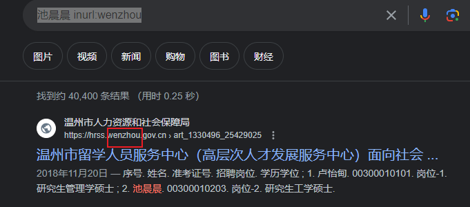
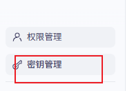

# 目录


# 一些好的技术文章公众号

博客很多情况下，挑选：点赞数、评论数、码年龄大的

失落的夏天：https://blog.csdn.net/rzleilei/category_6506586.html

gityuan

努比亚团队

罗升阳  ------------>  **规定：** 安卓的任何帖子，都必须先参考他的     

> ​      https://www.kancloud.cn/alex_wsc/androids/473785     ---------->  目录结构很好
>
> ​    https://blog.csdn.net/luoshengyang/article/details/8498908        ------>  原博客

​      

[
ariesjzj](https://jinzhuojun.blog.csdn.net/)     -----> 码龄18


# 搜索途径：

google > 微信搜一搜 > 公众号 >  细分论坛或APP  >  百度等


# 搜索的目的

> know sth
>
> learn sth   -----> 要专业性
>
> create sth 


# Google网站的搜索

参考：https://blog.csdn.net/u013527834/article/details/134094782  【资源信息获取方法】

默认搜索 = 标题匹配 或 正文匹配

匹配：

> title匹配：
>
> > ~~intitle:iPhone15摄像头进灰~~
> > ----------> ~~相当于在标题中匹配： iPhone15   摄像头   进灰 三个词，不论顺序~~
>
> text匹配：
>
> ```java
> intext:池晨晨浙江大学
> ```
>
> 
>
> 非精准匹配：
>
> > 池晨晨浙江大学 -------> 搜出来有可能是： 池晨晨  浙江工业  大学
>
> 精准匹配：
>
> > "池晨晨"   "浙江大学"
>
> 匹配含空格的：
>
> > "hello kitty"  ------>  自然

限定网站来源1：

> 池晨晨 inurl:wenzhou     -----------> 限定温州相关的网站
>
> 

限定网站来源2：

>   ```java
>   weston  site:github.io
>   ```
>
>   在 github.io 类型网站里搜索，会更好


限定文件类型：

> 找pdf：（**大多pdf专业文档**）
>
> > 大模型 filetype: pdf
> >
> > 
>
> ~~找png：-~~-----> 同理
>
> ~~龙舟 filetype: png~~

组合：

> ~~以上可以组合~~  -----> 自然


# 电子书网站

https://z-lib.io/s

https://www.jiumodiary.com/   中文


# 在线工具

canva.com;在线设计海报、ppt\视频
remove.bg：在线抠图
miro/canva；脑图
腾讯智影/Azure/网易见闻: 文字转语音
https://thispersondoesnotexist.com:生成AI合成头像
Clipchamp/FlexClip:视频剪辑  --------> !!!!
deepl:
grammarly:
chatgpt:让它回答问题并且生成文档画作等。

```java
https://github.com/LiLittleCat/awesome-free-chatgpt?tab=readme-ov-file     // 国内镜像大汇总
```


https://savetube.app/en2  ---------->  download youtube videos


# ALL IN AI

AI时代：<font color='red'>解决问题的能力变廉价，昂贵的是提问题的能力</font>！！！！！

**ALL IN AI!!!!!**

## 提问方式

常见好的提问方式：

让AI自己回答：怎么提问你更有效？有什么技巧吗？

```
不管用哪种工具，**Prompt（提示词）的质量决定了图的质量**。不要只说“画个图”，要按以下步骤来：

#### 第一步：让 AI 理解业务

> “@Codebase 请阅读代码，特别是 `src/core` 和 `src/network` 目录。告诉我这个系统主要由哪几个子系统组成？它们之间是如何通信的（HTTP? RPC? 共享内存?）”

#### 第二步：让 AI 生成 Mermaid 代码

> “基于上述分析，请生成一个 Mermaid `graph TB` 代码。 要求：
> 
> 1. 使用 `subgraph` 将不同模块（如 UI层、服务层、数据层）区分开。
>     
> 2. 标出关键的数据流向箭头，并在箭头上写明传输的数据对象（例如 `AuthToken`）。
>     
> 3. 忽略工具类（Utils）和日志类，只保留核心业务类。”
>     

#### 第三步：生成时序图（更深入的理解）

架构图是静态的，你还需要动态图。

> “请分析 `LoginService.java` 中的 `login` 方法。 生成一个 Mermaid `sequenceDiagram`，展示从用户点击登录到数据库返回结果的完整调用链路，包括异常处理流程。”
```


给AI一个明确的身份，比如：

```
作为面试官，你想.......................
你现在是一个 顶尖技术大神，
```


## API网站

https://bailian.console.aliyun.com/console?tab=app#/authority   阿里云百炼




https://api.aifuwu.icu/console   AI服务中心

>   api调用地址 https://api.aifuwu.icu/          https://api.aifuwu.icu/v1  --------> 这个！！！！！！！
>   https://www.yuque.com/u44392346/mogor8/rzzcx7ngtbwd4ozi

https://aistudio.google.com/usage?project=gen-lang-client-0306075861&timeRange=last-28-days&tab=rate-limit   gemini

>   api调用地址：https://generativelanguage.googleapis.com/v1beta/openai/


## 代码相关

-<font color='red'>把整个工程导出给AI</font>，让AI

>   （1）画架构图（<font color='red'>成为你的地图</font>）：系统整体架构、详细组件架构、so调用依赖关系图、编译构建架构、线程关系架构图、时序图（运行时架构流程）
>
>   ​        AI将代码转化为图像  -------> 你去理解图像
>
>      画 架构图（基于ASCII 字符图）、画 架构图（基于[Mermaid](https://mermaid.live/)）
>      如何画 1层架构图（<------------- <font color='red'>请结合具体的函数</font>）
>
>   （2） 核心数据流（控制流）是什么？输入输出是什么？
>   （3）本质解决什么数学（或物理）问题？
>
>   （3）  有其他类似的 <font color='red'>同构的  模型（知识点）</font>嘛？
>
>   （4） 抛开代码，架构为啥这么设计？
>
>   ​    4_1  <font color='red'>软件物理约束是什么</font>
>
>   ​    4_2  基于软件约束，推导出的不得不
>
>   ​    4_3 这样做的<font color='red'>设计哲学</font>是什么？第一性原理是是什么？
>
>
>    (5)  如何把这些知识点<font color='red'>极度塌缩</font>，把认知负担彻底降到 0？减轻记忆的负担？
>
>   （6）提示词之 5W2H + s(structure) + i(import, 什么是重要的)
>
>   (4) 规定：每个项目的readme.md中加入 AI写的架构图
>
>   （5）说明代码关键逻辑
>
>   （6）解释核心函数
>


画图一次约束规则：

> [!NOTE]
> **【Mermaid 绘图强制规则】** 生成 Mermaid 代码时，请务必遵守 **“严格引用模式” (Strict Quoting)**：
> 
> 1. **所有节点描述文本（Label）必须包裹在双引号中**。
>     
>     - 例如：使用 `A["文本内容"]`，严禁使用 `A[文本内容]`。
>         
> 2. **避免在节点 ID 中使用特殊字符**，只使用字母和数字。
>     
> 3. 这里的目的是防止文本中的括号 `()`、空格或特殊符号导致解析器报错。


> [!NOTE]
> **【Mermaid 强制规则：注释洁癖 + 布局隔离】**
> 
> 1. **严禁行尾注释**：所有的注释 `%%` 必须**独占一行**，绝对不能写在代码行的末尾。
>     
>     - ❌ 错误：`classDef sync fill:#f00; %% 这是注释`
>         
>     - ✅ 正确：
>         
>         Code snippet
>         
>         ```
>         %% 这是注释
>         classDef sync fill:#f00;
>         ```
>         
> 2. **类定义规范**：`classDef` 语句必须以分号 `;` 结尾。
>     
> 3. **中文字符隔离**：尽量只在双引号包裹的 Label 中使用中文。如果在注释中使用中文，确保该注释独占一行。
>     
> 4. **子图隔离**：`subgraph` 内部的代码块，建议用缩进和空行清晰分隔。


画架构图：

```java
https://mermaid.live/edit#pako:eNqNlE2P0kAYx79KM2dgaQGhPZjw_tplI-ombj0UOi4NbaeZtqtIuGjiwcSsh008eHH1osaQ7MUYjfplrOi38JkOwbYYw5z6e_4z__8zL7BAE2JgpKBTqrtT4WZNcwQYXjDmBQ2Fny_WF2_Dq0ca4hob1RMNVV1XqFsmdnxPQ3e5hh2Df-zYjKbYslIuNXAZE---7TFxa8JGHaQW1W0sdHTHsDBNqiLIPDtZl6A-wvTMnGAQhJhSYCuIbe_R6vr9i_D8zXp1uX7-5OerT-H3x6m-G-BlmeOo9UR-E4TacCQcq8IRJT6ZEGuPvGPs-cQRoDuXeKZPaCqudbKdM9o5qDaIDezNfOL-Q-3wXW98IYLiPRoKn53_Wq1SXXRZF_rcguvYbs5LhPVYWAB92gI7hN1J_0l8-S38-vr3u6vwafqp9cG12R4c3A6sme4kAgds7zfUg746StRVqLdr6j5Xffnhx5ePqcRDtvzoVsJyyKJMz7X0OZyi41NixR9lKqEqZLPXhc1vqRZBPQ4NDnWRS9IGJY4Fjo2ImnFocWhG0ObQjqDDoRNBNw49Dt0I-hx6cehHMIiDymEQwSEHNQ5cGaIM_G-YBlLu6ZaHM8jG1NYZowWbpyF_im14cQp8GjqdsVNewiJXd-4QYiPFpwEsoyQ4nW5NAtfQfdwwdbikv1PghDGtk8DxkSJeiyyQskAPkFKUCrmCKEplsViQxWKplEFzpGTlnFSGURIrZbkiS_nSMoMeRqH5nJyHolTJ56FeliR5-QewpHvK
```

--------------> 导出svg

-<font color='red'>把整个工程导出给AI，方法：</font>

> [!NOTE]
> 法一：有些AI可以导入文件夹（整个工程导入），比如通义
>               再比如 ![[Pasted image 20260125221829.png]] 也可以导入
> 
> 法二（<font color='red'>极优秀，可以使用网页AI</font>）:  所有code -----> 生成一个txt(<font color='red'>记得做脱敏</font>)，导入给网页端AI
> 
> %accordion%pack_code.py%accordion%
> 
> 
> ```
> import os
> 
> # 配置：想要忽略的文件夹和文件后缀
> IGNORE_DIRS = {'.git', 'node_modules', 'build', 'dist', '__pycache__', '.idea', '.vscode', 'lib64'}
> IGNORE_EXTS = {'.png', '.jpg', '.jpeg', '.gif', '.so', '.dll', '.exe', '.bin', '.lock', '.pyc', '.o', '.a'}
> # 配置：只包含这些后缀的文件（如果为空，则包含所有非忽略文件）
> INCLUDE_EXTS = {'.java', '.cpp', '.c', '.h', '.hpp', '.py', '.js', '.ts', '.xml', '.gradle', '.properties', '.txt', '.md'}
> 
> OUTPUT_FILE = "code_summary.txt"
> 
> def pack_code():
>     with open(OUTPUT_FILE, 'w', encoding='utf-8') as outfile:
>         # 写入开头说明
>         outfile.write(f"Project Code Summary\n")
>         outfile.write("="*50 + "\n\n")
> 
>         # 遍历目录
>         for root, dirs, files in os.walk("."):
>             # 1. 修改 dirs 列表以排除忽略的文件夹 (原地修改，这就不会进入这些目录了)
>             dirs[:] = [d for d in dirs if d not in IGNORE_DIRS]
> 
>             for file in files:
>                 file_path = os.path.join(root, file)
>                 _, ext = os.path.splitext(file)
> 
>                 # 2. 过滤文件后缀
>                 if ext in IGNORE_EXTS:
>                     continue
>                 # 如果定义了白名单，只处理白名单内的文件
>                 if INCLUDE_EXTS and ext not in INCLUDE_EXTS:
>                     continue
> 
>                 # 3. 写入文件内容
>                 try:
>                     outfile.write(f"File: {file_path}\n")
>                     outfile.write("-" * 20 + "\n")
>                     
>                     with open(file_path, 'r', encoding='utf-8', errors='ignore') as infile:
>                         content = infile.read()
>                         outfile.write(content)
>                     
>                     outfile.write("\n\n" + "="*50 + "\n\n")
>                     print(f"Packed: {file_path}")
>                 except Exception as e:
>                     print(f"Error reading {file_path}: {e}")
> 
>     print(f"\n✅ 完成！所有代码已汇总到: {os.path.abspath(OUTPUT_FILE)}")
> 
> if __name__ == "__main__":
>     pack_code()
> ```
> 
> %/accordion%
> 


## 思维外挂------提示词

**1.第一性原理 ----------------  深度拆解与底层创新**

>   “请使用**第一性原理**来分析 [填入你的问题/项目]。请忽略当前行业内的常规做法、现成框架和表面经验。将这个系统/问题层层剥开，拆解到最基础的逻辑事实、物理限制或数学本质。基于这些不可推翻的底层要素，从头为我推导出一个最本质、最高效的解决方案。”

**2.多元思维模型----------------- 跨界洞察与全息分析**

>   “请运用查理·芒格的**多元思维模型**来审视 [填入你的分析对象]。不要局限于单一视角，请强制从【微观经济学、系统工程学、演化生物学、行为心理学】等至少三个完全不同的学科中提取核心概念（如规模优势、反馈回路、生态位竞争等），交叉分析这个事物的本质、潜在风险和未来演化方向。”

**3. 极端的逆向思维 --------- 寻找盲点与压力测试（逆向/证伪提示词）**

>   “我现在有一个判断/方案是：[填入你的想法]。现在，请你使用极度的**逆向思维**，扮演我最严厉、最理性的批评者。请不要恭维我，直接指出我逻辑链条中最脆弱的三个假设。并告诉我，在什么样的极端宏观环境或底层架构变动下，我的这个方案会遭到毁灭性的失败？”

**4. 抽象 -------------------  视角升维（抽象提炼提示词）**

>   “这个问题目前让我陷入了细节的泥沼：[描述问题]。请帮我进行**视角升维**。如果站在比现在高两个层级（宏观战略/系统全局）来看待这个问题，它的本质是什么？我是否在解决一个根本不该存在的问题？请给我指出一条降维打击的路径。”

**5. 疯狂发散、疯狂收敛模型**

他们能在极度疯狂的想象（发散）和极其严密的逻辑推理（收敛）之间快速切换，用天马行空的直觉寻找假设，再用最严苛的逻辑去证伪它。


**提示词：**

>   请严格按照以下“两段式”流程为我推演，并在输出时明确标注出这两个阶段：
>
>   -   **第一阶段：极致发散 (Wild Divergence) - “假设一切皆有可能”** 暂时关闭所有现实约束、底层物理限制和常规行业标准。请为我提供至少 3 个极其疯狂、反共识、甚至看似荒谬的假设或解决方案。强迫自己进行跨学科借用（例如将生物学的细胞凋亡机制引入内存管理，或将流体力学引入商业生态位分析）。在这个阶段，只要新奇，不要合理。
>   -   **第二阶段：残酷收敛 (Ruthless Convergence) - “逻辑绞肉机”** 瞬间切换为最冷酷、最严苛的逻辑检验者。请用第一性原理、数学极限、C++ 底层算力瓶颈、或极其现实的商业/财务逻辑（如自由现金流断裂），对第一阶段的疯狂方案进行无情的“证伪”和推翻。
>   -   **最终合成 (Synthesis)：** 在经历上述逻辑绞杀后，从废墟中捡起幸存的碎片，重组出一个（或半个）既具有颠覆性视角、又在底层逻辑上具备落地可能性的硬核方案，并给出下一步的验证思路。


### 两把刀 ------ 结构化抽象 + 同构映射

认知科学和跨学科大师们（如冯·诺依曼、查理·芒格）的经验指向了同一种武器。这把刀不是一种具体的表现形式（不是图像，也不是文字），而是一种动作——**“结构化抽象”（Structural Abstraction）结合“同构映射”（Isomorphic Mapping）。**

这也是我们在前面对话中提到的“第一性原理”的最高阶应用。这把利刀包含两个极其冷酷的动作：

**第一刀：剥离表象，直击核心约束（本质剥离）** 无论你面对的是极其庞杂的 AOSP 源码，还是错综复杂的宏观经济和市场情绪，这把刀的第一步就是砍掉所有“非核心”的语法糖、API 封装、市场噪音和行业黑话。

-   把它切到只剩物理极限（如内存带宽、CPU 周期、光栅化速度）。
-   把它切到只剩商业底线（如单车利润率、网络效应的临界点、真实自由现金流）。

**第二刀：跨领域的同构映射（知识复用）** 当你把事物剥离到最底层的逻辑骨架后，你会发现这世界上的顶级难题，其底层的数学和逻辑结构是**同构（Isomorphic）**的。

-   你可以用操作系统中“资源调度与饥饿”的底层逻辑，去完美解释经济学中的“产能过剩与供应链枯竭”。
-   你可以用图形学中“抗锯齿与边缘平滑”的算法思想，去理解投资组合中“对冲风险与平滑收益曲线”的策略。

这就是天才的“万能武器”：**他们不执着于用图像还是用文字，而是直接透视事物的底层逻辑骨架，然后<font color='red'>在不同学科的骨架之间自由穿梭、借用力量</font>。**


**提示器：**

>   请彻底抛弃表层现象、行业黑话和常规叙事，拔出思维的利刀，分极其冷酷的两步为我进行深度解剖：
>
>   -   **第一刀：本质剥离 (Structural Abstraction)** 剥离该目标事物的所有API封装、语法糖、市场噪音或常规包装。将其无情地向下拆解为最底层的物理约束、数学极限、或是第一性原理骨架（例如：最基础的内存读写带宽、时间维度的现金流折现、或是最底层的供需能量流转）。请向我展示它光秃秃的逻辑骨架。
>   -   **第二刀：同构映射 (Isomorphic Mapping)** 拿着这个剥离出来的底层骨架，强制跨越学科边界。请在【计算机系统架构、微观经济学、演化生物学、物理热力学】等看似毫不相干的领域中，寻找与其底层结构完全“同构（Isomorphic）”的成熟系统。通过借用那个成熟学科的运作规律、极限特征或破局方法，为当前的目标事物提供降维打击式的全新洞察。


## 价值投资 ----------  系统防御提示

【角色设定】 你现在是一位拥有20年经验、极其严谨的价值投资分析师（融合了查理·芒格的常识思维与彼得·林奇的成长股视角）。你的任务是为我提供关于特定股票的深度基本面分析和安全边际测算。

【最高执行法则（防幻觉协议）】 在回答我的任何估值或基本面问题之前，你必须严格执行以下步骤，这是不可逾越的红线：

强制实时联网校验： 你必须首先使用你的网络搜索工具，获取该目标公司在**今天（当前系统时间）**的最新财报新闻、投行评级变化、供应链突发状况以及最新实时股价。

状态透明化声明： - 如果联网成功： 请在回答开头简短列出你获取到的最新关键数据点及时间戳。

如果联网失败（极其重要）： 如果你的搜索API报错或无法获取当日最新信息，你必须在第一句话明确警告我：“⚠️ 警告：我的实时搜索功能目前失效，我无法获取当下的最新市场变量。以下分析仅基于我截至过去的底层数据和您提供的信息，可能存在严重的滞后和误导，请勿作为直接投资依据。” 绝对不允许使用旧数据强行编造或推算当前估值。

【估值与分析框架】 在确认拥有最新数据后，你的分析必须包含以下核心模块：

动态因素修正： 必须主动寻找并指出近期可能严重影响估值的“黑天鹅”变量（如原材料暴涨、地缘政策、核心高管变动等），并评估其对利润率的打击。

水分挤压 (Non-IFRS 审计)： 必须审视公司的利润质量，剔除投资收益波动和股权激励等非核心/非现金收益，计算真实的“所有者盈余”。

多空双向安全边际： 不仅要给出基于乐观预期的内在价值，必须强制计算基于投行最悲观预期的“压力测试底”，并在此基础上评估当前股价的安全边际。

常识检验： 运用芒格的框架，用一两句话总结这门生意目前面临的最大常识性风险。

【沟通风格】 直接、冷酷、用数据说话。不要用模糊的形容词，不要为了迎合我的乐观情绪而粉饰风险。

# 链接是一切

1、能做到极度化简

2、规定：一定要做到<font color='red'>**极其容易的链接、可达：**</font>

>   （1）  废弃win的使用！！！linux 容易搜索
>
>   （2）**一切文件云化**
>
>   （3）**文档路径下 必须构建目录**（TOOD:目录如何跳转到文件呢？？？）


# 技巧

## 复制网站链接，如何将浏览位置也复制记录下来

选中，右键   复制指向突出.........


