# 目录

 


# 其他次要软件/工具

## 软件大全

推荐使用：

| 功能：                 | 软件：                                                       |      |      |
| ---------------------- | ------------------------------------------------------------ | ---- | ---- |
| 事件分发/事件驱动 软件 | 时光序，桌面日历                                             |      |      |
| 录屏                   | EV录屏                                                       |      |      |
| 安卓手机linux命令不全  | busybox的二进制                                              |      |      |
| 像素测量，pixel测量    | 法一：1、图片的像素测量：Dorado_1.1.exe<br />法二：2、图片的像素测量：windows右键，查看图片属性<br />法三：测量window或者Linux 屏幕上的像素 --------> <font color='red'>snipaste截屏时，自带px的标尺！！！</font> |      |      |


## Source Insight

见《sourceInsight.md》


## vscode

编译环境的搭建：
https://chowdera.com/2020/12/20201229202248553i.html

https://code.visualstudio.com/docs/languages/cpp   官方文档

AddressSanitizer工具
https://docs.microsoft.com/en-us/cpp/sanitizers/asan?view=msvc-170   


高亮变量: vscode的highlight-words：
https://blog.csdn.net/u013171226/article/details/108868425                 


​      TODO: Ubutu上安装vscode，并搭建Frame native断点调试环境    :
https://www.jianshu.com/p/d84a2ec948be     使用VsCode调试Android Framework C/C++源代码
https://blog.csdn.net/zhaojia92/article/details/99774704      


### 补充 vscode

vscode可以断点调试bin：（确定可以）

> 指定bin路径

参考： https://blog.csdn.net/weixin_39258979/article/details/111292273

-------------------> TODO: 还未验证


​                                                                                                                                                                                                                                                                                                                                                                                                        

## markdown

### 设置 编辑器 的宽度

（也是主题）的宽度

https://blog.csdn.net/xiaojin21cen/article/details/90292315#2___12


## Q-dir


## 截图工具Snipaste 


1、可以截取多张图片，悬浮在屏幕里---》对照方便


2、绘图展示

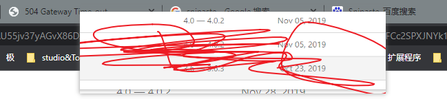

3、放大缩小：

4、透明度改变


5、开机自启动

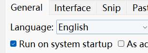

2、单独一次截屏，自动复制（F4）：

> ​       （1） 设置： 控制 ----->  快捷键 ----->截屏并自动复制  -----> F4
>
> ​       （2）操作：F4 , 然后鼠标<font color='red'>右键</font>
>
> ​            
>
> **F3 比较繁琐，后面还有多步操作**

3、实现  **快速连续多次**   截屏，并自动保存一系列png（极优：中间没有粘贴等其他操作）：F4 + 左键

> (1)设置： 控制 ----->  快捷键 ----->截屏并自动复制  -----> F4
>
> （2）输出 ------> 自动保存  -----> D:/Snipaste_png
>
> 
>
> (3)  操作：F4 , 然后鼠标<font color='red'>左键</font>

------------> 一直如此，目录下，出现一堆png

4、技巧：

shift + F3,  显示/隐藏（一个组的所有贴图） -----------> 不会挡住

注： 只有F3截图能进入组；F4截图是进入文件夹

5、ctrl + F3，切换组（相当于文件夹了）


## mobaXterm

copy将整个页面：
1、关掉右键粘贴

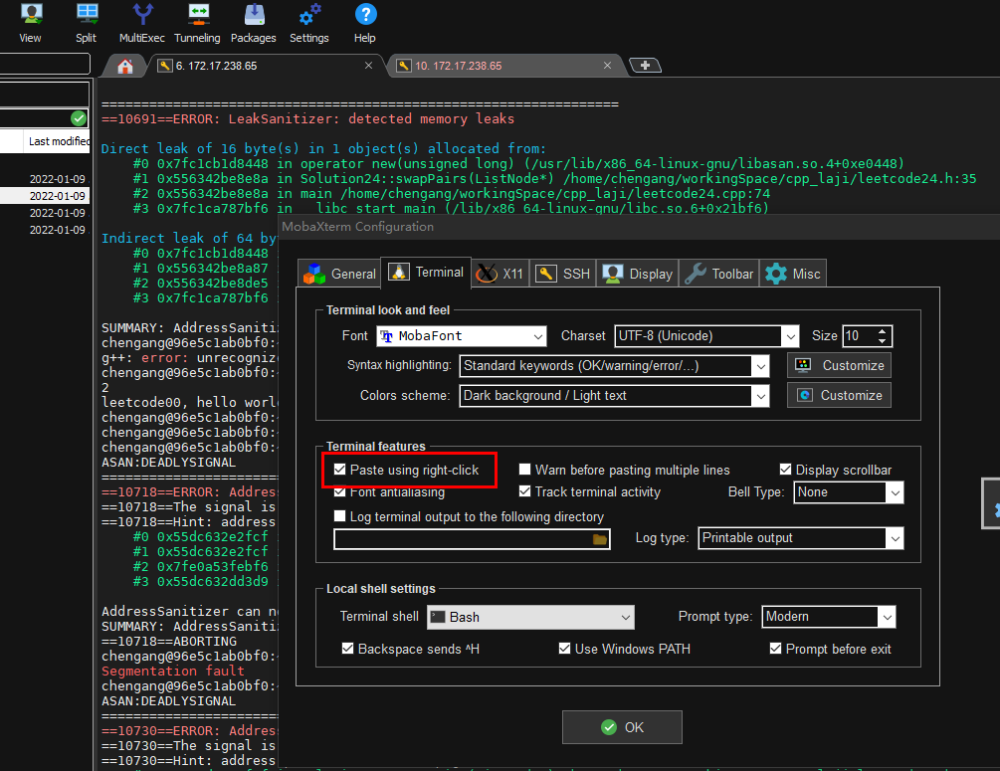

2、复制全部或

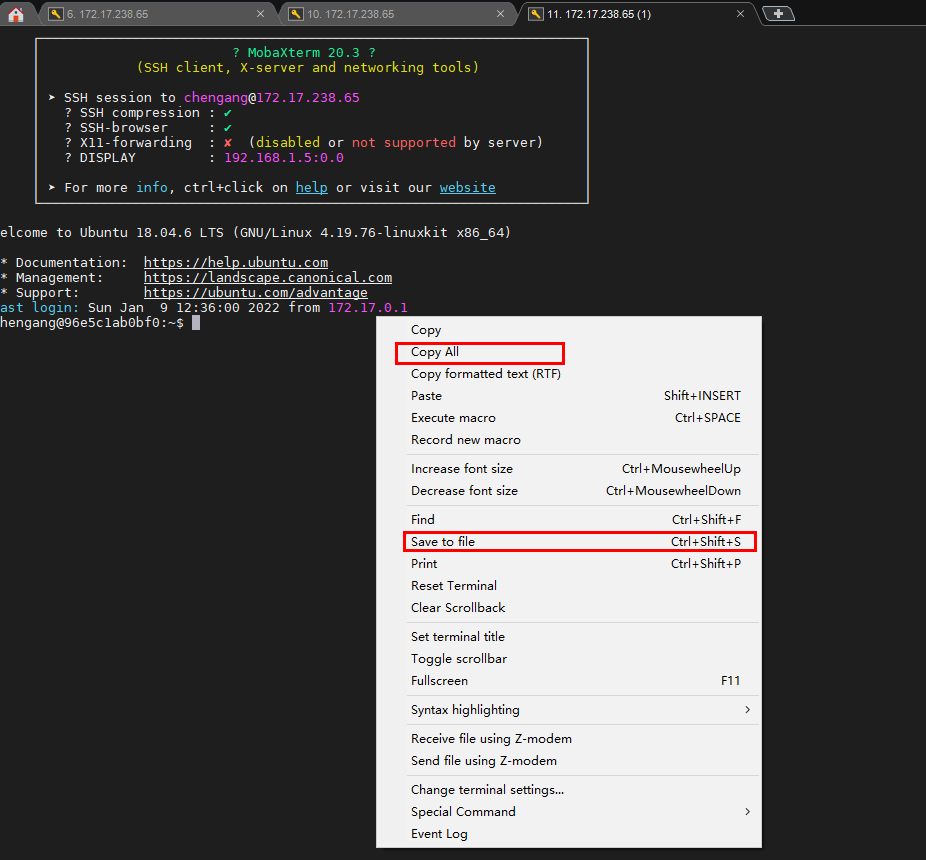


+号默认打开的是宿主机子win的c盘位置，相当于 打开本地的cmd   ----> TODO: 这其实是很好的入口，用linux环境，做一些cmd初始化的工作


### 提高效率的做法

同时开几个窗口 + 且用tmux：


> 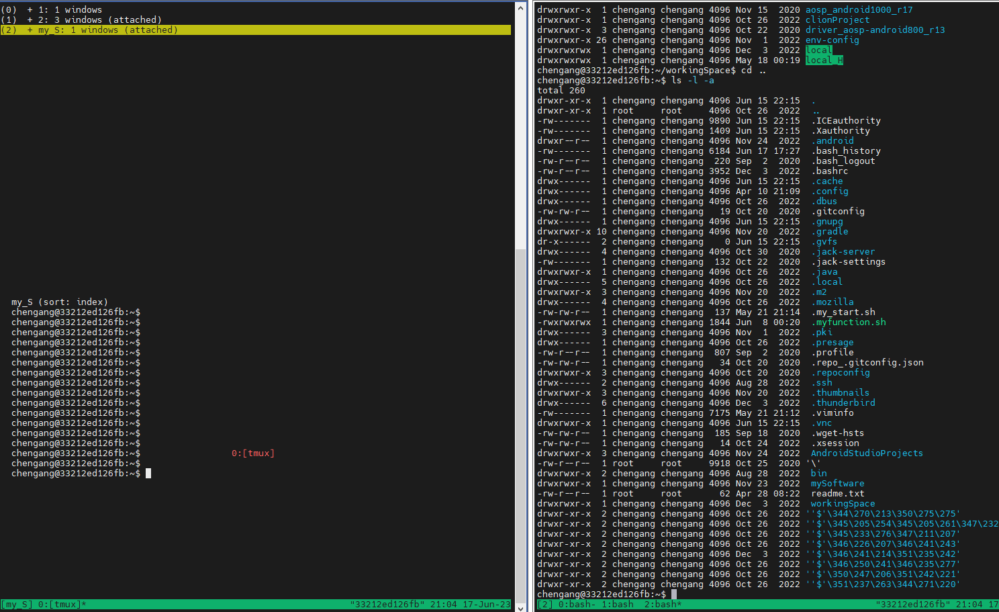


### 启动sh，可以定制一些东西

这一点同Linux、win的 sh脚本一样


Bash启动：


会自动执行profile文件：----> 在这里source  sh文件，自定义function

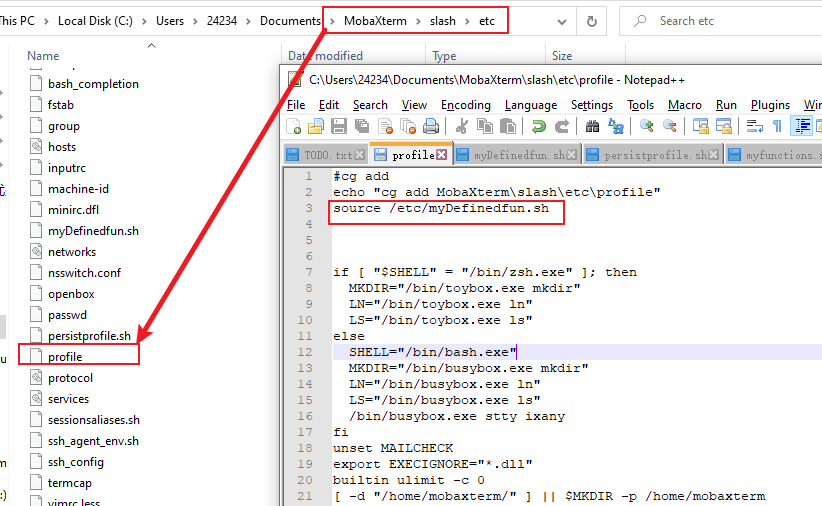


### 技巧1：

bash.exe环境 是 linux下shell环境:----------->  命令友好

但是 缺少 win环境变量（比如adb，python）

----->  方法：极优   linux环境 + win环境变量（即win环境）：


%accordion%~~步骤：~~%accordion%

> 在bash环境下，先进入cmd（拿到win环境），再exit回到 bash环境
>
> 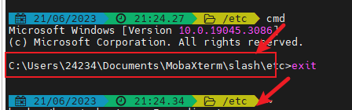


%/accordion%

### 技巧2：

可以在win下任意路径，进入bash环境


%accordion%即%accordion%

> 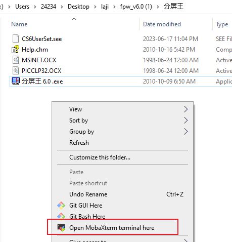


%/accordion%


### 极优的点：

整个win系统的硬盘都挂在了/drives

------------->  整个win硬盘，bash都可以访问


### 技巧之 ssh不用重复输入密码

1、 不用输入账号 & 密码--------设置：

> session ---->  SSH  ---->  Specify username

2、保活：

> settings ----> SSH  ---->  SSH keepalive

### 问题：ssh登录linux时，不显示用户名和目录

问题： ssh登录linux时：

> 1、不显示用户名和目录
>
> 2、用不了TAB键填充
>
> 3、无法用 上键  查看历史信息

~~办法：~~


> **原因：用的sh，不是bash**
>
> vim /etc/passwd
>
> 找到对应用户，将最后的/bin/sh 改为/bin/bash
>
> 
>
> 参考：https://blog.csdn.net/qq_43358006/article/details/132586019
>
> 


### 解除最多保存14个Session的限制

[MobaXterm如何解除最多保存14个Session的限制](https://www.jianshu.com/p/a40cbf068934)


## 远程桌面：

### 远程桌面之内网穿透

淘宝有卖

远程桌面需要的条件：局域网（没有公共IP） 或者 公网ip 或者内网穿透

https://zhuanlan.zhihu.com/p/115826053?utm_source=wechat_session&utm_medium=social&utm_oi=903075405244817408&utm_campaign=shareopn


### 远程桌面之  公网ip（ipV6）

#### 目标 一：有个可以在广域网ping通的ipv6

可以测试的网站：

> https://ipw.cn/
>
> 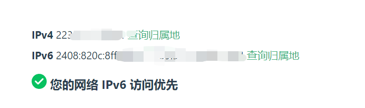
>
> 
>
> https://test-ipv6.com/
>
> 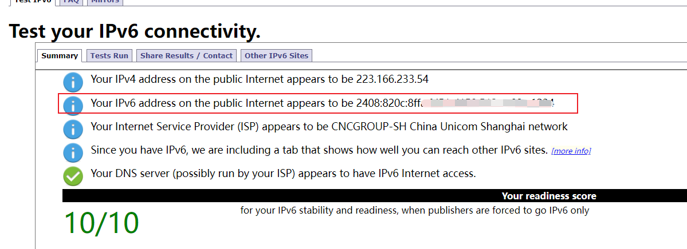
>
> http://test6.ustc.edu.cn/
>
> 


#### 步骤1：1级光猫配置（可直接使用光猫wifi的 ipv6）

登录：http://192.168.1.1/cu.html          参考：https://zhidao.baidu.com/question/1930330333758025547.html       

```java
联通光猫wo_27s的网址；192.168.1.1/cu.html
超级用户名：CUAdmin
密码：CUAdmin
```

拨号的配置：


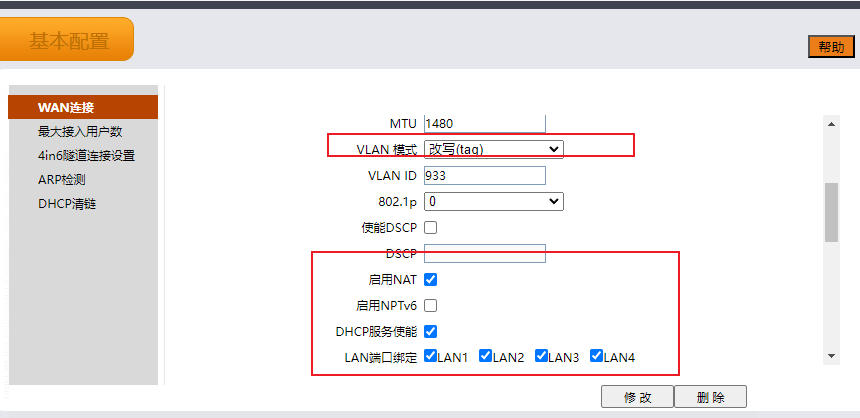

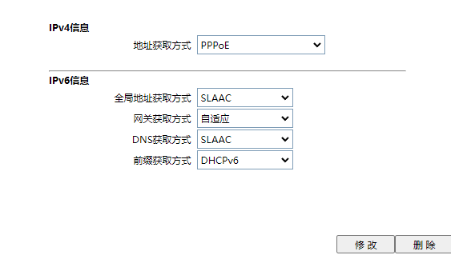


防火墙设置：iPv4防火墙设置低；iPv6防火墙直接删掉

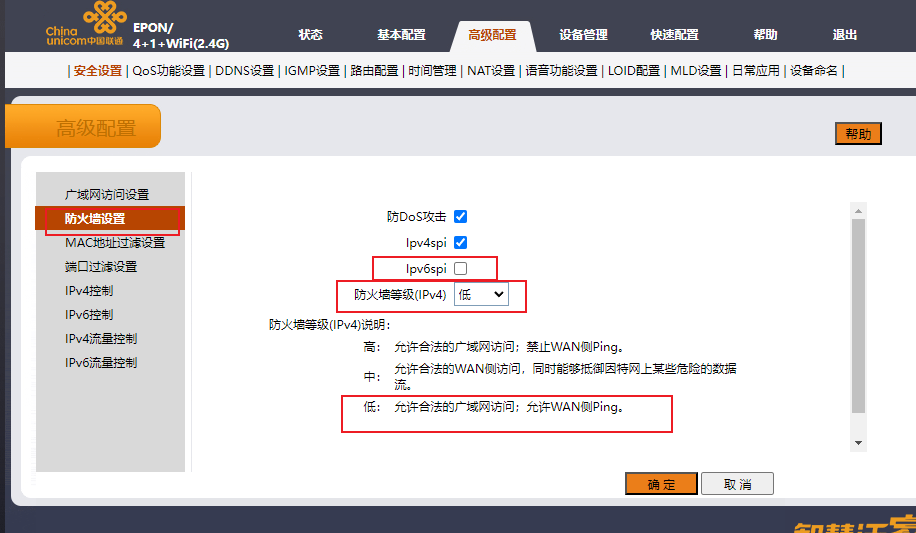


**核心要点：关闭各种防火墙**--------pc防火墙 + 路由器防火墙

> https://blog.csdn.net/weixin_43245095/article/details/125237294        IPv6连接测试通过，但是无法ping成功问题解决（记录）
>
> 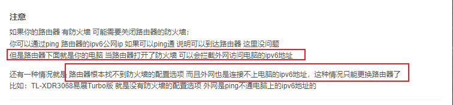
>
> https://blog.csdn.net/hua0721/article/details/128223801   ipv6外网能ping通，但无法访问服务(自建网站,远程桌面等)
>
> 


**注意：此时可以使用光猫wifi的 ipv6 ----》 可以被广域网 ping到。可以远程使用**


#### 步骤2：二级路由器的设置

联网设置：

（1）物理网线连接 光猫

（2）登录  http://192.168.2.1/    **<font color='red'>ipv6相关设置：</font>** 账号admin

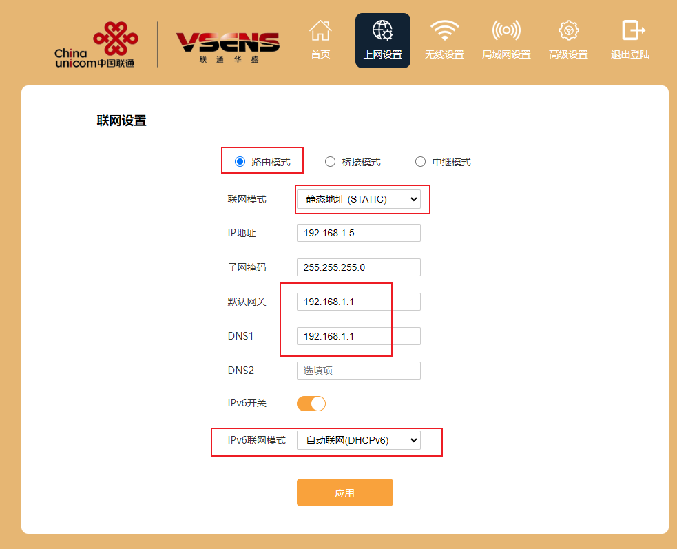


#### 二级路由器也存在防火墙关闭问题：

同上面，也要关闭防火墙


方法一：路由器设置界面可以关掉

**方法二：路由器界面就没有防火墙--------> 大招，进入系统：**

参考：  https://zhuanlan.zhihu.com/p/547389653    关闭服务器防火墙


进入路由器系统的方法：

> （1）打开ssh开关 ：
>
> 登录 http://192.168.2.1/api/set/telnet     账号admin
>
> 
>
> 参考： https://429006.com/article/tag/openw
>
> （2）进入： C:\Users\24234>ssh  -l   root 192.168.2.1


##### 方式一：将ipv6防火墙全部关闭

```java
root@VS010:~# cd /
root@VS010:/# config2 default/
root@VS010:/#  ip6tables -F
root@VS010:/#  ip6tables -X
root@VS010:/# ip6tables -P INPUT ACCEPT
root@VS010:/# ip6tables -P OUTPUT ACCEPT
root@VS010:/# ip6tables -P FORWARD ACCEPT
root@VS010:/#

//总之，
config2 default/  && ip6tables -F && ip6tables -X && ip6tables -P INPUT ACCEPT && ip6tables -P OUTPUT ACCEPT &&  ip6tables -P FORWARD ACCEPT


```

远程桌面，只需要IP即可

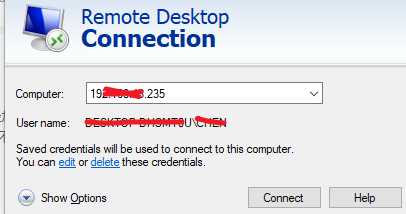

##### 方式二：在防火墙开一两个端口（将远程桌面的端口3389开）

 优点---------》  **安全性非常好**


参考：http://app.myzaker.com/news/article.php?pk=626eae9d8e9f095e4a34d66f   

```java
// 开放5001
ip6tables -I forwarding_rule -p tcp --dport 5010 -j ACCEPT  
ip6tables -I forwarding_rule -p udp --dport 5010 -j ACCEPT
// 开放3389
ip6tables -I forwarding_rule -p tcp --dport 3389 -j ACCEPT
ip6tables -I forwarding_rule -p udp --dport 3389 -j ACCEPT

路由器开机后自动开启 5000 和 3389 端口，这个端口号是可以根据自己的需求更改或者增加的。Windows 系统的远程桌面端口认是 3389，如果觉得不安全，可以换一个端口号。
```

远程桌面：  [ipv6地址]:端口，比如  [ipv6地址]:3389


优化1：

>  Windows 系统的远程桌面端口认是 3389，不安全 ------>  修改端口为5010
>
>  参考：
>
>  ​            https://xinzhi.wenda.so.com/a/1630119419206952
>
>  远程桌面：  [ipv6地址]:5001


优化2：把脚本写进路由器开机启动里

参考：http://app.myzaker.com/news/article.php?pk=626eae9d8e9f095e4a34d66f   

写入文件：vi /etc/rc.local


### 优化之 ipv6租约时间

路由器定时修改ipc的 IPv4和ipv6???

------------>  解析，固定为个人域名

https://github.com/jeessy2/ddns-go

具体步骤，见md

### 远程桌面之 音频传输

远程桌面连接后听不到remote pc的视频播放声音：

> 1、相关的配置：   https://www.anyviewer.cn/how-to/rdp-audio-not-working-6540.html
>
> 1_1、重启本地+远程pc
>
> 2、确定remote pc已安装声卡和驱动 + 耳机，换句话说就是remote pc可以出声
>
> 3、本地pc远程：
>
> ​     


一个坑：

> 验证步骤2时，不能用RDP远程操作。办法：  用向日葵或直接远程pc登录验证


## git bash

好处：

> 1、git作用
>
> 2、**将win文件系统变成linux（极优）** -------->  一切在linux下的命令，都可以用在win下
>
> ​      比如： ls  -l、执行sh、git管理文件
>
> 3、任意win目录都可以变成linux目录


安装：

https://blog.csdn.net/aixueai/article/details/119574135


第一次使用，设置你的名字和Email地址：

>  <---------git commit需要！！！
>
>  ```cpp
>  git config --global user.email "you@example.com"
>  git config --global user.name "Your Name"
>  ```
>
>  


git push需要：


## gitBook----个人网站

### 环境搭建：

https://blog.csdn.net/YunWQ/article/details/120197926?spm=1001.2101.3001.6650.3&utm_medium=distribute.pc_relevant.none-task-blog-2%7Edefault%7ECTRLIST%7ERate-3-120197926-blog-122971465.235%5Ev36%5Epc_relevant_default_base3&depth_1-utm_source=distribute.pc_relevant.none-task-blog-2%7Edefault%7ECTRLIST%7ERate-3-120197926-blog-122971465.235%5Ev36%5Epc_relevant_default_base3&utm_relevant_index=4


https://www.jianshu.com/p/a9c6b5cba8cf

https://blog.csdn.net/qlql489/article/details/122971465

TODO:https://docs.docker.com/get-started/overview/   ---> 看一下别人如何搭建这么好的
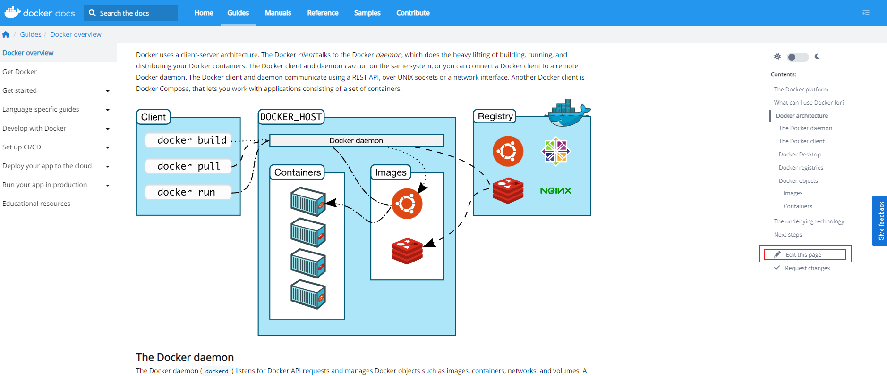


#### gitbook init报TypeError [ERR_INVALID_ARG_TYPE]

https://blog.csdn.net/qq_33641175/article/details/122508473


#### 选择github作为网页page的仓时

每次push，网站会自动校验 pages build ：

%accordion%影响%accordion%

1、通不过，无法访问网站github.io 网站

2、这也解释了为啥push上去，要等很久，才更新网页（校验build需要时间）


%/accordion%

### PC本地调试，优

命令gitbook  serve(注意是serve不是server)

并生成http://localhost:4000本地访问地址 


### 各种插件

https://blog.csdn.net/ming_97y/article/details/115202048      Gitbook详解（五）-插件的配置和使用详解

https://blog.csdn.net/xixihahalelehehe/article/details/125115239  

```json
  "plugins": [
    "anchor-navigation-ex",
	"toggle-chapters",
	"expandable-chapters-small",
	"splitter",
	"code",
	"page-treeview",
	"popup",
	"-search", 
	"-lunr",
	"search-pro"
  ],
```

<-------  gitbook install   安装上述所有！（<font color='red'>验证OK</font>）

注意：

> 单个plugin，会报错，比如：
>
> > ```java
> > gitbook install search-pro  // 【】
> > ```


gitbook功能插件有：

%accordion%插件%accordion%

> 1. [gitbook 介绍](https://link.zhihu.com/?target=https%3A//blog.csdn.net/xixihahalelehehe/article/details/125132380)【updated】
> 2. [gitbook 开始](https://link.zhihu.com/?target=https%3A//ghostwritten.blog.csdn.net/article/details/122589778)【updated】
> 3. [gitbook 安装](https://link.zhihu.com/?target=https%3A//blog.csdn.net/xixihahalelehehe/article/details/125113561)【updated】
> 4. [gitbook README.md](https://link.zhihu.com/?target=https%3A//blog.csdn.net/xixihahalelehehe/article/details/125113695)【updated】
> 5. [gitbook SUMMARY.md](https://link.zhihu.com/?target=https%3A//blog.csdn.net/xixihahalelehehe/article/details/125113749)【updated】
> 6. [gitbook book.json 定制功能](https://link.zhihu.com/?target=https%3A//blog.csdn.net/xixihahalelehehe/article/details/125113876)【updated】
> 7. [gitbook 发布 github pages](https://link.zhihu.com/?target=https%3A//blog.csdn.net/xixihahalelehehe/article/details/125115061)【updated】
> 8. [gitbook 更新 github pages](https://link.zhihu.com/?target=https%3A//blog.csdn.net/xixihahalelehehe/article/details/125115112)【updated】
> 9. [gitbook 插件](https://link.zhihu.com/?target=https%3A//blog.csdn.net/xixihahalelehehe/article/details/125115239)【updated】
> 10. [gitbook  插件 gitbook-summary](https://link.zhihu.com/?target=https%3A//ghostwritten.blog.csdn.net/article/details/122621967)【updated】
> 11. [gitbook 插件 GitBook-auto-summary](https://link.zhihu.com/?target=https%3A//ghostwritten.blog.csdn.net/article/details/125111340)【updated】
> 12. [gtibook 插件 侧边导航](https://link.zhihu.com/?target=https%3A//blog.csdn.net/xixihahalelehehe/article/details/125116260)【updated】
> 13. [gitbook 插件 文章目录导航](https://link.zhihu.com/?target=https%3A//blog.csdn.net/xixihahalelehehe/article/details/125116703)【updated】
> 14. [gitbook 插件 文章 TOC 目录](https://link.zhihu.com/?target=https%3A//blog.csdn.net/xixihahalelehehe/article/details/125117549)【updated】
> 15. [gitbook 插件 提示与强调](https://link.zhihu.com/?target=https%3A//blog.csdn.net/xixihahalelehehe/article/details/125117680)【updated】
> 16. [gtibook 插件 代码块](https://link.zhihu.com/?target=https%3A//blog.csdn.net/xixihahalelehehe/article/details/125120709)【updated】
> 17. [gitbook 插件 分享](https://link.zhihu.com/?target=https%3A//blog.csdn.net/xixihahalelehehe/article/details/125120975)【updated】
> 18. [gitbook 插件 赞赏](https://link.zhihu.com/?target=https%3A//blog.csdn.net/xixihahalelehehe/article/details/125121014)【updated】
> 19. [gitbook 插件 查询](https://link.zhihu.com/?target=https%3A//blog.csdn.net/xixihahalelehehe/article/details/125121129)【updated】
> 20. [gitbook 插件 评论](https://link.zhihu.com/?target=https%3A//blog.csdn.net/xixihahalelehehe/article/details/125121239)【updated】【adding】
>
> 21. [gitbook 插件 版权声明](https://link.zhihu.com/?target=https%3A//blog.csdn.net/xixihahalelehehe/article/details/125124233)【updated】
>
> 22. [gitbook 插件 背景设置](https://link.zhihu.com/?target=https%3A//blog.csdn.net/xixihahalelehehe/article/details/125124343)【updated】
> 23. [gitbook 插件 图片查看](https://link.zhihu.com/?target=https%3A//blog.csdn.net/xixihahalelehehe/article/details/125124629)【updated】
> 24. [gitbook 插件 图标与LOGO](https://link.zhihu.com/?target=https%3A//blog.csdn.net/xixihahalelehehe/article/details/125125018)【updated】
> 25. [gitbook 插件 github](https://link.zhihu.com/?target=https%3A//blog.csdn.net/xixihahalelehehe/article/details/125126984)【updated】
> 26. [gitbook 插件 Emoji 表情](https://link.zhihu.com/?target=https%3A//blog.csdn.net/xixihahalelehehe/article/details/125127079)【updated】
> 27. [gitbook 插件 文本隐藏](https://link.zhihu.com/?target=https%3A//blog.csdn.net/xixihahalelehehe/article/details/125127400)【updated】
> 28. [gitbook 插件 TODO 代办](https://link.zhihu.com/?target=https%3A//blog.csdn.net/xixihahalelehehe/article/details/125127719)【updated】
> 29. [gitbook 插件 页面编辑](https://link.zhihu.com/?target=https%3A//blog.csdn.net/xixihahalelehehe/article/details/125127764)【updated】
> 30. [gitbook 插件 RSS](https://link.zhihu.com/?target=https%3A//blog.csdn.net/xixihahalelehehe/article/details/125127814)【updated】
> 31. [gitbook 插件 视频](https://link.zhihu.com/?target=https%3A//blog.csdn.net/xixihahalelehehe/article/details/125127851)【updated】
> 32. [gitbook 插件 SEO](https://link.zhihu.com/?target=https%3A//blog.csdn.net/xixihahalelehehe/article/details/125131861) 【updated】
> 33. [gitbook 插件 访问统计](https://link.zhihu.com/?target=https%3A//blog.csdn.net/xixihahalelehehe/article/details/125124085)【updated】
> 34. [gtibook 插件 顶部导航](https://link.zhihu.com/?target=https%3A//blog.csdn.net/xixihahalelehehe/article/details/125230540)【updated】
> 35. [gitbook 插件 主题](https://link.zhihu.com/?target=https%3A//blog.csdn.net/xixihahalelehehe/article/details/125252522)【updated】
> 36. [gitbook 插件 标签](https://link.zhihu.com/?target=https%3A//ghostwritten.blog.csdn.net/article/details/125275741)【updated】
> 37. [gitbook 插件 pdf](https://link.zhihu.com/?target=https%3A//blog.csdn.net/xixihahalelehehe/article/details/125357029)【updated】
> 38. [gitbook 插件 阅读更多](https://link.zhihu.com/?target=https%3A//blog.csdn.net/xixihahalelehehe/article/details/125364518)【updated】
> 39. [gitbook 插件：音乐](https://link.zhihu.com/?target=https%3A//blog.csdn.net/xixihahalelehehe/article/details/126268858)【updated】

%/accordion%


#### accordion隐藏插件

%accordion%Some title here%accordion%

Any content here

121321434345325243

324324324324324

%/accordion%

```
%accordion%Some title here%accordion%

Any content here

121321434345325243

324324324324324

%/accordion%
```


 注：click-reveal插件，github仓编译校验不过


设置插件**展开后的高度：**

>   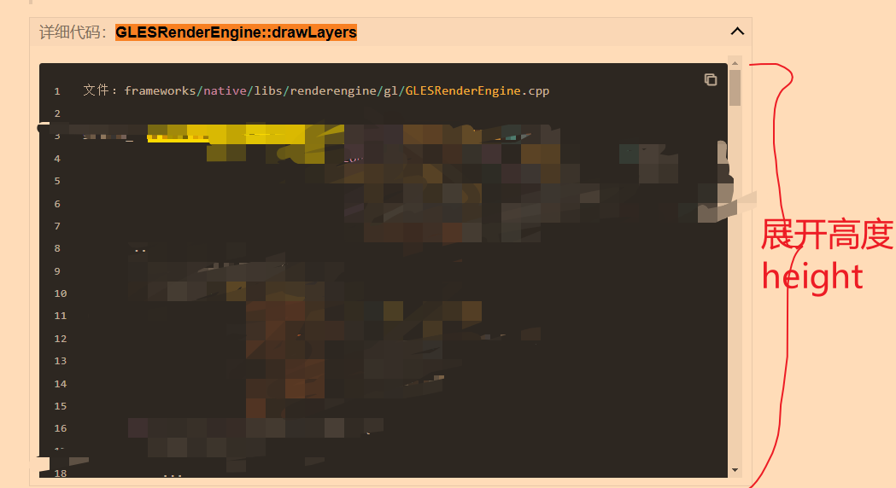
>
>   
>
>   ```java
>   // gitbook\gitbook-plugin-accordion\accordion.css
>   
>   .accordion {
>   	max-height: 500px;  // 这里改大为850
>   	margin-bottom: 5px;
>   	border: 1px solid #e8e8e8;
>   	overflow: hidden;
>   	transition: max-height 250ms ease-out;
>   }
>   ..........
>   
>   .accordionContent {
>   	margin: 10px;
>   	min-height: 10px;
>   	max-height: 450px;    // 这里改大为750
>   	overflow: auto;
>   }
>   ```


#### 代码颜色高亮

效果：

> 

配置：

> 参考：https://jiangminggithub.github.io/gitbook/chapter-plugins/22-prism.html
>
> ```java
>   "plugins": [
> 	"prism",
> 	"-highlight"
>   ],
>   
>     "pluginsConfig": {
> 
> 		"prism": {
>             "css": [
>                 "prismjs/themes/prism-tomorrow.css"
>             ],
>             "lang": {
>                 "flow": "typescript"
>             },
>             "ignore": [
>                 "mermaid",
>                 "eval-js"
>             ]
>   }
>   
> ```


~~注意报错：~~

> > 
>
> 原因： 有些块，填写的shell，找不到shell的加载器（即上面的  **Failed to load prism syntax: shell**    ）
>
> ------------> 统一改成  **java或 powershell**
>
> 定位： 
>
> ```java
> console.log(`chen_,highlightCode.js, highlightCode() ${source.substring(0, 20)}!`);
> ```


~~主题有：~~

> [prism代码高亮主题风格展示阁-腾讯云开发者社区-腾讯云 (tencent.com)](https://cloud.tencent.com/developer/article/1622399)
>
> ```powershell
> "prismjs/themes/prism-solarizedlight.css"
> "prismjs/themes/prism-tomorrow.css"
> "prismjs/themes/prism-a11y-dark.css"
> ```


#### 快速转化为pdf


得到的PDF，格式非常好：

> 

但是要求：每个目录，必须是一个md文件  ------>  Typora 要求

### 魔改插件

#### 改gitbook-plugin-page-treeview

目标：

> 让当前页面的目录显示在最右侧：
>
> 

~~修改：~~

> E:\working\laji\markdownsFile\node_modules\gitbook-plugin-page-treeview\assets\style.css
>
> ```java
> .treeview__container {
>     /* position: relative;   changed by cg */
>     margin-bottom: 80px;
>     padding-bottom: 20px;
> 
>     /* add by cg start*/
>     position: fixed;
>     text-align: left;
>     z-index: 0;  /* add by cg： 999是最高Z轴配置*/
>     left: 1400px;  /* cg注释： 1vh = 1% 这里没有用 vh作为单位，因为手机上屏幕太小，希望手机上不显示*/
>        top: 30px;
>        height:70vh;  /* 1vh = 1% viewport height  https://blog.csdn.net/ghvjhfjf/article/details/122369878 */
>     width:55vh;  /*  */
>     overflow-x: auto;
>        overflow-y: auto;
>     font-size: 13px;
>     /* add by cg end*/
> }
> ```


目标：

> 删掉copyright图标
>
> 

~~修改：~~

> E:\working\laji\markdownsFile\node_modules\gitbook-plugin-page-treeview\lib\index.js
>
> ```js
>    /**changed by cg */
>    /**return renderContent ? `<div class="treeview__container">${copyRight + renderContent}</div>` : ''; */
> 	return renderContent ? `<div class="treeview__container">${renderContent}</div>` : '';
> };
> ```


注意：

> 修改前，先备份：
>
> 


### 调试技巧：

直接查看本地的编译结果（而不是github远端的：~~远端合入，进行再一次编译，需要时间比较久~~）

> 比如： 
>
> https://kenttj.github.io/-book/coding/Andriod/AMS_.html


### md、html 生成ok标准：

md、html、md-->  html  验证标准

html中搜索png，没有png、img出现  ---》所有的png图片都已经融入html中了


gitbook的 bug：不能以为行首

> ```cpp
> <font color='red'>   
> ```
>
> 否则，会造成，后面的所有格式失效（包括图片）
>
> 例子： 
>
> ​                          md的source code模式：
>
> 
>
> ​                       html：
>
> 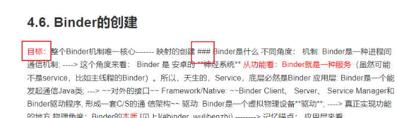
>
> 方法： 打破以 ...为首
>
> 比如：目到前面
>
> 比如： 加粗
>
> 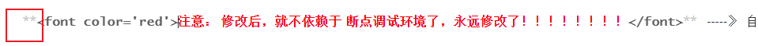
>
> 比如：加任意字符
>
> ```
> -<font color='red'>
> ```
>
> 


体会：

> md看问题，一定要在source code模式下看，因为更本质


### 优化之book sm

自动生成Summary.md文件


https://www.jianshu.com/p/4471c20fbafe  Gitbook使用教程

```cpp
- Summary插件：`npm install -g gitbook-summary`
```


### 优化之  文件的总目录

md文件总目录：   ------->  <font color='red'>实现文件间的跳转</font>

> 自动生成的Summary.md文件  
>
> 

网页文件总目录： ------->  <font color='red'>网页文件间的跳转</font>

> 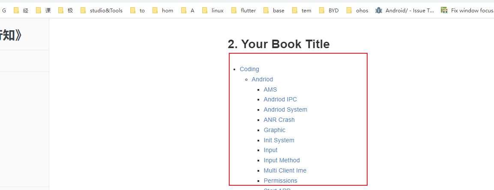
>
> 方法：
>
> >  网页的根，是根目录的README.md文件
> >
> > ​          ----------->  所以，SUMMARY.md再复制一份，变为   README.md


### 写好的配置文件


%accordion%  book.json %accordion%

```
{
  "root": "./markdownsFiles",
  "bookname": "笔记",

   "//": "单行注释",
   "//": ["这是多行注释：    anchor-navigation-ex 是",
                            "anchor-navigation-ex 是",
                            "click-reveal 本地使用ok，但是github在build pages时，不识别click-reveal",
                            "accordion 也是折叠代码段",
                            "anchor-navigation-ex 是"
         ],
  "plugins": [
    "anchor-navigation-ex",
    "toggle-chapters",
    "expandable-chapters-small",
    "splitter",
    "code",
    "page-treeview",
    "popup",
    "-search", 
    "-lunr",
    "sidebar-style",
    "auto-scroll-table",
    "click-reveal",
    "accordion",
    "pageview-count",
    "search-pro",
	"klipse"
  ],
  "title": "Kent的博客",
  "pluginsConfig": {
      "tbfed-pagefooter": {
          "copyright":"Copyright &copy ershouche-FE 2019",
          "modify_label": "文件修订时间：",
          "modify_format": "YYYY-MM-DD HH:mm:ss"
      },
      "disqus": {
        "shortName": "gitbookuse"
      },
      "lunr": {
            "maxIndexSize": 200000
      },
      "sidebar-style": {
            "title": "《知行，行知》",
            "author": "Kent"
      }
  }
}

```

%/accordion%


### 同时2本书（3本同理）

基于<font color='red'>化简大纲</font>的原则（按照功能拆分）：

>   1、**保证第一本书大纲不会过多** ----->  **大纲最重要（少、关键）**
>
>   2、<font color='red'>第二本书作为  资源</font>（**无所谓大纲**），<font color='red'>被引用</font>------>  次要，不重要
>
>   3、搜关键词时，书本级搜索
>
>   4、两书之间，**弱链接**  -------------> **书本2作为资源**

书本一：

>   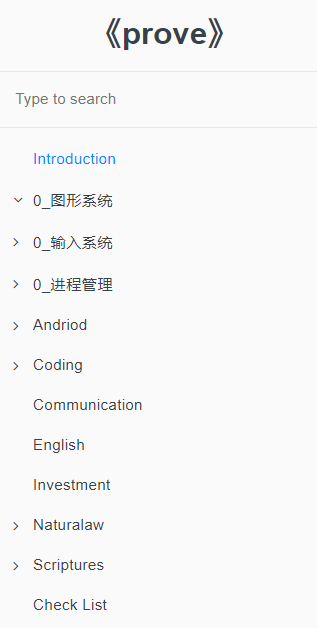


书本二（资源库）：

>   
>
>   **如何做到书本一不会 list 书本二呢？**办法：
>
>   放到资源 asset里：
>
>   >   


资源库3：

>   pdf类型 ---------------->   https://github.com/  任意仓库存储都ok

### 技巧：保存网页为md，并加入 书本二（作为资源）

目的：**持久化保存网页，**有些重要的网页，过几年就没有了

方法一（<font color='red'>优</font>，可以自己改动加注释）：

>   保存网页为md到 书本二里
>
>   

方法二：

>   保存为pdf，保存到 资源库3 来引用
>
>   **优点：**  https://github.com/  仓库存储 容量没有限制


## pdf电子书制作

### 教程：

1、纸质书籍---->  pdf电子书籍： 手机夸克  教程： https://www.bilibili.com/video/BV1d8411z7fR/?spm_id_from=333.337.search-card.all.click  

2、给电子书加书签：

参考： https://www.bilibili.com/video/BV1hX4y1V7Fi/?buvid=XYA50C4AE9D0FD435535889530C0CC38FFE8A&is_story_h5=false&mid=3rb72hWRTB8TwF8P3lhSvg%3D%3D&p=1&plat_id=114&share_from=ugc&share_medium=android&share_plat=android&share_session_id=bd6ffdc5-4350-4b23-b2d2-e761eb6897ee&share_source=WEIXIN&share_tag=s_i&timestamp=1694924796&unique_k=ZRxWlbM&up_id=234080369&vd_source=3eebd10b94a8a76eaf4b78bee8f23884

步骤：

（1）先生成目录标签的空文件

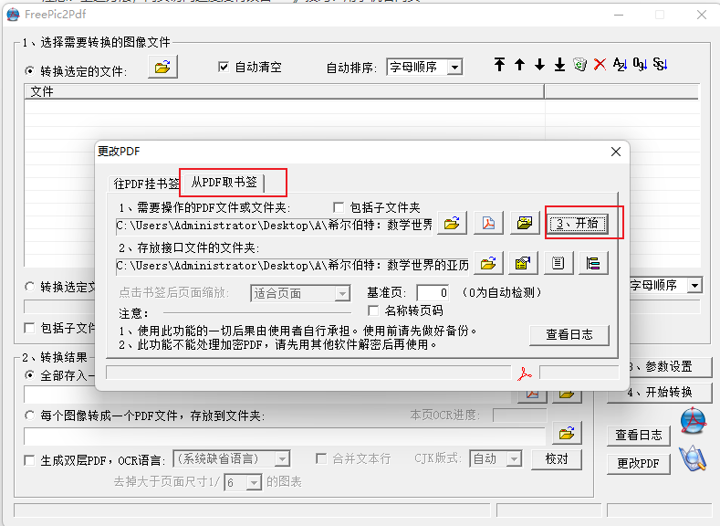

（2）编辑目录标签文件

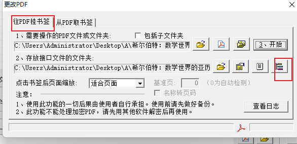


（3）上面编辑内容的来源：

A. 纸质书籍对应的出版社官网有

B. 京东上 卖书的链接有

C 网上搜

D  PDF本身的目录OCR

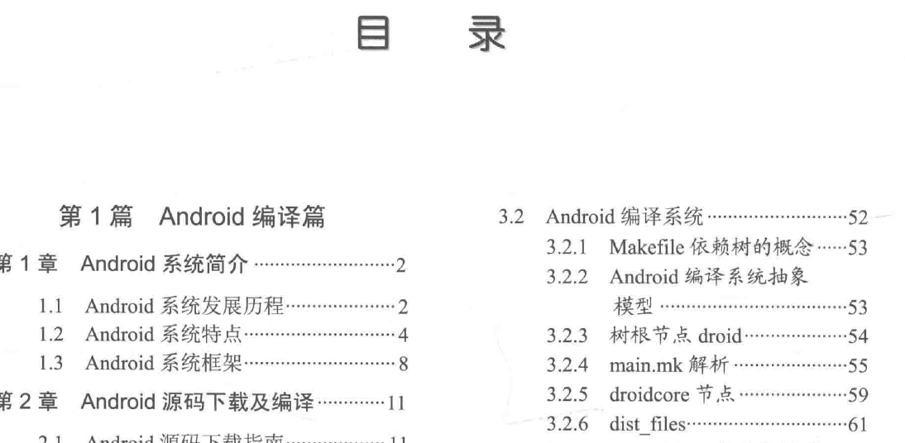


（4） pdf挂书签

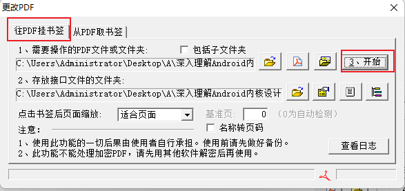

-<font color='red'>失败原因：pdf被打开了</font>


（5） 目录和前沿占据了前14页：整体后挪14页

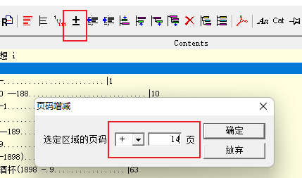

原则：

实际页号是2，修改  文本中为2  <font color='cornflowerblue'> 不用管右下角标注的页号</font>


### 最终结果展示：

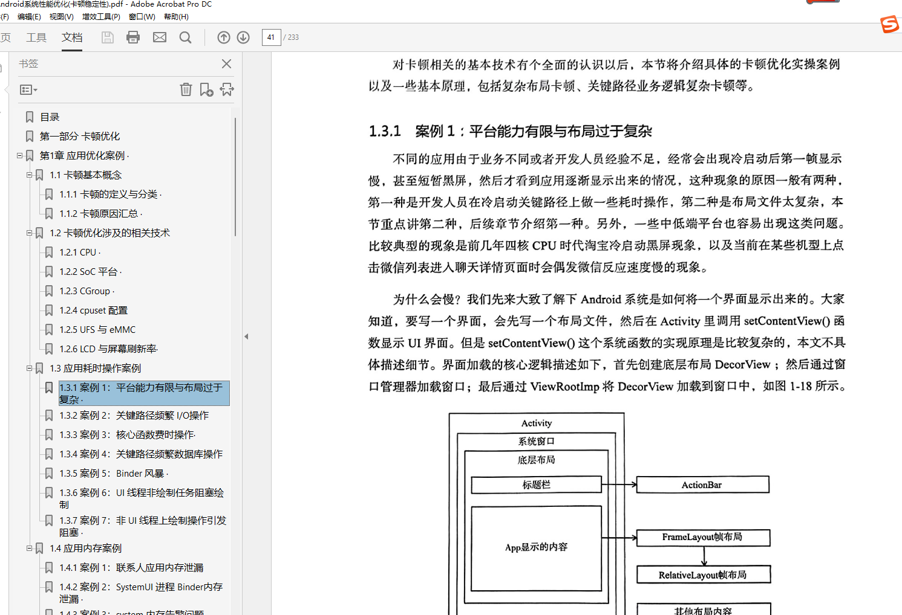

## EA

### 自动生成类图

#### 目的

(1)找出主要类（以及主要调用方向）  

(2)包之间依赖关系

 (3)初步判断信息流向


方法：
https://www.codenong.com/cs107101145/


### 以java文件的粒度，创建 导入一个class 模型

技巧：class模型 ---> 自动生成方法签名 ---> copy

以java文件的粒度,导入一个class 模型:  `很快速`


注意: 可以同时生成多个class模型-----》 ctrl+点击多个类模型


### ~~EA中边界框架的添加方法~~

见docker

 


### EA的缺点：

没有重点!!!!---》 1、所以，手动画，一定要突出重点   2、TODO: EA是否能改变呢？

## ~~Edraw~~

https://www.edrawmax.cn/support/ShapeOperation/ShapesOperation

### ~~1、`技巧`：edraw的**组合**~~

 -----> 可以用来定制自己的view组件 ----->`后面可以重复利用了`~~

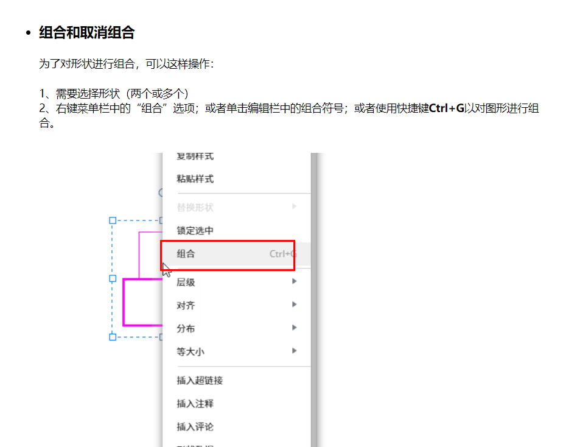


### ~~2、自定义view组件存储的地方：~~


### ~~3、技巧：选中主题，有外框和标注~~


### 对齐与大小同步


使用方法：

1、选择多个元素

2、Tab键选择标准

3、点击按钮

### 画图基本元素

选用下面这个。原因：文字框在实体框内部

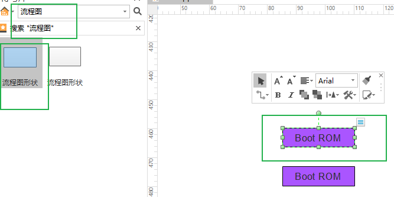

文字框在实体框外部：<font color='red'>错误，禁止使用</font>


总之，使用给定的元素，尽量不要自己造元素

### 链接线不允许手动画

自动向四个方向延展：

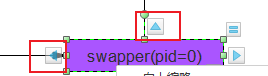

### 格式刷 刷链接线


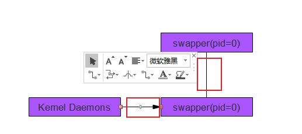

万不得已，不要自己组合元素 ----->  这样后期，格式化可以统一刷

### 文字如何统一修改格式？

框选多个元素

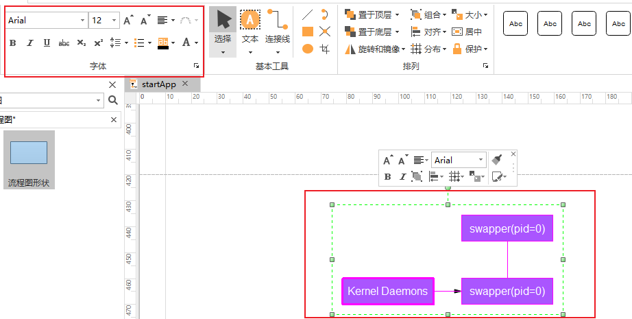

### 如何统一修改框的格式

方法一： 框选多个，统一修改

方法二：格式刷


### 亿图截图方法

不要直接截图，而是选中，复制+粘贴  ------》 <font color='red'>极优：高清</font>


## Andriod Code Search

------》下面一切都是围绕着搜索，一切为了搜索方法

https://cs.android.com/

1、查看某一笔提交的所有改动：场景：安卓所有改动点，Z侧这些点也要注意！！！！！

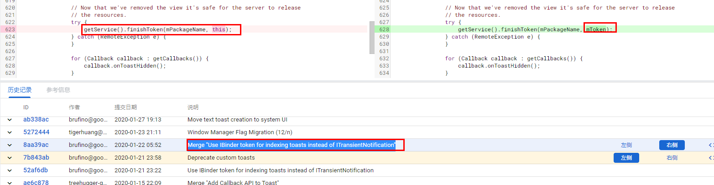


2、返回与前进：相当于AS的返回与前进！！！


3、文件的结构：
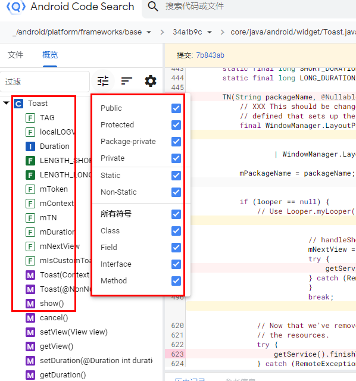

4、查看某一行的最新改动的提交

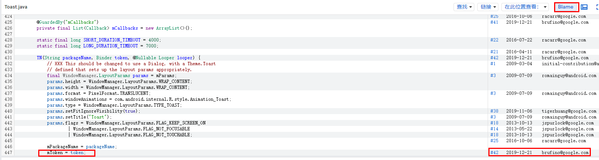

5、所有历史提交！！！！！


6、

## Everything

### ~~限定路径搜索~~

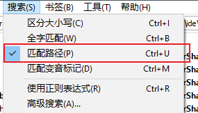


## Typora

### 中文乱码问题

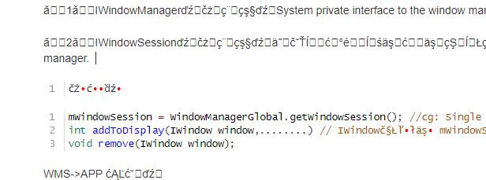

解决：

> 

### 快捷键

参考：https://www.jianshu.com/p/ca2d0420c9ea    Typora 快捷键 shortcut keys   

跳转，<font color='red'> md内部跳转</font>： ----> 不优

> 1、`Ctrl+K, 创建超链接：`          
>
> ```shell
> // 自动生成：
> [创建超链接](#id22)
> ```
>
> 1、超链接`被链接CTR + L` (与Ctrl+K搭配使用)       
>
> ```shell
> // 自动生成：
> <a id=''>被链接</a>
> ```
>
>  原理：
>
> 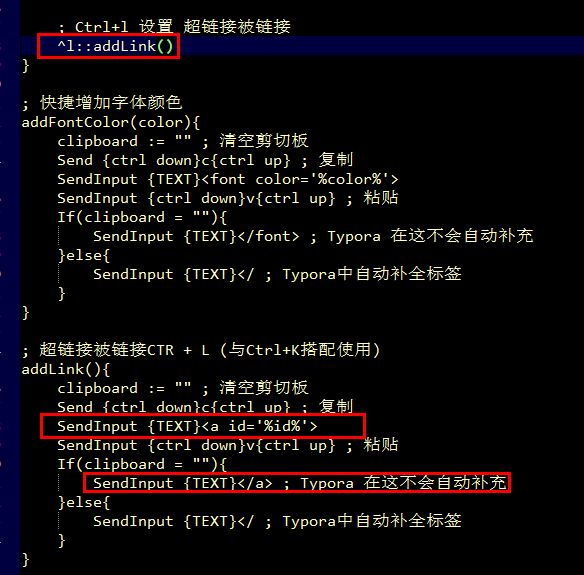
>
> 
>
> 

**md内部跳转  + md之间跳转，**<font color='red'>的 统一做法（极优）</font>：

> **直接填写对应的https 章节链接：**
>
> 
>
> 
>
> 

2、Ctrl+T, 创建表格

3、`Ctrl+shift + K, 创建代码框：`    

4、Ctrl + shift + Q ：引用quota

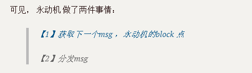

5、 Ctrl + Shift + V    ~~Paste As Plain Text   ---> 自然~~


5、自定义的热键  ---》 <font color='red'>TODO:</font> 提炼所有软件自定义热键的方法，以后可以在各个软件里自定义热键了！！！！！！！

对于Typora.exe有：

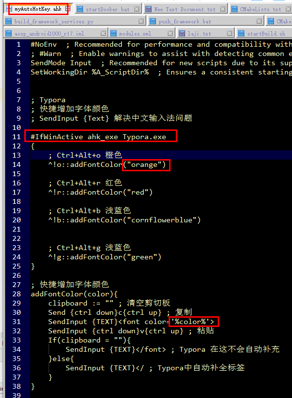

7、ctrl + alt + shift +h(hide)：隐藏


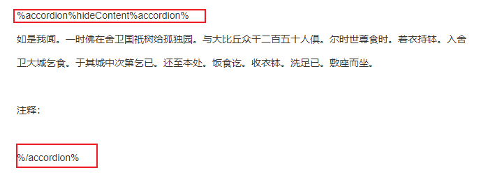


### 搜索   全局搜索

**所有md文件的 全局搜索**：

方法一： ~~Ctrl + Shift + F 自然~~


> ---------> bug无法一步到位：点开文件，再本文件里搜索
>
> 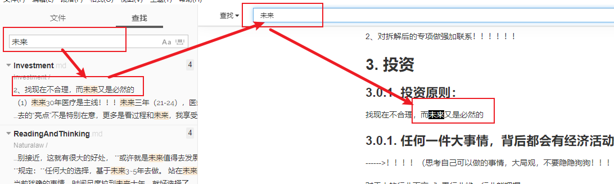
>
> ~~参考：https://blog.csdn.net/m0_49448331/article/details/124495229~~

方法二：

网页端搜索框，默认全局   --------->  找到对应的本地md

### 搜索文件 Ctrl + P

### Typora 设置标题自动编号


%accordion%  修改base.user.css： %accordion%


```cpp
#write {
    max-width: 1024px;
}

body {
    counter-reset: body;
}

/* 正文标题自动序号 */
h1 {
    counter-reset: h1;
}

h2 {
    counter-reset: h2;
}
h3 {
    counter-reset: h3;
}
h4 {
    counter-reset: h4;
}
h5 {
    counter-reset: h5;
}
h6 {
    counter-reset: h6;
}

h1:before {
    counter-increment: body;
    content: counter(body) " ";
}

h2:before {
    counter-increment: h1;
    content: counter(body) "." counter(h1) " ";
}

h3:before {
    counter-increment: h2;
    content: counter(body) "." counter(h1)"." counter(h2) " ";
}
h4:before {
    counter-increment: h3;
    content: counter(body) "." counter(h1)"." counter(h2)"." counter(h3) " ";
}
h5:before {
    counter-increment: h4;
    content: counter(body) "." counter(h1)"." counter(h2)"." counter(h3)"." counter(h4) " ";
}
h6:before {
    counter-increment: h5;
    content: counter(body) "." counter(h1)"." counter(h2)"." counter(h3)"." counter(h4)"." counter(h5) " ";
}

/* 侧边大纲自动编号 */
.sidebar-content {
    counter-reset: h1
}

.outline-h1 {
    counter-reset: h2
}

.outline-h2 {
    counter-reset: h3
}

.outline-h3 {
    counter-reset: h4
}

.outline-h4 {
    counter-reset: h5
}

.outline-h5 {
    counter-reset: h6
}

.outline-h1>.outline-item>.outline-label:before {
    counter-increment: h1;
    content: counter(h1) " "
}

.outline-h2>.outline-item>.outline-label:before {
    counter-increment: h2;
    content: counter(h1) "." counter(h2) " "
}

.outline-h3>.outline-item>.outline-label:before {
    counter-increment: h3;
    content: counter(h1) "." counter(h2) "." counter(h3) " "
}

.outline-h4>.outline-item>.outline-label:before {
    counter-increment: h4;
    content: counter(h1) "." counter(h2) "." counter(h3) "." counter(h4) " "
}

.outline-h5>.outline-item>.outline-label:before {
    counter-increment: h5;
    content: counter(h1) "." counter(h2) "." counter(h3) "." counter(h4) "." counter(h5) " "
}

.outline-h6>.outline-item>.outline-label:before {
    counter-increment: h6;
    content: counter(h1) "." counter(h2) "." counter(h3) "." counter(h4) "." counter(h5) "." counter(h6) " "
}

/* TOC 自动序号 */
.md-toc-inner {
    text-decoration: none;
}

.md-toc-content {
    counter-reset: h1toc
}

.md-toc-h1 {
    margin-left: 0;
    counter-reset: h2toc
}

.md-toc-h2 {
    margin-left: 1rem;
    counter-reset: h3toc
}

.md-toc-h3 {
    margin-left: 2rem;
    counter-reset: h4toc
}

.md-toc-h4 {
    margin-left: 3rem;
    counter-reset: h5toc
}

.md-toc-h5 {
    margin-left: 4rem;
    counter-reset: h6toc
}

.md-toc-h6 {
    margin-left: 5rem;
}

.md-toc-h1:before {
    counter-increment: h1toc;
    content: counter(h1toc) " "
}

.md-toc-h1 .md-toc-inner {
    margin-left: 0;
}

.md-toc-h2:before {
    counter-increment: h2toc;
    content: counter(h1toc) ". " counter(h2toc) " "
}

.md-toc-h2 .md-toc-inner {
    margin-left: 0;
}

.md-toc-h3:before {
    counter-increment: h3toc;
    content: counter(h1toc) ". " counter(h2toc) ". " counter(h3toc) " "
}

.md-toc-h3 .md-toc-inner {
    margin-left: 0;
}

.md-toc-h4:before {
    counter-increment: h4toc;
    content: counter(h1toc) ". " counter(h2toc) ". " counter(h3toc) ". " counter(h4toc) " "
}

.md-toc-h4 .md-toc-inner {
    margin-left: 0;
}

.md-toc-h5:before {
    counter-increment: h5toc;
    content: counter(h1toc) ". " counter(h2toc) ". " counter(h3toc) ". " counter(h4toc) ". " counter(h5toc) " "
}

.md-toc-h5 .md-toc-inner {
    margin-left: 0;
}

.md-toc-h6:before {
    counter-increment: h6toc;
    content: counter(h1toc) ". " counter(h2toc) ". " counter(h3toc) ". " counter(h4toc) ". " counter(h5toc) ". " counter(h6toc) " "
}

.md-toc-h6 .md-toc-inner {
    margin-left: 0;
}

/* 引用相关blockquote： ctrl + shift + Q */
blockquote,
q {
    quotes: none;
}
blockquote:before,
blockquote:after,
q:before,
q:after {
    content: '';
    content: none;
}

/* block spacing */
p,
blockquote,
.md-fences {
    margin-bottom: 1.5em;
}

/* blockquote */
/* font-style: italic */
blockquote {
    border-left: 4px solid #1fe36e;
    margin-left: 2em;
    padding-left: 1em;
}

blockquote {
    border-color: #bababa;
    color: #656565;
}

blockquote ul,
blockquote ol {
    margin-left:0;
}

/* 相关： ctrl + shift + `  */
code {
    background-color: #f3f4f4;
    padding: 0 2px 0 2px;
}


/*==选中背景高亮==*/
mark {
    background: #ffffff;
    color: #db3f1e;
    font-weight: bold;
    border-bottom: 0px solid #ffffff;
    padding: 0.0px;
    margin: 0 0px;
}


/* 表格样式：tr（即table row）th（即table header）是表格里的第一行的元素，td是表格里的除了第一行之外的其他元素*/

table tr:nth-child(2n),
thead {
    background-color: #f8f8f8;
}
table tr th{
    font-weight: bold;
    border: 1px solid #db3f1e;
    border-bottom: 0;
    margin: 0;
    padding: 6px 13px;
}

table tr td {
    font-weight: bold;
    border: 1px solid #dfe2e5;
    margin: 0;
    padding: 6px 13px;
}


```

 

%/accordion%


[参考](https://blog.csdn.net/weixin_53592372/article/details/136836628)

## ~~del_默认打开根目录~~

优：不用每次都找到路径，然后打开


### 	Typora目录折叠设置

效果：

> 

设置：

> 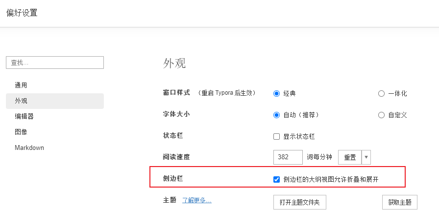


### 官网 & 教程

https://support.typora.io/   官网 & 教程

## 所有软件自定义热键的方法--- AutoHotkey

 AutoHotkey软件

-----> 极优：

- 可以根据当前窗口，定义快捷键。。。。<font color='red'>即， 可以定义软件级别的快捷键</font>
- 也可以系统级别


> ### 和Typora结合：

>  **https://blog.csdn.net/Timi_Toro/article/details/119824280**


### 写脚本

- 有时候，发现快捷键不生效：


> - 先界定是快捷键问题还是函数内容问题：先改成熟悉的快捷键
> 
> - 是快捷键问题，冲突  ------> 规定：自己定义的快捷键，一般 ctrl + alt + shift + .......,比较难重复

- 软件级：

```
IfWinActive ahk_exe Typora.exe
```

- 按道理，只要是重复的操作，都能被AutoHotkey实现

- TODO: 跳转那些

  
#### 基础语法

  %是关键符号，如果要输入%，要加转义符号，比如：

```java
SendInput {TEXT}`%/accordion`%
```


### 文档

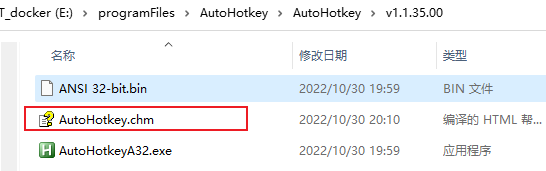

### 目前OK的脚本

%accordion%脚本%accordion%


myAutoHotKey.ahk:


```java

#NoEnv  ; Recommended for performance and compatibility with future AutoHotkey releases.
; #Warn  ; Enable warnings to assist with detecting common errors.
SendMode Input  ; Recommended for new scripts due to its superior speed and reliability.
SetWorkingDir %A_ScriptDir%  ; Ensures a consistent starting directory.


; 使用版本AutoHotkey v1.1.35.00
;教程： E:\programFiles\AutoHotkey\AutoHotkey\v1.1.35.00\AutoHotkey.chm


; -------------------------------为Typora定义的快捷键，应用级----------------
IfWinActive ahk_exe Typora.exe
{
    ; Ctrl+Alt+o 橙色
    ^!o::addFontColor("orange")

    ; Ctrl+Alt+r 红色
    ^!r::addFontColor("red")

    ; Ctrl+Alt+b 浅蓝色
    ^!b::addFontColor("cornflowerblue")
	
	
	; Ctrl+Alt+g 浅蓝色
    ^!g::addFontColor("green")
	
	
	; Ctrl+l 设置 超链接被链接
    ^l::addLink()
	
	;Ctrl+Alt+shift+h 隐藏标识
    ^!+h::hide()

}


; 定义函数： 快捷增加字体颜色
addFontColor(color){
    clipboard := "" ; 清空剪切板
    Send {ctrl down}c{ctrl up} ; 复制
    SendInput {TEXT}<font color='%color%'>
    SendInput {ctrl down}v{ctrl up} ; 粘贴
    If(clipboard = ""){
        SendInput {TEXT}</font> ; Typora 在这不会自动补充
    }else{
        SendInput {TEXT}</ ; Typora中自动补全标签
    }
}

; 定义函数： 超链接被链接CTR + L (与Ctrl+K搭配使用)
addLink(){
    clipboard := "" ; 清空剪切板
    Send {ctrl down}c{ctrl up} ; 复制
    SendInput {TEXT}<a id='%id%'>
    SendInput {ctrl down}v{ctrl up} ; 粘贴
    If(clipboard = ""){
        SendInput {TEXT}</a> ; Typora 在这不会自动补充
    }else{
        SendInput {TEXT}</ ; Typora中自动补全标签
    }
}

; 定义函数： (与Ctrl+Alt+shift+h 隐藏标识搭配使用)
hide(){
    clipboard := "" ; 清空剪切板
    Send {ctrl down}c{ctrl up} ; 复制
	
    SendInput {TEXT}`%accordion`%hideContent`%accordion`%
	SendInput {Enter} ;换行
	
	SendInput {ctrl down}v{ctrl up} ; 粘贴
	SendInput {Enter} ;换行
	
    SendInput {TEXT}`%/accordion`%
}


; -------------------------------为系统定义的快捷键，系统级别----------------


```


%/accordion%


## 屏幕亮度/对比度 软件调节

Monitorian

> https://blog.csdn.net/acecandy/article/details/126058229
>


## FreeFileSync

同步两个文件夹的文件：

> 1、 最新的同步给旧的
>
> 2、第一次： 如果一边空目录，则相当于镜像copy

--------> 非常适合本地代码  同步给  服务器场景   （同时服务代码第一次也会copy给本地代码）

使用：

> 1. 界面化：见
> 2. 命令行:
>
> 
>
> 需维护映射：
>
> 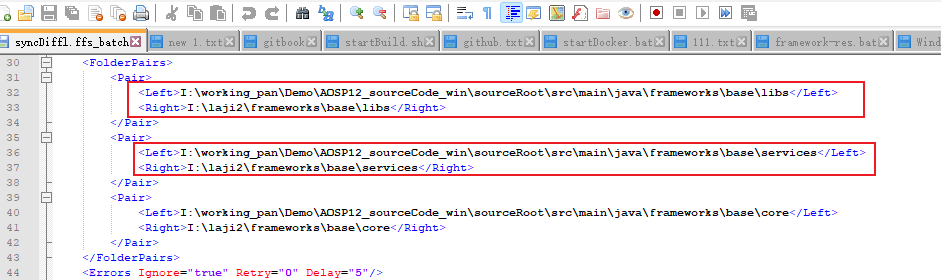


## 屏幕分区软件MaxTo


见： I:\working_pan\softWare\MaxToSetup151110

使用：

>  https://maxto.net/zh-hans#pricing
>
>  
>
>  
>
>  

优点：

> 1、自定义分区大小
>
> 


## 反编译工具

jadx-1.4.7

优点：1、界面化操作。拖动即解析

​           2、完美的把.apk向下解析了 ----> source code


## scrcpy.exe

命令行方式打开：

```java
scrcpy.exe --display=4 --always-on-top --stay-awake
```

`阻止scrcpy.一段时间后休眠：`

```java
--stay-awake
```

模拟双指缩放：

```java
Ctrl+按住并移动鼠标
```


| 向左旋转屏幕  | MOD+← *(左箭头)*    |
| ------------- | ------------------- |
| 向右旋转屏幕  | MOD+→ *(右箭头)*    |
| 拖放 APK 文件 | 从电脑安装 APK 文件 |

MOD是ALT键。详见： https://www.ngui.cc/zz/2053439.html?action=onClick


详细命令行参数见：

1、scrcpy.exe  --help

2、https://www.ngui.cc/zz/2053439.html?action=onClick

3、本是github开源项目。


## vs code

### 快捷键

```
Ctrl + P                            打开指定文件

Ctrl + G                             跳转指定行

Ctrl+T                               跳转符号表

F8                                    高亮
```


向前、后:  alt+左右


~~当前页面查找：Ctrl + F~~


技巧:

> 工作区——》查找符号引用会减少
>
> 隐藏文件夹
>
> 符号调用栈
>
> 查找函数调用


### vs code优秀的点

#### 多个符号高亮的插件

MultiHighlight

注意：可以修改keyMap （keyMap中搜索 MultiHighlight）


AS 有同样的MultiHighlight


#### 可以显示代码调用栈显示

AS 有同样的Hierarchy


## ~~del_键盘按键坏了----- 按键替换~~


原理： 更改注册表（需要管理员权限）

工具： 键盘改键工具(Remapkey) 0.9.9.6 中文绿色免费版

例子：左键坏了


## ~~del----word软件---del~~

### ~~del_目录~~

1、基于标题：刷各个标题 -----> 形成大纲 


2、大纲 ----> 目录：

引用----自定义目录-----显示级别----选项、字体

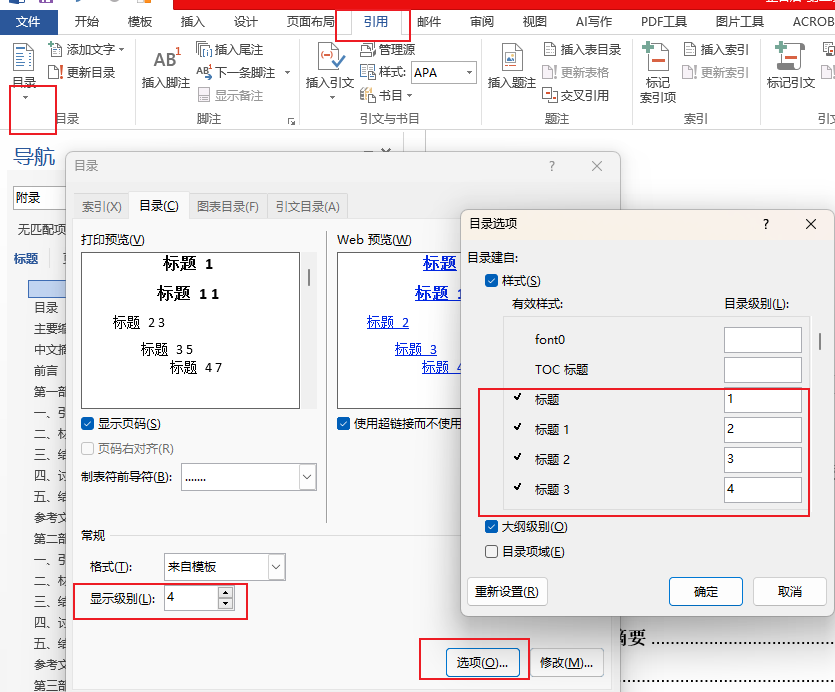

### ~~del_页眉~~

 连续两页的页眉不会关联的基础：

（1）**分节**：------->  **目的：章节内关联，章节之间独立修改**

> 操作：
>
> 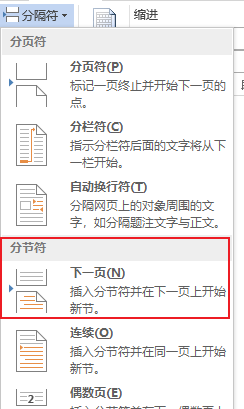
>
> 效果：
>
> 

（2）取消 链接到前一条页眉

> 


### ~~del_页脚~~


连续两页的页脚 页码不会关联的基础：

（1）~~**分节**，同页眉~~

（2）  <del>取消 链接到前一条页眉</del>  

（3）页码 续前节 还是 .........

> 


## Copilot

几个关键点：

（1）win11  23H2 ，~~win11  22H2不行~~

https://zhuanlan.zhihu.com/p/659297001   win11  22H2升级到23H2？

（2）翻墙软件

（3）（**不确定**）登录Microsoft 账号。local账号不行


教程：https://www.jb51.net/os/win11/913483_all.html  

-------------->注：其中修改注册表操作没有做，是OK的


## ~~del_ipad 快捷键~~

总入口：

> 辅助功能  ----->  全键盘控制 -----> 命令
>
> 可以自定义

其他：

> 截屏  ----->  Command-Shift-3
>
> 锁屏  -------->  cmd + L  (需自定义)
>
> 关闭chrome标签页  -------->  cmd + w
>
> 快捷指令


## 桌面环境KDE

KDE安装

> https://zhuanlan.zhihu.com/p/338666316?utm_id=0   Ubunu安装KDE桌面


## KDE 防止长时间锁屏

防止锁屏：

> 方法一： 似乎不生效
>
> ```
>  setterm blank 0
>  setterm powerdown 0
>  xset s 0 0
> ```
>
> 方法二： 
>
> > Energy Saving  -------》 验证OK

# 计算机其他问题及设置

## 软件最优的使用方式----免安装

有很多<font color='red'>优点</font>：

1、一次破解，终生使用

2、一台机器安装，所有机器都可以使用

3、规避安装需要管理员权限（不需要安装）

4、越过安装复杂的流程

5、可以放在任意盘里，即使U盘

---------------------> 平时记得把大型复杂的软件都保存成免安装软件


## 删除文件/文件夹，有进程正在占用

比如：

> 删除H:\docker_install\DockerDesktop\DockerDesktop.vhdx
>
> 出现报错：文件被占用
>


`方法：`

> 在Handles中搜索 DockerDesktop.vhdx （**很有可能搜不到，因为handle的是上一层文件夹、上上一层文件夹**）
>
> 如果不行，搜索上一级  DockerDesktop
>
> 
>
> 
>
> 


## 蓝牙设备添加

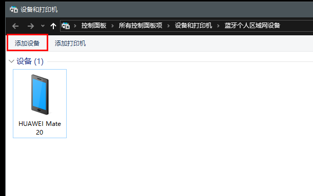


## 磁盘修复及优化

1、修复：

参照： https://www.reneelab.com.cn/m/external-hard-drive-repair-software.html

```shell
// cmd， x盘符
chkdsk X: /r /f
```

2、优化：


## 装最纯净的win10系统

https://zhuanlan.zhihu.com/p/219902401?utm_source=wechat_session

为什么要用最纯净的win?

1、稳定，驱动没有被其他软件更新过，不容易蓝屏

2、很干净，cpu使用率极低：

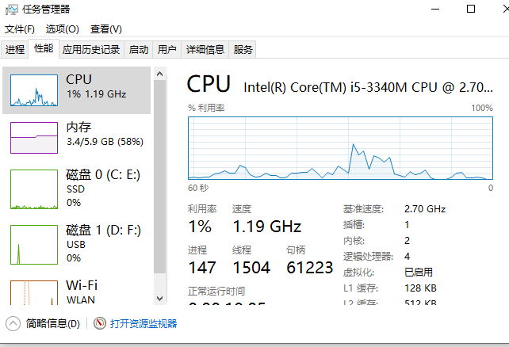


## 常见最优设置

###  剪切板，多个历史 复制值

优： 剪切板，多个历史 复制值  选择粘贴：


### 双屏，次屏幕隐藏任务栏

空间更大


## 垃圾

目前没有完成的磁盘：

H盘


## 蓝屏问题

1、用纯净的系统，不要更新驱动  

2、磁盘修复

3、超频有可能造成蓝屏

4、硬件问题


## win磁盘空间不够

### 查找磁盘大文件

各种软件会告诉你的c盘容量被什么吃掉了

---------------> 虽然一键瘦身 要会员。。。<font color='red'>但是指明了 磁盘没空间的原因，一个个解就好</font>


### 金山毒霸的清理磁盘垃圾------> **很有效**


### 更改虚拟内存为E盘

释放c盘空间

https://www.rstk.cn/news/730355.html?action=onClick


## 电脑wifi经常掉

wifi的驱动，禁止关闭


## 网络较慢

1、360安全卫士解决一下

2、使用外置的无线网卡。记得控制面板里选择

3、使用 ipv4，关闭ipv6


## 关于HDMI连接 无响应

很可能是HDMI驱动出了问题

不一定是硬件问题


## 网页视频音量太小

Volume Booster


## 远程桌面

### 远程电脑  访问  本地电脑磁盘的方法

#### 方法一：将本地的 磁盘driver 挂到远程电脑上

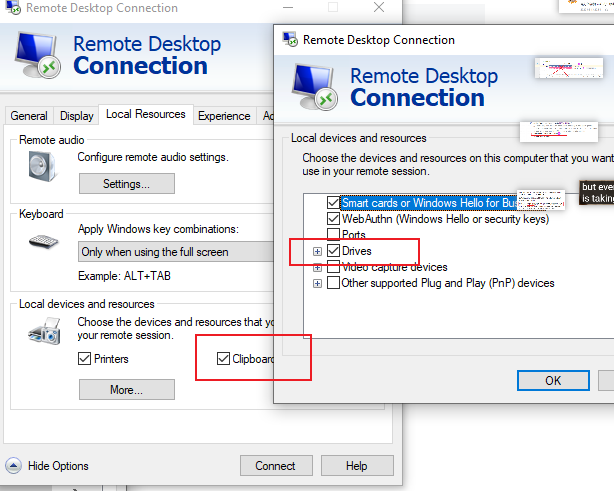

效果：H盘挂过来


注意：

可以直挂部分磁盘


#### 方法二：  共享文件夹


## 技巧：手机与电脑连局域网---尽量用电脑分享

~~避免拿手机，造成频繁断链~~

教程：https://jingyan.baidu.com/article/f71d6037a838145bb741d14a.html


# 格式

%accordion%折叠%accordion%

> 网站上显示能折叠图片
>
> 


%/accordion%


其他折叠：

<details><summary>点击显示答案</summary><p>
折叠图片不是太方便。。。。适合折叠文字
 
</p></details>


<details>
<summary>Want to ruin the surprise?</summary>
Well, you asked for it!
</details>


