# 目录


# source insight

## 优缺点：

优点：

> 1、**极优：**可以source 两个完全不同路径下的代码  （自然，可以取整个aosp多个小部分代码）。AS的source code 必须在工程目录下！！！
>
> 2、内存使用是AS的二十分之一    **<font color='red'>极优</font>**
>
> 
>
> 3、~~导入整个framework代码，才占100M~~    ---------->  **太优秀了**
>
> 所以，一下子，可以导入整个framework（**只是可能搜索的范围大了一些**）
>
> > 
>
> 
>
> 3、可以同时java和cpp同时跳转！     **极优**
>
> 4、不需要像AS与clion，需要事先搭建一个可以编译环境，然后copy代码
>
> 5、对于远程服务器代码，不需要copy！！！！（由第一点决定！！！）   **极优**
>
> 6、看代码大杀器-----java、cpp、c同时OK
>
> 7、在看代码的过程中，可以随时添加source 文件，以及remove 部分文件（比如test目录）-----> 优秀

​      

缺点：

> 断点调试不行？------>  办法：与AS结合使用！
>


## 新建项目

参考：https://blog.csdn.net/zyhse/article/details/122966714


注意：

> 这里是服务器目录（代码目录），**可以与工程目录，不是同一个**，非常优


### 随时按需添加/移除

--------------> 过程中，**随时添加**：

> 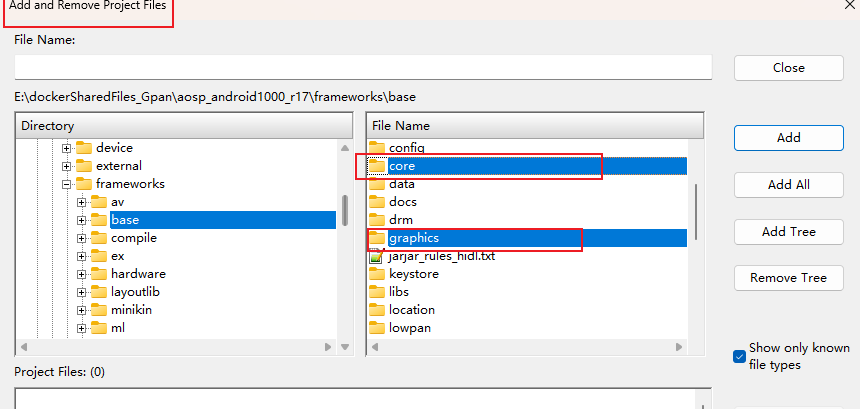

移除：

> 

### add文件之后一定要sync，才能跳转

重点：

1、需要sync(否则，两个文件之间无法跳转)

> 

2、第一次解析所有文件，否则有些不能跳转：

> 


## 优点之 增量添加文件--------增量解析

缩短解析时间：

> 增量添加文件后，只需要对adding fies进行解析即可，快！！！
>
> 


## cpp文件大部分函数无法跳转（部分宏无法识别导致的）

现象：部分函数和类 <font color='green'> 是黑色的，</font>无法跳转（但是存在这个类以及函数）

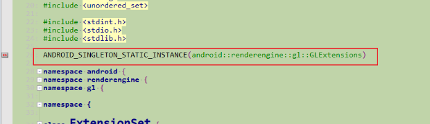


-<font color='red'>根因：SI不识别部分宏，误认为是函数</font> ------------->  导致整个文件无法解析，<font color='red'>大量黑色</font>！！！

比如：上面的ANDROID_SINGLETON_STATIC_INSTANCE


~~方法一（不好）~~：

>   
>
>   <font color='red'>缺点：</font> 1、修改后，该文件可以跳转，但会造成其他文件不可跳转
>
>   ​            2、不是正规做法：cpp依赖namespace
>
>   参考：[source insight解决对namespace不友好的办法](https://blog.csdn.net/peng314899581/article/details/84260306?utm_medium=distribute.pc_relevant.none-task-blog-2~default~baidujs_baidulandingword~default-0-84260306-blog-78630333.235^v43^pc_blog_bottom_relevance_base7&spm=1001.2101.3001.4242.1&utm_relevant_index=3)


方法二：

>   根因是不能识别宏，**告诉SI这不是宏------------>注释掉有问题的宏**
>
>   
>
>   **小缺点：**必须修改源码   --------->  当SI打开的是 正在编译的源码，就编译不过
>
>   ​              则：需要copy一份代码修改


方法三(<font color='red'>极优</font>)：

>   根因是不能识别宏，**告诉SI这是宏------------>C.tom 文件中说明**
>
>   ```java
>   // C:\Users\Administrator\Documents\Source Insight 4.0\C.tom
>   ; Misc下新增 ANDROID_SINGLETON_STATIC_INSTANCE
>   ```
>
>   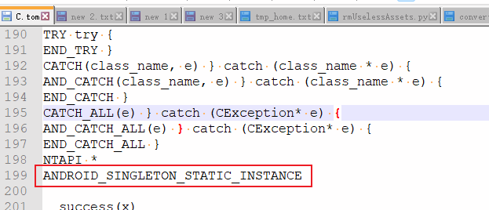


%accordion%具体C.tom展开%accordion%

```java
; C Token Macros
; These macros are expanded by Source Insight prior to parsing C and C++ files.

; AtlCom Property Map
BEGIN_PROPERTY_MAP(theClass)
BEGIN_PROP_MAP(theClass)
PROP_ENTRY(szDesc, dispid, clsid)
PROP_ENTRY_EX(szDesc, dispid, clsid, iidDispatch)
PROP_PAGE(clsid)
PROP_DATA_ENTRY(szDesc, member, vt)
END_PROPERTY_MAP()
END_PROP_MAP()


; COM Map
BEGIN_COM_MAP(x)
DECLARE_GET_CONTROLLING_UNKNOWN()
_ATL_IIDOF(x)
COM_INTERFACE_ENTRY_BREAK(x)
COM_INTERFACE_ENTRY_NOINTERFACE(x)
COM_INTERFACE_ENTRY(x)
COM_INTERFACE_ENTRY_IID(iid, x)
COM_INTERFACE_ENTRY_IMPL(x)
COM_INTERFACE_ENTRY_IMPL_IID(iid, x)
COM_INTERFACE_ENTRY2(x, x2)
COM_INTERFACE_ENTRY2_IID(iid, x, x2)
COM_INTERFACE_ENTRY_FUNC(iid, dw, func)
COM_INTERFACE_ENTRY_FUNC_BLIND(dw, func)
COM_INTERFACE_ENTRY_TEAR_OFF(iid, x)
COM_INTERFACE_ENTRY_CACHED_TEAR_OFF(iid, x, punk)
COM_INTERFACE_ENTRY_AGGREGATE(iid, punk)
COM_INTERFACE_ENTRY_AGGREGATE_BLIND(punk)
COM_INTERFACE_ENTRY_AUTOAGGREGATE(iid, punk, clsid)
COM_INTERFACE_ENTRY_AUTOAGGREGATE_BLIND(punk, clsid)
COM_INTERFACE_ENTRY_CHAIN(classname)
END_COM_MAP()


BEGIN_CATEGORY_MAP(x)
IMPLEMENTED_CATEGORY( catid )
REQUIRED_CATEGORY( catid )
END_CATEGORY_MAP()
BEGIN_OBJECT_MAP(x)
END_OBJECT_MAP()

OBJECT_ENTRY(clsid, class)
OBJECT_ENTRY_NON_CREATEABLE(class)

DECLARE_CLASSFACTORY_SINGLETON(obj)
DECLARE_OBJECT_DESCRIPTION(x)
DECLARE_NO_REGISTRY()
DECLARE_REGISTRY(class, pid, vpid, nid, flags)
DECLARE_REGISTRY_RESOURCE(x)
DECLARE_REGISTRY_RESOURCEID(x)
DECLARE_STATIC_REGISTRY_RESOURCE(x)
DECLARE_STATIC_REGISTRY_RESOURCEID(x)


BEGIN_SERVICE_MAP(x)
SERVICE_ENTRY(x)
SERVICE_ENTRY_CHAIN(x)
END_SERVICE_MAP()

BEGIN_SINK_MAP(_class)
SINK_ENTRY_INFO(id, iid, dispid, fn, info)
SINK_ENTRY_EX(id, iid, dispid, fn)
SINK_ENTRY(id, dispid, fn)
END_SINK_MAP()

; GNU Stuff
__attribute__(x)


; Misc
__declspec(name)
__RPC_FAR
CALLBACK
EXPORT
FAR
far
FASTCALL __fastcall	
NEAR
PASCAL
SIZE_T_MAX  UINT_MAX
UNALIGNED
ATL_NO_VTABLE 
AFX_API_EXPORT
AFX_API_IMPORT
AFX_CDECL __cdecl
AFX_CLASS_EXPORT 
AFX_CLASS_IMPORT 
AFX_COMDAT 
AFX_CORE_DATA
AFX_CORE_DATADEF
AFX_DATA
AFX_DATA_EXPORT 
AFX_DATA_IMPORT 
AFX_DATADEF
AFX_DB_DATA
AFX_DB_DATADEF
AFX_EXPORT EXPORT
AFX_EXT_API
AFX_EXT_CLASS
AFX_EXT_DATA
AFX_EXT_DATADEF
AFX_NET_DATA
AFX_NET_DATADEF
AFX_NOVTABLE
AFX_OLE_DATA
AFX_OLE_DATADEF
AFX_STATIC extern
AFX_STATIC_DATA extern 
AFXAPI __stdcall
AFXOLEAPI __stdcall
BASED_CODE
BASED_DEBUG
BASED_STACK
BEGIN_DUAL_INTERFACE_PART(localClass, baseClass) class X##localClass : public baseClass { public: BEGIN_COM_MAP(X##localClass, localClass) COM_INTERFACE_ENTRY (baseClass) END_COM_MAP()
BEGIN_INTERFACE_PART(localClass, baseClass) class X##localClass : public baseClass 	{ public: BEGIN_COM_MAP(X##localClass, localClass) COM_INTERFACE_ENTRY (baseClass) END_COM_MAP() public: virtual ULONG STDMETHODCALLTYPE AddRef(); virtual ULONG STDMETHODCALLTYPE Release(); virtual HRESULT STDMETHODCALLTYPE QueryInterface(REFIID iid, void * * ppvObj);
BEGIN_CONNECTION_PART(theClass, localClass) class X##localClass : public CConnectionPoint { public: X##localClass() { m_nOffset = offsetof(theClass, m_x##localClass); }
CDECL __cdecl
CONNECTION_IID(iid) REFIID GetIID() { return iid; }
DECLARE_AGGREGATABLE(x)
DECLARE_CLASSFACTORY_EX(cf)
DECLARE_CLASSFACTORY()
DECLARE_CLASSFACTORY2(lic)
DECLARE_CLASSFACTORY_AUTO_THREAD()
DECLARE_CONNECTION_MAP()
DECLARE_DISPATCH_MAP()
DECLARE_DUAL_ERRORINFO()
DECLARE_DYNAMIC(class_name)
DECLARE_DYNCREATE(class_name)
DECLARE_EMPTY_MSG_MAP()
DECLARE_EVENT_MAP()
DECLARE_EVENTSINK_MAP()
DECLARE_HANDLE(x)	typedef HANDLE x
DECLARE_HANDLE32(x)
DECLARE_INTERFACE(iface)    interface iface
DECLARE_INTERFACE_(iface, baseiface)    interface iface : public baseiface
DECLARE_INTERFACE_MAP()
DECLARE_MAPI_INTERFACE_(iface, baseiface)	interface iface : public baseiface
DECLARE_MAPI_INTERFACE_PTR(iface, piface)  typedef interface iface iface, FAR * piface
DECLARE_MESSAGE_MAP()
DECLARE_NOT_AGGREGATABLE(x)
DECLARE_OLECMD_MAP()
DECLARE_OLECREATE(class_name)
DECLARE_OLECREATE_EX(class_name)
DECLARE_OLECTLTYPE(class_name)
DECLARE_OLETYPELIB(class_name)
DECLARE_ONLY_AGGREGATABLE(x)
DECLARE_OPAQUE32(x)
DECLARE_PARSE_MAP()
DECLARE_POLY_AGGREGATABLE(x)
DECLARE_PROPERTY_SUPPORT(class)
DECLARE_PROPPAGEIDS(class_name)
DECLARE_PROTECT_FINAL_CONSTRUCT()
DECLARE_REGISTRY(class, pid, vpid, nid, flags)
DECLARE_REGISTRY_RESOURCE(x)
DECLARE_SERIAL(class_name)
DECLARE_WND_CLASS(WndClassName)
DECLARE_WND_SUPERCLASS(WndClassName, OrigWndClassName)
DELEGATE_DUAL_INTERFACE(objectClass, dualClass)
END_CONNECTION_PART(localClass) } m_x##localClass; friend class X##localClass;
END_DUAL_INTERFACE_PART(localClass) 	} m_x##localClass; friend class X##localClass;
END_INTERFACE_PART(localClass) 	} m_x##localClass; friend class X##localClass;
EXTERN_C extern
EXTERN_PROCESS_LOCAL(class_name, ident_name) extern AFX_DATA AFX_DATADEF CProcessLocal<class_name> ident_name;
IMPLEMENT_DUAL_ERRORINFO(objectClass, riidSource)
IMPLEMENT_DYNAMIC(class_name, base_class_name)
IMPLEMENT_DYNCREATE(class_name, base_class_name)
IMPLEMENT_OLECREATE(class_name, external_name, l, w1, w2, b1, b2, b3, b4, b5, b6, b7, b8)
IMPLEMENT_OLECREATE_EX(class_name, external_name, l, w1, w2, b1, b2, b3, b4, b5, b6, b7, b8)
IMPLEMENT_OLECTLTYPE(class_name, idsUserTypeName, dwOleMisc)
IMPLEMENT_OLETYPELIB(class_name, tlid, wVerMajor, wVerMinor)
IMPLEMENT_SERIAL(class_name, base_class_name, wSchema)
INIT_INTERFACE_PART(theClass, localClass)
MAPIMETHOD(method)   virtual HRESULT STDMETHODCALLTYPE method
MAPIMETHOD_(type, method) virtual type STDMETHODCALLTYPE method
MAPIMETHOD_DECLARE(type, method, prefix)  type STDMETHODCALLTYPE
MIDL_INTERFACE(x)   struct
PROCESS_LOCAL(class_name, ident_name) AFX_DATADEF CProcessLocal<class_name> ident_name;
PURE                    = 0
STDMETHOD(method)       virtual HRESULT STDMETHODCALLTYPE method
STDMETHOD_(type,method) virtual type STDMETHODCALLTYPE method
STDMETHODIMP_(type)     type STDMETHODCALLTYPE
STDMETHODIMP	HRESULT STDMETHODCALLTYPE
SQLOLE_HELPID(id)
THIS                    void
THIS_
TRY try {
END_TRY }
CATCH(class_name, e) } catch (class_name * e) {
AND_CATCH(class_name, e) } catch (class_name * e) {
END_CATCH }
CATCH_ALL(e) } catch (CException* e) {
AND_CATCH_ALL(e) } catch (CException* e) {
END_CATCH_ALL }
NTAPI *
ANDROID_SINGLETON_STATIC_INSTANCE

__success(x)
SHSTDAPI 
SHSTDAPI_(x) 
__success(expr)
__nullterminated
__nullnullterminated
__reserved
__checkReturn
__typefix(ctype)
__override
__callback
__format_string
__blocksOn(resource)
__control_entrypoint(category)
__data_entrypoint(category)

; STD Include 
_STD_BEGIN namespace std {
_STD_END } ;
_STD std::
_TRY_BEGIN	try {
_CATCH(x)	} catch (x) {
_CATCH_ALL	} catch (...) {
_CATCH_END	}
_CATCH_IO_(x)
_RAISE(x)	throw (x)
_RERAISE	throw
_THROW0()	throw ()
_THROW1(x)	throw (x)
_THROW(x, y)	throw x(y)
_BITMASK(E, T) 	typedef int T
_BITMASK_OPS(T)
_TDEF(x)		= x
_TDEF2(x, y)	= x, y
_CNTSIZ(iter)	ptrdiff_t
_STCONS(ty, name, val)	enum {name = val}
_TRY_IO_BEGIN	
_CATCH_IO_END	
_CATCH_IO_(x)	 


; Other Keywords
volatile
__packed 
__abstract
__box
__delegate
__event
__finally
__gc
__identifier
__interface
__nogc
__pin
__property
__sealed
__try_cast
__typeof
__value
_packed 
packed 

; sal.h
_In_
_In_opt_
_In_z_
_In_opt_z_


_In_count_(size)
_In_opt_count_(size)
_In_bytecount_(size)
_In_opt_bytecount_(size)

_In_count_c_(size)
_In_opt_count_c_(size)
_In_bytecount_c_(size)
_In_opt_bytecount_c_(size)


_In_z_count_(size)
_In_opt_z_count_(size)
_In_z_bytecount_(size)
_In_opt_z_bytecount_(size)

_In_z_count_c_(size)
_In_opt_z_count_c_(size)
_In_z_bytecount_c_(size)
_In_opt_z_bytecount_c_(size)

_In_ptrdiff_count_(size)
_In_opt_ptrdiff_count_(size)

_In_count_x_(size)
_In_opt_count_x_(size)
_In_bytecount_x_(size)
_In_opt_bytecount_x_(size)

_Out_
_Out_opt_

_Out_cap_(size)
_Out_opt_cap_(size)
_Out_bytecap_(size)
_Out_opt_bytecap_(size)

_Out_cap_c_(size)
_Out_opt_cap_c_(size)
_Out_bytecap_c_(size)
_Out_opt_bytecap_c_(size)

_Out_cap_m_(mult,size)
_Out_opt_cap_m_(mult,size)
_Out_z_cap_m_(mult,size)
_Out_opt_z_cap_m_(mult,size)

_Out_ptrdiff_cap_(size)
_Out_opt_ptrdiff_cap_(size)

_Out_cap_x_(size)
_Out_opt_cap_x_(size)
_Out_bytecap_x_(size)
_Out_opt_bytecap_x_(size)

_Out_z_cap_(size)
_Out_opt_z_cap_(size)
_Out_z_bytecap_(size)
_Out_opt_z_bytecap_(size)

_Out_z_cap_c_(size)
_Out_opt_z_cap_c_(size)
_Out_z_bytecap_c_(size)
_Out_opt_z_bytecap_c_(size)

_Out_z_cap_x_(size)
_Out_opt_z_cap_x_(size)
_Out_z_bytecap_x_(size)
_Out_opt_z_bytecap_x_(size)

_Out_cap_post_count_(cap,count)
_Out_opt_cap_post_count_(cap,count)
_Out_bytecap_post_bytecount_(cap,count)
_Out_opt_bytecap_post_bytecount_(cap,count)

_Out_z_cap_post_count_(cap,count)
_Out_opt_z_cap_post_count_(cap,count)
_Out_z_bytecap_post_bytecount_(cap,count)
_Out_opt_z_bytecap_post_bytecount_(cap,count)

_Out_capcount_(capcount)
_Out_opt_capcount_(capcount)
_Out_bytecapcount_(capcount)
_Out_opt_bytecapcount_(capcount)

_Out_capcount_x_(capcount)
_Out_opt_capcount_x_(capcount)
_Out_bytecapcount_x_(capcount)
_Out_opt_bytecapcount_x_(capcount)

_Out_z_capcount_(capcount)
_Out_opt_z_capcount_(capcount)
_Out_z_bytecapcount_(capcount)
_Out_opt_z_bytecapcount_(capcount)

_Inout_
_Inout_opt_

_Inout_z_
_Inout_opt_z_

_Inout_count_(size)
_Inout_opt_count_(size)
_Inout_bytecount_(size)
_Inout_opt_bytecount_(size)

_Inout_count_c_(size)
_Inout_opt_count_c_(size)
_Inout_bytecount_c_(size)
_Inout_opt_bytecount_c_(size)

_Inout_z_count_(size)
_Inout_opt_z_count_(size)
_Inout_z_bytecount_(size)
_Inout_opt_z_bytecount_(size)

_Inout_z_count_c_(size)
_Inout_opt_z_count_c_(size)
_Inout_z_bytecount_c_(size)
_Inout_opt_z_bytecount_c_(size)

_Inout_ptrdiff_count_(size)
_Inout_opt_ptrdiff_count_(size)

_Inout_count_x_(size)
_Inout_opt_count_x_(size)
_Inout_bytecount_x_(size)
_Inout_opt_bytecount_x_(size)

_Inout_cap_(size)
_Inout_opt_cap_(size)
_Inout_bytecap_(size)
_Inout_opt_bytecap_(size)

_Inout_cap_c_(size)
_Inout_opt_cap_c_(size)
_Inout_bytecap_c_(size)
_Inout_opt_bytecap_c_(size)

_Inout_cap_x_(size)
_Inout_opt_cap_x_(size)
_Inout_bytecap_x_(size)
_Inout_opt_bytecap_x_(size)

_Inout_z_cap_(size)
_Inout_opt_z_cap_(size)
_Inout_z_bytecap_(size)
_Inout_opt_z_bytecap_(size)

_Inout_z_cap_c_(size)
_Inout_opt_z_cap_c_(size)
_Inout_z_bytecap_c_(size)
_Inout_opt_z_bytecap_c_(size)

_Inout_z_cap_x_(size)
_Inout_opt_z_cap_x_(size)
_Inout_z_bytecap_x_(size)
_Inout_opt_z_bytecap_x_(size)


_Ret_
_Ret_opt_


_Deref_out_
_Deref_out_opt_
_Deref_opt_out_
_Deref_opt_out_opt_

_Deref_out_z_
_Deref_out_opt_z_
_Deref_opt_out_z_
_Deref_opt_out_opt_z_


_Check_return_

_Printf_format_string_
_Scanf_format_string_
_Scanf_s_format_string_
_FormatMessage_format_string_

_Success_(expr)

_In_bound_
_Out_bound_
_Ret_bound_
_Deref_in_bound_
_Deref_out_bound_
_Deref_inout_bound_
_Deref_ret_bound_

_In_range_(lb,ub)
_Out_range_(lb,ub)
_Ret_range_(lb,ub)
_Deref_in_range_(lb,ub)
_Deref_out_range_(lb,ub)
_Deref_ret_range_(lb,ub)


_Pre_z_
_Pre_opt_z_

_Pre_cap_(size)
_Pre_opt_cap_(size)
_Pre_bytecap_(size)
_Pre_opt_bytecap_(size)

_Pre_cap_c_(size)
_Pre_opt_cap_c_(size)
_Pre_bytecap_c_(size)
_Pre_opt_bytecap_c_(size)

_Pre_cap_m_(mult,size)
_Pre_opt_cap_m_(mult,size)

_Pre_cap_for_(param)
_Pre_opt_cap_for_(param)

_Pre_cap_x_(size)
_Pre_opt_cap_x_(size)
_Pre_bytecap_x_(size)
_Pre_opt_bytecap_x_(size)

_Pre_ptrdiff_cap_(ptr)
_Pre_opt_ptrdiff_cap_(ptr)

_Pre_z_cap_(size)
_Pre_opt_z_cap_(size)
_Pre_z_bytecap_(size)
_Pre_opt_z_bytecap_(size)

_Pre_z_cap_c_(size)
_Pre_opt_z_cap_c_(size)
_Pre_z_bytecap_c_(size)
_Pre_opt_z_bytecap_c_(size)

_Pre_z_cap_x_(size)
_Pre_opt_z_cap_x_(size)
_Pre_z_bytecap_x_(size)
_Pre_opt_z_bytecap_x_(size)

_Pre_valid_cap_(size)
_Pre_opt_valid_cap_(size)
_Pre_valid_bytecap_(size)
_Pre_opt_valid_bytecap_(size)

_Pre_valid_cap_c_(size)
_Pre_opt_valid_cap_c_(size)
_Pre_valid_bytecap_c_(size)
_Pre_opt_valid_bytecap_c_(size)

_Pre_valid_cap_x_(size)
_Pre_opt_valid_cap_x_(size)
_Pre_valid_bytecap_x_(size)
_Pre_opt_valid_bytecap_x_(size)

_Pre_count_(size)
_Pre_opt_count_(size)
_Pre_bytecount_(size)
_Pre_opt_bytecount_(size)

_Pre_count_c_(size)
_Pre_opt_count_c_(size)
_Pre_bytecount_c_(size)
_Pre_opt_bytecount_c_(size)

_Pre_count_x_(size)
_Pre_opt_count_x_(size)
_Pre_bytecount_x_(size)
_Pre_opt_bytecount_x_(size)

_Pre_ptrdiff_count_(ptr)
_Pre_opt_ptrdiff_count_(ptr)

_Pre_valid_
_Pre_opt_valid_

_Pre_invalid_

_Pre_notnull_
_Pre_maybenull_
_Pre_null_

_Pre_readonly_
_Pre_writeonly_

_Post_z_

_Post_maybez_

_Post_cap_(size)
_Post_bytecap_(size)

_Post_count_(size)
_Post_bytecount_(size)
_Post_count_c_(size)
_Post_bytecount_c_(size)
_Post_count_x_(size)
_Post_bytecount_x_(size)

_Post_z_count_(size)
_Post_z_bytecount_(size)
_Post_z_count_c_(size)
_Post_z_bytecount_c_(size)
_Post_z_count_x_(size)
_Post_z_bytecount_x_(size)

_Post_ptr_invalid_

_Post_valid_
_Post_invalid_

_Post_notnull_


_Ret_z_
_Ret_opt_z_

_Ret_cap_(size)
_Ret_opt_cap_(size)
_Ret_bytecap_(size)
_Ret_opt_bytecap_(size)

_Ret_cap_c_(size)
_Ret_opt_cap_c_(size)
_Ret_bytecap_c_(size)
_Ret_opt_bytecap_c_(size)

_Ret_cap_x_(size)
_Ret_opt_cap_x_(size)
_Ret_bytecap_x_(size)
_Ret_opt_bytecap_x_(size)

_Ret_z_cap_(size)
_Ret_opt_z_cap_(size)
_Ret_z_bytecap_(size)
_Ret_opt_z_bytecap_(size)

_Ret_count_(size)
_Ret_opt_count_(size)
_Ret_bytecount_(size)
_Ret_opt_bytecount_(size)

_Ret_count_c_(size)
_Ret_opt_count_c_(size)
_Ret_bytecount_c_(size)
_Ret_opt_bytecount_c_(size)

_Ret_count_x_(size)
_Ret_opt_count_x_(size)
_Ret_bytecount_x_(size)
_Ret_opt_bytecount_x_(size)

_Ret_z_count_(size)
_Ret_opt_z_count_(size)
_Ret_z_bytecount_(size)
_Ret_opt_z_bytecount_(size)

_Ret_valid_
_Ret_opt_valid_

_Ret_notnull_
_Ret_maybenull_
_Ret_null_


_Deref_pre_z_
_Deref_pre_opt_z_

_Deref_pre_cap_(size)
_Deref_pre_opt_cap_(size)
_Deref_pre_bytecap_(size)
_Deref_pre_opt_bytecap_(size)

_Deref_pre_cap_c_(size)
_Deref_pre_opt_cap_c_(size)
_Deref_pre_bytecap_c_(size)
_Deref_pre_opt_bytecap_c_(size)

_Deref_pre_cap_x_(size)
_Deref_pre_opt_cap_x_(size)
_Deref_pre_bytecap_x_(size)
_Deref_pre_opt_bytecap_x_(size)

_Deref_pre_z_cap_(size)
_Deref_pre_opt_z_cap_(size)
_Deref_pre_z_bytecap_(size)
_Deref_pre_opt_z_bytecap_(size)

_Deref_pre_z_cap_c_(size)
_Deref_pre_opt_z_cap_c_(size)
_Deref_pre_z_bytecap_c_(size)
_Deref_pre_opt_z_bytecap_c_(size)

_Deref_pre_z_cap_x_(size)
_Deref_pre_opt_z_cap_x_(size)
_Deref_pre_z_bytecap_x_(size)
_Deref_pre_opt_z_bytecap_x_(size)

_Deref_pre_valid_cap_(size)
_Deref_pre_opt_valid_cap_(size)
_Deref_pre_valid_bytecap_(size)
_Deref_pre_opt_valid_bytecap_(size)

_Deref_pre_valid_cap_c_(size)
_Deref_pre_opt_valid_cap_c_(size)
_Deref_pre_valid_bytecap_c_(size)
_Deref_pre_opt_valid_bytecap_c_(size)

_Deref_pre_valid_cap_x_(size)
_Deref_pre_opt_valid_cap_x_(size)
_Deref_pre_valid_bytecap_x_(size)
_Deref_pre_opt_valid_bytecap_x_(size)

_Deref_pre_count_(size)
_Deref_pre_opt_count_(size)
_Deref_pre_bytecount_(size)
_Deref_pre_opt_bytecount_(size)

_Deref_pre_count_c_(size)
_Deref_pre_opt_count_c_(size)
_Deref_pre_bytecount_c_(size)
_Deref_pre_opt_bytecount_c_(size)

_Deref_pre_count_x_(size)
_Deref_pre_opt_count_x_(size)
_Deref_pre_bytecount_x_(size)
_Deref_pre_opt_bytecount_x_(size)

_Deref_pre_valid_
_Deref_pre_opt_valid_
_Deref_pre_invalid_

_Deref_pre_notnull_
_Deref_pre_maybenull_
_Deref_pre_null_

_Deref_pre_readonly_
_Deref_pre_writeonly_


_Deref_post_z_
_Deref_post_opt_z_

_Deref_post_cap_(size)
_Deref_post_opt_cap_(size)
_Deref_post_bytecap_(size)
_Deref_post_opt_bytecap_(size)

_Deref_post_cap_c_(size)
_Deref_post_opt_cap_c_(size)
_Deref_post_bytecap_c_(size)
_Deref_post_opt_bytecap_c_(size)

_Deref_post_cap_x_(size)
_Deref_post_opt_cap_x_(size)
_Deref_post_bytecap_x_(size)
_Deref_post_opt_bytecap_x_(size)

_Deref_post_z_cap_(size)
_Deref_post_opt_z_cap_(size)
_Deref_post_z_bytecap_(size)
_Deref_post_opt_z_bytecap_(size)

_Deref_post_z_cap_c_(size)
_Deref_post_opt_z_cap_c_(size)
_Deref_post_z_bytecap_c_(size)
_Deref_post_opt_z_bytecap_c_(size)

_Deref_post_z_cap_x_(size)
_Deref_post_opt_z_cap_x_(size)
_Deref_post_z_bytecap_x_(size)
_Deref_post_opt_z_bytecap_x_(size)

_Deref_post_valid_cap_(size)
_Deref_post_opt_valid_cap_(size)
_Deref_post_valid_bytecap_(size)
_Deref_post_opt_valid_bytecap_(size)
                                                
_Deref_post_valid_cap_c_(size)
_Deref_post_opt_valid_cap_c_(size)
_Deref_post_valid_bytecap_c_(size)
_Deref_post_opt_valid_bytecap_c_(size)
                                                
_Deref_post_valid_cap_x_(size)
_Deref_post_opt_valid_cap_x_(size)
_Deref_post_valid_bytecap_x_(size)
_Deref_post_opt_valid_bytecap_x_(size)

_Deref_post_count_(size)
_Deref_post_opt_count_(size)
_Deref_post_bytecount_(size)
_Deref_post_opt_bytecount_(size)

_Deref_post_count_c_(size)
_Deref_post_opt_count_c_(size)
_Deref_post_bytecount_c_(size)
_Deref_post_opt_bytecount_c_(size)

_Deref_post_count_x_(size)
_Deref_post_opt_count_x_(size)
_Deref_post_bytecount_x_(size)
_Deref_post_opt_bytecount_x_(size)

_Deref_post_valid_
_Deref_post_opt_valid_

_Deref_post_notnull_
_Deref_post_maybenull_
_Deref_post_null_


_Deref_ret_z_
_Deref_ret_opt_z_

_Deref2_pre_readonly_                   _Deref2_pre1_impl_(_$readaccess)


_Prepost_z_
_Prepost_opt_z_

_Prepost_count_(size)
_Prepost_opt_count_(size)
_Prepost_bytecount_(size)
_Prepost_opt_bytecount_(size)
_Prepost_count_c_(size)
_Prepost_opt_count_c_(size)
_Prepost_bytecount_c_(size)
_Prepost_opt_bytecount_c_(size)
_Prepost_count_x_(size)
_Prepost_opt_count_x_(size)
_Prepost_bytecount_x_(size)
_Prepost_opt_bytecount_x_(size)

_Prepost_valid_
_Prepost_opt_valid_


_Deref_prepost_z_
_Deref_prepost_opt_z_

_Deref_prepost_cap_(size)
_Deref_prepost_opt_cap_(size)
_Deref_prepost_bytecap_(size)
_Deref_prepost_opt_bytecap_(size)

_Deref_prepost_cap_x_(size)
_Deref_prepost_opt_cap_x_(size)
_Deref_prepost_bytecap_x_(size)
_Deref_prepost_opt_bytecap_x_(size)

_Deref_prepost_z_cap_(size)
_Deref_prepost_opt_z_cap_(size)
_Deref_prepost_z_bytecap_(size)
_Deref_prepost_opt_z_bytecap_(size)

_Deref_prepost_valid_cap_(size)
_Deref_prepost_opt_valid_cap_(size)
_Deref_prepost_valid_bytecap_(size)
_Deref_prepost_opt_valid_bytecap_(size)

_Deref_prepost_valid_cap_x_(size)
_Deref_prepost_opt_valid_cap_x_(size)
_Deref_prepost_valid_bytecap_x_(size)
_Deref_prepost_opt_valid_bytecap_x_(size)

_Deref_prepost_count_(size)
_Deref_prepost_opt_count_(size)
_Deref_prepost_bytecount_(size)
_Deref_prepost_opt_bytecount_(size)

_Deref_prepost_count_x_(size)
_Deref_prepost_opt_count_x_(size)
_Deref_prepost_bytecount_x_(size)
_Deref_prepost_opt_bytecount_x_(size)

_Deref_prepost_valid_
_Deref_prepost_opt_valid_


_Deref_out_z_cap_c_(size)
_Deref_inout_z_cap_c_(size)
_Deref_out_z_bytecap_c_(size)
_Deref_inout_z_bytecap_c_(size)
_Deref_inout_z_
_Check_return_impl_

_Success_impl_(expr)

_Printf_format_string_impl_
_Scanf_format_string_impl_
_Scanf_s_format_string_impl_

_In_bound_impl_
_Out_bound_impl_
_Ret_bound_impl_
_Deref_in_bound_impl_
_Deref_out_bound_impl_
_Deref_ret_bound_impl_

_In_range_impl_(min,max)
_Out_range_impl_(min,max)
_Ret_range_impl_(min,max)
_Deref_in_range_impl_(min,max)
_Deref_out_range_impl_(min,max)
_Deref_ret_range_impl_(min,max)

_$valid
_$maybevalid
_$notvalid

_$null
_$maybenull
_$notnull

_$zterm
_$maybezterm
_$notzterm

_$readaccess
_$writeaccess

_$cap(size)
_$cap_c(size)
_$cap_for(param)
_$cap_x(size)

_$bytecap(size)
_$bytecap_c(size)
_$bytecap_x(size)

_$mult(mult,size)

_$count(size)
_$count_c(size)
_$count_x(size)

_$bytecount(size)
_$bytecount_c(size)
_$bytecount_x(size)

_Pre1_impl_(p1)
_Pre2_impl_(p1,p2)
_Pre3_impl_(p1,p2,p3)

_Post1_impl_(p1)
_Post2_impl_(p1,p2)
_Post3_impl_(p1,p2,p3)

_Ret1_impl_(p1)
_Ret2_impl_(p1,p2)
_Ret3_impl_(p1,p2,p3)

_Deref_pre1_impl_(p1)
_Deref_pre2_impl_(p1,p2)
_Deref_pre3_impl_(p1,p2,p3)

_Deref_post1_impl_(p1)
_Deref_post2_impl_(p1,p2)
_Deref_post3_impl_(p1,p2,p3)

_Deref_ret1_impl_(p1)
_Deref_ret2_impl_(p1,p2)
_Deref_ret3_impl_(p1,p2,p3)

_Deref2_pre1_impl_(p1)
_Deref2_post1_impl_(p1)
_Deref2_ret1_impl_(p1)

_$SPECSTRIZE( x )
_Check_return_impl_

_Success_impl_(expr)

_Printf_format_string_impl_
_Scanf_format_string_impl_
_Scanf_s_format_string_impl_

_In_bound_impl_
_Out_bound_impl_
_Ret_bound_impl_
_Deref_in_bound_impl_
_Deref_out_bound_impl_
_Deref_ret_bound_impl_

_In_range_impl_(min,max)
_Out_range_impl_(min,max)
_Ret_range_impl_(min,max)
_Deref_in_range_impl_(min,max)
_Deref_out_range_impl_(min,max)
_Deref_ret_range_impl_(min,max)

_$valid
_$maybevalid
_$notvalid

_$null
_$maybenull
_$notnull

_$zterm
_$maybezterm
_$notzterm

_$readaccess
_$writeaccess

_$cap(size)         
_$cap_c(size)     
_$cap_for(param)
_$cap_x(size)

_$bytecap(size)
_$bytecap_c(size)
_$bytecap_x(size)

_$mult(mult,size)

_$count(size)
_$count_c(size)
_$count_x(size)

_$bytecount(size)
_$bytecount_c(size)
_$bytecount_x(size)

_$pre
_$post
_$deref_pre
_$deref_post

_$bound
_$range(min,max)

_Pre1_impl_(p1)               
_Pre2_impl_(p1,p2)            
_Pre3_impl_(p1,p2,p3)         

_Post1_impl_(p1)              
_Post2_impl_(p1,p2)           
_Post3_impl_(p1,p2,p3)        

_Ret1_impl_(p1)               
_Ret2_impl_(p1,p2)            
_Ret3_impl_(p1,p2,p3)         

_Deref_pre1_impl_(p1)         
_Deref_pre2_impl_(p1,p2)      
_Deref_pre3_impl_(p1,p2,p3)   

_Deref_post1_impl_(p1)        
_Deref_post2_impl_(p1,p2)     
_Deref_post3_impl_(p1,p2,p3)  

_Deref_ret1_impl_(p1)         
_Deref_ret2_impl_(p1,p2)      
_Deref_ret3_impl_(p1,p2,p3)   

_Deref2_pre1_impl_(p1)        
_Deref2_post1_impl_(p1)       
_Deref2_ret1_impl_(p1)        


_STL_DISABLE_CLANG_WARNINGS
_STL_DISABLE_DEPRECATED_WARNING
_STL_RESTORE_DEPRECATED_WARNING 
```

%/accordion%


参考：

>   [source insight无法识别函数定义](https://www.cnblogs.com/dreamboy2000/p/16505910.html)  ---------> 好文！
>
>   [sourceinsight函数跳转问题_sourceinsight不跳转到定义-CSDN博客](https://blog.csdn.net/qq_34473360/article/details/103547105?spm=1001.2101.3001.6650.3&utm_medium=distribute.pc_relevant.none-task-blog-2~default~BlogCommendFromBaidu~Rate-3-103547105-blog-99420226.235^v43^pc_blog_bottom_relevance_base6&depth_1-utm_source=distribute.pc_relevant.none-task-blog-2~default~BlogCommendFromBaidu~Rate-3-103547105-blog-99420226.235^v43^pc_blog_bottom_relevance_base6&utm_relevant_index=6)   --->  修改 C.tom
>
>   [Source Insight解析Linux内核的c.tom文件内容](https://blog.csdn.net/nust20/article/details/46486947)
>
>    [Source Insight自定义解析](https://tjtech.me/how-to-fix-parse-too-complex-in-source-insight.html)


## 最优界面

一个好的布局界面，应该**<font color='red'>同时展现各个结构</font>**：

> 1、目录结构
>
> 2、类结构
>
> 3、调用结构-----2层

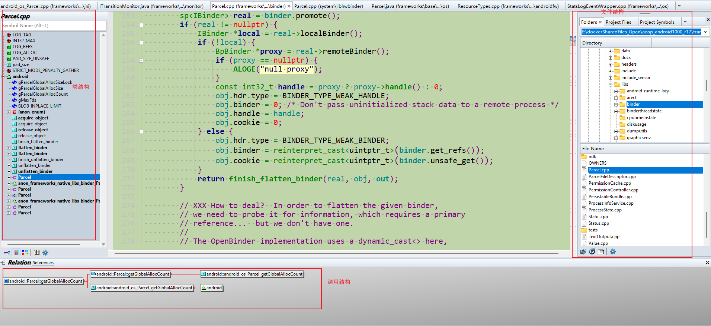


## 搜索

### 文本搜索-------当前文件中 Ctrl + F

快捷键：Ctrl + F

缺点： **很慢**

优点：      但是各类文件会被搜索得到


### 文本搜索-------全局

### 文本搜索------- 在指定路径中

1、先选中要搜索的内容 ---------> ctrl + shift + F

2、填写路径名+ Enter键

3、最后点击search


### symbols搜索

方法一：优：  1、**非常快**     2、还可以限制文件

> 


方法二：

> 


TODO：

> 两种方法是什么区别呢？


### 结果的快速跳转

当前file的跳转：

> 


技巧：

> **搜索结果的快速跳转**
>
> 
>
> 规定快捷键：
>
> >  ~~设置为F8和F9~~


## ~~del_替换  Ctrl + R~~


## 搜继承关系：

（1）向上： 搜TouchInputRedirection父类

法一：左键点击TouchInputRedirection  --------> 在relation window会显示父类   （优选）

~~法二：看TouchInputRedirection的.h文件~~

~~法三： TouchInputRedirection : public  ------> 后: public~~

（2）向下： 搜InputDeviceHandler子类

法一：优选， 在relation window配置**显示  Derived Classes**  (**不能同时看到向上和向下**)


法二：   ~~public InputDeviceHandler   ------> 前: public~~

### 类的家族图谱

点击树根，会展示所有的Item类的家族图谱：


## 搜继承关系（从函数角度）：

方法一： **有时候，索引不全？？？？？**        <font color='red'>   TODO：</font>

> 站在函数角度，如何看有没有子类去复写？
>
> 选中函数：看关联了哪些.h
>
> -------------> 结构上： SectionParser::ParseLineSection 函数 父类、子类的.h 会关联到一起
>
> ```java
>  //   \\system\\core\\init\\parser.cpp
> ```
>
> 
>

方法二：

> 点击父类，查看子类：
>
> 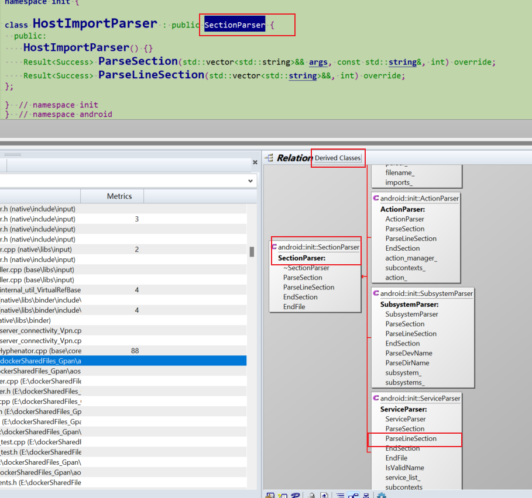


## source insight字体颜色

黑色-----------不可跳转（相当于AS的红色）

## 新版功能：

http://www.sourceinsight.com.cn/feather.html

HierarchyView的实现原理和Android设备无法使用HierarchyView的解决方法


## search Bar保留


## 选中高亮：


## 高亮多个word

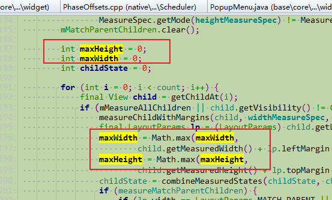

规定快捷键：F1 和 F2

> 


## 快捷键：

文本replace （当前文件）------>  修改为 ctrl  + R

​                         全局替换 ---------->  修改为 ctrl  + shift + R

~~close file   -------->  ctrl  + W~~

~~copy file path  ------->  ctrl  +shift + c~~

 ctrl  + O : open这个window

​         


### 多行注释

法一：

> Source Insight4.0已有多行注释功能：
>
> 

注释：ctrl  + /     反注释：加shift


法二：利用宏macro

> 快捷键：  ctrl  + /
>
> 
>


%accordion%macro MultiLineComment()%accordion%


```shell
macro MultiLineComment()

{
    hwnd = GetCurrentWnd()
    selection = GetWndSel(hwnd)
    LnFirst =GetWndSelLnFirst(hwnd)      //取首行行号
    LnLast =GetWndSelLnLast(hwnd)      //取末行行号
    hbuf = GetCurrentBuf()

    if(GetBufLine(hbuf, 0) =="//magic-number:tph85666031"){
        stop
    }

    Ln = Lnfirst
    buf = GetBufLine(hbuf, Ln)
    len = strlen(buf)

    while(Ln <= Lnlast) {
        buf = GetBufLine(hbuf, Ln)  //取Ln对应的行
        if(buf ==""){                   //跳过空行
            Ln = Ln + 1
            continue
        }

        if(StrMid(buf, 0, 1) == "/"){       //需要取消注释,防止只有单字符的行
            if(StrMid(buf, 1, 2) == "/"){
                PutBufLine(hbuf, Ln, StrMid(buf, 2, Strlen(buf)))
            }
        }

        if(StrMid(buf,0,1) !="/"){          //需要添加注释
            PutBufLine(hbuf, Ln, Cat("//", buf))
        }
        Ln = Ln + 1
    }
    SetWndSel(hwnd, selection)
}
```


%/accordion%


参考：

https://it.cha138.com/tech/show-390752.html

https://jingyan.baidu.com/article/90808022d313a2fd91c80f93.html


### recent file：

-----> TODO：快捷键一直不生效

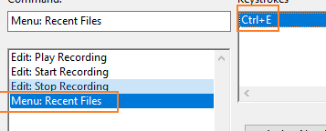

退而求其次的方法：

> 1、File menu是生效的 --------> 修改为CTRL + E 
>
> 
>
> 2、把 recent file至于File menu第一个，便可以键盘切换recent file
>
> 
>
> 3、效果：
>
> 


### 查看调用点

> 
>

或：

> 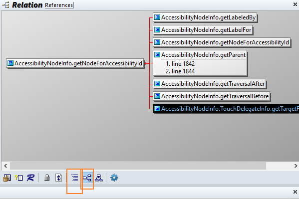
>


### Go Back &  Go Forward  

```java
Navigation: Go Back               : Alt+,, Thumb 1 Click
Navigation: Go Forward             : Alt+., Thumb 2 Click
```


### 快捷键设置：


### 参考：

https://blog.csdn.net/u010835747/article/details/122859809

https://www.amobbs.com/thread-5718242-1-1.html

https://zhuanlan.zhihu.com/p/33000424


## 查找关键字

如果 关键字是符号 ，比较快  -------> SI之前已经做好了

如果不是，会很慢（比AS慢很多）------->  可见，**AS是加载了所有文件，而SI只是符号表**


**技巧：**

> 通过左右来遍历搜索结果，不用切换到results文件
>
> 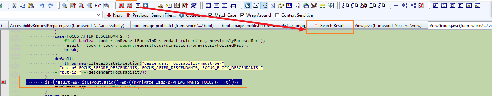

## 跳转 之 Bookmarks

修改快捷键：

```java
<item Command="Bookmark..." Keycode="(C)B" />
```


##  大纲 ------- 代码 相互快速跳转

快速跳转下一个函数：<------------大纲

快速跳转到类 ： <------------大纲

-<font color='red'>**比AS优的地方：**</font>  点击代码，<font color='red'>大纲跟随!!!!!!!!!!</font>   **TODO： 好的设计，可逆**


## 大纲------代码------被引用点   三者同步显示


## code大纲-------只看有哪些方法

目的： **更好地看类里有哪些方法**

方法：

> symbol window  --------> 折叠类 --------> 再打开类，方法都被折叠了
>
> 双击：
>
> 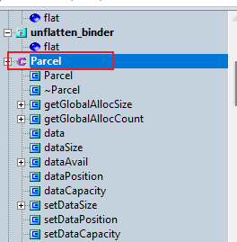


## 代码折叠：


操作：

> Options  --->  preferences  ---> windows ----> Outlining and Nesting --->  show outlining


## 调用栈

### 调用栈深度

显示2层时，比较优

参考：https://blog.csdn.net/qq_36035382/article/details/126357313


### ~~del_化简之调用栈~~

-<font color='red'> 忽略References中.h定义文件：</font>

> relation window 调用树中：
>
> **根据图标不同**，忽略.h 中定义处的调用 （**自然，整个分支都化简掉**）
>
> 

尽量用list --------> 显示得更多：

> 


### 锁定调用栈，<font color='red'>锁定关注</font>：

> Relation window锁定-------关注点放在<font color='red'>重点的调用栈</font>上

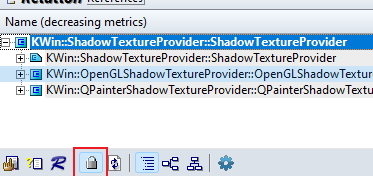


## 关闭overview


## 查看当前文件所处的位置

打开同级其他文件，也很方便


## ~~del_安装~~

### Source Insight 试用过期，激活

参考：https://www.jianshu.com/p/0dd919d660a3

方法：

> 修改激活日期，修改为当天，然后就可以再用90天了
>
> 修改C:\ProgramData\Source Insight\4.0的si4.lic
>
> 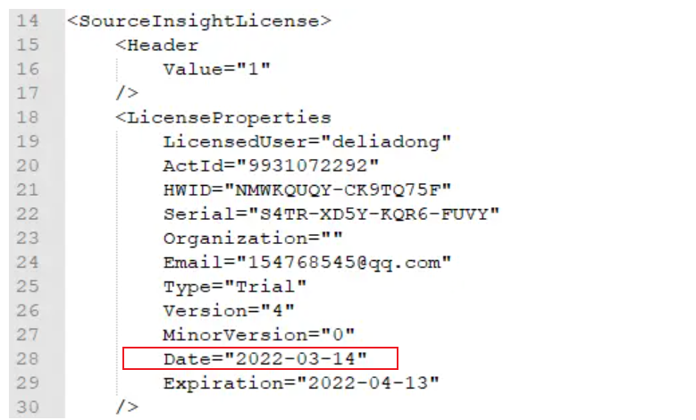


## 保存-----最优界面 和 设置

layout保存xml

设置保存：Options ----->  Loading configuration


## 编辑格式：

[换行符改为unix/linux格式](https://blog.csdn.net/aa804738534/article/details/103683736)

[tab设置为4个空格](https://blog.csdn.net/aa804738534/article/details/103683736)


## 新版功能：

http://www.sourceinsight.com.cn/feather.html

## 参考：

https://www.dandelioncloud.cn/article/details/1578906401210855426     Source Insight 使用教程(2)——常用功能


# ~~基本设置：~~

## Tab 键为4个空格

Tab width:4

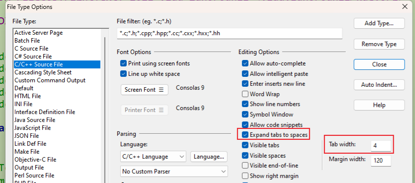


## 换行符改为unix/[linux](https://so.csdn.net/so/search?q=linux&spm=1001.2101.3001.7020)格式：

```
1：Option->Prefernces->Files
2：在倒数第二行的Default line ending选择Uinx(LF)
```

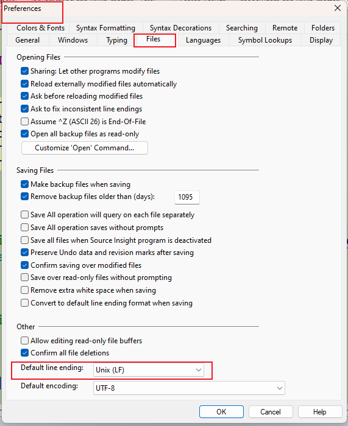


## 背景色设置


# ~~del_linux下使用 Source Insight~~

参考：https://juejin.cn/s/linux source insight

----------> **验证ok**

1、**安装wine**

```
 sudo apt-get install wine-stable=3.0-1ubuntu1
```

**2.使用wine安装Source Insight 4.0**

```
 //（1） copy linux的安装包 sourceinsight40107-setup.exe到linux
 
 //（2）linux内
 wine sourceinsight40107-setup.exe
```

3、打开：

```
 cd ~/.wine/drive_c/Program\\ Files\\ \\(x86\\)/Source\\ Insight\\ 4.0
 wine sourceinsight4.exe
```

借助wine，运行win下的 软件

> 参考：https://www.sysgeek.cn/ubuntu-wine/        --------->  好文


字体修改：

> 1、source Insight字体的设置：
>
> 一定要是西文

[在 Ubuntu 上安装和使用 Wine，轻松运行 Windows 应用程序 - 系统极客 (sysgeek.cn)](https://www.sysgeek.cn/ubuntu-wine/)    ---------->  非常优的文章


-<font color='red'>规定：</font>

> 路径里（安装路径、工程路径），无论win、linux！！！！！：
>
> <font color='red'>不允许有空格  & 中文 ！！！！ ---------> 害死人！！！！！</font>


