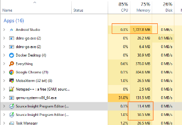
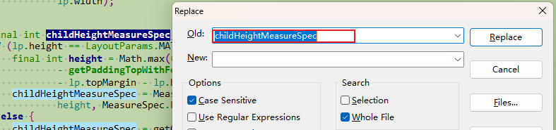
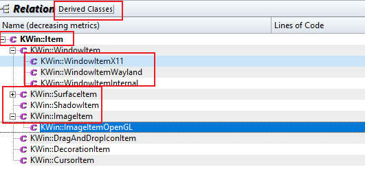
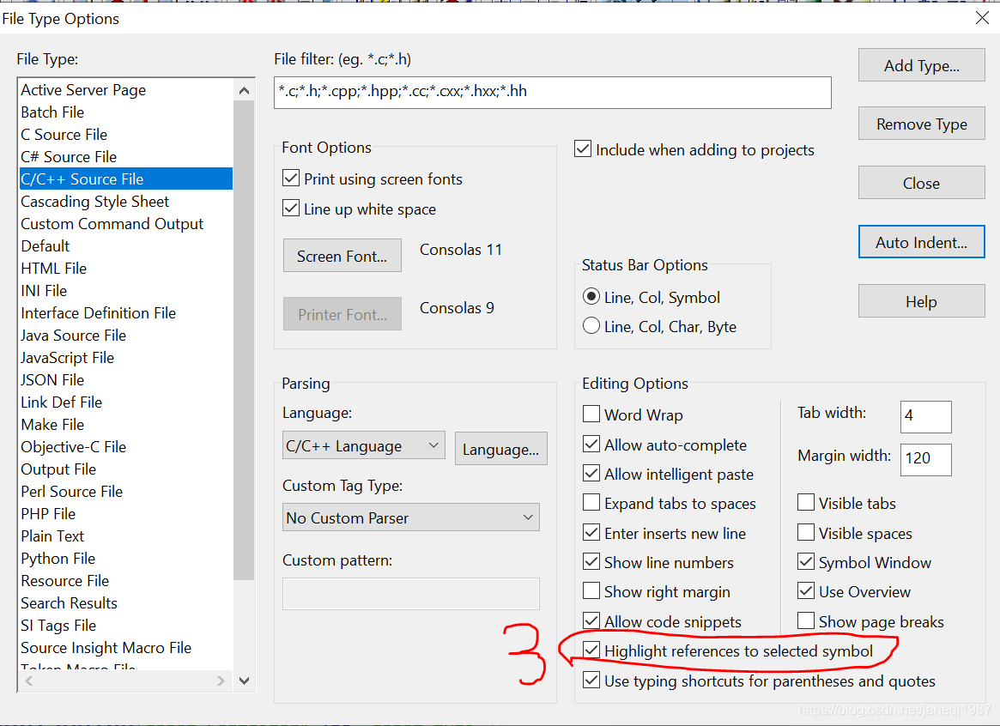
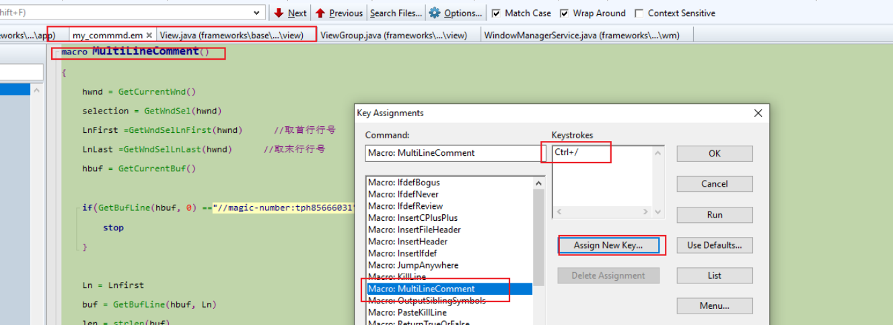
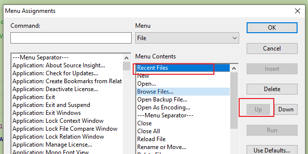
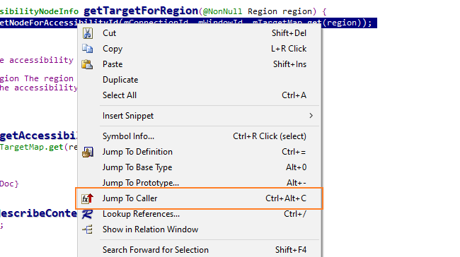
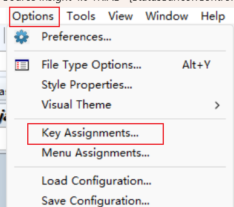
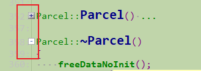
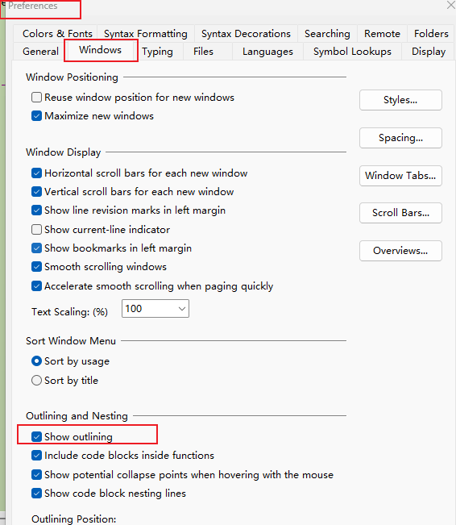

# 目录


# source insight

## 优缺点：

优点：

> 1、**极优：**可以source 两个完全不同路径下的代码  （自然，可以取整个aosp多个小部分代码）。AS的source code 必须在工程目录下！！！
>
> 2、内存使用是AS的二十分之一    **<font color='red'>极优</font>**
>
> 
>
> 3、~~导入整个framework代码，才占100M~~    ---------->  **太优秀了**
>
> 所以，一下子，可以导入整个framework（**只是可能搜索的范围大了一些**）
>
> > 
>
> 
>
> 3、可以同时java和cpp同时跳转！     **极优**
>
> 4、不需要像AS与clion，需要事先搭建一个可以编译环境，然后copy代码
>
> 5、对于远程服务器代码，不需要copy！！！！（由第一点决定！！！）   **极优**
>
> 6、看代码大杀器-----java、cpp、c同时OK
>
> 7、在看代码的过程中，可以随时添加source 文件，以及remove 部分文件（比如test目录）-----> 优秀

​      

缺点：

> 断点调试不行？------>  办法：与AS结合使用！
>


## 新建项目

参考：https://blog.csdn.net/zyhse/article/details/122966714


注意：

> 这里是服务器目录（代码目录），**可以与工程目录，不是同一个**，非常优


### 随时按需添加/移除

--------------> 过程中，**随时添加**：

> 

移除：

> 

### add文件之后一定要sync，才能跳转

重点：

1、需要sync(否则，两个文件之间无法跳转)

> 

2、第一次解析所有文件，否则有些不能跳转：

> 


## 优点之 增量添加文件--------增量解析

缩短解析时间：

> 增量添加文件后，只需要对adding fies进行解析即可，快！！！
>
> 


## namespace导致cpp部分函数无法跳转

现象：部分函数和类  是黑色的，无法跳转（但是存在这个类以及函数）

---------------> namespace 导致无法跳转解决方法

参考：

> https://blog.csdn.net/peng314899581/article/details/84260306?utm_medium=distribute.pc_relevant.none-task-blog-2~default~baidujs_baidulandingword~default-0-84260306-blog-78630333.235^v43^pc_blog_bottom_relevance_base7&spm=1001.2101.3001.4242.1&utm_relevant_index=3


## 最优界面

一个好的布局界面，应该**<font color='red'>同时展现各个结构</font>**：

> 1、目录结构
>
> 2、类结构
>
> 3、调用结构-----2层


## 搜索

### 文本搜索-------当前文件中 Ctrl + F

快捷键：Ctrl + F

缺点： **很慢**

优点：      但是各类文件会被搜索得到


### 文本搜索-------全局

### 文本搜索------- 在指定路径中

1、先选中要搜索的内容 ---------> ctrl + shift + F

2、填写路径名+ Enter键

3、最后点击search


### symbols搜索

方法一：优：  1、**非常快**     2、还可以限制文件

> 


方法二：

> 


TODO：

> 两种方法是什么区别呢？


### 结果的快速跳转

当前file的跳转：

> 


技巧：

> **搜索结果的快速跳转**
>
> 
>
> 规定快捷键：
>
> >  ~~设置为F8和F9~~


## ~~del_替换  Ctrl + R~~



## 搜继承关系：

（1）向上： 搜TouchInputRedirection父类

法一：左键点击TouchInputRedirection  --------> 在relation window会显示父类   （优选）

~~法二：看TouchInputRedirection的.h文件~~

~~法三： TouchInputRedirection : public  ------> 后: public~~

（2）向下： 搜InputDeviceHandler子类

法一：优选， 在relation window配置**显示  Derived Classes**  (**不能同时看到向上和向下**)


法二：   ~~public InputDeviceHandler   ------> 前: public~~

### 类的家族图谱

点击树根，会展示所有的Item类的家族图谱：




## 搜继承关系（从函数角度）：

方法一： **有时候，索引不全？？？？？**        <font color='red'>   TODO：</font>

> 站在函数角度，如何看有没有子类去复写？
>
> 选中函数：看关联了哪些.h
>
> -------------> 结构上： SectionParser::ParseLineSection 函数 父类、子类的.h 会关联到一起
>
> ```java
>  //   \\system\\core\\init\\parser.cpp
> ```
>
> 
>

方法二：

> 点击父类，查看子类：
>
> 


## source insight字体颜色

黑色-----------不可跳转（相当于AS的红色）

## 新版功能：

http://www.sourceinsight.com.cn/feather.html

HierarchyView的实现原理和Android设备无法使用HierarchyView的解决方法


## search Bar保留


## 选中高亮：





## 高亮多个word


规定快捷键：F1 和 F2

> 


## 快捷键：

文本replace （当前文件）------>  修改为 ctrl  + R

​                         全局替换 ---------->  修改为 ctrl  + shift + R

~~close file   -------->  ctrl  + W~~

~~copy file path  ------->  ctrl  +shift + c~~

 ctrl  + O : open这个window

​         


### 多行注释

法一：

> Source Insight4.0已有多行注释功能：
>
> 

注释：ctrl  + /     反注释：加shift


法二：利用宏macro

> 快捷键：  ctrl  + /
>
> 
>


%accordion%macro MultiLineComment()%accordion%


```shell
macro MultiLineComment()

{
    hwnd = GetCurrentWnd()
    selection = GetWndSel(hwnd)
    LnFirst =GetWndSelLnFirst(hwnd)      //取首行行号
    LnLast =GetWndSelLnLast(hwnd)      //取末行行号
    hbuf = GetCurrentBuf()

    if(GetBufLine(hbuf, 0) =="//magic-number:tph85666031"){
        stop
    }

    Ln = Lnfirst
    buf = GetBufLine(hbuf, Ln)
    len = strlen(buf)

    while(Ln <= Lnlast) {
        buf = GetBufLine(hbuf, Ln)  //取Ln对应的行
        if(buf ==""){                   //跳过空行
            Ln = Ln + 1
            continue
        }

        if(StrMid(buf, 0, 1) == "/"){       //需要取消注释,防止只有单字符的行
            if(StrMid(buf, 1, 2) == "/"){
                PutBufLine(hbuf, Ln, StrMid(buf, 2, Strlen(buf)))
            }
        }

        if(StrMid(buf,0,1) !="/"){          //需要添加注释
            PutBufLine(hbuf, Ln, Cat("//", buf))
        }
        Ln = Ln + 1
    }
    SetWndSel(hwnd, selection)
}
```


%/accordion%


参考：

https://it.cha138.com/tech/show-390752.html

https://jingyan.baidu.com/article/90808022d313a2fd91c80f93.html


### recent file：

-----> TODO：快捷键一直不生效


退而求其次的方法：

> 1、File menu是生效的 --------> 修改为CTRL + E 
>
> 
>
> 2、把 recent file至于File menu第一个，便可以键盘切换recent file
>
> 
>
> 3、效果：
>
> 


### 查看调用点

> 
>

或：

> 
>


### Go Back &  Go Forward  

```java
Navigation: Go Back               : Alt+,, Thumb 1 Click
Navigation: Go Forward             : Alt+., Thumb 2 Click
```


### 快捷键设置：




### 参考：

https://blog.csdn.net/u010835747/article/details/122859809

https://www.amobbs.com/thread-5718242-1-1.html

https://zhuanlan.zhihu.com/p/33000424


## 查找关键字

如果 关键字是符号 ，比较快  -------> SI之前已经做好了

如果不是，会很慢（比AS慢很多）------->  可见，**AS是加载了所有文件，而SI只是符号表**


**技巧：**

> 通过左右来遍历搜索结果，不用切换到results文件
>
> 

## 跳转 之 Bookmarks

修改快捷键：

```java
<item Command="Bookmark..." Keycode="(C)B" />
```


##  大纲 ------- 代码 相互快速跳转

快速跳转下一个函数：<------------大纲

快速跳转到类 ： <------------大纲

-<font color='red'>**比AS优的地方：**</font>  点击代码，<font color='red'>大纲跟随!!!!!!!!!!</font>   **TODO： 好的设计，可逆**


## 大纲------代码------被引用点   三者同步显示


## code大纲-------只看有哪些方法

目的： **更好地看类里有哪些方法**

方法：

> symbol window  --------> 折叠类 --------> 再打开类，方法都被折叠了
>
> 双击：
>
> 


## 代码折叠：



操作：

> Options  --->  preferences  ---> windows ----> Outlining and Nesting --->  show outlining




## 调用栈

### 调用栈深度

显示2层时，比较优

参考：https://blog.csdn.net/qq_36035382/article/details/126357313


### ~~del_化简之调用栈~~

-<font color='red'> 忽略References中.h定义文件：</font>

> relation window 调用树中：
>
> **根据图标不同**，忽略.h 中定义处的调用 （**自然，整个分支都化简掉**）
>
> 

尽量用list --------> 显示得更多：

> 


### 锁定调用栈，<font color='red'>锁定关注</font>：

> Relation window锁定-------关注点放在<font color='red'>重点的调用栈</font>上


## 关闭overview


## 查看当前文件所处的位置

打开同级其他文件，也很方便


## ~~del_安装~~

### Source Insight 试用过期，激活

参考：https://www.jianshu.com/p/0dd919d660a3

方法：

> 修改激活日期，修改为当天，然后就可以再用90天了
>
> 修改C:\ProgramData\Source Insight\4.0的si4.lic
>
> 


## 保存-----最优界面 和 设置

layout保存xml

设置保存：Options ----->  Loading configuration


## 编辑格式：

[换行符改为unix/linux格式](https://blog.csdn.net/aa804738534/article/details/103683736)

[tab设置为4个空格](https://blog.csdn.net/aa804738534/article/details/103683736)


## 新版功能：

http://www.sourceinsight.com.cn/feather.html

## 参考：

https://www.dandelioncloud.cn/article/details/1578906401210855426     Source Insight 使用教程(2)——常用功能


# ~~基本设置：~~

## Tab 键为4个空格

Tab width:4


## 换行符改为unix/[linux](https://so.csdn.net/so/search?q=linux&spm=1001.2101.3001.7020)格式：

```
1：Option->Prefernces->Files
2：在倒数第二行的Default line ending选择Uinx(LF)
```


## 背景色设置


# ~~del_linux下使用 Source Insight~~

参考：https://juejin.cn/s/linux source insight

----------> **验证ok**

1、**安装wine**

```
 sudo apt-get install wine-stable=3.0-1ubuntu1
```

**2.使用wine安装Source Insight 4.0**

```
 //（1） copy linux的安装包 sourceinsight40107-setup.exe到linux
 
 //（2）linux内
 wine sourceinsight40107-setup.exe
```

3、打开：

```
 cd ~/.wine/drive_c/Program\\ Files\\ \\(x86\\)/Source\\ Insight\\ 4.0
 wine sourceinsight4.exe
```

借助wine，运行win下的 软件

> 参考：https://www.sysgeek.cn/ubuntu-wine/        --------->  好文


字体修改：

> 1、source Insight字体的设置：
>
> 一定要是西文

[在 Ubuntu 上安装和使用 Wine，轻松运行 Windows 应用程序 - 系统极客 (sysgeek.cn)](https://www.sysgeek.cn/ubuntu-wine/)    ---------->  非常优的文章


-<font color='red'>规定：</font>

> 路径里（安装路径、工程路径），无论win、linux！！！！！：
>
> <font color='red'>不允许有空格  & 中文 ！！！！ ---------> 害死人！！！！！</font>


