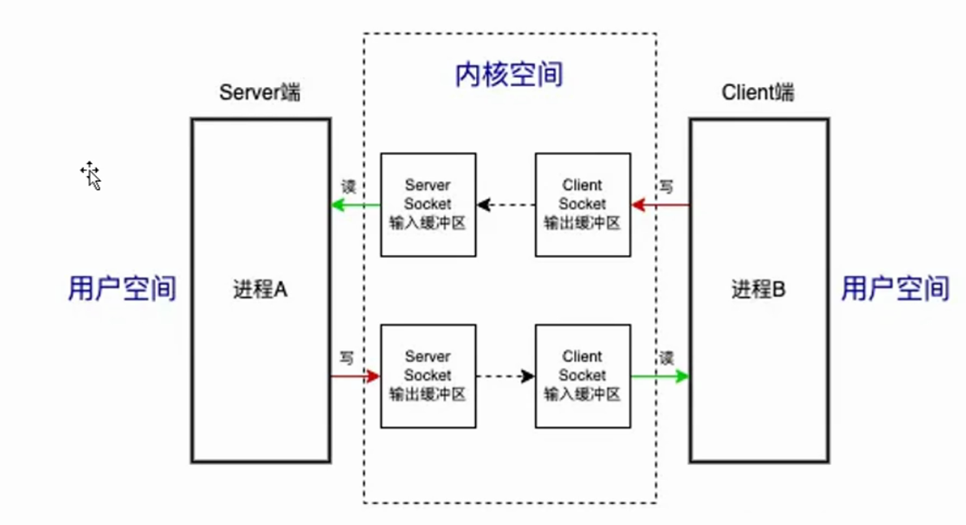

# 目录


# 进程设计的意义/初衷

我们谈到IPC，那么其实就有疑问了，不要有那么多进程不就行了？不就不存在进程隔离了吗？

## 进程天然内存隔离，系统为什么采用多进程呢？

----安全(隔离)/稳定/内存分配


## APP的多进程

一个APP为啥要做成 多进程？见下图：
主要（<font color='red'>也是开发技巧</font>）：

1、突破522M内存限制（虚拟机给一个java进程的）

2、稳定：将  <font color='red'>需要稳定的重要代码</font>与不稳定的分离开，<font color='red'>不至于一起crash</font>

​                 比如 微信的消息 接受功能。不能因为微信界面进程crash，而收不到消息！！！！！！，<font color='red'>不然信息丢掉了</font>


举例子：

QQ等应用就是多线程


 


## 总结 涉及到IPC的场景


APP进程间、APP进程与FrameWork的系统进程、FrameWork的系统进程与native（部分是jni）

native 与 kernel进程之间（<font color='red'>TODO: 跨了进程？</font>）


# 进程间通信（IPC）---Binder

## 前戏

`因为要谈论andriod的Binder，不得不`：

2、为啥不用linux本身的，为啥andriod自己要开发一套Binder机制？（即优缺点）

1、-----> 自然，先要列举一下Linux本身的IPC通信方式 


### Linux IPC通信方式的种类：


1、2、3、4、5、6

注意：c嵌入式开发，经常使用信号量


<font color='red'>如何遍历记忆？:</font>


#### 内存共享


生活化模型，合租房子：

> 我家的客厅就是你家的客厅。。。注意：内存共享，没有使用内核空间


共享内存的缺点：

> 我家的客厅就是你家的客厅，那还有安全可言嘛 ---->  官方：<font color='red'>没有同步控制</font>：1、访问出现紊乱   2、信息安全没有保障


注：由图知道，进程地址空间，全部地址----------> 只是映射到 <font color='red'>物理内存</font>

​       所以，`从本质物理上看`，共享内存，就是共享的物理内存（地址空间相同）


#### 管道


生活化模型，管道走线：

> 一边人塞进去，另一边人拉出来


管道，利用文件作为中间介质（利用了**内核空间**）

TODO,  注意：管道的方向是一定的？单向的


**缺点：**
1、两次复制    A --->  管道 ----> B （模型:  一推一拉）
2、管道会阻塞（管道有多大）


#### 消息队列


消息队列（<font color='red'>存在于内核中</font>）-------> 也是利用内核空间内存
消息的发送方和接受方，要约定好消息体的类型（和大小）


生活化模型，快递模型：

`快递公司`， 内核中的消息队列：负责接收、存储、发送快递包裹（消息）。

`快递包裹`，消息：有一个唯一的标识号（消息类型），发件人（发送方）将包裹交给快递员（消息队列），然后快递员将包裹存储到快递公司的仓库（消息队列缓冲区）中。

自然：

收件人（接收方）需要从快递公司的仓库中取出包裹，只能取走属于自己的包裹：  `根据唯一标识取`（**实际上就是发取双方的协议**）

如果没有属于自己的包裹，收件人需要等待，直到快递员把包裹送到仓库中。


#### socket 




这个图和 管道  很相似 ------->  感觉没啥区别？


与管道区别:

1. 方向性不同：Socket通信是**双向的**，而管道通信是单向的。
2. 应用范围不同：Socket通信可以在**不同的机器之间（网络）**进行通信，而管道通信只能在同一个机器上的进程之间进行通信。
3. 传输方式不同：Socket通信是面向连接的，而管道通信是面向数据流的。


缺点：

两次copy


#### 信号量


#### 为啥安卓要重新做一个Binder呢（对比）？

进程通信对比


 

2、或者说， 共享内存和 Socket的一个  <font color='red'>中间态</font>：取Socket的copy + 共享内存的内存映射


补充：

后面几种（除了共享内存），都有一个特点：  必须通过内核空间


### Parcel + Parcelable

模型：图 TODO

目的在于：

>  拆解成基本类型，通过内核（IoCtrl）

本质：Parcel + Parcelable  。`与类没有任何关系， 已经拆解成基本类型了`

​			`可以打包的数据，自然`：~~Parcelable(Intent、Bundle) +  基础数据类型 + list + map~~ + Binder（TODO: 如何做的？？？）     

推论：Parcel作用就是拆解     类---->  基本数据类型序列

应用场景：跨进程传输，打包解包必须（必须int传输）


## 0层流程-----一次Binder通信


IPC.eddx

**分层设计思想**：类比于 五层TPC/IP协议体系，见 http://gityuan.com/2016/09/04/binder-start-service/

好处：

-   **从功能实现角度看，层与层具有独立性**,  例如应用层可以使用传输层提供的功能而无需知晓其实现原理;
-   设计灵活, 层与层之间都定义好接口, 即便层内方法发生变化,只有接口不变, 对这个系统便毫无影响;
-   结构的**解耦合**, 让**每一层**可以用更适合的技术方案,  **更合适的语言;**
-   **从维护角度看，方便维护,** 可**分层调试**和定位问题; 


## 0层结构-----Binder架构（存在三个ipc）


参考：  https://www.cnblogs.com/yocapl/p/12422617.html


逻辑化简：


1、上图中**步骤1、2、3是虚线的**，并不是直接调用。<---- 通过ioctl` 系统调用Binder驱动`完成的

2、上图存在三个进程：client进程、server进程、Service Manager进程  ---> <font color='red'>任意两个之间的交互都是通过Binder？</font>

3、从应用角度：应用层只需要实现client 和 server；

~~4、对于应用层来说，看到的 就是  client调用 server~~


5、背后的架构：C/S架构

6、从实现机制上看，有点儿类似linux共享内存

7、从数据拷贝次数来看，Binder只需要进行一次内存拷贝，而管道、消息队列、Socket都需要两次。共享内存不需要拷贝，Binder的性能仅次于共享内存。---> 为什么不用共享内存？共享内存需要处理并发同


基于0层的生活化模型：


床柜挪房间模型：

> 两个房间：两个进程。进程内存隔离
>
> 两个房间之间有个客厅： 内核，通往客厅的门只能通过小的基本类型数据
>
> 拆床说明书（即组装床说明书）Parcelable、同样拆柜子说明书：Bed implements Parcelable  --------> 这个其实不是AIDL。不得不：两边有一模一样的
>
> 拆哪个东西的约定：AIDL协议-------->  即int code表征执行哪个方法。。。不得不：两边有一模一样的AIDL
>
> 

目标：床柜挪房间

---------- >  不得不：

  1、这边房间需要拆床 ，拆完的 基本部件才能通过门，到另一个房间

  2、到另一个房间后，怎么知道这次拆的是床的 ------>AIDL协议


## 功能实现之管理结构(后面拆除掉)

`0层结构图中的：`


一般C/S架构必然有  管理者，server用来注册；client端用来查询

所以，`ServiceManager 一句话本质`： 维护了  binder名-------Binder列表： 比如 “Activity” -----  AMS的Binder 


AMS的Binder 何时注册到 ServiceManager呢？见《系统启动流程>中的publishBinderService流程


Q：  ServiceManager本身底层也是 Binder, 他怎注册呢？

A:  **自然**，必然是固定的，不注册。 ServiceManager对应的handle为0，取到对应binder


TODO:   如果是APP开发者自己定义的Service，binderService时，走的是AMS，没有注册到ServiceManager嘛？


注意：后面看流程，先把管理serviceManager给去除了


### ~~管理模型，类似于其他C/S架构~~

再比如：DNS	服务器，也是维护了 域名----IP的列表


## 功能实现之核心结构


 <a id='binder_wulibenzhi'><font color='red'>Binder的物理本质 :</font>  </a>

> 一个词总结： 共享内存
>
> 一句话总结： Binder 是在 共享内存的基础上， `以性能（增加copy）为代价，换取了 安全性`   

注意：1、上图是在 共享内存 图的基础演化而来。差别在于：

​           （1）内存映射 的双方不同： 共享内存是两个APP进程 ；Binder是 内核进程 与 server端

​           （2）mmap()功能的物理实现 即 图中1和2

 

数据流：
client 发送数据 ---->  kernel ( kernel 内核空间地址，映射到了物理内存，则server能感受到)

从数据的流转来看（数据结构的变化）,  Binder的本质：

经过内核，不得不： 
1、传输的数据，不得不拆解成int、string等基本类型（TODO: 经过内核时，是不是更基本？） 
----->  **所以，parcel拆解，是不得不的**

2、AIDL协议也是不得不的，<font color='red'>AIDL要做两件事情</font>：  
（1）保证 触发与接收函数一致，通过code           
（2）~~保证拆合，原则一致，有同一套说明书~~ （Parcelable保证的！！！！！不是AIDL） 

<a id='aidl_moxing'>AIDL从模型的角度的本质：即上面保证（协议）</a>  


官方描述：

mmap() 是操作系统中一种内存映射的方法。
内存映射就是<font color='red'>将用户空间的一块内存区域映射到内核空间</font>。映射关系建立后，用户对这块内存区域的修改可以直接反应到内核空间；反之内核空间对这段区域的修改也能直接反应到用户空间。


基于上图，一句话： <font color='red'>整个Binder机制，唯一核心的就是映射1（ kernel内存地址  和 物理内存 的映射）创建</font>

------->   在server端 ， Binder的创建流程中，见下


## Binder的创建

目<font color='red'>标：</font>整个Binder机制唯一核心------- 映射的创建

### Binder是什么

不同角度：

机制:   Binder是一种进程间通信机制;  ---->  这个角度来看： Binder 是 安卓的 **神经系统** 

从<font color='red'>功能看：Binder就是一种服务</font>（虽然可能不是service，比如主线程的Binder）。所以，天生的，Service，底层必然是Binder

应用层:  Binder是一个能发起通信Java类;  --->  ~~对外的接口~~

Framework/Native: ~~Binder Client、 Server、 Service Manager和Binder驱动程序,   形成一套C/S的通 信架构~~

驱动:   Binder是一个虚拟物理设备**驱动**;  ---->  真正实现功能的地方

物理角度：Binder的<font color='red'>本质</font> [见上](#binder_wulibenzhi)


-------->  记忆锚点： 应用层来看、Framework/Native、驱动、物理角度


### Binder驱动的创建时机

进程创建的时候，一般就创建了。比如：


问题1：为啥要在APP创建时，要第一时间初始化Binder驱动呢？

> A:   ~~因为创建APP进程之后，会将自己的Binder给到AMS来管理（后续，AMS让APP创建Activity）~~ -----> 见APP启动流程
>
> ​     自然，~~在这之前，要创建Binder~~


问题2：zygote进程有自己的 binder嘛？ video7

> A：没有。
>
> linux角度：因为主要功能是生孩子（fork）。linux不允许fork的有多线程，会产生死锁  ---->  规则
>
> 代码角度：TODO


### Binder的注册时机

（1）0号引用  ServiceManager  的Binder不需要注册

（2）对于一个普通的APP定义的service，何时注册到  ServiceManager 的？  


## AIDL


aidl 目的：

> 就是  对外接口 Proxy和stub，自动生成。不用APP开发者自己写
>
> 为啥不能纳入framework呢？没办法，因为AIDL里面的具体接口函数，不清楚


所以，AIDL是封装

​           AIDL也是没能纳入framework层的妥协，利用编译抽取公共功能-------->  TODO: 背后的背后： 收集这个技巧！！


核心的核心就是 Ibinder如何传递的


注意： 

两个 APP源代码，必须有相同的 .aidl文件 文件 

推论：~~虽然Server端有Proxy，但是没有用到~~


TODO:  AIDL编译也可以生成native的proxy和stub？？？？？？


从APP开发者来看：

AIDL<font color='red'>是接口 </font>----->  自然，server和client都要（复制一份一模一样的  或者  编译共用一个）

AIDL<font color='red'>的本质，一句话：</font> 

​       1、从代码角度：对proxy和stub进行封装   ------> 通过编译.aidl文件，自动生成 proxy 和 stub文件

​        2、从模型角度：    [见上](#aidl_moxing)


## 分析一次Binder调用(核心)

前提条件：

默认 client 已经持有 server端的 binder了（物理上持有的是啥？）通过 manger

### client--->BinderProxy--->binder驱动

即0层架构图的


以 APP 获取AMS服务为例子，即ServiceManager.getService方法   ：

前提，已经持有ServiceManager对应的Binder了

角色：

> client  ---- APP
>
> BinderProxy ---- **ServiceManagerProxy**  
>
> jni
>
> BpBinder
>
> Binder驱动 ------- 即 ServiceManager对应的0号 Binder


### binder驱动--->BinderProxy--->server


以ServiceManager.addService为例子：


## binderService流程

注：~~如上所说，Binder本质就是体现一个服务 (但不一定都是Service)~~


原图：


化简：

1、2、5、6删除。~~Client 通过 AMS 、Server也通过AMS，~~自然 ，先必须找ServiceManager


触发点：

```java
MainActivity.bindService(intent, mServiceConnection, Context.BIND_AUTO_CREATE);  // 唯一核心代码
```


唯一一行核心代码：

> AMS把 Service的Binder给到 Client端： onServiceConnected() 之前流程。调用栈：

**也是上图的一句话总结**

总结：

> 上图总共 8次跨进程 通信！！！！


~~繁琐的展开流程如下：~~

> 1）Activity作为Client发起bindService，最终会调度到AMS 去执行bindService。在这个过程中，Client要去调用
> AMS的代码，所以此时就会涉及到跨进程调度，基于第三章的Binder通信模型我们不难知道，Client会先和
> ServiceManager通信，从ServiceManager中拿到AMS的IBinder。
> 2）Activity拿到AMS的IBinder后，跨进程执行AMS的BindService函数；
> 3）由于AMS管理所有的应用进程，因此AMS中持有了应用进程的Binder，所以此时AMS可以发起第4步也就是跨进
> 程调度scheduleBindService();
> 4)Server端会在收到AMS的bindService的请求后，会将自己的IBinder发送给client，但是Server必须通过AMS才能
> 将Binder对象传过去，所以此时需要跨进程从ServiceManager中去拿到AMS的binder；
> 5）Server端通过AMS的binder直接调用AMS的代码publishService(),将service的Binder发送给AMS；
> 6）经过层层调用，最终AMS讲Server端的binder通过回调connect函数传递给了Client端的Activity；
> 以上就是bindService的全流程，这个流程主要的目的是将Server端的Binder对象发送给Client端。从此以后，Client
> 端就可以通过Server端的binder与Server端像调用自己的代码一样完成跨进程通信了  


## Binder的 同步调用 / 异步调用

结论：默认都是同步调用

​         ~~即 A 应用调 B应用，等待B应用的返回结果~~

同步调用，图：

> 
>
> 关注<font color='red'>点：</font>（1）client 休眠（ 在等待结果时）； （2）Server端  是在binder线程上 （非主线程）


为什么默认都是同步？同步为何是自然的？

1、同步是自然的

2、很多情况，Client调Server是需要 获取结果（reply）的： 比如BOOK中例子，获取Server端的getBookList()

​     从模型角度：

>  要等待结果，必须休眠 

​    从代码角度：

> ```java
>     // Client 端 
>       public java.util.List<com.example.aidl.Book> getBookList() 
>       {
>         android.os.Parcel _data = android.os.Parcel.obtain();
>         android.os.Parcel _reply = android.os.Parcel.obtain();
>         java.util.List<com.example.aidl.Book> _result;
>         try {
>           _data.writeInterfaceToken(DESCRIPTOR);
>           boolean _status = mRemote.transact(Stub.TRANSACTION_getBookList, _data, _reply, 0); //【1】
>           ............
>           _result = _reply.createTypedArrayList(com.example.aidl.Book.CREATOR); //【2】
>         }
>           ............
>         return _result;
>       }
> ```
>
> 必须等【1】执行完，\_reply才有数据，【2】才能用\_reply
>
> 


### 异步


异步调用，图：

> 
>
> **对比同步**，异步注意点： client不会休眠（自然也不会等待结果）


代码层面的区分点：

> ```java
> //Proxy中：
> 
> mRemoteBinder.transact(REQUEST_CODE, _data, _reply, 0);// flag = 0
> ```
>
> // flag = 0 表示同步调用（默认），~~1 表示表示异步调用~~（自然， ~~异步调用\_reply必须为null~~）
>
> 补充：1即  IBinder.FLAG_ONEWAY


从aidl的接口定义角度：

> 自然，~~oneway的aidl的接口定义是<font color='red'>不能有返回值的</font>  （返回值都是由\_reply承载的）~~
>
> ​         比如： oneway interface IApplicationThread{..........}
>
> <font color='green'>使用方法：</font>   oneway关键字，决定了 代码中  flag = 1


IPCThreadState角度：

> TODO:   https://www.jianshu.com/p/db2df0a4e037


线程角度：  TODO

> 对于ONEWAY接口，所有调用在server端都被串行化(尽管不同应用发起请求是并行的)


#### 例子：

onesay主要用于系统服务向应用端发起binder调用：

```java
scheduleLaunchingActivity: 系统服务向应用端发起oneway binder调用，让应用端启动acitvitiy
IWindow：WMS向应用端发起oneway binder调用
IServiceConnection: 应用端bindService完成时，AMS向应用端发起的oneway  binder调用
IIntentReceiver：AMS发起oneway binder调用 分发广播
```


具体例子：

```java
// IApplicationThread.aidl
oneway interface IApplicationThread{
	void scheduleTransaction(........); // 同步生命周期的。即启动应用侧 acitvitiy
    // 所有方法，不能有返回值
} 
```

结论：

> **系统侧---->  APP侧，必须是 oneway 的aidl**    
>
> ​                                TODO: APP侧绝不能阻塞系统侧
>
> APP侧 ---->  系统侧，一般可以是 同步aidl： 自然，APP里AIDL一般不加oneway 


## 优缺点：

oneway binder 优点：

```
1，异步：应用端处理这些oneway binder调用，如果很耗时，也不会阻塞系统服务
2，串行化，系统会逐个分发binder 调用
```


## 实现机制

TODO:


## 参考： 

https://www.jianshu.com/p/db2df0a4e037   Android Framework学习之Binder的oneway机制

https://blog.csdn.net/yu8fei/article/details/109389362?spm=1001.2101.3001.6650.1&utm_medium=distribute.pc_relevant.none-task-blog-2%7Edefault%7ECTRLIST%7ERate-1-109389362-blog-123662130.235%5Ev32%5Epc_relevant_default_base3&depth_1-utm_source=distribute.pc_relevant.none-task-blog-2%7Edefault%7ECTRLIST%7ERate-1-109389362-blog-123662130.235%5Ev32%5Epc_relevant_default_base3&utm_relevant_index=2    Binder的同步与异步


## 其他细节

### binder安全机制

上面说binder比其他IPC机制更加安全，体现在内核 对  UID/PID进行有效性检测。

TODO: 具体如何校验的？


### 一些函数

```java
Binder.getCallingPid(); //获取 调用binder的进程pid（自然是在 在服务端 ）
```


## 参考

http://gityuan.com/2016/09/04/binder-start-service/

http://gityuan.com/2015/10/31/binder-prepare/

https://blog.csdn.net/carson_ho/article/details/73560642 

https://developpaper.com/principle-and-use-of-android-binder/


https://blog.csdn.net/carson_ho/article/details/73560642  -->Binder优质文章


一些结论：
一个Binder就是一个线程。比如： AMS实现了Ibinder接口，是一个Binder, 所以也是一个binder线程


Binder机制：https://blog.csdn.net/carson_ho/article/details/73560642

这3大过程每一次都是一个完整的BinderIPC过程
http://gityuan.com/2016/09/04/binder-start-service/    <-----彻底理解Android Binder通信架构


《Binder预习资料.pdf>


## 面试题

https://blog.csdn.net/xuyin1204/article/details/118546330?ops_request_misc=%257B%2522request%255Fid%2522%253A%2522162599351116780274143599%2522%252C%2522scm%2522%253A%252220140713.130102334.pc%255Fblog.%2522%257D&request_id=162599351116780274143599&biz_id=0&utm_medium=distribute.pc_search_result.none-task-blog-2~blog~first_rank_v2~rank_v29-2-118546330.pc_v2_rank_blog_default&utm_term=binder&spm=1018.2226.3001.4450         Binder相关面试题目


# Binder线程池  TODO


# 框架的背后


# 自然法则

# 技巧之  aidl的调试

[[Android AIDL系列 1\] 手动编译aidl文件，生成Java、C++[android]、C++[ndk]、Rust接口_aidl ndk-CSDN博客](https://blog.csdn.net/yinminsumeng/article/details/129324917)

编译结果里搜索

编译命令是啥？

[Android R系统aidl文件怎么对应的java文件找不到了?_aidl生成的java文件-CSDN博客](https://blog.csdn.net/tkwxty/article/details/127809246)

-------------------> 验证ok

重要的事情说三遍-I ,-p等后不接空格 直接跟参数，不要空格，不要空格

例1：

```java
./prebuilts/sdk/tools/linux/bin/aidl \
-I./frameworks/base/core/java/ \
-I./frameworks/base/location/java/ \
-I./frameworks/base/graphics/java/ \
-p ./prebuilts/sdk/current/public/framework.aidl \
-oaidl-out \
./frameworks/base/core/java/android/view/IWindowSession.aid
```

例2：

```java
./prebuilts/sdk/tools/linux/bin/aidl  \
-I./frameworks/base/core/java   \
-p./prebuilts/sdk/current/public/framework.aidl   \
-oaidl-out \
./frameworks/base/core/java/android/view/IWindowSession.aidl
```

注意:  要加 ./prebuilts/sdk/current/public/framework.aidl   ，否则编译不过！！！！！预编译好的，**因为有些aidl依赖于其他aidl**


# IPC前提------序列化

见《IPC前提 序列化.md》


# 格式

## <a id="jump2">使用逻辑：</a> 

[跳转使用逻辑](#jump2)

