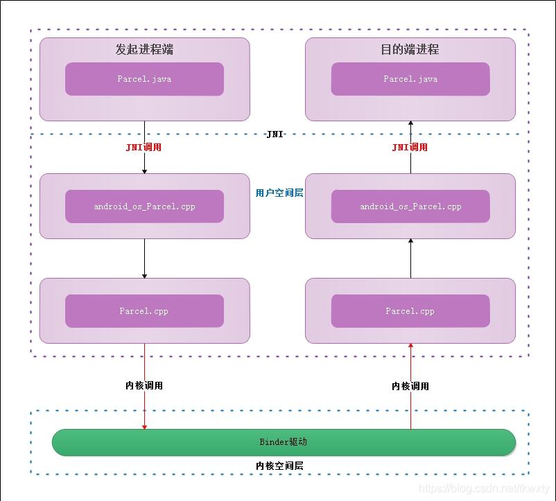
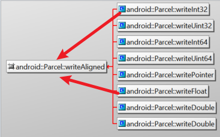

# 目录


# IPC前提------序列化

## **序列化的本质是啥？**

**Java序列化的本质是将Java对象保存为二进制字节码。-----> 进而可以传输 +  存储**

传输有哪些，传输为什么要序列化？
传输：网络传输、进程间通信IPC
为什么？---->
本质在于：同一进程间，对象的传递 <------> 传地址内存。。。同一进程有统一的内存
                    不同进程间，内存是独立的

存储为什么序列化？？（-----> 电脑上存储都是二进制的）

一座大厦好比一个对象，你要把这座大厦搬到另外一个地方去，你想直接挪肯定不行吧？(一般来说，只有传值，没有传对象)但我可以搬砖头吧，一个一个搬，然后搬到目的地重新组合成一个大厦，而序列化就起到了将大厦分成砖头的作用.

TODO：最底层逻辑，如何做到的呢？？？
TODO：为什么会很高效？？？没有序列化结构，只是序列化数据


补充:HW笔记


序列化结果:  字节序列


TODO:

> 序列化，底层的承载是啥？一个buffer吗？还是？


## 安卓序列化源码分析

--->Parcel序列化

### 0层

https://blog.csdn.net/tkwxty/article/details/107916160   内核




Todo：内核调用怎么理解？？？--->系统调用
           用户空间与内核空间怎么理解？？？


### J_parcel的获取与recycle()


```java
 //parcel.java
private static final Parcel[] sOwnedPool = new Parcel[POOL_SIZE];//1  6个对象的对象池

    public static Parcel obtain() {
        final Parcel[] pool = sOwnedPool;
        synchronized (pool) {
            Parcel p;
            for (int i=0; i<POOL_SIZE; i++) {
                p = pool[i];
                if (p != null) {
                    pool[i] = null;// 2 用了之后，引用置空--->但是有其他引用
                    if (DEBUG_RECYCLE) {
                        p.mStack = new RuntimeException();
                    }
                    p.mReadWriteHelper = ReadWriteHelper.DEFAULT;//todo:作用？？？
                    return p;
                }
            }
        }
        return new Parcel(0);//3 新建，没加入对象池里面！
    }
```

//1 用了对象池：1、由于parcel对象创建+释放的非常频繁---->消耗资源 2、不是轻量级对象

// 3 自然的，没加入代表在使用---->recycle时，有可能加入对象池（前提：有空位）,见#3_1

```java
    public final void recycle() {
        if (DEBUG_RECYCLE) mStack = null;
        freeBuffer();

        final Parcel[] pool;
        if (mOwnsNativeParcelObject) {
            pool = sOwnedPool;
        } else {
            mNativePtr = 0;
            pool = sHolderPool;
        }

        synchronized (pool) {
            for (int i=0; i<POOL_SIZE; i++) {
                if (pool[i]  null) {
                    pool[i] = this;// #3_1
                    return;
                }
            }
        }
    }

```

###   构造的过程是怎样的？


```java
//Parcel.java
    private Parcel(long nativePtr) {
        if (DEBUG_RECYCLE) {
            mStack = new RuntimeException();
        }
        init(nativePtr);
    }
```


### parcel与Ibinder的关系？？？


# TODO：序列化最终的承载的容器是什么？buffer？


```java
parce如何序列化的？----->  //化简之val信息流
     Parcel::writeChar(val) 
	      writeAligned(val) 
		      *reinterpret_cast<T*>(mData+mDataPos) = val;   // 一行关键代码

```


所有的write，最终都走到writeAligned：



writeAligned（**写入对齐**）


参考：

> https://blog.csdn.net/qq_32019367/article/details/122616157


# 从数据结构看Parcel

1、源码角度：

2、模型角度：

## Parcel.dataSize() 计算：

parcel**<font color='red'>数据量Parcel.dataSize()值为</font>：**

> 求和Σ （4（ 记录byte长度的int） + byte 数据本身）

**4是额外的开销，记录所用的byte长度**

以writeByteArray为例子：

```java
android_os_Parcel_writeByteArray{
   parcel->writeInt32(length); // 记录后面保存的byte长度
   memcpy(dest, ar + offset, length);
}
```

以Parcel::writeString16为例子：

```java
writeInt32(len); // 记录长度
memcpy(data, str, len);
```


# cpp Parcel的使用

[Android native进程间通信实例-binder篇之——用parcel传输数组 - 啊源股 - 博客园 (cnblogs.com)](https://www.cnblogs.com/songsongman/p/11097216.html)

https://blog.csdn.net/lxgwm2008/article/details/8767146       Android源码之Parcel

真正的序列化与反序列化接口  ------------>  byte[]

public final native byte[] marshall(); public final native void unmarshall(byte[] data, int offest, int length);

作用类似于序列化和反序列化。即将当前Parcel的数据序列化为byte数组，或者将byte数组反序列化到当前Parcel中。

注：unmarshall后，如果要读取数据，首先需要将文件指针移动到初始化位置，即setDataPosition(0)。

[Android native进程间通信实例-binder篇之——简单的单工通信 - 啊源股 - 博客园 (cnblogs.com)](https://www.cnblogs.com/songsongman/p/11097196.html)

--------------> 化简native Binder

## parcel

最后一定要加上setDataPosition(0)，将偏移指回最开始

https://developer.aliyun.com/article/919839

[Android 原生 Parcel 使用 - IT工具网 (coder.work)](https://www.coder.work/article/3235747)

## parcel的梳理

## 多参数函数，多参数如何序列化与反序列化的？-----分层分析

### 序列化流程：

```
 readParcelableCreator:3328, Parcel (android.os)
 readParcelable:3273, Parcel (android.os)
 readFromParcel:240, WindowConfiguration (android.app)
 <init>:224, WindowConfiguration (android.app)
 <init>:49, WindowConfiguration (android.app)
 createFromParcel:257, WindowConfiguration$1 (android.app)
 createFromParcel:254, WindowConfiguration$1 (android.app)
 readParcelable:3282, Parcel (android.os)
 readValue:3175, Parcel (android.os)
 readFromParcel:1956, Configuration (android.content.res)
 <init>:1976, Configuration (android.content.res)
 <init>:89, Configuration (android.content.res)
 createFromParcel:1964, Configuration$1 (android.content.res)
 createFromParcel:1962, Configuration$1 (android.content.res)
 readParcelable:3282, Parcel (android.os)
 readFromParcel:69, MergedConfiguration (android.util)
 relayout:1735, IWindowSession$Stub$Proxy (android.view)  // ----------->  这里
 relayoutWindow:7621, ViewRootImpl (android.view)
 performTraversals:2719, ViewRootImpl (android.view)
 doTraversal:2020, ViewRootImpl (android.view)
 run:8410, ViewRootImpl$TraversalRunnable (android.view)
 run:973, Choreographer$CallbackRecord (android.view)
 doCallbacks:797, Choreographer (android.view)
 doFrame:732, Choreographer (android.view)
 run:958, Choreographer$FrameDisplayEventReceiver (android.view)
 handleCallback:938, Handler (android.os)
 dispatchMessage:99, Handler (android.os)
 loop:223, Looper (android.os)
 main:7720, ActivityThread (android.app)
 invoke:-1, Method (java.lang.reflect)
 run:612, RuntimeInit$MethodAndArgsCaller (com.android.internal.os)
 main:997, ZygoteInit (com.android.internal.os)
```

client侧--------------------stub层代码

```
 //序列化流程：
 @Override public int relayout(android.view.IWindow window, int seq, android.view.WindowManager.LayoutParams attrs, int requestedWidth, int requestedHeight, int viewVisibility, int flags, long frameNumber, android.graphics.Rect outFrame, android.graphics.Rect outContentInsets, android.graphics.Rect outVisibleInsets, android.graphics.Rect outStableInsets, android.graphics.Rect outBackdropFrame, android.view.DisplayCutout.ParcelableWrapper displayCutout, android.util.MergedConfiguration outMergedConfiguration, android.view.SurfaceControl outSurfaceControl, android.view.InsetsState insetsState, android.view.InsetsSourceControl[] activeControls, android.graphics.Point outSurfaceSize, android.view.SurfaceControl outBlastSurfaceControl) throws android.os.RemoteException
 {
 android.os.Parcel _data = android.os.Parcel.obtain();
 android.os.Parcel _reply = android.os.Parcel.obtain();
 int _result;
 try {
   _data.writeInterfaceToken(DESCRIPTOR);  // 当前aidl类名：android.view.IWindowSession
   _data.writeStrongBinder((((window!=null))?(window.asBinder()):(null))); // writeStrongBinder直接write  Binder数据？  这一步跨进程了嘛？
   _data.writeInt(seq);
   if ((attrs!=null)) {
     _data.writeInt(1);
     attrs.writeToParcel(_data, 0);  //  LayoutParams数据写入parcel
   }
   else {
     _data.writeInt(0);
   }
   _data.writeInt(requestedWidth);
   _data.writeInt(requestedHeight);
   _data.writeInt(viewVisibility);
   _data.writeInt(flags);
   _data.writeLong(frameNumber);
   if ((activeControls==null)) {
     _data.writeInt(-1);
   }
   else {
     _data.writeInt(activeControls.length);
   }
   boolean _status = mRemote.transact(Stub.TRANSACTION_relayout, _data, _reply, 0); // 所有的数据进入了parcel，给了android.os.IBinder mRemote; // 【】 通过code指定函数
   if (!_status && getDefaultImpl() != null) {
     return getDefaultImpl().relayout(window, seq, attrs, requestedWidth, requestedHeight, viewVisibility, flags, frameNumber, outFrame, outContentInsets, outVisibleInsets, outStableInsets, outBackdropFrame, displayCutout, outMergedConfiguration, outSurfaceControl, insetsState, activeControls, outSurfaceSize, outBlastSurfaceControl);
   }
   _reply.readException();
   _result = _reply.readInt();
   if ((0!=_reply.readInt())) {
     outFrame.readFromParcel(_reply);
   }
   if ((0!=_reply.readInt())) {
     outContentInsets.readFromParcel(_reply);
   }
   if ((0!=_reply.readInt())) {
     outVisibleInsets.readFromParcel(_reply);
   }
   if ((0!=_reply.readInt())) {
     outStableInsets.readFromParcel(_reply);
   }
   if ((0!=_reply.readInt())) {
     outBackdropFrame.readFromParcel(_reply);
   }
   if ((0!=_reply.readInt())) {
     displayCutout.readFromParcel(_reply);
   }
   if ((0!=_reply.readInt())) {
     outMergedConfiguration.readFromParcel(_reply);
   }
   if ((0!=_reply.readInt())) {
     outSurfaceControl.readFromParcel(_reply);
   }
   if ((0!=_reply.readInt())) {
     insetsState.readFromParcel(_reply);
   }
   _reply.readTypedArray(activeControls, android.view.InsetsSourceControl.CREATOR);
   if ((0!=_reply.readInt())) {
     outSurfaceSize.readFromParcel(_reply);
   }
   if ((0!=_reply.readInt())) {
     outBlastSurfaceControl.readFromParcel(_reply);
   }
 }
 finally {
   _reply.recycle();
   _data.recycle();
 }
 return _result;
 }
```

总结：序列化过程可以看到：

（1）把当前Iwindow接口名、各个函数参数  ---------->  统一进入parcel

（2） 如何确定是哪个函数？ 通过code

---------------------> **合理性证明：以上都是约束、协议**

（3） 每一层做每一层的事情：

> AIDL级别： 序列化  多个参数（parcelable）<------------------>  与Aidl的反序列化一致
>
> 类级别：序列化类的内部属性 <------------------>  与类的反序列化一致

---------------------> 从这个角度来看：

> 为啥：L调用A，可以省去    AIDL级别 的序列化？？？？？？
>
> （1）因为反射的作用？？？？？？？
>
> （2）是不是也可以自己做一个 AIDL 链接 cpp-----java呢？

### 反序列化流程：

#### 如何寻找函数

Stub.onTransact  ——-->  函数code 4 找到对应relayout

给定 Parcel

#### 如何创建 参数（对象）-----createFromParcel

1、在AIDL编译出的java里(IWindowSession.java)

```java
//onTranction:

if ((0!=data.readInt())) { // TODO: 这里为啥是0呢？ 安卓在优化
    _arg1 = android.graphics.Region.CREATOR.createFromParcel(data);
  }
```

特点：

> （1）这里不存在反射
>
> （2）android.graphics.Region.CREATOR 类的寻找，是通过 脚本编译生成的java类完成的！！！！！！

2、似乎也有反射方法（<font color='red'>优化：提前缓存</font>）:

接口一：

> ```java
> HashMap<ClassLoader,HashMap<String,Parcelable.Creator<?>>> //  抄 
> Parcelable.Creator<?> readParcelableCreator(@Nullable ClassLoader loader) // --------> 接口作用：从 类名（比如Intent） 获取对应类的CREATOR
> // 创建creator，这里也是java反射 
> Field f = parcelableClass.getField("CREATOR"); 
> creator = (Parcelable.Creator<?>) f.get(null);
> ```
>
> 

<-------------在此之前 

```java
ClassLoader parcelableClassLoader = (loader == null ? getClass().getClassLoader() : loader); // Avoid initializing the Parcelable class until we know it implements // Parcelable and has the necessary CREATOR field. http://b/1171613. 
Class<?> parcelableClass = Class.forName(name, false /* initialize */, parcelableClassLoader);
```


> 场景： 传输的类是抽象类（或者父类），**接收端不知道是哪个具体子类！！！！！不好写死**
>
> ```java
> 反序列化ClientTransaction的过程中，parcel数据中带了一些 List<ClientTransactionItem> mActivityCallbacks---->  抽象类
> 这些callback可能是某个具体的子类，比如 TopResumedActivityChangeItem---->  具体类
> 接收端是没法在代码中写死的：比如TopResumedActivityChangeItem.CREATOR.createFromParcel
> ```
>
> TODO: 类名什么时候被序列化进去的？？？？？？


-<font color='red'>上述精髓：</font>

> 只缓存了类Intent的创建方式CREATOR  -------->  从Intent角度： 创建方式CREATOR只是其一个属性值（静态的），实际上是一个匿名类
>
> 创建方式是静态方法


接口二：

```java
<T extends Parcelable> T readParcelable(@Nullable ClassLoader loader)
// 直接读取，并创造下一个Parcelable类
```

调用栈：

```java
readParcelableCreator:3320, Parcel (android.os)
readParcelable:3273, Parcel (android.os)
readParcelableList:3053, Parcel (android.os)
<init>:204, ClientTransaction (android.app.servertransaction)
<init>:44, ClientTransaction (android.app.servertransaction)
createFromParcel:211, ClientTransaction$1 (android.app.servertransaction)
createFromParcel:209, ClientTransaction$1 (android.app.servertransaction)
onTransact:1276, IApplicationThread$Stub (android.app)
execTransactInternal:1159, Binder (android.os)
execTransact:1123, Binder (android.os)
```


## TODO： 从模型角度，利用了什么语言特性实现的Aidl接口？


# TODO：如何寻找到对端对象的？

AIDL编译出的stub  java文件

从java层来看：是拿到对端的代理proxy

从cpp层来看：


# 技巧之序列化调试

## 以偏概全 之parcel数据

（1）大小  dataSize() （2）前三位

