# 目录


#   0层

参考：  https://www.youtube.com/playlist?list=PLGmd9-PCMLhb16ZxeSy00qUsBazXgJyfM


*GoF*（Gang of Four），中文名——四人组


注意：<font color='red'> 很多原则核心都是抽取共同的！！！！</font>


抽象：面向对象的六大原则 ---->   具体应用：设计模式

关于分类，为啥设计模式是三类，<font color='red'>记忆</font>：

> 关于设计模式的三种类型，其实就是说的建筑： 建筑零部件（创建型模式）、链接节点（行为型模式）、最终结构（结构型模式）————》自然，必然如此，面向对象


# 面向对象设计的 目标：

1、 可扩展性  ：容易添加新的功能

2、灵活性  ：修改一个接口，不影响另一个接口的功能

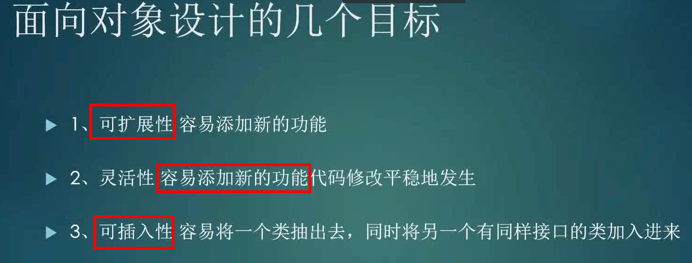


注意：整个设计模式/设计原则的出发点都是可扩展性，即日后方便修改

也就是说，**如果 日后不需要演进（修改、新增、删减），那么就不需要  设计模式/设计原则了**

**时刻提醒自己，从演进的角度看代码**


# 总体目标：高内聚，低耦合

>对象的要求！！！！！！


# 六大 设计基本原则：

由目标产生了具体的 原则：

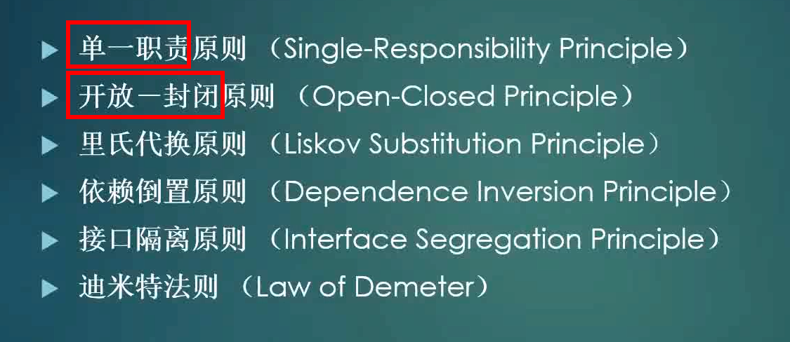

记忆： 


## 单一职责原则SRP：

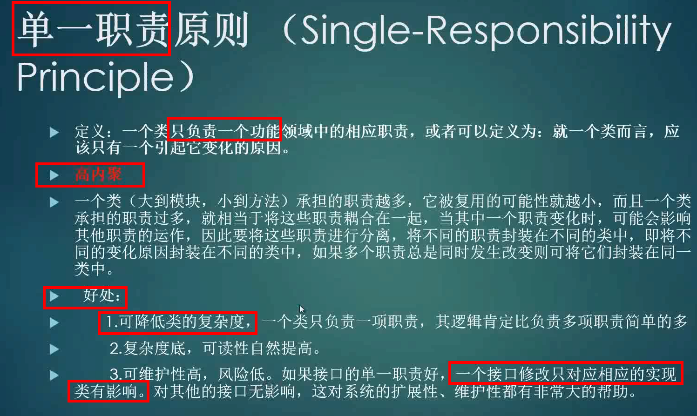

例子：

CustomerChart既查找数据库，又显示图表displayChart()

=> 问题：当数据库发生变化时，需要修改find方法=

用的哪个数据库 ，本来跟图表是没有任何关系的！！！！！

>  一句话 ：find不是图表的方法，图表只关心数据及数据的展示！！！！！！   抽取出find方法


抽取后：---->职责更单一

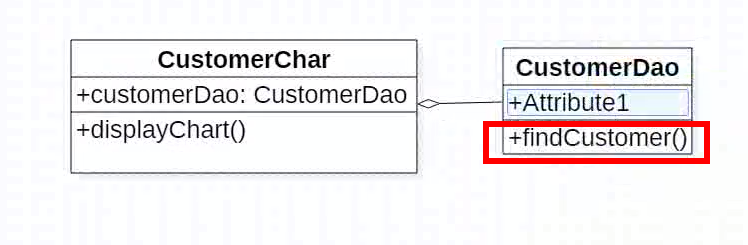


## 开放封闭原则OCP：

对扩展开放，对修改封闭


例子：

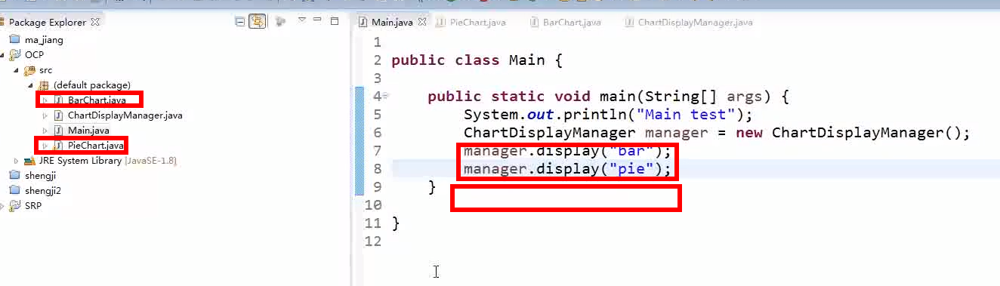


如果每 新增一种char， 需要修改manager和新chart两处的代码！！！！！------>   扩展时，修改了原有代码，违反了开闭原则


方法：

 抽取displayer方法到基类，manager.display() 方法入参为基类！！！

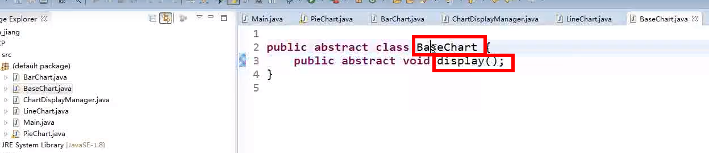

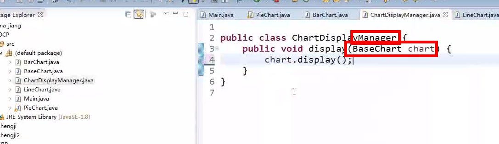

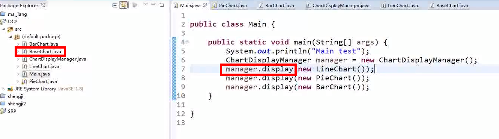

uml图：

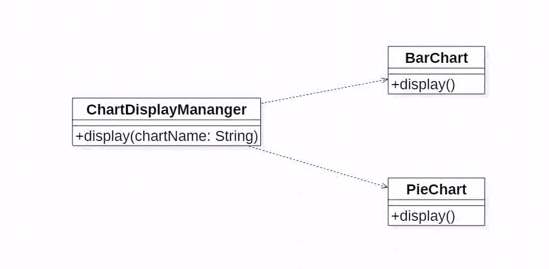

**扩展遇到的问题：**现在要增加一个PieChart，自然要修改 Manager(增加依赖)


解决问题的方法：
抽取display作为 基类：

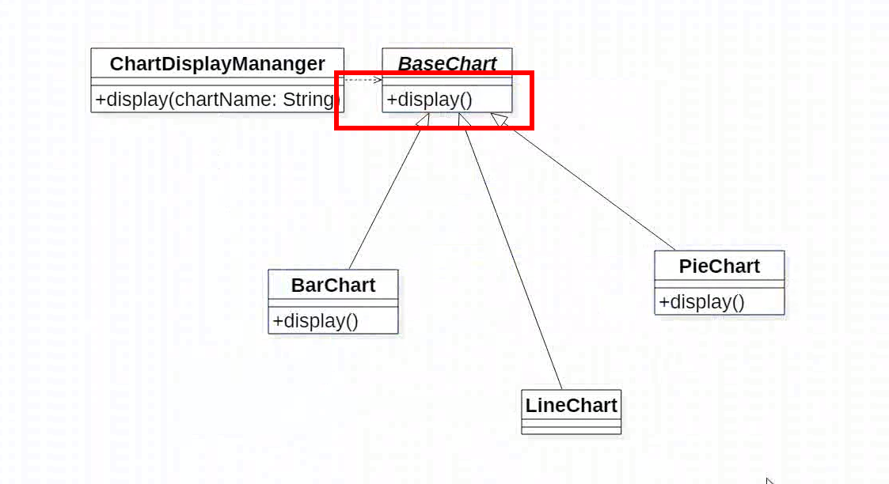

**上述uml的生活化模型：**

> 墙里电线（manager）如果直接依赖于 各种电器（各种chart），一但新增或者删除，必然影响到墙里电线（manager与chart之间的依赖）。
> 解决办法：  在两者之间加上一个无限大的 插座（抽象接口 BaseChart）。   需要新增电器就直接插入就好，不需要改动任何东西。
> 这就是把依赖于  具体对象   改成依赖于接口的好处


新增一个类时，原来所有代码不需要动！！！


开放封闭，<font color='red'>一句话总结：</font>
从uml角度：依赖于多个具体 ------》 变为 依赖于 多个具体的抽象基类（扩展时，基类就可不修改）。扩展没有修改的本质原因：依赖于抽象基类
从代码形式角度：<font color='red'> 向上</font>提取公因式（公因函数）---->  向上提取为抽象基类

这也就是，java代码有那么多抽象基类的原因。


TODO:  一个类的 不同函数中相同部分，也可以提取公因式


## 里氏替换原则LSP：

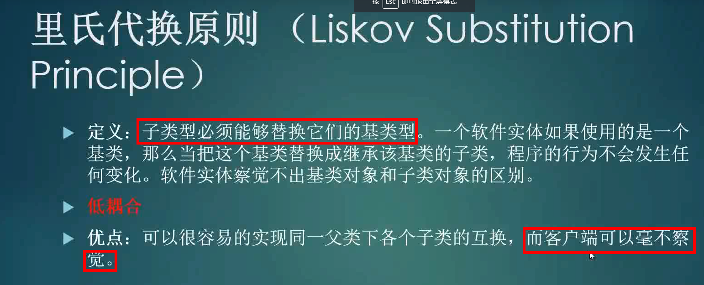

好的参考： https://blog.csdn.net/Weixiaohuai/article/details/102510273


一句 总结：

> 里氏替换原则，子类可以替换父类，程序不会发生行为的变化 （自然，~~推论：满足里氏原则，子类之间也可以替换~~）

一句话，本质：

> 里氏替换原则  <font color='red'>希望父子之间 只有复用，没有覆写</font>（自然，~~覆写抽象方法除外~~）
> 从代码运行角度：希望运行的永远是父类的代码，这样，就不存在 子类互换风险。

基于本质，我们的做法是：

> 1、子类中可以增加自己特有的方法，不覆写
>
> 2、如果子类实在要覆写
> 就把要覆写的函数提出为抽象基类（基类抽象方法）（自然，原先父子公共方法也提取至抽象基类）
> 原先父子都继承这个抽象基类
>
> ----->  即：<font color='red'>父子关系  转变为  兄弟关系。。。。强行不覆写</font>


从代码形式上来看：

> 就是将 覆写的方法，提取成为 抽象基类  ----->   提取公因式 成为抽象基类 （所以，java抽象基类多）


提取公因式角度：<font color='red'>一句话总结开放封闭原则与里氏替换原则：</font>

> 都是提取公因式，形成新的抽象基类


uml角度：EX1   子类一定要父类方法

> 参见： https://blog.csdn.net/Weixiaohuai/article/details/102510273
> 
>
> 需要新增一个ClassA 的子类，而且 ClassB就是一定要有自己的compare，所以会覆写
>
> -----》  提取公因式，孩子变兄弟
>
> 
>
> 


uml角度：EX2   子类一定不要父类方法（有时候就见到，子类覆写抛异常，不让调用的情况）  见：https://www.youtube.com/watch?v=DWkggQoxFeI&list=PLGmd9-PCMLhb16ZxeSy00qUsBazXgJyfM&index=6

 


需要新增一个玩具枪ToyGun 的子类，所以一定不要父类shoot杀人的功能

做法：提取公因式，没得提？？？？


里氏替换原则的一些推论：https://blog.csdn.net/Weixiaohuai/article/details/102510273
尽量不要从可实例化的父类中继承，而是要<font color='red'>使用基于抽象类和接口的继承</font>(也就是<font color='red'>面向接口和抽象编程</font>)。


## 依赖倒置原则

官方表述：

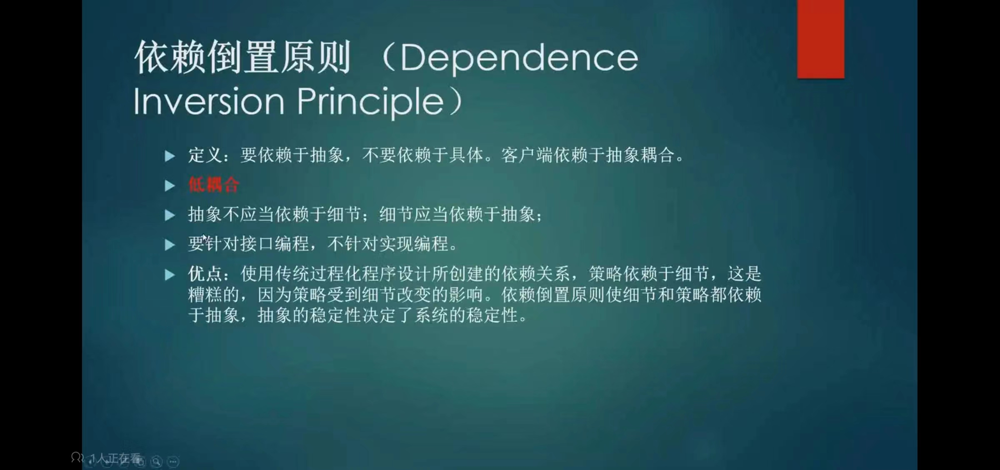


本质：<font color='red'>依赖于抽象</font>   ----》  非常非常基础的原则


例子：一开始将代码写成   妈妈看书


一旦日后演进，妈妈看 报纸。所要做的操作：
1、新增 报纸类

2、修改妈妈对报纸的依赖 ------》 **这个修改可以避免掉**

通过依赖抽象：


这种设计，后面 新增  妈妈看杂志 。只需要新增杂志类 继承于IReader即可


### 安卓例子  drawable


## 接口隔离原则

官方表述：


关注点： 依赖最小的接口

例子：找美女和模特模型

找美女：

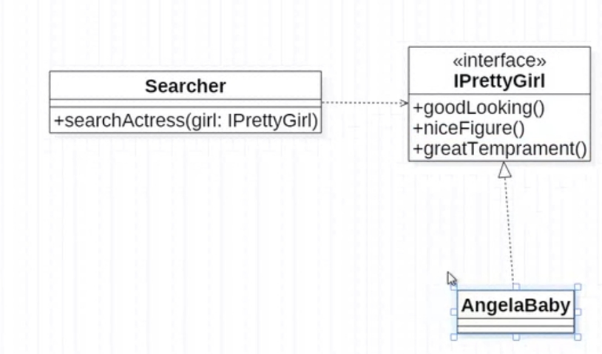

后面，找模特，自然不需要  上面 IPrettyGirl  这么复杂的接口
                           --------》 <font color='red'>抽取  IPrettyGirl  中接口，分成两个接口（接口隔离）</font>


记忆：

接口隔离原则<font color='red'>即拆分接口</font>
新增一个类，依赖接口的一部分方法。。。。这个时候，根据最小依赖原则，拆分接口


注意：
**很多设计原则，都是最小化思想**


## 迪米特法则

英文： Law of Demeter

官方表述：

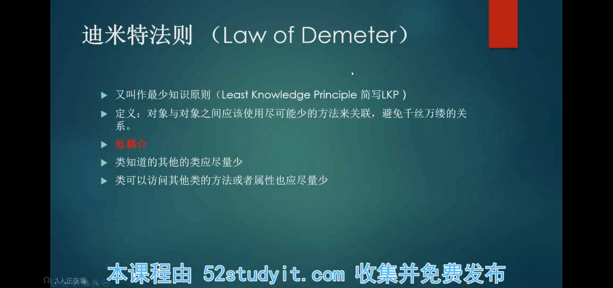

关注<font color='red'>点：</font>

即是最少 依赖 原则：

1、从某个类的角度来看，依赖其他类的个数最少。访问其他类的方法也尽量少。


生活化模型，
**迪米特吃汉堡包模型**：

lucy 吃汉堡包，如果自己做，那么依赖 汉堡包，牛肉，vegetable，面包...........

从lucy的角度来看： 这个依赖的类 相当多，造成结构关系复杂


**证明过程，自然**：依照迪米特法则-------》 减少依赖类的个数  ----》 实际上就是减少Lucy的功能，不做汉堡包了（交给其他人做），自己专心吃

​                                                           -----》 只吃


总<font color='red'>结：</font>
1、剥离一部分功能出来（做），**形成新的类。可以将原本的依赖个数减少**

​    **代价：新增了类**

2、迪米特法则，可以看到也符合单一职责原则

3、如果没有要新增Lily，其实只有Lucy，多依赖没有太大关系  ---------从修改角度

4、生活中，也许Lucy要吃 汉堡包 必须自己做 ------》  **但是这是代码，一定可以 抽象出其他人来做的**


自然，优缺点：


- 优点   <font color='red'>类间解耦</font>, 弱耦合, 耦合降低, 复用率提高;
- 缺点   类间的耦合性太低, 会<font color='red'>产生大量的中转或跳转类</font>, 会导致系统的复杂性提高, 加大维护难度;


### 符合迪米特法则的设计模式 TODO：


# 设计模式

## 创建型模式

### 单例模式 TODO

英文：Singleton Pattern

官方表述：

一个类只有一个实例


自然，<font color='red'>不得不</font>， 

1、外部各个地方私自构造 问题  --------> ~~将造方向私有化~~

2、有个静态方法，实例化

3、线程安全问题 ----->加锁


安卓中的例子：

在Android系统中，我们经常会通过Context获取系统级别的服务，如WindowsManagerService、ActivityManagerService等，

这些服务会在合适的时候<font color='red'>以单例的形式注册在系统</font>中，在我们需要的时候就通过Context的getSystemService(String name)获取。

------>  所以   Context 相当于一个 大管家


优点（依附于 例子）：

(1) `内存空间角度`：由于单例模式在内存中只有一个实例，减少内存开支，特别是一个对象需要频繁地创建销毁时，而且创建或销毁时性能又无法优化,单例模式就非常明显了

(2) `内存时间角度`：由于单例模式只生成一个实例，所以，减少系统的性能开销，当一个对象产生需要比较多的资源时，如读取配置，产生其他依赖对象时，则可以通过在应用启动时直接产生一个单例对象，然后永久驻留内存的方式来解决。

(3) 单例模式可以避免对资源的**多重占用**，例如一个写文件操作，由于只有一个实例存在内存中，避免对同一个资源文件的同时写操作

(4)`代码角度`： 单例模式可以在系统设置<font color='red'>全局的访问点</font>，优化和共享资源访问，例如，可以设计一个单例类，负责所有数据表的映射处理。

​                       <-------  相对于<font color='red'>使用对象</font>的好处


缺点：

(1) 单例模式没有抽象层，扩展很困难，若要扩展，除了修改代码基本上没有第二种途径可以实现。

(2) 单例类的职责过重，在一定程度上违背了“单一职责原则”。

(3) 滥用单例将带来一些负面问题，如：为了节省资源将数据库连接池对象设计为的单例类，可能会导致共享连接池对象的程序过多而出现连接池溢出；

又比如：在多个线程中操作单例类的成员时，但单例中并没有对该成员进行线程互斥处理。

（4）对于安卓，单例对象如果持有 Context，容易造成内存泄漏（）


#### 懒汉式


#### 饿汉式


####  双重检锁(推荐)


####  静态内部类实现单例模式(<font color='red'>非常推荐</font>)

-<font color='red'>对于java</font>，非常推荐这种方式-------------利用了Jvm的线程互斥（**很机智**）


比如：qing的util


#### 安卓代码中的单例模式

很多manager 只需要一个实例，

比如 

1、安卓的 ResourcesManager

```java
   // 
   public static ResourcesManager getInstance() {
        synchronized (ResourcesManager.class) {
            if (sResourcesManager == null) {
                sResourcesManager = new ResourcesManager();
            }
            return sResourcesManager;
        }
    }
```

2、注意：java侧的 serviceManager  不是 ---->  工具类

​               native侧的 serviceManager 是单例！！


#### 何时会使用单例（场景）？

结合例子体会：

（1）调用点，形式上： 当<font color='red'>调用点很多</font>  且<font color='red'>分散在 非常多个文件里</font>

------->  比如 context、manager

本质：**谁都能随时随地找到大管家**

（2）


#### 参考：

https://blog.csdn.net/qq_36639105/article/details/126745002


#### 单例模式的线程安全问题 -----单独讨论

1、静态变量方法--------------------<font color='red'>java保证（jvm保证）</font>（静态局部变量在 C++ 中具有线程安全的保证）

cpp保证（静态局部变量在 <font color='red'>C++ 中具有线程安全的保证</font>）

​    ---------> 本质上，利用的语言的线程安全性

**最优：**

> （1）本身是懒汉式（调用时，才创建，节省内存）
>
> （2）利用语言的线程安全性，没有**显示的加锁**

规定：只允许使用这种

参考：https://blog.csdn.net/zxf347085420/article/details/129528960

2、**饿汉式:** --------->  也是**线程安全的**（因为**单例对象被使用之前就已经创建好**）。但是浪费内存


### 简单工厂模式


 简单工厂模式：

>  可以根据参数的不同（一个参数）返回不同的实例
>  专门创建一个类来创建其他类的实例
>  被创建的实例通常具有共同的父类


生活化模型： 

> 具体工厂：手机工厂
> 具体产品：HW手机、苹果手机

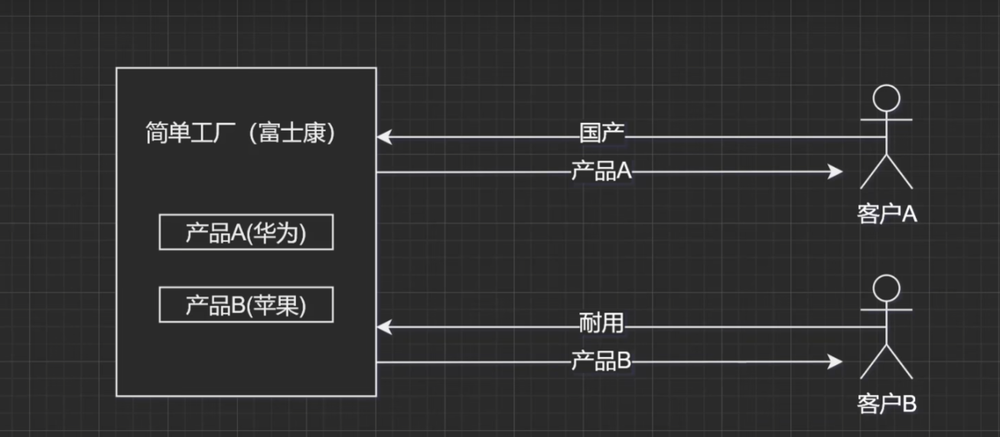

 

简单工厂中的角色:

> 1、抽象产品类
> 2、产品子类
> 3、 工厂类

uml：

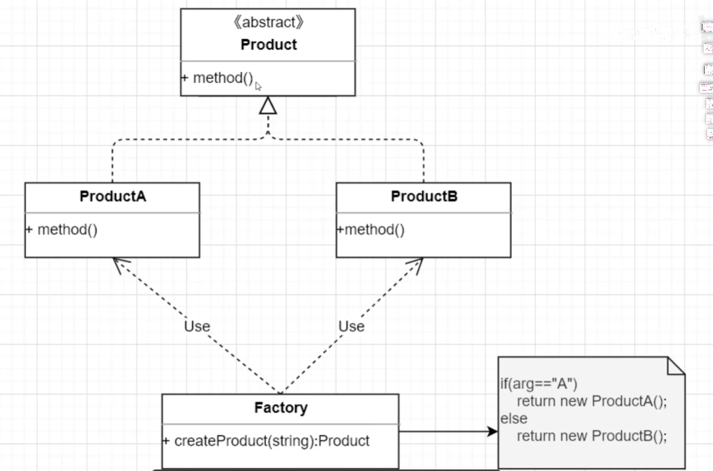


```java

// 抽象产品
abstract class Product{
    public void use() {
	}
}

// 具体产品A
class ProductA extends Product {
    public void use(){
        System.out.println("使用了产品A");
    }
}

// 具体产品B
class ProductB extends Product {
    public void use(){
        System.out.println("使用了产品B");
    }
}

class Factory{ // 	工厂
​    public static Product createProduct(String type){
​        if (type.equals("A")){
​            return new ProductA();
​        }else if (type.equals("B")) {
​            return new ProductB();
​        }
​        return new ProductA();
​    }
}
```

优点，<font color='red'>对比new的形式：</font> （或者说要解决的问题：）

1、把对象的创建交给工厂，客户端不用关注 --->    **建造与使用分离，实现解耦**
       注意：<font color='red'>与建造者模式的区别在于： </font>工厂模式，客户端只会指定某一个Product，比如 "A"  ；**而 建造者模式，会传入很多参数**

缺点：（<font color='red'>即是后面要改进的</font>）

基于生活化模型，可见，**站在工厂的角度，如果新增小米手机**，要修改工厂的代码，**违背了开闭原则**


自然，工厂模式适用的一些场景(对比直接New):
1、对象的创建过程/实例化准备工作**很复杂**,需要初始化很多参数、查询数据库等。  ---------》 每次new的时候，创建会用很多行；工厂模式将<font color='red'> 创建的复杂代码封装</font>进工厂对象里

2、类本身有好多子类,这些类的创建过程在业务中容易发生改变,或者对类的调用容易发生改变。


**从代码形式上，相比于new，其本质：**

> 就是将new的复杂代码，封装


#### 与建造者模式的区别


#### 采用反射机制，可以解决开闭原则？TODO


#### java中的例子TODO


####  简单工厂问题/特征： 一个具体工厂，生产多个具体产品

所以，新增产品时，违背开闭原则


### （普通）工厂模式 

英文：  Factory pattern

基于简单工厂模式，为什么要有普通工厂模式？
因为前文提到 **前者违背了开闭原则**。**修改方法：将工厂内部的修改，用继承的方式下沉到子类里：**-------》 （<font color='red'>注意：这似乎是一个 通用规则：利用 继承方式体现差异化，同时满足开闭原则</font>）
1、自然，~~下沉后，工厂变抽象工厂（客户依赖抽象的工厂）~~

2、自然，~~下沉后，实例化由 工厂子类完成。~~


从uml，<font color='red'>本质： </font>

> **抽象的工厂生产 抽象的产品；具体的工厂 生产对应的具体的 产品**  ----》 <font color='red'>记忆，本质： 抽象生产抽象，具体生产具体</font>
>
> 

客户端用  FactoryA 生产 ProductA


**生活化模型：**

> 抽象工厂：手机工厂
> 具体工厂：HW手机工厂、苹果手机工厂
> 具体产品：HW手机、苹果手机


基于生活化模型，
优点(比简单工厂模式):

> 1、符合开闭原则。即需要增加生产小米手机，只需要在新增一个小米手机具体工厂

缺点：

> 1、太过浪费，一个工厂只能生产一个产品，即 生产手机，就不能生产平板


**从代码形式上**，相比于 简单工厂，其本质：

> 一个具体工厂，生产一个具体产品


#### jdk中的应用：

抽象的工厂Collection生产 抽象的产品Iterator；具体的工厂ArrayList 生产对应的具体的 产品Itr


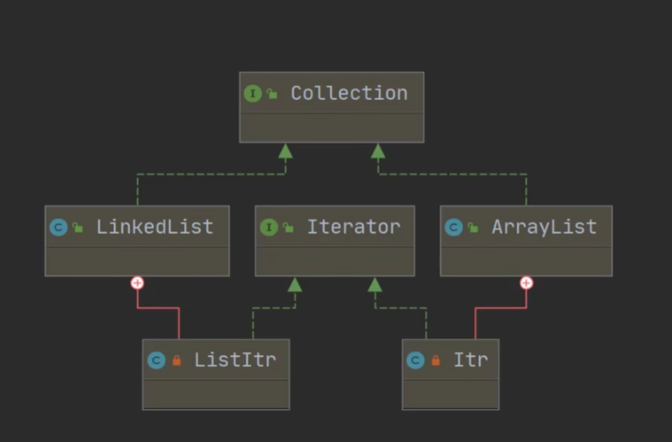


```java
public interface Collection<E> extends Iterable<E> {
    Iterator<E> iterator(); // 抽象Collection生产抽象Iterator
    boolean add(E var1);
    boolean remove(Object var1);
}
```


####  普通工厂问题/特征： 一个具体工厂，生产一个具体产品

矫枉过正，一个工厂只能生产一个产品

#### 安卓工厂模式的应用:

有什参考： https://blog.csdn.net/weixin_35092037/article/details/117346981  

抽象的Activity生产抽象的view。具体的MainActivity生产具体的ViewGroup。

----》 工厂方法是onCreate 


### 抽象工厂模式

英文： Abstract Factory Pattern

要解决的问题：

> 普通工厂模式：  抽象生产抽象，具体生产具体  -------》 那还有什么问题呢？ 原因在于 具体的   FactoryA<font color='red'>只能</font> 生产 ProductA
>
> ​                        一个产品对应一个具体工厂是很浪费的。比如生产 **手机和平板， 是可以在同一个具体工厂内完成（复用相同功能的代码）**


优点，相比于普通工厂模式：参考https://www.cnblogs.com/it-deepinmind/p/13283562.html  
1、 相似的 一类产品族，可以放到一个具体工厂中生产
          <font color='red'>记忆： 即一个工厂，有多个流水线</font>

缺点：

1、违背了开闭原则：新增产品，抽象工厂和具体工厂（**即所有工厂类**）都新增了  创建新产品的方法


注意：

> 如果一个具体工厂，生产的两个产品之间不相似（没有代码复用的可能），比如 生产手机和生产口罩
>
> ----》  应该拆成两个工厂，即使用普通工厂模式

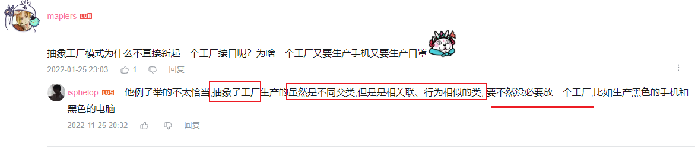


#### 安卓中的例子： TODO


####  普通工厂特征： 一个具体工厂，生产一个具体产品

**介于简单和普通之间，一个工厂能生产相似的一类产品**


### ------比较 简单、普通、抽象工厂模式-----

参考视频： https://www.bilibili.com/video/BV1524y1y79F/?spm_id_from=333.337.search-card.all.click

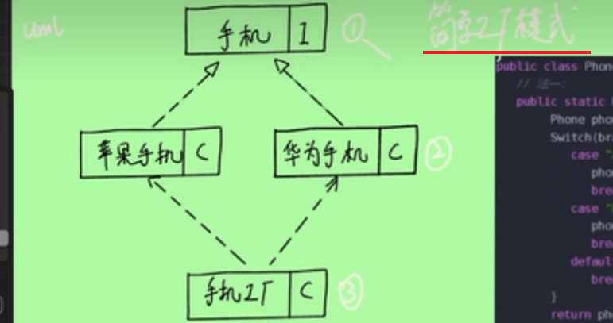


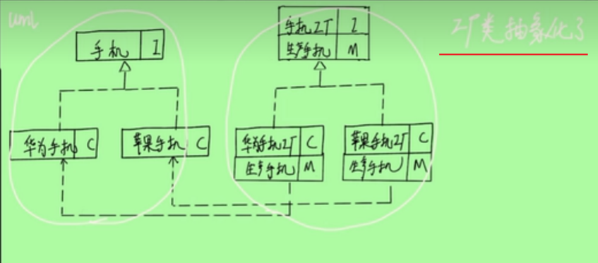


### 建造者模式（生成器模式）---重点

参考链接：
https://blog.csdn.net/nugongahou110/article/details/50395698   ---》 好文：**一步一步解释了为啥用建造者模式**

https://blog.csdn.net/u011814346/article/details/70312214?spm=1001.2101.3001.6650.15&utm_medium=distribute.pc_relevant.none-task-blog-2%7Edefault%7EBlogCommendFromBaidu%7ERate-15-70312214-blog-119713865.pc_relevant_default&depth_1-utm_source=distribute.pc_relevant.none-task-blog-2%7Edefault%7EBlogCommendFromBaidu%7ERate-15-70312214-blog-119713865.pc_relevant_default&utm_relevant_index=18


要解决的问题，<font color='red'>直接new的问题：</font>

> **构造函数 把 表达 与 构造绑死了，造成表达不灵活**   解释见下


一句话<font color='red'>，记忆：</font>

**建造者模式解决的就是表达灵活性问题**


英文： Builder Pattern

官方表述：

> ****


生活化模型：

> 建造一台电脑：装机人员Builder根据  用户 Client 需求进行沟通。装机人员将电脑的主机划分成各个部件：CPU（必选）、内存（必选）、硬盘（必选）、音响（可选）、鼠标（可选）、鼠标垫（可选）
>                        根据用户的指定各种参数setXXX，装机人员 一把组建build电脑。（**再找装机人换内存，不会鸟你了**）

建构与表示分离： https://blog.csdn.net/langfeiyes/article/details/124142430  TODO

> 表示：即用户指定的 CPU（i7）、内存（DDR4 48g）、硬盘500G、音响一个、鼠标一个、~~鼠标垫不选~~  即set
>
> 构建：装机人员帮忙装机，组装成一台电脑，即build

分离：可见这是两个部分嗯，隔离了：
            1、<font color='red'>表示set多少个属性，与构建过程完全没有关系</font>。 即： 这样使得**同样的构建过程 可以  创建出不同的表现。**
            2、为什么要隔离？<font color='red'>变与不变的相隔离，自然</font>：~~隔离左边是 剧烈变化的，右边是稳定不变的~~

 

****

直接new 对象 的问题：

> **做不到**  构建与表达 隔离：
>
> ```java
> // https://blog.csdn.net/nugongahou110/article/details/50395698
> public class Student {
>     private final int stuId;//必须
>     private final String name;//必须
>     private final int age;//可选
>     private final int gender;//可选
>     private final int address;//可选
>     ...//还有很多可选属性
> 
>     public Student(int stuId,String name){ //【1】
>         this(stuId,name,0,1,"");
>     }
>     public Student(int stuId,String name,int age){ // 【2】
>         this(stuId,name,age,1,"");
>     }
>     public Student(int stuId,String name,int age,int gender){
>         this(stuId,name,age,gender,"");
>     }
>     public Student(int stuId,String name,int age,int gender,String address){
>         this.stuId = stuId;
>         this.name = name;
>         this.age = age;
>         this.gender = gender;
>         this.address = address;
>     }
> }
> 
> ```
>
> 所有的构造方法，都将 表达（参数）与 构造 绑定了，比如【1】要求表达一定有  stuId 和 name
>
> 所以new的构造方式<font color='red'>问题在于： 表达不灵活了，都被构造函数的参数限定死了</font>
>
> 为了表达的灵活性，表示出可选与必选：
>
> 【1】表达了必选的含义  【2】表达了age可选的含义，，，但是四个构造函数  远远不够， **应该需要  2的3次方个构造函数** ---》 太多了
>
> 这里也说明了**：当参数不多的时候，可以用不同构造方法表达灵活性**。---》 过多时，只能用builder


适用场景:


> 其建造的东西,  是<font color='red'>由多个东西组合</font>而成(显示上就是多个参数)-----》主要如何组合是由外界决定(工厂模式, 如何组合不是由外界决定?)


UML:

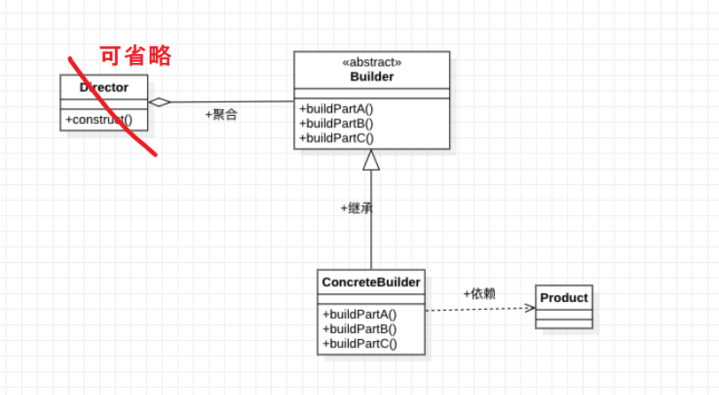


代码特征：

```java
建造者模式的格式如下:
·目标类的构造方法要求传入Builder对象 //【】 自然，目标类的构造函数应该是private， 不给外面用。
·Builder建造者类位于目标类内部且用static描述
·Builder建造者对象提供内置属性与各种set方法,注意set方法返回Builder对象本身  
·Builder建造者类提供build()方法实现目标类对象的创建 //【】
```

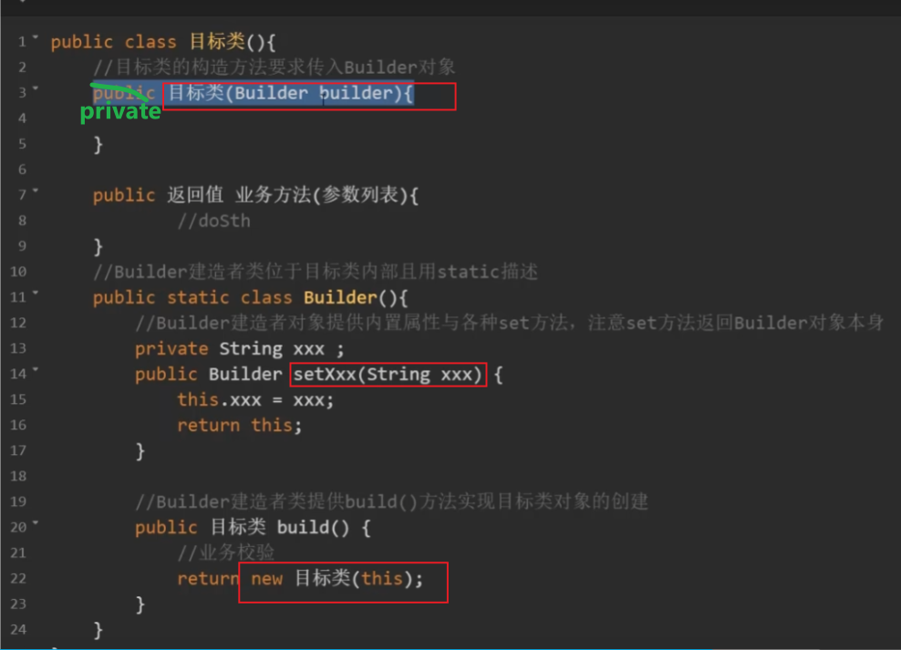


使用：

```java
// 在客户端代码中:
new Builder().setA("a") // partA
             .setB("b") // partB
             .setC("c")
             .......
             .build()
             
```

1、通过把参数一个个set 给builder，然后统一一次 build。

2、Set方法 return this

从生活模型中(~~从代码可以看出~~)，build一把做的。
自然：之后再 set 是无效的（再找装机人换内存，不鸟你了。只有build才真正有效），只给了builder，<font color='red'>保护了 “不可变对象”的密封性</font>


基于生活化模型优缺点： https://blog.csdn.net/a734474820/article/details/128386628?spm=1001.2101.3001.6650.2&utm_medium=distribute.pc_relevant.none-task-blog-2%7Edefault%7EYuanLiJiHua%7EPosition-2-128386628-blog-119713865.pc_relevant_default&depth_1-utm_source=distribute.pc_relevant.none-task-blog-2%7Edefault%7EYuanLiJiHua%7EPosition-2-128386628-blog-119713865.pc_relevant_default&utm_relevant_index=5

> 优点：
>
> 1、良好的封装性，使用建造者模式可以使**客户端不必知道产品内部组成的细节**；
>
> 2、**变与不变相隔离。变的部分，有很好的灵活性**  
>
> 2、易于拓展：<font color='red'>增加新的具体创建者</font>无需修改原有的内部代码，符合开闭原则。
>
> 缺点：
>
> 产生多余的Builder以及Director对象，消耗内存；


代码上的优点：

> 1**、建造者模式很好的表达了可选与必选**：<font color='red'> Builder构造方法是必选。Set方法可选。</font> ---》 技巧
>
> 
>
> 2、通过build可以很明确的告诉别人，我们的对象已经创建完毕。


代码形式的记忆：

> 从代码形式上看，**先创建了一个内部student类（即builder）。再把这个内部对象赋值给student**。---》 这也就解释了为啥setXXX方法有两套。


#### 关于builder的线程安全 TODO

https://blog.csdn.net/nugongahou110/article/details/50395698

先new  再校验参数

#### 与工厂模式的区别:

相同点：
1、都是给客户端构造对象的

Builder 跟 Factory 是不是很像？？？


工厂模式:  客户端代码中，只是指定了 生产哪种产品。<font color='red'>大量的参数封装在工厂中？</font>

建造者模式:  <font color='red'>客户端代码中设置了大量参数</font>

**建造者模式注重零部件的<font color='red'>组装</font>过程，而工厂方法模式更注重零部件的创建过程。**     https://blog.csdn.net/qq_26460841/article/details/119713865


#### 安卓建造模式的应用1：从JDK的StringBuilder

#### 安卓建造模式的应用2：AlertDialog

详细代码：

```java
// 使用
AlertDialog.Builder builder = new AlertDialog.Builder(this).setIcon(R.mipmap.ic_launcher).setTitle("")
                .setMessage("").setPositiveButton("确定", new DialogInterface.OnClickListener() {
                    @Override
                    public void onClick(DialogInterface dialogInterface, int i) {
                    
                    }
                }).setNegativeButton("取消", new DialogInterface.OnClickListener() {
                    @Override
                    public void onClick(DialogInterface dialogInterface, int i) {
                       
                    }
                });
        builder.create().show();

```

为什么用建造者模式呢？其实就是方便用户使用的时候，知道要传哪些参数，方便且正确。


### 原型模式 TODO


## 结构型模式


### 代理模式

生活化模型：

> 张三躲到 寺庙里不想见人，  所有事情， 由其管家代理 通知 张三

目的(基于生活化模型)：

> ~~控制对对象的访问（站在被代理对象的角度）~~---》 自然，~~张三不想被打扰~~
>
> 补充：站在client来看，没啥意义。但对于被代理对象，很有意义，保护了被代理对象


UML:


EX1:

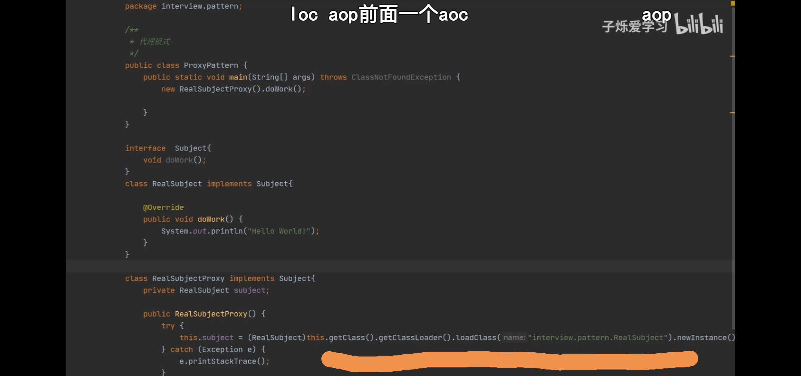


EX2:
上网代理


**和装饰器的区别:**

> 侧重点不同：一个是功能扩展。一个仅仅做一层代理

#### 安卓代码的例子

安卓例子：
1、远程调用AIDL。反推代码：


2、网络服务（跨设备了）


### 适配器模式

一句话理解:

> 适配器模式，就是转换，把不能直接用的数据，转换成能用的。  <font color='red'>本质上，是一个不得不的东西</font>

生活模型：

> 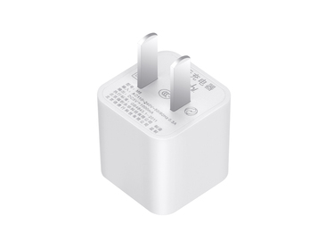
>
> 
>
> 电源适配器。  我想要直流电给手机充电，但是 目前有的是交流电，所以需要一个 适配器，把交流转直流
> 可以这样表达：
> 直流电适配器(交流电) ----》 即是直流电
> 自然，~~适配器，必然实现输出直流电的接口（抽象接口）~~

为什么要这样做？不得不的理由是什么？


UML：涉及的角色：

> 适配器模式涉及了三个角色：
>
> ①Target(适配器接口)：
>
> ②Adaptee(被适配角色)：
>
> ③Adapter(具体适配器)：
> 


实现方式：

> 即<font color='red'> 拥有别人能力的方式，自然：</font>
> 1、<font color='red'>组合</font>方式：Adapter(A_Structure)   ~~即： 把被适配对象放到适配器里~~
> 2、<font color='red'>继承</font>方式：通过继承，拿到 被适配对象的能力   
>
> 注意： 使用继承方式时，Adapter  extends Adaptee  implement Interface
>
> ​             -----》可见，Adapter是一个既A又Z的东西
>
> 推论：对于继承方式   A extends B ，我们认为 A就是B
>
> ​            组合方式，  A(B), B 成为A一个持有的对象 ----》  理解上，化简为：<font color='red'>没有B，</font>B的能力都给了A  (有点儿向内部类)


> Z如果想要用Andriod的数据结构，不能直接用。做一个Adapter 转Z可以使用的数据结构
>
> Adapter(A_Structure)


代码EX2： 视频教程：https://www.bilibili.com/video/BV1Hz411e7sA/?-Arouter=story&buvid=XYA50C4AE9D0FD435535889530C0CC38FFE8A&is_story_h5=false&mid=3rb72hWRTB8TwF8P3lhSvg%3D%3D&p=1&plat_id=163&share_from=ugc&share_medium=android&share_plat=android&share_session_id=b529db63-da75-4196-b81b-9ac27310644a&share_source=WEIXIN&share_tag=s_i&timestamp=1675149493&unique_k=jdoUprV&up_id=59546029  
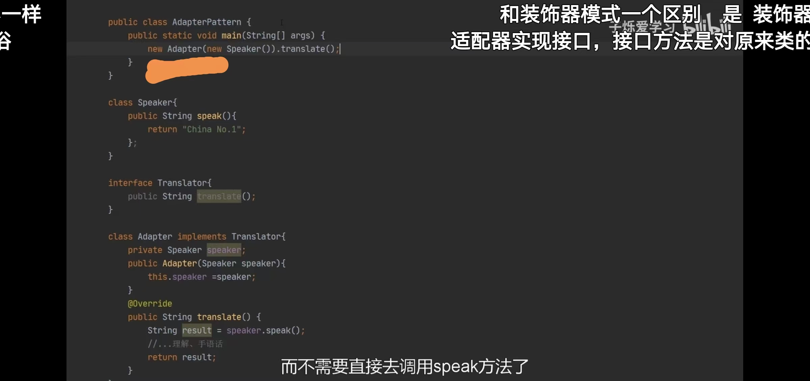


EX3：安卓例子 TODO!!!!

https://blog.csdn.net/zenmela2011/article/details/124591585


TODO:
适配器模式与装饰器模式区别？

#### 安卓代码的例子


### 装饰器模式 TODO

装饰器模式:
扩功能两种方式:
1、继承方式,在子类中扩展
2、关联方式,把原来的类嵌入到新的类里,比如,把机器人装进箱子,箱子里装上手和脚---》即装饰器模式
静态?动态?为啥更加灵活?
优缺点:


### 组合模式  

参考：
https://www.jianshu.com/p/2ef80f857153  


**作用：**
将类和对象组装成 一个较大的  结构（**必定是树形结构**） ---->  <font color='red'>所以，组合模式，是一种组织的方式</font>

**生活化模型：**

> 树进行光合作用 -----》  <font color='red'>记忆：组合树</font>
>
> 如何组织一棵树？即树干（容器） :   容纳树叶及叶子
> 整体是树干，局部也是树干
>
> 
>
> 
>
> **效果：**
> 整体与局部具有同样功能
> ------》 不得不：自然：~~整体和局部有相同的功能和接口~~
>
> **模型推论，自然：** 
>
> 1、树干的方法：
> 树干是容器，自然，~~有 管理子元素的方法，add和remove~~
> 树干需要向下传递工作，自然，~~有工作的 方法~~
>
> 2、自然，~~具体工作光合作用只能leaf 完成；树干 只是向下传递工作，最终传给子元素（子树干和叶子）~~
>
> ​    自然，树干和叶子都继承 光合作用的接口


uml：
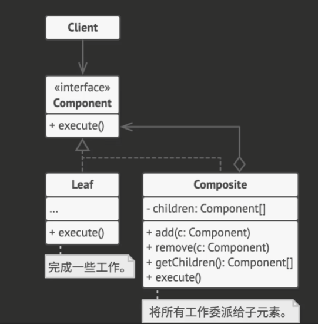


**适用范围**：
任何可以组织为 树结构的。EX1: 统计全国人数

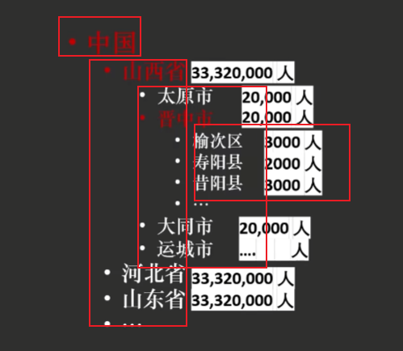

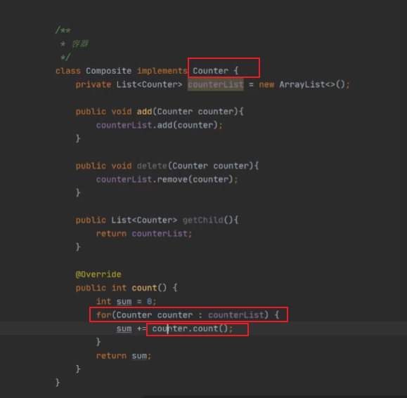

EX2:
安卓中View 和 ViewGroup 是典型的组合模式

基于模型（<font color='red'>创造知识</font>）反推安卓代码：

1、反推1：~~如何组织一个界面所有控件呢？用树可以~~  自然

2、反推2：~~树 可以用 组合模式组织~~  自然

3、反推3：~~控件和控件容器用组合模式--->  控件容器 必然有addview，remove~~  自然
                   必然有哪些工作方法呢？TODO


**符合六大原则哪些：**
符合开闭原则？


### 桥接模式

参考：
https://blog.csdn.net/qq_16240393/article/details/89304453?spm=1001.2101.3001.6661.1&utm_medium=distribute.pc_relevant_t0.none-task-blog-2%7Edefault%7ECTRLIST%7ERate-1-89304453-blog-103319743.pc_relevant_aa&depth_1-utm_source=distribute.pc_relevant_t0.none-task-blog-2%7Edefault%7ECTRLIST%7ERate-1-89304453-blog-103319743.pc_relevant_aa&utm_relevant_index=1    《Android源码设计模式》之桥接模式

https://www.bilibili.com/video/BV1Pp4y167DG/?spm_id_from=333.337.search-card.all.click&vd_source=3eebd10b94a8a76eaf4b78bee8f23884    五分钟学设计模式.21.桥接模式

https://www.bilibili.com/video/BV1vU4y117qL/?spm_id_from=333.337.search-card.all.click&vd_source=3eebd10b94a8a76eaf4b78bee8f23884   


**桥接模式的要解决的问题，即使用场景：**
多维度变化类，新增时，类暴涨问题。
比如：两个维度：种类 m*n   -----》  如果要新增一种，则 文件、类爆炸式增长


例子：华为曲面屏手机<font color='red'>类 </font> ----》 明显是两个(三个)维度的<font color='red'>类</font>

维度一：水滴屏、挖孔屏、曲面屏  ----》  抽象为  屏幕形式

维度二：华为、小米、vivio ----》抽象为    手机品牌

------》  类的个数：m*n，新增 oppo的手机，会新增三个类
其实，这个是自然的，因为生活中，就是如此： 华为水滴屏手机P30、华为曲面屏手机Mate30


将抽象与实现分离，使他们可以独立变化。
用组合关系，替代继承关系


疑问：
为什么叫桥接?  两个维度，为什么叫抽象和具体？
精髓在于，独立开，单独演进；类的个数减少
手段：以组合方式替代继承关系


#### 代码中的列子


### 享元模式 

字面记忆：**原本**是多个元素，现在共享一个元素 -------享元

英文： Flyweight Pattern

生活中模型：  共享单车----即享元
好处：减少了整个社会的资源开销（只有一辆车）
特征：原本应该是两个对象，现在一个对象，被<font color='red'>重复使用了</font>（自然，对象内部包裹的内容，是变化的）
         特别 注意：享元**隐含着**的意思/前提条件：<font color='red'>原本应该</font>是两个对象    ----> 比如：妈妈使用家里的锅，我使用家里的锅。这个锅本身就应该是一个，家庭级别的。所以，不是享元模式


uml图：


三个角色的理解：

1、共享单车模型：  
车子：享元、
车的其userName：不可共享的

----------->   两者共同 组成  client 所使用的车

享元工厂：美团

**2、安卓msg**

msg 空的对象：享元

msg 内的各种属性值：不可共享的

----------->   两者共同组成 msg

**从信息的角度看，享元模式的 精髓：  更新对象里的数据，不更新对象本身**


优点：
可以极大的减少创建对象的数量，使得相同或者相似对象在内存中只保留一份。
~~即1、可以大大节约内存资源和系统开销~~
    2、对于<font color='red'>快速频繁创建</font>的对象，解决了内存抖动问题


 享元模式的缺点：

（1）为了使对象可以共享，需要将一些状态外部化，这使得程序的逻辑复杂化。

（2）享元模式需要额外维护对象缓存池。


使用场景：

> 1、
>
> 2、短时间内频繁创建的对象


#### 安卓中的享元模式的例子：

java：字符串常量、线程池、
安卓：Messege、recycleView复用机制、手机相机预览图片(跟recyleView好像)

​            对象池（parcel、Messege、）


#### 享元模式之 安卓  msg

享元模式：对于<font color='red'>快速频繁创建</font>的对象，解决了内存抖动问题(即 ~~Memory Churn 问题~~)


参考：  https://blog.csdn.net/zenmela2011/article/details/125070508

现象：
频繁创建对象（内存迅速攀升）--->  达到一定临界程度，又会触发GC（内存使用迅速减小）---》之后又，，，，，，
即短时间内造成内存使用的迅速攀升于迅速衰减

例子：
msg、binder、如果在view.onDraw里创建对象（每次重新绘制都会触发，16.7ms一次）
大循环里创建对象

原理：
短时间(抖动)内产生一批  使用一次的对象，会被分配内存，当数量达到一定的时候，垃圾内存会触发GC，------》 这一刻，就会骤减

内存抖动的<font color='red'>危害：</font>  总之，<font color='red'>时间上，空间上</font>

1、内存抖动伴随着频繁的GC，而GC有一个特性，就是STW(<font color='red'>stop the world</font>)，STW就**会使程序（表现为界面卡顿）出现卡顿**。(<font color='red'>GC会占时间</font>)
----》 ~~<font color='red'>根本原因：不能频繁的GC，GC 会占用时间</font>~~   
2、导致OOM： 抖动太厉害的时候，此时如果新建一个大对象（比如5M）时，就会出现内存溢出OOM（内存碎片会造成无法提供连续的内存空间）
-----》  ~~<font color='red'>根本原因：内存抖动会产生内存碎片</font>~~


安卓  msg 复用具体代码：

```java
// Message.java
void recycleUnchecked() {
        what = 0;
        arg1 = 0;
        arg2 = 0;// 数据置空
 

        synchronized (sPoolSync) {
            if (sPoolSize < MAX_POOL_SIZE) {
                next = sPool; // 这里,把next指针,指向sPool,成为spool的头结点
                sPool = this; // // 当前加入线程池：sPool是头结点,供全局使用的(自然,一定是静态的)
                sPoolSize++;
            }
        }
    }
```

所以，msg存在两个 链表：

> 一个通过表示 queue
>
> 另一个sPool，是对象池


#### 安卓检测工具：profiler检测内存抖动

可截取某段时间进行对象分析，查看哪些对象被频繁创建。---》  TODO: 实操一下


解决办法：
1、大循环引起的内存抖动，解决办法就是将对象创建放到循环外，
2、对于无法避免的创建对象情况，可采用<font color='red'>对象池模型进行缓存，复用对象</font>，~~需注意用完后要手动释放对象池中对象~~

3、其他：
https://blog.csdn.net/m0_64420071/article/details/127303447?spm=1001.2101.3001.6650.7&utm_medium=distribute.pc_relevant.none-task-blog-2%7Edefault%7EBlogCommendFromBaidu%7ERate-7-127303447-blog-125070508.pc_relevant_recovery_v2&depth_1-utm_source=distribute.pc_relevant.none-task-blog-2%7Edefault%7EBlogCommendFromBaidu%7ERate-7-127303447-blog-125070508.pc_relevant_recovery_v2&utm_relevant_index=10


### 外观（门面）模式 TODO


## 行为型模式


### 责任链模式


生活化模型：

> 请假责任链：张三请假，根据请假不同的天数，不同人去审批
>
> 


一句话<font color='red'>记忆：</font>
责任链，本质就是处理链

明显的<font color='red'>特征：</font>
1、有链条（**责任链可能是一条直线，一个环链或者一个树结构的一部分**。） 
2、真正的处理者，只会是链条上的某一个


官方表述：
责任链模式是一种处理请求的模式。他让多个处理器都有机会处理该请求，直到其中某个处理成功为止。责任链模式把多个处理器串成链。然后让请求在链上传递


**UML**： 特征，有链条 next

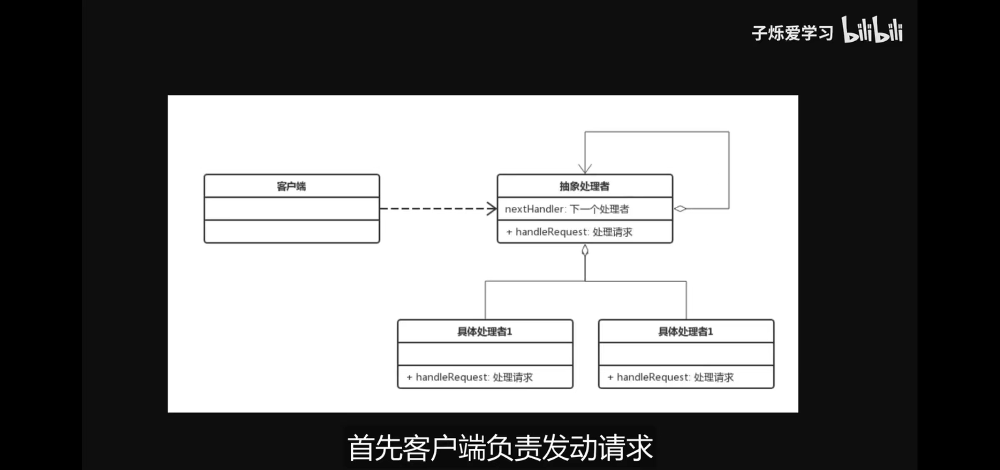

注： 无论啥模式，都尽量依赖抽象

代码：


优点:

> 从请求者角度：将请求者和处理者分开（原来是依赖关系）请求者不需要知道处理者。处理者也不需要知道请求者全貌。 ----》  自然提高系统灵活性
>
> 新增一个处理器到链条中的代价是非常小的

缺点：

> 也比较明显，就是他会降低整个系统的性能，因为处理者可能最坏的情况可能处于链条的末尾


#### 安卓代码中的 责任链模式：

参考： https://mp.weixin.qq.com/s/sSPFz3E5gncYiMMFtF_xlg  <font color='red'>好文</font>   从责任链模式看Android事件分发

事件分发中的责任链模式  (外层责任链)  TODO : 指的是input 事件那一套

事件处理中的责任链模式（内层责任链）:   Activity -> PhoneWindow -> DecorView -> ViewGroup -> …View （<font color='red'>在view段，是沿着树形结构分发的</font>）


安卓的<font color='red'>高超优化：</font> ------------- mFirstTouchTarget 责任链

> 背景： 上述讲的是<font color='red'>一个事件</font>分发 （树责任链），但是  真正的 事件是事件流：1个 ACTION_DOWN、n个 ACTION_MOVE、1个ACTION_UP
> **引入的问题：** n+2 个事件，沿着 树分发，复杂度太高
> 解决办法：**第一个ACTION_DOWN事件的分发，会找出一个 分发线路（即给 mFirstTouchTarget 赋值）**。后面同一事件序列的ACTION_MOVE、ACTION_UP 都按照这个线路分发（【1】）
>                  这个分发线路即图中  mFirstTouchTarget 单链表 <font color='red'>（这本身就是责任链模式）</font>
>
> 【1】这个逻辑，其实也是符合生活尝试的，比如 TODO


总<font color='red'>之：</font>
安卓事件分发机制： 是双责任链模式（~~树责任链 + 链表责任链~~），见图


从代码中总结：

> 1、责任链不一定是单链表
>
> 2、分发流程 天然适合责任链


### 中介者模式  

英文： mediator pattern

生活化模型：

> 飞机降落模型： 多架飞机 ------> 存在的问题， 每两个对象之间都存在联系  <font color='red'>即 多对多的关系</font>
>
> 


> 中介者模式：
>  飞机角度： 通过一个中介对象   <font color='red'>转化为 一对多</font>
>
> 从中介角度： <font color='red'>是调度者</font>
>
> > 
> >
> > 


**基于生活化模型，**自然：
优点：

- ~~降低类的关系复杂度，将多对多转化成<font color='red'>一对多</font>，实现解耦。  自然~~
- 符合迪米特原则（最少知识原则）

缺点

- 中介者要做很多事，会变得庞大且难以维护。


~~官方表述：~~

> 中介者模式是一种行为设计模式，能让你减少对象之间混乱无序的依赖关系。该模式会限制对象之间的直接交互，迫使他们通过一个中介对象进行合作

优缺点：

 

uml：

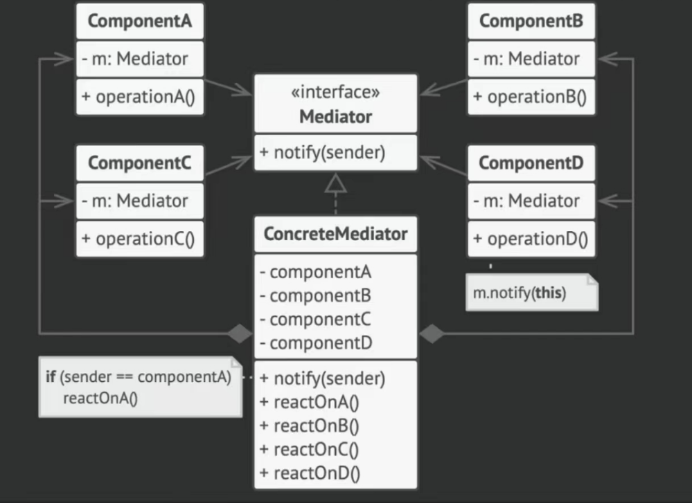

ConcreteMediator：具体的中介者角色


#### 安卓例子：  TODO:


### 观察者模式 TODO


### 迭代器模式 

迭代器模式是一种行为设计模式,让你能在不暴露集合底层表现形式(列 表、栈和树等)的情况下遍历集合中所有的元素。

接化发

希望对集合类，<font color='red'>有统一的迭代接口，方便人使用</font>

```java
for (String str : set) {

}
```


```java
// 集合类（Set或list），是一个可迭代对象： 必然持有迭代器
public interface Iterable<T> {
    Iterator<T> iterator(); // 返回迭代器
}

// 迭代器接口：
public interface Iterator<E> {
	boolean hasNext();
	E next();
    remove();
}
```


uml： <font color='red'>可迭代  持有  迭代器</font>


**理解：迭代器的本质就是遍历元素**
不同的迭代器 遍历算法不同，比如：深度优先遍历和宽度优先遍历


#### java 的例子

集合类 set  List


Collection实现了 Iterable 接口


如何使用迭代器

```java
public class RunoobTest {
    public static void main(String[] args) {
        ArrayList<String> sites = new ArrayList<String>();
        sites.add("Google");
        sites.add("Runoob");
        sites.add("Taobao");
        sites.add("Weibo");
        for (String i : sites) { // 背后使用了迭代器
            System.out.println(i);
        }
    }
}
```


### 状态模式

生活化模型：

不同状态下做的工作不一样。比如：

> 高兴 ---》 工作认真。
> 被人打了心情难过 ---》 不工作
> 饿着肚子---》无精打采的工作

本质：

> <font color='red'>封装转化，</font>即状态 到 行为的转化


UML：

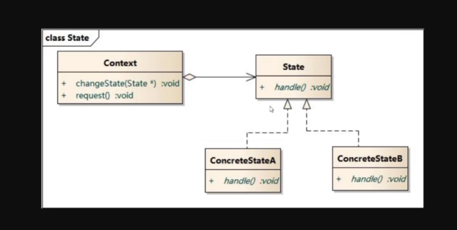

优缺点：

优点，（**相比于不用状态模式**）：

①将**繁琐的状态判断**转换成结构清晰的**状态类族**，在避免代码膨胀的同时也保证了可扩展性和可维护性。

②体现了**开闭原则和单一职责原则**，每个状态都是一个子类，要增加状态只需增加子类，要修改状态只需修改一个子类即可。

③符合迪米特法则。

缺点：会增加系统类和对象的个数。<font color='red'> ---》   似乎是一个通用的法则：通过增加类来减小系统的复杂度。</font>


代码


从代码形式角度，本质：参考：https://blog.csdn.net/zenmela2011/article/details/126508765

**把if else用多态继承的方式来实现。**


与策略模式的不同点：

> 见策略模式。


#### 安卓例子 TODO


### 策略模式


生活化模型：

上班模型：**针对于去公司这一件事情，**封装算法，客户端不关心算法实现细节

> 开车去（算法1：取车、停车、开车的路线，红绿灯、停车地点）
>
> 坐公交车（算法2：查找公交线路，公交站点。走路去公交站点，下公交）
>
> 骑车（算法3：）
>
> 走路（算法4：）

记**<font color='red'>忆</font>：**

> 达到同一目的  的不同策略。


官方表述：

注意，1、<font color='red'>可以相互替换</font>（自然，~~~因为各个策略都干了相同一件事情，去公司~~）  2、好处，算法可以独立于客户端而变化。（<font color='red'>优点：如果没有封装，客户端是要 实现具体算法的，则耦合</font>）


优点， **相对于没有封装算法的做法**：

> 见上

缺点：


UML：


#### 与状态模式的不同：


**uml两者一模一样**


不同点：

1、关注点不同：

> 状态模式的关注点：<font color='red'>关注点在于转化</font>，状态到行为的转换。不同状态下不同行为。一个状态下，可能有不同的行为。
>
> ​                         -----》  例子：今天状态是不开心，**转化为行为：**不想学习，不想吃饭，不想工作，只想睡觉
>
> 策略模式的关注点：<font color='red'> 关注点在于封装一组算法</font>，将每一种算法都封装到具有具体类中

​                          -----》  例子：打游戏。我是自己玩儿还是找朋友玩儿？还是找陪玩儿

2、目标不同：

策略模式的行为是**可相互替换的**（因为不同策略都干成了同一件事情）----》  即不同策略，目标相同。
状态模式  的不同行为，基本上不是干同一件事情    ----》  不同状态，行为不同，目标也不同。


#### 安卓代码的例子 TODO

jdk中例子：
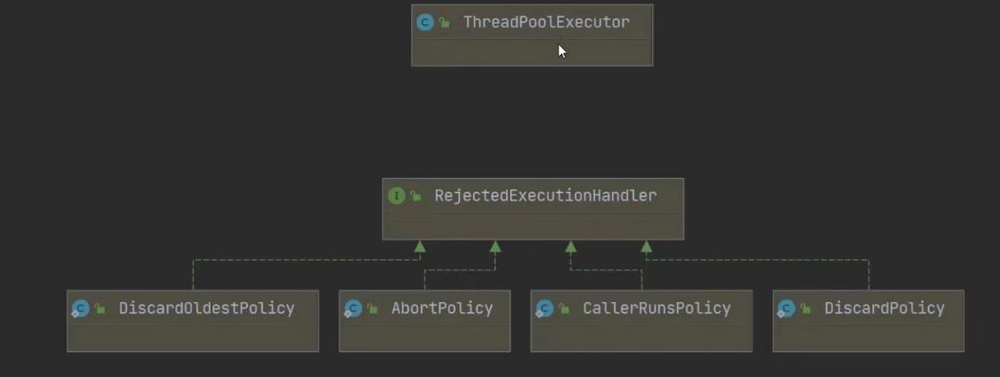

代码：

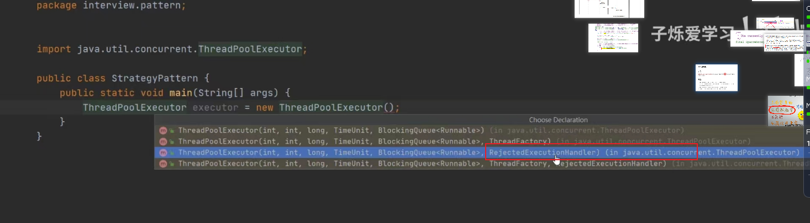


### 模板方法模式TODO

生活化模型,  读书模型：

- 幼儿园、小学、中学、大学…   ------>  抽象
- 每个人的经历都是特别的…      ------>  具体


UML:


参考： https://blog.csdn.net/weixin_39578432/article/details/118553952


#### 例子：

### 例子：

安卓的Actvity的生命周期：

- `onCreate`
- `onStart`
- `onResume`
- `onPause`
- `onStop`
- `onDestroy`

-----》  操控了Activity 的一生


### 命令模式  TODO

### 访问者模式 TODO

### 备忘录模式--->状态保存

## 其他设计模式

非 GOF提出的23种设计模式


### 生产者-消费者模式 

**英文**：  producer-consumer

**生活化模型：** 机场工作人员（生产者线程）-----机场传送带（缓存队列） --取行李的乘客（消费者线程）
                          行李（数据，比如msg） 


由生活化模型，该设计模式需要满足以下三点要求：

（1）自然，~~生产者生产数据到缓冲区中，消费者从缓冲区中取数据~~。
（2）自然，~~如果缓冲区已经满了，则生产者线程阻塞~~；---》安卓如何做的？
（3）自然，~~如果缓冲区为空，那么消费者线程阻塞~~。---》安卓epoll


生活化模型，自然优点：
1、数据的传递是解耦的

2、支持并发 ------ 多个工作人员同时 往 传动带投递行李

3、支持忙闲不均


#### 代码例子：

EX1:  ui线程产生绘制数据 --->  render线程去消费

EX2: input？？

EX3: 安卓Handler


参考：

https://carsonho.blog.csdn.net/article/details/121468054?spm=1001.2014.3001.5502
https://blog.csdn.net/haigand/article/details/90551070
https://zhuanlan.zhihu.com/p/73442055   经典并发同步模式：生产者-消费者设计模式


#### 面试问题：

[单生产者和单消费者共同操作同一个消息队列需要加锁吗](https://www.cnblogs.com/codingmengmeng/p/14420573.html)          https://www.cnblogs.com/codingmengmeng/p/14420573.html
答案：不需要

# =======其他设计思想==========


好代码设计原则：－－－－＞举例子，所有代码的设计原则，给出总结
1、模块分层合理，类职责清晰，代码可读性强，注释规范
2、模块具有过载流控能力，支持非法输入校验和外部输入防御性拷贝，可靠性强；-----＞状态保存机制，在AZ转换地方，做了大小校验
3、所有参数采用动态配置项，可扩展性强；
4、消息处理过程中，减少不必要的内存复制与对象实例化操作，支持系统高并发；


# 设计思想的大道

设计之代码<font color='red'>尽量模糊</font>：因为模糊，所以扩展性强（新增接口，新增代码量小）

模糊例子：

> 依赖于抽象接口
>
> 序列化成byte，各个流程都认识

**目标：扩展性强 ----------->  手段：代码模糊**


# 回调

## SetLinsterner与set(this)区别：

都是用于回调类似的操作

设计模式上，一般希望单项依赖。
好处：层级关系明确

linsterner与this区别：
linsterner比较固定，大部分时候实现接口，固定不变。。。。这样，this其他部分改动，不影响B的开发


## 代码层面的设计---------cpp的callback与java的比较

### 相同点：

> 理解：callback只是 调用方向（**与代码无关，不是类，只是表达方向**）

### 不同点：

> cpp有函数类型  ------>  用函数类型不同 来区分 （包装）参数类型的不同
>
> java没有 函数类型  ------>   用类的类型不同，来区分 （包装）参数类型的不同

回调传回不同的参数类型：

> 1、cpp实现：
>
> ```
>  int getPriorityByName(const std::string& serviceName, std::function<void(int result, int nice, const std::string& name)> callback)  //【1】
> 
>  int getServiceName(const unit32_t& procId, std::function<void(int result, const unit32_t& procId,
>  const& std::string& name)>  ca11back);   //【2】
> ```
>
> 
>
> java实现上述效果:
>
> %accordion%java实现上述效果:%accordion%
>
> ```
>  public interface StringCallback {
>      void onStringCallback(String result); // 【】不同的类来约束，不同参数
>  }
>  
>  public interface IntCallback {
>      void onIntCallback(int result);
>  }
>  
>  public class CallbackHandler {
>      public void registerStringCallback(StringCallback callback) {
>          // 处理回调
>          callback.onStringCallback("String result");
>      }
>  
>      public void registerIntCallback(IntCallback callback) {
>          // 处理回调
>          callback.onIntCallback(123);
>      }
>  }
>  
>  public class Main {
>      public static void main(String[] args) {
>          CallbackHandler handler = new CallbackHandler();
>  
>          // 使用StringCallback
>          handler.registerStringCallback(new StringCallback() {
>              @Override
>              public void onStringCallback(String result) {
>                  System.out.println("String callback result: " + result);
>              }
>          });
>  
>          // 使用IntCallback
>          handler.registerIntCallback(new IntCallback() {
>              @Override
>              public void onIntCallback(int result) {
>                  System.out.println("Int callback result: " + result);
>              }
>          });
>      }
>  }
> ```
>
> %/accordion%
>
> cpp优点：**很显然，cpp简洁许多**

**根本原因：**    cpp函数类型表达的强大：

> （1）编译约束角度：
>
> 系统侧 约束 接口调用者填充
>
> （2）**函数即类，即类型** ------->  **不同的function类型，以区分不同的返回值类型**，比如int值返回，string值返回
>
> 注：所以，函数（类）可以返回多个，不同的参数

-----------------> **总之，一句话:**

> cpp有函数类型  ------>  用函数类型不同 来区分 （包装）参数类型的不同
>
> java没有 函数类型  ------>   用类的类型不同，来区分 （包装）参数类型的不同


/【1】次要的补充：

> int getPriorityByName  ---------->  直接返回的Int不是跨进程的
>
> callback返回的 int result  才是跨进程的


# 分层设计思想

见《0层结构---一次Binder通信》


# 配置 与 框架  分离思想：

1、框架   强制约束  配置

2、配置可以放置的位置
（1） <font color='red'>差异封装在哪里</font>（即如何区分）：-----------配置封装在哪里

> 将差异封装**在类中**（用不同类来区分不同）：
>        triangle、rectangle  
>
> ​              ------->  **对于c语言来说，封装在map（map每一行代表一个类：** string、函数指针等不同）
>
> 将差异封装**在函数中**（用不同函数区分不同）。switch case

（2）<font color='red'> 框架侧 强制约束 配置侧：</font>

> 比如：生命周期的强制约束----------大的AMS循环，强制约束 配置侧的onCreate()
>
> ​    继承      强制约束   各个子类（配置侧） 实现抽象方法
>
> ​    接口的入参的抽象（框架侧）  强制约束  调用者（配置侧）  必须实现抽象参数。比如 TODO： EM的
> ​	


coding时，原则：

> 尽一切可能将配置放到一起，不要零散在代码各个地方！！！！！！！
>
> <font color='red'>框架追求通用化（后续无需改代码），配置追求聚集化</font>
>
> <font color='red'>**最理想状况：**</font>**代码全是框架机制**，配置全在xml、txt等配置文件里!!!!!!!!!


# 内外接口分开思想：


例子：

**安卓系统服务的设计**

```java
 // wms
 mIWindowManager = IWindowManager.Stub.asInterface(  // 外部接口
         ServiceManager.getService(Context.WINDOW_SERVICE));
 mWindowManagerInternal = LocalServices.getService(WindowManagerInternal.class); //内部接口 ---> 形式化统一
```

TODO ！！！！！！！！：

> 这样确实很好。但是具体、精确的好，在哪里


# 第一性原理之---------扩展性（弹性）

扩展性的标准：

> <font color='red'>每新增一个接口（类）的适配工作量</font>


# 扩展性之-----------反射

-**<font color='red'>反射，可以实现的功能（或者  为啥要用反射）</font>：**

> （1）从编译角度，可以避开编译约束:   私有，不可见
>
>
> （2）从代码角度, 可以实现 **统一，大量简化代码量**（一行代码，可以new 出各种类）------->  **语言，架构层面**
>
> （3） 从功能角度：同（1）
>
> (4)  从**代码 扩展性、弹性角度：**   反射有着非常好的弹性。比如，新增一个MyView，xml解析器创建view的代码，<font color='red'>不需要改动一行</font>


**安卓源码中反射的场景：**

> XML  ------>  类： new view()
>
>
> byte  -------->  类： 反序列化创建 parcelable，使用到的Creator   参考：[android对象序列化Parcelable浅析 - xerrard - 博客园 (cnblogs.com)](https://www.cnblogs.com/xerrard/p/5144386.html)          https://www.cnblogs.com/xerrard/p/5144386.html
>
> --------------->  总之:  <font color='red'>（1）都是从二进制 到 类的过程   （2）一般都是很多个类-----> 反射，大量简化代码量</font>！！！！！！

必然：

>  既然安卓都可以从xml和byte可以反射出安卓对象    ---------->  **<font color='red'>必然也可以:</font>**  (1)来源于Z的数据，反射成安卓对象  (2)来源于Linux二进制数据，反射成安卓对象

如何做？---------> **既A又Z，既A又L，节省链路的长度**

但问题： 安卓对象和Linux对象数据不对等？   

> 办法：
>
> 没有关系。**部分**序列化与**部分**反序列化。


# 背后的背后：思考设计模式的维度

生活化模型、一句话理解、uml（涉及的角色）、为什么要这样做？不得不的理由是什么？、解决什么问题、应用场景、应用范围

有缺点（**和....对比的优点**），比如：对于new的形式：

设计模式，一定是站在某一个类的角度考虑的问题。站在哪个对象角度去看（比如代理模式，站在client来看，没啥意义。但对于被代理对象，很有意义，保护了被代理对象）

安卓例子、如何用设计模式反推安卓代码(创造知识)

和。。。设计模式的区别

明显的特征（如何从代码中识别何种设计模式？）


# 软件总结


1、不让开发者用的接口，但是又对外了，
最好是抛异常---->这样开发者能感知到
Log.error不容易感知到

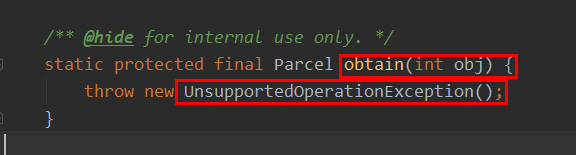


# 视频教程 & 参考链接

https://www.bilibili.com/video/BV1PJ411y7iL/?p=7&spm_id_from=333.880.my_history.page.click   骆诗琪

https://www.bilibili.com/video/BV1hK4y1L7zV/?spm_id_from=333.788&vd_source=3eebd10b94a8a76eaf4b78bee8f23884    子烁爱学习


# uml

### 分两类：静态图、动态图

静态图：

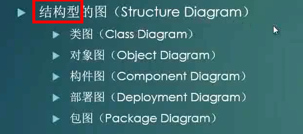

动态图：

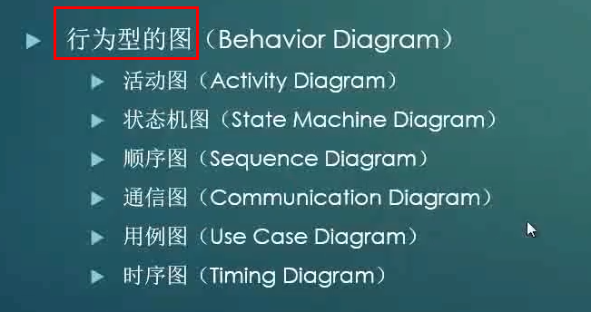

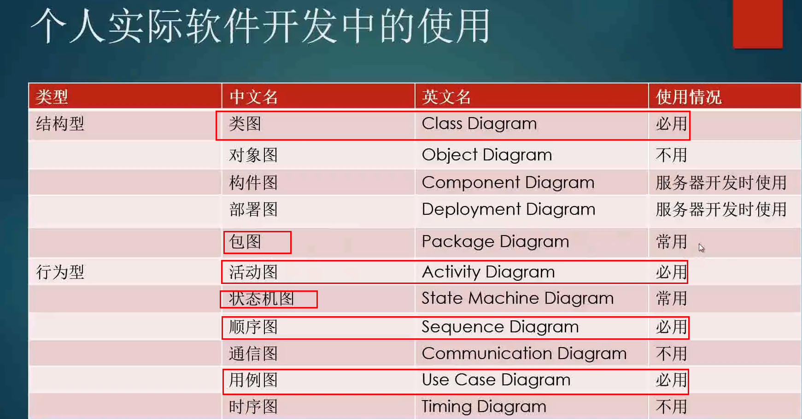

--------


状态机

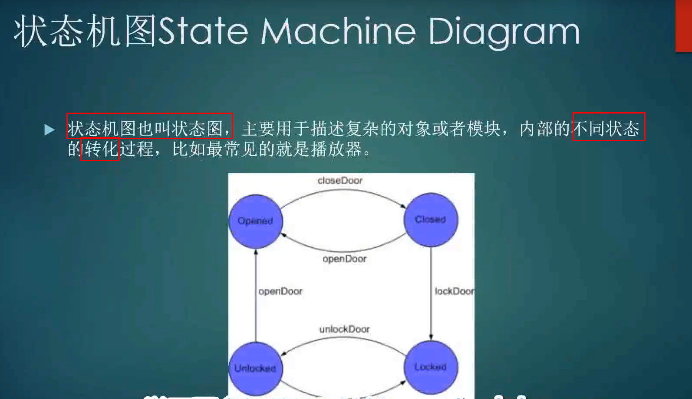


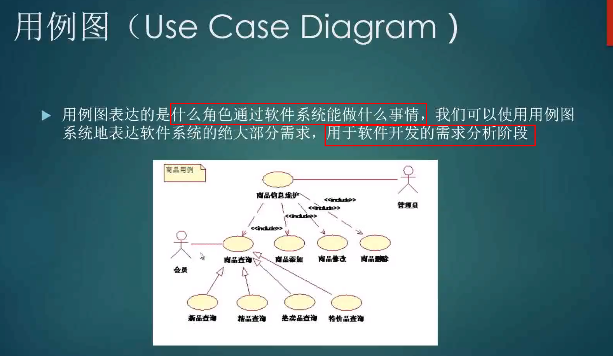

### 关系表达

#### 接口的实现： 两种表达

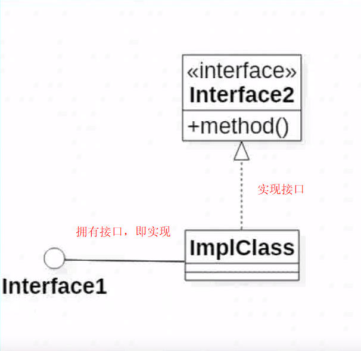

#### 依赖关系：

 使用关系《用到了 use a！！！！   <font color='red'> 代码中的临时变量、入参、import  </font>

尽量不要相互依赖

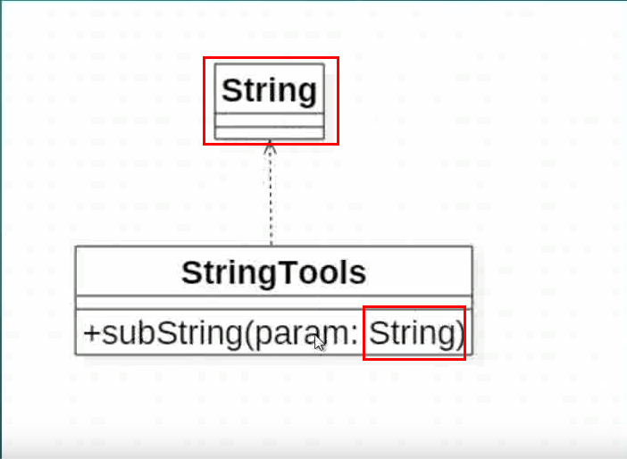

#### 关联：

​     记忆之 <font color='red'>锚：具体分为两种：有+同生同死、有+非 。。。。</font>

有或者包含（has a 或 contains a）

即代码中的成员变量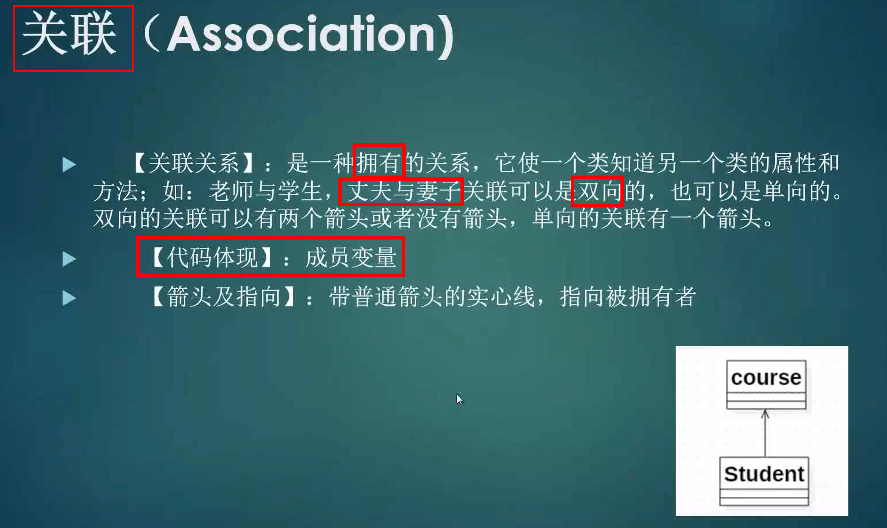

关联关系可以继续分为：

#### 聚合 

----->记忆：关联符号尾端， 空心  has a

整体与部分关系


#### 组合

---->关联符号尾端，实心  contains a

 同生同死


### 类的表达

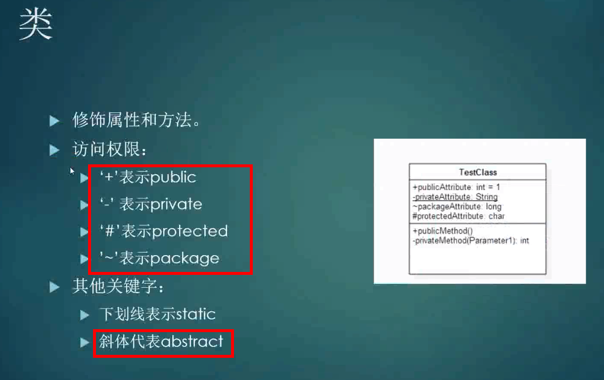

### 接口的表达


尽量用label形式？？？


