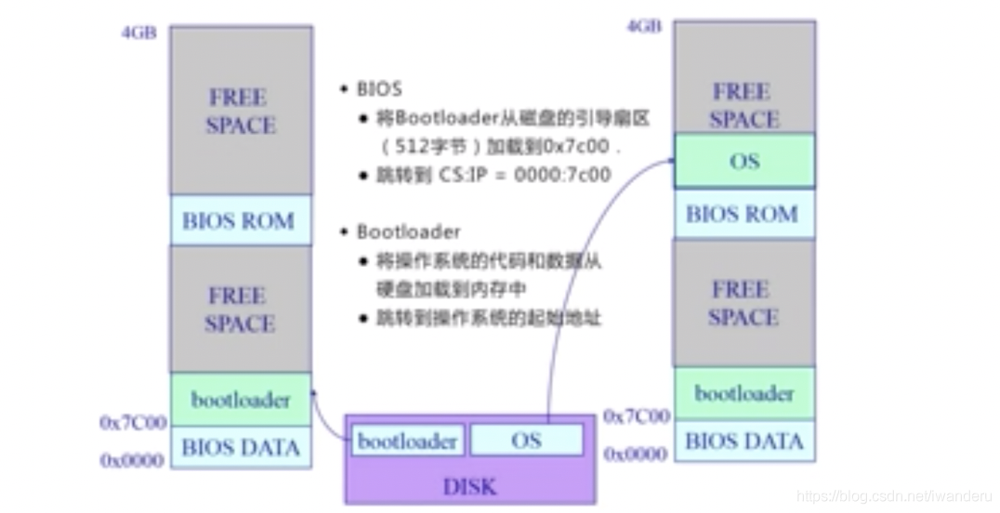
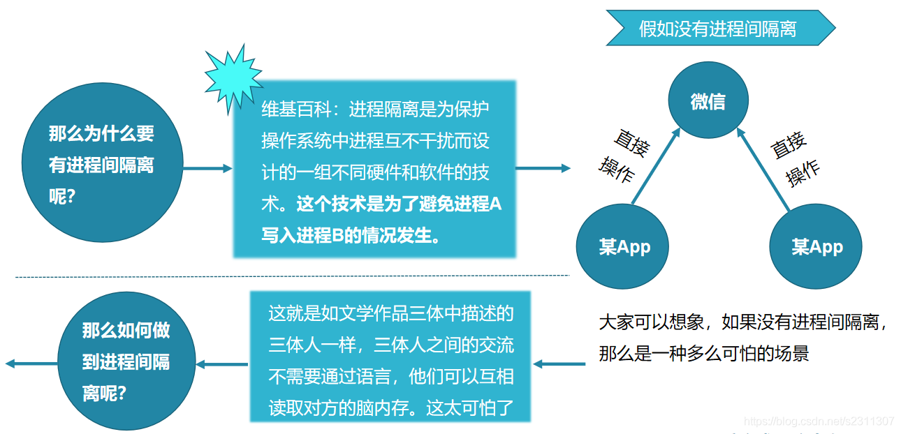
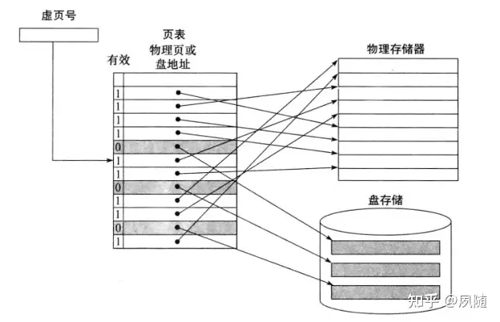

# 目录

网易面试官:   操作系统是你必须迈过去的一道坎。不然工作十年后，你会被应届生卷死

# 视频课程

https://www.bilibili.com/video/BV1wv4y1S7xm?p=2&vd_source=3eebd10b94a8a76eaf4b78bee8f23884

清华 计算机操作系统

笔记，参考：  https://blog.csdn.net/iwanderu/article/details/103934127

# 什么是操作系统（what）

## 从功能角度：

自然：

----------->  硬件资源角度

## 从硬件资源角度

**目的：** 封装硬件资源，给APP进程使用

具体：

> 操作系统将 三大硬件资源，分别抽象成软件概念：
>
> 
>
> cpu ----- 进程
>
> 磁盘------文件
>
> 内存-------地址空间

操作系统的软件层次：

> Shell   +  kernel
>
> 
>
> 
>
> Shell 是对用户的: 比如GUI（Linux、Windows、Android 界面 ）、命令行等
>
> kernel：真正提供功能的
>
> ​             （1） kernel底层：中断、I/O、设备驱动

kernel：

> 
>
> 

OS Kernel的特征: 

1、并发 

​      计算机系统中同时存在多个运行的程序 -----> 需要OS管理和调度

补充：并发与并行的区别，很自然：

> 并行指的是一个时刻 ----> ~~自然，对于cpu，不存在并行 （多核除外)~~
>
> 并发指的是一小段时间，~~时间片轮转上~~
>

2、共享

> “同时”访问 
>
> 互斥共享

3、虚拟

利用多道程序设计技术,让每个用户都 觉得有一个计算机专门为他服务

4、异步

程序的执行不是一贯到底,而是走走停 停,向前推进的速度不可预知

但只要运行环境相同,OS需要保证程序 运行的结果也要相同

## 操作系统的历史

如果要理解深刻，必须知道历史。。。因为历史给出了为什么是这样

## 操作系统结构

# 操作系统基础操作

##  启动

知识点：

> ●计算机体系结构概述
> ●计算机内存和硬盘布局
> ● 开机顺序

启动流程：

## 中断、异常和系统调用

●  背景
●中断、异常和系统调用相比较
●中断和异常处理机制
●系统调用的概念
●系统调用的实现
● 程序调用与系统调用的不同之处
● 开销

DISK:存放OS 

BIOS:基本I/O处理系统  Basic Input Output System

# TODO:

《计算机组成原理》  全量课程： https://www.bilibili.com/video/BV1Wv411x7zP?p=2&vd_source=3eebd10b94a8a76eaf4b78bee8f23884

# 面试题

## 进程隔离相关

~~参考：  https://blog.csdn.net/s2311307/article/details/108862748   Android的进程间通信（一） 之 进程隔离简述~~

### why  为什么需要进程间隔离？

~~来自：https://blog.csdn.net/s2311307/article/details/108862748~~

~~安全性：为了避免A进程写入B进程的情况发生~~   很自然

### **what-----进程之间的隔离主要体现在哪里？ how如何实现的？** TODO  ---字节 

-----> TODO:  链接到知识点里

> 主要是内存的隔离
>
> 实现：
> 采用了虚拟地址空间，两个进程各自的虚拟地址不同，从逻辑上来实现彼此间的隔离。----->  TODO:  具体的过程！！！图

