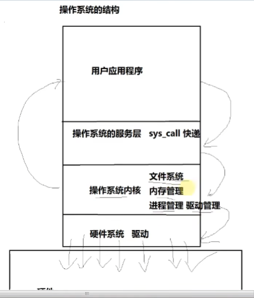
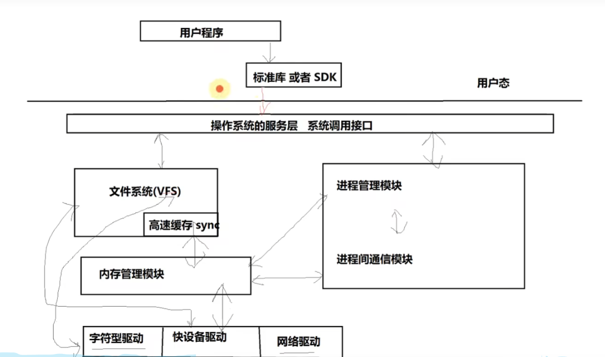
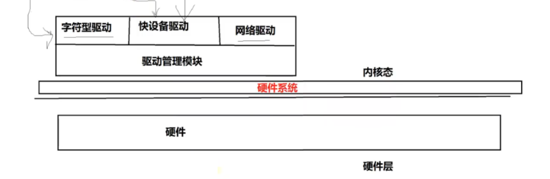
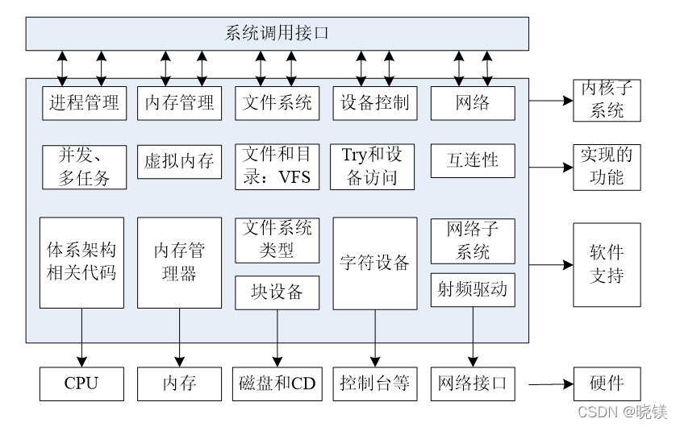

# 目录


#  操作系统工作方式（从一次调用来看）------纵向0层：

一次调用，从上到下:



底层：硬件


操作系统的工作方式: 

1.把操作系统从用户态 切换到 内核态 (用户应用程序 到 内核的流程) 

2.实现操作系统的系统调用(操作系统服务层) 

3.应用操作系统提供的底层函数,进行功能实现 

​      3.1 操作系统的驱动结构

 4.推出后从内核态切换到用户态


# 模块之间的关系（联系）：






高速缓存  其实就是一块内存。。。计算机写文件时，先存储在高速缓存里，最后一把写入硬件磁盘


# 模块之间的独立性（割裂）

独立性：

> 注意区分：管理层与实现层
>
> 提供接口的，不实现；实现的，不提供接口

为什么要这样做呢？

易于维护和升级？？？？ https://www.bilibili.com/video/BV1tQ4y1d7mo?t=3147.4


高版本和低版本内核之间的区别：

> 1、内核驱动的管理模式并没有巨大的改变。一段时间3个阶段的跳段： 零散型 分层型 设备树
>
> ​         ~~多的只是内核驱动的种类~~
>
> 2、进程的管理方式并没有巨大的改变 
>         ~~进程的调度算法发生了改变~~

------>  总之，就是没有大的改变


技巧： 不变的看老版本 -------- 主

​           变化的，看新版本 -------- 次


# ~~linux kernel 功能划分图-----静态~~



[Linux内核](https://so.csdn.net/so/search?q=Linux内核&spm=1001.2101.3001.7020)是linux操作系统的核心部分，它实现了操作系统的五大功能模块：

进程管理

[内存管理](https://so.csdn.net/so/search?q=内存管理&spm=1001.2101.3001.7020)

文件系统

设备控制

网络


CD ------光盘


# 中断

<font color='red'>目的：</font>为啥要有中断？

​      1、硬件的中断响应  ----》  内核驱动的中断

​      2、系统调用的函数响应（sys_call） ----》 系统调用

​      3、自定义中断 ----》 软件的软中断模式

​      4、信号中断(kill-signalnum)   ----》 进程间通信（有助于了解信号的使用、创建等）

​      5、系统的异常和错误 ----》 系统的异常获取；了解系统异常的作用


<font color='red'>后面的章节，围绕着这五个目的</font>

## Linux的中断机制

分类，自然：

硬件中断：比如：~~电脑主机的8259A类似的硬件中断控制芯片发出的中断、ARM中断控制器发出的中断~~

软件中断：异常：第一类：CPU	自行保留的中断  -------》 TODO: 不懂

​                                               系统调用异常


## 中断工作流程

任意系统中断都有：

----------------保存-------------------------

做CPU工作模式的转化

进行寄存器的拷贝与压栈 ----->  TODO: 这个目的是啥？

设置中断异常向量表

保存正常运行的函数返回值


------------------执行--------------------------

跳转到对应的中断服务函数上运行


------------------恢复-------------------------

进行模式的复原以及寄存器的复原

跳转回正常工作的函数地址继续运行

（对应video： https://www.bilibili.com/video/BV1tQ4y1d7mo?t=1252.7&p=2）


------------->  总之，

字面上来看：

中断就是 中断CPU，做其他事情（运行中断服务函数）


## linux中中断你的工作流程

---------------保存(中断前)-------------------------

1、~~将所有的寄存器值入栈~~  -----》 上面的保存

寄存器比如：

> 8086中的       SS EFLAGS ESP  CS  EIP（错误码）   
>
> ARM中的（r0-r15）

 2、将异常码入栈（中断号）

3、将当前的函数返回值进行入栈(为了在中断执行后能够找到在哪中断的, 能够复原)


------------------执行(中断)--------------------------

4、调用对应的中断服务函数


------------------恢复(中断后)-------------------------

5、出栈函数返回值

6、返回所有入栈的寄存器值


### 代码结构

**重要代码结构：**

|                          | 保存过程（123），恢复过程（56） |   调用？    |       中断的执行过程（4）       |
| ------------------------ | :-----------------------------: | :---------: | :-----------------------------: |
| 硬件中断的处理过程       |              asm.s              | <---------> |             traps.c             |
| 软件及系统调用的处理过程 |          system_call.s          | <---------> | fork.c  signal.c  exit.c  sys.c |

结论：

> 软中断和硬中断，完全两条路
>
> 系统调用 同 软中断

 

### 中断的代码实现

以 asm.s ---》 traps.c为例：


# 补充： 常见的系统调用sys_call

常见的系统调用 ：

> open、mmap、ioctl、dose

mmap()：   磁盘文件（驱动文件？）    映射到     物理内存

例子：进程建立binder线程池时

```
 // 为/dev/binder文件 映射固定大小的物理内存
 mmap(nullptr, BINDER_VM_SIZE, PROT_READ, MAP_PRIVATE | MAP_NORESERVE, mDriverFD, 0);  // 即打开的 /dev/binder文件
```

维测之-------查看进程中，各个二进制文件mmap的地址段：

```cpp
 P13_5G:/ # ps -ef | grep servicemanager
 system          328      1 0 14:19:52 ?     00:01:37 servicemanager
 2|P13_5G:/ # cat /proc/328/maps
 6197007000-619700d000 r--p 00000000 fc:02 1640                           /system/bin/servicemanager
 619700d000-6197014000 r-xp 00006000 fc:02 1640                           /system/bin/servicemanager
 6197014000-6197016000 r--p 0000d000 fc:02 1640                           /system/bin/servicemanager
 6197016000-6197017000 rw-p 0000e000 fc:02 1640                           /system/bin/servicemanager
 744f1b2000-744f2b0000 r--p 00000000 00:23 4                              /dev/binderfs/binder
 744f2b0000-744f2b3000 r--p 00000000 fc:02 3825                           /system/lib64/libnetd_client.so
```

参考：

> https://blog.csdn.net/hcgeng/article/details/134563659

# 参考：

https://www.bilibili.com/video/BV1tQ4y1d7mo?t=1252.7&p=2

https://blog.csdn.net/u014571143/article/details/129660010

# systemd

## DefaultDependencies=no

```java
[Unit]
Description=weston
DefaultDependencies=no    ------> // weston可以在/data分区挂载之前启动
```

## After 与  Requires

```ini
[Unit]
After=bar.service
Requires=bar.service
```

## systemd喂配置 给 程序

```java
vi /usr/lib/systemd/system/simple-egl.service
添加 Environment=WAYLAND_DEBUG=1
```

------------------> wayland的日志在**journal日志里**


## systemd 启动时的日志 

比如，**查看systemd启动失败的日志**

```java
journalctl -o verbose > verbose.txt
```


# journal日志


```
fprintf(stderr, "argc=:%d, argv[0]:%s, argv[1]:%s, argv[2]:%s, argv[3]:%s, argv[4]:%s, argv[5]:%s\n", argc, argv[0], argv[1], argv[2], argv[3],argv[4], argv[5]);
```


# 进程

## 进程的环境变量

### 查询：

```
sh-3.2# ps -ef | grep keyboa
weston     28849   28828  0 17:37 ?        00:00:00 /usr/libexec/weston-keyboard
root       31552    4627  0 17:47 pts/0    00:00:00 grep keyboa
sh-3.2#
sh-3.2#
sh-3.2# cat /proc/28849/environ
LANG=CLD_PRELOAD=/usr/lib64/libstdout-line-buffer.so:/usr/lib64/m/libc_dns.soPATH=/usr/local/sbin
:/usr/local/bin:/usr/sbin:/usr/binNOTIFY_SOCKET=/run/systemd/notifyUSER=westonLOGNAME=westonHOME=
/data/westonSHELL=/bin/shINVOCATION_ID=45bcaf4011a644269ae4e06f3bf41af3JOURNAL_STREAM=8:811021SYS
TEMD_EXEC_PID=28828MOTD_SHOWN=pamMAIL=/var/spool/mail/westonXDG_SESSION_ID=c19XDG_RUNTIME_DIR=/ru
n/user/21002DBUS_SESSION_BUS_ADDRESS=unix:path=/run/user/21002/busXDG_SESSION_TYPE=unspecifiedXDG
_SESSION_CLASS=backgroundWESTON_CONFIG_FILE=/etc/xdg/weston/weston.iniWAYLAND_DISPLAY=wayland-0WA
YLAND_SOCKET=57sh-3.2#
```

### 基本结论

**fork出来的进程，会带有父进程的环境变量！！！！！！**

证明：weston-keyboard 与 weston

> ```java
> sh-3.2# ps -ef | grep keyboa
> weston     28849   28828  0 17:37 ?        00:00:00 /usr/libexec/weston-keyboard
> root       31552    4627  0 17:47 pts/0    00:00:00 grep keyboa
> sh-3.2#
> sh-3.2#
> sh-3.2# cat /proc/28849/environ
> LANG=CLD_PRELOAD=/usr/lib64/libstdout-line-buffer.so:/usr/lib64/m/libc_dns.soPATH=/usr/local/sbin
> :/usr/local/bin:/usr/sbin:/usr/binNOTIFY_SOCKET=/run/systemd/notifyUSER=westonLOGNAME=westonHOME=
> /data/westonSHELL=/bin/shINVOCATION_ID=45bcaf4011a644269ae4e06f3bf41af3JOURNAL_STREAM=8:811021SYS
> TEMD_EXEC_PID=28828MOTD_SHOWN=pamMAIL=/var/spool/mail/westonXDG_SESSION_ID=c19XDG_RUNTIME_DIR=/ru
> n/user/21002DBUS_SESSION_BUS_ADDRESS=unix:path=/run/user/21002/busXDG_SESSION_TYPE=unspecifiedXDG
> _SESSION_CLASS=backgroundWESTON_CONFIG_FILE=/etc/xdg/weston/weston.iniWAYLAND_DISPLAY=wayland-0WA
> YLAND_SOCKET=57sh-3.2#
> ```
>
> 
>
> 
>
> ```java
> sh-3.2# ps -ef | grep weston
> weston      3600       1  0 16:12 ?        00:00:00 /usr/lib/systemd/systemd --user
> weston      3601    3600  0 16:12 ?        00:00:00 (sd-pam)
> weston     28828       1  2 17:37 ?        00:00:15 /usr/bin/weston --modules=systemd-notify.so -
> -socket=wayland-0 --log=/tmp/weston.log --debug
> weston     28829   28828  0 17:37 ?        00:00:00 (sd-pam)
> weston     28835   28828  0 17:37 ?        00:00:00 /usr/bin/weston --modules=systemd-notify.so -
> -socket=wayland-0 --log=/tmp/weston.log --debug
> weston     28849   28828  0 17:37 ?        00:00:00 /usr/libexec/weston-keyboard
> weston     28850   28828  0 17:37 ?        00:00:00 /usr/libexec/wmshell
> weston     28881   28872  0 17:37 ?        00:00:00 (sd-pam)
> root       32287    4627  0 17:50 pts/0    00:00:00 grep weston
> sh-3.2#
> sh-3.2#
> sh-3.2# cat /proc/28828/environ
> LANG=CLD_PRELOAD=/usr/lib64/libstdout-line-buffer.so:/usr/lib64/m/libc_dns.soPATH=/usr/local/sbin
> :/usr/local/bin:/usr/sbin:/usr/binNOTIFY_SOCKET=/run/systemd/notifyLISTEN_PID=28828LISTEN_FDS=1LI
> STEN_FDNAMES=weston.socketUSER=westonLOGNAME=westonHOME=/data/westonSHELL=/bin/shINVOCATION_ID=45
> bcaf4011a644269ae4e06f3bf41af3JOURNAL_STREAM=8:811021SYSTEMD_EXEC_PID=28828MOTD_SHOWN=pamMAIL=/va
> r/spool/mail/westonXDG_SESSION_ID=c19XDG_RUNTIME_DIR=/run/user/21002DBUS_SESSION_BUS_ADDRESS=unix
> :path=/run/user/21002/busXDG_SESSION_TYPE=unspecifiedXDG_SESSION_CLASS=backgroundsh-3.2#
> sh-3.2#
> ```


## fork进程，执行程序

```java
pid_t startWestonScreenshot() {
    LOG("startWestonScreenshot in\n");
    pid_t pid = fork();
    
    if (pid == 0) {
        LOG("startWestonScreenshot pid=0\n");
        // 带参数启动，例如指定特定输出
        // execl("/usr/bin/weston-screenshot", "weston-screenshot", 
        //         "-d", output_name.c_str(), (char*)nullptr);
        // execl("/usr/bin/weston-screenshooter", "-d DSI-1", (char *) NULL); // execl("/usr/bin/weston-screenshooter", "-d DSI-1", (char *) NULL);
        execl("/usr/bin/weston-screenshooter", "weston-screenshooter", "-d", "DSI-1", (char *) NULL);

        // 如果execl返回，说明执行失败
        LOG("startWestonScreenshot Failed to execute weston-screenshot\n");
        _exit(1);
    } else if (pid > 0) {
        // 父进程，立即返回，不等待子进程结束
        LOG("startWestonScreenshot, wmshell, pid:%d\n", pid);
        return pid;
    } else {
        LOG("startWestonScreenshot Failed to fork process\n");
        return -1;
    }
}
```

### pid 的含义


```java
    } else if (pid > 0) {
        // 父进程，立即返回，不等待子进程结束
        LOG("startWestonScreenshot, wmshell, pid:%d\n", pid);
        return pid;
    }
```


1. **`pid` 的含义**：

    - [pid](javascript:void(0)) 是 `fork()` 返回给父进程的值，表示<font color='red'>新创建的子进程的进程ID（不是父进程的PID）</font>

    - 父进程通过这个 [pid](javascript:void(0)) 来<font color='red'>跟踪它创建的子进程</font>

        比如：父进程不应该等待子进程结束：

        ```java
        waitpid(pid, &status, 0)
        ```

        


### fork并传递参数

有个问题：参数无法传递过去

> 解决：https://stackoverflow.com/questions/54225622/starting-program-using-execv-and-passing-arguments-with-out-raising-argc
>
> ```c
> +---------+---------------------------------------+ 
> | Args    | Environment                           |
> +---------+---------+---------+---------+---------+
> |  NULL   | envp[0] | envp[1] | envp[2] |  NULL   | 
> +---------+---------+---------+---------+---------+
>  ^         ^                   ^                     
>  |         |                   |
> argv[0]    argv[1]     ...     argv[3]
> ```


### char *argv[]的认识：

-<font color='red'>argv 包含：</font>

> 1、父进程传过来的参数 args
>
> 2、父进程的env （如果没有1，则直接是2）

```
+---------+---------------------------------------+ 
| Args    | Environment                           |
+---------+---------+---------+---------+---------+
|  NULL   | envp[0] | envp[1] | envp[2] |  NULL   | 
+---------+---------+---------+---------+---------+
    ^         ^                   ^                     
    |         |                   |
 argv[0]    argv[1]     ...     argv[3]
```


