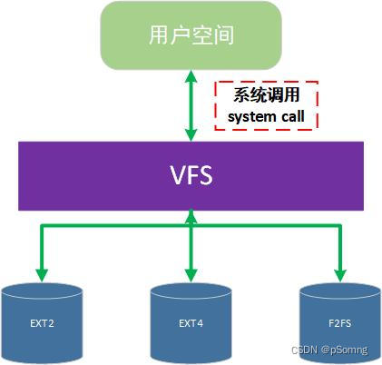

# 文件系统角度

结论：安卓所有的native程序

1、都是独立的二进制文件，比如

```
 /system/bin/servicemanager
 /system/bin/servicemanager
 /system/bin/surfaceflinger
 /system/bin/app_process64        ------》 systemServer 系统进程
```

2、都在 /system/bin/  目录下

3、独立进程  运行（的 二进制文件）

linux中常见的文件系统有三类：基于磁盘的文件系统；基于内存的文件系统；网络文件系统，

结论：

> ls  -la  看到的，部分是在内存，部分在磁盘    --------->  主要看Filesystem 的类型

tmpfs, 临时文件系统   ------>  **存储于RAM，**虚拟文件系统

proc        ------>  **存储于RAM**，虚拟文件系统 ：进程相关         参考： https://zhuanlan.zhihu.com/p/619966043?utm_id=0&eqid=fd4dda010004ae4c000000046459f99b

sysfs

```
 P13_5G:/ $ df -a
 Filesystem       1K-blocks    Used Available Use% Mounted on
 tmpfs              2292348    3408   2288940   1% /dev
 devpts                   0       0         0   0% /dev/pts
 proc                     0       0         0   0% /proc
 sysfs                    0       0         0   0% /sys
 selinuxfs                0       0         0   0% /sys/fs/selinux
 tmpfs              2292348      36   2292312   1% /mnt
 /dev/block/vda13     29584     172     28376   1% /metadata
 /dev/block/dm-2    1480328 1475848         0 100% /
 /dev/block/dm-4    1832960  251460   1581500  14% /mnt/scratch
 overlay            1832960  251460   1581500  14% /system
 overlay            1832960  251460   1581500  14% /vendor
 overlay            1832960  251460   1581500  14% /product
 tmpfs              2292348       0   2292348   0% /apex
 tmpfs              2292348     264   2292084   1% /linkerconfig
 tmpfs              2292348      36   2292312   1% /mnt/installer
 tmpfs              2292348      36   2292312   1% /mnt/androidwritable
 overlay            1832960  251460   1581500  14% /apex/com.android.adbd
 overlay            1832960  251460   1581500  14% /apex/com.android.permission
 overlay            1832960  251460   1581500  14% /apex/com.android.runtime
 overlay            1832960  251460   1581500  14% /apex/com.android.ipsec
 overlay            1832960  251460   1581500  14% /apex/com.android.mediaprovider
 overlay            1832960  251460   1581500  14% /apex/com.android.vndk.v30
 overlay            1832960  251460   1581500  14% /apex/com.android.art
 overlay            1832960  251460   1581500  14% /apex/com.android.tethering
 overlay            1832960  251460   1581500  14% /apex/com.android.wifi
 overlay            1832960  251460   1581500  14% /apex/com.android.sdkext
 overlay            1832960  251460   1581500  14% /apex/com.android.conscrypt
 overlay            1832960  251460   1581500  14% /apex/com.android.extservices
 overlay            1832960  251460   1581500  14% /apex/com.android.neuralnetworks
 overlay            1832960  251460   1581500  14% /apex/com.android.media
 overlay            1832960  251460   1581500  14% /apex/com.android.os.statsd
 overlay            1832960  251460   1581500  14% /apex/com.android.resolv
 overlay            1832960  251460   1581500  14% /apex/com.android.media.swcodec
 overlay            1832960  251460   1581500  14% /apex/com.android.tzdata
 overlay            1832960  251460   1581500  14% /apex/com.android.cellbroadcast
 overlay            1832960  251460   1581500  14% /apex/com.android.i18n
 none                     0       0         0   0% /dev/cg2_bpf
 none                     0       0         0   0% /dev/cpuctl
 none                     0       0         0   0% /acct
 none                     0       0         0   0% /dev/cpuset
 none                     0       0         0   0% /dev/freezer
 none                     0       0         0   0% /dev/memcg
 none                     0       0         0   0% /dev/stune
 tmpfs              2292348     264   2292084   1% /linkerconfig
 tracefs                  0       0         0   0% /sys/kernel/tracing
 debugfs                  0       0         0   0% /sys/kernel/debug
 none                     0       0         0   0% /config
 binder                   0       0         0   0% /dev/binderfs
 none                     0       0         0   0% /sys/fs/fuse/connections
```

sys_call（比如open）

> 
>
> 
>
> 图来源：https://blog.csdn.net/weixin_42792088/article/details/132800522   Linux中的虚拟文件系统（virtual file system）