# 目录

# Android系统性能调优工具介绍

TraceView、Systrace、Oprofile

# TraceView---可以看调用栈

## TraceView应用场景


## TraceView工具的使用


https://www.jianshu.com/p/a14bfdc4109a?utm_campaign=maleskine&utm_content=note&utm_medium=seo_notes&utm_source=recommendation

形成一个图表，从中可以分析出每个方法的执行时间


### 工具原理


# Systrace


## Systrace场景

包含的信息内容：

> 工作**线程**：内核+框架+应用
>
>  系统模块**状态** ：**CPU频率/GPU频率**/system property 赋值/frame buffer队列.

优点：

> 1、<font color='red'>图形化</font>   ---->  **技巧：**  自己做工具，也可以这样做
>
> 2、按照时间铺开

关注点：

> 运行时间
>
> 线程
>
> CPU工作频率
>
> CPU 抢占

## Systrace工具的使用

### 代码中触发

有些要看的内容没有在现有的trace里，<font color='red'>不够需要自己加TAG：</font>

java：

```java
//
Trace.traceBegin(Trace.TRACE_TAG_VIEW, "onCreate");
................
Trace.traceEnd(Trace.TRACE_TAG_VIEW);


//
Trace.beginsection ("onConfigurationChanged"); // systemTrace, 性能
...................
Trace.endSection();

//
Trace.asyncTraceBegin
...................
Trace.asyncTraceEnd
```


framework native添加：

```cpp
#define ATRACE_TAG ATRACE_TAG_VIEW
ATRACE_NAME(base::StringPrintf("LoadApkAssets(%s)", path.c_str()).c_str());


ATRACE_CALL(); //
```

或：

```cpp
#include <cutils/trace.h>

ATRACE_BEGIN(trace.c_str());
.............
ATRACE_END();
```


### 命令行


python systrace.py [options] [categories]

目录: 

```java
‪E:\softWare\softWare\systrace\platform-tools_r33.0.0-windows\platform-tools\systrace\systrace.py
```


#### [options]


####  [categories]  哪些模块


```java
	        
my例子：
python systrace.py -o mynewtrace.html  \
-a com.example.aospsourcecode2 com.android.launcher3    \
sched freq idle  am  wm sm input view
```


#### perfetto命令行

adb shell perfetto -h             https://juejin.cn/post/6974368361283059719


### 键盘快捷键

https://www.jianshu.com/p/a14bfdc4109a?utm_campaign=maleskine&utm_content=note&utm_medium=seo_notes&utm_source=recommendation


### 使用命令行捕获Systreace报告文件


### 模拟器 perfetto命令 抓取 trace

https://blog.csdn.net/Redmoon955331/article/details/129736238

https://blog.csdn.net/tyearlin/article/details/123426616


### ~~atrace~~


见《atrace章节》


### perfetto

优点：

-<font color='red'>可视化做的更好</font>。可以跳转，有箭头链接 


## 阅读报告

阅读网站：

> 方法一：~~使用 chrome://tracing/~~ 
>
> 方法二：~~直接点html，这样有进程名~~，更优
>
> 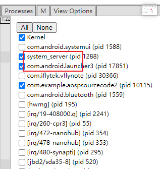
>
> 方法三：优选
>
> > https://ui.perfetto.dev/
>

### 页面结构

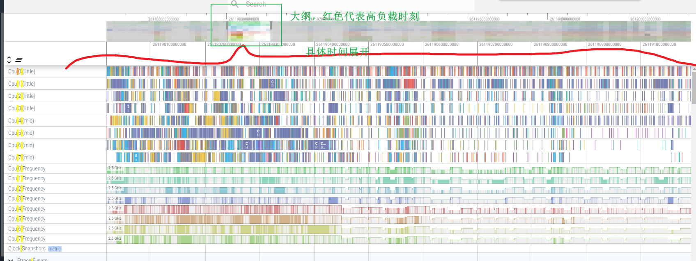


CPU大纲：红色代表cpu<font color='red'>核心负载高</font>

CPU使用具体页面展开：

​                                  1、每个cpu在做哪些工作

​                                 2、颜色代表  <font color='red'>线程状态</font> （见下） -------><font color='green'> 错误！！！！这里是cpu的，不是线程！！！</font>

事件：


### **线程的不同状态-------颜色**：

参考： https://www.androidperformance.com/2019/07/23/Android-Systrace-Pre/#/%E6%AD%A3%E6%96%87

> ~~绿色 --> 运行中 Running~~
>
> 对于在CPU上执行的进程，需要查看其运行时间、是否跑在该跑的核上、频率是否够等。
>
> 蓝色 --> 可运行 Runnable
>
> 对于在等待序列中的进程，需要查看是否有过多任务在等待、等待时间是否过长等。
>
> 白色 --> 休眠中 Sleeping： 这里一般是在等事件驱动。
>
> 橘色 --> 不可中断的睡眠态_IO_Block Uninterruptible Sleep | WakeKill - Block I/O
>
> 线程在I / O上被阻塞或等待磁盘操作完成。
>
> 紫色 --> 不可中断的睡眠态 Uninterruptible Sleep
>
> 线程在另一个内核操作（通常是内存管理）上被阻塞。

-<font color='red'>上述自然</font>，生活化模型：颜色- 红绿灯颜色


注,也可以点击线程位置,看


### 线程唤醒者分析---atrace

注意:  看似函数一直在走,但是线程已经 sleep了.  说明函数运行 sleep了.


细长条代表线程运行。白色表示sleep**了**


**线程唤醒者:** 
图中:  前蓝后绿部分,很短暂 


**如何找哪个线程唤醒该线程的？**操作：
标尺固定时间段,  找到cpu对应这个宽度的task：必然是四个当中一个

通过看tid 17889确定  --->  是launcher的render线程做的

即结论：render线程唤醒了ui线程

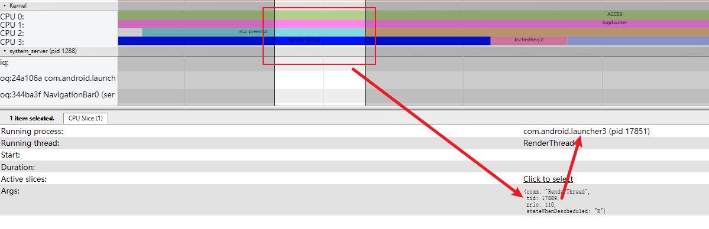

### 线程状态切换之 Runnable -----> Running


一些结论：

>  Runnable -----> Running  一般都是cpu调度（时间片轮转）造成的。<font color='red'>不是开发者代码引起的</font>
>
> sleep ---->   Running   线程角度： 线程唤醒      代码角度：<font color='red'>开发者代码 同步调用 结束</font>

注：同一个线程，由于调度，一会儿在cpu1运行，一会儿在cpu2运行


### 线程唤醒者分析sleep---> Running (函数调用者分析)----perfetto

例子：

找System_server中startActivityInner是谁调用的？（<font color='red'>如何查找调用者问题</font>）

<-----------> 等价命题：即 这个线程是谁唤醒的？（<font color='red'>线程唤醒问题</font>）

​                                   即：**线程状态怎么转成Running？**

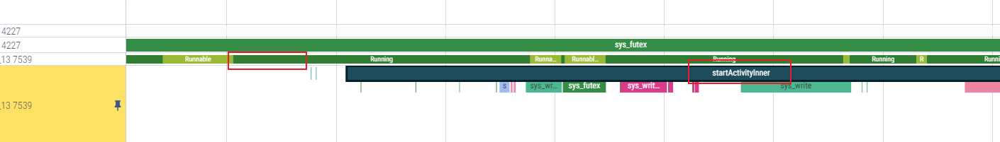


步骤：

1、选中Running  slice

注：**小的Runnable可能跟锁有关，先不管**  -----> <font color='red'>TODO</font>

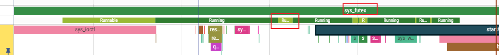

选择大的Runnable后面的slice


2、Running on CPU 1  跳转CPU1

被cpu0的 com.android.launcher3 1101唤醒


总之：

> <font color='red'>没有看代码，完全依照图形，找到了函数的调用者</font>


-**<font color='red'>核心思想：</font>**

> 通过CPU之间的线程唤醒者  ----->  找到线程之间的调用关系
>
> 
>
> 可以是<font color='red'>两个进程</font>的两个线程（binder调用），也可以是<font color='red'>同进程</font>


**技巧，回跳：**

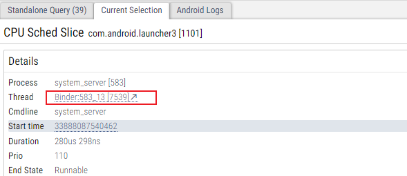

### binder线程唤醒者分析----perfetto

1、binder线程不用像非binder线程那么麻烦，<font color='red'>因为只要点击slice</font>（<font color='red'>binder  transaction</font>或者 <font color='red'>binder reply</font>），就会有调用连线:

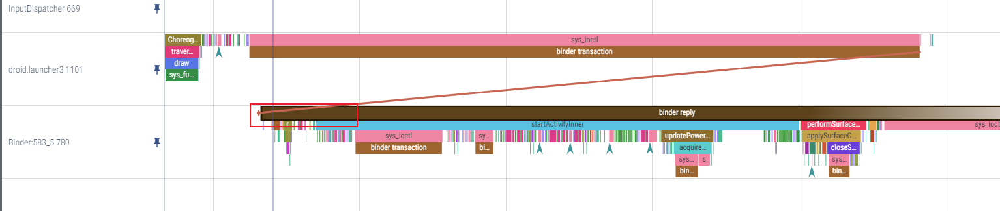

2、注：箭头描述的调用，时间是不准确的：


### 如何找唤醒过程对应的代码级呢？ 


### mark标尺：快捷键m

1、方法一：选中**某一slice**，m

> 就有了从上至下的标尺 -----> <font color='red'>作用：统一时间段观察</font>
>
> 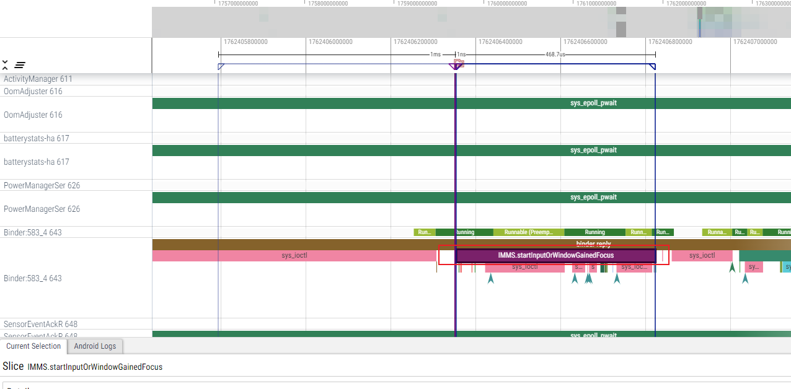
>
> 
>
> 


方法二： 点击空白区域，任意新增mark标尺

> 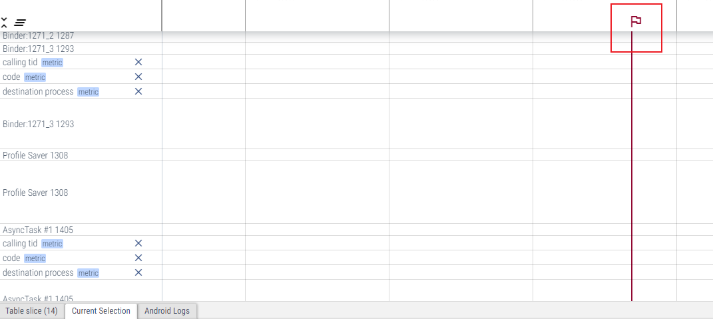

标尺的删除，与改变颜色：

> 先选中：
>
> 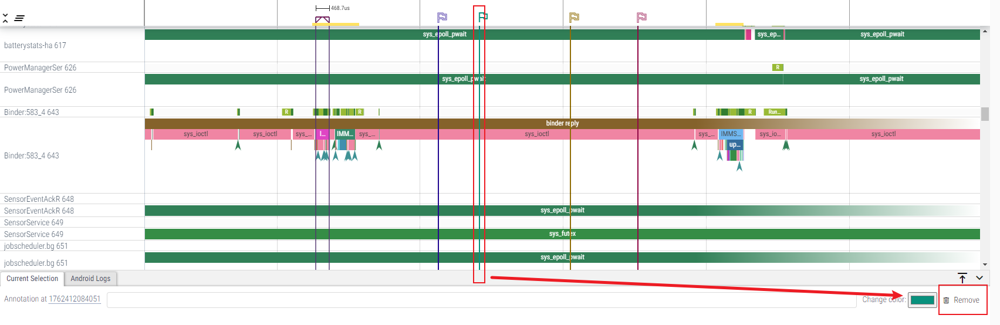


### ~~关于log（次要）~~

1、选中log，<font color='red'>给出log图形化的位置，可以和其他链接起来</font>

2、可以过滤

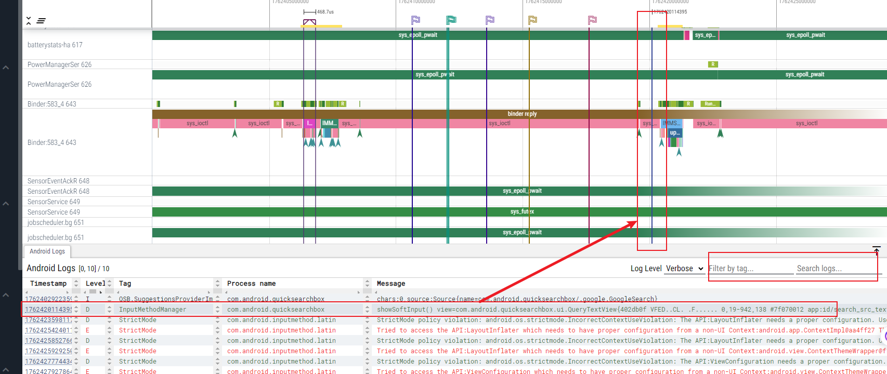


### 选中一段时间为base

#### 如何选中一段时间？


> 
>
> 或者在大纲里选一段时间
>
> 或者在内容中框选
>
> 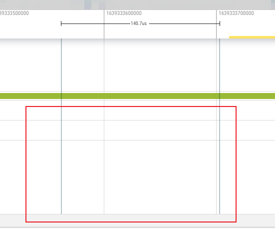

如何反选？

> 鼠标左键。**选中时间，只是一个临时选中**


TODO: 能否有标尺？


#### 基于选中的时间，看各个统计量

这段时间的log：

> 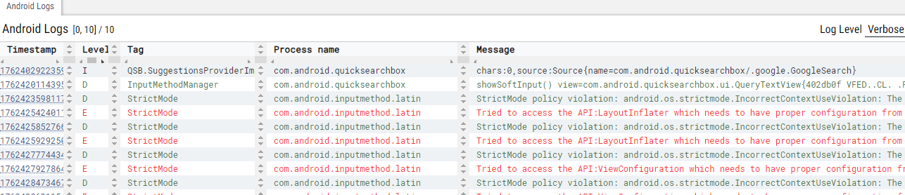

#### 前三个cpu的 统计：

期间，前三个cpu的 有哪些线程、进程

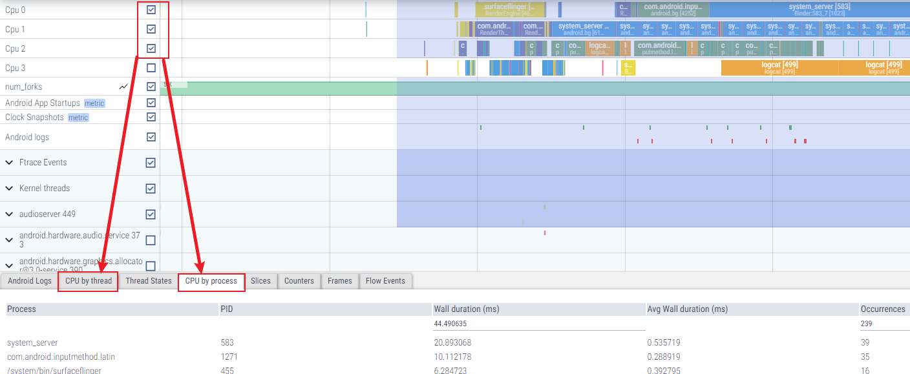


#### Binder流的数量

当前时间 + 选中的进程的：

> 


## 高阶---SQL语言统计信息

### google已经添加的sample

> （1）所有进程：
>
> 
>
> （2）进程占用的cpu时间：
>
> 


### 统计**各个进程的 总占时，且排序**：

```java
select
  process.pid,
  process.name, sum(dur)/1e9 as cpu_sec
from sched
join thread using (utid)
join process using (upid)
group by upid, pid order by cpu_sec desc;

```

可见，前几名耗时的是audioserer、allocator、..............


-<font color='red'>cpu占用率计算</font>（以system_server为例子）：

> 0.282787991/10s的trace*4个cpu核  = 0.0028

-<font color='red'>cpu核心空闲时长：</font> swapper是CPU线程唤醒机制

> pid = 0 占用了34s  -------> swapper是占空的？也就是40s内，有34s cpu核心是没有用的

### 统计**各个线程的 总占时，且排序**：

```java
select
  thread.name as threadname,
  thread. tid as tid,
round (sum(dur) / 1e9,2) as cpu_sec
from sched
inner join thread using (utid) group by threadname, tid
order by cpu_sec desc
```

可见，**Render线程还是很耗时的**。而且每个应用一个render线程


cpu占有率计算，同上


### 查询与某一线程 有相关调用的线程

即：弄清楚线程的交互关系

TODO: 没弄懂，如何找到waker.name？

比如：**查找InputDispatcher线程  唤醒 哪些线程？**

```java
DROP VIEW IF EXISTS wakee_table; 
CREATE VIEW wakee_table AS
SELECT
  waker.tid as waker_tid, wakee_runnable.utid as wakee_utid
FROM thread AS waker
JOIN thread_state AS wakee_runnable ON waker.utid = wakee_runnable.waker_utid 
    WHERE waker.name = "InputDispatcher";

SELECT waker_tid, thread. tid, thread.name
FROM wakee_table
JOIN thread ON thread. utid=wakee_table.wakee_utid;
```

唤醒的：


### TODO: 理解SQL语句含义

后面写自己的语句

## binder跨进程调用

### 调用点跳转（回跳）：

图形化的好处，可以点击跳转，方便

#### 选中箭头，然后点Flows的跳转箭头

> binder async rcv : <font color='red'>异步接收端</font> 
>
> 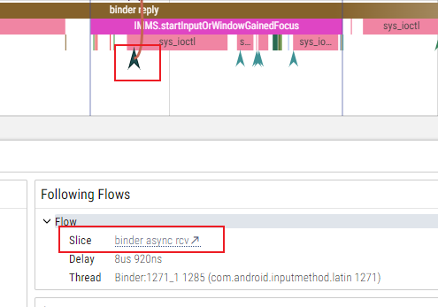

同理，<font color='red'>binder transaction async 异步调用端</font>，点击箭头，**回跳**


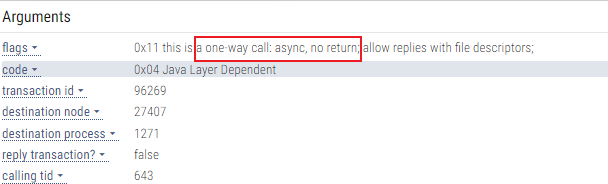

------------>  没有return的one-way调用

#### -<font color='red'>对应的binder流：</font>  耗时，调用者，被调用者

> 


对于trace看binder调用的优点：

> 跨进程binder调用，比同进程调用（很多时候，没有添加），更容易发现一些

#### 特点

-<font color='red'>trace监控了所有的binder调用。</font>

在binder层面做的监控 -----> 所以没有名字

**推论：**

> 所有的跨进程调用，都会在trace中体现 --------> 问题在于，<font color='red'>TODO：如何和代码对应？</font>


### 两种binder调用的画法不同

1、oneway形式的（没有返回）：

> -<font color='red'>图中特征：</font>
>
> （1）<font color='red'>有小箭头</font>
>
> （2）、调用点一定在被调用之前
>
> 

2、有返回值的

即同步调用

-<font color='red'>图中特征：</font>

（1）<font color='red'>binder transaction  & binder reply</font>

（2）图中画线调用点在被调用之后（<font color='green'>画的有问题？</font>），但实际上，

> -<font color='red'>A、调用点为红色框点；</font>
>
> -<font color='red'>B、返回点是binder transaction结束点（此时拿到返回值）</font>

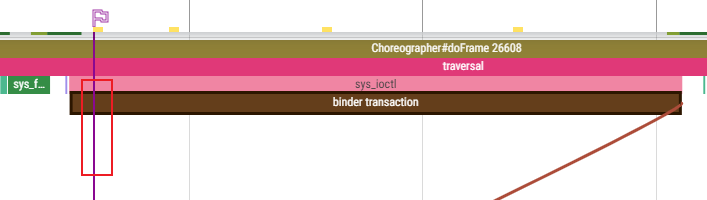


## 线程 之间 同步（同进程）

原理见：《线程唤醒者分析(函数调用者分析)----perfetto》

**等价于： 线程状态 sleep---> Running**

特征：

**1、会有系统调用 sys_futex**

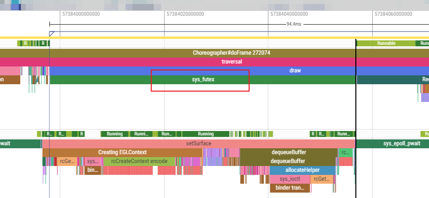

2、**在sys_futex上方，线程是sleep状态**，没有执行


3、被调用线程在结束时，也会有sys_futex：

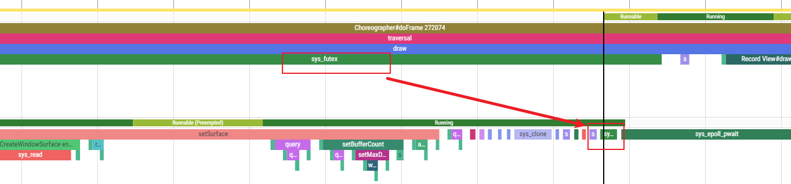


如何找主线程在等待哪个线程？ <-------->   即 主线程调用了哪个线程？  <-------->   即 主线程 被 哪个线程阻塞住了？  <-------->  即 主线程

---<font color='red'>性能优化经验：</font>

> 一旦 一个线程阻塞了另一个线程，大概率是有优化空间的


## 锁竞争(`lock contention`)

https://blog.csdn.net/SOHU_TECH/article/details/131118616

## 已知

### 锚点

google已经为我们准备好了一些锚点-----> 大的TAG：

-<font color='red'>以这些为锚点，找其他的</font>

1、Andriod App Startups


这段做了啥事情？

> 从进程起来---->  到 第一帧绘出来
>
> 

-----------> **注意，这就是APP冷启动时间**

### bufferTX

统计surfaceFlinger中每一个layer


## 小技巧：


### 浏览器全屏F11

看trace**纵向是稀缺资源** ，所以，浏览器全屏F11

### 两个搜索联合使用：


### 立即保存ps信息

atrace下

## 终极目标：拼图

-<font color='red'>挪动线程到一起，串点成线：</font>

------------->   <font color='red'>TODO: 这个是阅读trace的唯一目标？</font>


标准：

> 没有空白； 
>
> binder调用链条完整

作用：

> 逻辑上完整
>
> **减少上下的滚动**  ------>  <font color='red'>美好</font>

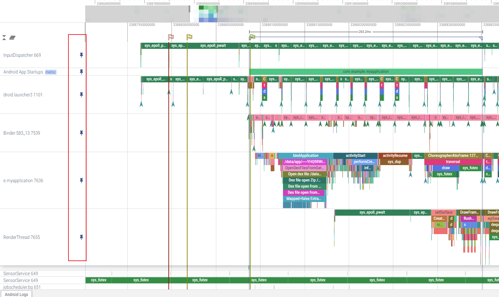


关联法：

> <font color='red'>抛开代码，</font>去连图  ------->  搭建框架
>
> <font color='red'>极优：不依赖于代码知识！！！！！</font> -------->  所以，**不需要看代码，而是看图说话**
>
> 

技巧：

> 动态调整


步骤：

1、按照大的概念，把各个大模块凑起来：-------> 存在很多空缺。<font color='red'>后面工作就是填补空缺思想</font>

2、把这个大模块链接起来  ---->  当然是Binder链接。。<font color='red'>不能依赖于代码</font>

 TODO:  步骤

​            

3、将新的线程（**根据2中的链接**）实时往pin里添加


## 实战


### 应用冷启动--以Launch点击应用图标为例

《见startApp》

### TODO:  其他章节用systrace来分析


## Systrace的原理

参考：

https://blog.csdn.net/feelabclihu/article/details/106247862  好文


简易的流程图：


**具体实现：**


Systrace抓取的trace数据，总体上可以分为两类：
一类是Java和Native在用户层发生的函数调用，一类是内核态的事件信息。


### 开源代码

systrace的生母，谷歌开源项目https://chromium.googlesource.com/catapult。

## Perfetto快捷键

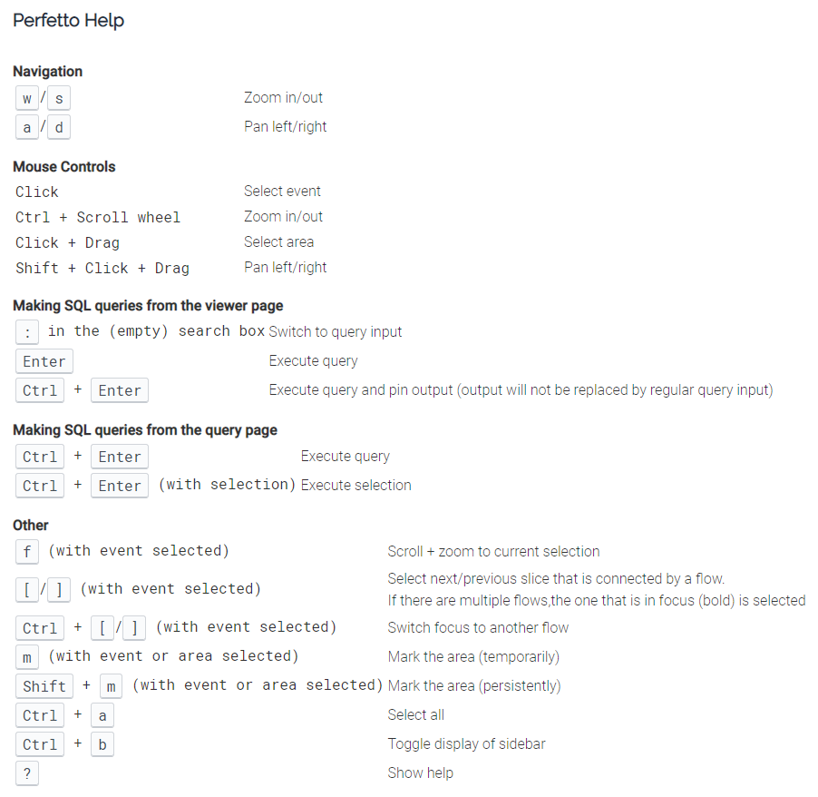

技巧：

> 用a与d 放大缩小时，**鼠标左键点击（或者<font color='red'>鼠标悬停</font>），成为放缩的中心**


### 技巧：

1. 通过在时间间隔周围绘制一个矩形来选择所需的时间间隔。

2. 使用标尺工具标记或突出显示问题区域。

3. 依次点击 View Options > Highlight VSync，以显示每项显示屏刷新操作------->  标出一帧

   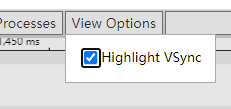

4. 筛选Processes
   


5、加了界限后，立马切换其他模式  ---->  这样界线可以长久保存


## 遇到的坑：

### platform-tools下找不到systrace文件夹

  https://www.jianshu.com/p/626eaebaa6a8

### 没有写入权限：

> （1）主要这个文件路径不能删除
>
> （2）这个路径是专门为trace准备的。结果不能存放在其他目录


解决办法：

> 方法一：重新刷机
>
> 方法二：模拟器，重新替换img
>
> 方法三（<font color='red'>优</font>）：adb shell setenforce 0           ------> 实际上就是关闭**Selinux权限**     
>
> 参考：https://blog.csdn.net/qq_19004627/article/details/119612924


```java
使用setenforce 命令进行设置:
adb shell setenforce 0 //设置成permissive 模式
adb shell setenforce 1 //设置成enforce 模式
```


### ~~超长slice~~.

原因：

> (1)、没有加成对的tag
>
> （2）、很多的超长slice  ----->  buffer不够，tag掉了


## 参考：

https://www.androidperformance.com/2019/05/28/Android-Systrace-About/#/%E7%B3%BB%E5%88%97%E6%96%87%E7%AB%A0%E7%9B%AE%E5%BD%95       

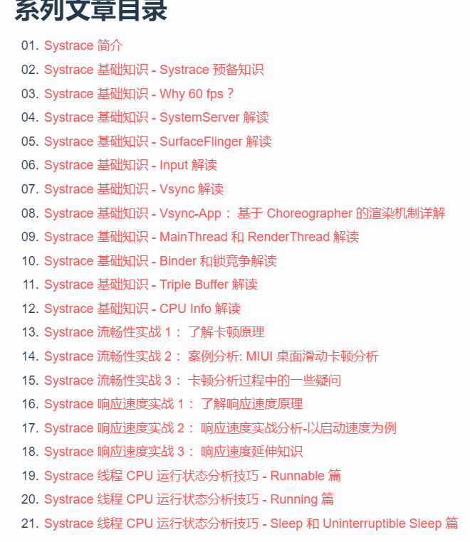

https://www.jianshu.com/p/a14bfdc4109a?utm_campaign=maleskine&utm_content=note&utm_medium=seo_notes&utm_source=recommendation  


https://blog.csdn.net/qq_23452385/article/details/131567881  Perfetto 命令行工具（Android 10 及更高版本）_android perfetto_xhBruce的博客-CSDN博客

https://perfetto.dev/docs/data-sources/cpu-scheduling   <font color='red'>perfetto的官方文档 </font>

https://huaweicloud.csdn.net/63563dbad3efff3090b5be9c.html?spm=1001.2101.3001.6650.7&utm_medium=distribute.pc_relevant.none-task-blog-2%7Edefault%7EBlogCommendFromBaidu%7Eactivity-7-126672666-blog-129736238.235%5Ev38%5Epc_relevant_anti_t3&depth_1-utm_source=distribute.pc_relevant.none-task-blog-2%7Edefault%7EBlogCommendFromBaidu%7Eactivity-7-126672666-blog-129736238.235%5Ev38%5Epc_relevant_anti_t3&utm_relevant_index=8    高阶


## TODO:

通过transactionid找对应的方法WW

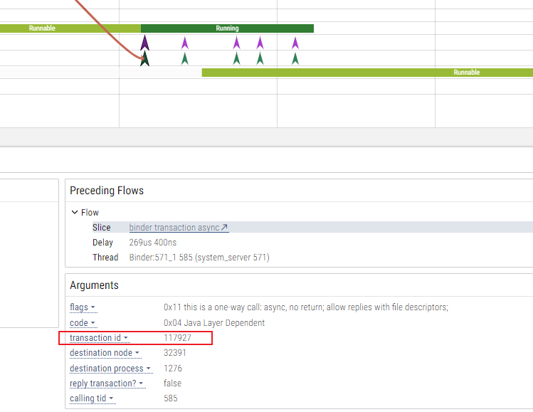

2、如何把竖向弄窄一点儿？


3、binder Traction调用，时间轴上是往回的呢？

4、多看几次视频，学会精髓

5、普通trace与perfetto的转换


# atrace 

adb shell atrace sched freq idle am wm gfx view sync ss power rs res binder driver binder _lock input hal camera aidl disk -b 96000 -t 5

atrace优点：<font color='red'>一定能用：</font>

> 安卓新老版本都能 使用


详解：

```java
adb shell atrace  \
sched freq idle \  CPU的排程和频率
am wm gfx view sync ss power rs res \framework层
binder driver binder _lock \binder调用关系
input hal camera aidl disk \驱动：输入、相机
-b 96000 -t 5    \ buffer大小10M左右，时间5s
```

## 转html（perfetto网站查看）

TODO

atrace.out  转   perfetto显示

```java
 python systrace.py --from-file atrace.out -o atraceout2.html
```

--------> atraceout2.html可以加载到 perfetto界面

## 技巧之  没有process名如何查看

关于 各种  Process 878 等没有进程名：

法一：  需要脚本配置

法二： 点击所有进程展开      然后Chrome搜索

 

法三：systrace


# Oprofile


#  Layout Inspector

最优观察viewTree的工具

-<font color='red'>优点：</font>

（1）图形化 ，更深刻  

（2）图形与 文字相结合，并且可以点击互动 -----> **操作方便**，**对应关系非常明确**

（3）实际上，显示的数据 比xml显示的更加完整。比如这里，显示了  “微博热搜”的小程序按钮。。。。xml没有体现


（4）可以在左边搜索。。。。当页面 view过多时，可以精确区分（图形区域不容易区分）

（5）同dump一样，可以知道 TextView 具体的类


# winscope(快照)---闪屏问题

**winscope本质：**

> -<font color='red'>每一帧</font>，**都给整个系统拍快照**  ----> 这也是理解复杂系统的关键

--------------->  <font color='red'>基于帧，</font>1、所以，才可以解决闪屏问题

​                                     2、TODO: 肯定可以解决其他很多问题


方法一：

> winscope.html + winscope_proxy.py  ----> 直接获取（封装的adb命令）

方法二：直接使用adb命令，见下，官方文档


TODO:

问题的关键在于，如何看？

> 1、每个Task有个Z值，是层级


## 参考：

https://source.android.com/docs/core/graphics/tracing-win-transitions?hl=zh-cn    官方文档

https://www.jianshu.com/p/c28a81dc3a65


## 官方文档

https://developer.android.com/studio/debug/layout-inspector


# 一些环境使用原则：

使用linux下as调试或trace，就不能用win下As

ADB之间影响

# 参考


https://blog.csdn.net/innost/article/details/9008691


https://blog.csdn.net/u011578734/article/details/109497064


# 补充，脚本

```java
adb shell perfetto -o /data/misc/perfetto-traces/trace_file.perfetto-trace -t 20s sched freq idle am wm gfx view binder_driver hal dalvik camera input res memory
网站: https://ui.perfetto.dev/#!/
```


做系统稳定性问题分析，当遇到系统卡死时，我们经常要使用“kill -3 pid”来打印System_Server进程各个线程的Java调用栈，根据线程状态及调用栈来更进一步定位问题点，当然某个应该界面卡顿时间长时也可以通过这个命令来抓取Java调用栈进行分析。
注意native进程是不能用kill -3来打trace的，而是使用debuggerd.

https://droid10.com/Android/Android%E5%9F%BA%E7%A1%80%E6%93%8D%E4%BD%9C/


# TODO:

https://zhuanlan.zhihu.com/p/348548041  Android性能优化机制-优先级反转问题


https://pyautogui.readthedocs.io/en/latest/index.html    pyautogui操作电脑

https://blog.csdn.net/toopoo/article/details/124660769?utm_medium=distribute.pc_relevant.none-task-blog-2~default~baidujs_baidulandingword~default-5-124660769-blog-112331887.235^v38^pc_relevant_anti_t3&spm=1001.2101.3001.4242.4&utm_relevant_index=6     

