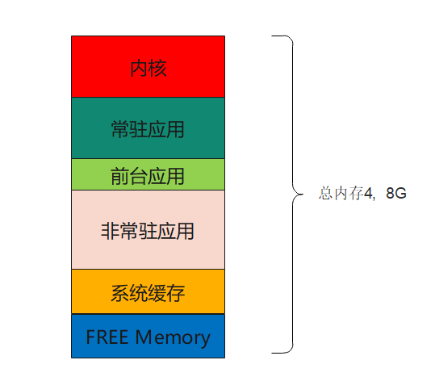
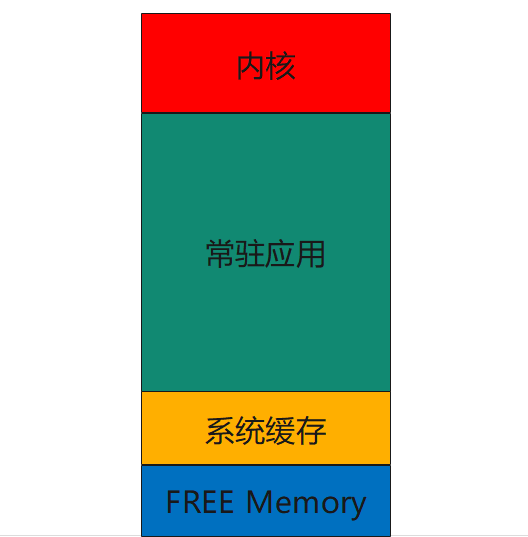

# 目录

# 应用角度：应用的内存分配原理与优化

## 维测：dumpsys meminfo [PID]/进程名

```java
 P13_5G:/ # dumpsys meminfo com.android.settings
 Applications Memory Usage (in Kilobytes):
 Uptime: 1051158931 Realtime: 1051158931
 
 ** MEMINFO in pid 23721 [com.android.settings] **
                    Pss  Private  Private  SwapPss      Rss     Heap     Heap     Heap
                  Total    Dirty    Clean    Dirty    Total     Size    Alloc     Free
                 ------   ------   ------   ------   ------   ------   ------   ------
   Native Heap     9349     9328        0     8470     9648    33840    17957     6181
   Dalvik Heap     5896     5864        0      276     6144     9741     4871     4870
  Dalvik Other     2091     1428        0       50     3056
         Stack      548      548        0      320      552
        Ashmem        8        0        0        0       28
     Other dev       32        0       20        0     1016
      .so mmap     6612      248       52        0    51320
     .jar mmap     1524        0        0        0    31236
     .apk mmap     8612        0     5872        0    30792
     .ttf mmap       70        0        4        0      428
     .dex mmap      206       12      188        0      356
     .oat mmap     1388        0       80        0    13284
     .art mmap     2065     1324        4      572     9552
    Other mmap     1323       28       48        0     8080
    EGL mtrack     3780     3780        0        0     3780
     GL mtrack     5560     5560        0        0     5560
       Unknown      299      296        0      337      360
         TOTAL    59388    28416     6268    10025    59388    43581    22828    11051
 
  App Summary
                        Pss(KB)                        Rss(KB)
                         ------                         ------
            Java Heap:     7192                          15696
          Native Heap:     9328                           9648
                 Code:     6460                         128744
                Stack:      548                            552
             Graphics:     9340                           9340
        Private Other:     1816
               System:    24704
              Unknown:                                   11212
 
            TOTAL PSS:    59388            TOTAL RSS:   175192       TOTAL SWAP PSS:    10025
 
  Objects
                Views:      288         ViewRootImpl:        1
          AppContexts:       12           Activities:        4
               Assets:        7        AssetManagers:        0
        Local Binders:       63        Proxy Binders:       68
        Parcel memory:      345         Parcel count:       76
     Death Recipients:       10      OpenSSL Sockets:        0
             WebViews:        0
 
  SQL
          MEMORY_USED:        0
   PAGECACHE_OVERFLOW:        0          MALLOC_SIZE:        0
```

**关注点：**

> ​    Pss 与 Swap

在ART/Dalvik 虚拟机接口：

> ```java
>  / Returns the maximum amount of memory that the Java virtual machine will attempt to use
>  long maxMemory = Runtime.qetRuntime ().maxMemory();
>  // Returns the total amount of memory in the Java virtual machine
>  long totalMemory = Runtime.getRuntime().totalMemory();
>   Returns the amount of free memory in the Java virtual machine
>  long freeMemory = Runtime.getRuntime().freeMemory();
> ```

----------------> 只是Dalvik Heap，没有太多意义。

不能反映一个应用用的真正内存

## 基础知识：

物理内存最小分配单位：1 个页 (page)，大小通常是 4KB

### 进程的内存占用分为两类：

> Anonymous Memory：例如 Java heap, native heap，从系统分配内存来填充数据
>
> File-backed memory：在磁盘上有对应的文件，以 mmap() 映射， 占用的内存为对文件最近存取的缓存

补充：

> 在磁盘上有对应的文件： （1）C语言的fopen、java的IO   (2) 以 mmap() 映射: 安卓大量使用，比如jar、dex等
>
> mmap方式，优点：见下

### Overcommit机制：

> 当申请内存时， Linux 并非马上就分配内存， 而是延迟到实际存取时，才真正分配内存
>
> ----> 例子：申请400k时：
>
> （1）到实际用的时候，才真正分配
>
> （2）也不是一次性分配400看，而是4kB分配
>
> 优点：
>
> > 代码分配内存后，有些可能分支没走到，没利用到 --------> Overcommit就会更经济
>
> 缺点：
>
> > 代码里使用内存  与  实际内存分配可能不一样，造成分析困难
>
> Q&A：
>
> > 来得及不？应该来的急，分配的效率是o（1）

### 低内存下的系统回收机制（安卓机制）

机制：

> 1、砍进程：退出后台的先后时间
>
> 2、对 File-backed memory 进行释放，因为磁盘中有备份 ------>  先释放，到时候按需加载
>
> 3、将 Anonymous memory swap 出去  ： swap到磁盘上（但是磁盘的速度远低于ddr----->安卓没有使用 ）
>
> 安卓对这些内存压缩。用到时候再解压

其中，常见的 **file-backed memory**

> APK 文件：映射目录结果与 resources.arsc
>
> 注： apk大部分文件压缩了，resources.arsc文件没有压缩   ----> 补充截图
>
> DEX 文件：DEX 优化后、可由虚拟机执行的代码
>
> so 文件：动态链接
>
> ttf 文件：字体

问题：图片一般使用 file-backed memory 方式分配内存吗？

**mmap 映射方式：**

> 先开启一个文件得到 fd，再利用 mmap() 将其映射到内存，代码中借由操作指针的方式存取缓存在内存的文件内容
>
> ```java
> void* mmap(void* start,size_t length,int prot,int flags,int fd,off_t offset); 
> //* start：映射区的开始地址，设置为0时表示由系统决定映射区的起始地址
> ```
>
> 优点：可以使用指针任意移动读取位置，代码好写。由操作系统处理文件的读取、缓存，以及在低内存、或少用时放掉。还能轻易实现跨进程
>
> 对只读文件的加载共享


**Anonymous memory** 


# 系统角度：常驻应用与后台服务

常驻应用：

> 因为功能实现需要，必须**长期、或是永久**驻留在后台的应用，可能处于不断运行、也可能处于按需运行

安卓实现后台持续运行的方法：

1. 在 AndroidManifest.xml 设 persistent=true -----> **默认做法**
2. 以 native 进程运行 -----> 安卓对native进程默认不杀。 TODO: 机制是啥？JVM检测不到？
3. 以 start service 运行，不停止
4. 以 start service + startForeground 运行，不停止 -----> startForeground 前台service
5. 间接因素：以 bind service、provider 绑定其他进程不放

自然，~~常驻进程越多，可用内存越少~~

## 安卓系统内存分布



~~图见：《Mem.eddx》~~

各个内存的**作用：**

>  TODO： **以pixel为例，各个大概多大？**
>
> Free Memory：没有被使用的 ----->  用来分配内存的
>
> 系统缓存： 加载的一些系统的so库

**分配内存，规则：**

> 1、分配内存时，**优先**从Free Memory内拿
>
> 2、Free Memory不够时，<font color='red'>需要扩充Free Memory：</font>
>
> （1） 非常驻应用 ----> 被杀应用，这个效果最好
>
> ​                       但 至少**保留刚退到后台**的应用
>
> （2）  释放系统缓存： **不能大量**，否则会造成性能下降（用到的一些so库，不在内存里）

问题： 

> 如果在分配内存的时候，才发现 Free Memory不够，**才去 杀应用释放内存，来不及**  ------>  性能不好
>
> <font color='red'>办法：</font>保证一定的Free Memory， lmk机制


Free Mem 与 非常驻应用 之间有个**平衡**：

> Q: Free Memory越多越好嘛？
>
> A: 会造成系统缓存小 ------> 性能下降
>
> 非常驻应用 刚刚退到后台，就被杀  ----->
>
> Q: 系统缓存越多越好嘛（比如把/system分区所有so库，锁在系统缓存中）？
>
> A:  很多so，平时不会被用到 -----> 对mem的浪费

---------------> 例子：在Free mem充足的情况下，也能保证 非常驻应用有四五个


例子： **总内存查看：**

```java
sailfish:/ #  cat /proc/meminfo
MemTotal:        3855820 kB   // ---------> pixel 手机内存3.67G. 与网上说的4G内存符合
MemFree:         1801968 kB
MemAvailable:    2683916 kB
Buffers:           38320 kB
Cached:           986340 kB
SwapCached:            0 kB
Active:           594956 kB
Inactive:         798328 kB
Active(anon):     465368 kB
Inactive(anon):     2784 kB
Active(file):     129588 kB
Inactive(file):   795544 kB
Unevictable:       96232 kB
Mlocked:           96232 kB
SwapTotal:        524284 kB
SwapFree:         524284 kB
Dirty:               248 kB
Writeback:             0 kB
AnonPages:        464880 kB
Mapped:           335976 kB
Shmem:              3296 kB
Slab:             149716 kB
SReclaimable:      48524 kB
SUnreclaim:       101192 kB
KernelStack:       25808 kB
PageTables:        31964 kB
NFS_Unstable:          0 kB
Bounce:                0 kB
WritebackTmp:          0 kB
CommitLimit:     2452192 kB
Committed_AS:   41658032 kB
VmallocTotal:   258998208 kB
VmallocUsed:      211792 kB
VmallocChunk:   258688724 kB
sailfish:/ #
```

## TODO：维测 上图6种内存查看

## ~~del: 特殊情况：一种特殊的系统设计~~

**设计理念：**

> **把系统所有应用都设计成常驻**



~~图见：《Mem.eddx》~~

采用的**前提**是：

> 封闭生态，无法安装其他应用  ---->  （软件角度：后期不会增加内存）
>
> 1. 系统应用占用的内存可控 ------> （ 硬件角度： 硬件有余量）

例子：**扶手屏项目**

## 非常驻应用 与 free Memory的博弈---LMK


~~图见：《Mem.eddx》~~

**博弈：**

> 1、**非常驻应用不能过少**，否则很容易 冷启动
>
> 2、**Free Memory 不能过小**，否则：应用<font color='red'>每次申请新内存</font>，<font color='red'>就需要触发系统机制</font>腾出 free memory， 速度慢


冷启动应用的耗时：加载资源等

安卓的**<font color='red'>设计理念</font>**是：

> 安卓刻意保留最近启动过的进程在后台，避免冷启动，使得下次启动时更快 （在Free Memory足够的情况下）
>
> TODO:  为啥安卓的冷启动，不咋滴？

LMK (Low Memory Killer) ----------满足上面设计理念

> 前提： 保障系统始终有足够多的 free memory
>
> 算法：以进程重要性 (称为 OOM ADJ, Out of Memory Adjustment ) 与内存大小，决定砍的顺

安卓系统没有**墓碑机制**，必须有自己的后台应用进程生命周期的管理------>  **lmk机制**

多任务能力 (Multi-Tasking Capability) -----------即保持后台应用个数的能力，即热启动的能力

> 评测开放生态系统的多任务能力：能驻留多少后装的第三方应用在后台，快速切换
>
> 多任务能力的保持，是安卓系统性能体验重要的一环，因此 LMK 的设计，既要保障有足够多的 free memory，又必须保障**最近使用过**的几个应用能保持在后台

### ~~del: 临时扩展：墓碑（Tombstone）机制~~


使用的系统范围：

> 微软WP7、ios；

-<font color='red'>设计理念：</font>

> ~~微软不允许任何 第三方应用程序]在WP7的后台运行，特定时间内只有一个应用程序的在前台运行，如果你的应用程序没有在前台显示，就表示这些程序并没有运行，这样就不耗费运行内存和处理器资源~~   ---------->  **简言之：** 杀死所有后台应用

墓碑含义：

> 墓碑：应用程序已经**死了**，但是墓碑上记录有**临终前的所有状态**（后面，**新启动新进程**，根据记录，恢复状态）

例子：

> WP7手机： 当用户正在使用一个应用程序，比如游戏或者新闻阅读，这时有电话打进来，来电提示和通话页面将会在前台显示，正在运行的游戏就会消失，WP7不允许后台运行应用，这时候墓碑机制就会触发，游戏的运行状态包括画面、进度等等数据会冻结保存   ----->  杀死后台游戏  ----->  等电话结束，启动游戏   -------->  恢复状态

从任务管理角度：

> 墓碑机制理念：单任务（第三方程序单任务）
>
> ------> 自然，~~多任务的都没有墓碑机制：mac、win、linux、Android~~

从内存角度看：

> ios墓碑机制 与 安卓 lmk机制，是对等的。都是 释放 后台应用内存的机制

比较：

> 墓碑机制，与 Android 状态保存机制，似乎异曲同工    ------>  备忘录模式

从后台应用的生命周期来看：

> 是一种后台应用生命周期管理机制

疑问：

> 墓碑机制，要启动进程（这个会慢嘛？），需要加载资源嘛（保存了数据就不需要了嘛？）
>
> ------------> ios为啥冷启动这么快？

参考：

> https://baike.baidu.com/item/墓碑机制/7558924?fr=ge_ala         墓碑机制

### ~~del: 临时扩展：Q: 内存清理 (一键加速) 能提升性能嘛~~

A:  <font color='red'> 好的系统设计下，不能</font> (反而冷启动，降低启动时间)

**例外：**一些差系统，是可以的

差系统：

> LMK 保留的 free memory 过少，导致需要频繁搜寻可用内存   ------> 系统设计问题
>
> 后台的非常驻应用持续运行，抢占 CPU 等系统资源   ------->  应用+系统问题（系统应该做限制）

------------------->  一键加速，优化的是这两点（**而这两点，系统设计可以解决掉**）

为啥 性能提升**有限**？

> 第三方应用做一键加速，只能 kill，无法 force stop。 以 service 运行的应用，kill 后仍会重启   ----->TODO:  kill 与 force stop区别

一键加速  缺点：

> 冷启动


### OOM SCORE ADJ：LMK 参考的进程重要性

| OOM_SCORE_ADJ | 分类意义    | 通过何种方式达到                                             |
| ------------- | ----------- | ------------------------------------------------------------ |
| -1000         | Native      |                                                              |
| -700 ~ -800   | Persistent  | 在 AndroidManifest.xml 设 persistent=true                    |
| 0             | Foreground  | 目前在前台运行的应用，或者正在运行 onReceive()、Service.onCreate()、onStartCommand() |
| 100           | Visible     | 被常驻应用 bind 住的 service/provider（自然，提升优先级），或者虽非前台、但能看到界面的应用 |
| 200           | Perceptible | startService() 且调用 startForeground()                      |
| 500           | A Service   | startService()                                               |
| 600           | Home        | 桌面在后台时                                                 |
| 700           | Previous    | 前一个退到后台的应用                                         |
| 800           | B Services  | startService() 且运行时间较长                                |
| >900          | Cached      | 单纯只有 activity 、已经执行完 receiver、service、provider   |

1. ADJ < 0 的， LMK 不砍 <-----------> 等价于：Native进程不管

   ​                       注： 极端情况下，ADJ= 0，也会被砍

2. ADJ 根据进程的状态决定， 不参考线程的状态


OOM_SCORE_ADJ 值<font color='red'>影响因素：</font>

> 上面所有、有没有activity、有没有service

visible理解：

> 1、前台应用
>
> 2、虽非前台、但能看到界面的应用   ----> 自然也是可见的

Perceptible 可感知：

> ~~虽然不可见，但是可以感知到~~： 比如播放音乐、录音

下载属于Perceptible嘛？ ------->  TODO:

B services  安卓发展，设计的补坑： --------> TODO: 如何知道历史原因呢？

> 随着版本演进，发现开发者启动的service越来越多 ------> 针对于时间较长的，做进一步区分

**安卓把配置留给了开发者，让开发者给应用分类到上面那个类别里**

### ~~del: 次要： Activity Manager 指派 OOM_SCORE_ADJ 的特殊规则~~

规则：

1、若应用分成不同进程运行，则每个进程根据运行的状态，指派对应的 ADJ

2、提升规则：

> A 应用透过 bind service, provider 方式绑定 B 应用的期间， B 的 ADJ 提升到与 A 相同

3、处罚规则：

> ~~非 foreground service 运行过久，ADJ 改为 cached~~  ---------> **简言之：**A service过久，改为B service；B service过久，改为 cached
>
> 具有 service/provider 的应用运行 activity，ADJ 改为cached


### 维测：各个进程的OOM adjustment

dumpsys meminfo

```
 Total RSS by OOM adjustment:
   1,861,186K: Native
         164,280K: zygote64 (pid 558)
         144,104K: zygote (pid 565)
         127,234K: surfaceflinger (pid 637)
         113,436K: app_process (pid 19438)
         109,624K: camerahalserver (pid 817)
         101,520K: media.codec (pid 813)
          95,348K: app_process (pid 19459)
          88,416K: logd (pid 323)
          73,848K: mtkfastavm (pid 301)
          40,486K: android.hardware.graphics.composer@2.1-service (pid 598)
          37,896K: webview_zygote (pid 1384)
          27,388K: em_svr (pid 720)
          25,548K: media.extractor (pid 777)
          23,008K: pcmanfm (pid 23480)
          22,792K: vtservice (pid 771)
          22,616K: mediaserver (pid 787)
          21,252K: lxpanel (pid 23477)
          21,012K: android.hardware.automotive.evs@1.0-service (pid 812)
          20,996K: audioserver (pid 630)
          19,448K: cameraserver (pid 751)
          18,380K: smartplatformserver (pid 800)
          15,326K: init (pid 1)
          15,296K: wpa_supplicant (pid 25964)
          12,948K: media.swcodec (pid 834)
          12,688K: openbox (pid 23474)
          12,560K: vpud (pid 833)
          11,204K: vendor.mediatek.hardware.pq@2.2-service (pid 829)
           9,736K: android.hardware.audio.service.mediatek (pid 567)
           9,520K: netd (pid 483)
           8,956K: lxsession (pid 23461)
           8,828K: android.hardware.neuralnetworks@1.3-service-mtk-neuron (pid 742)
           8,776K: android.hardware.graphics.allocator@4.0-service-mediatek (pid 591)
           8,720K: vendor.mediatek.hardware.mtkpower@1.0-service (pid 615)
           8,432K: vendor.mediatek.hardware.gpu@1.0-service (pid 612)
           8,392K: vendor.mediatek.hardware.sfs@1.0-service (pid 341)
           8,308K: adbd (pid 3336)
           8,100K: android.hardware.wifi@1.0-service-lazy (pid 1159)
           8,040K: android.hardware.gnss@2.1-service-mediatek (pid 575)
           7,864K: Xtightvnc (pid 23446)
           7,644K: keystore (pid 776)
           7,364K: wificond (pid 810)
           7,304K: update_engine (pid 849)
           7,212K: ueventd (pid 306)
           7,136K: carwatchdogd (pid 319)
           7,112K: networkmanager (pid 15624)
           7,020K: media.metrics (pid 779)
           6,868K: vold (pid 353)
           6,712K: gpuservice (pid 634)
           6,488K: credstore (pid 633)
           6,484K: gatekeeperd (pid 845)
           6,460K: init (pid 304)
           6,424K: gbe (pid 709)
           6,420K: android.hardware.automotive.vehicle@2.0-service (pid 569)
           6,328K: drmserver (pid 753)
           6,228K: mtkfastcalib (pid 827)
           6,144K: android.hardware.drm@1.3-service.clearkey (pid 572)
           5,904K: hwservicemanager (pid 334)
           5,900K: storaged (pid 805)
           5,896K: android.hardware.vibrator-service.mediatek (pid 622)
           5,628K: android.hardware.sensors@2.0-service-mediatek (pid 814)
           5,548K: android.hardware.lights-service.mediatek (pid 609)
           5,428K: getgameserver (pid 822)
           5,364K: installd (pid 775)
           5,212K: android.hardware.keymaster@4.0-service (pid 408)
           5,068K: android.hardware.gatekeeper@1.0-service (pid 574)
           4,992K: lbs_hidl_service (pid 608)
           4,984K: vendor.mediatek.hardware.nvram@1.1-service (pid 616)
           4,956K: vendor.mediatek.hardware.vpu@1.0-service (pid 618)
           4,952K: android.hardware.bluetooth@1.0-service-mediatek (pid 570)
           4,732K: servicemanager (pid 332)
           4,668K: incidentd (pid 755)
           4,648K: android.hardware.thermal@2.0-service.mtk (pid 603)
           4,640K: android.system.suspend@1.0-service (pid 407)
           4,608K: android.hardware.health@2.1-service (pid 599)
           4,572K: android.hardware.memtrack@1.0-service (pid 600)
           4,544K: statsd (pid 479)
           4,464K: android.hardware.drm@1.3-service.widevine (pid 573)
           4,456K: netdagent (pid 857)
           4,448K: aee_aed64 (pid 399)
           4,424K: dumpsys (pid 8743)
           4,400K: android.hardware.usb@1.1-service-mediatek (pid 606)
           4,344K: android.hardware.boot@1.1-service (pid 359)
           4,252K: com.android.car.procfsinspector (pid 1704)
           4,220K: android.hardware.automotive.audiocontrol@1.0-service (pid 568)
           4,212K: lbs_dbg (pid 743)
           4,172K: vndservicemanager (pid 335)
           4,120K: mlclient_test (pid 348)
           4,108K: batterywarning (pid 1985)
           4,096K: aee_aedv64 (pid 451)
           4,064K: android.hardware.cas@1.2-service (pid 571)
           3,940K: sh (pid 19436)
           3,900K: logcat (pid 27704)
           3,768K: android.hidl.allocator@1.0-service (pid 566)
           3,732K: sh (pid 13765)
           3,708K: timesync (pid 828)
           3,600K: aee_aed (pid 398)
           3,596K: netdiag (pid 792)
           3,556K: aee_aedv (pid 450)
           3,452K: thermal (pid 824)
           3,372K: wlan_assistant (pid 466)
           3,348K: traced (pid 732)
           3,288K: ip6tables-restore (pid 485)
           3,256K: thermald (pid 756)
           3,192K: iptables-restore (pid 484)
           3,180K: menu-cached (pid 23510)
           3,112K: sshd -p 22 [listener] 0 of 10-100 startups (pid 23426)
           3,084K: mobile_log_d (pid 791)
           3,064K: lmkd (pid 326)
           2,988K: traced_probes (pid 723)
           2,772K: thermalloadalgod (pid 826)
           2,744K: tombstoned (pid 460)
           2,684K: fuelgauged (pid 641)
           2,636K: sh (pid 336)
           2,244K: connsyslogger (pid 752)
           2,068K: dbus-daemon (pid 23388)
           1,204K: ssh-agent (pid 23487)
     667,164K: System
         667,164K: system (pid 726)
   1,376,891K: Persistent
         268,079K: com.android.systemui (pid 1189)
         148,336K: com.txznet.txz (pid 2151)
         124,156K: com.android.phone (pid 1493)
         115,260K: com.android.networkstack.process (pid 1323)
         110,260K: com.android.car (pid 1273)
         109,284K: com.android.car.systemupdater (pid 2095)
         101,992K: com.mediatek.entitlement.o2 (pid 1448)
          85,896K: com.mediatek.tbox.dataconnection (pid 3459)
          84,892K: com.mediatek.smartratswitch (pid 1352)
          84,772K: com.pvetec.ctrlcenter (pid 2179)
          74,136K: com.pvetec.carcorder (pid 2082)
          69,828K: com.android.se (pid 1417)
     310,160K: Persistent Service
         110,992K: com.txznet.txz:svr1 (pid 2539)
         110,712K: com.android.bluetooth (pid 1168)
          88,456K: com.txznet.adapter (pid 2435)
     176,876K: Foreground
         176,876K: com.android.settings (pid 23721 / activities)  // ------> 只有settings在前台
     873,773K: Visible
         214,865K: com.pvetec.launcher1 (pid 2254 / activities)
         170,272K: cn.kuwo.kwmusiccar (pid 31863 / activities)
         140,816K: android.ext.services (pid 1942)
         102,868K: cn.kuwo.kwmusiccar:remote (pid 31927)
         100,156K: com.pvetec.carcorderservice (pid 2384)
          75,884K: com.android.settings.intelligence (pid 23756)
          68,912K: com.android.experimentalcar (pid 1705)
     972,156K: Perceptible
         308,052K: com.autonavi.amapauto (pid 3569)
         184,876K: com.iflytek.inputmethod (pid 2045)
         146,792K: com.iflytek.inputmethod.assist (pid 2356)
         121,860K: com.autonavi.amapauto:locationservice (pid 3852)
         109,276K: com.autonavi.amapauto:push (pid 4016)
         101,300K: com.autonavi.amapauto:socol (pid 7468)
     153,692K: Home
         153,692K: com.pvetec.launcher (pid 2290 / activities)
     242,564K: B Services
          98,272K: cn.kuwo.kwmusiccar:pushService (pid 11569)
          73,820K: com.pvetec.carcorder:gdremote (pid 2330)
          70,472K: com.pvetec.presentation (pid 3143)
   1,066,632K: Cached
         145,812K: com.sonelli.juicessh (pid 32018)
         138,064K: com.mediatek.camera (pid 5029)
         134,564K: ru.meefik.linuxdeploy (pid 23046 / activities)
         127,660K: com.example.myapplication (pid 23379)
         119,132K: android.process.media (pid 2217)
          93,724K: com.android.permissioncontroller (pid 29140)
          83,244K: com.android.providers.calendar (pid 3496)
          77,820K: com.google.android.car.defaultstoragemonitoringcompanionapp (pid 11251)
          76,160K: com.android.webview:webview_service (pid 17588)
          70,452K: com.android.dialer (pid 32036)
```


### Q:  系统何时因为内存压力高而卡顿

**卡顿**来源：

1、砍Cached时：

> 导致 kswapd 忙碌运行，回收系统缓存。但系统一运行又建立缓存     ------>  TODO: **<font color='red'>经验</font>：**Cached 应用将被清完时，系统即出现明显的性能下降

2、砍B Services时：重度卡顿场景：砍到 ADJ <= 800

> kswapd 忙碌运行，回收系统缓存。但系统一运行又建立缓存     ------->  同上
>
> LMK 忙碌搜索哪些进程能砍
>
> 被砍的进程又立即重启   ----->  **service 被砍，立马又重启，会抢占cpu**。陷入循环？

| OOM_SCORE_ADJ | 分类意义    |
| ------------- | ----------- |
| -1000         | Native      |
| -700 ~ -800   | Persistent  |
| 0             | Foreground  |
| 100           | Visible     |
| 200           | Perceptible |
| 500           | A Service   |
| 600           | Home        |
| 700           | Previous    |
| 800           | B Services  |
| >900          | Cached      |

卡的**直观程度**：

> 砍到 B Services  ---->  比较卡
>
> 砍到  Perceptible   ---->  非常卡，黑屏（系统不停地在砍sevice，启动service，加载内存-----> 过于消耗CPU，做UI相关的CPU占用就少了）

### 解决/避免系统走入低内存的卡顿办法

方法：

> ~~del: 是否有单一前台应用占用过大，导致使用过程内存不足~~   自然
>
> 降低常驻应用的内存占用

问题：ADJ 0~800 的应用，是否低内存时砍不到？

1. 若内存持续低，会砍到。但砍到前，系统已经卡顿了
2. 砍了会重启（~~del：不是立即，差个几秒~~），重启过程视同前台应用抢占CPU资源，导致更卡

## 各种应用的Mem与CPU占用详解

### Persistent 应用

应用侧配置：

```java
 <application
     android:allowBackup="false"
     android:label="@string/app_name"
     android:resizeableActivity="false"
     android:persistent="true"  // --------> 这里
     android:theme="@style/AppTheme"
     android:supportsRtl="false"
     android:configChanges="uiMode"
     android:name="...">
```

特性：

> 开机后自启动
>
> Crash 后会自动重启

可能导致的问题：

1、Mem角度：

> 永远占用内存：（1）不管功能是否有在使用
>
> （2）即使有内存泄露，系统也没有机会回收   ------>  **这个问题比较大**
>
> ~~del: 只要含有 activity，内存超过 100 MB 很常见~~（注：一个空activity就有几十MB）   ---> 正常应用都有的问题
>
> Persistent 进程占用内存越多， 系统可用余量越小

2、CPU角度：

> CPU Schedule:   只要运行，与前台应用同样优先级抢占 CPU  （Persistent 的意外代价） -------> 特别注意：原先可能，设置为Persistent防止被砍（内存），但是却提高了cpu的优先级
>
> 开机慢：~~del：过多 persistent 应用，开机时系统会忙于启动这些应用~~

TODO: Persistent 与前台应用同样CPU优先级，这个是否合理？

### Perceptible/A Service/B Service 应用

Start service 后，成为 A service。执行时间长，或 A service 过多，成为 B service。A service,   B service 可占用的 CPU 资源较前台小，必要时可适度让给其他应用，适合**用户不感知**的任务

```
 public int onStartCommand(Intent intent, int flags,int startId);
```

> 返回 START_STICKY：当进程未 stop 前被砍，系统会重启进程与服务，并重走onStartCommand()，此时 intent 为 null。因此可根据 intent 是否为 null，判断是否重启
>
> 返回 START_NOT_STICKY：当进程未 stop 前被砍，系统不会重启进程。 适合不紧急、可直接结束的后台任务。
>
> 返回 START_REDELIVER_INTENT：当进程未 stop 前被砍，系统会重启进程与服务，并重走onStartCommand()，且带入上次的 intent

 ----------> TODO: 不懂

Service 执行 startForeground() 后，成为 foreground service，ADJ 成为 perceptible。设计的本意，是执行用户可感知的任务，且需要跟前台给予相同 CPU

资源，例如播放音乐。但此设计存在被误用的漏洞，被各种应用误用。

如何限制A service,   B service 占用CPU？

> （1）把 A service,   B service 限制到小核上  ------> 前台应用可以在大核上，比较快
>
> （2）cgroup。例如：前台分配85% CPU资源，后台分配15% CPU资源
>
> 比如：**用户不感知**的任务-----微信收消息，差1~2s无所谓

可能导致的问题（**和Persistent 很像**）：

> 只要不是设计成 START_NOT_STICKY，永远占用内存，不管功能是否有在使用
>
> 即使有内存泄露，系统在杀进程回收前，已经进入卡顿状态  ------->  **唯一与Persistent 区别的点**：内存写泄漏可能被回收
>
> 只要含有 activity，内存超过 100 MB 稀松平常
>
> Perceptible：只要运行，与前台应用同样优先级抢占 CPU
>
> 占用进程越多， 系统可用余量越小

### Visible 应用

种类：

1、虽是后台应用，但有用户可见的 activity

2、**被 Persistent 进程**以 bindService()、或 provider 绑定的进程（注：自然，**提升原则：被 Persistent 进程**）。对系统可用内存影响大的是这种。可能导致的问题：

> 永远占用内存，不管功能是否有在使用
>
> 即使有内存泄露，系统在杀进程回收前，已经进入卡顿状态
>
> 只要含有 activity，内存超过 100 MB 稀松平常
>
> Perceptible：只要运行，**与前台应用同样优先级抢占 CPU（同样）**
>
> 占用进程越多， 系统可用余量越小


被调用者，很难察觉。<font color='red'> **绑定关系**</font>（service、provider）如何查看：

> ------------> **维测：：**  dumpsys activity services
>
> 关键词：对应的包名 或 Connections，比如Sogou输入法
>
> ```java
>   * ServiceRecord{51166c9 u0 com.sohu.inputmethod.sogou/.SogouIME}
>     app=ProcessRecord{4a96f05 23794:com.sohu.inputmethod.sogou/u0a203}
>     created=-1d22h3m15s150ms started=false connections=1
>     Connections:
>       act=android.view.InputMethod -> 1554:system/1000
> ```
>
> --------------->  只有一个绑定 
>
> https://blog.csdn.net/u011386173/article/details/83414589


### Receiver 与 Service 的 ADJ

**总之：**

> 根据 组件的运行阶段，来动态调整ADJ

1、Broadcast Receiver

> 应用调用 onReceive() 的过程，进程的 ADJ 为 0
>
> 离开 onReceive() 后，根据应用的其他状态来决定 ADJ

2、Started Service

执行 onCreate()、onStartCommand() 的过程，**进程的 ADJ 为 0**，stopService() 或stopSelf() 后，根据应用的其他状态来决定 ADJ。 在 stop 之前，ADJ 可能经历几种变化：

> A Service：Service 刚运行时
>
> B Service：若系统同时运行的 Service 过多，较早启动的会放到 B Service
>
> Cached：运行超过 30 分钟、或曾经启动过 activity

### ~~del:Receiver 常见的误区~~

```
 // AndroidManifest.xml
 <receiver android:name=”.MyReceiver”>
       <action android:name=”android.intent.action.BOOT_COMPLETED” />
 </receiver>
 
 // MyReceiver.java
 public class MyReceiver extends BroadcastReceiver {
     public void onReceive(Context context, Intent intent) {
         new Thread() {
             public void run() {
                 // 做超过 10 秒的事， 避免主线程上运行时间久， 导致 ANR
             }
         }.start();
     }
 }
```

当应用离开 onReceive(), ADJ 就不再为 0， 系统根据应用其他的状态决定 ADJ， **最差情况可能变为cached**。 因此当系统进行大量广播、 或者内存较紧时， **进程可能很快被杀掉。**--------> 所以，是个概率性问题。

解决方法： **跑一个service提升**：

> 在 Receiver() 中， 需要长时间运行的， 启动 IntentService 来运行

### Bind Service

若调用端与被调用端分属不同进程，则 bind service 可能会影响被调用端的，：

> OOM Score ADJ：被调用端的 ADJ 调整到与调用端同样重要
>
> CPU scheduling：当调用端为 foreground scheduling 时 （例如前台应用，persistent,visible, perceptible)，被调用端也会被提升至 foreground scheduling

   -----------> **cpu与Mem的双提升**

若调用端与被调用端同属一个进程，则 bind service 不影响 OOM Score ADJ 与 CPUscheduling, 自然

Bind service 可带以下参数控制行为：

| 参数                      | Service 所在进程的 OOM Score ADJ                          | Service 进程的 CPU 分配                                      | 使用场合                                                     |
| ------------------------- | --------------------------------------------------------- | ------------------------------------------------------------ | ------------------------------------------------------------ |
| 默认行为                  | 与调用端一致。若调用端是 top，则 service 为 visible       | 与调用端一致（~~del：注：非常自然，不能拖累~~）              |                                                              |
| BIND_NOT_FOREGROUND       | 与调用端进程一致。若调用端是top，则 service 为 visible    | 不根据此次 binding 影响 service进程的 scheduling（注：改了cpu） | 当调用端为 system_server、persistent 进程，且不要求执行速度时 |
| BIND_ALLOW_OOM_MANAGEMENT | 不强制与调用端进程一致。service进程可能在内存不够时会被砍 | 与调用端进程一致                                             | 当调用端为 system_server、persistent 进程，预期可能 service执行时间常、内存大，且已经做好service 进程被砍的容错处理 |
| BIND_WAIVE_PRIORITY       | 不根据此次 binding 影响 service进程的 ADJ                 | 不根据此次 binding 影响 service进程的 scheduling             | 对执行速度不要求，且已经做好service 进程被砍的容错处理       |
| BIND_ADJUST_WITH_ACTIVITY | 当调用端显示可见的 activity 时， ADJ 与调用端一致         | 当调用端显示可见的 activity 时， service 进程为 foreground scheduling | 当调用端在后台时，不要求 service进程的执行速度，且已经做好service 进程被砍的容错处理 |

## “常驻应用”总结

### “常驻”应用定义 ：

狭义

> 在 AndroidManifest.xml 设置 persistent = true 的应用

广义

应用透过某种方式，直接、间接长时间驻留在后台，即使砍了也会重启的都算。**广义包含：**

> 不停止的 started service
>
> 常驻应用在后台透过 bindService 绑住另一个进程不放，使其跟着常驻
>
> 常驻应用在后台透过 provider 绑住另一个进程不放，使其跟着常驻
>
> 应用透过 alarm manager 或其他保活手段，即使被砍了会重启
>
> native daemon

‒ **描述、讨论是否常驻问题时，采用广义定义**

### 常驻应用对系统的影响

内存占用：常驻应用持续占用内存，减少系统整体可用内存。 一般常见的设计/实现问题有：

> 本质上不需要常驻的部分，也跟着常驻了，例如 activity  --------> 办法：分空间： 常驻和非常驻，放到两个进程里
>
> 功能不需要持续在后台运行，只有在特别时段、条件满足时，才需要在后台驻留，但也设计成永远常驻了 ----> 设计上分时
>
> 以独立模块思考应用实现，未考虑与其他业务常驻监听的共用、或者寻求系统框架的修改支持
>
> 未考虑如何常驻时，**尽量最小化内存**  -----> 办法： **无法避免，尽量减小影响**
>
> 本身已是常驻应用，又长时间透过 bind service、provider 绑住其他应用，导致其他应用也常驻了

CPU 占用：

> Persistent, Foreground, Visible, Perceptible，对系统而言，以前台应用对待。 当常驻应用在后台运行时，就会跟前台应用争夺 CPU 资源，造成前台卡顿（如果多的话）

### 审视常驻、后台运行的必要性

**1、最小权限原则：**

> 能 service 搞定、就不要设 foreground service； 能 foreground service 搞定，就不要设 persistent。能只在某段时间常驻，就不要设计成永远常驻

2、非用户可感知、或不需及时响应的后台任务， 皆不要设置为 foreground service

> 需要用户可感知、需要抢占较多 CPU 的任务：音乐播放、后台导航
>
> **不需要用户感知的任务**：后台下载、后台复制、长链接监听、系统状态监听

3、为了 activity 启动速度而常驻，是不被允许的理由。应用必须优化冷启动流程

### 万不得已，必须常驻时：

1、**最小化常驻内存量：** 除了 Launcher、SystemUI、输入法，合理的后台内存常驻占用：30 MB     -----> TODO: 除了是啥意思？  TODO: dump验证一下

2、常驻应用禁止长时间以 bind service, provider 绑定其他进程，必须尽快使用完且立即释放

3、播放类的应用，不应设为 persistent。且应采用以下两种方法之一进行内存优化：

> 分离 service 与 activity 到不同进程。 Service 运行播放或下载等需要长时间运行的任务，activity 进程在后台时成为 cached，可以被系统按需回收
>
> -------------------> **安卓希望开发者做到的设计**
>
> 当播放任务停止、或尚未开始时， 应用进程内所有的 service 必须停止，让应用在后台时成为cached

4、下载类的应用，原则上不需常驻，应用退到后台时，运行 service 进行下载即可，下载完就停止service。 若包含了需要常驻的功能，则应分离 service 与

activity 到不同进程。

5、 具备接收 **Push 消息**的应用，**不应设为 persistent**，且需要分离 service 与 activity 到不同进程

### ~~del: 临时展开：具体Service 与 Activity 如何分离？~~

- 在 AndroidManifest.xml 中，以 **android:process 属性（多进程）**指定 service 运行在另一个进程。UI 与service 之间，借由 AIDL 通信
- Provider 如果是 service 常存取的， 就运行在与 service 同一个进程
- 如果 Reciever 需要监听某些高频广播、或是只有 service 在才能运行的动态广播， 就跟 service运行在同一个进程
- 一个应用不要产生超过 2 个进程 --------> 微信有四五个进程


例子：


## 维测 之  常驻、非常驻 内存

dumpsys meminfo 然后根据 Total PSS by OOM adjustment 里的 类型:

> 非常驻 = Cached + Previous
>
> 其他---------> 常驻进程


%accordion%例子：%accordion%


```java
Total PSS by OOM adjustment:
  1,018,230K: Native
        324,198K: android.hardware.graphics.allocator@2.0-service (pid 718)
         69,909K: CameraDaemon (pid 1055)
         49,889K: sh (pid 21517)
         40,188K: surfaceflinger (pid 754)
         39,004K: android.hardware.graphics.composer@2.2-service (pid 719)
         37,921K: installd (pid 1036)
         34,765K: media.codec (pid 1059)
         25,700K: zygote64 (pid 1018)
         21,919K: app_process (pid 21785)
         20,587K: hiaiserver (pid 1070)
         17,640K: webview_zygote (pid 2677)
         17,329K: hiview (pid 1073)
         16,171K: zygote (pid 21951)
         12,606K: audioserver (pid 750)
         12,299K: cameraserver (pid 1029)
         11,687K: zygote (pid 670)
         11,528K: dubaid (pid 1032)
         11,220K: media.extractor (pid 1039)
          8,079K: media.swcodec (pid 1065)
          8,012K: hignss_1103 (pid 1888)
          7,165K: zygote64 (pid 669)
          6,941K: mediaserver (pid 1046)
          6,841K: vendor.huawei.hardware.audio@5.0-service (pid 728)
          6,295K: netd (pid 668)
          5,998K: rild (pid 1062)
          5,980K: distributedsche (pid 842)
          5,762K: init (pid 1)
          4,856K: distributedfileservice (pid 23475)
          4,111K: logd (pid 496)
          3,773K: AGPService (pid 1027)
          3,747K: samgr (pid 662)
          3,700K: aptouch_daemon (pid 882)
          3,347K: vendor.huawei.hardware.biometrics.hwfacerecognize@1.1-service (pid 1024)
          3,151K: storaged (pid 1052)
          3,125K: vold (pid 515)
          3,019K: displayengineserver (pid 1030)
          2,645K: hsensors (pid 832)
          2,532K: wpa_supplicant_hisi (pid 11930)
          2,451K: vendor.huawei.hardware.hwdisplay.displayengine@1.2-service (pid 732)
          2,429K: vendor.huawei.hardware.perfgenius@2.0-service (pid 745)
          2,412K: adbd (pid 4647)
          2,408K: locationhub (pid 845)
          2,394K: init (pid 477)
          2,291K: hilogd (pid 3254)
          2,264K: ueventd (pid 478)
          2,225K: media.metrics (pid 1045)
          2,155K: keystore (pid 1037)
          2,152K: audio_sa (pid 840)
          2,071K: statsd (pid 1051)
          2,047K: wifiservice (pid 853)
          1,991K: fusion_daemon (pid 1081)
          1,988K: accountmgr (pid 839)
          1,974K: vendor.huawei.hardware.gnss@2.0-service (pid 729)
          1,916K: hwservicemanager (pid 498)
          1,913K: tee_auth_daemon (pid 584)
          1,912K: chargelogcat-c (pid 24695)
          1,872K: bluetoothservic (pid 841)
          1,839K: nfcservice (pid 846)
          1,813K: vendor.huawei.hardware.wifi@1.2-service (pid 1084)
          1,725K: android.hardware.drm@1.2-service.widevine (pid 22555)
          1,720K: activity_recognition_service (pid 714)
          1,683K: distributedfiledaemon (pid 4590)
          1,652K: hwpged (pid 1061)
          1,638K: netmanager (pid 837)
          1,599K: vendor.huawei.hardware.libteec@3.0-service (pid 586)
          1,598K: telephony (pid 849)
          1,586K: vendor.huawei.hardware.hivrar@2.1-service (pid 731)
          1,564K: emcomd (pid 1021)
          1,560K: powerlogd (pid 755)
          1,556K: vendor.huawei.hardware.sensors@1.2-service (pid 1064)
          1,540K: vendor.huawei.hardware.hwsecurity-service (pid 737)
          1,530K: vendor.huawei.hardware.biometrics.fingerprint@2.2-service (pid 1083)
          1,527K: bms_auth (pid 24696)
          1,519K: resschedd (pid 848)
          1,488K: vendor.huawei.hardware.iawareperf@1.0-service (pid 739)
          1,478K: vendor.huawei.hardware.tp@1.0-service (pid 748)
          1,454K: thermal-daemon (pid 1053)
          1,443K: hisecd (pid 973)
          1,437K: mediadrmserver (pid 1038)
          1,436K: android.hardware.keymaster@3.0-service (pid 583)
          1,408K: bastetd (pid 1023)
          1,401K: gpuservice (pid 752)
          1,396K: apexd (pid 630)
          1,353K: vendor.huawei.hardware.hwhiview@1.1-service (pid 735)
          1,333K: android.hardware.secure_element@1.0-service (pid 725)
          1,324K: displayservice (pid 751)
          1,301K: hivrarserver (pid 961)
          1,290K: wificond (pid 2341)
          1,221K: vendor.huawei.hardware.nfc@1.0-service (pid 744)
          1,210K: android.system.suspend@1.0-service (pid 711)
          1,189K: android.hardware.configstore@1.1-service (pid 716)
          1,188K: vendor.huawei.hardware.hwfactoryinterface@1.1-service (pid 734)
          1,149K: incidentd (pid 1035)
          1,141K: lmkd (pid 753)
          1,141K: drmserver (pid 1031)
          1,139K: vendor.huawei.hardware.power@1.0-service (pid 746)
          1,138K: modemchr (pid 5824)
          1,128K: teecd (pid 585)
          1,127K: bsoh (pid 972)
          1,112K: iGraphicsservice (pid 1033)
          1,104K: mdnsd (pid 11530)
          1,094K: gatekeeperd (pid 1071)
          1,075K: abb (pid 7587)
          1,072K: bms_heating (pid 24688)
          1,069K: vendor.huawei.hardware.hwvibrator@1.1-service (pid 738)
          1,069K: vendor.huawei.hardware.motion@1.0-service (pid 742)
          1,069K: hinetmanager (pid 1077)
          1,065K: ip6tables-restore (pid 23307)
          1,060K: vendor.huawei.hardware.hwdisplay@1.1-service (pid 733)
          1,059K: bms_protocol (pid 24698)
          1,058K: iptables-restore (pid 23306)
          1,036K: vendor.huawei.hardware.vdecoder@1.0-service (pid 2615)
          1,016K: vendor.huawei.hardware.fm@1.0-service (pid 1025)
          1,000K: bms_soc (pid 24693)
            981K: oam_hisi (pid 1882)
            976K: powerct (pid 590)
            976K: dumpsys (pid 25381)
            971K: bms_behavior (pid 23421)
            968K: android.hardware.usb@1.0-service (pid 2371)
            956K: android.hardware.gatekeeper@1.0-service (pid 717)
            937K: vendor.huawei.hardware.jpegdec@1.0-service (pid 740)
            926K: pmom_cat (pid 976)
            922K: android.hardware.health@2.0-service (pid 720)
            908K: vendor.huawei.hardware.hwsched@1.0-service (pid 736)
            901K: android.hardware.ir@1.0-service (pid 713)
            901K: android.hardware.cas@1.1-service (pid 715)
            893K: servicemanager (pid 497)
            874K: sh (pid 25347)
            865K: vendor.huawei.hardware.hwfs@1.0-service (pid 30864)
            863K: vendor.huawei.hardware.light@2.0-service (pid 741)
            857K: android.hardware.memtrack@1.0-service (pid 721)
            856K: vendor.huawei.hardware.graphics.hwcinterface@1.1-service (pid 727)
            848K: vendor.huawei.hardware.graphics.mediacomm@2.1-service (pid 730)
            842K: android.hidl.allocator@1.0-service (pid 710)
            832K: android.hardware.thermal@2.0-service-hisi (pid 726)
            820K: android.hardware.power.stats@1.0-service.mock (pid 723)
            788K: android.hardware.atrace@1.0-service (pid 582)
            784K: oeminfo_nvm_server (pid 516)
            773K: healthd (pid 712)
            772K: vndservicemanager (pid 499)
            743K: ashmemd (pid 749)
            673K: usb_port (pid 24679)
            603K: bms_event (pid 588)
            596K: tombstoned (pid 1074)
            567K: octty (pid 1881)
            548K: sh (pid 21518)
            543K: unrmd (pid 1068)
            543K: sh (pid 21295)
    439,507K: System
        439,507K: system (pid 1554)
    628,842K: Persistent
        285,401K: com.android.systemui (pid 2532)
         46,017K: com.huawei.nearby (pid 2870)
         39,448K: com.huawei.harmonyos.foundation (pid 2793)
         39,184K: com.android.phone (pid 2948)
         38,901K: com.huawei.systemserver (pid 2885)
         35,260K: com.huawei.iaware (pid 2930)
         30,543K: com.huawei.HwOPServer (pid 2814)
         28,550K: com.huawei.hiview (pid 2842)
         21,056K: com.android.nfc (pid 7775)
         20,788K: com.huawei.securityserver (pid 2905)
         19,094K: com.huawei.hiaction (pid 7833)
         14,312K: com.huawei.android.pushagent.PushService (pid 4502)
         10,288K: com.huawei.android.extdisplay (pid 2625)
  1,263,189K: Foreground
      1,173,964K: com.ss.android.ugc.aweme (pid 20395 / activities)
         48,692K: com.ss.android.ugc.aweme:sandboxed_process1 (pid 22879)
         40,533K: com.huawei.systemmanager:service (pid 2715)
    516,435K: Visible
        235,438K: com.huawei.android.launcher (pid 15880 / activities)
        103,570K: com.huawei.hwid.core (pid 28866)
         38,852K: com.huawei.lbs (pid 6826)
         38,327K: com.huawei.hiai.engineservice (pid 8308)
         34,877K: com.huawei.android.totemweather (pid 32766)
         25,166K: com.huawei.recsys (pid 3970)
         16,943K: com.huawei.ohos.photos (pid 15301)
         11,968K: com.huawei.vassistant:interactor (pid 7751)
         11,294K: com.android.se (pid 16286)
    165,223K: Perceptible
        141,366K: com.sohu.inputmethod.sogou (pid 27072)
         23,857K: com.huawei.hwid.persistent (pid 16738)
     46,218K: A Services
         46,218K: com.android.settings (pid 24673)
    330,651K: Previous  // 非常驻【1】
        330,651K: com.tencent.mm (pid 8370 / activities)
    481,183K: B Services
        263,578K: com.tencent.wework (pid 17292)
         71,241K: com.tencent.mm:push (pid 8218)
         46,303K: com.tencent.wework:wemeet (pid 17335)
         45,173K: com.tencent.wework:push (pid 17433)
         33,167K: com.huawei.health:DaemonService (pid 13511)
         21,721K: android.process.media (pid 24718)
  3,370,049K: Cached  // 非常驻【2】
        753,926K: com.xingin.xhs (pid 21134 / activities)
        724,920K: me.ele (pid 32299 / activities)
        362,519K: com.zhihu.android (pid 11390 / activities)
        292,510K: com.tencent.wework:sandboxed_process0:com.tencent.smtt.services.ChildProcessService$Sandboxed0 (pid 17563)
        225,933K: com.xingin.xhs:pushservice (pid 22605)
        219,601K: com.xingin.xhs:longlink (pid 21417)
        130,959K: com.zhihu.android:channel (pid 12627)
         99,871K: com.huawei.intelligent (pid 3249)
         77,907K: com.huawei.appmarket (pid 24743)
         59,598K: com.huawei.intelligent:web (pid 19665)
         55,858K: me.ele:channel (pid 2161)
         53,735K: com.huawei.hiai (pid 14227)
         48,953K: me.ele:sandboxed_privilege_process0 (pid 1779)
         45,003K: com.huawei.meetime (pid 21489)
         37,625K: me.ele:gpu_process (pid 1758)
         32,592K: com.huawei.webview:sandboxed_process0:org.chromium.content.app.SandboxedProcessService0:1 (pid 12254)
         31,715K: com.huawei.intelligent:player (pid 20586)
         27,030K: com.huawei.hwid.container2 (pid 23061)
         25,007K: com.huawei.hwid.container1 (pid 16974)
         21,308K: com.huawei.webview:sandboxed_process0:org.chromium.content.app.SandboxedProcessService0:0 (pid 1585)
         16,594K: com.huawei.localBackup (pid 23755)
         16,574K: com.huawei.hwid (pid 19228)
         10,311K: com.huawei.webview:sandboxed_process0:org.chromium.content.app.SandboxedProcessService0:0 (pid 22022)

Total PSS by category:
  1,056,414K: Native
    833,516K: Dalvik
    403,112K: EGL mtrack
    354,496K: GL mtrack
    342,395K: .dex mmap
    246,891K: .art mmap
    246,546K: .so mmap
    220,783K: Dalvik Other
    170,168K: Unknown
     86,497K: .apk mmap
     66,319K: Other mmap
     49,954K: .jar mmap
     36,597K: .oat mmap
      3,620K: Stack
      2,807K: Other dev
        576K: Ashmem
        393K: .ttf mmap
          4K: Cursor
          0K: Gfx dev
          0K: Other mtrack

Total RAM: 7,696,216K (status normal)
 Free RAM: 3,848,001K (3,370,049K cached pss +   384,152K cached kernel +    93,800K free)
 Used RAM: 5,636,502K (4,889,478K used pss +   747,024K kernel)
 Lost RAM:   740,732K
     ZRAM: 1,609,420K physical used for 4,193,272K in swap (4,194,300K total swap)
   Tuning: 384 (large 512), oom   322,560K, restore limit   107,520K (high-end-gfx)
```

%/accordion%


# 内存管理机制

## （安卓）<font color='red'>前台</font>应用内存回收-----------Activity回收

https://zhuanlan.zhihu.com/p/604570570?utm_id=0   【解惑】App处于前台，Activity就不会被回收了？

系统内存不足时：

> 直接在内核层查杀(回收)进程，并不会考虑回收哪个Activity；

进程内存不足时：

> 如果此进程 Activity Task数 >= 3 且 使用内存超过3/4，会对 不可见 Task进行回收，每次回收 1个 Task，回收时机为每次gc；

具体算法：

应用内存监控机制：  https://zhuanlan.zhihu.com/p/604570570?utm_id=0

TODO:

> 一个纯的java应用，有Native Heap嘛？

背后的背后：

> 释放资源


## Linux如何限制单个应用内存泄露的影响 ----gpt的回答

在Linux系统中，你可以使用一些工具和方法来限制单个应用程序内存泄露的影响。这包括：

1. **使用cgroups：** cgroups（控制组）是 Linux 内核的一个功能，允许你将一组进程限制在特定的资源使用上。你可以使用 cgroups 控制应用程序的内存使用情况。具体而言，你可能会对应用程序的进程组设置内存限制。
2. **ulimit 命令：** `ulimit` 命令用于设置用户级别的资源限制。你可以使用 `ulimit` 命令来限制一个用户或一个特定的 shell 会话中进程的资源使用，包括内存。请注意，这只会对当前 shell 会话中运行的进程有效，并且可能需要在应用程序启动前设置。

```bash
  ulimit -v 1000000 # 设置虚拟内存的限制（单位：KB）
```

1. **使用系统监控工具：** 使用工具如 `top`、`htop` 或 `atop` 来监视系统资源使用情况。通过监视应用程序的内存占用，你可以及时检测到潜在的内存泄漏并采取适当的措施。
2. **内存保护工具：** 一些工具和库可以帮助检测和防止内存泄漏，如 Valgrind、AddressSanitizer 等。这些工具可以在开发和测试阶段使用，帮助发现潜在的内存泄漏问题。
3. **使用 systemd 的资源限制：** Systemd 提供了一些资源限制的功能，你可以在服务单元文件中配置这些限制，包括内存限制。例如，在服务单元文件的 `[Service]` 部分中添加：

```java
  [Service]
  MemoryMax=100M
```

请注意，这些方法并非绝对防止内存泄露，但可以帮助你限制泄漏对系统的影响。最佳实践是在应用程序开发和测试阶段识别和修复内存泄漏问题。