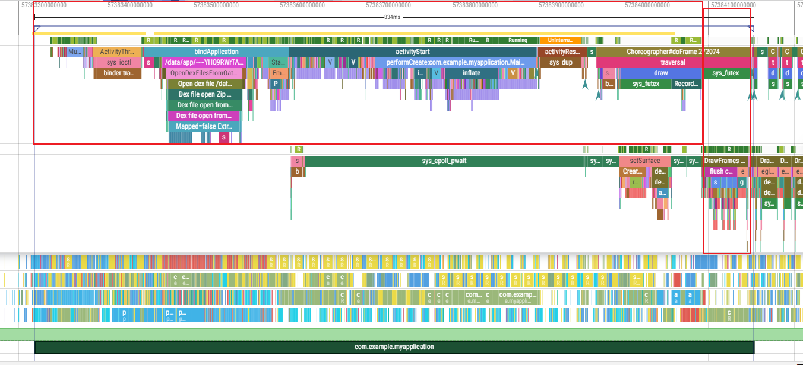
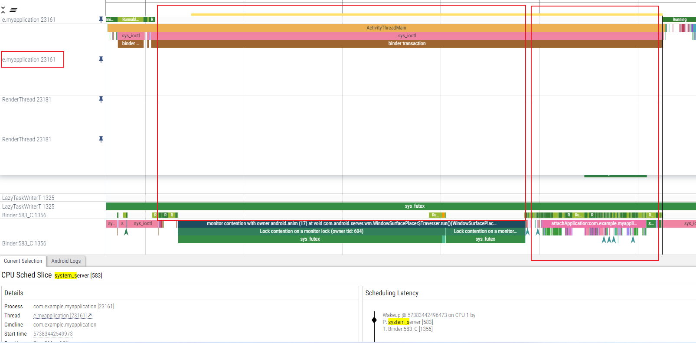
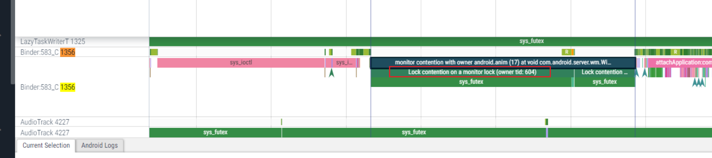
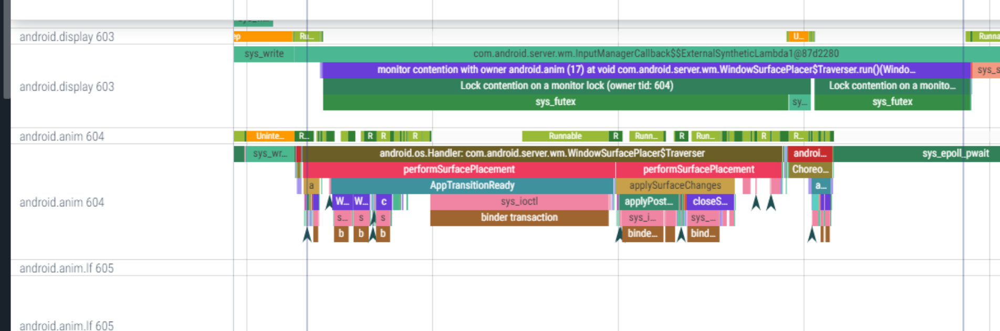
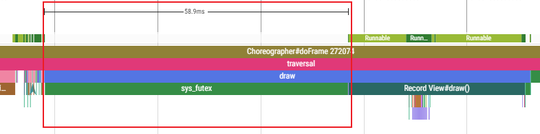
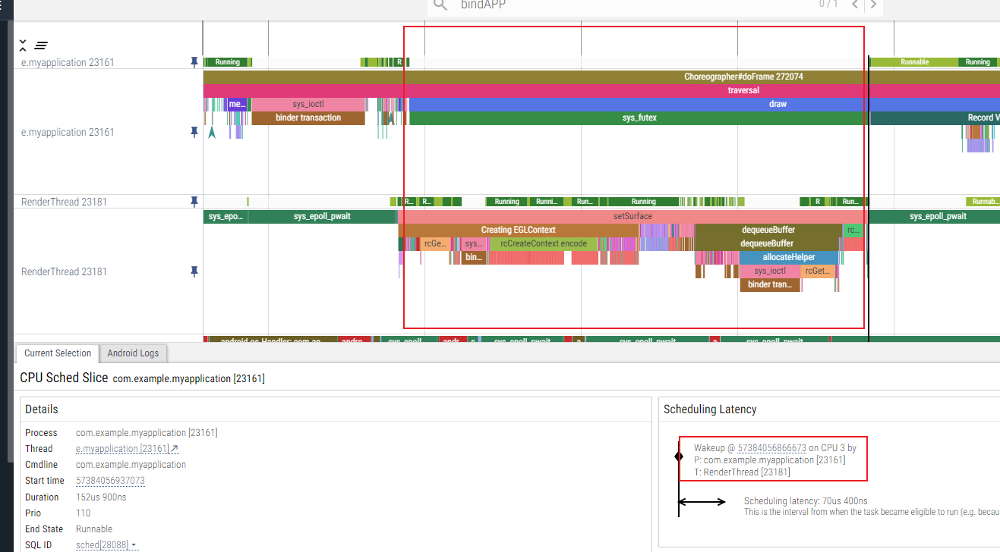
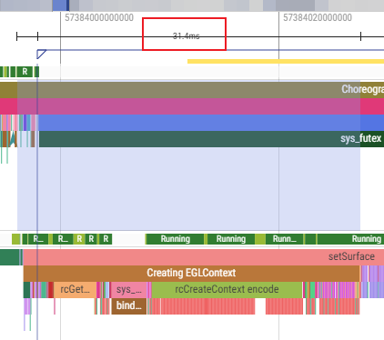
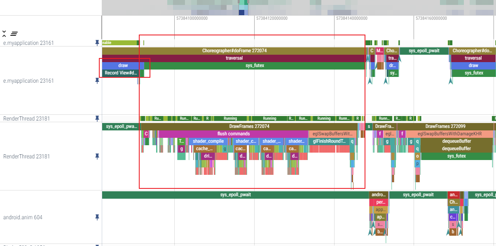
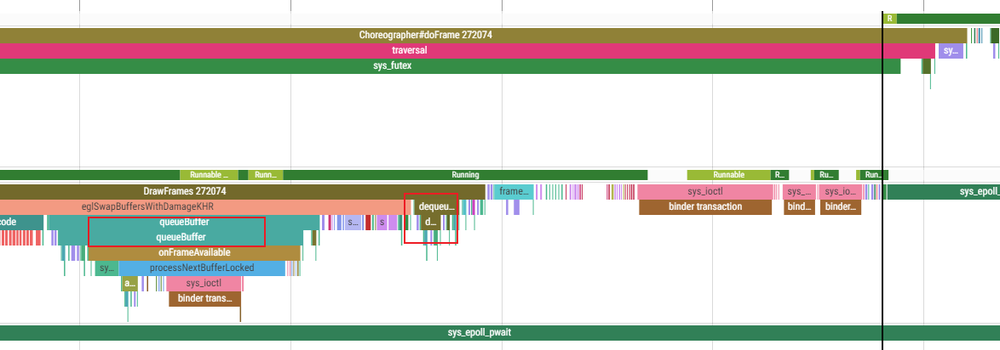

# 目录


# 性能专题

## 疑问

TODO: 如何被认定为性能问题？标准是啥？谁来定？

| wew  | wewe | weewe | ewewe | eweweewewwewe |
| ---- | ---- | ----- | ----- | ------------- |
|      |      |       |       |               |
|      |      |       |       |               |
|      |      |       |       |               |


-<font color='red'>大的思想：</font>

> 一切优化，都是资源配置的更加合理化   

------->  所以，从资源的角度，寻找可以优化的点


## 性能问题之咸鱼上位（优先级反转问题）

例子：

> A线程的优先级高，B线程优先级低，但是B线程先拿到了锁。此时，其他线程（进程？）（自然比B线程优先级高）会占用cpu时间多。
>
> -------------->  即：B  cpu执行分配时间少，执行时间长。导致A高优先级，迟迟拿不到锁，一直等待


总之，场景：

> -<font color='red'>优先级低的</font>，<font color='red'>反而先执行</font> 或者 <font color='red'>分配时间多</font>    （原因：因为1、先持有锁、 2、）
>
> -------->即，<font color='red'>咸鱼上位</font>

 办法：

> 在虚拟机里，把当前持锁的进程优先级提高，占用cpu就高，很快运行完。。。然后外面高优先级的，拿到锁
>
> 为啥是虚拟机做？因为锁  +  控制优先级 都在虚拟机里 


再举例子：

> Binder的优先级反转  TODO

### 时间优化一：不养闲人

不养闲人：即让空闲的人（进程）提前做事

如何快速启动？针对于高频应用，在bindapplication时，甚至`开始startActivity时，就把surface创建起来`

背后的方法论：

> <font color='red'>让空闲的人提前做事。</font>上述优化，即：妻子炒菜，丈夫去买菜------>  优化，妻子提前把炒菜的承载 锅 刷好
>
> 关键词：1、空闲    2、提前

观测工具：

> trace？


TODO：

空进程，在bindApplication之后，在oncreate之前，停止，为什么在这个阶段停止呢？为什么不早一点儿，为什么不晚一点儿？


### 时间优化二： 多养鱼思想

线程池、对象池  --------> 虽然没用到，但是早早地**养起来**

好处：内存不会突然增长；复用思想；**快速，拿来就用**

其他例子：

更高频应用，<font color='red'>没有startactivity</font>，也创建一个surface，然后进程冷冻  ------->  等真正要用的时候，解冻


养鱼 和  提前做 思想的**区别在于**：

> 提前做只是提前，一定会用得到；
>
> 养鱼，很可能用不到


#### 进程冷冻 引起的问题

------>  TODO: 挪到其他章节

冷冻容易，解冻需要考虑的多。比如，冷冻过程，有tranction过来怎么办？Binder的同步调用怎么办？

### 参考：

https://zhuanlan.zhihu.com/p/348548041


## 线程阻塞优化（sleep时间段）：

线程sleep时间段  很多时候，是在等待其他线程完成某件事情

------------>  如果这件事 能够提前完成，就不够成阻塞

### 例：优化APP冷启动------Creating EGLContext提前

从trace出发：

冷启动时间  = 主线程时间  + render线程 DrawFrames 时间



可能优化的sleep的**三个时间段：**

**1、ActivityTreadMain在等待50ms，在等待：**

（1）被system_server唤醒，等待attachApplication:com.example.myapplication  ------->  可以理解

 （2）但是 system_server也有一段空白sleep。。。这段是在干啥呢？  monitor contention with owner android.anim (17) at void com.android.server.wm.WindowSurfacePlacer$Traverser.run()(WindowSurfacePlacer.java:56)

-<font color='red'>Lock contention on a monitor lock (owner tid: 604)</font>    ------>  在等604线程的锁





（3）604是动画线程，现在正在performSurfacePlacement  ------>  



（4）总之：system_server 604 做动画performSurfacePlacement  阻塞了 system_server 1356 binder线程， 主线程又在等待 1356 去 attachAPPlication

TODO： 第一个阻塞，是不是可以优化？为什么要等结果？


**2、（1）draw流程中有个同步调用sys_futex， sleep 60ms，在等待：**



（2）谁阻塞的？ cpu3上的Render线程的setSurface

setSurface是不是一定要在这里呢？可不可以提前呢（优化的方法）




**具体做法：**

> 把Creating EGLContext 提前到 bindAPPlication  （TODO： 其实setSurface本身就可以完全提前）:
>
> 注意：<font color='red'>Creating EGLContext不能有返回值，</font> 尤其在 bindAPPlication 时（否则，还是会阻塞主线程，没有任何收益）
>
> 代码：TODO：


优化结果：30ms



3、sleep时间段三：

主线程draw之后一段空白，这段空白，因为 绘图指令集数据给到了 render线程DrawFrame。render线程在绘制  

--------> （1)<font color='red'> DrawFrame无法提前，</font>因为必须从主线程拿数据到render线程，无法压缩






### Creating EGLContext提前------代码

见《Creating EGLContext提前------代码》


### 线程阻塞优化思想的总结：

找空白sleep时间段------> 看哪个线程阻塞了？<font color='red'>阻塞的事情是不是可以提前做？</font>

-<font color='red'>提前做的事情，不能有返回值（否则还是阻塞）</font>

TODO： 如果有返回值的，如何不阻塞呢？用callback？


### 代码修改

aosp12_28   code:  

/frameworks/base :       commit 5a72b92f67db1cd5db14af7342b374d6c261d


### 例：twoway 改为 oneway

TODO：  具体例子


## 优化大的思想

线程级优化：结构性优化（非代码级别）、sleep阻塞优化

代码级别优化：UI、native侧统一序列化


# CPU与内存的一些认识：

参考：https://www.cnblogs.com/andy-songwei/p/9845771.html     [【朝花夕拾】Android性能篇之（六）Android进程管理机制](https://www.cnblogs.com/andy-songwei/p/9845771.html)

## -<font color='red'>生活化模型：</font>

道路就像内存，车的引擎就像cpu，货物即CPU负载，交警调节交通释放道路( 移除一些等级比较低的进程来回收内存)：

> 1、道路 不会耗油，耗油的是车 --------->  高内存，不会耗电; 耗电的是CPU
>
> 2、道路拥挤（剩余少），交警调节交通需要时间，车子自然跑不快  ----------->  内存少的时候，回收内存需要时间，运行大型程序会卡顿 (高内存，不是卡顿的根因)
>
> 3、道路畅通，车子拉货太重, 车子也跑不快  ---------->  应用开得太多了，手机变慢
>
> ​       占用cpu的进程太多，那无疑cpu总有忙不过来的时候，那肯定就会变慢了


### 关于功耗本质

-<font color='red'>只有变化才可能做功（才发热、消耗能量）</font>。不变化，没有功：

推论：

> （1）CPU ：CPU运算，有变化，有做工
>
> （2）内存：读写内存有变化，有做工
>
> ​                     但是高内存，一直不读写，没有做工，不消耗能量
>
> （3）同样适用于物理世界：道路不会发热。但是车子摩擦道路会热
>
> （4）从这一点，推论：<font color='red'>越发热，算力越强</font>（同一代技术前提下）


证明： https://zhuanlan.zhihu.com/p/47860703


## 高内存，不会耗电

参考：https://www.cnblogs.com/andy-songwei/p/9845771.html

-<font color='red'>cpu运行才耗电（包括CPU读写内存）</font>

-----> 推论：

1、后台进程或者按back键退出变成空进程后，其实已经被暂停了，只保留了运行状态，不会消耗cpu，一个程序会耗电，是因为它需要调用cpu来运算，现在不消耗cpu了，当然就不会耗电了。 

## 高内存，不是卡顿的根因

参考：https://www.cnblogs.com/andy-songwei/p/9845771.html

现象：内存被占用太多，手机卡顿

原因：

> 当剩余内存不多时，打开大型程序，系统会触发自身的进程调度策略，去移除一些等级比较低的进程来<font color='red'>回收内存</font>，以供大型程序运行。而这个进程调度策略在决定哪些进程需要被移除的过程，是一个<font color='red'>十分消耗资源</font>的操作，特别是一个程序<font color='red'>频繁像系统申内存</font>的时候，这样就导致了系统的卡顿。


##  最大限度地提高内存的使用率是好事

参考：https://www.cnblogs.com/andy-songwei/p/9845771.html

>  比如，你的内存是8G，如果每次使用完某个进程就杀掉，那么被使用的内存基本上会始终保持在某个值，比如4G以内，那么内存的使用率就总是保存在50%以内，剩余的4G内存形同虚设，发挥用处的机会非常少。

--------------->  Android独特进程管理设计的好处

其他好处，见 《进程管理》

#    TODO: 一些基本问题

如何衡量-----> status?

如何实现？


# 主要流程大致时间

## APP冷启动时间拆解（大致） TODO：

冷启动时间，大致1s

其中：fork进程 100ms、bindApplication

xml解析，反射创建view

render的时间

表格：

## 手机启动时间拆解 TODO：


## 一帧内 主线程cpu时间 + Render时间

我的车3D  +  哔哩哔哩播放，一帧 19.8ms ，超过了16.6ms（60帧）

结论：

> 1、一般情况下，Render线程比主线程耗时少 。主线程6ms， render线程 2ms
>
> 2、如果Render线程耗时更多  ------->  证明软件UI出了问题，太多复杂，控件叠的多了


## 屏幕旋转时间


# 性能优化之 缓存策略

多养鱼


安卓例子1：

> 见《**无障碍cache**》

安卓例子2：**缓存  parcelable的创建部分:**

> 见《java反射》： 反序列化创建 parcelable，使用到的Creator ----> **缓存Creator** 

安卓例子3：**缓存binder:**

> Q:我记得**context里面缓存过各种系统服务的binder**。缓存binder操作，大概率应该可行对吧？
>
> A ：应该是可行的，但是有一个问题就是不知道服务死没死，如果再去调用一下它看看还是不是正常的，那就达不到省时间的效果了
>
> 如果是同进程（反射可能用到），不会存在这个问题，同死同生


# 性能理念：

1、**要了解大致性能数据：**总体数据 + 关键阶段数据   

> ​        -------->  这样**才知道在哪里优化**、**对各个阶段时间有个大致的比例**（对以后写代码也很有好处，**知道关键在哪里，需要注意啥**）
>
> 比如：冷启动时间、开机时间..............        --------->  见上面《主要流程大致时间》

2、**最好的**优化一定是**<font color='red'>结构上的优化</font>**（不限于性能）：

比如: 

新增一个线程、新增缓存模型   ------------>  **而不是死扣代码写法的一点点优化**

-<font color='red'>人生亦如是：</font>   

开自己公司、带团队、做副业（新增一个线程）     ---------->  **而不是拼命让自己的产出多一点点，眼巴巴让领导给升职加薪**

​                                                                                                 不是死扣拼命节省舍不得花钱


3、**思想**：耗时意味着冗余；冗余意味着耗时


# 关键词大收集

查看displayid：   在display dump中，搜 mDisplayid


#  抛开性能优化

抛开性能优化来看：

> 程序的<font color='red'>性能优化的思想，来源于生活。无一例外。</font>     ----> 所以，记录生活的美好，不问用处
>
> 好的程序思想  -------->  应用于生活
>
> 好的生活中思想 -------> 应用于程序


# 优化工具集合

删减功能

裁剪

优先-------资源倾向：比如优先级设定

提前----------时间上cache

减少重复----------复用、空间上Cache

# 【性能优化】Simpleperf的认识和使用

https://blog.csdn.net/lucky_tom/article/details/126885365

1、火焰图---------->  高频函数  ----------> 优化高频函数

2、trace缺陷：

> 只能看到Trace.Tag级别（比如DrawFrame耗时很长，但是不清楚底层具体哪个函数耗时长），但是**看不到函数级别**
>
> log也是 Tag级别的，哪里加才显示

-----------> 火焰图可以解决


# 性能

https://online.mediatek.com/apps/quickstart/QS00161#QSS03785    eService CR教战手册---Benchmark

https://online.mediatek.com/apps/quickstart/

https://online.mediatek.com/apps/quickstart/QS00254

https://online.mediatek.com/apps/quickstart/QS00288#QSS03479  [Performance 调试宝典](https://online.mediatek.com/apps/quickstart/QS00288)

https://online.mediatek.com/apps/quickstart/  -----> application信息

https://online.mediatek.com/apps/quickstart/QS00038#QSS00306   [深入分析Android native exception框架](https://online.mediatek.com/apps/quickstart/QS00038)               ---》done

https://online.mediatek.com/apps/quickstart/QS00294#QSS03909   trace      ---》done

boost ----> 拉频

---------------------> 查看安卓的设置接口


# 语言级性能

## 使用SparseArray替代HashMap

SparseArray          <int, Object> LongSparseArray      <long, Object> SparseBooleanArray   <int, boolean> SparseIntArray       <int, int> SparseLongArray      <int, long>

https://blog.csdn.net/qq_29078329/article/details/124664172

相比于与HashMap， 优点：

> 避免了装箱拆箱过程，查询、存储等操作效率更高，而且int的存储开销也远小于Integer

规定：

> 尽量用SparseArray   来替代   HashMap

使用：

```
 android.util.SparseLongArray sparseLongArray = new android.util.SparseLongArray(16);
 sparseLongArray.put(10, 100L);
 sparseLongArray.get(10);
 
 
 mclearedSubTree.delete(10);
 mclearedSubTree.get(1, 0L);
 mclearedSubTree.size()

 HashMap<Integer, Long> mclearedSubTree = new HashMap<>();
 mclearedSubTree.delete(10);
 mclearedSubTree.get(1, 0L);
 mclearedSubTree.size()
```

https://m.imooc.com/article/263867

