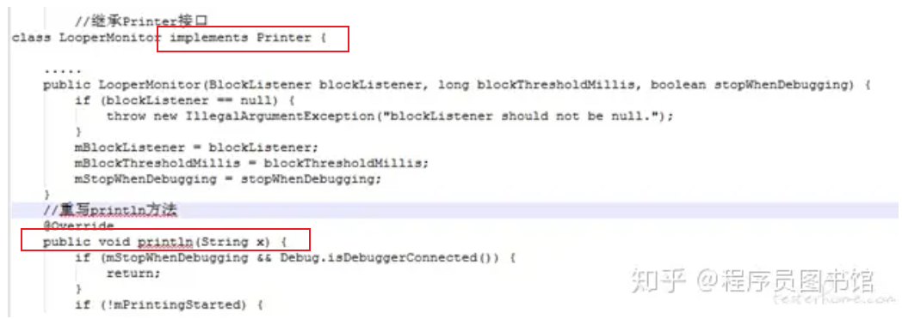

# 目录

# ANR

参考：  ANR问题的产生机制.pdf

## 监控方式一 ANR（安卓系统侧）

目的： ANR ------->  Application Not responding  ------->  响应：希望事情在**一定的时间内**完成

事情的特征： 有一定耗时的， 比如：

> **输入类ANR：**
>
> > InputDispatching Timeout：输入事件分发超时5s，包括按键和触摸事件
>
> **组件类ANR:**
>
> > - Service Timeout：前台服务在20s内未执行完成；
> > - ~~BroadcastQueue Timeout：前台广播在10s内未执行完成~~
> > - ~~ContentProvider Timeout：内容提供者在publish过超时10s;~~

-------------> 都有一个特点： 不可见，却要给用户一个反应！

TODO:

> ANR 与 阻塞是否等价呢？有什么区别与共同点？设计的模型


## 监控方式二：应用自身监控-------WatchDog方式

> 前提：同进程
>
> **APP  同进程监控ANR** --------> WatchDog方式   ：https://blog.csdn.net/qq_30379689/article/details/129056033

原理：

> 应用自己新建 WatchDog 线程 ------> 类似于  系统侧的watchDog

缺点：

> https://blog.csdn.net/qq_30379689/article/details/129056033

## ~~del：监控方式三：应用自身监控-------log时间差~~

参考： https://zhuanlan.zhihu.com/p/119293585?utm_id=0

项目-------BlockCanary：

原理：

> 在主线程的Looper.loop中 dispatchMessage 前和后  ------>  监控时间差    注： 【1】日志安卓原生已经加了
>
> ----------> 从模型角度，**本质：监控一次loop的时间**
>
> TODO:  画个图

因为【1】，自然，**只需要继承  Printer 移花接木**：

> ~~图片： 见  https://zhuanlan.zhihu.com/p/119293585?utm_id=0     //继承Printer接口   class LooperMonitox implements Printer~~
>
> 

优点：

**缺点很明显：**

> 检测不到长久的block： ~~没有启动另一个线程，对于长期block的线程   ------->  没有一次完整的loop，检测不到第二次print ------> 不会有反应~~
>
> -------> **根本原因**：自己的线程检查自己

## ~~del：监控方式四：应用自身监控-------**FileObserver**~~

原理：

> 检测系统侧ANR的结果
>
> https://zhuanlan.zhihu.com/p/119293585?utm_id=0


# Input ANR

流程图：

> 
>
> ~~见《ANR问题的产生机制.pdf》~~
>
> ------------> TODO: 这不是一个好的图，因为方向和方位不对

功能主体：

> InputDispatcher：
>
> InputDispatcher分发的时候，记时间
>
> APP进程分发完毕的时候，**会直接知会给InputDispatcher**  【1】
>
> 超时了，~~执行工作自然交给AMS去处理，报错，弹窗~~

注【1】：

> 如何知会？

TODO:

> https://juejin.cn/post/7010319858118164510#heading-27     常见实例  + 关键字眼

## ANR爆炸现场的保存

system_server会马上去抓取现场的信息：

> 将am_anr信息输出到EventLog，也就是说ANR触发的时间点最接近的就是EventLog中输出的am_anr信息
>
> 收集以下重要进程的各个线程调用栈trace信息，保存在data/anr/traces.txt文件
>
> > 当前发生ANR的进程，system_server进程以及所有persistent进程
> >
> > audioserver, cameraserver, mediaserver, surfaceflinger等重要的native进程
> >
> > CPU使用率排名前5的进程
>
> 将发生ANR的reason以及CPU使用情况信息输出到main log
>
> 将traces文件和CPU使用情况信息保存到dropbox，即data/system/dropbox目录

​                  -----------------------> TODO: 看一下具体的log以及文件

> https://www.jianshu.com/p/f624266c8424     Android 性能优化——ANR监控与解决
>
> https://zhuanlan.zhihu.com/p/654699274  android程序中,产生ANR原因与分析解决
>
> ```java
> CPU usage from 0ms to xxx ms later with xx% awake:
> 
> 14% 1673/system_server: 8% user + 6.7% kernel / faults: 12746 minor
> 13% 30829/tv.danmaku.bili: 7.3% user + 6.2% kernel / faults: 24286 minor
> 6.6% 31147/tv.danmaku.bili:ijkservice: 3.7% user + 2.8% kernel / faults: 11880 minor
> 6% 574/logd: 2.1% user + 3.8% kernel / faults: 64 minor
> ..
> TOTAL: 6.4% user + 8.2% kernel + 0% iowait + 0.6% irq + 0.1% softirq
> 
> CPU usage from xxms to xxxms later
> 73% 1673/system_server: 49% user + 24% kernel / faults: 1695 minor
> 33% 2330/AnrConsumer: 12% user + 21% kernel
> 15% 1683/HeapTaskDaemon: 15% user + 0% kernel
> 9.2% 7013/Binder:1673_12: 6.1% user + 3% kernel
> 6.1% 1685/ReferenceQueueD: 6.1% user + 0% kernel
> 6.1% 2715/HwBinder:1673_5: 6.1% user + 0% kernel
> 3% 2529/PhotonicModulat: 0% user + 3% kernel
> 25% 30829/tv.danmaku.bili: 4.2% user + 21% kernel / faults: 423 minor
> 25% 31050/thread_ad: 4.2% user + 21% kernel
> ...
> ...
> 27% TOTAL: 10% user + 14% kernel + 0.3% iowait + 0.9% irq + 0.3% softirq
> ```

ANR对话框：

> 对用户可感知的进程则弹出ANR对话框告知用户，对用户不可感知的进程发生ANR则直接杀掉


### TODO： dump数据位置

/proc/106/coredump_filter      

包括调用栈

--------> 进程外？系统能力？？？？


## Input ANR的本质模型

图：TODO：   com

与watchDog的本质模型，并没有本质上的差异 ---------> 见watchDog


## 补充 ANR

[深入理解 Android ANR 触发原理以及信息收集过程 - huansky - 博客园 (cnblogs.com)](https://www.cnblogs.com/huansky/p/14954020.html)      https://www.cnblogs.com/huansky/p/14954020.html

[ANR 触发原理 | Agehua (conorlee.top)](https://conorlee.top/2022/08/08/anr-trigger-principle/)   https://conorlee.top/2022/08/08/anr-trigger-principle/

https://juejin.cn/post/6864555867023343623#heading-3           好文

https://github.com/qingmei2/blogs/blob/master/src/反思系列/反思|系列目录.md    好文  反思

https://blog.csdn.net/to_perfect/article/details/128509630


https://blog.csdn.net/rzleilei/article/details/127118071   ----------->  超级好文，尤其图画的好


[失落夏天](https://blog.csdn.net/AA5279AA) 的ANR系列文章：

> 总目录：https://blog.csdn.net/rzleilei/article/details/120720918
>
> 分为三块来讲：
>
> 第一块，讲解ANR发生后，是如何显示的，以及对应的日志文件如何生成的：
>
> > ANR系列之一：ANR显示和日志生成原理讲解_失落夏天的博客-CSDN博客       ------> 好文，尤其图
>
> 第二块，讲四种类型的ANR是如何产生的：
>
> > ANR系列之二：Input类型ANR产生原理讲解       ------> 好文，尤其图
> >
> > ANR系列之三：broadcast类型ANR产生原理讲解
> >
> > ANR系列之四：ContentProvider类型ANR产生原理讲解
> >
> > ANR系列之五：Service类型ANR原理讲解
>
> 第三块，讲如何ANR问题如何进行分析，以及如何建立有效的机制来检测上报ANR类型问题。（未完成）
>
> > ANR系列之六：ANR文件和日志如何分析
> >
> > ANR系列之七：如何建立有效的机制来监控分析ANR问题


# 面试题 Q&A


## ANR 的原因有哪些？

1. 耗时的网络访问
2. 大量的数据读写
3. 数据库操作
4. 硬件操作（比如 Camera）
5. 调用 thread 的 join()方法、sleep()方法、wait()方法或者等待线程锁的时候
6. service binder 的数量达到上限  ---------> **注意！！！！！！**
7. system server 中发生 WatchDog ANR
8. service 忙导致超时无响应
9. 其他线程持有锁，导致主线程等待超时  ---------> **注意！！！！！！**
10. 其它线程终止或崩溃导致主线程一直等待   ---------> **注意！！！！！！**其他线程阻塞呢？


------------------------>  <font color='red'>TODO: 化简！！！！！！</font>

1、阻塞型： 其他线程持有锁，导致主线程等待超时

​                     其他线程阻塞/终止或崩溃导致主线程一直等待

​                    service binder 的数量达到上限 ！！！


2、忙碌型：  I/O、网络


链接：https://www.jianshu.com/p/e47fcc8c1df6


# crash


