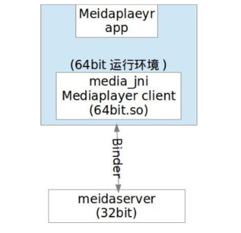
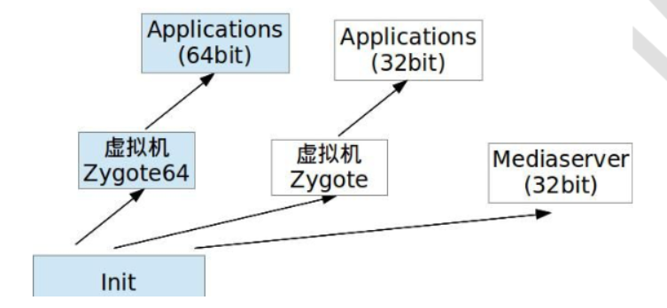

# 目录

[TOC]

# 谁决定了app运行在64bit或32bit的运行环境

## 几个结论：

1、mediaserver进程只有32bit

2、32Bit进程和64bit进程间跟其他进程一样通过binder进行通信

3、app 默认运行在64bit环境（`可以强制改成32bit，见后`），包括：meidaplayer app

## 决定APK运行在32bit还是64bit环境下的规则

https://segmentfault.com/a/1190000014161183

64bit与32bit交互，通过Binder

zygote进程的建立是真正的Android运行空间

## 强制APK底层调用bit32库

见  HowToReadCode.md  《断点调试环境 lib64 、lib 区分》

